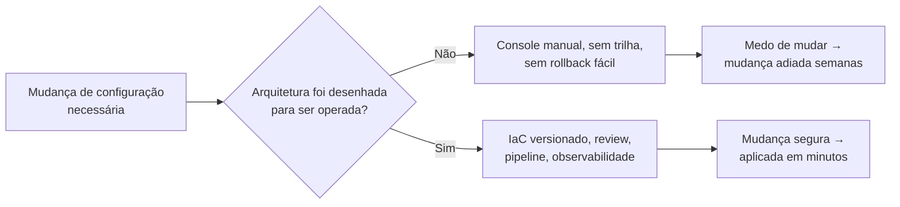
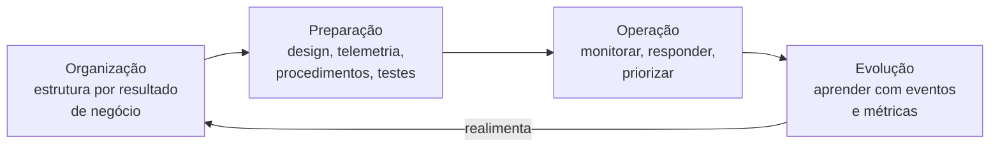
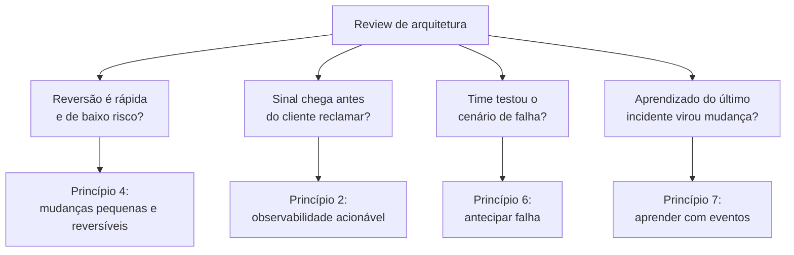
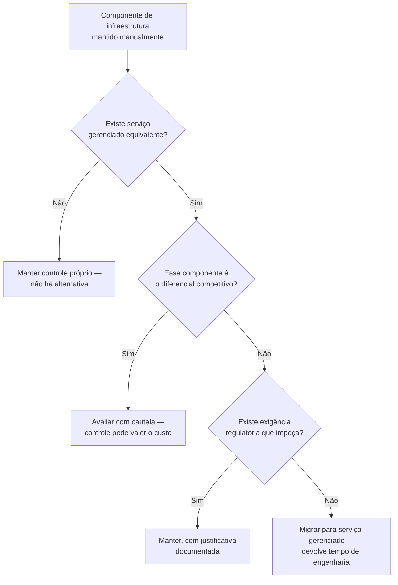

# Excelência operacional

> [!abstract] TL;DR
> Excelência operacional não é "ter um bom time de SRE" — é um **critério de projeto**: a arquitetura em si precisa ser desenhada para ser operada, observada e mudada com segurança, antes de qualquer plantão existir para operá-la. O pilar da AWS parte de oito princípios — organizar times por resultado de negócio, observabilidade acionável, automação segura, mudanças pequenas e reversíveis, refinar procedimentos com frequência, antecipar falha, aprender com todo evento, e usar serviços gerenciados — e os organiza em quatro áreas de prática que se repetem em ciclo: Organização, Preparação, Operação e Evolução. Numa review de arquitetura, "excelência operacional" nunca pergunta "seu time sabe fazer deploy?" — pergunta "se este componente falhar às 3h da manhã, o próprio desenho da arquitetura ajuda ou atrapalha quem estiver de plantão?".

## A mudança que ninguém queria fazer

Um serviço crítico precisa de uma correção simples: um parâmetro de configuração errado, identificado havia semanas, mas nunca corrigido. Por quê? Porque a única forma de aplicar a mudança é entrar manualmente no console do provedor, editar o valor numa instância de produção, e reiniciar o processo — sem trilha de auditoria clara sobre quem mudou o quê, sem forma automática de reverter se algo quebrar, e sem ambiente de teste que reproduza fielmente a produção. O engenheiro responsável sabe exatamente qual é o problema e exatamente qual é a correção. O que falta não é conhecimento técnico — é **confiança de que a mudança pode ser feita, observada e revertida com segurança**. Então a correção fica na fila, atrás de tarefas menos importantes mas menos assustadoras, semana após semana.

Esse é o sintoma clássico de uma arquitetura que não foi desenhada para ser operada. Não é falta de disciplina do time — é ausência de infraestrutura que torna mudança segura o caminho mais fácil, e não o mais arriscado. Um sistema de excelência operacional real resolveria isso de um jeito completamente diferente: a mudança de configuração viraria uma linha em um arquivo versionado, revisada por outro engenheiro, aplicada por um pipeline automatizado, visível num diff, reversível com um `git revert`, e acompanhada por um dashboard que mostra, em segundos, se o comportamento do sistema mudou como esperado depois do deploy. A correção que ficou parada por semanas levaria minutos — não porque o time ficou mais corajoso, mas porque a arquitetura parou de exigir coragem para ser mudada.

É essa distinção — arquitetura que **precisa** de heroísmo operacional versus arquitetura que **dispensa** heroísmo operacional — que o pilar de excelência operacional do AWS Well-Architected Framework tenta capturar como critério avaliável, e é o assunto desta nota.

O sintoma visível ("a correção fica na fila") quase nunca aponta direto para a causa raiz ("a arquitetura não foi desenhada para ser mudada"). Vale a pena treinar o olho para essa tradução, porque é ela que uma review de arquitetura faz o tempo todo:

| Sintoma visível | Causa raiz provável | Princípio que endereça |
|---|---|---|
| "A correção está na fila há semanas" | Mudar em produção exige coragem, não é um caminho seguro por padrão | 4 — mudanças pequenas e reversíveis |
| "Só o fulano sabe resolver isso" | Conhecimento de operação nunca foi capturado fora da cabeça de uma pessoa | 5 e 7 — refinar procedimento, aprender com eventos |
| "Só descobrimos que caiu quando o cliente reclamou" | Telemetria existe, mas não gera sinal acionável | 2 — observabilidade acionável |
| "Ninguém sabe o que aconteceria se X caísse" | Falha nunca foi simulada deliberadamente | 6 — antecipar falha |
| "A gente sempre faz assim, mesmo dando trabalho" | Ninguém parou para checar se existe uma alternativa gerenciada | 8 — usar serviços gerenciados |
| "Time de banco não sabia que a query lenta afetava o checkout" | Time organizado por camada técnica, não por resultado de negócio | 1 — organizar por resultado de negócio |

Guarde essa tabela como um hábito de leitura: qualquer frase que comece com "a gente sempre..." ou "só o fulano..." num relato de incidente é, quase sempre, um sintoma com causa raiz mapeável a um destes princípios.

Vale grifar o padrão: nenhum desses sintomas se resolve com mais esforço da mesma natureza que já existe — mais horas de plantão, mais reunião, mais aviso verbal. Cada um pede uma mudança específica no **desenho** do sistema, o que é exatamente a definição de "critério de arquitetura" com que esta nota abriu.



## O que o pilar realmente pergunta

Antes de entrar nos princípios, vale reafirmar o que a nota 01 desta trilha já estabeleceu: um pilar do Well-Architected Framework não é um checklist de conformidade — é um conjunto de **perguntas** que uma review de arquitetura faz, e a excelência operacional formula as suas em torno de um objetivo específico: colocar funcionalidade nova e correção de bug na mão do cliente, de forma rápida e confiável, e continuar fazendo isso conforme o sistema evolui. O documento oficial da AWS define excelência operacional como "um compromisso de construir software corretamente enquanto se entrega, de forma consistente, uma ótima experiência para o cliente" — e organiza esse compromisso em quatro áreas de prática que se repetem em ciclo, não em sequência única:

- **Organização** — como o time se estrutura e prioriza em torno dos resultados de negócio que o workload precisa entregar.
- **Preparação** — o que precisa estar pronto (design, telemetria, procedimentos, ambientes de teste) antes de uma mudança ir para produção.
- **Operação** — como o dia a dia de rodar o sistema em produção é conduzido: monitorar saúde, responder a eventos, gerenciar e priorizar o trabalho operacional.
- **Evolução** — como aprender com o que aconteceu (sucessos e falhas) e alimentar esse aprendizado de volta no design, nos procedimentos e na organização.

Vale marcar, de saída, o que uma review de excelência operacional **não** é — porque a confusão mais comum é achar que ela avalia processo de time, quando na verdade avalia o desenho do sistema:

| Isso não é excelência operacional | Isso é excelência operacional |
|---|---|
| Ter uma reunião diária de status | O sistema expor sinal suficiente para que a reunião nem precise existir para saber se algo está errado |
| Ter um documento de processo de deploy | O deploy em si ser pequeno, automatizado e reversível — o documento descreve, não substitui, o desenho |
| Contratar mais gente pro time de operação | A arquitetura reduzir a quantidade de trabalho manual que precisa de gente para existir |
| Ter certificação ou ferramenta de monitoramento instalada | Os dados dessa ferramenta chegarem a alguém a tempo de agir, de forma consistente |

Repare que essas quatro áreas formam um ciclo, não uma linha reta: o que se aprende na fase de Evolução realimenta a Organização e a Preparação da próxima rodada de mudanças. É a mesma lógica de melhoria contínua que aparece em qualquer disciplina madura de engenharia — só que aqui ela é tratada como parte do **desenho da arquitetura**, não como um processo à parte que existe fora dela.

| Área | Pergunta central que a review faz |
|---|---|
| Organização | O time entende os resultados de negócio que este workload precisa entregar, e está estruturado para persegui-los? |
| Preparação | Antes de uma mudança ir para produção, o design, a telemetria, os procedimentos e os ambientes de teste já estão prontos para recebê-la com segurança? |
| Operação | O dia a dia de produção — monitorar saúde, responder a evento, priorizar trabalho operacional — é conduzido de forma previsível, ou depende de heroísmo individual? |
| Evolução | O que aconteceu (sucesso ou falha) virou aprendizado registrado, e esse aprendizado voltou a mudar o design, o procedimento ou a organização? |



O diagrama deixa explícito o que a prosa só sugere: não existe ponto de chegada. Uma arquitetura "operacionalmente excelente" numa auditoria de hoje pode deixar de ser em seis meses, se o ciclo parar de girar — se o aprendizado da fase de Evolução nunca voltar a mudar como o time se organiza ou o que ele prepara antes do próximo deploy.

## Os oito princípios de design

O whitepaper oficial lista oito princípios de design para excelência operacional na nuvem. Vale ler cada um não como uma frase de efeito, mas como uma pergunta implícita que uma review de arquitetura faz sobre o seu sistema.

**1. Organizar times em torno de resultados de negócio.** A pergunta por trás: o time que opera este componente entende *por que* ele existe, ou só sabe *como* mantê-lo rodando? Um time organizado por resultado de negócio (ex.: "time de checkout", que é dono do fluxo de compra de ponta a ponta) toma decisões operacionais melhores do que um time organizado por camada técnica (ex.: "time de banco de dados", que não vê o impacto de negócio de uma query lenta) — porque o primeiro sabe medir se a mudança que fez ajudou ou atrapalhou o objetivo real.

**2. Implementar observabilidade para insight acionável.** A pergunta: se este componente começar a se comportar mal, alguém vai saber **antes** do cliente reclamar, e vai saber **o suficiente** para agir — não só que "algo está errado", mas o quê, onde, e provavelmente por quê? Observabilidade aqui não é "ter um dashboard" — é ter telemetria desenhada para responder às perguntas operacionais certas, não só as que são fáceis de medir.

**3. Automatizar com segurança sempre que possível.** A pergunta: as operações rotineiras deste sistema (deploy, escala, resposta a um tipo conhecido de falha) dependem de uma pessoa lembrar de fazer a coisa certa, ou o sistema faz sozinho, com guardrails (limites de taxa, thresholds de erro, aprovações onde fazem sentido)? Automação aqui não é "eliminar humanos da operação" — é eliminar a dependência de memória humana para tarefas repetitivas, para que o julgamento humano fique reservado para o que realmente precisa dele.

**4. Fazer mudanças frequentes, pequenas e reversíveis.** A pergunta: se este deploy quebrar algo, o raio de impacto é pequeno e a reversão é rápida — ou uma mudança ruim vira um incidente de horas porque o deploy empacotou três semanas de trabalho de uma vez? Esse princípio é o motivo técnico por trás de uma prática que a trilha Operação já cobre em detalhe: deploys incrementais, com blast radius controlado, batem sistematicamente deploys grandes e raros em confiabilidade percebida.

**5. Refinar procedimentos operacionais com frequência.** A pergunta: o runbook que o time usa para responder a um incidente foi escrito uma vez, há dois anos, e nunca mais revisado — ou existe um hábito real de revisar procedimentos à luz do que realmente aconteceu na última vez que foram usados? Procedimento que não evolui vira ficção documentada.

**6. Antecipar falha.** A pergunta: o time sabe, com alguma confiança, o que acontece quando uma dependência específica cai — ou essa é a primeira vez que alguém vai descobrir, ao vivo, em produção? Antecipar falha significa simular cenários de falha deliberadamente, antes que eles aconteçam por acidente, para entender o comportamento real do sistema sob estresse.

**7. Aprender com todos os eventos e métricas operacionais.** A pergunta: quando algo dá errado (ou dá certo de um jeito inesperado), esse aprendizado vira conhecimento compartilhado pela organização, ou fica só na cabeça de quem estava de plantão naquela noite? Esse princípio é a base conceitual do que a trilha Operação chama de postmortem sem culpa — aqui ele aparece como *critério de arquitetura*: o sistema expõe dados suficientes (logs, métricas, traces) para que o aprendizado seja possível, ou o incidente vira uma história contada de memória, sem evidência?

**8. Usar serviços gerenciados.** A pergunta: o time está gastando esforço de engenharia mantendo algo que um serviço gerenciado do provedor já resolve — patch de sistema operacional, replicação de banco, escala de fila — quando esse esforço poderia estar indo para o diferencial real do produto? Esse princípio conecta diretamente com a nota 02 do galho 1 desta trilha, sobre elasticidade e o custo de "heavy lifting indiferenciado": manter você mesmo o que o provedor já opera bem é, quase sempre, o uso menos produtivo do tempo de um time de engenharia.

> [!info] Caducidade
> A lista de oito princípios reflete a revisão do whitepaper "Operational Excellence Pillar" publicada pela AWS em 6 de novembro de 2024. O framework é revisado periodicamente; confira a documentação oficial antes de citar a lista como definitiva num contexto formal (ex.: certificação).

Resumida em forma de tabela — útil como referência rápida durante uma review, depois de ter lido a explicação de cada princípio acima:

| Princípio | O que a review pergunta | Sintoma de violação |
|---|---|---|
| 1. Organizar por resultado de negócio | O time entende *por que* o componente existe, não só *como* mantê-lo rodando? | Time de banco de dados otimiza query sem saber que impacto de negócio ela tem |
| 2. Observabilidade para insight acionável | Alguém sabe do problema antes do cliente reclamar, com detalhe suficiente para agir? | Dashboard existe, mas ninguém foi notificado até o volume de tickets subir |
| 3. Automatizar com segurança | A operação rotineira roda sozinha, com guardrails, ou depende de alguém lembrar? | Deploy manual via console, sem trilha de auditoria nem rollback automático |
| 4. Mudanças pequenas, frequentes e reversíveis | Se o deploy quebrar, o raio de impacto é pequeno e a reversão é rápida? | Deploy quinzenal que empacota semanas de mudanças de vários times |
| 5. Refinar procedimentos com frequência | O runbook é revisado à luz do que realmente aconteceu na última vez? | Runbook escrito uma vez, há anos, nunca atualizado |
| 6. Antecipar falha | O time sabe, com alguma confiança, o que acontece quando uma dependência cai? | Cenário de falha só é descoberto ao vivo, em produção |
| 7. Aprender com eventos e métricas | O aprendizado de um incidente vira conhecimento compartilhado? | Só quem estava de plantão naquela noite sabe o que aconteceu |
| 8. Usar serviços gerenciados | O time gasta esforço mantendo algo que o provedor já resolve? | Equipe de engenharia mantém patch de SO e replicação de banco à mão |

## Como isso aparece numa review de arquitetura

Uma review de arquitetura real não pede para o time recitar os oito princípios — ela faz perguntas concretas sobre o desenho do sistema, e cada pergunta rastreia até um ou mais princípios. Vale um exemplo trabalhado, porque é assim que o pilar realmente é usado.

Imagine que o sistema em revisão é uma API de processamento de pedidos. Um revisor experiente, aplicando a lente de excelência operacional, não pergunta "vocês têm CI/CD?" como pergunta binária de sim/não — pergunta coisas como:

- "Se uma mudança de configuração precisar ser revertida às 3h da manhã, quanto tempo leva, e quantas pessoas precisam estar acordadas para fazer isso acontecer?" (mudanças pequenas e reversíveis, automação segura)
- "Quando a taxa de erro deste endpoint sobe 5%, existe um sinal que chega a alguém antes que o volume de tickets de suporte chegue primeiro?" (observabilidade acionável)
- "Da última vez que a dependência de pagamento externa ficou indisponível por 10 minutos, o que o sistema fez — e o que o time aprendeu disso que mudou o design?" (antecipar falha, aprender com eventos)
- "Quem é dono desta fila de mensagens — alguém que entende o impacto de negócio de uma mensagem perdida, ou só quem configurou o serviço originalmente?" (organizar por resultado de negócio)
- "Este componente de infraestrutura que o time mantém manualmente hoje — existe uma versão gerenciada dele no provedor, e se existe, o que justifica não usá-la?" (usar serviços gerenciados)
- "Se o volume deste serviço dobrar amanhã sem aviso, alguém precisa acordar de madrugada para configurar algo manualmente, ou o sistema absorve isso sozinho, dentro de limites conhecidos?" (automação segura, antecipar falha)

Nenhuma dessas perguntas tem uma resposta técnica isolada — cada uma exige que a arquitetura já tenha sido desenhada, de antemão, para que a resposta exista. Um sistema que só tem "sim, fazemos deploy automatizado" como resposta pronta, mas nenhuma resposta para "quanto tempo leva reverter", passou no teste errado — o pilar não está interessado em saber se existe automação; está interessado em saber se a automação reduz o tempo entre "algo deu errado" e "voltamos ao normal".



## Operar bem: da crença ingênua à prática madura

A maior parte das arquiteturas que reprovam numa review de excelência operacional não reprova por falta de esforço — reprova porque o time acredita, de boa-fé, em uma versão simplificada demais do que "operar bem" significa. Vale nomear essas crenças de frente, porque cada uma tem uma versão madura correspondente, e é a distância entre as duas que o pilar mede.

| Crença ingênua | Prática madura |
|---|---|
| "Temos monitoramento" (um agente de métricas instalado) | Temos telemetria desenhada para responder à pergunta operacional certa, e alguém é notificado a tempo de agir |
| "Fazemos deploy automatizado" | Sabemos, com número, quanto tempo leva reverter um deploy ruim e quantas pessoas isso exige |
| "O time sabe o que fazer em incidente" | O procedimento está escrito, testado e acessível para qualquer pessoa de plantão — não só para quem "já viu isso antes" |
| "Testamos antes de ir pra produção" | Simulamos deliberadamente cenários de falha de dependência, não só o caminho feliz |
| "Documentamos o pós-morte" | O aprendizado do pós-morte virou mudança rastreável no design, no procedimento ou na organização do time |
| "Operação é problema do time de operação" | Operação é responsabilidade compartilhada desde o desenho — quem escreve o código também é dono de como ele se comporta em produção |

| Área | Sinal de imaturidade | Sinal de maturidade |
|---|---|---|
| Organização | Time organizado por camada técnica, sem visibilidade do impacto de negócio | Time dono de um resultado de negócio de ponta a ponta |
| Preparação | Ambiente de teste que não reflete produção com fidelidade | Mudança testada contra um ambiente próximo o suficiente para gerar confiança real |
| Operação | Resposta a incidente depende de uma pessoa específica estar disponível | Qualquer pessoa de plantão consegue seguir um procedimento documentado |
| Evolução | Postmortem escrito e arquivado, sem ação de mudança associada | Ação de mudança do postmortem rastreável até um commit ou uma decisão de design |

A coluna da esquerda não é mentira — é, quase sempre, um primeiro passo real que o time deu. O problema é parar nele e tratá-lo como destino: "temos monitoramento" vira resposta pronta numa review, quando a pergunta que importa é outra, mais específica e mais desconfortável de responder sem preparo prévio.

## O que muda de verdade quando a nuvem entra na conta

Vale marcar uma diferença específica em relação a operar hardware próprio, porque é aqui que "excelência operacional" ganha um sentido diferente do que tinha antes da nuvem existir como opção séria. Em infraestrutura própria, boa parte do trabalho operacional era, necessariamente, trabalho de baixo nível: substituir disco com falha, aplicar patch de firmware, gerenciar capacidade física com meses de antecedência porque comprar e instalar hardware novo levava semanas. Esse trabalho consumia uma fatia enorme do tempo operacional de qualquer time de infraestrutura séria, e boa parte dele não diferenciava o produto de ninguém — dois times concorrentes, cuidando dos mesmos discos com falha, não estavam competindo em nada que importasse para o cliente final.

O que a nuvem muda — e é isso que o princípio "usar serviços gerenciados" está apontando — não é que operação deixou de importar. É que a fatia de operação que exige atenção humana se desloca: some o trabalho de baixo nível que o provedor já resolve em escala (hardware, virtualização, patch de infraestrutura física), e sobra — com mais tempo disponível para receber atenção real — o trabalho de alto nível que só o próprio time pode fazer: desenhar boa observabilidade para *este* sistema específico, decidir o tamanho certo de um deploy, entender o que realmente falha na *sua* arquitetura, treinar as pessoas certas para responder ao incidente certo. A promessa da excelência operacional na nuvem não é "trabalhar menos" — é "trabalhar no que só você pode fazer, porque o provedor já está fazendo o resto".

Essa realocação de esforço é, provavelmente, o ganho mais subestimado da nuvem — mais subestimado até do que a elasticidade de capacidade, que costuma levar o crédito principal nas conversas sobre "por que migrar".

E é um ganho que só se realiza se o time efetivamente redireciona o tempo liberado para o trabalho de alto nível — se ele simplesmente sobra ocioso, ou é absorvido por mais um projeto de baixo valor, a promessa do princípio 8 fica só na intenção.

A tabela abaixo torna esse deslocamento concreto, camada por camada, para um banco de dados relacional — o mesmo raciocínio se aplica a fila de mensagens, cache, ou qualquer outro componente com equivalente gerenciado:

| Camada operacional | Autogerenciado (você opera) | Serviço gerenciado (provedor opera) |
|---|---|---|
| Patch de sistema operacional e do motor do banco | Seu time agenda janela, testa, aplica | Provedor aplica, com opção de janela de manutenção |
| Backup e teste de restauração | Seu time escreve script, agenda, valida | Automatizado; teste de restauração ainda é responsabilidade sua |
| Failover em caso de falha do nó primário | Seu time detecta e promove réplica manualmente (ou escreve automação própria) | Automático, orquestrado pelo provedor |
| Escala vertical/horizontal | Seu time provisiona, migra dados, replaneja capacidade | Configuração declarativa; execução é do provedor |
| Decidir o modelo de dados e os índices certos para *esta* aplicação | Seu time — sempre | Seu time — sempre (isso nenhum serviço gerenciado decide por você) |

A última linha é o ponto mais importante da tabela: serviço gerenciado desloca *operação de infraestrutura genérica*, não desloca *decisão de arquitetura específica do seu domínio*. Isso é trabalho que continua sendo seu, gerenciado ou não.

> [!info] Ponte com a trilha Operação
> Esta nota trata excelência operacional como **critério de arquitetura** — as perguntas que uma review faz sobre o desenho de um sistema. A prática do dia a dia que responde a essas perguntas — SLO e error budget, estratégias de deploy (blue-green, canary, rolling), resposta a incidentes, postmortem sem culpa, GitOps — já tem casa própria e detalhada no vault: [[03-Dominios/Engenharia/Operação/index|Operação (DevOps/SRE)]]. Se você chegou aqui querendo aprender *como* fazer um canary deploy ou *como* escrever um postmortem, é lá que essa mecânica é ensinada; aqui, o pilar só estabelece *por que* essas práticas são o critério pelo qual uma arquitetura é julgada madura ou não.

## Encarnação nos provedores: onde o pilar vira ferramenta

O pilar em si é provider-neutro — as perguntas que ele faz valem para qualquer arquitetura, em qualquer nuvem, e até fora da nuvem. Mas os dois provedores desta trilha oferecem ferramentas concretas que existem, em boa parte, exatamente para responder às perguntas que a excelência operacional levanta.

Em **AWS**, a ferramenta mais diretamente ligada ao pilar é o próprio **AWS Well-Architected Tool** — um serviço gratuito, disponível no console, que guia um time por um questionário estruturado alinhado aos seis pilares e gera um plano de melhoria com os riscos identificados. Para infraestrutura como código — o princípio "mudanças pequenas e reversíveis" começa aqui — a AWS oferece o **CloudFormation** (nativo) e integra bem com **Terraform**, ferramenta open-source amplamente usada tanto em AWS quanto em outros provedores. Para observabilidade, o par nativo é **CloudWatch** (métricas e logs) e **X-Ray** (tracing distribuído).

Vale entender como a saída de uma review no AWS Well-Architected Tool realmente parece, porque o formato ensina algo sobre o que o pilar valoriza. O questionário não devolve uma nota única — ele classifica cada resposta problemática como **HRI** (*High-Risk Issue*, um risco que pode causar uma interrupção séria, um evento de segurança ou desperdício relevante) ou **MRI** (*Medium-Risk Issue*, impacto real mas de urgência menor), e organiza os HRIs num plano de melhoria com dono e prazo. O time salva um **milestone** — um retrato daquele momento — antes de começar a corrigir, e salva outro depois, para comparar objetivamente se o número de HRIs caiu. É o princípio 5 (refinar procedimentos com frequência) e o princípio 7 (aprender com eventos) encarnados em formato de ferramenta: a review não é um evento único, é um ciclo com estado salvo entre uma rodada e outra.

Em **DigitalOcean**, a filosofia é a mesma, com catálogo mais enxuto: infraestrutura como código costuma passar pelo **Terraform** (a DigitalOcean mantém um provider oficial), e observabilidade nativa vem do **DigitalOcean Monitoring**, com métricas e alertas integrados ao painel de cada recurso — mais simples que CloudWatch, mas cobrindo o mesmo território conceitual: saber o estado do sistema sem depender de alguém olhar manualmente.

| Conceito | AWS | Azure | GCP | DigitalOcean |
|---|---|---|---|---|
| Questionário guiado de arquitetura | AWS Well-Architected Tool (self-service, gratuito, no console) | Azure Well-Architected Review (self-service, assessment guiado) | Sem questionário self-service equivalente — a Google Cloud Architecture Framework Review é conduzida por Google/parceiro, não uma ferramenta de console | — (sem ferramenta equivalente nativa) |
| Infraestrutura como código nativa | CloudFormation | Bicep / ARM Templates | Infrastructure Manager (baseado em Terraform) | — (Terraform é o caminho padrão) |
| Observabilidade nativa | CloudWatch + X-Ray | Azure Monitor + Application Insights | Cloud Monitoring + Cloud Trace | DigitalOcean Monitoring |

> [!info] Caducidade
> Nomes de produto e ferramentas verificados em 2026-07-20. Confira a documentação oficial de cada provedor antes de tomar decisão de arquitetura com base nesta tabela — nomes e ofertas de observabilidade e IaC mudam com frequência. O Google Cloud Deployment Manager encerrou o suporte em 31 de março de 2026 — a rota nativa de IaC no GCP hoje é o Infrastructure Manager, que roda Terraform por baixo.

## Casos práticos

**O deploy que ninguém tinha coragem de reverter.** Um sistema de e-commerce tem um processo de deploy que empacota, em média, duas semanas de mudanças de vários times diferentes numa janela única, às sextas à noite (para "não atrapalhar o horário comercial"). Quando algo dá errado depois do deploy — o que acontece com frequência incômoda, porque duas semanas de mudanças interagem de formas imprevisíveis — reverter significa desfazer o trabalho de várias equipes de uma vez, o que ninguém quer fazer sozinho às 22h de sexta. O time aprende, depois de meses desse padrão, a aplicar o princípio 4 diretamente: quebrar o deploy monolítico em deploys menores, por serviço, disparados por cada time de forma independente e frequente (várias vezes por dia, não uma vez por duas semanas). O efeito colateral mais valioso não é a velocidade — é que reverter um deploy pequeno, de um serviço, feito há vinte minutos, deixa de ser um evento assustador e vira uma operação rotineira.

A mudança de arquitetura por trás disso, na prática, é modesta em tamanho de código — o ganho vem de tornar a mudança **declarativa e reversível por design**, não de escrever muito Terraform. Um trecho como este, isolado num arquivo versionado, é o tipo de mudança que o princípio 4 elogia: pequena, revisável num diff, e reversível com um `terraform apply` do estado anterior.

```hcl
# ajuste de capacidade — uma linha, um PR, um diff legível
resource "aws_autoscaling_group" "checkout_api" {
  name                = "checkout-api-asg"
  min_size            = 2
  max_size            = 6
  desired_capacity    = 4          # era 3 — aumento incremental, não um redesenho
  vpc_zone_identifier = var.private_subnet_ids
  target_group_arns   = [aws_lb_target_group.checkout_api.arn]

  tag {
    key                 = "workload"
    value               = "checkout-api"
    propagate_at_launch = true
  }
}
```

O ponto do exemplo não é o Terraform em si — é que a mudança inteira cabe num pull request pequeno, com revisor, com histórico no `git log`, e reversível com `git revert` seguido de `terraform apply`. Comparado ao console manual do início desta nota, a diferença não é técnica — é de **confiança**: ninguém precisa se lembrar de nada para desfazer isso.

> [!info] Sobre o exemplo em Terraform
> Este snippet ilustra o *princípio* — mudança pequena, declarativa, reversível — não é um tutorial de infraestrutura como código. Sintaxe, módulos, gerenciamento de estado remoto e pipeline de `plan`/`apply` têm casa própria no galho de IaC desta trilha.

**A métrica que existia, mas ninguém olhava até o incidente acontecer.** Um serviço interno registra logs detalhados de erro havia anos, mas ninguém configurou um alerta que dispare quando a taxa de erro passa de um limite aceitável — os logs existem, mas só são consultados *depois* que alguém de fora do time já percebeu o problema. Aplicar o princípio 2 (observabilidade para insight acionável) aqui não significa coletar mais dados — significa transformar dados que já existem em sinal que chega a alguém antes do cliente. A mudança de arquitetura é pequena (configurar um alerta sobre uma métrica que já era coletada); o efeito prático é que o tempo entre "algo quebrou" e "alguém sabe" cai de horas (até um ticket de suporte chegar) para minutos.

Ilustrando o tamanho real dessa mudança: transformar um log que já existe em sinal acionável costuma caber num único comando, do lado de quem já paga pela coleta dos dados.

```bash
# AWS — alarme sobre uma métrica que o CloudWatch já coleta
aws cloudwatch put-metric-alarm \
  --alarm-name checkout-api-error-rate \
  --alarm-description "Taxa de erro do checkout acima do aceitável" \
  --metric-name 5XXError \
  --namespace AWS/ApplicationELB \
  --statistic Average \
  --period 300 \
  --threshold 5 \
  --comparison-operator GreaterThanThreshold \
  --evaluation-periods 2 \
  --alarm-actions arn:aws:sns:us-east-1:123456789012:oncall-alerts
```

```bash
# DigitalOcean — mesmo princípio, sobre uma métrica que o Monitoring já coleta
doctl monitoring alert create \
  --type "v1/insights/droplet/memory_utilization_percent" \
  --compare GreaterThan --value 80 --window 5m \
  --entities 386734086,191669331 --emails oncall@example.com
```

**O runbook que só existia na cabeça de uma pessoa.** Um procedimento de recuperação para um tipo específico de falha de banco de dados nunca foi escrito — funcionava porque uma única pessoa sênior do time sabia exatamente o que fazer, de memória, toda vez que acontecia. Quando essa pessoa sai de férias durante um incidente real, o tempo de recuperação mais que triplica, porque o resto do time reconstrói o procedimento por tentativa e erro. O princípio 5 (refinar procedimentos com frequência) pressupõe que o procedimento existe documentado, em primeiro lugar — e o princípio 7 (aprender com eventos) é exatamente o que devolve, depois desse incidente, um runbook escrito, testado e acessível para qualquer pessoa do plantão, não só para quem "já viu isso antes".

Um runbook "que existe na cabeça de uma pessoa" não tem forma; um runbook maduro tem estrutura, e pode viver versionado no mesmo repositório do serviço, revisado no mesmo pull request que muda o código. O ponto de um runbook-como-código não é executá-lo automaticamente (isso é orquestração, um passo além) — é torná-lo revisável, testável e passível de diff, como qualquer outro artefato de engenharia:

```yaml
# runbook.yaml — versionado junto com o serviço, revisado em PR
incidente: "Falha de conexão com o banco primário"
sintoma: "Taxa de erro 5xx sobe acima de 5% no endpoint /checkout"
passos:
  - descricao: "Confirmar se é falha de conexão, não de query lenta"
    verificar: "grep 'connection refused' /var/log/checkout-api/*.log"
  - descricao: "Checar se o failover automático para a réplica já ocorreu"
    verificar: "aws rds describe-db-instances --db-instance-identifier checkout-db --query 'DBInstances[0].StatusInfos'"
  - descricao: "Se não houve failover automático, promover a réplica manualmente"
    executar: "aws rds promote-read-replica --db-instance-identifier checkout-db-replica"
  - descricao: "Confirmar recuperação: taxa de erro volta abaixo de 1% em 5 minutos"
    verificar: "consultar o alarme checkout-api-error-rate no CloudWatch"
ultima_revisao: "2026-06-02, após incidente INC-4471"
```

O detalhe que faz esse runbook diferente do que ficava só na cabeça de uma pessoa é o campo `ultima_revisao`: ele existe porque alguém reviu o procedimento depois de um incidente real e atualizou o arquivo — exatamente o princípio 5 em forma de commit.

**O time que mantinha um banco de dados "porque sempre foi assim".** Uma equipe de plataforma dedica, historicamente, cerca de um dia por semana de um engenheiro sênior a manter um cluster de banco de dados relacional autogerenciado: aplicar patch de versão menor, monitorar espaço em disco, testar backup, ajustar parâmetro de replicação depois de cada incidente. Nada disso é trabalho malfeito — é trabalho competente, gasto num problema que a empresa não precisa resolver sozinha. Aplicando o princípio 8 (usar serviços gerenciados), o time migra para um serviço de banco gerenciado do provedor, que assume patch, backup automatizado e failover. O ganho não aparece como "economia de dinheiro" na primeira linha do relatório — aparece como um dia inteiro de engenheiro sênior por semana devolvido a trabalho que só aquele time pode fazer: entender os padrões de acesso da *sua* aplicação, não os padrões genéricos de operar *qualquer* banco relacional.

A decisão de migrar (ou não) não é automática — é uma pergunta de review, com resposta que muda conforme o componente:



Os quatro casos, lado a lado, deixam claro que o pilar não pede um projeto grande — pede uma mudança de arquitetura pequena e específica, cada vez:

| Caso | Princípio ilustrado | Mudança concreta |
|---|---|---|
| O deploy que ninguém revertia | 4 — mudanças pequenas e reversíveis | Quebrar deploy monolítico em deploys por serviço |
| A métrica que ninguém olhava | 2 — observabilidade acionável | Configurar alerta sobre dado que já era coletado |
| O runbook só na cabeça de alguém | 5 e 7 — refinar procedimento, aprender com eventos | Versionar o runbook, revisá-lo após incidente |
| O banco mantido "porque sempre foi assim" | 8 — usar serviços gerenciados | Migrar para serviço gerenciado, redirecionar esforço |

E cada mudança, sozinha, é pequena o bastante para caber num único pull request — o que é, em si, uma demonstração do princípio 4 sendo aplicado à própria forma de melhorar a arquitetura.

## Que evidência uma review aceita como prova

Uma pergunta prática de quem está do lado de quem *é revisado*: como provar que um princípio é seguido, além de dizer que sim? Cada princípio tem um artefato concreto que funciona como evidência — e a ausência do artefato é, ela mesma, um sinal de risco.

| Princípio | Artefato que serve como evidência |
|---|---|
| 1. Organizar por resultado de negócio | Estrutura de times documentada, com dono de negócio nomeado por workload |
| 2. Observabilidade acionável | Regra de alerta configurada e testada — não só dashboard existente |
| 3. Automatizar com segurança | Pipeline de deploy com guardrail (rate limit, threshold, aprovação) versionado como código |
| 4. Mudanças pequenas e reversíveis | Histórico de deploy mostrando frequência alta e tamanho pequeno por mudança |
| 5. Refinar procedimentos | Runbook versionado, com data da última revisão vinculada a um incidente real |
| 6. Antecipar falha | Registro de um teste de falha deliberado (chaos engineering, game day, ou simulação manual) |
| 7. Aprender com eventos | Postmortem escrito, com ação de mudança rastreável até o design ou o procedimento |
| 8. Usar serviços gerenciados | Inventário de componentes autogerenciados, com justificativa registrada para cada um |

Repare que quase todo artefato desta tabela é algo que já deveria existir, versionado, se o princípio correspondente é seguido de verdade — não é papelada extra criada só para a review. Quando o artefato não existe, geralmente é porque o princípio também não existe na prática, só na intenção.

## Como os princípios se distribuem pelas quatro áreas

Os oito princípios de design não pertencem a uma área só — vários atravessam mais de uma —, mas cada um tem um ponto de maior gravidade, útil para saber onde focar a review quando o tempo é curto.

| Princípio | Área de maior gravidade |
|---|---|
| 1. Organizar por resultado de negócio | Organização |
| 2. Observabilidade para insight acionável | Preparação (desenho da telemetria) e Operação (uso dela no dia a dia) |
| 3. Automatizar com segurança | Preparação |
| 4. Mudanças pequenas e reversíveis | Preparação e Operação |
| 5. Refinar procedimentos com frequência | Evolução |
| 6. Antecipar falha | Preparação |
| 7. Aprender com eventos e métricas | Evolução |
| 8. Usar serviços gerenciados | Organização (decisão de onde investir esforço de engenharia) |

## Armadilhas comuns

> [!warning] Confundir "ter uma ferramenta de observabilidade" com "ter observabilidade acionável"
> Instalar um agente de métricas ou assinar uma ferramenta de APM não é, sozinho, o princípio 2. A pergunta real é se os dados coletados respondem à pergunta operacional certa, e se alguém é notificado a tempo de agir. Um dashboard bonito que ninguém olha até o incidente já ter estourado é teatro de observabilidade, não excelência operacional.

> [!warning] Tratar excelência operacional como responsabilidade exclusiva do time de operações
> O princípio 1 (organizar por resultado de negócio) é, em parte, uma resposta direta a esse erro: quando "operação" é um time isolado, separado de quem desenha e escreve o código, a arquitetura tende a ser desenhada sem pensar em como será operada — e o time de operação herda o problema depois, sem poder de mudar o design que o causou. Excelência operacional que funciona é responsabilidade compartilhada desde o desenho, não um departamento que aparece depois do deploy.

> [!warning] Achar que "mudanças pequenas e frequentes" significa "sem processo de revisão"
> O princípio 4 não é licença para pular code review ou aprovação onde ela genuinamente reduz risco. O ponto é reduzir o **blast radius** de cada mudança individual — não eliminar julgamento humano do processo. Automação segura (princípio 3) inclui, explicitamente, guardrails como aprovações onde fazem sentido; o objetivo é remover trabalho manual repetitivo, não remover revisão criteriosa.

> [!warning] Tratar "usar serviços gerenciados" como regra absoluta, sem considerar o trade-off
> O princípio 8 não diz "terceirize tudo, sempre". Existem workloads em que manter controle direto sobre uma peça específica da infraestrutura é a decisão certa — por exigência regulatória, por característica de performance muito particular, ou porque aquele componente *é* o diferencial competitivo do produto. A pergunta que a review faz não é "vocês usam serviços gerenciados?" — é "vocês decidiram deliberadamente onde vale manter controle próprio, ou só nunca pararam para reavaliar?".

## Tensão com outro pilar: operacional puxa, custo resiste

Vale registrar uma fricção real, porque uma review séria não trata os pilares como se fossem sempre aliados. O princípio 4 (mudanças pequenas e frequentes) tende a empurrar por mais ambientes de teste, mais pipelines de deploy independentes, mais telemetria granular — tudo isso com custo de infraestrutura real, não hipotético. Um ambiente de staging que espelha fielmente produção, para que testar uma mudança pequena realmente reduza risco, custa dinheiro todo santo mês, mesmo quando ninguém está usando ele numa sexta-feira à noite.

Essa tensão não tem resposta genérica — é exatamente o tipo de trade-off que uma review de arquitetura madura nomeia explicitamente, em vez de fingir que não existe. O critério que costuma resolver a tensão, caso a caso, é o custo esperado de um deploy ruim em produção — não um número abstrato, mas uma pergunta concreta sobre o workload:

| Workload | O que pesa mais | Decisão típica |
|---|---|---|
| Processamento de pagamento | Custo de um deploy ruim é altíssimo (confiança do cliente, possível exposição regulatória) | Ambiente de staging fiel, justificando o custo extra |
| Ferramenta interna de baixo uso | Custo de um deploy ruim é baixo (poucos usuários, reversão rápida) | Staging simplificado ou compartilhado; economia deliberada |
| Pipeline de dados em lote, não urgente | Falha atrasa um relatório, não afeta cliente em tempo real | Teste com amostra de dados de produção, sem ambiente espelhado completo |

O pilar de Excelência Operacional não decide isso sozinho — ele só garante que a pergunta seja feita, em vez de "staging caro demais" ser cortado por decreto sem ninguém medir o que se perde.

## O que vem a seguir

Excelência operacional respondeu a uma pergunta: a arquitetura ajuda ou atrapalha quem precisa operá-la e mudá-la com segurança? Mas existe uma pergunta vizinha, igualmente central em qualquer review séria, e que às vezes entra em tensão direta com a primeira: quem pode acessar o quê, e como isso é garantido, auditado e limitado ao mínimo necessário? Essa é a pergunta do próximo pilar, e a próxima nota desta trilha — **"Segurança"**.

A tensão entre os dois não é hipotética: automação segura (princípio 3) e mudanças frequentes (princípio 4) pedem pipelines com bastante poder de ação — e todo poder de ação extra é, também, superfície de ataque extra, se não for desenhado com o mesmo rigor que o próximo pilar exige. Um pipeline de deploy automatizado que não segue o princípio de menor privilégio resolve o problema operacional e cria um problema de segurança do mesmo tamanho. As duas notas se leem melhor em sequência, não isoladas.

## Fontes

- [AWS Well-Architected Framework — Operational Excellence Pillar (whitepaper completo)](https://docs.aws.amazon.com/wellarchitected/latest/operational-excellence-pillar/welcome.html) — documento oficial, publicado em 6 de novembro de 2024; acessado em 2026-07-20.
- [AWS Well-Architected Framework — Operational excellence: definição e princípios de design](https://docs.aws.amazon.com/wellarchitected/latest/operational-excellence-pillar/operational-excellence.html) — fonte dos oito princípios de design citados nesta nota, e das quatro áreas (Organização, Preparação, Operação, Evolução); acessado em 2026-07-20.
- [AWS Well-Architected Framework — página oficial dos seis pilares](https://aws.amazon.com/architecture/well-architected/) — visão geral do framework completo; acessado em 2026-07-20.
- [AWS Well-Architected Tool — página oficial de produto](https://aws.amazon.com/well-architected-tool/) — ferramenta gratuita de review guiada pelos pilares; acessado em 2026-07-20.
- [DigitalOcean — Monitoring (documentação oficial)](https://docs.digitalocean.com/products/monitoring/) — observabilidade nativa da DigitalOcean, métricas e alertas; acessado em 2026-07-20.
- [Terraform Provider for DigitalOcean (Terraform Registry, documentação oficial)](https://registry.terraform.io/providers/digitalocean/digitalocean/latest/docs) — provider oficial usado para infraestrutura como código em DigitalOcean; acessado em 2026-07-20.
- [Microsoft Learn — Azure Well-Architected Review (assessment)](https://learn.microsoft.com/en-us/assessments/) — confirma o nome e o formato self-service do assessment guiado da Microsoft; acessado em 2026-07-22.
- [Google Cloud Architecture Framework (documentação oficial)](https://docs.cloud.google.com/architecture/framework) — confirma que o framework do GCP não expõe um questionário self-service equivalente ao AWS Well-Architected Tool; acessado em 2026-07-22.
- [Google Cloud Deployment Manager — deprecação (documentação oficial)](https://docs.cloud.google.com/deployment-manager/docs/deprecations) — confirma fim do suporte em 31 de março de 2026 e a migração recomendada para o Infrastructure Manager; acessado em 2026-07-22.
- [doctl — referência do comando `monitoring alert create` (documentação oficial DigitalOcean)](https://docs.digitalocean.com/reference/doctl/reference/monitoring/alert/create/) — sintaxe do exemplo de alerta usado nesta nota; acessado em 2026-07-22.
- [AWS CLI — referência do comando `cloudwatch put-metric-alarm` (documentação oficial AWS)](https://docs.aws.amazon.com/AmazonCloudWatch/latest/monitoring/cli-put-metric-alarm.html) — sintaxe do exemplo de alarme usado nesta nota; acessado em 2026-07-22.
