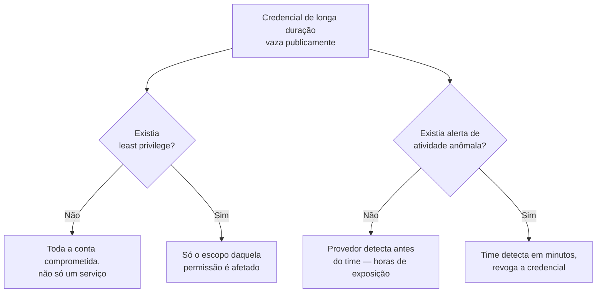
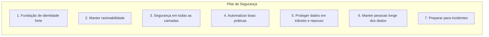
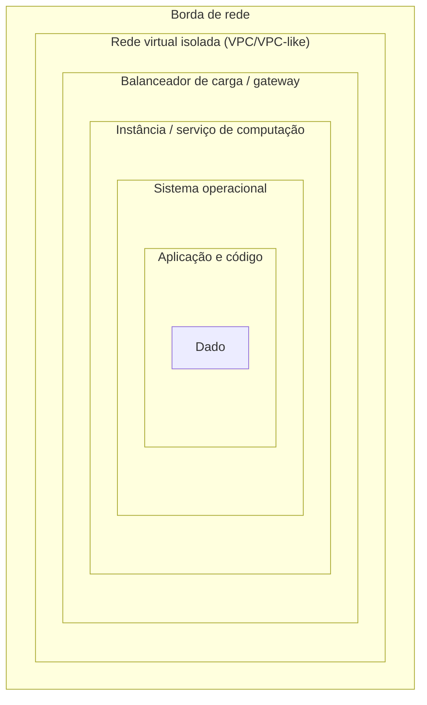
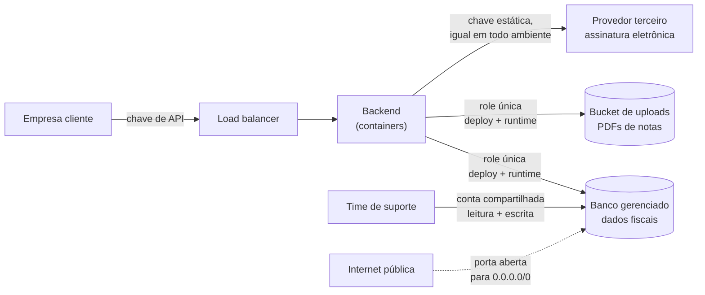
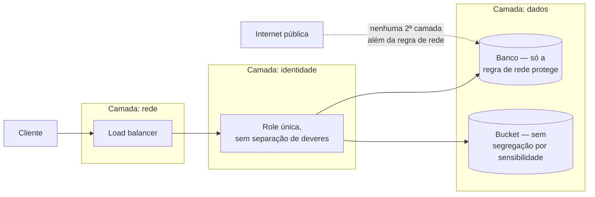

# Segurança

> [!abstract] TL;DR
> Segurança na nuvem não é um scanner que você roda antes do deploy, nem um documento de política que ninguém lê — é um **critério de projeto**, presente em toda decisão de arquitetura, do mesmo jeito que custo e confiabilidade são. O pilar de Segurança do Well-Architected Framework organiza esse critério em sete princípios de design: fundação de identidade forte, rastreabilidade, defesa em profundidade, automação de controles, proteção de dados em trânsito e em repouso, manter pessoas longe dos dados, e preparo para incidentes. O fio condutor de todos eles é o mesmo: **numa VM na sua sala, o perímetro é a porta do datacenter; na nuvem pública, o perímetro é a identidade** — quem (ou o quê) tem permissão para agir, e sobre o quê. Um sistema pode estar coberto de firewalls e ainda assim ser inseguro se uma única credencial de longa duração, com permissão de administrador, vazar para o lugar errado. Esta nota ensina a fazer as perguntas certas sobre segurança numa review de arquitetura — não a operar IAM, não a configurar KMS, não a montar um threat model. Isso vem depois, em galhos dedicados.

## O commit que ninguém devia ter feito

Um engenheiro júnior, numa sexta à tarde, termina um script de deploy que sobe uma nova versão do serviço direto para a nuvem. Para simplificar — "só dessa vez, depois eu arrumo" — ele copia a chave de acesso de longa duração da conta raiz da AWS, que o time inteiro usa há dois anos porque "criar usuários separados para cada pessoa dá trabalho", direto no código do script. Comita. Dá push. O repositório é privado, então não parece grave.

Três semanas depois, o mesmo repositório é migrado para outra organização no GitHub, e por um erro de configuração de permissões durante a migração, fica público por cerca de quarenta minutos antes que alguém perceba. É tempo mais do que suficiente: bots que varrem o GitHub inteiro em busca de padrões de chaves de acesso da AWS encontram a credencial em segundos, não em minutos. Em menos de uma hora, a conta inteira — não só o serviço que o script fazia deploy, mas **cada recurso, em cada região, em cada serviço da conta** — está comprometida. Instâncias de altíssima capacidade de processamento sobem em massa em regiões que o time nunca usou, minerando criptomoeda para outra pessoa, gerando uma fatura que chega a múltiplos da fatura mensal normal antes que o suporte da AWS sinalize a anomalia.

A reunião de retrospectiva que se segue não é sobre "quem comitou a chave" — isso é sintoma, não causa. É sobre uma pergunta mais incômoda: **por que uma única credencial, vazada por um único engenheiro, conseguia agir sobre a conta inteira?** Não havia separação entre "quem pode fazer deploy do serviço X" e "quem pode criar instâncias em qualquer região". Não havia expiração automática daquela credencial. Não havia alerta de atividade anômala configurado — a AWS que percebeu, não o time. E não havia, antes do incidente, nenhum momento formal em que alguém tivesse perguntado "o que acontece se essa credencial específica vazar?" como parte do design do sistema, e não como reação a um incidente já em andamento.

É essa pergunta — feita **antes**, como parte de como o sistema é projetado, e não depois, como parte de como o incidente é limpo — que o pilar de Segurança do Well-Architected Framework existe para forçar. Como a nota 01 desta trilha estabeleceu, o framework inteiro é um conjunto de perguntas, não um checklist de conformidade. O pilar de Segurança é o conjunto específico de perguntas que testam se uma arquitetura resiste ao dia em que algo — uma credencial, uma dependência, um funcionário mal-intencionado, um erro de configuração — dá errado.



## O perímetro mudou de lugar

Quem vem de um mundo on-premises aprendeu a pensar segurança em camadas físicas e de rede: o datacenter tem porta trancada e crachá, a rede interna tem firewall na borda, e uma vez que você está "dentro", uma parte generosa de confiança é implícita — a máquina ao lado, na mesma sub-rede, é presumida confiável só por estar ali. Esse modelo tinha uma lógica coerente quando "dentro" e "fora" eram fisicamente distinguíveis.

Na nuvem pública, essa distinção física simplesmente não existe do mesmo jeito. Não há uma parede que separa "sua infraestrutura" da infraestrutura de qualquer outro cliente do mesmo provedor — a separação inteira é lógica, imposta por software, e a peça que decide "isso pode falar com aquilo" não é mais um cabo de rede física, é uma **política de identidade**: uma regra que diz que esta credencial, este papel, este serviço, pode (ou não pode) executar esta ação sobre este recurso. É por isso que o primeiro princípio de design do pilar de Segurança no whitepaper oficial da AWS chama exatamente essa mudança: **"implementar uma fundação de identidade forte"** — aplicar o princípio de menor privilégio, impor separação de deveres com autorização apropriada para cada interação com os recursos, centralizar a gestão de identidade, e eliminar a dependência de credenciais estáticas de longa duração.

Repare no que essa frase não diz: ela não diz "configure um IAM role com esta política JSON específica" — isso é mecânica, e mecânica tem endereço próprio nesta trilha.

> [!info] Fronteira
> Como criar roles, escrever políticas de permissão, entender a lógica de avaliação de "allow vs. deny" quando múltiplas políticas se aplicam ao mesmo recurso — isso é o **galho 4**, "Identidade e acesso (IAM)". Aqui, o que importa é o princípio: **identidade é o novo perímetro**, e todo o resto do pilar de Segurança se apoia nessa ideia.

Para deixar o princípio menos abstrato, vale ver a forma — não a mecânica — do que "menor privilégio" significa numa política de permissão. Os dois blocos abaixo são **ilustrativos**: a sintaxe exata de uma política JSON de IAM, os efeitos de `Allow` versus `Deny`, como anexar isso a um role — tudo isso é conteúdo do galho 4. O que importa aqui é o contraste de forma.

Uma política larga demais, do tipo que a credencial compartilhada do incidente carregava:

```json
{
  "Effect": "Allow",
  "Action": "*",
  "Resource": "*"
}
```

Qualquer ação, sobre qualquer recurso da conta. Se essa credencial vazar, o raio de dano é a conta inteira — que foi exatamente o que aconteceu.

A mesma necessidade de negócio (deploy de um serviço específico), expressa como menor privilégio:

```json
{
  "Effect": "Allow",
  "Action": [
    "ecs:UpdateService",
    "ecs:DescribeServices"
  ],
  "Resource": "arn:aws:ecs:us-east-1:123456789012:service/prod-cluster/pagamentos-api"
}
```

Só duas ações, só sobre um serviço nomeado, numa região nomeada. Se essa credencial vazar, o pior caso é alguém atualizar (ou tentar atualizar) aquele serviço específico — não criar instâncias em toda a conta. A diferença entre os dois blocos **é** o princípio "fundação de identidade forte" na prática: o escopo da permissão é o tamanho do dano possível.

O incidente do commit da sexta-feira é um caso didático desse princípio falhando na prática: a "fundação de identidade" da equipe era uma única credencial compartilhada, sem separação de deveres, sem expiração — o oposto exato do que o princípio pede. Se o time tivesse, em vez disso, uma credencial de curta duração, atribuída especificamente ao processo de deploy, com permissão apenas para atualizar aquele serviço específico (não para criar instâncias em qualquer lugar da conta), o mesmo vazamento teria um raio de dano imensamente menor — talvez nenhum, se a credencial já tivesse expirado antes do repositório ficar público.

## Os sete princípios, um de cada vez

O whitepaper oficial "Security Pillar" do AWS Well-Architected Framework lista sete princípios de design. Eles não são independentes — cada um reforça os outros — mas vale desenrolar cada um separadamente, porque cada um responde a uma pergunta diferente que uma review de arquitetura séria precisa fazer.



**1. Implementar uma fundação de identidade forte** já foi apresentado acima — menor privilégio, separação de deveres, identidade centralizada, adeus às credenciais estáticas de longa duração. É o princípio fundacional; os outros seis, em boa parte, existem para apoiá-lo ou compensá-lo quando ele falha.

**2. Manter rastreabilidade.** A pergunta que este princípio força é simples de formular e difícil de responder sem preparo prévio: **se algo acontecer, dá para saber o quê, quando, e quem (ou o quê) fez?** No incidente do commit, a resposta inicial foi "não sabemos, ainda estamos investigando" — porque não havia log centralizado de toda ação tomada na conta, nem alerta configurado para atividade fora do padrão normal (criar dezenas de instâncias em regiões nunca usadas antes é, por definição, fora do padrão). Rastreabilidade não é só "ter logs" — é ter logs monitorados, com alerta automático, integrados a um processo que de fato investiga a anomalia em tempo próximo do real, não semanas depois numa auditoria trimestral.

**3. Aplicar segurança em todas as camadas** — a ideia clássica de **defesa em profundidade**. Nenhum controle único é infalível; um firewall de borda pode ter uma regra mal configurada, uma política de IAM pode ter um escopo largo demais por engano, uma dependência de terceiros pode ter uma vulnerabilidade não descoberta. A resposta não é escolher "o melhor controle" e confiar nele — é empilhar controles independentes em cada camada (borda de rede, rede virtual isolada, balanceador de carga, cada instância e serviço de computação, sistema operacional, aplicação, código), de forma que a falha de um controle não signifique comprometimento total. É o mesmo raciocínio que explica por que um cofre de banco tem porta blindada **e** alarme **e** câmera **e** guarda — nenhum sozinho seria suficiente, e cada um cobre o ponto cego dos outros.

**4. Automatizar boas práticas de segurança.** Um controle de segurança que depende de um humano lembrar de aplicá-lo manualmente, toda vez, sem exceção, é um controle que eventualmente falha — não porque as pessoas são descuidadas, mas porque humanos são inconsistentes por natureza, especialmente sob pressão de prazo. A resposta madura é definir controles como código, versionado, testado, aplicado automaticamente toda vez que a infraestrutura muda — a mesma disciplina de infraestrutura como código que a nota 02 desta trilha já discutiu para o pilar de Excelência Operacional, aqui aplicada especificamente a regras de segurança (quem pode acessar o quê, que portas ficam abertas, que criptografia é obrigatória por padrão).

Como forma, não como tutorial de ferramenta específica: um guardrail automatizado é uma regra que o sistema **verifica sozinho**, continuamente, em vez de esperar alguém lembrar de checar.

```json
{
  "rule": "volumes-devem-ser-criptografados",
  "avalia": "todo Volume/EBS criado ou modificado",
  "condicao": "encrypted == true",
  "acao_se_falhar": "marcar não-conforme e alertar o time de plataforma"
}
```

Isso não é a sintaxe de nenhum produto específico — é a forma de um guardrail. A mecânica real (uma regra do AWS Config, uma policy do Open Policy Agent, um check de `terraform plan` no pipeline) é assunto de infraestrutura como código, já apontado pela nota 02, e da trilha [[03-Dominios/Engenharia/Operação/index|Operação (DevOps/SRE)]]. O que importa aqui é o princípio: a regra existe **fora** da memória de qualquer pessoa, e roda sozinha.

**5. Proteger dados em trânsito e em repouso.** Classificar dados por nível de sensibilidade, e usar criptografia, tokenização e controle de acesso de forma proporcional a essa sensibilidade — dados de cartão de crédito não recebem o mesmo tratamento que um contador de visualizações de página pública. "Em trânsito" quer dizer enquanto o dado se move entre sistemas (uma requisição HTTP entre seu serviço e um banco de dados gerenciado, por exemplo); "em repouso" quer dizer enquanto o dado está armazenado (num disco, num bucket de objetos, num banco de dados). Os dois merecem proteção — um dado criptografado em repouso mas trafegando em texto claro ainda vaza para quem intercepta a rede.

> [!info] Fronteira
> Como escolher entre criptografia gerenciada pelo provedor e chaves próprias, como funciona um serviço de gestão de chaves (KMS), como armazenar segredos de aplicação com segurança, e como construir um threat model real para um sistema específico — isso é o **galho 18**, "segurança a fundo". Aqui, o que importa é o princípio de projeto: dado sensível **sempre** protegido, nas duas formas em que ele existe.

**6. Manter pessoas longe dos dados.** Este é, talvez, o princípio menos intuitivo para quem nunca trabalhou numa operação regulada — a ideia de que **reduzir o acesso humano direto aos dados**, mesmo de engenheiros bem-intencionados da própria equipe, é uma melhoria de segurança, não uma barreira burocrática. Um engenheiro que precisa depurar um problema em produção acessando diretamente uma tabela de banco de dados com dados de clientes está, mesmo com as melhores intenções, criando uma superfície de risco: erro humano (um `UPDATE` sem `WHERE`), exposição acidental (captura de tela com dado sensível visível), ou simplesmente mais um ponto onde um vazamento de credencial pessoal vira vazamento de dado de cliente. Ferramentas e automação que respondem à pergunta de depuração sem exigir acesso direto ao dado bruto — dashboards com dado mascarado, réplicas anonimizadas para teste, pipelines de log que já removem campo sensível antes de chegar a qualquer humano — reduzem essa superfície sem reduzir a capacidade de operar o sistema.

**7. Preparar-se para eventos de segurança.** O princípio final assume, de forma realista, que apesar dos seis anteriores, um incidente de segurança vai acontecer eventualmente — a pergunta madura não é "como evito isso para sempre", é "estamos prontos para quando isso acontecer". Isso significa ter política e processo de resposta a incidente definidos **antes** do incidente (não improvisados durante ele), rodar simulações de resposta a incidente periodicamente, e ter ferramentas com automação que aceleram detecção, investigação e recuperação. O incidente do commit da sexta-feira, de novo, ilustra a ausência disso: a resposta ao incidente foi inteiramente reativa e improvisada — ninguém no time sabia, de antemão, os passos exatos para revogar uma credencial comprometida, isolar o dano, e reconstruir a confiança na conta.

> [!info] Fronteira
> Processo de resposta a incidente, postmortem sem culpa, e a disciplina operacional de estar de plantão para esse tipo de evento têm casa própria na trilha [[03-Dominios/Engenharia/Operação/index|Operação (DevOps/SRE)]]. O pilar de Segurança levanta a exigência ("esteja preparado"); a mecânica de como se preparar é terreno daquela trilha.

## Da pergunta ao sintoma: como usar os sete princípios numa review

Os sete princípios só valem alguma coisa numa review de arquitetura se virarem pergunta — e se o revisor souber reconhecer, no desenho que tem na frente, o sintoma de cada um estar sendo ignorado. A tabela abaixo é o que uma review séria de segurança carrega na cabeça:

| Princípio | A pergunta da review | Sintoma de violação |
|---|---|---|
| Fundação de identidade forte | Essa credencial/role precisa mesmo de todo esse escopo, para sempre? | Política com `Action: "*"` ou `Resource: "*"`; credencial de longa duração compartilhada entre pessoas |
| Manter rastreabilidade | Se isso falhar às 3h da manhã, dá pra saber o quê, quando e quem, sem "investigar" do zero? | Log não centralizado; nenhum alerta configurado; provedor detecta a anomalia antes do time |
| Segurança em todas as camadas | Se este controle específico falhar, o que mais segura o sistema? | Um único ponto de controle (só firewall, só IAM, só validação de input) protegendo um recurso sensível |
| Automatizar boas práticas | Esse controle depende de alguém lembrar de aplicá-lo manualmente? | Checklist manual de segurança antes do deploy; regra de rede editada direto no console, sem versionamento |
| Proteger dados em trânsito e repouso | Todo dado sensível está protegido nas duas formas — parado e em movimento? | Backup sem criptografia; tráfego interno entre serviços em texto claro "porque é rede privada" |
| Manter pessoas longe dos dados | Alguém precisa mesmo tocar o dado bruto para resolver isso, ou dá pra resolver com dado mascarado? | Acesso direto e rotineiro de engenheiro a tabela de produção com dado de cliente, para depuração |
| Preparar-se para eventos de segurança | Se isso acontecer amanhã, existe um processo escrito, ou vai ser improviso? | Ninguém no time sabe, de cabeça, os passos para revogar uma credencial comprometida |

## Defesa em profundidade, camada por camada

O terceiro princípio — "segurança em todas as camadas" — merece um desenho próprio, porque é o mais fácil de aplicar pela metade: um time reforça o controle de rede, sente que "já cuidou de segurança", e para por ali. Defesa em profundidade pede uma camada de controle independente em cada nível do sistema, de fora para dentro, de forma que a falha de uma camada não derrube as outras.



Cada camada responde por um tipo diferente de falha, e por isso admite um controle exemplar diferente:

| Camada | Controle exemplar | Pergunta a se fazer |
|---|---|---|
| Rede | Grupo de segurança / firewall restringindo porta e origem | Esta porta precisa mesmo estar acessível de fora, ou só de dentro da rede privada? |
| Host / instância | Imagem endurecida (hardened), patch automático, sem SSH exposto por padrão | Se alguém alcançar esta instância, o que mais ela consegue alcançar a partir daqui? |
| Aplicação | Validação de input, dependência com scan de vulnerabilidade, WAF na borda | Uma dependência de terceiros comprometida derruba só esta aplicação, ou a conta inteira? |
| Dados | Criptografia em repouso com chave gerida separadamente do recurso | Se este dado vazar apesar de tudo, ele ainda é legível para quem não tem a chave? |
| Identidade | Role com escopo mínimo, sem credencial de longa duração | Esta credencial, sozinha, consegue causar dano além do que ela precisa fazer? |

Repare que "identidade" aparece como camada aqui **e** como princípio próprio (o primeiro) — não é contradição. Cada princípio olha o sistema de um ângulo; defesa em profundidade olha "quantas camadas independentes", fundação de identidade olha "quão apertado é o escopo de cada uma". Um sistema com identidade bem desenhada mas só uma camada de defesa ainda é frágil; um sistema com cinco camadas mas identidade com escopo de administrador em todas elas também é.

## As sete áreas de foco

O whitepaper organiza o pilar não só em princípios de design, mas também em sete áreas de foco temáticas. Os princípios são o "porquê" (o que uma arquitetura segura busca); as áreas são o "onde" (em que parte do sistema, ou em que fase do trabalho, cada busca se materializa). Esta trilha não desenvolve cada área em detalhe aqui — cada uma tem, ou terá, seu próprio galho dedicado.

| Área de foco | Do que trata | Princípio(s) que ela operacionaliza |
|---|---|---|
| Fundações de segurança | A postura de segurança básica da conta/organização — a base sobre a qual as outras seis áreas se apoiam | Todos, em algum grau |
| Gestão de identidade e acesso | Quem (pessoa ou serviço) pode agir sobre qual recurso, e com que escopo | 1 — fundação de identidade forte |
| Detecção | Monitorar, logar e alertar sobre atividade e mudança no ambiente | 2 — manter rastreabilidade |
| Proteção de infraestrutura | Controles em rede, host e serviço de computação, em múltiplas camadas | 3 — segurança em todas as camadas |
| Proteção de dados | Classificação de sensibilidade, criptografia, controle de acesso ao dado em si | 5 — proteger dados em trânsito e repouso; 6 — manter pessoas longe dos dados |
| Resposta a incidentes | Processo, automação e simulação para quando (não se) algo dá errado | 7 — preparar-se para eventos de segurança |
| Segurança de aplicação | Práticas de segurança no ciclo de vida do software — do design ao código em produção | 4 — automatizar boas práticas; 3 — segurança em todas as camadas |

## Identidade também é sobre quem é uma pessoa, não só o que ela pode fazer

Vale uma distinção fina, fácil de perder de vista quando se fala em "identidade como perímetro": este pilar trata de **autorização dentro da nuvem** — quem, dentro da sua conta AWS ou DigitalOcean, pode agir sobre quais recursos. É uma pergunta diferente de **autenticação de usuários finais da sua aplicação** — como um usuário comum prova quem é para fazer login no seu produto, e como sua aplicação mantém essa sessão de forma segura.

> [!info] Fronteira
> OAuth, OIDC, JWT, gestão de sessão e autenticação de usuário final da sua aplicação são o assunto da trilha [[03-Dominios/Engenharia/Auth e Identidade/index|Auth e Identidade]]. É um domínio de conhecimento adjacente e reforça a mesma ideia central — identidade decide o que é permitido — mas resolve um problema diferente: lá, quem se autentica é o usuário final do seu produto; aqui, quem se autentica é você, sua equipe, e os próprios serviços da sua conta de nuvem.

## Na lente dupla: como AWS e DigitalOcean encarnam o pilar

Vale ancorar os sete princípios no vocabulário concreto dos dois provedores desta trilha — não como tutorial de configuração (isso é dos galhos seguintes), mas como reconhecimento de nome, o tipo de vocabulário que qualquer conversa técnica sênior sobre nuvem vai presumir que você conhece.

**Fundação de identidade.** Em AWS, o serviço central é o **IAM** (Identity and Access Management) — usuários, grupos, roles e políticas em JSON que definem, com granularidade por ação e por recurso, quem pode fazer o quê. Em DigitalOcean, o modelo é mais simples: **Teams**, com seis papéis pré-definidos atribuídos a cada membro, sem política customizada por recurso — um modelo bem mais enxuto que o IAM da AWS, refletindo o catálogo geral mais simples da DigitalOcean.

| Papel (DigitalOcean Teams) | Escopo | Aproximação em AWS |
|---|---|---|
| Owner | Acesso completo a recursos, billing e configurações do time | Administrator (política `AdministratorAccess`) |
| Biller | Acesso completo só a informações de billing | Role restrita a `aws-portal:*Billing` |
| Billing Viewer | Leitura, só de billing | Role restrita a `aws-portal:ViewBilling` |
| Member | Acesso completo aos recursos compartilhados; leitura em configurações do time | Role com política de serviço ampla, sem `iam:*` |
| Modifier | Atualiza recursos, mas não pode excluir; leitura em configurações do time | Política customizada negando `*:Delete*` |
| Resource Viewer | Leitura de recursos e configurações; sem acesso a billing | `ReadOnlyAccess` gerenciada pela AWS |

A comparação é aproximada, não uma equivalência formal — a DigitalOcean não oferece política JSON por recurso individual como o IAM, então "Modifier" e "Resource Viewer" são papéis de conta inteira, não escopos recortados por serviço específico como uma política de IAM permitiria.

**Rastreabilidade.** Em AWS, **CloudTrail** registra toda chamada de API feita na conta — quem fez, quando, de onde — servindo de base para auditoria, investigação de incidente e detecção de anomalia; complementarmente, **GuardDuty** analisa esses eventos (e outras fontes) em busca de atividade maliciosa, sem exigir que você escreva a lógica de detecção. A DigitalOcean tem um equivalente, mais modesto: **Security History**, no painel de segurança do time, registra ações tomadas — criação e exclusão de recursos, geração de tokens de API — com usuário, endereço IP e timestamp por entrada. A diferença real de maturidade entre os dois provedores não é "existe ou não existe" — é profundidade: não há, na DigitalOcean, um serviço de detecção automatizada de anomalia equivalente ao GuardDuty, nem uma API de exportação contínua de eventos para um SIEM externo tão robusta quanto a do CloudTrail; times que operam em DigitalOcean e precisam de rastreabilidade fina tendem a complementar o Security History com logging da própria aplicação e monitoramento de infraestrutura, em vez de confiar só no registro nativo da conta.

**Proteção de dados.** Em AWS, o **KMS** (Key Management Service) centraliza a criação e o controle de chaves de criptografia, usadas por praticamente todo outro serviço (S3, RDS, EBS) para criptografar dado em repouso; dado em trânsito é majoritariamente coberto por TLS, com certificados geridos via **ACM** (AWS Certificate Manager). Em DigitalOcean, criptografia em repouso é aplicada por padrão em produtos como Volumes e Spaces sem exigir configuração explícita — uma filosofia de "seguro por padrão" mais simples, com menos superfície de decisão, ao custo de menos controle fino sobre a gestão da chave em si.

**Segurança de aplicação.** Em AWS, o **Inspector** faz varredura automatizada de vulnerabilidade em instâncias EC2, imagens de container e funções Lambda, além de repositórios de código, priorizando o que corrigir primeiro por score de risco. A DigitalOcean não tem um serviço nativo equivalente de varredura de vulnerabilidade — times que operam lá tipicamente integram um scanner de terceiros (SCA, análise de imagem de container) diretamente no pipeline de CI/CD, em vez de um produto de plataforma dedicado. É a mesma lacuna de maturidade já observada em detecção: a DigitalOcean tende a assumir que essa camada vem de fora do provedor.

> [!info] Caducidade
> Nomes de produto e o que cada um cobre por padrão verificados em 2026-07-22. Recursos de segurança evoluem com frequência incomum — confira a documentação oficial de cada provedor antes de tomar qualquer decisão de arquitetura baseada nesta nota.

| Conceito | AWS | Azure | GCP | DigitalOcean |
|---|---|---|---|---|
| Gestão de identidade e acesso | IAM | Microsoft Entra ID | Cloud IAM | Teams (roles) |
| Rastreabilidade / auditoria de conta | CloudTrail | Azure Monitor / Activity Log | Cloud Audit Logs | Security History (mais modesto, sem detecção automatizada) |
| Detecção de ameaça | GuardDuty | Microsoft Defender for Cloud | Security Command Center | — (majoritariamente terceiros) |
| Gestão de chaves de criptografia | KMS | Key Vault | Cloud KMS | Criptografia por padrão (sem gestão de chave própria exposta) |
| Scan de vulnerabilidade / segurança de aplicação | Inspector | Defender for Cloud (proteção de workload) | Security Command Center (findings de vulnerabilidade) | — (majoritariamente terceiros no pipeline de CI/CD) |

## Casos práticos

**A separação de deveres que impediu um erro de virar um desastre.** Um time de plataforma organiza suas permissões de forma que ninguém — nem o engenheiro mais sênior — tenha, sozinho, permissão para tanto alterar código de produção quanto aprovar o próprio deploy daquele código. A mudança precisa de duas pessoas: quem escreve e quem aprova, cada uma com um escopo de permissão diferente. Meses depois, um script de migração de banco de dados mal testado é submetido para deploy por engano — mas a etapa de aprovação, feita por uma pessoa diferente de quem escreveu o script, pega o problema antes de ele rodar em produção, porque quem aprova tem o hábito (e a responsabilidade formal) de revisar o que está sendo aprovado, não só de clicar "sim". Não foi sorte — foi separação de deveres, um dos componentes explícitos do primeiro princípio de design, funcionando exatamente como projetado.

**A rastreabilidade que transformou "não sabemos" em resposta em minutos.** Uma empresa de médio porte, depois de um susto de segurança sem gravidade real (uma tentativa de acesso não autorizado, bloqueada pelo controle de identidade, mas registrada), decide investir em centralizar logging de toda ação relevante da conta de nuvem, com alerta automático para padrões fora do comum — criação de recurso em região nunca usada, tentativa de acesso fora do horário comercial habitual do time, mudança de política de permissão fora de uma janela de deploy planejada. Seis meses depois, um alerta desses dispara de madrugada: uma credencial de serviço começa a fazer chamadas de API em um padrão totalmente diferente do seu uso normal. O time revoga a credencial em minutos, antes de qualquer dano real acontecer — porque a pergunta "algo está errado?" já tinha resposta automatizada, em vez de depender de alguém notar manualmente um comportamento estranho na fatura do mês seguinte.

**A criptografia que não impediu o vazamento, mas impediu o dano.** Um bucket de armazenamento de objetos, configurado incorretamente, fica acessível publicamente por um período — um erro de configuração, não um ataque. Só que os arquivos daquele bucket específico continham dados sensíveis de clientes, protegidos por criptografia em repouso com uma chave gerida separadamente do próprio bucket. Um atacante que descobre o bucket público consegue listar e baixar os arquivos criptografados — mas sem a chave, separada e protegida por uma política de acesso independente, os arquivos baixados são, na prática, ruído ilegível. O erro de configuração ainda precisa ser corrigido e investigado — não é motivo para relaxar — mas a camada adicional de proteção de dados evitou que um erro de configuração de infraestrutura virasse um vazamento de dado real de cliente. É defesa em profundidade e proteção de dados trabalhando juntas: nenhum controle sozinho teria sido suficiente, mas a combinação dos dois reduziu um incidente sério a um incidente administrável.

**O guardrail que pegou o erro antes de virar incidente.** Um time define, como parte do pipeline de infraestrutura como código, uma regra automatizada: nenhum recurso de armazenamento pode ser criado sem criptografia em repouso habilitada — a mesma forma de guardrail ilustrada mais acima, para o princípio de automação. Um engenheiro, sem perceber, escreve um módulo de infraestrutura para um novo ambiente de teste sem essa flag. O pipeline de deploy rejeita a mudança automaticamente, antes de qualquer recurso real ser criado, com uma mensagem clara sobre qual regra falhou. Não houve incidente para investigar depois — porque o controle rodou **antes** do problema existir, não depois. É a diferença prática entre automação de boas práticas como princípio de projeto e "confiar que alguém vai lembrar" como plano de segurança.

## O pilar de Segurança aplicado — uma review

Os sete princípios e as sete áreas de foco só ganham valor de verdade quando alguém os aplica sobre um sistema concreto, real o suficiente para ter falha real. O exercício abaixo é hipotético — nenhum sistema, cliente ou incidente aqui descrito é real — mas é o tipo exato de arquitetura que aparece numa review sênior, e o tipo de raciocínio que uma entrevista para vaga sênior/staff espera ver em voz alta.

**O sistema.** Uma API B2B chamada, para este exercício, ContaCerta emite notas fiscais eletrônicas para empresas clientes através de uma API pública autenticada por chave de API por cliente. O backend roda em containers atrás de um load balancer; os dados fiscais (razão social, CNPJ, valores) ficam num banco relacional gerenciado; os PDFs das notas emitidas — que carregam os mesmos dados, mais o endereço do cliente final — são gravados num bucket de armazenamento de objetos. Para emitir cada nota, o serviço chama a API de um provedor terceiro de assinatura eletrônica, autenticando com uma chave de API própria daquele provedor.

Por trás dessa descrição limpa, o estado real da conta acumulou os pequenos atalhos que toda arquitetura acumula com o tempo. A pipeline de deploy e o próprio backend em produção compartilham uma única role de serviço, criada no início do projeto e nunca revisada, com permissão de escrita no banco, no bucket, **e** de criar/alterar infraestrutura — "era mais rápido dar um escopo largo do que ajustar toda vez que algo novo precisava de permissão". A chave do provedor de assinatura eletrônica está gravada como variável de ambiente do container, com o mesmo valor em staging e em produção. Uma varredura de postura de segurança do próprio provedor de nuvem, rodada dois meses atrás, sinalizou que a porta do banco de dados está acessível para qualquer origem na internet — resquício de uma sessão de debug de performance, seis meses atrás, em que alguém liberou o acesso "só para testar uma query" e esqueceu de reverter. E quando um cliente abre um ticket relatando problema numa nota fiscal específica, o time de suporte entra direto no banco de produção com uma conta compartilhada de leitura e escrita para investigar, porque não existe outra ferramenta para isso.



O desenho já entrega parte do diagnóstico visualmente: **três setas diferentes chegam ao banco sem controle independente entre si** — o backend, o suporte e, pela porta aberta, a internet pública inteira. Sobrepor as camadas de defesa em profundidade da seção anterior sobre este mesmo fluxo deixa a lacuna ainda mais nítida:



Note o que falta no diagrama: não existe uma camada de "host/instância" reforçando o banco, nem uma camada de identidade que distinga "o backend pode escrever nota fiscal" de "o backend pode apagar o banco inteiro". Uma única regra de rede é, hoje, a única coisa entre a internet pública e o dado fiscal de cada cliente — exatamente o oposto do que "segurança em todas as camadas" pede.

Passando o pilar de Segurança sobre essa arquitetura, área por área:

**Gestão de identidade e acesso.** *A pergunta:* essa credencial precisa mesmo de todo esse escopo, para sempre? *O que a review encontra:* uma única role cobre deploy e runtime, com permissão de infraestrutura somada a permissão de dado — não há separação entre "o pipeline pode alterar infra" e "o serviço pode ler/escrever no banco e no bucket". *O risco concreto:* se essa credencial vazar (num log, num commit, num container comprometido), o atacante não fica restrito a ler dados — ele pode recriar, apagar ou redirecionar infraestrutura inteira, porque a mesma credencial que roda o serviço também poderia, em tese, provisionar um banco novo em outra região.

**Detecção.** *A pergunta:* se algo estiver errado, dá para saber sem esperar um cliente reclamar ou uma varredura periódica notar? *O que a review encontra:* a porta pública do banco ficou aberta por seis meses sem que ninguém do time notasse — só uma varredura de postura de segurança, rodada por iniciativa própria e não por alerta automático, encontrou o problema. Não há alerta configurado para exposição pública inesperada de um recurso que deveria ser privado. *O risco concreto:* o tempo entre "algo deu errado" e "alguém sabe que algo deu errado" é medido em meses, não em minutos — o mesmo padrão que, na abertura desta nota, transformou uma credencial vazada numa conta inteira comprometida antes que o time percebesse.

**Proteção de infraestrutura.** *A pergunta:* se este controle específico falhar, o que mais segura o sistema? *O que a review encontra:* o único controle entre a internet pública e um banco com dado fiscal de cliente é a regra de rede — e essa regra, sozinha, falhou (ficou aberta para `0.0.0.0/0`). Não há uma segunda camada — autenticação de rede adicional, um proxy interno, segmentação — que teria limitado o dano quando a primeira camada cedeu. *O risco concreto:* qualquer scanner automatizado de porta aberta na internet, rodando de forma genérica e sem alvo específico, poderia ter encontrado esse banco nesses seis meses.

**Proteção de dados.** *A pergunta:* todo dado sensível está protegido nas duas formas, e de forma proporcional à sua sensibilidade? *O que a review encontra:* o bucket de uploads mistura PDFs de teste com PDFs reais contendo CNPJ e endereço de cliente final, sob a mesma política de acesso — não há classificação nem segregação por sensibilidade dentro do bucket. *O risco concreto:* qualquer erro de configuração futuro no bucket (o mesmo tipo de erro do terceiro caso prático acima) expõe indistintamente dado de teste e dado real — sem segregação, o raio de dano de qualquer falha é sempre "tudo o que está ali", nunca um subconjunto controlado.

**Resposta a incidentes.** *A pergunta:* se isso acontecer amanhã, existe processo escrito, ou vai ser improviso? *O que a review encontra:* quando a porta aberta foi finalmente descoberta, a correção foi "fechar e avisar no chat do time" — sem registro formal do achado, sem investigação de quem mais poderia ter se conectado àquele banco nos seis meses de exposição, sem revisão de que outras credenciais (a chave do provedor de assinatura, por exemplo) poderiam ter sido tocadas na mesma janela. *O risco concreto:* mesmo o incidente que **foi** encontrado não gerou aprendizado formal — o próximo atalho parecido (uma porta liberada "só por um minuto", uma credencial reaproveitada "só dessa vez") tem o mesmo caminho livre que este teve.

Nenhum desses cinco achados, isolado, é necessariamente fatal — é exatamente por isso que uma review de segurança madura não para na primeira pergunta respondida "sim, temos isso". Ela soma os achados, e prioriza:

| Risco | Severidade | Princípio violado | Remediação de alto nível |
|---|---|---|---|
| Porta do banco de dados acessível para `0.0.0.0/0` | Crítica | Segurança em todas as camadas | Restringir a regra de rede à sub-rede da aplicação; adicionar uma segunda camada (proxy interno ou exigência de rede privada) para que a falha de uma regra não baste sozinha |
| Role única de deploy e runtime com escopo de infraestrutura + dado | Alta | Fundação de identidade forte | Separar a role de deploy da role de runtime, cada uma com o menor escopo necessário — mecânica em `[!info] Fronteira` do galho 4 |
| Chave do provedor de assinatura reaproveitada entre staging e produção | Alta | Fundação de identidade forte / Proteger dados | Rotacionar e segregar por ambiente, geridas por um cofre de segredos dedicado — mecânica no galho 18 |
| Nenhum alerta para exposição pública inesperada de recurso privado | Alta | Manter rastreabilidade | Centralizar log de mudança de configuração de rede e banco, com alerta automático para exposição pública fora do esperado |
| Bucket sem segregação de dado real vs. dado de teste | Média | Proteger dados em trânsito e repouso | Separar por bucket ou prefixo com política de acesso própria por nível de sensibilidade — mecânica no galho 18 |
| Suporte acessa produção com conta compartilhada de leitura/escrita | Média | Manter pessoas longe dos dados | Substituir por ferramenta de suporte com dado mascarado; se acesso direto for inevitável, exigir credencial individual e temporária |
| Incidente da porta aberta resolvido sem investigação nem registro formal | Média | Preparar-se para eventos de segurança | Runbook de contenção/investigação por escrito, com pós-morte obrigatório mesmo para incidentes "pequenos" — disciplina operacional da trilha Operação (DevOps/SRE) |

> [!info] Fronteira
> A tabela aponta **onde** cada remediação mora — não como executá-la. Escrever a política de IAM que separa deploy de runtime é galho 4; configurar o cofre de segredos e a política de bucket por sensibilidade é galho 18; o runbook de resposta a incidente é a trilha Operação. Esta nota para na pergunta "o que está errado, e o quanto isso importa" — que já é o trabalho mais difícil de fazer bem numa review.

## Armadilhas comuns

> [!warning] Tratar segurança como um gate de revisão antes do deploy, não como critério de projeto
> Rodar um scanner de vulnerabilidade na véspera do lançamento e "corrigir o que aparecer" trata segurança como obstáculo burocrático de última hora, não como parte de como o sistema foi desenhado desde o início. Os sete princípios deste pilar — especialmente automação de boas práticas e fundação de identidade — só funcionam quando aplicados desde a primeira decisão de arquitetura, não como remendo antes do deploy.

> [!warning] Confundir "está na nuvem" com "está protegido"
> O modelo de responsabilidade compartilhada, já citado na nota 03 do galho 1 desta trilha, deixa claro que o provedor protege a infraestrutura subjacente — mas a configuração de identidade, a criptografia aplicada aos seus dados específicos, e a lógica da sua aplicação continuam sendo responsabilidade sua, em qualquer camada de serviço que você escolher. Um bucket público, uma política de IAM larga demais, ou uma credencial de longa duração vazada são falhas do lado do cliente no modelo de responsabilidade compartilhada — o provedor não as evita por você.

> [!warning] Achar que mais controles é sempre melhor, sem medir o custo em velocidade
> Defesa em profundidade não significa empilhar toda ferramenta de segurança disponível sem critério. Cada camada de controle adicional tem um custo real — em complexidade operacional, em velocidade de entrega, às vezes em experiência do usuário. A nota 07 desta trilha vai voltar a esse ponto com mais profundidade: segurança é um dos pilares que mais tensiona diretamente com os outros, e a resposta madura não é maximizar controle a qualquer custo — é fazer esse trade-off de forma explícita e datada, não por inércia.

## O que vem a seguir

Esta nota respondeu a pergunta "essa arquitetura resiste ao dia em que algo dá errado por má intenção ou erro humano?" — o pilar de Segurança. Mas existe uma pergunta vizinha, quase tão urgente: essa arquitetura resiste ao dia em que algo dá errado **sem intenção de ninguém** — um disco que falha, uma zona inteira de datacenter que cai, um pico de tráfego que ninguém previu? Essa é a pergunta do próximo pilar, **"Confiabilidade"**, que troca o foco de "quem pode causar dano" para "o que acontece quando a falha, inevitável, finalmente acontece" — e como projetar para que o sistema se recupere sozinho, em vez de esperar um humano notar e agir.

## Fontes

- [AWS Well-Architected Framework — Security Pillar, "Security foundations" (documentação oficial)](https://docs.aws.amazon.com/wellarchitected/latest/security-pillar/security.html) — os sete princípios de design e as sete áreas de foco do pilar, citados verbatim nesta nota; acessado em 2026-07-20.
- [AWS Well-Architected Framework — página oficial dos seis pilares](https://aws.amazon.com/architecture/well-architected/) — visão geral do framework e do pilar de Segurança dentro dele; acessado em 2026-07-20.
- [AWS — Shared Responsibility Model (documentação oficial)](https://aws.amazon.com/compliance/shared-responsibility-model/) — divisão "security of the cloud" vs. "security in the cloud", base da armadilha "está na nuvem não é está protegido"; acessado em 2026-07-20.
- [AWS IAM — página oficial de produto](https://aws.amazon.com/iam/) — descrição oficial do serviço de gestão de identidade e acesso; acessado em 2026-07-20.
- [AWS CloudTrail — página oficial de produto](https://aws.amazon.com/cloudtrail/) — governança, compliance e auditoria operacional da conta AWS; acessado em 2026-07-20.
- [AWS KMS — página oficial de produto](https://aws.amazon.com/kms/) — gestão centralizada de chaves de criptografia; acessado em 2026-07-20.
- [AWS GuardDuty — página oficial de produto](https://aws.amazon.com/guardduty/) — serviço gerenciado de detecção de ameaça, citado na comparação de rastreabilidade; acessado em 2026-07-22.
- [Amazon Inspector — página oficial de produto](https://aws.amazon.com/inspector/) — varredura automatizada de vulnerabilidade, citada na comparação de segurança de aplicação; acessado em 2026-07-22.
- [AWS Certificate Manager — página oficial de produto](https://aws.amazon.com/certificate-manager/) — gestão de certificados TLS/SSL, citada na proteção de dados em trânsito; acessado em 2026-07-22.
- [DigitalOcean — Teams e gestão de acesso (documentação oficial)](https://docs.digitalocean.com/platform/teams/) — papéis (roles) e permissões de equipe na DigitalOcean; acessado em 2026-07-20.
- [DigitalOcean — papéis pré-definidos de Teams (documentação oficial)](https://docs.digitalocean.com/platform/teams/roles/predefined/) — os seis papéis (Owner, Biller, Billing Viewer, Member, Modifier, Resource Viewer) e seu escopo, base da tabela de aproximação com IAM; acessado em 2026-07-22.
- [DigitalOcean — como ver o histórico de segurança do time (documentação oficial)](https://docs.digitalocean.com/platform/teams/how-to/view-security-history/) — o recurso "Security History", equivalente mais modesto ao CloudTrail; acessado em 2026-07-22.
