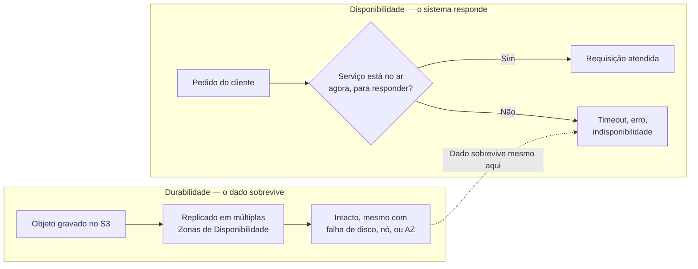
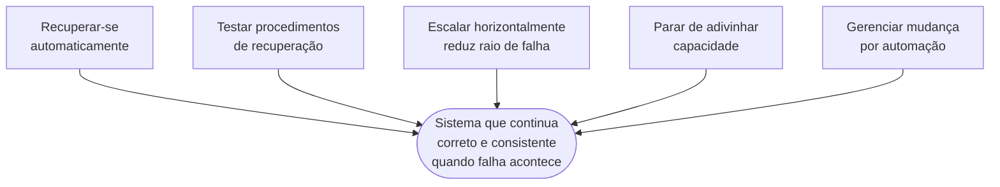
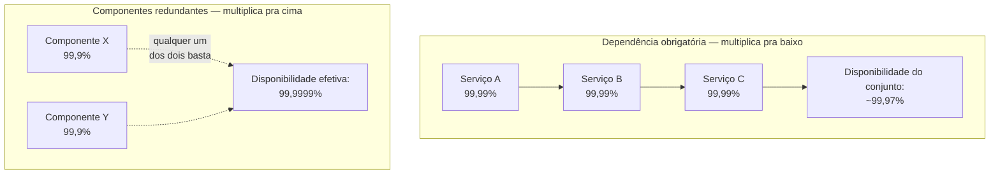
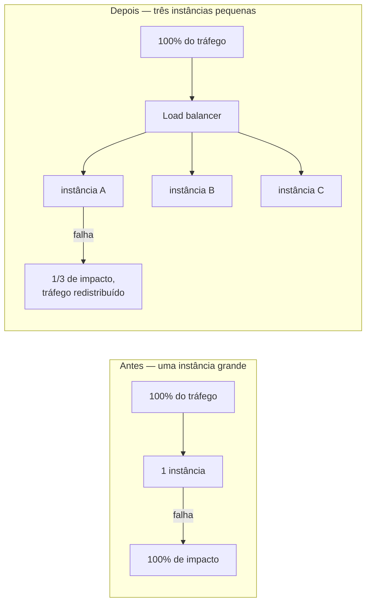
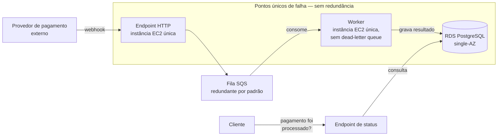
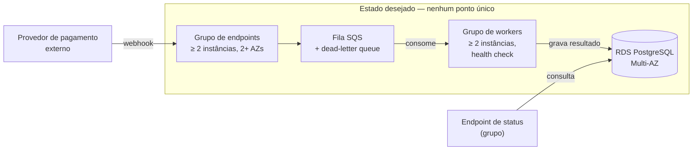

# Confiabilidade

> [!abstract] TL;DR
> Confiabilidade é a capacidade de um sistema desempenhar sua função corretamente, de forma consistente, sempre que for chamado a fazê-lo — não é o mesmo que "os dados nunca somem" (isso é durabilidade) nem "o sistema nunca cai" no sentido absoluto (nada atinge isso). O pilar se apoia em cinco princípios: recuperar-se automaticamente de falha, testar os procedimentos de recuperação de verdade, escalar horizontalmente para reduzir o raio de uma falha única, parar de adivinhar capacidade, e gerenciar mudança por automação. O erro mais caro do pilar é confundir durabilidade — a garantia de que o dado sobrevive — com disponibilidade — a garantia de que o sistema responde quando alguém pede. Um dado pode estar perfeitamente intacto e, ainda assim, inacessível por horas.

## O dia em que os dados estavam a salvo, mas ninguém conseguia usá-los

Em 28 de fevereiro de 2017, um engenheiro da equipe do Amazon S3 executou um comando de manutenção rotineira para remover um pequeno número de servidores de um dos subsistemas que atendem à região `us-east-1`. Um parâmetro do comando estava incorreto, e um número muito maior de servidores foi removido do que o pretendido — entre eles, servidores que sustentam dois subsistemas centrais do S3 na região. A região inteira precisou de um reinício completo desses subsistemas, e a AWS levou várias horas para restaurar o serviço por completo. Durante esse período, aplicações de metade da internet — sites que hospedavam imagens em buckets S3, pipelines que liam arquivos de configuração de lá, até o próprio painel de status da AWS, que dependia de imagens hospedadas no S3 — ficaram fora do ar ou seriamente degradadas.

Aqui está o detalhe que interessa a esta nota: **nenhum byte de dado foi perdido**. Cada objeto salvo no S3 antes do incidente continuava lá, intacto, exatamente como havia sido gravado. O S3 é projetado para entregar onze noves de durabilidade — 99,999999999% — e cumpriu essa promessa à risca durante todo o incidente. O que faltou não foi durabilidade. Foi disponibilidade: por várias horas, ninguém conseguia *pedir* esses dados de volta.

Se você só estudou a marca "onze noves" como um número de propaganda, esse incidente é contraintuitivo — como pode um serviço "tão confiável" cair? A resposta é que durabilidade e disponibilidade nunca foram a mesma promessa, e tratá-las como sinônimos é exatamente o tipo de erro que um engenheiro sênior não pode cometer numa decisão de arquitetura, nem numa resposta de entrevista. Esta nota existe para separar essas duas garantias com precisão — e para mostrar o resto do vocabulário que o pilar de Confiabilidade do AWS Well-Architected Framework usa para descrever "um sistema em quem dá para confiar".



## O que o pilar realmente pergunta

O Well-Architected Framework define o pilar de Confiabilidade como a capacidade de uma carga de trabalho "desempenhar sua função pretendida de forma correta e consistente, quando for esperado que o faça" — incluindo a capacidade de operá-la e testá-la ao longo de todo o seu ciclo de vida. Repare no que essa frase não diz: ela não promete "nunca falhar". Promete **funcionar corretamente quando chamada**, o que é uma vara de medir bem diferente — porque admite, desde a definição, que falhas vão acontecer, e desloca a pergunta de "como evitamos toda falha" para "como continuamos funcionando corretamente apesar delas".

Isso conecta direto com a nota anterior desta trilha: se Segurança pergunta "quem pode fazer o quê, e como eu sei", Confiabilidade pergunta "o sistema continua funcionando quando algo dá errado, e eu sei detectar e corrigir isso rápido o suficiente". A AWS organiza esse pilar em quatro áreas de prática — fundações (cotas de serviço e topologia de rede compatíveis com a carga), arquitetura da carga de trabalho (o sistema distribuído é desenhado para prevenir e mitigar falhas), gestão de mudança (a carga lida com variação de demanda e de requisitos) e gestão de falha (o sistema detecta falha e se auto-recupera). Mas a parte mais densa e mais citável do pilar — a que qualquer engenheiro sênior deveria conseguir recitar de cabeça, porque ela é o critério concreto por trás de toda decisão de arquitetura resiliente — são os cinco princípios de design.

| Área de prática | Pergunta central | Exemplo concreto |
|---|---|---|
| Fundações | As cotas de serviço e a topologia de rede comportam a carga? | Limite de instâncias EC2 por conta, VPC com sub-redes em múltiplas AZs |
| Arquitetura da carga | O sistema distribuído foi desenhado para prevenir e mitigar falha? | Múltiplas instâncias pequenas atrás de um load balancer, em vez de uma só |
| Gestão de mudança | O sistema lida com variação de demanda e de requisitos sem quebrar? | Auto scaling reagindo a métrica de utilização em tempo real |
| Gestão de falha | O sistema detecta falha e se recupera sozinho? | Health check de load balancer disparando substituição automática de instância |

## Os cinco princípios, um de cada vez

**Recuperar-se automaticamente de falha.** A ideia central é: monitore indicadores-chave de desempenho (KPIs) que meçam valor de negócio, não só métrica técnica de infraestrutura, e dispare automação quando um limiar for cruzado. Um disco cheio é uma métrica técnica; "usuários não conseguem finalizar o checkout" é o KPI que realmente importa. Quando o sistema detecta esse tipo de sinal automaticamente, ele pode notificar, rastrear a falha, e — no nível mais avançado — reparar-se sozinho antes que um humano precise ser acordado às três da manhã. A versão simples disso já é familiar a quem opera em produção: um health check que reinicia um processo travado, um auto-scaling group que substitui uma instância que parou de responder. A versão sofisticada antecipa a falha antes que ela aconteça, a partir de tendência, não de limiar cruzado.

O comando a seguir ilustra o princípio, não é um tutorial de auto scaling (a mecânica completa de multi-AZ, disaster recovery e continuidade fica para o galho 20, Resiliência e continuidade, mais adiante nesta trilha): ele liga o health check do load balancer a um Auto Scaling Group na AWS, para que uma instância marcada `Unhealthy` pelo balanceador seja substituída sem intervenção humana.

```bash
# AWS — healing automático via health check do load balancer
aws autoscaling update-auto-scaling-group \
    --auto-scaling-group-name minha-asg \
    --health-check-type ELB \
    --health-check-grace-period 300

# DigitalOcean — equivalente conceitual: um Droplet Autoscale Pool
# substitui droplets fora do alvo de utilização, não por health check de LB
doctl compute droplet-autoscale create \
    --name meu-pool-autoscale \
    --min-instances 2 \
    --max-instances 6 \
    --cpu-target 70
```

Repare na diferença de mecanismo entre os dois provedores: a AWS aciona a substituição a partir de um sinal de saúde reportado pelo load balancer; a DigitalOcean, neste recurso, aciona a partir de um alvo de utilização de CPU/memória do pool. Os dois são "recuperação automática" no sentido do princípio, mas o gatilho não é o mesmo.

**Testar procedimentos de recuperação.** Em um datacenter próprio, testar geralmente prova que o sistema funciona num cenário específico — não que o processo de recuperação funciona. Na nuvem, a proposta muda: você pode testar *como* o sistema falha, e validar de verdade os procedimentos de recuperação, porque a infraestrutura inteira é código e API, não cabos físicos que exigem uma sala de operação para desligar. Automação pode simular falhas — derrubar uma zona inteira, matar um processo, cortar uma dependência — e expor caminhos de falha *antes* que um incidente real os exponha por você, da pior forma possível. Um plano de disaster recovery que nunca foi executado de ponta a ponta não é um plano — é uma hipótese não testada, e a diferença entre as duas coisas normalmente só aparece durante o próprio incidente, que é o pior momento possível para descobrir que o script de failover tem um bug.

Na AWS, o serviço que formaliza "testar como o sistema falha" é o Fault Injection Service (FIS): você define um template de experimento — qual falha injetar, em quais recursos, com que critério de parada de segurança — e dispara a partir da CLI:

```bash
aws fis start-experiment --experiment-template-id EXT12AbCdEfGhIjK
```

De novo, isto é ilustração do princípio — "a falha pode ser simulada por código, não só sofrida de surpresa" — não um tutorial de chaos engineering. A DigitalOcean não tem, hoje, um serviço gerenciado equivalente ao FIS; testar recuperação lá significa orquestrar a falha manualmente (derrubar um Droplet, isolar uma região) ou trazer ferramenta de terceiro.

> [!tip] Assista: AWS re:Invent 2022 - Building confidence through chaos engineering on AWS (ARC307)
> **Canal:** AWS Events (oficial) | **Duração:** ~55min | **Idioma:** EN
>
> Detalha como organizar um Game Day de verdade — os papéis envolvidos (incluindo um "chaos champion" que defende o experimento dentro da empresa), como escolher o que testar, e como definir de antemão um critério claro de sucesso antes de rodar o experimento em produção. Mostra, na prática, o que separa "testar procedimento de recuperação" de só torcer para que ele funcione. Trecho de destaque [24:25]: *"the various people that we want in the Game Day, like the chaos champion that will advocate the Game Day throughout the company"*.
>
> 🎬 [Assistir no YouTube](https://www.youtube.com/watch?v=tm5GEePP1PY)

**Escalar horizontalmente para aumentar a disponibilidade agregada da carga.** Este é o princípio que mais diretamente ataca o raio de uma falha. A formulação oficial é direta: substitua um recurso grande por múltiplos recursos pequenos, para reduzir o impacto de uma falha única sobre a carga como um todo — e distribua as requisições entre esses recursos menores, de forma que eles não compartilhem um ponto único de falha. Pense na diferença entre uma instância `r6g.4xlarge` sozinha atendendo 100% do tráfego e oito instâncias menores atrás de um load balancer, cada uma atendendo uma fatia. Se a instância grande cai, cai o sistema inteiro — 100% de impacto. Se uma das oito instâncias pequenas cai, o sistema perde um oitavo da capacidade momentaneamente, o load balancer redireciona o tráfego para as sete restantes, e a maioria dos usuários nem percebe que algo aconteceu. Não é que oito instâncias pequenas nunca falhem — é que quando uma delas falha, o raio da explosão é um oitavo do raio anterior. Esse é o mecanismo concreto por trás da frase "reduzir o blast radius" que qualquer discussão de arquitetura resiliente cedo ou tarde usa.

**Parar de adivinhar capacidade.** Uma causa clássica de falha em ambientes on-premises é a saturação de recurso — quando a demanda sobre um sistema excede sua capacidade (o mesmo efeito, aliás, que um ataque de negação de serviço busca provocar de propósito). Provisionar hardware físico exige adivinhar, com meses de antecedência, quanto tráfego o sistema vai receber — e adivinhar errado custa dinheiro dos dois lados: capacidade ociosa se você superestimou, ou indisponibilidade sob carga se você subestimou. Na nuvem, você pode monitorar demanda e utilização em tempo real, e automatizar a adição ou remoção de recursos para manter o nível ótimo sem super ou subprovisionar. Ainda existem limites — cotas de conta, limites físicos de uma região — mas parte deles pode ser gerenciada e até ampliada sob pedido, o que já é uma categoria de problema completamente diferente de "a sala do datacenter não tem mais espaço para racks".

**Gerenciar mudança por automação.** Mudanças na infraestrutura devem ser feitas via automação — e isso inclui as próprias mudanças na automação, que também precisam ser rastreadas e revisadas. Esse princípio fecha o ciclo dos outros quatro: de nada adianta ter recuperação automática, testes de recuperação e escalonamento inteligente se a mudança que quebrou o sistema em primeiro lugar foi um `SSH` manual de madrugada, sem revisão, sem log, sem forma de reverter com confiança. Infraestrutura como código — que a nota 02 desta trilha (Excelência Operacional) já havia estabelecido como prática central daquele pilar — é, aqui, também um requisito de confiabilidade: mudança rastreável é mudança que pode ser revertida com segurança quando dá errado.



## Disponibilidade e durabilidade: a mesma pergunta, dois eixos diferentes

Voltando ao incidente que abriu esta nota: por que é tão fácil confundir as duas coisas? Porque, no vocabulário do dia a dia, "confiável" é uma palavra só, e os dois conceitos parecem apontar para a mesma sensação de "posso contar com isso". Mas a definição formal separa exatamente os eixos que o incidente do S3 separou na prática.

**Disponibilidade** é a porcentagem de tempo em que uma carga de trabalho está disponível para uso — "disponível para uso" significando que ela desempenha sua função corretamente quando solicitada. A fórmula é simples: tempo disponível para uso dividido pelo tempo total, medido ao longo de um período (um mês, um ano, uma janela móvel de três anos). O atalho de vocabulário que qualquer entrevista técnica assume que você conhece é "número de noves": "cinco noves" significa 99,999% de disponibilidade. A tabela oficial do whitepaper amarra esse número a um impacto concreto e a exemplos de aplicação:

| Disponibilidade | Indisponibilidade máxima (por ano) | Categoria de aplicação |
|---|---|---|
| 99% | 3 dias e 15 horas | Processamento em lote, extração e carga de dados |
| 99,9% | 8 horas e 45 minutos | Ferramentas internas — gestão de conhecimento, rastreamento de projeto |
| 99,95% | 4 horas e 22 minutos | Comércio online, ponto de venda |
| 99,99% | 52 minutos | Entrega de vídeo, transmissão ao vivo |
| 99,999% | 5 minutos | Transações em caixas eletrônicos, telecomunicações |

**Durabilidade** é uma promessa diferente: a probabilidade de um dado, uma vez gravado, continuar existindo e íntegro ao longo do tempo — mesmo que, no momento em que você tentar lê-lo, o serviço esteja temporariamente fora do ar. O Amazon S3 Standard é projetado para exceder 99,999999999% de durabilidade — onze noves — um número que soa quase idêntico ao de disponibilidade, mas que mede uma coisa completamente diferente: a chance de o objeto sobreviver, não a chance de você conseguir buscá-lo agora. Esse número vem da arquitetura de replicação do S3, que armazena cada objeto de forma redundante em pelo menos três Zonas de Disponibilidade dentro da região — resiliência embutida contra até a perda de uma instalação física inteira. É esse desenho de replicação — mecânica de multi-AZ — que sustenta a durabilidade; a implementação detalhada de multi-AZ e multi-region fica para o galho posterior desta trilha dedicado a resiliência e disaster recovery. Aqui, o que importa é o critério: durabilidade é sobre o dado sobreviver, não sobre o serviço responder.

| Eixo | Definição | O que mede | Exemplo de serviço | O que ameaça |
|---|---|---|---|---|
| Disponibilidade | % do tempo em que o sistema responde corretamente quando solicitado | Se o serviço está no ar *agora*, para atender o pedido | EC2 (SLA 99,99% multi-AZ / 99,5% instância única) | Falha de rede, sobrecarga, erro de deploy, dependência obrigatória fora do ar |
| Durabilidade | Probabilidade de o dado, uma vez gravado, continuar íntegro ao longo do tempo | Se o dado ainda existe e não corrompeu, mesmo que ninguém o peça agora | S3 Standard (11 noves, replicado em ≥ 3 AZs) | Corrupção silenciosa de bits, perda de mídia física, exclusão irreversível |

A separação fica mais nítida com números reais lado a lado. A AWS publica SLAs de disponibilidade diferentes para o mesmo serviço de computação dependendo de como ele é desenhado: o Amazon EC2 tem um SLA de 99,99% de uptime mensal quando as instâncias estão distribuídas entre múltiplas Zonas de Disponibilidade — mas cai para 99,5% de uptime no nível de uma única instância isolada. A diferença entre esses dois números *é* o princípio de "escalar horizontalmente para reduzir o raio de falha" expresso em contrato: distribuir a carga entre AZs não é só uma boa prática abstrata, é literalmente o que separa dois noves de disponibilidade de quatro. Em DigitalOcean, o SLA publicado para CPU Droplets também promete 99,99% de uptime mensal por instância — mas, diferente da distinção que a AWS faz entre nível de instância e nível de região, o compromisso da DigitalOcean já é por Droplet individual desde o início, sem uma segunda camada explícita de SLA multi-AZ documentada da mesma forma.

| SLA publicado | Nível medido | Indisponibilidade máxima/mês |
|---|---|---|
| EC2 — 99,99% | Instâncias distribuídas em ≥ 2 AZs da mesma região | ~4,3 minutos (mês de 30 dias) |
| EC2 — 99,5% | Uma única instância isolada | ~3,6 horas (mês de 30 dias) |
| DigitalOcean CPU Droplet — 99,99% | Cada Droplet, individualmente, sem camada multi-AZ separada | ~4,3 minutos (mês de 30 dias) |

Do lado da durabilidade, a assimetria entre os dois provedores é mais reveladora ainda: a AWS publica o número de onze noves para o S3 de forma explícita e repetida em toda a documentação de produto. A DigitalOcean, para o Spaces — seu serviço de armazenamento de objetos compatível com S3 —, descreve replicação entre múltiplos racks físicos como garantia de resiliência, mas **não publica um número equivalente de "noves" de durabilidade** na documentação oficial. Isso não significa que o Spaces seja menos durável na prática — significa que a garantia formal, quantificada, que você pode citar num contrato ou numa decisão de arquitetura, simplesmente não está publicada da mesma forma. É exatamente o tipo de lacuna que vale nomear explicitamente, em vez de assumir paridade onde ela não foi declarada.

> [!info] Caducidade
> Números de SLA e de durabilidade verificados em 2026-07-22 diretamente nas páginas oficiais de SLA da AWS e da DigitalOcean. Provedores revisam esses compromissos com alguma frequência — confira o SLA vigente antes de usá-lo em qualquer decisão contratual ou de arquitetura.

## Fazendo a conta: disponibilidade não é só um número, é uma equação

Um ponto que costuma escapar de quem só decorou "99,99% é bom" é que disponibilidade se propaga por composição, não por soma. O whitepaper de Confiabilidade formaliza duas situações que valem ser trabalhadas com números, porque aparecem o tempo todo em decisões reais de arquitetura.

**Dependências obrigatórias (hard dependencies) multiplicam disponibilidade para baixo.** Se o seu sistema tem um design de disponibilidade de 99,99% e depende, de forma obrigatória, de dois outros sistemas independentes, cada um também desenhado para 99,99%, a disponibilidade teórica do conjunto é o produto dos três números: 99,99% × 99,99% × 99,99% ≈ 99,97%. Cada dependência obrigatória nova puxa o teto para baixo, mesmo que cada peça individual pareça excelente isoladamente — porque uma falha em qualquer uma delas derruba o conjunto. Isso é uma consequência direta e prática de encadear serviços gerenciados: quanto mais peças na cadeia de "isso *precisa* estar de pé para eu responder", menor o teto teórico de disponibilidade do sistema completo, mesmo que cada peça seja excelente.

**Componentes redundantes e independentes multiplicam disponibilidade para cima.** O caminho inverso: se dois componentes independentes, cada um com 99,9% de disponibilidade, atuam como redundância um do outro (o sistema continua funcionando se qualquer um dos dois estiver de pé), a disponibilidade efetiva é 100% menos o produto das taxas de falha: 100% − (0,1% × 0,1%) = 99,9999%. Repare no atalho que o próprio whitepaper documenta: quando todos os componentes envolvidos no cálculo têm disponibilidade expressa apenas em algarismos nove, basta somar a quantidade de noves. Dois componentes independentes de "três noves" cada, em redundância, resultam em "seis noves" combinados. Essa é a matemática por trás de por que redundância multi-AZ move o ponteiro tão dramaticamente — e por que ela só funciona se as falhas forem, de fato, independentes: dois componentes na mesma Zona de Disponibilidade, compartilhando a mesma fonte de energia ou o mesmo rack físico, não são estatisticamente independentes, e a conta simplesmente não se aplica.

O ponto prático que fecha essa seção matemática — e que o próprio whitepaper da AWS nomeia explicitamente — é que **disponibilidade mais alta custa mais**. Projetar para níveis mais altos impõe testes mais rigorosos, exige automação para recuperação de todo tipo de falha, e reduz o conjunto de serviços que podem ser escolhidos como dependência, porque só um subconjunto menor de peças foi construído e testado para atingir esses patamares. A pergunta certa, antes de perseguir "mais noves" como se fosse sempre melhor, é a mesma pergunta de custo que a nota 06 desta trilha (Otimização de Custo) vai desenvolver: qual disponibilidade essa carga de trabalho *de fato* precisa, dado o impacto real de uma indisponibilidade dela, e não qual disponibilidade parece mais impressionante numa proposta técnica.



> [!info] Ponte com Arquitetura / System Design
> A teoria por trás de replicação, consistência entre réplicas e o trade-off CAP — o que acontece quando os componentes redundantes desta seção precisam concordar sobre o estado dos dados durante uma partição de rede — é assunto da trilha [[03-Dominios/Engenharia/Arquitetura/index|Arquitetura / System Design]]. Aqui, redundância aparece só como mecanismo de disponibilidade; a teoria de consistência distribuída mora lá.

## Casos práticos

**O sistema de checkout numa única instância.** Uma loja online roda o serviço de checkout numa única instância EC2 de porte generoso — rápida, bem dimensionada para o pico de tráfego esperado. Ela nunca teve problema de desempenho. O problema apareceu numa manutenção rotineira da AWS que exigiu retirar de operação, por alguns minutos, o hardware físico subjacente daquela instância específica — um evento raro, mas normal na operação de qualquer nuvem pública. Como existia só uma instância, o checkout inteiro ficou fora do ar durante a manutenção. A correção não foi "escolher uma instância ainda maior" — instância maior não resolve indisponibilidade de instância única, só adia o problema. A correção foi aplicar o terceiro princípio do pilar: trocar uma instância grande por três instâncias menores atrás de um load balancer, distribuídas em três Zonas de Disponibilidade diferentes. O custo total de compute ficou parecido; o raio de qualquer falha única caiu de "checkout inteiro fora do ar" para "um terço da capacidade, por segundos, enquanto o load balancer redireciona o tráfego restante".



**O backup que nunca tinha sido restaurado.** Um time mantinha snapshots diários automatizados do banco de dados principal havia dois anos, com retenção de trinta dias — uma prática de backup que parecia, no papel, impecável. Quando um erro de operação corrompeu uma tabela crítica em produção, o time tentou restaurar o snapshot mais recente pela primeira vez em ambiente real — e descobriu, sob pressão, que o processo de restauração documentado estava desatualizado, referenciando um formato de exportação que a ferramenta de backup já não gerava havia meses. O dado, tecnicamente, sempre esteve durável — os snapshots existiam, íntegros, exatamente como o segundo princípio do pilar promete não ser suficiente sozinho. O que faltou foi testar o procedimento de recuperação de ponta a ponta, com regularidade, fora de um incidente real — a diferença entre "temos backup" e "sabemos restaurar do backup" só aparece quando alguém de fato tenta.

**Um job de importação sem limite de capacidade.** Um pipeline de importação de dados, disparado manualmente por um analista sempre que um parceiro comercial enviava um arquivo novo, historicamente processava lotes pequenos, de forma previsível. Um dia, o parceiro enviou um arquivo cem vezes maior que o normal, sem aviso prévio. O pipeline, dimensionado com base numa estimativa manual de capacidade feita meses antes, saturou a fila de processamento e travou o restante do sistema que compartilhava a mesma infraestrutura. A correção que resolveu o problema de raiz — não só daquele incidente, mas da categoria inteira — foi parar de fixar capacidade com base em estimativa humana e passar a monitorar demanda em tempo real, com escalonamento automático da fila de processamento entre um piso e um teto configurados. É o quarto princípio do pilar em ação: parar de adivinhar, e deixar o sistema reagir à demanda real.

| Caso | Sintoma | Princípio aplicado | Correção |
|---|---|---|---|
| Checkout numa instância única | Manutenção de host derruba 100% do checkout | Escalar horizontalmente | Trocar 1 instância grande por 3 pequenas em 3 AZs, atrás de load balancer |
| Backup nunca restaurado | Script de restauração desatualizado falha durante incidente real | Testar procedimentos de recuperação | Restaurar o backup de ponta a ponta, fora de incidente, com regularidade |
| Importação sem limite de capacidade | Arquivo 100x maior que o normal satura a fila e trava o sistema | Parar de adivinhar capacidade | Monitorar demanda real e escalonar a fila automaticamente entre piso e teto |

## O pilar de Confiabilidade aplicado — uma review

Recitar os cinco princípios é fácil. O trabalho de verdade — o que uma review de arquitetura ou uma entrevista técnica cobra — é pegar um sistema real, passar as perguntas do pilar sobre ele, e nomear onde exatamente ele quebra. Esta seção faz esse exercício com um sistema hipotético, área de prática por área de prática.

### A arquitetura sob revisão

Suponha um processador de pagamentos hipotético, dois meses em produção, sem incidente sério até agora. A cadeia tem cinco peças:

- Um endpoint HTTP que recebe webhooks de confirmação de cobrança de um provedor de pagamento externo, atendido por uma única instância EC2 rodando a aplicação.
- Uma fila SQS, onde cada webhook recebido é gravado bruto assim que chega.
- Um worker — outra instância EC2 única, separada da que recebe os webhooks — que consome a fila, tenta confirmar a cobrança com o provedor, e aplica retry simples em caso de erro transitório.
- Uma instância RDS PostgreSQL, configurada em modo single-AZ, onde o worker grava o resultado final de cada cobrança.
- Um endpoint de status, que consulta essa mesma instância RDS para responder à pergunta "meu pagamento foi processado?" quando um cliente pergunta.

Nada aqui é incomum. É, na verdade, a forma mais comum de um sistema desse tipo nascer: a fila gerenciada (SQS) já vem replicada entre AZs por padrão, o que dá uma falsa sensação de que "a parte difícil já está resolvida".

O que ninguém decidiu explicitamente foi pagar o custo de disponibilidade mais alta nas duas peças que o SQS não cobre — o compute que processa e o banco que persiste. É exatamente o tipo de decisão por omissão que a review do pilar existe para expor antes que o incidente exponha.

O diagrama a seguir desenha essa cadeia e isola visualmente as três peças sem redundância — o mesmo raciocínio que a review, logo abaixo, vai desenvolver em prosa:



Repare no contraste dentro do próprio diagrama: a fila SQS fica *fora* do agrupamento de pontos únicos de falha, porque ela é redundante por padrão — o serviço gerenciado já paga esse custo por você. As outras três peças não; cada uma delas é uma decisão por omissão esperando para virar incidente. Para efeito de comparação, é essa a forma que o mesmo sistema teria depois de aplicar os princípios do pilar — nenhuma peça sozinha, e um destino para a mensagem que falhou repetidamente em vez de ela simplesmente sumir:



Este segundo diagrama só nomeia a forma do alvo — a mecânica de como configurar failover multi-AZ, escolher síncrono ou assíncrono, e desenhar a dead-letter queue com política de retentativa fica para o galho 20, como o callout mais adiante já situa.

### Passando a review, área por área

Para cada área de prática, a review faz a mesma sequência de três perguntas: qual é o critério, onde o sistema falha nele, e o que acontece quando falha de verdade.

#### Fundações

- **Pergunta da review:** as cotas de serviço e a topologia de rede comportam a carga com folga — e, principalmente, essa topologia distribui risco entre falhas independentes?
- **Fragilidade encontrada:** tanto a instância EC2 do worker quanto a instância RDS vivem na mesma sub-rede, dentro da mesma Zona de Disponibilidade única. A fila SQS é redundante por padrão; o resto da cadeia, não.
- **Consequência técnica:** qualquer evento que afete aquela AZ específica — falha de energia, problema de rede, manutenção mal coordenada — derruba o worker e o banco *ao mesmo tempo*, porque as duas peças compartilham a mesma unidade de risco.
- **O que isso significa em termos do pilar:** não é uma falha independente de dois componentes; é uma falha correlacionada disfarçada de duas falhas separadas — o tipo de correlação que a matemática de "componentes redundantes" desta nota assume que *não* existe.

#### Arquitetura da carga de trabalho

- **Pergunta da review:** o sistema foi desenhado para prevenir e mitigar o impacto da falha de um componente único?
- **Fragilidade encontrada:** não, em dois lugares. A instância RDS é uma única instância, sem réplica. O worker também é uma única instância, sem grupo por trás de um load balancer.
- **Consequência técnica:** se a instância RDS falhar — disco, processo, ou apenas uma reinicialização de manutenção da AWS —, o pipeline inteiro trava. Webhooks continuam chegando e se acumulando na fila (a fila aguenta), mas nada é processado.
- **Consequência para o cliente:** o endpoint de status começa a retornar erro ou timeout para todo cliente que perguntar pelo pagamento dele — não porque o pagamento falhou, mas porque a pergunta "o pagamento foi processado?" ficou temporariamente sem resposta.
- **O que isso significa em termos do pilar:** sob a ótica do terceiro princípio, o "recurso grande" aqui não é uma instância `4xlarge` — é uma instância *única*, do tamanho que for, e o raio de falha dela é 100% do sistema.

#### Gestão de mudança

- **Pergunta da review:** o sistema absorve variação de demanda e de requisitos sem quebrar, e as mudanças em si são rastreáveis?
- **Fragilidade encontrada:** o worker tem capacidade fixa — uma instância, sem auto scaling — e os deploys são feitos por acesso manual à instância, sem pipeline nem log de mudança.
- **Consequência sob pico de demanda:** se o provedor manda um lote grande de webhooks de uma vez — numa data de fatura, por exemplo — a fila cresce sem limite de vazão porque nada escala o worker para acompanhar. É o cenário do quarto princípio: capacidade adivinhada em vez de monitorada.
- **Consequência de um deploy malfeito:** feito manualmente de madrugada, pode introduzir um bug de processamento que passa despercebido, porque não há automação de mudança que deixasse rastro de *o que* mudou e *quando* — sem esse rastro, até *encontrar* a causa do bug depois vira arqueologia.

#### Gestão de falha

- **Pergunta da review:** o sistema detecta falha e se recupera sozinho, sem depender de um humano notar primeiro?
- **Fragilidade encontrada:** não existe nenhum health check automatizado sobre o worker, nenhuma métrica de KPI de negócio monitorada — só, na melhor das hipóteses, CPU e memória da instância, o tipo de sinal técnico que o primeiro princípio do pilar explicitamente desqualifica como suficiente.
- **Consequência imediata:** ninguém — nem pessoa nem automação — percebe a degradação até que um cliente reclame ou alguém olhe o painel por acaso. Recuperação deixa de ser automática e vira "esperar alguém notar".
- **O ângulo novo de disponibilidade × durabilidade:** a instância RDS single-AZ ainda tem alguma durabilidade de dado, porque o armazenamento subjacente é replicado dentro da própria AZ contra falha de disco único — mas essa durabilidade está *presa* à sobrevivência daquela AZ específica. Não existe cópia fora dela.
- **Por que isso quebra a distinção que abriu esta nota:** se a AZ inteira for perdida, não é só a disponibilidade que quebra — a garantia de durabilidade, que parecia sólida, quebra junto, porque nunca existiu independência real entre a réplica de dado e o serviço que a serve. Instância única não é só "o serviço às vezes cai"; é "o dado e o serviço compartilham o mesmo destino".

### Riscos priorizados

| Risco | Severidade | Princípio violado | Remediação de alto nível |
|---|---|---|---|
| RDS single-AZ é ponto único de dado e de serviço ao mesmo tempo | Alta | Escalar horizontalmente | Redundância de banco entre AZs — mecânica fora do escopo desta nota (ver callout) |
| Worker é instância única, sem auto-healing | Alta | Recuperar-se automaticamente | Grupo de instâncias com health check e substituição automática, como ilustrado nesta nota |
| Deploy manual, sem pipeline nem rastro de mudança | Média | Gerenciar mudança por automação | Automação de deploy versionada e revisável |
| Nenhum KPI de negócio monitorado, só métrica técnica | Média | Recuperar-se automaticamente | Instrumentar sinal de negócio (ex.: webhooks pendentes há mais de N minutos) com alarme |
| Nenhum teste de recuperação já executado neste sistema | Média | Testar procedimentos de recuperação | Simular a perda do worker e da instância de banco fora de um incidente real |

> [!info] Ponte com Resiliência e continuidade (galho 20)
> A remediação do primeiro risco desta tabela — tirar o RDS do modo single-AZ, decidir entre multi-AZ síncrono e réplica de leitura assíncrona, definir RTO e RPO para o pipeline de pagamento — é mecânica de disponibilidade multi-AZ e disaster recovery, e pertence ao galho 20 desta trilha (Resiliência e continuidade, ainda não escrito). Aqui, a review só nomeia o risco e o princípio que ele viola; a implementação fica para lá.

## Armadilhas comuns

> [!warning] Tratar durabilidade como se fosse disponibilidade
> "Nossos dados estão no S3, então estamos protegidos" confunde duas garantias diferentes. Onze noves de durabilidade dizem que o dado sobrevive; não dizem nada sobre o serviço estar no ar no momento em que você precisa lê-lo, como o incidente de 2017 em `us-east-1` mostrou na prática. Projete disponibilidade — redundância de acesso, retry com backoff, um plano para quando o serviço de armazenamento em si estiver indisponível — separadamente da durabilidade do armazenamento.

> [!warning] Achar que redundância dispensa teste de recuperação
> Ter múltiplas réplicas, múltiplas AZs, backups automatizados, não é o mesmo que saber, com certeza testada, que a recuperação funciona. O segundo princípio do pilar existe exatamente porque a maioria das falhas de recuperação só aparece na hora H — quando já é tarde para corrigir com calma. Testar o failover, restaurar o backup, simular a perda de uma AZ, fora de um incidente real, é o que transforma "achamos que está protegido" em "sabemos que está protegido".

> [!warning] Perseguir mais noves sem perguntar se a carga precisa deles
> Cada nove adicional de disponibilidade custa desproporcionalmente mais — em automação, em testes, em dependências mais restritas — do que o anterior. Um job de processamento em lote noturno não precisa do mesmo desenho de um sistema de transações em caixa eletrônico. Definir o alvo de disponibilidade antes de desenhar a arquitetura, com base no impacto real de uma indisponibilidade daquela carga específica, evita pagar o preço de cinco noves para resolver um problema de duas.

> [!info] Ponte com Operação (DevOps/SRE)
> SLO como contrato mensurável, error budget como orçamento de risco, e a mecânica de resposta a incidente — runbooks, escalonamento, postmortem sem culpa — são o corpo da trilha [[03-Dominios/Engenharia/Operação/index|Operação (DevOps/SRE)]]. Este pilar dá o critério de arquitetura ("o sistema é confiável"); aquela trilha dá a operação do dia a dia que sustenta esse critério em produção.

## O que vem a seguir

Confiabilidade responde "o sistema continua correto quando algo falha". Mas existe uma segunda pergunta, quase oposta em espírito: dado que o sistema está de pé e respondendo, ele está usando os recursos certos, do jeito certo, para entregar a melhor experiência possível pelo menor esforço de engenharia? Um sistema pode ser perfeitamente confiável e, ainda assim, lento, superdimensionado, ou preso a uma escolha de tecnologia que já não é a mais adequada para a carga atual. Essa é a pergunta do próximo pilar, e da próxima nota desta trilha: **Eficiência de performance**.

## Fontes

- [AWS Well-Architected Framework — Reliability Pillar: Design Principles](https://docs.aws.amazon.com/wellarchitected/latest/reliability-pillar/design-principles.html) — os cinco princípios de design do pilar, texto oficial; acessado em 2026-07-22.
- [AWS Well-Architected Framework — Reliability Pillar (página inicial do whitepaper)](https://docs.aws.amazon.com/wellarchitected/latest/reliability-pillar/reliability.html) — definição oficial de confiabilidade e estrutura de tópicos do pilar; acessado em 2026-07-22.
- [AWS Well-Architected Framework — Reliability Pillar: Definitions](https://docs.aws.amazon.com/wellarchitected/latest/reliability-pillar/definitions.html) — as quatro áreas de prática (Foundations, Workload Architecture, Change Management, Failure Management); acessado em 2026-07-22.
- [AWS Well-Architected Framework — Reliability Pillar: Availability](https://docs.aws.amazon.com/wellarchitected/latest/reliability-pillar/availability.html) — definição formal de disponibilidade, fórmula, tabela de níveis de disponibilidade, cálculo com dependências obrigatórias e componentes redundantes; acessado em 2026-07-22.
- [AWS — Amazon EC2 Service Level Agreement](https://aws.amazon.com/compute/sla/) — SLA de 99,99% (multi-AZ, nível de região) vs. 99,5% (nível de instância única); acessado em 2026-07-22.
- [AWS — Amazon S3 Storage Classes](https://aws.amazon.com/s3/storage-classes/) — durabilidade projetada de 99,999999999% (onze noves) do S3 Standard, replicação em no mínimo três Zonas de Disponibilidade; acessado em 2026-07-22.
- [Summary of the Amazon S3 Service Disruption in the Northern Virginia (US-EAST-1) Region](https://aws.amazon.com/message/41926/) — relato oficial da AWS sobre o incidente de 28 de fevereiro de 2017, causa raiz (erro operacional num comando de remoção de servidores) e duração da indisponibilidade; acessado em 2026-07-22.
- [DigitalOcean — CPU Droplets Service Level Agreement](https://www.digitalocean.com/sla/cpu-droplets) — SLA de 99,99% de uptime mensal por Droplet individual; acessado em 2026-07-22.
- [DigitalOcean — Simplify and scale your Kubernetes workloads with Spaces Object Storage](https://www.digitalocean.com/blog/scale-kubernetes-spaces-object-storage) — descrição oficial de replicação entre múltiplos racks físicos para resiliência de dados do Spaces; acessado em 2026-07-22.
- [AWS — Amazon EC2 Auto Scaling: update-auto-scaling-group (AWS CLI Reference)](https://docs.aws.amazon.com/cli/latest/reference/autoscaling/update-auto-scaling-group.html) — flags `--health-check-type` e `--health-check-grace-period` para healing automático via health check do load balancer; acessado em 2026-07-22.
- [DigitalOcean — doctl compute droplet-autoscale create](https://docs.digitalocean.com/reference/doctl/reference/compute/droplet-autoscale/create/) — flags de criação de um Droplet Autoscale Pool; acessado em 2026-07-22.
- [AWS — fis start-experiment (AWS CLI Reference)](https://docs.aws.amazon.com/cli/latest/reference/fis/start-experiment.html) — comando para disparar um experimento do AWS Fault Injection Service a partir de um template; acessado em 2026-07-22.
