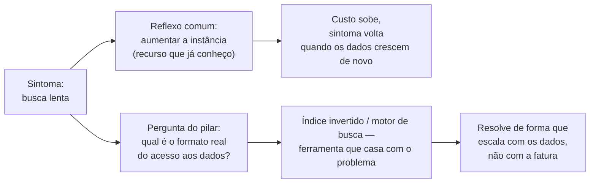
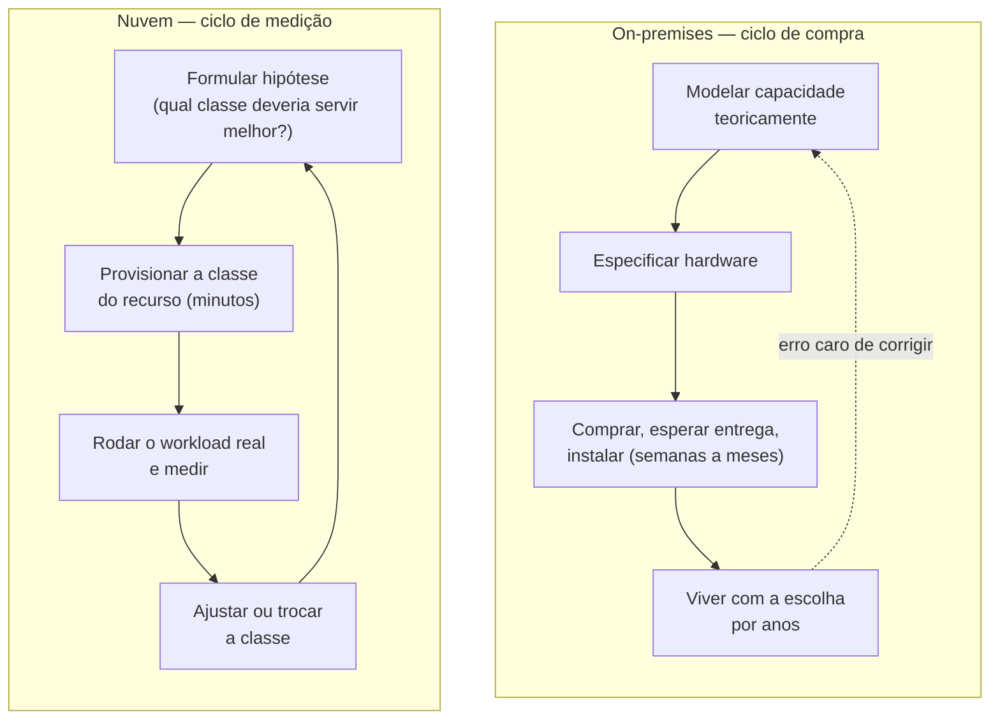

# Eficiência de performance

> [!abstract] TL;DR
> A pergunta que o pilar de eficiência de performance faz não é "isso é rápido?" — é "estamos usando o recurso certo para este trabalho, ou o recurso que já sabemos operar?". Esse viés de familiaridade é o principal inimigo do pilar: times reconstroem, em cima de um serviço gerenciado, exatamente o gargalo que uma peça diferente do catálogo resolveria de graça. O framework oficial da AWS resume isso em cinco princípios — democratizar tecnologias avançadas, ir global em minutos, usar arquiteturas serverless, experimentar com frequência, e ter simpatia mecânica pelo hardware — mas o fio que costura todos eles é o mesmo: na nuvem, trocar a classe de um recurso custa minutos, não meses. Isso muda a pergunta certa de "qual instância deveria, em teoria, ser mais rápida?" para "qual delas *é* mais rápida, medida no seu workload real?". Medir vence teorizar, porque medir agora é barato.

## O gargalo que ninguém tinha pedido

Um sistema de busca de um catálogo de produtos começou simples: uma cláusula `ILIKE '%termo%'` numa tabela Postgres, porque o time já sabia Postgres, o banco já estava rodando, e a funcionalidade precisava sair naquela sprint. Funcionou bem — por um tempo. O catálogo cresceu de alguns milhares de itens para alguns milhões, e a busca, que levava algumas dezenas de milissegundos, passou a levar segundos inteiros em horário de pico, com a CPU do banco baixando no vermelho.

A primeira reação do time foi a mais óbvia para quem só conhece uma ferramenta: aumentar a instância do banco. Trocou-se a classe da máquina para uma com mais vCPU e mais memória, o custo mensal do banco praticamente dobrou, e a latência da busca melhorou — por umas semanas. O catálogo continuou crescendo, e o mesmo sintoma voltou, agora custando mais caro para ser ignorado de novo.

O problema nunca foi "o banco é lento". O problema é que `ILIKE` com curinga à esquerda não usa índice — cada busca varre a tabela inteira, e nenhuma quantidade de CPU adicional resolve isso de forma sustentável, porque o custo cresce junto com os dados, não com o hardware. A ferramenta certa para "encontrar documentos que contêm um termo, ranqueados por relevância" não é um banco relacional genérico com busca por padrão de texto — é um motor de busca de texto completo, com índice invertido construído exatamente para esse acesso. Postgres até tem uma extensão de busca full-text nativa (bem mais barata de adotar que migrar de banco), e existem serviços gerenciados dedicados a isso, prontos para consumir como API. Nenhuma dessas opções era desconhecida da engenharia moderna — era só desconhecida *daquele time*, que preferiu pagar mais pela ferramenta que já sabia operar do que aprender a peça certa do catálogo.

Essa história não é sobre bancos de dados nem sobre busca — é sobre o pilar que esta nota cobre. Eficiência de performance, no Well-Architected Framework, não pergunta "o sistema está rápido?" em abstrato. Pergunta: **você está usando o recurso computacional que casa com o formato do seu problema, ou o recurso que a inércia da equipe escolheu primeiro?**

## O que o framework oficial diz

O pilar de eficiência de performance é um dos seis pilares do Well-Architected Framework — a nota 01 desta trilha já cobriu a origem do framework inteiro e por que ele é feito de perguntas, não de checklist. O whitepaper dedicado ao pilar organiza a orientação em cinco áreas de foco (seleção de arquitetura, computação e hardware, gestão de dados, rede e entrega de conteúdo, e processo e cultura), mas abre com cinco **princípios de design** que resumem a filosofia inteira — vale ler cada um com atenção, porque são eles que sustentam o resto desta nota:

**Democratize tecnologias avançadas.** Delegue tarefas complexas ao seu provedor de nuvem em vez de pedir para o seu time aprender a operar uma tecnologia nova do zero. Bancos NoSQL, transcodificação de mídia, aprendizado de máquina — tudo isso exige expertise especializada para operar bem. Na nuvem, essas tecnologias viram serviços que seu time simplesmente *consome*, e a energia da equipe vai para o produto, não para provisionamento e manutenção de infraestrutura.

**Vá global em minutos.** Implantar seu workload em múltiplas regiões geográficas entrega latência menor e melhor experiência para clientes espalhados pelo mundo, a um custo incremental pequeno — algo que, fora da nuvem, exigia negociar espaço em datacenter em cada continente.

**Use arquiteturas serverless.** Elas eliminam a necessidade de rodar e manter servidores físicos para atividades de computação tradicionais. Isso remove o fardo operacional de administrar servidores e, porque serviços gerenciados operam em escala de nuvem, costuma baixar o custo transacional também.

**Experimente com mais frequência.** Com recursos virtuais e automatizáveis, você pode rodar testes comparativos rapidamente entre diferentes tipos de instância, armazenamento ou configuração — sem o custo de procurar, comprar e instalar hardware físico para cada experimento.

**Considere a simpatia mecânica.** Use a abordagem tecnológica que melhor se alinha com seus objetivos — por exemplo, considere o padrão de acesso aos dados na hora de escolher banco ou armazenamento para o seu workload. "Simpatia mecânica" é um termo emprestado do automobilismo (a ideia de que um bom piloto entende como a máquina funciona por baixo, e dirige de um jeito que trabalha *com* ela, não contra ela) e adotado pela engenharia de software para descrever a mesma postura: escrever ou escolher software que respeita como o hardware — ou o serviço gerenciado — realmente se comporta, em vez de tratá-lo como uma caixa preta genérica.

> [!info] Caducidade
> Os cinco princípios de design e as cinco áreas de foco foram verificados na versão do whitepaper *Performance Efficiency Pillar* publicada pela AWS em 2026-07-20 (revisão de novembro de 2024). O framework é revisado periodicamente — confira a documentação oficial antes de citar a lista como referência formal, por exemplo numa entrevista.

Repare que os cinco princípios não são independentes — eles convergem no mesmo ponto. Democratizar tecnologia via serviço gerenciado, ir global via múltiplas regiões, usar serverless: todos são formas de trocar "eu opero isso do zero" por "eu consumo isso pronto". E "experimentar com frequência" mais "simpatia mecânica" são as duas metades da mesma disciplina: escolher com base em como o recurso *de fato* se comporta com o *seu* workload, não com base em qual recurso parece mais familiar ou mais impressionante no papel. É exatamente o padrão que a história do início desta nota ilustrou ao contrário — o time escolheu o recurso familiar (mais CPU no banco que já conhecia) em vez do recurso que casava com o formato real do problema (um índice de texto).

## O inimigo do pilar tem nome: viés de familiaridade

Vale nomear com honestidade o que realmente sabota este pilar na prática, porque raramente é falta de opção no catálogo — a AWS e a DigitalOcean documentam publicamente dezenas de serviços especializados para cada tipo de carga. O que sabota é um viés cognitivo bem conhecido fora da engenharia: preferir a opção familiar à opção correta, mesmo quando a correta está a uma chamada de API de distância.

Esse viés tem reforço institucional, não só psicológico. Ninguém é responsabilizado por escolher "aumentar a instância do banco que já rodamos há dois anos" — é a decisão mais defensável numa reunião, porque é a decisão que todo mundo já viu antes. Já escolher um serviço novo e especializado é uma decisão visível, com um nome de produto estranho no changelog, que vira alvo de pergunta se o resultado não for perfeito de primeira. O efeito prático é que o time tende a empilhar mais do recurso conhecido em cima de um problema que tem forma diferente — mais CPU num problema de índice, mais réplicas de leitura num problema de query mal desenhada, uma instância maior num problema de I/O — porque escalar o que já se conhece parece, a curto prazo, a decisão mais segura.

O contraponto não é "sempre escolha a tecnologia mais nova e exótica disponível" — isso é o oposto do mesmo erro, trocando familiaridade por novidade como critério, quando o critério certo é nenhum dos dois: é o **formato do problema**. A pergunta "qual é o padrão de acesso real aos dados — leitura sequencial, ponto único, agregação, busca textual, grafo de relacionamentos, série temporal?" tende a apontar direto para a categoria certa de recurso, e essa categoria quase sempre já existe como serviço gerenciado nos dois provedores desta trilha, pronta para consumir sem que ninguém do time precise virar especialista em operá-la do zero — que é exatamente a promessa do primeiro princípio de design, "democratize tecnologias avançadas".

> [!info] Fronteira
> Padrões de acesso a dados, caching, sharding, filas e os conceitos abstratos por trás de cada categoria de recurso são assunto de [[03-Dominios/Engenharia/Arquitetura/index|Arquitetura / System Design]] — esta nota não reensina esses conceitos, usa-os como vocabulário já conhecido para explicar o critério de escolha do pilar.

## O que muda de verdade: performance na nuvem versus performance on-premises

Há uma diferença estrutural entre otimizar performance num datacenter próprio e otimizar performance na nuvem, e ela não é só "a nuvem é mais rápida" — às vezes não é. A diferença real está em **quão caro é mudar de ideia**.

Fora da nuvem, a escolha da classe de hardware é uma decisão de procurement: você especifica o servidor, negocia com o fornecedor, espera a entrega, instala, configura. Errar a escolha — comprar uma máquina otimizada para I/O quando o workload era, na verdade, memory-bound — custa meses de ciclo de compra até corrigir, e o hardware errado continua no rack, depreciando, até alguém decidir substituí-lo. Isso empurra a cultura de decisão para a teorização cuidadosa *antes* de comprar: planilhas de capacidade, projeções de crescimento, comitês de arquitetura que tentam prever, com meses de antecedência, qual classe de máquina vai servir melhor uma carga que ainda nem existe em produção.

Na nuvem, a mesma decisão — "essa carga é melhor servida por uma instância compute-optimized ou memory-optimized?" — pode ser respondida empiricamente, em minutos, porque trocar a classe do recurso é uma chamada de API, não uma ordem de compra. Isso não é um detalhe operacional menor: é uma mudança de categoria na própria disciplina de fazer engenharia de performance. Quando o custo de experimentar cai de meses para minutos, a resposta certa para "qual recurso é mais rápido para este workload?" deixa de ser "vamos modelar teoricamente" e passa a ser "vamos rodar os dois e medir" — é literalmente o quarto princípio de design do pilar, "experimente com mais frequência", e é por isso que ele está na lista: só faz sentido como princípio de *design* porque a nuvem tornou o experimento barato o bastante para ser parte do processo normal, não uma exceção cara.

Essa mudança tem uma consequência prática direta: teorizar sobre performance sem medir passa a ser, na nuvem, um desperdício quase deliberado. Não porque teoria seja inútil — a intuição de "esse workload provavelmente é I/O-bound" ainda é o ponto de partida certo para decidir *o que testar primeiro* — mas porque a etapa seguinte, confirmar a intuição rodando a carga real numa instância candidata e medindo o resultado, é barata o suficiente para ser sempre o passo final antes de comprometer um recurso em produção. Um time que escolhe a classe de instância só com base em benchmark publicado pelo provedor, sem rodar o próprio workload nela, está descartando de graça a vantagem estrutural que a nuvem oferece sobre o modelo antigo. Benchmark publicado mede o hardware; ele não mede como *o seu* código específico, com *o seu* padrão de acesso, se comporta ali — e é exatamente essa lacuna que "simpatia mecânica" pede para fechar.

## As cinco famílias, na lente dupla

Vale ver como "usar o recurso certo, não o conhecido" se materializa no catálogo dos dois provedores desta trilha — não como uma lista de produtos para decorar, mas como o vocabulário concreto por trás da escolha de família de instância.

A AWS organiza suas famílias de instância EC2 em seis categorias oficiais: **general purpose** (equilíbrio entre compute, memória e rede — o ponto de partida padrão), **compute optimized** (processadores de alta performance, para workloads limitados por CPU), **memory optimized** (para processar grandes volumes de dados em memória), **storage optimized** (I/O de baixíssima latência em alto volume), **accelerated computing** (GPUs e outros co-processadores) e **HPC optimized** (voltada a cargas de computação de alta performance em escala). A DigitalOcean organiza seus Droplets numa lógica paralela, com nomes ligeiramente diferentes: **Basic Droplets** (uso eficiente de CPU a custo mais baixo, para cargas gerais leves), **General Purpose Droplets** (proporção equilibrada de memória por CPU dedicada), **CPU-Optimized Droplets** (performance rápida e consistente, para cargas limitadas por processamento), **Memory-Optimized Droplets** (proporção alta de RAM por vCPU) e **Storage-Optimized Droplets** (armazenamento NVMe de baixa latência) — além de GPU Droplets, num catálogo de preços separado dos Droplets de CPU.

O padrão é o mesmo dos dois lados: a família não é um detalhe de catálogo, é a resposta do provedor à mesma pergunta que esta nota vem repetindo — qual é o formato do seu workload? Um job de transcodificação de vídeo é CPU-bound e se beneficia de compute optimized (ou de uma GPU, se o encoder suportar aceleração por hardware). Um cache em memória ou um banco analítico que processa agregações grandes se beneficia de memory optimized. Um banco transacional com alto volume de escrita aleatória se beneficia de storage optimized. Escolher "general purpose para tudo, e aumentar quando ficar lento" é o equivalente, em infraestrutura, de usar `ILIKE` para busca de texto: funciona até o formato do problema deixar de casar com a ferramenta genérica, e cada aumento de instância a partir daí é dinheiro pago para adiar, não para resolver, a causa raiz.

Democratização de tecnologia avançada aparece com a mesma lógica, um nível acima do hardware: em vez de rodar um cluster de busca de texto auto-gerenciado numa VM (voltando ao exemplo de abertura desta nota), consumir um serviço gerenciado de busca ou uma extensão de índice invertido dentro do próprio banco elimina a necessidade de alguém no time virar especialista em operar aquele motor — a AWS e a DigitalOcean, cada uma no seu catálogo, empurram continuamente mais dessas capacidades especializadas para o degrau de "serviço gerenciado que você consome", exatamente a tendência que a nota 03 do galho 1 desta trilha (sobre modelos de serviço) já havia descrito como o espectro de IaaS a SaaS — aqui ele reaparece como estratégia deliberada de performance, não só de operação.

"Ir global em minutos" tem a mesma assimetria de pegada geográfica que apareceu na nota anterior sobre modelos de implantação: a AWS mantém uma malha de regiões e pontos de presença de entrega de conteúdo distribuída globalmente, enquanto a pegada da DigitalOcean é deliberadamente mais enxuta — menos regiões, cobertura mais concentrada. Isso não torna a DigitalOcean "pior" neste princípio; torna a decisão de "preciso de presença em quantos continentes" um critério real de escolha de provedor, não um detalhe. Um produto com base de usuários concentrada numa região específica ganha pouco ou nada indo global; um produto com usuários em múltiplos continentes sente a diferença de latência de forma direta, e é aí que o princípio "vá global em minutos" — trocar uma decisão que levaria meses de negociação de datacenter por uma escolha de região no console — mostra o valor.

> [!info] Caducidade
> Nomes de família de instância e de plano de Droplet, e a contagem de regiões de cada provedor, verificados em 2026-07-20. Provedores de nuvem lançam novas gerações e reorganizam famílias com regularidade — confira a documentação oficial antes de basear uma decisão de arquitetura nesta lista.

| Conceito | AWS | Azure | GCP | DigitalOcean |
|---|---|---|---|---|
| Família de propósito geral | General purpose | General purpose (Dv5/Ev5) | General-purpose (E2/N2) | General Purpose Droplets |
| Família otimizada para CPU | Compute optimized | Compute optimized (Fv2) | Compute-optimized (C2/C3) | CPU-Optimized Droplets |
| Família otimizada para memória | Memory optimized | Memory optimized (Ev5) | Memory-optimized (M2/M3) | Memory-Optimized Droplets |
| Família otimizada para armazenamento | Storage optimized | Storage optimized (Lsv3) | — (via discos Persistent SSD) | Storage-Optimized Droplets |
| Computação acelerada (GPU) | Accelerated computing | GPU-accelerated (NC/ND) | Accelerator-optimized (A2/A3/G2) | GPU Droplets |

> [!info] Fronteira
> Como escolher o *tamanho* dentro de uma família, e como configurar autoscaling para reagir a variação de carga na mecânica, são assuntos dos galhos seguintes desta trilha, dedicados a computação e a escalabilidade — aqui, a família de instância aparece só como o vocabulário concreto por trás do critério "recurso certo para o trabalho certo". O mesmo vale para arquiteturas serverless na mecânica, que ficam para o galho de computação sem servidor mais adiante na trilha.

## Casos práticos

**O motor de busca que virou serviço, não mais CPU.** Retomando o exemplo de abertura: a correção real não foi comprar uma instância de banco ainda maior — foi reconhecer que "buscar texto por relevância" é um padrão de acesso com ferramenta própria. A opção mais barata de adotar foi habilitar a extensão de busca de texto completo nativa do próprio Postgres, que usa índice invertido em vez de varredura sequencial — resolvendo o sintoma sem trocar de banco. Times com volume ou requisitos de relevância mais sofisticados (busca facetada, tolerância a erro de digitação, ranking por múltiplos sinais) tendem a migrar, num segundo momento, para um serviço gerenciado de busca dedicado — mas mesmo a correção mínima já ilustra o ponto central do pilar: o problema nunca precisou de mais hardware, precisava da estrutura de dados certa para o padrão de acesso.

**O job em lote que trocou de família de instância depois de medir, não de adivinhar.** Um pipeline de processamento de imagens rodava havia meses numa instância de propósito geral, escolhida porque era a opção padrão usada por todos os outros serviços do time. Um teste comparativo simples — rodar o mesmo lote de imagens numa instância compute optimized e cronometrar o tempo total — mostrou uma redução relevante no tempo de processamento, suficiente para que o custo total (preço por hora mais alto, mas tempo de execução bem menor) caísse, não subisse. A decisão não exigiu modelagem teórica de antemão — exigiu rodar o experimento, porque na nuvem rodar o experimento custava menos que discutir sobre ele em reunião.

**A API que foi replicada para outra região antes de ser reescrita.** Um serviço com boa parte dos usuários concentrada num continente começou a crescer numa segunda região geográfica, e usuários de lá reportavam lentidão perceptível — a causa não era código lento, era distância física entre o cliente e o único ponto de presença do serviço, o tempo de ida e volta da rede dominando a latência percebida. Reescrever a aplicação para ser mais rápida não teria resolvido nada, porque o gargalo não estava no processamento — estava na geografia. A correção foi replicar a implantação para uma região mais próxima desses usuários, decisão que, na nuvem, é uma escolha de configuração de minutos — exatamente o princípio "vá global em minutos" em ação, resolvendo com topologia o que nenhuma otimização de código resolveria.

## Armadilhas comuns

> [!warning] Tratar "aumentar a instância" como a resposta padrão
> Escalar verticalmente o recurso que você já conhece é a correção mais fácil de justificar numa reunião — e, com frequência, a que menos resolve a causa raiz. Antes de aumentar uma instância, pergunte se o formato do problema (padrão de acesso a dados, tipo de carga, natureza do gargalo) realmente combina com mais do mesmo recurso, ou se existe uma categoria de recurso diferente — outra família de instância, um índice diferente, um serviço gerenciado especializado — que resolve o problema em vez de só adiar o sintoma.

> [!warning] Decidir a classe de recurso por teoria, quando medir custa minutos
> Fora da nuvem, teorizar sobre capacidade antes de comprar fazia sentido, porque errar custava meses de ciclo de compra. Na nuvem, a mesma cautela vira desperdício: se trocar a classe de instância custa minutos, o caminho mais confiável é formular uma hipótese, provisionar a candidata, rodar o workload real e medir — não decidir só com base em benchmark publicado pelo provedor, que mede o hardware genérico, não o seu padrão de acesso específico.

> [!warning] Escolher a tecnologia mais nova como reflexo oposto ao viés de familiaridade
> Evitar a ferramenta conhecida só porque "talvez seja o viés falando" não é o mesmo que escolher bem — é trocar um viés por outro. O critério nunca é "familiar" nem "novo": é o formato real do problema. Um time que migra para um serviço especializado sem medir se o problema de fato tinha aquele formato paga o custo de aprender uma ferramenta nova sem o ganho de performance que a justificaria.

## O que vem a seguir

Esta nota tratou de escolher o recurso certo para o trabalho certo — a pergunta de *performance*. Mas essa mesma escolha de recurso tem um segundo eixo, que ainda não foi tocado com profundidade: quanto ela custa, e como saber se o gasto está sendo bem empregado. Toda decisão desta nota — trocar de família de instância, adotar um serviço gerenciado, replicar para outra região — também move a fatura, às vezes para cima, às vezes para baixo de um jeito contraintuitivo, como o próprio caso do job em lote ilustrou. A próxima nota deste galho, **Otimização de custo**, é o pilar que fecha esse segundo eixo: o critério para decidir se o dinheiro gasto em nuvem está comprando o resultado certo.

## Fontes

- [AWS Well-Architected Framework — Performance Efficiency Pillar (whitepaper completo)](https://docs.aws.amazon.com/wellarchitected/latest/performance-efficiency-pillar/welcome.html) — introdução, seis pilares do framework, cinco áreas de foco do pilar; acessado em 2026-07-20.
- [AWS Well-Architected Framework — Performance Efficiency: Design Principles](https://docs.aws.amazon.com/wellarchitected/latest/performance-efficiency-pillar/design-principles.html) — texto oficial dos cinco princípios de design citados nesta nota; acessado em 2026-07-20.
- [AWS — Amazon EC2 Instance Types (página oficial de produto)](https://aws.amazon.com/ec2/instance-types/) — as seis categorias oficiais de família de instância EC2; acessado em 2026-07-20.
- [DigitalOcean — Droplet Pricing (página oficial)](https://www.digitalocean.com/pricing/droplets) — categorias oficiais de planos de Droplet (Basic, General Purpose, CPU-Optimized, Memory-Optimized, Storage-Optimized) e GPU Droplets como catálogo separado; acessado em 2026-07-20.
- [DigitalOcean — Droplet Pricing / detalhes técnicos](https://docs.digitalocean.com/products/droplets/details/pricing/) — distinção entre CPU Droplets e GPU Droplets, catálogos e taxas separados; acessado em 2026-07-20.
