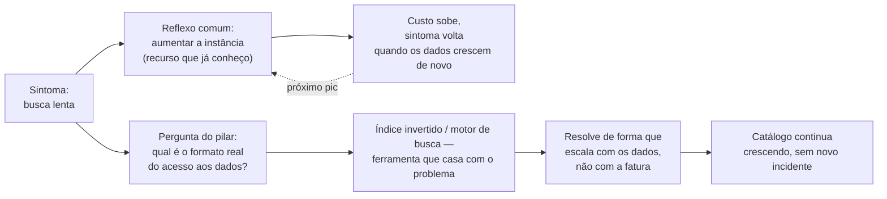
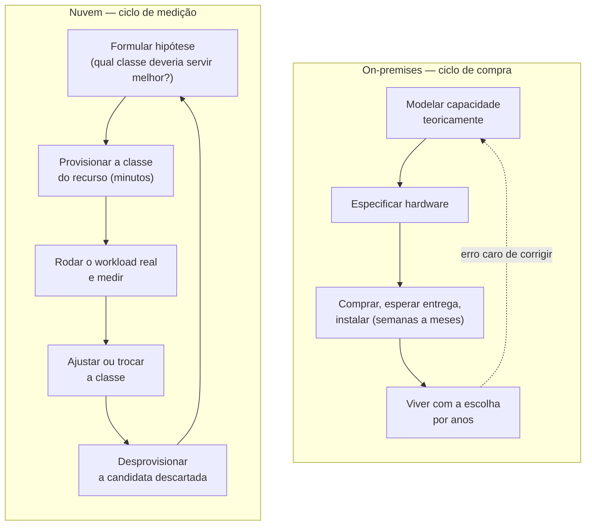
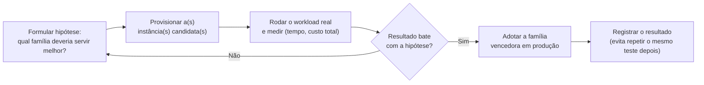
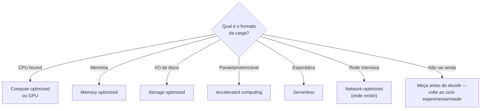

# Eficiência de performance

> [!abstract] TL;DR
> A pergunta que o pilar de eficiência de performance faz não é "isso é rápido?" — é "estamos usando o recurso certo para este trabalho, ou o recurso que já sabemos operar?". Esse viés de familiaridade é o principal inimigo do pilar: times reconstroem, em cima de um serviço gerenciado, exatamente o gargalo que uma peça diferente do catálogo resolveria de graça. O framework oficial da AWS resume isso em cinco princípios — democratizar tecnologias avançadas, ir global em minutos, usar arquiteturas serverless, experimentar com frequência, e ter simpatia mecânica pelo hardware — mas o fio que costura todos eles é o mesmo: na nuvem, trocar a classe de um recurso custa minutos, não meses. Isso muda a pergunta certa de "qual instância deveria, em teoria, ser mais rápida?" para "qual delas *é* mais rápida, medida no seu workload real?". Medir vence teorizar, porque medir agora é barato.

## O gargalo que ninguém tinha pedido

Um sistema de busca de um catálogo de produtos começou simples: uma cláusula `ILIKE '%termo%'` numa tabela Postgres, porque o time já sabia Postgres, o banco já estava rodando, e a funcionalidade precisava sair naquela sprint. Funcionou bem — por um tempo. O catálogo cresceu de alguns milhares de itens para alguns milhões, e a busca, que levava algumas dezenas de milissegundos, passou a levar segundos inteiros em horário de pico, com a CPU do banco baixando no vermelho.

A primeira reação do time foi a mais óbvia para quem só conhece uma ferramenta: aumentar a instância do banco. Trocou-se a classe da máquina para uma com mais vCPU e mais memória, o custo mensal do banco praticamente dobrou, e a latência da busca melhorou — por umas semanas. O catálogo continuou crescendo, e o mesmo sintoma voltou, agora custando mais caro para ser ignorado de novo.

O problema nunca foi "o banco é lento". O problema é que `ILIKE` com curinga à esquerda não usa índice — cada busca varre a tabela inteira, e nenhuma quantidade de CPU adicional resolve isso de forma sustentável, porque o custo cresce junto com os dados, não com o hardware. A ferramenta certa para "encontrar documentos que contêm um termo, ranqueados por relevância" não é um banco relacional genérico com busca por padrão de texto — é um motor de busca de texto completo, com índice invertido construído exatamente para esse acesso. Postgres até tem uma extensão de busca full-text nativa (bem mais barata de adotar que migrar de banco), e existem serviços gerenciados dedicados a isso, prontos para consumir como API. Nenhuma dessas opções era desconhecida da engenharia moderna — era só desconhecida *daquele time*, que preferiu pagar mais pela ferramenta que já sabia operar do que aprender a peça certa do catálogo.

Essa história não é sobre bancos de dados nem sobre busca — é sobre o pilar que esta nota cobre. Eficiência de performance, no Well-Architected Framework, não pergunta "o sistema está rápido?" em abstrato. Pergunta: **você está usando o recurso computacional que casa com o formato do seu problema, ou o recurso que a inércia da equipe escolheu primeiro?**



A forma de medir o efeito da correção diz tanto quanto a correção em si — os números abaixo são ilustrativos (nenhum benchmark real por trás deles), só para mostrar o formato de uma comparação honesta de antes/depois:

| Métrica | Antes (`ILIKE` + instância maior) | Depois (índice invertido) |
|---|---|---|
| Latência da busca em pico (ilustrativo) | ~2,5s | ~80ms |
| CPU do banco em pico (ilustrativo) | perto de 100% | abaixo de 30% |
| Custo mensal da instância de banco (ilustrativo) | dobrou em relação à linha de base | voltou perto da linha de base |
| Comportamento ao crescer o catálogo | degrada de novo (custo cresce com os dados) | escala com o índice, não com o hardware |

A última linha é o diagnóstico que a tabela inteira existe para revelar: a correção de hardware "resolveu" no sentido de que o sintoma sumiu por um tempo, mas continuava escalando linearmente com o tamanho dos dados; a correção de estrutura de dados resolve a causa, então o comportamento ao crescer é qualitativamente diferente — não só "mais rápido agora", mas "não vai voltar a degradar do mesmo jeito".

## O que o framework oficial diz

O pilar de eficiência de performance é um dos seis pilares do Well-Architected Framework — a nota 01 desta trilha já cobriu a origem do framework inteiro e por que ele é feito de perguntas, não de checklist. O whitepaper dedicado ao pilar organiza a orientação em cinco áreas de foco (seleção de arquitetura, computação e hardware, gestão de dados, rede e entrega de conteúdo, e processo e cultura), mas abre com cinco **princípios de design** que resumem a filosofia inteira — vale ler cada um com atenção, porque são eles que sustentam o resto desta nota:

**Democratize tecnologias avançadas.** Delegue tarefas complexas ao seu provedor de nuvem em vez de pedir para o seu time aprender a operar uma tecnologia nova do zero. Bancos NoSQL, transcodificação de mídia, aprendizado de máquina — tudo isso exige expertise especializada para operar bem. Na nuvem, essas tecnologias viram serviços que seu time simplesmente *consome*, e a energia da equipe vai para o produto, não para provisionamento e manutenção de infraestrutura.

**Vá global em minutos.** Implantar seu workload em múltiplas regiões geográficas entrega latência menor e melhor experiência para clientes espalhados pelo mundo, a um custo incremental pequeno — algo que, fora da nuvem, exigia negociar espaço em datacenter em cada continente.

**Use arquiteturas serverless.** Elas eliminam a necessidade de rodar e manter servidores físicos para atividades de computação tradicionais. Isso remove o fardo operacional de administrar servidores e, porque serviços gerenciados operam em escala de nuvem, costuma baixar o custo transacional também.

**Experimente com mais frequência.** Com recursos virtuais e automatizáveis, você pode rodar testes comparativos rapidamente entre diferentes tipos de instância, armazenamento ou configuração — sem o custo de procurar, comprar e instalar hardware físico para cada experimento.

**Considere a simpatia mecânica.** Use a abordagem tecnológica que melhor se alinha com seus objetivos — por exemplo, considere o padrão de acesso aos dados na hora de escolher banco ou armazenamento para o seu workload. "Simpatia mecânica" é um termo emprestado do automobilismo (a ideia de que um bom piloto entende como a máquina funciona por baixo, e dirige de um jeito que trabalha *com* ela, não contra ela) e adotado pela engenharia de software para descrever a mesma postura: escrever ou escolher software que respeita como o hardware — ou o serviço gerenciado — realmente se comporta, em vez de tratá-lo como uma caixa preta genérica.

Cada princípio, na prática de uma review de arquitetura, vira uma pergunta concreta para fazer sobre o desenho — e cada um tem um sintoma característico quando é ignorado:

| Princípio de design | A pergunta da review | Sintoma de violação |
|---|---|---|
| Democratize tecnologias avançadas | "Por que estamos operando isto do zero, em vez de consumir como serviço gerenciado?" | Time mantém cluster auto-gerenciado (busca, fila, cache) que um serviço gerenciado equivalente substituiria |
| Vá global em minutos | "Onde estão os usuários, e onde está o workload rodando?" | Latência alta para usuários distantes da única região ativa, sem plano de replicação geográfica |
| Use arquiteturas serverless | "Este componente precisa mesmo de um servidor sempre ligado?" | Instância rodando 24/7 para atender picos esporádicos, ociosa na maior parte do tempo |
| Experimente com mais frequência | "Testamos a carga real na instância candidata, ou só lemos o benchmark do provedor?" | Escolha de classe de recurso decidida em reunião, sem nenhum teste comparativo rodado |
| Considere a simpatia mecânica | "O tipo de recurso escolhido casa com o padrão de acesso real dos dados?" | Estrutura de dados ou família de instância genérica aplicada a um workload com formato conhecido (busca textual, série temporal, grafo) |

> [!info] Caducidade
> Os cinco princípios de design e as cinco áreas de foco foram verificados na versão do whitepaper *Performance Efficiency Pillar* publicada pela AWS (revisão de 6 de novembro de 2024), com a leitura conferida novamente em 2026-07-22. O framework é revisado periodicamente — confira a documentação oficial antes de citar a lista como referência formal, por exemplo numa entrevista.

> [!tip] Assista: Understanding the Performance Efficiency Pillar of AWS Architecture
> **Canal:** K21Academy | **Duração:** ~10min | **Idioma:** EN
>
> Percorre os cinco princípios de design um a um com exemplo concreto de serviço AWS para cada um — do CloudFront para "ir global em minutos" ao DynamoDB com auto scaling para "democratizar tecnologias avançadas" — útil como referência rápida de "qual serviço ilustra qual princípio". Trecho de destaque [05:31]: *"go global in minutes like CloudFront... like S3, like DynamoDB — with DynamoDB you can create global tables"*.
>
> 🎬 [Assistir no YouTube](https://www.youtube.com/watch?v=rej46dgMmqM)

Repare que os cinco princípios não são independentes — eles convergem no mesmo ponto. Democratizar tecnologia via serviço gerenciado, ir global via múltiplas regiões, usar serverless: todos são formas de trocar "eu opero isso do zero" por "eu consumo isso pronto". E "experimentar com frequência" mais "simpatia mecânica" são as duas metades da mesma disciplina: escolher com base em como o recurso *de fato* se comporta com o *seu* workload, não com base em qual recurso parece mais familiar ou mais impressionante no papel. É exatamente o padrão que a história do início desta nota ilustrou ao contrário — o time escolheu o recurso familiar (mais CPU no banco que já conhecia) em vez do recurso que casava com o formato real do problema (um índice de texto).

## As cinco áreas de foco: onde o whitepaper aterrissa cada princípio

Os cinco princípios de design são a filosofia; as cinco **áreas de foco** do whitepaper são onde essa filosofia vira orientação prática, área por área do sistema. Vale nomeá-las, já que esta nota não cobre todas com a mesma profundidade — algumas pertencem a outras notas desta trilha ou a outros domínios do vault, e é melhor apontar a fronteira do que fingir cobertura completa:

| Área de foco | O que o whitepaper orienta ali | Onde aprofundar |
|---|---|---|
| Seleção de arquitetura | Escolher o padrão de arquitetura (monolito, microsserviços, orientado a eventos) que serve o workload | [[03-Dominios/Engenharia/Arquitetura/index\|Arquitetura / System Design]] |
| Computação e hardware | Escolher família e tamanho de instância, arquitetura de processador, aceleração por GPU | Esta nota (famílias) + galhos de computação desta trilha (tamanho, autoscaling) |
| Gestão de dados | Escolher o tipo de armazenamento e banco que casa com o padrão de acesso aos dados | [[03-Dominios/Engenharia/Arquitetura/index\|Arquitetura / System Design]] |
| Rede e entrega de conteúdo | Reduzir latência de rede via região, CDN, roteamento de borda | [[03-Dominios/Engenharia/Arquitetura/index\|Arquitetura / System Design]] (CDN/caching) e [[03-Dominios/Tecnologia/Web Performance/index\|Web Performance]] (Core Web Vitals) |
| Processo e cultura | Instituir o hábito de medir antes de decidir, e revisar performance com regularidade | Esta nota (o ciclo experimentar → medir → ajustar) |

Repare que "computação e hardware" e "processo e cultura" são as duas áreas que esta nota realmente cobre em profundidade — as outras três aparecem aqui só o suficiente para o leitor saber que existem e para onde ir se precisar delas. Isso não é descuido: é a mesma disciplina de fronteira que esta trilha aplica em toda nota, para não duplicar conteúdo que já tem endereço fixo em outro domínio.

Cada área também vira uma pergunta de bolso diferente da tabela de princípios já vista — a diferença é que a tabela de princípios pergunta "por que decidimos assim", e esta pergunta "onde no sistema isso se aplica":

| Área de foco | Pergunta de bolso |
|---|---|
| Seleção de arquitetura | O padrão de arquitetura escolhido (monolito, filas, eventos) casa com o formato real da carga? |
| Computação e hardware | A família de instância em uso foi escolhida por medição, ou por ser a que o time já conhecia? |
| Gestão de dados | A estrutura de armazenamento casa com o padrão de acesso, ou foi herdada de outro contexto? |
| Rede e entrega de conteúdo | Os usuários mais distantes da região ativa sentem a latência, e isso importa para o negócio? |
| Processo e cultura | Existe um hábito institucional de medir antes de decidir, ou cada decisão reinventa o processo? |

## O inimigo do pilar tem nome: viés de familiaridade

Vale nomear com honestidade o que realmente sabota este pilar na prática, porque raramente é falta de opção no catálogo — a AWS e a DigitalOcean documentam publicamente dezenas de serviços especializados para cada tipo de carga. O que sabota é um viés cognitivo bem conhecido fora da engenharia: preferir a opção familiar à opção correta, mesmo quando a correta está a uma chamada de API de distância.

Esse viés tem reforço institucional, não só psicológico. Ninguém é responsabilizado por escolher "aumentar a instância do banco que já rodamos há dois anos" — é a decisão mais defensável numa reunião, porque é a decisão que todo mundo já viu antes. Já escolher um serviço novo e especializado é uma decisão visível, com um nome de produto estranho no changelog, que vira alvo de pergunta se o resultado não for perfeito de primeira. O efeito prático é que o time tende a empilhar mais do recurso conhecido em cima de um problema que tem forma diferente — mais CPU num problema de índice, mais réplicas de leitura num problema de query mal desenhada, uma instância maior num problema de I/O — porque escalar o que já se conhece parece, a curto prazo, a decisão mais segura.

O contraponto não é "sempre escolha a tecnologia mais nova e exótica disponível" — isso é o oposto do mesmo erro, trocando familiaridade por novidade como critério, quando o critério certo é nenhum dos dois: é o **formato do problema**. A pergunta "qual é o padrão de acesso real aos dados — leitura sequencial, ponto único, agregação, busca textual, grafo de relacionamentos, série temporal?" tende a apontar direto para a categoria certa de recurso, e essa categoria quase sempre já existe como serviço gerenciado nos dois provedores desta trilha, pronta para consumir sem que ninguém do time precise virar especialista em operá-la do zero — que é exatamente a promessa do primeiro princípio de design, "democratize tecnologias avançadas".

> [!info] Fronteira
> Padrões de acesso a dados, caching, sharding, filas e os conceitos abstratos por trás de cada categoria de recurso são assunto de [[03-Dominios/Engenharia/Arquitetura/index|Arquitetura / System Design]] — esta nota não reensina esses conceitos, usa-os como vocabulário já conhecido para explicar o critério de escolha do pilar.

Nomear o viés não basta para neutralizá-lo — ele tem reforço institucional, então a contramedida também precisa ser institucional, não só um lembrete individual na cabeça de quem decide:

| Tática | Como funciona | Exemplo |
|---|---|---|
| Exigir o experimento antes da decisão | Nenhuma troca de família de instância é aprovada sem um teste comparativo documentado | O job em lote só trocou de família depois do benchmark, não antes |
| Dar nome ao padrão de acesso na review | A pergunta obrigatória vira "qual é o formato do problema?", não "qual recurso resolve?" | Transformar "o banco está lento" em "isso é busca textual, não filtro relacional" |
| Revisar o pilar com regularidade, não só quando dói | Reservar um espaço recorrente (trimestral, por exemplo) para revisitar decisões antigas de recurso | O job noturno rodando 24h só foi questionado numa revisão deliberada, não por incidente |
| Tornar o custo do "recurso familiar" visível | Mostrar o custo acumulado de escalar verticalmente o mesmo recurso ao longo do tempo | O gráfico de gasto mensal do banco, subindo a cada trimestre, torna o padrão visível |

Repare que as quatro táticas são variações do mesmo movimento: tirar a decisão do improviso de uma reunião e colocar num processo que força a pergunta certa a aparecer — é a área de foco "processo e cultura" do whitepaper (apresentada na seção anterior) funcionando como engrenagem, não como slogan.

## O que muda de verdade: performance na nuvem versus performance on-premises

Há uma diferença estrutural entre otimizar performance num datacenter próprio e otimizar performance na nuvem, e ela não é só "a nuvem é mais rápida" — às vezes não é. A diferença real está em **quão caro é mudar de ideia**.

Fora da nuvem, a escolha da classe de hardware é uma decisão de procurement: você especifica o servidor, negocia com o fornecedor, espera a entrega, instala, configura. Errar a escolha — comprar uma máquina otimizada para I/O quando o workload era, na verdade, memory-bound — custa meses de ciclo de compra até corrigir, e o hardware errado continua no rack, depreciando, até alguém decidir substituí-lo. Isso empurra a cultura de decisão para a teorização cuidadosa *antes* de comprar: planilhas de capacidade, projeções de crescimento, comitês de arquitetura que tentam prever, com meses de antecedência, qual classe de máquina vai servir melhor uma carga que ainda nem existe em produção.

Na nuvem, a mesma decisão — "essa carga é melhor servida por uma instância compute-optimized ou memory-optimized?" — pode ser respondida empiricamente, em minutos, porque trocar a classe do recurso é uma chamada de API, não uma ordem de compra. Isso não é um detalhe operacional menor: é uma mudança de categoria na própria disciplina de fazer engenharia de performance. Quando o custo de experimentar cai de meses para minutos, a resposta certa para "qual recurso é mais rápido para este workload?" deixa de ser "vamos modelar teoricamente" e passa a ser "vamos rodar os dois e medir" — é literalmente o quarto princípio de design do pilar, "experimente com mais frequência", e é por isso que ele está na lista: só faz sentido como princípio de *design* porque a nuvem tornou o experimento barato o bastante para ser parte do processo normal, não uma exceção cara.



A tabela a seguir resume o que muda de categoria, não só de velocidade, entre os dois modelos:

| Dimensão | On-premises | Nuvem |
|---|---|---|
| Custo de trocar a classe de recurso | Ciclo de compra — semanas a meses | Chamada de API — minutos |
| Custo de errar a escolha inicial | Alto: hardware errado fica no rack, depreciando | Baixo: descarta a instância e provisiona outra |
| Cultura de decisão dominante | Modelagem teórica de capacidade, antes de comprar | Experimento empírico, depois de provisionar |
| Papel do benchmark publicado | Referência principal (é o que dá para consultar antes de comprar) | Ponto de partida para hipótese — nunca a decisão final |
| Quando medir o workload real | Difícil e tardio (só depois da compra) | Barato e cedo (antes de comprometer o recurso em produção) |

Essa mudança tem uma consequência prática direta: teorizar sobre performance sem medir passa a ser, na nuvem, um desperdício quase deliberado. Não porque teoria seja inútil — a intuição de "esse workload provavelmente é I/O-bound" ainda é o ponto de partida certo para decidir *o que testar primeiro* — mas porque a etapa seguinte, confirmar a intuição rodando a carga real numa instância candidata e medindo o resultado, é barata o suficiente para ser sempre o passo final antes de comprometer um recurso em produção. Um time que escolhe a classe de instância só com base em benchmark publicado pelo provedor, sem rodar o próprio workload nela, está descartando de graça a vantagem estrutural que a nuvem oferece sobre o modelo antigo. Benchmark publicado mede o hardware; ele não mede como *o seu* código específico, com *o seu* padrão de acesso, se comporta ali — e é exatamente essa lacuna que "simpatia mecânica" pede para fechar.

## Meça, não teorize: uma ilustração do princípio

"Experimente com mais frequência" soa abstrato até virar dois comandos. Para decidir entre uma instância de propósito geral e uma compute optimized para o mesmo job de processamento em lote, o caminho não é ler a ficha técnica de cada uma — é provisionar as duas, rodar a carga real e cronometrar. Os blocos abaixo ilustram a forma do comando, lado a lado nos dois provedores desta trilha; nenhum número de tempo ou custo aqui é medição real, é só a forma de uma execução.

```bash
# AWS — sobe uma instância de propósito geral e uma compute optimized
# para rodar o mesmo job e comparar (nomes de flag conferidos na doc oficial)
aws ec2 run-instances \
  --image-id ami-0abcdef1234567890 \
  --instance-type m7i.xlarge \
  --key-name minha-chave \
  --tag-specifications 'ResourceType=instance,Tags=[{Key=bench,Value=general-purpose}]'

aws ec2 run-instances \
  --image-id ami-0abcdef1234567890 \
  --instance-type c7i.xlarge \
  --key-name minha-chave \
  --tag-specifications 'ResourceType=instance,Tags=[{Key=bench,Value=compute-optimized}]'
```

```bash
# DigitalOcean — o mesmo experimento com doctl
doctl compute droplet create bench-general \
  --size s-4vcpu-8gb --image ubuntu-22-04-x64 --region nyc3

doctl compute droplet create bench-cpu-otimizado \
  --size c-4 --image ubuntu-22-04-x64 --region nyc3
```

```bash
# Azure e GCP — a mesma tradução de comando, para completar a lente dos quatro
# provedores da tabela mais adiante nesta nota (sintaxe conferida na doc oficial)
az vm create --resource-group bench-rg --name bench-general \
  --image Ubuntu2204 --size Standard_D2s_v5

gcloud compute instances create bench-cpu-otimizado \
  --machine-type=c2-standard-4 \
  --image-family=ubuntu-2204-lts --image-project=ubuntu-os-cloud \
  --zone=us-central1-a
```

```bash
# Em cada instância, o mesmo job real (ilustrativo — não é benchmark oficial)
time ./processa-lote.sh --entrada imagens/ --saida resultados/
# general purpose: ~42min (ilustrativo)
# compute optimized: ~24min (ilustrativo) — custo por hora maior,
# mas custo total do job menor, porque terminou mais rápido
```

A terceira linha é o ponto inteiro do exercício: o número que importa não é o preço por hora de cada instância — é o custo do job completo, tempo de execução vezes preço por hora. Uma instância mais cara por hora que termina o trabalho na metade do tempo pode custar menos no total, e só medir descobre isso; comparar preço por hora nas duas fichas técnicas, sozinho, aponta pro lado errado.

> [!tip] Assista: AWS re:Invent 2017 - Optimizing Performance and Efficiency for Amazon EC2 and More (ARC329)
> **Canal:** Amazon Web Services (oficial) | **Duração:** ~59min | **Idioma:** EN
>
> Vídeo mais antigo, mas o raciocínio continua valendo: o palestrante mostra por que escolher a instância certa é um problema de "matemática em seis dimensões" (CPU, memória, storage, rede, família de hardware e a relação entre elas) — e por que otimizar a felicidade do host, sem medir a experiência real da aplicação de ponta a ponta, é o erro clássico que o princípio de simpatia mecânica desta nota tenta evitar. Trecho de destaque [16:40]: *"application quality of service and true measurement of end-to-end experience is what's important"*; e [21:04]: *"you have to be able to do six dimensional math"*.
>
> 🎬 [Assistir no YouTube](https://www.youtube.com/watch?v=r2Hhg7pA-WU)

Antes mesmo de formular a hipótese sobre qual família testar, o próprio sintoma do sistema em produção já dá uma pista de onde olhar primeiro — os painéis de métricas nativos de cada provedor (CloudWatch na AWS, Monitoring na DigitalOcean) mostram esses sinais sem esforço extra de instrumentação:

| Sinal observado nas métricas | Gargalo provável | Família a testar primeiro |
|---|---|---|
| CPU sustentada perto de 100%, memória e disco ociosos | Compute-bound | Compute optimized |
| Memória perto do limite, swap ativo, CPU ociosa | Memory-bound | Memory optimized |
| Fila de I/O crescendo, IOPS no teto do disco, CPU ociosa | I/O-bound | Storage optimized |
| Todos os sinais moderados, mas latência de rede alta para uma região específica | Distância geográfica, não recurso | Replicação de região (não é troca de família) |
| Throughput de rede saturado entre instâncias do mesmo cluster, CPU e disco ociosos | Rede intensiva (tráfego leste-oeste) | Network-optimized ou revisão de topologia do cluster |

> [!info] Fronteira
> Configurar e ler esses painéis de observabilidade em profundidade — métricas, alertas, dashboards, os cinco pilares da observabilidade — é assunto de [[03-Dominios/Engenharia/Operação/index|Operação]], não desta trilha; aqui, a tabela só liga o sintoma de métrica ao tipo de família a testar, para fechar o ciclo de "meça, não teorize" com um ponto de partida concreto.



## As cinco famílias, na lente dupla

Vale ver como "usar o recurso certo, não o conhecido" se materializa no catálogo dos dois provedores desta trilha — não como uma lista de produtos para decorar, mas como o vocabulário concreto por trás da escolha de família de instância.

A AWS organiza suas famílias de instância EC2 em seis categorias oficiais: **general purpose** (equilíbrio entre compute, memória e rede — o ponto de partida padrão), **compute optimized** (processadores de alta performance, para workloads limitados por CPU), **memory optimized** (para processar grandes volumes de dados em memória), **storage optimized** (I/O de baixíssima latência em alto volume), **accelerated computing** (GPUs e outros co-processadores) e **HPC optimized** (voltada a cargas de computação de alta performance em escala). A DigitalOcean organiza seus Droplets numa lógica paralela, com nomes ligeiramente diferentes: **Basic Droplets** (uso eficiente de CPU a custo mais baixo, para cargas gerais leves), **General Purpose Droplets** (proporção equilibrada de memória por CPU dedicada), **CPU-Optimized Droplets** (performance rápida e consistente, para cargas limitadas por processamento), **Memory-Optimized Droplets** (proporção alta de RAM por vCPU) e **Storage-Optimized Droplets** (armazenamento NVMe de baixa latência) — além de GPU Droplets, num catálogo de preços separado dos Droplets de CPU.

O padrão é o mesmo dos dois lados: a família não é um detalhe de catálogo, é a resposta do provedor à mesma pergunta que esta nota vem repetindo — qual é o formato do seu workload? Um job de transcodificação de vídeo é CPU-bound e se beneficia de compute optimized (ou de uma GPU, se o encoder suportar aceleração por hardware). Um cache em memória ou um banco analítico que processa agregações grandes se beneficia de memory optimized. Um banco transacional com alto volume de escrita aleatória se beneficia de storage optimized. Escolher "general purpose para tudo, e aumentar quando ficar lento" é o equivalente, em infraestrutura, de usar `ILIKE` para busca de texto: funciona até o formato do problema deixar de casar com a ferramenta genérica, e cada aumento de instância a partir daí é dinheiro pago para adiar, não para resolver, a causa raiz.

A tabela abaixo traduz esse critério em pergunta de bolso — o formato do workload aponta a família, e a coluna da direita nomeia a armadilha de familiaridade que normalmente puxa o time na direção errada:

| Tipo de carga | Família de recurso que serve | Armadilha de escolher pela familiaridade |
|---|---|---|
| CPU-bound (transcodificação, processamento em lote, renderização) | Compute optimized / GPU-accelerated | Aumentar uma instância general purpose repetidamente em vez de trocar de família |
| Memória (cache, agregação em memória, banco analítico) | Memory optimized | Empilhar réplicas de leitura num banco genérico em vez de subir a proporção RAM/vCPU |
| I/O de alto volume (banco transacional com escrita aleatória, filas em disco) | Storage optimized | Aceitar disco de rede lento porque "instância maior" parece a correção mais simples |
| Paralela / vetorizável (treino de ML, simulação, renderização 3D) | Accelerated computing (GPU) | Tentar paralelizar em CPU o que uma GPU resolveria numa fração do tempo |
| Esporádica / imprevisível (webhook raro, job de manutenção noturno) | Serverless / função gerenciada | Manter instância 24/7 ligada para atender um evento que ocorre poucas vezes ao dia |
| Rede intensiva (streaming, replicação entre nós, tráfego leste-oeste alto) | Network-optimized (onde o provedor tiver) ou compute optimized com rede reforçada | Culpar o código pela latência quando o gargalo é banda de rede entre instâncias |

O mesmo critério, em forma de árvore de decisão rápida — útil como ponto de partida numa review, nunca como substituto de medir o workload real:



Democratização de tecnologia avançada aparece com a mesma lógica, um nível acima do hardware: em vez de rodar um cluster de busca de texto auto-gerenciado numa VM (voltando ao exemplo de abertura desta nota), consumir um serviço gerenciado de busca ou uma extensão de índice invertido dentro do próprio banco elimina a necessidade de alguém no time virar especialista em operar aquele motor — a AWS e a DigitalOcean, cada uma no seu catálogo, empurram continuamente mais dessas capacidades especializadas para o degrau de "serviço gerenciado que você consome", exatamente a tendência que a nota 03 do galho 1 desta trilha (sobre modelos de serviço) já havia descrito como o espectro de IaaS a SaaS — aqui ele reaparece como estratégia deliberada de performance, não só de operação.

"Ir global em minutos" tem a mesma assimetria de pegada geográfica que apareceu na nota anterior sobre modelos de implantação: a AWS mantém uma malha de regiões e pontos de presença de entrega de conteúdo distribuída globalmente, enquanto a pegada da DigitalOcean é deliberadamente mais enxuta — menos regiões, cobertura mais concentrada. Isso não torna a DigitalOcean "pior" neste princípio; torna a decisão de "preciso de presença em quantos continentes" um critério real de escolha de provedor, não um detalhe. Um produto com base de usuários concentrada numa região específica ganha pouco ou nada indo global; um produto com usuários em múltiplos continentes sente a diferença de latência de forma direta, e é aí que o princípio "vá global em minutos" — trocar uma decisão que levaria meses de negociação de datacenter por uma escolha de região no console — mostra o valor.

> [!info] Caducidade
> Nomes de família de instância e de plano de Droplet, e a contagem de regiões de cada provedor, verificados em 2026-07-22 diretamente na documentação oficial de cada provedor (EC2, Azure VM sizes, GCP machine families, Droplet pricing). Provedores de nuvem lançam novas gerações e reorganizam famílias com regularidade — confira a documentação oficial antes de basear uma decisão de arquitetura nesta lista.

| Conceito | AWS | Azure | GCP | DigitalOcean |
|---|---|---|---|---|
| Família de propósito geral | General purpose | General purpose (Dv5) | General-purpose (E2/N2) | General Purpose Droplets |
| Família otimizada para CPU | Compute optimized | Compute optimized (Fv2) | Compute-optimized (C2/C2D) | CPU-Optimized Droplets |
| Família otimizada para memória | Memory optimized | Memory optimized (Ev5) | Memory-optimized (M2/M3) | Memory-Optimized Droplets |
| Família otimizada para armazenamento | Storage optimized | Storage optimized (Lsv3) | Storage-optimized (Z3) | Storage-Optimized Droplets |
| Computação acelerada (GPU) | Accelerated computing | GPU-accelerated (NC/ND) | Accelerator-optimized (A2/A3/G2) | GPU Droplets |
| Computação de alta performance (HPC) | HPC optimized | HPC (HB/HBv5-family) | Compute-optimized com H3/H4D | Sem família dedicada — via CPU-Optimized |

> [!info] Fronteira
> Como escolher o *tamanho* dentro de uma família, e como configurar autoscaling para reagir a variação de carga na mecânica, são assuntos dos galhos seguintes desta trilha, dedicados a computação e a escalabilidade — aqui, a família de instância aparece só como o vocabulário concreto por trás do critério "recurso certo para o trabalho certo". O mesmo vale para arquiteturas serverless na mecânica, que ficam para o galho de computação sem servidor mais adiante na trilha.

A família HPC optimized é a mais nichada das seis — vale um parágrafo à parte porque o formato do workload que ela serve é bem diferente dos outros cinco. Ela não existe para atender mais requisições por segundo nem para processar mais dados em memória: existe para simulações que rodam em clusters de centenas ou milhares de núcleos interconectados por rede de baixíssima latência (dinâmica de fluidos computacional, modelagem climática, projeto de circuitos eletrônicos), onde o gargalo não é a CPU de uma máquina isolada, é a comunicação entre máquinas do cluster inteiro. É por isso que a DigitalOcean, cujo catálogo é deliberadamente mais enxuto, não tem uma família própria para esse caso: o público que precisa de HPC de verdade tende a já estar nos provedores com a malha de rede especializada para viabilizar esse tipo de cluster.

> [!info] O catálogo nunca é idêntico entre provedores
> A tabela acima simplifica de propósito para caber em cinco linhas comparáveis, mas o catálogo real de cada provedor não é um espelho perfeito dos outros três. O GCP, por exemplo, mantém uma sexta categoria própria — **network-optimized** (séries C4N e M4N) — voltada a workloads que exigem banda de rede alta acima de tudo, sem equivalente direto de nome nas outras três colunas da tabela. Isso não é uma lacuna da tabela: é o lembrete de que "recurso certo para o trabalho certo" às vezes significa reconhecer que um provedor específico tem uma peça de catálogo que os outros simplesmente não oferecem — e que decidir por provedor único, cedo demais, pode fechar a porta para essa peça mais tarde.

## Casos práticos

Quatro decisões reais, cada uma resolvendo um princípio de design diferente da tabela vista mais acima — vale ler as quatro juntas, porque o padrão que se repete é mais informativo do que qualquer caso isolado.

**O motor de busca que virou serviço, não mais CPU.** Retomando o exemplo de abertura: a correção real não foi comprar uma instância de banco ainda maior — foi reconhecer que "buscar texto por relevância" é um padrão de acesso com ferramenta própria. A opção mais barata de adotar foi habilitar a extensão de busca de texto completo nativa do próprio Postgres, que usa índice invertido em vez de varredura sequencial — resolvendo o sintoma sem trocar de banco. Times com volume ou requisitos de relevância mais sofisticados (busca facetada, tolerância a erro de digitação, ranking por múltiplos sinais) tendem a migrar, num segundo momento, para um serviço gerenciado de busca dedicado — mas mesmo a correção mínima já ilustra o ponto central do pilar: o problema nunca precisou de mais hardware, precisava da estrutura de dados certa para o padrão de acesso.

**O job em lote que trocou de família de instância depois de medir, não de adivinhar.** Um pipeline de processamento de imagens rodava havia meses numa instância de propósito geral, escolhida porque era a opção padrão usada por todos os outros serviços do time. Um teste comparativo simples — rodar o mesmo lote de imagens numa instância compute optimized e cronometrar o tempo total — mostrou uma redução relevante no tempo de processamento, suficiente para que o custo total (preço por hora mais alto, mas tempo de execução bem menor) caísse, não subisse. A decisão não exigiu modelagem teórica de antemão — exigiu rodar o experimento, porque na nuvem rodar o experimento custava menos que discutir sobre ele em reunião.

**A API que foi replicada para outra região antes de ser reescrita.** Um serviço com boa parte dos usuários concentrada num continente começou a crescer numa segunda região geográfica, e usuários de lá reportavam lentidão perceptível — a causa não era código lento, era distância física entre o cliente e o único ponto de presença do serviço, o tempo de ida e volta da rede dominando a latência percebida. Reescrever a aplicação para ser mais rápida não teria resolvido nada, porque o gargalo não estava no processamento — estava na geografia. A correção foi replicar a implantação para uma região mais próxima desses usuários, decisão que, na nuvem, é uma escolha de configuração de minutos — exatamente o princípio "vá global em minutos" em ação, resolvendo com topologia o que nenhuma otimização de código resolveria.

**O relatório noturno que virou função, não instância.** Um relatório de fechamento diário rodava havia anos numa instância dedicada, ligada 24 horas por dia, só para executar um job que levava vinte minutos, uma vez por noite. Ninguém questionava o desenho porque "é só como sempre foi feito" — a instância existia antes de qualquer pessoa do time atual ter entrado na empresa. Ao revisar o pilar de eficiência de performance, alguém fez a pergunta óbvia que ninguém tinha feito: por que um job de vinte minutos por dia precisa de uma máquina ligada os outros 1.420 minutos do dia? A correção foi migrar o job para uma função serverless, disparada por um agendador, sem instância nenhuma para manter — o princípio "use arquiteturas serverless" em ação, eliminando não uma ferramenta errada, mas uma ferramenta *correta demais* para o tamanho real do problema. O caso ilustra a outra face do viés de familiaridade: não é só usar o recurso errado por hábito, é manter o recurso certo *do jeito errado* — provisionado o tempo todo para um trabalho que só existe por minutos.

## Armadilhas comuns

As quatro armadilhas abaixo são as formas mais comuns de o pilar dar errado na prática — e, propositalmente, elas não puxam todas na mesma direção: as duas primeiras vêm do excesso de familiaridade, a terceira do excesso oposto (novidade pela novidade), e a quarta é o caso menos óbvio, o recurso certo mantido do jeito errado.

> [!warning] Tratar "aumentar a instância" como a resposta padrão
> Escalar verticalmente o recurso que você já conhece é a correção mais fácil de justificar numa reunião — e, com frequência, a que menos resolve a causa raiz. Antes de aumentar uma instância, pergunte se o formato do problema (padrão de acesso a dados, tipo de carga, natureza do gargalo) realmente combina com mais do mesmo recurso, ou se existe uma categoria de recurso diferente — outra família de instância, um índice diferente, um serviço gerenciado especializado — que resolve o problema em vez de só adiar o sintoma.

> [!warning] Decidir a classe de recurso por teoria, quando medir custa minutos
> Fora da nuvem, teorizar sobre capacidade antes de comprar fazia sentido, porque errar custava meses de ciclo de compra. Na nuvem, a mesma cautela vira desperdício: se trocar a classe de instância custa minutos, o caminho mais confiável é formular uma hipótese, provisionar a candidata, rodar o workload real e medir — não decidir só com base em benchmark publicado pelo provedor, que mede o hardware genérico, não o seu padrão de acesso específico.

> [!warning] Escolher a tecnologia mais nova como reflexo oposto ao viés de familiaridade
> Evitar a ferramenta conhecida só porque "talvez seja o viés falando" não é o mesmo que escolher bem — é trocar um viés por outro. O critério nunca é "familiar" nem "novo": é o formato real do problema. Um time que migra para um serviço especializado sem medir se o problema de fato tinha aquele formato paga o custo de aprender uma ferramenta nova sem o ganho de performance que a justificaria.

> [!warning] Manter um recurso sempre ligado para um trabalho que só existe por minutos
> O reflexo de "provisionar uma instância dedicada e deixá-la lá" funciona para cargas contínuas, mas vira desperdício silencioso quando aplicado a um trabalho esporádico — como o relatório noturno desta nota, ligado 24 horas para vinte minutos de trabalho real. O sintoma não aparece como incidente (nada quebra), então ele sobrevive anos sem ser questionado. Antes de provisionar algo "porque é assim que sempre fizemos", pergunte com que frequência o trabalho de fato acontece — se a resposta for "raramente" ou "só por alguns minutos", o princípio "use arquiteturas serverless" provavelmente resolve mais barato.

## Quando este pilar entra em tensão com os outros

Well-Architected não pede que você maximize performance a qualquer custo — os seis pilares às vezes puxam em direções opostas, e reconhecer a tensão é parte do trabalho de arquitetura, não um defeito do framework. A nota 01 desta trilha já apresentou os seis pilares como um conjunto de perguntas, não um checklist; esta seção mostra o que acontece quando duas dessas perguntas competem pela mesma decisão.

A tensão mais comum é com o pilar de custo: a família de instância mais rápida quase sempre custa mais por hora, e "mais rápido" só vale a pena se o ganho de tempo (ou de experiência do usuário) compensar o gasto extra — pergunta que a próxima nota deste galho resolve com profundidade. A segunda tensão é com confiabilidade: uma otimização agressiva (cache adicional, sharding, réplica de leitura) costuma introduzir um componente novo no sistema, e todo componente novo é um ponto de falha novo — a pergunta certa não é só "isso fica mais rápido?", é "o ganho de velocidade justifica o risco operacional a mais?". A terceira, menos discutida mas real, é com sustentabilidade: superprovisionar "só para garantir performance" mantém hardware ligado além do necessário, e o sexto pilar do framework existe exatamente para pautar esse desperdício.

| Tensão | Pergunta que resolve o empate | Pilar irmão |
|---|---|---|
| Performance vs custo | O ganho de velocidade, medido no workload real, justifica o gasto extra por hora? | Otimização de custo (próxima nota) |
| Performance vs confiabilidade | A otimização adiciona um ponto de falha novo que compensa o ganho de velocidade? | Confiabilidade |
| Performance vs sustentabilidade | O recurso está dimensionado para a carga real medida, ou para um pico teórico raro? | Sustentabilidade |
| Performance vs segurança | O controle de segurança adicionado (criptografia em trânsito, inspeção de tráfego) é necessário sem virar gargalo evitável? | Segurança |

> [!info] Fronteira
> Esta nota não resolve essas tensões — só nomeia onde elas aparecem. Cada pilar irmão citado na tabela tem (ou terá) sua própria nota neste galho, com o critério de decisão completo daquele lado da balança.

## Quando "bom o suficiente" já é a resposta certa

Vale fechar com o contrapeso que esta nota, focada em corrigir o viés de familiaridade, poderia deixar escapar: nem todo sistema lento precisa da correção mais sofisticada disponível. O pilar de eficiência de performance não pede a arquitetura teoricamente mais rápida — pede a arquitetura que casa com o requisito real do negócio, e "real" inclui o caso em que ninguém percebe nem se importa com uma latência de algumas centenas de milissegundos a mais.

Um relatório interno consultado uma vez por semana por três pessoas não precisa de um índice invertido sofisticado nem de uma família de instância otimizada — precisa rodar dentro de um tempo que ninguém questiona, e é isso. Migrar esse relatório para a mesma arquitetura sofisticada do sistema de busca de produtos do início desta nota não seria aplicar o pilar corretamente — seria o mesmo viés de familiaridade de novo, só que na direção oposta: usar a ferramenta "mais impressionante" porque ela resolveu bem em outro lugar, sem checar se o formato do problema atual precisa dela.

| Sinal | Vale investir em otimizar | Não vale (por enquanto) |
|---|---|---|
| Quem sente o problema | Usuário pagante, em caminho crítico do produto | Só a equipe interna, uso ocasional |
| Direção da curva | Sintoma piora junto com o crescimento do negócio | Sintoma é constante, não cresce |
| Custo de não agir | Perda de receita ou de usuários mensurável | Só incômodo, sem impacto de negócio registrado |
| Custo de agir | Correção pontual e barata (índice, família certa) | Reescrita grande para um ganho marginal |
| Frequência do sintoma | Acontece todo dia, em todo pico de uso | Aconteceu uma vez, sem repetição registrada |

As duas últimas linhas juntas são o motivo pelo qual esta nota abriu com uma correção de estrutura de dados, e não com uma reescrita completa do sistema de busca: um sintoma que se repete a cada pico, resolvido por uma correção barata, é o caso mais claro de investimento que vale a pena — e é justamente esse o formato do caso de abertura desta nota, não coincidência.

> [!info] Fronteira
> Decidir *quanto* de performance é suficiente para um determinado workload, e como isso se traduz em SLO e orçamento de erro, é terreno do pilar de confiabilidade e da disciplina de SRE — [[03-Dominios/Engenharia/Operação/index|Operação]] cobre esse lado com profundidade. Aqui, a menção serve só para lembrar que "otimizar" não é um objetivo em si — é uma resposta a um requisito real, e requisito real também pode ser "está rápido o suficiente, pare por aqui".

## Checklist rápido para a próxima review de arquitetura

Uma síntese em formato de checklist, para levar direto a uma reunião — cada item remonta a uma seção específica desta nota, então nenhum é novo, só reorganizado como pergunta de ação:

- O recurso em uso foi escolhido por medição, ou porque era o que o time já conhecia?
- Existe um teste comparativo documentado por trás da última troca de família de instância?
- O padrão de acesso real aos dados foi identificado antes de escolher banco ou armazenamento?
- Algum componente está ligado 24 horas por dia para um trabalho que ocorre só às vezes?
- Os usuários mais distantes da região ativa sentem latência que importa para o negócio?
- O ganho de performance de uma otimização proposta foi pesado contra o custo, o risco de confiabilidade e o consumo de energia que ela adiciona?
- Existe um espaço recorrente (não só reativo a incidente) para revisitar decisões antigas de recurso?

Nenhuma dessas perguntas tem resposta certa universal — a resposta certa é sempre "depende do workload real", e é exatamente por isso que a pergunta precisa ser feita de novo a cada review, em vez de decidida uma vez e esquecida. Guardar essa lista junto com os resultados de experimentos já rodados (o nó "registrar o resultado" do ciclo de medição visto mais acima) transforma cada review seguinte num processo mais rápido, porque parte de um histórico real em vez de começar do zero.

## O checklist não precisa viver só na cabeça de alguém

A AWS mantém uma ferramenta gratuita no próprio console, o **AWS Well-Architected Tool**, feita exatamente para transformar as perguntas desta nota (e dos outros cinco pilares) num processo repetível: você registra um workload, responde às perguntas de cada pilar, e a ferramenta aponta riscos e acompanha a evolução ao longo do tempo, com suporte a colaboração entre várias pessoas do time. A DigitalOcean não tem um equivalente direto — sua proposta de simplicidade se estende também à ausência de uma camada de governança tão elaborada — o que reforça um ponto já feito nesta trilha: a escolha de provedor também é escolha de quanto processo formal vem embutido de fábrica.

> [!info] Fronteira
> Esta nota não ensina a operar a ferramenta — só registra que ela existe, para quem for aplicar este pilar formalmente numa organização. O objetivo aqui continua sendo o critério (como pensar sobre eficiência de performance), não o produto específico que automatiza o registro desse pensamento.

## O que vem a seguir

Esta nota tratou de escolher o recurso certo para o trabalho certo — a pergunta de *performance*. Mas essa mesma escolha de recurso tem um segundo eixo, que ainda não foi tocado com profundidade: quanto ela custa, e como saber se o gasto está sendo bem empregado. Toda decisão desta nota — trocar de família de instância, adotar um serviço gerenciado, replicar para outra região — também move a fatura, às vezes para cima, às vezes para baixo de um jeito contraintuitivo, como o próprio caso do job em lote ilustrou. A próxima nota deste galho, **Otimização de custo**, é o pilar que fecha esse segundo eixo: o critério para decidir se o dinheiro gasto em nuvem está comprando o resultado certo.

## Fontes

- [AWS Well-Architected Framework — Performance Efficiency Pillar (whitepaper completo)](https://docs.aws.amazon.com/wellarchitected/latest/performance-efficiency-pillar/welcome.html) — introdução, seis pilares do framework, cinco áreas de foco do pilar; acessado e revalidado em 2026-07-22.
- [AWS Well-Architected Framework — Performance Efficiency: Design Principles](https://docs.aws.amazon.com/wellarchitected/latest/performance-efficiency-pillar/design-principles.html) — texto oficial dos cinco princípios de design citados nesta nota; acessado e revalidado em 2026-07-22.
- [AWS — Amazon EC2 Instance Types (página oficial de produto)](https://aws.amazon.com/ec2/instance-types/) — as seis categorias oficiais de família de instância EC2; acessado e revalidado em 2026-07-22.
- [DigitalOcean — Droplet Pricing (página oficial)](https://www.digitalocean.com/pricing/droplets) — categorias oficiais de planos de Droplet (Basic, General Purpose, CPU-Optimized, Memory-Optimized, Storage-Optimized) e GPU Droplets como catálogo separado; acessado e revalidado em 2026-07-22.
- [DigitalOcean — Droplet Pricing / detalhes técnicos](https://docs.digitalocean.com/products/droplets/details/pricing/) — distinção entre CPU Droplets e GPU Droplets, catálogos e taxas separados; acessado e revalidado em 2026-07-22.
- [Microsoft Learn — Virtual machine sizes overview](https://learn.microsoft.com/en-us/azure/virtual-machines/sizes) — classificação oficial das séries de VM Azure por família (general purpose, compute optimized, memory optimized, storage optimized, GPU accelerated) usada para corrigir a tabela de tradução desta nota; acessado em 2026-07-22.
- [Google Cloud — Machine resource (families and comparison)](https://cloud.google.com/compute/docs/machine-resource) — classificação oficial das séries de máquina do Compute Engine por família (general-purpose, compute-optimized, memory-optimized, storage-optimized, accelerator-optimized), incluindo a família Z3 de storage otimizado; acessado em 2026-07-22.
- [AWS Well-Architected Tool (página oficial de produto)](https://aws.amazon.com/well-architected-tool/) — descrição da ferramenta gratuita de review usada na seção final desta nota; acessado em 2026-07-22.
