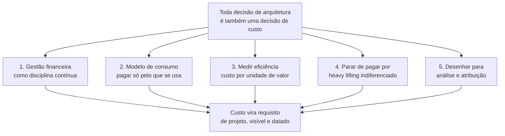
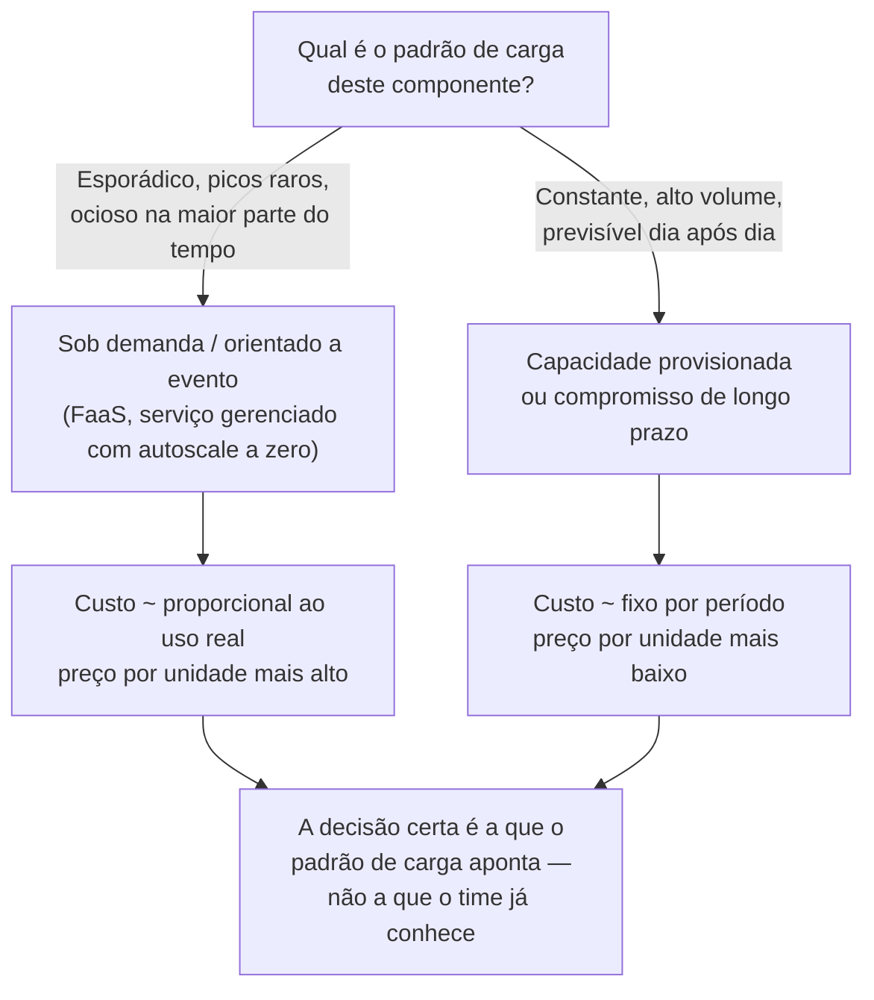
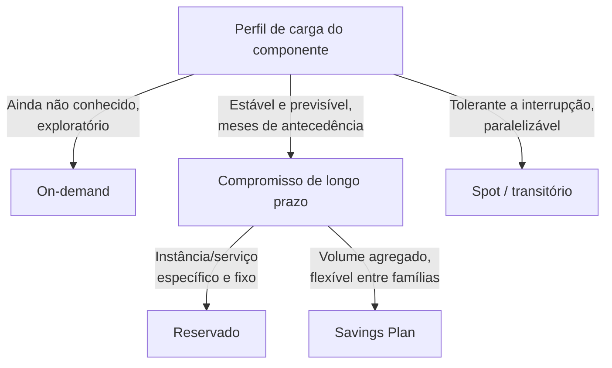
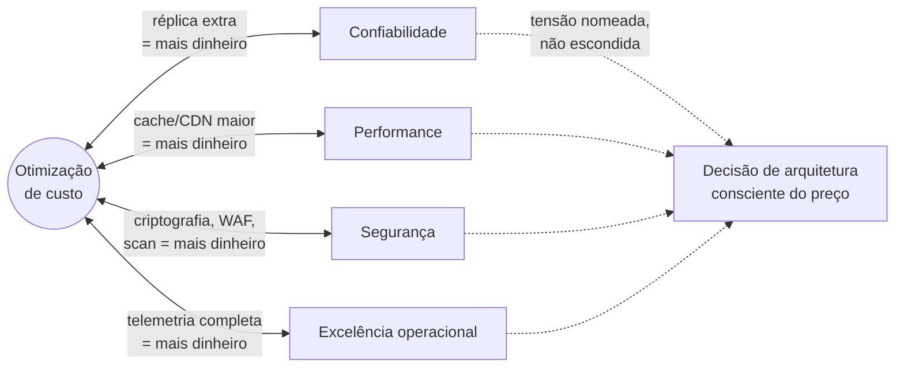
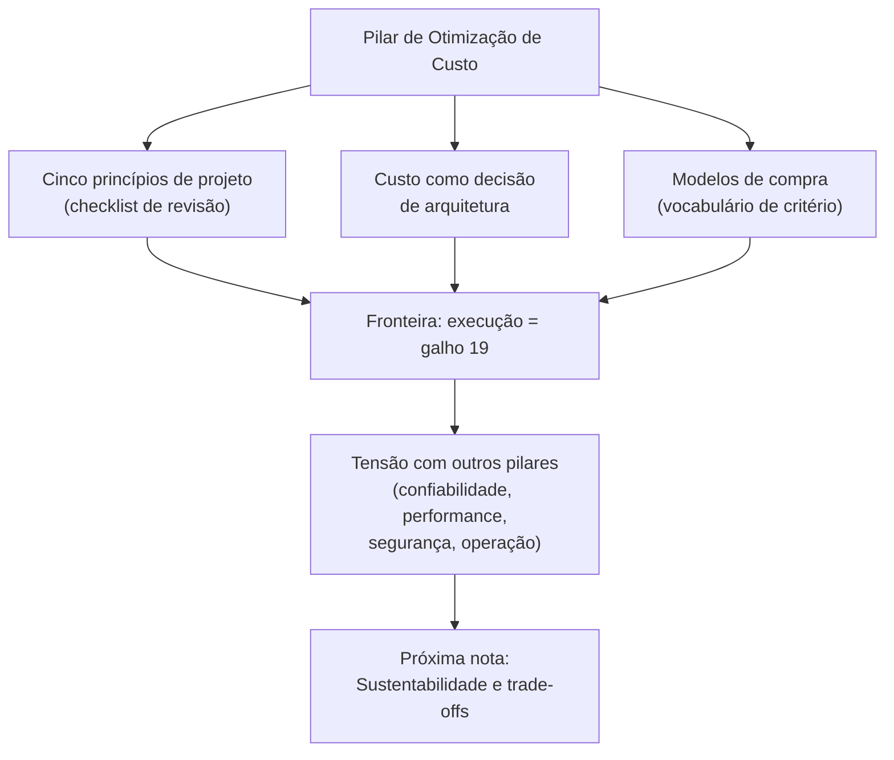

# Otimização de custo

> [!abstract] TL;DR
> Otimização de custo não é o pilar de "gastar pouco" — é o pilar de **gastar exatamente o que a decisão de arquitetura precisa, e saber dizer por quê**. A AWS resume o pilar oficialmente em cinco princípios de projeto: investir em gestão financeira de nuvem como disciplina, adotar um modelo de consumo, medir a eficiência do gasto (não só o gasto), parar de pagar por trabalho operacional que não diferencia o produto ("undifferentiated heavy lifting"), e desenhar o sistema para que a despesa seja analisável e atribuível. Nenhum desses cinco fala em "cortar custo" — falam em tornar o custo uma variável visível e deliberada do design, do mesmo jeito que confiabilidade ou performance. Este é o pilar mais colado no dia a dia de quem arquiteta sistemas em nuvem, porque toda decisão técnica — gerenciado ou auto-hospedado, replicado ou único, serverless ou always-on — já é, também, uma decisão de custo, quer alguém tenha calculado isso ou não.

## A pergunta que a revisão de arquitetura esqueceu de fazer

Um time de plataforma está numa revisão de design para o cache de uma API de leitura pesada. A proposta na tela é sólida: um cluster gerenciado de Redis, replicado em três zonas de disponibilidade, com failover automático — exatamente o tipo de decisão que uma revisão focada em confiabilidade aprovaria sem hesitar. Réplicas em múltiplas zonas, failover automático, zero downtime numa falha de zona: tudo isso são propriedades desejáveis, e ninguém na sala discorda de nenhuma delas.

Só que alguém, no fim da apresentação, faz a pergunta errada de propósito: "quanto isso custa por mês, e o que a gente está comprando com a diferença?" A resposta, depois de alguém abrir a calculadora de preços, é desconfortável: o cluster replicado em três zonas custa perto de US\$ 2.400 por mês; um nó único, sem réplica, custaria menos de um décimo disso. E o dado que está sendo cacheado — depois de mais perguntas — se revela pequeno (poucas centenas de megabytes), não crítico (perder o cache não perde dado nenhum, só reaquece em segundos a partir do banco de origem) e barato de reconstruir. Ninguém tinha calculado esse número antes; a decisão de replicar em três zonas veio de um reflexo — "mais redundância é sempre melhor" — não de uma conta.

Esse é o ponto cego que o pilar de otimização de custo existe para fechar. Não é que replicar em três zonas seja errado — para muitos dados, é exatamente a decisão certa. É que a decisão foi tomada **sem que o custo fosse tratado como um requisito de projeto**, no mesmo pé que a disponibilidade que ela compra. Otimização de custo, no vocabulário do Well-Architected Framework, não significa "escolha sempre a opção mais barata" — significa **saber, para cada propriedade que uma arquitetura compra (redundância, latência, throughput, isolamento), quanto ela custa e se o valor de negócio justifica o preço**. Às vezes justifica com folga. Às vezes não. O pecado não é pagar caro; é pagar caro sem ter feito a pergunta.

## Os cinco princípios oficiais — e o que cada um muda na prática

> [!info] Caducidade
> Os cinco princípios de projeto e a definição do pilar citados abaixo vêm do whitepaper oficial *Cost Optimization Pillar — AWS Well-Architected Framework* (publicação de junho de 2024), verificado em 2026-07-20. Os nomes e o número de princípios podem mudar em revisões futuras do documento — confira a versão vigente antes de citar em entrevista ou documento formal.

O whitepaper oficial define um workload otimizado em custo como aquele que **"utiliza plenamente todos os recursos, atinge um resultado ao menor preço possível, e cumpre os requisitos funcionais"** — repare que "menor preço possível" vem *depois* de "cumpre os requisitos funcionais", não antes. Um sistema que corta custo cortando confiabilidade até o ponto de não cumprir o SLA acordado não está otimizado em custo; está mal desenhado. A ordem das palavras já é a primeira lição do pilar.

A partir dessa definição, o framework lista cinco princípios de projeto. Vale passar por cada um com um exemplo concreto, porque juntos eles formam o vocabulário que separa uma resposta de entrevista genérica ("a gente tenta economizar") de uma resposta de nível sênior.

**1. Implementar gestão financeira de nuvem como disciplina.** O framework trata isso como investimento organizacional, não como tarefa de uma pessoa: assim como uma empresa constrói capacidade em segurança (processos, conhecimento, ferramentas, gente dedicada), ela precisa construir capacidade equivalente em gestão financeira de nuvem — o que a indústria batizou de **FinOps**. Isso significa que "otimizar custo" não é um projeto único, terminável, mas uma competência contínua, com dono, processo e ritmo — mais parecido com "manter a segurança" do que com "corrigir um bug".

**2. Adotar um modelo de consumo.** Pagar só pelo que se usa, e ajustar o uso para cima ou para baixo conforme a necessidade do negócio muda. A nota anterior desta trilha já desenvolveu a lógica econômica por trás disso — capex vira opex, o degrau de capacidade vira curva elástica — então este princípio não repete essa conta; ele a aplica como critério de arquitetura: cada componente de um sistema deveria, por padrão, ser questionado sobre se seu modelo de consumo acompanha a demanda real ou se foi dimensionado uma vez e esquecido. Um ambiente de desenvolvimento que fica ligado 24 horas por dia, sete dias por semana, mesmo sendo usado só em horário comercial, é a violação mais comum e mais barata de corrigir desse princípio: desligar fora do expediente pode reduzir esse custo específico numa fração relevante, simplesmente porque a maior parte das horas da semana deixa de ser paga.

**3. Medir a eficiência geral.** Este é o princípio que mais separa gasto de eficiência, e vale insistir na diferença porque ela é sutil. Gasto absoluto (quanto a fatura soma no fim do mês) é uma métrica pobre isolada — uma empresa que cresce dez vezes em receita e cinco vezes em gasto de infraestrutura está ficando *mais* eficiente, mesmo com a fatura subindo. O princípio pede para medir o **resultado de negócio entregue** ao lado do custo associado a entregá-lo — algo como custo por transação processada, custo por usuário ativo, custo por unidade de dado armazenado — e observar essa razão ao longo do tempo, não o valor absoluto isolado. É a diferença entre "gastamos US\$ 40 mil este mês" (sem contexto, inútil para decisão) e "gastamos US\$ 0,004 por requisição, contra US\$ 0,007 no trimestre passado" (comparável, acionável, e o tipo de número que justifica ou reprova uma mudança de arquitetura).

**4. Parar de gastar com trabalho operacional que não diferencia o produto.** No original, *"stop spending money on undifferentiated heavy lifting"* — vale reter o termo em inglês porque ele circula em entrevista e em documentação sem tradução fixa. "Heavy lifting indiferenciado" é o trabalho pesado de operar infraestrutura que **não diferencia o produto da empresa perante o cliente**: instalar patch de sistema operacional, gerenciar failover de banco de dados, manter réplicas de um cluster de mensageria no ar, trocar disco com defeito num datacenter. Nenhum cliente de um produto de fintech escolhe aquele produto porque o time de engenharia é excelente em aplicar patch de segurança no PostgreSQL às três da manhã — esse trabalho é necessário, mas invisível para quem paga a conta, e é exatamente o tipo de trabalho que a AWS descreve fazendo por você através de serviços gerenciados: "a AWS faz o trabalho pesado de operação de datacenter [...] e também remove o fardo operacional de gerenciar sistemas operacionais e aplicações com serviços gerenciados." O custo desse princípio não aparece só na fatura de nuvem — aparece, com frequência maior e mais cara, no salário de engenheiros seniores gastando horas em trabalho que não move a agulha do produto. Trocar um banco autogerenciado numa VM por um serviço de banco gerenciado é, ao mesmo tempo, uma decisão de opex (como a nota anterior descreveu) e uma aplicação direta deste princípio: você está pagando para não fazer heavy lifting indiferenciado.

**5. Analisar e atribuir despesa.** A nuvem torna tecnicamente possível saber, com precisão fina, quanto cada workload, cada time, cada feature custa — coisa que era quase impossível de medir com precisão num datacenter próprio, onde o custo de um servidor físico compartilhado por dez aplicações raramente era dividido de forma justa entre elas. Esse princípio pede para explorar essa possibilidade: desenhar o sistema de forma que o custo de cada parte seja identificável, e usar essa visibilidade para dar a cada dono de workload informação suficiente para otimizar a própria fatia. Repare que o princípio fala em **desenhar para atribuição** — isso é uma decisão de arquitetura (por exemplo, isolar recursos por serviço em vez de compartilhar um único cluster monolítico entre times sem fronteira de custo clara), diferente da mecânica de *como* etiquetar e monitorar essa despesa no dia a dia.



> [!info] Fronteira — arquitetura vs. FinOps na prática
> Este pilar dá o **critério**: os cinco princípios acima são perguntas que uma boa arquitetura precisa saber responder. A **execução** desses princípios no dia a dia — tags de cobrança, orçamentos e alertas, right-sizing operacional de instâncias já em produção, Savings Plans e Reserved Instances, uso de instâncias spot, ferramentas de análise de fatura como o AWS Cost Explorer — é o corpo inteiro do **galho 19** desta trilha, dedicado a FinOps na prática. Aqui, "atribuir despesa" é uma decisão de design (isolar recursos por fronteira de custo); lá, é o processo operacional contínuo de olhar a fatura, agir sobre ela e prestar contas.

> [!tip] Assista: Introduction to Cloud FinOps - Cloud Financial Management Basics Explained
> **Canal:** Cloud Economics | **Duração:** ~11min | **Idioma:** EN
>
> Apresentação de um profundo profissional da FinOps Foundation (o órgão que formaliza a disciplina que o princípio 1 desta nota nomeia). Explica por que FinOps trata custo como cultura de responsabilidade compartilhada entre engenharia, finanças e negócio — não como planilha isolada — e por que "custo por unidade de valor entregue" precisa virar métrica de engenharia, exatamente o que o princípio 3 desta nota (medir eficiência) exige.
> Trecho de destaque [09:07]: *"engineers have to use cost as a new efficiency metric when managing the cloud workloads against their budgets"*.
>
> 🎬 [Assistir no YouTube](https://www.youtube.com/watch?v=OJzFhWdT-fo)

> [!tip] Assista: Understanding the Cost Optimization Pillar of AWS Architecture
> **Canal:** K21Academy | **Duração:** ~21min | **Idioma:** EN
>
> Mostra, num console real da AWS, o exato movimento do princípio 3 (medir eficiência): abrir o CloudWatch de uma instância EC2, ver que a utilização de CPU nunca passou de 10% numa semana inteira, e usar esse dado — não intuição — para decidir se vale a pena redimensionar a família da instância.
> Trecho de destaque [03:29]: *"you should uh you know keep on measuring the efficiency of the system"*.
>
> 🎬 [Assistir no YouTube](https://www.youtube.com/watch?v=V0xqGVkflxM)

### Checklist de revisão: pergunta e sintoma, princípio por princípio

Os cinco princípios só viram ferramenta de revisão quando traduzidos em pergunta objetiva — a tabela abaixo é o formato que vale colar num template de design review.

| Princípio | A pergunta que a revisão faz | Sintoma de violação |
|---|---|---|
| 1. Gestão financeira como disciplina | Existe dono e ritmo de revisão de custo para este sistema, ou custo só é discutido quando alguém reclama? | Custo aparece como surpresa na fatura do fim do mês, nunca como pauta de revisão de design |
| 2. Modelo de consumo | Cada componente paga só pelo que consome, ou existe capacidade fixa ociosa na maior parte do tempo? | Ambiente de dev/teste ligado 24/7; capacidade dimensionada pro pico e nunca revisada depois |
| 3. Medir eficiência | Existe uma métrica de custo por unidade de valor (por requisição, por usuário, por GB), acompanhada ao longo do tempo? | Só se discute o valor absoluto da fatura ("gastamos X este mês"), nunca a razão contra o resultado entregue |
| 4. Parar de pagar heavy lifting indiferenciado | Engenheiro sênior está gastando hora em trabalho que não diferencia o produto perante o cliente? | Patch de SO, failover de banco, backup manual consumindo tempo de quem poderia estar construindo produto |
| 5. Analisar e atribuir despesa | É possível dizer, com precisão, qual time ou serviço é dono de qual fração da fatura? | Fatura chega como número único; recursos de times diferentes compartilham cluster ou conta sem fronteira de custo |

## O caso que ilustra os cinco princípios ao mesmo tempo

Vale amarrar os cinco princípios num único exemplo trabalhado, porque isolados eles soam abstratos, e juntos formam uma história coerente.

Um time constrói um serviço de geração de relatórios em PDF, disparado sob demanda por usuários de um painel administrativo — um uso esporádico, concentrado em picos previsíveis (início de mês, fechamento de trimestre) e praticamente ausente no resto do tempo. A primeira versão do serviço roda numa frota de instâncias sempre ligadas, dimensionada para o pico do fechamento de trimestre, porque foi assim que o time construiu o último serviço parecido e "já sabia fazer".

Uma revisão orientada pelos cinco princípios do pilar destrincha essa decisão peça por peça. O princípio do **modelo de consumo** pergunta: essa carga é constante ou esporádica? É claramente esporádica — a frota fica ociosa na maior parte do mês. O princípio de **medir eficiência** pergunta: qual é o custo por relatório gerado, hoje? A resposta, feita a conta, é um número desproporcional ao valor entregue, porque o denominador (relatórios gerados) é pequeno na maior parte do mês enquanto o numerador (custo da frota ligada) é constante. O princípio de **parar de pagar por heavy lifting indiferenciado** pergunta: o time está gastando horas de engenharia mantendo patch e monitoramento dessa frota, para uma carga que poderia rodar em funções sob demanda de um provedor gerenciado? E o princípio de **atribuir despesa** pergunta: hoje, esse custo aparece separado na fatura, ou está misturado com o custo de outros serviços que rodam na mesma frota compartilhada, tornando impossível saber se vale a pena otimizar?

A resposta natural, seguindo os quatro princípios técnicos, é redesenhar o serviço em torno de computação orientada a evento — funções que só existem e só custam dinheiro no momento em que um relatório é solicitado, com custo zero entre os picos. Isso não é, em si, uma afirmação de que serverless é sempre superior a instâncias sempre ligadas — para uma carga verdadeiramente constante, a conta poderia apontar na direção oposta, do mesmo jeito que o caso da 37signals discutido na nota anterior apontou para hardware próprio num perfil de carga estável. O que o exemplo demonstra é o **processo**: os cinco princípios, aplicados em sequência, transformam "vamos usar o padrão que já conhecemos" numa decisão fundamentada em número, e é essa transformação — não o resultado específico "serverless venceu" — que o pilar de otimização de custo pede.

E o quinto princípio, gestão financeira como disciplina, é o que garante que essa revisão não seja um evento único: o time que institucionaliza essa pergunta em toda revisão de design, e não só quando alguém lembra, é o time que constrói, ao longo do tempo, a capacidade organizacional que o primeiro princípio descreve.

A tabela abaixo resume, em ordem de grandeza (não em preço real de nenhum provedor), o que a mudança de desenho tende a fazer com cada métrica do caso — o ponto não é o número exato, é a direção e a proporção de cada mudança.

| Métrica | Antes (frota sempre ligada) | Depois (funções sob demanda) |
|---|---|---|
| Horas cobradas por mês | Fixo, ~720h/mês, independente do uso | Proporcional ao tempo de execução real — tipicamente uma fração pequena de 720h para carga esporádica |
| Utilização média da capacidade paga | Baixa na maior parte do mês, alta só nos picos de fechamento | Próxima de 100% — só se paga o tempo em que código roda |
| Custo por relatório gerado | Alto fora dos picos (denominador pequeno, numerador fixo) | Estável, porque o custo acompanha o próprio evento que gera o relatório |
| Trabalho de patch/monitoramento da frota | Recorrente, mesmo nos dias sem geração de relatório | Delegado ao provedor gerenciado — aplicação direta do princípio 4 |

## Custo como decisão de arquitetura, não como linha de FinOps

A nota anterior desta trilha já estabeleceu por que opex vira restrição de design na nuvem — quem aprova muda, a forma do gráfico de capacidade muda, e cada decisão passa a ter um custo marginal calculável quase em tempo real. O que falta amarrar aqui é o **catálogo concreto** dessas decisões: quais escolhas de design, especificamente, carregam impacto de custo embutido, e qual trade-off cada uma compra.

| Decisão de design | Impacto no custo | Trade-off que ela compra |
|---|---|---|
| Comunicação síncrona (chamada direta) vs. assíncrona (fila/evento) | Síncrono exige capacidade dimensionada pro pico de chamadas simultâneas; assíncrono nivela a carga ao longo do tempo, pagando pelo throughput médio | Síncrono compra latência baixa e simplicidade de raciocínio; assíncrono compra elasticidade de custo e resiliência a pico, à custa de latência maior e consistência eventual |
| Capacidade provisionada vs. sob demanda (serverless) | Provisionado cobra pela capacidade alocada, em uso ou não; sob demanda cobra só pela execução real, mas o preço por unidade de trabalho tende a ser maior | Provisionado compra previsibilidade de custo e de performance (sem cold start); sob demanda compra custo zero na ociosidade, à custa de previsibilidade por execução e de latência de partida fria |
| Serviço gerenciado vs. self-hosted | Gerenciado embute o custo do heavy lifting operacional no preço da hora; self-hosted parece mais barato na linha de infraestrutura, mas soma horas de engenharia sênior fora da fatura de nuvem | Gerenciado compra tempo de engenheiro de volta pro produto (princípio 4); self-hosted compra controle fino e, em escala muito grande e carga estável, pode sair mais barato quando amortizado — o argumento da 37signals |
| Região única vs. múltiplas regiões | Multi-região multiplica infraestrutura replicada e soma transferência de dados entre regiões | Região única compra custo mínimo; multi-região compra continuidade de negócio numa falha de região inteira — rara, mas catastrófica quando acontece |
| Replicar dado vs. reconstruir sob demanda | Replicar paga armazenamento e sincronização de forma constante; reconstruir paga só quando o dado falta, à custa de latência na reconstrução | É o caso do cache Redis que abriu esta nota: réplica em três zonas compra failover instantâneo; nó único com reconstrução a partir da origem compra custo baixo, aceitando minutos de cache frio numa falha rara |
| Cache mais generoso vs. cache mínimo | Cache maior reduz leitura no banco de origem, mas soma memória cara e paga por dado que talvez nunca seja lido de novo | Cache generoso compra latência baixa e menos carga no banco; cache mínimo compra economia de memória, aceitando mais leituras diretas na origem |
| Servir da origem vs. CDN/edge caching | Servir sempre da origem soma transferência de dados repetida para o mesmo conteúdo; CDN paga uma taxa própria, mas absorve a maior parte das requisições repetidas antes de chegar na origem | Origem direta compra simplicidade; CDN compra menos carga na origem e latência menor pro usuário final, à custa de uma camada extra de cache para invalidar corretamente |

O par "serviço gerenciado vs. self-hosted" também rende uma conta de ordem de grandeza, porque é onde o argumento "self-hosted é mais barato" mais aparece sem ter sido de fato calculado.

```text
# Pseudo-cálculo ilustrativo: banco gerenciado vs. banco autogerenciado numa VM
# (ordens de grandeza — não são preços de nenhum provedor real)

HORAS_MES              = 720
PRECO_HORA_VM          = preco_unidade_compute        # infraestrutura crua
PRECO_HORA_GERENCIADO  = PRECO_HORA_VM * 1.4           # gerenciado costuma
                                                         # cobrar um prêmio
                                                         # sobre a infra crua
HORAS_ENGENHEIRO_MES    = 6    # patch, backup manual, tuning, resposta a
                                # incidente — estimativa conservadora
CUSTO_HORA_ENGENHEIRO   = custo_hora_senior            # salário carregado

# Cenário A — banco autogerenciado numa VM
custo_infra_A = PRECO_HORA_VM * HORAS_MES
custo_pessoas_A = HORAS_ENGENHEIRO_MES * CUSTO_HORA_ENGENHEIRO
custo_total_A = custo_infra_A + custo_pessoas_A
# a comparação que só olha custo_infra_A contra o preço do gerenciado
# já erra por construção — falta somar custo_pessoas_A

# Cenário B — serviço de banco gerenciado
custo_infra_B = PRECO_HORA_GERENCIADO * HORAS_MES
custo_pessoas_B = 0   # patch, backup e failover embutidos no serviço
custo_total_B = custo_infra_B  # ~ custo_pessoas_B desprezível por construção

# custo_total_A só fica visivelmente menor que custo_total_B quando
# HORAS_ENGENHEIRO_MES é pequeno o bastante para não compensar o prêmio
# de PRECO_HORA_GERENCIADO — o que tende a acontecer só em operações
# muito grandes, com time dedicado, baixo custo marginal por banco
# adicional (o mesmo racional por trás da decisão da 37signals).
# Para a maioria dos times, custo_pessoas_A domina a conta, e é
# exatamente essa linha que uma comparação só de "preço de infra"
# esquece de somar.
```

Vale um exemplo numérico para deixar concreto o segundo par da tabela — capacidade provisionada versus função sob demanda —, porque é o par que mais confunde quem nunca fez a conta.

```text
# Pseudo-cálculo ilustrativo: instância sempre ligada vs. função por evento
# (ordens de grandeza — não são preços de nenhum provedor real)

HORAS_MES          = 720   # horas corridas em um mês
EVENTOS_DIA        = 500   # disparos esporádicos do serviço
EVENTOS_MES        = EVENTOS_DIA * 30
DURACAO_EVENTO_SEG = 3     # tempo médio de execução por evento

# Cenário A — instância sempre ligada, dimensionada pro throughput de pico
custo_A = 1 * HORAS_MES * preco_hora_instancia
# paga as 720 horas do mês inteiro, seja o evento disparado 500 vezes/dia
# ou 5 vezes/dia — a fatura de A não sabe a diferença

# Cenário B — função que só existe e só custa no momento do evento
segundos_cobrados_B = EVENTOS_MES * DURACAO_EVENTO_SEG
custo_B = segundos_cobrados_B * preco_segundo_funcao
# paga só os ~12.500 segundos (~3,5 horas) em que código de fato roda
# no mês inteiro — o resto do tempo custa zero

# Para uma carga esporádica e de execução curta como esta, custo_B tende
# a ficar numa fração pequena de custo_A — não porque o preço por segundo
# da função seja mais barato (costuma ser MAIS caro por unidade de
# compute), mas porque o denominador de tempo cobrado despenca.
# A mesma conta, para uma carga constante e de alto volume o dia
# inteiro, inverte: a soma de segundos cobrados de B se aproxima de
# HORAS_MES, e o preço por unidade mais alto da função vira desvantagem
# em vez de vantagem — o mesmo raciocínio do caso 37signals, só que na
# escala de uma função em vez de um datacenter inteiro.
```



## Lente dupla: onde AWS e DigitalOcean tornam esses princípios mais fáceis ou mais difíceis

Os cinco princípios são provider-neutros — nenhum deles cita um serviço específico — mas a **facilidade de aplicar cada um** varia bastante entre os dois provedores desta trilha, e a diferença ajuda a fixar o conceito.

Na **AWS**, o modelo de consumo granular (cobrança por segundo, dezenas de dimensões separadas) que a nota anterior descreveu torna o princípio de "medir eficiência" tecnicamente mais rico — dá para calcular custo por segundo de compute, por GB de armazenamento, por milhão de requisições de forma muito fina — mas exige ferramenta dedicada (Cost Explorer, Cost and Usage Reports) para essa granularidade virar informação acionável em vez de ruído. O princípio de "parar de pagar heavy lifting" tem um catálogo de serviços gerenciados extremamente amplo para se apoiar — de bancos de dados a filas a orquestração de contêineres — o que torna fácil encontrar um serviço gerenciado equivalente a quase qualquer coisa que se autogerenciaria.

Na **DigitalOcean**, o modelo de preço fixo por Droplet torna o princípio de "medir eficiência" mais simples de calcular à mão — o denominador do custo é conhecido de antemão, sem precisar de ferramenta de análise de fatura para saber quanto uma hora de compute custou — o que serve bem times pequenos sem capacidade dedicada de FinOps. Em compensação, o catálogo de serviços gerenciados é mais enxuto que o da AWS: para algumas cargas, "parar de pagar heavy lifting" na DigitalOcean significa aceitar operar mais peças você mesmo, ou migrar essa peça específica para um provedor com o serviço gerenciado equivalente — uma troca explícita entre simplicidade de preço e abrangência de managed services.

| Conceito | AWS | Azure | GCP | DigitalOcean |
|---|---|---|---|---|
| Granularidade de análise de custo | Alta — dezenas de dimensões, ferramenta dedicada (Cost Explorer) necessária para extrair sinal | Alta — Cost Management + Billing, modelo semelhante à AWS | Alta — Cloud Billing Reports, modelo semelhante à AWS | Baixa granularidade nativa — preço fixo por recurso já é a unidade de análise |
| Amplitude de serviços gerenciados (heavy lifting) | Muito ampla — catálogo extenso de bancos, filas, orquestração | Ampla, equivalente em escopo à AWS | Ampla, equivalente em escopo à AWS | Mais enxuta — cobre os casos mais comuns (banco, Kubernetes, filas), não o catálogo inteiro |

> [!info] Caducidade
> A comparação de amplitude de catálogo gerenciado entre provedores muda com o tempo — todos os quatro lançam novos serviços continuamente. Confira o catálogo de serviços vigente de cada provedor antes de usar esta tabela como argumento de decisão.

## Modelos de compra: vocabulário de critério, não checklist operacional

O princípio de "adotar um modelo de consumo" tem um vocabulário próprio que vale saber nomear numa entrevista ou numa revisão de arquitetura — mesmo sem entrar na mecânica de como configurar cada um. Os quatro modelos abaixo existem, com nomes equivalentes, tanto na AWS quanto na maioria dos provedores de nuvem pública; a tabela fica no nível de **quando cada um faz sentido**, não de como contratá-lo.

| Modelo de compra | Quando faz sentido, em princípio | Risco que carrega |
|---|---|---|
| On-demand | Carga imprevisível, exploratória, ou de curta duração — o padrão de uso ainda não é conhecido | Preço por unidade mais alto; nenhum desconto por compromisso |
| Reservado (ex.: Reserved Instances) | Carga estável e previsível, conhecida com meses de antecedência — o cenário oposto ao que abre o princípio de modelo de consumo | Compromisso financeiro fixo; se a carga cair ou migrar, paga-se por capacidade não usada — o mesmo risco do capex, revestido de opex |
| Savings Plan | Carga estável em volume agregado de computação, mas com flexibilidade sobre qual instância ou serviço específico rodar | Mesmo risco de compromisso do modelo reservado, com um pouco mais de flexibilidade de aplicação entre famílias de instância |
| Spot (instância transitória) | Carga tolerante a interrupção, paralelizável, sem requisito de disponibilidade contínua — processamento em lote, jobs de treinamento, filas de trabalho | O provedor pode retomar a capacidade a qualquer momento com aviso curto; não serve para workload que não pode ser interrompido sem plano de contingência |

> [!info] Fronteira — vocabulário vs. operação
> Os quatro modelos acima são citados aqui como **vocabulário de critério**: que tipo de compromisso financeiro combina com que perfil de carga, a mesma pergunta que orienta a tabela de decisões de design acima. Calcular cobertura ideal de Savings Plan, configurar um Auto Scaling Group com fallback de spot, ou negociar uma Reserved Instance é execução — de novo, o corpo do **galho 19**.



Vale registrar um ponto de tradução entre os dois provedores desta trilha: a **AWS** oferece formalmente os quatro modelos da tabela acima — on-demand, reservado, Savings Plan e spot — como opções de compra distintas, com desconto crescente conforme o compromisso cresce. A **DigitalOcean** não tem equivalente formal a nenhum dos três modelos de compromisso: todo Droplet é cobrado no que equivale, na prática, a on-demand — preço fixo publicado, sem desconto por reserva antecipada e sem instância transitória com risco de retomada. Isso não é uma lacuna acidental — é a mesma aposta de simplicidade e previsibilidade que a "Lente dupla" acima já descreveu, aplicada especificamente ao vocabulário de modelos de compra: a DigitalOcean troca a flexibilidade de otimização fina por um número que não precisa de planilha para prever.

Os nomes de produto mudam por provedor, mesmo quando o critério por trás é o mesmo — vale ter a tabela de tradução por perto antes de uma entrevista ou de uma conversa com um time que só conhece um dos quatro provedores.

| Modelo (critério) | AWS | Azure | GCP | DigitalOcean |
|---|---|---|---|---|
| Compromisso fixo por recurso específico | Reserved Instances | Azure Reservations (Reserved VM Instances) | Committed Use Discounts | Não oferecido |
| Compromisso flexível por volume de gasto | Savings Plans | Savings plan for compute | Committed Use Discounts (flexível entre famílias) | Não oferecido |
| Capacidade transitória/interruptível | Spot Instances | Azure Spot Virtual Machines | Spot VMs (ex-Preemptible VMs) | Não oferecido |

> [!info] Caducidade
> Nomes de produto de purchase option mudam com o tempo — a GCP, por exemplo, já renomeou "Preemptible VMs" para "Spot VMs". Confirme o nome vigente na documentação de cada provedor antes de citar em entrevista ou documento formal; verificado em 2026-07-22.

## Casos práticos

**A instância certa em vez da instância conhecida.** Um time migra um serviço de processamento de imagens de uma instância de propósito geral, escolhida porque "é a que o time sempre usa", para uma família de instância otimizada para computação, depois de medir que o gargalo real do workload é CPU, não memória nem I/O. O custo por hora da nova instância é parecido com o da antiga, mas o throughput por hora sobe o suficiente para reduzir o número de instâncias necessárias para o mesmo volume de trabalho — uma aplicação direta do princípio de medir eficiência (custo por imagem processada cai), não do princípio de "escolher a opção mais barata da lista".

**O ambiente de staging que ninguém desligava.** Um ambiente de homologação, clone de produção, roda 24 horas por dia porque nunca ninguém revisou essa decisão depois que foi criado — um caso de manual do princípio de modelo de consumo violado por inércia, não por necessidade. Automatizar o desligamento fora do horário de uso do time (as noites e os fins de semana, quando ninguém está testando nada) aplica o princípio sem exigir nenhuma mudança de arquitetura, só de operação — uma ponte direta para o que o galho 19 desenvolve como right-sizing operacional.

**O monólito de dados sem fronteira de custo.** Um data warehouse compartilhado por seis times diferentes, sem nenhuma segregação de recurso ou de schema por time, torna o princípio de "analisar e atribuir despesa" impossível de aplicar depois do fato — a fatura chega como um único número, e ninguém consegue dizer honestamente qual time é responsável por qual fração dela. Redesenhar essa fronteira (workspaces separados, contas ou projetos separados por time, ao menos schemas isolados com quota própria) é uma decisão de arquitetura que precisa ser tomada *antes*, porque nenhuma ferramenta de análise de fatura consegue reconstruir uma fronteira de custo que nunca existiu no desenho do sistema.

**O cluster multi-tenant sem isolamento de custo.** Uma plataforma B2B atende doze clientes empresariais no mesmo cluster de banco de dados, sem separação de schema nem de recurso computacional por cliente — decisão tomada no início, quando só havia dois clientes e a diferença não importava. A tabela abaixo resume a mudança quando a plataforma cresce e o princípio de atribuir despesa deixa de ser opcional:

| Dimensão | Cluster compartilhado (estado atual) | Isolamento por cliente (proposta) |
|---|---|---|
| Atribuição de custo por cliente | Impossível sem instrumentação adicional | Direta — cada schema/recurso já nasce marcado |
| Blast radius de um cliente ruidoso | Um cliente com carga anômala degrada os outros onze | Isolado ao próprio cliente |
| Custo de infraestrutura total | Menor (recursos compartilhados) | Maior (overhead de isolamento por cliente) |

Não existe resposta universal aqui — para doze clientes pequenos, o cluster compartilhado ainda pode ser a decisão certa; para um punhado de clientes grandes com requisitos de isolamento contratual, a resposta muda. O ponto é que a decisão precisa ser **revisitada com o crescimento**, não herdada do dia em que só existiam dois clientes.

**A CDN que ninguém tinha calculado.** Um serviço público serve imagens de produto direto da origem para todo usuário, em todo país, porque "o time nunca chegou a configurar uma CDN". Cada requisição repetida da mesma imagem popular soma transferência de dados na origem, e o tráfego internacional soma latência para o usuário distante — duas linhas de custo e de performance que a decisão de design de "servir da origem vs. CDN" da tabela acima já nomeia. Colocar uma camada de CDN na frente não é uma otimização de detalhe: é a diferença entre pagar transferência de dados uma vez por região de borda, com cache compartilhado entre todos os usuários daquela região, e pagar a mesma transferência uma vez por requisição individual — o tipo de decisão que o princípio de medir eficiência deveria ter capturado antes do tráfego crescer, não depois.

## Armadilhas comuns

> [!warning] Confundir "otimizado em custo" com "o mais barato"
> O pilar não pede a opção de menor preço — pede a opção que entrega o resultado de negócio ao menor preço **que ainda cumpre o requisito**. Cortar redundância de um sistema que processa pagamento para economizar, e como consequência perder transações numa falha de zona, não é otimização de custo; é uma falha de confiabilidade disfarçada de economia. A pergunta certa nunca é só "quanto custa", é "quanto custa **para o nível de garantia que este workload de fato precisa**" — e essa pergunta, inevitavelmente, empurra contra os outros pilares, o assunto da próxima nota.

> [!warning] Tratar heavy lifting autogerenciado como "grátis" porque já está rodando
> Um banco de dados autogerenciado numa VM parece mais barato que o equivalente gerenciado, olhando só a linha de infraestrutura na fatura. Mas o tempo de engenheiro sênior gasto em patch, backup manual, tuning e resposta a incidente daquele banco tem custo real — só que aparece na folha de pagamento, não na fatura de nuvem, o que faz ele ficar invisível em qualquer comparação que olhe só para uma das duas linhas. O princípio de "parar de pagar heavy lifting indiferenciado" existe exatamente para forçar essa comparação a incluir os dois lados.

> [!warning] Achar que atribuição de custo é problema de ferramenta, não de arquitetura
> Comprar a melhor ferramenta de análise de fatura do mercado não resolve um sistema desenhado sem fronteira de custo — se dez serviços compartilham o mesmo cluster, o mesmo banco, a mesma frota de instâncias, sem isolamento nenhum, nenhuma ferramenta de tag consegue reconstruir depois qual fatia pertence a qual dono. Atribuição de despesa é uma decisão que se toma no design, junto com decisões de isolamento de rede e de dados — não uma tarefa que se resolve comprando um relatório melhor depois que o sistema já existe.

> [!warning] Comprometer-se com reservado ou Savings Plan e nunca mais revisar
> Um compromisso de longo prazo resolve o problema do dia em que foi assinado, mas a carga do sistema muda — a arquitetura evolui, um componente é descontinuado, um serviço migra de instância. Reservar capacidade e tratar essa decisão como permanente é reintroduzir, por dentro do opex, o mesmo risco do capex que a nuvem prometia eliminar: um ativo financeiro comprado uma vez, pago independente de ainda fazer sentido. O modelo de compra certo na data da assinatura pode virar o modelo errado um ano depois — e só uma revisão periódica (o primeiro princípio, gestão financeira como disciplina) pega essa deriva a tempo.

## Jargão que aparece sem tradução fixa

Esta nota usou vários termos que circulam em inglês, sem tradução padronizada no mercado brasileiro — vale ter a referência rápida antes de uma entrevista ou uma conversa técnica em português.

| Termo (inglês) | Tradução aproximada | Onde aparece nesta nota |
|---|---|---|
| Undifferentiated heavy lifting | Trabalho pesado que não diferencia o produto perante o cliente | Princípio 4 |
| Cost-optimized workload | Sistema otimizado em custo | Definição oficial do pilar |
| FinOps | Gestão financeira de nuvem como disciplina contínua | Princípio 1 |
| TCO (total cost of ownership) | Custo total de propriedade | Comparação gerenciado vs. self-hosted |
| Cloud repatriation | Repatriação de nuvem — sair da nuvem pública para hardware próprio | Caso 37signals, referenciado da nota anterior |

## O que uma resposta de nível sênior nomeia — e uma de nível pleno não

Numa entrevista técnica ou numa revisão de arquitetura real, a diferença entre citar o pilar de custo de forma genérica e demonstrar domínio dele aparece em detalhes específicos:

- Nomear os cinco princípios pelo nome, não só "a gente tenta ser eficiente" — e saber que "menor preço possível" vem depois de "cumpre os requisitos funcionais" na definição oficial, não antes.
- Traduzir "heavy lifting indiferenciado" com um exemplo concreto do próprio domínio (patch de banco, failover, gestão de certificado) em vez de repetir o termo em inglês sem explicá-lo.
- Diferenciar gasto absoluto de eficiência — saber citar uma métrica de custo por unidade de valor, não só o valor total da fatura.
- Reconhecer que "otimizado em custo" não é sinônimo de "mais barato", e ter um exemplo pronto (como o cache Redis desta nota) de uma decisão cara que ainda assim é a certa.
- Nomear os quatro modelos de compra (on-demand, reservado, Savings Plan, spot) e saber, em uma frase, quando cada um se aplica — sem confundir isso com a mecânica de como configurá-los.
- Fechar com a fronteira entre pilares: reconhecer que otimizar custo sem limite entra em tensão direta com confiabilidade e performance, e que a resposta madura nomeia esse trade-off em vez de fingir que ele não existe.

## Quando o princípio de custo empurra contra outro pilar

Nada do que os cinco princípios pedem existe isolado dos outros cinco pilares do framework — e vale nomear a tensão antes de fechar, porque é exatamente aí que a maturidade de uma resposta sênior aparece.

| Outro pilar | Decisão que ele pede | Por que ela custa dinheiro |
|---|---|---|
| Confiabilidade | Réplicas em múltiplas zonas ou regiões, failover automático | Cada réplica extra é capacidade paga que só existe para o dia em que a primeira falha |
| Performance | Cache maior, camada de CDN, instância com mais memória ou CPU do que o uso médio pede | Capacidade de sobra dimensionada pro pico de latência, não pro uso médio |
| Segurança | Criptografia em repouso e em trânsito, WAF, varredura contínua de vulnerabilidade | Cada camada de proteção soma computação, armazenamento ou uma licença de ferramenta |
| Excelência operacional | Observabilidade completa (métricas, logs, traces em alta granularidade) | Ingestão, armazenamento e consulta de telemetria têm custo próprio, e crescem com o volume do sistema |

Nenhuma dessas quatro linhas é "desperdício" — são propriedades que o negócio pode genuinamente precisar. O trabalho do pilar de custo não é vetar essas decisões; é garantir que cada uma delas seja **tomada conscientemente**, com o preço nomeado, e não herdada por reflexo. É exatamente essa tensão — nomeada, não escondida — que abre a porta para a próxima nota.



Uma forma prática de levar essa tensão para uma revisão de design, sem precisar de planilha nenhuma, é fazer a mesma pergunta de três formas — a última delas é a que costuma faltar:

```text
# Regra de bolso para revisão de custo — três perguntas, nessa ordem
#
# 1) "Quanto isso custa por mês, em ordem de grandeza?"
#    -> se ninguém souber responder, a revisão já achou o primeiro problema
#
# 2) "O que esse custo compra — que propriedade de confiabilidade,
#    performance, segurança ou operação ele existe pra garantir?"
#    -> se a resposta for "não sei" ou "sempre foi assim", é reflexo,
#       não decisão (o caso do cluster Redis que abriu esta nota)
#
# 3) "Esse workload realmente precisa dessa propriedade no nível
#    comprado, ou um nível menor ainda cumpre o requisito de negócio?"
#    -> esta é a pergunta que separa "cortar custo às cegas" de
#       "otimizar custo com critério" — o requisito funcional continua
#       no comando, o preço só deixa de ser invisível
```

## Mapa da nota, em uma imagem



## O que vem a seguir

Este pilar deu o critério mais próximo do dia a dia: cada decisão de arquitetura compra alguma coisa (redundância, latência, capacidade de pico) a um preço, e o trabalho sênior é saber nomear esse preço antes de pagar por ele. Mas os cinco princípios de custo, aplicados sem freio, puxam sistematicamente contra outros pilares — a réplica extra que a confiabilidade pede custa dinheiro; o cache mais generoso que a performance pede custa dinheiro; e existe ainda um sexto ângulo, mais recente que os outros cinco, que pergunta não só quanto uma decisão custa em dólar, mas quanto ela custa em energia e em carbono. É esse ângulo, e a pergunta maior que ele expõe — como decidir quando os pilares literalmente se contradizem entre si — que a próxima nota, **"Sustentabilidade e os trade-offs entre pilares"**, fecha o galho respondendo.

## Fontes

- [AWS Well-Architected Framework — Cost Optimization Pillar (whitepaper completo)](https://docs.aws.amazon.com/wellarchitected/latest/cost-optimization-pillar/welcome.html) — definição oficial do pilar, seis pilares do framework, objetivos de capability; publicação de junho de 2024, acessado em 2026-07-20.
- [AWS Well-Architected Framework — Cost Optimization Pillar: Design Principles](https://docs.aws.amazon.com/wellarchitected/latest/cost-optimization-pillar/design-principles.html) — texto oficial dos cinco princípios de projeto citados nesta nota, acessado em 2026-07-20.
- [AWS Well-Architected Framework (página principal, os seis pilares)](https://aws.amazon.com/well-architected) — visão geral do framework e dos seis pilares (Operational Excellence, Security, Reliability, Performance Efficiency, Cost Optimization, Sustainability); acessado em 2026-07-20.
- [DigitalOcean — Droplet Pricing (página oficial)](https://www.digitalocean.com/pricing/droplets) — modelo de cobrança por segundo com teto mensal, vigente desde 1º de janeiro de 2026; acessado em 2026-07-20.
- [DigitalOcean — AWS vs DigitalOcean: Which cloud platform is the best fit for you?](https://www.digitalocean.com/blog/aws-vs-digitalocean-cloud-platform) — confirma que a DigitalOcean não oferece reserved instances, savings plans nem spot pricing, só preço fixo publicado; acessado em 2026-07-22.
- [Microsoft Learn — What are Azure Reservations?](https://learn.microsoft.com/en-us/azure/cost-management-billing/reservations/save-compute-costs-reservations) — nome oficial do modelo reservado da Azure; acessado em 2026-07-22.
- [Microsoft Learn — What are savings plans?](https://learn.microsoft.com/en-us/azure/cost-management-billing/savings-plan/savings-plan-overview) — nome oficial "Savings plan for compute"; acessado em 2026-07-22.
- [Google Cloud — Spot VMs](https://docs.cloud.google.com/compute/docs/instances/spot) — confirma o nome atual "Spot VMs" (ex-Preemptible VMs) e o Committed Use Discounts como equivalente a reservado; acessado em 2026-07-22.
