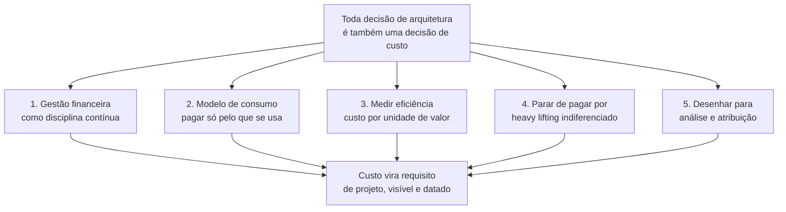

# Otimização de custo

> [!abstract] TL;DR
> Otimização de custo não é o pilar de "gastar pouco" — é o pilar de **gastar exatamente o que a decisão de arquitetura precisa, e saber dizer por quê**. A AWS resume o pilar oficialmente em cinco princípios de projeto: investir em gestão financeira de nuvem como disciplina, adotar um modelo de consumo, medir a eficiência do gasto (não só o gasto), parar de pagar por trabalho operacional que não diferencia o produto ("undifferentiated heavy lifting"), e desenhar o sistema para que a despesa seja analisável e atribuível. Nenhum desses cinco fala em "cortar custo" — falam em tornar o custo uma variável visível e deliberada do design, do mesmo jeito que confiabilidade ou performance. Este é o pilar mais colado no dia a dia de quem arquiteta sistemas em nuvem, porque toda decisão técnica — gerenciado ou auto-hospedado, replicado ou único, serverless ou always-on — já é, também, uma decisão de custo, quer alguém tenha calculado isso ou não.

## A pergunta que a revisão de arquitetura esqueceu de fazer

Um time de plataforma está numa revisão de design para o cache de uma API de leitura pesada. A proposta na tela é sólida: um cluster gerenciado de Redis, replicado em três zonas de disponibilidade, com failover automático — exatamente o tipo de decisão que uma revisão focada em confiabilidade aprovaria sem hesitar. Réplicas em múltiplas zonas, failover automático, zero downtime numa falha de zona: tudo isso são propriedades desejáveis, e ninguém na sala discorda de nenhuma delas.

Só que alguém, no fim da apresentação, faz a pergunta errada de propósito: "quanto isso custa por mês, e o que a gente está comprando com a diferença?" A resposta, depois de alguém abrir a calculadora de preços, é desconfortável: o cluster replicado em três zonas custa perto de US\$ 2.400 por mês; um nó único, sem réplica, custaria menos de um décimo disso. E o dado que está sendo cacheado — depois de mais perguntas — se revela pequeno (poucas centenas de megabytes), não crítico (perder o cache não perde dado nenhum, só reaquece em segundos a partir do banco de origem) e barato de reconstruir. Ninguém tinha calculado esse número antes; a decisão de replicar em três zonas veio de um reflexo — "mais redundância é sempre melhor" — não de uma conta.

Esse é o ponto cego que o pilar de otimização de custo existe para fechar. Não é que replicar em três zonas seja errado — para muitos dados, é exatamente a decisão certa. É que a decisão foi tomada **sem que o custo fosse tratado como um requisito de projeto**, no mesmo pé que a disponibilidade que ela compra. Otimização de custo, no vocabulário do Well-Architected Framework, não significa "escolha sempre a opção mais barata" — significa **saber, para cada propriedade que uma arquitetura compra (redundância, latência, throughput, isolamento), quanto ela custa e se o valor de negócio justifica o preço**. Às vezes justifica com folga. Às vezes não. O pecado não é pagar caro; é pagar caro sem ter feito a pergunta.

## Os cinco princípios oficiais — e o que cada um muda na prática

> [!info] Caducidade
> Os cinco princípios de projeto e a definição do pilar citados abaixo vêm do whitepaper oficial *Cost Optimization Pillar — AWS Well-Architected Framework* (publicação de junho de 2024), verificado em 2026-07-20. Os nomes e o número de princípios podem mudar em revisões futuras do documento — confira a versão vigente antes de citar em entrevista ou documento formal.

O whitepaper oficial define um workload otimizado em custo como aquele que **"utiliza plenamente todos os recursos, atinge um resultado ao menor preço possível, e cumpre os requisitos funcionais"** — repare que "menor preço possível" vem *depois* de "cumpre os requisitos funcionais", não antes. Um sistema que corta custo cortando confiabilidade até o ponto de não cumprir o SLA acordado não está otimizado em custo; está mal desenhado. A ordem das palavras já é a primeira lição do pilar.

A partir dessa definição, o framework lista cinco princípios de projeto. Vale passar por cada um com um exemplo concreto, porque juntos eles formam o vocabulário que separa uma resposta de entrevista genérica ("a gente tenta economizar") de uma resposta de nível sênior.

**1. Implementar gestão financeira de nuvem como disciplina.** O framework trata isso como investimento organizacional, não como tarefa de uma pessoa: assim como uma empresa constrói capacidade em segurança (processos, conhecimento, ferramentas, gente dedicada), ela precisa construir capacidade equivalente em gestão financeira de nuvem — o que a indústria batizou de **FinOps**. Isso significa que "otimizar custo" não é um projeto único, terminável, mas uma competência contínua, com dono, processo e ritmo — mais parecido com "manter a segurança" do que com "corrigir um bug".

**2. Adotar um modelo de consumo.** Pagar só pelo que se usa, e ajustar o uso para cima ou para baixo conforme a necessidade do negócio muda. A nota anterior desta trilha já desenvolveu a lógica econômica por trás disso — capex vira opex, o degrau de capacidade vira curva elástica — então este princípio não repete essa conta; ele a aplica como critério de arquitetura: cada componente de um sistema deveria, por padrão, ser questionado sobre se seu modelo de consumo acompanha a demanda real ou se foi dimensionado uma vez e esquecido. Um ambiente de desenvolvimento que fica ligado 24 horas por dia, sete dias por semana, mesmo sendo usado só em horário comercial, é a violação mais comum e mais barata de corrigir desse princípio: desligar fora do expediente pode reduzir esse custo específico numa fração relevante, simplesmente porque a maior parte das horas da semana deixa de ser paga.

**3. Medir a eficiência geral.** Este é o princípio que mais separa gasto de eficiência, e vale insistir na diferença porque ela é sutil. Gasto absoluto (quanto a fatura soma no fim do mês) é uma métrica pobre isolada — uma empresa que cresce dez vezes em receita e cinco vezes em gasto de infraestrutura está ficando *mais* eficiente, mesmo com a fatura subindo. O princípio pede para medir o **resultado de negócio entregue** ao lado do custo associado a entregá-lo — algo como custo por transação processada, custo por usuário ativo, custo por unidade de dado armazenado — e observar essa razão ao longo do tempo, não o valor absoluto isolado. É a diferença entre "gastamos US\$ 40 mil este mês" (sem contexto, inútil para decisão) e "gastamos US\$ 0,004 por requisição, contra US\$ 0,007 no trimestre passado" (comparável, acionável, e o tipo de número que justifica ou reprova uma mudança de arquitetura).

**4. Parar de gastar com trabalho operacional que não diferencia o produto.** No original, *"stop spending money on undifferentiated heavy lifting"* — vale reter o termo em inglês porque ele circula em entrevista e em documentação sem tradução fixa. "Heavy lifting indiferenciado" é o trabalho pesado de operar infraestrutura que **não diferencia o produto da empresa perante o cliente**: instalar patch de sistema operacional, gerenciar failover de banco de dados, manter réplicas de um cluster de mensageria no ar, trocar disco com defeito num datacenter. Nenhum cliente de um produto de fintech escolhe aquele produto porque o time de engenharia é excelente em aplicar patch de segurança no PostgreSQL às três da manhã — esse trabalho é necessário, mas invisível para quem paga a conta, e é exatamente o tipo de trabalho que a AWS descreve fazendo por você através de serviços gerenciados: "a AWS faz o trabalho pesado de operação de datacenter [...] e também remove o fardo operacional de gerenciar sistemas operacionais e aplicações com serviços gerenciados." O custo desse princípio não aparece só na fatura de nuvem — aparece, com frequência maior e mais cara, no salário de engenheiros seniores gastando horas em trabalho que não move a agulha do produto. Trocar um banco autogerenciado numa VM por um serviço de banco gerenciado é, ao mesmo tempo, uma decisão de opex (como a nota anterior descreveu) e uma aplicação direta deste princípio: você está pagando para não fazer heavy lifting indiferenciado.

**5. Analisar e atribuir despesa.** A nuvem torna tecnicamente possível saber, com precisão fina, quanto cada workload, cada time, cada feature custa — coisa que era quase impossível de medir com precisão num datacenter próprio, onde o custo de um servidor físico compartilhado por dez aplicações raramente era dividido de forma justa entre elas. Esse princípio pede para explorar essa possibilidade: desenhar o sistema de forma que o custo de cada parte seja identificável, e usar essa visibilidade para dar a cada dono de workload informação suficiente para otimizar a própria fatia. Repare que o princípio fala em **desenhar para atribuição** — isso é uma decisão de arquitetura (por exemplo, isolar recursos por serviço em vez de compartilhar um único cluster monolítico entre times sem fronteira de custo clara), diferente da mecânica de *como* etiquetar e monitorar essa despesa no dia a dia.

> [!info] Fronteira — arquitetura vs. FinOps na prática
> Este pilar dá o **critério**: os cinco princípios acima são perguntas que uma boa arquitetura precisa saber responder. A **execução** desses princípios no dia a dia — tags de cobrança, orçamentos e alertas, right-sizing operacional de instâncias já em produção, Savings Plans e Reserved Instances, uso de instâncias spot, ferramentas de análise de fatura como o AWS Cost Explorer — é o corpo inteiro do **galho 19** desta trilha, dedicado a FinOps na prática. Aqui, "atribuir despesa" é uma decisão de design (isolar recursos por fronteira de custo); lá, é o processo operacional contínuo de olhar a fatura, agir sobre ela e prestar contas.

## O caso que ilustra os cinco princípios ao mesmo tempo

Vale amarrar os cinco princípios num único exemplo trabalhado, porque isolados eles soam abstratos, e juntos formam uma história coerente.

Um time constrói um serviço de geração de relatórios em PDF, disparado sob demanda por usuários de um painel administrativo — um uso esporádico, concentrado em picos previsíveis (início de mês, fechamento de trimestre) e praticamente ausente no resto do tempo. A primeira versão do serviço roda numa frota de instâncias sempre ligadas, dimensionada para o pico do fechamento de trimestre, porque foi assim que o time construiu o último serviço parecido e "já sabia fazer".

Uma revisão orientada pelos cinco princípios do pilar destrincha essa decisão peça por peça. O princípio do **modelo de consumo** pergunta: essa carga é constante ou esporádica? É claramente esporádica — a frota fica ociosa na maior parte do mês. O princípio de **medir eficiência** pergunta: qual é o custo por relatório gerado, hoje? A resposta, feita a conta, é um número desproporcional ao valor entregue, porque o denominador (relatórios gerados) é pequeno na maior parte do mês enquanto o numerador (custo da frota ligada) é constante. O princípio de **parar de pagar por heavy lifting indiferenciado** pergunta: o time está gastando horas de engenharia mantendo patch e monitoramento dessa frota, para uma carga que poderia rodar em funções sob demanda de um provedor gerenciado? E o princípio de **atribuir despesa** pergunta: hoje, esse custo aparece separado na fatura, ou está misturado com o custo de outros serviços que rodam na mesma frota compartilhada, tornando impossível saber se vale a pena otimizar?

A resposta natural, seguindo os quatro princípios técnicos, é redesenhar o serviço em torno de computação orientada a evento — funções que só existem e só custam dinheiro no momento em que um relatório é solicitado, com custo zero entre os picos. Isso não é, em si, uma afirmação de que serverless é sempre superior a instâncias sempre ligadas — para uma carga verdadeiramente constante, a conta poderia apontar na direção oposta, do mesmo jeito que o caso da 37signals discutido na nota anterior apontou para hardware próprio num perfil de carga estável. O que o exemplo demonstra é o **processo**: os cinco princípios, aplicados em sequência, transformam "vamos usar o padrão que já conhecemos" numa decisão fundamentada em número, e é essa transformação — não o resultado específico "serverless venceu" — que o pilar de otimização de custo pede.

E o quinto princípio, gestão financeira como disciplina, é o que garante que essa revisão não seja um evento único: o time que institucionaliza essa pergunta em toda revisão de design, e não só quando alguém lembra, é o time que constrói, ao longo do tempo, a capacidade organizacional que o primeiro princípio descreve.

## Lente dupla: onde AWS e DigitalOcean tornam esses princípios mais fáceis ou mais difíceis

Os cinco princípios são provider-neutros — nenhum deles cita um serviço específico — mas a **facilidade de aplicar cada um** varia bastante entre os dois provedores desta trilha, e a diferença ajuda a fixar o conceito.

Na **AWS**, o modelo de consumo granular (cobrança por segundo, dezenas de dimensões separadas) que a nota anterior descreveu torna o princípio de "medir eficiência" tecnicamente mais rico — dá para calcular custo por segundo de compute, por GB de armazenamento, por milhão de requisições de forma muito fina — mas exige ferramenta dedicada (Cost Explorer, Cost and Usage Reports) para essa granularidade virar informação acionável em vez de ruído. O princípio de "parar de pagar heavy lifting" tem um catálogo de serviços gerenciados extremamente amplo para se apoiar — de bancos de dados a filas a orquestração de contêineres — o que torna fácil encontrar um serviço gerenciado equivalente a quase qualquer coisa que se autogerenciaria.

Na **DigitalOcean**, o modelo de preço fixo por Droplet torna o princípio de "medir eficiência" mais simples de calcular à mão — o denominador do custo é conhecido de antemão, sem precisar de ferramenta de análise de fatura para saber quanto uma hora de compute custou — o que serve bem times pequenos sem capacidade dedicada de FinOps. Em compensação, o catálogo de serviços gerenciados é mais enxuto que o da AWS: para algumas cargas, "parar de pagar heavy lifting" na DigitalOcean significa aceitar operar mais peças você mesmo, ou migrar essa peça específica para um provedor com o serviço gerenciado equivalente — uma troca explícita entre simplicidade de preço e abrangência de managed services.

| Conceito | AWS | Azure | GCP | DigitalOcean |
|---|---|---|---|---|
| Granularidade de análise de custo | Alta — dezenas de dimensões, ferramenta dedicada (Cost Explorer) necessária para extrair sinal | Alta — Cost Management + Billing, modelo semelhante à AWS | Alta — Cloud Billing Reports, modelo semelhante à AWS | Baixa granularidade nativa — preço fixo por recurso já é a unidade de análise |
| Amplitude de serviços gerenciados (heavy lifting) | Muito ampla — catálogo extenso de bancos, filas, orquestração | Ampla, equivalente em escopo à AWS | Ampla, equivalente em escopo à AWS | Mais enxuta — cobre os casos mais comuns (banco, Kubernetes, filas), não o catálogo inteiro |

> [!info] Caducidade
> A comparação de amplitude de catálogo gerenciado entre provedores muda com o tempo — todos os quatro lançam novos serviços continuamente. Confira o catálogo de serviços vigente de cada provedor antes de usar esta tabela como argumento de decisão.

## Casos práticos

**A instância certa em vez da instância conhecida.** Um time migra um serviço de processamento de imagens de uma instância de propósito geral, escolhida porque "é a que o time sempre usa", para uma família de instância otimizada para computação, depois de medir que o gargalo real do workload é CPU, não memória nem I/O. O custo por hora da nova instância é parecido com o da antiga, mas o throughput por hora sobe o suficiente para reduzir o número de instâncias necessárias para o mesmo volume de trabalho — uma aplicação direta do princípio de medir eficiência (custo por imagem processada cai), não do princípio de "escolher a opção mais barata da lista".

**O ambiente de staging que ninguém desligava.** Um ambiente de homologação, clone de produção, roda 24 horas por dia porque nunca ninguém revisou essa decisão depois que foi criado — um caso de manual do princípio de modelo de consumo violado por inércia, não por necessidade. Automatizar o desligamento fora do horário de uso do time (as noites e os fins de semana, quando ninguém está testando nada) aplica o princípio sem exigir nenhuma mudança de arquitetura, só de operação — uma ponte direta para o que o galho 19 desenvolve como right-sizing operacional.

**O monólito de dados sem fronteira de custo.** Um data warehouse compartilhado por seis times diferentes, sem nenhuma segregação de recurso ou de schema por time, torna o princípio de "analisar e atribuir despesa" impossível de aplicar depois do fato — a fatura chega como um único número, e ninguém consegue dizer honestamente qual time é responsável por qual fração dela. Redesenhar essa fronteira (workspaces separados, contas ou projetos separados por time, ao menos schemas isolados com quota própria) é uma decisão de arquitetura que precisa ser tomada *antes*, porque nenhuma ferramenta de análise de fatura consegue reconstruir uma fronteira de custo que nunca existiu no desenho do sistema.

## Armadilhas comuns

> [!warning] Confundir "otimizado em custo" com "o mais barato"
> O pilar não pede a opção de menor preço — pede a opção que entrega o resultado de negócio ao menor preço **que ainda cumpre o requisito**. Cortar redundância de um sistema que processa pagamento para economizar, e como consequência perder transações numa falha de zona, não é otimização de custo; é uma falha de confiabilidade disfarçada de economia. A pergunta certa nunca é só "quanto custa", é "quanto custa **para o nível de garantia que este workload de fato precisa**" — e essa pergunta, inevitavelmente, empurra contra os outros pilares, o assunto da próxima nota.

> [!warning] Tratar heavy lifting autogerenciado como "grátis" porque já está rodando
> Um banco de dados autogerenciado numa VM parece mais barato que o equivalente gerenciado, olhando só a linha de infraestrutura na fatura. Mas o tempo de engenheiro sênior gasto em patch, backup manual, tuning e resposta a incidente daquele banco tem custo real — só que aparece na folha de pagamento, não na fatura de nuvem, o que faz ele ficar invisível em qualquer comparação que olhe só para uma das duas linhas. O princípio de "parar de pagar heavy lifting indiferenciado" existe exatamente para forçar essa comparação a incluir os dois lados.

> [!warning] Achar que atribuição de custo é problema de ferramenta, não de arquitetura
> Comprar a melhor ferramenta de análise de fatura do mercado não resolve um sistema desenhado sem fronteira de custo — se dez serviços compartilham o mesmo cluster, o mesmo banco, a mesma frota de instâncias, sem isolamento nenhum, nenhuma ferramenta de tag consegue reconstruir depois qual fatia pertence a qual dono. Atribuição de despesa é uma decisão que se toma no design, junto com decisões de isolamento de rede e de dados — não uma tarefa que se resolve comprando um relatório melhor depois que o sistema já existe.

## O que vem a seguir

Este pilar deu o critério mais próximo do dia a dia: cada decisão de arquitetura compra alguma coisa (redundância, latência, capacidade de pico) a um preço, e o trabalho sênior é saber nomear esse preço antes de pagar por ele. Mas os cinco princípios de custo, aplicados sem freio, puxam sistematicamente contra outros pilares — a réplica extra que a confiabilidade pede custa dinheiro; o cache mais generoso que a performance pede custa dinheiro; e existe ainda um sexto ângulo, mais recente que os outros cinco, que pergunta não só quanto uma decisão custa em dólar, mas quanto ela custa em energia e em carbono. É esse ângulo, e a pergunta maior que ele expõe — como decidir quando os pilares literalmente se contradizem entre si — que a próxima nota, **"Sustentabilidade e os trade-offs entre pilares"**, fecha o galho respondendo.

## Fontes

- [AWS Well-Architected Framework — Cost Optimization Pillar (whitepaper completo)](https://docs.aws.amazon.com/wellarchitected/latest/cost-optimization-pillar/welcome.html) — definição oficial do pilar, seis pilares do framework, objetivos de capability; publicação de junho de 2024, acessado em 2026-07-20.
- [AWS Well-Architected Framework — Cost Optimization Pillar: Design Principles](https://docs.aws.amazon.com/wellarchitected/latest/cost-optimization-pillar/design-principles.html) — texto oficial dos cinco princípios de projeto citados nesta nota, acessado em 2026-07-20.
- [AWS Well-Architected Framework (página principal, os seis pilares)](https://aws.amazon.com/well-architected) — visão geral do framework e dos seis pilares (Operational Excellence, Security, Reliability, Performance Efficiency, Cost Optimization, Sustainability); acessado em 2026-07-20.
- [DigitalOcean — Droplet Pricing (página oficial)](https://www.digitalocean.com/pricing/droplets) — modelo de cobrança por segundo com teto mensal, vigente desde 1º de janeiro de 2026; acessado em 2026-07-20.
