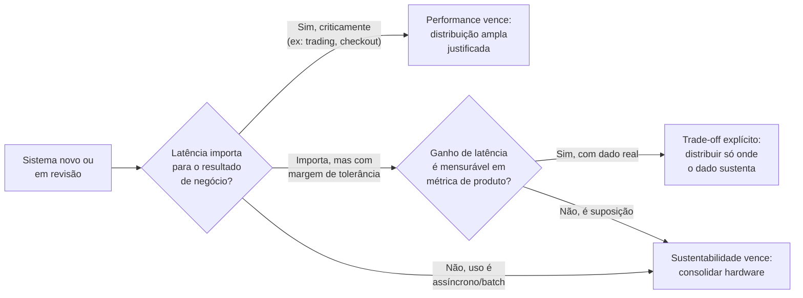
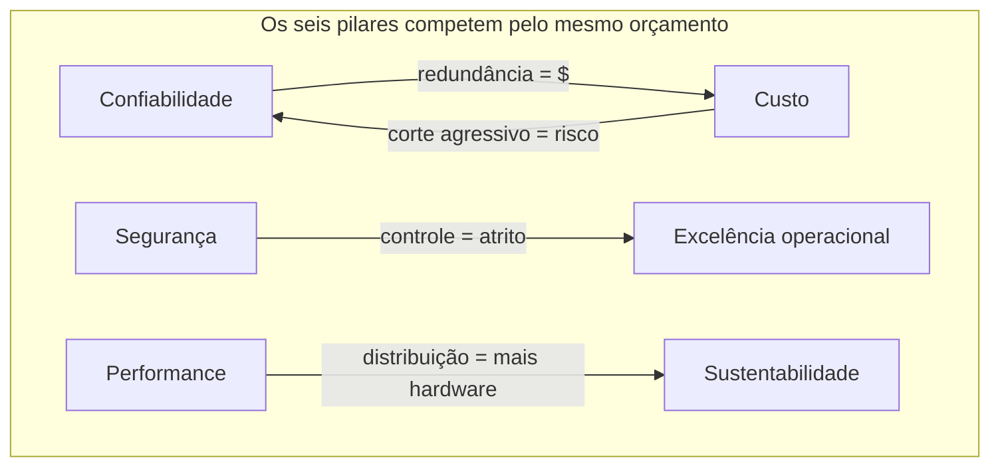
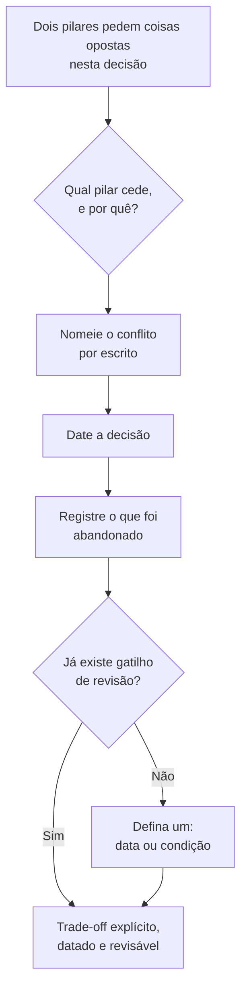
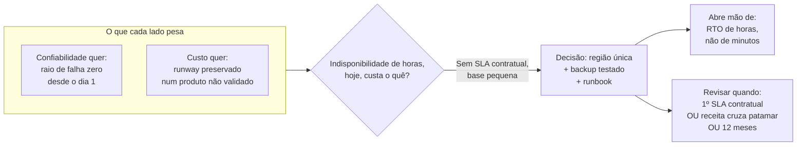
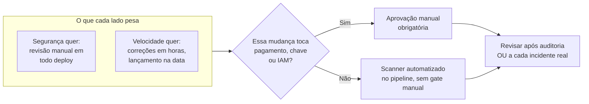

# Sustentabilidade e os trade-offs entre pilares

> [!abstract] TL;DR
> A sustentabilidade é o sexto e mais recente pilar do Well-Architected Framework — adicionado em dezembro de 2021, quando os cinco pilares originais (excelência operacional, segurança, confiabilidade, eficiência de performance, otimização de custo) ganharam companhia. Na prática de arquitetura, ela se resume a uma pergunta simples de fazer e difícil de responder com rigor: *este desenho consome mais recurso físico do que precisa?* Right-sizing, escolha de região e uso de serviço gerenciado — três decisões que esta trilha já discutiu por razões de custo — voltam a aparecer aqui por uma razão diferente: menos capacidade ociosa também é, quase sempre, menos energia queimada. Mas "quase sempre" não é "sempre", e é aí que esta nota vira o assunto mais valioso do galho inteiro: os seis pilares não coexistem em paz. Confiabilidade custa dinheiro. Segurança custa velocidade. Performance pode custar sustentabilidade. Otimizar custo agressivamente corrói confiabilidade. Um arquiteto sênior não finge que dá para maximizar os seis ao mesmo tempo — ele escolhe, deliberadamente, qual pilar cede terreno para qual, documenta a escolha com data, e aceita revisitá-la quando o contexto mudar.

## A pergunta que a revisão de arquitetura não fazia até 2021

Imagine uma revisão de arquitetura conduzida em 2019, nos moldes que o **galho 3** já descreveu desde a nota 01: um time se senta, percorre um workload proposto, e faz perguntas de cada um dos cinco pilares então existentes. "Como isso se recupera de falha?" — confiabilidade. "Quem tem acesso a esse dado?" — segurança. "Quanto isso custa por mês, projetado a doze meses?" — otimização de custo. "Como isso evolui sem downtime?" — excelência operacional. "Isso atende ao SLA de latência sob a carga de pico esperada?" — performance. Cinco lentes, cinco conjuntos de perguntas, cobrindo — aparentemente — tudo que importa numa arquitetura bem desenhada.

Só que uma pergunta ficava sistematicamente fora da sala: *quanta energia essa arquitetura consome, e isso importa para alguém além do departamento financeiro?* Não porque fosse irrelevante — data centers sempre consumiram eletricidade, sempre emitiram carbono indiretamente, sempre desperdiçaram capacidade ociosa —, mas porque não havia, nas cinco lentes estabelecidas, um lugar formal para essa pergunta pousar. Ela vivia, na melhor das hipóteses, espremida dentro da otimização de custo — como se "gastar menos" e "emitir menos" fossem sempre e automaticamente a mesma coisa (o resto desta nota vai mostrar que não são, ou pelo menos não perfeitamente).

Em dezembro de 2021, na conferência re:Invent, a AWS formalizou um sexto pilar: **sustentabilidade**. Não foi um gesto isolado — outros provedores de peso já vinham publicando compromissos e metas de neutralidade de carbono havia anos —, mas foi o momento em que a pergunta "isso desperdiça recurso físico?" ganhou o mesmo status formal que "isso está seguro?" ou "isso está disponível?" já tinham. Um workload podia, a partir dali, ser tecnicamente irrepreensível nos outros cinco pilares e ainda assim reprovar numa revisão bem conduzida, porque ninguém tinha perguntado quanto ele desperdiçava.

> [!info] Caducidade
> Nomes oficiais dos seis pilares e a data de introdução da sustentabilidade verificados via documentação oficial da AWS em 2026-07-22. Confira a versão vigente do framework antes de citar em entrevista ou decisão de arquitetura — a AWS revisa o whitepaper de sustentabilidade periodicamente (última revisão publicada verificada: novembro de 2024).

## O que o pilar de sustentabilidade realmente pede

A AWS descreve o foco do pilar como impacto ambiental — sobretudo consumo e eficiência de energia — porque essas são as alavancas que um arquiteto de fato controla ao tomar decisões de desenho. Formalmente, o pilar se organiza em torno de seis princípios de design, valendo a pena registrar os seis com exatidão porque são, com frequência, cobrados em entrevista técnica sênior de forma quase textual:

| # | Princípio (nome oficial) | O que pede na prática | Onde já apareceu nesta trilha |
|---|---|---|---|
| 1 | Entenda seu impacto | Meça o consumo do workload — incluindo o uso pelo cliente e a descontinuação futura — e compare resultado produtivo com custo físico por unidade de trabalho. | Base para qualquer métrica de FinOps (nota 06) |
| 2 | Estabeleça metas de sustentabilidade | Defina objetivos de longo prazo (ex.: menos recurso por transação) e planeje o crescimento para reduzir, não aumentar, a intensidade de impacto por unidade. | Espelha metas de eficiência de gasto, não gasto absoluto (nota 06) |
| 3 | Maximize a utilização | Dimensione corretamente e reduza capacidade ociosa — dois hosts a 30% consomem mais energia de base, somados, do que um a 60%. | Mesmo argumento de right-sizing (nota 06) |
| 4 | Antecipe e adote hardware e software mais eficientes | Monitore ofertas mais eficientes e desenhe para adoção rápida, sem travar a arquitetura numa geração de hardware. | Evolução contínua de infraestrutura (nota 02) |
| 5 | Use serviços gerenciados | Compartilhar infraestrutura entre uma base ampla de clientes maximiza a utilização de recursos físicos. | Argumento de pooling da nota 06 do galho 1, agora sob a ótica de eletricidade e refrigeração compartilhadas |
| 6 | Reduza o impacto a jusante do seu workload | Diminua a energia ou o hardware que o *cliente* precisa gastar para consumir seu serviço, incluindo a pressão para trocar de dispositivo. | Ótica de UX/performance percebida pelo cliente final |

Note a recorrência: os princípios 3 e 5 são, quase palavra por palavra, os mesmos argumentos que as notas 02 e 06 desta trilha já usaram para justificar elasticidade e managed-first — só que ali a métrica era a fatura, e aqui é o joule. Essa sobreposição não é coincidência editorial; é o primeiro sinal, ainda gentil, de que dois pilares diferentes podem apontar exatamente na mesma direção — o que nem sempre acontece, como a seção seguinte vai mostrar com desconforto.

O framework também organiza o trabalho prático em seis áreas de melhores práticas — cada uma reunindo um conjunto de práticas recomendadas específicas, numeradas (SUS01 a SUS06) na documentação oficial:

| Área | O que cobre |
|---|---|
| Seleção de região | Escolher a região com base em requisitos de negócio **e** metas de sustentabilidade, não só latência e preço. |
| Alinhamento à demanda | Escalar dinamicamente para a demanda real, alinhar SLA às metas de sustentabilidade, eliminar ativo não utilizado, posicionar recurso para minimizar rede necessária. |
| Software e arquitetura | Escolher linguagem, algoritmo e padrão de arquitetura que minimizem o custo físico por unidade de trabalho entregue. |
| Dados | Reduzir volume de dado armazenado e transferido, usar ciclo de vida de armazenamento (mover dado frio para camada mais barata e eficiente). |
| Hardware e serviços | Usar o hardware mínimo necessário para o resultado desejado, preferindo instâncias e serviços mais eficientes por unidade de trabalho. |
| Processo e cultura | Comunicar metas de sustentabilidade para o time, manter o workload atualizado, aumentar utilização de ambiente de build e teste, usar device farm gerenciado em vez de hardware de teste dedicado. |

Duas dessas seis áreas — seleção de região e a disciplina de maximizar utilização (que atravessa alinhamento à demanda, dados e hardware) — merecem espaço próprio aqui porque são as que mais aparecem em decisão real de arquitetura sênior.

## Escolha de região: o mesmo mapa, uma lente diferente

A **nota 02 do galho 2** já ensinou que escolher uma região é uma decisão de latência, soberania de dado e preço — cada região da AWS, cada datacenter da DigitalOcean, tem seus próprios custos de operação e sua própria distância até o usuário final. A pauta de sustentabilidade acrescenta uma quarta variável ao mesmo mapa, sem apagar as outras três: **a intensidade de carbono da matriz elétrica que alimenta aquele datacenter específico**.

Duas regiões podem ter praticamente o mesmo preço de computação e latência parecida para um mesmo usuário — e ainda assim ter pegadas de carbono radicalmente diferentes, porque a eletricidade que alimenta uma vem majoritariamente de fontes renováveis (hidrelétrica, eólica, solar) e a outra vem de uma matriz com participação relevante de termelétrica a carvão ou gás. Essa diferença não aparece em nenhuma fatura — o preço por hora de computação de uma instância não carrega, embutido, o carbono da eletricidade que a acendeu. Ela só aparece se alguém escolher medir, o que é exatamente o primeiro princípio de design do pilar ("entenda seu impacto") aplicado a uma decisão concreta.

O próprio framework nomeia essa decisão como prática recomendada explícita: escolher a região com base tanto em requisitos de negócio quanto em metas de sustentabilidade — não uma ou outra, as duas, pesadas junto com latência, custo e soberania de dado na mesma decisão, não depois dela.

Para tornar a decisão concreta, imagine um workload que não tem restrição legal de soberania de dado e cujos usuários estão razoavelmente próximos de duas regiões candidatas, com preço de computação equivalente entre elas. Nesse cenário específico — sem restrição legal e com preço equivalente —, a matriz elétrica de cada região deixa de ser um critério de desempate e passa a ser o critério que decide, porque os outros três (latência, preço, soberania) já empataram. Isso não significa que sustentabilidade sempre vença o desempate — significa que, quando os critérios tradicionais empatam, é exatamente o momento em que o quarto critério, historicamente ignorado, deveria ter voz. Um arquiteto que só considera os três critérios de sempre, nesse cenário específico, está escolhendo por inércia — não porque tenha decidido conscientemente que sustentabilidade não importa aqui.

> [!warning] Tratar "menor latência" e "menor carbono" como a mesma pergunta
> É tentador assumir que a região mais próxima do usuário é automaticamente a mais responsável do ponto de vista ambiental, porque "mais perto" soa mais eficiente. Não é necessariamente verdade: uma região próxima com matriz elétrica intensiva em carbono pode ter uma pegada bem maior do que uma região um pouco mais distante alimentada majoritariamente por energia limpa. As duas perguntas — "onde fica mais perto?" e "onde a eletricidade é mais limpa?" — têm respostas independentes, e um arquiteto sênior sabe que precisa fazer as duas, não uma só.

Vale a honestidade sobre o estado da lente dupla aqui: a AWS publica, de forma relativamente granular, informação sobre suas regiões que permite essa comparação (e mantém, por exemplo, compromissos públicos de neutralidade de carbono e de energia 100% renovável na infraestrutura, com metas e prazos revisados periodicamente). A **DigitalOcean** não publica, no mesmo nível de detalhe por região, dados de intensidade de carbono ou matriz elétrica local dos seus datacenters — é um caso, como a convenção desta trilha pede que seja dito com todas as letras, em que o provedor menor simplesmente não oferece o mesmo nível de dado que o leitor precisaria para tomar essa decisão com rigor. Isso não significa que a DigitalOcean seja pior nesse eixo — significa que a informação para avaliar não está publicamente disponível na mesma granularidade, o que já é, por si, uma informação relevante para quem está decidindo onde rodar um workload sensível a essa dimensão.

A ferramenta que a AWS oferece para essa medição própria (não a comparação entre regiões, mas o consumo da própria conta) é o serviço **AWS Sustainability** — o mesmo produto que a documentação ainda referencia, em algumas URLs legadas, pelo nome anterior, **Customer Carbon Footprint Tool**. Ele reporta emissão de carbono e consumo de água por conta, por região e por serviço, com granularidade mensal, direto no console de billing — mas mede o consumo já realizado, não decide de antemão qual região escolher; a decisão *a priori* continua dependendo do que a página de seleção de região publica sobre cada localidade. A DigitalOcean, coerente com a assimetria já registrada nesta nota, não tem um serviço equivalente de relatório de pegada de carbono por conta.

> [!tip] Assista: AWS re:Invent 2022 - Architecting sustainably and reducing your AWS carbon footprint (SUS205)
> **Canal:** AWS Events (oficial) | **Duração:** ~48min | **Idioma:** EN
>
> A líder técnica mundial de sustentabilidade da AWS detalha, ponto a ponto, o mesmo processo de duas decisões que esta seção descreve — primeiro os requisitos de negócio inegociáveis (soberania de dado, latência), depois a escolha entre as regiões restantes por proximidade de projeto de energia renovável ou menor intensidade de carbono da rede — junto com o funcionamento por trás da ferramenta de carbono da própria conta.
> Trecho de destaque [13:04]: *"Great, but how do I pick a region?"* — a pergunta que a talk inteira responde.
>
> 🎬 [Assistir no YouTube](https://www.youtube.com/watch?v=jsbamOLpCr8)

> [!info] Caducidade
> Compromissos de energia renovável, metas de neutralidade de carbono e disponibilidade de dado de intensidade de carbono por região mudam com frequência e são, em boa parte, autodeclarados pelos próprios provedores. Verificado em 2026-07-22 que a AWS publica compromissos públicos nesse sentido; não tome nenhum percentual específico como atual sem conferir a página de sustentabilidade vigente do provedor antes de citar em decisão real ou entrevista. O serviço de relatório de carbono da própria conta também mudou de nome — de "Customer Carbon Footprint Tool" para "AWS Sustainability" — confirme o nome vigente antes de citar em entrevista.

## Right-sizing: a mesma decisão, duas justificativas que quase sempre convergem — e às vezes não

A **nota 06** deste galho já tratou right-sizing como disciplina de otimização de custo: uma instância superdimensionada para a carga que ela realmente sustenta é dinheiro pago por capacidade que nunca é usada. A pauta de sustentabilidade chega à mesma prática por um caminho diferente — o quarto princípio de design ("maximize a utilização") — e, na esmagadora maioria dos casos reais, as duas justificativas apontam exatamente para a mesma ação: reduzir o tamanho da instância, consolidar cargas ociosas, desligar o que não está sendo usado.

Essa convergência é boa notícia para quem defende sustentabilidade dentro de uma organização que só escuta argumento financeiro — não é preciso vender "responsabilidade ambiental" como um custo adicional a ser absorvido; na maior parte dos casos, o argumento financeiro já embute o argumento ambiental de graça, porque hardware ocioso desperdiça tanto dinheiro quanto energia ao mesmo tempo. É por isso que a AWS, ao descrever esse princípio, usa quase o mesmo vocabulário de eficiência que a **nota 06** já usou para custo: dois hosts a 30% de utilização consomem mais energia de base, somados, do que um único host a 60%, exatamente pela mesma razão pela qual eles custam mais, somados, do que um único host consolidado.

Mas "quase sempre convergem" não é "sempre convergem", e um sênior que trata as duas métricas como sinônimos perfeitos vai ser pego de surpresa em pelo menos dois cenários reais:

- **Redundância geográfica para confiabilidade.** Manter réplicas ativas em múltiplas regiões, para reduzir o raio de falha de uma indisponibilidade regional — prática central do **galho 20** desta trilha — significa, por definição, mais hardware físico rodando simultaneamente do que o estritamente necessário para atender à carga em condições normais. Essa capacidade extra é dinheiro gasto de propósito para comprar confiabilidade; ela também é energia gasta de propósito, porque a redundância que protege contra falha é, vista pela lente de sustentabilidade, capacidade ociosa a maior parte do tempo — só que ociosa por design, não por descuido. Reduzir essa redundância para "economizar energia" reduziria também a confiabilidade — o exemplo canônico da seção seguinte.
- **Cache e réplicas de leitura para performance.** Servir conteúdo de múltiplos pontos geograficamente distribuídos, ou manter réplicas de leitura próximas do usuário para reduzir latência, multiplica a quantidade de hardware e de dado replicado envolvido na operação — mais eficiente para o usuário final, mais caro em recurso físico total. É o exato assunto da seção "Performance pode custar sustentabilidade", logo adiante.

Na prática de operação, "maximizar utilização" é uma pergunta que se responde consultando ferramenta, não olhando fatura por cima. Do lado AWS, o Compute Optimizer analisa o histórico de uso de uma instância e aponta se ela está super ou subdimensionada para a carga real:

```bash
# AWS — recomendação de right-sizing para uma instância específica
aws compute-optimizer get-ec2-instance-recommendations \
  --instance-arns arn:aws:ec2:us-east-1:123456789012:instance/i-1234567890abcdef0 \
  --region us-east-1

# Filtrar só instâncias subdimensionadas (candidatas a upgrade, não a corte)
aws compute-optimizer get-ec2-instance-recommendations \
  --filters name=Finding,values=Underprovisioned \
  --region us-east-1
```

A DigitalOcean não tem um serviço equivalente ao Compute Optimizer — não existe recomendação automática de right-sizing baseada em histórico de uso. O que existe é alerta configurável sobre limiar de utilização, que exige que o time defina o limiar (o Compute Optimizer, por comparação, infere isso sozinho a partir do histórico):

```bash
# DigitalOcean — alerta quando a utilização de memória de um droplet
# passa de 80% por 5 minutos seguidos (o inverso — capacidade ociosa —
# não tem um tipo de alerta pronto equivalente; exige monitorar e decidir manualmente)
doctl monitoring alert create \
  --type "v1/insights/droplet/memory_utilization_percent" \
  --compare GreaterThan \
  --value 80 \
  --window 5m \
  --entities 386734086,191669331 \
  --emails plataforma@example.com
```

Essa assimetria de tooling é, ela mesma, um dado relevante de sustentabilidade: quanto mais automatizada a detecção de capacidade ociosa, mais barato — em tempo de engenharia — é agir sobre o princípio "maximize a utilização" com regularidade, em vez de só numa auditoria pontual.

A tabela a seguir reúne, num só lugar, a assimetria de ferramental que esta nota foi encontrando ao longo do galho — útil como referência rápida antes de prometer, numa entrevista ou numa proposta técnica, algo que um dos dois provedores simplesmente não oferece:

| Necessidade | AWS | DigitalOcean |
|---|---|---|
| Recomendação automática de right-sizing | Compute Optimizer, baseado em histórico de uso | Sem equivalente; só alerta manual de limiar (`doctl monitoring alert`) |
| Relatório de carbono/água por conta | AWS Sustainability (ex-Customer Carbon Footprint Tool) | Sem equivalente publicado |
| Dado de intensidade de carbono por região | Publicado na página de sustentabilidade, por região | Não publicado no mesmo nível de granularidade |
| Análise de custo por serviço/tag via CLI | `aws ce get-cost-and-usage` | Sem Cost Explorer equivalente; billing via API mais limitado |

Nenhuma dessas lacunas é um veredito de que a DigitalOcean é "menos madura" em sustentabilidade — é, como esta trilha já registrou noutras notas, um provedor menor priorizando simplicidade operacional em vez do catálogo de observabilidade granular que a escala da AWS sustenta. Mas é uma lacuna real, que muda a resposta prática para "como eu meço isso na prática?" dependendo de qual provedor está por baixo do workload.

A lição prática, e é aqui que a diferença entre decorar o framework e usá-lo aparece pela primeira vez nesta nota: right-sizing bem-feito **não é** "use o mínimo de recurso físico possível, sempre" — é "não pague por capacidade que você não está usando **para nenhum propósito legítimo**". Capacidade ociosa comprada de propósito, para sustentar um objetivo de outro pilar (confiabilidade, performance), não é desperdício — é uma escolha, e o julgamento sênior está em saber diferenciar as duas coisas, não em minimizar recurso físico cegamente.

## A parte mais valiosa desta nota: os pilares se contradizem

Tudo que este galho descreveu até aqui — da excelência operacional na **nota 02** até a sustentabilidade nesta nota — foi apresentado, pilar a pilar, como se fossem seis dimensões independentes de qualidade, cada uma melhorável sem custo para as outras cinco. É uma simplificação pedagógica necessária para ensinar cada pilar isoladamente — e é **falsa** no momento em que um arquiteto sênior precisa desenhar um sistema de verdade, com restrição de tempo e orçamento reais.

A verdade desconfortável, e o motivo pelo qual esta nota fecha o galho em vez de ser mais uma nota de pilar entre outras, é que **os seis pilares competem pelos mesmos recursos escassos — dinheiro, tempo de engenharia, e às vezes energia física — e otimizar um, além de certo ponto, quase sempre custa terreno em pelo menos um outro**. Um framework que não admitisse isso não seria uma ferramenta de julgamento; seria uma lista de desejos. A pergunta que separa quem decorou os nomes dos seis pilares de quem sabe usá-los numa decisão real não é "quais são os pilares?" — é "quando dois deles brigam pelo mesmo orçamento, qual cede, e por quê?".

> [!tip] Assista: Software Architecture: The Hard Parts
> **Canal:** GOTO Conferences | **Duração:** ~43min | **Idioma:** EN
>
> Neal Ford e Mark Richards (autores do livro homônimo) nomeiam, fora do vocabulário específico da AWS, exatamente a mesma verdade que esta seção defende: a primeira das duas "leis" de arquitetura de software que eles cunharam é que **tudo em arquitetura de software é um trade-off** — não existe decisão sem lado que cede. É a mesma ideia desta nota, vista de fora do Well-Architected Framework, confirmando que o padrão não é peculiaridade da AWS, é estrutural à disciplina.
> Trecho de destaque [41:38]: *"everything in software architecture is a tradeoff"*.
>
> 🎬 [Assistir no YouTube](https://www.youtube.com/watch?v=rhNWmiC-0sk)

Quatro pares de conflito aparecem com tanta frequência em arquitetura real que vale examiná-los com exemplo trabalhado, não como lista abstrata de avisos.

### Confiabilidade custa dinheiro

O exemplo mais direto, e o mais fácil de justificar para qualquer stakeholder financeiro, porque o trade-off é visível numa planilha. Rodar um serviço numa única zona de disponibilidade custa uma fração do que custa rodá-lo replicado em três zonas, com failover automático testado regularmente — a **nota 04** deste galho já descreveu por que a arquitetura de múltiplas zonas reduz o raio de falha, e o **galho 20** vai aprofundar a mecânica. Mas essa redução de raio de falha não é grátis: é hardware adicional rodando, é dado replicado ocupando armazenamento adicional, é tráfego de replicação entre zonas consumindo banda que também tem custo. Dobrar de uma zona para duas não dobra necessariamente a fatura — mas aproxima-se disso, e triplicar para três zonas aproxima-se de triplicar.

O ponto de decisão sênior aqui não é "sempre pague pela confiabilidade máxima" nem "sempre corte custo até o osso" — é perguntar, workload por workload: **quanto essa indisponibilidade específica custaria, em dinheiro perdido ou reputação, se ela acontecesse?** Um sistema de checkout de e-commerce em Black Friday e um painel administrativo interno usado três vezes por semana justificam níveis completamente diferentes de investimento em confiabilidade, mesmo que ambos rodem, tecnicamente, na mesma nuvem, com o mesmo catálogo de serviços disponível para os dois.

Um exemplo desenhado para tornar o trade-off concreto: imagine um time avaliando se vale multiplicar a fatura de infraestrutura de um serviço para levá-lo de uma zona para três, com failover automático testado. A pergunta certa não é "podemos pagar isso?" — quase sempre a resposta é sim, isoladamente. A pergunta é comparativa: **o custo mensal adicional da redundância é menor do que o custo esperado de uma indisponibilidade, multiplicado pela frequência com que ela provavelmente aconteceria sem a redundância?** Se a resposta for sim — se o serviço processa pagamento, ou é a porta de entrada de um produto com receita direta —, a redundância se paga sozinha na primeira vez que evita um incidente sério. Se a resposta for não — um painel interno cuja pior consequência de ficar fora do ar por uma tarde é um funcionário reclamar —, pagar pela redundância máxima é dinheiro real trocado por um risco que, na prática, ninguém sentiria falta de ter mitigado. O erro sênior mais comum aqui não é escolher errado uma vez; é aplicar a mesma resposta padrão ("sempre multi-AZ" ou "sempre single-AZ") a todos os workloads da organização, sem fazer essa conta caso a caso.

### Segurança custa velocidade de entrega

Menos visível numa planilha, mais sentido no dia a dia de quem entrega software. Cada camada adicional de controle — revisão obrigatória de segurança antes de um deploy, varredura de vulnerabilidade bloqueante no pipeline de CI, aprovação manual de uma pessoa autorizada para provisionar um recurso novo, rotação obrigatória de credencial a cada intervalo curto — reduz a velocidade com que uma mudança legítima chega à produção. Isso não é um argumento contra segurança; é o reconhecimento honesto de que segurança, levada ao extremo, colide de frente com a **excelência operacional** deste mesmo galho, cujo princípio central (**nota 02**) é justamente fazer mudanças pequenas e frequentes com segurança suficiente, não mudanças raras e paralisadas por burocracia.

O erro comum de quem não internalizou esse trade-off é tratá-lo como binário: "ou seguro, ou rápido" — quando o trabalho sênior de verdade está em desenhar controles que sejam automatizados, não manuais, de forma que o atrito caia sobre a máquina (um scanner que roda em segundos no pipeline) em vez de sobre uma pessoa esperando aprovação numa fila. É por isso que o pilar de segurança, na **nota 03** deste galho, já cita automação de controles como princípio central — não porque automação seja mais segura por definição (às vezes um humano pega o que uma regra automatizada deixa passar), mas porque automação é a única forma de ter segurança rigorosa sem sacrificar, de forma permanente e crescente, a velocidade que a excelência operacional pede.

O cenário em que esse conflito aparece com mais nitidez é o de uma organização que reage a um incidente de segurança recente adicionando aprovação manual obrigatória para todo deploy em produção — uma resposta compreensível, e ainda assim uma resposta que troca velocidade de entrega por uma sensação de controle que nem sempre corresponde a controle real. Uma aprovação manual não pega o que um scanner automatizado já pegaria (dependência vulnerável, segredo commitado, configuração de rede aberta); ela pega, na melhor das hipóteses, o que um revisor humano souber procurar naquele momento específico, sob pressão de fila. O resultado prático, meses depois, costuma ser previsível: a fila de aprovação vira gargalo, deploys se acumulam em lotes maiores para "compensar" a demora — o que aumenta, não diminui, o raio de um eventual erro —, e a organização não está mensuravelmente mais segura, só mensuravelmente mais lenta. A alternativa que preserva as duas coisas é mover o mesmo rigor para dentro do pipeline: scanner de dependência e de segredo bloqueando o merge automaticamente, política de rede validada por ferramenta antes do apply, e reservar a aprovação humana só para a categoria de mudança que de fato exige julgamento que uma regra não captura — não para todo deploy, indiscriminadamente.

### Performance pode custar sustentabilidade

O conflito mais contraintuitivo dos quatro, porque as duas notas anteriores deste galho (05 e esta) descreveram práticas que, à primeira vista, parecem sempre alinhadas — usar o serviço certo, evitar desperdício. Mas performance máxima e sustentabilidade máxima nem sempre convergem, e o exemplo mais claro é distribuição geográfica de conteúdo.

Servir um vídeo ou uma resposta de API com a menor latência possível para usuários espalhados pelo mundo inteiro tipicamente significa replicar aquele conteúdo — ou aquela lógica de processamento — em dezenas de pontos de presença geograficamente distribuídos, de forma que nenhum usuário precise atravessar um oceano inteiro para receber a resposta. Cada ponto de presença adicional é hardware físico rodando, consumindo energia, em algum datacenter ou nó de borda — mesmo que a fração de tráfego que cada um atende, individualmente, seja pequena. Uma arquitetura mais centralizada, com menos pontos de presença, consome menos hardware físico total, mas entrega latência pior para os usuários mais distantes do ponto central.

Não existe uma resposta universal aqui — existe uma pergunta que precisa ser feita, caso a caso: **essa latência marginal que a distribuição geográfica adicional compra realmente importa para o usuário, ou é otimização por vaidade técnica?** Um sistema de negociação financeira de alta frequência, onde microssegundos movem dinheiro real, justifica um investimento em distribuição geográfica — e no consumo físico que ele implica — que um blog corporativo de baixo tráfego simplesmente não justifica. Perseguir o menor tempo de resposta possível, em todo sistema, sem perguntar se aquele ganho de latência importa para alguém, é otimizar performance às custas de sustentabilidade sem sequer ter tido a intenção consciente de fazer essa troca.

O exemplo trabalhado aqui é o inverso do de confiabilidade: em confiabilidade, o pilar que cede geralmente é óbvio (custo) e o que se compra em troca é claro (menos indisponibilidade). Em performance × sustentabilidade, o que se compra costuma ser difuso — uma melhora de latência de dezenas de milissegundos, que a maioria dos usuários provavelmente nem percebe conscientemente, mas que uma métrica de produto (tempo até a primeira interação, taxa de abandono) pode mostrar como estatisticamente relevante em agregado. É exatamente essa dificuldade de perceber o ganho que torna o trade-off perigoso: é fácil justificar "mais um ponto de presença" com um número de produto isolado, sem nunca perguntar quanto hardware físico adicional aquele número marginal está custando — porque o hardware não aparece na mesma tela que a métrica de produto.



### Otimização agressiva de custo corrói confiabilidade

O último par fecha o círculo de volta ao primeiro, na direção oposta. Assim como confiabilidade custa dinheiro, cortar custo além de um certo ponto compra de volta menos confiabilidade — e esse é, talvez, o conflito mais perigoso dos quatro, porque o custo cortado aparece imediatamente na fatura (uma vitória visível, celebrada) enquanto o preço pago em confiabilidade só aparece depois, no dia em que a redundância que foi removida fazia falta.

O exemplo canônico: uma iniciativa de corte de custo elimina a réplica de standby de um banco de dados porque ela "nunca é usada" — métrica de utilização, tomada isoladamente, sugere que aquele recurso é desperdício puro, exatamente o tipo de capacidade ociosa que o princípio de "maximize a utilização" (tanto de custo quanto de sustentabilidade) recomenda eliminar. Só que aquela réplica nunca ser usada **é o ponto** — ela existe para o dia em que a réplica primária falhar, não para reduzir latência no dia a dia. Medir sua utilidade pela frequência de uso é aplicar a métrica errada a um recurso cujo valor está inteiramente na opcionalidade que ele carrega, não na atividade que ele gera.

Esse é o motivo pelo qual a **nota 06** deste galho, ao descrever otimização de custo, insistiu em medir **eficiência do gasto**, não apenas o gasto absoluto — um corte de custo que reduz a eficiência do sistema como um todo (mais incidentes, recuperação mais lenta, mais tempo de engenheiro sênior apagando incêndio às três da manhã) não é otimização; é transferência de custo do orçamento de infraestrutura para o orçamento de confiabilidade e de saúde mental do time de plantão, geralmente sem que ninguém tenha calculado essa segunda conta.

A ferramenta que evita esse erro é simples: medir o gasto por serviço ou por tag antes de cortar, não depois. No lado AWS, o Cost Explorer via CLI responde exatamente "quanto esse componente específico custou no último mês":

```bash
# AWS — custo mensal por serviço, para comparar o que a réplica de
# standby custa contra o que ela evita antes de decidir eliminá-la
aws ce get-cost-and-usage \
  --time-period Start=2026-06-01,End=2026-07-01 \
  --granularity MONTHLY \
  --metrics UnblendedCost \
  --group-by Type=DIMENSION,Key=SERVICE
```

O número que sai desse comando é só metade da conta — a outra metade, o custo esperado de *não* ter a réplica no dia em que ela fizer falta, não vem de nenhuma API; vem do exercício de julgamento que a próxima seção formaliza.



A tabela a seguir condensa os quatro pares — é, de todo o galho, a que mais vale memorizar, porque é a que costuma decidir se uma resposta de entrevista soa como quem decorou o framework ou como quem já brigou com ele em produção:

| Par de pilares | O conflito | Exemplo concreto | Como decidir |
|---|---|---|---|
| Confiabilidade × Custo | Redundância (multi-AZ, standby) multiplica hardware, armazenamento e banda — e a fatura junto. | Rodar um serviço em 1 zona custa uma fração de rodá-lo replicado em 3, com failover testado. | Compare o custo mensal da redundância com o custo esperado da indisponibilidade (frequência × impacto em $ ou reputação). |
| Segurança × Velocidade/Performance | Cada camada de controle manual reduz a cadência de mudanças legítimas chegando à produção. | Aprovação humana obrigatória em todo deploy, em reação a um incidente recente. | Automatize o controle (scanner no pipeline) em vez de adicionar mais aprovação manual; reserve humano para o que a regra não capta. |
| Performance × Sustentabilidade | Mais pontos de presença geograficamente distribuídos = menor latência, mais hardware físico rodando. | CDN com dezenas de edges vs. uma origem mais centralizada. | Pergunte se a latência marginal importa de fato para o usuário, ou é otimização por vaidade técnica. |
| Custo × Confiabilidade | Corte de custo elimina capacidade que parece ociosa, mas existe de propósito para o dia da falha. | Eliminar a réplica de standby de um banco "porque nunca é usada". | Meça eficiência do gasto, não gasto absoluto — capacidade ociosa comprada de propósito não é desperdício. |

## Como decidir: trade-off explícito, datado e revisável

A conclusão de tudo isso não é "escolha um pilar favorito e ignore os outros cinco" — seria trocar um erro (fingir que não há conflito) por outro (fingir que só um pilar importa). A conclusão, e é este o método que separa um arquiteto sênior de alguém que memorizou os nomes dos seis pilares para uma entrevista, é que **todo trade-off entre pilares deveria ser uma decisão explícita, tomada conscientemente e registrada, não um acidente descoberto depois que já causou dano**.

Na prática, isso significa três disciplinas concretas, nenhuma delas exótica ou cara de adotar:

- **Explicite o trade-off por escrito, no momento da decisão.** Quando um time decide rodar um serviço numa única zona em vez de três, ou aprovar um deploy sem revisão de segurança obrigatória para acelerar uma correção urgente, ou consolidar hardware para economizar energia às custas de alguma margem de performance — essa decisão deveria existir em algum lugar legível (um documento de decisão de arquitetura, um comentário num sistema de tíquetes, uma ata de revisão), não só na memória de quem estava na sala. O objetivo não é burocracia — é permitir que alguém, meses depois, entenda *por que* aquela escolha foi feita, em vez de presumir que foi negligência.
- **Date a decisão.** Um trade-off aceitável hoje pode deixar de ser aceitável amanhã, porque o contexto de negócio muda: um sistema interno de baixo risco vira, com o crescimento da empresa, um sistema crítico que processa pagamento; uma carga que cabia numa única zona cresce até um ponto em que perder essa zona derruba o negócio inteiro por horas. Registrar a data da decisão original é o que permite perguntar, depois, "essa escolha ainda faz sentido dado o que o sistema virou?" — em vez de descobrir, tarde demais, que uma decisão de 2023 nunca foi revisitada e já não reflete a realidade de 2026.
- **Torne a decisão revisável, não permanente.** Um trade-off registrado como "aceitamos X em troca de Y, por causa do contexto Z, revisar quando Z mudar" é uma decisão de engenharia madura. Um trade-off que ninguém documentou e que todo mundo esqueceu que existia é uma bomba-relógio arquitetural — e é exatamente o tipo de achado que uma revisão bem-feita do Well-Architected Framework, como a **nota 01** deste galho descreveu, existe para desenterrar antes que ele exploda em produção.

| Disciplina | O que fazer | Por que importa |
|---|---|---|
| Nomeie o conflito | Registre por escrito qual pilar cede terreno para qual, no momento em que a decisão é tomada — não depois. | Permite que alguém, meses depois, entenda o motivo em vez de presumir negligência. |
| Date a decisão | Anote a data em que o trade-off foi aceito, junto com o contexto que o justificava. | Contexto muda; uma decisão de 2023 pode já não fazer sentido em 2026. |
| Registre o que foi trocado | Anote explicitamente a capacidade, o controle ou a margem que foi abandonada em troca do ganho. | Torna o custo do trade-off visível e discutível, em vez de implícito e esquecido. |
| Defina quando revisitar | Estabeleça uma condição de reavaliação — data fixa ou gatilho (ex.: "revisar quando o tráfego dobrar"). | Sem gatilho de revisão, todo trade-off tende a virar permanente por inércia. |



Na prática, isso costuma caber num registro curto — um ADR (Architecture Decision Record) ou até um comentário estruturado num tíquete —, não numa burocracia nova:

```markdown
# ADR-014: Rodar o serviço de checkout em zona única

Data: 2026-07-20
Status: Aceito
Revisar quando: tráfego do checkout ultrapassar 2x o volume atual,
                 OU antes da próxima Black Friday (o que vier primeiro)

## Contexto
Checkout hoje processa ~200 pedidos/hora em pico. Multi-AZ triplicaria
o custo de infraestrutura do componente.

## Trade-off aceito
Cedemos: confiabilidade (raio de falha = 1 zona inteira).
Em troca de: custo ~3x menor que a alternativa multi-AZ.

## Por que aceitável agora
Volume atual não justifica o gasto; SLA contratual permite até 4h
de indisponibilidade/mês sem penalidade.
```

Essa disciplina — trade-off explícito, datado, revisável — é, também, a resposta que funciona melhor numa entrevista técnica sênior, porque é exatamente o que um entrevistador experiente está testando ao perguntar "como você decidiria entre X e Y aqui?". A resposta fraca lista prós e contras genéricos de cada pilar, como se estivesse recitando a tabela de conteúdo do framework. A resposta forte nomeia explicitamente qual pilar está cedendo terreno para qual, dá o critério concreto usado para decidir (custo do incidente evitado, criticidade do sistema, janela de tempo disponível), e admite, sem constrangimento, que a decisão pode precisar ser revisitada quando o contexto mudar — porque é exatamente assim que decisão de arquitetura madura funciona fora da sala de entrevista também.

Vale tornar essa diferença ainda mais concreta, porque é a mesma pergunta ("confiabilidade ou custo, o que você escolhe aqui?") que separa quem decorou o framework de quem já usou:

| | Resposta fraca | Resposta forte |
|---|---|---|
| Estrutura | Lista genérica de prós e contras de cada pilar. | Nomeia qual pilar cede, qual critério decidiu, e quando revisitar. |
| Critério | "Depende", sem dizer de quê. | Um número ou proxy concreto (custo do incidente, criticidade, SLA contratual). |
| Tom | Trata a escolha como se houvesse resposta certa universal. | Admite que a resposta muda com o contexto do sistema específico. |
| Revisão | Não menciona que a decisão pode mudar. | Define explicitamente a condição de revisitar. |

## Decidindo os trade-offs — dois casos de arquitetura

Tudo até aqui deu o vocabulário e o método. O que separa quem sabe recitar esse vocabulário de quem já o usou é conduzir uma decisão real até o fim — não parar em "os dois pilares têm um ponto", mas chegar a uma escolha, datá-la, e dizer com todas as letras o que ficou de fora. Os dois casos a seguir fazem exatamente isso, do início da discussão até o registro final.

### Caso 1 — Confiabilidade × custo: o produto em estágio inicial

Uma equipe de oito pessoas lança um produto B2B de analytics, três meses depois da rodada seed. Tem uma dúzia de clientes pagantes, nenhum deles com contrato de SLA formal, e um runway calculado em meses, não em anos. Numa revisão de arquitetura, alguém do time propõe multi-região ativa-ativa: réplica completa do banco numa segunda região, failover automático testado mensalmente, backup contínuo com retenção estendida. O argumento é impecável no vácuo — é exatamente o que a **nota 04** deste galho recomendaria para reduzir o raio de falha a zero, e exatamente o que a seção "Confiabilidade custa dinheiro" desta nota descreveu como prática de sistema crítico.

**Posição confiabilidade.** Quer o raio de falha menor possível desde o primeiro dia, para nunca ter que migrar uma arquitetura já em produção sob pressão de um cliente grande que exige uptime contratual. O argumento: é mais barato construir certo agora do que re-arquitetar depois, com dado de cliente real em jogo.

**Posição custo.** Multi-região ativa-ativa aproximadamente dobra ou triplica a fatura de infraestrutura do componente de dado, exatamente como a seção de confiabilidade desta nota já descreveu para o caso genérico — e esse runway adicional gasto em redundância é runway que não financia a próxima contratação de engenharia ou o próximo ciclo de vendas, num momento em que o produto ainda não validou se vai ter os clientes que a redundância pressupõe.

**A decisão conduzida.** O time aplica a pergunta que a seção "Confiabilidade custa dinheiro" formalizou: quanto essa indisponibilidade específica custaria, hoje, se acontecesse? Com uma dúzia de clientes sem SLA contratual, a resposta honesta é: um incidente de algumas horas custaria constrangimento e algumas mensagens de desculpa — não uma cláusula de penalidade, não um cliente perdido no dia seguinte, porque o produto ainda está em fase de conquistar confiança, não de defender uma base instalada.

Com essa resposta em mãos, o time decide **não** ir para multi-região ativa-ativa agora. A escolha registrada é uma arquitetura de região única, com backup automatizado testado — não só configurado, testado, com restauração exercitada a cada trimestre — e um runbook de recuperação documentado. É o meio-termo que a nota já descreveu ao tratar right-sizing: não "confiabilidade zero", e sim "confiabilidade proporcional ao risco real de hoje, não ao risco hipotético de um cliente que ainda não existe".

**O que se abre mão, com todas as letras.** Se a região inteira cair, o produto fica fora do ar até a recuperação manual completar — minutos a poucas horas, dependendo de quão bem o runbook foi exercitado, não segundos. Essa é uma degradação real, aceita conscientemente, não escondida atrás de um "provavelmente não vai acontecer".

**Data e gatilho de revisão.** Decisão registrada na data do lançamento, com revisão programada para o primeiro dos três eventos que ocorrer: (1) o primeiro cliente assinar um contrato com cláusula de SLA de disponibilidade, (2) a receita recorrente cruzar um patamar que o time já definiu internamente como "ponto em que um incidente de horas vira notícia ruim de verdade", ou (3) doze meses corridos, o que vier primeiro — para garantir que a decisão não sobreviva por inércia além do tempo em que o contexto original ainda vale.



### Caso 2 — Segurança × velocidade de entrega: o fintech pré-lançamento

Uma startup de pagamentos está a seis semanas do lançamento, movendo dinheiro real de teste em ambiente controlado, se preparando para uma auditoria de conformidade que antecede a abertura ao público. O time de segurança, recém-contratado, propõe exatamente o que a seção "Segurança custa velocidade de entrega" descreveu como o extremo intuitivo: revisão manual obrigatória de uma pessoa sênior de segurança antes de todo deploy em produção, incluindo correções pequenas.

**Posição segurança.** O produto move dinheiro; o custo de um incidente de segurança aqui não é reputacional abstrato, é perda financeira direta de terceiros e risco regulatório concreto. Todo controle adicional parece barato perto desse risco.

**Posição velocidade.** O time está a semanas do lançamento, ainda iterando rápido sobre o fluxo de onboarding e ainda encontrando bugs de produto que precisam de correção em horas, não em dias. Uma fila de aprovação manual para cada deploy, incluindo os que não tocam em nada relacionado a dinheiro, empurra o lançamento — e o próprio atraso tem custo, porque a auditoria de conformidade tem data marcada e depende do produto estar em produção estável antes dela.

**A decisão conduzida.** O time aplica a mesma disciplina que a seção de segurança já descreveu: em vez de um controle manual uniforme para todo deploy, ele classifica a superfície de mudança. Para a maior parte do código — UI, onboarding, lógica de produto que não toca em execução de pagamento, credencial ou IAM —, entra scanner automatizado de dependência e de segredo bloqueando o merge, sem aprovação humana adicional.

Para qualquer mudança que toque o caminho de execução de pagamento, chave criptográfica ou política de IAM, a aprovação manual de uma pessoa de segurança continua obrigatória — não porque a automação seja insuficiente ali por princípio, mas porque é exatamente a superfície onde o custo de um erro justifica o atrito. Um pentest externo, que o time queria rodar a cada deploy (inviável no ritmo pré-lançamento), é reagendado para acontecer uma vez antes da auditoria e depois em cadência trimestral — não a cada mudança de código.

**O que se abre mão, com todas as letras.** A cobertura de segurança para a maior parte do código passa a depender inteiramente do que o scanner automatizado captura — uma falha de lógica de negócio sutil, do tipo que só um revisor humano pegaria lendo o código com atenção, pode passar sem revisão manual nessa fatia do sistema até a próxima rodada de pentest. É um risco real, aceito porque a superfície de maior gravidade (o caminho de dinheiro em si) continua com revisão humana obrigatória.

**Data e gatilho de revisão.** Decisão registrada seis semanas antes do lançamento, com revisão programada para logo após a auditoria de conformidade (quando o time souber se algum achado do auditor exige apertar o controle) e, independentemente disso, a cada incidente de segurança real — qualquer achado de produção reabre a conversa sobre se a fatia "sem aprovação manual" precisa encolher.



Os dois casos aplicaram a mesma disciplina de três passos: nomear explicitamente qual pilar cedeu (RTO em horas no Caso 1, cobertura de revisão manual reduzida no Caso 2), registrar a data e o critério que justificou a escolha naquele momento, e definir de antemão a condição que reabre a decisão — não um prazo vago de "revisitar algum dia", mas um gatilho específico e verificável.

É essa passagem do vocabulário abstrato dos pilares para uma decisão datada, registrada e revisável que um entrevistador sênior está, na prática, testando ao perguntar "como você decidiria isso" — e é o que separa arquitetura de opinião.

## Casos práticos

**A revisão que descobriu um trade-off nunca discutido.** Um time roda uma revisão formal do framework, pilar a pilar, num sistema que já está em produção há dois anos. Ao chegar em confiabilidade, descobre que o sistema roda numa única zona — decisão tomada, sem registro, no dia do lançamento, quando o volume de tráfego era uma fração do atual. Ninguém tinha revisitado essa escolha desde então, não porque fosse a decisão certa, mas porque nunca tinha sido revisitada de propósito. A revisão não conclui automaticamente "mova para múltiplas zonas" — conclui "esse trade-off precisa ser reavaliado com números atuais de criticidade e custo", que é o resultado correto de uma revisão bem conduzida: não uma resposta pronta, uma pergunta bem-feita.

**O relatório de sustentabilidade que virou argumento de right-sizing.** Um time de plataforma, ao levantar métricas de utilização para uma iniciativa de sustentabilidade, descobre um conjunto de instâncias rodando permanentemente a 15% de utilização — sobra de um projeto descontinuado, nunca desligada. O argumento que convence a liderança a agir não é ambiental nem financeiro isoladamente — é os dois juntos, apresentados como a mesma decisão vista por duas lentes que, neste caso específico, apontam exatamente na mesma direção.

**O incidente que expôs um corte de custo mal calculado.** Uma equipe reduz o tamanho de um banco de dados gerenciado para economizar, sem recalcular a margem de capacidade necessária para absorver um pico sazonal previsível. Quando o pico chega, o banco satura, e o incidente resultante consome mais horas de engenharia sênior — e gera mais dano reputacional — do que a economia mensal jamais teria justificado. O erro não foi otimizar custo; foi otimizar sem tornar explícito, no momento da decisão, o que estava sendo trocado por aquela economia.

**O pipeline que trocou aprovação manual por controle automatizado.** Depois de um incidente de segurança, um time de plataforma passa a exigir aprovação manual de uma pessoa sênior para todo deploy em produção. Em três meses, o número de deploys por semana cai à metade, a fila de aprovação vira o novo gargalo do time, e — o dado mais desconfortável — o próximo incidente de segurança que acontece não é do tipo que uma aprovação manual pegaria (é uma dependência com vulnerabilidade recém-publicada, que nenhuma revisão humana teria como prever no momento do deploy). O time reverte a aprovação manual obrigatória e a substitui por scanner de dependência e de segredo bloqueando o pipeline automaticamente, mais uma política que exige aprovação manual só para mudança em recurso classificado como crítico (rede, IAM, dado sensível) — não para todo deploy. A velocidade volta ao patamar anterior, e a cobertura de segurança aumenta, porque a máquina não esquece de rodar o scanner, ao contrário de um humano numa sexta-feira à tarde.

**A CDN que foi redesenhada depois de uma auditoria de sustentabilidade.** Um produto de mídia mantém pontos de presença em dezenas de localidades para garantir baixa latência a qualquer usuário, em qualquer lugar do mundo — decisão tomada quando o produto era majoritariamente consumido em tempo real. Uma auditoria de sustentabilidade, ao medir utilização por ponto de presença, descobre que mais da metade deles atende a uma fração mínima do tráfego total, porque o padrão de uso do produto mudou para majoritariamente assíncrono (usuário baixa o conteúdo para consumir depois, não assiste ao vivo). O time consolida os pontos de presença de baixo tráfego, mantendo distribuição ampla só onde o padrão de consumo em tempo real de fato persiste. A latência aumenta, mensuravelmente, para a fração de usuários que ainda consome em tempo real nessas regiões — uma perda real, reconhecida e aceita, não escondida — em troca de menos hardware físico rodando ocioso a maior parte do tempo.

A tabela abaixo resume, por tipo de sistema, qual pilar tende a vencer por padrão quando dois entram em conflito — não como regra fixa, mas como ponto de partida para a conversa que a disciplina de trade-off explícito formaliza:

| Perfil de sistema | Pilar que tende a vencer | Pilar que tende a ceder |
|---|---|---|
| Checkout / pagamento | Confiabilidade e segurança | Custo e sustentabilidade |
| Painel administrativo interno, baixo tráfego | Custo | Confiabilidade e performance |
| Negociação financeira de alta frequência | Performance | Sustentabilidade e custo |
| Pipeline de dados em lote (batch), sem SLA de latência | Sustentabilidade e custo | Performance |
| Produto de mídia majoritariamente assíncrono | Sustentabilidade e custo | Performance (para o caso de uso ao vivo residual) |
| Sistema regulado (dado sensível, compliance) | Segurança | Velocidade de entrega |

## Armadilhas comuns

> [!warning] Tratar sustentabilidade como sinônimo automático de otimização de custo
> As duas frequentemente convergem — right-sizing e uso de serviço gerenciado servem aos dois objetivos ao mesmo tempo, como esta nota mostrou. Mas tratá-las como idênticas faz um arquiteto ignorar os casos em que elas divergem, como redundância geográfica para confiabilidade (mais custo, mais energia, ambos de propósito) ou distribuição para performance (mais energia, nem sempre mais custo proporcional). Sustentabilidade é um pilar próprio, com sua própria pergunta — quanto recurso físico isso consome — que às vezes coincide com a pergunta de custo e às vezes não.

> [!warning] Achar que "os pilares se contradizem" é desculpa para não medir nada
> Reconhecer que confiabilidade custa dinheiro, ou que segurança custa velocidade, não é licença para parar de medir os dois lados do trade-off e decidir no chute. É o oposto: exatamente porque os pilares competem por orçamento finito, a decisão de quanto investir em cada um precisa de números — custo estimado do incidente evitado, tempo real perdido por atrito de segurança, energia real economizada por right-sizing — não de intuição não verificada disfarçada de julgamento sênior.

> [!warning] Registrar o trade-off uma vez e nunca revisitar
> A disciplina de "explícito, datado, revisável" falha pela metade se o time documenta a decisão no dia em que ela é tomada e nunca mais volta a ela. Um trade-off sem data de revisão programada tende a virar permanente por inércia, mesmo quando o contexto que o justificava já mudou completamente — o caso da revisão de arquitetura que descobre, dois anos depois, uma decisão de lançamento nunca reavaliada.

## Fechando o galho 3

Este galho começou, na **nota 01**, mostrando que o Well-Architected Framework não é um checklist de conformidade — é um conjunto de perguntas, nascido de revisões reais de arquitetura, para ajudar um time a avaliar seu próprio trabalho com honestidade. As notas 02 a 06 percorreram os cinco pilares originais — operação, segurança, confiabilidade, performance, custo — cada um oferecendo uma lente própria sobre o que significa "bem desenhado". Esta nota fechou com o sexto pilar, sustentabilidade, e com a peça que amarra as sete notas inteiras: nenhum desses seis critérios existe isolado dos outros cinco. Eles competem, o tempo todo, pelo mesmo orçamento de dinheiro, tempo de engenharia e recurso físico — e o valor real do framework não está em memorizar os nomes dos pilares, está em usá-los como **lente de julgamento**, não como **cartilha de conformidade**: uma ferramenta para tornar visível, e discutível, o trade-off que toda arquitetura real já está fazendo, com ou sem essa disciplina — a única escolha de um arquiteto sênior é fazer essa troca de olhos abertos, documentada e datada, ou deixá-la acontecer no escuro, para ser descoberta depois, na pior hora possível.

## O que vem a seguir

O galho 3 deu o critério — o vocabulário de julgamento para dizer se uma arquitetura é boa, e para defender essa avaliação numa sala de revisão ou numa entrevista. Mas critério sem mecânica é filosofia sem aplicação: falta ainda a primeira peça concreta do catálogo de serviços que qualquer arquitetura real precisa antes de tudo o mais — quem pode fazer o quê, em qual recurso, e como isso é controlado e auditado. Segurança, o pilar da **nota 03** deste galho, não é uma revisão que acontece depois que o sistema está desenhado — é a primeira decisão de infraestrutura que qualquer conta de nuvem exige, antes mesmo de subir a primeira instância. É exatamente essa mecânica — identidade como a fronteira real de todo sistema em nuvem — que o **galho 4, "Identidade e acesso (IAM)"**, começa a construir a seguir.

## Fontes

- [AWS Well-Architected Framework — The Pillars of the Framework](https://docs.aws.amazon.com/wellarchitected/latest/framework/the-pillars-of-the-framework.html) — lista oficial dos seis pilares com nomes exatos; acessado em 2026-07-22.
- [AWS Well-Architected Framework — Sustainability: Design Principles](https://docs.aws.amazon.com/wellarchitected/latest/framework/sus-design-principles.html) — os seis princípios de design do pilar de sustentabilidade, citados nesta nota quase textualmente; acessado em 2026-07-22.
- [AWS Well-Architected Framework — Sustainability: Definition](https://docs.aws.amazon.com/wellarchitected/latest/framework/sus-def.html) — as seis áreas de melhores práticas do pilar (seleção de região, alinhamento à demanda, software e arquitetura, dados, hardware e serviços, processo e cultura); acessado em 2026-07-22.
- [AWS Well-Architected Framework — Sustainability Pillar (whitepaper)](https://docs.aws.amazon.com/wellarchitected/latest/sustainability-pillar/sustainability-pillar.html) — whitepaper completo do pilar, revisão publicada em 6 de novembro de 2024; acessado em 2026-07-22.
- [AWS Well-Architected Framework — Region Selection](https://docs.aws.amazon.com/wellarchitected/latest/sustainability-pillar/region-selection.html) — prática recomendada de escolher região com base em requisitos de negócio e metas de sustentabilidade simultaneamente; acessado em 2026-07-22.
- [AWS News Blog — Sustainability Pillar Announcement (re:Invent 2021)](https://aws.amazon.com/blogs/aws/sustainability-pillar-well-architected-framework/) — anúncio original do sexto pilar em 2 de dezembro de 2021; acessado em 2026-07-22.
- [AWS Sustainability User Guide — What is AWS Sustainability?](https://docs.aws.amazon.com/awsaccountbilling/latest/aboutv2/ccft-overview.html) — descrição do serviço de relatório de carbono/água por conta, ex-Customer Carbon Footprint Tool; acessado em 2026-07-22.
- [About Amazon — Sustainability: AWS Cloud](https://sustainability.aboutamazon.com/products-services/aws-cloud) — dados autodeclarados de eficiência de infraestrutura AWS (PUE, WUE, comparação com data center on-premises típico); tratar como afirmação do próprio provedor, não fonte independente; acessado em 2026-07-22.
