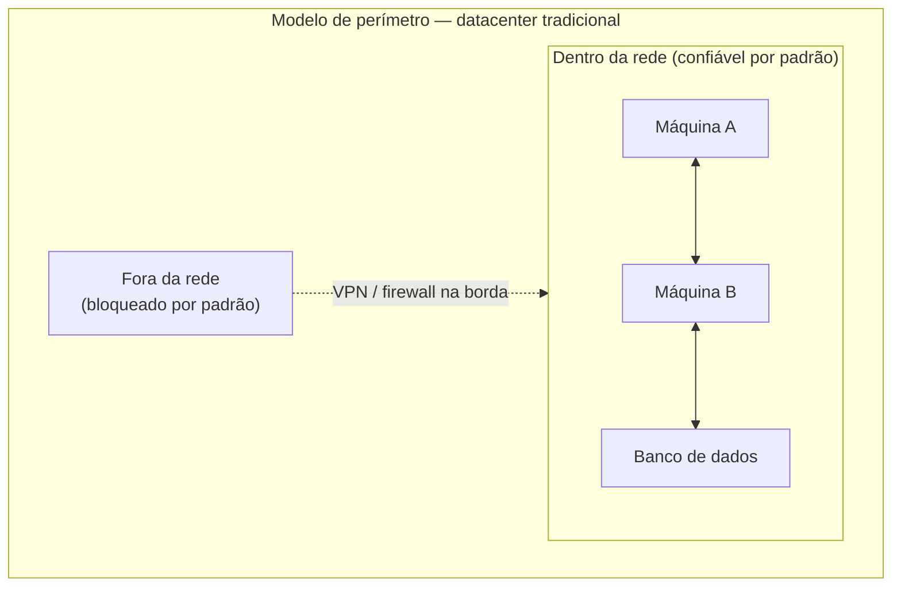
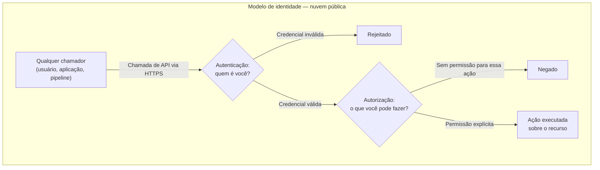
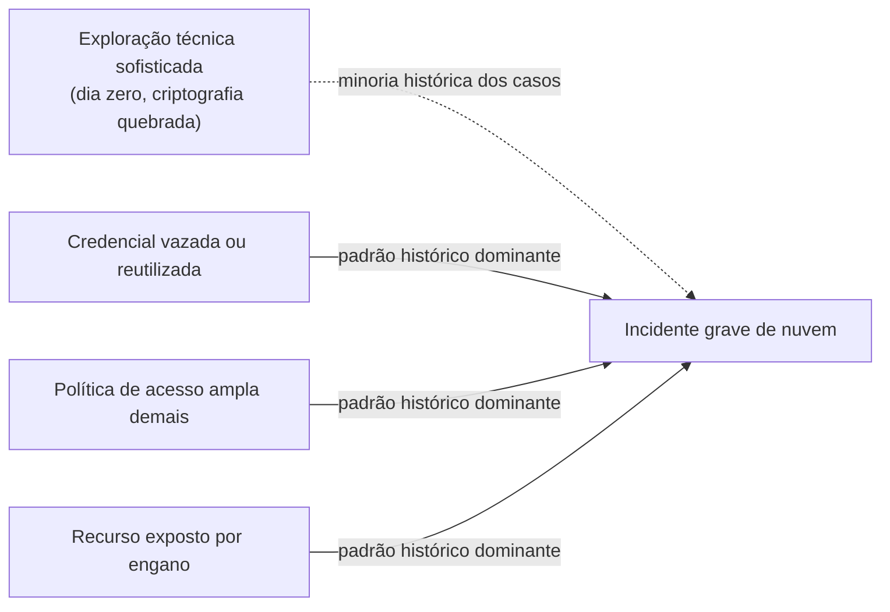

# Por que identidade é o primeiro serviço

> [!abstract] TL;DR
> No datacenter, o perímetro de segurança era físico e depois virou a rede: um firewall na borda, uma VPN para entrar, e "dentro" era implicitamente confiável. Na nuvem esse modelo não existe — não há "dentro". Toda ação, do console ao pipeline de CI, é uma chamada de API que passa por dois portões: **autenticação** ("quem é você?") e **autorização** ("o que você pode fazer?"). Não existe terceira porta de entrada, nenhum atalho por estar "na rede certa". Por isso a identidade — não o firewall, não a sub-rede — é o verdadeiro perímetro da nuvem, e por isso a maioria dos incidentes graves de nuvem nasce de uma permissão mal concedida ou mal entendida, não de uma invasão sofisticada.

## O ataque que não invadiu nada

Imagine o seguinte incidente, quase indistinguível de centenas de casos reais relatados todo ano na indústria: uma aplicação em produção precisa ler arquivos de um bucket de armazenamento. Alguém, sob pressão de prazo, resolve o "erro de permissão" que estava travando o deploy da forma mais rápida possível — anexa uma política que concede acesso amplo àquele recurso, testa, funciona, segue para a próxima tarefa. Meses depois, uma varredura automatizada de um agente malicioso, rodando em algum lugar da internet, encontra o mesmo bucket e lê tudo que está lá dentro. Não houve exploração de vulnerabilidade, não houve senha quebrada por força bruta, não houve nenhum "hacker genial" driblando um firewall. Houve uma política de acesso ampla demais, que ninguém revisou depois que o prazo passou.

Esse padrão — resolver a dor imediata concedendo mais acesso do que o necessário, e nunca voltar para apertar — é, de longe, o enredo mais comum por trás de vazamentos de dados na nuvem. Não é preciso inventar um número para isso: qualquer relatório de resposta a incidentes na área, ano após ano, repete a mesma observação com palavras diferentes — a porta de entrada mais comum não é uma falha técnica do provedor, é uma permissão configurada errado por quem opera a conta.

Isso é desorientador para quem vem de um mundo de infraestrutura própria, porque inverte a intuição de onde o perigo mora. E entender por quê exige voltar um passo atrás — para o modelo de segurança que esse leitor já viveu, mesmo sem ter posto esse nome nele.

## O perímetro que existia antes

No datacenter tradicional, "segurança" tinha, na prática, um significado físico e depois um significado de rede. A sala do servidor tinha fechadura. A rede interna ficava atrás de um firewall que decidia o que entrava e o que saía. Para acessar qualquer coisa lá dentro de fora do prédio, era preciso VPN — um túnel que, uma vez estabelecido, tratava você como se estivesse fisicamente na sala. Uma vez "dentro" — fisicamente, ou via VPN — a superfície de confiança era ampla: máquinas na mesma rede geralmente confiavam umas nas outras por padrão, muitas vezes sem reautenticação a cada chamada.

Esse modelo tem um nome retroativo, cunhado depois que a indústria percebeu seus limites: **segurança de perímetro**, ou, de forma mais crua, o modelo "castelo e fosso" — uma casca dura de defesa na borda, e um interior relativamente confiado. A pergunta central desse modelo é geográfica: **de onde** vem a conexão? Se veio de dentro da rede corporativa ou de um túnel VPN válido, era tratada como legítima por padrão; o resto do trabalho de segurança acontecia depois, em camadas adicionais.

Esse modelo não era ingênuo — era uma resposta racional a uma realidade física real: os servidores estavam numa sala que você controlava, a rede era um cabo que você tinha decidido puxar. A pergunta "quem é você?" muitas vezes nem chegava a ser feita com rigor a cada chamada interna, porque "você conseguiu chegar até aqui" já carregava boa parte da resposta.

## O que muda quando não existe "dentro"

Agora troque o cenário. Um engenheiro, de casa, abre um terminal e roda um comando que cria uma instância de computação numa conta de nuvem pública. Não existe uma "rede da empresa" nesse caminho — existe a internet pública, uma chamada HTTPS, e um endpoint de API do provedor, o mesmo endpoint que qualquer pessoa no planeta também consegue alcançar. A aplicação que essa instância vai rodar, por sua vez, vai precisar ler de um banco de dados gerenciado, escrever num serviço de armazenamento de objetos, e talvez publicar uma mensagem numa fila — cada uma dessas operações é, de novo, uma chamada de API contra um endpoint público.

Não existe "estar dentro da rede do provedor". Não existe "vir do lugar certo" como critério de confiança — o mesmo endpoint que atende sua chamada legítima atende, tecnicamente, a chamada de qualquer outra pessoa na internet. O que decide se essa chamada é aceita ou rejeitada não é a origem geográfica ou topológica dela — é se ela carrega uma prova de identidade válida, e se essa identidade tem, explicitamente, permissão para aquela ação específica sobre aquele recurso específico.

Repare no detalhe que faz toda a diferença: **os dois portões existem para toda chamada, sem exceção, e sem atalho por "vir de dentro"**. Não existe uma sub-rede especial onde as chamadas passam sem autorização. A instância de computação que você acabou de criar, quando ela mesma precisa ler daquele banco de dados, também vai precisar provar quem é e ter permissão explícita — mesmo estando, topologicamente, "dentro" da mesma conta de nuvem. Rede ainda importa na nuvem — isolamento de sub-rede, grupos de segurança e regras de tráfego continuam sendo uma camada de defesa real, e são o assunto do galho 7 desta trilha —, mas rede deixou de ser **a** linha decisiva. Ela virou uma camada adicional de controle, não o portão principal. O portão principal, hoje, é sempre o mesmo par de perguntas: quem é você, e o que você pode fazer.

Essa é a virada central desta nota, e vale reformular de um jeito difícil de esquecer: **no datacenter, o perímetro era um lugar. Na nuvem, o perímetro é uma prova.** Você não defende mais uma fronteira geográfica — você defende cada chamada de API, individualmente, o tempo todo, para sempre.

## Autenticação e autorização não são a mesma pergunta

Vale separar com precisão os dois portões do diagrama anterior, porque tratá-los como sinônimos é o primeiro erro conceitual de quem chega à nuvem vindo de um mundo onde "login" resolvia tudo de uma vez.

**Autenticação** responde "quem é você?". É o processo de provar uma identidade — apresentar uma credencial (uma senha mais um segundo fator, uma chave criptográfica, um token de curta duração) e ter essa credencial validada contra quem o provedor sabe que você é. A documentação oficial da AWS sobre como o IAM funciona descreve o fluxo exatamente nessa ordem: primeiro, "um usuário humano ou uma aplicação usa suas credenciais de acesso para se autenticar" — o IAM confere a credencial contra um **principal** (um usuário, um papel, uma aplicação) de confiança da conta, e autentica esse principal. Só depois disso a segunda pergunta entra em jogo.

**Autorização** responde "o que você, já identificado, pode fazer?". É uma pergunta completamente separada, avaliada depois que a primeira já foi respondida com sucesso. A mesma documentação da AWS é explícita sobre essa segunda etapa: o IAM "concede ou nega acesso em resposta a uma solicitação de autorização" — verifica se a identidade está na lista de partes autorizadas, determina quais políticas controlam o nível de acesso concedido, e avalia qualquer outra política em vigor antes de liberar a ação.

A distinção parece óbvia quando escrita assim, lado a lado — mas a confusão entre as duas é uma fonte constante de erro em produção, e vale nomear o padrão exato: uma credencial válida (autenticação bem-sucedida) **não implica** permissão para qualquer ação (autorização). É perfeitamente possível — e extremamente comum — uma aplicação se autenticar sem problema nenhum contra a nuvem, e ainda assim receber um erro de "acesso negado" na primeira tentativa real de fazer alguma coisa, porque a identidade dela é válida, mas não tem permissão concedida para aquela ação específica sobre aquele recurso específico. "Login funcionou" e "posso fazer isso" são duas perguntas diferentes, respondidas por dois sistemas diferentes, em dois momentos diferentes da mesma chamada.

> [!info] Ponte com a trilha Auth e Identidade
> Esta nota trata autenticação e autorização como conceito — o *porquê* de existirem dois portões separados na nuvem. Os **protocolos** que implementam esses portões no mundo real — OAuth 2.1, OpenID Connect (OIDC), tokens JWT, sessões, SAML — têm casa própria na trilha [[03-Dominios/Engenharia/Auth e Identidade/index|Auth e Identidade]]. Esta trilha de Cloud nunca vai reexplicar esses protocolos; sempre que a mecânica de um provedor de identidade ou de um fluxo de token aparecer novamente (o galho 6 volta a esse ponto, ao tratar de federação), ela vai apontar de volta para lá.

## Por que a maioria dos incidentes graves não é invasão

Aqui está o ponto que costuma surpreender quem tem um modelo mental de "segurança" formado por filmes e manchetes: a imagem popular de um incidente de nuvem é a de um atacante sofisticado quebrando uma criptografia, explorando um bug de dia zero, ou força-bruteando uma senha. Isso acontece — e continua acontecendo, inclusive de forma crescente, à medida que ferramentas automatizadas de varredura de vulnerabilidades se tornam mais rápidas e mais baratas de rodar em escala. Mas o padrão histórico dominante, ano após ano, sempre foi outro.

Por praticamente vinte anos seguidos, o vetor de acesso inicial mais comum documentado em investigações de brechas de segurança — segundo o Relatório de Investigações de Violação de Dados da Verizon, publicado anualmente e considerado uma das referências mais citadas do setor — foi a **credencial comprometida**: uma chave de acesso vazada, uma senha reutilizada, um token que vazou para um lugar que não devia. Só na edição de 2026 desse relatório, pela primeira vez em quase duas décadas de série histórica, a exploração direta de vulnerabilidade técnica ultrapassou o abuso de credenciais como vetor de entrada mais comum — respondendo por 31% dos casos documentados naquela edição. O fato de isso ser digno de manchete — "pela primeira vez em quase 20 anos" — é, ele mesmo, a evidência mais forte do padrão: credencial comprometida foi, durante quase toda a história desse tipo de levantamento, o caminho de entrada número um, ano após ano, superando consistentemente qualquer forma de exploração técnica sofisticada.

Isso é coerente com o mecanismo que esta nota descreveu: se **toda** ação na nuvem passa pelos dois mesmos portões — autenticação e autorização —, então **toda** falha de segurança também passa por um desses dois portões. Um atacante não precisa quebrar criptografia se encontra uma credencial válida esquecida num repositório público de código. Não precisa explorar um bug de sistema operacional se encontra uma política de acesso concedida com escopo maior do que a tarefa exigia. O portão de identidade, exatamente por ser universal e obrigatório, também é o alvo mais lucrativo — e o erro mais comum ali não é o provedor de nuvem ter sido invadido; é alguém, do lado do cliente, ter configurado esse portão de um jeito mais permissivo do que devia, e ninguém ter revisado depois.

Vale nomear com precisão o que "erro de configuração" costuma significar na prática, porque o termo é vago demais para ensinar alguma coisa sozinho: uma política de acesso concedida com escopo mais amplo do que a tarefa exigia (o exemplo do início desta nota); uma credencial de longa duração que nunca expira, esquecida num script antigo ou num repositório de código; um recurso de armazenamento configurado para leitura pública por engano, ou porque "era mais rápido resolver assim"; uma permissão concedida temporariamente para depurar um problema, e nunca revogada depois. Nenhum desses casos exige um adversário brilhante. Todos exigem só que ninguém tenha revisado, depois do fato, uma decisão de acesso tomada sob pressão.

Essa constatação não é motivo para relaxar sobre exploração técnica — ela continua sendo uma ameaça real e crescente, como a própria mudança de 2026 mostra. É motivo para recalibrar onde a atenção de um engenheiro sênior deveria estar por padrão: a pergunta mais produtiva ao revisar a segurança de um sistema na nuvem quase nunca é "nosso provedor pode ser invadido?" — é "quem, exatamente, tem permissão para fazer o quê, aqui, e por quê?".

## Casos práticos

**A automação que ganhou vida própria.** Um pipeline de integração contínua precisa publicar artefatos de build num serviço de armazenamento de objetos. No dia em que foi criado, sob pressão para "só fazer funcionar", alguém concedeu à identidade do pipeline permissão de administrador sobre a conta inteira — resolve o problema imediato, e ninguém mais pensa nisso. Meses depois, uma dependência de terceiros usada no processo de build é comprometida por um ataque de cadeia de suprimentos, e o código malicioso injetado herda, automaticamente, todas as permissões da identidade do pipeline — porque é essa identidade que está executando o build. O dano não veio de uma falha da nuvem; veio de uma permissão concedida três números de zero maior do que a tarefa exigia, meses antes, por conveniência.

**O "só por um minuto" que ficou permanente.** Durante uma investigação de incidente, um engenheiro sênior recebe permissão temporária e ampla para acessar recursos de produção e diagnosticar o problema rapidamente — uma decisão razoável, sob pressão, num momento real de crise. O incidente é resolvido em horas. A permissão temporária, concedida manualmente e sem data de expiração automática, nunca é revogada, porque nenhum processo formal cobra essa revogação depois que a crise passa. Um ano depois, uma auditoria de segurança de rotina encontra dezenas de concessões de acesso "temporárias" ainda ativas, a maioria delas completamente esquecida por quem as concedeu.

**O time que trocou "quem tem acesso" por "o que cada coisa pode fazer".** Um time de plataforma, depois de um susto real com uma permissão excessiva descoberta em auditoria, muda a pergunta que faz por padrão ao provisionar qualquer identidade nova — de "quanto acesso essa pessoa ou aplicação vai precisar, para não me incomodarem de novo" para "qual é o menor conjunto de permissões que essa tarefa específica exige, e por quanto tempo". A mudança não elimina fricção — pedidos de acesso adicional passam a ser mais frequentes, porque o padrão inicial é mais restrito. Mas a superfície de risco de qualquer credencial vazada, isoladamente, cai proporcionalmente: uma credencial comprometida que só pode ler um bucket específico é um incidente contido; a mesma credencial com acesso de administrador é um incidente que se espalha por toda a conta.

## Armadilhas comuns

> [!warning] Tratar "autenticado" como sinônimo de "autorizado"
> Uma aplicação que loga sem erro numa conta de nuvem não tem, automaticamente, permissão para fazer nada além de provar quem é. Ver um erro de "acesso negado" depois de uma autenticação bem-sucedida não é uma falha do sistema de login — é o segundo portão, a autorização, fazendo exatamente o que deveria fazer. Tratar os dois como a mesma coisa leva a diagnósticos errados na hora de depurar ("mas eu consegui logar!") quando o problema real está na política de permissões, não na credencial.

> [!warning] Achar que segurança de rede substitui segurança de identidade
> Colocar um recurso numa sub-rede privada, sem acesso direto da internet, é uma camada de defesa real — mas não é o portão principal na nuvem, e não compensa uma política de acesso mal configurada. Um recurso "isolado de rede" ainda é acessível por qualquer identidade da própria conta que tenha permissão para alcançá-lo — inclusive uma identidade comprometida que já esteja "dentro". Rede e identidade são camadas complementares, uma nunca substitui a outra.

> [!warning] Resolver "acesso negado" concedendo mais do que o necessário
> A reação mais rápida a um erro de permissão — sob prazo, em produção, com alguém esperando — é quase sempre conceder acesso mais amplo do que a tarefa exige, só para o erro parar de aparecer. É exatamente esse atalho, repetido silenciosamente em dezenas de decisões pequenas ao longo de meses, que constrói a superfície de ataque que a maioria dos incidentes graves explora depois. A correção certa é sempre mais estreita — e mais lenta — do que a correção conveniente.

## O que vem a seguir

Esta nota estabeleceu o *porquê*: identidade é o perímetro da nuvem, e autenticação e autorização são dois portões distintos que toda chamada de API atravessa. Mas ainda falta o *como* — quem, concretamente, carrega essa identidade, e com que tipo de credencial. A resposta mais simples e mais antiga — um usuário humano com uma chave de acesso fixa, que nunca expira — é também a mais perigosa, pelo motivo que o incidente do pipeline desta nota já deixou entrever. A próxima nota, **"Usuários, grupos e o problema da credencial de longa duração"**, entra exatamente nesse ponto: por que a chave estática é a credencial mais arriscada que existe na nuvem, e o que times fazem, na prática, antes de aprender a alternativa correta.

## Fontes

- [AWS — How IAM works (documentação oficial)](https://docs.aws.amazon.com/IAM/latest/UserGuide/intro-structure.html) — descrição oficial do fluxo de autenticação seguido de autorização, e da distinção entre as duas etapas; acessado em 2026-07-20.
- [AWS — Shared Responsibility Model (documentação oficial)](https://aws.amazon.com/compliance/shared-responsibility-model/) — divisão de responsabilidade entre provedor e cliente, base para entender por que erros de configuração são responsabilidade do cliente, não do provedor; acessado em 2026-07-20.
- [DigitalOcean — Teams (documentação oficial)](https://docs.digitalocean.com/platform/teams/) — modelo de times, papéis e permissões da DigitalOcean, usado como contraponto de lente dupla; acessado em 2026-07-20.
- [Verizon — 2026 Data Breach Investigations Report, nota oficial de imprensa](https://www.verizon.com/about/news/breach-industry-wide-dbir-finds) — dado verificado de que exploração de vulnerabilidade (31% dos casos) ultrapassou credenciais comprometidas como vetor de acesso inicial pela primeira vez em quase 20 anos de série histórica do relatório; acessado em 2026-07-20.
- [[03-Dominios/Engenharia/Auth e Identidade/index|Auth e Identidade]] — trilha que aprofunda os protocolos (OAuth 2.1, OIDC, JWT, sessões, SAML) que implementam autenticação e autorização na prática.
