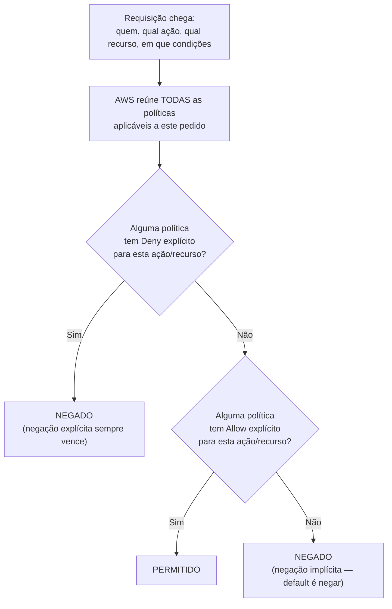
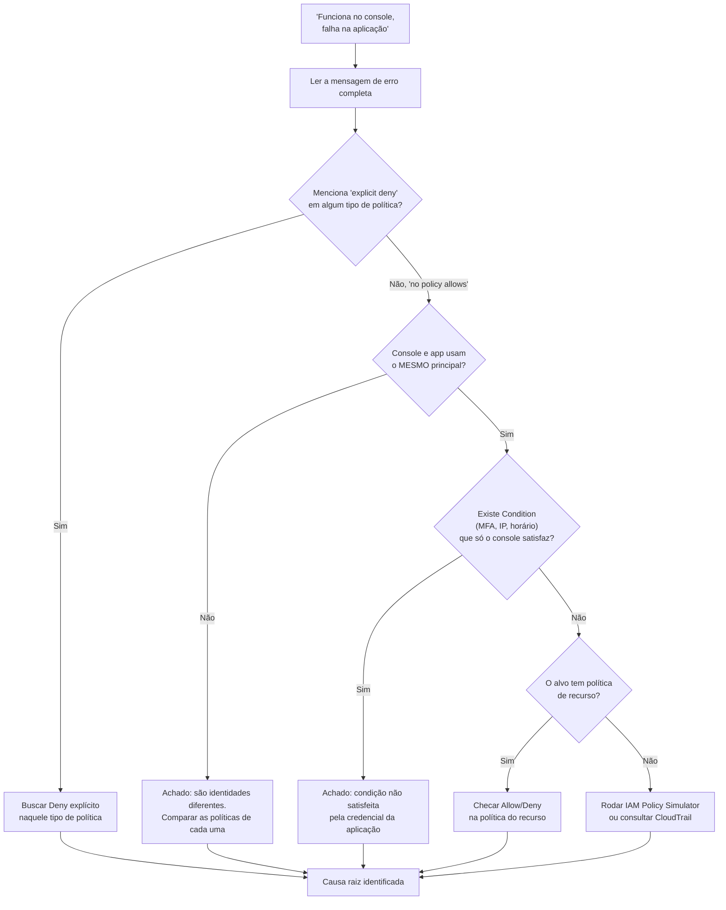

# Políticas — como uma permissão é avaliada

> [!abstract] TL;DR
> Uma política de nuvem não é uma lista de permissões que se soma — é um algoritmo de decisão que roda a cada chamada de API. O ponto de partida é sempre a negação: se nenhuma política disser "sim" explicitamente, a resposta é não. Uma política de identidade concede o que a pessoa ou o serviço pode fazer; uma política de recurso concede quem pode tocar naquele recurso específico — e dentro da mesma conta, as duas se somam (basta uma dizer "sim"). Mas existe uma regra que nenhuma das duas pode contornar: se **qualquer** política aplicável disser explicitamente "não", a resposta final é não, não importa quantas outras digam "sim". Entender essa hierarquia — default nega, permissão precisa ser dita, negação explícita é definitiva — é o que separa quem "tenta de novo com mais permissão até funcionar" de quem sabe exatamente qual política ler primeiro quando o `AccessDenied` aparece.

## O administrador que deu acesso total e continuou vendo "access denied"

Uma pessoa entra num time de plataforma e recebe a tarefa de destravar um pipeline que está falhando com `AccessDenied` ao tentar ler um segredo do AWS Secrets Manager. A resposta óbvia — e errada — é abrir o IAM, encontrar a role usada pelo pipeline, e anexar a política gerenciada `SecretsManagerReadWrite`, que concede leitura e escrita a praticamente todos os segredos da conta. Deploy feito, pipeline rodado de novo. O erro continua, palavra por palavra idêntico: `AccessDenied`.

A reação seguinte, ainda mais desesperada, é anexar `AdministratorAccess` — a política que concede `"Action": "*"` sobre `"Resource": "*"`, acesso total a tudo na conta. O erro **continua** aparecendo. Nesse ponto a maioria das pessoas que vem de um mundo onde permissão é aditiva — onde "dar mais acesso" sempre resolve o problema de "acesso insuficiente" — trava. Se a role tem permissão total sobre tudo, como ainda pode faltar permissão?

A resposta é que a pessoa está resolvendo o problema errado. Ela está tratando "conceder mais" como a alavanca universal, quando o segredo específico que o pipeline tenta ler tem uma **política de recurso** anexada a ele — não à role, ao segredo em si — com uma declaração explícita de negação para qualquer principal fora de uma lista de roles autorizadas. Nenhuma quantidade de `Allow` na política de identidade da role muda esse resultado, porque existe uma regra na avaliação de permissões da AWS que nenhuma política de `Allow`, por mais ampla que seja, consegue vencer: **uma negação explícita sempre ganha**. É essa regra — e a lógica completa por trás dela — que esta nota desenrola.

## A anatomia de uma política

Antes de entender como uma política é avaliada, vale ver do que ela é feita. Uma política JSON da AWS — o formato que a nota 02 desta trilha já introduziu de relance ao falar de chaves de acesso — é um documento com uma estrutura fixa. O elemento raiz é `Version` (praticamente sempre `"2012-10-17"`, a versão atual da linguagem de política) e uma lista de `Statement`, cada um dos quais declara uma regra isolada:

```json
{
  "Version": "2012-10-17",
  "Statement": [
    {
      "Sid": "PermitirLeituraDeUmBucketEspecifico",
      "Effect": "Allow",
      "Action": [
        "s3:GetObject",
        "s3:ListBucket"
      ],
      "Resource": [
        "arn:aws:s3:::relatorios-financeiros",
        "arn:aws:s3:::relatorios-financeiros/*"
      ],
      "Condition": {
        "IpAddress": {
          "aws:SourceIp": "203.0.113.0/24"
        }
      }
    }
  ]
}
```

Cada `Statement` tem um punhado de elementos, e vale nomear o papel exato de cada um:

- **`Sid`** (opcional) — um identificador legível para a declaração, útil para debugar qual regra específica bateu.
- **`Effect`** — só existem dois valores válidos: `"Allow"` ou `"Deny"`. Não existe meio-termo, e o valor é sensível a maiúsculas.
- **`Action`** — a lista de operações de API cobertas, no formato `serviço:Operação` (`s3:GetObject`, `iam:CreateUser`, `secretsmanager:GetSecretValue`). Aceita wildcard (`s3:*` cobre toda ação do S3).
- **`Resource`** — o ARN (Amazon Resource Name) do recurso afetado, ou `*` para "qualquer recurso" — o que `AdministratorAccess` faz, combinado com `Action: *`.
- **`Condition`** (opcional) — restringe quando a declaração se aplica: um intervalo de IP de origem, a exigência de MFA ativo, uma tag específica no recurso, uma janela de horário. Uma política sem `Condition` vale sempre que `Action` e `Resource` batem; com `Condition`, ela só vale quando a condição também é satisfeita.
- **`Principal`** — aparece só em políticas de recurso e políticas de confiança (trust policies), nunca numa política de identidade. Declara **quem** a regra afeta: um usuário, uma role, uma conta inteira, ou um serviço da AWS. Faz sentido perguntar "quem pode acessar este bucket" quando a política está anexada ao bucket; não faz sentido perguntar isso numa política anexada a um usuário — ali o principal já está implícito: é o próprio usuário.

Em forma de tabela, para consulta rápida:

| Elemento | Obrigatório? | O que faz | Exemplo |
|---|---|---|---|
| `Version` | Sim | Versão da linguagem de política — praticamente sempre a mais recente | `"2012-10-17"` |
| `Statement` | Sim | Lista de declarações; cada uma é uma regra isolada | `[{ "Effect": "Allow", ... }]` |
| `Sid` | Não | Identificador legível da declaração, útil para debugar | `"PermitirLeituraDeUmBucket"` |
| `Effect` | Sim | `Allow` ou `Deny` — só existem esses dois valores, sensível a maiúsculas | `"Allow"` |
| `Action` | Sim* | Operações de API cobertas, formato `serviço:Operação` | `"s3:GetObject"` |
| `Resource` | Sim* | ARN do recurso afetado, ou `*` para qualquer recurso | `"arn:aws:s3:::relatorios-financeiros/*"` |
| `Condition` | Não | Restringe quando a declaração vale (IP, MFA, tag, horário) | `{"IpAddress": {"aws:SourceIp": "203.0.113.0/24"}}` |
| `Principal` | Só em política de recurso | Quem a regra afeta — nunca aparece em política de identidade | `{"AWS": "arn:aws:iam::123456789012:role/MyRole"}` |

\* `Action` e `Resource` são mutuamente exclusivos com seus pares invertidos (`NotAction`, `NotResource`) — uma declaração usa um ou outro, nunca os dois.

Essa distinção do `Principal` é o primeiro sinal de uma diferença maior que a próxima seção desenrola: política de identidade e política de recurso não são a mesma coisa com sintaxe levemente diferente — respondem perguntas diferentes.

## A lógica de avaliação: default nega, allow é necessário, deny é definitivo

Quando um principal — um usuário, uma role, uma aplicação usando uma credencial temporária — faz uma chamada de API, a AWS não procura "alguma política que permita isso e para por aí". Ela reúne **todas** as políticas aplicáveis àquele pedido específico (todas as políticas de identidade anexadas ao principal, a política de recurso do alvo, se existir, limites de permissão, políticas de sessão, guarda-corpos de organização) e aplica um algoritmo de decisão fixo sobre o conjunto inteiro, documentado pela própria AWS como a "policy evaluation logic".

O algoritmo, resumido em três regras, na ordem em que pesam:

1. **O padrão é negar.** Toda requisição começa como implicitamente negada. Não existe "acesso liberado por omissão" em nuvem — o oposto do modelo mental de rede tradicional, onde "dentro do datacenter" já era suficiente. Aqui, silêncio de política é negação.
2. **Uma permissão precisa ser concedida de forma explícita.** Para a negação implícita virar um "sim", pelo menos uma política aplicável precisa ter uma declaração com `"Effect": "Allow"` cobrindo exatamente aquela ação, sobre exatamente aquele recurso (e satisfazendo qualquer condição anexada).
3. **Uma negação explícita sempre vence, não importa quantos `Allow` existam.** Se qualquer política aplicável — de identidade, de recurso, limite de permissão, guarda-corpo de organização — tiver uma declaração `"Effect": "Deny"` cobrindo a mesma ação e recurso, o resultado final é negado, mesmo que dez outras políticas digam `Allow`.

A documentação oficial da AWS resume essa hierarquia de forma direta, quase nesses termos: por padrão, o acesso a um recurso é negado ("by default, access to resources is denied"); uma política precisa declarar `Allow` explicitamente para conceder acesso; e um `Deny` explícito, em qualquer política aplicável — de identidade ou de recurso —, sobrepõe qualquer `Allow` ("an explicit deny in either of these policies overrides the allow").

Um exemplo mínimo fixa a regra 2: esta é a menor política de identidade capaz de conceder alguma coisa — um único `Allow`, sem `Condition`, sem `Sid`:

```json
{
  "Version": "2012-10-17",
  "Statement": [
    {
      "Effect": "Allow",
      "Action": "s3:GetObject",
      "Resource": "arn:aws:s3:::relatorios-financeiros/*"
    }
  ]
}
```

E este exemplo fixa a regra 3 — a declaração 1 permite leitura de todo o bucket, mas a declaração 2, na mesma política, nega explicitamente leitura dentro de um prefixo específico:

```json
{
  "Version": "2012-10-17",
  "Statement": [
    {
      "Sid": "PermitirLeituraGeral",
      "Effect": "Allow",
      "Action": "s3:GetObject",
      "Resource": "arn:aws:s3:::relatorios-financeiros/*"
    },
    {
      "Sid": "NegarPastaDeFolhaDePagamento",
      "Effect": "Deny",
      "Action": "s3:GetObject",
      "Resource": "arn:aws:s3:::relatorios-financeiros/folha-pagamento/*"
    }
  ]
}
```

Mesmo que a declaração 1 cubra qualquer objeto do bucket, a declaração 2 nega explicitamente qualquer leitura dentro de `folha-pagamento/` — e, pela regra 3, essa negação vence para todo objeto naquele prefixo, mesmo estando coberto pelo `Allow` mais amplo. Não importa a ordem em que as declarações aparecem no JSON: o algoritmo sempre varre por `Deny` primeiro, em toda a política, antes de considerar qualquer `Allow`.



Repare que o fluxo checa **deny antes de allow**. Isso não é um detalhe de implementação — é a garantia de que uma negação nunca pode ser "sobrescrita por acidente" por uma política de allow mais ampla anexada depois. Um administrador de segurança que precisa bloquear uma ação perigosa para toda a organização — desabilitar uma região, impedir a exclusão de um bucket de auditoria, proibir uma família de instância cara — pode fazer isso com uma única declaração de `Deny`, com a certeza matemática de que nenhuma política de `Allow`, existente ou futura, conseguirá reabrir aquele buraco sem que alguém remova o `Deny` explicitamente. É esse mecanismo que torna guarda-corpos organizacionais (Service Control Policies) confiáveis como controle de segurança: eles não competem com as permissões dos times, eles as sobrepõem.

> [!tip] Assista: AWS re:Inforce 2022 — AWS Identity and Access Management (IAM) deep dive (IAM301)
> **Canal:** AWS Events | **Duração:** ~58min | **Idioma:** EN
>
> A talk oficial da AWS caminha pela mesma árvore de decisão desta seção, statement por statement, até chegar exatamente na regra que fecha este parágrafo: um `Deny` numa única declaração aplicável já basta pra decidir o resultado, não importa quantos `Allow` concorram com ele. Trecho de destaque [32:12]: *"you know the statement's gonna be denied, because anytime we hit a deny, it's over"*
>
> 🎬 [Assistir no YouTube](https://www.youtube.com/watch?v=YMj33ToS8cI)

> [!info] Fronteira
> Guarda-corpos de organização (Service Control Policies, Resource Control Policies) e limites de permissão (permissions boundaries) entram na mesma lógica de "negação explícita vence" — mas são ferramentas de governança que combinam múltiplas contas ou blindam uma identidade contra si mesma, e ficam fora do escopo desta nota. O essencial aqui é a lógica que se aplica mesmo no caso mais simples: uma política de identidade e uma política de recurso, dentro de uma única conta.

## Política de identidade vs. política de recurso: duas perguntas diferentes

A distinção entre os dois tipos de política já apareceu de relance na anatomia acima, mas merece ser dita sem rodeio, porque é a fonte mais comum de confusão prática:

**Política de identidade** é anexada a um usuário, grupo ou role (gerenciada, ou embutida diretamente na identidade). Ela responde à pergunta "**o que esta identidade pode fazer**?" — não importa qual recurso ela está tentando tocar, contanto que a ação e o recurso estejam cobertos pela política.

**Política de recurso** é anexada ao próprio recurso — um bucket S3, uma fila SQS, um tópico SNS, uma chave do KMS, um segredo do Secrets Manager, entre outros serviços que suportam esse modelo. Ela responde à pergunta oposta: "**quem pode fazer o quê com este recurso específico**?" — e é o único tipo de política que carrega um elemento `Principal`, porque precisa declarar explicitamente quem ela está autorizando (ou negando).

Dentro de uma única conta AWS, as duas se combinam por **união** (lógica OU), não por interseção: se a política de identidade permite a ação, **ou** a política de recurso permite, o resultado é permitido — não é preciso que as duas concordem. É exatamente esse mecanismo que faz um bucket S3 acessível por um usuário que nunca recebeu permissão de S3 na sua própria política de identidade, contanto que a política do bucket o autorize nominalmente por ARN. E é o mesmo mecanismo, do lado oposto, que explica o cenário de abertura desta nota: a política de identidade da role do pipeline concede tudo (`AdministratorAccess`), mas a política de recurso do segredo nega explicitamente para qualquer principal fora de uma lista — e, pela regra "negação explícita vence sempre", essa negação prevalece sobre o `Allow` mais amplo que existe na AWS.

Um par concreto torna essa união visível. A política de identidade anexada a um usuário concede acesso só a EC2 — nada de S3:

```json
{
  "Version": "2012-10-17",
  "Statement": [
    {
      "Effect": "Allow",
      "Action": "ec2:DescribeInstances",
      "Resource": "*"
    }
  ]
}
```

Sozinha, essa política não deixaria o usuário ler nada num bucket S3. Mas a política de recurso anexada ao bucket concede, nominalmente, leitura a esse mesmo usuário:

```json
{
  "Version": "2012-10-17",
  "Statement": [
    {
      "Sid": "PermitirLeituraParaUmUsuarioEspecifico",
      "Effect": "Allow",
      "Principal": {
        "AWS": "arn:aws:iam::123456789012:user/mariana"
      },
      "Action": "s3:GetObject",
      "Resource": "arn:aws:s3:::relatorios-financeiros/*"
    }
  ]
}
```

Pela regra da união, o usuário consegue ler o bucket — não porque a política de identidade dele mudou, mas porque a política de recurso, sozinha, já é suficiente dentro da mesma conta.

Onde a combinação muda de figura é entre contas diferentes. Quando o principal que faz a chamada está numa conta e o recurso vive em outra, a lógica deixa de ser união e vira **interseção** (lógica E): o principal precisa ter uma política de identidade, na conta dele, que permita a ação — **e** o recurso, na conta de destino, precisa ter uma política de recurso que autorize aquele principal externo nominalmente. Falta qualquer um dos dois lados e o pedido falha, mesmo que o outro lado seja generoso. É o motivo pelo qual compartilhar um bucket S3 entre duas contas AWS sempre exige editar política nos dois lados — nunca só um.

| | Dentro da mesma conta | Entre contas diferentes |
|---|---|---|
| Regra de combinação | União (OU) — um `Allow` de qualquer lado basta | Interseção (E) — os dois lados precisam permitir |
| `Deny` explícito | Vence em qualquer um dos lados | Vence em qualquer um dos lados |
| Quem precisa configurar | Identidade **ou** recurso | Identidade **e** recurso |

> [!info] Fronteira
> Trust policies — o tipo específico de política de recurso que vive numa role e decide quem pode assumi-la — funcionam sob essa mesma lógica de política de recurso, mas merecem tratamento próprio, porque é o mecanismo central da **próxima nota** desta trilha.

## Casos práticos

**O bucket que "some" para todo mundo, menos para quem devia enxergar.** Um time de dados cria um bucket S3 com dados sensíveis e, corretamente, nega por padrão qualquer acesso público. Depois, para permitir que um serviço analítico de outra conta leia os dados, adiciona uma política de recurso ao bucket concedendo `s3:GetObject` ao ARN da role daquela conta externa. O pedido continua falhando até alguém lembrar da metade que falta: a role na conta externa também precisa de uma política de identidade permitindo `s3:GetObject` sobre aquele bucket — porque acesso entre contas exige que os dois lados concordem, não só um. As duas metades, lado a lado — a política de identidade na conta `444455556666` (onde vive a role que faz a chamada):

```json
{
  "Version": "2012-10-17",
  "Statement": [
    {
      "Effect": "Allow",
      "Action": "s3:GetObject",
      "Resource": "arn:aws:s3:::relatorios-financeiros/*"
    }
  ]
}
```

E a política de recurso na conta `123456789012` (dona do bucket), sem a qual a metade acima não basta:

```json
{
  "Version": "2012-10-17",
  "Statement": [
    {
      "Sid": "PermitirLeituraParaContaAnalitica",
      "Effect": "Allow",
      "Principal": {
        "AWS": "arn:aws:iam::444455556666:role/servico-analitico"
      },
      "Action": "s3:GetObject",
      "Resource": "arn:aws:s3:::relatorios-financeiros/*"
    }
  ]
}
```

Faltando qualquer uma das duas, a regra de interseção entre contas barra o pedido — mesmo que a outra metade seja generosa.

**A tag de ambiente que virou guarda-corpo.** Uma organização quer impedir, de forma estrutural, que qualquer engenheiro apague recursos marcados com a tag `Environment=production`, não importa quão ampla seja a política de identidade individual de cada um. A solução não é revisar política por política de cada usuário — é uma única declaração de `Deny`, anexada de forma central (uma política de identidade compartilhada por todo o time, ou um guarda-corpo de organização), condicionada à tag `Environment=production` no recurso-alvo. Porque negação explícita sempre vence, essa única regra blinda a produção contra qualquer permissão futura, mesmo permissões amplas concedidas sem pensar duas vezes.

**O segredo que só o pipeline de produção pode ler.** Voltando ao cenário de abertura: a forma correta de restringir um segredo do Secrets Manager a um único pipeline não é depender só da política de identidade da role — é colocar, na própria política de recurso do segredo, uma declaração de `Allow` explícita para o ARN daquela role específica, e (opcionalmente) uma declaração de `Deny` para qualquer outro principal. Isso transforma "confiamos que ninguém mais vai anexar permissão de leitura por acidente" em uma garantia estrutural: mesmo que alguém, no futuro, conceda `SecretsManagerReadWrite` para uma role errada, a política do próprio segredo barra o acesso. Na prática, essa política de recurso é curta:

```json
{
  "Version": "2012-10-17",
  "Statement": [
    {
      "Sid": "NegarQualquerPrincipalForaDaListaAutorizada",
      "Effect": "Deny",
      "Principal": "*",
      "Action": "secretsmanager:GetSecretValue",
      "Resource": "arn:aws:secretsmanager:us-east-1:123456789012:secret:prod/db-password-*",
      "Condition": {
        "StringNotLike": {
          "aws:PrincipalArn": [
            "arn:aws:iam::123456789012:role/pipeline-producao"
          ]
        }
      }
    }
  ]
}
```

`Principal: "*"` combinado com `Condition`/`StringNotLike` é o padrão-chave aqui: a declaração se aplica a **qualquer principal**, exceto os listados na condição — o efeito líquido é "negue todo mundo, menos esta role". É exatamente esse `Deny` que nenhum `AdministratorAccess` na política de identidade do pipeline consegue vencer.

## Lente dupla: o modelo mais simples da DigitalOcean

Vale nomear, sem rodeio, que essa camada inteira de complexidade — política de identidade separada de política de recurso, união dentro da conta, interseção entre contas, negação explícita como regra de desempate — é uma característica específica do modelo da AWS, não um padrão universal de nuvem.

A DigitalOcean organiza permissão por **papel de membro de time** (roles predefinidas, com a opção de criar papéis personalizados combinando permissões específicas) e por **escopo de token de API** — desde os escopos amplos `api:read`/`api:write`, que valem para tudo que o papel do usuário já permite, até escopos personalizados que restringem um token a uma operação específica sobre um tipo de recurso (por exemplo, só criar Droplets, ou só atualizar firewalls de nuvem). É um modelo genuinamente mais simples: não existe política de recurso anexada individualmente a um Droplet ou a um Space dizendo "estes principais externos podem acessá-lo", e não existe conceito de negação explícita competindo com permissão concedida — o modelo é estritamente aditivo (**allow-only**), limitado pelo teto que o papel do time já define. Isso não é uma lacuna documental — é uma escolha de design real, coerente com uma plataforma que prioriza simplicidade operacional sobre o controle granular multi-conta que a AWS precisa suportar para clientes de porte corporativo com centenas de contas.

| Conceito | AWS | DigitalOcean |
|---|---|---|
| Unidade de permissão | Statement dentro de uma política JSON | Escopo de token de API / permissão do papel de time |
| Modelo de combinação | Default deny + `Allow` explícito, com `Deny` explícito sempre vencendo | Estritamente aditivo (allow-only) — sem conceito de negação |
| Conceder acesso a um recurso específico para outro principal | Política de recurso (bucket policy, política do segredo, etc.) | Não existe — nenhuma política é anexada a um Droplet ou Space individualmente |
| Restringir sem negar | `Effect: Deny` explícito, `Condition` | Escolher um escopo de token mais estreito (ex.: só `Create` para Droplets), não há como "proibir" dentro de um escopo mais amplo já concedido |
| Papel/identidade | Política de identidade (usuário, grupo, role) | Papel de time — predefinido ou personalizado, combinando permissões específicas |
| Depuração de "access denied" | `AccessDenied` com contexto (`explicit deny` / `no policy allows`), IAM Policy Simulator | Revisão manual do papel do membro e do escopo do token — sem ferramenta de simulação equivalente documentada |

> [!info] Caducidade
> Modelo de papéis e escopos de token da DigitalOcean, e a linguagem exata de avaliação de política da AWS, verificados em 2026-07-23. Ambos os provedores evoluem esse modelo com regularidade — confira a documentação oficial antes de desenhar um controle de acesso crítico.

## Exemplo trabalhado: depurando um "access denied"

O cenário mais comum — e mais frustrante — de depuração de permissão em nuvem é este: uma pessoa testa uma ação no Console da AWS, funciona perfeitamente. A mesma ação, feita pela aplicação (via SDK, CLI, ou pipeline de CI/CD) usando credenciais programáticas, falha com `AccessDenied`. "Mas eu acabei de fazer isso no console" é a frase mais repetida em qualquer canal de suporte interno de plataforma.

A causa quase nunca é aleatória — é sempre uma entre um punhado de diferenças estruturais entre a sessão do console e a sessão da aplicação, e o processo de depuração consiste em eliminar cada uma sistematicamente:

**1. Ler a mensagem de erro com atenção — ela já aponta a política certa.** O formato padrão da AWS é `User: <ARN> is not authorized to perform: <ação>`, com `on resource: <recurso>` quando aplicável, seguido de um contexto adicional. Se o contexto disser `with an explicit deny in a <tipo> policy`, a busca já está resolvida: é preciso procurar uma declaração `Deny` naquele tipo específico de política. Se disser `because no <tipo> policy allows the <ação> action`, é negação implícita — falta um `Allow`, não sobra um `Deny`.

| Fragmento na mensagem | Tipo de negação | Onde procurar |
|---|---|---|
| `with an explicit deny in an identity-based policy` | Explícita | Política anexada ao usuário/role |
| `with an explicit deny in a resource-based policy` | Explícita | Política do recurso (bucket, segredo, fila) |
| `with an explicit deny in a service control policy` | Explícita | Guarda-corpo de organização (SCP) |
| `with an explicit deny in a permissions boundary` | Explícita | Limite de permissão da identidade |
| `because no identity-based policy allows the <ação> action` | Implícita | Falta `Allow` na política de identidade |
| `because no resource-based policy allows the <ação> action` | Implícita | Falta `Allow` na política do recurso |

Exemplo verbatim de negação explícita (política de recurso), do próprio formato documentado pela AWS:

```
User: arn:aws:iam::123456789012:role/pipeline-producao is not authorized to perform: secretsmanager:GetSecretValue
on resource: arn:aws:secretsmanager:us-east-1:123456789012:secret:prod/db-password-AbCdEf
with an explicit deny in a resource-based policy
```

**2. Confirmar que console e aplicação usam o mesmo principal.** Este é o suspeito número um. É comum que uma pessoa, logada no console com seu usuário IAM pessoal (que tem permissões amplas, herdadas de um grupo de administradores), teste uma ação com sucesso — e a aplicação, rodando com uma role de execução dedicada e deliberadamente restrita, falhe na mesma ação porque nunca teve aquela permissão específica concedida. Não é a mesma identidade fazendo o pedido nos dois casos, então não há motivo para esperar o mesmo resultado.

**3. Verificar se existe uma `Condition` que o console satisfaz e a aplicação não.** Políticas frequentemente incluem condições como exigência de MFA ativo (`aws:MultiFactorAuthPresent`), uma faixa de IP de origem, ou uma janela de horário. Uma sessão de console autenticada com MFA satisfaz uma condição que uma credencial programática de aplicação, sem MFA, nunca vai satisfazer — e o resultado é `AccessDenied` só do lado da aplicação, mesmo com a política de identidade idêntica nos dois casos.

**4. Checar se o alvo tem política de recurso, e se ela é o problema.** Se a ação envolve um serviço que suporta política de recurso (S3, SQS, SNS, KMS, Secrets Manager, entre outros), a política de recurso pode estar autorizando o usuário do console nominalmente (por ARN específico) sem autorizar a role da aplicação — ou, na direção oposta do cenário de abertura desta nota, negando explicitamente qualquer principal fora de uma lista curta que não inclui a role da aplicação.

**5. Usar o IAM Policy Simulator ou o histórico de eventos do CloudTrail para confirmar, sem adivinhar.** Em vez de ler políticas manualmente tentando simular a lógica de avaliação na cabeça, o Policy Simulator da AWS testa uma ação específica contra um principal específico e devolve o resultado — permitido, negado implicitamente, ou negado explicitamente, com a política responsável nomeada. O CloudTrail, por sua vez, registra o evento real da chamada negada, incluindo o principal exato que fez o pedido, útil sobretudo quando não está claro qual credencial a aplicação de fato usou.

Pela CLI, o mesmo simulador vira o comando `aws iam simulate-principal-policy`. Vale um cuidado: a versão do console não simula política de recurso automaticamente para IAM roles — só para usuários e grupos. A saída da CLI contorna isso quando o texto da política de recurso é passado explicitamente via `--resource-policy`:

```bash
aws iam simulate-principal-policy \
  --policy-source-arn arn:aws:iam::123456789012:role/pipeline-producao \
  --action-names secretsmanager:GetSecretValue \
  --resource-arns arn:aws:secretsmanager:us-east-1:123456789012:secret:prod/db-password-AbCdEf \
  --resource-policy file://secret-resource-policy.json
```

O campo relevante da saída (JSON completo omitido) mostra a decisão e qual declaração respondeu por ela:

```
"EvalActionName": "secretsmanager:GetSecretValue",
"EvalDecision": "explicitDeny",
"MatchedStatements": [
  { "SourceType": "resource", "SourcePolicyId": "NegarQualquerPrincipalForaDaListaAutorizada" }
]
```

`explicitDeny` na saída confirma exatamente o que a mensagem de erro já indicava — a causa está numa política de recurso, não na política de identidade da role. Para ler a política do próprio segredo sem depender do simulador, basta pedir o documento diretamente:

```bash
aws secretsmanager get-resource-policy --secret-id prod/db-password
```

E quando a suspeita recai sobre uma política gerenciada anexada à identidade — por exemplo, confirmar se `AdministratorAccess` realmente concede `Action: "*"` sobre `Resource: "*"` — os dois comandos que revelam o JSON completo são:

```bash
aws iam get-policy --policy-arn arn:aws:iam::aws:policy/AdministratorAccess
# devolve metadados (DefaultVersionId, AttachmentCount) — não o documento em si

aws iam get-policy-version \
  --policy-arn arn:aws:iam::aws:policy/AdministratorAccess \
  --version-id v1
# devolve o documento da política, URL-encoded — decodificar antes de ler
```



No cenário de abertura desta nota, o caminho correto por esse fluxo teria sido: ler o erro (que provavelmente mencionava `with an explicit deny in a resource-based policy`), ir direto à política de recurso do segredo, e encontrar a declaração de `Deny` restringindo o acesso a uma lista de roles que não incluía a role do pipeline. Nenhuma quantidade de `AdministratorAccess` na política de identidade jamais teria resolvido isso — porque o problema nunca esteve na política de identidade.

## Armadilhas comuns

> [!warning] Tratar "conceder mais permissão" como solução universal
> Quando um `AccessDenied` aparece, o reflexo de anexar uma política mais ampla à identidade só resolve o problema quando a causa é negação implícita (falta de `Allow`). Se a causa real é uma negação explícita — numa política de recurso, num guarda-corpo de organização, num limite de permissão — nenhuma política de `Allow` adicional, por mais ampla que seja, muda o resultado. É preciso identificar o tipo de negação antes de tentar corrigi-la.

> [!warning] Esquecer que política de recurso existe, e só olhar a política de identidade
> É comum depurar acesso olhando exclusivamente a política anexada ao usuário ou à role, porque é ali que a maioria das pessoas aprende a procurar primeiro. Mas para serviços que suportam política de recurso, metade da equação pode estar em outro lugar inteiramente — anexada ao bucket, ao segredo, à fila — e ignorá-la significa nunca encontrar a causa real.

> [!warning] Assumir que console e aplicação sempre compartilham as mesmas permissões
> "Funciona no console" prova que **alguma** identidade tem a permissão — não que a identidade usada pela aplicação a tem. Sessão de console (normalmente autenticada como um usuário humano, muitas vezes com MFA satisfeita) e credencial de aplicação (normalmente uma role de execução, sem MFA, com escopo deliberadamente mais estreito) raramente são o mesmo principal, e comparar suas políticas lado a lado — não assumir que são intercambiáveis — é o primeiro passo real de qualquer depuração desse tipo.

## O que vem a seguir

Esta nota explicou como uma permissão é avaliada — mas não respondeu a uma pergunta prática que fica evidente assim que o cenário de abertura é revisitado: por que a role do pipeline tinha uma credencial de longa duração o suficiente para causar confusão, em vez de uma credencial que expira sozinha? A nota 02 já havia estabelecido por que uma chave de acesso estática é a pior forma de credencial. A resposta ao "então qual é a forma certa" é o padrão que toda arquitetura de nuvem madura adota: em vez de carregar uma chave fixa, uma identidade **assume um papel** e recebe, em troca, uma credencial temporária, válida só por um intervalo curto. É esse mecanismo — e como ele resolve, de raiz, o problema que a nota 02 deixou em aberto — que a próxima nota, **"Roles e credenciais temporárias"**, desenrola.

## Fontes

- [AWS IAM — Policy evaluation logic (documentação oficial)](https://docs.aws.amazon.com/IAM/latest/UserGuide/reference_policies_evaluation-logic.html) — algoritmo de avaliação, evaluating identity-based policies with resource-based policies (união dentro da conta), com permissions boundaries e SCPs/RCPs (interseção); acessado em 2026-07-20.
- [AWS IAM — Identity-based policies and resource-based policies (documentação oficial)](https://docs.aws.amazon.com/IAM/latest/UserGuide/access_policies_identity-vs-resource.html) — definição formal dos dois tipos de política, exemplo de avaliação combinada, regra de interseção obrigatória entre contas; acessado em 2026-07-20.
- [AWS IAM — JSON policy elements: Effect (documentação oficial)](https://docs.aws.amazon.com/IAM/latest/UserGuide/reference_policies_elements_effect.html) — definição do elemento `Effect`, confirmação textual de que o acesso é negado por padrão; acessado em 2026-07-20.
- [AWS IAM — JSON policy element reference (documentação oficial)](https://docs.aws.amazon.com/IAM/latest/UserGuide/reference_policies_elements.html) — lista completa dos elementos de uma política JSON (Version, Statement, Sid, Effect, Principal, Action, Resource, Condition, e seus pares mutuamente exclusivos); acessado em 2026-07-20.
- [AWS IAM — Troubleshoot access denied error messages (documentação oficial)](https://docs.aws.amazon.com/IAM/latest/UserGuide/troubleshoot_access-denied.html) — formato exato das mensagens de erro, distinção entre negação explícita e implícita, exemplos verbatim de mensagens para cada tipo de política, exemplo de política de recurso permitindo uma role entre contas; acessado em 2026-07-20.
- [AWS IAM — Troubleshoot IAM (índice de troubleshooting, documentação oficial)](https://docs.aws.amazon.com/IAM/latest/UserGuide/troubleshoot_general.html) — recomendação de uso do AWS CloudTrail para rastrear chamadas de API negadas; acessado em 2026-07-20.
- [DigitalOcean — Teams (documentação oficial)](https://docs.digitalocean.com/platform/teams/) — visão geral de papéis de time e seu efeito sobre permissões; acessado em 2026-07-20.
- [DigitalOcean — Create a Personal Access Token (referência de API oficial)](https://docs.digitalocean.com/reference/api/create-personal-access-token/) — escopos amplos (`api:read`/`api:write`) versus escopos personalizados por recurso e operação, modelo estritamente aditivo (allow-only), ausência de linguagem de política JSON ou negação explícita; acessado em 2026-07-20.
- [DigitalOcean — Team roles (documentação oficial)](https://docs.digitalocean.com/platform/teams/roles/) — confirma os seis papéis predefinidos e a opção de criar papéis personalizados combinando permissões específicas; acessado em 2026-07-23.
- [AWS CLI — simulate-principal-policy (referência oficial)](https://docs.aws.amazon.com/cli/latest/reference/iam/simulate-principal-policy.html) — sintaxe e parâmetros do comando de simulação de política via CLI, incluindo `--resource-policy`; acessado em 2026-07-23.
- [AWS IAM — IAM policy testing with the IAM policy simulator (documentação oficial)](https://docs.aws.amazon.com/IAM/latest/UserGuide/access_policies_testing-policies.html) — confirma que o Policy Simulator segue ativo, e a limitação de que a simulação de política de recurso não é suportada para IAM roles no fluxo padrão; acessado em 2026-07-23.
- [AWS CLI — get-policy e get-policy-version (referência oficial)](https://docs.aws.amazon.com/cli/latest/reference/iam/get-policy-version.html) — sintaxe dos comandos para recuperar metadados e o documento JSON de uma política gerenciada; acessado em 2026-07-23.
- [AWS CLI — Secrets Manager get-resource-policy (referência oficial)](https://docs.aws.amazon.com/cli/latest/reference/secretsmanager/get-resource-policy.html) — sintaxe do comando para recuperar a política de recurso anexada a um segredo; acessado em 2026-07-23.
