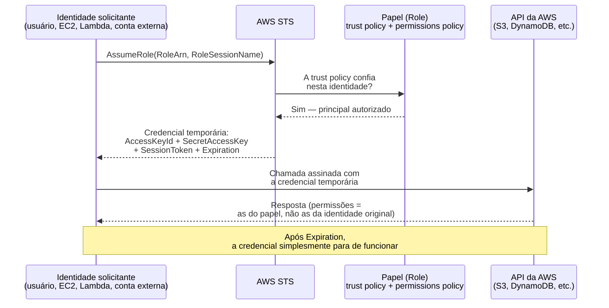
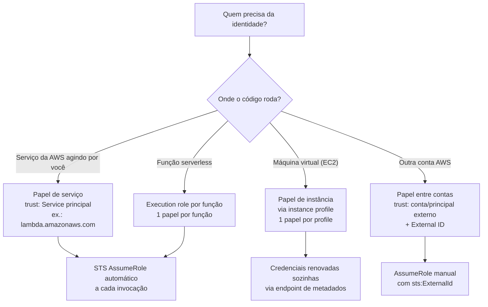
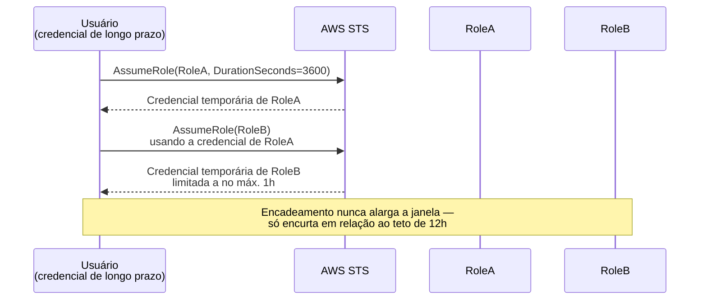

# Roles e credenciais temporárias

> [!abstract] TL;DR
> A chave de acesso estática da nota anterior tem um defeito estrutural: ela não sabe quando parar de funcionar. Um **papel (role)** resolve isso invertendo o modelo — em vez de carregar uma credencial fixa, uma identidade **assume** o papel e recebe, na hora, uma credencial que já nasce com prazo de validade: tipicamente uma hora, no máximo doze. Não existe chave para vazar em um repositório, porque não existe chave — existe um token que expira sozinho. O mecanismo por trás disso é sempre o mesmo, não importa quem está assumindo o papel: uma **relação de confiança** (trust policy) diz quem pode pedir a troca, e um serviço central (o AWS STS) troca essa identidade por uma credencial de curta duração. Serviço, instância de máquina virtual e função sem servidor usam essa mesma mecânica — só muda quem inicia a troca. A DigitalOcean, por sua vez, tem um modelo deliberadamente mais simples: tokens de API com expiração configurável manualmente, mas sem o equivalente completo de papel assumível por um recurso.

## O problema que ficou em aberto

Na nota anterior, uma aplicação rodando numa instância EC2 precisava gravar arquivos num bucket S3. A solução mais rápida — e a mais comum em times que ainda não pensaram sistematicamente sobre identidade na nuvem — foi criar um usuário IAM dedicado, gerar uma chave de acesso para ele, e colar essa chave numa variável de ambiente da aplicação. Funcionou. Também ficou lá, sem prazo de validade, esperando o próximo desenvolvedor copiar o arquivo `.env` para um repositório Git por engano, ou esperando alguém sair do time sem que ninguém lembrasse de revogar exatamente aquela chave entre as dezenas espalhadas pela organização.

O problema não é a chave em si — é o que ela *não tem*: nenhum relógio embutido. Uma chave de acesso de usuário IAM continua válida até alguém, manualmente, decidir invalidá-la. Ela não sabe que a instância que a usava foi desligada há oito meses. Ela não sabe que o funcionário que a gerou já não trabalha mais na empresa. Ela é, estruturalmente, uma promessa de acesso sem data de vencimento — e cada promessa sem data de vencimento que existe numa organização é um vazamento em potencial esperando o momento errado para se realizar.

A pergunta natural, então, não é "como proteger melhor essa chave" — cofres de segredo, rotação manual, políticas de acesso ao repositório ajudam, mas atacam o sintoma. A pergunta certa é: **existe uma forma de dar à aplicação exatamente o acesso que ela precisa, sem nunca criar uma chave que sobrevive além do momento em que é necessária?** Existe. Chama-se assumir um papel, e é o padrão que toda arquitetura séria de nuvem usa por padrão — não como boa prática opcional, mas como o jeito nativo de fazer as coisas.

## O papel como identidade sem credencial própria

Um **papel (role)** é, na definição oficial da AWS, uma identidade do IAM com permissões específicas — nesse sentido, parecida com um usuário. A diferença central é esta: um papel **não tem credenciais de longo prazo associadas a ele**. Nenhuma senha. Nenhuma chave de acesso permanente. Um papel é, por design, uma identidade vazia até que alguém — uma pessoa, uma aplicação, outro serviço da AWS — a **assuma**, e nesse momento receba credenciais de segurança temporárias válidas só para aquela sessão.

Essa é a virada conceitual inteira desta nota: **um usuário é alguém que carrega uma identidade permanente com ele o tempo todo; um papel é uma identidade que fica esperando, sem dono fixo, até ser vestida por alguém, por um tempo limitado, e depois devolvida.** Pense num crachá de visitante de um prédio corporativo. Ele não tem o nome de ninguém impresso — é genérico. Quando você chega na recepção, mostra quem é, e a recepção te empresta o crachá por algumas horas, com um conjunto específico de portas que ele abre. No fim do dia, você devolve o crachá. Ele volta a ficar sem dono, pronto para o próximo visitante que precisar exatamente daquele nível de acesso. Ninguém andando pelo prédio seis meses depois ainda está usando aquele crachá específico — porque o crachá, por definição, não sobrevive além da visita.

Um papel tem duas peças de política anexadas a ele, e é essencial não confundir as duas:

- A **permissions policy** (política de permissões) — a mesma coisa que a nota 03 desta trilha já cobriu em profundidade: define *o que* quem assumir o papel pode fazer. Efeito, ação, recurso, condição — a anatomia já conhecida.
- A **trust policy** (política de confiança) — a peça nova desta nota. Define *quem* tem permissão para assumir esse papel. É um documento JSON anexado ao papel, e a AWS a trata como uma **política baseada em recurso**: ela vive no papel, não em quem vai usá-lo, e diz explicitamente qual identidade — usuário, outro papel, conta inteira, ou um serviço da própria AWS — está autorizada a pedir a troca.

> [!tip] Assista: AWS AssumeRole Explained | IAM Roles, STS & Temporary Credentials Demo
> **Canal:** Anything Cloud | **Duração:** ~13min | **Idioma:** EN
>
> O vídeo desenha lado a lado as duas peças que este trecho acabou de separar — permission policy e trust policy — e mostra, no console, como a trust policy é o pedaço que decide quem pode chamar `AssumeRole` antes mesmo de a permission policy importar.
> Trecho de destaque [01:07]: *"And trust policy defines who can use this role"*
>
> 🎬 [Assistir no YouTube](https://www.youtube.com/watch?v=xNYPZxd_m4M)

Vale reter essa frase, porque ela resume a diferença entre papel e usuário melhor que qualquer definição formal: **um usuário carrega a chave da porta; um papel é a porta que decide, ela mesma, quem pode pedir a chave emprestada.**

## O mecanismo: assumir um papel e trocar por credencial temporária

O processo de "assumir um papel" tem um nome técnico exato na AWS: a operação `AssumeRole`, exposta pelo **AWS STS** (Security Token Service) — o serviço da AWS dedicado inteiramente a emitir credenciais temporárias. Toda vez que alguém assume um papel, é o STS quem processa o pedido e devolve a credencial.

O fluxo, em qualquer das suas variações, segue sempre a mesma sequência lógica:

1. Uma identidade que já está autenticada de alguma forma (um usuário com sua própria credencial, uma instância EC2, uma função Lambda, um serviço externo) pede ao STS para assumir um papel específico, identificado pelo seu ARN.
2. O STS verifica a **trust policy** do papel: essa identidade que está pedindo está na lista de principals confiáveis daquele papel? Se não estiver, o pedido é negado ali mesmo — nenhuma permissão do papel importa se a confiança nunca foi concedida.
3. Se a confiança existe, o STS gera uma credencial nova: um `AccessKeyId`, um `SecretAccessKey` e, a peça que não existe em credenciais permanentes, um `SessionToken` — e devolve tudo junto com um horário exato de expiração (`Expiration`).
4. A partir daquele momento, quem assumiu o papel usa essa credencial de três partes para fazer chamadas à API da AWS. As permissões dessa sessão são as da **permissions policy** do papel — não as da identidade original que fez o pedido.
5. Quando o horário de expiração chega, a credencial simplesmente para de funcionar. Não existe revogação manual necessária, não existe rotação para lembrar de fazer — o relógio que a chave estática nunca teve vem embutido de fábrica.



A duração dessa credencial não é fixa — é configurável dentro de limites definidos. O parâmetro que controla isso na chamada `AssumeRole` chama-se `DurationSeconds`: o valor mínimo aceito é 900 segundos (15 minutos), o padrão quando nada é especificado é 3600 segundos (1 hora), e o teto absoluto é 43200 segundos (12 horas) — mas esse teto está sempre subordinado a um segundo limite, configurado no próprio papel pelo administrador: o **maximum session duration**, que pode ser ajustado entre 1 e 12 horas. Se alguém pedir uma sessão de 12 horas mas o papel só permite no máximo 6, o pedido falha — o menor dos dois limites sempre vence.

Repare no que isso significa na prática: mesmo a credencial temporária *mais longa* que a AWS permite ainda expira em, no máximo, meio dia. Comparado a uma chave de usuário que fica válida por anos até alguém lembrar de revogá-la manualmente, a diferença não é de grau — é de categoria inteira de risco. Uma chave vazada de longa duração é um problema até alguém perceber e agir. Uma credencial temporária vazada é um problema, na pior das hipóteses, por algumas horas — e depois simplesmente para de ser um problema, sozinha, sem ninguém precisar fazer nada.

### O fluxo em comandos: antes, durante e depois de assumir um papel

A melhor forma de fixar essa mecânica é ver a identidade mudando de forma na frente dos olhos. `aws sts get-caller-identity` é o comando mais simples da AWS — não pede nenhuma permissão além de estar autenticado — e devolve exatamente quem a AWS acha que você é neste instante. Rode-o antes de assumir o papel:

```bash
$ aws sts get-caller-identity
{
    "UserId": "AIDACKCEVSQ6C2EXAMPLE",
    "Account": "123456789012",
    "Arn": "arn:aws:iam::123456789012:user/joana.dev"
}
```

Um usuário IAM comum, com sua própria identidade permanente. Agora, a troca — `aws sts assume-role` pede as duas informações obrigatórias que a API `AssumeRole` exige: o ARN do papel (`--role-arn`) e um nome de sessão (`--role-session-name`), este último obrigatório e limitado a 2-64 caracteres alfanuméricos:

```bash
$ aws sts assume-role \
    --role-arn arn:aws:iam::123456789012:role/app-s3-writer \
    --role-session-name joana-debug-sessao
```

A resposta traz a credencial de três partes e o identificador da sessão assumida:

```json
{
    "Credentials": {
        "AccessKeyId": "ASIAJEXAMPLEXEG2JICEA",
        "SecretAccessKey": "9drTJvcXLB89EXAMPLELB8923FB892xMFI",
        "SessionToken": "AQoXdzELDDY...(token longo, truncado aqui)",
        "Expiration": "2026-07-20T18:05:07Z"
    },
    "AssumedRoleUser": {
        "AssumedRoleId": "AROA3XFRBF535PLBIFPI4:joana-debug-sessao",
        "Arn": "arn:aws:sts::123456789012:assumed-role/app-s3-writer/joana-debug-sessao"
    }
}
```

Repare que a `Credentials` tem três campos, não dois — é o `SessionToken` que não existe em credencial estática nenhuma, e é ele que marca essa credencial como temporária perante qualquer serviço da AWS que a receba. Para usar essa credencial numa próxima chamada, os três valores viram variáveis de ambiente (o SDK e a CLI da AWS já sabem procurá-las):

```bash
export AWS_ACCESS_KEY_ID=ASIAJEXAMPLEXEG2JICEA
export AWS_SECRET_ACCESS_KEY=9drTJvcXLB89EXAMPLELB8923FB892xMFI
export AWS_SESSION_TOKEN=AQoXdzELDDY...
```

E rodando `get-caller-identity` de novo, agora dentro dessa sessão:

```bash
$ aws sts get-caller-identity
{
    "UserId": "AROA3XFRBF535PLBIFPI4:joana-debug-sessao",
    "Account": "123456789012",
    "Arn": "arn:aws:sts::123456789012:assumed-role/app-s3-writer/joana-debug-sessao"
}
```

A identidade mudou de fato. Não é mais `user/joana.dev` — é `assumed-role/app-s3-writer/joana-debug-sessao`, com o nome da sessão embutido no próprio ARN. Todas as chamadas feitas com essas variáveis de ambiente carregam as permissões do papel `app-s3-writer`, não as de Joana, e param de funcionar sozinhas no horário marcado em `Expiration`.

| | Chave de acesso estática (usuário IAM) | Credencial temporária (papel assumido) |
|---|---|---|
| Prazo de validade | Nenhum — vale até ser revogada manualmente | Minutos a horas (900s–43200s), sempre com `Expiration` |
| Quem revoga | Uma pessoa precisa lembrar de agir | Ninguém — expira sozinha |
| Rastreabilidade | Uma chave, usada por qualquer processo que a carregue | Uma sessão nova a cada `AssumeRole`, com `RoleSessionName` próprio nos logs |
| Raio de vazamento se exposta | Ilimitado no tempo — vale até alguém perceber | Limitado à janela de `Expiration` restante |
| Rotação | Manual, e frequentemente esquecida | Automática — cada chamada gera uma sessão nova |
| Onde pode viver por engano | Variável de ambiente, `.env`, disco, repositório Git | Só em memória, durante a sessão — não há chave fixa para vazar |

> [!info] Fronteira
> A anatomia de uma política — efeito, ação, recurso, condição, e a lógica de avaliação (negação explícita sempre vence) — já foi coberta na **nota 03** desta trilha e se aplica igualmente à permissions policy de um papel. Esta nota assume esse conhecimento e foca no que é específico de papéis: a trust policy e a troca por credencial temporária.

## As três encarnações: papel para serviço, para instância e para função

A mecânica de assumir um papel é sempre a mesma — trust policy, STS, credencial com prazo — mas quem inicia a troca muda dependendo de onde o código roda. Vale distinguir três casos, porque cada um aparece com um nome diferente na prática e resolve uma dor de identidade diferente.

**Papel para serviço (service role).** É um papel que um serviço da AWS assume para agir em seu nome. O exemplo mais didático é o **execution role** de uma função Lambda: toda função Lambda tem um papel de execução anexado, e a própria documentação da AWS é explícita sobre o mecanismo — "o Lambda assume automaticamente seu papel de execução quando você invoca sua função". Você, como desenvolvedor, nunca chama `AssumeRole` manualmente dentro do código da função; o serviço faz isso por você, de forma transparente, a cada invocação. Para que isso funcione, a trust policy do papel precisa confiar explicitamente no *principal de serviço* do Lambda:

```json
{
  "Version": "2012-10-17",
  "Statement": [
    {
      "Effect": "Allow",
      "Principal": {
        "Service": "lambda.amazonaws.com"
      },
      "Action": "sts:AssumeRole"
    }
  ]
}
```

Note a peça nova nessa trust policy: o `Principal` não é um usuário nem uma conta — é um **service principal**, uma identidade que representa o próprio serviço da AWS (`lambda.amazonaws.com`). É a AWS confiando na AWS, formalizado do mesmo jeito que qualquer outra relação de confiança. A própria documentação da AWS avisa para não chamar `sts:AssumeRole` manualmente dentro do código da função — Lambda já faz isso por você a cada invocação.

Criar esse papel pela CLI usa o comando `create-role`, passando a trust policy inline ou como arquivo:

```bash
aws iam create-role \
  --role-name lambda-ex \
  --assume-role-policy-document file://trust-policy.json

aws iam attach-role-policy \
  --role-name lambda-ex \
  --policy-arn arn:aws:iam::aws:policy/service-role/AWSLambdaBasicExecutionRole
```

**Papel para instância (instance role, via instance profile).** É como uma máquina virtual — uma instância EC2 — recebe uma identidade própria, sem que ninguém precise colocar uma chave de acesso dentro dela. O papel não é anexado diretamente à instância; ele passa por um contêiner intermediário chamado **instance profile**, que é o que de fato é associado à instância no momento do lançamento (quando você cria um papel para EC2 pelo console, a própria AWS cria o instance profile de mesmo nome automaticamente, então a distinção costuma ficar invisível — mas ela existe, e importa quando você opera por CLI ou API, onde os dois são recursos separados). A trust policy, nesse caso, confia no service principal do EC2:

```json
{
  "Version": "2012-10-17",
  "Statement": [
    {
      "Effect": "Allow",
      "Principal": {
        "Service": "ec2.amazonaws.com"
      },
      "Action": "sts:AssumeRole"
    }
  ]
}
```

Pela CLI, criar o papel e passar pelo instance profile são três passos separados — diferença que o console esconde, mas que existe de fato:

```bash
aws iam create-role \
  --role-name app-ec2-role \
  --assume-role-policy-document file://ec2-trust-policy.json

aws iam create-instance-profile --instance-profile-name app-ec2-profile

aws iam add-role-to-instance-profile \
  --instance-profile-name app-ec2-profile \
  --role-name app-ec2-role

aws ec2 associate-iam-instance-profile \
  --instance-id i-0abcd1234efgh5678 \
  --iam-instance-profile Name=app-ec2-profile
```

Duas restrições da documentação oficial vale reter: **um instance profile só pode conter um único papel IAM** (o limite não pode ser aumentado — para trocar, você remove um papel e adiciona outro), e **uma instância só pode ter um instance profile por vez**, embora o mesmo papel possa ser reutilizado em instance profiles diferentes. Uma vez associada, a instância consegue pedir credenciais temporárias automaticamente a um endpoint de metadados local, sem qualquer chave gravada em disco — e a AWS renova essas credenciais sozinha, por trás da cena, antes que expirem, então o sistema operacional dentro da instância nunca vê uma credencial permanente, só uma sequência contínua de credenciais de curta duração se revezando. É exatamente o problema desta nota resolvido de forma automática: a aplicação que antes lia uma chave de uma variável de ambiente passa a simplesmente confiar na identidade da máquina.

**Papel para função (o mesmo execution role, olhado do ângulo do FaaS).** Tecnicamente é o mesmo mecanismo do "papel para serviço" descrito acima — o execution role do Lambda — mas vale nomear separadamente porque, do ponto de vista de quem projeta o sistema, a pergunta muda de forma: não é "que serviço da AWS está agindo por mim", é "que permissões esta função específica, entre dezenas de funções do sistema, deveria ter". Uma arquitetura séria de FaaS não usa um único papel gigante compartilhado por todas as funções — dá a cada função seu próprio execution role, com a permissions policy mínima que aquela função específica precisa:

```bash
aws lambda create-function \
  --function-name redimensiona-imagem \
  --runtime python3.13 \
  --handler app.handler \
  --role arn:aws:iam::123456789012:role/redimensiona-imagem-role \
  --zip-file fileb://function.zip
```

Isso antecipa o assunto central da **próxima nota** desta trilha, sobre least privilege: papéis por função são o jeito mais natural de aplicar o princípio na prática, porque o papel já nasce isolado por unidade de trabalho.

| Tipo de papel | Quem assume | Quem inicia a troca | Caso de uso típico |
|---|---|---|---|
| Papel de serviço (service role) | Um serviço da AWS, agindo em seu nome | O próprio serviço, automaticamente | Execution role de uma função Lambda |
| Papel de instância (instance role) | A instância EC2, via instance profile | A instância, no boot, junto ao serviço de metadados | Aplicação numa VM que precisa falar com S3, DynamoDB etc. |
| Papel de função (execution role por função) | A função serverless específica | O runtime do FaaS, a cada invocação | Isolar permissões entre dezenas de funções de um mesmo sistema |
| Papel entre contas (cross-account role) | Um principal de outra conta AWS | A pessoa ou processo da conta confiável, manualmente | Auditoria externa, contas separadas de produção/homologação |



## A relação de confiança entre entidades

O que amarra as três encarnações acima é sempre a mesma peça: a **trust policy**. Vale entender sua anatomia com mais precisão do que "quem pode assumir o papel", porque ela tem uma estrutura formal exatamente igual a qualquer outra política JSON da AWS — efeito, principal, ação — só que o principal, aqui, é quem está do lado de fora pedindo entrada, não quem está sendo autorizado a agir sobre um recurso.

Segundo a documentação oficial da IAM, ao criar uma trust policy você define os **principals** — usuários, papéis, contas inteiras ou serviços — que são confiáveis para assumir aquele papel específico. Quatro tipos de principal aparecem na prática:

- **Um usuário IAM**, na mesma conta ou em outra — o caso de "eu, autenticado como uma pessoa, quero temporariamente vestir as permissões de um papel mais amplo (ou mais restrito) do que as minhas próprias".
- **Outro papel IAM** — o que possibilita o encadeamento descrito na próxima seção.
- **Um principal de serviço** — como visto acima com o Lambda, ou o mesmo padrão usado por EC2, ECS e dezenas de outros serviços da AWS.
- **Um usuário federado externo**, autenticado por um provedor de identidade compatível com SAML 2.0 ou OpenID Connect — um caso que a nota 06 desta trilha vai desenvolver, sem reexplicar OAuth ou SAML como protocolos.

Um caso particularmente importante é o **acesso entre contas**: quando a conta que possui o recurso (a *trusting account*) e a conta que contém quem precisa acessá-lo (a *trusted account*) são contas diferentes da AWS — cenário comum quando uma consultoria de auditoria externa precisa examinar recursos de um cliente, ou quando uma empresa organiza produção e homologação em contas separadas por segurança. Nesse caso, a trust policy do papel na conta que possui o recurso lista explicitamente a conta (ou um principal específico dentro dela) que pode assumi-lo — e, quando a relação envolve organizações diferentes que não controlam ambas as contas, existe ainda um parâmetro adicional chamado **External ID**: uma string que o administrador da conta que possui o recurso comunica, fora de banda, ao administrador da conta que vai assumir o papel, e que precisa ser incluída no pedido de `AssumeRole` para que ele funcione. O External ID existe especificamente para mitigar o **confused deputy problem** — o risco de um terceiro mal-intencionado convencer um intermediário confiável a assumir um papel em nome de outra vítima, sem que a vítima real tenha de fato autorizado aquele pedido específico.

Uma trust policy entre contas, exigindo o External ID, tem esta forma — repare na condição extra que não aparece nas trust policies de serviço vistas acima:

```json
{
  "Version": "2012-10-17",
  "Statement": [
    {
      "Effect": "Allow",
      "Principal": {
        "AWS": "arn:aws:iam::999888777666:root"
      },
      "Action": "sts:AssumeRole",
      "Condition": {
        "StringEquals": {
          "sts:ExternalId": "combinado-fora-de-banda-por-telefone"
        }
      }
    }
  ]
}
```

E o pedido do lado de quem assume passa o mesmo valor, via `--external-id`:

```bash
aws sts assume-role \
  --role-arn arn:aws:iam::999888777666:role/auditoria-leitura \
  --role-session-name consultoria-auditoria-2026 \
  --external-id combinado-fora-de-banda-por-telefone \
  --duration-seconds 3600
```

## A troca de token: sessão, não credencial permanente

Vale nomear com precisão o que acontece no momento em que uma credencial temporária é devolvida, porque o vocabulário técnico distingue duas coisas que a intuição tende a misturar.

Quando você assume um papel, a resposta da AWS inclui um `AssumedRoleUser` — um par de identificadores (o ARN da sessão e o `AssumedRoleId`) que referencia especificamente *aquela sessão*, não o papel em abstrato. O ARN de uma sessão assumida tem um formato próprio, incorporando o **nome da sessão** (`RoleSessionName`) que quem fez o pedido escolheu — um identificador arbitrário, mas obrigatório, que existe justamente para que seja possível distinguir, nos logs, duas sessões diferentes do mesmo papel assumidas por pessoas ou processos diferentes. Em cenários de auditoria, um administrador costuma exigir que o nome da sessão corresponda ao nome de usuário de quem está assumindo o papel — assim, mesmo que dez pessoas diferentes assumam o mesmo papel de "administrador de emergência" ao longo do mês, o CloudTrail (o serviço de auditoria da AWS) consegue mostrar exatamente quem fez o quê, em qual sessão.

Existe ainda um padrão chamado **role chaining**: usar um papel já assumido para assumir um segundo papel — `RoleA` tem permissão de assumir `RoleB`, então uma identidade assume primeiro `RoleA`, e usa a credencial temporária resultante para pedir `RoleB`:

```bash
# Passo 1 — assume RoleA com as credenciais de longo prazo do usuário
aws sts assume-role \
  --role-arn arn:aws:iam::123456789012:role/RoleA \
  --role-session-name etapa-1 \
  --duration-seconds 3600

# Passo 2 — usando as credenciais de RoleA (exportadas como env vars),
# assume RoleB. Mesmo pedindo mais, a sessão fica travada em 1h.
aws sts assume-role \
  --role-arn arn:aws:iam::123456789012:role/RoleB \
  --role-session-name etapa-2 \
  --duration-seconds 43200
```

A AWS impõe uma restrição deliberada aqui: uma sessão obtida por encadeamento de papéis fica limitada a **no máximo uma hora**, independentemente de qual seja o `maximum session duration` configurado em qualquer um dos papéis envolvidos — mesmo pedindo `--duration-seconds 43200` no passo 2 acima, a AWS aceita o pedido mas limita a sessão resultante a 1h. É uma proteção explícita contra cadeias longas de delegação virarem, na prática, um jeito de burlar o limite de 12 horas — cada elo da cadeia encurta a janela de validade, nunca alarga.



O ponto central para reter: **uma credencial temporária nunca é "a mesma identidade, só que com prazo de validade" — ela é uma sessão nova, com seu próprio identificador, suas próprias permissões (as do papel, não as de quem o assumiu), e sua própria linha de auditoria.** Trocar de papel não é emprestar uma chave; é abrir uma sessão nova e efêmera, rastreável do início ao fim.

## Casos práticos

**A aplicação que parou de ter chave.** Retomando o cenário de abertura desta nota: a aplicação na instância EC2 que gravava arquivos no S3 usando uma chave de usuário IAM colada numa variável de ambiente passa a usar, em vez disso, um papel associado à instância via instance profile. O código muda de forma mínima — a maioria dos SDKs da AWS já sabe, por padrão, buscar credenciais do serviço de metadados da instância antes de procurar em qualquer outro lugar — mas o resultado estrutural é radical: não existe mais nenhuma chave gravada em disco, em variável de ambiente, ou em qualquer lugar que um `git push` acidental pudesse expor. Se alguém copiar todo o conteúdo do disco da instância, não encontra nenhuma credencial de longo prazo para roubar.

**A função que processa upload de imagem.** Uma função Lambda é disparada sempre que um arquivo novo chega num bucket S3, redimensiona a imagem, e grava o resultado num segundo bucket. O execution role dessa função tem permissão de leitura só no bucket de origem e permissão de escrita só no bucket de destino — nada além disso. Se essa função tiver uma vulnerabilidade de injeção de código explorada por um atacante, o dano máximo possível está limitado exatamente ao que aquele papel específico permite: ler de um bucket, escrever no outro. Não existe credencial mais ampla para roubar, porque a função nunca teve acesso a uma.

**O auditor externo com acesso de leitura temporário.** Uma empresa contrata uma consultoria de segurança para revisar a configuração de uma conta AWS de produção. Em vez de criar um usuário IAM dedicado com senha e chave de acesso — que sobreviveria ao fim do contrato se alguém esquecesse de revogá-lo — a empresa cria um papel com permissões de leitura, cuja trust policy confia especificamente na conta AWS da consultoria, exige um External ID combinado por telefone (não por e-mail, para reduzir o risco de interceptação), e a própria consultoria assume esse papel só durante a janela da auditoria. Terminado o contrato, revogar o acesso é uma única ação — remover a confiança da trust policy — em vez de caçar uma credencial espalhada.

## Lente dupla honesta: AWS e o modelo mais simples da DigitalOcean

Vale ser direto sobre isso, porque não é uma lacuna a esconder — é uma escolha de design consciente da DigitalOcean, coerente com um provedor que prioriza simplicidade sobre granularidade. A DigitalOcean **não tem um equivalente completo** ao par papel + STS da AWS.

O que a DigitalOcean oferece é o **Personal Access Token (PAT)**: um token de API criado manualmente no painel de controle, com um nome, um conjunto de escopos (as permissões que ele carrega) e, desde que a DigitalOcean passou a suportar isso, uma **data de expiração escolhida no momento da criação** — depois desse intervalo, o token simplesmente para de autenticar. Isso já é uma melhoria real sobre uma chave que nunca expira: o problema estrutural descrito na nota 02 desta trilha (a chave que sobrevive indefinidamente) tem, na DigitalOcean, uma mitigação direta.

Mas a diferença central permanece, e vale nomeá-la com precisão. Um PAT da DigitalOcean é criado **uma vez, manualmente, por uma pessoa**, e continua sendo a mesma credencial estática até a data de expiração que essa pessoa escolheu. Não existe, na DigitalOcean, um mecanismo pelo qual um Droplet, um App Platform, ou uma DigitalOcean Function **assuma** automaticamente uma identidade própria e receba, sozinho, uma sessão nova de credencial de curta duração a cada execução — não existe instance profile, não existe execution role, não existe trust policy anexada a um recurso computacional, não existe uma chamada equivalente a `AssumeRole` que uma máquina faça por conta própria. Se uma aplicação rodando num Droplet precisa falar com a API da DigitalOcean, o caminho prático continua sendo colar um PAT numa variável de ambiente — exatamente o padrão que a nota 02 apontou como frágil, só que agora com uma data de expiração manual amenizando (não eliminando) o risco.

O contraste fica direto quando se coloca o comando `doctl` ao lado do `aws sts` equivalente. Autenticar o `doctl` significa colar o PAT uma vez, e ele fica salvo localmente até você trocá-lo manualmente:

```bash
# AWS — a identidade muda a cada AssumeRole, sem token fixo
$ aws sts get-caller-identity
{
  "Arn": "arn:aws:sts::123456789012:assumed-role/app-s3-writer/joana-debug-sessao"
}

# DigitalOcean — o PAT é colado uma vez (interativo) e fica salvo localmente
$ doctl auth init
# ou, sem salvar contexto, o token vai em cada chamada via flag global:
$ doctl account get --access-token dop_v1_EXEMPLO_TOKEN_ESTATICO
Email    Droplet Limit    Email Verified    UUID    Status
joana@   25               true              ...     active
```

Não existe um `doctl sts assume-role` porque não existe um serviço equivalente ao STS na DigitalOcean — o `doctl account get` acima devolve os dados da conta dona do token, não de uma sessão temporária assumida.

Isso não torna a DigitalOcean "pior" de forma genérica — é uma troca deliberada de complexidade por simplicidade, coerente com o público que a DigitalOcean atende. Só significa que, para quem constrói arquitetura pensando em identidade de carga de trabalho (workload identity) sem credencial permanente nenhuma no meio do caminho, é a AWS — ou provedores com um modelo equivalente de papéis — que oferece o mecanismo completo. É uma peça de vocabulário legítima para entrevista sênior: saber nomear precisamente **o que existe** e **o que falta**, em vez de assumir que "toda nuvem tem isso" ou, no outro extremo, descartar a DigitalOcean como incapaz de operar com segurança.

| Conceito | AWS | Azure | GCP | DigitalOcean |
|---|---|---|---|---|
| Papel assumível por identidade | IAM Role + STS `AssumeRole` | Managed Identity / registro de aplicativo Azure AD | Service Account + impersonation | — (sem equivalente completo) |
| Identidade própria de VM/instância | Instance Profile (EC2) | Managed Identity atribuída à VM | Service Account anexada à instância | — (token de API estático) |
| Identidade de função serverless | Execution role (Lambda) | Managed Identity (Azure Functions) | Service Account de runtime (Cloud Functions) | Token de API do projeto — não é um papel assumido pela função |
| Credencial de sessão de curta duração | STS temporary credentials, renovadas pelo próprio serviço | Token do Azure AD, renovado automaticamente pelo SDK | Token OAuth, renovado automaticamente pelo SDK | Personal Access Token com expiração fixa definida na criação |

> [!info] Caducidade
> Nomes de produto e comportamento de tokens verificados em 2026-07-20 — em especial a expiração configurável de Personal Access Tokens da DigitalOcean, um recurso relativamente recente na plataforma. Confira a documentação oficial de cada provedor antes de decidir; a forma exata como cada nuvem lida com identidade de workload é uma das áreas que mais evolui no setor.

## Armadilhas comuns

> [!warning] Trust policy permissiva demais — confiar na conta inteira sem necessidade
> É comum, por pressa, escrever uma trust policy que confia em `arn:aws:iam::123456789012:root` — a conta inteira — quando bastaria confiar num usuário ou papel específico dentro dela. Isso amplia desnecessariamente quem pode pedir aquele papel: qualquer identidade daquela conta com permissão de `sts:AssumeRole` passa a poder assumi-lo, não só a que deveria. Escreva a trust policy do jeito mais estreito que o caso de uso permitir — um principal específico, não a conta inteira, sempre que possível.

> [!warning] Achar que instance profile é opcional para quem "só" precisa ler um bucket
> Times que já sabem que chave estática é ruim, mas acham a configuração de instance profile um passo extra "para depois", acabam colando uma chave temporariamente "só para não travar o deploy de hoje" — e essa chave temporária, na prática, dura meses. O caminho certo, mesmo sob pressão de prazo, é configurar o papel e o instance profile antes do primeiro deploy: a diferença de esforço entre fazer isso no dia um e fazer depois é pequena; a diferença de risco acumulado é enorme.

> [!warning] Confundir "a credencial expira" com "o acesso está limitado"
> Uma credencial temporária que expira em uma hora, mas cuja permissions policy concede acesso total a todos os recursos da conta, ainda é um risco grave durante essa hora — o prazo curto reduz a *janela* de exposição, não o *tamanho* dela. Expiração e escopo mínimo de permissão são duas defesas independentes, e uma não substitui a outra. É exatamente esse segundo eixo — quanto, não por quanto tempo — que a próxima nota desta trilha desenvolve.

## O que vem a seguir

Esta nota resolveu o *quanto tempo* uma credencial deveria durar — a resposta é "o mínimo necessário, e nunca para sempre". Mas ficou pendente uma pergunta irmã, que "assumir um papel" sozinho não responde: mesmo com credencial temporária, o papel ainda precisa de uma permissions policy anexada — e é fácil, sob pressão de prazo, anexar uma política ampla demais só para "não travar o desenvolvimento". Enunciar o princípio de dar a cada identidade só o acesso mínimo necessário é simples. Aplicá-lo, num time real, sem travar a velocidade de entrega, é o assunto denso da próxima nota, **"Least privilege na prática"**.

## Fontes

- [AWS IAM — IAM roles (documentação oficial)](https://docs.aws.amazon.com/IAM/latest/UserGuide/id_roles.html) — definição de papel, quem pode assumir um papel, quando preferir usuário a papel; acessado em 2026-07-20.
- [AWS IAM — Roles terms and concepts](https://docs.aws.amazon.com/IAM/latest/UserGuide/id_roles.html#id_roles_terms-and-concepts) — trust policy, role chaining, delegação, External ID, principals; acessado em 2026-07-20.
- [AWS STS — API Reference: AssumeRole](https://docs.aws.amazon.com/STS/latest/APIReference/API_AssumeRole.html) — parâmetros `DurationSeconds` (min 900s, padrão 3600s, máx 43200s), `RoleArn`, `RoleSessionName`, `ExternalId`; formato da resposta (`AssumedRoleUser`, `Credentials` com `AccessKeyId`/`SecretAccessKey`/`SessionToken`/`Expiration`); limite de 1 hora em role chaining; acessado em 2026-07-20.
- [AWS IAM — Use instance profiles](https://docs.aws.amazon.com/IAM/latest/UserGuide/id_roles_use_switch-role-ec2_instance-profiles.html) — instance profile como contêiner do papel associado a uma instância EC2; um único papel por instance profile; acessado em 2026-07-20.
- [AWS Lambda — Lambda execution role (documentação oficial)](https://docs.aws.amazon.com/lambda/latest/dg/lambda-intro-execution-role.html) — Lambda assume automaticamente o execution role a cada invocação; exemplo de trust policy com o service principal `lambda.amazonaws.com`; acessado em 2026-07-20.
- [DigitalOcean — Create a Personal Access Token (API Reference)](https://docs.digitalocean.com/reference/api/create-personal-access-token/) — criação de PAT, escopos customizados, alias `api:read`/`api:write`, e o comportamento de expiração configurável na criação do token; acessado em 2026-07-20.
- [AWS CLI — sts assume-role (Command Reference)](https://docs.aws.amazon.com/cli/latest/reference/sts/assume-role.html) — sintaxe de `--role-arn`/`--role-session-name`/`--duration-seconds`/`--external-id`, formato de saída JSON; acessado em 2026-07-23.
- [AWS CLI — sts get-caller-identity (Command Reference)](https://docs.aws.amazon.com/cli/latest/reference/sts/get-caller-identity.html) — campos `UserId`/`Account`/`Arn` da identidade atual; acessado em 2026-07-23.
- [AWS EC2 — IAM roles for Amazon EC2](https://docs.aws.amazon.com/AWSEC2/latest/UserGuide/iam-roles-for-amazon-ec2.html) — instance profile como contêiner de um único papel IAM, uma instância só pode ter um instance profile por vez; acessado em 2026-07-23.
- [DigitalOcean — doctl auth init (CLI Reference)](https://docs.digitalocean.com/reference/doctl/reference/auth/init/) — fluxo interativo de autenticação e a flag global `--access-token` como alternativa não interativa; acessado em 2026-07-23.
