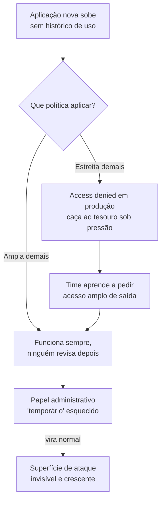
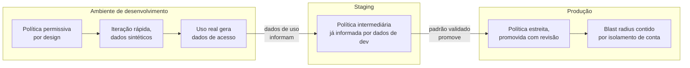
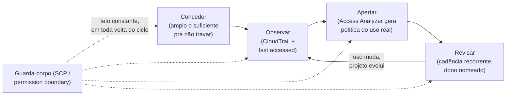

# Least privilege na prática

> [!abstract] TL;DR
> Least privilege — conceder só a permissão estritamente necessária, nem uma ação a mais — é fácil de enunciar e brutalmente difícil de operar sem travar o time, porque ninguém sabe de antemão a lista exata de ações que uma aplicação ou uma pessoa vai precisar. A saída madura não é adivinhar a política perfeita antes do primeiro deploy; é tratar permissão como algo que se **aperta com dados**, não que se acerta de primeira: comece permissivo o suficiente para não travar o trabalho, observe o que é de fato usado, gere a política a partir desse uso real, separe o que é permitido por ambiente, revise em cadência, e deixe guarda-corpos no nível da organização como rede de segurança, não como ferramenta do dia a dia. E não finja que apertar demais é de graça: quando a permissão vira obstáculo, as pessoas contornam — credencial compartilhada, papel administrativo "só por hoje" que nunca mais é revogado — e o sistema fica, na prática, menos seguro do que se a política tivesse sido pragmática desde o início.

## A permissão "temporária" que fez seis meses

Um engenheiro pede acesso administrativo à conta de produção para investigar um incidente às três da manhã — um serviço está devolvendo erro 500 em cascata, e ele precisa inspecionar recursos que sua permissão de rotina não alcança. O time de plataforma concede, na hora, porque é madrugada e o incidente está ativo: um papel com `AdministratorAccess`, anexado à identidade dele, com uma anotação no ticket dizendo "temporário — revogar depois do post-mortem". O incidente é resolvido em quarenta minutos. O post-mortem acontece uma semana depois, cobre causa raiz, ação corretiva, prazo de correção — e não menciona, em nenhuma linha, o papel administrativo que ainda está anexado à conta daquele engenheiro.

Seis meses depois, uma auditoria de segurança rotineira lista todas as identidades da conta de produção ordenadas por amplitude de permissão. O papel administrativo aparece no topo, com um único evento de uso registrado nos últimos 180 dias — a própria madrugada do incidente. O engenheiro nem lembra que ainda tem esse acesso; ele para de usar credenciais amplas no dia a dia, porque seu fluxo de trabalho normal nunca precisou delas. Mas a permissão continuou lá, o tempo inteiro, como uma porta destrancada num corredor que ninguém mais olha. Se a credencial daquele engenheiro vazasse num commit acidental, num laptop roubado, num phishing bem-sucedido, o raio de explosão seria a conta de produção inteira — não porque alguém decidiu, deliberadamente, que esse era o nível de risco aceitável, mas porque ninguém decidiu o contrário a tempo.

Esse é o padrão mais comum de falha de least privilege em produção, e ele não tem nada a ver com má-fé ou incompetência. O time de plataforma fez a coisa certa sob pressão — resolveu o incidente rápido, sem burocracia travando uma decisão urgente. O problema não é a concessão; é a ausência de um mecanismo que faça a permissão **voltar** ao normal sozinha, sem depender de alguém lembrar. E é exatamente esse mecanismo — o que faz permissão apertar de volta sem depender de memória humana — que esta nota constrói, peça por peça.

## Por que o princípio é fácil de dizer e difícil de fazer

A **nota 03** deste galho já mostrou a anatomia de uma política — efeito, ação, recurso, condição — e a lógica de avaliação que decide se uma chamada de API passa ou é barrada. A **nota 04** mostrou o padrão certo de credencial: assumir um papel e receber acesso temporário, em vez de carregar uma chave estática pra sempre. As duas notas anteriores resolveram *como* uma permissão é concedida e *que forma* essa concessão deveria ter. Esta nota ataca uma pergunta diferente e mais difícil: **quanto** conceder.

O princípio em si cabe numa frase que qualquer engenheiro sênior já ouviu: conceda a cada identidade — pessoa, serviço, pipeline — apenas as permissões estritamente necessárias para fazer o trabalho dela, nem uma a mais. Dito assim, soa óbvio, quase banal. O problema aparece no instante em que alguém tenta aplicar esse princípio a um sistema real, e esbarra numa pergunta que a frase bonita não responde: **necessário segundo quem, e sabido quando?**

Pense no caso mais comum: uma aplicação nova, que ainda não rodou em produção nenhuma vez. Que permissões exatas ela precisa? Em teoria, a resposta está no código — toda chamada de API que o código faz é uma permissão necessária, e nenhuma outra é. Na prática, ninguém lê o código inteiro de uma aplicação não-trivial linha por linha catalogando cada chamada de SDK que ela pode fazer, incluindo os caminhos de erro, os retries, os cron jobs esporádicos, as chamadas administrativas que só disparam uma vez por trimestre. E mesmo que alguém fizesse esse trabalho manualmente, o código muda na semana seguinte — uma feature nova, uma integração nova, uma dependência que passou a usar um serviço diferente por baixo — e a política ficaria desatualizada no primeiro deploy seguinte.

O resultado, na prática de quase todo time, é um dilema com dois lados ruins:

- **Errar para o lado estreito demais** trava o trabalho. A aplicação sobe, tenta uma chamada de API que ninguém previu, recebe "access denied", e o incidente vira uma caça ao tesouro: qual ação exatamente falta, em qual recurso, sob qual condição? Multiplique isso por dezenas de serviços e times, e o custo de oportunidade de ficar catando permissão faltante, uma de cada vez, sob pressão de prazo, supera de longe o valor de segurança que a política estreita deveria estar entregando.
- **Errar para o lado amplo demais** — a saída de menor resistência sob pressão — resolve o problema imediato e cria um problema maior, silencioso, que só aparece numa auditoria ou, pior, num incidente de segurança. É exatamente o padrão do papel administrativo "temporário" da abertura desta nota: amplo o bastante para nunca mais travar ninguém, e amplo o bastante para nunca mais ser questionado.

A tensão de fundo é que **nenhuma das duas opções é sustentável sozinha**, e é aqui que a maioria dos guias de segurança para de ser útil — eles enunciam o princípio, mostram um exemplo de política estreita e bem-comportada, e não dizem como um time real, sob pressão real, chega até lá sem travar ninguém no caminho. O resto desta nota é sobre isso: um conjunto de estratégias que um arquiteto sênior de fato usa para converter "least privilege" de slogan em prática operável.



## Estratégia 1 — começar permissivo, apertar com dados de uso

A primeira virada de postura que resolve o dilema acima é aceitar uma sequência em duas fases, em vez de tentar acertar a política de uma vez: **comece com uma política ampla o suficiente para não travar ninguém, deixe o sistema rodar sob carga real por um período definido, e então aperte a política com base no que foi de fato usado — não no que alguém *achou* que seria usado**.

Essa sequência não é preguiça disfarçada de estratégia; é o reconhecimento honesto de que, antes de rodar, ninguém — nem o desenvolvedor que escreveu o código, nem o arquiteto que revisou o desenho — tem visibilidade completa e confiável de todas as chamadas de API que aquele sistema vai fazer. O uso real é a única fonte de verdade que não depende de adivinhação.

Na AWS, esse ciclo tem ferramenta de primeira classe embutida: o **IAM Access Analyzer** rastreia, através dos eventos de gerenciamento registrados no CloudTrail, quais serviços e ações uma identidade (usuário ou papel) de fato usou num período configurável de até 90 dias, e disponibiliza essa informação de duas formas complementares:

- **Service last accessed information** (a AWS documenta como "informações de último acesso") — mostra, por identidade, quais serviços foram acessados e quando. Útil para uma varredura rápida de "esse papel nunca tocou nesse serviço, por que ele tem permissão pra isso?".
- **Geração de política a partir de atividade do CloudTrail** — mais granular: você aponta o Access Analyzer para o histórico de eventos de uma identidade específica, ele examina o que foi de fato chamado, e devolve um rascunho de política já escrito. Você revisa, ajusta os recursos (a ferramenta preenche placeholders de ARN que você precisa substituir por recursos reais), e só então anexa no lugar da política ampla original.

> [!tip] Assista: How to use IAM Access Analyzer policy generation
> **Canal:** Amazon Web Services | **Duração:** ~6min | **Idioma:** EN
>
> Um Solutions Architect da AWS mostra, em quatro passos rápidos, o mesmo ciclo que esta seção acabou de descrever em texto — política ampla no dia 1, Access Analyzer lendo os logs do CloudTrail, política estreita gerada a partir do que de fato foi chamado. Trecho de destaque [00:38]: *"a feature that will create fine-grained policies based on access activity, it works by analyzing CloudTrail logs in your account"*
>
> 🎬 [Assistir no YouTube](https://www.youtube.com/watch?v=SJQSWeogUWs)

> [!info] Caducidade
> Detalhes de interface, limites de retenção de dados (a AWS documenta um período de rastreamento de pelo menos 400 dias para informação de serviço, variável por região) e a lista de serviços com suporte a granularidade de ação mudam com frequência. Confira a documentação oficial antes de desenhar o processo do seu time.

Vale registrar as limitações honestas dessa ferramenta, porque um sênior que a usa sem conhecer as bordas vai ter surpresa desagradável: ela não rastreia `iam:PassRole` (uma ação estruturalmente importante para quem concede papéis a serviços, como visto na **nota 04**), não identifica ação a nível de detalhe para eventos de dados (por exemplo, chamadas individuais de leitura/escrita de objeto no S3 — só o nível de serviço), e a AWS é explícita que a ferramenta **não deve ser usada para fins de auditoria** — para isso, o CloudTrail continua sendo a fonte de verdade. A geração de política é uma ferramenta de *engenharia*, para reduzir escopo; não é uma ferramenta de *compliance*, para provar o que aconteceu.

### O ciclo em comandos: da política ampla à política gerada por uso

Pegue um caso concreto para tornar isso menos abstrato: uma função Lambda que processa uploads e grava um resumo de volta num bucket S3. No dia do primeiro deploy, ninguém sabe ainda que prefixos exatos essa função vai tocar — então o time anexa uma política ampla o bastante para não travar o primeiro teste em produção:

```json
{
    "Version": "2012-10-17",
    "Statement": [
        {
            "Sid": "AntesAmploDemais",
            "Effect": "Allow",
            "Action": "s3:*",
            "Resource": "*"
        }
    ]
}
```

Essa política resolve o problema do dia 1 — a função nunca vai bater em `access denied` — e é exatamente o tipo de política que a Estratégia 1 trata como ponto de partida, não como destino. Depois de algumas semanas de uso real, o time confirma que já existe um trail do CloudTrail cobrindo a conta (pré-requisito documentado da ferramenta — sem um trail ativo, não há evento para o Access Analyzer examinar):

```bash
aws cloudtrail describe-trails --trail-name-list org-trail
```

Com o trail confirmado, o time pede ao Access Analyzer para gerar uma política com base na atividade observada da role da função:

```bash
# Inicia a geração de política a partir de até 90 dias de eventos do CloudTrail
aws accessanalyzer start-policy-generation \
  --policy-generation-details principalArn=arn:aws:iam::123456789012:role/upload-processor-role \
  --cloud-trail-details '{
    "trails": [{"cloudTrailArn": "arn:aws:cloudtrail:us-east-1:123456789012:trail/org-trail"}],
    "accessRole": "arn:aws:iam::123456789012:role/AccessAnalyzerMonitorServiceRole",
    "startTime": "2026-04-01T00:00:00Z",
    "endTime": "2026-07-01T00:00:00Z"
  }'

# Consulta o job (o retorno de start-policy-generation traz o jobId)
aws accessanalyzer list-policy-generations \
  --principal-arn arn:aws:iam::123456789012:role/upload-processor-role

# Recupera a política gerada (fica disponível por até 7 dias no console)
aws accessanalyzer get-generated-policy --job-id <job-id>
```

O rascunho que volta lista os serviços e ações que a role de fato chamou no período — no caso desta função, só leitura e escrita num prefixo específico do bucket, e nada mais. O time revisa, substitui os placeholders de ARN pelo bucket e prefixo reais (a ferramenta não faz isso sozinha — ela deixa o placeholder para você preencher, como a documentação da AWS deixa explícito), e só então troca a política ampla pela estreita:

> [!info] Caducidade
> Nomes de flag e formato exato de payload dos comandos `aws accessanalyzer` e `aws iam` mudam entre versões do AWS CLI. Os exemplos desta nota seguem a sintaxe documentada em julho de 2026 — confira `aws <comando> help` ou a referência de CLI oficial antes de rodar em produção.

```json
{
    "Version": "2012-10-17",
    "Statement": [
        {
            "Sid": "DepoisEscopoMinimo",
            "Effect": "Allow",
            "Action": [
                "s3:GetObject",
                "s3:PutObject"
            ],
            "Resource": "arn:aws:s3:::uploads-bucket/incoming/*"
        }
    ]
}
```

A diferença entre as duas políticas não é estilo — é o raio de explosão de uma credencial vazada. Com a política de cima, um vazamento da role expõe o bucket S3 inteiro da conta. Com a de baixo, expõe um prefixo específico de um bucket específico. Nenhuma das duas políticas exigiu adivinhação: a primeira foi deliberadamente ampla para não travar o dia 1; a segunda foi escrita por uma ferramenta que leu o que a função realmente fez.

Vale registrar duas armadilhas nesse fluxo, direto da documentação oficial: o Access Analyzer **não rastreia `iam:PassRole`** (a ação que a **nota 04** já cobriu, de anexar um papel a um serviço) e **não identifica ação a nível de detalhe para eventos de dado** — para o S3, por exemplo, ele sabe que o serviço `s3` foi usado, mas para saber que ações exatas (`GetObject` vs `PutObject`) foram chamadas em cada evento de dado, é preciso revisar o CloudTrail diretamente ou confiar na granularidade de serviço que a própria ferramenta expõe para os serviços com suporte a ação (a lista de serviços com esse suporte também está documentada, e muda com o tempo).

Na **DigitalOcean**, esse ciclo de "gerar política a partir de uso real" não existe como recurso de produto. A documentação de Teams da DO cobre papéis pré-definidos (owner, biller, billing viewer, member, modifier, resource viewer) e, mais recentemente, custom roles — papéis com um conjunto de permissões escolhido pelo administrador — mas não há um equivalente ao Access Analyzer que examine o histórico de chamadas de API de uma identidade e sugira reduzir escopo automaticamente. Isso não é uma crítica gratuita à DO — reflete o tamanho do catálogo de serviços e a filosofia de simplicidade que a **nota 05 do galho 1** já discutiu — mas é uma lacuna real que um time DO precisa compensar com processo manual: revisão periódica de quem tem qual papel, e disciplina de perguntar "esse membro do time ainda usa esse acesso?" sem o apoio de dados automatizados de uso.

## Estratégia 2 — separar permissões por ambiente

A segunda estratégia ataca um erro comum que nasce de simplicidade mal aplicada: tratar a política de permissão como se fosse uma propriedade única do *código*, igual em todo lugar onde ele roda, em vez de uma propriedade do **ambiente** onde o código está rodando naquele momento.

A intuição errada é: "essa aplicação precisa dessas dez permissões pra funcionar, então ela tem essas dez permissões em todo lugar — dev, staging, produção — porque é o mesmo código". A intuição madura reconhece que o *risco* de um erro de permissão não é o mesmo nos três ambientes, e a política deveria refletir isso.

Em ambiente de **desenvolvimento**, o custo de uma permissão ampla demais é baixo — dados sintéticos, sem cliente real exposto, blast radius contido a recursos que ninguém depende de verdade — e o custo de uma permissão estreita demais é alto, porque é justamente ali que a maioria das descobertas de "ei, preciso de mais uma ação que eu não previ" acontece, e cada descoberta bloqueada custa tempo de um desenvolvedor tentando entender por que um `access denied` apareceu no meio de uma tarefa que não tem nada a ver com segurança. Faz sentido, portanto, que dev seja o ambiente mais permissivo, deliberadamente, como espaço de iteração rápida onde apertar demais a política atrapalha mais do que protege.

Em ambiente de **produção**, a equação se inverte por completo: o custo de uma permissão ampla demais é alto — é onde o dado real do cliente vive, onde uma ação destrutiva afeta gente de verdade, onde um vazamento de credencial tem consequência que aparece em manchete — e o custo de uma permissão estreita demais, embora ainda real, é aceitável, porque a essa altura o padrão de uso já deveria estar bem entendido (é justamente o que a Estratégia 1 produz: dados de uso real, coletados em ambientes anteriores, que informam a política final de produção).

O ponto prático que costura as duas pontas: a política de produção não deveria ser escrita do zero, ignorando o que dev e staging já ensinaram sobre o padrão de uso real daquela aplicação — ela deveria ser a política de dev ou staging, **já apertada pelos dados de uso** da Estratégia 1, promovida para produção com uma revisão adicional de quem tem permissão de aprovar mudança de política num ambiente sensível. Isolar contas ou projetos por ambiente (uma conta AWS separada para produção, um projeto DigitalOcean separado, prática que a **nota 01 do galho 2** já tocou ao falar de conta e organização) reforça esse isolamento no nível estrutural: mesmo que uma credencial de dev vaze, ela simplesmente não tem *como* alcançar produção, porque não existe uma política de política nenhuma que precise lembrar de negar isso — o isolamento de conta faz esse trabalho de graça.

Quando isolar por conta inteira não é viável — times pequenos, ou um estágio inicial em que dev e produção ainda dividem a mesma conta — a AWS documenta uma técnica complementar: **controle de acesso por atributo (ABAC)**, condicionando a permissão a uma tag do recurso ou do principal, em vez de escrever uma política separada por ambiente. Uma única política, com uma condição de tag, se comporta como várias:

```json
{
    "Version": "2012-10-17",
    "Statement": [
        {
            "Sid": "AcessoCondicionadoAmbiente",
            "Effect": "Allow",
            "Action": "s3:GetObject",
            "Resource": "arn:aws:s3:::app-bucket/*",
            "Condition": {
                "StringEquals": {
                    "s3:ExistingObjectTag/ambiente": "${aws:PrincipalTag/ambiente}"
                }
            }
        }
    ]
}
```

Com essa condição, a mesma role só lê objetos cuja tag `ambiente` bate com a tag `ambiente` anexada à própria role — uma role de dev nunca alcança um objeto marcado como produção, sem precisar de uma política textualmente diferente para cada ambiente. A tag do lado da role é o que amarra a condição a um ambiente específico, e é anexada separadamente da política:

```bash
aws iam tag-role --role-name upload-processor-role-dev --tags Key=ambiente,Value=dev
```

É a mesma ideia da separação por ambiente, expressa como regra de avaliação em vez de como duplicação manual de documentos de política.



## Estratégia 3 — revisão periódica, não confiança perpétua

A terceira estratégia responde diretamente ao problema da abertura desta nota: mesmo uma política bem apertada no dia em que foi criada **envelhece**. Um projeto termina e a integração que ele usava nunca é desligada. Um funcionário muda de time e o acesso do time anterior continua anexado à conta dele por meses, porque revogar acesso não costuma ser parte de nenhum checklist de mudança de função. Um incidente concede acesso amplo sob pressão, como visto na abertura, e ninguém tem a tarefa explícita de reverter.

A resposta estrutural a esse envelhecimento não é confiar que alguém vai lembrar — é colocar a revisão de permissão numa **cadência recorrente**, tratada com a mesma seriedade operacional de rotação de segredo ou patch de segurança: revisão trimestral (a cadência mais comum em times maduros, embora o intervalo certo dependa do apetite de risco de cada organização) de quem tem qual permissão, cruzada com dado de uso real — a mesma informação de "último acesso" da Estratégia 1, agora aplicada não a uma aplicação nova, mas ao **estoque inteiro de identidades e políticas já existentes**.

Para uma única identidade, o ponto de partida é o próprio serviço de último acesso do IAM — os mesmos dados que alimentam o Access Analyzer da Estratégia 1, só que consultados diretamente:

```bash
# Pede ao IAM que gere o relatório de último acesso para uma role
aws iam generate-service-last-accessed-details \
  --arn arn:aws:iam::123456789012:role/upload-processor-role

# O comando acima devolve um JobId; consulta o resultado com ele
aws iam get-service-last-accessed-details --job-id <job-id>
```

A saída lista, serviço a serviço, a última vez que a role tentou usar cada um — inclusive tentativas negadas, o que a documentação da AWS destaca explicitamente (não é evidência de comprometimento, é sinal de política mal calibrada, o mesmo padrão do callout de armadilha mais adiante nesta nota).

A AWS oferece essa mesma informação de último acesso agregada no nível de **AWS Organizations**: um administrador logado com credenciais da conta de gerenciamento pode gerar um relatório que mostra, para cada conta membro, quais serviços permitidos por uma política de organização foram de fato usados e quando.

```bash
# Gera o relatório agregado para toda a organização (ou uma OU/conta específica)
aws iam generate-organizations-access-report \
  --entity-path o-a1b2c3d4e5/r-f6g7/ou-f6g7-a1b2c3d4

# Consulta o relatório gerado
aws iam get-organizations-access-report --job-id <job-id>
```

Isso transforma a revisão periódica de um exercício manual de "vasculhar política por política, pessoa por pessoa" — que ninguém tem tempo de fazer direito com regularidade — em uma consulta objetiva: liste identidades cuja permissão mais ampla não foi usada nos últimos N dias, e trate cada uma como candidata a redução, não como suspeita automática de má-fé. A pergunta que orienta essa revisão nunca é "quem fez algo errado?" — é "o que ainda é necessário, agora, dado o que a organização realmente faz hoje?".

Duas armadilhas comuns nessa cadência, vale nomear de saída:

- **Revisão que vira teatro** — alguém aprova em lote, sem examinar de verdade, porque a revisão virou obrigação burocrática de calendário sem dono real.
- **Revisão que ninguém executa** — porque não tem dono nomeado, e "revisar permissão" nunca chega a ser prioridade de ninguém frente a trabalho com prazo mais visível.

A revisão periódica só funciona como controle de segurança de verdade quando tem um responsável nomeado, um prazo, e uma consequência real para o que ela encontra — não como item de checklist marcado sem leitura. Um checklist mínimo que sustenta isso, item por item:

- Rodar o relatório de último acesso (por identidade ou agregado por AWS Organizations) com data de corte definida.
- Listar identidades cuja permissão mais ampla concedida não aparece usada dentro da janela de revisão.
- Para cada uma, decidir explicitamente: reduzir escopo agora, manter com justificativa registrada (ex: papel de emergência de uso raro), ou revogar.
- Registrar a decisão em algum lugar rastreável — não só executar e esquecer, porque a próxima revisão precisa saber o que já foi decidido antes.
- Marcar a data da próxima revisão antes de fechar a atual, para que a cadência não dependa de alguém lembrar de agendar.
- Compartilhar o resultado com o time dono de cada identidade revisada — a revisão perde valor se fica arquivada só com quem a executou, sem chegar em quem pode agir sobre o que ela encontrou.

## Estratégia 4 — guarda-corpos no nível da organização

As três estratégias anteriores operam no nível da identidade individual — a política anexada a essa pessoa, a esse serviço, a esse papel específico. A quarta estratégia muda de camada: em vez de confiar que toda política individual, escrita por toda pessoa com permissão de escrever política, vai estar sempre correta, você estabelece um **teto** que nenhuma política individual, por mais permissiva que seja escrita por engano ou por pressa, consegue ultrapassar.

Na AWS, esse mecanismo tem nome: **Service Control Policy (SCP)**, um tipo de política do AWS Organizations. O ponto estrutural mais importante de uma SCP — e o que mais confunde quem está aprendendo — é que ela **nunca concede permissão nenhuma**. Uma SCP não é uma política de identidade igual à das notas anteriores; ela é um filtro que define o **teto máximo** de permissão possível para todas as identidades das contas-membro às quais está anexada. O efeito de qualquer chamada de API é a interseção lógica entre o que a política de identidade permite e o que a SCP permite — mesmo que um administrador conceda `AdministratorAccess` a alguém por engano numa conta-membro, se a SCP daquela conta bloqueia uma ação específica, aquela ação continua bloqueada, ponto final, porque a SCP age como teto, não como voto adicional a favor.

Isso é exatamente o que torna a SCP valiosa como rede de segurança para o exato cenário da abertura desta nota: mesmo que um time de plantão conceda um papel administrativo amplo demais, sob pressão, às três da manhã, uma SCP bem desenhada pode impedir que aquele papel — mesmo administrativo — desative logging de auditoria, exclua o próprio CloudTrail, ou saia da região aprovada para os dados daquela organização. A permissão individual continua ampla; o teto organizacional garante que "amplo" não signifique "sem limite nenhum".

Uma SCP escrita com essa intenção — impedir que ninguém, nem um administrador, desligue a própria auditoria — usa a mesma sintaxe de uma política de identidade comum, com `Effect: Deny` explícito:

```json
{
    "Version": "2012-10-17",
    "Statement": [
        {
            "Sid": "ImpedeDesligarCloudTrail",
            "Effect": "Deny",
            "Action": [
                "cloudtrail:StopLogging",
                "cloudtrail:DeleteTrail",
                "cloudtrail:UpdateTrail"
            ],
            "Resource": "*"
        }
    ]
}
```

Anexar essa SCP a uma unidade organizacional (nunca direto na raiz, sem testar antes, como a AWS recomenda explicitamente) é um comando de uma linha:

```bash
aws organizations attach-policy \
  --policy-id p-examplepolicyid111 \
  --target-id ou-examplerootid111-exampleouid111
```

Depois de anexar, vale confirmar que a SCP está de fato em vigor no alvo certo antes de assumir que a rede de segurança está ativa:

```bash
aws organizations list-policies-for-target \
  --target-id ou-examplerootid111-exampleouid111 \
  --filter SERVICE_CONTROL_POLICY
```

A partir do momento em que essa SCP está anexada, nenhuma política de identidade — nem `AdministratorAccess` — consegue reverter a decisão. É a diferença estrutural entre confiar que ninguém vai desligar o CloudTrail por engano ou sob pressão, e tornar isso estruturalmente impossível.

Existe ainda uma terceira ferramenta de guarda-corpo, mais granular que a SCP e mais próxima da identidade individual: o **permission boundary**. Diferente da SCP — que age no nível da conta ou da organização inteira — um permission boundary é anexado a **um único usuário ou papel específico**, e define o teto máximo de permissão que aquela identidade pode ter, mesmo que uma política de identidade anexada a ela seja mais ampla:

```json
{
    "Version": "2012-10-17",
    "Statement": [
        {
            "Sid": "TetoParaPapelDeDesenvolvedor",
            "Effect": "Allow",
            "Action": [
                "s3:*",
                "lambda:*",
                "logs:*"
            ],
            "Resource": "*"
        }
    ]
}
```

Um caso de uso comum para permission boundary é conter o que uma pipeline de automação pode conceder a si mesma: se um pipeline tem permissão para criar papéis IAM (para provisionar infraestrutura, por exemplo), um boundary anexado a esses papéis criados garante que nenhum deles, mesmo que a política de identidade seja escrita de forma ampla demais por engano no template de infraestrutura, ultrapasse o teto — o efeito final da chamada é sempre a interseção entre o boundary, a política de identidade, e qualquer SCP aplicável, exatamente como a documentação de SCP descreve para o caso em que os dois mecanismos coexistem.

> [!tip] Assista: AWS IAM Permission Boundaries Explained | Restrict Maximum Permissions (Step-by-Step Demo)
> **Canal:** Amitabh Soni | **Duração:** ~6min | **Idioma:** EN
>
> A demonstração no console fixa em voz alta a mesma regra que este parágrafo descreve em prosa: o que a identidade consegue fazer de fato é sempre a fatia comum entre a política de identidade e o boundary — nunca a soma das duas. Trecho de destaque [01:18]: *"the common permission between permission boundary and the identity based policy that is attached to the user is the effective permission"*
>
> 🎬 [Assistir no YouTube](https://www.youtube.com/watch?v=Dau-GJRcw6w)

Vale fixar onde cada mecanismo age, porque a confusão mais comum é tratar os três como intercambiáveis:

| Mecanismo | Nível em que age | Concede permissão? |
|---|---|---|
| Política de identidade | uma identidade (usuário, papel) | Sim — é a única das três que concede algo |
| Permission boundary | uma identidade específica | Não — só define o teto daquela identidade |
| SCP | conta, OU, ou organização inteira | Não — só define o teto de todas as identidades ali dentro |

A permissão que de fato acontece numa chamada de API é sempre a interseção das três: sem política de identidade não há nada para começar, e qualquer teto — boundary ou SCP — corta o que a política de identidade tentar conceder além dele.

Duas ressalvas honestas, que separam quem usa SCP com maturidade de quem usa por moda:

- **Testar antes de aplicar na raiz.** A AWS recomenda explicitamente **não** anexar uma SCP restritiva direto na raiz da organização sem testar o impacto antes — a prática seria criar uma unidade organizacional separada, mover contas pra dentro dela aos poucos, e usar exatamente os dados de último acesso da Estratégia 1 e 3 para prever, antes de aplicar a SCP, quais serviços a conta realmente usa (evitando travar, por engano, algo que está em uso ativo).
- **Não é substituto universal.** SCPs não afetam a conta de gerenciamento da organização nem papéis vinculados a serviço (*service-linked roles*) — não são um substituto para política de identidade bem escrita, são um complemento estrutural que age numa camada acima dela.

Vale a lente dupla honesta aqui, e ela pesa: a DigitalOcean, na estrutura atual de Teams e custom roles, **não tem um mecanismo equivalente a SCP** — nenhum guardrail em nível de organização que imponha um teto além do controle do que cada papel individual concede. Os custom roles da DO permitem granularidade de permissão por membro do time, mas a documentação não descreve nenhum recurso que limite globalmente, de fora para dentro, o que um papel — mesmo um papel com muita permissão — pode fazer. Vale registrar também outra limitação prática: a criação de custom roles na DO, segundo a documentação vigente, acontece pelo painel de controle, sem suporte via API ou CLI — o que limita quanto desse processo pode ser automatizado ou versionado como código, uma diferença relevante para quem vem do hábito de tratar política como artefato de infraestrutura. Para um time que opera majoritariamente em DO e precisa desse tipo de teto organizacional, a saída realista é processo — a Estratégia 3, revisão periódica com dono nomeado, carrega mais peso relativo do que carregaria numa conta AWS com SCP fazendo parte do trabalho automaticamente.

> [!info] Fronteira
> Segurança na nuvem em profundidade — gestão de segredo, criptografia, modelagem de ameaça — é o assunto do **galho 18** desta trilha. Esta nota trata guarda-corpo de permissão como peça de disciplina de IAM, não como cobertura completa de postura de segurança.

## As quatro estratégias, lado a lado

Nenhuma das quatro estratégias substitui as outras — elas atacam camadas diferentes do mesmo problema, e um programa de least privilege maduro usa as quatro ao mesmo tempo, não uma de cada vez.

| Estratégia | Como funciona | Custo / risco de não fazer |
|---|---|---|
| 1. Começar amplo, apertar com dados | Política larga no dia 1; Access Analyzer gera política restrita a partir do CloudTrail depois de um período de uso real | Sem essa etapa, a política larga do dia 1 nunca aperta — vira permanente por inércia |
| 2. Separar por ambiente | Dev permissivo por design; produção estreita, promovida com revisão; ABAC via tag opcional quando contas não são isoladas | Sem separar, uma credencial de dev vazada alcança produção diretamente |
| 3. Revisão periódica | Cadência recorrente (trimestral é comum) cruzando estoque de permissões com dado de último acesso, com dono nomeado | Sem cadência, permissão concedida sob pressão nunca é revertida — vira o papel "temporário" da abertura |
| 4. Guarda-corpo organizacional | SCP define teto por conta/OU; permission boundary define teto por identidade individual; nenhum dos dois concede permissão | Sem teto, um erro de política individual (ou uma concessão de emergência) não tem rede de segurança acima dele |



O ciclo não tem fim: cada volta gera novo dado de uso, que informa o próximo aperto. O guarda-corpo organizacional não é uma quinta etapa do ciclo — é o teto que vale o tempo inteiro, independente de em que ponto do ciclo uma identidade específica está.

## O custo humano de apertar demais

As quatro estratégias anteriores respondem "como apertar sem travar". Falta responder a metade que quase nenhum guia de segurança admite em voz alta: **apertar tem custo, e o custo não é abstrato — ele aparece como comportamento humano real, e esse comportamento costuma piorar a segurança, não melhorar.**

O mecanismo é simples de prever e fácil de observar em qualquer time que já viveu isso: quando uma permissão necessária para o trabalho do dia a dia é negada, a pessoa não para de trabalhar — ela contorna. E os contornos disponíveis são quase sempre piores, do ponto de vista de segurança, do que a permissão estreita que motivou o contorno em primeiro lugar.

O contorno mais comum é a **credencial compartilhada**: quando pedir acesso individual é lento demais ou burocrático demais, alguém do time com acesso mais amplo simplesmente compartilha a própria sessão, ou uma chave de acesso, com um colega que precisa terminar uma tarefa hoje. Isso destrói de uma vez o valor inteiro de ter identidade individual — a **nota 01** deste galho já estabeleceu que a nuvem trata toda chamada como autenticada e atribuível a uma identidade específica; uma credencial compartilhada apaga essa atribuição, porque agora uma ação registrada em log pode ter sido feita por qualquer uma das pessoas que têm acesso àquela credencial, e investigar um incidente de segurança vira adivinhação em vez de rastreamento direto.

O segundo contorno, mais silencioso e mais perigoso a longo prazo, é exatamente o padrão da abertura desta nota: o **papel administrativo "temporário" que nunca é revogado**. Uma vez que alguém descobre que pedir acesso amplo sob pretexto de urgência é mais rápido do que pedir o acesso específico e correto, o pretexto de urgência começa a aparecer com mais frequência do que justificaria — não por má-fé, mas porque é o caminho de menor resistência que o próprio processo de segurança ensinou a usar. Cada concessão amplia, silenciosamente, o número de identidades com blast radius desproporcional ao trabalho real que elas fazem — e, como a Estratégia 3 mostrou, nada disso aparece como problema até uma auditoria, ou até um incidente, olhar de frente.

O ponto que um arquiteto sênior precisa internalizar, e que separa maturidade de dogmatismo: **política de permissão que atrapalha o trabalho legítimo não é "mais segura por ser mais restritiva" — ela é menos segura, porque desloca o comportamento das pessoas para fora do sistema de controle, para um espaço onde não existe log, não existe expiração automática, não existe revisão**. A pergunta certa nunca é "essa política é a mais restritiva possível?" — é "essa política é restritiva o bastante para reduzir risco real, sem ser restritiva a ponto de empurrar as pessoas para um caminho que eu não consigo ver?". As quatro estratégias desta nota — começar permissivo e apertar com dado, separar por ambiente, revisar em cadência, e usar guarda-corpo organizacional como rede — existem justamente para dar ao time uma forma de chegar numa política estreita **sem nunca precisar passar pelo estágio em que ela trava alguém o suficiente para gerar um contorno**. É esse equilíbrio, não a estreiteza da política em si, que é o verdadeiro objetivo de least privilege bem aplicado.

| Sintoma de excesso | Por que acontece | O que fazer |
|---|---|---|
| Credencial compartilhada | Pedir acesso individual é lento ou burocrático demais para uma tarefa urgente | Encurtar o caminho de pedido legítimo (self-service com aprovação rápida) até que seja mais rápido que compartilhar |
| Papel administrativo "temporário" permanente | Nenhum mecanismo reverte a concessão de emergência sozinho | Revisão periódica com dono nomeado (Estratégia 3) tratando toda concessão de emergência como candidata automática à próxima revisão |
| Shadow IT / recurso fora do inventário gerenciado | Provisionar recurso pelo caminho oficial exige mais permissão do que a pessoa tem, e o caminho não-oficial não pede permissão nenhuma | Tornar o caminho oficial pelo menos tão rápido quanto o não-oficial; guarda-corpo organizacional (Estratégia 4) não impede shadow IT fora da conta gerenciada, só reduz o raio de explosão dentro dela |
| "Access denied" recorrente na mesma tarefa legítima | Política nunca foi apertada com dado de uso real, ou foi apertada errado | Tratar como sinal de recalibração (Estratégia 1), não como falha do usuário |

> [!warning] Tratar "access denied" recorrente como falha do usuário, não da política
> Quando a mesma pessoa ou o mesmo serviço bate em "access denied" repetidamente para completar uma tarefa legítima e recorrente, o problema quase nunca é falta de atenção de quem pede acesso — é sinal de que a política está mal calibrada para o padrão de trabalho real daquele time. Tratar isso como "o usuário devia ter pedido a permissão certa desde o início" ignora que o próprio processo de pedir e aprovar permissão pode estar lento ou opaco demais para ser seguido de boa-fé sob prazo.

> [!warning] Confundir "least privilege" com "o menor número de permissões escritas"
> Uma política com uma única linha de wildcard amplo (`"Action": "*"`) tecnicamente "tem menos linhas" do que uma política longa e granular — mas é o oposto de least privilege. O critério nunca é o tamanho do documento; é a distância entre o que a política permite e o que a identidade de fato usa. Uma política curta e ampla está, quase sempre, mais longe desse alvo do que uma política longa e granular.

> [!warning] Revisar permissão só depois de um incidente
> Times que só olham para o estoque de permissões concedidas depois que algo já deu errado estão usando revisão como resposta a incidente, não como prevenção. A cadência da Estratégia 3 só entrega valor de segurança de verdade quando roda como rotina agendada, com dono nomeado, independente de haver ou não um incidente recente motivando a atenção.

## Cenário completo: o engenheiro da abertura, revisitado

As quatro estratégias fazem mais sentido juntas do que separadas. Vale fechar o círculo aplicando as quatro, em sequência, ao próprio cenário que abriu esta nota — o papel administrativo concedido às três da manhã e esquecido por seis meses — como se o time de plataforma tivesse um programa de least privilege rodando desde o início.

**Madrugada do incidente (Estratégia 1, ponto de partida amplo).** O papel `AdministratorAccess` é concedido, como aconteceu de fato na abertura. Nada muda nessa etapa — sob pressão real, às três da manhã, um time maduro ainda concede acesso amplo em vez de gastar tempo desenhando a política mínima no meio do incidente. A diferença começa depois.

**Semana seguinte (Estratégia 1, observar).** Em vez de deixar o papel parado, alguém do time de plataforma — com a tarefa explícita de "fechar o incidente" incluindo essa etapa, não só o post-mortem técnico — consulta o que o papel de fato fez durante a investigação:

```bash
aws iam generate-service-last-accessed-details \
  --arn arn:aws:iam::123456789012:role/incident-responder-emergency

aws iam get-service-last-accessed-details --job-id <job-id>
```

O relatório mostra que, apesar do papel ter `AdministratorAccess`, o engenheiro só tocou em três serviços durante o incidente inteiro: CloudWatch Logs (para ler os logs do serviço com erro 500), EC2 (para inspecionar instâncias) e Systems Manager (para conectar numa instância via sessão gerenciada). Todo o resto da permissão de `AdministratorAccess` — IAM, S3, RDS, dezenas de outros serviços — nunca foi usado.

**Dias depois (Estratégia 1, apertar com dados).** Com esses três serviços identificados, o Access Analyzer gera um rascunho de política restrita à atividade real:

```bash
aws accessanalyzer start-policy-generation \
  --policy-generation-details principalArn=arn:aws:iam::123456789012:role/incident-responder-emergency \
  --cloud-trail-details '{
    "trails": [{"cloudTrailArn": "arn:aws:cloudtrail:us-east-1:123456789012:trail/org-trail"}],
    "accessRole": "arn:aws:iam::123456789012:role/AccessAnalyzerMonitorServiceRole",
    "startTime": "2026-07-01T03:00:00Z",
    "endTime": "2026-07-01T04:00:00Z"
  }'
```

A política gerada substitui `AdministratorAccess` por um punhado de ações de leitura em CloudWatch Logs e EC2, mais `ssm:StartSession` para o Systems Manager — o suficiente para investigar o próximo incidente do mesmo tipo, sem carregar o resto da conta junto.

**Estrutural, desde o início (Estratégia 2, separar por ambiente).** O papel de emergência só existe, e só pode ser assumido, dentro da conta de produção — não há uma versão dele em dev ou staging, porque emergência de produção é um cenário de risco diferente de qualquer coisa que aconteça num ambiente sem cliente real. Isolar a conta garante que, mesmo enquanto o papel ainda estava amplo, ele nunca teve como alcançar recursos fora da conta onde o incidente aconteceu.

**Trimestre seguinte (Estratégia 3, revisão periódica).** A revisão trimestral de identidades com permissão ampla e baixo uso lista o papel `incident-responder-emergency` — agora já apertado pela etapa anterior, mas ainda vale a pergunta de novo: alguém usou esse papel nos últimos noventa dias? Se a resposta for não, ele continua existindo (é um papel de emergência, uso raro é esperado), mas a revisão confirma que ele não acumulou permissão extra desde a última vez, e que continua anexado só às pessoas de plantão atuais — não a alguém que já trocou de time.

**Estrutural, como rede (Estratégia 4, guarda-corpo).** Uma SCP anexada à conta de produção — a mesma do exemplo desta nota, impedindo `cloudtrail:StopLogging` e `cloudtrail:DeleteTrail` — garante que, mesmo que uma futura concessão de emergência seja mais ampla do que deveria, ela nunca consegue apagar a própria trilha de auditoria que a Estratégia 1 e a Estratégia 3 dependem para funcionar. E um permission boundary anexado ao papel de emergência define um teto — por exemplo, impedindo que ele crie ou modifique outras identidades IAM, mesmo que alguém, no futuro, anexe `AdministratorAccess` de novo por engano ou pressa:

```json
{
    "Version": "2012-10-17",
    "Statement": [
        {
            "Sid": "TetoParaPapelDeEmergencia",
            "Effect": "Allow",
            "Action": [
                "logs:*",
                "ec2:Describe*",
                "ssm:StartSession",
                "ssm:DescribeInstanceInformation"
            ],
            "Resource": "*"
        }
    ]
}
```

O resultado não é um processo mais lento no momento do incidente — a concessão de emergência continua acontecendo em minutos, como deveria. A diferença é o que acontece **depois**: em vez de a permissão ampla ficar parada por seis meses até uma auditoria encontrá-la por acaso, o ciclo da seção anterior — conceder, observar, apertar, revisar, com o guarda-corpo valendo o tempo inteiro — faz o trabalho de reverter sozinho, sem depender de ninguém lembrar.

| Momento | O que acontece | Estratégia aplicada |
|---|---|---|
| madrugada do incidente | `AdministratorAccess` concedido sob pressão | 1 (ponto de partida amplo, deliberado) |
| semana seguinte | last accessed mostra 3 serviços usados de dezenas disponíveis | 1 (observar) |
| dias depois | Access Analyzer gera política restrita a esses 3 serviços | 1 (apertar) |
| desde o início | papel só existe na conta de produção isolada | 2 (separar por ambiente) |
| trimestre seguinte | revisão confirma baixo uso e ausência de permissão extra acumulada | 3 (revisão periódica) |
| estrutural | SCP + permission boundary limitam o teto, incidente ou não | 4 (guarda-corpo) |

### O mesmo incidente, numa conta DigitalOcean

Vale rodar o mesmo cenário assumindo que o time opera em DigitalOcean, não AWS, porque a lacuna muda o que é possível fazer sozinho, sem processo manual compensando.

A madrugada do incidente se repete da mesma forma: sob pressão, alguém do time de plataforma promove um colega a **Owner** do time — o papel mais amplo que a DO oferece, acima até de um custom role bem desenhado — porque é rápido e ninguém quer gastar tempo desenhando um custom role granular no meio de uma investigação ativa. Até aqui, o comportamento humano é idêntico ao da AWS: a saída de menor resistência sob pressão é sempre a mais ampla disponível.

A partir da semana seguinte, porém, o caminho diverge. Não existe, na DO, um comando equivalente a `generate-service-last-accessed-details` — a API e o `doctl` não expõem histórico de uso por membro do time:

```bash
# doctl gerencia projetos, droplets, bancos, DNS — mas não papéis de time
doctl account get
doctl projects list

# não existe "doctl teams" nem "doctl account roles" — a documentação da DO
# é explícita: criação e gestão de custom roles acontece só pelo painel de controle
```

Sem o dado automatizado, apertar a permissão do colega promovido a Owner depende inteiramente de alguém lembrar de fazer isso manualmente, e de saber, sem ferramenta que ajude, quais ações ele de fato precisou durante o incidente. Na prática, isso significa que a Estratégia 1 inteira — o ciclo de conceder amplo e apertar com dado — perde a perna de "apertar com dado" para um time que opera só em DO. O que sobra são as Estratégias 2 e 3: isolar o projeto de produção dos demais (o que a DO suporta bem, via Projects e Teams separados) e tratar a revisão periódica — feita à mão, revisando a lista de membros e papéis no painel — como o único mecanismo real de reverter a promoção depois que o incidente passa. Sem a Estratégia 4 (não existe SCP equivalente), essa revisão manual não tem rede de segurança acima dela: se ninguém lembrar de rebaixar o Owner temporário, não há teto organizacional segurando o risco enquanto isso.

Essa comparação não é um argumento contra usar DigitalOcean — times pequenos, com catálogo de serviço mais enxuto, frequentemente preferem exatamente essa simplicidade operacional, como as notas anteriores desta trilha já discutiram. É um lembrete honesto de que "least privilege bem aplicado" custa esforço de processo diferente dependendo de quais ferramentas de observação e guarda-corpo o provedor oferece prontas — e que esse esforço extra de processo, num time DO, precisa de dono nomeado tanto quanto o dado automatizado precisa, numa conta AWS.

## Casos práticos

**A função sob demanda com política copiada de outra função.** Um desenvolvedor cria uma nova função sob demanda e, com pressa, copia a política de execução de uma função existente que já tinha acesso amplo a um bucket de armazenamento inteiro — em vez de escrever uma política nova, restrita ao prefixo específico que a nova função de fato usa. Meses depois, um bug na nova função (não malicioso, só um erro de lógica) apaga objetos fora do escopo que ela deveria tocar, porque a permissão nunca impediu isso. O incidente não foi causado por um atacante; foi causado por uma política que nunca refletiu o uso real, só o hábito de copiar e colar.

**O pipeline de CI/CD com permissão de produção "porque é mais simples".** Um time configura seu pipeline de integração contínua com uma única credencial que tem acesso a todos os ambientes — dev, staging, produção — porque separar por ambiente exigiria configurar credenciais diferentes em pontos diferentes do pipeline, e isso parecia trabalho extra sem benefício aparente no dia do setup. Quando essa credencial única vaza — por um log mal configurado que registra variável de ambiente, por exemplo — o raio de explosão é o pipeline inteiro, em todos os ambientes ao mesmo tempo, não só o ambiente onde o vazamento aconteceu. É a Estratégia 2 (separação por ambiente) sendo pulada por conveniência de curto prazo, com o preço pago integralmente do lado errado da equação de risco.

**A revisão trimestral que encontrou trinta identidades órfãs.** Um time de plataforma, ao rodar pela primeira vez uma revisão de permissão cruzada com dado de último acesso, encontra trinta papéis com permissão ampla e zero uso registrado nos últimos noventa dias — a maioria criada para projetos que já terminaram, ou para pessoas que já trocaram de time. Nenhum desses papéis era, individualmente, um incidente de segurança; juntos, representavam uma superfície de ataque real que ninguém tinha visibilidade de que existia, até a revisão perguntar a pergunta certa com dado real por trás.

**O template de infraestrutura que criava papéis administrativos por padrão.** Um time de plataforma descobre, numa auditoria de código de infraestrutura, que o módulo padrão usado por todos os times para provisionar uma pipeline de CI/CD anexa `AdministratorAccess` a toda role criada — decisão tomada anos antes, por quem escreveu o módulo original, para "não ter que voltar e adicionar permissão depois". Reescrever cada pipeline individualmente para usar uma política estreita levaria meses e tocaria dezenas de times ao mesmo tempo. A correção que o time de plataforma aplica primeiro não é a política de cada pipeline — é um permission boundary anexado no próprio módulo de infraestrutura, que passa a valer para toda role nova criada a partir dali. O efeito é imediato para pipelines novos, sem esperar a migração de cada um dos antigos: nenhuma role criada pelo módulo, daquele dia em diante, consegue ultrapassar o teto do boundary, mesmo que a política de identidade anexada a ela continue ampla por herança do código antigo.

## O que vem a seguir

Esta nota tratou de apertar permissão **dentro** de uma identidade e de uma conta — o quanto uma pessoa, um serviço ou um papel pode fazer, ali onde ele já vive. Mas fica em aberto uma pergunta que qualquer organização com mais de uma conta ou mais de um provedor de identidade corporativo precisa responder: como uma identidade **atravessa fronteiras** — de uma conta para outra, de um provedor de identidade da empresa para dentro da nuvem, de um pipeline de CI/CD para dentro de uma conta de produção — sem que isso signifique copiar credencial de um lado para o outro. É exatamente esse problema que a próxima nota, **"Identidade entre contas e federação"**, resolve — e ela fecha o galho inteiro de Identidade e acesso.

## Fontes

- [AWS IAM — IAM Access Analyzer policy generation](https://docs.aws.amazon.com/IAM/latest/UserGuide/access-analyzer-policy-generation.html) — documentação oficial sobre geração de política a partir de atividade real do CloudTrail, incluindo limitações (PassRole não rastreado, eventos de dado não cobertos); acessado em 2026-07-20.
- [AWS IAM — Refine permissions using last accessed information](https://docs.aws.amazon.com/IAM/latest/UserGuide/access_policies_access-advisor.html) — documentação oficial sobre informação de último acesso por identidade e por AWS Organizations, período de rastreamento e permissões necessárias; acessado em 2026-07-20.
- [AWS Organizations — Service control policies (SCPs)](https://docs.aws.amazon.com/organizations/latest/userguide/orgs_manage_policies_scps.html) — documentação oficial sobre SCPs como teto de permissão (nunca concessão), recomendação de teste antes de aplicar na raiz, e uso de dado de acesso para refinar SCPs; acessado em 2026-07-20.
- [AWS Organizations — SCP syntax](https://docs.aws.amazon.com/organizations/latest/userguide/orgs_manage_policies_scps_syntax.html) — documentação oficial da sintaxe JSON de SCP (Effect, Action, Condition, Resource), usada como base para os exemplos de guarda-corpo desta nota; acessado em 2026-07-20.
- [AWS IAM — Permissions boundaries for IAM entities](https://docs.aws.amazon.com/IAM/latest/UserGuide/access_policies_boundaries.html) — documentação oficial sobre permission boundaries como teto de permissão por identidade individual e sua interação com política de identidade e SCP; acessado em 2026-07-20.
- [AWS Security Blog — Techniques for writing least privilege IAM policies](https://aws.amazon.com/blogs/security/techniques-for-writing-least-privilege-iam-policies/) — técnicas recomendadas pela AWS para reduzir escopo de política, incluindo ABAC e revisão de dado de uso real; acessado em 2026-07-20.
- [DigitalOcean — Teams (documentação oficial)](https://docs.digitalocean.com/platform/teams/) — visão geral do modelo de times, papéis e monitoramento de uso de recursos; acessado em 2026-07-20.
- [DigitalOcean — Teams Custom Roles (documentação oficial)](https://docs.digitalocean.com/platform/teams/roles/custom/) — granularidade de permissão por papel personalizado, ausência de guardrail equivalente a SCP, e limitação de criação apenas via painel de controle; acessado em 2026-07-20.
