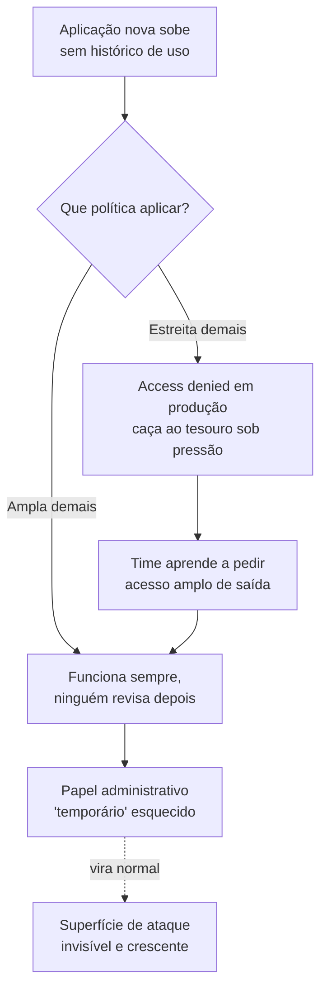
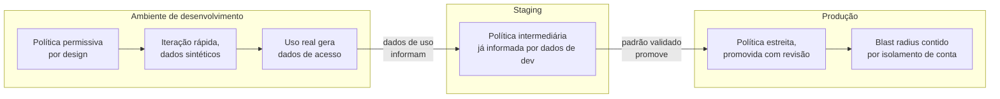

# Least privilege na prática

> [!abstract] TL;DR
> Least privilege — conceder só a permissão estritamente necessária, nem uma ação a mais — é fácil de enunciar e brutalmente difícil de operar sem travar o time, porque ninguém sabe de antemão a lista exata de ações que uma aplicação ou uma pessoa vai precisar. A saída madura não é adivinhar a política perfeita antes do primeiro deploy; é tratar permissão como algo que se **aperta com dados**, não que se acerta de primeira: comece permissivo o suficiente para não travar o trabalho, observe o que é de fato usado, gere a política a partir desse uso real, separe o que é permitido por ambiente, revise em cadência, e deixe guarda-corpos no nível da organização como rede de segurança, não como ferramenta do dia a dia. E não finja que apertar demais é de graça: quando a permissão vira obstáculo, as pessoas contornam — credencial compartilhada, papel administrativo "só por hoje" que nunca mais é revogado — e o sistema fica, na prática, menos seguro do que se a política tivesse sido pragmática desde o início.

## A permissão "temporária" que fez seis meses

Um engenheiro pede acesso administrativo à conta de produção para investigar um incidente às três da manhã — um serviço está devolvendo erro 500 em cascata, e ele precisa inspecionar recursos que sua permissão de rotina não alcança. O time de plataforma concede, na hora, porque é madrugada e o incidente está ativo: um papel com `AdministratorAccess`, anexado à identidade dele, com uma anotação no ticket dizendo "temporário — revogar depois do post-mortem". O incidente é resolvido em quarenta minutos. O post-mortem acontece uma semana depois, cobre causa raiz, ação corretiva, prazo de correção — e não menciona, em nenhuma linha, o papel administrativo que ainda está anexado à conta daquele engenheiro.

Seis meses depois, uma auditoria de segurança rotineira lista todas as identidades da conta de produção ordenadas por amplitude de permissão. O papel administrativo aparece no topo, com um único evento de uso registrado nos últimos 180 dias — a própria madrugada do incidente. O engenheiro nem lembra que ainda tem esse acesso; ele para de usar credenciais amplas no dia a dia, porque seu fluxo de trabalho normal nunca precisou delas. Mas a permissão continuou lá, o tempo inteiro, como uma porta destrancada num corredor que ninguém mais olha. Se a credencial daquele engenheiro vazasse num commit acidental, num laptop roubado, num phishing bem-sucedido, o raio de explosão seria a conta de produção inteira — não porque alguém decidiu, deliberadamente, que esse era o nível de risco aceitável, mas porque ninguém decidiu o contrário a tempo.

Esse é o padrão mais comum de falha de least privilege em produção, e ele não tem nada a ver com má-fé ou incompetência. O time de plataforma fez a coisa certa sob pressão — resolveu o incidente rápido, sem burocracia travando uma decisão urgente. O problema não é a concessão; é a ausência de um mecanismo que faça a permissão **voltar** ao normal sozinha, sem depender de alguém lembrar. E é exatamente esse mecanismo — o que faz permissão apertar de volta sem depender de memória humana — que esta nota constrói, peça por peça.

## Por que o princípio é fácil de dizer e difícil de fazer

A **nota 03** deste galho já mostrou a anatomia de uma política — efeito, ação, recurso, condição — e a lógica de avaliação que decide se uma chamada de API passa ou é barrada. A **nota 04** mostrou o padrão certo de credencial: assumir um papel e receber acesso temporário, em vez de carregar uma chave estática pra sempre. As duas notas anteriores resolveram *como* uma permissão é concedida e *que forma* essa concessão deveria ter. Esta nota ataca uma pergunta diferente e mais difícil: **quanto** conceder.

O princípio em si cabe numa frase que qualquer engenheiro sênior já ouviu: conceda a cada identidade — pessoa, serviço, pipeline — apenas as permissões estritamente necessárias para fazer o trabalho dela, nem uma a mais. Dito assim, soa óbvio, quase banal. O problema aparece no instante em que alguém tenta aplicar esse princípio a um sistema real, e esbarra numa pergunta que a frase bonita não responde: **necessário segundo quem, e sabido quando?**

Pense no caso mais comum: uma aplicação nova, que ainda não rodou em produção nenhuma vez. Que permissões exatas ela precisa? Em teoria, a resposta está no código — toda chamada de API que o código faz é uma permissão necessária, e nenhuma outra é. Na prática, ninguém lê o código inteiro de uma aplicação não-trivial linha por linha catalogando cada chamada de SDK que ela pode fazer, incluindo os caminhos de erro, os retries, os cron jobs esporádicos, as chamadas administrativas que só disparam uma vez por trimestre. E mesmo que alguém fizesse esse trabalho manualmente, o código muda na semana seguinte — uma feature nova, uma integração nova, uma dependência que passou a usar um serviço diferente por baixo — e a política ficaria desatualizada no primeiro deploy seguinte.

O resultado, na prática de quase todo time, é um dilema com dois lados ruins:

- **Errar para o lado estreito demais** trava o trabalho. A aplicação sobe, tenta uma chamada de API que ninguém previu, recebe "access denied", e o incidente vira uma caça ao tesouro: qual ação exatamente falta, em qual recurso, sob qual condição? Multiplique isso por dezenas de serviços e times, e o custo de oportunidade de ficar catando permissão faltante, uma de cada vez, sob pressão de prazo, supera de longe o valor de segurança que a política estreita deveria estar entregando.
- **Errar para o lado amplo demais** — a saída de menor resistência sob pressão — resolve o problema imediato e cria um problema maior, silencioso, que só aparece numa auditoria ou, pior, num incidente de segurança. É exatamente o padrão do papel administrativo "temporário" da abertura desta nota: amplo o bastante para nunca mais travar ninguém, e amplo o bastante para nunca mais ser questionado.

A tensão de fundo é que **nenhuma das duas opções é sustentável sozinha**, e é aqui que a maioria dos guias de segurança para de ser útil — eles enunciam o princípio, mostram um exemplo de política estreita e bem-comportada, e não dizem como um time real, sob pressão real, chega até lá sem travar ninguém no caminho. O resto desta nota é sobre isso: um conjunto de estratégias que um arquiteto sênior de fato usa para converter "least privilege" de slogan em prática operável.

## Estratégia 1 — começar permissivo, apertar com dados de uso

A primeira virada de postura que resolve o dilema acima é aceitar uma sequência em duas fases, em vez de tentar acertar a política de uma vez: **comece com uma política ampla o suficiente para não travar ninguém, deixe o sistema rodar sob carga real por um período definido, e então aperte a política com base no que foi de fato usado — não no que alguém *achou* que seria usado**.

Essa sequência não é preguiça disfarçada de estratégia; é o reconhecimento honesto de que, antes de rodar, ninguém — nem o desenvolvedor que escreveu o código, nem o arquiteto que revisou o desenho — tem visibilidade completa e confiável de todas as chamadas de API que aquele sistema vai fazer. O uso real é a única fonte de verdade que não depende de adivinhação.

Na AWS, esse ciclo tem ferramenta de primeira classe embutida: o **IAM Access Analyzer** rastreia, através dos eventos de gerenciamento registrados no CloudTrail, quais serviços e ações uma identidade (usuário ou papel) de fato usou num período configurável de até 90 dias, e disponibiliza essa informação de duas formas complementares. A primeira, chamada de **service last accessed information** (a AWS documenta como "informações de último acesso"), mostra, por identidade, quais serviços foram acessados e quando — útil para uma varredura rápida de "esse papel nunca tocou nesse serviço, por que ele tem permissão pra isso?". A segunda, mais granular, é a **geração de política a partir de atividade do CloudTrail**: você aponta o Access Analyzer para o histórico de eventos de uma identidade específica, ele examina o que foi de fato chamado, e devolve um rascunho de política já escrito — que você revisa, ajusta os recursos (a ferramenta preenche placeholders de ARN que você precisa substituir por recursos reais), e só então anexa no lugar da política ampla original.

> [!info] Caducidade
> Detalhes de interface, limites de retenção de dados (a AWS documenta um período de rastreamento de pelo menos 400 dias para informação de serviço, variável por região) e a lista de serviços com suporte a granularidade de ação mudam com frequência. Confira a documentação oficial antes de desenhar o processo do seu time.

Vale registrar as limitações honestas dessa ferramenta, porque um sênior que a usa sem conhecer as bordas vai ter surpresa desagradável: ela não rastreia `iam:PassRole` (uma ação estruturalmente importante para quem concede papéis a serviços, como visto na **nota 04**), não identifica ação a nível de detalhe para eventos de dados (por exemplo, chamadas individuais de leitura/escrita de objeto no S3 — só o nível de serviço), e a AWS é explícita que a ferramenta **não deve ser usada para fins de auditoria** — para isso, o CloudTrail continua sendo a fonte de verdade. A geração de política é uma ferramenta de *engenharia*, para reduzir escopo; não é uma ferramenta de *compliance*, para provar o que aconteceu.

Na **DigitalOcean**, esse ciclo de "gerar política a partir de uso real" não existe como recurso de produto. A documentação de Teams da DO cobre papéis pré-definidos (owner, biller, billing viewer, member, modifier, resource viewer) e, mais recentemente, custom roles — papéis com um conjunto de permissões escolhido pelo administrador — mas não há um equivalente ao Access Analyzer que examine o histórico de chamadas de API de uma identidade e sugira reduzir escopo automaticamente. Isso não é uma crítica gratuita à DO — reflete o tamanho do catálogo de serviços e a filosofia de simplicidade que a **nota 05 do galho 1** já discutiu — mas é uma lacuna real que um time DO precisa compensar com processo manual: revisão periódica de quem tem qual papel, e disciplina de perguntar "esse membro do time ainda usa esse acesso?" sem o apoio de dados automatizados de uso.

## Estratégia 2 — separar permissões por ambiente

A segunda estratégia ataca um erro comum que nasce de simplicidade mal aplicada: tratar a política de permissão como se fosse uma propriedade única do *código*, igual em todo lugar onde ele roda, em vez de uma propriedade do **ambiente** onde o código está rodando naquele momento.

A intuição errada é: "essa aplicação precisa dessas dez permissões pra funcionar, então ela tem essas dez permissões em todo lugar — dev, staging, produção — porque é o mesmo código". A intuição madura reconhece que o *risco* de um erro de permissão não é o mesmo nos três ambientes, e a política deveria refletir isso.

Em ambiente de **desenvolvimento**, o custo de uma permissão ampla demais é baixo — dados sintéticos, sem cliente real exposto, blast radius contido a recursos que ninguém depende de verdade — e o custo de uma permissão estreita demais é alto, porque é justamente ali que a maioria das descobertas de "ei, preciso de mais uma ação que eu não previ" acontece, e cada descoberta bloqueada custa tempo de um desenvolvedor tentando entender por que um `access denied` apareceu no meio de uma tarefa que não tem nada a ver com segurança. Faz sentido, portanto, que dev seja o ambiente mais permissivo, deliberadamente, como espaço de iteração rápida onde apertar demais a política atrapalha mais do que protege.

Em ambiente de **produção**, a equação se inverte por completo: o custo de uma permissão ampla demais é alto — é onde o dado real do cliente vive, onde uma ação destrutiva afeta gente de verdade, onde um vazamento de credencial tem consequência que aparece em manchete — e o custo de uma permissão estreita demais, embora ainda real, é aceitável, porque a essa altura o padrão de uso já deveria estar bem entendido (é justamente o que a Estratégia 1 produz: dados de uso real, coletados em ambientes anteriores, que informam a política final de produção).

O ponto prático que costura as duas pontas: a política de produção não deveria ser escrita do zero, ignorando o que dev e staging já ensinaram sobre o padrão de uso real daquela aplicação — ela deveria ser a política de dev ou staging, **já apertada pelos dados de uso** da Estratégia 1, promovida para produção com uma revisão adicional de quem tem permissão de aprovar mudança de política num ambiente sensível. Isolar contas ou projetos por ambiente (uma conta AWS separada para produção, um projeto DigitalOcean separado, prática que a **nota 01 do galho 2** já tocou ao falar de conta e organização) reforça esse isolamento no nível estrutural: mesmo que uma credencial de dev vaze, ela simplesmente não tem *como* alcançar produção, porque não existe uma política de política nenhuma que precise lembrar de negar isso — o isolamento de conta faz esse trabalho de graça.

## Estratégia 3 — revisão periódica, não confiança perpétua

A terceira estratégia responde diretamente ao problema da abertura desta nota: mesmo uma política bem apertada no dia em que foi criada **envelhece**. Um projeto termina e a integração que ele usava nunca é desligada. Um funcionário muda de time e o acesso do time anterior continua anexado à conta dele por meses, porque revogar acesso não costuma ser parte de nenhum checklist de mudança de função. Um incidente concede acesso amplo sob pressão, como visto na abertura, e ninguém tem a tarefa explícita de reverter.

A resposta estrutural a esse envelhecimento não é confiar que alguém vai lembrar — é colocar a revisão de permissão numa **cadência recorrente**, tratada com a mesma seriedade operacional de rotação de segredo ou patch de segurança: revisão trimestral (a cadência mais comum em times maduros, embora o intervalo certo dependa do apetite de risco de cada organização) de quem tem qual permissão, cruzada com dado de uso real — a mesma informação de "último acesso" da Estratégia 1, agora aplicada não a uma aplicação nova, mas ao **estoque inteiro de identidades e políticas já existentes**.

A AWS oferece essa mesma informação de último acesso agregada no nível de **AWS Organizations**: um administrador logado com credenciais da conta de gerenciamento pode gerar um relatório que mostra, para cada conta membro, quais serviços permitidos por uma política de organização foram de fato usados e quando. Isso transforma a revisão periódica de um exercício manual de "vasculhar política por política, pessoa por pessoa" — que ninguém tem tempo de fazer direito com regularidade — em uma consulta objetiva: liste identidades cuja permissão mais ampla não foi usada nos últimos N dias, e trate cada uma como candidata a redução, não como suspeita automática de má-fé. A pergunta que orienta essa revisão nunca é "quem fez algo errado?" — é "o que ainda é necessário, agora, dado o que a organização realmente faz hoje?".

Duas armadilhas comuns nessa cadência, vale nomear de saída: revisão que vira teatro (alguém aprova em lote, sem examinar de verdade, porque a revisão virou obrigação burocrática de calendário sem dono real) e revisão que ninguém executa porque não tem dono nomeado. A revisão periódica só funciona como controle de segurança de verdade quando tem um responsável nomeado, um prazo, e uma consequência real para o que ela encontra — não como item de checklist marcado sem leitura.

## Estratégia 4 — guarda-corpos no nível da organização

As três estratégias anteriores operam no nível da identidade individual — a política anexada a essa pessoa, a esse serviço, a esse papel específico. A quarta estratégia muda de camada: em vez de confiar que toda política individual, escrita por toda pessoa com permissão de escrever política, vai estar sempre correta, você estabelece um **teto** que nenhuma política individual, por mais permissiva que seja escrita por engano ou por pressa, consegue ultrapassar.

Na AWS, esse mecanismo tem nome: **Service Control Policy (SCP)**, um tipo de política do AWS Organizations. O ponto estrutural mais importante de uma SCP — e o que mais confunde quem está aprendendo — é que ela **nunca concede permissão nenhuma**. Uma SCP não é uma política de identidade like a das notas anteriores; ela é um filtro que define o **teto máximo** de permissão possível para todas as identidades das contas-membro às quais está anexada. O efeito de qualquer chamada de API é a interseção lógica entre o que a política de identidade permite e o que a SCP permite — mesmo que um administrador conceda `AdministratorAccess` a alguém por engano numa conta-membro, se a SCP daquela conta bloqueia uma ação específica, aquela ação continua bloqueada, ponto final, porque a SCP age como teto, não como voto adicional a favor.

Isso é exatamente o que torna a SCP valiosa como rede de segurança para o exato cenário da abertura desta nota: mesmo que um time de plantão conceda um papel administrativo amplo demais, sob pressão, às três da manhã, uma SCP bem desenhada pode impedir que aquele papel — mesmo administrativo — desative logging de auditoria, exclua o próprio CloudTrail, ou saia da região aprovada para os dados daquela organização. A permissão individual continua ampla; o teto organizacional garante que "amplo" não signifique "sem limite nenhum".

Duas ressalvas honestas, que separam quem usa SCP com maturidade de quem usa por moda: primeiro, a AWS recomenda explicitamente **não** anexar uma SCP restritiva direto na raiz da organização sem testar o impacto antes — a prática seria criar uma unidade organizacional separada, mover contas pra dentro dela aos poucos, e usar exatamente os dados de último acesso da Estratégia 1 e 3 para prever, antes de aplicar a SCP, quais serviços a conta realmente usa (evitando travar, por engano, algo que está em uso ativo). Segundo, SCPs não afetam a conta de gerenciamento da organização nem papéis vinculados a serviço (*service-linked roles*) — não são um substituto universal para política de identidade bem escrita, são um complemento estrutural que age numa camada acima dela.

Vale a lente dupla honesta aqui, e ela pesa: a DigitalOcean, na estrutura atual de Teams e custom roles, **não tem um mecanismo equivalente a SCP** — nenhum guardrail em nível de organização que imponha um teto além do controle do que cada papel individual concede. Os custom roles da DO permitem granularidade de permissão por membro do time, mas a documentação não descreve nenhum recurso que limite globalmente, de fora para dentro, o que um papel — mesmo um papel com muita permissão — pode fazer. Vale registrar também outra limitação prática: a criação de custom roles na DO, segundo a documentação vigente, acontece pelo painel de controle, sem suporte via API ou CLI — o que limita quanto desse processo pode ser automatizado ou versionado como código, uma diferença relevante para quem vem do hábito de tratar política como artefato de infraestrutura. Para um time que opera majoritariamente em DO e precisa desse tipo de teto organizacional, a saída realista é processo — a Estratégia 3, revisão periódica com dono nomeado, carrega mais peso relativo do que carregaria numa conta AWS com SCP fazendo parte do trabalho automaticamente.

> [!info] Fronteira
> Segurança na nuvem em profundidade — gestão de segredo, criptografia, modelagem de ameaça — é o assunto do **galho 18** desta trilha. Esta nota trata guarda-corpo de permissão como peça de disciplina de IAM, não como cobertura completa de postura de segurança.

## O custo humano de apertar demais

As quatro estratégias anteriores respondem "como apertar sem travar". Falta responder a metade que quase nenhum guia de segurança admite em voz alta: **apertar tem custo, e o custo não é abstrato — ele aparece como comportamento humano real, e esse comportamento costuma piorar a segurança, não melhorar.**

O mecanismo é simples de prever e fácil de observar em qualquer time que já viveu isso: quando uma permissão necessária para o trabalho do dia a dia é negada, a pessoa não para de trabalhar — ela contorna. E os contornos disponíveis são quase sempre piores, do ponto de vista de segurança, do que a permissão estreita que motivou o contorno em primeiro lugar.

O contorno mais comum é a **credencial compartilhada**: quando pedir acesso individual é lento demais ou burocrático demais, alguém do time com acesso mais amplo simplesmente compartilha a própria sessão, ou uma chave de acesso, com um colega que precisa terminar uma tarefa hoje. Isso destrói de uma vez o valor inteiro de ter identidade individual — a **nota 01** deste galho já estabeleceu que a nuvem trata toda chamada como autenticada e atribuível a uma identidade específica; uma credencial compartilhada apaga essa atribuição, porque agora uma ação registrada em log pode ter sido feita por qualquer uma das pessoas que têm acesso àquela credencial, e investigar um incidente de segurança vira adivinhação em vez de rastreamento direto.

O segundo contorno, mais silencioso e mais perigoso a longo prazo, é exatamente o padrão da abertura desta nota: o **papel administrativo "temporário" que nunca é revogado**. Uma vez que alguém descobre que pedir acesso amplo sob pretexto de urgência é mais rápido do que pedir o acesso específico e correto, o pretexto de urgência começa a aparecer com mais frequência do que justificaria — não por má-fé, mas porque é o caminho de menor resistência que o próprio processo de segurança ensinou a usar. Cada concessão amplia, silenciosamente, o número de identidades com blast radius desproporcional ao trabalho real que elas fazem — e, como a Estratégia 3 mostrou, nada disso aparece como problema até uma auditoria, ou até um incidente, olhar de frente.

O ponto que um arquiteto sênior precisa internalizar, e que separa maturidade de dogmatismo: **política de permissão que atrapalha o trabalho legítimo não é "mais segura por ser mais restritiva" — ela é menos segura, porque desloca o comportamento das pessoas para fora do sistema de controle, para um espaço onde não existe log, não existe expiração automática, não existe revisão**. A pergunta certa nunca é "essa política é a mais restritiva possível?" — é "essa política é restritiva o bastante para reduzir risco real, sem ser restritiva a ponto de empurrar as pessoas para um caminho que eu não consigo ver?". As quatro estratégias desta nota — começar permissivo e apertar com dado, separar por ambiente, revisar em cadência, e usar guarda-corpo organizacional como rede — existem justamente para dar ao time uma forma de chegar numa política estreita **sem nunca precisar passar pelo estágio em que ela trava alguém o suficiente para gerar um contorno**. É esse equilíbrio, não a estreiteza da política em si, que é o verdadeiro objetivo de least privilege bem aplicado.

> [!warning] Tratar "access denied" recorrente como falha do usuário, não da política
> Quando a mesma pessoa ou o mesmo serviço bate em "access denied" repetidamente para completar uma tarefa legítima e recorrente, o problema quase nunca é falta de atenção de quem pede acesso — é sinal de que a política está mal calibrada para o padrão de trabalho real daquele time. Tratar isso como "o usuário devia ter pedido a permissão certa desde o início" ignora que o próprio processo de pedir e aprovar permissão pode estar lento ou opaco demais para ser seguido de boa-fé sob prazo.

> [!warning] Confundir "least privilege" com "o menor número de permissões escritas"
> Uma política com uma única linha de wildcard amplo (`"Action": "*"`) tecnicamente "tem menos linhas" do que uma política longa e granular — mas é o oposto de least privilege. O critério nunca é o tamanho do documento; é a distância entre o que a política permite e o que a identidade de fato usa. Uma política curta e ampla está, quase sempre, mais longe desse alvo do que uma política longa e granular.

> [!warning] Revisar permissão só depois de um incidente
> Times que só olham para o estoque de permissões concedidas depois que algo já deu errado estão usando revisão como resposta a incidente, não como prevenção. A cadência da Estratégia 3 só entrega valor de segurança de verdade quando roda como rotina agendada, com dono nomeado, independente de haver ou não um incidente recente motivando a atenção.

## Casos práticos

**A função sob demanda com política copiada de outra função.** Um desenvolvedor cria uma nova função sob demanda e, com pressa, copia a política de execução de uma função existente que já tinha acesso amplo a um bucket de armazenamento inteiro — em vez de escrever uma política nova, restrita ao prefixo específico que a nova função de fato usa. Meses depois, um bug na nova função (não malicioso, só um erro de lógica) apaga objetos fora do escopo que ela deveria tocar, porque a permissão nunca impediu isso. O incidente não foi causado por um atacante; foi causado por uma política que nunca refletiu o uso real, só o hábito de copiar e colar.

**O pipeline de CI/CD com permissão de produção "porque é mais simples".** Um time configura seu pipeline de integração contínua com uma única credencial que tem acesso a todos os ambientes — dev, staging, produção — porque separar por ambiente exigiria configurar credenciais diferentes em pontos diferentes do pipeline, e isso parecia trabalho extra sem benefício aparente no dia do setup. Quando essa credencial única vaza — por um log mal configurado que registra variável de ambiente, por exemplo — o raio de explosão é o pipeline inteiro, em todos os ambientes ao mesmo tempo, não só o ambiente onde o vazamento aconteceu. É a Estratégia 2 (separação por ambiente) sendo pulada por conveniência de curto prazo, com o preço pago integralmente do lado errado da equação de risco.

**A revisão trimestral que encontrou trinta identidades órfãs.** Um time de plataforma, ao rodar pela primeira vez uma revisão de permissão cruzada com dado de último acesso, encontra trinta papéis com permissão ampla e zero uso registrado nos últimos noventa dias — a maioria criada para projetos que já terminaram, ou para pessoas que já trocaram de time. Nenhum desses papéis era, individualmente, um incidente de segurança; juntos, representavam uma superfície de ataque real que ninguém tinha visibilidade de que existia, até a revisão perguntar a pergunta certa com dado real por trás.

## O que vem a seguir

Esta nota tratou de apertar permissão **dentro** de uma identidade e de uma conta — o quanto uma pessoa, um serviço ou um papel pode fazer, ali onde ele já vive. Mas fica em aberto uma pergunta que qualquer organização com mais de uma conta ou mais de um provedor de identidade corporativo precisa responder: como uma identidade **atravessa fronteiras** — de uma conta para outra, de um provedor de identidade da empresa para dentro da nuvem, de um pipeline de CI/CD para dentro de uma conta de produção — sem que isso signifique copiar credencial de um lado para o outro. É exatamente esse problema que a próxima nota, **"Identidade entre contas e federação"**, resolve — e ela fecha o galho inteiro de Identidade e acesso.

## Fontes

- [AWS IAM — IAM Access Analyzer policy generation](https://docs.aws.amazon.com/IAM/latest/UserGuide/access-analyzer-policy-generation.html) — documentação oficial sobre geração de política a partir de atividade real do CloudTrail, incluindo limitações (PassRole não rastreado, eventos de dado não cobertos); acessado em 2026-07-20.
- [AWS IAM — Refine permissions using last accessed information](https://docs.aws.amazon.com/IAM/latest/UserGuide/access_policies_access-advisor.html) — documentação oficial sobre informação de último acesso por identidade e por AWS Organizations, período de rastreamento e permissões necessárias; acessado em 2026-07-20.
- [AWS Organizations — Service control policies (SCPs)](https://docs.aws.amazon.com/organizations/latest/userguide/orgs_manage_policies_scps.html) — documentação oficial sobre SCPs como teto de permissão (nunca concessão), recomendação de teste antes de aplicar na raiz, e uso de dado de acesso para refinar SCPs; acessado em 2026-07-20.
- [AWS Security Blog — Techniques for writing least privilege IAM policies](https://aws.amazon.com/blogs/security/techniques-for-writing-least-privilege-iam-policies/) — técnicas recomendadas pela AWS para reduzir escopo de política, incluindo ABAC e revisão de dado de uso real; acessado em 2026-07-20.
- [DigitalOcean — Teams (documentação oficial)](https://docs.digitalocean.com/platform/teams/) — visão geral do modelo de times, papéis e monitoramento de uso de recursos; acessado em 2026-07-20.
- [DigitalOcean — Teams Custom Roles (documentação oficial)](https://docs.digitalocean.com/platform/teams/roles/custom/) — granularidade de permissão por papel personalizado, ausência de guardrail equivalente a SCP, e limitação de criação apenas via painel de controle; acessado em 2026-07-20.
