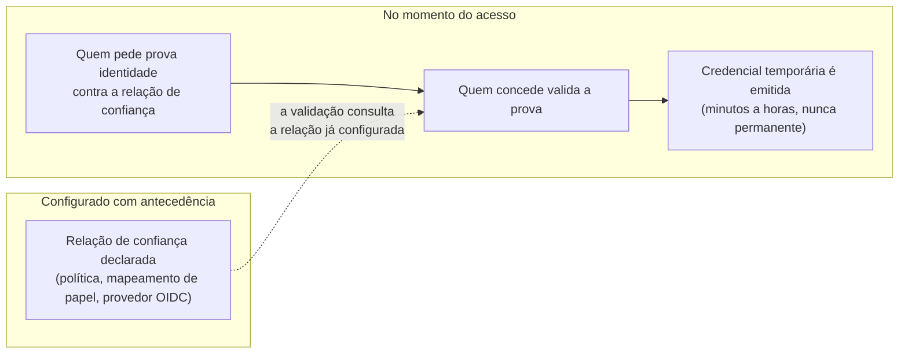
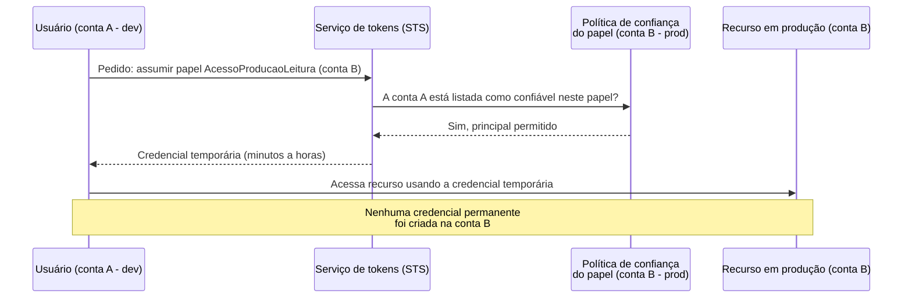
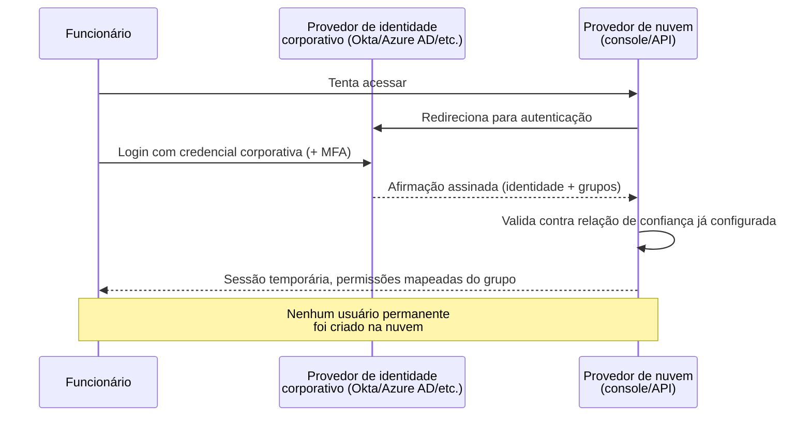
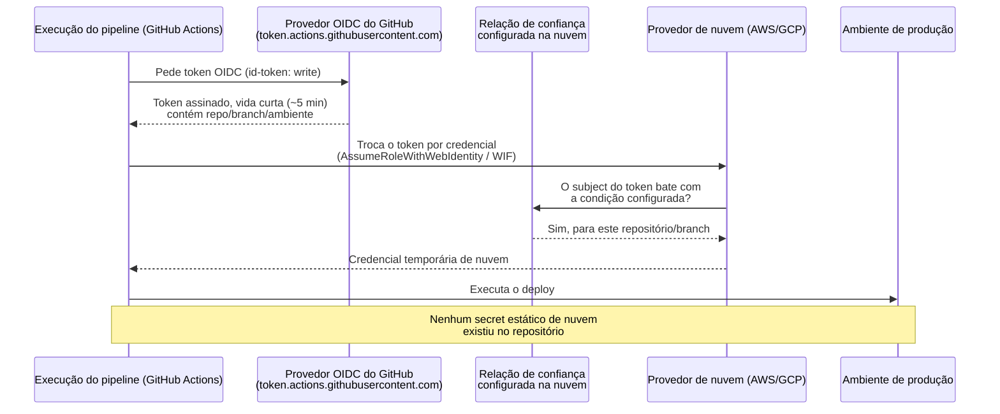

# Identidade entre contas e federação

> [!abstract] TL;DR
> Esta nota fecha o galho de identidade resolvendo três variações do mesmo problema: como provar quem você é para um limite de confiança que não é o seu, sem nunca copiar um segredo através dele. Entre contas, isso é assumir um papel na conta vizinha via política de confiança e obter credencial temporária do STS. Para gente, isso é federar a identidade corporativa — o funcionário nunca ganha uma conta nativa na nuvem, só uma sessão temporária emitida depois que o provedor de identidade da empresa o autentica. Para um pipeline de CI/CD, é a mesma lógica aplicada a uma carga de trabalho não-humana: a esteira prova, com um token de vida curtíssima emitido pelo próprio provedor de CI, que é *aquele* workflow específico, e troca esse token por uma credencial de nuvem que expira em minutos — fechando, finalmente, o arco que a **nota 02** abriu com o problema da chave estática guardada em repositório. Nos três casos, o padrão é idêntico: confiança declarada antecipadamente entre duas partes, prova de identidade no momento do uso, credencial que nasce já com prazo de validade. A DigitalOcean tem parte dessa história — SSO real via OIDC para Teams — mas não tem, hoje, um equivalente maduro de assunção de papel entre contas nem de identidade de carga de trabalho para CI/CD em produção; isso é informação, não uma crítica gratuita.

## O relatório de auditoria que ninguém queria ler

Uma empresa de médio porte contrata uma auditoria externa de segurança antes de fechar uma rodada de investimento. O relatório final tem 40 páginas, mas três achados, lidos em sequência, contam a história inteira do que este galho vem construindo.

O primeiro achado: um engenheiro sênior do time de plataforma tem, hoje, um usuário IAM cadastrado manualmente em cada uma das seis contas AWS da empresa — desenvolvimento, homologação, produção, e três contas de clientes isoladas por exigência contratual. Seis usuários, seis pares de credenciais, seis lugares onde alguém precisa lembrar de revogar acesso no dia em que esse engenheiro sair da empresa. O auditor não encontrou nenhuma credencial vazada — encontrou algo mais silencioso e mais perigoso: uma superfície de revogação espalhada por seis lugares diferentes, nenhum deles com garantia de estar sincronizado com os outros.

O segundo achado: dos 34 funcionários com algum tipo de acesso à conta de produção, 11 são ex-funcionários. O processo de desligamento da empresa revoga o acesso ao Slack, ao e-mail corporativo, ao sistema de RH — mas ninguém, em nenhuma das saídas dos últimos dois anos, lembrou de checar se aquela pessoa também tinha um usuário IAM ativo na AWS, criado meses antes por um administrador que também já não trabalha mais ali.

O terceiro achado é o que mais incomoda o time técnico ao ler: o pipeline de deploy do produto principal se autentica na AWS usando uma chave de acesso estática, gerada há três anos, armazenada como *secret* no repositório de CI/CD. Ninguém no time atual sabe ao certo quem criou essa chave, ela nunca foi rotacionada, e ela tem permissão de escrita em produção porque, num momento de pressa esquecido no tempo, alguém preferiu dar a ela permissão ampla a gastar uma tarde configurando algo mais fino. Essa chave é, literalmente, o mesmo problema que a **nota 02** desta trilha já batizou — a credencial que não expira, que sobrevive a qualquer coisa, que ninguém sabe onde mais está copiada — só que, dessa vez, quem carrega a credencial não é uma pessoa. É uma máquina que roda sozinha, toda vez que alguém faz *merge* numa branch.

Três achados, um só padrão de fundo: em algum ponto, alguém decidiu que a forma mais rápida de dar acesso era **copiar uma credencial** para o lado que precisava dela — um usuário por conta, uma chave gravada num painel de CI, uma senha compartilhada num gerenciador de segredos que ninguém audita com frequência. Cada cópia é um lugar a mais onde a credencial pode vazar, um lugar a mais que alguém precisa lembrar de revogar, um lugar a mais onde ela pode ficar esquecida por anos depois que o motivo original desapareceu.

Esta nota resolve os três achados com a mesma ideia, aplicada três vezes.

## O padrão que se repete: confiar antes, provar depois, nunca copiar

A **nota 04** desta trilha já introduziu a peça central: em vez de carregar uma credencial permanente, uma identidade pode **assumir um papel** e receber, em troca, uma credencial temporária — válida por minutos ou horas, gerada sob demanda, inútil depois que expira. Essa nota tratou o caso mais simples: um usuário ou um serviço assumindo um papel *dentro da mesma conta*.

O que esta nota acrescenta é generalizar essa mesma mecânica para três fronteiras de confiança mais largas, onde o lado que precisa de acesso não vive no mesmo lugar que o recurso:

1. **Entre contas** — um usuário (ou uma aplicação) que vive na conta A precisa acessar um recurso que vive na conta B, sem que a conta B precise cadastrar um usuário duplicado para essa pessoa.
2. **Entre organizações** — um funcionário cuja identidade "de verdade" vive no diretório corporativo da empresa (não na nuvem) precisa acessar recursos na nuvem, sem que a nuvem precise manter uma cópia paralela e permanente daquela identidade.
3. **Entre sistemas, sem humano no meio** — um pipeline de CI/CD, que não é uma pessoa e não tem senha, precisa acessar recursos na nuvem só durante a execução de um deploy, sem carregar uma chave estática o resto do tempo.

Em todos os três casos, a resposta segue o mesmo roteiro de três atos: primeiro, alguém configura **antecipadamente** uma relação de confiança declarada (não implícita, não "porque sim") entre quem vai pedir acesso e quem vai concedê-lo. Segundo, no momento em que o acesso é de fato necessário, quem pede prova sua identidade contra essa relação de confiança — sem nunca transmitir um segredo de longa duração pela fronteira. Terceiro, quem concede devolve uma credencial que já nasce com prazo de validade, boa apenas para aquela sessão, inútil um pouco depois.



O resto desta nota mostra essa forma se repetindo três vezes, cada vez um pouco mais distante da nota 04.

A tabela abaixo resume os três mecanismos antes de entrar em cada um.

| Mecanismo | Quando usar | O que substitui |
|---|---|---|
| Assunção de papel entre contas (`AssumeRole` + STS) | Mesma organização, múltiplas contas de nuvem (dev/hml/prod, contas de cliente isoladas) | Usuário IAM duplicado em cada conta |
| Federação SAML 2.0 (ex.: IAM Identity Center) | Força de trabalho humana, IdP corporativo já existente, precisa de SSO amplo (console + várias contas) | Usuário nativo de nuvem criado e mantido por pessoa |
| Federação OIDC de identidade de carga de trabalho | Sistema não-humano (pipeline de CI/CD, workload fora da nuvem) que precisa de credencial só durante a execução | Chave de acesso estática gravada em *secret* |

## Acesso entre contas: assumir um papel além da fronteira da conta

Volte ao primeiro achado do relatório de auditoria: seis contas, seis usuários duplicados para a mesma pessoa. A forma ingênua de resolver isso — dar a essa pessoa um usuário permanente em cada conta — é exatamente o antipadrão que a nota 02 já condenou, só que multiplicado por seis. A forma correta usa o mesmo mecanismo de assunção de papel da nota 04, estendido através da fronteira de conta.

O desenho funciona assim: na conta de produção (a "conta B", dona do recurso), um administrador cria um papel — chame-o de `AcessoProducaoLeitura` — e escreve, na **política de confiança** desse papel, quem tem permissão de assumi-lo. Em vez de listar usuários individuais dessa mesma conta, a política de confiança nomeia a **conta A inteira** (pela identificação numérica da conta) ou um papel específico dentro dela como *principal* confiável. Separadamente, dentro da conta A, um administrador concede a usuários ou grupos específicos a permissão de *chamar* a operação de assumir aquele papel específico na conta B.

O efeito prático: um desenvolvedor logado normalmente na conta de desenvolvimento (conta A), com seu usuário de sempre, pode — se estiver no grupo autorizado — **trocar de papel** para o `AcessoProducaoLeitura` da conta B. Ao fazer isso, ele não usa uma segunda senha, não recebe um segundo usuário: ele pede ao serviço de tokens de segurança da nuvem (na AWS, o STS — *Security Token Service*) para trocar sua identidade atual por uma credencial temporária válida só para aquele papel, só naquela conta, só pelo tempo configurado. Enquanto estiver "vestindo" esse papel, suas permissões originais da conta A ficam suspensas — ele só pode fazer o que o papel `AcessoProducaoLeitura` permite, nada mais. Ao sair do papel, suas permissões de origem voltam.



Todo `AssumeRole` — dentro da mesma conta ou entre contas — gera um evento no CloudTrail, o que torna a assunção de papel auditável de um jeito que um usuário IAM compartilhado nunca é: dá para responder "quem assumiu este papel, e quando" com uma consulta, não com um processo manual de investigação.

```bash
aws cloudtrail lookup-events \
  --lookup-attributes AttributeKey=EventName,AttributeValue=AssumeRole \
  --start-time 2026-07-01 \
  --end-time 2026-07-20
```

Repare no que desapareceu dessa equação: **nenhuma credencial atravessou a fronteira entre as contas**. Ninguém copiou uma senha, uma chave, um token de longa duração da conta A para a conta B. O que atravessou a fronteira foi só uma **prova momentânea de identidade**, validada contra uma relação de confiança que já estava configurada antes de qualquer pedido acontecer — exatamente o roteiro de três atos descrito na seção anterior.

Esse desenho resolve, de uma vez, os dois primeiros problemas do relatório de auditoria. Não existem mais seis usuários duplicados — existe um usuário na conta de origem e uma política de confiança em cada conta de destino, apontando de volta para essa origem. E o desligamento de um funcionário vira uma operação única: remover a pessoa do grupo autorizado na conta A automaticamente corta o acesso dela a todas as seis contas, porque nenhuma delas guarda uma cópia independente e permanente da identidade dela.

Vale uma camada extra de rigor, para quem for além do caso mais simples: quando a conta que concede o papel não pertence à mesma organização — um fornecedor externo, uma consultoria, um parceiro de integração —, a política de confiança normalmente exige, além do identificador da conta, um valor secreto adicional chamado *external ID*, combinado entre as duas partes fora da própria configuração de IAM. Esse detalhe existe para fechar uma brecha específica conhecida como **problema do confuso intermediário** (*confused deputy problem*): sem o external ID, um terceiro mal-intencionado que descobrisse o nome exato do papel poderia, em teoria, tentar assumi-lo se conseguisse convencer a conta certa a fazer o pedido em seu nome. Esse detalhe fica registrado aqui como algo a verificar sempre que a relação de confiança atravessa fronteira organizacional, não só fronteira de conta dentro da mesma empresa.

### Como isso fica em JSON e no terminal

A política de confiança do papel `AcessoProducaoLeitura`, criada na conta B (produção, `123456789012`), autorizando a conta A (`111122223333`) a assumi-lo — com o `ExternalId` recomendado para o caso de fronteira organizacional:

```json
{
  "Version": "2012-10-17",
  "Statement": [
    {
      "Effect": "Allow",
      "Principal": {
        "AWS": "arn:aws:iam::111122223333:root"
      },
      "Action": "sts:AssumeRole",
      "Condition": {
        "StringEquals": {
          "sts:ExternalId": "combinado-fora-de-banda-com-o-parceiro"
        }
      }
    }
  ]
}
```

Do lado da conta A, o desenvolvedor autorizado troca sua sessão atual por uma credencial temporária chamando o STS diretamente:

```bash
aws sts assume-role \
  --role-arn arn:aws:iam::123456789012:role/AcessoProducaoLeitura \
  --role-session-name debug-incidente-42 \
  --external-id combinado-fora-de-banda-com-o-parceiro
```

A resposta traz uma credencial de três partes (chave de acesso, chave secreta, token de sessão) com um prazo de validade explícito — por padrão, uma hora:

```json
{
  "Credentials": {
    "AccessKeyId": "ASIAJEXAMPLEXEG2JICEA",
    "SecretAccessKey": "9drTJvcXLB89EXAMPLELB8923FB892xMFI",
    "SessionToken": "AQoXdzELDDY//////////wEaoAK1wvxJY...",
    "Expiration": "2026-07-20T15:05:07Z"
  },
  "AssumedRoleUser": {
    "AssumedRoleId": "AROA3XFRBF535PLBIFPI4:debug-incidente-42",
    "Arn": "arn:aws:sts::123456789012:assumed-role/AcessoProducaoLeitura/debug-incidente-42"
  }
}
```

Passado o horário em `Expiration`, essas três credenciais param de funcionar sozinhas — sem nenhuma ação de revogação manual, sem ninguém precisando lembrar de desativar nada. É a mesma lógica da nota 04, só que atravessando uma fronteira de conta em vez de ficar dentro de uma.

Vale notar a diferença entre as duas políticas que compõem esse desenho, porque times juniores costumam confundi-las: a política de confiança (acima) responde só "quem pode tentar assumir este papel"; uma segunda política, a de **permissões**, anexada ao mesmo papel, responde "o que essa sessão pode fazer depois de assumido" — e é ela quem aplica o menor privilégio que a **nota 05** já detalhou:

```json
{
  "Version": "2012-10-17",
  "Statement": [
    {
      "Effect": "Allow",
      "Action": [
        "s3:GetObject",
        "s3:ListBucket"
      ],
      "Resource": [
        "arn:aws:s3:::producao-relatorios",
        "arn:aws:s3:::producao-relatorios/*"
      ]
    }
  ]
}
```

Sem essa segunda política, um papel corretamente restrito por confiança ainda poderia, em tese, ter permissão administrativa total — a fronteira de "quem entra" e a fronteira de "o que faz lá dentro" são independentes, e as duas precisam estar certas ao mesmo tempo.

Vale registrar também que essa vigilância não precisa ser manual: a própria AWS documenta o **IAM Access Analyzer** como a ferramenta pensada exatamente para essa pergunta — ele varre continuamente as políticas de confiança de uma organização e sinaliza, de forma proativa, qualquer papel que se tornou acessível a um *principal* fora da zona de confiança esperada (uma conta externa não prevista, um provedor OIDC mal escopado). Numa empresa com dezenas de contas, contar com essa varredura automatizada é o que torna praticável o item do checklist "nenhuma relação de confiança está ampla demais" — sem ela, a única forma de descobrir uma política de confiança errada é o mesmo jeito que o relatório de auditoria desta nota usou: um auditor externo, lendo política por política, uma vez a cada rodada de investimento.

> [!info] Lente dupla: acesso entre contas
> Na **AWS**, esse padrão é maduro, nativo e é o jeito recomendado de organizar múltiplas contas — a própria AWS incentiva o uso de contas separadas por ambiente ou por unidade de negócio justamente porque o mecanismo de papel entre contas torna essa separação barata de operar.
> Na **DigitalOcean**, o modelo é mais simples e não tem um equivalente direto: a unidade organizacional é o **Team**, e uma pessoa participa de um Team sendo convidada como membro dele, com um papel fixo (por exemplo, Owner ou Member) — não existe uma operação de "assumir temporariamente um papel" de um Team em outro, análoga ao `AssumeRole` da AWS. Se a sua empresa mantém múltiplos Teams na DO (um por ambiente, por exemplo), o isolamento entre eles hoje se resolve por convite de membro e gestão manual, não por uma política de confiança programável entre contas. É uma lacuna real do modelo mais enxuto da DO, coerente com a proposta de simplicidade que a **nota 01** já descreveu — não um detalhe de documentação faltando.

## Federação: a identidade corporativa como única fonte de verdade

O segundo achado do relatório — 11 ex-funcionários ainda com acesso ativo à produção — não se resolve só melhorando o processo de desligamento. Ele se resolve eliminando, de saída, a pergunta "esse funcionário tem um usuário na nuvem?" — porque a resposta correta é: **nenhum funcionário deveria ter um usuário nativo e permanente na nuvem**, criado e mantido separadamente do sistema que já é a fonte de verdade sobre quem trabalha na empresa.

Toda empresa de porte médio para cima já tem um diretório de identidade corporativo — um provedor de identidade (*identity provider*, IdP) como Okta, Azure AD (hoje formalmente Microsoft Entra ID), Google Workspace, ou um Keycloak operado internamente — que já sabe quem é funcionário, quem foi desligado, e a que grupo ou departamento cada pessoa pertence. Esse diretório já existe porque a empresa precisa dele para o e-mail corporativo, para o Slack, para dezenas de outros sistemas internos. **Federação de identidade** é a decisão de tornar esse diretório também a fonte de verdade para o acesso à nuvem, em vez de manter um segundo diretório paralelo — os usuários IAM nativos do provedor de nuvem — que inevitavelmente saem de sincronia com o primeiro.

O mecanismo, em alto nível, é o seguinte: a empresa configura uma relação de confiança entre o provedor de nuvem e o IdP corporativo, dizendo, essencialmente, "eu confio em qualquer afirmação de identidade que você assinar". Quando um funcionário tenta acessar o console da nuvem, ele não digita uma senha específica daquela nuvem — ele é redirecionado para autenticar no IdP corporativo (o mesmo login que já usa para o resto do dia de trabalho), o IdP o autentica com as próprias regras da empresa (senha, segundo fator, política de dispositivo gerenciado, o que for exigido), e devolve para o provedor de nuvem uma **afirmação assinada** — dizendo, em essência, "esta pessoa é fulano, pertence a estes grupos, e eu, IdP em quem você já disse confiar, garanto isso". O provedor de nuvem valida essa afirmação contra a relação de confiança já configurada e, só então, emite uma sessão — temporária, mapeada para um conjunto de permissões definido pelo grupo daquele funcionário no IdP, nunca um usuário permanente criado especificamente na nuvem.



O ganho concreto sobre o achado da auditoria é direto: quando o funcionário sai da empresa, o time de RH desativa a conta dele **uma única vez**, no IdP corporativo — o mesmo passo que já revoga o e-mail e o Slack. No instante seguinte, ele não consegue mais autenticar em lugar nenhum que confie nesse IdP, incluindo a nuvem, porque a nuvem nunca teve uma conta separada dele para esquecer de desativar. A superfície de revogação, que no achado original estava espalhada por seis contas, agora está concentrada num único lugar — o sistema que já é, de qualquer forma, o processo de desligamento da empresa.

> [!info] Ponte — protocolos de federação
> A afirmação assinada trocada entre o IdP corporativo e o provedor de nuvem usa, na prática, um de dois protocolos padronizados: **SAML 2.0** ou **OpenID Connect (OIDC)**. Esta nota não reexplica como esses protocolos funcionam por dentro — o que é uma asserção SAML, o que é um *ID token* OIDC, como a assinatura é verificada — porque esse território já tem casa própria neste vault: [[03-Dominios/Engenharia/Auth e Identidade/index|Auth e Identidade]]. O que importa aqui é só o efeito na nuvem: federação elimina a necessidade de um segundo diretório de identidade, mantido em paralelo e fadado a ficar desatualizado.

Do lado puramente operacional — sem entrar no que uma asserção SAML contém por dentro —, registrar o IdP corporativo como emissor confiável na AWS é, na prática, uma chamada de API que sobe o metadado XML publicado pelo IdP:

```bash
aws iam create-saml-provider \
  --name IdPCorporativoOkta \
  --saml-metadata-document file://okta-federation-metadata.xml
```

A partir daí, o papel que os funcionários federados vão assumir referencia esse provedor no lugar de uma conta ou usuário, e o resto do roteiro — política de confiança validando a origem, STS emitindo credencial temporária — é o mesmo já visto na seção anterior.

O passo que fecha o ciclo — mapear um grupo do IdP para um conjunto de permissões numa conta específica — é uma atribuição declarativa no IAM Identity Center, não uma configuração manual dentro de cada conta:

```bash
aws sso-admin create-account-assignment \
  --instance-arn arn:aws:sso:::instance/ssoins-1234567890abcdef \
  --target-id 123456789012 \
  --target-type AWS_ACCOUNT \
  --permission-set-arn arn:aws:sso:::permissionSet/ssoins-1234567890abcdef/ps-a1b2c3d4e5f6a7b8 \
  --principal-type GROUP \
  --principal-id a1b2c3d4-5678-90ab-cdef-1234567890ab
```

Repare que o `principal-type` aceita `GROUP` — é essa linha que faz o mapeamento ser feito por grupo do diretório corporativo, não por pessoa: adicionar alguém ao grupo certo no IdP já basta para conceder o acesso equivalente na conta, sem tocar em nada dentro da AWS.

> [!info] Lente dupla: federação com IdP corporativo
> Na **AWS**, o serviço dedicado a isso é o **IAM Identity Center** (nome anterior: AWS SSO): ele centraliza o login federado via SAML 2.0 ou SCIM (para provisionamento automático de usuários e grupos a partir do IdP), e mapeia grupos do IdP para conjuntos de permissões em uma ou várias contas AWS de uma vez — inclusive nas múltiplas contas que a seção anterior descreveu. Para aplicações (não pessoas) que rodam fora da AWS e precisam de credencial de nuvem, a AWS também aceita federação via OIDC diretamente, sem passar pelo IAM Identity Center — é o mecanismo que a próxima seção detalha para CI/CD.
> Na **DigitalOcean**, existe SSO real para **Teams**, mas com um contorno mais estreito: a DO aceita federação com qualquer provedor **compatível com OIDC** (a documentação traz guias de configuração dedicados para Okta, Auth0, authentik, JumpCloud e Keycloak) — mas, ao contrário da AWS, **não tem suporte nativo a SAML** para esse fluxo, e a lista oficial de integrações testadas não inclui Azure AD/Entra ID nem Google Workspace por nome (ambos podem funcionar via um conector OIDC genérico, mas sem guia dedicado). Na prática, isso raramente é um obstáculo, porque a maioria dos IdPs corporativos modernos fala os dois protocolos — mas é um detalhe a checar antes de assumir que a configuração vai ser idêntica à da AWS.

## Identidade de carga de trabalho: fechando o arco da chave estática

Chegou a hora de resolver o terceiro achado — a chave estática de três anos, gravada num *secret* de CI/CD, com permissão de escrita em produção. Esse é, dos três, o problema mais recente na história da indústria de nuvem, e também o mais instrutivo, porque ele mostra a mesma ideia de federação aplicada a algo que **não é uma pessoa**.

Volte à raiz do problema, do jeito que a **nota 02** já a descreveu para usuários humanos: uma chave de acesso estática não expira sozinha, precisa ser gerada, copiada, guardada em algum lugar, e rotacionada manualmente — e cada um desses passos é uma chance de erro ou de vazamento. Um pipeline de CI/CD tradicional sofre exatamente do mesmo mal, só que sem nenhuma das mitigações que normalmente cercam uma pessoa: ninguém aplica MFA a um *secret* de repositório, ninguém percebe imediatamente quando ele é copiado para um segundo lugar "só para testar rapidinho", e — como o relatório de auditoria mostrou — o conhecimento de quem criou aquela chave e por quê tende a se perder com o tempo, muito mais rápido do que se perde o conhecimento sobre uma pessoa que ainda trabalha na empresa.

A resposta moderna aplica o mesmo roteiro de três atos das seções anteriores, trocando "pessoa" por "execução específica de um workflow". O provedor de CI/CD — GitHub Actions é o exemplo mais comum hoje, mas GitLab CI e outros seguem o mesmo desenho — já opera, ele próprio, um provedor de identidade OIDC. A cada execução de um workflow, esse provedor pode emitir um **token OIDC de vida curtíssima** (minutos), assinado, contendo afirmações verificáveis sobre aquela execução específica: de que repositório ela veio, em que branch ou ambiente, disparada por qual evento.

Do lado da nuvem, um administrador configura, **com antecedência** — de novo, o primeiro ato do roteiro —, uma relação de confiança que registra o provedor OIDC do GitHub como emissor confiável, e restringe explicitamente **quais tokens** dele são aceitos: normalmente, condicionando a aceitação ao valor exato do campo *subject* do token, que embute o nome do repositório e, opcionalmente, a branch ou o ambiente de origem. Isso significa que a relação de confiança não diz "eu confio em qualquer coisa que o GitHub assine" — diz "eu confio especificamente em execuções do workflow de deploy do repositório `empresa/produto-principal`, disparadas a partir da branch `main`", e recusa qualquer token que não bata exatamente com essa condição.

No momento em que o pipeline roda, ele pede ao próprio GitHub esse token OIDC (isso exige declarar, no arquivo do workflow, a permissão `id-token: write` — um passo explícito e visível, não um comportamento implícito), e o entrega ao provedor de nuvem em troca de uma credencial temporária. Na AWS, essa troca é a operação `AssumeRoleWithWebIdentity`; no GCP, o mecanismo equivalente se chama **Workload Identity Federation** — um *pool* de identidade de carga de trabalho e um provedor dentro dele validam o token e, em vez de emitir uma credencial diretamente, autorizam a execução a **personificar** uma conta de serviço já existente, herdando as permissões dela por um período curto. Nos dois casos, o resultado prático é idêntico: nenhuma chave de longa duração jamais existiu num *secret* de repositório. O que existiu foi um token que nasceu, foi usado, e expirou — tipicamente em cinco minutos — tudo dentro de uma única execução de pipeline.



### Como isso fica configurado, ponta a ponta

Do lado da nuvem, o primeiro passo é registrar o provedor OIDC do GitHub como emissor confiável — uma operação única, feita uma vez por conta:

```bash
aws iam create-open-id-connect-provider \
  --url https://token.actions.githubusercontent.com \
  --client-id-list sts.amazonaws.com
```

O `--thumbprint-list` é opcional: se omitido, o próprio IAM busca o *thumbprint* atual da cadeia de certificação — evita gravar manualmente um valor que muda quando o GitHub rotaciona sua CA intermediária, um detalhe que já pegou times de surpresa no passado.

Em seguida, a política de confiança do papel que o pipeline vai assumir restringe explicitamente qual `sub` (o campo do token que identifica a origem exata) é aceito — aqui, só o workflow de deploy do repositório `empresa/produto-principal`, disparado a partir da branch `main`:

```json
{
  "Version": "2012-10-17",
  "Statement": [
    {
      "Effect": "Allow",
      "Principal": {
        "Federated": "arn:aws:iam::123456789012:oidc-provider/token.actions.githubusercontent.com"
      },
      "Action": "sts:AssumeRoleWithWebIdentity",
      "Condition": {
        "StringEquals": {
          "token.actions.githubusercontent.com:aud": "sts.amazonaws.com",
          "token.actions.githubusercontent.com:sub": "repo:empresa/produto-principal:ref:refs/heads/main"
        }
      }
    }
  ]
}
```

Do lado do workflow, dois elementos tornam o pedido do token explícito — nada disso acontece por comportamento implícito:

```yaml
permissions:
  id-token: write   # autoriza o GitHub a emitir o token OIDC desta execução
  contents: read

steps:
  - uses: actions/checkout@v7

  - name: Assumir papel de deploy na AWS
    uses: aws-actions/configure-aws-credentials@v4
    with:
      role-to-assume: arn:aws:iam::123456789012:role/DeployProducaoOIDC
      role-session-name: deploy-producao
      aws-region: us-east-1
```

No GCP, o mesmo padrão troca `AssumeRoleWithWebIdentity` pela **Workload Identity Federation**: o token OIDC do GitHub é validado por um *pool* e um *provider*, e a execução herda as permissões de uma conta de serviço já existente por impersonação — sem que nenhuma chave JSON de conta de serviço precise ser baixada e guardada como *secret*. A configuração do lado da nuvem tem três passos, também feitos uma vez:

```bash
# 1. Cria o pool de identidade de carga de trabalho
gcloud iam workload-identity-pools create "github" \
  --location="global" \
  --display-name="GitHub Actions"

# 2. Cria o provider OIDC dentro do pool, restringindo por organização
gcloud iam workload-identity-pools providers create-oidc "deploy-producao" \
  --location="global" \
  --workload-identity-pool="github" \
  --issuer-uri="https://token.actions.githubusercontent.com/" \
  --attribute-mapping="google.subject=assertion.sub" \
  --attribute-condition="assertion.repository_owner=='empresa'"

# 3. Autoriza a conta de serviço a ser personificada só por este repositório
gcloud iam service-accounts add-iam-policy-binding \
  deploy@produto-principal-prod.iam.gserviceaccount.com \
  --role="roles/iam.workloadIdentityUser" \
  --member="principal://iam.googleapis.com/projects/123456789/locations/global/workloadIdentityPools/github/subject/repo:empresa/produto-principal:ref:refs/heads/main"
```

Do lado do workflow, o snippet YAML fica assim:

```yaml
permissions:
  id-token: write
  contents: read

steps:
  - uses: actions/checkout@v7

  - name: Autenticar via Workload Identity Federation
    uses: google-github-actions/auth@v3
    with:
      project_id: produto-principal-prod
      workload_identity_provider: projects/123456789/locations/global/workloadIdentityPools/github/providers/deploy-producao
      service_account: deploy@produto-principal-prod.iam.gserviceaccount.com
```

Contraste isso com o que o pipeline fazia antes — e com o que, hoje, ainda é o caminho padrão para automação na DigitalOcean, pela ausência de um equivalente GA de identidade de carga de trabalho:

```yaml
# Padrão ainda vigente na DigitalOcean: token estático como secret de CI
steps:
  - name: Instalar doctl
    uses: digitalocean/action-doctl@v2
    with:
      token: ${{ secrets.DIGITALOCEAN_ACCESS_TOKEN }}
```

| | Chave estática (o problema da nota 02) | Federação OIDC de carga de trabalho |
|---|---|---|
| Onde vive | *Secret* de CI, copiado manualmente | Nunca existe fora da execução |
| Prazo de validade | Nenhum (até alguém rotacionar) | Minutos (expira sozinha) |
| O que vaza num log mal configurado | Uma credencial reutilizável | Um token já expirado, inútil |
| Revogação no desligamento de um repositório/pipeline | Manual, fácil de esquecer | Automática — a relação de confiança some com o papel/pool |
| Quem precisa rotacionar | Um humano, periodicamente | Ninguém — não há nada fixo a rotacionar |
| Suporte hoje | AWS, GCP, Azure, DigitalOcean (todos) | AWS e GCP: caminho padrão. DigitalOcean: PoC de labs, não GA |

A linha "Suporte hoje" é a que mais muda com o tempo: federação de identidade de carga de trabalho já era exótica há poucos anos, e hoje é o padrão recomendado por dois dos três grandes provedores. Vale reler essa tabela periodicamente, não só na primeira vez.

Esse é, literalmente, o fechamento do arco aberto na **nota 02**: lá, o problema era a chave estática de um *usuário* IAM, que não expira, sobrevive ao desligamento e vaza em repositório. Aqui, o mesmo problema aparece disfarçado — a chave estática de um *pipeline*, que também não expira, também sobrevive (dessa vez, ao esquecimento coletivo de quem a criou), e também vive, literalmente, dentro de um repositório. A identidade de carga de trabalho federada resolve os dois pelo mesmo caminho: em vez de uma credencial que existe *sempre*, esperando ser usada, existe uma credencial que só passa a existir *durante* o uso, e some sozinha logo depois.

> [!info] Lente dupla: identidade de carga de trabalho para CI/CD
> Na **AWS** e no **GCP**, esse é hoje o padrão recomendado e amplamente documentado para conectar pipelines de CI/CD — GitHub Actions, GitLab CI, CircleCI, Terraform Cloud, entre outros — sem secret estático. A configuração exige dois lados coordenados: o arquivo do workflow (declarando a permissão de emitir o token) e a relação de confiança na nuvem (restringindo por *subject* do token).
> Na **DigitalOcean**, esse é um dos pontos onde vale ser honesto sobre a maturidade do catálogo: o padrão mainstream, documentado e usado em produção continua sendo o **Personal Access Token** — um token estático gerado no painel, normalmente injetado no pipeline como variável de ambiente (`DIGITALOCEAN_ACCESS_TOKEN`) e guardado como *secret* de CI, exatamente o modelo que a AWS e o GCP estão deslocando. A DO chegou a publicar, através de sua própria equipe de *labs* (projetos exploratórios, não produto com garantia de suporte), uma prova de conceito de federação de identidade baseada em OIDC — trocando um token OIDC de origem (inclusive de execuções do GitHub Actions) por credenciais de curta duração para acessar bancos gerenciados e buckets do Spaces. É uma direção real, e vale acompanhar, mas hoje é *proof of concept* de laboratório, não um recurso geral e documentado como produto — diferente do `AssumeRoleWithWebIdentity` da AWS ou do Workload Identity Federation do GCP, que já são caminho padrão, suportado e recomendado em qualquer pipeline novo. Um sênior migrando de DO para um pipeline mais maduro nesse eixo específico precisa saber que, hoje, o Personal Access Token com rotação disciplinada e escopo restrito ainda é a resposta pragmática — não uma limitação da sua competência técnica, uma limitação real do catálogo atual.

## Tabela de tradução — Azure e GCP

Só como referência de vocabulário, sem detalhamento de configuração:

| Conceito | AWS | Azure | GCP | DigitalOcean |
|---|---|---|---|---|
| Assumir papel entre contas | IAM Role + `AssumeRole` (STS) | Azure AD cross-tenant access + role assignment | IAM Service Account impersonation entre projetos | sem equivalente direto (isolamento via Teams separados) |
| Federação de identidade corporativa (SSO) | IAM Identity Center (SAML/SCIM) | Microsoft Entra ID (nativo do próprio Azure) | Cloud Identity / Google Workspace federation | SSO para Teams (OIDC apenas, sem SAML) |
| Identidade de carga de trabalho para CI/CD | OIDC provider + `AssumeRoleWithWebIdentity` | Federated credentials no Microsoft Entra ID (workload identity federation) | Workload Identity Federation (pool + provider) | Personal Access Token estático (padrão atual); OIDC ainda em *labs* |

> [!info] Caducidade
> Valores e nomes de serviço verificados em 2026-07-20, com correções de auditoria factual em 2026-07-23. Confira na documentação oficial antes de decidir — nomes de produto e capacidades de federação, em particular, mudam com frequência nos três grandes provedores.

### Quando o mecanismo completo é exagero

Nem toda equipe precisa das três peças no dia um. Uma startup de três pessoas, com uma única conta AWS e sem cliente exigindo isolamento contratual, não ganha nada relevante configurando `AssumeRole` entre contas — não existe uma segunda conta para atravessar. Federação corporativa faz sentido a partir do momento em que existe, de fato, um diretório corporativo mantido por alguém (RH, TI) como fonte de verdade — forçar um IdP só para três pessoas troca simplicidade real por complexidade de papel. Já a identidade de carga de trabalho para CI/CD é a exceção: mesmo um time pequeno, com uma conta só, ganha imediatamente ao trocar uma chave estática por OIDC, porque o custo de configurar é baixo (um provedor, uma política de confiança) e o risco que elimina — a chave que vaza num log — não depende do tamanho da empresa. Dito de outro jeito: as duas primeiras peças escalam com a complexidade organizacional; a terceira vale a pena quase sempre.

## Casos práticos

**A empresa que isola clientes em contas separadas.** Um fornecedor de software B2B, atendendo clientes com exigência contratual de isolamento total de dados, mantém uma conta de nuvem inteira por cliente. O time de suporte não recebe um usuário em cada conta — recebe permissão de assumir, sob demanda e com registro em auditoria, um papel de acesso restrito na conta do cliente específico que abriu o chamado, pelo tempo estritamente necessário para investigar. Nenhuma credencial de cliente jamais é copiada para fora da conta desse cliente.

**O offboarding que virou um passo em vez de seis.** Depois de adotar federação com o IdP corporativo, uma empresa reduz o processo de desligamento de acesso à nuvem de "lembrar de desativar o usuário em cada uma das seis contas" para "desativar a pessoa no diretório corporativo, uma vez" — o mesmo passo que já desliga e-mail e Slack. O item de checklist "revogar acesso à nuvem" deixa de existir como item separado, porque deixou de ser uma ação independente.

**A startup de três pessoas que decidiu não federar ainda.** Um time pequeno, numa única conta AWS, avalia adotar IAM Identity Center por recomendação de um artigo sobre boas práticas — e decide adiar. Não existe diretório corporativo além de uma planilha de e-mails, não existe uma segunda conta para isolar, e forçar a peça de federação agora só adicionaria uma camada de indireção sem um problema real para resolver. O time, no entanto, não adia a identidade de carga de trabalho: o pipeline de deploy já nasce usando OIDC, porque o custo de configurar isso é baixo desde o primeiro dia, e adiar só significa migrar uma chave estática mais tarde, com mais coisa em produção dependendo dela.

**O pipeline que trocou de padrão depois de um susto.** Um time descobre, numa varredura automatizada de segredos expostos, que uma chave de acesso de CI/CD ficou visível por algumas horas num log de build mal configurado. Em vez de simplesmente rotacionar a chave e seguir com o mesmo modelo, o time aproveita o susto para migrar o pipeline inteiro para OIDC: configura o provedor de identidade do GitHub Actions na conta de nuvem, restringe a relação de confiança ao repositório e à branch exatos do deploy, e remove definitivamente o *secret* estático do painel de CI. A próxima vez que algo vazar num log, não vai haver nada de útil para vazar.

### Checklist antes de generalizar para produção

Um resumo operacional dos três mecanismos desta nota, na ordem em que um time costuma precisar deles — do mais comum (entre contas) ao mais recente na história da indústria (identidade de carga de trabalho):

- [ ] A política de confiança do papel entre contas nomeia a conta exata (ou o provedor OIDC exato) como *principal* — nunca `"*"` nem um curinga disfarçado.
- [ ] Fronteiras organizacionais (fornecedor, parceiro) usam `ExternalId` combinado fora de banda, não só o número da conta.
- [ ] A política de **permissões** do papel foi revisada separadamente da política de **confiança** — as duas respondem perguntas diferentes.
- [ ] O IdP corporativo tem um dono claro do ciclo de vida (quem desliga contas), e esse processo já é auditado independentemente da nuvem.
- [ ] O mapeamento de grupos do IdP para permissões na nuvem segue menor privilégio — SSO configurado não é sinônimo de autorização correta.
- [ ] Todo workflow de CI/CD que ainda usa credencial estática tem uma data de migração para OIDC, não um "depois a gente troca".
- [ ] Depois de confirmar que o fluxo OIDC funciona, a chave estática antiga foi **revogada e deletada** — não deixada "por garantia".
- [ ] Existe uma consulta de auditoria pronta (CloudTrail ou equivalente) para responder "quem assumiu qual papel, quando" sem precisar investigar do zero.
- [ ] Providers OIDC de CI/CD no GCP têm `--attribute-condition` restringindo por organização — não só `--attribute-mapping`.
- [ ] O tamanho da equipe e o número de contas justificam a complexidade adicionada — federação de força de trabalho não é obrigatória para uma conta só.

Nenhum item desta lista substitui uma revisão de segurança de verdade — é o piso, não o teto.

As armadilhas a seguir detalham as formas mais comuns de um time cumprir a lista acima pela metade.

## Armadilhas comuns

> [!warning] Relação de confiança ampla demais (o problema do confuso intermediário)
> Uma política de confiança entre contas, ou uma relação OIDC de CI/CD, que aceita qualquer principal ou qualquer token sem restringir por condição específica (external ID, ou o *subject* exato do token) abre a porta para que um terceiro, descobrindo o nome do papel ou do provedor, tente se passar por quem tem permissão de assumi-lo. Sempre restrinja a condição de confiança ao mais específico possível — conta exata, repositório exato, branch exata — nunca ao mais genérico que "funciona".

> [!warning] Tratar SSO como se fosse autorização, não só autenticação
> Federar a identidade corporativa resolve *quem* pode entrar — não decide, sozinho, *o que* essa pessoa pode fazer depois de entrar. É comum um time configurar SSO, respirar aliviado, e esquecer que o mapeamento de grupos do IdP para permissões na nuvem ainda precisa seguir o mesmo princípio de menor privilégio que a **nota 05** já detalhou. SSO sem essa disciplina só troca "muitos usuários mal controlados" por "uma sessão federada com permissão ampla demais" — o mesmo problema, um nível acima.

> [!warning] Migrar para OIDC pela metade e deixar a chave estática antiga viva "por segurança"
> É comum um time configurar a federação de identidade de carga de trabalho, testar que funciona, e deixar o *secret* estático antigo ainda cadastrado no painel de CI "só por garantia, caso algo dê errado". Isso anula o ganho inteiro: o objetivo da migração é que a credencial estática **deixe de existir**, não que passe a existir uma segunda opção, mais fraca, ao lado da primeira. Revogue e delete a chave antiga assim que confirmar que o fluxo OIDC funciona — não deixe as duas coexistindo:
>
> ```bash
> aws iam delete-access-key \
>   --access-key-id AKIDPMS9RO4H3FEXAMPLE \
>   --user-name pipeline-deploy-legado
> ```
>
> Um comando de uma linha, sem saída, sem confirmação — e a chave que sobreviveu três anos deixa de existir para sempre.

> [!warning] Esquecer o `--attribute-condition` no provider OIDC do GCP
> A própria documentação do Google alerta para um detalhe fácil de pular: GitHub, GitLab SaaS e HCP Terraform usam **uma única URL de emissor compartilhada entre todas as organizações** — nem toda alegação (*claim*) embutida no token é exclusiva da sua organização. Criar o provider OIDC sem um `--attribute-condition` que restrinja explicitamente por organização (`assertion.repository_owner=='empresa'`, no exemplo desta nota) deixa a porta aberta, em tese, para um token de uma organização diferente — mas que compartilha o mesmo emissor — ser aceito. Esse `--attribute-condition` não é um parâmetro opcional de conveniência: é o equivalente, no lado do GCP, do `sub` exato que a AWS já exige na condição da política de confiança.

## Fechando o galho 4

Volte, uma última vez, aos três achados do relatório de auditoria que abriu esta nota. Nenhum dos três se resolve com mais vigilância, mais disciplina, mais gente revisando planilha — os três se resolvem com desenho: trocar credencial permanente por credencial que nasce e expira sozinha, trocar cópia de identidade por prova de identidade contra uma relação de confiança já configurada. É a mesma virada de perspectiva que este galho inteiro persegue desde a nota 01.

Este galho começou perguntando por que identidade é o primeiro serviço que qualquer engenheiro sênior precisa entender de verdade na nuvem — a **nota 01** respondeu que o perímetro deixou de ser a rede e virou a própria identidade. A **nota 02** mostrou o antipadrão que ainda assombra times inteiros: a credencial estática, cômoda de criar e cara de manter segura. A **nota 03** ensinou a mecânica exata de como uma permissão é avaliada, para que "funciona no console mas falha na aplicação" deixasse de ser mistério. A **nota 04** introduziu a peça que resolve o problema da nota 02 dentro de uma conta: assumir um papel, receber credencial temporária. A **nota 05** encarou o lado difícil de aplicar menor privilégio num time real, sem travar ninguém. E esta nota, a sexta e última, generalizou a mesma ideia — confiança declarada, prova no momento do uso, credencial que expira sozinha — para três fronteiras mais largas: entre contas, entre a empresa e a nuvem, e entre um pipeline automatizado e a nuvem. O fio que atravessa as seis notas é único: na nuvem, cada permissão concedida é uma decisão de desenho, não um detalhe operacional para resolver depois — e a melhor credencial, quase sempre, é a que não precisa existir depois que o trabalho terminou.

## Fim do Bloco 1

Este é também o fim do primeiro bloco inteiro desta trilha — quatro galhos que, juntos, formaram o alicerce conceitual antes de qualquer provisionamento real. O **galho 1** respondeu o que é a nuvem, de fato, e a virada mental que ela exige de quem projeta. O **galho 2** abriu o provedor por dentro — contas, regiões, zonas, os caminhos (console, CLI, SDK, API) para operar tudo isso. O **galho 3** entregou o critério formal para julgar se uma arquitetura está bem desenhada — os pilares que orientam toda decisão futura. E este **galho 4** entregou o controle de acesso — quem pode fazer o quê, e como provar isso sem nunca copiar um segredo pelo caminho.

| Galho | Entregou | Lente que o leitor carrega daqui em diante |
|---|---|---|
| 1 — O que é a nuvem | A virada mental de propriedade para aluguel elástico | "Isso precisa existir o tempo todo, ou só quando for usado?" |
| 2 — O provedor por dentro | Contas, regiões, zonas, e os quatro caminhos de operar (console/CLI/SDK/API) | "Onde isso vive, e por qual porta eu opero?" |
| 3 — Critério de arquitetura | Os pilares do Well-Architected, o vocabulário para julgar um desenho | "Essa decisão resiste a qual pilar, e a que custo?" |
| 4 — Identidade e acesso | Least privilege, papéis, credencial temporária, federação sem copiar segredo | "Quem pode fazer isso, e a credencial que prova isso expira quando?" |

**O leitor que chegou até aqui tem, agora, o modelo mental completo, a mecânica do provedor, o critério arquitetural e o controle de acesso — as quatro lentes com que toda decisão dos próximos blocos vai ser julgada. É hora de sair da teoria e provisionar algo de verdade: o Bloco 2, "Os primitivos", começa no galho 5, "Compute I — máquinas virtuais", onde o leitor finalmente aperta o botão que sobe a primeira instância.**

## Fontes

- [AWS IAM — Access for an IAM user in another AWS account that you own](https://docs.aws.amazon.com/IAM/latest/UserGuide/id_roles_common-scenarios_aws-accounts.html) — mecânica oficial de acesso entre contas via `AssumeRole`, política de confiança e STS; acessado em 2026-07-20.
- [AWS — Identity Federation](https://aws.amazon.com/identity/federation/) — visão geral oficial de federação de identidade na AWS, incluindo IAM Identity Center, SAML e OIDC; acessado em 2026-07-20.
- [AWS — Using SAML and SCIM identity federation with external identity providers](https://docs.aws.amazon.com/singlesignon/latest/userguide/other-idps.html) — documentação do IAM Identity Center para conectar IdPs externos via SAML 2.0 e SCIM; acessado em 2026-07-20.
- [GitHub Docs — Configuring OpenID Connect in Amazon Web Services](https://docs.github.com/en/actions/how-tos/security-for-github-actions/security-hardening-your-deployments/configuring-openid-connect-in-amazon-web-services) — configuração oficial de OIDC entre GitHub Actions e AWS, incluindo `AssumeRoleWithWebIdentity` e condições de *subject claim*; acessado em 2026-07-20.
- [google-github-actions/auth (GitHub)](https://github.com/google-github-actions/auth) — action oficial do Google para autenticar GitHub Actions no GCP via Workload Identity Federation, com exemplo de pool/provider/service account; acessado em 2026-07-20.
- [DigitalOcean Docs — How to Configure Single Sign-On for Teams](https://docs.digitalocean.com/platform/teams/how-to/configure-sso/) — confirmação de que a DO suporta SSO via provedor OIDC-compatível, com guias dedicados para Okta, Auth0, authentik, JumpCloud e Keycloak, sem suporte nativo a SAML; acessado em 2026-07-20 (verificação de 2026-07-23 corrigiu a lista de provedores nomeados — a doc não lista Azure AD nem Google Workspace por nome).
- [DigitalOcean Docs — doctl auth token](https://docs.digitalocean.com/reference/doctl/reference/auth/token/) — referência do Personal Access Token como mecanismo padrão de autenticação de automação/CI na DO; acessado em 2026-07-20.
- [digitalocean-labs/droplet-oidc-poc (GitHub)](https://github.com/digitalocean-labs/droplet-oidc-poc) — prova de conceito da equipe de labs da DigitalOcean para identidade de carga de trabalho baseada em OIDC (Droplets e GitHub Actions trocando token por acesso a Spaces/bancos gerenciados); status de *proof of concept*, não produto GA; acessado em 2026-07-20.
- [AWS CLI — `sts assume-role` / `iam create-saml-provider` / `iam create-open-id-connect-provider` / `sso-admin create-account-assignment` / `cloudtrail lookup-events`](https://docs.aws.amazon.com/cli/latest/reference/) — referência oficial da sintaxe de todos os comandos AWS CLI usados nos blocos de código desta nota; verificado em 2026-07-23.
- [Google Cloud Docs — Workload Identity Federation with deployment pipelines](https://docs.cloud.google.com/iam/docs/workload-identity-federation-with-deployment-pipelines) — comandos `gcloud iam workload-identity-pools` oficiais e alerta sobre a necessidade do `--attribute-condition` contra *spoofing* entre organizações que compartilham o mesmo emissor OIDC; verificado em 2026-07-23.
- [GitHub — digitalocean/action-doctl](https://github.com/digitalocean/action-doctl) — confirmação da variável/secret `DIGITALOCEAN_ACCESS_TOKEN` como padrão de autenticação de CI na DO; verificado em 2026-07-23.
- [AWS IAM — What is IAM Access Analyzer?](https://docs.aws.amazon.com/IAM/latest/UserGuide/what-is-access-analyzer.html) — referenciado pela própria doc de acesso entre contas como a ferramenta para detectar políticas de confiança acessíveis fora da zona de confiança esperada; verificado em 2026-07-23.
- [AWS IAM tutorial — Delegate access across AWS accounts using IAM roles](https://docs.aws.amazon.com/IAM/latest/UserGuide/tutorial_cross-account-with-roles.html) — tutorial oficial passo a passo referenciado pela doc principal de acesso entre contas, cobrindo o mesmo cenário conta A/conta B usado nesta nota; verificado em 2026-07-23.
