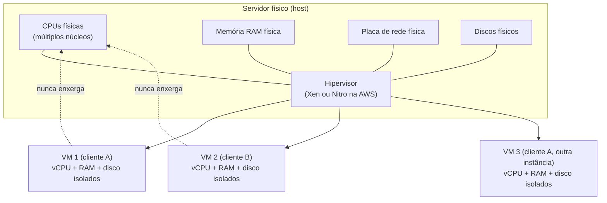
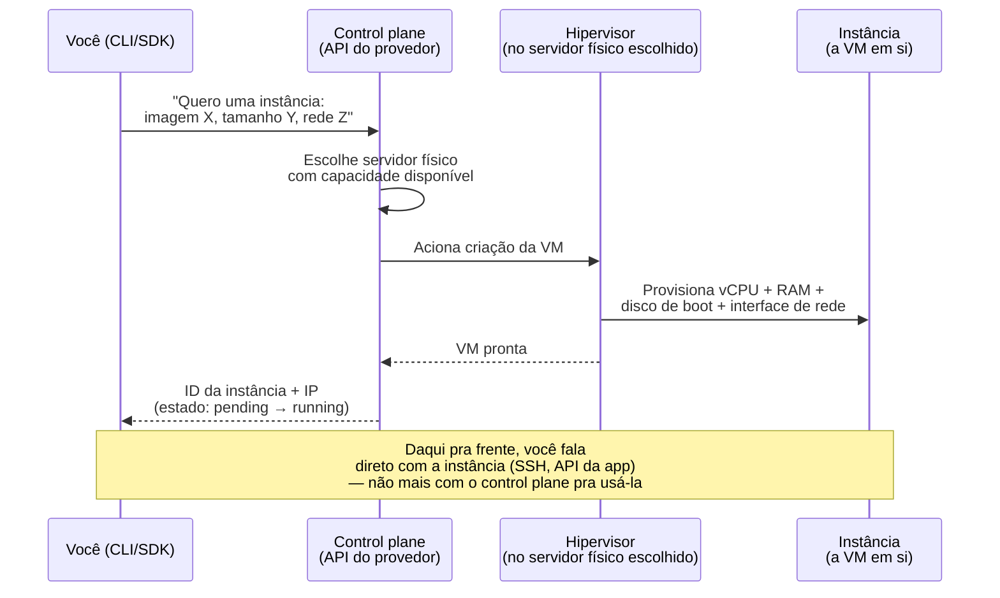
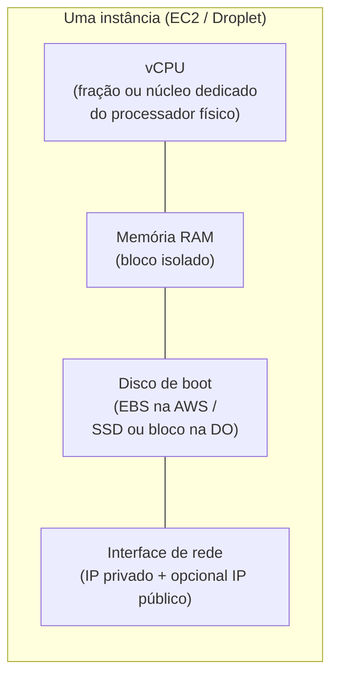

# Anatomia de uma máquina virtual na nuvem

> [!abstract] TL;DR
> "Onde essa aplicação vai rodar?" é a pergunta mais antiga da computação em nuvem, e a resposta quase sempre começa no mesmo lugar: uma **máquina virtual** — um computador inteiro, com CPU, memória, disco e rede próprios, que existe só como software rodando dentro de um servidor físico maior. Um programa chamado **hipervisor** divide um único servidor físico em várias máquinas virtuais isoladas entre si, cada uma pensando que é a única dona do hardware. Na AWS, essa unidade alugável se chama **EC2 instance**; na DigitalOcean, **Droplet**. Os dois nascem do mesmo pedido de API (`aws ec2 run-instances` / `doctl compute droplet create`), os dois cobram por tempo de uso, e os dois entregam a mesma coisa no fundo: um punhado de vCPU, memória, um disco de boot e uma interface de rede, prontos em segundos. Containers e serverless não substituíram essa camada — eles rodam *em cima* dela. A VM continua sendo o primitivo de compute mais básico da nuvem, porque em algum lugar da pilha, sempre existe um hipervisor fatiando hardware físico real.

## O problema: uma aplicação pronta, sem lugar para rodar

Imagine que você acabou de terminar uma API que processa pedidos de um e-commerce. Ela roda perfeitamente na sua máquina — `python app.py`, porta 8000, tudo funcionando. Agora vem a pergunta que todo desenvolvedor enfrenta no primeiro dia em que precisa expor algo ao mundo real: **onde essa aplicação vai rodar quando o seu notebook estiver desligado?**

A resposta óbvia — "compra um servidor" — carrega um problema prático que só aparece quando você tenta executá-la. Um servidor físico decente custa alguns milhares de dólares, leva semanas para chegar, precisa de um lugar fisicamente seguro para ficar (temperatura controlada, energia redundante, alguém para trocar peça que quebra), e — o detalhe que mais dói — está, na maior parte do tempo, ocioso. Sua API de e-commerce processa um pico no Black Friday e passa o resto do ano usando uma fração pequena da capacidade que você comprou pensando no pico. O servidor físico inteiro, parado, continua custando o mesmo dinheiro de quando estava a todo vapor.

O problema não é "onde roda o código" — é "como pagar só pela fração de um servidor que eu realmente uso, sem esperar semanas para tê-la, e sem ficar preso a ela para sempre". A resposta da indústria a essa pergunta, décadas antes de "nuvem" virar palavra comum, foi a virtualização: em vez de vender o servidor físico inteiro, venda um *pedaço* dele, simulado por software, que se comporta exatamente como um servidor físico completo do ponto de vista de quem está usando. Esse pedaço simulado é a máquina virtual — e é a unidade que toda nuvem pública vende, embaixo de qualquer nome comercial que ela use.

## O hipervisor: um servidor físico virando muitos

A peça de software que torna isso possível chama-se **hipervisor** (também chamado de *virtual machine monitor*, VMM). Ele roda diretamente sobre o hardware físico — ou sobre um sistema operacional hospedeiro, dependendo do tipo — e tem uma única responsabilidade: fatiar os recursos físicos reais (núcleos de CPU, memória RAM, controladores de disco, placas de rede) em pedaços isolados, cada um oferecido a uma máquina virtual como se fosse hardware dedicado só dela. A instância dentro da VM nunca fala diretamente com o processador físico — ela fala com uma CPU virtual que o hipervisor apresenta a ela, e o hipervisor decide, por trás da cena, como essa CPU virtual mapeia para ciclos reais do processador físico.

A AWS documenta oficialmente dois hipervisores usados na frota do EC2: o **Xen**, usado pelas gerações mais antigas de tipos de instância, e o **Nitro**, a arquitetura mais recente, que move boa parte do trabalho de virtualização (rede, armazenamento) para hardware dedicado — placas e chips especializados — em vez de competir por ciclos de CPU com as próprias instâncias dos clientes. A distinção entre os dois hipervisores não é só histórica: instâncias Nitro entregam desempenho de rede e disco mais próximo do hardware nu, exatamente porque menos trabalho de virtualização compete pelos mesmos núcleos que rodam o código do cliente.



Cada máquina virtual roda isolada das outras — o cliente A, na VM1, não tem visibilidade nem acesso ao que roda na VM2, mesmo que as duas dividam o mesmo servidor físico por trás da cena. É essa garantia de isolamento, feita pelo hipervisor, que permite a um provedor de nuvem colocar cargas de trabalho de clientes completamente diferentes — às vezes concorrentes entre si — no mesmo pedaço de hardware físico, sem que um veja ou influencie o outro. É o que torna o modelo econômico da nuvem viável: um servidor físico caro e frequentemente ocioso vira dezenas de fatias vendidas separadamente, cada uma cobrada só por quem a usa.

Esse arranjo é o que a indústria chama de **multi-tenancy** (múltiplos inquilinos): instâncias de clientes diferentes, desconhecidos entre si, compartilhando o mesmo servidor físico. É também de onde nasce a fronteira que qualquer engenheiro sênior de nuvem precisa saber apontar de cor: o hipervisor, o hardware físico, a rede entre servidores dentro do datacenter — tudo isso é responsabilidade do provedor, e você nunca vê nem gerencia essa camada. A partir do sistema operacional convidado para cima — patches do SO, configuração de firewall dentro da instância, o próprio código da aplicação — a responsabilidade é sua. A AWS formaliza essa divisão com o nome de **shared responsibility model**; a linha exata muda de serviço para serviço, mas para uma instância de compute puro (EC2, Droplet), a régua é sempre a mesma: **abaixo do hipervisor é do provedor; a partir do sistema operacional guest, é seu.**

## A instância como recurso alugável, não como máquina que você possui

A virada conceitual que separa "ter uma máquina virtual" de "usar compute na nuvem" é esta: você nunca compra a VM. Você aluga o direito de rodá-la por um tempo, através de uma chamada de API. Ela nasce quando você pede, existe enquanto você paga, e desaparece quando você não precisa mais dela — sem contrato, sem hardware físico chegando pelos Correios, sem instalação.

Isso divide o sistema em duas partes que vale nomear com precisão, porque a confusão entre elas é comum:

- O **control plane** — a camada de API e orquestração do provedor que recebe seu pedido ("quero uma instância assim"), decide em qual servidor físico da frota ela vai nascer, aciona o hipervisor certo, e devolve pra você um identificador e um endereço de rede. Você nunca fala diretamente com o hipervisor; você fala com o control plane, e ele fala com o hipervisor por você.
- A **instância em si** — o resultado do pedido: a máquina virtual rodando, com seu próprio sistema operacional, seu disco, sua interface de rede — o que você efetivamente usa depois que o pedido foi atendido.



> [!tip] Assista: Introduction to Amazon EC2 | Virtual Machines, Instance for Beginners
> **Canal:** CBT Nuggets | **Duração:** ~14min | **Idioma:** EN
>
> O vídeo reforça exatamente essa virada conceitual — VM como fatia alugável, não posse — usando a analogia de mover a carga entre máquinas físicas diferentes sem que o cliente perceba, o que ajuda a fixar por que a instância nunca deve ser tratada como "sua máquina". Trecho de destaque [01:29]: *"the cool thing about virtual machines is that because they're not physical we can actually move them to other physical systems pretty easily"*
>
> 🎬 [Assistir no YouTube](https://www.youtube.com/watch?v=AdKfniGuWWc)

## A encarnação concreta: EC2 instance e Droplet

Na AWS, o serviço de compute baseado em máquinas virtuais chama-se **Amazon EC2** (Elastic Compute Cloud), e a unidade que ele provisiona é a **EC2 instance**. Na DigitalOcean, o nome comercial é **Droplet** — definido na documentação oficial como "máquinas virtuais baseadas em Linux, rodando sobre hardware virtualizado". Os dois produtos resolvem exatamente o mesmo problema, com vocabulário diferente e uma filosofia de simplicidade bem distinta: a AWS expõe dezenas de parâmetros de configuração; a DigitalOcean expõe poucos, de propósito.

O pedido que cria uma instância, na AWS, é a chamada de API `RunInstances`, exposta na CLI como `aws ec2 run-instances`. Os únicos parâmetros formalmente obrigatórios na API são `MinCount` e `MaxCount` — quantas instâncias, no mínimo e no máximo, você quer que o pedido produza —, mas na prática toda instância precisa também de uma **imagem** (`ImageId`, a AMI que define o sistema operacional de partida) e, quase sempre, de um **tipo de instância** (`InstanceType`, que define quanta CPU/memória ela recebe — assunto completo da próxima nota):

```bash
# AWS — criar uma EC2 instance
$ aws ec2 run-instances \
    --image-id ami-0c55b159cbfafe1f0 \
    --instance-type t2.micro \
    --key-name minha-chave-ssh \
    --security-group-ids sg-0123456789abcdef0 \
    --subnet-id subnet-0123456789abcdef0 \
    --count 1
```

```json
{
  "Instances": [
    {
      "InstanceId": "i-0abcd1234efgh5678",
      "ImageId": "ami-0c55b159cbfafe1f0",
      "State": {
        "Code": 0,
        "Name": "pending"
      },
      "InstanceType": "t2.micro",
      "KeyName": "minha-chave-ssh",
      "SubnetId": "subnet-0123456789abcdef0",
      "PrivateIpAddress": "10.0.1.42"
    }
  ]
}
```

O equivalente na DigitalOcean é `doctl compute droplet create`, e a documentação oficial exige apenas dois parâmetros para o comando funcionar: `--size` (o tamanho, equivalente ao `InstanceType` da AWS) e `--image` (a imagem de partida). O nome da região é opcional — sem ele, o `doctl` usa a região padrão configurada na conta:

```bash
# DigitalOcean — criar um Droplet
$ doctl compute droplet create minha-api-ecommerce \
    --size s-2vcpu-2gb \
    --image ubuntu-24-04-x64 \
    --region nyc1 \
    --ssh-keys 3b:16:e3:...:9f:f2
```

```text
ID           Name                    Public IPv4    Memory    VCPUs    Disk    Region    Image                 Status
389123456    minha-api-ecommerce                    2048      2        60      nyc1      Ubuntu 24.04 (LTS) x64    new
```

Repare no paralelo direto entre os dois pedidos — cada um pede a mesma coisa, só com nomes diferentes:

| O que você está pedindo | AWS (`run-instances`) | DigitalOcean (`droplet create`) |
|---|---|---|
| Imagem/sistema de partida | `--image-id` (AMI) | `--image` |
| Tamanho da máquina (vCPU/RAM) | `--instance-type` | `--size` |
| Onde ela nasce geograficamente | `--subnet-id` (dentro de uma região/AZ) | `--region` |
| Acesso SSH inicial | `--key-name` | `--ssh-keys` |
| Quantas instâncias de uma vez | `--count` | (uma por chamada; múltiplas via `--`) |
| Estado logo após criação | `State.Name: "pending"` | `Status: "new"` |

Nos dois casos, a resposta chega em segundos, não semanas — e é exatamente essa velocidade, junto com a cobrança por tempo de uso, que fecha o argumento econômico aberto lá na abertura desta nota: você não compra o servidor físico; você aluga, por minuto ou por segundo, o pedaço dele que uma chamada de API acabou de fatiar para você.

### Do "pending" ao "running": checando o estado

O estado devolvido na criação (`pending` / `new`) é só o começo — o control plane continua provisionando a instância por alguns segundos depois da resposta inicial. Checar o estado atual, nos dois provedores, é uma chamada separada:

```bash
# AWS — consultar o estado atual de uma instância específica
$ aws ec2 describe-instances --instance-ids i-0abcd1234efgh5678 \
    --query "Reservations[].Instances[].State.Name" --output text
running
```

```bash
# DigitalOcean — consultar o estado atual de um Droplet específico
$ doctl compute droplet get 389123456 --format ID,Name,Status
ID           Name                    Status
389123456    minha-api-ecommerce    active
```

Só depois que o estado vira `running` (AWS) ou `active` (DigitalOcean) a instância está de fato pronta para receber conexão SSH ou tráfego de aplicação — tentar antes disso é a armadilha mais comum de quem está automatizando esse fluxo pela primeira vez, coberta mais adiante nesta nota.

### O outro lado do ciclo de vida: encerrar a instância

Assim como nasceu de uma chamada de API, a instância também morre por uma — e é aqui que o modelo "aluguel, não posse" fecha o círculo: parar de pagar é uma chamada, não uma ligação para cancelar contrato.

```bash
# AWS — terminar definitivamente a instância (não é o mesmo que "stop")
$ aws ec2 terminate-instances --instance-ids i-0abcd1234efgh5678
```

```bash
# DigitalOcean — destruir definitivamente o Droplet
$ doctl compute droplet delete 389123456 --force
```

Nos dois casos, o disco de boot e a interface de rede associados à instância deixam de existir junto com ela (ressalvas sobre volumes destacáveis ficam para o galho de armazenamento) — e a cobrança pela instância para no exato momento em que o provedor processa o pedido.

| Momento do ciclo de vida | Estado na AWS (`State.Name`) | Estado na DigitalOcean (`Status`) |
|---|---|---|
| Acabou de ser pedida, ainda provisionando | `pending` | `new` |
| Rodando e utilizável | `running` | `active` |
| Desligada, mas ainda existe (disco preservado) | `stopped` | `off` |
| Em processo de encerramento | `shutting-down` | — (transição imediata) |
| Encerrada de vez, recursos liberados | `terminated` | (Droplet deixa de existir — não há estado "terminado" listável) |

## O que compõe uma instância

Toda instância — EC2 ou Droplet, não importa o provedor — nasce com o mesmo punhado de recursos básicos, alocados pelo hipervisor no momento da criação. Vale nomear cada peça sem esgotar o assunto, porque *quanto* de cada uma vem, e em que combinações, é justamente o conteúdo da próxima nota desta trilha:

- **vCPU (CPU virtual)** — uma fração (ou um núcleo inteiro dedicado, dependendo do tipo) do processador físico, apresentada à instância como se fosse um processador próprio.
- **Memória (RAM)** — um bloco de memória reservado exclusivamente para aquela instância, isolado da memória usada por outras VMs no mesmo host físico.
- **Disco de boot** — o volume de armazenamento onde o sistema operacional da instância vive. Na AWS, normalmente um volume EBS anexado à instância; na DigitalOcean, um disco SSD local ou em bloco, dependendo do plano. A anatomia completa de discos e volumes é assunto de um galho posterior desta trilha (armazenamento), não desta nota.
- **Interface de rede** — pelo menos um endereço IP privado, e opcionalmente um IP público, através dos quais a instância troca tráfego com o resto do mundo. Como esse tráfego é roteado, isolado e protegido é o assunto do galho de rede (VPC) mais adiante nesta trilha.

Há uma quinta peça, anterior a todas as outras cronologicamente, que merece nome próprio: a **imagem**. É o molde a partir do qual o disco de boot nasce — um instantâneo de sistema operacional (e, às vezes, software pré-instalado) que a instância usa como ponto de partida no primeiro boot. Na AWS, essa peça chama-se **AMI** (Amazon Machine Image); na DigitalOcean, simplesmente **image**. Sem uma imagem, `run-instances` e `droplet create` não têm o que colocar no disco de boot — é por isso que, nos dois comandos vistos nesta nota, `--image-id`/`--image` aparece antes de qualquer outro parâmetro de configuração.

```bash
# AWS — listar AMIs oficiais da Amazon para Amazon Linux 2
$ aws ec2 describe-images \
    --owners amazon \
    --filters "Name=name,Values=amzn2-ami-hvm-*" \
    --query 'Images[*].[ImageId,Name]' \
    --output text
ami-0c55b159cbfafe1f0    amzn2-ami-hvm-2.0.20230119.1-x86_64-gp2
ami-0b5eea76982371e91    amzn2-ami-hvm-2.0.20230126.0-x86_64-gp2
```

```bash
# DigitalOcean — listar imagens de distribuição pública disponíveis
$ doctl compute image list-distribution --format ID,Distribution,Slug
ID           Distribution    Slug
178180825    Ubuntu          ubuntu-24-04-x64
178180911    Debian          debian-12-x64
```

Além das imagens públicas mantidas pelo provedor, os dois permitem criar imagens próprias — capturando o disco de uma instância já configurada e reutilizando esse instantâneo para nascer novas instâncias idênticas (o padrão conhecido como *golden image*). Isso antecipa um problema real: instalar manualmente, toda vez, as mesmas dependências numa instância nova é lento e propenso a divergência entre ambientes — uma imagem própria resolve isso na raiz, entregando toda instância nova já com o software certo instalado desde o primeiro boot.



> [!info] Fronteira
> Como esses quatro recursos se combinam em *famílias* e *tamanhos* específicos (`t2.micro`, `m6i.8xlarge`, `s-2vcpu-2gb`...) é o assunto inteiro da **próxima nota** desta trilha. Como a rede que conecta essa interface a outras instâncias e à internet é isolada e protegida é assunto do galho de **rede na nuvem (VPC)**, mais adiante nesta trilha. Como o disco de boot se diferencia de volumes de dados adicionais é assunto do galho de **armazenamento**.

## Por que a VM continua sendo o primitivo base

Um raciocínio comum, e equivocado, é achar que containers e serverless "substituíram" a máquina virtual como unidade de compute. Não substituíram — se apoiaram nela. Um container (Docker, por exemplo) compartilha o kernel do sistema operacional do host onde roda; ele não tem hipervisor próprio nem hardware virtualizado dedicado — mas esse host, na nuvem, quase sempre *é* uma máquina virtual. Quando você roda um cluster Kubernetes gerenciado (EKS, DOKS), cada *node* do cluster, por trás da abstração, é uma EC2 instance ou um Droplet como qualquer outro — só que em vez de você fazer SSH nela para rodar sua aplicação diretamente, o Kubernetes usa esse conjunto de VMs como pool de capacidade e agenda containers dentro delas.

Serverless (funções como AWS Lambda) esconde a VM ainda mais fundo na pilha — você nunca escolhe um tipo de instância, nunca vê um `InstanceId` — mas o código da função, quando executa, ainda executa sobre hardware físico fatiado por um hipervisor, gerenciado inteiramente pelo provedor em vez de por você. A diferença entre EC2/Droplet e Lambda não é "tem VM" versus "não tem VM" — é *quem* decide o tamanho, o ciclo de vida e a alocação da VM por trás da execução: você, no primeiro caso; o provedor, automaticamente, no segundo.

Essa é a razão de esta nota abrir a trilha de Compute, em vez de começar direto por containers ou serverless: entender a VM primeiro dá o vocabulário e o modelo mental — hipervisor, isolamento, control plane, ciclo de vida — que todas as camadas mais abstratas de compute reaproveitam, mesmo escondendo a máquina virtual de propósito.

## Casos práticos

**Voltando ao problema de abertura.** A API de e-commerce que abriu esta nota sobe hoje como uma única instância — na AWS, uma `t2.micro` com um Elastic IP fixo; na DigitalOcean, um Droplet `s-2vcpu-2gb` com IP público padrão. Não há auto scaling, não há balanceador de carga na frente dela ainda (isso é assunto da próxima nota do galho, sobre elasticidade) — é literalmente uma máquina virtual, sozinha, respondendo a requisições HTTP na porta 8000. É o ponto de partida honesto de praticamente todo sistema em produção: antes de qualquer camada de resiliência, existe uma instância única rodando o código.

**Ambiente de desenvolvimento efêmero.** Um time que precisa testar uma versão de banco de dados diferente, sem afetar produção, sobe uma instância descartável, roda o teste, e destrói a instância no fim do dia — pagando só pelas horas efetivamente usadas. É exatamente o modelo econômico descrito na abertura desta nota, levado ao extremo: nenhuma instância que sobreviva além da necessidade exata que a criou. O ciclo `run-instances` → uso → `terminate-instances` (ou `droplet create` → uso → `droplet delete`) inteiro pode levar minutos, não dias.

**Um node de um cluster gerenciado.** Uma equipe que roda Kubernetes gerenciado nunca chama `run-instances` diretamente para os nodes do cluster — o próprio serviço gerenciado (EKS, DOKS) faz essa chamada por trás da cena, seguindo a mesma API que esta nota descreveu, só que automatizada. Entender o que uma `RunInstances` faz por baixo é o que permite depurar, por exemplo, por que um node novo do cluster demorou minutos a mais para ficar pronto: a resposta quase sempre está em algum detalhe do ciclo de vida coberto aqui — a AMI usada, o tipo de instância escolhido, ou o tempo de boot do sistema operacional antes do `running`.

## Armadilhas comuns

> [!warning] Achar que "instância parada" é o mesmo que "instância não existe"
> Parar uma instância EC2 (`stop`) não é o mesmo que terminá-la (`terminate`). Uma instância parada continua existindo — reservada, com seu disco de boot intacto — e alguns recursos associados a ela (como um Elastic IP não anexado a nada mais) podem continuar sendo cobrados mesmo sem CPU rodando. Confira sempre o estado exato antes de assumir que "desligada" significa "sem custo".

> [!warning] Confundir a região da instância com a região dos dados que ela acessa
> Criar uma EC2 instance em `us-east-1` e um bucket S3 em `sa-east-1` funciona — as chamadas de rede simplesmente atravessam regiões — mas isso introduz latência adicional e, dependendo do provedor e do tráfego, custo de transferência entre regiões que não existiria se os dois recursos estivessem na mesma região. O mesmo vale para Droplets e Spaces na DigitalOcean.

> [!warning] Tratar a chamada de criação como síncrona e imediatamente utilizável
> `run-instances` e `droplet create` devolvem uma resposta em segundos, mas o estado inicial (`pending` na AWS, `new` na DigitalOcean) significa que a instância ainda está sendo provisionada — o sistema operacional ainda está de boot, a rede ainda está sendo configurada. Tentar conectar via SSH imediatamente após o pedido, sem esperar o estado mudar para `running`/`active`, é a causa mais comum de "erro de conexão" reportado por quem está automatizando criação de instâncias pela primeira vez.

> [!warning] Assumir que a imagem pública de hoje é a mesma de amanhã
> `ubuntu-24-04-x64` ou `amzn2-ami-hvm-*` não são identificadores fixos de um conteúdo imutável — o provedor publica novas versões da mesma imagem periodicamente (patches de segurança, atualizações de kernel), e o slug/nome pode apontar para um `ImageId` diferente amanhã do que aponta hoje. Um script de automação que fixa um `ImageId` específico (não um slug/nome genérico) garante reprodutibilidade; um que sempre busca "a imagem mais recente com esse nome" garante atualização automática — escolher qual das duas coisas você quer é uma decisão deliberada, não um acidente de como o comando foi escrito.

## Tabela de tradução

| Conceito | AWS | Azure | GCP | DigitalOcean |
|---|---|---|---|---|
| Serviço de compute baseado em VM | Amazon EC2 (Elastic Compute Cloud) | Azure Virtual Machines | Compute Engine | Droplets |
| Unidade alugável (a VM em si) | EC2 instance | Virtual machine (VM) | VM instance | Droplet |
| Camada que fatia o hardware físico | Hipervisor Xen ou Nitro | Hyper-V (hipervisor da Microsoft) | Hipervisor do Compute Engine (KVM) | Hipervisor (não nomeado publicamente pela documentação) |
| Chamada que cria a instância | `RunInstances` (`aws ec2 run-instances`) | `az vm create` | `gcloud compute instances create` | `doctl compute droplet create` |

> [!info] Caducidade
> IDs de AMI, nomes de imagem (`ubuntu-24-04-x64`) e slugs de tamanho (`s-2vcpu-2gb`) verificados em 2026-07-23 mudam com frequência normal de catálogo — confira sempre a listagem atual (`aws ec2 describe-images` / `doctl compute image list`) antes de usar em produção. O hipervisor usado internamente pelo Google Compute Engine (KVM) e a ausência de nome público para o hipervisor da DigitalOcean refletem o que cada provedor documenta publicamente nesta data; políticas de divulgação de infraestrutura interna podem mudar.

## O que vem a seguir

Esta nota respondeu "o que é uma instância" — o primitivo, o hipervisor por trás dele, e o pedido mínimo de API que a cria. Mas toda instância que você pediu aqui usou um tamanho genérico (`t2.micro`, `s-2vcpu-2gb`) sem nenhuma explicação de *por que* aquele tamanho específico, entre dezenas de famílias disponíveis, é o certo para uma carga de trabalho real. Quanta CPU, quanta memória, e em que proporção — e como o preço muda dramaticamente dependendo de você comprar capacidade sob demanda, reservar com desconto, ou aceitar interrupção em troca de preço menor — é o assunto denso da próxima nota desta trilha.

## Fontes

- [AWS EC2 — Instance types (documentação oficial)](https://docs.aws.amazon.com/AWSEC2/latest/UserGuide/instance-types.html) — hipervisores Xen e Nitro, HVM, famílias e tamanhos; acessado em 2026-07-23.
- [AWS EC2 API Reference — RunInstances](https://docs.aws.amazon.com/AWSEC2/latest/APIReference/API_RunInstances.html) — parâmetros obrigatórios `MinCount`/`MaxCount`, `ImageId`, comportamento default de subnet e security group; acessado em 2026-07-23.
- [AWS CLI — ec2 run-instances (Command Reference)](https://docs.aws.amazon.com/cli/latest/reference/ec2/run-instances.html) — sintaxe de `--image-id`/`--instance-type`/`--key-name`/`--security-group-ids`/`--subnet-id`/`--count`, formato de saída JSON com `InstanceId`/`State`; acessado em 2026-07-23.
- [DigitalOcean — Droplets (visão geral)](https://docs.digitalocean.com/products/droplets/) — definição de Droplet como VM Linux sobre hardware virtualizado; acessado em 2026-07-23.
- [DigitalOcean — Choosing a Droplet plan](https://docs.digitalocean.com/products/droplets/concepts/choosing-a-plan/) — plans Basic/General Purpose/CPU-Optimized/Memory-Optimized/Storage-Optimized, vCPU compartilhada vs dedicada, papel do hipervisor fatiando recursos; acessado em 2026-07-23.
- [DigitalOcean — doctl compute droplet create (CLI Reference)](https://docs.digitalocean.com/reference/doctl/reference/compute/droplet/create/) — flags obrigatórias `--size`/`--image`, exemplo de comando com `--region`/`--user-data`; acessado em 2026-07-23.
- [Microsoft Learn — Overview of virtual machines in Azure](https://learn.microsoft.com/en-us/azure/virtual-machines/overview) — definição de Azure Virtual Machines, tamanho/size determinando CPU/memória/rede; acessado em 2026-07-23.
- [Google Cloud — Compute Engine overview](https://docs.cloud.google.com/compute/docs/overview) — Compute Engine como IaaS de VMs, conceito de machine type/machine family; acessado em 2026-07-23.
- [AWS EC2 — Amazon EC2 instance state changes](https://docs.aws.amazon.com/AWSEC2/latest/UserGuide/ec2-instance-lifecycle.html) — estados `pending`/`running`/`stopping`/`stopped`/`shutting-down`/`terminated`, cobrança por estado, diferença entre stop e terminate; acessado em 2026-07-23.
- [AWS CLI — ec2 describe-instances (Command Reference)](https://docs.aws.amazon.com/cli/latest/reference/ec2/describe-instances.html) e [ec2 describe-images](https://docs.aws.amazon.com/cli/latest/reference/ec2/describe-images.html) — sintaxe de `--query`/`--output text`, filtro `--owners`/`--filters`; acessado em 2026-07-23.
- [AWS — Shared Responsibility Model](https://aws.amazon.com/compliance/shared-responsibility-model/) — divisão entre "segurança DA nuvem" (hipervisor, host OS, hardware) e "segurança NA nuvem" (guest OS, patches, security groups); acessado em 2026-07-23.
- [DigitalOcean — doctl compute droplet get](https://docs.digitalocean.com/reference/doctl/reference/compute/droplet/get/), [droplet delete](https://docs.digitalocean.com/reference/doctl/reference/compute/droplet/delete/) e [image list-distribution](https://docs.digitalocean.com/reference/doctl/reference/compute/image/list-distribution/) (CLI Reference) — sintaxe e flags `--format`/`--force`; acessado em 2026-07-23.
