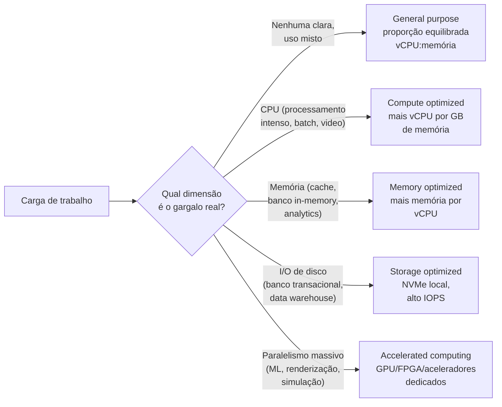
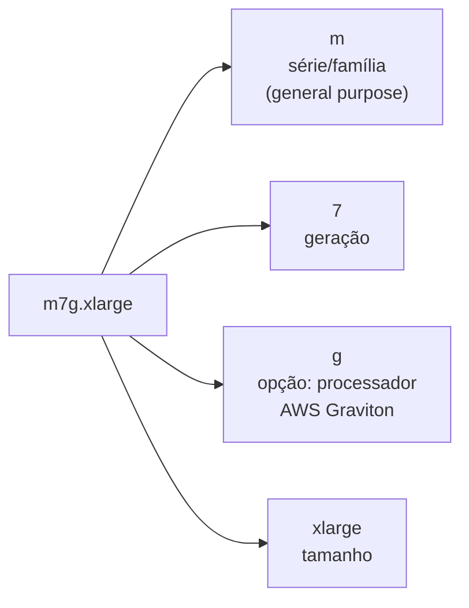

# Tipos e famílias de instância

> [!abstract] TL;DR
> Provisionar uma máquina virtual não é só decidir "quantos vCPUs e quanta memória". É decidir um **perfil de recurso** — porque duas instâncias com o mesmo número de vCPUs podem ter proporções completamente diferentes de memória, rede e disco por trás daquele número, otimizadas para cargas diferentes. A AWS organiza isso em **famílias de instância** (general purpose, compute optimized, memory optimized, storage optimized, accelerated computing) e codifica o perfil inteiro no próprio nome — `m7g.xlarge` não é um código arbitrário, é família + geração + processador + tamanho, todos legíveis se você souber decifrar. A DigitalOcean simplifica drasticamente o mesmo problema com **Droplet plans**: Basic (CPU compartilhada), General Purpose, CPU-Optimized, Memory-Optimized e Storage-Optimized, cada um com uma proporção fixa de vCPU para memória. Escolher entre eles chama-se **right-sizing** — e o critério nunca deveria ser um chute, é a carga real de trabalho medida.

## O problema: a instância que ou está lenta, ou está cara

Um time provisiona um servidor para uma nova API. Ninguém mediu nada ainda — o serviço é novo, não existe histórico de tráfego. Alguém escolhe, sem pensar muito, uma instância "média": 2 vCPUs, 8 GB de memória, o tipo mais comum que aparece primeiro na lista do console. A API sobe, funciona, e por semanas ninguém olha para trás.

Aí a aplicação começa a processar lotes maiores — compressão de vídeo, por exemplo, ou um pipeline de machine learning que faz milhares de operações de ponto flutuante por segundo. A CPU trava em 100% boa parte do tempo, a memória sobra folgada, e a latência sobe. A resposta mais comum, sob pressão, é "aumentar a instância" — trocar para o próximo tamanho da mesma família, dobrando vCPU e memória juntos, mesmo que só a CPU estivesse sob pressão. O time paga o dobro por memória que nunca ia usar, só para conseguir mais CPU.

Ou o inverso: uma aplicação que faz cache pesado em memória — uma base de sessões, um banco de dados analítico que mantém tabelas inteiras na RAM — roda numa instância pensada para equilíbrio, com memória insuficiente para o dataset. O sistema começa a fazer swap para disco, a latência de cada consulta piora em ordens de grandeza, e ninguém entende por quê, porque "a CPU está tranquila, tem folga de sobra".

Os dois casos têm a mesma causa raiz: a instância foi escolhida pelo **tamanho** (quantos vCPUs, quanta memória, um número que "parece razoável") e não pelo **perfil** — a proporção entre CPU, memória, rede e disco que a carga de trabalho especificamente demanda. Nuvens sérias resolvem isso oferecendo, para o mesmo tamanho nominal de máquina, várias variações otimizadas de formas diferentes. Entender essa organização — a família de instância — é o que transforma "escolher uma VM" de um chute em uma decisão de engenharia.

## As quatro dimensões de uma instância

Toda instância de máquina virtual, em qualquer provedor, é definida por quatro dimensões de recurso que variam de forma independente:

- **vCPU** — núcleos de processamento virtuais alocados à instância. O número por si só não diz muito sem saber a arquitetura do processador por trás (Intel, AMD, ARM/Graviton) e a frequência de clock.
- **Memória (RAM)** — quanto dado a instância consegue manter ativo sem ir a disco. É a dimensão que mais varia entre famílias com o mesmo número de vCPUs.
- **Rede** — largura de banda disponível para tráfego de entrada e saída, medida em Gbps. Cargas que movem muito dado entre serviços (bancos distribuídos, pipelines de replicação) dependem disso mais do que de CPU.
- **Storage** — se a instância tem disco local (NVMe efêmero, rápido mas que se perde ao desligar a instância) ou depende inteiramente de armazenamento em rede (EBS/Volumes, persistente mas com latência maior).

Uma família de instância é, na prática, uma escolha deliberada de proporção entre essas quatro dimensões — otimizada para um tipo de carga, às custas de outra.



## Família de instância: o perfil por trás do tamanho

A AWS organiza suas instâncias EC2 em cinco grandes categorias, cada uma com múltiplas famílias dentro dela:

- **General purpose** — proporção equilibrada entre vCPU e memória, pensada para não penalizar nenhuma dimensão. Famílias atuais: `M` (a família "padrão", ex.: M7g, M7i) e `T` (burstable — acumula "créditos" de CPU em baixa utilização e os gasta em picos, ideal para cargas com uso intermitente). Bom ponto de partida quando ainda não se sabe o perfil real da carga — exatamente o caso do time do cenário de abertura, antes de medir.
- **Compute optimized** — mais vCPU por GB de memória que o general purpose equivalente. Família `C` (ex.: C7g). Serve batch processing, codificação de mídia, modelagem científica, servidores de jogos com física pesada — qualquer coisa limitada por ciclos de CPU, não por dados em memória.
- **Memory optimized** — o inverso: mais memória por vCPU. Famílias `R` (ex.: R7g, memory-intensive de propósito geral), `X` (memória intensiva, para bancos in-memory de grande porte) e `U`/`Z` (alta memória, para os casos mais extremos — a AWS oferece instâncias `U` com várias dezenas de terabytes de RAM). Serve bancos relacionais com datasets grandes mantidos em cache, processamento in-memory (Redis/Memcached em escala), análise de big data que não pode paginar para disco.
- **Storage optimized** — otimizada para I/O sequencial e aleatório de alto throughput, geralmente com NVMe local. Famílias `I` (storage optimized geral), `Im`/`Is` (variações com proporções específicas de vCPU:memória) e `D` (dense storage, mais capacidade bruta de disco por instância). Serve bancos NoSQL distribuídos, data warehouses, sistemas de arquivos distribuídos.
- **Accelerated computing** — inclui um acelerador de hardware dedicado além da CPU: GPU (família `G`, gráficos; `P`, GPU para computação geral/ML), FPGA (família `F`), ou os chips próprios da AWS para machine learning (`Inf` para inferência com AWS Inferentia, `Trn` para treinamento com AWS Trainium).

> [!info] Caducidade
> Lista de famílias e categorias verificada na documentação oficial da AWS em 2026-07-23. A AWS lança gerações novas de família com frequência (a M7 já convive com a M8 e a M9 em 2026) — o *princípio* de organização por perfil de recurso é estável; os nomes de série específicos mudam a cada 1-2 anos. Confira sempre a lista de tipos de instância atual antes de fechar uma decisão de capacidade.

## A nomenclatura da AWS decodificada

O nome de um tipo de instância EC2 não é um código arbitrário — é uma composição de quatro partes, sempre na mesma ordem: **série** (a família, primeira posição), **geração** (número, segunda posição), **opções** (letras adicionais, terceira posição) e, depois do ponto, o **tamanho**.



Decodificando `m7g.xlarge` peça por peça: `m` é a série general purpose; `7` é a sétima geração dessa família; `g` diz que o processador é um AWS Graviton (ARM, não x86); `xlarge` é o tamanho dentro da família — cada tamanho dobra aproximadamente o anterior (`large` → `xlarge` → `2xlarge` → `4xlarge`...).

As letras de opção mais comuns, segundo a documentação oficial da AWS:

| Letra | Significado |
|---|---|
| `a` | Processador AMD |
| `g` | Processador AWS Graviton (ARM) |
| `i` | Processador Intel |
| `d` | Instance store — disco NVMe local efêmero |
| `n` | Otimizado para rede e EBS |
| `e` | Storage/memória/GPU extra (o que exatamente depende da categoria da família) |
| `z` | Alta frequência de clock de CPU |
| `flex` | Instância "flex" — faixa de performance flexível dentro do mesmo tipo |
| `b` | Otimização de block storage |

Um segundo exemplo, com duas letras de opção combinadas: `c7gn.2xlarge` é a série `C` (compute optimized), geração 7, com `g` (Graviton) **e** `n` (rede/EBS otimizados) juntas — uma instância pensada para processamento intenso de CPU que também precisa mover muito dado pela rede, como um proxy reverso de alto throughput ou um nó de processamento de streaming.

### Consultando o catálogo pela CLI

Em vez de decorar a tabela de famílias, o jeito mais confiável de descobrir o perfil exato de um tipo de instância é perguntar diretamente à API:

```bash
$ aws ec2 describe-instance-types \
    --instance-types m7g.xlarge c7g.xlarge r7g.xlarge \
    --query 'InstanceTypes[*].{Tipo:InstanceType,vCPU:VCpuInfo.DefaultVCpus,MemoriaMiB:MemoryInfo.SizeInMiB,Rede:NetworkInfo.NetworkPerformance}' \
    --output table
```

```
-------------------------------------------------------
|              DescribeInstanceTypes                    |
+------------+--------+--------------+------------------+
|   Tipo     | vCPU   | MemoriaMiB   |      Rede         |
+------------+--------+--------------+------------------+
|  m7g.xlarge|  4     |  16384       |  Up to 12.5 Gbps  |
|  c7g.xlarge|  4     |  8192        |  Up to 12.5 Gbps  |
|  r7g.xlarge|  4     |  32768       |  Up to 12.5 Gbps  |
+------------+--------+--------------+------------------+
```

Repare: os três tipos têm exatamente 4 vCPUs — o mesmo "tamanho" nominal `xlarge` — mas a memória varia de 8 GiB (`c7g`, compute optimized) a 32 GiB (`r7g`, memory optimized), quatro vezes mais para a mesma contagem de núcleos. É essa variação, entre famílias de mesmo tamanho, que a lente de "perfil de recurso" desta nota inteira existe para explicar.

## O modelo mais simples da DigitalOcean: Droplet plans

A DigitalOcean resolve o mesmo problema — dar formas diferentes de proporção de recurso — com uma superfície muito mais enxuta. Em vez de dezenas de famílias com letras combinatórias, a documentação oficial organiza os planos de Droplet em cinco categorias nomeadas diretamente pelo que otimizam:

- **Basic Droplets** — CPU compartilhada (shared CPU) entre Droplets no mesmo host físico, proporção de vCPU para memória mais leve. Pensado para cargas "bursty" — que picam de vez em quando mas não sustentam uso constante de CPU — como um blog, um ambiente de desenvolvimento, ou um serviço de baixo tráfego.
- **General Purpose Droplets** — CPU dedicada (nenhum outro Droplet compete pelos mesmos núcleos), proporção de 1 vCPU para 4 GB de memória. É o ponto de partida equivalente ao `M`/general purpose da AWS: equilíbrio, sem otimizar agressivamente para nenhum lado.
- **CPU-Optimized Droplets** — CPU dedicada, proporção de 1 vCPU para 2 GB de memória — mais núcleo por GB que o General Purpose. Indicado, segundo a documentação oficial, para streaming de mídia, jogos e analytics — cargas que demandam performance rápida e consistente de processamento.
- **Memory-Optimized Droplets** — proporção de 1 vCPU para 8 GB de memória — o dobro de memória por núcleo do General Purpose. Serve aplicações com grande volume de transações que precisam manter dados em memória para não cair em swap.
- **Storage-Optimized Droplets** — inclui armazenamento NVMe local de alto desempenho, proporção de vCPU:memória parecida com o General Purpose, mas o diferencial é o disco.

Não existe, na DigitalOcean, uma categoria "accelerated computing" com o mesmo leque de acionadores especializados da AWS (FPGA, chips próprios de ML) — a oferta de GPU Droplets existe, mas como uma linha separada, não uma família dentro da mesma grade de vCPU:memória.

### Consultando o catálogo pela CLI

O equivalente direto ao `describe-instance-types` na DigitalOcean é `doctl compute size list`, que devolve os "slugs" de cada plano — o identificador que se usa depois para criar o Droplet — junto com memória, vCPUs, disco e preço:

```bash
$ doctl compute size list --format Slug,Description,Memory,VCPUs,Disk,PriceMonthly
```

```
Slug              Description         Memory    VCPUs    Disk    PriceMonthly
s-1vcpu-1gb       Basic               1024      1        25      6.00
g-2vcpu-8gb       General Purpose     8192      2        25      63.00
c-2               CPU-Optimized       4096      2        25      42.00
m-2vcpu-16gb      Memory-Optimized    16384     2        50      84.00
```

> [!info] Caducidade
> Slugs, preços e a grade exata de tamanhos disponíveis mudam com frequência — a tabela acima é ilustrativa da forma da saída, não um catálogo definitivo. Rode `doctl compute size list` (ou consulte o endpoint `/v2/sizes` da API) para o catálogo real vigente no momento da decisão. O campo `description` de cada tamanho já vem rotulado com a categoria (`Basic`, `General Purpose`, `CPU-Optimized`, `Memory-Optimized`, `Storage-Optimized`) diretamente pela API — não é preciso decifrar nada a partir do slug.

## Lado a lado: descobrindo o perfil de uma instância já em uso

Uma segunda pergunta prática, além de "o que existe no catálogo", é "o que exatamente está rodando agora". Os dois comandos abaixo respondem à mesma pergunta — qual é o perfil de recurso de uma instância específica — em cada nuvem:

```bash
# AWS — pergunta ao catálogo pelo tipo já em uso por uma instância existente
$ aws ec2 describe-instances \
    --instance-ids i-0abcd1234efgh5678 \
    --query 'Reservations[*].Instances[*].InstanceType' \
    --output text
m7g.xlarge

$ aws ec2 describe-instance-types \
    --instance-types m7g.xlarge \
    --query 'InstanceTypes[0].{vCPU:VCpuInfo.DefaultVCpus,MemoriaMiB:MemoryInfo.SizeInMiB}'
{
    "vCPU": 4,
    "MemoriaMiB": 16384
}
```

```bash
# DigitalOcean — o próprio recurso do Droplet já devolve o perfil, sem consulta separada
$ doctl compute droplet get 123456789 \
    --format ID,Name,Memory,VCPUs,Disk,Size
ID           Name              Memory    VCPUs    Disk    Size
123456789    api-producao      8192      2        25      g-2vcpu-8gb
```

A diferença estrutural entre os dois: na AWS, o tipo de instância é uma referência a um catálogo externo (`describe-instance-types`) — o objeto da instância só guarda o nome do tipo, não os números. Na DigitalOcean, o objeto do Droplet já embute memória, vCPUs e disco diretamente na resposta — reflexo direto da filosofia de superfície mais simples que já apareceu em notas anteriores desta trilha.

## Fixando a escolha: provisionando pelo tipo/tamanho decidido

Uma vez que o perfil de recurso está decidido — general purpose para começar, ou uma família especializada porque já existe medição apontando o gargalo — o tipo/tamanho vira só mais um parâmetro na hora de criar o recurso. Pela CLI, criar uma instância já passando o tipo escolhido:

```bash
# AWS — cria a instância já com o tipo de família decidido
$ aws ec2 run-instances \
    --image-id ami-0abcdef1234567890 \
    --instance-type r7g.xlarge \
    --key-name minha-chave \
    --security-group-ids sg-0123456789abcdef0 \
    --subnet-id subnet-0123456789abcdef0
```

```bash
# DigitalOcean — o equivalente direto, trocando --instance-type por --size
$ doctl compute droplet create api-cache \
    --image ubuntu-24-04-x64 \
    --size m-2vcpu-16gb \
    --region nyc3 \
    --ssh-keys 12345678
```

O mesmo parâmetro aparece de forma idêntica em ferramentas de infraestrutura como código — decidir o perfil de recurso vira uma única linha declarativa, versionada junto com o resto da infraestrutura:

```hcl
# AWS — Terraform, recurso aws_instance
resource "aws_instance" "api_cache" {
  ami           = "ami-0abcdef1234567890"
  instance_type = "r7g.xlarge"
}
```

```hcl
# DigitalOcean — Terraform, recurso digitalocean_droplet
resource "digitalocean_droplet" "api_cache" {
  image  = "ubuntu-24-04-x64"
  size   = "m-2vcpu-16gb"
  region = "nyc3"
}
```

Repare que o nome do parâmetro muda (`instance_type` na AWS, `size` na DigitalOcean), mas o papel que ele cumpre é idêntico nos dois: fixar, num único valor, todo o perfil de recurso decidido nas seções anteriores desta nota — vCPU, memória, rede e (dependendo da família) disco local, tudo amarrado a um único identificador.

## Right-sizing: escolher pela carga real, não pelo chute

Right-sizing é o nome que a indústria dá ao processo de ajustar o tipo de instância à carga de trabalho *medida*, não estimada. O fio condutor de toda esta nota — general purpose para começar, compute/memory/storage optimized depois de entender o gargalo real — só funciona se existir dado real por trás da escolha. Sem isso, right-sizing vira só um chute mais bem vestido.

Na prática, o processo tem três passos que se repetem:

1. **Medir**, com uma instância já rodando, quais das quatro dimensões (CPU, memória, rede, disco) está consistentemente perto do limite e quais sobram. Métricas de CPU utilization, memória livre e I/O de disco ao longo de dias — não de minutos — revelam o padrão real, inclusive picos sazonais que uma janela curta de observação esconde.
2. **Comparar** o perfil medido com as famílias disponíveis, buscando a que aproxima melhor a proporção necessária — sem sobrar memória que nunca é tocada, nem faltar CPU no pico de carga.
3. **Migrar e remedir.** Trocar o tipo de instância (a AWS chama isso de *resize*; costuma exigir parar a instância, trocar o tipo, e ligar de novo) não é o fim do processo — é o início de um novo ciclo de observação, porque a carga de trabalho muda com o tempo.

Antes de qualquer ferramenta de recomendação automática, o passo 1 (medir) já é acessível diretamente pela CLI, puxando a métrica de utilização de CPU acumulada de uma instância:

```bash
# AWS — utilização média de CPU da instância nas últimas 24h, em blocos de 1h
$ aws cloudwatch get-metric-statistics \
    --namespace AWS/EC2 \
    --metric-name CPUUtilization \
    --dimensions Name=InstanceId,Value=i-0abcd1234efgh5678 \
    --start-time 2026-07-22T00:00:00Z \
    --end-time 2026-07-23T00:00:00Z \
    --period 3600 \
    --statistics Average
```

```bash
# DigitalOcean — mesma pergunta, via API de monitoramento (doctl não expõe
# métricas diretamente; o caminho oficial é o endpoint /v2/monitoring)
$ curl -s -X GET \
    -H "Authorization: Bearer $DIGITALOCEAN_TOKEN" \
    "https://api.digitalocean.com/v2/monitoring/metrics/droplet/cpu?host_id=123456789&start=1721606400&end=1721692800"
```

A AWS oferece, além da métrica bruta, uma ferramenta dedicada para automatizar o passo 1 e 2 — o **Compute Optimizer**, que analisa métricas históricas de utilização e recomenda o tipo de instância mais adequado, sinalizando tanto superprovisionamento (pagando por capacidade nunca usada) quanto subprovisionamento (risco de degradação de performance). A DigitalOcean não tem um serviço equivalente dedicado de recomendação automática de tamanho — o processo, lá, depende de puxar essa mesma métrica de monitoramento nativo do Droplet (CPU, memória, disco, banda) e comparar manualmente contra a grade de planos disponível.

> [!info] Fronteira
> Right-sizing contínuo, em produção, se conecta ao trabalho permanente de capacity planning e observabilidade coberto na trilha [[03-Dominios/Engenharia/Operação/index]] — esta nota foca no *catálogo* de perfis disponíveis; a disciplina de medir, decidir e automatizar esse ajuste ao longo do tempo é assunto daquela trilha.

O erro mais caro em right-sizing não é escolher o tipo errado uma vez — é nunca revisitar a escolha. Uma instância dimensionada corretamente no dia do lançamento, com o tráfego que existia então, pode estar seriamente super ou subdimensionada um ano depois, sem que ninguém tenha decidido isso conscientemente — só foi ficando.

## Tabela de tradução entre provedores

| Conceito | AWS | Azure | GCP | DigitalOcean |
|---|---|---|---|---|
| Propósito geral (equilíbrio vCPU:memória) | Família M (ex.: M7g), T (burstable) | Série D (ex.: Dv5), B (burstable) | Séries E2, N2, N2D, N4, C4 | General Purpose Droplet |
| CPU compartilhada / burstable | Família T | Série B | Séries E2, T2D, T2A | Basic Droplet |
| Compute optimized (mais vCPU por GB) | Família C (ex.: C7g) | Série F | Séries C2, C2D, C3, H3 | CPU-Optimized Droplet |
| Memory optimized (mais memória por vCPU) | Famílias R, X, U/Z | Séries E, M | Séries M2, M3, X4 | Memory-Optimized Droplet |
| Storage optimized (I/O local de alto throughput) | Famílias I, Im, Is, D | Série L | Série Z3 | Storage-Optimized Droplet |
| Accelerated computing (GPU/aceleradores) | Famílias P, G, Inf, Trn, F | Séries N (NC/ND/NG/NV) | Séries A2, A3, A4, G2, G4 | GPU Droplet (linha separada) |

> [!info] Caducidade
> Correspondência entre famílias verificada na documentação oficial de cada provedor em 2026-07-23. Esta tabela é uma **tradução de conceito**, não uma equivalência de performance — duas famílias "compute optimized" de provedores diferentes não entregam necessariamente o mesmo desempenho para a mesma carga. Séries específicas (a letra/número exato) mudam de geração com frequência maior que a categoria em si.

## Armadilhas comuns

> [!warning] Escalar verticalmente (mesma família, tamanho maior) quando o problema é de família, não de tamanho
> Se uma aplicação memory-bound está lenta numa instância `m7g.large` (general purpose), trocar para `m7g.2xlarge` dobra vCPU *e* memória — mas o gargalo real pode estar só na memória. Migrar para `r7g.large` (memory optimized, mesmo tamanho nominal) entrega mais memória sem pagar por vCPU ociosa. Antes de aumentar o tamanho, pergunte se a família continua certa.

> [!warning] Confundir vCPU de famílias diferentes como equivalentes
> Um vCPU de uma família `T` (burstable, créditos de CPU que se esgotam sob carga sustentada) não sustenta a mesma performance contínua que um vCPU de uma família `C` (compute optimized, sem limite de crédito). Comparar só o número de vCPUs entre famílias diferentes, sem olhar o tipo de processador e o modelo de performance por trás, é comparar números que não significam a mesma coisa.

> [!warning] Escolher pela intuição de "isso parece pesado" em vez de medir
> É tentador presumir que "processamento de imagem = precisa de GPU" ou "banco de dados = sempre precisa de memory optimized" sem medir a carga real. Muitas cargas de banco de dados são, na prática, limitadas por I/O de disco, não por memória — e um redimensionamento de storage optimized resolveria o problema mais barato que um salto para memory optimized. Right-sizing existe exatamente para substituir esse tipo de suposição por medição.

## O que vem a seguir

Esta nota resolveu o **perfil de recurso** — vCPU, memória, rede, disco, e como a família de instância empacota essas quatro dimensões em proporções otimizadas para cargas diferentes. Mas uma instância provisionada com o perfil certo ainda precisa de um sistema operacional, de um estado inicial, de um jeito de nascer já configurada em vez de manual. Essa é a próxima peça: como uma instância "boota" a partir de uma imagem — o que a AWS chama de AMI e a DigitalOcean chama de imagem de Droplet — e como customizar esse boot inicial sem entrar manualmente em cada máquina depois que ela sobe.

## Fontes

- [AWS EC2 — Amazon EC2 instance types (guia do usuário)](https://docs.aws.amazon.com/AWSEC2/latest/UserGuide/instance-types.html) — categorias de família (general purpose, compute/memory/storage optimized, accelerated computing), lista de famílias Nitro-based; acessado em 2026-07-23.
- [AWS EC2 Instance Types Guide — Naming conventions](https://docs.aws.amazon.com/ec2/latest/instancetypes/instance-type-names.html) — decomposição série/geração/opções/tamanho; tabela completa de letras de série (C, D, F, G, Hpc, I, Im, Is, Inf, M, Mac, P, R, T, Trn, U, VT, X, Z) e de opções (a, g, i, d, n, e, z, flex, b, q); exemplo `c7gn.xlarge`; acessado em 2026-07-23.
- [AWS CLI — ec2 describe-instance-types (Command Reference)](https://docs.aws.amazon.com/cli/latest/reference/ec2/describe-instance-types.html) — sintaxe de `--instance-types`, `--query`, campos `VCpuInfo`/`MemoryInfo`/`NetworkInfo`; acessado em 2026-07-23.
- [DigitalOcean — Droplet pricing](https://docs.digitalocean.com/products/droplets/details/pricing/) — categorias de plano (Basic, General Purpose, CPU-Optimized, Memory-Optimized, Storage-Optimized) e onde consultar a grade completa; acessado em 2026-07-23.
- [DigitalOcean — Sizes API Reference](https://docs.digitalocean.com/reference/api/reference/sizes/index.html.md) — estrutura do objeto de tamanho (`slug`, `vcpus`, `memory`, `disk`, `price_monthly`, `description`), endpoint `/v2/sizes`; acessado em 2026-07-23.
- [DigitalOcean — doctl compute size list (CLI Reference)](https://docs.digitalocean.com/reference/doctl/reference/compute/size/list/) — flags `--format`, colunas disponíveis (Slug, Description, Memory, VCPUs, Disk, PriceMonthly, PriceHourly); acessado em 2026-07-23.
- [Microsoft Learn — Azure VM sizes overview](https://learn.microsoft.com/en-us/azure/virtual-machines/sizes/overview) — categorias General purpose (B, D), Compute optimized (F), Memory optimized (E, M), Storage optimized (L), GPU accelerated (NC/ND/NG/NV); acessado em 2026-07-23.
- [Google Cloud — Machine families resource and comparison guide](https://docs.cloud.google.com/compute/docs/machine-resource) — famílias General purpose (E2, N2, N2D, N4, C4), Compute optimized (C2, C2D, H3), Memory optimized (M2, M3, X4), Storage optimized (Z3), Accelerator optimized (A2, A3, A4, G2, G4); acessado em 2026-07-23.
- [AWS — Compute Optimizer (produto)](https://aws.amazon.com/compute-optimizer/) — recomendação automática de right-sizing a partir de métricas de utilização histórica; acessado em 2026-07-23.
- [AWS CLI — cloudwatch get-metric-statistics (Command Reference)](https://docs.aws.amazon.com/cli/latest/reference/cloudwatch/get-metric-statistics.html) — sintaxe de `--namespace`, `--metric-name`, `--dimensions`, `--period`, `--statistics` para métricas de CPUUtilization; acessado em 2026-07-23.
- [DigitalOcean — Droplet Monitoring API Reference](https://docs.digitalocean.com/reference/api/api-reference/#tag/Monitoring) — endpoint de métricas de CPU/memória/disco/banda por Droplet; acessado em 2026-07-23.
