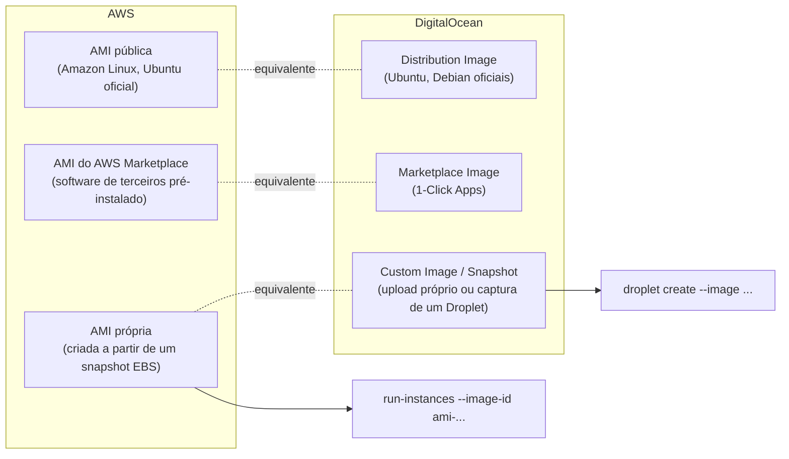
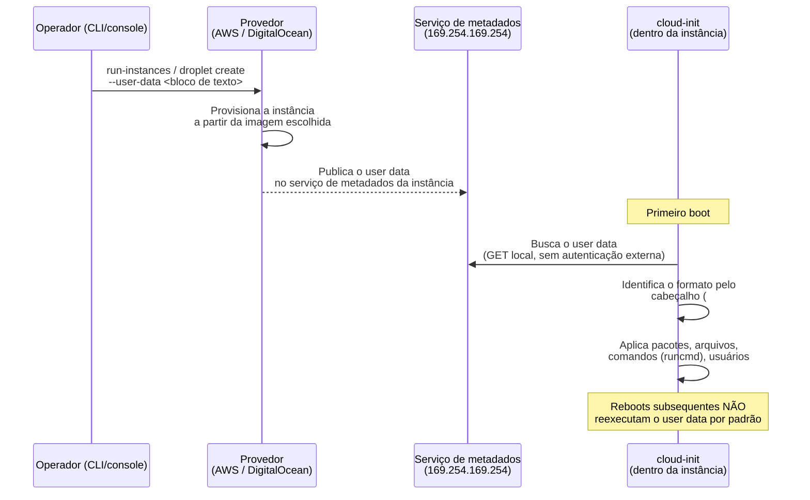
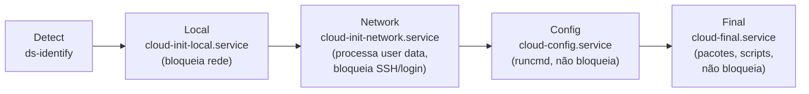
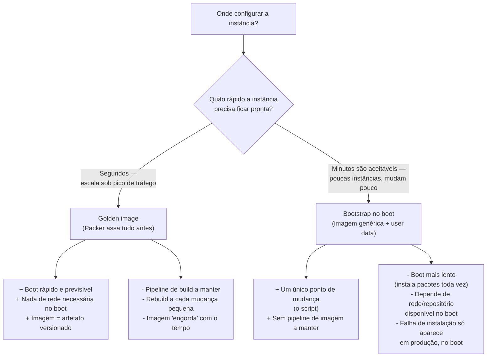

# Imagens, AMIs e provisionamento no boot

> [!abstract] TL;DR
> Uma instância recém-lançada não nasce vazia por acidente — ela nasce de um **molde**: uma imagem que descreve exatamente o conteúdo do disco de boot, sistema operacional incluído. Na AWS esse molde se chama **AMI** (Amazon Machine Image); na DigitalOcean, simplesmente **Image** (quando é o ponto de partida) ou **Snapshot** (quando é capturada de uma máquina já em uso). Nenhuma imagem, sozinha, resolve o problema de configurar dezenas de instâncias — para isso existe o **user data**, um bloco de texto entregue no lançamento e interpretado, quase sempre, pelo **cloud-init**: o agente padrão que roda na primeira inicialização e aplica scripts ou diretivas declarativas (`#cloud-config`). A decisão de arquitetura real está no eixo entre duas filosofias — **golden image** (assar tudo dentro da imagem, com uma ferramenta como o Packer, e o boot não faz nada além de ligar) e **bootstrap no boot** (imagem base genérica + user data que instala e configura na hora) — e a resposta certa depende de quanto a aplicação muda e de quão rápido a instância precisa ficar pronta.

## O problema: vinte instâncias idênticas, uma de cada vez

Imagine o cenário mais comum de todos: uma aplicação web precisa escalar de duas instâncias para vinte, num pico de tráfego inesperado. Cada uma dessas vinte instâncias precisa ter o mesmo sistema operacional, as mesmas dependências de runtime, o mesmo código da aplicação, as mesmas configurações de log e monitoramento. Fazer isso manualmente — logar em cada máquina recém-criada, instalar pacotes um a um, copiar o código, ajustar arquivos de configuração — não é apenas lento. É estruturalmente incompatível com a ideia de nuvem elástica: se escalar de 2 para 20 instâncias exige vinte sessões SSH manuais, a elasticidade prometida pela nuvem nunca vai acontecer na velocidade que o tráfego exige.

O ponto de partida do problema é mais básico ainda: uma instância recém-lançada, por padrão, **não tem a aplicação instalada**. Ela tem um sistema operacional — porque alguém, em algum momento, decidiu qual seria esse sistema operacional — mas nada além disso. A pergunta que este capítulo responde tem duas metades, e ambas importam: *de onde vem esse sistema operacional inicial?* e *como o resto — pacotes, código, configuração — chega até a instância sem intervenção manual?* A primeira metade é resolvida por uma **imagem**. A segunda, por **user data** processado no primeiro boot.

## A imagem: o molde do disco de boot

Uma **imagem** é um modelo — um arquivo, ou conjunto de arquivos, que descreve o conteúdo completo de um volume de disco de boot: sistema operacional, bibliotecas de sistema, e qualquer software que tenha sido instalado antes da imagem ser capturada. Lançar uma instância a partir de uma imagem não é "instalar um sistema operacional do zero" — é clonar um disco já pronto e ligar a máquina virtual em cima dele.

Na AWS, essa imagem tem um nome próprio e uma sigla que aparece em toda documentação, todo comando de CLI e toda tela do console: **AMI** — Amazon Machine Image. A documentação oficial define a AMI como fornecendo "as informações necessárias para lançar uma instância", incluindo o template do volume raiz (sistema operacional e aplicações), permissões de lançamento (quais contas AWS podem usar a AMI) e um mapeamento de dispositivos de bloco que especifica os volumes a anexar à instância no lançamento. Uma AMI é identificada por um ID no formato `ami-0123456789abcdef0` e é sempre específica de uma região da AWS — a mesma AMI, logicamente equivalente, tem IDs diferentes em `us-east-1` e em `sa-east-1`.

A DigitalOcean usa vocabulário mais direto, mas cobre o mesmo território com duas palavras separadas por proveniência:

- **Image** é o termo genérico para qualquer disco de boot pronto para uso — seja uma **distribution image** (Ubuntu, Debian, Fedora, mantida pela própria DigitalOcean), uma imagem do **Marketplace** (aplicações pré-configuradas como WordPress ou stacks LAMP, com 1-click), ou uma **custom image** (um disco que você mesmo fez upload, para rodar um sistema operacional ou pilha de software fora do catálogo padrão).
- **Snapshot** é uma imagem capturada de um Droplet ou volume já em uso — uma cópia pontual, sob demanda, do estado atual do disco, que pode ser usada para lançar novos Droplets com exatamente aquele conteúdo.

A distinção importa porque ela corresponde, ponto a ponto, a uma distinção equivalente na AWS: imagem pública/de marketplace de um lado, snapshot-como-origem-de-imagem-própria do outro.



### Imagens públicas, de marketplace e próprias

Três categorias de imagem aparecem na prática, e a decisão de qual usar é uma decisão de quanto trabalho de preparo a equipe está disposta a assumir contra quanto controle ela precisa ter sobre o conteúdo exato do disco:

- **Imagens públicas** (Amazon Linux 2023, Ubuntu oficial, Debian) chegam com o sistema operacional puro e o mínimo de ferramental — notavelmente, o **cloud-init** já instalado e habilitado, o que é o que torna a próxima seção deste capítulo possível sem nenhum trabalho extra.
- **Imagens de marketplace** (AWS Marketplace, DigitalOcean Marketplace / 1-Click Apps) já vêm com uma pilha de software específica pronta — um WordPress completo, um banco de dados configurado, uma ferramenta de observabilidade — mantida por um fornecedor terceiro ou pela própria plataforma.
- **Imagens próprias** são o resultado de capturar o disco de uma instância já configurada — na AWS, via `create-image` (que gera uma AMI a partir de uma instância em execução ou parada); na DigitalOcean, via snapshot de um Droplet, ou via upload de um disco preparado fora da plataforma.

> [!info] Fronteira — onde o conteúdo da imagem vem de fora da Cloud
> Como o Dockerfile ou o processo de build de uma imagem de container definem o software que vai *dentro* de uma aplicação empacotada é assunto dos galhos de linguagem e do galho de containers — esta nota trata do disco de boot da máquina virtual inteira, não do processo de empacotamento de uma aplicação específica.

## User data e cloud-init: o mecanismo padrão de bootstrap

Uma imagem sozinha resolve "de onde vem o sistema operacional". Não resolve "como a aplicação, o usuário SSH certo, ou a configuração específica daquele ambiente chegam até a instância sem alguém logar manualmente". É aqui que entra o **user data**: um bloco de texto — script de shell ou diretiva declarativa — que você fornece no momento do lançamento, e que é entregue à instância através do **serviço de metadados** (o endpoint local `http://169.254.169.254/`, já coberto na nota 02 desta trilha como fonte de identidade da instância). A documentação oficial da AWS é explícita: "você pode passar user data para a instância que é usado para executar tarefas de configuração automatizadas, ou para rodar scripts depois que a instância inicia."

Quem interpreta esse user data, na prática esmagadora dos casos em imagens Linux modernas, é o **cloud-init** — um pacote já instalado e habilitado por padrão nas AMIs oficiais da AWS e nas distribution images da DigitalOcean, cuja única responsabilidade é rodar, na primeira inicialização, exatamente o que o user data pedir. O cloud-init reconhece múltiplos formatos pelo cabeçalho da primeira linha do arquivo — a documentação oficial do projeto lista, entre outros: `#cloud-config` (o formato declarativo em YAML, de longe o mais usado), `#!` seguido do caminho do interpretador (um script de shell puro, executado como root), `#cloud-boothook` (roda ainda mais cedo no boot, antes da rede subir), `#include` (referencia arquivos externos) e um formato MIME multi-part (`Content-Type: multipart/mixed`) que permite combinar um `#cloud-config` e um script de shell num único user data.



Um `#cloud-config` real, instalando um servidor web e escrevendo uma página de teste — a forma declarativa que a própria documentação da AWS usa como exemplo canônico:

```yaml
#cloud-config
package_update: true
package_upgrade: true

packages:
  - nginx

write_files:
  - path: /var/www/html/index.html
    content: |
      <h1>Provisionada via cloud-init</h1>

runcmd:
  - systemctl enable nginx
  - systemctl start nginx
```

E a versão como script de shell puro — o formato que a documentação da AWS chama de "a forma mais fácil e completa de enviar instruções", ao custo de perder a idempotência declarativa do `#cloud-config`:

```bash
#!/bin/bash
apt-get update -y
apt-get install -y nginx
echo "<h1>Provisionada via user data</h1>" > /var/www/html/index.html
systemctl enable nginx
systemctl start nginx
```

### As fases do boot: onde o cloud-init roda, e em que ordem

O diagrama de sequência acima simplifica uma coisa que vale destrinchar, porque é exatamente aqui que a maioria das dúvidas de "por que meu user data não rodou" ou "por que rodou fora de ordem" se resolve. O cloud-init não é um script único disparado uma vez — é um pipeline de **cinco estágios sequenciais**, cada um com uma responsabilidade e um momento do boot em que acontece, segundo a documentação oficial do projeto:

1. **Detect** — o utilitário `ds-identify` roda primeiro, antes de qualquer serviço do cloud-init, e identifica qual plataforma de nuvem está por trás da instância (AWS, DigitalOcean, ou nenhuma), habilitando ou desabilitando o cloud-init de acordo.
2. **Local** (`cloud-init-local.service`) — roda assim que o sistema de arquivos raiz está montado em modo leitura-escrita, e **bloqueia a inicialização da rede** até terminar. É aqui que o cloud-init localiza a fonte de dados local e aplica a configuração de rede inicial (da fonte de dados, de fallback via DHCP, ou desabilitada).
3. **Network** (`cloud-init-network.service`) — depois que a rede configurada sobe, este estágio processa o user data propriamente dito (incluindo diretivas `#include` e descompressão), executa part-handlers e boothooks, roda os módulos de `disk_setup` e `mounts`, e **bloqueia** a maior parte do resto do boot (SSH, login de console) até terminar os *cloud_init_modules* listados em `/etc/cloud/cloud.cfg`.
4. **Config** (`cloud-config.service`) — roda depois que a rede termina, **sem bloquear** o resto do boot, e executa os módulos apenas de configuração (os *cloud_config_modules*) — é aqui que o `runcmd` do `#cloud-config` do exemplo acima efetivamente dispara.
5. **Final** (`cloud-final.service`) — o último estágio, roda tarde no boot sem bloquear nada, e executa instalação de pacotes, ferramentas de gerência de configuração e scripts de usuário (os *cloud_final_modules*).



Duas peças de vocabulário sênior valem reter daqui: primeiro, o motivo de um `runcmd` às vezes competir com um serviço que ainda não subiu (ele roda no estágio **Config**, antes do **Final**, onde ferramentas de gerência de configuração e scripts de usuário costumam entrar); segundo, o fato de os estágios **Network** e **Local** bloquearem partes do boot é exatamente por que uma instância com um user data pesado demora mais para aceitar conexão SSH — o "boot mais lento" citado na tabela de trade-off logo abaixo não é um efeito colateral vago, é este pipeline específico rodando de ponta a ponta antes do login liberar.

Para inspecionar o que aconteceu (ou travou) nesse pipeline, o cloud-init expõe uma CLI própria, além dos dois arquivos de log já citados (`/var/log/cloud-init.log`, com detalhe completo de execução, e `/var/log/cloud-init-output.log`, com a saída padrão/erro de cada comando rodado):

```bash
# Estado atual — "done", "running", "degraded done", "error - done" etc.
cloud-init status --long

# Bloqueia até o cloud-init terminar — útil em scripts de automação
# que precisam esperar o boot completar antes de agir
cloud-init status --wait

# Relatório ordenado por tempo, estágio a estágio
cloud-init analyze show

# Relatório ordenado pelas operações mais custosas — achar o gargalo
cloud-init analyze blame

# Dump em JSON de todos os eventos rastreados, para tooling externo
cloud-init analyze dump
```

### MIME multi-part: combinando `#cloud-config` com um script de shell

Por padrão, um user data só aceita **um** tipo de conteúdo por vez — ou um `#cloud-config`, ou um script `#!/bin/bash`, nunca os dois no mesmo arquivo simples. Isso vira um problema real quando parte da configuração é mais natural em YAML declarativo (pacotes, arquivos, usuários) e parte só faz sentido como lógica imperativa (um loop, uma condicional, uma chamada a uma API externa). A saída documentada pela AWS é o formato **MIME multi-part**: um envelope com `Content-Type: multipart/mixed`, onde cada parte carrega seu próprio `Content-Type` — `text/cloud-config` para o YAML, `text/x-shellscript` para o script:

```text
Content-Type: multipart/mixed; boundary="//"
MIME-Version: 1.0

--//
Content-Type: text/cloud-config; charset="us-ascii"
MIME-Version: 1.0
Content-Transfer-Encoding: 7bit
Content-Disposition: attachment; filename="cloud-config.txt"

#cloud-config
packages:
  - nginx
write_files:
  - path: /etc/motd
    content: "Provisionada via MIME multi-part"

--//
Content-Type: text/x-shellscript; charset="us-ascii"
MIME-Version: 1.0
Content-Transfer-Encoding: 7bit
Content-Disposition: attachment; filename="userdata.txt"

#!/bin/bash
mkdir -p /opt/app
curl -fsSL https://exemplo.internal/deploy.sh | bash
--//--
```

O cloud-init processa cada parte com o handler correto — o `#cloud-config` vira módulos de configuração declarativa, o script roda como qualquer user data de shell — e ambos disparam dentro do mesmo pipeline de estágios descrito acima. Esse arquivo, montado inteiro, é o que vai no `--user-data-file` do comando de lançamento, exatamente como um `#cloud-config` simples seria.

### Lado a lado: lançando com user data

O comando `aws ec2 run-instances` aceita user data pelo parâmetro `--user-data`, com o prefixo `file://` para apontar a um arquivo (a CLI cuida da codificação base64 exigida pela API automaticamente):

```bash
aws ec2 run-instances \
  --image-id ami-0123456789abcdef0 \
  --instance-type t3.micro \
  --key-name minha-chave \
  --security-group-ids sg-0abc123def456 \
  --subnet-id subnet-0abc123def456 \
  --user-data file://cloud-config.yaml
```

O `doctl compute droplet create` da DigitalOcean tem o par equivalente: `--user-data` para um valor inline, e `--user-data-file` para apontar a um arquivo — e a própria referência da CLI é explícita que esse arquivo pode ser "um script de shell ou um arquivo YAML de Cloud-init":

```bash
doctl compute droplet create minha-app \
  --image ubuntu-24-04-x64 \
  --size s-2vcpu-2gb \
  --region nyc1 \
  --ssh-keys 3b:16:e2:... \
  --user-data-file cloud-config.yaml
```

> [!info] Caducidade
> Sintaxe de `run-instances --user-data`, formato de user data do cloud-init (`#cloud-config`, `#!`, MIME multi-part) e flags do `doctl compute droplet create` verificados por documentação oficial em 2026-07-23. O limite de 16 KB de user data (antes da codificação base64) na AWS e o comportamento de zip para `EC2Launch v2` no Windows também vêm dessa mesma verificação — confira a documentação vigente antes de assumir esses números como permanentes.

Depois que a instância sobe, é possível conferir o que foi de fato entregue como user data — útil quando o boot não se comportou como esperado:

```bash
# AWS — a CLI não decodifica base64 automaticamente aqui
aws ec2 describe-instance-attribute \
  --instance-id i-0abcdef1234567890 \
  --attribute userData \
  --output text --query "UserData.Value" | base64 --decode
```

Dentro da instância, o próprio cloud-init grava um log detalhado de execução — a primeira parada de debug quando um `#cloud-config` não aplicou o esperado:

```bash
# Dentro da instância — log de saída do cloud-init
cat /var/log/cloud-init-output.log
```

> [!warning] User data não é lugar para segredo
> A documentação da AWS é direta sobre isso: "user data não é protegido por autenticação ou métodos criptográficos" — qualquer processo com acesso à instância pode lê-lo através do serviço de metadados, então senhas e chaves de longa duração nunca deveriam aparecer ali em texto puro. O padrão correto para credenciais é o papel de instância via instance profile, coberto na nota 04 do galho de IAM desta trilha — o user data injeta configuração e dispara instalação, não segredo.

> [!warning] User data roda uma vez, não a cada boot
> Por padrão, tanto na AWS quanto na DigitalOcean, o cloud-init processa o user data apenas no **primeiro** boot da instância — reinicializações subsequentes não reexecutam o script. Times que esperam que um user data "rode de novo" depois de um reboot de manutenção acabam descobrindo, na pior hora, que a configuração que dependia disso simplesmente não aconteceu. Se o comportamento precisa persistir entre reboots, isso precisa ser resolvido dentro do próprio script (um serviço systemd, um cron), não assumido do mecanismo de boot.
>
> Existem duas formas legítimas de contornar isso, cada uma para um cenário diferente. Para forçar o cloud-init a se comportar como se a instância nunca tivesse rodado — útil ao testar um `#cloud-config` novo numa instância já provisionada, antes de assar a imagem definitiva — a documentação oficial descreve o comando `cloud-init clean`, que "limpa artefatos suficientes para o cloud-init achar que ainda não rodou":
>
> ```bash
> # Remove logs e estado — o cloud-init reprocessa tudo no próximo boot
> cloud-init clean --logs --reboot
> ```
>
> A própria documentação é enfática: "fazer o cloud-init rodar de novo pode ser destrutivo e nunca deve ser feito num sistema em produção — artefatos como chaves SSH ou senhas podem ser sobrescritos." É uma ferramenta de debug e preparação de imagem, não um mecanismo de reconfiguração periódica. Para lógica que precisa mesmo rodar em todo boot (não só no primeiro), o diretivo `#cloud-boothook` — um dos formatos de user data listados mais acima — é o único que roda cedo em cada inicialização, antes até da rede subir; para o restante dos casos (reaplicar configuração a cada start, não só no primeiro boot), a resposta correta continua sendo um serviço systemd ou um cron instalado pelo próprio user data, não uma expectativa sobre o cloud-init em si.

| | Chave de acesso estática (na instância) | User data |
|---|---|---|
| Quando roda | N/A (não é execução, é config estática) | Uma vez, no primeiro boot (por padrão) |
| Onde fica visível | Variável de ambiente, disco | Serviço de metadados local, sem autenticação externa |
| Tamanho máximo (AWS) | N/A | 16 KB antes da codificação base64 |
| Formatos aceitos | N/A | `#cloud-config`, `#!` script, MIME multi-part, `#include` |
| Reprocessado em reboot? | N/A | Não, por padrão |
| Serve para segredo? | Às vezes usado assim (frágil) | Não — usar papel/instance profile |

## O eixo central: golden image vs. bootstrap no boot

Com imagem e user data no lugar, a decisão de arquitetura real aparece: **o quanto do trabalho de preparar a instância acontece antes do lançamento (dentro da imagem) versus depois do lançamento (no user data, durante o boot)?** Não é uma escolha binária absoluta — é um espectro — mas os dois extremos têm nome e trade-off bem definidos.

**Golden image** é a filosofia de assar tudo que a instância vai precisar dentro da própria imagem, antes de qualquer lançamento acontecer: sistema operacional, dependências de runtime, código da aplicação (ou pelo menos o runtime pronto para recebê-lo), configuração de monitoramento — tudo já gravado no disco de boot. A ferramenta canônica para construir isso de forma repetível é o **Packer**, da HashiCorp, cuja própria documentação descreve o produto como permitindo "criar imagens de máquina idênticas para múltiplas plataformas a partir de uma única configuração de origem" — com "criar golden images para organizações usarem em infraestrutura de nuvem" citado como caso de uso central. Um template do Packer combina um **builder** (o plugin que sabe construir para uma plataforma específica — `amazon-ebs` para AMI, um builder equivalente para DigitalOcean) com **provisioners** (scripts ou ferramentas de configuração que rodam durante o build, não no boot) para produzir uma imagem pronta.

**Bootstrap no boot** é o extremo oposto: a imagem de partida é genérica — uma distribution image pública, sem nada além do sistema operacional — e todo o trabalho de instalar pacotes, baixar o código da aplicação e aplicar configuração acontece via user data, a cada lançamento, no momento do boot.



| Eixo | Golden image (Packer) | Bootstrap no boot (user data) |
|---|---|---|
| Quando o trabalho acontece | No build da imagem, antes do lançamento | No primeiro boot, a cada instância nova |
| Velocidade de boot | Rápida — a instância já sobe pronta | Mais lenta — depende de baixar/instalar pacotes |
| Dependência de rede no boot | Nenhuma (tudo já está no disco) | Alta — repositórios de pacote, registries, buckets |
| Rastreabilidade da mudança | Versão de imagem = artefato imutável | Depende do controle de versão do próprio script |
| Custo de manter | Pipeline de build (Packer + CI) a manter | Um script — mais simples, mas cresce com o tempo |
| Caso de uso natural | Auto scaling agressivo, muitas instâncias idênticas | Poucas instâncias, configuração que muda pouco |

Na prática, times maduros combinam os dois: uma golden image relativamente enxuta (sistema operacional, runtime, agente de monitoramento) mais um user data pequeno que só injeta configuração específica do ambiente — variáveis de conexão, nome do ambiente, feature flags — sem reinstalar nada. É o meio-termo que evita tanto o pipeline de build pesado de uma golden image "gorda" quanto o boot lento de instalar tudo do zero a cada lançamento.

## Snapshots como origem de novas imagens

Um snapshot — na DigitalOcean, explicitamente; na AWS, o snapshot de EBS por trás de uma AMI — fecha o ciclo entre "imagem" e "instância em uso". Depois de configurar manualmente uma instância (ou depois que ela rodou por um tempo acumulando ajustes finos que ninguém documentou em lugar nenhum), capturar um snapshot congela aquele estado exato do disco. Esse snapshot vira, então, a origem de uma imagem própria — a forma mais comum, na prática, de qualquer equipe chegar à sua primeira golden image real, mesmo sem nunca ter escrito um template de Packer.

```bash
# AWS — cria uma AMI a partir de uma instância em execução ou parada
aws ec2 create-image \
  --instance-id i-0abcdef1234567890 \
  --name "app-web-2026-07-23" \
  --description "Snapshot pos-deploy da v2.3"

# DigitalOcean — cria um snapshot do Droplet em execução
doctl compute droplet-action snapshot 123456789 \
  --snapshot-name "app-web-2026-07-23"
```

O trade-off dessa abordagem "manual até virar imagem" é o inverso do Packer: rápido de começar, mas frágil — ninguém sabe com certeza tudo que está dentro daquele snapshot, porque não existe um template declarativo registrando cada passo. É um degrau intermediário legítimo entre bootstrap-no-boot puro e golden image disciplinada via Packer, não um substituto permanente para ela.

## Casos práticos

**A AMI genérica com bucket por cliente.** A própria documentação da AWS descreve esse padrão: uma AMI genérica é usada para lançar servidores web de vários clientes pequenos, e o user data de cada lançamento especifica o nome do bucket S3 único daquele cliente. Adicionar um cliente novo não exige rebuild de imagem nenhum — só um bucket novo e um lançamento com o user data apontando para ele. É bootstrap-no-boot no seu caso de uso mais honesto: a imagem é idêntica para todos, a diferença mora inteiramente no user data.

**A golden image de auto scaling.** Um grupo de auto scaling (assunto da próxima nota desta trilha) precisa lançar instâncias novas em segundos quando o tráfego sobe — não em minutos. Nesse cenário, esperar `apt-get install` terminar a cada lançamento é inviável; a AMI usada pelo launch template já vem com a aplicação, as dependências e o agente de monitoramento instalados via Packer, e o user data se limita a injetar duas ou três variáveis de ambiente específicas daquele ambiente.

**O Droplet configurado à mão que virou imagem.** Uma equipe pequena sobe um Droplet, instala manualmente tudo que a aplicação precisa ao longo de uma tarde, testa, ajusta. Satisfeita com o resultado, tira um snapshot. Da próxima vez que precisar de uma instância igual — um ambiente de homologação, por exemplo — lança um novo Droplet a partir daquele snapshot em vez de repetir a tarde de configuração manual. Não é elegante como um pipeline de Packer, mas resolve o problema real sem exigir nenhuma ferramenta nova.

**A golden image de verdade, escrita como template.** A diferença entre "tirei um snapshot de uma instância configurada à mão" e uma golden image disciplinada é o template declarativo — um arquivo versionado no Git que descreve, passo a passo, o que entra na imagem, em vez de depender da memória de quem configurou a instância manualmente. Um template mínimo do Packer, no formato HCL2, combina um bloco `source` (que builder usar e a partir de qual AMI base) com um bloco `build` (quais provisioners rodar durante a construção):

```hcl
source "amazon-ebs" "app" {
  region        = "us-east-1"
  instance_type = "t3.micro"
  ssh_username  = "ubuntu"
  ami_name      = "app-web-${formatdate("YYYY-MM-DD", timestamp())}"

  source_ami_filter {
    filters = {
      name                = "ubuntu/images/*ubuntu-noble-24.04-amd64-server-*"
      virtualization-type = "hvm"
      root-device-type    = "ebs"
    }
    owners      = ["099720109477"]
    most_recent = true
  }
}

build {
  sources = ["source.amazon-ebs.app"]

  provisioner "shell" {
    inline = [
      "sudo apt-get update -y",
      "sudo apt-get install -y nginx",
      "sudo systemctl enable nginx"
    ]
  }
}
```

Rodar `packer build` sobre esse template produz uma AMI nova a cada execução — o `provisioner "shell"` roda **durante o build**, contra uma instância temporária que o Packer sobe, configura e depois desliga, capturando o disco resultante como a AMI final. É a mesma ideia do snapshot manual do caso anterior, só que repetível, versionada, e sem depender de ninguém lembrar exatamente quais comandos rodou numa tarde.

**A imagem que precisa existir em duas regiões.** Uma AMI vive em uma única região da AWS por padrão — lançar a mesma aplicação em `us-east-1` e em `sa-east-1` exige que a AMI exista fisicamente nas duas. O comando `aws ec2 copy-image` resolve isso copiando a AMI e seus snapshots de EBS associados de uma região de origem para uma região de destino:

```bash
# AWS — copia a AMI (e seus snapshots) de us-east-1 para sa-east-1
aws ec2 copy-image \
  --source-region us-east-1 \
  --source-image-id ami-0123456789abcdef0 \
  --region sa-east-1 \
  --name "app-web-2026-07-23-sa-east-1"
```

Vale notar uma regra de encriptação da própria documentação: dá para criar uma cópia *encriptada* de um snapshot que não era encriptado, mas **não** dá para criar uma cópia não-encriptada de um snapshot que já era encriptado — a encriptação, uma vez aplicada, não pode ser removida na cópia.

A DigitalOcean resolve o mesmo problema com um comando conceitualmente mais simples — `doctl compute image-action transfer` move a imagem customizada (ou snapshot) inteira para outra região, em vez de criar uma cópia paralela:

```bash
# DigitalOcean — transfere a imagem para outra região (NYC3)
doctl compute image-action transfer 123456789 --region nyc3
```

A diferença de modelo é sutil, mas real: `copy-image` da AWS produz um *novo* AMI ID, independente do original, nas duas regiões simultaneamente; `image-action transfer` da DigitalOcean move a mesma imagem, tornando-a disponível na região de destino — não duas cópias paralelas mantidas separadamente.

## Lente dupla honesta: AWS, Azure, GCP e DigitalOcean

| Conceito | AWS | Azure | GCP | DigitalOcean |
|---|---|---|---|---|
| Imagem de disco de boot | AMI (Amazon Machine Image) | Managed Image / Azure Compute Gallery | Machine Image / Custom Image | Image (distribution / marketplace / custom) |
| Captura de estado de uma instância em uso | Snapshot de EBS → `create-image` | Snapshot de disco gerenciado | Persistent Disk snapshot → imagem | Snapshot (do próprio Droplet) |
| Bootstrap declarativo no boot | User data + cloud-init | Custom Data + cloud-init (Linux) / VM Extensions | Startup script (metadata `startup-script`) | User data + cloud-init |
| Ferramenta de golden image | Packer (`amazon-ebs` builder) | Packer (`azure-arm` builder) | Packer (`googlecompute` builder) | Packer (builder `digitalocean`) |

> [!info] Caducidade
> Nomes de produto e comportamento de imagem/snapshot verificados por documentação oficial em 2026-07-23. Azure e GCP aparecem só como tradução — nenhuma sintaxe de CLI dessas duas plataformas foi verificada ou deveria ser assumida a partir desta nota.

## Armadilhas comuns

> [!warning] Deixar segredo de script residual dentro da imagem
> A própria documentação da AWS avisa: quando um user data script é processado, ele é copiado e executado a partir de `/var/lib/cloud/instances/{instance-id}/`, e **não é apagado** depois de rodar. Se essa instância virar a origem de uma nova AMI sem que alguém limpe esse diretório antes, o script — e qualquer segredo que ele contivesse — passa a existir em toda instância lançada a partir dessa imagem dali em diante.

> [!warning] Confundir "a imagem já tem tudo" com "não preciso mais de user data nenhum"
> Uma golden image bem feita ainda costuma precisar de um user data mínimo — nome do ambiente, endpoint de um banco, uma flag de feature — porque gravar esse tipo de dado *dentro* da imagem obrigaria a ter uma imagem diferente por ambiente. A pergunta certa não é "golden image ou user data", é "o que muda entre lançamentos, e o que não muda" — o que não muda vai na imagem; o que muda, no user data.

> [!warning] Achar que user data volta a rodar depois de qualquer reboot
> Já mencionado acima, mas vale reforçar como armadilha isolada: um script que grava um arquivo de log "toda vez que a máquina reinicia" não vai funcionar se essa lógica estiver só no user data, porque o cloud-init, por padrão, processa o user data uma única vez, no primeiro boot. Lógica que precisa sobreviver a reboots pertence a um serviço systemd ou a um cron instalado pelo user data — não ao user data em si, repetidamente.

## O que vem a seguir

Esta nota resolveu como uma instância vazia vira uma instância útil — de onde vem o disco de boot, e como o conteúdo específico daquele lançamento chega até ela. Mas uma instância provisionada não é uma instância eterna: ela nasce, roda, às vezes para, às vezes reinicia, e eventualmente é terminada — e cada uma dessas transições de estado tem regras próprias sobre o que sobrevive e o que se perde (o que acontece com um disco efêmero quando a instância para; a diferença entre parar e terminar; o que dispara um relançamento automático). Esse ciclo de vida completo da instância é o assunto da próxima nota desta trilha.

## Fontes

- [AWS — Amazon Machine Images (AMI)](https://docs.aws.amazon.com/AWSEC2/latest/UserGuide/ec2-images.html) — definição de AMI, template de volume raiz, permissões de lançamento, mapeamento de dispositivos de bloco; acessado em 2026-07-23.
- [AWS — Run commands when you launch an EC2 instance with user data input](https://docs.aws.amazon.com/AWSEC2/latest/UserGuide/user-data.html) — formatos de user data (script de shell, cloud-init), limite de 16 KB, exigência de base64, MIME multi-part, aviso de que user data não é criptografado, localização de scripts residuais em `/var/lib/cloud/instances/`; acessado em 2026-07-23.
- [AWS — Use instance metadata to manage your EC2 instance](https://docs.aws.amazon.com/AWSEC2/latest/UserGuide/ec2-instance-metadata.html) — user data acessível via serviço de metadados, categoria `ami-id`, aviso de que metadados não são protegidos por autenticação; acessado em 2026-07-23.
- [cloud-init — User-Data Formats](https://docs.cloud-init.io/en/latest/explanation/format.html) — cabeçalhos reconhecidos: `#cloud-config`, `#!`, `#cloud-boothook`, `#include`, MIME multi-part, `#cloud-config-archive`; acessado em 2026-07-23.
- [AWS CLI — ec2 run-instances (Command Reference)](https://docs.aws.amazon.com/cli/latest/reference/ec2/run-instances.html) — sintaxe de `--image-id`, `--user-data`, prefixo `file://`; acessado em 2026-07-23.
- [AWS CLI — ec2 create-image (Command Reference)](https://docs.aws.amazon.com/cli/latest/reference/ec2/create-image.html) — criação de AMI a partir de instância em execução ou parada; acessado em 2026-07-23.
- [DigitalOcean — doctl compute droplet create (CLI Reference)](https://docs.digitalocean.com/reference/doctl/reference/compute/droplet/create/) — flags `--image`, `--user-data`, `--user-data-file` (aceita script de shell ou YAML de cloud-init); acessado em 2026-07-23.
- [DigitalOcean — Images overview](https://docs.digitalocean.com/products/images/) — distribution images, Marketplace, custom images, snapshots como cópia sob demanda para criar novos Droplets/volumes; acessado em 2026-07-23.
- [HashiCorp Packer — Introduction](https://developer.hashicorp.com/packer/docs) — Packer cria imagens de máquina idênticas para múltiplas plataformas, caso de uso de golden image, arquitetura de builders/provisioners/post-processors; acessado em 2026-07-23.
- [cloud-init — Boot Stages](https://docs.cloud-init.io/en/latest/explanation/boot.html) — os cinco estágios (detect, local, network, config, final), nomes dos serviços systemd (`cloud-init-local.service`, `cloud-init-network.service`, `cloud-config.service`, `cloud-final.service`), o que cada estágio bloqueia; acessado em 2026-07-23.
- [cloud-init — How to debug cloud-init](https://docs.cloud-init.io/en/latest/howto/debugging.html) — localização de `/var/log/cloud-init.log` e `/var/log/cloud-init-output.log`, uso de `cloud-init status --long`, verificação de `ds-identify.log`; acessado em 2026-07-23.
- [cloud-init — Check status of cloud-init](https://docs.cloud-init.io/en/latest/howto/status.html) — flags `--wait`, `--long`, `--format` de `cloud-init status`; acessado em 2026-07-23.
- [cloud-init — CLI Reference](https://docs.cloud-init.io/en/latest/reference/cli.html) — subcomandos `cloud-init analyze show/blame/dump/boot`, flags de `cloud-init clean` (`--logs`, `--reboot`, `--machine-id`, `--seed`); acessado em 2026-07-23.
- [cloud-init — Re-run cloud-init](https://docs.cloud-init.io/en/latest/howto/rerun_cloud_init.html) — comportamento e aviso de destrutividade de `cloud-init clean --logs --reboot`; acessado em 2026-07-23.
- [AWS CLI — ec2 copy-image (Command Reference)](https://docs.aws.amazon.com/cli/latest/reference/ec2/copy-image.html) — sintaxe de `--source-region`, `--source-image-id`, `--region`, `--name`; regra de encriptação (cópia encriptada de origem não-encriptada é permitida, o inverso não); acessado em 2026-07-23.
- [DigitalOcean — doctl compute image-action transfer (CLI Reference)](https://docs.digitalocean.com/reference/doctl/reference/compute/image-action/transfer/) — sintaxe e comportamento de transferência de imagem/snapshot entre regiões; acessado em 2026-07-23.
- [HashiCorp Packer — amazon-ebs builder](https://developer.hashicorp.com/packer/integrations/hashicorp/amazon/latest/components/builder/ebs) — sintaxe HCL2 do builder `amazon-ebs`, bloco `source_ami_filter`, integração com `provisioner "shell"`; acessado em 2026-07-23.
