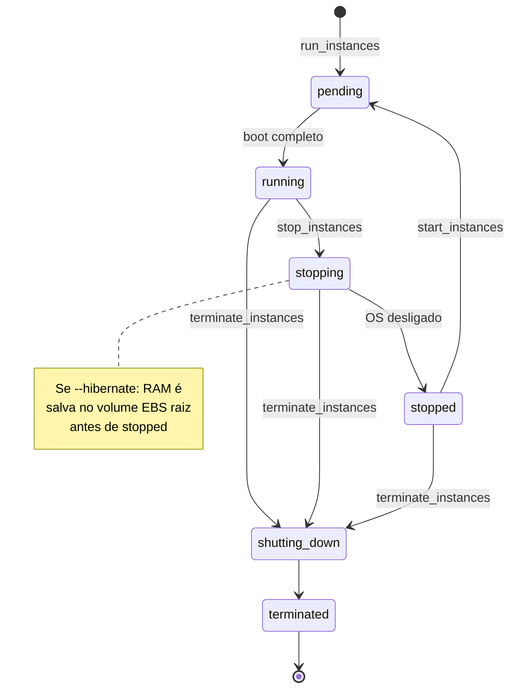
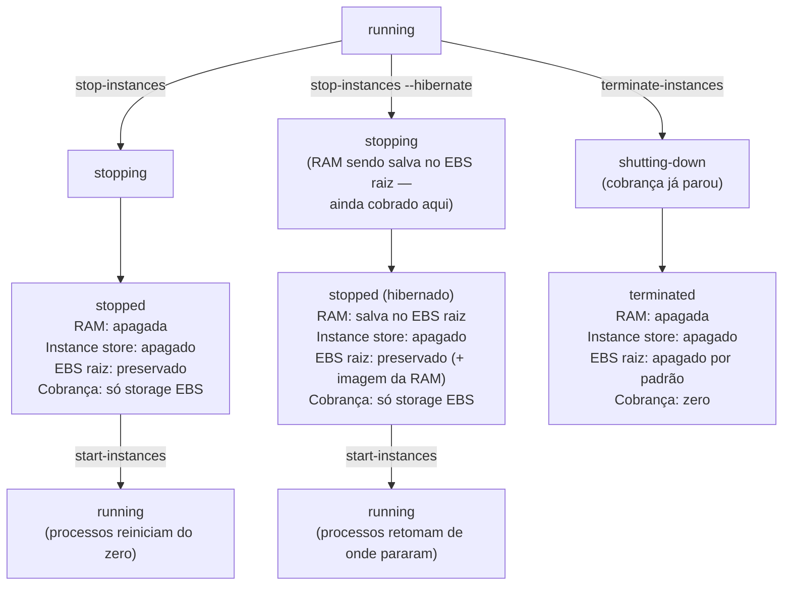
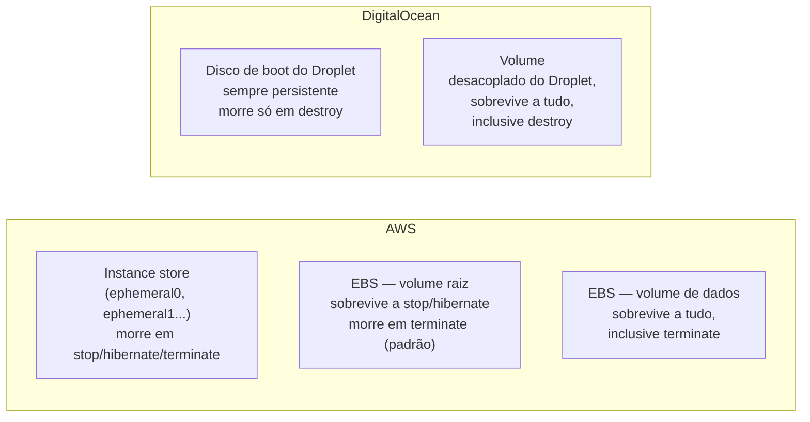

# Ciclo de vida de uma instância

> [!abstract] TL;DR
> "Desligar pra economizar" é uma frase que só é literalmente verdadeira em uma das duas nuvens desta trilha. Na AWS, parar (`stop`) uma instância EC2-backed-by-EBS realmente zera a cobrança de compute — você continua pagando só pelo armazenamento do volume EBS. Na DigitalOcean, desligar um Droplet (`power-off`/`shutdown`) **não** zera nada: a documentação oficial é explícita — "você continua sendo cobrado por Droplets desligados porque os recursos de computação continuam reservados no hipervisor". A única forma de parar de pagar por um Droplet é destruí-lo. Esse é só o primeiro de três eixos que esta nota separa com precisão: **stop vs hibernate vs terminate** (o que cada um faz com a RAM, o disco, o ID da instância); **armazenamento efêmero vs persistente** (instance store, que morre em qualquer parada, contra EBS/disco de boot/Volumes, que sobrevivem); e o que acontece com o IP público, o IP privado e a cobrança em cada estado do ciclo — `pending → running → stopping → stopped → shutting-down → terminated`.

## O problema: duas pessoas, duas surpresas, um mesmo motivo

Duas cenas, meses de diferença, times diferentes, o mesmo erro de mental model.

Na primeira, um engenheiro roda um job de processamento pesado numa instância EC2 `r6i.4xlarge`, com dados intermediários gravados direto no disco local da instância — o volume de **instance store** que veio junto com aquele tipo de instância, rápido o bastante para não virar gargalo do job. O job termina, o engenheiro para a instância (`stop`, não `terminate` — a ideia era só "pausar" até revisar o resultado no dia seguinte) para não pagar a hora de compute à toa. No dia seguinte, ele dá `start` na mesma instância e vai buscar os dados intermediários. Não tem nada lá. O disco existe, mas está vazio — porque instance store **não sobrevive a um stop**, só a um reboot. Os dados intermediários não estavam perdidos por acidente de infraestrutura; estavam perdidos porque `stop` é, por definição na AWS, uma operação que apaga instance store, documentada exatamente assim, sem letra miúda.

Na segunda cena, um time que administra alguns Droplets de homologação decide "desligar todo fim de semana pra economizar" — a mesma lógica intuitiva que funciona muito bem na AWS. Segunda de manhã, a fatura da semana chega com o mesmo valor de compute de sempre. Os Droplets estavam desligados o fim de semana inteiro. A fatura não veio errada: a documentação da DigitalOcean é direta sobre isso — Droplets desligados continuam reservando os recursos de computação no hipervisor, e por isso continuam sendo cobrados. "Desligar" um Droplet, na DigitalOcean, é um estado operacional (não está processando nada), não um estado financeiro (não estou sendo cobrado por ele).

O fio que liga as duas cenas: **cada estado do ciclo de vida de uma instância carrega uma promessa diferente sobre o que sobrevive e o que se paga — e essas duas coisas (sobrevivência de dado, cobrança) não andam juntas por acaso em nenhum dos dois provedores.** Entender o ciclo de vida com precisão é entender exatamente essas duas promessas, estado a estado, e não presumir que o comportamento de um provedor generaliza para o outro.

## Os estados: o mapa completo

A nota 01 desta trilha já introduziu os seis estados principais de uma instância AWS e seus dois equivalentes mais óbvios na DigitalOcean (`pending`/`new`, `running`/`active`, `stopped`/`off`). Esta nota assume esse vocabulário básico e preenche o resto do mapa: os estados de transição, o ramo de hibernação, e — o que a nota 01 deixou de fora de propósito — o que cada transição faz com dado e com cobrança.

A AWS documenta seis estados nomeados para uma EC2 instance, cada um com um código numérico interno (`0`, `16`, `32`, `48`, `64`, `80` — usados internamente pela API, por exemplo em `describe-instances`, mas o nome é o que importa na prática):



A DigitalOcean documenta um conjunto mais enxuto de valores para o campo `status` de um Droplet — `new` (recém-criado, ainda provisionando), `active` (rodando), e `off` (desligado, mas ainda existente e ainda cobrado, como visto na abertura) — sem um estado de transição nomeado equivalente a `stopping`/`shutting-down`: a API da DigitalOcean trata power-off e destroy como ações assíncronas (endpoints de `droplet-action`) cujo progresso se acompanha por um recurso de **Action** separado, não por uma máquina de estados própria do Droplet.

| Momento do ciclo de vida | Estado AWS (`State.Name`) | Status DigitalOcean | O que existe fisicamente |
|---|---|---|---|
| Acabou de ser pedida | `pending` | `new` | Provisionando — disco de boot sendo criado a partir da imagem |
| Rodando | `running` | `active` | vCPU, RAM, disco, rede — tudo ativo |
| Preparando para parar | `stopping` | (sem estado nomeado — ação assíncrona) | OS recebendo sinal de shutdown |
| Parada, mas existe | `stopped` | `off` | Disco de boot (EBS/persistente) preservado; instance store apagado |
| Preparando para terminar | `shutting-down` | (sem estado nomeado — ação assíncrona) | Recursos sendo liberados |
| Terminada/destruída | `terminated` | (Droplet deixa de existir) | Nada — disco raiz apagado por padrão |

> [!info] Fronteira
> A nota 01 desta trilha já cobriu a anatomia básica (vCPU, RAM, disco de boot, interface de rede) e a distinção superficial `stop` vs `terminate`. Esta nota aprofunda: o ramo de hibernação, a diferença entre instance store e EBS, e o comportamento de IP/cobrança estado a estado — sem repetir a introdução ao hipervisor ou ao control plane.

> [!tip] Assista: EC2 Instance States: Start, Stop & Terminate Explained
> **Canal:** CodeLucky | **Duração:** ~4min | **Idioma:** EN
>
> Um resumo rápido e direto da diferença central entre parar (reversível, dado preservado) e terminar (irreversível) — útil como recapitulação de 4 minutos antes de entrar no detalhe estado a estado da tabela abaixo. Trecho de destaque [02:19]: *"Stopping is a reversible action that preserves your data and allows you to restart the instance any time"*
>
> 🎬 [Assistir no YouTube](https://www.youtube.com/watch?v=ei-jLrSvOKc)

## Stop vs hibernate vs terminate: três operações, três destinos para a RAM

A AWS documenta com precisão o que cada uma dessas três operações — reboot, stop/start, hibernate, terminate — faz com quatro coisas: o host físico, o endereço IP, o volume EBS raiz, e o conteúdo da RAM. É a tabela mais densa desta nota, porque é exatamente onde as armadilhas de produção nascem:

| Característica | Reboot | Stop/start | Hibernate | Terminate |
|---|---|---|---|---|
| Host físico | Mesmo host | Pode migrar para host novo | Pode migrar para host novo | Deixa de existir |
| IP privado (IPv4) | Mantido | Mantido | Mantido | Perdido |
| IP público (IPv4) | Mantido | **Novo IP**, a menos que seja Elastic IP | **Novo IP**, a menos que seja Elastic IP | Perdido |
| Elastic IP | Permanece associado | Permanece associado | Permanece associado | Desassociado |
| Instance store | Preservado | **Apagado** | **Apagado** | Apagado |
| Volume raiz (EBS) | Preservado | Preservado | Preservado | Apagado por padrão (`DeleteOnTermination`) |
| Conteúdo da RAM | Apagado | Apagado | **Salvo no volume EBS raiz** | Apagado |
| Cobrança de compute | Continua (mesma hora de billing) | Para em `stopping` | Cobra em `stopping`, para em `stopped` | Para em `shutting-down` |

**Hibernate** é o caso que merece destaque próprio, porque não é "um stop mais lento" — é uma operação qualitativamente diferente. Quando você hiberna uma instância, a AWS sinaliza o sistema operacional para fazer *suspend-to-disk*: o conteúdo inteiro da RAM é gravado no volume EBS raiz antes da instância entrar em `stopped`. Quando você dá `start` de novo, três coisas acontecem em sequência que não acontecem num stop/start comum — o volume raiz é restaurado ao estado anterior, o conteúdo da RAM é recarregado, e **os processos que estavam rodando são retomados de onde pararam**, não reiniciados do zero. É hibernação de verdade, o mesmo conceito de suspender um notebook — só que a "gaveta" onde a RAM é guardada é o próprio disco EBS raiz da instância, e por isso o hibernate exige que esse volume tenha espaço sobrando pelo menos igual ao tamanho da RAM da instância, entre outros pré-requisitos que a documentação lista (tipo de instância elegível, AMI configurada para hibernação, criptografia do volume raiz).



> [!tip] Assista: EC2 Instance Hibernation | Stopping | Use cases | Hands-On
> **Canal:** Srce Cde | **Duração:** ~18min | **Idioma:** EN
>
> Usa a mesma analogia do notebook (hibernar vs. desligar) que a nota descreve, e demonstra ao vivo o que acontece com a instância store e a RAM ao comparar as duas operações — bom reforço visual do mermaid acima. Trecho de destaque [00:23]: *"the basic difference between stop and hibernate — imagine you have a computer at [home]"*
>
> 🎬 [Assistir no YouTube](https://www.youtube.com/watch?v=Er9KE93r6Go)

Na DigitalOcean, esse eixo simplesmente não existe como funcionalidade nomeada: não há um `doctl compute droplet-action hibernate`. O que existe são duas formas de desligar — `shutdown` (tenta um desligamento gracioso via ACPI, equivalente a rodar `shutdown` de dentro do sistema operacional) e `power-off` (desligamento forçado, equivalente a cortar a energia de um servidor físico, e a própria documentação recomenda usá-lo só se o `shutdown` gracioso falhar ou demorar demais) — e nenhuma delas salva o conteúdo da RAM em lugar nenhum. Um Droplet desligado por qualquer um dos dois comandos perde o conteúdo da memória exatamente como um stop comum na AWS; a única coisa que resta é o disco.

## O eixo central: instance store efêmero vs disco persistente

Este é o eixo que a cena de abertura desta nota ilustrou com o job de processamento perdido, e vale nomeá-lo com precisão porque a confusão entre os dois tipos de armazenamento é, de longe, a fonte mais comum de perda de dado "inesperada" em produção.

**Instance store** é armazenamento em disco fisicamente anexado ao servidor físico que hospeda a instância — não um volume de rede, um disco de verdade, parafusado (ou soldado) naquele host. A documentação da AWS é clara sobre o propósito: "ideal para armazenamento temporário de informação que muda com frequência, como buffers, caches, dados de scratch" — e sobre o preço: não há cobrança adicional por ele, o custo já está embutido no preço da instância que o oferece (nem todo tipo de instância tem instance store; é uma característica do tipo, não uma opção universal). O nome técnico dos dispositivos virtuais que ele expõe é revelador por si só: `ephemeral0`, `ephemeral1`, e assim por diante.

**EBS** (Elastic Block Store) é o oposto estrutural: um volume de armazenamento em rede, desacoplado do host físico específico onde a instância roda naquele momento, que sobrevive a qualquer coisa que aconteça com a instância — exceto a própria instância ser terminada com o volume configurado para ser apagado junto (`DeleteOnTermination`, que é o padrão só para o volume raiz; volumes de dados adicionais sobrevivem à terminação por padrão). É por isso que só instâncias **com volume raiz em EBS** podem ser paradas e reiniciadas — a documentação da AWS é direta: "você não pode parar e iniciar instâncias com um volume raiz de instance store." Uma instância com raiz em instance store só sabe fazer duas coisas ao encerrar: reiniciar (reboot) ou terminar. Não existe `stop` para ela.

| Eixo | Instance store | EBS |
|---|---|---|
| Onde fica fisicamente | Disco local do host físico | Volume de rede, desacoplado do host |
| Sobrevive a reboot | Sim | Sim |
| Sobrevive a stop/start | **Não — apagado** | Sim |
| Sobrevive a hibernate | **Não — apagado** | Sim (e recebe a imagem da RAM) |
| Sobrevive a terminate | Não | Volume raiz: não (por padrão) · volumes extras: sim |
| Cobrança | Incluído no preço da instância | Cobrado por GB-mês provisionado, à parte |
| Uso natural | Cache, buffer, scratch, dado replicável | Sistema operacional, dado que precisa durar |

Na DigitalOcean, o disco de boot de um Droplet **é sempre persistente** por padrão — não existe um equivalente de instance store como opção separada de disco efêmero anexado ao host físico; todo Droplet nasce com um disco que sobrevive a `power-off`/`shutdown` e só desaparece quando o Droplet é destruído. Para armazenamento além do disco de boot, a DigitalOcean oferece **Volumes** — block storage em rede, explicitamente desacoplado do ciclo de vida de qualquer Droplet específico: um Volume pode ser desanexado de um Droplet, anexado a outro, redimensionado e ter snapshots tirados independentemente, exatamente o papel que um volume EBS de dados (não o raiz) cumpre na AWS.



> [!info] Fronteira
> A anatomia completa de EBS (tipos de volume gp3/io2, IOPS, throughput), Spaces/Volumes da DigitalOcean e a diferença entre armazenamento em bloco e em objeto são assunto do galho de **Armazenamento** mais adiante nesta trilha. Esta nota trata só do que é relevante para o ciclo de vida da instância: o que some e o que fica quando ela muda de estado.

## Casos práticos: os comandos lado a lado

**Parar e reiniciar (o caso comum).** Na AWS, o par `stop-instances`/`start-instances` — sem `--hibernate` — é o equivalente direto de desligar e ligar um computador de novo, com a ressalva já conhecida sobre instance store:

```bash
# AWS — parar (compute para de ser cobrado; EBS raiz continua sendo cobrado)
$ aws ec2 stop-instances --instance-ids i-0abcd1234efgh5678
{
    "StoppingInstances": [
        {
            "InstanceId": "i-0abcd1234efgh5678",
            "CurrentState": {"Code": 64, "Name": "stopping"},
            "PreviousState": {"Code": 16, "Name": "running"}
        }
    ]
}
```

```bash
# AWS — reiniciar (nova hora de billing; IP público pode mudar)
$ aws ec2 start-instances --instance-ids i-0abcd1234efgh5678
{
    "StartingInstances": [
        {
            "InstanceId": "i-0abcd1234efgh5678",
            "CurrentState": {"Code": 0, "Name": "pending"},
            "PreviousState": {"Code": 80, "Name": "stopped"}
        }
    ]
}
```

O `stop-instances` aceita ainda `--skip-os-shutdown`, para pular o desligamento gracioso do sistema operacional e ir direto para um corte forçado — a documentação avisa que isso arrisca corrupção de dado e deveria ser reserva para quando o desligamento gracioso trava:

```bash
# AWS — desligamento forçado, sem esperar o SO desligar graciosamente
$ aws ec2 stop-instances --instance-ids i-0abcd1234efgh5678 --skip-os-shutdown
```

O equivalente conceitual na DigitalOcean é `power-off`/`power-on`, com a diferença de billing já discutida na abertura — desligar não interrompe a cobrança:

```bash
# DigitalOcean — desligamento forçado (hard shutdown)
$ doctl compute droplet-action power-off 389123456 --wait
ID           Status      Type         StartedAt               CompletedAt              ResourceID
1234567890   completed   power_off    2026-07-23T14:02:11Z    2026-07-23T14:02:34Z      389123456
```

```bash
# DigitalOcean — religar
$ doctl compute droplet-action power-on 389123456 --wait
ID           Status      Type        StartedAt               CompletedAt              ResourceID
1234567891   completed   power_on    2026-07-23T14:10:02Z    2026-07-23T14:10:19Z      389123456
```

A própria documentação da DigitalOcean recomenda um caminho de dois passos que espelha o `--skip-os-shutdown` da AWS, só que invertido em ordem: tentar `shutdown` (gracioso) primeiro, com um timeout razoável, e recorrer a `power-off` (forçado) só se o gracioso não completar:

```bash
# DigitalOcean — tentativa graciosa primeiro (equivalente ao "shutdown" de dentro do SO)
$ doctl compute droplet-action shutdown 389123456 --wait
```

**Hibernar (só na AWS).** Passar `--hibernate` no mesmo `stop-instances` muda a natureza da operação — mas só funciona se a instância tiver sido **lançada** com hibernação habilitada; a documentação da AWS é categórica: "você não pode habilitar hibernação numa instância já existente, rodando ou parada" — é uma decisão que só pode ser tomada no `run-instances` original, com `--hibernation-options Configured=true`. Além disso, um punhado de pré-requisitos precisa ser atendido ao mesmo tempo:

| Pré-requisito | Exigência |
|---|---|
| Momento de habilitar | Só no lançamento (`run-instances`) — nunca depois |
| Tamanho da RAM (Linux) | Menor que 150 GiB |
| Tipo do volume raiz | EBS (nunca instance store) |
| Criptografia do volume raiz | Obrigatória — a RAM salva no disco é sempre criptografada |
| Tipo de volume EBS aceito | `gp2`, `gp3`, `io1` ou `io2` |
| AMI | Precisa ser uma AMI HVM explicitamente listada como compatível com hibernação |

Checar quais tipos de instância suportam hibernação, numa região específica, é uma consulta direta ao catálogo:

```bash
# AWS — listar tipos de instância com suporte a hibernação
$ aws ec2 describe-instance-types \
    --filters Name=hibernation-supported,Values=true \
    --query "InstanceTypes[*].[InstanceType]" \
    --output text | sort
c5.large
c5.xlarge
m5.large
m5.xlarge
...
```

```bash
# AWS — hibernar em vez de simplesmente parar
$ aws ec2 stop-instances --instance-ids i-0abcd1234efgh5678 --hibernate
{
    "StoppingInstances": [
        {
            "InstanceId": "i-0abcd1234efgh5678",
            "CurrentState": {"Code": 64, "Name": "stopping"},
            "PreviousState": {"Code": 16, "Name": "running"}
        }
    ]
}
```

Repare que a resposta é idêntica à de um `stop` comum — a diferença está inteiramente em como a AWS trata o estado `stopping` internamente (salvando a RAM) e na cobrança durante essa janela: ao contrário de um stop comum, onde `stopping` já não é cobrado, um hibernate **é cobrado enquanto está em `stopping`**, porque a operação de gravar a RAM inteira no EBS leva tempo e usa recursos de compute de verdade.

**Terminar/destruir (o fim de linha).** Na AWS, `terminate-instances` é irreversível — e, ao contrário de `stop`, a cobrança para imediatamente, no instante em que o estado muda para `shutting-down`, não esperando chegar a `terminated`:

```bash
# AWS — terminar definitivamente (cobrança para em "shutting-down", não em "terminated")
$ aws ec2 terminate-instances --instance-ids i-0abcd1234efgh5678
{
    "TerminatingInstances": [
        {
            "InstanceId": "i-0abcd1234efgh5678",
            "CurrentState": {"Code": 32, "Name": "shutting-down"},
            "PreviousState": {"Code": 16, "Name": "running"}
        }
    ]
}
```

O equivalente na DigitalOcean é `droplet delete` — sem estado intermediário nomeado, e com um `--force` que só serve para pular a confirmação interativa, não para forçar um desligamento (isso já é papel do `power-off`):

```bash
# DigitalOcean — destruir definitivamente, sem prompt de confirmação
$ doctl compute droplet delete 389123456 --force
```

**Verificando o estado antes de agir.** Em qualquer automação séria, checar o estado atual antes de decidir a próxima ação evita boa parte das armadilhas cobertas na próxima seção:

```bash
# AWS — consultar só o nome do estado atual
$ aws ec2 describe-instances --instance-ids i-0abcd1234efgh5678 \
    --query "Reservations[].Instances[].State.Name" --output text
stopped
```

```bash
# DigitalOcean — consultar status e IP público atuais
$ doctl compute droplet get 389123456 --format ID,Status,PublicIPv4
ID           Status    Public IPv4
389123456    off       -
```

Repare no traço (`-`) no lugar do IP público: um Droplet desligado não tem endereço IPv4 público ativo listado — diferente da AWS, onde a instância `stopped` simplesmente perde o IP público antigo e recebe um novo assim que reiniciada (a menos que seja um Elastic IP).

**Confirmando que a hibernação está de fato ligada.** Como hibernação só pode ser habilitada no lançamento, e nunca depois, vale conferir isso antes de assumir que um `--hibernate` vai funcionar — o campo `HibernationOptions.Configured` no `describe-instances` responde exatamente essa pergunta:

```bash
# AWS — confirmar se a instância foi lançada com hibernação habilitada
$ aws ec2 describe-instances --instance-ids i-0abcd1234efgh5678 \
    --query "Reservations[].Instances[].HibernationOptions.Configured" \
    --output text
True
```

Se a resposta for `False`, `stop-instances --hibernate` nessa instância específica não vai hibernar coisa nenhuma — o caminho, nesse caso, é terminar e relançar com `--hibernation-options Configured=true` desde o início, não uma correção que se aplica a quente numa instância já rodando.

## Duas peças que fecham o quadro operacional

Duas coisas menores, mas que aparecem direto em produção real, terminam de fechar o vocabulário desta nota — porque as duas mexem em quando exatamente uma instância entra no ramo de terminação, não só no que acontece depois que ela entra.

**Proteção contra terminação acidental.** Toda EC2 instance suporta um atributo chamado `disableApiTermination` — quando ligado, um `terminate-instances` chamado via CLI, SDK ou console simplesmente falha, sem apagar nada. É a rede de segurança contra o erro mais banal de operação: alguém seleciona a instância errada numa lista de vinte e aperta "terminar". A proteção pode ser ligada tanto no lançamento quanto depois, a qualquer momento:

```bash
# AWS — ligar proteção contra terminação numa instância já existente
$ aws ec2 modify-instance-attribute \
    --instance-id i-0abcd1234efgh5678 \
    --disable-api-termination
```

```bash
# AWS — tentando terminar com a proteção ligada: falha, nada é apagado
$ aws ec2 terminate-instances --instance-ids i-0abcd1234efgh5678
An error occurred (OperationNotPermitted) when calling the TerminateInstances
operation: The instance 'i-0abcd1234efgh5678' may not be terminated.
Modify its 'disableApiTermination' instance attribute and try again.
```

Conferir se a proteção está ligada, sem precisar tentar terminar de verdade para descobrir, é uma consulta separada ao atributo:

```bash
# AWS — checar se a proteção contra terminação está ligada
$ aws ec2 describe-instance-attribute \
    --instance-id i-0abcd1234efgh5678 \
    --attribute disableApiTermination \
    --query "DisableApiTermination.Value"
true
```

Intimamente ligado a isso está um segundo atributo, `InstanceInitiatedShutdownBehavior`, que decide o que acontece quando o comando de desligar roda **de dentro** do sistema operacional — um `shutdown` ou `poweroff` do Linux, não uma chamada de API. O padrão é `stop` (a instância só para); mudar para `terminate` faz o mesmo comando, rodado de dentro do SO, apagar a instância de vez — um detalhe que costuma surpreender quem espera que "desligar o sistema operacional lá de dentro" seja sempre uma operação reversível:

```bash
# AWS — mudar o comportamento: shutdown de dentro do SO passa a terminar, não parar
$ aws ec2 modify-instance-attribute \
    --instance-id i-0abcd1234efgh5678 \
    --instance-initiated-shutdown-behavior terminate
```

**Redimensionar exige desligar primeiro (só na DigitalOcean).** Um detalhe que antecipa a próxima nota desta trilha, sobre tamanhos e famílias de instância: na AWS, trocar o `InstanceType` de uma instância parada é só um atributo a mais para modificar antes do próximo `start`. Na DigitalOcean, o Droplet **precisa estar desligado** para ser redimensionado via `doctl` — a própria documentação recomenda desligar pelo próprio sistema operacional (`shutdown -h now`) em vez de confiar no `power-off` da API, justamente para reduzir o risco de corrupção de dado durante o resize:

```bash
# DigitalOcean — resize exige o Droplet já desligado
$ doctl compute droplet-action power-off 389123456 --wait
$ doctl compute droplet-action resize 389123456 --size s-4vcpu-8gb --wait
```

## Tabela de tradução

| Conceito | AWS | Azure | GCP | DigitalOcean |
|---|---|---|---|---|
| Estado "parado, mas cobrado" | Não existe — `stopped` já não cobra compute | `Stopped` (allocated) — desligado pelo guest OS, ainda aloca hardware, **ainda cobrado** | Não documentado como estado separado — `TERMINATED` já não cobra compute | `off` — sempre cobrado enquanto não for destruído |
| Estado "parado, sem cobrança" | `stopped` (compute) | `Deallocated` — libera o hardware, aí sim não cobra compute | `TERMINATED`/`STOPPED` | Não existe — só `off` (cobrado) ou destruído |
| Hibernação (RAM preservada) | Hibernate — RAM salva no EBS raiz | Hibernate — vira `Hibernated (Deallocated)`, sem cobrança de compute | Suspend/Resume — RAM preservada, cobrada durante `SUSPENDING`/`SUSPENDED` | Não existe |
| Encerramento definitivo | `terminate-instances` | Delete | `instances delete` | `droplet delete` |

> [!info] Caducidade
> Nomes de estado e política de billing de Azure (`Stopped` vs `Deallocated`) e GCP (suspend/resume) verificados por documentação oficial em 2026-07-23 — só como tradução conceitual, sem sintaxe de CLI dessas duas plataformas verificada ou assumida nesta nota.

## Armadilhas comuns

> [!warning] Achar que instance store sobrevive a qualquer coisa que não seja "terminate"
> A cena de abertura desta nota é exatamente esse engano: instance store é apagado em **stop**, não só em terminate. A documentação da AWS é explícita — "quando você para uma instância, os dados em qualquer volume de instance store são apagados." Reboot preserva instance store; stop, hibernate e terminate, não. Se o dado precisa sobreviver a uma parada planejada, ele nunca deveria estar só em instance store — cópia para EBS ou S3 antes de qualquer stop é obrigatória, não opcional.

> [!warning] Assumir que "desligar" sempre significa "parar de pagar"
> A segunda cena de abertura. Na AWS, `stop` de fato zera a cobrança de compute (mantendo só o storage do EBS). Na DigitalOcean, `power-off`/`shutdown` **não** zera cobrança nenhuma — a documentação é explícita sobre os recursos ficarem reservados no hipervisor. Quem administra Droplets pensando em economizar com desligamentos programados está, sem saber, pagando o preço cheio do Droplet ligado. A única alavanca real de economia na DigitalOcean é destruir e recriar (ou usar planos menores), não desligar.

> [!warning] Confundir a cobrança que para em `shutting-down` com a que para em `stopped`
> Terminar uma instância AWS para de cobrar assim que o estado muda para `shutting-down` — antes mesmo de chegar a `terminated`. Parar uma instância comum (sem hibernação) também para de cobrar em `stopping`. Mas **hibernar** é a exceção: a cobrança continua durante o `stopping` do hibernate, porque a gravação da RAM no EBS ainda está consumindo recursos de compute — só para quando o estado efetivamente chega a `stopped`. Tratar as três operações como "param de cobrar no mesmo momento" é um erro fino, mas real, em previsão de custo.

> [!warning] Esperar IP público fixo depois de um stop/start sem Elastic IP
> Uma instância AWS que passa por `stop`/`start` recebe, por padrão, um **IP público novo** — não o mesmo de antes — a menos que esse IP seja um Elastic IP explicitamente alocado (assunto que a trilha de rede aprofunda mais adiante). Scripts de automação que assumem "o IP não muda depois de reiniciar" quebram silenciosamente na primeira vez que alguém para e inicia a instância por qualquer motivo — manutenção, troca de tipo de instância, ou um evento de retirada de host iniciado pela própria AWS.

## O que vem a seguir

Esta nota respondeu duas perguntas que ficaram em aberto desde a nota 01: *o que exatamente cada transição de estado apaga* e *o que exatamente cada transição de estado cobra* — e por que essas duas respostas não são as mesmas na AWS e na DigitalOcean. Mas todo o raciocínio de custo feito aqui tratou "compute" como uma coisa só, cobrada por hora ou por segundo, num preço fixo. Isso é uma simplificação enorme: a mesma instância `t2.micro` ou o mesmo Droplet `s-2vcpu-2gb` pode custar preços radicalmente diferentes dependendo de como você se compromete a usá-la — pagando o preço cheio sob demanda, comprando um compromisso de longo prazo com desconto agressivo, ou aceitando ser interrompido a qualquer momento em troca do preço mais baixo que a nuvem oferece. Os modelos de preço de compute — on-demand, reserved e spot — são o assunto denso da próxima nota desta trilha.

## Fontes

- [AWS — Amazon EC2 instance state changes](https://docs.aws.amazon.com/AWSEC2/latest/UserGuide/ec2-instance-lifecycle.html) — os seis estados nomeados, tabela de billing por estado, tabela de diferenças entre reboot/stop-start/hibernate/terminate (host, IPs, instance store, volume raiz, RAM, cobrança); acessado em 2026-07-23.
- [AWS — Stop and start Amazon EC2 instances](https://docs.aws.amazon.com/AWSEC2/latest/UserGuide/Stop_Start.html) — restrição de stop/start a instâncias com raiz EBS, aviso de apagamento de instance store, comportamento de IP público/privado após restart, flag `--skip-os-shutdown`; acessado em 2026-07-23.
- [AWS — Hibernate your Amazon EC2 instance](https://docs.aws.amazon.com/AWSEC2/latest/UserGuide/Hibernate.html) — suspend-to-disk, RAM salva no volume EBS raiz, retomada de processos, cobrança durante `stopping` vs `stopped`; acessado em 2026-07-23.
- [AWS — Prerequisites for EC2 instance hibernation](https://docs.aws.amazon.com/AWSEC2/latest/UserGuide/hibernating-prerequisites.html) — hibernação só habilitável no lançamento, limite de RAM (<150 GiB Linux), exigência de volume raiz EBS criptografado, tipos de volume aceitos, comando `describe-instance-types` com filtro `hibernation-supported`; acessado em 2026-07-23.
- [AWS — Instance store temporary block storage for EC2 instances](https://docs.aws.amazon.com/AWSEC2/latest/UserGuide/InstanceStorage.html) — definição de instance store, nomes de dispositivo `ephemeral0`+, ausência de cobrança adicional; acessado em 2026-07-23.
- [AWS CLI — ec2 stop-instances (Command Reference)](https://docs.aws.amazon.com/cli/latest/reference/ec2/stop-instances.html) — sintaxe de `--instance-ids`, `--hibernate`, `--skip-os-shutdown`, `--force`; acessado em 2026-07-23.
- [AWS CLI — ec2 terminate-instances (Command Reference)](https://docs.aws.amazon.com/cli/latest/reference/ec2/terminate-instances.html) — sintaxe, campos de saída `CurrentState`/`PreviousState`, tabela de códigos de estado; acessado em 2026-07-23.
- [DigitalOcean — doctl compute droplet-action power-off (CLI Reference)](https://docs.digitalocean.com/reference/doctl/reference/compute/droplet-action/power-off/) — desligamento forçado (hard shutdown), Droplets desligados continuam sendo cobrados (recursos reservados no hipervisor); acessado em 2026-07-23.
- [DigitalOcean — doctl compute droplet-action shutdown (CLI Reference)](https://docs.digitalocean.com/reference/doctl/reference/compute/droplet-action/shutdown/) — desligamento gracioso via ACPI, recomendação de tentar shutdown antes de power-off; acessado em 2026-07-23.
- [DigitalOcean — doctl compute droplet-action power-on (CLI Reference)](https://docs.digitalocean.com/reference/doctl/reference/compute/droplet-action/power-on/) — sintaxe de religamento; acessado em 2026-07-23.
- [DigitalOcean — doctl compute droplet delete (CLI Reference)](https://docs.digitalocean.com/reference/doctl/reference/compute/droplet/delete/) — sintaxe, flag `--force` para pular confirmação, natureza irreversível; acessado em 2026-07-23.
- [DigitalOcean — Droplet pricing FAQ](https://docs.digitalocean.com/products/droplets/details/pricing/) — Droplets desligados continuam sendo cobrados porque os recursos de computação ficam reservados no hipervisor; destruir é a única forma de encerrar a cobrança; acessado em 2026-07-23.
- [DigitalOcean — Volumes (Block Storage) overview](https://docs.digitalocean.com/products/volumes/) — Volumes como block storage em rede, desacoplado do ciclo de vida de um Droplet específico, redimensionável e snapshot sob demanda; acessado em 2026-07-23.
- [AWS — Amazon EBS pricing](https://aws.amazon.com/ebs/pricing/) — cobrança de armazenamento por GB-mês provisionado, independente do estado da instância anexada; acessado em 2026-07-23.
- [AWS — Terminate Amazon EC2 instances](https://docs.aws.amazon.com/AWSEC2/latest/UserGuide/terminating-instances.html) — proteção contra terminação (`disableApiTermination`), erro retornado ao tentar terminar com proteção ligada, flag `--skip-os-shutdown`; acessado em 2026-07-23.
- [DigitalOcean — Resize a Droplet](https://docs.digitalocean.com/products/droplets/how-to/resize/) — exigência de desligar o Droplet antes do resize via API/CLI, recomendação de desligar pelo próprio SO em vez de `power-off`; acessado em 2026-07-23.
- [Microsoft Learn — States and billing status: Azure Virtual Machines](https://learn.microsoft.com/en-us/azure/virtual-machines/states-billing) — estados `Stopped` (allocated, cobrado) vs `Deallocated` (não cobrado), `Hibernated (Deallocated)`; acessado em 2026-07-23.
- [Google Cloud — Compute Engine instance life cycle](https://docs.cloud.google.com/compute/docs/instances/instance-life-cycle) — estados `RUNNING`/`STOPPING`/`TERMINATED`/`SUSPENDING`/`SUSPENDED`, suspend/resume com RAM preservada, cobrança de compute só em `RUNNING`/`PENDING_STOP`/janela de suspend; acessado em 2026-07-23.

> [!info] Caducidade
> Comportamento de billing por estado (especialmente a política de cobrança de Droplets desligados na DigitalOcean e a cobrança durante `stopping` de um hibernate na AWS) verificado por documentação oficial em 2026-07-23 — é uma das áreas mais sensíveis a mudança de política comercial entre os dois provedores; confira a documentação vigente antes de basear decisão de custo em produção nestes números.
