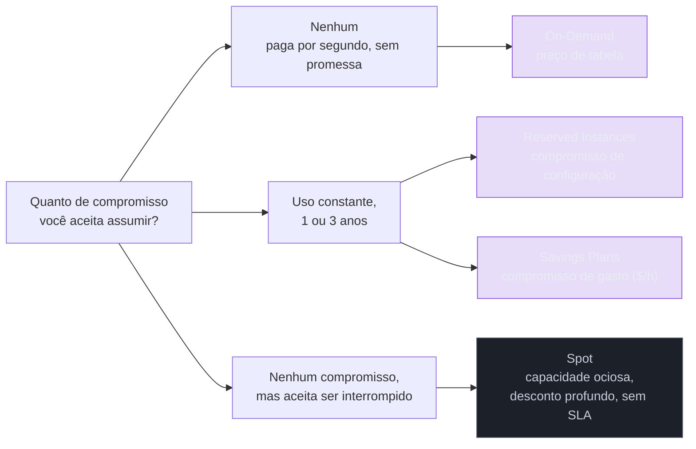
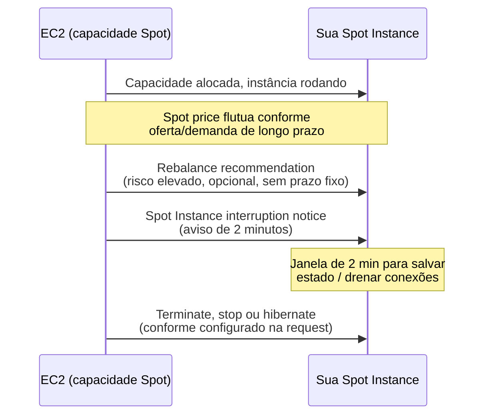
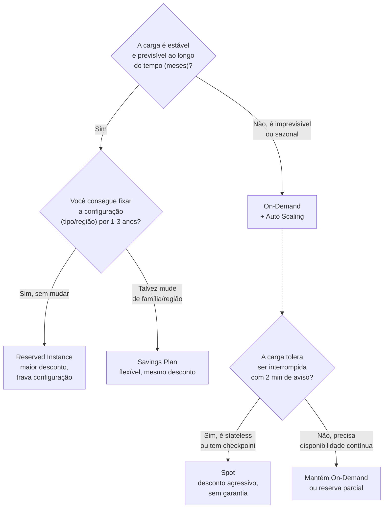

# Modelos de preço: on-demand, reserved e spot

> [!abstract] TL;DR
> Duas empresas rodam exatamente a mesma instância — mesmo tipo, mesma região, mesma carga — e uma paga menos de um terço do que a outra paga pela outra. Não é erro de fatura: é **modelo de compra**. A AWS separa o *preço* do *hardware* da *disposição de se comprometer* com ele: pagar por segundo sem promessa nenhuma (**on-demand**), prometer um volume de uso constante por 1 ou 3 anos em troca de desconto (**Reserved Instances** e **Savings Plans** — que não são a mesma coisa, e a diferença é uma pergunta clássica de entrevista), ou pegar capacidade ociosa da AWS por um desconto agressivo, sabendo que ela pode ser retomada a qualquer momento com apenas dois minutos de aviso (**Spot**). A DigitalOcean, coerente com seu design mais simples, não oferece esse cardápio: Droplet tem preço fixo por hora com teto mensal, ponto final — sem spot, sem reserva negociada, sem Savings Plan. Entender esse cardápio é o que separa quem lê uma fatura de nuvem de quem projeta uma.

## O problema: a mesma instância, três faturas diferentes

Imagine duas startups, ambas rodando um cluster de dez instâncias `m5.large` na mesma região, processando cargas de trabalho comparáveis. A Startup A recebe a fatura do mês e vê o valor exato que esperava — o preço de tabela publicado no site da AWS, multiplicado pelas horas rodadas. A Startup B recebe uma fatura **62% menor** pela mesma quantidade de instâncias, do mesmo tipo, na mesma região, rodando o mesmo tanto de tempo.

Ninguém foi hackeado. Ninguém negociou um desconto secreto por telefone. A diferença inteira está numa decisão que a Startup B tomou meses antes e a Startup A nunca tomou: **como ela se comprometeu com aquele hardware antes de usá-lo.**

Esse é o ponto cego mais caro do FinOps de compute: tratar o preço listado do console como se fosse *o* preço, e não *um* preço entre vários — o mais caro de todos, aliás, porque é o único que não pede nada em troca. A AWS não esconde os outros modelos; ela simplesmente não os aplica por padrão. Quem não vai atrás deles paga o preço de quem nunca se comprometeu com nada — o que é, ironicamente, exatamente o comportamento que o on-demand foi desenhado para servir: elasticidade total, ao custo máximo.

A maioria das faturas de nuvem infladas que um consultor externo encontra numa auditoria de custos não vem de configuração errada, nem de recurso esquecido ligado sem uso — embora isso também aconteça e mereça sua própria auditoria. Vem, com frequência desproporcional, de instâncias corretamente dimensionadas, corretamente utilizadas, e pagas do jeito mais caro possível — porque ninguém, desde o dia do primeiro deploy, parou para perguntar se existia um jeito mais barato de comprar exatamente a mesma coisa.

> [!info] Fronteira
> A pergunta "quanto custa" pressupõe a pergunta "que tipo de instância" já respondida — família, vCPU, memória. Isso é o **perfil** do recurso, coberto na nota anterior desta trilha, [[03-Dominios/Tecnologia/Cloud/05 - Compute I — máquinas virtuais/02 - Tipos e famílias de instância|Tipos e famílias de instância]]. Esta nota assume esse perfil já escolhido e foca só no **compromisso de compra** sobre ele — a variável que muda o preço final sem mudar uma linha da configuração da máquina.

## O eixo único: quanto você promete, e o que ganha em troca

Todo modelo de preço de compute na AWS pode ser lido através de um único eixo: **quanto de certeza sobre uso futuro você está disposto a trocar por desconto sobre o preço de tabela.** Zero certeza, preço cheio. Certeza total por 1-3 anos, desconto profundo. Zero certeza *e* disposição a ser interrompido a qualquer momento, desconto ainda mais profundo — porque agora você está vendendo de volta pra AWS a própria previsibilidade que ela precisa para vender capacidade garantida a outra pessoa.



Repare que não existe um modelo "melhor" no vácuo — existe o modelo certo para a *forma* da carga de trabalho. Uma carga estável e previsível (o banco de dados de produção que roda 24/7 há dois anos e vai continuar rodando) desperdiça dinheiro em on-demand. Uma carga tolerante a falha e interrompível (renderização de vídeo em lote, treinamento de modelo, processamento de fila) desperdiça dinheiro pagando o preço de algo que nunca precisou de garantia de disponibilidade contínua. E um pico de tráfego imprevisível (Black Friday, lançamento de produto) é exatamente o caso para o qual on-demand foi desenhado — pagar mais por hora é o preço de não ter promessa nenhuma sobre volume.

É por isso que a resposta a "qual modelo devo usar" quase nunca é um nome único — é uma composição. E é justamente essa composição, revisitada com alguma regularidade conforme a carga real evolui, que separa uma conta que trata compute como custo fixo de uma que trata compute como uma variável ativamente gerenciada.

Vale notar que esses três modelos não são mutuamente excludentes dentro de uma única conta — na prática, a conta de qualquer empresa madura mistura os três ao mesmo tempo, cada um cobrindo a fatia da carga para a qual foi desenhado. A base estável de tráfego (a carga que nunca cai abaixo de um certo piso, mês após mês) vive coberta por Savings Plan ou RI. A variação acima desse piso — o que sobe e desce conforme o dia, a hora, o evento sazonal — fica em on-demand, frequentemente atrás de um Auto Scaling Group. E o que for tolerante a interrupção — filas, batch, CI/CD — migra para Spot sempre que possível. Uma conta que usa só um desses três modelos para tudo, seja qual for, está deixando dinheiro na mesa em alguma fatia da própria carga.

## On-Demand: o preço sem promessa

**On-Demand** é o modelo padrão de qualquer instância EC2 lançada sem nenhuma configuração adicional de compra: você paga pelo tempo de execução, cobrado por segundo, sem contrato, sem mínimo, sem aviso prévio para desligar. A documentação oficial da AWS o descreve como pagar "by the second, for the instances that you launch" — sem letras miúdas além dessa.

O valor do on-demand não é ser barato — é **não pedir nada**. Você pode lançar uma instância agora e terminá-la em cinco minutos, sem penalidade, sem ter comprado nada com antecedência que sobre não utilizado. É o modelo certo exatamente quando a incerteza é a característica central do problema: um ambiente de teste que sobe e desce todo dia, uma carga de trabalho nova cujo padrão de uso ainda ninguém conhece, ou a capacidade extra que absorve um pico que pode não se repetir.

```bash
# Lançar uma instância on-demand comum — nenhuma flag de compra especial
$ aws ec2 run-instances \
    --image-id ami-0abcdef1234567890 \
    --instance-type m5.large \
    --count 1 \
    --key-name minha-chave

# Consultar o preço de tabela publicado (não é a Pricing API completa,
# mas dá a régua rápida do que se está pagando por hora)
$ aws pricing get-products \
    --service-code AmazonEC2 \
    --filters "Type=TERM_MATCH,Field=instanceType,Value=m5.large" \
              "Type=TERM_MATCH,Field=regionCode,Value=us-east-1" \
    --max-results 1
```

A resposta da `describe-instances` para uma instância on-demand não carrega nenhum campo de "compromisso" — porque não existe nenhum:

```json
{
    "InstanceId": "i-0a1b2c3d4e5f67890",
    "InstanceType": "m5.large",
    "InstanceLifecycle": null,
    "State": { "Name": "running" }
}
```

## Reserved Instances: compromisso de configuração

Uma **Reserved Instance (RI)** não é uma máquina reservada fisicamente — é, segundo a documentação oficial da AWS, "não instâncias físicas, mas sim um desconto de faturamento aplicado ao uso de instâncias On-Demand na sua conta". Você compromete-se com uma **configuração específica** — tipo de instância, região, tenancy (compartilhada ou dedicada) e plataforma (Linux ou Windows) — por um termo de 1 ou 3 anos, e qualquer instância on-demand rodando que combine com essa configuração passa a receber o desconto automaticamente.

Dois atributos definem uma RI, além do termo:

- **Offering class**: **Standard** oferece o maior desconto, mas só pode ser *modificada* (trocar AZ, tamanho dentro da mesma família, escopo), nunca *trocada* por outro tipo de instância. **Convertible** oferece desconto menor, mas pode ser *exchanged* por outra Convertible RI com atributos de instância diferentes — a flexibilidade de trocar de família custa desconto.
- **Payment option**: **All Upfront** (paga tudo adiantado, maior desconto), **Partial Upfront** (parte adiantada, parte por hora) ou **No Upfront** (nada adiantado, cobrança horária com desconto durante todo o termo — mas ainda é um compromisso contratual de pagar o termo inteiro).

Uma RI, uma vez comprada, **não pode ser cancelada** — só modificada, trocada (se Convertible) ou revendida no **Reserved Instance Marketplace**, um mercado secundário onde outros clientes AWS compram RIs de terceiros por prazos mais curtos e preços diferentes do catálogo oficial.

Existe ainda uma terceira dimensão, além de offering class e payment option: o **escopo** da RI. Uma RI **regional** aplica o desconto a qualquer Availability Zone dentro da região escolhida, sem reservar capacidade física em nenhuma AZ específica — mais flexível, mas sem garantia de que a capacidade vai estar disponível quando você precisar lançar a instância. Uma RI **zonal** trava a AZ específica e, em troca dessa rigidez, **garante capacidade reservada** naquela zona — a única forma, entre os modelos desta nota, de comprar não só desconto, mas a certeza física de que a instância vai conseguir subir quando for necessário, mesmo numa AZ sob alta demanda geral. É esse detalhe que explica por que a tabela comparativa mais adiante marca "garantia de capacidade reservada" como algo que só RI oferece, e Savings Plan não.

```bash
# Buscar ofertas de RI disponíveis para m5.large em us-east-1, termo de 1 ano
$ aws ec2 describe-reserved-instances-offerings \
    --instance-type m5.large \
    --product-description "Linux/UNIX" \
    --filters "Name=duration,Values=31536000"

# Comprar uma RI Standard, 1 ano, No Upfront, escopo REGIONAL —
# aplica em qualquer AZ de us-east-1, sem garantir capacidade física
$ aws ec2 purchase-reserved-instances-offering \
    --reserved-instances-offering-id 649fd0d8-1234-5678-90ab-example \
    --instance-count 4

# A mesma compra, mas com --availability-zone informado, muda o escopo
# para ZONAL — trava a AZ e, em troca, garante capacidade reservada nela
$ aws ec2 purchase-reserved-instances-offering \
    --reserved-instances-offering-id 7b3fa021-9876-5432-10cd-example \
    --instance-count 4
```

A confirmação de compra já traz o `State` e o horário de expiração — a RI, diferente do Spot, nunca é interrompida antes disso, só deixa de dar desconto quando o termo acaba:

```json
{
    "ReservedInstancesId": "e5a2ff3b-1234-4c56-9abc-example",
    "InstanceType": "m5.large",
    "OfferingClass": "standard",
    "State": "active",
    "Start": "2026-07-23T00:00:00.000Z",
    "End": "2027-07-23T00:00:00.000Z"
}
```

## Savings Plans: compromisso de gasto, não de configuração

A confusão clássica de entrevista é tratar RI e Savings Plan como sinônimos com nomes diferentes. Não são. A diferença estrutural, segundo a própria documentação da AWS, é esta: **com Reserved Instances você se compromete com uma configuração de instância específica; com Savings Plans você se compromete com um valor de uso consistente, medido em USD por hora — e tem a flexibilidade de usar a configuração de instância que melhor atender sua necessidade naquele momento.**

Na prática: um **Compute Savings Plan** de "$10/hora por 1 ano" se aplica automaticamente ao uso de EC2 **independente de família de instância, tamanho, sistema operacional, tenancy ou região** — e cobre também Fargate e Lambda. Se você migrar de `m5.large` para `c6g.xlarge` no meio do termo, ou trocar de região, o desconto continua se aplicando sem nenhuma ação manual. Uma RI Standard vinculada a `m5.large` em `us-east-1` não acompanha essa migração — ela simplesmente para de se aplicar, e você paga on-demand pela nova configuração enquanto a RI antiga fica ociosa (ou vai pro Marketplace).

Existe também o **EC2 Instance Savings Plan**, mais restrito a uma família de instância dentro de uma região (mas ainda flexível entre tamanho, SO e tenancy), com desconto maior que o Compute Savings Plan em troca dessa restrição parcial. Na prática, ele fica no meio do caminho entre a rigidez de uma RI e a flexibilidade total de um Compute Savings Plan: uma equipe que sabe, com confiança razoável, que vai continuar usando a família `m5` em `us-east-1` pelos próximos anos — mas não sabe exatamente que *tamanho* dentro dessa família, nem se vai mudar de Linux para Windows no meio do caminho — encontra no EC2 Instance Savings Plan o ponto de equilíbrio entre desconto e flexibilidade que nem a RI nem o Compute Savings Plan sozinhos oferecem.

A própria documentação da AWS recomenda Savings Plans sobre RIs para a maioria dos casos hoje: "We recommend Savings Plans over Reserved Instances. Savings Plans are the easiest and most flexible way to save money on your AWS compute costs and offer lower prices (up to 72% off On-Demand pricing), just like Reserved Instances." RIs continuam existindo — sobretudo pra quem já tem um portfólio delas, ou precisa de garantia formal de capacidade zonal, o que Savings Plans não oferece.

Vale registrar por que essa recomendação existe: um Savings Plan resolve o problema estrutural mais comum de quem já operou RI por um tempo — a RI órfã. Times que reorganizam arquitetura com alguma frequência (containerização progressiva, migração de família de instância, consolidação de região) frequentemente acumulam RIs compradas para uma configuração que já não reflete o uso atual, sem conseguir aplicar o desconto em lugar nenhum até vendê-las no Marketplace ou deixá-las expirar. Um Savings Plan, por não travar a configuração, simplesmente não gera esse tipo de resíduo — o compromisso de gasto se aplica onde quer que o uso elegível apareça, mês após mês, sem exigir nenhuma ação de manutenção do lado de quem comprou.

```bash
# Ver recomendação de Savings Plan calculada pelo Cost Explorer
# a partir do seu histórico real de uso
$ aws ce get-savings-plans-purchase-recommendation \
    --savings-plans-type COMPUTE_SP \
    --term-in-years ONE_YEAR \
    --payment-option NO_UPFRONT

# Comprar um Compute Savings Plan de $5/hora, 1 ano, No Upfront
$ aws savingsplans create-savings-plan \
    --savings-plan-offering-id 4a67dc82-8b4a-example \
    --commitment 5.00 \
    --upfront-payment-amount 0
```

| Dimensão | Reserved Instance | Savings Plan |
|---|---|---|
| O que você promete | Configuração específica (tipo, região, tenancy, SO) | Valor de uso consistente ($/hora) |
| Flexibilidade entre família de instância | Não (Standard) / limitada (Convertible via exchange) | Total (Compute SP) / parcial por família (EC2 Instance SP) |
| Cobre Fargate/Lambda | Não | Sim (Compute Savings Plan) |
| Pode ser revendida | Sim, no Reserved Instance Marketplace | Não |
| Garantia de capacidade reservada (zonal) | Sim, com escopo zonal | Não |
| Desconto máximo citado pela AWS | Até 72% vs. on-demand | Até 72% vs. on-demand |

> [!info] Caducidade
> Percentuais de desconto ("até 66%" para Compute Savings Plans, "até 72%" para EC2 Instance Savings Plans e para Reserved Instances) verificados na documentação oficial da AWS em 2026-07-23. São tetos publicitários, variam por tipo de instância, região e opção de pagamento — não são a taxa que qualquer conta específica vai efetivamente pagar. Confira a AWS Pricing Calculator antes de projetar economia real.

## Spot: capacidade ociosa, desconto agressivo, sem promessa nenhuma

**Spot Instances** vendem a capacidade EC2 que está momentaneamente sem uso, a um preço — o **Spot price** — que a AWS ajusta continuamente conforme oferta e demanda de longo prazo, e não pelo leilão em tempo real de anos atrás. O trade-off é explícito: desconto profundo, em troca de a AWS poder retomar aquela capacidade a qualquer momento, para qualquer cliente disposto a pagar on-demand ou reservar.

Quando isso acontece, a AWS não desliga a instância sem aviso — ela emite uma **notificação de interrupção de Spot Instance com dois minutos de antecedência**, confirmado pela documentação oficial: "Amazon EC2 provides a Spot Instance interruption notice, which gives the instance a two-minute warning before it is interrupted." Antes até dessa notificação final, pode chegar um sinal mais cedo — a **rebalance recommendation** — avisando que a instância está sob risco elevado de interrupção, dando uma janela extra para migrar a carga proativamente antes do aviso de dois minutos chegar.

Os motivos de interrupção, segundo a documentação, se dividem em três categorias: **capacidade** (a AWS precisa repor uso da própria capacidade, ou por manutenção/decomissionamento de hardware), **preço** (o Spot price ultrapassou o preço máximo que você configurou na sua solicitação) e **restrições** (launch group ou Availability Zone group deixaram de poder ser atendidos como conjunto).



Por isso Spot é o modelo certo apenas para carga **tolerante a interrupção**: processamento em lote, renderização, análise de dados, jobs de CI/CD, treinamento de modelo com checkpoint — qualquer coisa que sobrevive a ser interrompida e retomada em outro lugar sem perder trabalho relevante. Nunca é o modelo certo para o servidor de banco de dados stateful sem réplica, ou qualquer coisa que precise estar disponível de forma contínua e garantida.

Uma prática comum para reduzir a frequência de interrupção, sem abrir mão do desconto, é **diversificar o pool de capacidade Spot**: em vez de pedir só `m5.large`, uma solicitação (via Spot Fleet ou uma Auto Scaling Group configurado para Spot) pode listar várias combinações de tipo de instância e Availability Zone equivalentes em capacidade, deixando a AWS escolher a combinação com menor risco de interrupção no momento do lançamento. Quanto mais estreita a lista de tipos aceitáveis, maior a chance de bater justo num pool sob pressão — e maior a frequência de interrupção na prática, mesmo cumprindo à risca a documentação sobre os dois minutos de aviso.

```bash
# Consultar o histórico de Spot price das últimas semanas
# antes de decidir um preço máximo (ou não definir um, e evitar
# interrupções extras por esse motivo)
$ aws ec2 describe-spot-price-history \
    --instance-types m5.large \
    --product-descriptions "Linux/UNIX" \
    --start-time 2026-07-01T00:00:00Z \
    --end-time 2026-07-23T00:00:00Z
```

O histórico devolve uma série temporal — o Spot price sobe e desce conforme a oferta de capacidade ociosa, nunca é um valor fixo como o on-demand:

```json
[
    { "InstanceType": "m5.large", "SpotPrice": "0.041800", "Timestamp": "2026-07-22T18:03:11.000Z" },
    { "InstanceType": "m5.large", "SpotPrice": "0.038900", "Timestamp": "2026-07-21T09:47:02.000Z" }
]
```

```bash
# Lançar via run-instances com opções de mercado Spot —
# sem preço máximo definido, seguindo o Spot price corrente
$ aws ec2 run-instances \
    --image-id ami-0abcdef1234567890 \
    --instance-type m5.large \
    --count 5 \
    --instance-market-options '{
        "MarketType": "spot",
        "SpotOptions": {
            "SpotInstanceType": "one-time",
            "InstanceInterruptionBehavior": "terminate"
        }
    }'
```

Um detalhe que vale nomear porque é fonte comum de confusão de fatura: **Spot Instances não são cobertas por Savings Plans** — a documentação da AWS é explícita: "Spot Instances are not covered by Savings Plans." Um Compute Savings Plan não dá desconto adicional sobre uma instância que já está rodando em Spot, e o gasto em Spot não conta para cumprir o compromisso do Savings Plan. São dois eixos de desconto que não se somam.

Um detalhe que fica só de passagem, mas vale nomear para não confundir com os três modelos acima: a **tenancy** (compartilhada por padrão, ou single-tenant via Dedicated Instances/Dedicated Hosts) e o **modelo de licença** (licenças por-instância que já vêm embutidas no preço on-demand do Linux/Windows, versus BYOL — trazer sua própria licença Windows Server ou SQL Server para rodar sobre um Dedicated Host) são um eixo **ortogonal** ao de compromisso de compra. Você pode combinar qualquer um dos três modelos de preço desta nota com tenancy compartilhada ou dedicada — são decisões independentes, uma sobre *quanto você promete*, outra sobre *que hardware físico* está por trás da instância.

```bash
# Tenancy e licença são um eixo à parte — aqui, um Dedicated Host
# reservado (compromisso), sobre o qual instâncias BYOL rodam depois
$ aws ec2 allocate-hosts \
    --instance-type m5.large \
    --availability-zone us-east-1a \
    --auto-placement on \
    --quantity 1
```

Repare que nada nesse comando fala de on-demand, RI, Savings Plan ou Spot — o Dedicated Host tem seu próprio modelo de reserva (por período), independente de qual dos quatro modelos de preço de compute está sendo aplicado às instâncias que rodam sobre ele. É por isso que a pergunta "essa carga precisa de hardware dedicado por licença?" e a pergunta "por quanto tempo eu me comprometo a pagar por esse hardware?" nunca deveriam ser resolvidas na mesma decisão — são independentes, e tratá-las como uma só é como escolher o carro e o seguro na mesma conversa e assumir que um implica o outro.

## A lógica de decisão: qual modelo para qual carga

O erro mais comum de quem está começando com FinOps de compute não é escolher o modelo errado — é aplicar **um único modelo para toda a frota**, como se "on-demand para tudo" ou "reservar tudo" fosse uma política defensável. Não é. A pergunta certa é sempre por carga de trabalho, não por conta inteira. Três cenários concretos deixam isso claro:

**Cenário 1 — o banco de dados que roda desde sempre.** Uma instância `r5.xlarge` hospeda o banco de produção de um sistema que existe há três anos e não vai deixar de existir. O uso é, por definição, 100% previsível: 730 horas por mês, todo mês, sem exceção. Rodar isso em on-demand é pagar o prêmio de flexibilidade por uma flexibilidade que ninguém vai usar — a decisão nunca muda. Este é o caso de livro-texto para um **Savings Plan** de 3 anos (ou uma RI, se a equipe já tiver um portfólio delas e preferir a garantia de capacidade zonal).

**Cenário 2 — o pico de tráfego do lançamento de produto.** Uma equipe de e-commerce sabe que vai ter um pico de tráfego na sexta-feira do lançamento, mas não sabe exatamente de quanto — pode ser 3x o normal, pode ser 10x. Comprometer-se com uma configuração fixa 1-3 anos antes seria apostar contra a própria incerteza declarada. Este é o caso de **On-Demand** puro, tipicamente atrás de um Auto Scaling Group que lança e desliga instâncias conforme a demanda real do dia — o assunto da próxima nota desta trilha.

**Cenário 3 — o job noturno de reprocessamento de imagens.** Uma frota de instâncias processa, todo dia às 2h da manhã, um lote de imagens enviadas durante o dia, gravando o resultado e depois se desligando. O trabalho é *stateless* por design — cada imagem processada não depende do estado de nenhuma outra — e tolera reiniciar do zero se uma instância específica sumir no meio do lote. Esse é exatamente o perfil que **Spot** foi desenhado para servir: o desconto profundo compensa, de sobra, o risco de uma execução ocasionalmente precisar recomeçar em outra instância.



| Cenário de carga | Modelo indicado | Por quê |
|---|---|---|
| Banco de dados de produção, 24/7, há anos | Savings Plan (ou RI) | Uso constante e certo — desconto sem custo de flexibilidade perdida |
| Pico de tráfego pontual, volume incerto | On-Demand (+ Auto Scaling) | Comprometer-se com o desconhecido é apostar contra a própria incerteza |
| Job em lote, stateless, tolerante a reinício | Spot | Desconto agressivo compensa o risco de interrupção sem dano real |
| Ambiente de homologação, ligado só em horário comercial | On-Demand, desligado fora do expediente | Reservar um recurso que fica 2/3 do tempo desligado desperdiça o compromisso |
| Fila de processamento assíncrono com retry automático | Spot | Falha parcial já é esperada e tratada pelo próprio design da fila |

## Casos práticos: fechando a fatura das duas startups

Voltando ao cenário de abertura: as duas startups rodando dez `m5.large` cada, uma pagando 62% a mais que a outra pela mesma coisa. Vale reconstruir, em números redondos e ilustrativos, **de onde** vem essa diferença — sem tratar os percentuais como cotação exata de mercado, porque preço muda por região, tipo de instância e opção de pagamento.

Considere um preço on-demand hipotético de referência para `m5.large` em `us-east-1`, cobrado pela fatura inteira como "100% da fatura de referência", e três formas alternativas de rodar a mesma frota por um mês inteiro. Uma **Reserved Instance Standard de 3 anos com All Upfront**, no teto de desconto que a própria AWS anuncia (até ~72% vs. on-demand para RIs), levaria essa mesma frota a algo perto de 28-40% da fatura de referência — a faixa larga porque o desconto real varia por tipo de instância e opção de pagamento escolhida. Um **Compute Savings Plan de 3 anos** mira numa faixa parecida, entre 28-34% da referência, com a vantagem de não travar a configuração exata da instância. Já o custo de rodar em **Spot** não tem teto publicado — segue o Spot price corrente, tipicamente o desconto mais agressivo dos quatro modelos, mas sem garantia contratual de que vai permanecer naquele patamar.

> [!info] Caducidade
> Os percentuais acima são ilustrativos, combinando os tetos "até 66%" e "até 72%" citados pela documentação oficial da AWS (verificados em 2026-07-23) com a mecânica geral de desconto por prazo/pagamento. Nenhum deles é a taxa exata que uma conta específica vai pagar — a AWS não publica um percentual fixo para Spot, porque o Spot price é definido por oferta e demanda de capacidade em tempo real, não por tabela. Use a AWS Pricing Calculator e o Cost Explorer com o histórico real da conta antes de projetar economia.

A Startup A da abertura desta nota é, na prática, a organização que nunca foi atrás desse segundo eixo: lançou as instâncias, elas ficaram rodando por meses, e ninguém revisitou a decisão de compra depois do primeiro deploy. A Startup B rodou o mesmo workload por tempo suficiente para confirmar que era estável, e então trocou a forma de pagar por ele — não a configuração da máquina, não o código da aplicação, só o contrato comercial em cima do mesmo hardware.

Note que essa troca não exige nenhum downtime nem nenhuma migração: comprar um Savings Plan ou uma RI que combine com instâncias já rodando aplica o desconto retroativamente à próxima hora de faturamento, sem que ninguém precise desligar, relançar ou reconfigurar nada. É, literalmente, apertar um botão de compra num painel de billing — o único custo real é o esforço de descobrir que a compra vale a pena, não o de executá-la.

```bash
# Rotina simples de auditoria: comparar o que está rodando on-demand
# com o que já deveria estar coberto por RI/Savings Plan
$ aws ec2 describe-instances \
    --filters "Name=instance-state-name,Values=running" \
    --query "Reservations[].Instances[].[InstanceId,InstanceType,InstanceLifecycle]" \
    --output table

# Ver a cobertura atual de Savings Plans sobre o uso da conta —
# a métrica central de qualquer revisão de FinOps de compute
$ aws ce get-savings-plans-coverage \
    --time-period Start=2026-06-23,End=2026-07-23 \
    --granularity MONTHLY
```

O resultado do segundo comando mostra, tipicamente, um percentual de cobertura — quanto do uso elegível já está sob algum Savings Plan versus quanto ainda paga preço on-demand cheio. Uma cobertura baixa numa conta com carga estável não é, por si, um erro — pode ser uma decisão consciente de esperar o padrão de uso se firmar antes de comprometer 1-3 anos. Mas uma cobertura baixa **persistente**, em uma conta cujo uso já provou ser constante há meses, é dinheiro deixado na mesa todo mês.

Note também que nenhum desses instrumentos de desconto é retroativo além do momento da compra — comprar um Savings Plan hoje não devolve o que já foi pago em on-demand nos meses anteriores. É por isso que a auditoria de cobertura vale a pena rodar cedo e com regularidade, não só uma vez: cada mês sem cobertura adequada numa carga já comprovadamente estável é economia que não volta.

Vale reforçar que essa auditoria só é acionável se a conta já sabe **qual** parte da carga é estável — o que, por sua vez, depende de tagging de custo consistente por equipe, ambiente ou serviço. Uma conta sem tags de alocação de custo consegue até rodar `get-savings-plans-coverage` no nível da conta inteira, mas não consegue responder "o time de dados está com cobertura baixa, mas o time de checkout está com cobertura alta" — e é exatamente essa granularidade que separa uma auditoria de FinOps útil de um número solto sem dono nem plano de ação.

## O modelo mais simples da DigitalOcean: preço fixo, teto mensal, sem cardápio

A DigitalOcean não replica esse cardápio de três (mais) modelos — e, de novo, não é lacuna a esconder, é uma escolha deliberada de simplicidade. Um Droplet é cobrado **por segundo**, com um mínimo de 60 segundos, e com um **teto mensal**: o valor anunciado no plano (por exemplo, "$6/mês") é o máximo que aquele Droplet pode custar num mês corrido, não importa quantas horas ficou ligado além disso. Não existe compromisso de 1 ou 3 anos para desconto adicional, não existe leilão de capacidade ociosa, não existe Reserved Instance Marketplace.

```bash
# AWS — três decisões de compra possíveis para o mesmo hardware
$ aws ec2 describe-spot-price-history --instance-types m5.large
$ aws ec2 purchase-reserved-instances-offering --reserved-instances-offering-id ...
$ aws ec2 run-instances --instance-type m5.large   # on-demand, sem flag nenhuma

# DigitalOcean — um preço, um teto mensal, sem variação por compromisso
$ doctl compute size list
Slug           Memory    VCPUs    Disk    Price Monthly    Price Hourly
s-1vcpu-1gb    1024      1        25      6.00             0.008929
s-2vcpu-2gb    2048      2        60      18.00            0.026786
```

O preço por hora do `doctl compute size list` já *é* o preço final — não existe uma segunda tabela "com desconto se você reservar". Se sua carga é estável e previsível numa conta DigitalOcean, a alavanca de economia não é trocar de modelo de compra (não existe outro) — é dimensionar corretamente o Droplet e, se o volume justificar, negociar diretamente com o time de vendas da DigitalOcean, que oferece opções de pré-pagamento fora do catálogo público padrão para contas de maior porte.

Isso não significa que a DigitalOcean é incapaz de atender contas grandes e previsíveis — só que a economia, quando existe, é negociada caso a caso com o time comercial, e não exposta como um produto de autoatendimento no console, do jeito que RI e Savings Plan são na AWS.

Isso muda a pergunta que faz sentido fazer em cada nuvem. Na AWS, a pergunta certa para uma carga estável é "qual o melhor instrumento de desconto — RI zonal, RI regional, Compute Savings Plan, EC2 Instance Savings Plan — para essa configuração específica?", e a resposta muda conforme o perfil de crescimento esperado. Na DigitalOcean, a pergunta equivalente simplesmente não existe da mesma forma: o preço do Droplet é o preço do Droplet, estável ou não, e a única alavanca de FinOps genuína é escolher o tamanho certo e desligar o que não está em uso — não existe um segundo eixo de "comprometer para economizar" para negociar contra. Para quem vem de uma conta AWS grande, isso costuma soar como uma limitação; para quem opera uma conta pequena ou média, é uma redução real de carga cognitiva — uma variável a menos para acompanhar todo mês.

| Conceito | AWS | Azure | GCP | DigitalOcean |
|---|---|---|---|---|
| Preço sem compromisso | On-Demand | Pay-as-you-go | On-Demand | Preço padrão do Droplet |
| Compromisso de configuração, 1-3 anos | Reserved Instance | Reserved VM Instance | Committed Use Discount (por recurso) | — |
| Compromisso de gasto, flexível entre configuração | Savings Plan | Azure Savings Plan | Committed Use Discount (flexível, por Spend-based) | — |
| Capacidade ociosa, desconto agressivo, interruptível | Spot Instance | Azure Spot VM | Spot VM (ex-Preemptible) | — |
| Teto de gasto mensal embutido no preço | Não (billing alerts separados) | Não | Não | Sim — cap mensal no preço do Droplet |

> [!info] Caducidade
> Modelo de billing da DigitalOcean ("per-second, 60-second minimum, monthly cap") e ausência de Spot/RI equivalente verificados na página oficial de pricing em 2026-07-23. Preços de exemplo (`s-1vcpu-1gb`, `s-2vcpu-2gb`) ilustrativos — consulte `doctl compute size list` para os valores correntes antes de qualquer decisão de capacidade.

## Ligando com a economia da cloud

A escolha entre on-demand, reserved/savings plan e spot não é um detalhe de configuração — é a alavanca mais direta de FinOps que existe em compute, precisamente porque o hardware por trás dos três modelos é **idêntico**: a mesma `m5.large`, o mesmo datacenter, a mesma capacidade física. O que muda é inteiramente o contrato comercial em cima dela. Times que tratam a fatura da AWS como um número fixo e imutável estão, sem perceber, aceitando pagar o preço do modelo com zero compromisso para cargas que já provaram, há meses, que são estáveis e previsíveis — o oposto exato do caso para o qual on-demand foi desenhado.

Essa é, em miniatura, a lógica inteira da economia da cloud que já apareceu em outras notas desta trilha: a nuvem transforma capex em opex, e opex mal-gerenciado é exatamente o tipo de gasto que ninguém revisita depois do primeiro deploy — porque não existe um evento único e óbvio, como uma compra de servidor físico, que force a pergunta "isso ainda faz sentido do jeito que está pago?". Um time de FinOps maduro trata a escolha de modelo de compra como algo que se revisita periodicamente — trimestralmente, ou a cada mudança relevante de arquitetura — e não como uma decisão tomada uma vez no dia do primeiro deploy e nunca mais revisitada.

O mesmo raciocínio se aplica na direção contrária, com um custo simétrico: dimensionar generosamente "só por segurança", achando que compute é barato o suficiente para não valer a pena o esforço de acertar o tamanho certo, é o padrão que qualquer um dos três instrumentos de desconto desta nota só amplifica — um desconto de 70% sobre o dobro do necessário ainda é o dobro do necessário, só que com um verniz de economia que esconde o desperdício real por trás dele.

Nenhum dos três instrumentos de desconto desta nota substitui a pergunta anterior — se a instância está sequer dimensionada corretamente. Comprar um Savings Plan de três anos em cima de uma `m5.2xlarge` que só usa 15% da CPU disponível trava, por três anos, o desperdício que um rightsizing simples já resolveria em uma tarde. Compromisso de compra e dimensionamento correto são duas otimizações independentes, e a ordem certa é sempre dimensionar primeiro, comprometer depois — comprometer-se cedo demais com uma configuração superdimensionada é o jeito mais caro de economizar dinheiro.

## Armadilhas comuns

> [!warning] Comprar Reserved Instance sem saber que Savings Plan cobre o mesmo caso com mais flexibilidade
> A recomendação atual da própria AWS é Savings Plans antes de RI para a maioria dos casos, justamente porque uma RI trava você numa configuração exata — família, tamanho, região — enquanto migrações de arquitetura (containerização, mudança de família, multi-região) deixam RIs órfãs, sem aplicação, até expirarem ou serem revendidas no Marketplace com deságio. Savings Plan absorve essas mudanças automaticamente, sem intervenção manual.

> [!warning] Rodar carga stateful crítica em Spot achando que "provavelmente não vai ser interrompida"
> Dois minutos de aviso é suficiente para drenar conexões e salvar checkpoint de um job em lote — não é suficiente para promover uma réplica de banco de dados, atualizar DNS e revalidar um cluster stateful sem perda de dados. A decisão certa não é "Spot é arriscado demais para tudo" nem "Spot nunca falha na prática" — é perguntar, especificamente, se a carga sobrevive a uma interrupção com dois minutos de aviso sem dano relevante.

> [!warning] Achar que Savings Plan dá desconto adicional sobre uso já rodando em Spot
> São dois eixos de desconto independentes que não se somam: Spot já é, por si, mais barato que on-demand por natureza de mercado, e a documentação da AWS é explícita — gasto em Spot não conta para cumprir o compromisso de um Savings Plan, e o Savings Plan não reduz ainda mais o preço de uma instância já rodando em Spot. Empilhar as duas expectativas na mesma fatura é o jeito mais comum de a economia projetada não bater com a economia real.

> [!warning] Comprometer 100% da capacidade prevista com RI/Savings Plan, sem margem para crescimento
> Um erro simétrico ao de nunca reservar nada é reservar demais: comprometer-se com exatamente a capacidade de pico atual, sem folga, significa que qualquer crescimento de carga acima da reserva volta a pagar preço on-demand cheio na parte excedente — e qualquer queda de demanda deixa uma fatia da reserva ociosa e paga do mesmo jeito. A prática comum é reservar em cima da carga-piso confiável (o mínimo que a conta sabe, com alta confiança, que vai usar todo mês) e deixar a variação acima disso em on-demand ou Spot, revisando a cobertura periodicamente conforme o uso real evolui.

## O que vem a seguir

O eixo desta nota — quanto você promete pagar por uma configuração fixa — não substitui o eixo do dimensionamento correto discutido na seção de FinOps acima; os dois se somam, não se cancelam.

Esta nota resolveu *quanto* uma instância custa, dependendo de como você se compromete com ela. Mas o preço de uma única `m5.large` — em qualquer modelo — é só metade do problema real de compute em produção: a carga que a aplicação recebe não é constante, e nenhum dos três modelos desta nota, sozinho, responde a essa variação ao longo do dia. A próxima nota desta trilha trata exatamente disso — como um grupo de instâncias cresce e encolhe sozinho conforme a demanda, e como o tráfego é distribuído entre elas: padrões de uso e elasticidade.

## Fontes

- [AWS EC2 — Amazon EC2 billing and purchasing options](https://docs.aws.amazon.com/AWSEC2/latest/UserGuide/instance-purchasing-options.html) — visão geral dos modelos On-Demand, Savings Plans, Reserved Instances, Spot, Dedicated Hosts/Instances, Capacity Reservations; acessado em 2026-07-23.
- [AWS EC2 — Reserved Instances for Amazon EC2 overview](https://docs.aws.amazon.com/AWSEC2/latest/UserGuide/ec2-reserved-instances.html) — definição de RI como desconto de faturamento, atributos (tipo, região, tenancy, plataforma), termos 1/3 anos, offering classes Standard/Convertible, payment options, Reserved Instance Marketplace, recomendação oficial de Savings Plans sobre RI e desconto "até 72%"; acessado em 2026-07-23.
- [AWS Savings Plans — What are Savings Plans?](https://docs.aws.amazon.com/savingsplans/latest/userguide/what-is-savings-plans.html) — definição de Savings Plans, termos 1/3 anos, desconto "até 72%", Compute Savings Plans aplicados independente de família/tamanho/SO/tenancy/região, cobertura de Fargate/Lambda; acessado em 2026-07-23.
- [AWS Savings Plans — Compute Savings Plans pricing](https://aws.amazon.com/savingsplans/compute-pricing/) — desconto "até 66%" para Compute Savings Plans e "até 72%" para EC2 Instance Savings Plans; acessado em 2026-07-23.
- [AWS EC2 — Spot Instances](https://docs.aws.amazon.com/AWSEC2/latest/UserGuide/using-spot-instances.html) — conceitos de Spot price, Spot capacity pool, rebalance recommendation, aviso de interrupção de 2 minutos, tabela comparativa Spot vs. On-Demand, e confirmação de que Spot não é coberto por Savings Plans; acessado em 2026-07-23.
- [AWS EC2 — Spot Instance interruptions](https://docs.aws.amazon.com/AWSEC2/latest/UserGuide/spot-interruptions.html) — motivos de interrupção (capacidade, preço, restrições) e comportamento de terminate/stop/hibernate; acessado em 2026-07-23.
- [AWS CLI — ec2 describe-spot-price-history (Command Reference)](https://docs.aws.amazon.com/cli/latest/reference/ec2/describe-spot-price-history.html) — sintaxe do comando e histórico de preço Spot; acessado em 2026-07-23.
- [DigitalOcean — Droplet Pricing](https://www.digitalocean.com/pricing/droplets) — modelo de cobrança por segundo, mínimo de 60 segundos, teto mensal embutido no preço do plano, ausência de modelo equivalente a Spot/Reserved; acessado em 2026-07-23.
- [DigitalOcean — doctl compute size list (CLI Reference)](https://docs.digitalocean.com/reference/doctl/reference/compute/size/list/) — listagem de tamanhos de Droplet com preço mensal e horário; acessado em 2026-07-23.
