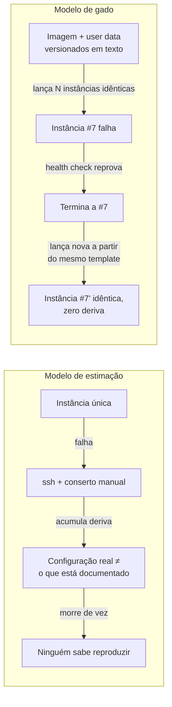
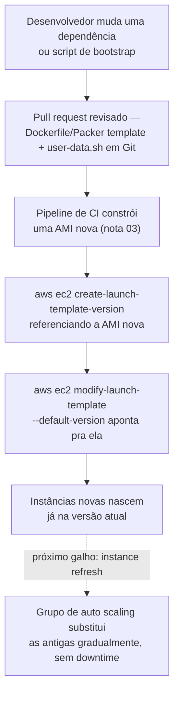
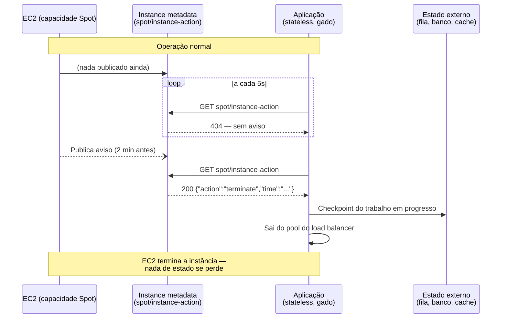

# Padrões de uso e o caminho para a elasticidade

> [!abstract] TL;DR
> Uma VM cuidada à mão — configurada por `ssh`, remendada quando quebra, guardada como se fosse insubstituível — é o jeito mais rápido de acumular um risco que só aparece no pior momento possível: o dia em que ela morre e ninguém sabe reproduzi-la. A alternativa que toda operação séria de nuvem adota não é "cuidar melhor" dessa instância; é parar de tratá-la como única. **Gado, não bicho de estimação**: instâncias numeradas, idênticas, descartáveis — nascidas de uma imagem e um `user data` versionados em texto, nunca configuradas à mão depois de subir. Esse padrão só funciona se o estado sair do disco de boot (ele tem que sobreviver à instância que o gerou) e se o sistema tolerar uma instância sumindo sem aviso — exatamente o que acontece com Spot. O ponto de chegada deste galho inteiro é este: escalar **uma** instância verticalmente esbarra num teto físico cedo ou tarde. A saída não é uma máquina maior — é **muitas máquinas iguais, atrás de um balanceador, subindo e descendo sozinhas**. Esse é o assunto do próximo galho.

## O problema: a instância que ninguém pode desligar

Toda equipe que já operou infraestrutura por tempo suficiente tem uma história parecida com esta. Alguém, num sprint de correria, sobe uma instância EC2 (ou um Droplet) pra rodar um serviço interno — um worker de fila, um painel de métricas, um cron job que ninguém mais lembra de onde veio. A instância funciona. Passa a funcionar tão bem, por tanto tempo, que vira invisível: ninguém mexe nela porque ninguém precisa, e ninguém documenta o que tem dentro dela porque "já está rodando, pra quê". Ao longo de meses, alguém entra por `ssh` para instalar uma dependência que faltava, outra pessoa ajusta um arquivo de configuração à mão pra contornar um bug, uma terceira sobe um certificado TLS direto no disco porque "era rápido assim". Nenhuma dessas mudanças está em lugar nenhum além do disco daquela instância específica.

Quem acaba resolvendo esse tipo de situação, na prática, quase nunca é quem criou a instância originalmente — é quem estiver de plantão no dia em que ela falhar, meses ou anos depois, sem ter participado de nenhuma das decisões que a moldaram. Essa pessoa herda um sistema que ninguém desenhou de propósito: ele simplesmente aconteceu, decisão manual sobre decisão manual, e a única forma de entendê-lo de verdade seria reconstruir, arqueologicamente, cada ajuste que ninguém documentou. É um trabalho real e valioso quando já existe — mas é infinitamente mais barato nunca precisar fazê-lo, porque a instância nunca acumulou essa deriva em primeiro lugar.

Um dia, a instância morre. Pode ser hardware do provedor falhando, pode ser um `reboot` que não voltou do jeito esperado, pode ser simplesmente o volume EBS corrompendo. Não importa a causa exata — o que importa é a pergunta que ninguém consegue responder: **como recriar exatamente esse estado?** Não existe um script que reproduza as três correções manuais que dois desenvolvedores diferentes fizeram, meses atrás, sem anotar em lugar nenhum. A AMI original (nota 03 desta trilha) já não corresponde ao que estava rodando de fato. O `user data` de quando ela subiu, se é que alguém o guardou, também não. A equipe descobre, no pior momento possível — produção fora do ar, tentando religar um serviço — que a única cópia do conhecimento necessário morreu junto com a instância.

Isso tem nome: é uma instância **de estimação** (*pet*). Ela tem identidade própria, é insubstituível, e cada correção manual feita nela é uma peça de conhecimento que existe só ali, nunca em texto versionado. O oposto disso — o padrão que este galho constrói até aqui e que esta nota amarra — não é "documentar melhor a instância de estimação". É parar de ter instâncias de estimação.

O detalhe cruel desse cenário é que, quase sempre, o custo do problema não aparece no dia em que a instância nasce, nem no dia em que a primeira correção manual é feita — aparece meses depois, num momento em que ninguém escolheu investir tempo em prevenção porque a instância "já estava funcionando havia tempo demais para mexer". Esse adiamento sistemático é o motivo pelo qual times maduros tratam os padrões desta nota como *default*, não como refinamento posterior: o custo de configurar uma imagem e um `user data` versionados desde o primeiro dia é pequeno; o custo de descobrir, sob pressão de um incidente em produção, que ninguém sabe reproduzir uma instância que morreu é ordens de grandeza maior — e chega exatamente na hora em que a equipe tem menos tempo disponível para pagá-lo.

## Gado, não bicho de estimação

A metáfora tem origem rastreável: Bill Baker, engenheiro distinto da Microsoft, cunhou a virada de frase comparando os dois modelos de operação de servidor — servidores de estimação você batiza, e quando adoecem, você os trata até sararem; servidores de gado você numera, e quando adoecem, você os substitui. Randy Bias, cofundador do que depois viraria a OpenStack Foundation, popularizou a analogia por volta de 2012 associando-a explicitamente ao padrão de infraestrutura em nuvem — e é essa versão, gado-versus-estimação, que ficou como vocabulário padrão da indústria.

A tradução prática da metáfora para o vocabulário desta trilha:

| Eixo | Bicho de estimação (pet) | Gado (cattle) |
|---|---|---|
| Identidade | Nome próprio, única, insubstituível | Número de série, uma entre N idênticas |
| Reação a falha | Conserto manual (`ssh`, patch, configuração ad-hoc) | Substituição — termina a instância doente, sobe uma nova |
| Origem da configuração | Acumulada ao longo do tempo, por várias pessoas, em nenhum lugar centralizado | Imagem + `user data`, versionados em texto, aplicados no boot |
| Escala | Cresce verticalmente — a mesma instância fica maior | Cresce horizontalmente — mais instâncias idênticas |
| O que sobrevive à instância | Nada — o conhecimento morre com o disco | O template (imagem + launch template) — a instância é descartável, o template não |
| Quem sabe reproduzir o estado atual | Ninguém, com certeza | Qualquer pessoa, rodando o mesmo template |

O ponto central não é estético — é operacional. Gado não é "menos carinho"; é a única forma de uma frota de instâncias escalar além do que uma pessoa consegue manter de cabeça. Cattle é o que torna auto scaling (assunto do próximo galho) sequer possível: um grupo de auto scaling não sabe cuidar de uma instância de estimação, porque ele só sabe fazer uma coisa — terminar instâncias doentes e substituí-las por cópias novas do mesmo template. Se a instância carrega estado ou configuração que só existe nela, terminá-la destrói esse estado; se ela é gado de verdade, terminá-la não perde nada que importa.

É também, não por acaso, um vocabulário que entrevistas técnicas sênior cobram com frequência — não porque a metáfora em si seja sofisticada, mas porque saber nomeá-la com precisão sinaliza que quem responde já operou infraestrutura além da escala de "uma instância que alguém cuida". A pergunta raramente é "o que é cattle vs pets" de forma isolada; é mais comum aparecer embutida numa pergunta de design ("como você garantiria que substituir uma instância dessa frota não derruba o serviço?") — e a resposta que demonstra maturidade é justamente reconhecer que a resposta certa começa antes do incidente, no desenho de como a instância nasce, não em como ela é consertada depois.



## Infraestrutura imutável: nunca `ssh` para consertar

O corolário direto de tratar instâncias como gado é um princípio com nome próprio: **infraestrutura imutável**. A ideia central — bem estabelecida na literatura de operação de infraestrutura moderna — é que, uma vez lançado, um componente de infraestrutura nunca é modificado no lugar; ele é **substituído** inteiro sempre que algo precisa mudar. Isso inverte o instinto mais comum de quem vem de operação tradicional: o reflexo de entrar via `ssh`, editar um arquivo, reiniciar um serviço, e seguir em frente. Sob infraestrutura imutável, esse reflexo é exatamente o que se proíbe.

Na prática, isso significa que a nota 03 desta trilha (a AMI construída com Packer, com dependências e configuração já embutidas na imagem) e o `user data` que uma instância recebe no boot deixam de ser "o ponto de partida que depois se ajusta à mão" e passam a ser **a única fonte de verdade**. Precisa de uma versão nova de uma biblioteca? Constrói-se uma AMI nova. Precisa mudar uma variável de configuração? Publica-se uma versão nova do `user data`. Em nenhum dos dois casos alguém entra na instância que já está rodando para editar algo nela — a instância antiga continua exatamente como estava até ser desligada, e uma instância nova, criada a partir do template atualizado, assume o lugar.

Vale uma ressalva que times novos no padrão costumam confundir: infraestrutura imutável não proíbe entrar numa instância via `ssh` — proíbe **consertar** uma instância por esse caminho. Investigar um log, inspecionar um processo travado, confirmar que uma métrica bate com o que o painel mostra: tudo isso é diagnóstico, e diagnóstico de leitura não fere o princípio. O que fere o princípio é a próxima etapa reflexa — editar um arquivo, reiniciar um serviço, instalar um pacote que faltava, direto naquela sessão. A distinção é sutil, mas é exatamente ela que separa uma equipe que "faz imutável" de uma que só diz que faz: entrar para olhar é normal; entrar para editar é o hábito que precisa morrer.

O mecanismo que a AWS oferece para versionar exatamente essa dupla — imagem + parâmetros de lançamento — chama-se **launch template**: um recurso que guarda os parâmetros de lançamento de uma instância (AMI, tipo de instância, rede, `user data`, entre outros) para não ser preciso especificá-los de novo a cada lançamento. Cada launch template pode ter várias **versões numeradas**; lançar uma instância a partir do template usa, por padrão, a versão marcada como *default* — mas qualquer versão específica pode ser escolhida explicitamente. Trocar de versão é a operação atômica que substitui "editar a instância": em vez de mexer no que já está rodando, cria-se uma versão nova do template, e as próximas instâncias lançadas (ou substituídas por um grupo de auto scaling, no próximo galho) usam essa versão nova.

```bash
# Criar o launch template — a primeira versão nasce aqui, com a AMI
# construída na nota 03 e um script de user data versionado em Git
aws ec2 create-launch-template \
  --launch-template-name app-web-template \
  --version-description "v1 - AMI base + user data de bootstrap" \
  --launch-template-data '{
    "ImageId": "ami-0abc123def456789a",
    "InstanceType": "t3.small",
    "UserData": "'"$(base64 -w0 user-data-v1.sh)"'",
    "IamInstanceProfile": {"Name": "app-ec2-profile"},
    "TagSpecifications": [{
      "ResourceType": "instance",
      "Tags": [{"Key": "app", "Value": "web"}]
    }]
  }'
```

Quando algo precisa mudar — uma AMI nova, uma variável de ambiente diferente — a mudança nunca toca a instância que já está no ar. Ela cria uma versão nova do template:

```bash
# Nunca "consertar" a instância que já está rodando.
# Em vez disso: nova versão do template, apontando pra AMI/user data novos.
aws ec2 create-launch-template-version \
  --launch-template-name app-web-template \
  --source-version 1 \
  --version-description "v2 - AMI com patch de segurança + user data atualizado" \
  --launch-template-data '{
    "ImageId": "ami-0new987654321fedc",
    "UserData": "'"$(base64 -w0 user-data-v2.sh)"'"
  }'

# Marcar a v2 como default para os próximos lançamentos
aws ec2 modify-launch-template \
  --launch-template-name app-web-template \
  --default-version 2
```

Lançar uma instância nova a partir do template (manualmente aqui; no próximo galho, isso é o que um grupo de auto scaling faz sozinho, sem intervenção humana):

```bash
aws ec2 run-instances \
  --launch-template LaunchTemplateName=app-web-template,Version='$Default' \
  --subnet-id subnet-0abc1234
```

Repare no que essa sequência elimina: em nenhum momento alguém abriu uma sessão `ssh` na instância antiga para editá-la. A "correção" é sempre uma versão nova do template, e o "conserto" de uma instância doente é sempre terminá-la e deixar uma nova, a partir do template vigente, tomar seu lugar.

O histórico de versões inteiro fica consultável — é essa trilha de auditoria, não a memória de quem lembra "o que a gente mudou mês passado", que vira a fonte de verdade sobre a evolução da frota:

```bash
aws ec2 describe-launch-template-versions \
  --launch-template-name app-web-template \
  --query 'LaunchTemplateVersions[].{Versao:VersionNumber,Default:DefaultVersion,Descricao:VersionDescription}' \
  --output table
```

```text
DescribeLaunchTemplateVersions
  Versao=1  Default=False  Descricao="v1 - AMI base + bootstrap"
  Versao=2  Default=True   Descricao="v2 - patch de segurança"
```

> [!tip] Assista: EC2 Auto Scaling, launch configurations and templates
> **Canal:** Digital Cloud Training | **Duração:** ~10min | **Idioma:** EN
>
> Mostra na prática, dentro do console, exatamente o mecanismo que os comandos acima fazem via CLI: editar um launch template não sobrescreve nada, cria uma versão nova — o vídeo reforça visualmente por que essa é a peça central do modelo imutável.
> Trecho de destaque [03:45]: *"you can have multiple versions, so you can edit your launch templates and save them as a new version"*
>
> 🎬 [Assistir no YouTube](https://www.youtube.com/watch?v=km1EgYWKNf4)

> [!info] Fronteira
> A anatomia de uma AMI e o mecanismo de `user data` no boot (cloud-init, os três estágios de execução) já foram cobertos em profundidade na **nota 03** desta trilha. Esta nota assume esse conhecimento e foca no que muda quando esses dois elementos passam a ser versionados e tratados como imutáveis — nunca editados após o lançamento.

### O pipeline inteiro, de commit a instância nova

Vale amarrar visualmente as duas peças que viraram fonte de verdade — a imagem e o `user data` — no fluxo completo que uma mudança percorre, do código até a frota de instâncias. Nenhum passo desse fluxo tolera uma edição manual no meio do caminho:



Repare que o passo F é onde esta nota termina e o próximo galho começa: nada nesta nota substitui automaticamente as instâncias antigas por instâncias na versão nova — isso exige um mecanismo que decida *quando* e *quantas por vez* substituir, sem derrubar a capacidade do serviço no meio do caminho. Chama-se **instance refresh**, e é um recurso do grupo de auto scaling, não do launch template. Fica marcado aqui como o gancho explícito que a próxima nota resolve.

O comando `aws ec2 create-launch-template-version` usado à mão nesta nota também é, tipicamente, o tipo de operação que uma equipe madura acaba movendo para dentro de uma ferramenta de Infrastructure as Code — declarar o launch template como um recurso versionado junto com o resto da infraestrutura, em vez de rodar o comando manualmente a cada mudança. Essa camada de automação (Terraform, CloudFormation, Pulumi) é assunto de um galho adiante nesta trilha; o que importa reter aqui é que o conceito — launch template como fonte de verdade versionada — é o mesmo, esteja ele sendo criado por um comando `aws` avulso ou por um pipeline de IaC completo.

> [!info] Fronteira
> Estratégias de rollout que decidem *como* uma frota migra de uma versão para outra sem downtime — rolling deployment, blue-green, canary — são um assunto de release e entrega, não específico de compute. **[[03-Dominios/Engenharia/Operação/index|Operação]]** desenvolve esses padrões em profundidade; esta nota se limita a mostrar de onde vem a versão nova que um desses rollouts vai consumir.

> [!tip] Assista: Auto Scaling AWS EC2 Instances Made Easy | Autoscaling Groups & Launch Templates
> **Canal:** Cameron McKenzie | **Duração:** ~13min | **Idioma:** EN
>
> Antecipa em vídeo o gancho que esta nota deixa em aberto (o próximo galho): mostra o launch template virando, na prática, o insumo de um grupo de auto scaling que nasce e morre instâncias sozinho a partir de um limiar de métrica — o "F" do diagrama acima ganhando vida.
> Trecho de destaque [00:36]: *"I'll show you how to set up some metrics and some threshold so that if memory gets too consumed or there's too many clock cycles, boom, all of a sudden that AWS autoscaling group is going to take over"*
>
> 🎬 [Assistir no YouTube](https://www.youtube.com/watch?v=st4qpzz2FGc)

## Estado externalizado: por que o disco de boot não pode guardar o que importa

Uma instância de gado só é descartável de verdade se terminá-la não destruir nada que ninguém possa perder. Isso força uma separação que parece óbvia depois de dita, mas que é frequentemente ignorada sob pressão de prazo: **o estado da aplicação não pode viver no disco de boot da instância**. Se um banco de dados, uma sessão de usuário, ou um arquivo enviado por um cliente estão gravados só no volume raiz de uma instância específica, terminar essa instância — de propósito, por falha, ou por interrupção Spot — apaga esse dado junto. Nesse momento, a instância deixou de ser gado; voltou a ser um bicho de estimação disfarçado de gado, porque uma parte dela ainda é insubstituível.

A solução arquitetural é **externalizar o estado**: mover tudo que precisa sobreviver além do ciclo de vida de uma instância individual para um serviço dedicado a isso — um banco de dados gerenciado, um sistema de armazenamento de objetos, um cache compartilhado. A instância que roda a aplicação passa a ser **stateless** (sem estado): ela lê e escreve num serviço externo, mas não guarda, ela mesma, nada que precise durar além da sua própria execução. Isso não é um detalhe de implementação — é a pré-condição estrutural para tudo que vem depois nesta trilha: um grupo de auto scaling só pode terminar e substituir instâncias livremente se elas forem, de fato, descartáveis nesse sentido.

Esta nota não desenvolve os serviços que recebem esse estado — isso é o assunto dos galhos 8 e 9 desta trilha (Armazenamento e Bancos gerenciados). O que importa reter aqui é o motivo estrutural pelo qual o estado precisa sair: sem essa externalização, a metáfora de gado inteira desmorona, porque nenhuma instância se torna de fato equivalente a qualquer outra.

Vale nomear a armadilha mais comum de quem tenta aplicar isso pela metade: mover o banco de dados para um serviço gerenciado, mas deixar a **sessão de usuário** presa em memória local da instância — o clássico padrão de *sticky session*, em que o load balancer precisa lembrar "esse usuário sempre vai para a instância 3" porque só a instância 3 tem os dados da sessão dele. Isso não é estado externalizado — é o mesmo problema, disfarçado, porque a instância 3 continua sendo insubstituível enquanto aquela sessão existir. A aplicação verdadeiramente stateless não sabe, e não precisa saber, qual instância atendeu a requisição anterior; qualquer uma serve, porque a sessão em si mora num cache compartilhado, não em memória de processo:

```python
# Instância "de gado" de verdade: nenhum dado de sessão em memória local.
# A configuração de qual endpoint externo usar vem de variáveis de ambiente
# injetadas pelo user data — nunca hardcoded, nunca editada à mão depois do boot.
import os
import redis

sessao = redis.Redis(
    host=os.environ["SESSION_STORE_HOST"],   # cache gerenciado externo
    port=6379,
    decode_responses=True,
)

def obter_carrinho(usuario_id: str) -> dict:
    # Funciona igual em qualquer instância do grupo — nenhuma affinity necessária
    return sessao.hgetall(f"carrinho:{usuario_id}")
```

Uma segunda exigência, menos óbvia, anda junto com a externalização de estado: o `user data` que configura uma instância nova precisa ser **idempotente** — seguro de rodar do zero, em qualquer ordem de eventos, sem assumir que algum passo anterior "provavelmente já rodou". Um script que assume a existência prévia de um arquivo de configuração, ou que falha silenciosamente se um pacote já estiver instalado, funciona bem na primeira instância e quebra de forma imprevisível na quinquagésima — justamente no momento em que um grupo de auto scaling está tentando repor capacidade depressa. Gado só funciona se qualquer instância nova, criada a qualquer momento, a partir do mesmo template, chegar ao mesmo estado final — e isso é uma propriedade do script, não da infraestrutura ao redor dele.

> [!info] Fronteira
> A distinção entre serviço com estado e sem estado, e por que arquiteturas escaláveis empurram o estado para a borda do sistema (banco, cache, fila), é tratada em profundidade em **[[03-Dominios/Engenharia/Arquitetura/index|System Design]]** — os padrões de particionamento, réplicas e consistência que um banco de dados gerenciado resolve por trás da API. Esta nota assume o princípio; o **galho 9** desta trilha (Bancos gerenciados) trata a encarnação concreta na nuvem.

## Desenhar para a instância sumir: Spot como disciplina, não exceção

A nota 05 desta trilha já tratou o modelo de precificação Spot — capacidade ociosa da AWS vendida com desconto grande, sob a condição explícita de que a AWS pode retomá-la a qualquer momento. O que esta nota acrescenta é a consequência arquitetural: se uma instância pode sumir sem aviso prévio de verdade, o sistema inteiro só pode confiar em Spot se já estiver desenhado, por padrão, para tolerar qualquer instância sumindo — Spot ou não. Nesse sentido, projetar para Spot não é uma otimização de custo isolada; é o mesmo músculo arquitetural de tratar instâncias como gado, exercitado sob um prazo de aviso real e mensurável.

Essa ordem importa: uma equipe que tenta adotar Spot antes de ter os padrões desta nota — imutabilidade, estado externo — normalmente aprende a lição da forma mais cara possível, com uma interrupção real derrubando algo que ninguém esperava que pudesse cair. A ordem correta é a inversa: desenhar a carga para tolerar qualquer instância sumindo primeiro, por princípio de resiliência geral, e só então decidir, como otimização de custo separada, quais cargas já preparadas valem a pena mover para Spot. Uma carga tolerante a interrupção continua tolerante mesmo rodando 100% em on-demand — só deixa dinheiro na mesa. Uma carga intolerante rodando em Spot é uma questão de tempo até doer.

A AWS documenta esse prazo com precisão: uma **Spot Instance interruption notice** é emitida **dois minutos antes** de a instância ser parada ou terminada (exceção: quando o comportamento configurado é hibernação, o aviso chega, mas sem os dois minutos de antecedência, porque a hibernação começa imediatamente). Esse aviso fica disponível de duas formas — como evento no Amazon EventBridge, e como item na metadata da própria instância, no caminho `spot/instance-action`. A AWS recomenda checar esse item a cada 5 segundos, porque a emissão do aviso é feita em regime de melhor esforço, não garantido.

```bash
# Rotina de polling — checa a cada 5s se há aviso de interrupção
# (IMDSv2 exige token; ver notas 01/03 desta trilha para o mecanismo de metadata)
while true; do
  TOKEN=$(curl -sX PUT "http://169.254.169.254/latest/api/token" \
    -H "X-aws-ec2-metadata-token-ttl-seconds: 21600")
  ACTION=$(curl -s -H "X-aws-ec2-metadata-token: $TOKEN" \
    -o /dev/null -w "%{http_code}" \
    http://169.254.169.254/latest/meta-data/spot/instance-action)

  if [ "$ACTION" = "200" ]; then
    echo "Interrupção anunciada — 2 minutos até a ação. Drenando conexões..."
    # 1. Sinaliza ao load balancer para parar de rotear tráfego novo (galho 6)
    # 2. Termina de processar requisições em voo (graceful shutdown)
    # 3. Faz checkpoint de qualquer trabalho em progresso no estado externo
    break
  fi
  sleep 5
done
```

O corpo da resposta, quando o aviso existe, identifica a ação e o horário exato:

```json
{"action": "terminate", "time": "2026-07-23T14:22:00Z"}
```

O valor de `action` também importa para o que a instância deve esperar em seguida — a AWS reclama capacidade Spot de três formas diferentes, configuráveis no momento do pedido, e cada uma implica algo distinto para o estado local que ainda não tiver sido externalizado:

| Comportamento de interrupção | O que acontece | O que sobrevive no volume raiz |
|---|---|---|
| `terminate` | A instância é encerrada e o volume raiz (se configurado para isso, o padrão) é apagado junto | Nada, a menos que o volume esteja marcado para não ser excluído no término |
| `stop` | A instância para, como um desligamento normal — pode ser religada depois se a capacidade voltar | O volume EBS raiz persiste, mas a instância física por trás muda |
| `hibernate` | O conteúdo da RAM é salvo em disco antes de parar — a instância retoma exatamente de onde parou | RAM e disco, mas exige suporte explícito de hibernação configurado na AMI |

Repare que dois minutos não é tempo para "salvar tudo do zero" — é tempo para **finalizar rápido um trabalho que já foi desenhado para ser interrompível**: fechar conexões em voo, marcar um item de fila como "não confirmado" para outro worker retomar, sair do pool de um load balancer antes de o health check reprovar sozinho. Nada disso funciona se a instância guarda estado que só existe nela — é a mesma exigência de estado externalizado da seção anterior, agora sob um relógio de verdade.



### O aviso que chega antes do aviso: rebalance recommendation

O aviso de dois minutos não é, na verdade, o primeiro sinal que a AWS pode emitir. Existe um segundo mecanismo, mais cedo e menos garantido: a **EC2 instance rebalance recommendation** — um sinal que avisa que uma instância Spot está sob **risco elevado** de interrupção, antes mesmo do aviso formal de dois minutos. A própria documentação da AWS é direta sobre a natureza desse sinal: ele *pode* chegar antes do aviso de dois minutos, dando margem para migrar a carga proativamente — mas nem sempre chega antes; às vezes os dois sinais chegam juntos. É um aviso de melhor esforço, não uma garantia contratual, e só existe para instâncias Spot lançadas depois de 5 de novembro de 2020.

A diferença de postura entre os dois sinais é a que importa para o desenho: o aviso de dois minutos diz "saia agora, o tempo está literalmente acabando"; a rebalance recommendation diz "considere sair logo, o risco está subindo". É por isso que serviços como Auto Scaling, EC2 Fleet e Spot Fleet usam justamente esse segundo sinal para **lançar uma instância de reposição antes** de a antiga ser de fato interrompida — mantendo a capacidade da frota estável o tempo todo, em vez de reagir depois que a capacidade já caiu. Esse recurso tem nome próprio, **Capacity Rebalancing**, e é uma configuração do grupo de auto scaling — assunto que o próximo galho desenvolve; aqui, o que importa reter é que o padrão de "detectar risco de interrupção via metadata e agir antes do fim" já nasce nesta nota, um nível abaixo do grupo automático que vai consumi-lo.

```bash
# events/recommendations/rebalance — chega ANTES do spot/instance-action,
# sem garantia de quanto tempo de antecedência
TOKEN=$(curl -sX PUT "http://169.254.169.254/latest/api/token" \
  -H "X-aws-ec2-metadata-token-ttl-seconds: 21600")
curl -s -H "X-aws-ec2-metadata-token: $TOKEN" \
  http://169.254.169.254/latest/meta-data/events/recommendations/rebalance
# Se existir: {"noticeTime": "2026-07-23T14:20:00Z"}
# Se não existir ainda: HTTP 404
```

| Sinal | Quando chega | Garantia de antecedência | Ação típica |
|---|---|---|---|
| Rebalance recommendation | Antes do aviso de interrupção — às vezes junto | Nenhuma — melhor esforço, pode não chegar antes | Lançar instância de reposição proativamente (Capacity Rebalancing) |
| Interruption notice | 2 minutos antes de parar/terminar (0 min se hibernação) | 2 minutos, também melhor esforço | Drenar conexões, checkpoint final, sair do load balancer |

## Casos práticos

**O worker de fila tolerante a Spot.** Um pool de instâncias Spot processa mensagens de uma fila. Cada worker é stateless — a mensagem só é removida da fila depois de processada com sucesso (visibility timeout, não abordado aqui). Quando o aviso de interrupção chega, o worker simplesmente para de puxar mensagens novas e deixa a mensagem atual voltar à fila se não terminar a tempo; outro worker, em outra instância, a retoma. A interrupção Spot não é um incidente — é uma operação de rotina que o desenho já esperava.

**O painel interno que virou gado sem ninguém perceber.** Retomando o cenário de abertura desta nota — o painel de métricas esquecido, cuidado à mão por anos — a migração raramente acontece de uma vez. Uma equipe que decide corrigir o problema tipicamente começa criando uma imagem a partir do estado atual da instância (capturando, pela primeira vez, tudo que estava só na cabeça de quem mexeu nela), documenta manualmente o que faltar nesse retrato — as tais três correções manuais do exemplo de abertura —, embute isso como `user data` versionado, e só então destrói a instância original e sobe uma nova a partir do template resultante. Esse primeiro ciclo custa esforço real; o segundo, terceiro e centésimo ciclo depois dele custam quase nada, porque a partir daí qualquer mudança já nasce dentro da disciplina.

**O deploy que nunca faz `ssh`.** Uma equipe publica uma versão nova da aplicação criando uma AMI nova (nota 03) e uma versão nova do launch template apontando pra ela. O rollout substitui as instâncias antigas por instâncias novas, uma de cada vez ou em lote, sem que nenhum humano entre em nenhuma máquina para editar arquivo algum. Se o deploy falhar, o rollback é simplesmente voltar o `--default-version` do template para a versão anterior — nunca um `git revert` seguido de correção manual em produção.

**O `user data` como script versionado, não improviso.** Em vez de colar um comando ad-hoc no campo de user data pelo console — prática comum e frágil, porque não fica em lugar nenhum além daquela instância —, o script de inicialização vive num arquivo em Git (`user-data-v2.sh` no exemplo acima), revisado por pull request como qualquer outro código. A versão do launch template referencia esse arquivo; a história de mudanças do comportamento de boot da frota inteira fica no histórico do Git, não espalhada em anotações de quem lembrou de documentar.

**A carga que ainda não pode virar gado — e por que isso é honesto de admitir.** Nem tudo migra para este padrão da noite para o dia. Um banco de dados relacional single-node herdado, com anos de dados e sem réplica configurada, não pode simplesmente "virar gado" só porque a equipe decidiu adotar o padrão — terminá-lo e subir um novo a partir de uma imagem perde os dados, a menos que o volume de dados esteja num disco separado e persistente (o que já é meio caminho andado para a externalização de estado desta nota) ou que o banco em si migre para um serviço gerenciado (galho 9). Reconhecer esse tipo de carga explicitamente — "isto ainda é um pet, sabemos disso, e o plano de migração está no roadmap" — é mais honesto e mais seguro do que fingir que todo o parque já é gado quando uma parte relevante dele não é.

## Lente dupla honesta: o mesmo padrão, ferramental bem mais simples na DigitalOcean

Os padrões desta nota — gado, imutabilidade, estado externo, tolerância a interrupção — são conceituais e se aplicam igualmente a um Droplet. O que muda, de novo, é o ferramental disponível para versionar o "template de lançamento".

A DigitalOcean não tem um recurso equivalente ao launch template da AWS — não existe um objeto com versões numeradas que agrupe imagem + `user data` + rede + tags para reuso. O que existe é mais direto: a chamada de criação de Droplet aceita os mesmos ingredientes — `image` (uma imagem customizada ou snapshot, equivalente à AMI) e `user_data` — soltos, num único payload, sem um recurso intermediário que os agrupe e versione:

```bash
# doctl — os mesmos ingredientes (imagem + user data),
# sem um recurso "launch template" separado para versionar
doctl compute droplet create app-web-03 \
  --image 123456789 \
  --size s-2vcpu-4gb \
  --region nyc3 \
  --user-data-file ./user-data-v2.sh \
  --tag-name app:web
```

A prática recomendada pela própria documentação da DigitalOcean reforça exatamente o padrão de imutabilidade desta nota, ainda que por uma razão técnica direta: **não é possível modificar o `user_data` depois que um Droplet já foi criado** — ele só roda uma vez, no primeiro boot. Isso empurra a equipe, na prática, para o mesmo hábito que o launch template força na AWS: qualquer mudança de comportamento de boot vira um Droplet novo, nunca uma edição do que já está rodando. A diferença é que, sem um recurso de template versionado, **a disciplina de manter o script de `user_data` em Git, com histórico, é inteiramente responsabilidade da equipe** — a plataforma não guarda versões antigas por você.

Sem um recurso nativo de versionamento, a convenção prática mais comum entre equipes DigitalOcean sênior é simular a mesma trilha de auditoria por **nomenclatura disciplinada** — carimbar a versão no próprio nome da imagem customizada, em vez de depender de um número de versão que a plataforma não oferece:

```bash
# Sem "launch template", a versão vira parte do nome da imagem —
# convenção da equipe, não recurso da plataforma
doctl compute image list --public=false \
  --format ID,Name,CreatedAt

# ID          Name                    CreatedAt
# 123456789   app-web-v1-2026-06-01   2026-06-01T10:00:00Z
# 123456999   app-web-v2-2026-07-20   2026-07-20T14:30:00Z

# "Promover" a versão nova é, na prática, apontar o script de
# criação de Droplets pra um ID de imagem diferente — manualmente
doctl compute droplet create app-web-04 \
  --image 123456999 \
  --user-data-file ./user-data-v2.sh \
  --size s-2vcpu-4gb --region nyc3
```

O ponto a reter não é que a DigitalOcean "não dá pra fazer isso direito" — dá, e times fazem isso com sucesso todos os dias. É que, sem um recurso de plataforma que force a disciplina, ela precisa ser mantida deliberadamente pela equipe: convenção de nomenclatura documentada, revisão de pull request no script de `user_data`, e alguém realmente lembrando de não pular a etapa quando o prazo aperta.

O mesmo padrão de honestidade se aplica ao lado de tolerância a interrupção desta nota. Um Droplet também tem um serviço de metadata próprio, acessível pelo mesmo endereço link-local que a AWS usa (`169.254.169.254`), com um caminho equivalente para descobrir o identificador da instância:

```bash
# DigitalOcean — serviço de metadata, endereço link-local igual ao da AWS,
# mas sem nenhum item equivalente a "spot/instance-action"
curl -s http://169.254.169.254/metadata/v1/id
# 336300000 (o ID numérico do Droplet — nada sobre risco de interrupção)
```

Não existe, na resposta desse serviço, nenhum item equivalente a `spot/instance-action` ou `events/recommendations/rebalance` — porque não existe, na DigitalOcean, uma capacidade de "melhor esforço, mais barata, sujeita a retomada" para avisar sobre. Um Droplet on-demand simplesmente continua rodando até alguém — pessoa ou automação — decidir destruí-lo. A disciplina de tolerância a interrupção continua valendo a pena mesmo assim (falhas de hardware acontecem em qualquer provedor), mas o gatilho para praticá-la na DigitalOcean é a manutenção deliberada da equipe, não um mecanismo da plataforma cobrando isso por um desconto.

| Conceito | AWS | Azure | GCP | DigitalOcean |
|---|---|---|---|---|
| Template de lançamento versionado | Launch Template (versões numeradas, `--default-version`) | Azure VM Scale Set model / Shared Image Gallery | Instance Template (Compute Engine) | — (sem equivalente; `image` + `user_data` soltos na chamada de criação) |
| Onde vive o `user data` | Campo `UserData` do launch template, base64 | Custom Script Extension / cloud-init no template | Campo `metadata.startup-script` do Instance Template | Campo `user_data` na criação do Droplet, texto plano ou cloud-config |
| Aviso de interrupção por capacidade | Spot Instance interruption notice — 2 min, via EventBridge + metadata `spot/instance-action` | Azure Spot VM eviction notice — ~30s, via Scheduled Events | Preemptible/Spot VM — aviso ACPI G2 soft-off, ~30s | — (Droplets não têm variante de capacidade "spot"/preemptível) |

> [!info] Caducidade
> Comportamento e janelas de aviso de Spot/preemptível verificados na documentação oficial da AWS em 2026-07-23. Os números de Azure e GCP citados na tabela de tradução (~30 segundos) vêm de memória consolidada da indústria, não foram verificados nesta sessão contra a documentação oficial desses provedores — trate como ordem de grandeza, confirme antes de decidir arquitetura em cima disso.

## Armadilhas comuns

> [!warning] "Imutável" até a primeira exceção de emergência
> É comum uma equipe adotar infraestrutura imutável no papel e, na primeira madrugada de incidente, alguém entrar via `ssh` "só dessa vez" para aplicar um hotfix direto na instância que está com problema. Isso não é uma exceção inofensiva — é o início da deriva que a instância de estimação tinha. Se aquele hotfix realmente resolve o problema, ele precisa virar uma versão nova de imagem ou de `user data` antes do fim do incidente — não um segredo que só existe naquela instância específica até ela ser substituída e o problema voltar.

> [!warning] Tratar Spot como "só mais barato", sem desenhar para a interrupção
> Colocar uma carga com estado importante — um banco de dados single-node, uma sessão de usuário que não está em cache externo — numa instância Spot só porque é mais barata é ignorar a condição inteira sob a qual esse desconto existe. Spot é apropriado para cargas que já são stateless e tolerantes a interrupção por desenho; usá-la como substituto barato de uma instância on-demand sem mudar mais nada é comprar um problema de disponibilidade, não uma economia.

> [!warning] Versão de launch template sem `--version-description` que explique o "porquê"
> Criar versões novas de launch template sem uma descrição do que mudou e por quê reproduz, dentro do próprio mecanismo de imutabilidade, o mesmo problema que ele deveria resolver: alguém, meses depois, olhando a versão 14 de um template, sem saber por que ela existe ou o que ela corrigiu em relação à 13. O campo `--version-description` existe exatamente para isso — tratá-lo como opcional descartável é desperdiçar a razão de ser do versionamento.

> [!warning] Achar que "imutável" significa "sem estado nenhum em disco, nunca"
> Uma instância pode ser imutável (nunca editada no lugar) e ainda assim ter disco — o que ela não pode ter é *dado que importa e não existe em outro lugar*. Um volume de cache local, reconstruível a qualquer momento a partir do estado externo, é perfeitamente compatível com o padrão desta nota. Confundir os dois — "nada pode tocar o disco" com "nada insubstituível pode viver só no disco" — leva equipes a complicar desnecessariamente designs simples, evitando até cache local legítimo por medo de reintroduzir um "pet".

## Síntese do galho: o que essas seis notas ensinaram juntas

Vale nomear explicitamente o que este galho constrói, nota a nota, porque o percurso é cumulativo — cada nota resolveu uma pergunta que a anterior deixou em aberto:

| Nota | Pergunta que resolveu |
|---|---|
| 01 — Anatomia de uma máquina virtual na nuvem | O que uma VM realmente é por baixo do abstrato: hipervisor, virtualização, metadata da instância |
| 02 — Tipos e famílias de instância | Como escolher o tamanho e a família certos para uma carga específica, sem generalizar "instância grande resolve" |
| 03 — Imagens, AMIs e provisionamento no boot | Como uma instância nasce já configurada — imagem dourada versus `user data` no boot, e onde termina uma e começa a outra |
| 04 — (ciclo de vida e estados da instância) | O que acontece entre lançar e terminar — os estados pelos quais uma instância passa e o que cada transição custa |
| 05 — Modelos de precificação (on-demand, reserved, spot) | Quanto uma instância custa sob compromissos diferentes, e a troca explícita entre preço e garantia de disponibilidade |
| 06 — Esta nota | Por que a instância individual, cuidada à mão, não escala — e o que a substitui: gado, imutabilidade, estado externo, tolerância a interrupção |

O fio que amarra as seis é uma progressão só: primeiro entender o que é uma instância (01), depois escolher o tamanho certo dela (02), depois automatizar como ela nasce configurada (03-04), depois entender o que ela custa sob compromissos diferentes (05), e por fim perceber que nenhuma dessas quatro coisas resolve o problema de escala sozinha — porque o problema de escala nunca foi sobre uma instância. É sobre a disciplina que permite ter **N** instâncias equivalentes, descartáveis, e substituíveis sem que ninguém precise saber qual delas, especificamente, está de pé neste segundo.

Um jeito direto de auditar, na prática, se uma equipe já internalizou esse fio ou ainda está a meio caminho:

| Sinal de maturidade | Ainda é "pet" | Já é "cattle" |
|---|---|---|
| Como uma instância recebe uma correção | `ssh` + edição manual | Nova versão de imagem/`user data`, instância substituída |
| Onde vive o script de boot | Colado no console, sem histórico | Arquivo em Git, revisado por pull request |
| O que acontece quando a instância morre sem aviso | Ninguém sabe reproduzir o estado | Uma instância nova, do mesmo template, assume o lugar |
| Onde vive o estado que importa | No disco de boot da própria instância | Num serviço externo (banco, cache, storage) |
| Reação a um aviso de interrupção Spot | Nenhuma — a carga não estava desenhada para isso | Checkpoint, drena conexões, sai do pool, sem perda |

Vale ser honesto sobre o que essa síntese **não** resolve ainda, porque é fácil ler seis notas seguidas e sair com a impressão de que "compute" está fechado. Não está — está fechado o suficiente para sustentar o que vem depois. Rede (galho 7: quem enxerga quem, e por onde o tráfego entra e sai), armazenamento e bancos (galhos 8 e 9: onde o estado externalizado desta nota realmente mora) e o próprio mecanismo de elasticidade (galho 6, a seguir) ainda estão por vir. O que este galho garante é a matéria-prima: instâncias que podem, de fato, ser tratadas como gado — sem essa base, nenhum dos galhos seguintes tem hoje uma fundação sólida para apoiar.

## O que vem a seguir

Esta nota chegou ao limite natural de escalar **uma** instância. Trocar `t3.small` por `t3.2xlarge` (escala vertical, nota 02) resolve um problema por um tempo — mas todo tipo de instância tem um teto, e mesmo antes de bater nesse teto, uma única instância continua sendo um ponto único de falha: se ela cair, o serviço cai junto, não importa quão bem dimensionada ela seja. Gado, imutabilidade e estado externo — os três padrões desta nota — são exatamente os pré-requisitos que tornam a próxima pergunta respondível: em vez de uma instância maior, **muitas instâncias idênticas, atrás de um balanceador de carga, subindo e descendo sozinhas conforme a demanda muda**. Isso é escala horizontal com elasticidade automática — e é o assunto inteiro do próximo galho desta trilha, sobre grupos de auto scaling e balanceamento de carga gerenciado (a encarnação concreta, na nuvem, do balanceador que a trilha de System Design já tratou como conceito abstrato).

## Fontes

- [AWS EC2 — Store instance launch parameters in launch templates](https://docs.aws.amazon.com/AWSEC2/latest/UserGuide/ec2-launch-templates.html) — definição de launch template, versões numeradas, versão default; acessado em 2026-07-23.
- [AWS CLI — ec2 create-launch-template (Command Reference)](https://docs.aws.amazon.com/cli/latest/reference/ec2/create-launch-template.html) — sintaxe de `--launch-template-name`, `--launch-template-data`, `UserData` base64, limite de 16 KB; acessado em 2026-07-23.
- [AWS EC2 — Spot Instance interruptions](https://docs.aws.amazon.com/AWSEC2/latest/UserGuide/spot-interruptions.html) — motivos de interrupção (capacidade, preço, constraints), comportamentos (terminate/stop/hibernate); acessado em 2026-07-23.
- [AWS EC2 — Spot Instance interruption notices](https://docs.aws.amazon.com/AWSEC2/latest/UserGuide/spot-instance-termination-notices.html) — aviso de 2 minutos, caminho de metadata `spot/instance-action`, recomendação de polling a cada 5s, formato IMDSv2; acessado em 2026-07-23.
- [DigitalOcean — Provide User Data for Droplets](https://docs.digitalocean.com/products/droplets/how-to/provide-user-data/) — campo `user_data`, execução só no primeiro boot, impossibilidade de modificar depois da criação; acessado em 2026-07-23.
- [DigitalOcean — How To Use the API to Deploy Droplets From a Master Snapshot](https://www.digitalocean.com/community/tutorials/how-to-use-the-api-to-deploy-droplets-from-a-master-snapshot) — criação de Droplet a partir do ID de uma imagem/snapshot via API; acessado em 2026-07-23.
- [AWS EC2 — Behavior of Spot Instance interruptions](https://docs.aws.amazon.com/AWSEC2/latest/UserGuide/interruption-behavior.html) — os três comportamentos configuráveis (terminate/stop/hibernate), padrão terminate, o que acontece com o volume EBS em cada caso; acessado em 2026-07-23.
- [AWS EC2 — EC2 instance rebalance recommendations](https://docs.aws.amazon.com/AWSEC2/latest/UserGuide/rebalance-recommendations.html) — sinal de risco elevado de interrupção, sem garantia de antecedência sobre o aviso de 2 minutos, caminho de metadata `events/recommendations/rebalance`, uso por Auto Scaling/EC2 Fleet/Spot Fleet (Capacity Rebalancing); acessado em 2026-07-23.
- [DigitalOcean — How to Access Information about a Droplet using the Metadata API](https://docs.digitalocean.com/products/droplets/how-to/access-metadata/) — endereço link-local `169.254.169.254`, endpoint `/metadata/v1/id`; acessado em 2026-07-23.
- Bill Baker (Microsoft) e Randy Bias (Cloudscaling/OpenStack Foundation) — origem e popularização da metáfora "pets vs. cattle", por volta de 2012, associada ao padrão de infraestrutura em nuvem descartável; consolidado na literatura de operação de infraestrutura, sem uma única fonte primária formal — vocabulário padrão da indústria, não uma citação de paper.
