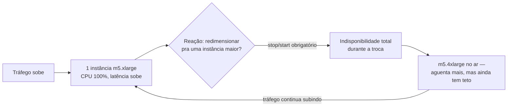
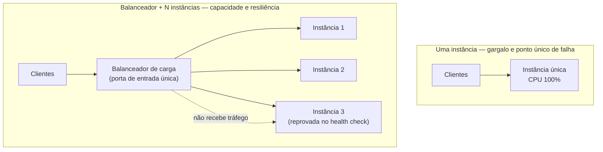
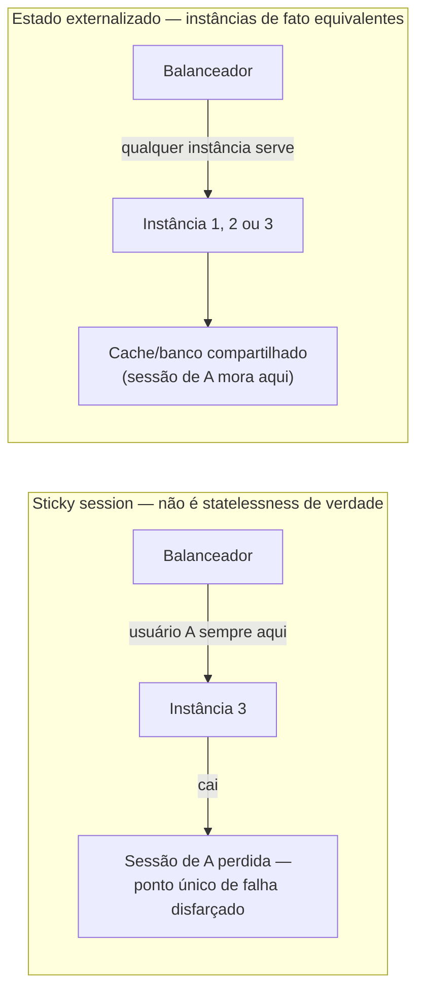

# Por que uma instância não basta

> [!abstract] TL;DR
> A nota anterior fechou o galho 5 com uma instância bem cuidada — imagem versionada, `user data` idempotente, estado externalizado, tolerante a interrupção. Essa instância ainda tem dois problemas que nenhuma dessas práticas resolve sozinha: ela tem um **teto de tamanho** (subir de `t3.small` para `t3.2xlarge` custa dinheiro em progressão e, em algum momento, simplesmente não existe uma instância maior à venda), e ela é um **ponto único de falha** (se ela cair, o serviço cai junto, não importa quão grande ela seja). A saída não é uma máquina maior — é várias máquinas idênticas, atrás de uma porta de entrada única que decide para qual delas cada requisição vai: um **balanceador de carga**. Esse padrão só funciona se as instâncias forem, de fato, intercambiáveis — o que exige que nenhuma delas guarde estado que só existe nela (a nota 06 do galho 5 já cobriu isso). E ele só vira **elasticidade** de verdade quando o número de instâncias sobe e desce sozinho, acompanhando o tráfego, sem alguém decidindo manualmente. Esta nota é o mapa do galho 6: apresenta os dois personagens — o balanceador de carga e o auto scaling — que as próximas notas desenvolvem em profundidade.

## O problema: a instância que aguentou até não aguentar mais

Imagine uma loja virtual de médio porte rodando numa única instância EC2 — `m5.xlarge`, 4 vCPUs, 16 GiB de RAM. No dia a dia, ela dá conta do recado com folga: CPU raramente passa de 30%, memória sobra, ninguém reclama. É a mesma instância cuidada com todo o rigor da nota anterior — imagem imutável, `user data` versionado, sem uma única sessão SSH de conserto manual em meses.

Chega a Black Friday. Às 9h da manhã, o tráfego começa a subir — primeiro em linha reta, depois exponencialmente, à medida que promoções saem no rádio e nas redes sociais. Às 9h40, a CPU da instância está travada em 100% sustentado. As requisições que chegam ainda são atendidas, mas cada uma demora mais que a anterior — o sistema operacional está fazendo o melhor que pode, distribuindo fatias de tempo de processador cada vez menores entre um número de conexões simultâneas que só cresce. Por volta das 10h, o tempo de resposta já passa de oito segundos por página. Carrinhos de compra começam a expirar antes do cliente conseguir finalizar a compra. Não é um bug — a aplicação está fazendo exatamente o que sempre fez, só que agora para uma quantidade de gente que uma única instância, deste tamanho, nunca foi capaz de atender.

A reação de plantão mais óbvia é redimensionar a instância — parar, trocar o tipo para `m5.4xlarge`, religar. Funciona, tecnicamente. Mas tem dois problemas que aparecem no mesmo minuto em que a solução é aplicada. Primeiro: **redimensionar exige parar a instância** — não existe forma de trocar o tipo de uma instância EC2 em execução sem um `stop`/`start` no meio (a AWS documenta esse requisito explicitamente para a maioria dos tipos de instância). Alguns minutos de indisponibilidade total, no pico exato do dia de maior faturamento do ano, para resolver um problema de capacidade. Segundo, e mais sério: mesmo depois de trocar para uma instância maior, **o problema não desapareceu — só subiu de patamar**. Se o tráfego continuar crescendo, a `m5.4xlarge` também vai bater no teto, mais tarde. E cada troca de tamanho continua exigindo parar o serviço inteiro para executá-la.



## Escala vertical vs. escala horizontal

Vale nomear com precisão as duas estratégias possíveis diante desse cenário, porque a literatura de arquitetura trata as duas como opostos estruturais, não como variações de grau.

**Escala vertical** (*scale up*) é aumentar a capacidade de uma única instância — mais vCPUs, mais memória, mais banda de rede — trocando-a por um tipo maior dentro da mesma família (a nota 02 do galho 5 já cobriu a anatomia de tipos e famílias de instância). É a solução mais intuitiva porque é a mais parecida com o que qualquer pessoa faria com um computador físico: se o notebook está lento, compra-se um mais potente. E ela tem uma vantagem real que vale reconhecer: **não exige nenhuma mudança na aplicação**. O código continua rodando sozinho, numa única máquina, sem nenhuma preocupação com estado compartilhado ou coordenação entre processos.

O problema é que escala vertical tem **dois limites estruturais**, não um só:

1. **Um teto físico de catálogo.** Todo provedor de nuvem vende um conjunto finito de tamanhos de instância. Existe sempre uma maior — mas ela também tem um limite. A AWS, por exemplo, oferece instâncias de altíssima memória sob a família `u-*` (as chamadas *High Memory instances*, tipicamente `.metal`, bare metal) para os casos mais extremos de banco de dados in-memory de grande porte — mas mesmo essas têm um número fixo de vCPUs e uma quantidade fixa de memória. Não existe, em nenhum provedor, uma instância "infinitamente grande". Em algum ponto da escalada, a única resposta possível para "preciso de mais capacidade" deixa de ser "uma instância maior" simplesmente porque não existe uma instância maior à venda.
2. **Continua sendo uma única máquina — logo, um ponto único de falha.** Mesmo antes de bater no teto de catálogo, uma instância vertical continua sendo *uma* instância. Se o hipervisor por trás dela falhar, se o disco corromper, se um `reboot` não voltar — o serviço inteiro cai, porque não existe uma segunda cópia rodando em paralelo para assumir o tráfego. Dobrar o tamanho da instância não reduz essa fragilidade em nada; só adia o dia em que a capacidade se esgota.

**Escala horizontal** (*scale out*) ataca os dois limites ao mesmo tempo, de um jeito diferente: em vez de uma instância maior, **várias instâncias do mesmo tamanho, rodando em paralelo**, cada uma atendendo uma fatia do tráfego total. Não existe teto de catálogo relevante aqui — se dez instâncias `m5.xlarge` não bastam, sobem-se vinte; o número de instâncias que cabem numa conta AWS ou numa equipe DigitalOcean é ordens de grandeza maior do que o maior tipo de instância disponível. E não existe ponto único de falha — se uma das vinte cair, as outras dezenove continuam atendendo, e uma vigésima primeira nasce para repor a capacidade perdida.

O preço da escala horizontal é que ela **não é gratuita em termos de desenho**: exige que a aplicação seja capaz de rodar em múltiplas cópias simultâneas sem que uma atrapalhe a outra — o que só é possível se nenhuma instância guardar, sozinha, um estado que as outras não têm acesso. É exatamente o requisito de *statelessness* que a nota 06 do galho 5 já estabeleceu como pré-condição para tratar instâncias como gado. Esta nota assume esse conhecimento; quem pular direto para aqui sem ter lido aquela nota vai sentir falta do porquê.

| Eixo | Escala vertical | Escala horizontal |
|---|---|---|
| O que muda | O tamanho de uma instância | O número de instâncias |
| Teto | Existe — o maior tipo do catálogo do provedor | Praticamente inexistente na prática |
| Ponto único de falha | Sim — sempre uma única máquina | Não — N instâncias, tolerantes a perder algumas |
| Exige mudança de aplicação | Não | Sim — instância precisa ser stateless |
| Interrupção durante o ajuste | Sim, tipicamente (stop/start) | Não — instâncias novas somam-se, sem derrubar as existentes |
| Custo por unidade de capacidade | Cresce, às vezes de forma não linear nos tipos maiores | Linear — o dobro de instâncias custa o dobro |

> [!info] Fronteira
> A anatomia de tipos e famílias de instância — como escolher o tamanho certo dentro de uma família — já foi coberta na **nota 02** do galho 5 (Compute I). Esta nota assume esse vocabulário e foca no que acontece quando o tamanho certo, sozinho, deixa de ser suficiente.

### O teto de catálogo, visto em comando

Vale ver o teto de perto, em vez de só descrevê-lo em prosa. `aws ec2 describe-instance-types` permite filtrar o catálogo inteiro por características — por exemplo, listar as maiores instâncias de memória disponíveis numa família, para constatar que "maior" ainda é um número finito, não um conceito aberto:

```bash
# Listar as instâncias de memória mais extrema do catálogo (família u-*,
# bare metal) — o teto físico de escala vertical no catálogo da AWS
aws ec2 describe-instance-types \
  --filters "Name=instance-type,Values=u-*" "Name=bare-metal,Values=true" \
  --query 'InstanceTypes[].{Tipo:InstanceType,vCPUs:VCpuInfo.DefaultVCpus,MemoriaMiB:MemoryInfo.SizeInMiB}' \
  --output table
```

```text
------------------------------------------------
|          DescribeInstanceTypes                |
+---------------+----------+---------------------+
|     Tipo      |  vCPUs   |     MemoriaMiB      |
+---------------+----------+---------------------+
|  u-6tb1.metal |   448    |     6291456         |
|  u-9tb1.metal |   448    |     9437184         |
+---------------+----------+---------------------+
```

Mesmo essa família — desenhada especificamente para bancos de dados in-memory de porte extremo, não para uma carga web comum — tem um número fixo de linhas nessa tabela. Não existe um filtro que devolva "sem limite"; existe sempre uma última linha, e o catálogo termina nela. Uma carga que precisar de mais capacidade do que a maior linha desse catálogo simplesmente não tem para onde crescer verticalmente — só sobra escala horizontal.

## O balanceador de carga: uma porta de entrada única para N instâncias iguais

Se a resposta é "várias instâncias iguais", surge um problema novo imediatamente: **quem decide para qual delas cada requisição vai?** O cliente não pode simplesmente escolher uma instância à mão — ele nem sabe, e não deveria saber, quantas instâncias existem por trás do serviço, nem quais delas estão saudáveis neste segundo específico. É exatamente esse problema que um **balanceador de carga** resolve: ele se torna a única porta de entrada visível de fora, recebe todo o tráfego, e distribui cada requisição entre as instâncias que estão de pé e saudáveis atrás dele.



Repare no que essa mudança de desenho resolve, exatamente na ordem dos dois limites listados na seção anterior. Primeiro, o teto de capacidade: em vez de depender do tamanho máximo de uma única instância, a capacidade total do serviço vira a soma da capacidade de todas as instâncias atrás do balanceador — e esse número cresce simplesmente adicionando mais instâncias, sem nenhum teto próximo de ser alcançado na prática. Segundo, o ponto único de falha: o balanceador monitora continuamente a saúde de cada instância através de **health checks** — chamadas periódicas que verificam se a instância ainda responde corretamente — e para de enviar tráfego para qualquer uma que falhar, sem que o cliente perceba a diferença. A instância 3 do diagrama acima pode estar travada ou reiniciando; enquanto isso acontece, as instâncias 1 e 2 continuam absorvendo o tráfego inteiro sem interrupção visível.

Um aperitivo do que a nota 02 deste galho desenvolve por completo — criar o produto gerenciado de balanceamento de carga em cada provedor:

```bash
# AWS — aperitivo: criar um Application Load Balancer (ALB)
# A anatomia completa (listener, target group, algoritmo) vem na próxima nota
aws elbv2 create-load-balancer \
  --name app-web-alb \
  --subnets subnet-0abc1234 subnet-0def5678 \
  --security-groups sg-0123456789abcdef0 \
  --type application
```

```bash
# DigitalOcean — aperitivo: criar um Load Balancer regional
# apontando pro mesmo grupo de Droplets marcado com a tag "app:web"
doctl compute load-balancer create \
  --name app-web-lb \
  --region nyc3 \
  --tag-name app:web \
  --forwarding-rules entry_protocol:https,entry_port:443,target_protocol:http,target_port:80
```

> [!info] Fronteira
> O *conceito abstrato* de balanceamento de carga — algoritmos de distribuição (round robin, least connections, hashing), a diferença entre balanceamento na camada 4 (transporte) e na camada 7 (aplicação), e por que balancear carga é, no fundo, um problema de distribuição de trabalho independente de qual nuvem executa isso — pertence ao domínio de **[[03-Dominios/Engenharia/Arquitetura/index|System Design]]**. Este galho não reensina esse conceito; ele mostra a **encarnação gerenciada** desse conceito na nuvem: o ELB da AWS (Application/Network/Gateway Load Balancer) e o DigitalOcean Load Balancer, produtos concretos que qualquer equipe cria com um comando, sem operar o software de balanceamento por conta própria. A nota 02 deste galho é onde essa encarnação é desenvolvida a fundo.

## O pré-requisito que não é opcional: statelessness

Um balanceador de carga só consegue mandar qualquer requisição para qualquer instância se todas as instâncias forem, de fato, equivalentes — o que só é verdade se nenhuma delas guardar, sozinha, um dado que as outras não têm. Esse é exatamente o requisito de **estado externalizado** que a nota 06 do galho anterior já desenvolveu em profundidade: sessão de usuário, carrinho de compras, arquivo enviado — tudo isso precisa viver num serviço compartilhado (cache, banco, object storage), nunca só no disco ou na memória de uma instância específica.

Vale nomear a armadilha mais comum de quem tenta introduzir um balanceador sem ter resolvido isso primeiro: configurar **sticky sessions** — uma regra do balanceador que força "esse usuário sempre vai para a instância 3" — como atalho para não precisar externalizar o estado de sessão. Funciona até a instância 3 cair; nesse momento, todo usuário que dependia dela perde a sessão de uma vez, e o balanceador acabou de reintroduzir, por trás de uma fachada de escala horizontal, o mesmo ponto único de falha que ele deveria eliminar. Um balanceador que depende de sticky sessions para funcionar corretamente é o sintoma de uma aplicação que ainda não é stateless — não uma solução legítima e permanente para contornar esse fato.



> [!info] Fronteira
> A distinção entre serviço com e sem estado, e a técnica de externalizar sessão/carrinho/upload para um serviço compartilhado, já foi desenvolvida na **nota 06** do galho 5 (Compute I). Esta nota não repete esse conteúdo — só marca por que ele é pré-condição inescapável para o balanceador funcionar sem sticky session como muleta.

## Elasticidade: não é só ter réplicas, é ajustar sozinho

Existe uma distinção fina, e fácil de perder, entre dois estágios que parecem a mesma coisa mas não são. O primeiro estágio é ter **N instâncias fixas** atrás de um balanceador — por exemplo, sempre quatro instâncias, 24 horas por dia, 365 dias por ano. Isso já resolve o ponto único de falha (uma instância cair não derruba o serviço) e já resolve parte do teto de capacidade (quatro instâncias processam mais que uma). Mas esse número, `4`, foi escolhido manualmente, por uma pessoa, olhando para o tráfego médio esperado — e continua sendo um número fixo, dimensionado para o pico mais alto que alguém conseguiu prever.

O segundo estágio — **elasticidade** de verdade — é quando esse número deixa de ser fixo e passa a **subir e descer sozinho**, acompanhando a demanda real medida em tempo real, sem qualquer decisão manual no meio do caminho. Numa madrugada de tráfego baixo, o sistema roda com duas instâncias; num pico inesperado às 14h de uma terça-feira qualquer, ele sobe para doze, sem que ninguém tenha previsto esse número de antemão e sem que ninguém precise acordar para aprovar o aumento. Isso é o que a AWS chama de **Amazon EC2 Auto Scaling** — o serviço garante que um **grupo de auto scaling** nunca fique abaixo de uma capacidade mínima nem acima de uma máxima, e ajusta a quantidade real de instâncias dentro dessa faixa, de acordo com políticas de escala definidas por métrica (CPU média, número de requisições, ou uma métrica customizada da própria aplicação).

A diferença prática entre "ter réplicas" e "ter elasticidade" aparece de forma direta ao comparar o comando de lançamento manual, único, contra a definição declarativa de um grupo que se autorregula:

```bash
# Réplicas fixas — alguém decidiu "4" hoje, e vai continuar sendo 4
# até uma pessoa mudar esse número manualmente
aws ec2 run-instances \
  --launch-template LaunchTemplateName=app-web-template,Version='$Default' \
  --min-count 4 --max-count 4 \
  --subnet-id subnet-0abc1234
```

```bash
# Elasticidade — um grupo de Auto Scaling com faixa min/max e uma
# política de escala que ajusta a capacidade sozinha, sem intervenção manual
aws autoscaling create-auto-scaling-group \
  --auto-scaling-group-name app-web-asg \
  --launch-template LaunchTemplateName=app-web-template,Version='$Default' \
  --min-size 2 --max-size 12 --desired-capacity 4 \
  --target-group-arns arn:aws:elasticloadbalancing:us-east-1:123456789012:targetgroup/app-web-tg/abc123 \
  --vpc-zone-identifier "subnet-0abc1234,subnet-0def5678"
```

A DigitalOcean, novamente, oferece o mesmo par conceitual (grupo de instâncias + escala automática por métrica) através de recursos com nome próprio no App Platform e nos Droplet Autoscale Pools — o mecanismo exato, e a lente dupla completa sobre ele, é o assunto reservado à nota do galho sobre auto scaling:

```bash
# DigitalOcean — aperitivo: descrever um Autoscale Pool de Droplets
# (criação completa e políticas de escala ficam para a nota dedicada)
doctl compute droplet-autoscale list
```

| | Réplicas fixas | Elasticidade (auto scaling) |
|---|---|---|
| Quem decide o número de instâncias | Uma pessoa, uma vez, manualmente | O próprio serviço, continuamente, por métrica |
| Reação a um pico inesperado | Nenhuma — o número não muda sozinho | Sobe capacidade automaticamente, dentro do min/max |
| Reação a um vale de tráfego | Nenhuma — continua pagando pelo pico dimensionado | Desce capacidade, reduzindo custo automaticamente |
| Requer decisão humana no momento do evento | Sim | Não |
| Resolve ponto único de falha | Sim, parcialmente (depende do N escolhido) | Sim, e ajusta o N ao risco real do momento |

### Enxergando o grupo se ajustar sozinho

O comando que mostra a elasticidade em ação, depois que o grupo já existe, é o mesmo que qualquer pessoa de plantão roda para confirmar que o auto scaling está fazendo seu trabalho sem intervenção manual — comparar a capacidade desejada com a que está de fato no ar, antes e depois de um pico:

```bash
# Antes do pico — capacidade estável, dimensionada para tráfego normal
aws autoscaling describe-auto-scaling-groups \
  --auto-scaling-group-names app-web-asg \
  --query 'AutoScalingGroups[0].{Minimo:MinSize,Desejado:DesiredCapacity,Maximo:MaxSize,EmExecucao:length(Instances)}'
```

```json
{
  "Minimo": 2,
  "Desejado": 4,
  "Maximo": 12,
  "EmExecucao": 4
}
```

```bash
# Depois que a política de escala reagiu ao pico de CPU —
# ninguém rodou este comando "aumentando" nada; o serviço decidiu sozinho
aws autoscaling describe-auto-scaling-groups \
  --auto-scaling-group-names app-web-asg \
  --query 'AutoScalingGroups[0].{Minimo:MinSize,Desejado:DesiredCapacity,Maximo:MaxSize,EmExecucao:length(Instances)}'
```

```json
{
  "Minimo": 2,
  "Desejado": 9,
  "Maximo": 12,
  "EmExecucao": 9
}
```

O campo que muda entre as duas chamadas é `Desejado` — e ninguém editou esse número manualmente entre uma consulta e outra. Foi a política de escala, reagindo à métrica real (CPU média do grupo, no exemplo desta nota), que recalculou a capacidade necessária e pediu ao Auto Scaling que lançasse cinco instâncias novas, cada uma a partir do mesmo launch template imutável, sem que qualquer humano aprovasse aquele número específico.

> [!tip] Assista: AWS EC2 Auto Scaling - How it Works
> **Canal:** Digital Cloud Training | **Duração:** ~8min | **Idioma:** EN
>
> Um resumo curto que amarra os dois personagens desta nota — Elastic Load Balancing e EC2 Auto Scaling — e marca explicitamente a diferença entre "escalar" e "ser elástico" que a seção acima acabou de estabelecer. Trecho de destaque [04:03]: *"it's providing both elasticity and scalability, elasticity is the scaling out but then elastic means that it's..."*
>
> 🎬 [Assistir no YouTube](https://www.youtube.com/watch?v=rcWgcFMlwFw)

## Tradução entre provedores: o vocabulário do galho

Antes de entrar nos dois personagens em profundidade, vale fixar como os quatro provedores principais nomeiam os mesmos dois conceitos — útil tanto para orientação em documentação alheia quanto para reconhecer a mesma ideia sob nomes diferentes numa entrevista técnica:

| Conceito | AWS | Azure | GCP | DigitalOcean |
|---|---|---|---|---|
| Porta de entrada única (LB gerenciado) | Elastic Load Balancing (ALB/NLB/GWLB) | Azure Load Balancer / Application Gateway | Cloud Load Balancing | Load Balancer (Regional/Global) |
| Grupo de instâncias elástico | Auto Scaling group (Amazon EC2 Auto Scaling) | Virtual Machine Scale Set (VMSS) | Managed Instance Group (MIG) com autoscaler | Droplet Autoscale Pool |
| Verificação de saúde de instância | Health check (do LB e do grupo de Auto Scaling) | Health probe | Health check | Health check |
| Métrica que dispara o ajuste automático | CloudWatch metric + scaling policy | Azure Monitor metric + autoscale rule | Cloud Monitoring metric + autoscaling policy | Métrica de CPU/tráfego do Droplet |

> [!info] Caducidade
> Nomes de recurso de Azure e GCP nesta tabela vêm de conhecimento consolidado da indústria sobre esses provedores, não foram reverificados contra a documentação oficial deles nesta sessão — a lente dupla desta trilha é AWS↔DigitalOcean; trate Azure/GCP aqui só como orientação de vocabulário, e confirme na documentação oficial de cada um antes de decidir arquitetura.

## Os dois personagens deste galho

Esta nota apresenta, sem esgotar, os dois mecanismos que o restante do galho 6 desenvolve em profundidade — cada um merece a atenção de uma ou mais notas dedicadas, e nomeá-los aqui é o mapa que orienta o resto da leitura:

- **O balanceador de carga** — a porta de entrada única, com seus algoritmos de distribuição gerenciados, health checks, e a distinção entre os produtos que a AWS oferece (Application, Network e Gateway Load Balancer) e o Load Balancer da DigitalOcean. Assunto da próxima nota.
- **O auto scaling** — o mecanismo que decide, sozinho, quantas instâncias devem existir agora, com base em métricas reais, políticas de escala, e os detalhes finos de como uma instância nova entra no grupo sem derrubar o serviço (health checks de grupo, warm-up, instance refresh). Assunto de uma nota adiante neste mesmo galho.

Os dois personagens não são independentes um do outro: o auto scaling decide quantas instâncias existem; o balanceador decide para qual delas cada requisição vai. Um sem o outro resolve só metade do problema — auto scaling sem balanceador teria instâncias novas nascendo sem ninguém direcionando tráfego para elas; balanceador sem auto scaling teria uma porta de entrada única distribuindo tráfego entre um número de instâncias que continua fixo, escolhido manualmente. É a combinação dos dois que fecha o ciclo completo de elasticidade.

## Casos práticos

**A Black Friday que não precisou de ninguém de plantão.** Retomando o cenário de abertura: a mesma loja virtual, agora atrás de um balanceador de carga com um grupo de auto scaling configurado entre 2 e 20 instâncias. Às 9h40, quando a CPU média do grupo passa do limite configurado na política de escala, o serviço de auto scaling lança instâncias novas automaticamente — cada uma nascendo já a partir do mesmo launch template imutável da nota anterior, sem nenhuma configuração manual — e o balanceador começa a rotear tráfego para elas assim que passam no health check. Ninguém decidiu, em tempo real, quantas instâncias eram necessárias; a decisão foi tomada continuamente pelo próprio sistema, com base na métrica real, e revertida horas depois quando o pico passou.

**A instância que caiu no meio do expediente.** Numa tarde comum, sem pico de tráfego nenhum, uma das instâncias do grupo falha por um problema de hardware do lado do provedor — algo que acontece com qualquer máquina, eventualmente. O balanceador detecta a falha no próximo ciclo de health check, tipicamente em segundos, e para de enviar tráfego para ela. As instâncias restantes absorvem a fatia que sobrou; se a capacidade cair abaixo do desejado, o auto scaling lança uma substituta. Nenhum cliente percebeu a queda — o único sinal de que algo aconteceu fica nos logs e métricas do serviço.

**O sistema que ainda não pode ser horizontal — e por que admitir isso é honesto.** Nem todo componente de um sistema já está pronto para esse padrão. Um serviço de geração de relatórios que grava arquivos temporários grandes no disco local da instância, e que outro processo na mesma máquina depois lê para montar o PDF final, não pode simplesmente ganhar um balanceador na frente sem antes resolver essa dependência de disco local — as próximas requisições, roteadas para outra instância, não vão encontrar o arquivo temporário que a primeira gravou. Reconhecer esse tipo de componente explicitamente — "este ainda é vertical, e o plano de externalizar esse disco temporário está no roadmap" — é mais seguro do que fingir que o sistema inteiro já é horizontal quando uma parte relevante dele ainda depende de estado local.

**O vale de tráfego que ninguém precisou lembrar de encolher.** Passado o pico da Black Friday, o tráfego volta ao normal na madrugada seguinte. Numa arquitetura de réplicas fixas, as doze instâncias lançadas para o pico continuariam rodando — e sendo cobradas — indefinidamente, até alguém lembrar manualmente de desligá-las. No grupo elástico, a mesma política de escala que subiu a capacidade às 9h40 também reage à métrica caindo: o grupo encolhe de volta para perto do mínimo configurado, sem que ninguém precise entrar no console às 3h da manhã para desligar instâncias ociosas. Economia de custo, nesse desenho, não é uma tarefa de faxina posterior — é o mesmo mecanismo, rodando ao contrário.

## Armadilhas comuns

> [!warning] Achar que "mais réplicas" já é elasticidade
> É comum confundir os dois estágios descritos nesta nota: subir manualmente de 2 para 6 instâncias antes de um evento previsto (um lançamento de produto, por exemplo) resolve aquele evento específico, mas não é elasticidade — é só um número fixo maior, escolhido manualmente de novo. Elasticidade de verdade significa que o sistema reage sozinho a um pico que **ninguém previu**, não só ao que uma pessoa lembrou de aumentar com antecedência.

> [!warning] Sticky session como solução permanente, não como sintoma
> Configurar sticky session no balanceador para "resolver" um problema de sessão em memória local é tratar o sintoma, não a causa — e o texto desta nota já detalhou por quê. Se a resposta para "por que preciso de sticky session" for "porque a sessão só existe naquela instância", o problema real é a ausência de estado externalizado, não a ausência de uma regra de afinidade no balanceador.

> [!warning] Redimensionar verticalmente como primeira reação automática a um pico
> Diante de uma instância sobrecarregada, o reflexo mais rápido — trocar para um tipo maior — funciona uma vez, mas não escala como hábito operacional: exige parar o serviço a cada troca, tem um teto de catálogo, e não resolve o ponto único de falha em nenhum momento. Times que tratam escala vertical como a resposta padrão para qualquer pico de tráfego estão adiando, não resolvendo, o mesmo problema que abriu esta nota.

## O que vem a seguir

Esta nota nomeou os dois personagens do galho 6 sem desenvolver nenhum deles por completo. A próxima pergunta natural é sobre o primeiro: como exatamente um balanceador de carga gerenciado decide para qual instância mandar cada requisição, o que muda entre balancear na camada de transporte e na camada de aplicação, e quais são os produtos concretos que AWS e DigitalOcean oferecem para isso, com seus health checks, listeners e regras de roteamento configurados na prática. Esse é o assunto da próxima nota deste galho, sobre balanceamento de carga gerenciado a fundo.

## Fontes

- [AWS EC2 — What is Elastic Load Balancing?](https://docs.aws.amazon.com/elasticloadbalancing/latest/userguide/what-is-load-balancing.html) — visão geral, tipos atuais (Application, Network, Gateway Load Balancer) e o Classic Load Balancer como geração anterior; integração com Auto Scaling; acessado em 2026-07-23.
- [AWS EC2 Auto Scaling — What is Amazon EC2 Auto Scaling?](https://docs.aws.amazon.com/autoscaling/ec2/userguide/what-is-amazon-ec2-auto-scaling.html) — definição de Auto Scaling group, min/max/desired capacity, health checks, instance refresh, Capacity Rebalancing; acessado em 2026-07-23.
- [DigitalOcean — Load Balancers overview](https://docs.digitalocean.com/products/networking/load-balancers/) — Regional e Global Load Balancers, health checks, SSL termination, forwarding rules, sticky sessions, PROXY protocol; acessado em 2026-07-23.
- [AWS CLI — elbv2 create-load-balancer (Command Reference)](https://docs.aws.amazon.com/cli/latest/reference/elbv2/create-load-balancer.html) — sintaxe de criação de um Application/Network Load Balancer via CLI; acessado em 2026-07-23.
- [AWS CLI — autoscaling create-auto-scaling-group (Command Reference)](https://docs.aws.amazon.com/cli/latest/reference/autoscaling/create-auto-scaling-group.html) — sintaxe de `--min-size`/`--max-size`/`--desired-capacity`/`--target-group-arns`; acessado em 2026-07-23.
- [AWS EC2 — Change the instance type](https://docs.aws.amazon.com/AWSEC2/latest/UserGuide/ec2-instance-resize.html) — exigência de parar a instância (stop/start) para a maioria das trocas de tipo; acessado em 2026-07-23.
- [DigitalOcean — doctl compute load-balancer create (CLI Reference)](https://docs.digitalocean.com/reference/doctl/reference/compute/load-balancer/create/) — sintaxe de criação de um Load Balancer via `doctl`, incluindo `--forwarding-rules` e `--tag-name`; acessado em 2026-07-23.
- [AWS — Amazon EC2 Instance Types](https://aws.amazon.com/ec2/instance-types/) — categorias de instância e existência de famílias de altíssima memória (`u-*`, bare metal) como teto extremo, ainda assim finito, de escala vertical; acessado em 2026-07-23.

> [!info] Caducidade
> Nomes de produto (Application/Network/Gateway Load Balancer, DigitalOcean Regional/Global Load Balancer, EC2 Auto Scaling) e a exigência de stop/start para redimensionamento vertical verificados na documentação oficial em 2026-07-23. Tamanhos exatos de instância (vCPU/memória de famílias específicas como `u-*`) mudam com frequência conforme a AWS lança gerações novas — trate os números desta nota como ilustração da existência de um teto, não como catálogo atualizado; confirme o tamanho vigente antes de dimensionar uma arquitetura real.
