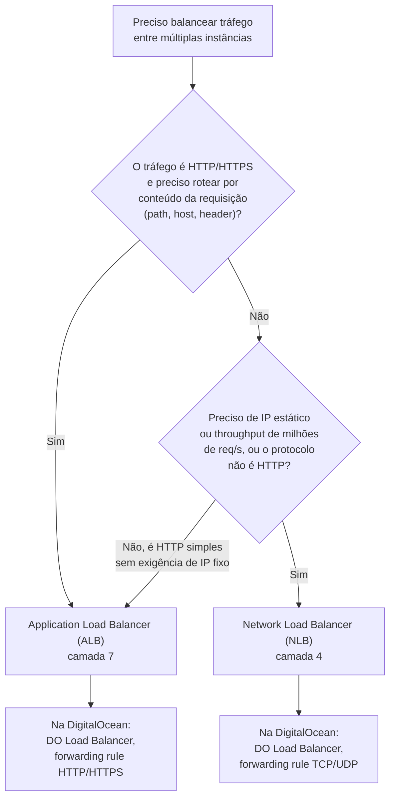
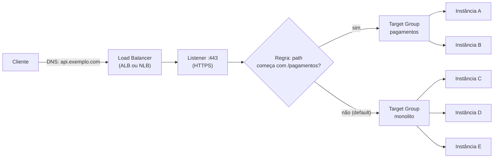
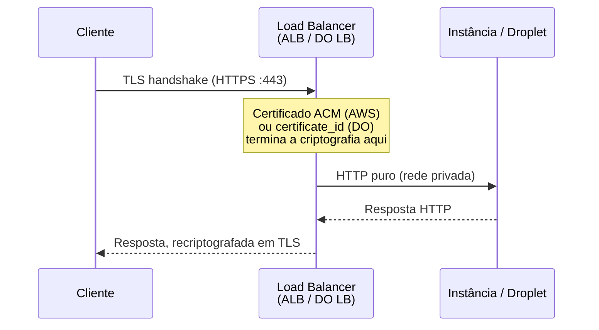

# Balanceamento de carga na nuvem

> [!abstract] TL;DR
> Um cliente resolve `api.exemplo.com` no DNS e recebe **um único IP**. Atrás desse IP não existe uma máquina — existe um **load balancer gerenciado** decidindo, requisição a requisição, para qual entre dez, cem ou zero instâncias saudáveis aquele pedido vai. Na AWS essa decisão tem duas encarnações distintas conforme a camada em que o LB opera: o **Application Load Balancer (ALB)**, que lê HTTP e roteia por host, path ou header (camada 7), e o **Network Load Balancer (NLB)**, que só vê pacotes TCP/UDP e roteia por conexão, com desempenho de milhões de requisições por segundo e IP estático (camada 4). A DigitalOcean colapsa essa distinção num único produto, o **DigitalOcean Load Balancer**, configurável por regras de encaminhamento HTTP/HTTPS/TCP sem exigir que você escolha entre "tipo ALB" e "tipo NLB". Nos dois provedores, a anatomia interna é a mesma: um **listener** escuta uma porta de entrada, aplica **regras** de roteamento, e encaminha para um **target group** (AWS) ou **backend pool** (DO) — o conjunto de instâncias que de fato processam a requisição.

## O problema: um endereço, muitas instâncias, quem decide

A aplicação que a nota anterior deste galho colocou atrás de um Auto Scaling Group tem, agora, entre duas e vinte instâncias EC2 rodando ao mesmo tempo, cada uma nascendo e morrendo conforme a demanda muda. Do lado do cliente, nada disso deveria importar — ele só quer chamar `https://api.exemplo.com/pedidos` e receber uma resposta. Mas um DNS resolve um nome para um IP, e um IP aponta para *uma* máquina. Se o cliente resolvesse o nome direto para o IP de uma instância EC2 específica, duas coisas quebrariam imediatamente: primeiro, todo o tráfego cairia numa única máquina enquanto as outras dezenove ficariam ociosas; segundo, no instante em que o Auto Scaling Group decidisse encerrar exatamente aquela instância — por uma política de scale-in, por falha de health check, por rotação de patch — todo cliente com aquele IP em cache passaria a bater numa porta que não responde mais.

O que falta entre o DNS e a frota de instâncias é uma camada que faça duas coisas ao mesmo tempo: apresentar um único ponto de contato estável para quem chama de fora, e decidir, request a request, para qual instância *saudável* dentro da frota aquela chamada específica deveria ir. Essa camada é o load balancer — e a decisão mais consequente que se toma ao configurá-lo na nuvem não é "qual algoritmo de distribuição usar" (isso é um detalhe de configuração, quase sempre round robin por padrão), mas **em que camada da pilha de rede o balanceador está disposto a olhar** para tomar essa decisão. Essa escolha de camada é o que separa um ALB de um NLB na AWS, e é o que a DigitalOcean decidiu não expor como escolha explícita.

> [!info] Fronteira
> O *conceito* abstrato de balanceamento de carga — o que é um load balancer, por que ele existe, a diferença teórica entre operar na camada 4 e na camada 7, e os algoritmos de distribuição (round robin, least connections, weighted, consistent hashing) como estratégias gerais — é assunto de **System Design**, não desta trilha. Veja `[[03-Dominios/Engenharia/Arquitetura/index]]` e `[[03-Dominios/Engenharia/Comunicação entre Sistemas/index]]`. Esta nota cobre a **encarnação gerenciada**: como AWS e DigitalOcean implementam esse conceito como produto — nomes, APIs, limites de cada serviço — e assume que o leitor já sabe, em abstrato, o que um load balancer faz.

## Camada 7 vs camada 4: ALB e NLB não são duas versões do mesmo produto

A AWS oferece, sob o guarda-chuva do Elastic Load Balancing (ELB), quatro tipos de load balancer — Application, Network, Gateway e o legado Classic. Os dois que importam para a maioria das arquiteturas modernas são o ALB e o NLB, e a documentação oficial é explícita: **um Application Load Balancer funciona na camada 7 (aplicação) do modelo OSI**, enquanto **um Network Load Balancer funciona na camada 4 (transporte)**. Essa não é uma diferença de "quão avançado" cada um é — é uma diferença de *o que cada um consegue enxergar* na requisição que está decidindo rotear.

O ALB, operando em camada 7, abre o pacote até o protocolo HTTP/HTTPS e lê o conteúdo da requisição: o método, o path da URL, o header `Host`, cookies, query strings. Isso é o que permite regras como "requisições para `/pagamentos/*` vão para o target group do serviço de pagamentos, tudo o mais vai para o monolito" — roteamento por **conteúdo da aplicação**, não por endereço de rede. É também o ALB que sabe terminar TLS, aplicar autenticação via Cognito ou OIDC antes mesmo da requisição chegar ao backend, e devolver uma resposta fixa sem nunca tocar um target.

O NLB, operando em camada 4, nunca abre o payload da aplicação — ele vê apenas TCP, UDP, TLS (passthrough), e as variantes mais novas TCP_UDP e QUIC/TCP_QUIC. A decisão de para onde mandar um pacote usa um algoritmo de *flow hash* baseado em protocolo, IP e porta de origem e destino (e, para TCP, o número de sequência) — nunca em conteúdo HTTP, porque o NLB estruturalmente não sabe que HTTP existe ali dentro. A contrapartida dessa cegueira deliberada é desempenho: a documentação da AWS afirma que o NLB "pode lidar com milhões de requisições por segundo" e é a única variante do ELB que oferece **IP estático** — um endereço IP fixo por Availability Zone (ou um Elastic IP associado), o que importa quando um firewall corporativo do outro lado da conexão precisa de uma allowlist de IPs fixos, algo que um ALB, cujo IP pode mudar, nunca garante.

| Critério | Application Load Balancer (ALB) | Network Load Balancer (NLB) |
|---|---|---|
| Camada OSI | 7 (aplicação — HTTP/HTTPS) | 4 (transporte — TCP/UDP/TLS) |
| O que enxerga na decisão de roteamento | Host, path, header, método, cookie | IP/porta de origem e destino, protocolo |
| Protocolos do target group | HTTP, HTTPS | TCP, UDP, TCP_UDP, TLS, QUIC, TCP_QUIC |
| IP estático | Não (DNS name, IP pode mudar) | Sim — um IP fixo por AZ, ou Elastic IP |
| Throughput típico | Alto, mas dimensionado para HTTP | Milhões de req/s, latência ultrabaixa |
| Terminação TLS | Sim, nativa (com ACM) | Sim, no listener TLS; ou passthrough |
| Autenticação embutida (OIDC/Cognito) | Sim | Não |
| Caso de uso típico | APIs REST, sites, microsserviços HTTP | Bancos de dados, protocolos binários, gaming, IoT, tráfego que exige IP fixo |

Repare que a pergunta "qual devo usar" quase sempre se resolve sozinha ao perguntar "meu tráfego fala HTTP e eu quero rotear por conteúdo da aplicação, ou meu tráfego é TCP/UDP cru e eu preciso do throughput e do IP estático máximos que a AWS oferece?". A maioria das APIs web usa ALB. Cargas que exigem baixíssima latência, protocolos não-HTTP, ou IP fixo para whitelisting corporativo usam NLB — e nada impede as duas de coexistirem na mesma arquitetura, cada uma resolvendo uma fatia diferente do tráfego.

Vale nomear, sem se aprofundar, que a AWS mantém ainda dois outros tipos sob o mesmo guarda-chuva do Elastic Load Balancing: o **Gateway Load Balancer**, usado para inserir appliances de rede de terceiros (firewalls, sistemas de detecção de intrusão) de forma transparente no caminho do tráfego, e o **Classic Load Balancer**, o produto original do ELB, hoje considerado legado — a própria documentação da AWS recomenda migrar para ALB ou NLB, listando explicitamente os ganhos (roteamento por conteúdo, IP estático, melhor desempenho, health checks por target group) que o Classic nunca ofereceu. Esta nota trata só de ALB e NLB porque são os dois que resolvem, hoje, a esmagadora maioria dos casos novos de arquitetura.

> [!tip] Assista: AWS Load Balancers | ALB vs NLB vs GWLB | Detailed Comparison
> **Canal:** Abhishek.Veeramalla | **Duração:** ~32min | **Idioma:** EN
>
> Compara os três tipos com exemplos de decisão de arquitetura, reforçando exatamente a distinção camada 7 (o balanceador lê a requisição) vs. camada 4 (o balanceador só encaminha pacotes) que esta seção acabou de estabelecer, e ainda cobre o Gateway Load Balancer que a nota só nomeia de passagem. Trecho de destaque [23:02]: *"application load balancer acts on layer 7 whereas the network load balancer basically acts [on layer 4]"*
>
> 🎬 [Assistir no YouTube](https://www.youtube.com/watch?v=bCS9m5RVPyo)



## Anatomia de um load balancer gerenciado: listener, regra, target group

Apesar da diferença de camada, ALB e NLB compartilham a mesma anatomia estrutural — e é essa anatomia comum que vale entender em detalhe, porque ela se repete (com nomes levemente diferentes) em qualquer nuvem séria.

- **Load balancer**: o ponto único de contato. É o recurso que recebe um DNS name (ou, no caso do NLB, também um IP estático) e existe através de múltiplas Availability Zones.
- **Listener**: verifica pedidos de conexão numa porta e protocolo configurados (por exemplo, HTTPS na porta 443). Um load balancer pode ter vários listeners — um na 80, outro na 443.
- **Regra (rule)**: pertence a um listener, tem uma prioridade, uma ou mais condições, e uma ou mais ações. Todo listener precisa de uma regra default; regras adicionais são avaliadas em ordem de prioridade até a primeira que casar.
- **Target group**: o conjunto de destinos (instâncias EC2, IPs, funções Lambda, ou até outro ALB) que efetivamente recebem a requisição, junto com o protocolo e porta usados para alcançá-los. Um target pode estar registrado em mais de um target group ao mesmo tempo, e os health checks — cobertos na próxima nota deste galho — são configurados por target group, não pelo load balancer inteiro.



A DigitalOcean simplifica essa mesma anatomia num único conceito de **forwarding rule** (regra de encaminhamento): cada regra já combina, num único objeto, o que na AWS são três peças separadas — protocolo/porta de entrada (equivalente ao listener), protocolo/porta de saída para o backend (equivalente ao target group), e não existe uma camada intermediária de "regra de roteamento por conteúdo" separada, porque o DO Load Balancer não expõe roteamento por path/host como recurso de primeira classe do jeito que o ALB expõe — sua unidade de decisão é a regra de encaminhamento, ponto.

### O que pode ser um target: instância, IP ou função

Um target group precisa declarar, no momento da criação, o **tipo de target** que vai registrar — e essa escolha não pode ser trocada depois sem recriar o target group. A AWS suporta três tipos: `instance` (o target é identificado por ID de instância EC2, e o tráfego chega ao endereço IP privado primário da interface de rede primária), `ip` (o target é um endereço IP dentro de blocos privados específicos — as sub-redes da própria VPC do target group, ou faixas RFC 1918/RFC 6598 — o que permite registrar recursos que não são instâncias EC2 comuns, como um banco de dados gerenciado, uma instância numa VPC pareada, ou até um recurso on-premises alcançável por Direct Connect ou VPN), e `lambda` (o target é uma única função Lambda, invocada diretamente pelo load balancer a cada requisição, sem nenhuma instância de servidor envolvida).

A escolha entre `instance` e `ip` raramente é uma questão de preferência: `instance` é o caminho natural quando o Auto Scaling Group já gerencia o ciclo de vida das máquinas e registra/desregistra automaticamente; `ip` se torna necessário quando o destino não tem um ID de instância para começo de conversa — um container ECS numa rede awsvpc, por exemplo, ou qualquer recurso fora do universo EC2 tradicional. Já `lambda` como target type é o que permite colocar um ALB na frente de uma arquitetura inteiramente serverless, sem nenhum servidor rodando entre o cliente e a função.

A DigitalOcean não expõe essa distinção como uma propriedade nomeada do target group — o backend pool do DO Load Balancer é sempre expresso em termos de Droplets (por ID ou por tag), porque a plataforma não tem um produto Lambda-equivalente registrável diretamente como backend de um load balancer da mesma forma que a AWS oferece.

## Criando o load balancer: AWS (ALB) e DigitalOcean lado a lado

O fluxo completo do lado da AWS para um ALB são quatro comandos: criar o load balancer, criar o target group, registrar os targets nele, e criar o listener que amarra os dois.

```bash
# 1 — cria o Application Load Balancer, associado a subnets em duas AZs
$ aws elbv2 create-load-balancer \
    --name api-exemplo-alb \
    --subnets subnet-0abc111 subnet-0abc222 \
    --security-groups sg-0abc333 \
    --scheme internet-facing \
    --type application

{
    "LoadBalancers": [{
        "LoadBalancerArn": "arn:aws:elasticloadbalancing:us-east-1:123456789012:loadbalancer/app/api-exemplo-alb/50dc6c495c0c9188",
        "DNSName": "api-exemplo-alb-1234567890.us-east-1.elb.amazonaws.com",
        "Type": "application",
        "State": {"Code": "provisioning"}
    }]
}
```

```bash
# 2 — cria o target group que vai receber o tráfego HTTP na porta 80
$ aws elbv2 create-target-group \
    --name api-exemplo-tg \
    --protocol HTTP \
    --port 80 \
    --target-type instance \
    --vpc-id vpc-0abc444

{
    "TargetGroups": [{
        "TargetGroupArn": "arn:aws:elasticloadbalancing:us-east-1:123456789012:targetgroup/api-exemplo-tg/73e2d6bc24d8a067",
        "Protocol": "HTTP",
        "Port": 80
    }]
}
```

```bash
# 3 — registra as instâncias vivas no target group
$ aws elbv2 register-targets \
    --target-group-arn arn:aws:elasticloadbalancing:us-east-1:123456789012:targetgroup/api-exemplo-tg/73e2d6bc24d8a067 \
    --targets Id=i-0a1b2c3d4e5f,Port=80 Id=i-0f5e4d3c2b1a,Port=80
```

```bash
# 4 — cria o listener HTTPS que amarra o LB ao target group via regra default
$ aws elbv2 create-listener \
    --load-balancer-arn arn:aws:elasticloadbalancing:us-east-1:123456789012:loadbalancer/app/api-exemplo-alb/50dc6c495c0c9188 \
    --protocol HTTPS \
    --port 443 \
    --certificates CertificateArn=arn:aws:acm:us-east-1:123456789012:certificate/abc-123 \
    --default-actions Type=forward,TargetGroupArn=arn:aws:elasticloadbalancing:us-east-1:123456789012:targetgroup/api-exemplo-tg/73e2d6bc24d8a067
```

Repare na sequência: nada nesses quatro comandos menciona instâncias específicas até o passo 3. Load balancer, target group e listener são recursos que existem de forma independente da frota — o que muda dinamicamente é só a lista de targets registrados, o mesmo padrão que o Auto Scaling Group da nota anterior explora ao registrar e desregistrar instâncias automaticamente conforme escala.

Do lado da DigitalOcean, a mesma intenção — HTTPS na porta 443, terminando TLS, encaminhando para HTTP na porta 80 dos Droplets marcados com uma tag — cabe num único comando:

```bash
$ doctl compute load-balancer create \
    --name api-exemplo-lb \
    --region nyc1 \
    --tag-name api-exemplo-backend \
    --forwarding-rules entry_protocol:https,entry_port:443,target_protocol:http,target_port:80,certificate_id:abc-123-cert-id

ID          Name              IP               Status
lb-9f8e7d   api-exemplo-lb    203.0.113.45     new
```

Não existe, no lado da DigitalOcean, um comando separado equivalente a `create-target-group` seguido de `register-targets` — o backend pool é resolvido na hora da criação (ou de uma atualização) do load balancer, apontando para droplets específicos via `--droplet-ids` ou, como no exemplo acima, para qualquer Droplet que carregue uma tag via `--tag-name`. Essa segunda forma tem uma vantagem prática que vale nomear: um Droplet novo, lançado por autoscaling e etiquetado com a tag certa, entra automaticamente no backend pool sem que nenhum comando adicional precise rodar — o equivalente funcional ao que o Auto Scaling Group da AWS faz ao registrar instâncias novas no target group sozinho.

Adicionar uma segunda regra de encaminhamento (por exemplo, TCP puro na porta 5432 para um caso de uso de banco de dados atrás do mesmo LB) é uma atualização, não uma recriação:

```bash
$ doctl compute load-balancer update lb-9f8e7d \
    --name api-exemplo-lb \
    --tag-name api-exemplo-backend \
    --forwarding-rules \
entry_protocol:https,entry_port:443,target_protocol:http,target_port:80,certificate_id:abc-123-cert-id,\
entry_protocol:tcp,entry_port:5432,target_protocol:tcp,target_port:5432
```

### Desregistrando e removendo: o caminho de volta

O mesmo par de comandos que registra targets serve, de forma simétrica, para tirá-los de circulação sem destruir nada — o caso comum de colocar uma instância em manutenção sem esperar o Auto Scaling Group decidir por conta própria:

```bash
# AWS — remove uma instância do target group; ela entra em estado
# "draining" pelo tempo do deregistration_delay antes de sair de vez
$ aws elbv2 deregister-targets \
    --target-group-arn arn:aws:elasticloadbalancing:us-east-1:123456789012:targetgroup/api-exemplo-tg/73e2d6bc24d8a067 \
    --targets Id=i-0a1b2c3d4e5f

# DO — atualizar o LB removendo um droplet-id da lista equivale
# a desregistrá-lo do backend pool
$ doctl compute load-balancer update lb-9f8e7d \
    --name api-exemplo-lb \
    --droplet-ids 33 \
    --forwarding-rules entry_protocol:https,entry_port:443,target_protocol:http,target_port:80,certificate_id:abc-123-cert-id
```

Destruir o load balancer inteiro — o passo final quando um serviço é descontinuado — segue o mesmo padrão de nomes já visto em toda a nota:

```bash
$ aws elbv2 delete-load-balancer \
    --load-balancer-arn arn:aws:elasticloadbalancing:us-east-1:123456789012:loadbalancer/app/api-exemplo-alb/50dc6c495c0c9188

$ doctl compute load-balancer delete lb-9f8e7d
```

## Regras de roteamento por conteúdo: path, host e header

A regra default de um listener — "tudo que não casar com nenhuma regra mais específica vai para este target group" — resolve o caso mais simples, mas o motivo de existir um ALB em vez de um NLB para tráfego HTTP costuma ser justamente o oposto: rotear *diferente* conforme o conteúdo da requisição. O exemplo mais comum na prática é dividir um monolito em fatias sem precisar reescrever tudo de uma vez — uma extração de microsserviço "morna", onde só o path `/pagamentos/*` sai do monolito e vai para um serviço novo, enquanto todo o resto continua batendo na regra default.

Isso é feito com `aws elbv2 create-rule`, que recebe o ARN do listener, uma prioridade (números menores são avaliados primeiro), uma condição e uma ação:

```bash
$ aws elbv2 create-rule \
    --listener-arn arn:aws:elasticloadbalancing:us-east-1:123456789012:listener/app/api-exemplo-alb/50dc6c495c0c9188/f2f7dc8efc522ab2 \
    --priority 10 \
    --conditions file://condicao-pagamentos.json \
    --actions Type=forward,TargetGroupArn=arn:aws:elasticloadbalancing:us-east-1:123456789012:targetgroup/pagamentos-tg/9a1b2c3d4e5f6789
```

```json
// condicao-pagamentos.json — casa qualquer path que comece com /pagamentos/
[
  {
    "Field": "path-pattern",
    "PathPatternConfig": { "Values": ["/pagamentos/*"] }
  }
]
```

O mesmo mecanismo de condição serve para rotear por `Host` — útil quando um único ALB atende vários domínios (`app.exemplo.com` e `admin.exemplo.com`, por exemplo), cada um indo para um target group diferente:

```json
// condicao-host.json — casa pelo header Host da requisição
[
  {
    "Field": "host-header",
    "HostHeaderConfig": { "Values": ["admin.exemplo.com"] }
  }
]
```

Path patterns aceitam os curingas `*` (zero ou mais caracteres) e `?` (exatamente um caractere), são sensíveis a maiúsculas/minúsculas, e uma regra pode combinar múltiplas condições ao mesmo tempo (path *e* host, por exemplo) — nesse caso, só passa a requisição que satisfizer todas simultaneamente. O DigitalOcean Load Balancer, coerente com sua filosofia de simplicidade, não expõe esse nível de roteamento por conteúdo como recurso de primeira classe da forwarding rule — se a arquitetura em DO precisa de roteamento por path ou host, o padrão comum é colocar um proxy reverso de aplicação (um Nginx, um Traefik) atrás do LB, movendo essa decisão para dentro da própria camada de aplicação.

## Deregistration delay e cross-zone: dois atributos que decidem o corte de tráfego

Dois atributos de target group, pouco visíveis até que algo dê errado em produção, decidem exatamente *quando* uma instância para de receber tráfego e *quão amplamente* o load balancer distribui entre zonas — e ambos têm defaults que vale conhecer de cor.

**`deregistration_delay.timeout_seconds`** — também chamado de *connection draining* — controla quanto tempo o load balancer espera antes de considerar um target totalmente removido depois que ele é desregistrado (por exemplo, quando o Auto Scaling Group decide encerrar aquela instância). Durante essa janela, o target entra no estado `draining`: o load balancer para de mandar requisições *novas* para ele, mas deixa as conexões *já em andamento* terminarem normalmente, em vez de cortá-las no meio. O intervalo aceito vai de 0 a 3600 segundos, e **o default é 300 segundos (5 minutos)**. Ignorar esse atributo é uma causa comum e discreta de erros 5xx esporádicos durante deploys ou eventos de scale-in: se a aplicação demora mais que o deregistration delay configurado para finalizar uma requisição longa, a conexão é cortada abruptamente de qualquer forma.

```bash
# Reduz o deregistration delay de 300s (default) para 30s —
# apropriado para uma API cujas requisições nunca passam de poucos segundos
$ aws elbv2 modify-target-group-attributes \
    --target-group-arn arn:aws:elasticloadbalancing:us-east-1:123456789012:targetgroup/api-exemplo-tg/73e2d6bc24d8a067 \
    --attributes Key=deregistration_delay.timeout_seconds,Value=30
```

**`load_balancing.cross_zone.enabled`** — decide se cada nó do load balancer, dentro de uma Availability Zone, distribui tráfego só entre os targets *daquela mesma zona*, ou entre *todos* os targets registrados, não importa em qual zona estejam. O valor default é `use_load_balancer_configuration` — ou seja, herda o comportamento configurado no load balancer em si, que para um ALB moderno normalmente já vem com cross-zone habilitado. O efeito prático de deixar cross-zone desligado aparece quando a distribuição de targets entre zonas é desbalanceada: se a Availability Zone A tem 8 instâncias saudáveis e a B tem só 2, e cross-zone está desligado, cada instância na zona B recebe uma fatia de tráfego quatro vezes maior que cada instância na zona A — porque o nó do LB na zona B só tem aquelas 2 instâncias para distribuir entre si. Com cross-zone ligado, as 10 instâncias dividem o tráfego de forma uniforme, não importa em qual zona cada uma esteja.

A DigitalOcean não expõe esses dois parâmetros como configuração nomeada — o comportamento equivalente ao deregistration delay é controlado por timeouts gerais de conexão do LB (o idle timeout, com 60 segundos como padrão documentado), e o balanceamento entre regiões, quando existe, é resolvido pelo Global Load Balancer da plataforma, um produto separado do LB regional usado nos exemplos desta nota.

## Algoritmos de distribuição: round robin e least connections, rapidamente

A escolha de *qual* target dentro do grupo recebe a próxima requisição — o algoritmo de distribuição — é onde a teoria de System Design vive, e esta nota não vai reexplicá-la. O que vale fixar aqui é só o vocabulário e o default de cada produto: o atributo `load_balancing.algorithm.type` de um target group de ALB aceita três valores — **`round_robin`** (o default), **`least_outstanding_requests`** (a variante de least connections do ALB, que prioriza o target com menos requisições pendentes no momento) e **`weighted_random`**, uma opção mais recente que distribui aleatoriamente mas ponderado por peso configurável por target, com um modo adicional de **anomaly mitigation** (`load_balancing.algorithm.anomaly_mitigation`, desligado por default) que detecta targets respondendo com uma taxa anormal de erros e reduz automaticamente o peso deles na distribuição, sem removê-los do target group. O NLB não escolhe por algoritmo de aplicação — ele usa flow hash, como visto acima, porque nunca vê "requisições" no sentido HTTP, só fluxos de conexão. O DigitalOcean Load Balancer também opera por round robin como padrão, com opção de least connections dependendo da configuração do backend pool.

```bash
# Troca o algoritmo do target group de round robin (default) para
# least_outstanding_requests — útil quando requisições têm duração desigual
$ aws elbv2 modify-target-group-attributes \
    --target-group-arn arn:aws:elasticloadbalancing:us-east-1:123456789012:targetgroup/api-exemplo-tg/73e2d6bc24d8a067 \
    --attributes Key=load_balancing.algorithm.type,Value=least_outstanding_requests
```

> [!info] Fronteira
> O *porquê* round robin é simples e ingênuo (ignora carga real de cada instância) enquanto least connections tenta compensar isso, e as variantes mais avançadas (weighted, consistent hashing, power-of-two-choices) que aparecem em balanceadores de software como o Envoy — isso é teoria de algoritmos de distribuição, coberta em `[[03-Dominios/Engenharia/Comunicação entre Sistemas/index]]`. Aqui, o que importa é saber nomear a opção certa no console ou na CLI.

## Sticky sessions: quando o balanceador lembra quem você é

Por padrão, um load balancer trata cada requisição como uma decisão nova e independente — é exatamente essa independência que permite distribuir carga de forma uniforme e que torna qualquer instância substituível. **Sticky sessions** (também chamadas de session affinity) quebram essa independência de propósito: uma vez que uma sessão de cliente é roteada para uma instância específica, o load balancer passa a mandar *todas* as requisições subsequentes daquela mesma sessão para a *mesma* instância, em vez de redistribuir.

No ALB, isso funciona via cookie. No modo **duration-based**, o próprio ALB gera e gerencia um cookie chamado `AWSALB`, com uma duração configurável (o padrão documentado pela AWS é um dia); toda requisição que chega sem esse cookie é roteada normalmente e recebe o cookie na resposta, e toda requisição que chega *com* o cookie é roteada de volta para o mesmo target, enquanto ele continuar saudável. No modo **application-based**, é a própria aplicação que gera um cookie próprio, e o ALB aprende a rotear com base nesse cookie específico — mais flexível, mas exige suporte explícito no código da aplicação. A DigitalOcean oferece o mesmo conceito sob o nome mais direto de **sticky sessions**, configurável por regra de encaminhamento, com opção de cookie gerenciado pelo próprio LB ou cookie da aplicação.

```json
// Habilitando stickiness num target group da AWS (modo duration-based)
{
  "TargetGroupArn": "arn:aws:elasticloadbalancing:...:targetgroup/api-exemplo-tg/...",
  "Attributes": [
    { "Key": "stickiness.enabled", "Value": "true" },
    { "Key": "stickiness.type", "Value": "lb_cookie" },
    { "Key": "stickiness.lb_cookie.duration_seconds", "Value": "86400" }
  ]
}
```

O atrito com statelessness é direto e vale nomear sem rodeios: uma arquitetura verdadeiramente stateless não deveria se importar para qual instância uma requisição vai, porque nenhuma instância guarda estado que só ela possui. Sticky sessions existem precisamente porque, em algum lugar, essa promessa foi quebrada — geralmente porque a aplicação guarda sessão de usuário em memória local (um `HttpSession` do lado do servidor, por exemplo) em vez de externalizá-la para um armazenamento compartilhado como Redis ou um banco de dados. Ligar sticky sessions "resolve" o sintoma — a sessão para de sumir quando o load balancer troca de target — mas paga um preço estrutural: a instância que concentra sessões antigas não pode ser removida sem derrubar quem está preso a ela, o Auto Scaling Group perde parte da liberdade de fazer scale-in que a nota anterior descreveu, e a distribuição de carga deixa de ser uniforme porque sessões antigas se acumulam de forma desigual entre os targets. A resposta estruturalmente correta, sempre que for viável reescrever a aplicação, é eliminar a necessidade de sticky sessions externalizando o estado de sessão — não configurar stickiness "para sempre" como se fosse uma feature em vez de uma muleta.

## Terminação TLS no load balancer

Colocar o certificado TLS no load balancer, em vez de em cada instância individualmente, resolve dois problemas de uma vez: a rotação de certificado passa a ser uma operação central (trocar o certificado do LB, não redistribuir para dezenas de instâncias), e o tráfego entre o LB e as instâncias pode seguir sem criptografia adicional dentro de uma rede privada já isolada — reduzindo o custo de CPU de criptografia em cada instância individual, sem abrir mão de HTTPS na borda pública.

No ALB, isso é feito anexando um certificado do AWS Certificate Manager (ACM) ao listener HTTPS, como no comando `create-listener` visto acima (`--certificates CertificateArn=...`). No NLB, a terminação TLS também é suportada — o listener pode ser do tipo `TLS`, decriptando na borda e encaminhando texto puro para o target group — ou o NLB pode operar em modo **passthrough**, encaminhando os bytes TLS intactos até a instância, que termina a criptografia ela mesma (útil quando a instância precisa do certificado do cliente para autenticação mútua, algo que a terminação no LB esconderia).

No DigitalOcean Load Balancer, a terminação TLS é configurada por regra de encaminhamento, associando um `certificate_id` (obtido via `doctl certificate list` ou gerado automaticamente com Let's Encrypt pela própria plataforma) à regra que tem `entry_protocol:https`. A alternativa de passthrough também existe, ligada pela flag `tls_passthrough:true` na regra — nesse caso a criptografia segue intacta até o Droplet, o mesmo padrão conceitual do NLB em modo passthrough.

```bash
# DO — regra HTTPS terminando TLS no load balancer
--forwarding-rules entry_protocol:https,entry_port:443,target_protocol:http,target_port:80,certificate_id:abc-123-cert-id

# DO — regra HTTPS com passthrough (o Droplet decripta)
--forwarding-rules entry_protocol:https,entry_port:443,target_protocol:https,target_port:443,tls_passthrough:true
```



## Preservação do IP do cliente: uma diferença sutil entre ALB e NLB

Um detalhe que costuma surpreender quem migra de NLB para ALB (ou vice-versa) sem checar a documentação: o **IP de origem que a aplicação enxerga não é necessariamente o IP real do cliente**, e o comportamento muda conforme o tipo de load balancer e o tipo de target. Um ALB sempre atua como proxy de camada 7 — ele abre uma conexão TCP nova com o target e encaminha a requisição HTTP por cima dela, o que significa que, sem nenhuma configuração adicional, a aplicação veria o IP do próprio nó do ALB como origem, não o IP do cliente real. A forma padrão de recuperar o IP original é ler o header `X-Forwarded-For`, que o ALB injeta automaticamente em toda requisição encaminhada.

Um NLB, por outro lado, opera em camada 4 e, para targets do tipo `instance`, preserva o IP de origem do cliente por padrão — o pacote chega ao target com o IP do cliente intacto no cabeçalho TCP/IP, sem precisar de nenhum header adicional. Essa preservação nativa é justamente um dos motivos pelos quais sistemas que precisam do IP real do cliente para lógica de negócio (geolocalização, rate limiting por IP, auditoria de segurança) e não querem depender de parsing de header preferem NLB mesmo quando o tráfego é HTTP.

| | ALB | NLB (target type `instance`) |
|---|---|---|
| IP do cliente visível diretamente na conexão TCP | Não — chega o IP do nó do LB | Sim — preservado nativamente |
| Como recuperar o IP real | Header `X-Forwarded-For` | Já vem no pacote |

## Tradução entre nuvens: quatro provedores, o mesmo par de conceitos

| Conceito | AWS | Azure | GCP | DigitalOcean |
|---|---|---|---|---|
| Load balancer de camada 7 (HTTP) | Application Load Balancer (ALB) | Application Gateway | Application Load Balancer (HTTPS) | DigitalOcean Load Balancer (regras HTTP/HTTPS) |
| Load balancer de camada 4 (TCP/UDP) | Network Load Balancer (NLB) | Azure Load Balancer | Network Load Balancer (passthrough) | DigitalOcean Load Balancer (regras TCP/UDP) |
| IP estático dedicado | NLB (por AZ) ou Elastic IP no ALB via NLB à frente | IP público estático anexado | IP externo estático reservado | IP do LB é estático por padrão |
| Terminação TLS gerenciada | ACM anexado ao listener | Certificado no Application Gateway | Certificado gerenciado no LB | `certificate_id` na forwarding rule (Let's Encrypt integrado) |
| Backend pool | Target group | Backend pool | Backend service | Backend pool (via droplet IDs ou tag) |

> [!info] Caducidade
> Comportamento e limites verificados em 2026-07-23 na documentação oficial de AWS ELB e DigitalOcean. O suporte a Network Load Balancer na DigitalOcean (roteamento explícito em camada TCP/UDP como produto dedicado) é recente na plataforma — confirme no painel a oferta vigente antes de decidir, porque a linha entre "regra TCP dentro do LB único" e "produto NLB dedicado" pode ter evoluído desde então.

## Casos práticos

**A extração de microsserviço que não exigiu um segundo domínio.** Uma equipe mantém um monolito Rails atrás de um ALB único, `app.exemplo.com`, servindo tudo — catálogo, carrinho, pagamentos — do mesmo target group. O time de pagamentos reescreve o próprio módulo como um serviço separado em Go, e a pergunta que aparece é: como colocar esse serviço novo em produção sem pedir para o time de front-end trocar nenhuma URL? A resposta não exige um segundo load balancer nem um segundo domínio — basta uma regra nova no mesmo listener HTTPS já existente, com prioridade mais alta que a regra default, casando `path-pattern: /pagamentos/*` e apontando para o target group do serviço novo (o exemplo de `create-rule` acima é, literalmente, esse cenário). Do ponto de vista do cliente, nada mudou: mesmo domínio, mesmo certificado TLS, mesma porta 443. Do ponto de vista da operação, o monolito e o serviço novo agora coexistem atrás do mesmo LB, e a extração pode continuar path por path, sem uma migração de infraestrutura de uma vez só — o oposto de um "big bang" de deploy.

**O parceiro que só aceita tráfego de um IP fixo.** Uma integração B2B exige que a empresa registre, na allowlist de firewall do parceiro, o IP exato de onde as chamadas vão sair — um requisito comum em integrações bancárias e de pagamento, onde o parceiro não confia em ranges de IP dinâmicos de nuvem pública. Um ALB não serve para esse caso: seu DNS name pode resolver para IPs diferentes ao longo do tempo, porque a AWS gerencia os nós do balanceador de forma elástica por trás do nome. A solução correta é um NLB, que oferece IP estático nativo (um Elastic IP associável por subnet). A equipe cria um NLB com um listener TCP, encaminhando para o mesmo target group HTTP que a aplicação já usa (o NLB pode encaminhar para um target group cujo protocolo é HTTP, desde que o próprio NLB opere em modo passthrough de camada 4 puro); registra o Elastic IP resultante na allowlist do parceiro; e a integração passa a funcionar sem que a aplicação em si precise saber que está atrás de um tipo de load balancer diferente do resto do tráfego.

```bash
# Cria o NLB associando um Elastic IP por subnet — o IP resultante
# é o que vai para a allowlist do parceiro
$ aws elbv2 create-load-balancer \
    --name integracao-parceiro-nlb \
    --type network \
    --subnet-mappings SubnetId=subnet-0abc111,AllocationId=eipalloc-0a1b2c3d4e5f
```

**O deploy que parava de responder por 20 segundos.** Um time notou que, a cada deploy — quando o Auto Scaling Group substituía instâncias antigas por uma nova AMI — uma fração pequena mas constante de requisições retornava erro 502, mesmo com health checks passando normalmente antes e depois da substituição. A causa era o `deregistration_delay` no valor default de 300 segundos combinado com um script de deploy que matava a instância antiga à força depois de só 20 segundos — bem antes do load balancer terminar de drenar as conexões em andamento. A correção não foi mexer no script de deploy, foi alinhar os dois números: ou aumentar o tempo que o script espera antes de forçar o encerramento, ou (mais simples, já que a API do time responde em milissegundos) reduzir o `deregistration_delay` para um valor compatível com a duração real das requisições, como no exemplo de `modify-target-group-attributes` acima.

## Armadilhas comuns

> [!warning] Confundir "meu tráfego é HTTP" com "eu preciso de um ALB"
> Nem toda carga HTTP se beneficia de roteamento por conteúdo. Se a aplicação é um único serviço monolítico sem necessidade de rotear por path ou host, um NLB na frente dele — com terminação TLS via listener TLS — entrega throughput maior e IP estático, sem o custo de processamento de camada 7 que o ALB paga para ler cada requisição. A pergunta certa não é "meu protocolo é HTTP", é "eu preciso que o load balancer *leia o conteúdo* da requisição para decidir o roteamento".

> [!warning] Ligar sticky sessions para "resolver" um bug de sessão perdida
> Um sintoma comum: usuários relatam que são deslogados aleatoriamente, alguém liga sticky sessions no LB, o sintoma some, e a causa raiz — sessão guardada em memória local da instância, nunca externalizada — nunca é revisitada. Meses depois, o Auto Scaling Group precisa fazer scale-in agressivo (custo, manutenção, deploy) e um punhado de usuários é derrubado sem aviso, porque suas sessões estavam presas numa instância que acabou de ser terminada. Sticky sessions são uma mitigação tática, não uma solução — trate o alarme que elas resolvem como um lembrete de dívida técnica, não como caso encerrado.

> [!warning] Assumir que o IP do cliente chega intacto num ALB
> É comum um sistema de rate limiting ou de auditoria ler o IP de origem da conexão TCP diretamente, funcionar perfeitamente em ambiente de teste sem load balancer, e quebrar silenciosamente em produção atrás de um ALB — porque o IP que chega na conexão é o do próprio nó do ALB, não o do cliente. A correção é sempre ler `X-Forwarded-For`, nunca o IP de origem bruto do socket, em qualquer aplicação que vive atrás de um ALB (ou de qualquer proxy reverso de camada 7, incluindo o de outros provedores).

> [!warning] Esquecer que o target group tem seu próprio protocolo, independente do listener
> É perfeitamente válido — e comum — que um listener HTTPS na porta 443 encaminhe para um target group HTTP na porta 80 (a terminação TLS acontece no LB, o tráfego segue em texto puro até a instância dentro da rede privada). Configurar o target group com HTTPS por hábito, sem instalar certificado nenhum na instância, faz os health checks falharem silenciosamente e o target group inteiro aparecer como não saudável sem nenhuma mensagem de erro óbvia — o assunto exato da próxima nota deste galho.

## O que vem a seguir

Um load balancer configurado com listener, regras e target group já sabe *como* distribuir tráfego — mas ele ainda não sabe *para onde não mandar* tráfego. Cada um dos targets registrados pode estar reiniciando, travado, ou totalmente fora do ar, e o LB, sem mais informação, continuaria mandando requisições para ele de qualquer forma. O mecanismo que fecha esse buraco — sondas periódicas que decidem, target a target, quem está de fato pronto para receber tráfego — é o assunto da próxima nota.

## Fontes

- [AWS — What is an Application Load Balancer?](https://docs.aws.amazon.com/elasticloadbalancing/latest/application/introduction.html) — camada 7 OSI, componentes (listener/regra/target group), algoritmo default round robin e least outstanding requests; acessado em 2026-07-23.
- [AWS — What is a Network Load Balancer?](https://docs.aws.amazon.com/elasticloadbalancing/latest/network/introduction.html) — camada 4 OSI, protocolos TCP/UDP/TLS/TCP_UDP/QUIC/TCP_QUIC, flow hash, IP estático por AZ, throughput de milhões de req/s; acessado em 2026-07-23.
- [AWS CLI — elbv2 create-load-balancer](https://docs.aws.amazon.com/cli/latest/reference/elbv2/create-load-balancer.html) — sintaxe, `--type application|network|gateway`, `--scheme`, `--subnets`/`--subnet-mappings`; acessado em 2026-07-23.
- [AWS CLI — elbv2 create-target-group](https://docs.aws.amazon.com/cli/latest/reference/elbv2/create-target-group.html) — protocolos suportados, parâmetros de health check e seus defaults; acessado em 2026-07-23.
- [AWS CLI — elbv2 create-listener](https://docs.aws.amazon.com/cli/latest/reference/elbv2/create-listener.html) — sintaxe de `--default-actions`, ação `forward` para target group, certificados no listener; acessado em 2026-07-23.
- [AWS — Sticky sessions for your Application Load Balancer](https://docs.aws.amazon.com/elasticloadbalancing/latest/application/sticky-sessions.html) — cookie `AWSALB`, modos duration-based e application-based, duração default; acessado em 2026-07-23.
- [DigitalOcean — Load Balancers product documentation](https://docs.digitalocean.com/products/networking/load-balancers/) — regras de encaminhamento, terminação TLS/passthrough, sticky sessions, Network Load Balancers (lançamento recente na plataforma); acessado em 2026-07-23.
- [DigitalOcean — doctl compute load-balancer create (CLI Reference)](https://docs.digitalocean.com/reference/doctl/reference/compute/load-balancer/create/) — sintaxe de `--forwarding-rules`, `--droplet-ids`, `--tag-name`; acessado em 2026-07-23.
- [AWS CLI — elbv2 create-rule](https://docs.aws.amazon.com/cli/latest/reference/elbv2/create-rule.html) — sintaxe de `--conditions`/`--priority`, roteamento por `path-pattern` e `host-header`, curingas `*`/`?`; acessado em 2026-07-23.
- [AWS — Target groups for your Application Load Balancers](https://docs.aws.amazon.com/elasticloadbalancing/latest/application/load-balancer-target-groups.html) — atributos de target group: `deregistration_delay.timeout_seconds` (default 300s), `load_balancing.cross_zone.enabled` (default `use_load_balancer_configuration`), estado `draining`; acessado em 2026-07-23.
