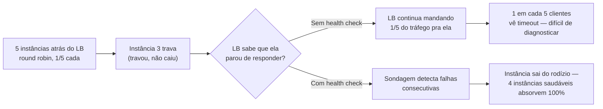
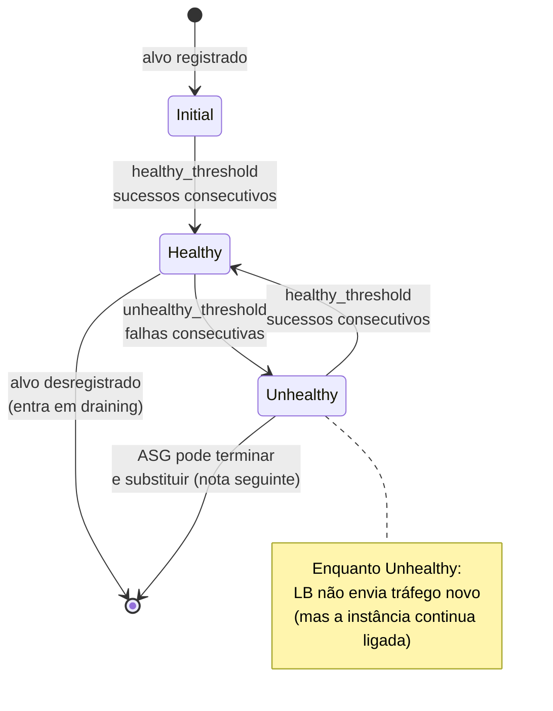
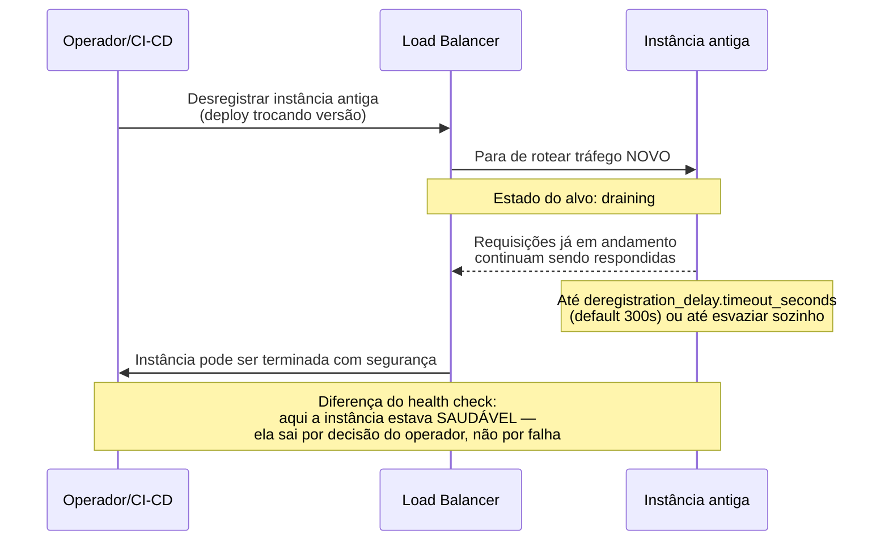

# Health checks

> [!abstract] TL;DR
> Um balanceador de carga distribui tráfego entre instâncias que ele *presume* saudáveis — mas presunção não é verificação. Um **health check** é o mecanismo que fecha essa lacuna: o load balancer sonda cada alvo periodicamente, num intervalo configurável (`interval`), esperando uma resposta dentro de um prazo (`timeout`), e só declara um alvo doente depois de um número consecutivo de falhas (`unhealthy threshold`) — e só o declara saudável de novo depois de um número consecutivo de sucessos (`healthy threshold`). Esses quatro números, multiplicados entre si, determinam algo concreto e frequentemente ignorado: **quanto tempo uma instância travada continua recebendo tráfego real depois de já estar morta**. Existem dois health checks diferentes rodando ao mesmo tempo, com poderes diferentes: o do load balancer, que só *para de mandar tráfego* para o alvo doente, e o do Auto Scaling Group, que pode ir além e *terminar e substituir* a instância — assunto que a próxima nota desenvolve. E quando uma instância saudável precisa sair de cena por um motivo legítimo (deploy, scale-in), existe um mecanismo irmão — **draining** — que garante que as conexões em andamento terminem antes da porta fechar de vez.

## O problema: 1 em cada 10 requisições cai no buraco

Uma equipe de e-commerce roda cinco instâncias atrás de um Application Load Balancer. Por volta das 14h, uma delas trava — não cai, não é encerrada, simplesmente para de responder: um vazamento de memória empurrou o processo para um estado de *garbage collection* permanente, consumindo 100% de CPU sem nunca devolver uma resposta. A instância continua *ligada*. O sistema operacional está de pé. A porta TCP ainda aceita conexão. Só que, depois da conexão aberta, nada volta.

Sem nenhum mecanismo de verificação, o load balancer continua fazendo exatamente o que sempre fez: distribuindo requisições nas cinco instâncias, uma quinta parte do tráfego para cada uma — incluindo a que está travada. O efeito na prática é o pior tipo de incidente para diagnosticar: **um em cada cinco clientes** vê a página travar e expirar por timeout, enquanto os outros quatro em cinco continuam navegando normalmente, sem nenhum problema visível. Não há um padrão limpo — não é "o site caiu", é "o site funciona, às vezes, para algumas pessoas, sem explicação aparente". Suporte recebe reclamações incoerentes. O time de plantão olha os painéis agregados de latência e vê uma média que subiu um pouco, mas nada que grite "instância morta" — porque a média está sendo diluída pelas quatro quintas partes do tráfego que continuam rápidas.

O problema estrutural aqui não é a instância travar — instâncias travam, isso é esperado em qualquer frota grande o bastante. O problema é que **o load balancer não tinha nenhuma forma de saber**. Ele roteia por uma regra simples (round robin, menor número de conexões, o que for) que assume implicitamente que todo alvo registrado está apto a responder. Essa suposição, sem verificação ativa, é o que transforma uma falha isolada de uma única instância em uma degradação difusa e intermitente para todo mundo que bate naquela quinta parte do tráfego.

A pergunta que resolve isso não é "como evitar que instâncias travem" — impossível de garantir em qualquer sistema real — mas sim: **como o load balancer descobre, sozinho e continuamente, que um alvo específico parou de responder, e para de mandar tráfego pra ele antes que o próximo cliente caia nessa roleta?** A resposta chama-se health check, e ela roda em segundo plano, batendo na porta de cada alvo repetidamente, o tempo todo — não só quando alguém lembra de checar.



## O mecanismo: sondagem periódica, não verificação única

Um health check não é uma checagem que roda uma vez no início e depois é esquecida — é uma sondagem **contínua**, repetida indefinidamente enquanto a instância estiver registrada. O load balancer (ou, no caso de instâncias em grupo, também o Auto Scaling Group) envia, a cada `interval` segundos, uma requisição de teste para cada alvo, usando o protocolo, a porta e — no caso de HTTP — o caminho configurados. Cada sondagem é independente da anterior: o resultado de uma sondagem vale pelo intervalo inteiro seguinte, e o tempo que o alvo demora para responder não altera quando a próxima sondagem é disparada.

O resultado de cada sondagem é binário — passou ou falhou — mas o load balancer não muda o estado do alvo a partir de uma única sondagem isolada. Ele exige uma sequência de resultados **consecutivos** iguais antes de mudar de opinião:

- Depois de `unhealthy threshold` falhas seguidas, o alvo sai do rodízio de tráfego.
- Depois de `healthy threshold` sucessos seguidos (a partir do estado doente, ou no registro inicial), o alvo volta a receber tráfego.

Essa exigência de consecutividade existe por um motivo direto: uma única sondagem pode falhar por um motivo completamente alheio à saúde real do alvo — um pacote perdido na rede, um GC momentâneo de 200ms, uma sondagem que chegou um milissegundo antes de um deploy terminar. Exigir várias falhas seguidas antes de agir evita que ruído de rede vire uma instância saudável sendo tirada do ar por engano; e exigir vários sucessos seguidos antes de reintegrar evita que uma instância que voltou a responder uma vez, por sorte, no meio de um problema real, volte a receber tráfego cedo demais.



## Os quatro parâmetros que todo mundo erra

Existem quatro números que, juntos, determinam **quanto tempo uma instância morta continua fora do ar antes de sair oficialmente do rodízio** — e a maioria dos times configura pelo menos um deles sem entender a conta. Usando os valores default de um target group de Application Load Balancer da AWS (tipo de alvo `instance`/`ip`) como referência:

| Parâmetro | O que controla | Default AWS (ALB, target type instance/ip) | Range AWS | Default/exemplo documentado DO |
|---|---|---|---|---|
| `HealthCheckIntervalSeconds` (interval) | Segundos entre uma sondagem e a próxima | 30s | 5–300s | `check_interval_seconds`: 10s |
| `HealthCheckTimeoutSeconds` (timeout) | Quanto tempo esperar por resposta antes de contar como falha | 5s | 2–120s | `response_timeout_seconds`: 5s |
| `HealthyThresholdCount` | Sucessos consecutivos para virar `healthy` | 5 | 2–10 | `healthy_threshold`: 5 |
| `UnhealthyThresholdCount` | Falhas consecutivas para virar `unhealthy` | 2 | 2–10 | `unhealthy_threshold`: 3 |
| `HealthCheckProtocol` | Protocolo da sondagem | HTTP | HTTP, HTTPS | http, https ou tcp |
| `HealthCheckPath` | Caminho sondado (protocolo HTTP/1.1 ou HTTP/2) | `/` | qualquer URI | configurável |
| `Matcher` (success codes) | Códigos HTTP aceitos como sucesso | `200` | 200–499 | — |

> [!info] Caducidade
> Valores default confirmados na documentação oficial da AWS (Application Load Balancer, target group tipo `instance`/`ip`) em 2026-07-23. Os valores da DigitalOcean listados acima são os **valores de exemplo apresentados na documentação da API e do `doctl`** (não há, na doc oficial, uma declaração explícita de "default" separada do exemplo) — trate-os como o comportamento documentado mais próximo de um padrão, não como garantia contratual. Confira a doc atual antes de decidir em produção.

A conta que a maioria erra é esta: com os defaults acima (`interval=30s`, `unhealthy threshold=2`), uma instância que trava leva **até 60 segundos** (2 × 30s) para ser oficialmente marcada `unhealthy` e sair do rodízio — e, antes disso, ela continua recebendo tráfego normalmente, porque o load balancer só sabe que algo está errado depois da segunda falha consecutiva. Apertar o `interval` para 5s e o `unhealthy threshold` para 2 reduz essa janela para 10 segundos — mas ao custo de sondar cada alvo seis vezes mais, o que em frotas grandes vira tráfego de sondagem não trivial. Não existe combinação "certa" universal: é uma troca explícita entre **velocidade de detecção** e **volume de sondagem** (e, no caso de `healthy threshold` alto, entre confiança na reintegração e velocidade dela).

```bash
# Tempo até sair do rodízio (worst case) = interval × unhealthy_threshold
# Com os defaults AWS: 30s × 2 = 60s até o alvo travado ser marcado unhealthy
# Reduzindo interval para 5s e mantendo threshold em 2: 5s × 2 = 10s
```

### Calibrando os parâmetros por perfil de carga de trabalho

Não existe um valor "certo" de fábrica para cada situação — mas existe uma heurística honesta para decidir onde começar, em função de quanto uma detecção lenta custa e de quanto tráfego de sondagem a frota consegue absorver sem impacto:

| Perfil da aplicação | Prioridade | Interval sugerido | Unhealthy threshold sugerido | Janela até sair do rodízio |
|---|---|---|---|---|
| API de pagamento / checkout crítico | Detectar rápido, mesmo com mais sondagem | 5–10s | 2 | 10–20s |
| API interna de baixo tráfego | Equilíbrio — poucos alvos, sondagem barata | 15–30s (default) | 2–3 | 30–90s |
| Serviço batch / processamento assíncrono | Tolerância alta a atraso de detecção | 30–60s | 3–5 | 90–300s |
| Frota muito grande (centenas de alvos) | Reduzir volume total de sondagem | 30s (default) ou mais | 2 | 60s+ |

O eixo que a tabela não mostra, mas que pesa tanto quanto o `interval`, é o `healthy threshold`: subir esse número (o default AWS já é relativamente conservador, em 5) reduz o risco de reintegrar um alvo que só passou por sorte numa janela de instabilidade, ao custo direto de demorar mais para devolver capacidade a uma instância que já voltou a funcionar de verdade. Times que sofreram com "flapping" — um alvo entrando e saindo do rodízio repetidamente — quase sempre resolvem subindo o `healthy threshold`, não mexendo no `unhealthy threshold`.

> [!tip] Assista: AWS Class: Explore Application Load Balancer and it's Functionalities
> **Canal:** Me Tech Architect | **Duração:** ~34min | **Idioma:** EN
>
> Demonstra ao vivo, no console, exatamente os quatro parâmetros desta seção — healthy threshold, unhealthy threshold, timeout e interval — e mostra o efeito prático de um alvo saindo e voltando pro rodízio, o que ajuda a visualizar a "conta" que a nota acabou de fazer em prosa. Trecho de destaque [14:39]: *"healthy threshold is after how much [interval]... consider that as healthy"*
>
> 🎬 [Assistir no YouTube](https://www.youtube.com/watch?v=smxGO_wcjOo)

## Health check do load balancer vs. health check do Auto Scaling Group

Aqui mora a confusão mais comum de quem está aprendendo elasticidade: existem **dois** health checks rodando ao mesmo tempo sobre a mesma instância, com autoridade diferente sobre o que fazer com um alvo doente.

O **health check do load balancer** (o que esta nota descreveu até aqui) vive no target group. Seu único poder é **parar de mandar tráfego novo** para o alvo que falhou — ele não termina a instância, não a substitui, não faz absolutamente nada além de tirá-la do rodízio de roteamento. Se a causa da falha se resolver sozinha (o processo travado for reiniciado manualmente, por exemplo), o load balancer volta a mandar tráfego assim que a sondagem passar `healthy threshold` vezes seguidas.

O **health check do Auto Scaling Group**, em contraste, tem um poder muito maior: quando o ASG decide que uma instância `InService` está `unhealthy`, ele **termina a instância e lança uma substituta** para manter a capacidade desejada — sem esperar ninguém intervir. Por padrão, o ASG usa só as checagens de status nativas do EC2 (`EC2` health check type); é preciso habilitar explicitamente o tipo `ELB` para que o ASG passe a confiar também no resultado do health check do target group como sinal de que uma instância deve ser substituída, não só desregistrada.

```bash
# AWS — habilitar o ASG a considerar também o health check do ELB,
# não só o status nativo do EC2, para decidir substituir instâncias
aws autoscaling update-auto-scaling-group \
  --auto-scaling-group-name app-asg \
  --health-check-type ELB \
  --health-check-grace-period 120
```

O `--health-check-grace-period` acima é outro parâmetro fácil de esquecer: ele diz quanto tempo o ASG espera, depois que uma instância nova entra em serviço, antes de começar a considerar falhas de health check como motivo para substituí-la — existe justamente para não matar uma instância que ainda está inicializando (baixando dependências, aquecendo cache) e por isso ainda não passa no health check. Pelo console, o default é 300 segundos; pela CLI ou SDK, o default é **0 segundos** — ou seja, quem cria um Auto Scaling Group via CLI sem passar essa flag explicitamente corre o risco de o ASG começar a matar instâncias novas antes delas terminarem de subir.

| | Health check do Load Balancer | Health check do Auto Scaling Group |
|---|---|---|
| Onde vive | Target group | Configuração do ASG (`--health-check-type`) |
| O que verifica por padrão | Sondagem TCP/HTTP/HTTPS configurada | Status de sistema/instância nativo do EC2 (a menos que `ELB` seja habilitado) |
| Ação sobre alvo doente | Só para de rotear tráfego | Termina a instância e lança substituta |
| Reversível sozinho | Sim — volta a rotear ao passar `healthy threshold` | Não — a instância já foi terminada |
| Parâmetro de "espera inicial" | Nenhum equivalente direto | `health-check-grace-period` (default 300s console / 0s CLI) |

> [!info] Fronteira
> O que acontece depois que o ASG decide substituir uma instância — como ele escolhe a nova capacidade, políticas de scaling, cooldown — é o assunto da próxima nota desta trilha, sobre Auto Scaling Groups. Esta nota só estabelece a distinção de poderes entre os dois health checks.

## Tipos de health check: TCP vs. HTTP/HTTPS

A escolha do protocolo de sondagem determina o quanto de informação real sobre a saúde da aplicação o health check consegue capturar — e é uma escolha com uma troca honesta entre simplicidade e precisão.

**TCP** é o mais simples possível: o load balancer tenta abrir uma conexão na porta configurada, e considera sucesso se o handshake TCP completar (SYN-ACK recebido). Não envia nenhum dado de aplicação, não espera nenhuma resposta HTTP, não sabe nada sobre o que está rodando por trás daquela porta — só sabe que *alguma coisa* aceitou a conexão. É rápido e barato, mas é cego para o cenário mais comum de degradação real: um processo que aceita conexões TCP normalmente, mas cujo código de aplicação está travado, deadlocked, ou devolvendo erro 500 para toda requisição. Um Network Load Balancer que usa só TCP consideraria essa instância perfeitamente saudável.

**HTTP/HTTPS** vai além: o load balancer faz uma requisição GET real para um `path` configurado (`/health`, `/status`, `/` — qualquer rota que a aplicação exponha) e verifica se o código de resposta cai dentro de um conjunto de códigos aceitos como sucesso (o `Matcher`, tipicamente `200`, mas configurável para faixas como `200-299`). Isso captura uma classe de falha que TCP nunca detecta: a aplicação que aceita conexão, mas cujo processo interno está incapaz de servir uma resposta válida — banco de dados inacessível, dependência externa fora do ar, exceção não tratada em toda rota. A prática recomendada é que esse endpoint de health check faça uma checagem leve e real (por exemplo, um `SELECT 1` no banco), nunca apenas devolver `200 OK` fixo sem checar nada — um health check que sempre retorna sucesso é pior que nenhum health check, porque cria falsa confiança.

```bash
# AWS — criar um target group com health check HTTP explícito
aws elbv2 create-target-group \
  --name app-tg \
  --protocol HTTP \
  --port 80 \
  --vpc-id vpc-0123456789abcdef0 \
  --health-check-protocol HTTP \
  --health-check-path /health \
  --health-check-interval-seconds 15 \
  --health-check-timeout-seconds 5 \
  --healthy-threshold-count 3 \
  --unhealthy-threshold-count 2 \
  --matcher HttpCode=200
```

```bash
# DigitalOcean — health check HTTP equivalente, no create do load balancer
doctl compute load-balancer create \
  --name app-lb \
  --region nyc3 \
  --forwarding-rules entry_protocol:https,entry_port:443,target_protocol:http,target_port:80,certificate_id:CERT_ID \
  --health-check protocol:http,port:80,path:/health,check_interval_seconds:15,response_timeout_seconds:5,healthy_threshold:3,unhealthy_threshold:2
```

### Um detalhe que muda o default: Application Load Balancer vs. Network Load Balancer

Vale um parêntese, porque é um erro comum de quem migra de um tipo de load balancer da AWS para o outro sem checar: **o protocolo default do health check não é o mesmo** entre o Application Load Balancer e o Network Load Balancer. O ALB, por operar na camada de aplicação, tem HTTP como protocolo default. O NLB, por operar na camada de transporte, tem **TCP como default** — e seus timeouts default também são diferentes por protocolo, não um valor único:

| Parâmetro | Default no ALB (target type instance/ip) | Default no NLB (target type instance/ip) |
|---|---|---|
| `HealthCheckProtocol` | HTTP | **TCP** |
| `HealthCheckTimeoutSeconds` | 5s | 6s (HTTP) / 10s (TCP e HTTPS) |
| `HealthCheckIntervalSeconds` | 30s | 30s |
| `HealthyThresholdCount` | 5 | 5 |
| `UnhealthyThresholdCount` | 2 | 2 |
| `Matcher` (códigos de sucesso HTTP) | `200` | `200-399` |

O NLB soma ainda um mecanismo que o ALB não tem: **health checks passivos**, complementares aos ativos descritos nesta nota — o load balancer observa como cada target responde às conexões reais que já está recebendo, e consegue detectar um alvo doente antes mesmo da próxima sondagem ativa chegar. Esse mecanismo passivo não é configurável nem monitorável diretamente; ele só acelera a detecção que os parâmetros ativos, sozinhos, já fariam de qualquer forma. E existe um terceiro estado, específico do NLB, que vale conhecer: `unhealthy.draining` — um alvo que falhou o health check, mas ainda mantém as conexões já existentes vivas por uma janela de graça, sem aceitar conexões novas nesse meio-tempo. É a mesma lógica de draining desta nota, só que aplicada a um alvo que morreu, não a um que foi desregistrado de propósito.

## Casos práticos: sondar, ajustar e ler o estado atual

**Ajustar os atributos de um target group já existente.** Em vez de recriar o target group, é possível atualizar interval, timeout e thresholds em um único comando `modify-target-group`:

```bash
aws elbv2 modify-target-group \
  --target-group-arn arn:aws:elasticloadbalancing:us-east-1:123456789012:targetgroup/app-tg/abc123 \
  --health-check-interval-seconds 15 \
  --health-check-timeout-seconds 5 \
  --healthy-threshold-count 3 \
  --unhealthy-threshold-count 2 \
  --health-check-path /health
```

**Ler o estado de saúde atual de cada alvo.** `describe-target-health` devolve, para cada instância registrada, o estado (`healthy`, `unhealthy`, `draining`, `initial`, `unused`) e um código de motivo quando algo não está `healthy` — a ferramenta de diagnóstico de primeira linha quando o time desconfia que uma instância específica está fora do rodízio:

```bash
$ aws elbv2 describe-target-health \
    --target-group-arn arn:aws:elasticloadbalancing:us-east-1:123456789012:targetgroup/app-tg/abc123
{
    "TargetHealthDescriptions": [
        {
            "Target": {"Id": "i-0abc123def456", "Port": 80},
            "TargetHealth": {
                "State": "unhealthy",
                "Reason": "Target.ResponseCodeMismatch",
                "Description": "Health checks failed with these codes: [500]"
            }
        },
        {
            "Target": {"Id": "i-0def456abc123", "Port": 80},
            "TargetHealth": {"State": "healthy"}
        }
    ]
}
```

Repare no `Reason`: `Target.ResponseCodeMismatch` diz exatamente o que a sondagem HTTP encontrou (um 500 em vez do 200 esperado pelo `Matcher`) — informação que um health check TCP nunca teria capturado, porque TCP não olha o corpo nem o código da resposta.

**Transformar o resultado do health check em alerta, não só em estado consultável.** Chamar `describe-target-health` manualmente resolve o diagnóstico depois que alguém já desconfiou de um problema — mas o objetivo de um health check é permitir que o time saiba *antes* de um cliente reclamar. A AWS publica o resultado agregado de cada target group como métrica no CloudWatch, no namespace `AWS/ApplicationELB`, com `HealthyHostCount` e `UnHealthyHostCount` como dimensão `TargetGroup`; um alarme sobre `UnHealthyHostCount` fecha o loop entre "o health check detectou o problema" e "um humano foi avisado":

```bash
aws cloudwatch put-metric-alarm \
  --alarm-name app-tg-unhealthy-hosts \
  --namespace AWS/ApplicationELB \
  --metric-name UnHealthyHostCount \
  --dimensions Name=TargetGroup,Value=targetgroup/app-tg/abc123 Name=LoadBalancer,Value=app/app-lb/def456 \
  --statistic Maximum \
  --period 60 \
  --evaluation-periods 3 \
  --threshold 1 \
  --comparison-operator GreaterThanOrEqualToThreshold \
  --alarm-actions arn:aws:sns:us-east-1:123456789012:oncall-alerts
```

**O mesmo diagnóstico do lado DigitalOcean.** O equivalente ao "olhar o estado de saúde de cada alvo" é consultar os detalhes do load balancer, que traz um resumo do health check configurado; para o estado por Droplet, a DigitalOcean expõe métricas e o painel de rede, sem um comando único equivalente ao `describe-target-health` da AWS:

```bash
$ doctl compute load-balancer get LB_ID --format Name,IP,Status,HealthCheck
Name      IP              Status    HealthCheck
app-lb    203.0.113.10    active    protocol:http,port:80,path:/health,check_interval_seconds:15,...
```

```bash
# Atualizar só o health check de um load balancer já existente
doctl compute load-balancer update LB_ID \
  --forwarding-rules entry_protocol:https,entry_port:443,target_protocol:http,target_port:80,certificate_id:CERT_ID \
  --health-check protocol:http,port:80,path:/health,check_interval_seconds:10,response_timeout_seconds:5,healthy_threshold:5,unhealthy_threshold:3
```

A assimetria vale nomear com honestidade, não só descrever: a AWS expõe, por alvo individual, um estado consultável a qualquer momento (`describe-target-health`); a DigitalOcean expõe o health check *configurado* no load balancer, mas o estado de saúde por Droplet fica mais implícito — descoberto por métricas de rede e pelo próprio comportamento observado do tráfego, não por uma chamada única e dedicada equivalente. Isso não significa que a DigitalOcean seja "menos observável" de forma genérica, só que a granularidade de diagnóstico por alvo individual é uma área onde a AWS documenta um contrato mais explícito.

## Draining: terminar as conexões em curso antes de fechar a porta

Health check resolve o caso do alvo que *falhou*. Existe um segundo cenário, diferente e igualmente comum, que health check sozinho não cobre: uma instância **saudável** que precisa sair de cena de propósito — porque um deploy está trocando a versão, porque o Auto Scaling Group está fazendo scale-in por queda de demanda, porque alguém desregistrou manualmente a instância para manutenção. Nesses casos, desligar a instância imediatamente derrubaria no meio do caminho qualquer requisição que já estivesse em andamento com ela — exatamente o tipo de corte abrupto que um usuário sente como "a página travou sem motivo".

A resposta chama-se **draining** (na AWS, o atributo é `deregistration_delay.timeout_seconds`, também descrito como *connection draining*): quando um alvo é desregistrado do target group, o load balancer para de mandar **tráfego novo** para ele imediatamente, mas mantém as conexões já abertas vivas por até `deregistration_delay.timeout_seconds` segundos, dando tempo das requisições em andamento terminarem sozinhas antes da instância ser efetivamente removida (ou terminada, no caso de scale-in). O estado que o alvo assume durante essa janela é justamente o `draining` que apareceu na saída de `describe-target-health` acima.

```bash
# AWS — reduzir o deregistration delay de 300s (default) para 30s,
# encurtando quanto tempo um deploy espera pelas conexões em curso
aws elbv2 modify-target-group-attributes \
  --target-group-arn arn:aws:elasticloadbalancing:us-east-1:123456789012:targetgroup/app-tg/abc123 \
  --attributes Key=deregistration_delay.timeout_seconds,Value=30
```

O default desse atributo na AWS é **300 segundos** (5 minutos), com um range permitido de 0 a 3600 segundos. Trezentos segundos é conservador de propósito — bom o bastante para a maioria das requisições HTTP terminarem sozinhas, mesmo as mais lentas — mas em deploys frequentes, cinco minutos de espera por instância desregistrada pode alongar bastante a janela total de um rollout com muitas instâncias trocando de versão em sequência. Reduzir esse valor acelera deploys, mas corre o risco real de cortar no meio requisições genuinamente lentas (upload grande, relatório pesado) que ainda não tinham terminado.

O diagrama a seguir amarra as duas pontas — health check e draining — na linha do tempo de um único evento de deploy, para deixar explícito que são dois mecanismos diferentes, acionados em momentos diferentes:



Repare que este fluxo nunca envolve `unhealthy threshold` nem `interval` de sondagem — draining dispara no momento da desregistração explícita (por deploy, por scale-in, por ação manual), não como consequência de uma sondagem que falhou. Os dois mecanismos resolvem problemas parecidos ("parar de mandar tráfego para quem não deveria mais recebê-lo") por gatilhos completamente diferentes.

Para automação em Terraform, a mesma dupla de atributos — health check e deregistration delay — aparece nos dois lados da lente dupla, com nomes de bloco próprios de cada provider:

```hcl
# AWS — aws_lb_target_group (Terraform)
resource "aws_lb_target_group" "app" {
  name     = "app-tg"
  port     = 80
  protocol = "HTTP"
  vpc_id   = aws_vpc.main.id

  health_check {
    protocol            = "HTTP"
    path                = "/health"
    interval            = 15
    timeout             = 5
    healthy_threshold   = 3
    unhealthy_threshold = 2
    matcher             = "200"
  }

  deregistration_delay = 30
}
```

```hcl
# DigitalOcean — digitalocean_loadbalancer (Terraform)
resource "digitalocean_loadbalancer" "app" {
  name   = "app-lb"
  region = "nyc3"

  forwarding_rule {
    entry_protocol  = "https"
    entry_port      = 443
    target_protocol = "http"
    target_port     = 80
  }

  healthcheck {
    protocol                = "http"
    port                    = 80
    path                    = "/health"
    check_interval_seconds  = 15
    response_timeout_seconds = 5
    healthy_threshold       = 3
    unhealthy_threshold     = 2
  }
}
```

## Liveness e readiness: a mesma pergunta, respondida em dois lugares diferentes

Vale nomear, ainda que de passagem, uma distinção que aparece sob nomes ligeiramente diferentes quando o mesmo problema — "este alvo está apto a receber tráfego?" — é resolvido dentro de um cluster Kubernetes em vez de atrás de um load balancer de nuvem: **liveness** pergunta "este processo está vivo, ou travou e precisa ser reiniciado?"; **readiness** pergunta "este processo está pronto para receber tráfego agora, mesmo que esteja vivo?" (uma instância pode estar viva e ainda assim não pronta — por exemplo, ainda aquecendo um cache no boot). O health check de um target group da AWS ou de um load balancer da DigitalOcean, tal como descrito nesta nota, cumpre um papel equivalente ao de *readiness* — ele decide quem recebe tráfego, não decide reiniciar processo nenhum.

Repare também no que falta, na comparação: um health check de target group **não tem um equivalente direto ao papel de liveness**. Se a sondagem HTTP falha repetidamente, o máximo que o mecanismo desta nota faz é tirar o alvo do rodízio (o load balancer) ou, um nível acima, terminar e substituir a instância inteira (o Auto Scaling Group, tema da próxima nota) — nunca reiniciar só o processo da aplicação dentro da instância que continua viva. Essa ação mais cirúrgica — "reinicie só o container, a máquina está bem" — é exatamente o que o liveness probe do Kubernetes resolve, e é uma das razões pelas quais orquestradores de container operam com um vocabulário de saúde mais granular do que o par load balancer + Auto Scaling Group descrito aqui.

> [!info] Fronteira
> A filosofia geral de health checking em arquitetura de sistemas, e a diferença detalhada entre liveness probe e readiness probe do Kubernetes (incluindo startup probe e a mecânica de reinício de container), pertence à trilha de Operação e à trilha de Arquitetura — ver `[[03-Dominios/Engenharia/Operação/index]]` e `[[03-Dominios/Engenharia/Arquitetura/index]]`. Esta nota cobre só a encarnação do conceito dentro do load balancer e do Auto Scaling Group gerenciados.

## Lente dupla honesta: AWS, Azure, GCP e DigitalOcean

O conceito de health check existe, com o mesmo espírito, em todo provedor sério de load balancing gerenciado — a diferença está em nomes de atributo e em quão explícito cada provedor deixa a distinção entre "tirar do rodízio" e "terminar e substituir".

| Conceito | AWS | Azure | GCP | DigitalOcean |
|---|---|---|---|---|
| Health check do load balancer | Target group health check (`interval`/`timeout`/thresholds) | Load Balancer health probe | Backend service health check | `health_check` do Load Balancer |
| Ação sobre alvo doente (LB) | Sai do rodízio de roteamento | Sai do rodízio (probe down) | Sai do rodízio | Sai do rodízio |
| Health check + substituição automática | Auto Scaling Group (`--health-check-type ELB`) | Virtual Machine Scale Set health extension | Managed Instance Group autohealing | — (sem equivalente de ASG completo nesta camada) |
| Draining / connection delay | `deregistration_delay.timeout_seconds` (default 300s) | Connection draining em VMSS | Connection draining em MIG | Não documentado como atributo configurável separado |

> [!info] Caducidade
> Classificação de produtos Azure/GCP feita por tradução conceitual, não verificada nó a nó via WebFetch nesta nota — confira a documentação de cada provedor antes de citar em entrevista ou decisão de arquitetura. Os campos AWS e DigitalOcean, sim, foram verificados diretamente na documentação oficial em 2026-07-23.

## Armadilhas comuns

> [!warning] Achar que "unhealthy" significa "a instância está desligada"
> Uma instância pode estar perfeitamente ligada, respondendo a `ping`, aceitando SSH, e ainda assim estar `unhealthy` no target group — porque o health check HTTP configurado está recebendo um 500, ou um timeout na camada de aplicação. `unhealthy` é uma afirmação sobre a resposta ao health check específico configurado, não sobre o estado geral da máquina. É por isso que `describe-target-health` traz um `Reason` — sem ele, a tentação é reiniciar a instância inteira quando o problema real está em uma dependência específica (o banco, uma fila) que o health check está detectando corretamente.

> [!warning] Health check que sempre retorna 200, sem checar nada de verdade
> Um endpoint `/health` que só devolve `200 OK` fixo, sem tentar nenhuma operação real (nem que seja um `SELECT 1`), passa no health check mesmo quando a dependência crítica da aplicação está fora do ar — o que é pior do que não ter health check nenhum, porque cria uma falsa sensação de segurança e atrasa a detecção real do problema. O endpoint de health check precisa fazer uma checagem leve, mas honesta.

> [!warning] Ignorar a diferença entre health check do LB e do ASG ao debugar substituições "misteriosas"
> É comum um time configurar o health check do target group com cuidado, mas esquecer que o ASG, por padrão, usa só o `EC2` health check type — e então se surpreender quando uma instância que falha no health check HTTP continua viva indefinidamente (porque o ASG nunca foi instruído a olhar para o resultado do ELB). Ou o oposto: habilitar `--health-check-type ELB` sem ajustar o `health-check-grace-period`, e ver instâncias novas sendo terminadas e substituídas em loop porque ainda estavam inicializando quando o ASG já começou a contar falhas.

> [!warning] Migrar de ALB para NLB (ou vice-versa) e esquecer que o protocolo default do health check muda
> Um time que já tem um target group HTTP funcionando atrás de um ALB, e decide migrar parte do tráfego para um Network Load Balancer (por exemplo, para ganhar IP estático ou lidar com um protocolo não-HTTP), frequentemente assume que o health check "vem configurado igual". Não vem: o NLB usa **TCP** como protocolo default, não HTTP — um health check TCP nunca vai detectar uma aplicação que aceita conexão mas devolve 500 para tudo. Quem depende de detecção no nível de aplicação precisa configurar HTTP ou HTTPS explicitamente no target group do NLB; o default silencioso é mais permissivo do que a maioria espera.

## O que vem a seguir

Esta nota respondeu **como** o sistema descobre que uma instância parou de servir tráfego, e **quem** decide o quê fazer com essa informação — o load balancer tirando do rodízio, o Auto Scaling Group indo além e substituindo. Ficou pendente a pergunta que só o segundo desses dois personagens resolve de verdade: como o ASG decide *quantas* instâncias manter, quando lançar novas, quando encolher, e como ele evita reagir a picos passageiros com trocas de capacidade em excesso. É o assunto denso da próxima nota desta trilha, sobre Auto Scaling Groups.

## Fontes

- [AWS Elastic Load Balancing — Health checks for your target groups](https://docs.aws.amazon.com/elasticloadbalancing/latest/application/target-group-health-checks.html) — tabela de `HealthCheckProtocol`/`HealthCheckPort`/`HealthCheckPath`/`HealthCheckTimeoutSeconds`/`HealthCheckIntervalSeconds`/`HealthyThresholdCount`/`UnhealthyThresholdCount`/`Matcher` com defaults e ranges; estados `initial`/`healthy`/`unhealthy`/`draining`/`unused`; reason codes; acessado em 2026-07-23.
- [AWS Elastic Load Balancing — Target groups for your Application Load Balancers](https://docs.aws.amazon.com/elasticloadbalancing/latest/application/load-balancer-target-groups.html) — atributo `deregistration_delay.timeout_seconds` (default 300s, range 0–3600s); demais atributos de target group; acessado em 2026-07-23.
- [AWS EC2 Auto Scaling — Health checks for instances in an Auto Scaling group](https://docs.aws.amazon.com/autoscaling/ec2/userguide/ec2-auto-scaling-health-checks.html) — fontes de sinal de saúde (EC2, ELB, EBS, custom), substituição automática de instância `unhealthy`; acessado em 2026-07-23.
- [AWS EC2 Auto Scaling — Set the health check grace period for an Auto Scaling group](https://docs.aws.amazon.com/autoscaling/ec2/userguide/health-check-grace-period.html) — default de 300s no console vs. 0s via CLI/SDK; flag `--health-check-grace-period`; acessado em 2026-07-23.
- [AWS CLI — elbv2 modify-target-group (Command Reference)](https://docs.aws.amazon.com/cli/latest/reference/elbv2/modify-target-group.html) — sintaxe de ajuste de interval/timeout/thresholds/path; acessado em 2026-07-23.
- [AWS CLI — elbv2 describe-target-health (Command Reference)](https://docs.aws.amazon.com/cli/latest/reference/elbv2/describe-target-health.html) — formato de saída com `State` e `Reason`; acessado em 2026-07-23.
- [DigitalOcean — Load Balancers API Reference](https://docs.digitalocean.com/reference/api/reference/load-balancers/) — schema do objeto `health_check` (`protocol`/`port`/`path`/`check_interval_seconds`/`response_timeout_seconds`/`healthy_threshold`/`unhealthy_threshold`) e valores de exemplo documentados; acessado em 2026-07-23.
- [DigitalOcean — doctl compute load-balancer create (CLI Reference)](https://docs.digitalocean.com/reference/doctl/reference/compute/load-balancer/create/) — sintaxe da flag `--health-check` com exemplo de todos os campos; acessado em 2026-07-23.
- [AWS Elastic Load Balancing — Health checks for your Network Load Balancer target groups](https://docs.aws.amazon.com/elasticloadbalancing/latest/network/target-group-health-checks.html) — defaults do NLB (`TCP` como `HealthCheckProtocol`, timeout 6s HTTP/10s TCP+HTTPS, `Matcher` 200-399), health checks passivos, estado `unhealthy.draining`; acessado em 2026-07-23.
- [AWS re:Post — Monitoring Unhealthy Hosts in Application ELB Target Group in CloudWatch](https://repost.aws/questions/QUYOqWyrxFQ8KOr7J5zILdhw/monitoring-unhealthy-hosts-in-application-elb-target-group-in-cloudwatch) — namespace `AWS/ApplicationELB`, métricas `HealthyHostCount`/`UnHealthyHostCount`, dimensão `TargetGroup`; acessado em 2026-07-23.
