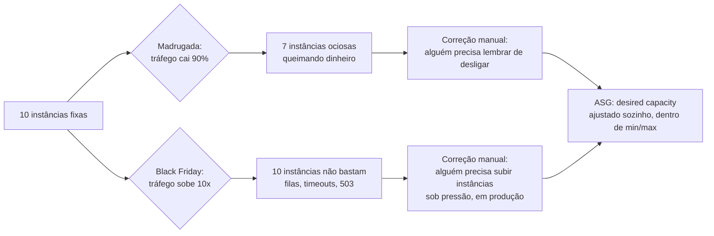
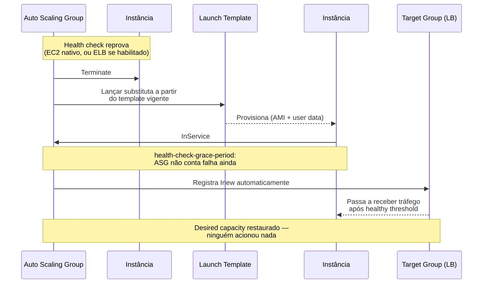
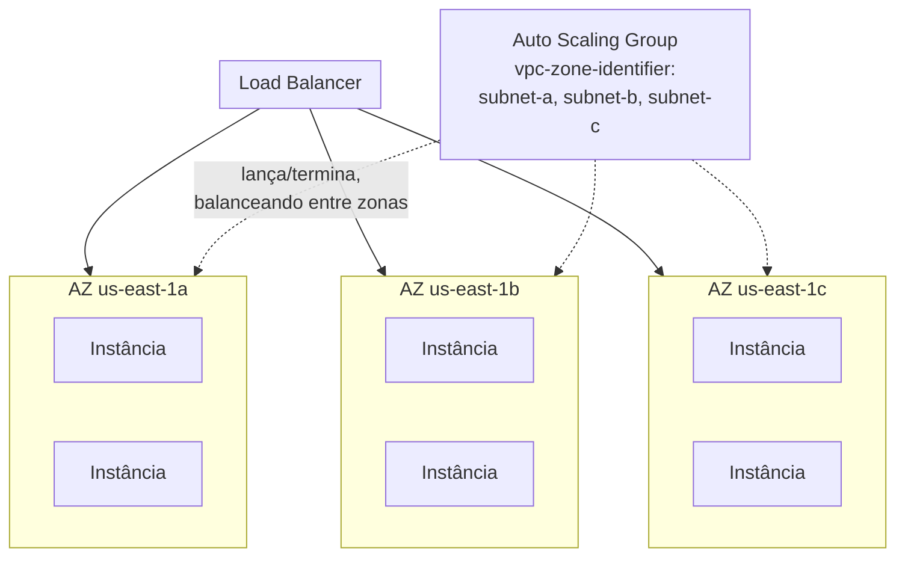

# Auto Scaling Groups

> [!abstract] TL;DR
> Uma frota de instâncias com número fixo tem dois problemas espelhados: de madrugada, capacidade sobrando queima dinheiro parado; no pico, capacidade faltando degrada o serviço na hora em que ele mais precisa funcionar. Um **Auto Scaling Group (ASG)** resolve isso definindo não um número de instâncias, mas três: **minimum**, **maximum** e **desired capacity** — o grupo nunca fica abaixo do mínimo, nunca passa do máximo, e converge ativamente para o desejado sempre que ele muda ou sempre que uma instância morre. É esse terceiro comportamento — convergir de volta, sozinho, sem ninguém acionar nada — que dá ao ASG seu segundo poder: **self-healing**. Quando uma instância falha o health check (a nota anterior já separou o health check do load balancer do health check do ASG), o grupo a termina e lança uma substituta a partir do mesmo **launch template** (nota 06 do galho anterior), distribuindo a frota por **múltiplas Availability Zones** para não depender de uma única. O ASG também é quem registra e desregistra alvos no target group do load balancer automaticamente — ninguém edita essa lista à mão — e quem executa um **instance refresh** para trocar a frota inteira, gradualmente, quando uma AMI ou launch template novos precisam entrar em produção. A DigitalOcean tem um recurso equivalente, mas mais novo e mais simples: **Droplet Autoscale Pools**.

## O problema: ninguém quer ficar acordado ajustando capacidade à mão

Uma equipe de e-commerce roda dez instâncias EC2 fixas atrás de um load balancer. Às três da manhã de terça-feira, o tráfego cai para um décimo do pico — mas as dez instâncias continuam ligadas, cada uma cobrando a hora inteira, processando um fluxo de requisições tão baixo que três instâncias dariam conta com folga. Ninguém desliga as outras sete porque ninguém quer ser a pessoa que erra a conta e derruba o serviço se o tráfego repicar sem aviso. O resultado é sete instâncias pagando aluguel a noite inteira para não fazer nada.

Na sexta-feira seguinte, a Black Friday da categoria, o oposto acontece: o tráfego passa de dez vezes o normal em poucos minutos, e as dez instâncias fixas — o número que alguém decidiu meses atrás, olhando para um tráfego que já não existe mais — não dão conta. Filas crescem, tempos de resposta sobem, alguns clientes veem erro 503. A correção existe: subir instâncias novas manualmente, uma a uma, esperando cada uma provisionar, registrar no load balancer, passar no health check. Mas isso significa alguém de plantão, com acesso à console, decidindo em tempo real quantas instâncias subir — e errando, na maioria das vezes, porque decisão sob pressão de incidente tende a ser tardia ou insuficiente.

O padrão nos dois cenários é o mesmo: capacidade fixa não acompanha demanda variável, e a alternativa manual — alguém acordado, olhando um painel, decidindo escalar — não escala como disciplina de operação. A pergunta que resolve isso não é "como automatizar o ajuste manual" mas uma mais estrutural: **existe um componente que mantém sozinho um número de instâncias dentro de limites definidos, substitui as que morrem, e faz isso sem que ninguém precise estar olhando às três da manhã?** Existe — chama-se Auto Scaling Group, e é o assunto desta nota.



## Os três números: minimum, maximum e desired capacity

Um Auto Scaling Group não guarda "quantas instâncias existem agora" como um número solto — ele guarda três números relacionados, e a documentação oficial da AWS é direta sobre o que cada um garante:

- **Minimum size** — o grupo **nunca** fica abaixo desse número. Não importa o que aconteça com políticas de escala ou falhas de instância: se o mínimo é 2, o ASG sempre mantém pelo menos 2 instâncias `InService`.
- **Maximum size** — o grupo **nunca** passa desse número (com uma exceção estreita e temporária: rebalanceamento entre Availability Zones pode ultrapassar o máximo por uma margem pequena e por pouco tempo, para não travar a rebalanceada — ver seção adiante).
- **Desired capacity** — o número que o ASG **ativamente persegue**. Se você definir a capacidade desejada — na criação do grupo ou a qualquer momento depois — o Auto Scaling garante que o grupo tenha exatamente essa quantidade de instâncias. É esse terceiro número que muda com frequência: por uma política de escala (assunto da próxima nota), por uma alteração manual, ou porque uma instância morreu e precisa ser reposta.

A relação entre os três é sempre `minimum ≤ desired ≤ maximum`. Pedir uma capacidade desejada fora desses limites é rejeitado — o ASG nunca convergirá para um valor que viole o próprio piso ou teto que ele mesmo aplica.

| Número | O que garante | Quando muda |
|---|---|---|
| `MinSize` | Piso — o grupo nunca fica abaixo disso | Raramente; ajuste deliberado de capacidade base |
| `MaxSize` | Teto — o grupo nunca passa disso (exceto rebalanceamento AZ, margem pequena e temporária) | Raramente; ajuste de orçamento/capacidade máxima aceitável |
| `DesiredCapacity` | O alvo que o ASG persegue ativamente agora | Com frequência — política de escala, ajuste manual, substituição de instância morta |

```bash
# Exemplo do documento oficial da AWS: grupo com mínimo 4, desejado 6, máximo 12.
# As políticas de escala movem "desired" dentro da faixa [4, 12] — nunca fora dela.
aws autoscaling create-auto-scaling-group \
  --auto-scaling-group-name app-asg \
  --launch-template LaunchTemplateName=app-web-template,Version='$Default' \
  --min-size 4 \
  --desired-capacity 6 \
  --max-size 12 \
  --vpc-zone-identifier "subnet-1a1a1a1a,subnet-2b2b2b2b,subnet-3c3c3c3c" \
  --target-group-arns arn:aws:elasticloadbalancing:us-east-1:123456789012:targetgroup/app-tg/abc123 \
  --health-check-type ELB \
  --health-check-grace-period 120
```

Ajustar só o `desired` — sem tocar em min/max — é a operação mais comum do dia a dia, e não exige recriar nada:

```bash
# Subir a capacidade desejada de 6 para 8 instâncias, sem mudar o teto de 12
aws autoscaling set-desired-capacity \
  --auto-scaling-group-name app-asg \
  --desired-capacity 8 \
  --honor-cooldown
```

> [!tip] Assista: Learn about AWS Auto Scaling Groups to scale in and out EC2 instances
> **Canal:** CloudTech AWS & Azure & GCP for Everyone | **Duração:** ~37min | **Idioma:** EN
>
> Demonstra ao vivo a relação `minimum ≤ desired ≤ maximum` desta seção, criando um grupo, subindo o desired e observando o ASG lançar e derrubar instâncias em Availability Zones diferentes para convergir para o número pedido. Trecho de destaque [20:31]: *"we have to specify the minimum size... if you specify minimum two instance..."*
>
> 🎬 [Assistir no YouTube](https://www.youtube.com/watch?v=949Gp217ucg)

## Self-healing: o ASG substitui o que falha, sem ninguém acionar nada

A nota anterior desta trilha (Health checks) já separou dois personagens com poderes diferentes: o health check do load balancer, que só *para de mandar tráfego* para um alvo doente, e o health check do Auto Scaling Group, que vai além. É essa segunda peça que dá ao ASG o comportamento chamado **self-healing** — na documentação oficial, listado como o primeiro benefício de arquitetura do serviço: "melhor tolerância a falhas. O Amazon EC2 Auto Scaling consegue detectar quando uma instância está doente, terminá-la, e lançar uma instância para substituí-la."

O mecanismo, ligando o que a nota de health checks já estabeleceu:

1. O ASG monitora continuamente a saúde de cada instância `InService`, usando por padrão as checagens nativas do EC2 (`--health-check-type EC2`) — status de sistema e de instância reportados pela própria AWS.
2. Se `--health-check-type ELB` estiver habilitado, o ASG passa a confiar **também** no resultado do health check do target group: uma instância que o load balancer considera `unhealthy` (por falhar a sondagem HTTP configurada, por exemplo) conta como sinal de substituição para o ASG, não só para o roteamento de tráfego.
3. Uma vez que uma instância é considerada `unhealthy` pelo tipo de health check configurado, o ASG a **termina** e **lança uma substituta** a partir do mesmo launch template — automaticamente, sem esperar ninguém intervir.
4. A instância nova entra no ciclo de vida normal: provisiona a partir da AMI e do `user data` do launch template (nota 06 do galho anterior), passa pelo `health-check-grace-period` (o tempo que o ASG espera antes de começar a contar falhas de health check contra uma instância recém-lançada — a nota anterior já cobriu esse parâmetro em detalhe), e assume o lugar da instância morta.



O ponto central: self-healing não é "o ASG avisa alguém que uma instância morreu" — é o ASG **agindo** sozinho para manter a capacidade desejada, o mesmo comportamento que mantém o grupo em `desired` depois de qualquer evento que reduza a contagem real de instâncias, seja falha de health check, término manual, ou interrupção Spot.

## O launch template como molde: o ASG nunca inventa uma instância do zero

O ASG não sabe, por conta própria, o que uma instância deveria conter — ele delega isso inteiramente ao **launch template** (coberto em profundidade na nota 06 do galho anterior): AMI, tipo de instância, `user data`, instance profile, tags. Toda vez que o ASG precisa lançar uma instância nova — seja para atingir o `desired capacity` inicial, seja para substituir uma que falhou, seja para escalar por política — ele lança exatamente a partir da versão do template configurada no grupo.

```bash
# O ASG referencia o launch template por nome/ID e versão —
# aqui, "$Default" significa "sempre a versão marcada como default no momento do lançamento"
aws autoscaling create-auto-scaling-group \
  --auto-scaling-group-name app-asg \
  --launch-template LaunchTemplateName=app-web-template,Version='$Default' \
  --min-size 2 --max-size 10 --desired-capacity 4 \
  --vpc-zone-identifier "subnet-1a1a1a1a,subnet-2b2b2b2b"
```

> [!info] Fronteira
> A anatomia do launch template — versões numeradas, imutabilidade, o pipeline de commit até AMI nova — já foi coberta na **nota 06 do galho anterior** (Compute I). Esta nota assume esse conhecimento: o que importa aqui é que o ASG é o consumidor automático desse template, decidindo *quando* lançar a partir dele, nunca *o que* lançar.

Essa separação de responsabilidades é o que torna o ASG seguro de operar: trocar o comportamento de uma frota inteira nunca significa editar o ASG diretamente — significa publicar uma versão nova do template e deixar o ASG (via instance refresh, adiante) fazer a transição.

## Distribuição por múltiplas Availability Zones

Um ASG não lança todas as instâncias numa única zona por padrão — ele aceita uma lista de subnets (via `--vpc-zone-identifier`), tipicamente uma por Availability Zone, e a documentação oficial é explícita: "você pode especificar múltiplas Availability Zones para seu Auto Scaling group, e o Amazon EC2 Auto Scaling balanceia suas instâncias uniformemente entre as zonas conforme o grupo escala."

O mecanismo de balanceamento, segundo a mesma documentação: ao lançar uma instância nova, o ASG tenta a zona com o menor número de instâncias no momento; se a subnet daquela zona não tiver IP disponível ou a capacidade falhar, ele tenta outra zona até conseguir. Se uma zona inteira ficar indisponível, a distribuição fica temporariamente desbalanceada — e quando a zona volta, o ASG rebalanceia sozinho, lançando instâncias nas zonas com menos capacidade e terminando o excesso nas que tiverem mais.



Um detalhe da documentação que vale reter, porque é contraintuitivo: durante uma rebalanceada entre zonas, o ASG **lança a instância nova antes de terminar a antiga**, para não comprometer a capacidade durante a transição — e isso pode fazer o grupo exceder o `maximum size` temporariamente, por uma margem de até 10% ou uma instância (o que for maior), só pelo tempo necessário para completar o rebalanceamento. É a única exceção documentada à regra rígida de "nunca passa do máximo".

> [!info] Fronteira
> A anatomia de um provedor de nuvem — regiões, Availability Zones, isolamento de falha — já foi coberta em **[[03-Dominios/Tecnologia/Cloud/02 - Anatomia de um provedor/index]]** (galho 2 desta trilha). Esta nota aplica esse conceito especificamente ao comportamento de distribuição de um ASG.

## A integração ASG↔Load Balancer: registro e desregistro automáticos

Um dos comportamentos mais fáceis de dar por garantido, uma vez configurado, é este: ninguém edita a lista de alvos de um target group manualmente quando um ASG está associado a ele. A documentação da AWS descreve exatamente esse contrato: "sempre que instâncias são lançadas ou terminadas, o Amazon EC2 Auto Scaling automaticamente registra e desregistra as instâncias do load balancer."

Na prática, isso significa:

- Quando o ASG lança uma instância nova (por `desired capacity` inicial, substituição de falha, ou scale-out), ele a registra no(s) target group(s) associados via `--target-group-arns` — a instância entra no estado `initial` do target group e começa a receber tráfego assim que passar o `healthy threshold` do health check do load balancer.
- Quando o ASG termina uma instância (scale-in, substituição de instância doente, ou redução manual de `desired capacity`), ele primeiro a desregistra do target group — disparando o estado `draining` que a nota anterior descreveu — e só a termina de fato depois que o `deregistration_delay` esgotar ou as conexões em curso terminarem sozinhas.

```bash
# A associação acontece na criação (ou update) do ASG — não em comando separado
# por instância. Um único ASG pode apontar para múltiplos target groups.
aws autoscaling update-auto-scaling-group \
  --auto-scaling-group-name app-asg \
  --target-group-arns arn:aws:elasticloadbalancing:us-east-1:123456789012:targetgroup/app-tg/abc123 \
  --health-check-type ELB \
  --health-check-grace-period 120
```

```bash
# Verificar o que o ASG está fazendo com as instâncias, incluindo lançamentos
# e términos recentes — a fonte mais direta pra confirmar que o registro
# automático de fato aconteceu
aws autoscaling describe-scaling-activities \
  --auto-scaling-group-name app-asg \
  --max-items 5
```

> [!info] Fronteira
> O balanceamento de carga em si — ALB vs. NLB, como o LB distribui tráfego entre alvos saudáveis — foi coberto na **nota 02** deste galho. Os health checks que decidem quem é alvo saudável foram cobertos na **nota 03**. Esta nota assume ambos e foca apenas em quem inicia o registro/desregistro: o ASG, automaticamente, a cada evento de lançamento ou término.

## Instance refresh: trocar a frota inteira sem downtime

Tudo que esta nota descreveu até aqui mantém uma frota estável em torno de um `desired capacity` e de uma versão fixa de launch template. Mas em algum momento uma AMI nova precisa entrar em produção — um patch de segurança, uma versão nova da aplicação — e a pergunta muda: como trocar **todas** as instâncias existentes por instâncias na versão nova, sem derrubar a capacidade do serviço no meio do caminho?

A resposta chama-se **instance refresh**, e a documentação oficial é direta sobre o mecanismo: ele substitui instâncias "de forma contínua" (*rolling*), em lotes, controlados por dois parâmetros centrais:

- **Minimum healthy percentage** — a porcentagem da capacidade desejada que precisa continuar em serviço, saudável, durante a troca. Com mínimo 90% e máximo 100%, o ASG troca 10% da frota por vez.
- **Maximum healthy percentage** — o teto até onde o grupo pode crescer temporariamente enquanto substitui instâncias. Configurar mínimo **e** máximo em 100% faz o ASG **lançar a instância nova antes de terminar a antiga** — a troca mais conservadora possível, nunca reduzindo a capacidade em serviço abaixo do desejado.

Depois de cada lote, o ASG espera o **instance warmup** (o tempo que uma instância recém-`InService` leva para ser considerada de fato pronta) antes de seguir para o próximo lote — e qualquer instância nova que falhe o health check é terminada e relançada automaticamente, sem abortar o refresh inteiro.

```bash
# Iniciar um instance refresh depois de publicar uma versão nova do launch template
# (nota 06 do galho anterior) — troca gradual, nunca deixando a capacidade
# em serviço cair abaixo de 90% do desired capacity
aws autoscaling start-instance-refresh \
  --auto-scaling-group-name app-asg \
  --preferences '{
    "MinHealthyPercentage": 90,
    "MaxHealthyPercentage": 110,
    "InstanceWarmup": 120,
    "SkipMatching": true
  }'
```

```bash
# Acompanhar o progresso — percentual completo, instâncias já trocadas
aws autoscaling describe-instance-refreshes \
  --auto-scaling-group-name app-asg \
  --query 'InstanceRefreshes[0].{Status:Status,PercentComplete:PercentageComplete,Instancias:InstancesToUpdate}'
```

```bash
# Cancelar um refresh em andamento (por exemplo, se um health check começar
# a reprovar em massa) — o ASG interrompe novas substituições, sem
# reverter as que já foram feitas
aws autoscaling cancel-instance-refresh \
  --auto-scaling-group-name app-asg
```

Duas peças valem nomear com precisão: **skip matching** (ligado por padrão quando o refresh é iniciado pelo console) compara a AMI de cada instância existente contra a AMI desejada e só substitui as que não batem — evitando trocar instâncias que já estão na versão nova por engano; e o limite de duração — um instance refresh só continua ativamente substituindo instâncias por, no máximo, **14 dias** corridos, segundo a documentação oficial.

| Parâmetro | O que controla | Efeito no comportamento |
|---|---|---|
| `MinHealthyPercentage` | Piso de capacidade saudável durante a troca | 100% = lança antes de terminar (mais lento, mais seguro); 0% = troca tudo de uma vez |
| `MaxHealthyPercentage` | Teto de crescimento temporário durante a troca | Diferença máxima de 100 pontos percentuais em relação ao mínimo |
| `InstanceWarmup` | Tempo de espera após uma instância nova ficar saudável | Evita avançar para o próximo lote antes da aplicação estar de fato pronta |
| `SkipMatching` | Ignora instâncias já na configuração desejada | Liga por padrão via console; reduz substituições desnecessárias |
| Duração máxima | Tempo total do refresh continuando a substituir | 14 dias — depois disso, a operação não continua ativamente |

> [!info] Fronteira
> Estratégias de rollout mais amplas — blue-green, canary, feature flags — pertencem à trilha de Operação (**[[03-Dominios/Engenharia/Operação/index]]**). O instance refresh é a mecânica específica do ASG que uma dessas estratégias pode consumir por trás — ele não decide *quando* fazer o deploy, só executa a troca gradual de instâncias com segurança.

## Casos práticos

**Criar o ASG do zero, ligado ao launch template e ao load balancer.** Retomando os componentes já cobertos nesta trilha — o launch template com AMI e `user data` versionados (nota 06 do galho anterior), e o target group com health check configurado (nota 03 deste galho):

```bash
aws autoscaling create-auto-scaling-group \
  --auto-scaling-group-name app-asg \
  --launch-template LaunchTemplateName=app-web-template,Version='$Default' \
  --min-size 2 \
  --desired-capacity 4 \
  --max-size 10 \
  --vpc-zone-identifier "subnet-1a1a1a1a,subnet-2b2b2b2b,subnet-3c3c3c3c" \
  --target-group-arns arn:aws:elasticloadbalancing:us-east-1:123456789012:targetgroup/app-tg/abc123 \
  --health-check-type ELB \
  --health-check-grace-period 120 \
  --tags "Key=app,Value=web,PropagateAtLaunch=true"
```

**Inspecionar o estado atual do grupo.** `describe-auto-scaling-groups` devolve os três números centrais desta nota, mais o estado de cada instância:

```bash
aws autoscaling describe-auto-scaling-groups \
  --auto-scaling-group-names app-asg \
  --query 'AutoScalingGroups[0].{Min:MinSize,Desired:DesiredCapacity,Max:MaxSize,Instancias:Instances[].{Id:InstanceId,AZ:AvailabilityZone,Saude:HealthStatus,Estado:LifecycleState}}'
```

```json
{
    "Min": 2,
    "Desired": 4,
    "Max": 10,
    "Instancias": [
        {"Id": "i-0abc123", "AZ": "us-east-1a", "Saude": "Healthy", "Estado": "InService"},
        {"Id": "i-0def456", "AZ": "us-east-1b", "Saude": "Healthy", "Estado": "InService"},
        {"Id": "i-0ghi789", "AZ": "us-east-1a", "Saude": "Unhealthy", "Estado": "InService"},
        {"Id": "i-0jkl012", "AZ": "us-east-1c", "Saude": "Healthy", "Estado": "InService"}
    ]
}
```

A instância `i-0ghi789` marcada `Unhealthy` mas ainda `InService` é exatamente o instante que precede o self-healing: na próxima avaliação, o ASG a termina e lança uma substituta.

**Simular uma falha e observar o self-healing acontecer.** Terminar uma instância manualmente é a forma mais direta de ver o mecanismo desta nota em ação — o ASG detecta a redução abaixo do `desired capacity` e converge de volta sozinho:

```bash
$ aws ec2 terminate-instances --instance-ids i-0ghi789
$ aws autoscaling describe-scaling-activities --auto-scaling-group-name app-asg --max-items 2
{
    "Activities": [
        {
            "Description": "Launching a new EC2 instance: i-0mno345",
            "Cause": "At 2026-07-23T14:32:00Z a user request update of AutoScalingGroup constraints to min: 2, max: 10, desired: 4 changing the desired capacity from 3 to 4. At 2026-07-23T14:32:05Z an instance was started in response to a difference between desired and actual capacity, shrinking the capacity from 4 to 3.",
            "StatusCode": "InProgress"
        }
    ]
}
```

## Lente dupla honesta: AWS e o Droplet Autoscale Pool da DigitalOcean

A DigitalOcean tem, sim, um recurso equivalente em espírito — mas mais recente e deliberadamente mais simples do que o ASG da AWS. Chama-se **Droplet Autoscale Pool**, e o modelo conceitual central é o mesmo: um conjunto de Droplets que cresce e encolhe automaticamente, dentro de limites configurados.

A mecânica de cálculo documentada é direta: a cada avaliação, o pool calcula o tamanho necessário multiplicando a razão de utilização (utilização atual dividida pelo alvo configurado) pelo número atual de Droplets, arredondando para cima. Com 2 Droplets a 95% de CPU e um alvo de 80%, o resultado é 3 Droplets. Quando mais de uma métrica está configurada (CPU e memória, por exemplo), o pool usa a que exigir o maior número de instâncias. Para Droplets de CPU compartilhada, o cálculo ainda considera o *CPU steal time* — o tempo que a instância espera por recursos do hipervisor — para não subestimar a pressão real sobre a carga.

Um pool aceita dois modos de configuração, análogos em espírito ao par min/max/desired do ASG:

- **Modo autoscale** — define tamanho mínimo e máximo do pool, e um alvo de utilização (CPU, memória, ou ambos), com um período de *cooldown* entre ajustes para não oscilar.
- **Modo tamanho fixo** — um número estático de Droplets, sem reagir a métrica nenhuma (o equivalente a um ASG com `min = max = desired` fixo).

```bash
# doctl não expõe um subcomando "create" com todos os flags documentados
# de forma explícita na CLI reference — a criação de um pool autoscale
# é feita tipicamente via API ou console. O doctl gerencia o ciclo de vida
# de um pool já criado:
$ doctl compute droplet-autoscale list
ID          Name              Status    MinInstances   MaxInstances   CurrentInstances
das-abc123  app-web-pool      active    2              10             4

$ doctl compute droplet-autoscale get das-abc123

$ doctl compute droplet-autoscale list-members das-abc123
DropletID    Status    HealthStatus   CreatedAt

$ doctl compute droplet-autoscale list-history das-abc123
```

```bash
# Criação via API — os campos centrais espelham min/max/desired do ASG,
# mais o template do Droplet embutido no mesmo payload (sem um recurso
# "launch template" separado, como a nota anterior deste galho já notou)
curl -X POST "https://api.digitalocean.com/v2/droplets/autoscale" \
  -H "Authorization: Bearer $DIGITALOCEAN_TOKEN" \
  -H "Content-Type: application/json" \
  -d '{
    "name": "app-web-pool",
    "config": {
      "min_instances": 2,
      "max_instances": 10,
      "target_cpu_utilization": 0.60,
      "cooldown_minutes": 5
    },
    "droplet_template": {
      "size": "s-2vcpu-4gb",
      "region": "nyc3",
      "image": "123456789",
      "ssh_keys": ["ab:cd:ef:..."],
      "tags": ["app-web"]
    }
  }'
```

Onde a paridade **quebra**, e vale nomear com a mesma honestidade que a nota anterior aplicou a health checks: a documentação da DigitalOcean para autoscale pools, verificada nesta sessão, não descreve health check nem integração automática com load balancer como parte do próprio recurso — o mecanismo recomendado é **tagging**: marcar os Droplets do pool com uma tag e apontar um DigitalOcean Load Balancer para essa tag, deixando o LB (com seu próprio `health_check`, coberto na nota anterior) decidir quem recebe tráfego. Não existe, documentado, um equivalente ao `--health-check-type ELB` do ASG — uma forma explícita de o pool em si confiar no resultado do health check do load balancer para decidir substituir um Droplet. A ação de scale-in também é mais simples: no scale-down, o pool destrói o Droplet criado **mais recentemente**, com um shutdown gracioso (emite o evento de desligamento, espera 60 segundos, depois destrói) — não um algoritmo de seleção por saúde ou por zona.

Também não existe, na DigitalOcean, um equivalente documentado ao **instance refresh** do ASG — uma operação nomeada e versionada para trocar a frota inteira de forma controlada quando a imagem muda. Trocar a imagem-base de um pool existente tende a significar recriar o pool ou substituir Droplets manualmente, sem o rolling automático com percentuais de saúde configuráveis que esta nota descreveu para a AWS.

| Conceito | AWS | Azure | GCP | DigitalOcean |
|---|---|---|---|---|
| Grupo de escala automática | Auto Scaling Group | Virtual Machine Scale Set (VMSS) | Managed Instance Group (MIG) | Droplet Autoscale Pool |
| Três números (min/max/desired) | `MinSize`/`MaxSize`/`DesiredCapacity` | Capacidade mínima/máxima/atual do VMSS | `targetSize` com min/max via autoscaler | `min_instances`/`max_instances`, alvo por utilização ou tamanho fixo |
| Self-healing (substituição automática) | Health check `EC2`/`ELB`, terminação + relançamento | VMSS com política de reparo automático (health extension) | Autohealing via health check do MIG | Scale-down remove o mais recente; sem health-check-driven replacement documentado |
| Distribuição multi-zona | Balanceamento entre AZs, rebalanceamento automático | Zonas de disponibilidade do VMSS | MIG regional entre zonas | Região única por pool (sem distribuição multi-zona documentada) |
| Registro automático no load balancer | `--target-group-arns` no próprio ASG | Backend pool do Load Balancer/App Gateway ligado ao VMSS | Backend service do MIG | Via tag do Droplet + Load Balancer apontando pra tag |
| Rollout controlado de imagem nova | Instance refresh (min/max healthy %, warmup, checkpoints) | Rolling upgrade do VMSS | Rolling update do MIG | Sem equivalente documentado — recriar/trocar manualmente |

> [!info] Caducidade
> Comportamento de min/max/desired capacity, self-healing, integração com load balancer e instance refresh do AWS Auto Scaling verificados na documentação oficial da AWS em 2026-07-23. Droplet Autoscale Pools é um recurso relativamente recente da DigitalOcean (lançado em 2024, documentação de API e how-to atualizadas em 2026); os campos e o comportamento de cálculo de escala foram verificados na documentação oficial em 2026-07-23, mas a ausência de health-check-driven replacement e de instance refresh reflete o que a documentação **não menciona** — não uma garantia de que o recurso nunca vá ganhar isso. Confira a documentação atual antes de decidir arquitetura em cima disso; classificação de Azure/GCP na tabela acima é tradução conceitual, não verificada nó a nó nesta sessão.

## Armadilhas comuns

> [!warning] Confundir `desired capacity` com um valor "de referência" que ninguém precisa tocar
> É comum um time configurar `desired capacity` uma vez, na criação do grupo, e nunca mais olhar para ele — tratando min/max como os únicos números que importam. Mas o `desired` é o que o ASG persegue ativamente agora; se uma política de escala (próxima nota) ou um ajuste manual não o move, o grupo fica parado no valor inicial mesmo com tráfego mudando. `desired capacity` não é um valor de fábrica — é o alvo vivo do sistema, e ignorá-lo é a forma mais comum de achar que "auto scaling não está funcionando" quando na verdade ninguém configurou o que deveria mover o alvo.

> [!warning] Esquecer o `health-check-grace-period` ao habilitar `--health-check-type ELB`
> A nota anterior desta trilha já cobriu isso para o health check em geral, mas vale repetir no contexto específico do ASG: habilitar `ELB` sem ajustar o grace period faz o ASG começar a contar falhas de health check contra uma instância que ainda está inicializando — resultado, instâncias novas sendo terminadas e relançadas em loop, cada uma morrendo antes de terminar de subir. O default via CLI é 0 segundos; configurar um valor real, compatível com o tempo de boot da aplicação, é obrigatório, não opcional.

> [!warning] Rodar um instance refresh com `MinHealthyPercentage` baixo demais em produção
> Configurar `MinHealthyPercentage` em 0% troca a frota inteira de uma vez — a forma mais rápida de fazer o refresh, mas também a que deixa a capacidade em serviço cair para zero durante a janela de troca, se todas as instâncias novas demorarem para passar o health check ao mesmo tempo. Em produção, a prática mais segura é manter `MinHealthyPercentage` alto (90-100%), aceitando um refresh mais lento em troca de nunca comprometer a capacidade disponível.

> [!warning] Achar que o Droplet Autoscale Pool "faz a mesma coisa" que um ASG, sem checar o que falta
> É tentador tratar min/max/desired e self-healing como conceitos universais de qualquer autoscaling gerenciado, mas a DigitalOcean, por documentação, não expõe hoje um equivalente ao `--health-check-type ELB` (substituição disparada pelo health check do load balancer) nem ao instance refresh (rollout controlado e versionado de imagem nova). Quem projeta uma migração ou compara provedores para uma decisão de arquitetura precisa nomear essa lacuna explicitamente, não assumir paridade porque o nome do recurso soa parecido.

## O que vem a seguir

Esta nota respondeu **o que é** um Auto Scaling Group e **como** ele mantém uma frota dentro de limites, se autocura e se distribui — mas deixou em aberto a pergunta que só as políticas de escala respondem: **quando** o `desired capacity` deveria subir ou descer, e **por quanto**. Um ASG parado num `desired` fixo é só uma frota de tamanho constante com superpoderes de substituição — a elasticidade de verdade, que reage a métrica de CPU, fila, ou tráfego em tempo real, é o assunto denso da próxima nota desta trilha, sobre políticas de escala.

## Fontes

- [AWS EC2 Auto Scaling — What is Amazon EC2 Auto Scaling?](https://docs.aws.amazon.com/autoscaling/ec2/userguide/what-is-amazon-ec2-auto-scaling.html) — definição de Auto Scaling group, min/max/desired capacity, registro/desregistro automático no load balancer, instance refresh, balanceamento entre AZs; acessado em 2026-07-23.
- [AWS EC2 Auto Scaling — Auto Scaling benefits for application architecture](https://docs.aws.amazon.com/autoscaling/ec2/userguide/auto-scaling-benefits.md) — self-healing ("detectar quando uma instância está doente, terminá-la e lançar uma para substituí-la"), distribuição e rebalanceamento entre Availability Zones, margem de 10%/1 instância acima do máximo durante rebalanceamento; acessado em 2026-07-23.
- [AWS EC2 Auto Scaling — Use an instance refresh to update instances in an Auto Scaling group](https://docs.aws.amazon.com/autoscaling/ec2/userguide/asg-instance-refresh.html) — casos de uso do instance refresh, estratégia rolling vs. replace root volume; acessado em 2026-07-23.
- [AWS EC2 Auto Scaling — How an instance refresh works](https://docs.aws.amazon.com/autoscaling/ec2/userguide/instance-refresh-overview.md) — minimum/maximum healthy percentage, instance warmup, skip matching, checkpoints, limite de 14 dias; acessado em 2026-07-23.
- [AWS CLI — autoscaling create-auto-scaling-group (Command Reference)](https://docs.aws.amazon.com/cli/latest/reference/autoscaling/create-auto-scaling-group.html) — sintaxe de `--launch-template`, `--min-size`/`--max-size`/`--desired-capacity`, `--target-group-arns`, `--health-check-type`, `--vpc-zone-identifier`; acessado em 2026-07-23.
- [DigitalOcean — Autoscale Pool Concepts](https://docs.digitalocean.com/products/droplets/concepts/autoscale-pools/) — cálculo de escala por utilização (ratio × contagem atual, arredondado pra cima), CPU steal time, cooldown, comportamento de scale-down (destrói o Droplet mais recente, shutdown gracioso de 60s); acessado em 2026-07-23.
- [DigitalOcean — How to Use Droplet Autoscale Pools for Automatic Horizontal Scaling](https://docs.digitalocean.com/products/droplets/how-to/use-autoscale-pools/) — modo autoscale vs. tamanho fixo, campos `min_instances`/`max_instances`/`target_cpu_utilization`, template do Droplet embutido, recomendação de tagging para integração com Load Balancer; acessado em 2026-07-23.
- [DigitalOcean — Droplet Autoscale Pools (API Reference)](https://docs.digitalocean.com/reference/api/reference/droplet-autoscale-pools/) — schema do payload de criação/atualização de pool; acessado em 2026-07-23.
- [DigitalOcean — doctl compute droplet-autoscale (CLI Reference)](https://docs.digitalocean.com/reference/doctl/reference/compute/droplet-autoscale/) — subcomandos `list`/`get`/`update`/`delete`/`list-members`/`list-history`, alias `das`; acessado em 2026-07-23.
- [DigitalOcean — Introducing Droplet Autoscale Pools: Seamless Scaling for Your Workloads](https://www.digitalocean.com/blog/droplet-autoscaling-now-available) — anúncio e contexto de lançamento do recurso; acessado em 2026-07-23.
