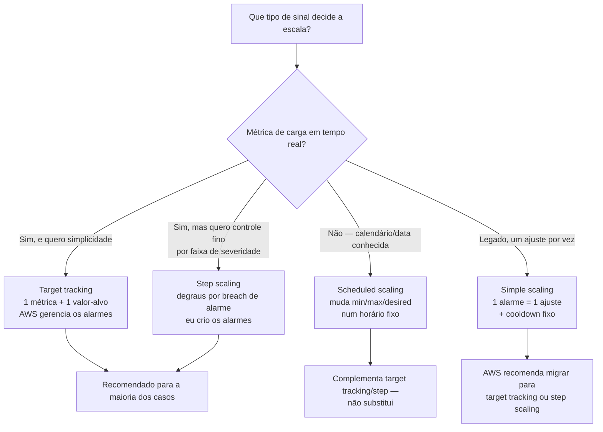
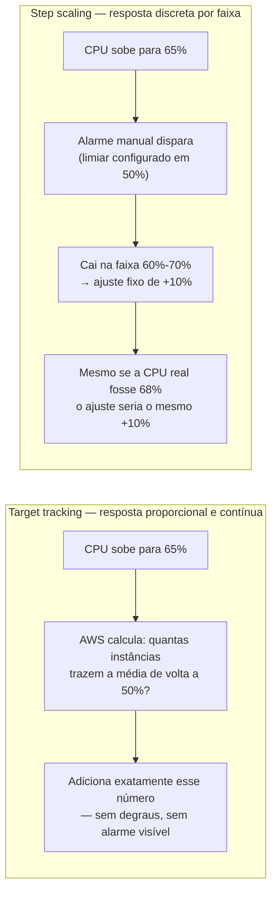
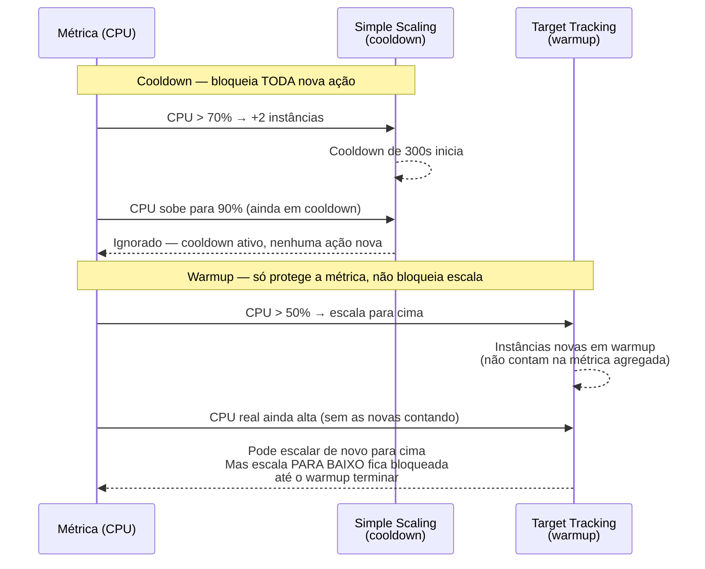

# Políticas de escala

> [!abstract] TL;DR
> Um Auto Scaling Group sabe *como* substituir uma instância doente e *como* manter um número mínimo de réplicas — mas nada disso responde à pergunta mais difícil: **quando** mudar esse número, e **por quanto**. Essa resposta vem de uma política de escala, e a AWS oferece quatro tipos com filosofias bem diferentes. A **target tracking** — hoje a recomendação padrão — funciona como termostato: você escolhe uma métrica e um valor-alvo (CPU em 50%, por exemplo), e o serviço cria e gerencia sozinho os alarmes do CloudWatch que abrem e fecham capacidade. A **step scaling** dá controle fino por degraus de alarme (metade legada, metade viva). A **simple scaling** é o modelo antigo, um ajuste por vez com um período de espera (*cooldown*) fixo entre ações — a AWS recomenda hoje evitá-la. E a **scheduled scaling** ignora métrica: muda a capacidade num horário previsível, porque nem toda variação de carga é surpresa. A escolha errada de métrica, ou a ausência de uma margem de segurança entre escalar para cima e para baixo, produz o sintoma mais irritante do domínio: *flapping* — o grupo sobe e desce instâncias em loop, gastando dinheiro e round-trips de inicialização sem nunca estabilizar.

## O problema: tarde demais, ou nervoso demais

Duas histórias, os dois defeitos opostos de uma política de escala mal desenhada.

Na primeira, um serviço de e-commerce tem um Auto Scaling Group de duas instâncias, sem nenhuma política dinâmica configurada — a equipe ajusta a capacidade manualmente, olhando um painel, quando alguém percebe que o site está lento. Na Black Friday, o tráfego triplica em vinte minutos. Ninguém percebe a tempo. As duas instâncias saturam a 100% de CPU, as requisições começam a expirar, e quando finalmente alguém aumenta a capacidade manualmente, o dano de reputação (e de vendas perdidas) já aconteceu. O problema aqui não é falta de *auto scaling group* — é falta de uma política que reaja sozinha, automaticamente, ao sinal certo.

Na segunda história, uma equipe mais cuidadosa configura uma política de escala baseada em CPU, mas erra o alvo: escala para cima quando a CPU passa de 70%, e para baixo assim que cai abaixo de 70%. O problema é que a própria escala para cima *muda* a CPU — duas instâncias novas dividem a carga, a CPU média cai para 55%, a política de baixo dispara imediatamente, remove instâncias, a CPU sobe de novo, a política de cima dispara de novo. O grupo entra em **flapping**: sobe, desce, sobe, desce, a cada poucos minutos, sem nunca estabilizar. Cada ciclo custa o tempo de boot de uma instância nova (e sua fatura), e a aplicação nunca fica de fato "escalada" — está sempre em trânsito.

O galho anterior já resolveu a mecânica de *manter* um número de instâncias (o [[03-Dominios/Tecnologia/Cloud/06 - Compute II — elasticidade e balanceamento/04 - Auto Scaling Groups|Auto Scaling Group]], com seu ciclo desired/min/max e a substituição automática de instâncias doentes). Esta nota assume esse grupo já existe e ataca a pergunta que ele sozinho não responde: **que sinal decide quando o `desired capacity` deveria mudar, e por quanto**? A resposta certa evita as duas armadilhas acima ao mesmo tempo — reage rápido o suficiente para não repetir a Black Friday, e devagar/estável o suficiente para não repetir o flapping.

## Os quatro tipos de política, e a filosofia de cada um

A AWS oferece quatro tipos de política de escala, dois deles chamados de "dinâmicos" (reagem a métrica em tempo real), um "preditivo" e um "agendado" (reage a calendário, não a métrica). A documentação oficial hoje recomenda **target tracking** como primeira escolha para a maioria dos casos, e **step scaling** como opção quando é preciso um controle mais granular sobre o tamanho de cada ajuste. **Simple scaling** é tratada como legado — a própria AWS recomenda explicitamente não usá-la em conjunto com cooldowns manuais, preferindo target tracking ou step scaling.



| Tipo de política | Como decide | Quando usar | Quem cria os alarmes CloudWatch |
|---|---|---|---|
| Target tracking | Persegue um valor-alvo de métrica (ex.: CPU 50%) como termostato | Padrão recomendado — a maioria dos casos de escala proporcional | A própria AWS, automaticamente |
| Step scaling | Degraus de ajuste por faixa de violação do alarme (ex.: +10% se CPU≥60%, +30% se CPU≥75%) | Quando o padrão de carga não é linear e degraus diferentes fazem sentido | Você mesmo, manualmente |
| Simple scaling | Um ajuste único por alarme, com cooldown fixo entre ações | Legado — evitar em arquitetura nova | Você mesmo, manualmente |
| Scheduled scaling | Muda min/max/desired num horário ou recorrência cron fixa, sem olhar métrica nenhuma | Padrões de carga previsíveis (horário comercial, eventos de calendário) | Nenhum — não usa alarme |
| Predictive scaling (complementar) | Modelo de séries temporais prevê a carga das próximas 48h com base nos últimos 14 dias | Carga cíclica + boot lento da aplicação — antecipa, não substitui as dinâmicas | A própria AWS |

## Target tracking: a métrica-termostato

O modelo mental mais simples de todos: você escolhe **uma métrica** e **um valor-alvo**, e o Auto Scaling Group faz o resto. A analogia oficial da própria documentação da AWS é literal — funciona como um termostato mantendo uma temperatura-alvo. Se a CPU média do grupo sobe de 50% para 70%, o grupo adiciona instâncias até a CPU voltar perto de 50%. Se cai para 30%, remove instâncias até voltar perto de 50%. Você nunca escreve o alarme do CloudWatch: o serviço cria, gerencia e ajusta os alarmes sozinho, e a documentação é explícita — não edite nem apague esses alarmes manualmente.

Vale ver essa criação automática de alarme acontecendo na frente dos olhos. Depois de aplicar uma política de target tracking, `describe-policies` mostra os dois alarmes que a AWS criou sozinha — um para escalar para cima, outro para escalar para baixo — sem que ninguém tenha escrito uma linha de configuração de CloudWatch:

```bash
$ aws autoscaling describe-policies \
    --auto-scaling-group-name app-web-asg \
    --policy-names cpu-alvo-50 \
    --query "ScalingPolicies[0].Alarms"
[
    {
        "AlarmName": "TargetTracking-app-web-asg-AlarmHigh-3f8e2b91-...",
        "AlarmARN": "arn:aws:cloudwatch:us-east-1:123456789012:alarm:..."
    },
    {
        "AlarmName": "TargetTracking-app-web-asg-AlarmLow-7a1c4d02-...",
        "AlarmARN": "arn:aws:cloudwatch:us-east-1:123456789012:alarm:..."
    }
]
```

Nenhum desses dois alarmes existia antes de `put-scaling-policy` rodar, e nenhum dos dois deveria ser editado por fora — a documentação da AWS é explícita nesse ponto: mexer manualmente nos alarmes de uma política de target tracking quebra a sincronia entre o que a política *pensa* que está monitorando e o que de fato está configurado no CloudWatch.

Três métricas predefinidas cobrem a maioria dos casos, mais uma quarta que exige um parâmetro extra:

- `ASGAverageCPUUtilization` — CPU média do grupo.
- `ASGAverageNetworkIn` / `ASGAverageNetworkOut` — bytes médios de rede recebidos/enviados.
- `ALBRequestCountPerTarget` — número médio de requisições por instância-alvo, medido pelo Application Load Balancer.

Criar a política pela CLI usa `put-scaling-policy` com `--policy-type TargetTrackingScaling` e um bloco de configuração:

```bash
aws autoscaling put-scaling-policy \
  --auto-scaling-group-name app-web-asg \
  --policy-name cpu-alvo-50 \
  --policy-type TargetTrackingScaling \
  --target-tracking-configuration '{
    "PredefinedMetricSpecification": {
      "PredefinedMetricType": "ASGAverageCPUUtilization"
    },
    "TargetValue": 50.0
  }'
```

Para escalar por requisição por instância no ALB — em vez de CPU — o mesmo comando muda de métrica e exige um `ResourceLabel` apontando para o load balancer e o target group específicos:

```bash
aws autoscaling put-scaling-policy \
  --auto-scaling-group-name app-web-asg \
  --policy-name requisicoes-por-alvo \
  --policy-type TargetTrackingScaling \
  --target-tracking-configuration '{
    "PredefinedMetricSpecification": {
      "PredefinedMetricType": "ALBRequestCountPerTarget",
      "ResourceLabel": "app/meu-alb/778d41231b141a0f/targetgroup/meu-tg/943f017f100becff"
    },
    "TargetValue": 1000.0
  }'
```

Dois detalhes finos da matemática por trás do número que você escolhe como alvo valem registro, porque explicam comportamentos que, sem eles, parecem bugs. Primeiro: quando a métrica é de utilização (CPU), o alvo representa uma média — mas quando é de throughput (requisições por instância, rede), o alvo representa a vazão ideal de **uma única instância, medida em um período de um minuto**; não é uma fração abstrata, é um número concreto de "isso é o quanto uma instância aguenta processar por minuto". Segundo: a AWS arredonda sempre na direção conservadora — se a conta indicar que 1,5 instância resolveria o problema, ela adiciona 2 (arredonda para cima, nunca fica aquém); se indicar que remover 0,5 instância bastaria, ela **não remove nenhuma**, preferindo esperar a métrica cair mais antes de reduzir. É a mesma assimetria "sobe rápido, desce devagar" defendida ao longo desta nota, só que aplicada no nível da aritmética, não da política.

Um parâmetro final, útil especificamente durante deploys: `DisableScaleIn` desliga temporariamente só a metade de baixo de uma política de target tracking, mantendo a metade de cima ativa. É o mecanismo indicado para uma janela de deploy azul-verde, onde reduzir capacidade no meio da transição entre versões seria arriscado, mas ainda se quer proteção contra um pico de tráfego inesperado durante a janela:

```bash
aws autoscaling put-scaling-policy \
  --auto-scaling-group-name app-web-asg \
  --policy-name cpu-alvo-50-durante-deploy \
  --policy-type TargetTrackingScaling \
  --target-tracking-configuration '{
    "PredefinedMetricSpecification": {"PredefinedMetricType": "ASGAverageCPUUtilization"},
    "TargetValue": 50.0,
    "DisableScaleIn": true
  }'
```

### Por que CPU nem sempre é a métrica certa

CPU é a métrica mais fácil de configurar — e é exatamente por isso que vira o padrão que ninguém questiona. Mas a documentação da AWS é explícita sobre uma condição estrutural que uma métrica de target tracking precisa satisfazer: ela precisa **subir ou descer proporcionalmente ao número de instâncias do grupo**. CPU de uma aplicação com trabalho uniformemente distribuído satisfaz isso bem. Mas há aplicações onde a CPU fica presa em um platô baixo mesmo sob carga real — um serviço com I/O pesado (chamadas de rede, disco, banco de dados) pode estar no limite de conexões simultâneas, latência, ou fila de processamento muito antes de a CPU acusar qualquer coisa. Nesse caso, uma política de CPU deixa o serviço degradar silenciosamente — exatamente o cenário da abertura desta nota, só que com uma política configurada e, ainda assim, cega para o sintoma real.

É aqui que `ALBRequestCountPerTarget` entra como alternativa: mede quantas requisições cada instância está de fato processando, um proxy mais direto de "quão ocupada" a instância está do ponto de vista de quem consome o serviço. A própria documentação da AWS lista métricas que **não funcionam** para target tracking, por não variarem proporcionalmente à capacidade: o `RequestCount` total do load balancer (não muda com o tamanho do grupo — é o total, não o per-instância), a `Latency` (pode subir com a carga, mas não proporcionalmente), e `ApproximateNumberOfMessagesVisible` de uma fila SQS (o tamanho da fila não é função linear do número de consumidores). Comprimento de fila como sinal de escala é possível, mas exige uma métrica customizada — mensagens por instância, não o total da fila — publicada manualmente no CloudWatch.

### Combinando mais de uma métrica no mesmo grupo

Nada impede usar mais de uma política de target tracking simultaneamente no mesmo Auto Scaling Group — desde que cada uma observe uma métrica diferente. É uma tática deliberada, não um acidente de configuração: CPU e requisições por instância podem se mover de forma independente (um endpoint pode ficar CPU-bound processando uma resposta grande, enquanto outro fica request-bound recebendo muitas conexões pequenas), e observar só uma das duas deixa a outra sem cobertura. A regra de como a AWS resolve o conflito entre políticas é assimétrica de propósito, coerente com a mesma filosofia de "disponibilidade primeiro" que já apareceu na discussão de flapping:

- **Para escalar para cima**, basta que **uma** das políticas ativas indique a necessidade — a primeira que pedir mais capacidade vence, mesmo que as outras ainda estejam confortáveis.
- **Para escalar para baixo**, é preciso que **todas** as políticas (com a porção de scale-in habilitada) concordem que dá para reduzir — uma única métrica ainda sob pressão é suficiente para vetar a redução.

O efeito prático: o grupo nunca fica pequeno demais para nenhuma das dimensões que está sendo observada, ao custo de, ocasionalmente, ficar um pouco maior do que o estritamente necessário para uma métrica específica — a troca deliberada de custo por disponibilidade que atravessa esta nota inteira.

> [!info] Fronteira
> A escolha de *qual* sinal representa saúde de um serviço — SLI, SLO, os quatro sinais dourados (latência, tráfego, erros, saturação) — é conceito de observabilidade coberto em profundidade em [[03-Dominios/Engenharia/Operação/index]]. Esta nota assume esse vocabulário e foca no que é específico da AWS: como esse sinal vira um alarme que o Auto Scaling Group consome.

## Step scaling: degraus por severidade do alarme

Onde target tracking assume "uma métrica, um alvo, resposta proporcional", step scaling dá ao operador controle explícito sobre *quanto* escalar em cada faixa de violação. Você cria o alarme do CloudWatch manualmente (ao contrário de target tracking) e define um conjunto de degraus — cada um com um limite inferior e superior relativos ao ponto de disparo do alarme, e um ajuste de capacidade correspondente.

O exemplo canônico da documentação da AWS: um alarme dispara quando a CPU passa de 50%, e a política de escala tem três degraus definidos em relação a esse limiar:

| Faixa da métrica (relativa ao limiar do alarme) | Ajuste |
|---|---|
| 50%–60% | +0% (sem mudança) |
| 60%–70% | +10% da capacidade atual |
| acima de 70% | +30% da capacidade atual |

Quanto mais severa a violação, maior o salto — uma resposta mais agressiva para picos mais agressivos, em vez do incremento único e uniforme de simple scaling.

```bash
aws autoscaling put-scaling-policy \
  --auto-scaling-group-name app-web-asg \
  --policy-name escala-por-degrau \
  --policy-type StepScaling \
  --adjustment-type PercentChangeInCapacity \
  --metric-aggregation-type Average \
  --step-adjustments \
    MetricIntervalLowerBound=0,MetricIntervalUpperBound=10,ScalingAdjustment=0 \
    MetricIntervalLowerBound=10,MetricIntervalUpperBound=20,ScalingAdjustment=10 \
    MetricIntervalLowerBound=20,ScalingAdjustment=30
```

O espelho dessa política — o degrau de *scale-in*, associado a um segundo alarme que dispara quando a métrica cai abaixo do mesmo limiar de 50% — usa a mesma estrutura, só que com ajustes negativos e limites relativos ao lado de baixo:

```bash
aws autoscaling put-scaling-policy \
  --auto-scaling-group-name app-web-asg \
  --policy-name escala-por-degrau-baixo \
  --policy-type StepScaling \
  --adjustment-type PercentChangeInCapacity \
  --metric-aggregation-type Average \
  --step-adjustments \
    MetricIntervalUpperBound=0,MetricIntervalLowerBound=-10,ScalingAdjustment=0 \
    MetricIntervalUpperBound=-10,MetricIntervalLowerBound=-20,ScalingAdjustment=-10 \
    MetricIntervalUpperBound=-20,ScalingAdjustment=-30
```

A diferença de comportamento entre target tracking e step scaling fica mais clara olhando as duas lado a lado ao longo do tempo, sob a mesma curva de carga:



O contraste importa na prática: target tracking recalcula a quantidade certa a cada avaliação, sem degraus — se a matemática pede 1,5 instância, arredonda para 2. Step scaling responde apenas à faixa em que a violação caiu, então duas violações bem diferentes dentro da mesma faixa (65% e 69%, por exemplo) produzem exatamente o mesmo ajuste. Isso é uma vantagem quando o operador sabe, por experiência, que certas faixas de carga exigem respostas desproporcionais (um salto de tráfego que historicamente sempre é seguido de um salto ainda maior, por exemplo) — e uma desvantagem quando a carga é bem comportada e a resposta proporcional do target tracking já resolve sozinha, sem exigir que ninguém desenhe manualmente os degraus e mantenha os alarmes do CloudWatch em sincronia com eles.

Repare que os limites de `--step-adjustments` pela CLI são relativos ao limiar do alarme (não valores absolutos — isso só acontece no console): o degrau `MetricIntervalLowerBound=0,MetricIntervalUpperBound=10` cobre de 50% (o limiar) a 60% da métrica real. A documentação impõe duas regras estruturais: as faixas não podem se sobrepor nem deixar lacunas entre si, e só um degrau pode ter limite inferior nulo (menos infinito) e só um pode ter limite superior nulo (mais infinito) — o resto precisa cobrir o espaço inteiro sem buraco.

O tipo de ajuste (`--adjustment-type`) também é compartilhado com simple scaling e aceita três formas: `ChangeInCapacity` (soma/subtrai um número fixo de instâncias), `ExactCapacity` (define um valor absoluto) e `PercentChangeInCapacity` (percentual da capacidade atual, com arredondamento — valores entre 0 e 1 sempre arredondam para 1, nunca para zero, garantindo que uma escala pequena sempre produza pelo menos uma instância de diferença).

Assim como target tracking, step scaling também usa **instance warmup** em vez de cooldown — e o efeito é o mesmo tipo de proteção contra excesso: enquanto uma instância recém-lançada ainda está aquecendo, ela não conta para a métrica agregada do grupo, então múltiplas violações de alarme que caem na mesma faixa de degrau, em sequência rápida, resultam numa única ação de escala, não numa por violação. Se o primeiro degrau já adicionou uma instância e o alarme dispara de novo antes do warmup terminar, mas ainda dentro da mesma faixa, nenhuma instância adicional é lançada — o grupo já está a caminho do tamanho que aquele degrau pedia. Só quando a métrica sobe o suficiente para cair no *próximo* degrau é que uma nova ação acontece, mesmo com a primeira instância ainda aquecendo.

## Simple scaling: o modelo legado e o cooldown

Simple scaling é o ancestral dos outros dois: um alarme, um ajuste, e um **cooldown** fixo — um período de espera obrigatório após cada ação de escala, durante o qual nenhuma nova ação de simple scaling pode começar, mesmo que o alarme dispare de novo. O valor padrão do cooldown é **300 segundos (5 minutos)**, aplicado no nível do grupo, mas substituível por política individual.

```bash
aws autoscaling put-scaling-policy \
  --auto-scaling-group-name app-web-asg \
  --policy-name escala-simples-cima \
  --policy-type SimpleScaling \
  --adjustment-type ChangeInCapacity \
  --scaling-adjustment 2 \
  --cooldown 300
```

A própria documentação da AWS hoje recomenda evitar simple scaling e cooldowns em arquitetura nova, preferindo target tracking ou step scaling — não porque o cooldown seja uma ideia ruim, mas porque o modelo é rígido demais: enquanto o cooldown estiver ativo, *nenhuma* ação de simple scaling acontece, mesmo que a carga continue subindo perigosamente. Target tracking e step scaling substituem esse mecanismo por algo mais fino, o **instance warmup** — o tempo que uma instância recém-lançada leva até contar para as métricas agregadas do grupo. A diferença estrutural entre os dois: cooldown bloqueia *qualquer* nova ação de escala; warmup só impede que uma instância ainda "esquentando" seja contada nas métricas — o grupo pode continuar escalando para cima livremente enquanto instâncias anteriores ainda aquecem, só não escala *para baixo* enquanto isso acontece.

### Cooldown vs warmup, e o combate ao flapping



O flapping do segundo cenário da abertura — CPU sobe, escala, CPU cai por causa da própria escala, desescala, CPU sobe de novo — é evitado de duas formas complementares, e nenhuma das duas é "usar cooldown maior". A primeira é escolher um valor-alvo com margem: se duas instâncias novas derrubam a CPU de 70% para 55%, um alvo de 50% ainda deixa espaço antes de a política de baixo disparar de novo. A segunda, estrutural, é a própria filosofia de assimetria da AWS: escalar para cima deve ser rápido (a disponibilidade importa mais que o custo de uma instância a mais por alguns minutos), e escalar para baixo deve ser gradual e conservador — a documentação de target tracking é explícita sobre isso: quando o cálculo indica remover, por exemplo, 0,5 instância, a política **prefere não escalar para baixo** até a métrica cair o suficiente para que a remoção não cause oscilação de volta. É a mesma lógica por trás de "escale rápido pra cima, devagar pra baixo" que qualquer arquiteto de capacidade aprende cedo: o custo de uma instância ociosa por alguns minutos a mais é desprezível comparado ao custo de um ciclo de flapping ou, pior, ao custo de ficar subprovisionado durante um pico real.

> [!warning] Flapping — a margem entre escalar para cima e para baixo é a defesa real
> Definir os limiares de subida e descida perto demais um do outro é a causa mais comum de flapping. Se a política escala para cima acima de 70% e para baixo abaixo de 70%, qualquer oscilação natural de carga ao redor desse ponto dispara os dois lados em sequência. A correção não é aumentar o cooldown (isso só atrasa o problema, não resolve a causa) — é garantir uma banda morta entre os dois limiares, ou usar target tracking, que já assume essa assimetria por padrão ao hesitar antes de escalar para baixo.

## Scheduled scaling: quando a carga é previsível, não reativa

Nem toda mudança de carga é surpresa. Um sistema de folha de pagamento sabe, com certeza, que o dia 5 de cada mês vai ter dez vezes mais tráfego que qualquer outro dia. Um serviço de streaming sabe que sextas à noite superam terças de manhã, todo mês, sem exceção. Esperar uma política dinâmica *reagir* a esse pico — mesmo com target tracking bem calibrado — significa aceitar alguns minutos de degradação enquanto a métrica sobe, o alarme dispara, e as instâncias novas terminam o boot. **Scheduled scaling** elimina essa janela: muda `min-size`, `max-size` e `desired-capacity` num horário exato ou numa recorrência cron, chegando à capacidade certa *antes* de o tráfego chegar, sem olhar métrica nenhuma.

```bash
# Ação única: aumenta a capacidade antes de um evento pontual conhecido
aws autoscaling put-scheduled-update-group-action \
  --auto-scaling-group-name app-web-asg \
  --scheduled-action-name pre-lancamento-produto \
  --start-time "2026-08-01T08:00:00Z" \
  --min-size 4 \
  --max-size 20 \
  --desired-capacity 10

# Ação recorrente: reduz capacidade todo dia às 22h (fuso configurável)
aws autoscaling put-scheduled-update-group-action \
  --auto-scaling-group-name app-web-asg \
  --scheduled-action-name reducao-noturna \
  --recurrence "0 22 * * *" \
  --time-zone "America/Sao_Paulo" \
  --min-size 2 \
  --max-size 20 \
  --desired-capacity 2
```

A recorrência usa sintaxe cron padrão (`minuto hora dia-do-mês mês dia-da-semana`), e a documentação da AWS confirma um detalhe que evita confusão: quando uma ação agendada dispara, ela pode escalar imediatamente, sem esperar o cooldown de simple scaling terminar — o calendário tem prioridade sobre a espera. Scheduled scaling não substitui as políticas dinâmicas: elas continuam ativas o tempo todo, cobrindo picos inesperados que o calendário não previu. As duas convivem no mesmo grupo — uma cobre o previsível, a outra cobre a surpresa.

## Predictive scaling: passagem rápida por um mecanismo complementar

Existe um quarto mecanismo, mais recente, que fica no meio do caminho entre "reagir à métrica" e "seguir o calendário": **predictive scaling** analisa até 14 dias de histórico de uma métrica, detecta padrões cíclicos (diários, semanais), e gera uma previsão de capacidade hora a hora para as próximas 48 horas — atualizada a cada 6 horas conforme chegam dados novos. Ao contrário de scheduled scaling, ninguém precisa escrever a recorrência manualmente; ao contrário de target tracking, a decisão não espera a métrica subir — ela antecipa.

A política nasce em modo **forecast only** (só gera a previsão, sem agir — útil para validar se o padrão de carga é de fato previsível antes de confiar nela) e pode ser promovida a **forecast and scale**, quando passa a escalar para cima com base na previsão. Um detalhe importante: mesmo em modo ativo, predictive scaling **não escala para baixo** sozinho — quem remove capacidade quando a previsão indica queda de carga continua sendo uma política dinâmica (target tracking ou step scaling) rodando em paralelo. É pensada especificamente para aplicações com boot lento, onde esperar a métrica subir e só então lançar instâncias já é tarde demais para evitar degradação — o mesmo problema da instância "aquecendo" enquanto o tráfego já bateu à porta.

> [!info] Fronteira
> Esta nota cobre predictive scaling apenas como mais uma opção de *quando* escalar dentro do Auto Scaling Group. Como ele se encaixa numa arquitetura elástica completa — junto de scheduled e dinâmica, cobrindo os três horizontes de tempo (agora, hoje, este mês) — é o assunto da próxima nota.

## Casos práticos

**A loja online que combina target tracking com scheduled scaling.** Voltando ao primeiro cenário da abertura: depois da Black Friday mal resolvida, a equipe configura duas coisas em paralelo, não uma no lugar da outra. Primeiro, uma política de target tracking em `ASGAverageCPUUtilization` com alvo de 55% — resposta rápida e proporcional a qualquer variação de tráfego, prevista ou não. Segundo, uma ação agendada que sobe o `min-size` do grupo de 4 para 20 às 6h da manhã do dia da Black Friday, e devolve para 4 à meia-noite seguinte. A política dinâmica nunca deixa de rodar — ela continua livre para escalar acima de 20 se o tráfego surpreender ainda mais — mas o piso elevado garante que o grupo já chega ao início do dia com capacidade suficiente para absorver o primeiro pico sem esperar o ciclo completo de alarme→lançamento→warmup.

```bash
# Confirma o estado das políticas ativas no grupo antes do evento
$ aws autoscaling describe-policies --auto-scaling-group-name app-web-asg \
    --query "ScalingPolicies[].{Nome:PolicyName,Tipo:PolicyType,Alvo:TargetTrackingConfiguration.TargetValue}" \
    --output table
--------------------------------------------------
|                DescribePolicies                 |
+----------------------+------------------+-------+
|         Alvo         |      Nome        | Tipo  |
+----------------------+------------------+-------+
|  55.0                |  cpu-alvo-55     |  TargetTrackingScaling |
+----------------------+------------------+-------+
```

**O serviço com I/O pesado que trocou CPU por requisições por instância.** Um serviço de processamento de pedidos mede CPU a 35% mesmo sob carga alta, porque o trabalho real é esperar respostas de um banco de dados externo — a CPU nunca reflete o gargalo. A equipe substitui a política de `ASGAverageCPUUtilization` por `ALBRequestCountPerTarget`, calibrando o valor-alvo a partir de um teste de carga que mediu quantas requisições por minuto uma única instância aguenta processar com latência aceitável (por exemplo, 800). A partir daí, a política escala com base no que de fato limita o serviço — throughput por instância — em vez de um sinal que nunca vai cruzar o alarme.

**O grupo que sofria flapping e ganhou uma banda morta.** Retomando o segundo cenário da abertura: a correção não foi aumentar cooldown, foi trocar a política de CPU-70%-sobe/CPU-70%-desce por uma target tracking única com alvo de 50% — que já embute a assimetria estrutural da AWS (hesitar antes de escalar para baixo) — combinada com um `--estimated-instance-warmup` de 180 segundos, tempo suficiente para as métricas das instâncias novas se estabilizarem antes de contarem para a média do grupo. O flapping parou não porque o grupo ficou mais lento para reagir, mas porque a política deixou de tratar "subir" e "descer" como espelhos simétricos do mesmo limiar.

## Lente dupla honesta: granularidade da AWS vs simplicidade da DigitalOcean

A DigitalOcean tem seu próprio mecanismo de escala automática para Droplets — os **Autoscale Pools** — mas com uma filosofia deliberadamente mais simples que os quatro tipos de política da AWS, e vale nomear a diferença com precisão em vez de fingir paridade que não existe.

Um Droplet Autoscale Pool aceita dois modos de configuração: **dinâmico**, com `min_instances`/`max_instances` e um ou mais alvos de utilização (`target_cpu_utilization` e, quando habilitado, uma métrica de memória equivalente) — a pool calcula quantas instâncias são necessárias para manter a métrica no alvo, e se mais de uma métrica estiver configurada, usa o maior resultado entre elas — ou **fixo** (*static*), mantendo um número constante de Droplets sem reagir a métrica nenhuma. Não existe um equivalente a step scaling (degraus configuráveis por severidade de alarme), nem a `ALBRequestCountPerTarget` (escalar por requisição por instância do load balancer), nem scheduled scaling nativo, nem predictive scaling. A pool também tem um **cooldown** configurável entre ações — mas pools de tamanho fixo (*static*) usam um cooldown fixo de 10 minutos, que não pode ser alterado.

O cálculo por trás do modo dinâmico é bem mais direto que o da AWS: a documentação oficial descreve a fórmula como `ceil(Droplets atuais × (utilização atual / utilização-alvo))`, arredondada sempre para cima. Se uma pool de 2 Droplets está com 95% de CPU e o alvo é 80%, o resultado é `ceil(2 × 95/80) = ceil(2,375) = 3` — a pool sobe para 3 Droplets na próxima avaliação. É a mesma ideia matemática do target tracking da AWS (proporção entre utilização atual e alvo), só que exposta de forma mais crua, sem a mesma linguagem de "prioriza disponibilidade ao escalar para baixo" que a AWS documenta explicitamente — o comportamento de arredondamento na direção conservadora existe, mas o texto oficial da DigitalOcean não detalha a mesma assimetria fina entre subir e descer que a AWS descreve para target tracking.

```bash
# AWS — target tracking, métrica explícita, alarmes gerenciados pela AWS
aws autoscaling put-scaling-policy \
  --auto-scaling-group-name app-web-asg \
  --policy-name cpu-alvo-50 \
  --policy-type TargetTrackingScaling \
  --target-tracking-configuration '{
    "PredefinedMetricSpecification": {"PredefinedMetricType": "ASGAverageCPUUtilization"},
    "TargetValue": 50.0
  }'

# DigitalOcean — pool dinâmica por CPU e memória, sintaxe única (não há tipos de política separados)
doctl compute droplet-autoscale create \
  --name app-web-pool \
  --min-instances 2 \
  --max-instances 10 \
  --cpu-target 50 \
  --mem-target 60 \
  --cooldown-minutes 5 \
  --region nyc3 \
  --size s-2vcpu-4gb \
  --image ubuntu-24-04-x64
```

Onde a AWS separa "qual métrica" (target tracking) de "que degrau de resposta" (step scaling) de "quando, sem métrica" (scheduled) em três primitivas distintas e combináveis, a DigitalOcean condensa tudo numa única pool configurável por alvo — mais simples de operar, mas sem o vocabulário para responder perguntas como "quero um degrau de +30% só quando a violação for muito severa" ou "quero pré-aquecer a capacidade antes do horário de pico conhecido, sem depender de métrica nenhuma". O App Platform da DigitalOcean, por sua vez, oferece escala automática de contêineres em planos específicos, mas o mecanismo de política granular (degraus, agendamento nativo, previsão) permanece um diferencial da AWS mesmo aí.

| Conceito | AWS | Azure | GCP | DigitalOcean |
|---|---|---|---|---|
| Persegue métrica-alvo (proporcional) | Target Tracking Scaling | Azure Monitor autoscale (regra de métrica) | Managed Instance Group autoscaler (utilization target) | Autoscale Pool — modo dinâmico (`target_cpu_utilization`) |
| Degraus por severidade de alarme | Step Scaling | Regras de escala em etapas (Azure Monitor) | Escalonamento por etapas via política customizada | — (sem equivalente) |
| Ajuste único legado + cooldown fixo | Simple Scaling | — (Azure não expõe um modelo equivalente separado) | — | — |
| Escala por horário/calendário | Scheduled Scaling (`put-scheduled-update-group-action`) | Perfis de recorrência do Azure Monitor autoscale | Cloud Scheduler + Cloud Functions (composição manual) | — (sem agendamento nativo) |
| Previsão de carga (ML) | Predictive Scaling | — (não há equivalente nativo direto) | — (não há equivalente nativo direto) | — |

> [!info] Caducidade
> Nomes de campo e flags de `doctl compute droplet-autoscale` verificados em 2026-07-23 — é um recurso relativamente novo na DigitalOcean e sujeito a evoluir mais rápido que a API da AWS, que está estável há anos nesses quatro tipos de política. Confirme a sintaxe exata na CLI instalada (`doctl compute droplet-autoscale create --help`) antes de aplicar em produção.

## Armadilhas comuns

> [!warning] Escalar por CPU quando o gargalo real é outro
> Uma aplicação com I/O pesado (chamadas de rede, banco de dados, fila) pode saturar conexões, latência ou memória bem antes de a CPU acusar qualquer coisa. Uma política de target tracking presa a `ASGAverageCPUUtilization` nesse cenário deixa o serviço degradar em silêncio — a métrica que a política observa nunca cruza o alarme, porque não é ela que está gargalando. Meça o que de fato limita o serviço antes de escolher a métrica da política, não a métrica mais fácil de configurar.

> [!warning] Confundir cooldown com proteção contra flapping
> Aumentar o cooldown de uma política de simple scaling não resolve flapping — só atrasa o próximo ciclo. O flapping nasce de limiares de subida e descida colados um no outro; a correção estrutural é abrir uma banda morta entre eles (ou migrar para target tracking, que já embute essa assimetria por padrão). Cooldown maior sem essa correção só troca "flapping rápido" por "flapping lento e ainda mais caro por ciclo".

> [!warning] Esquecer que scheduled scaling não substitui a política dinâmica
> Configurar uma ação agendada para o horário de pico conhecido e desligar a política dinâmica "porque já resolvi" deixa o grupo cego a qualquer desvio do padrão — uma campanha de marketing viral numa terça de manhã, por exemplo, não está no calendário de ninguém. Scheduled scaling cobre o previsível; a política dinâmica precisa continuar ativa para cobrir o resto.

> [!warning] Esperar que predictive scaling escale para baixo sozinho
> É fácil assumir que, se a previsão indica queda de carga, o grupo vai encolher automaticamente quando o modo `ForecastAndScale` estiver ativo. Não vai: a documentação da AWS é explícita — predictive scaling só age no sentido de escalar para cima com base na previsão. Remover capacidade continua sendo trabalho de uma política dinâmica (target tracking ou step scaling) rodando junto. Ativar só predictive scaling, sem nenhuma política de scale-in, deixa o grupo permanentemente no tamanho do maior pico já previsto.

Um resumo dos valores-padrão que aparecem espalhados nesta nota, para consulta rápida sem precisar reler cada seção:

| Parâmetro | Valor padrão | Onde se aplica |
|---|---|---|
| Cooldown (simple scaling) | 300 segundos (5 min) | Nível do grupo; sobrescrevível por política via `--cooldown` |
| Instance warmup (target tracking / step scaling) | Herda o *default instance warmup* do grupo; se nulo, cai para o cooldown padrão | Nível da política, via `--estimated-instance-warmup` |
| Janela de dados do predictive scaling | Mínimo 24h para começar a prever; ideal 14 dias de histórico | Nível da política preditiva |
| Horizonte de previsão | 48 horas, recalculado a cada 6 horas | Nível da política preditiva |
| Cooldown de pool estática (DigitalOcean) | 10 minutos, fixo, não configurável | Autoscale Pool em modo *static* |

## O que vem a seguir

Esta nota respondeu *quando* e *quanto* escalar — mas assumiu, o tempo todo, que o Auto Scaling Group por trás dessas políticas já sabe lançar, substituir e distribuir instâncias corretamente, e que existe um load balancer saudável recebendo o tráfego dessas instâncias. Juntar as três peças — o grupo, o balanceador e as políticas de escala — numa arquitetura elástica coerente, capaz de responder tanto a uma falha de instância quanto a um pico de tráfego sem intervenção manual, é o fechamento deste galho.

## Fontes

- [AWS EC2 Auto Scaling — Target tracking scaling policies](https://docs.aws.amazon.com/autoscaling/ec2/userguide/as-scaling-target-tracking.html) — métricas predefinidas (`ASGAverageCPUUtilization`, `ASGAverageNetworkIn/Out`, `ALBRequestCountPerTarget`), `ResourceLabel`, considerações sobre assimetria subir/descer, metric math; acessado em 2026-07-23.
- [AWS EC2 Auto Scaling — Step and simple scaling policies](https://docs.aws.amazon.com/autoscaling/ec2/userguide/as-scaling-simple-step.html) — mecânica de degraus, tipos de ajuste (`ChangeInCapacity`/`ExactCapacity`/`PercentChangeInCapacity`), recomendação de target tracking sobre simple scaling, definição de flapping; acessado em 2026-07-23.
- [AWS EC2 Auto Scaling — Scaling cooldowns](https://docs.aws.amazon.com/autoscaling/ec2/userguide/ec2-auto-scaling-scaling-cooldowns.html) — cooldown padrão de 300 segundos, diferença entre cooldown (simple scaling) e instance warmup (target tracking/step scaling); acessado em 2026-07-23.
- [AWS EC2 Auto Scaling — Scheduled scaling for Amazon EC2 Auto Scaling](https://docs.aws.amazon.com/autoscaling/ec2/userguide/ec2-auto-scaling-scheduled-actions.html) — recorrência cron, campos min/max/desired, casos de uso de carga previsível; acessado em 2026-07-23.
- [AWS EC2 Auto Scaling — Predictive scaling for Amazon EC2 Auto Scaling](https://docs.aws.amazon.com/autoscaling/ec2/userguide/ec2-auto-scaling-predictive-scaling.html) e [How predictive scaling works](https://docs.aws.amazon.com/autoscaling/ec2/userguide/predictive-scaling-policy-overview.html) — janela de 14 dias de histórico, previsão de 48h atualizada a cada 6h, modos forecast-only/forecast-and-scale; acessado em 2026-07-23.
- [AWS CLI — autoscaling put-scaling-policy (Command Reference)](https://docs.aws.amazon.com/cli/latest/reference/autoscaling/put-scaling-policy.html) — sintaxe de `--policy-type`, `--target-tracking-configuration`, `--step-adjustments`, `--cooldown`, `--estimated-instance-warmup`; acessado em 2026-07-23.
- [AWS CLI — autoscaling put-scheduled-update-group-action (Command Reference)](https://docs.aws.amazon.com/cli/latest/reference/autoscaling/put-scheduled-update-group-action.html) — sintaxe de `--recurrence`, `--start-time`, `--time-zone`, `--min-size`/`--max-size`/`--desired-capacity`; acessado em 2026-07-23.
- [DigitalOcean — Autoscale Pool Concepts](https://docs.digitalocean.com/products/droplets/concepts/autoscale-pools/) — modos dinâmico (CPU/memória) e fixo (static), cálculo pelo maior resultado entre métricas, cooldown de 10 minutos fixo em pools estáticas; acessado em 2026-07-23.
- [DigitalOcean — How to Use Droplet Autoscale Pools](https://docs.digitalocean.com/products/droplets/how-to/use-autoscale-pools/) — campos `min_instances`/`max_instances`, `target_cpu_utilization`, `cooldown_minutes`; acessado em 2026-07-23.
- [DigitalOcean — doctl compute droplet-autoscale (CLI Reference)](https://docs.digitalocean.com/reference/doctl/reference/compute/droplet-autoscale/) — flags `--min-instances`/`--max-instances`/`--cpu-target`/`--mem-target`/`--cooldown-minutes`; acessado em 2026-07-23.

