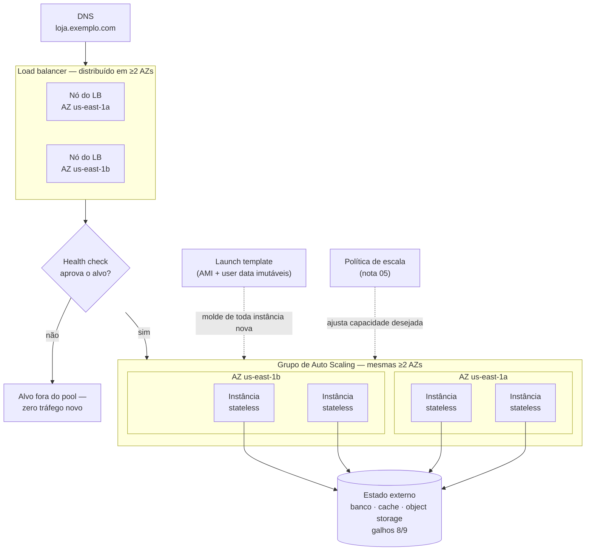
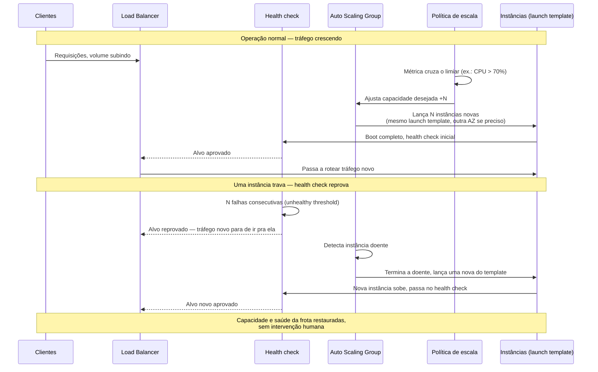
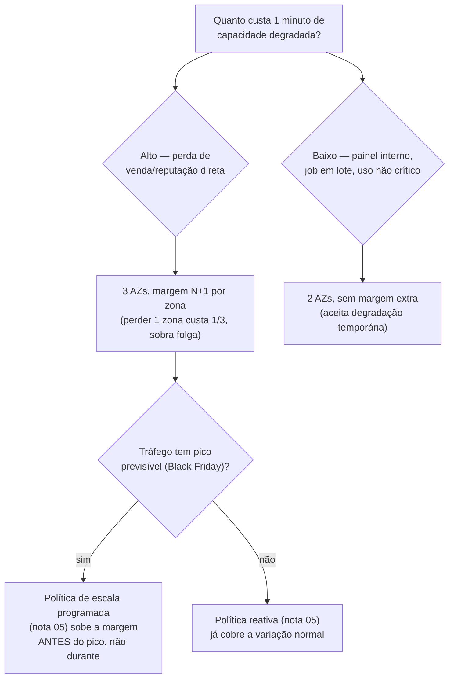

# Arquitetura elástica de ponta a ponta

> [!abstract] TL;DR
> Uma loja virtual sabe, com meses de antecedência, o dia exato em que o tráfego vai multiplicar por vinte: a Black Friday. Sabe também que, no resto do ano, pagar por capacidade dimensionada para aquele único dia é queimar dinheiro 364 dias seguidos. As cinco notas anteriores deste galho, mais as duas do galho 5, deram as peças soltas dessa resposta — LB, health check, grupo de auto scaling, política de escala, imagem imutável, estado externo. Esta nota monta as peças numa única arquitetura de referência: **DNS resolve para um load balancer distribuído em ≥2 zonas de disponibilidade; o LB só envia tráfego a alvos que passam no health check; esses alvos vivem num grupo de auto scaling espalhado pelas mesmas zonas, nascendo de um launch template imutável; nenhum deles guarda estado que importa, porque o estado mora num serviço externo.** O resultado é um sistema que se **auto-cura** (uma instância trava, o health check reprova, o ASG substitui) e se **auto-ajusta** (o tráfego sobe, a política de escala manda o ASG crescer) sem que ninguém entre em produção às três da manhã da sexta-feira negra. A peça que ainda falta — a rede que faz essas instâncias se enxergarem e o LB alcançá-las — foi tratada como mágica até aqui. É o assunto do próximo galho.

## O problema: a Black Friday que ninguém pode operar manualmente

A cena é conhecida por qualquer time que já rodou e-commerce em produção. Faltam três semanas para a Black Friday e a reunião de capacidade já começou: quantas instâncias a mais o time precisa provisionar? Quando ligar essa capacidade extra? Quem fica de plantão para desligar tudo de novo no dia seguinte, antes que a fatura do mês vire notícia ruim internamente? A resposta tradicional — dimensionar manualmente para o pico esperado, provisionar com dias de antecedência, torcer para a estimativa estar certa, desligar manualmente depois — tem três defeitos ao mesmo tempo: superdimensiona (a estimativa de tráfego é sempre um chute com margem de erro), depende de gente lembrando de agir na janela certa (o desligamento do dia 30 costuma atrasar, e a fatura de dezembro carrega o excesso), e não reage a nada que fuja do script — um pico inesperado ao meio-dia de terça-feira, fora da janela planejada, encontra o sistema exatamente do tamanho de sempre.

Os números concretos ajudam a fixar a escala do problema. Um dia comum da loja recebe algo como 50 requisições por segundo no horário de pico — capacidade que 4 instâncias médias atendem com folga. Na Black Friday, esse número salta para 1.200 requisições por segundo em poucas horas, e volta a cair para perto do normal já na manhã de sábado. Dimensionar estaticamente para o pico significa manter, os outros 364 dias do ano, uma frota vinte vezes maior do que qualquer tráfego real justifica — um desperdício de capacidade que qualquer área financeira questiona na reunião seguinte. Dimensionar para a média, por outro lado, significa que a loja simplesmente cai no primeiro minuto de tráfego real da Black Friday, no pior momento possível para descobrir o erro de estimativa.

O objetivo desta nota é fechar essa lacuna com uma resposta arquitetural, não operacional: um sistema que aguenta a Black Friday **porque foi desenhado para crescer e encolher sozinho**, não porque alguém previu o dia certo de mexer num dial. Cada peça dessa resposta já apareceu, isolada, numa nota anterior deste galho ou do galho 5. O trabalho que falta — e que esta nota, como capstone, faz — é amarrar essas peças numa única imagem mental, camada por camada, do jeito que um candidato sênior desenharia num quadro branco de entrevista de system design se alguém pedisse "desenhe uma arquitetura web elástica na nuvem".

## A arquitetura de referência, camada por camada

Um jeito honesto de montar essa arquitetura é construí-la de fora para dentro — começando pelo que o usuário efetivamente digita no navegador, e descendo camada a camada até onde o dado realmente mora.

**Camada 1 — DNS.** O usuário resolve `loja.exemplo.com` e recebe, não o IP de uma máquina, mas o endereço do load balancer. A nota 10 desta trilha (DNS, CDN e borda) desenvolve esse mecanismo em profundidade; aqui, o que importa reter é que o DNS nunca aponta direto para uma instância individual — aponta para uma camada que já sabe, sozinha, distribuir e desviar tráfego.

**Camada 2 — Load balancer, distribuído em ≥2 zonas de disponibilidade.** É a porta de entrada única que a nota 02 deste galho descreveu — ALB/NLB na AWS, DigitalOcean Load Balancer na DO. A documentação oficial da AWS é explícita sobre um requisito que muita gente trata como detalhe e que é, na verdade, estrutural: um Application Load Balancer **exige pelo menos duas subnets de Availability Zone diferentes** no momento da criação — não é uma recomendação, é uma restrição da API. Um LB numa AZ só não é uma arquitetura de alta disponibilidade — é um ponto único de falha com um nome bonito.

**Camada 3 — Health check.** Antes de qualquer decisão de roteamento, o LB (nota 03 deste galho) já sabe quais alvos, entre os registrados, estão de fato saudáveis. É essa sonda contínua que impede o LB de mandar tráfego para uma instância travada só porque ela ainda responde a `ping`.

**Camada 4 — Grupo de auto scaling, espalhado pelas mesmas zonas.** O ASG (nota 04 desta trilha) é quem garante que sempre existe capacidade suficiente atrás do LB, e é ele — não o LB — quem decide terminar e substituir uma instância que o health check reprovou de forma persistente. A política de escala (nota 05) é quem decide, à parte disso, se o número de instâncias precisa subir ou descer, olhando métricas de carga.

**Camada 5 — Instâncias stateless, nascidas de um launch template.** Cada instância da frota nasce idêntica às outras — mesma AMI, mesmo `user data` — a partir do launch template imutável que a nota 06 do galho 5 formalizou. Nenhuma delas é especial; qualquer uma pode ser terminada sem aviso, porque nenhuma guarda algo insubstituível.

**Camada 6 — Estado externalizado.** É aqui que a promessa da camada 5 se cumpre de fato: o carrinho de compras, o catálogo de produtos, os arquivos enviados por um vendedor — nada disso mora no disco de uma instância. Mora num banco de dados gerenciado, um cache compartilhado, um serviço de armazenamento de objetos — os assuntos dos galhos 8 e 9 desta trilha, que esta nota não desenvolve, só amarra como a peça que fecha o ciclo.



Repare no que essa figura já entrega sozinha: nenhuma seta aponta de volta para dentro de uma instância individual como destino final de nada que precise sobreviver. Toda escrita que importa desce até `Estado`; toda instância acima dela é, estruturalmente, descartável.

> [!tip] Assista: How to Deploy a 3-Tier Architecture on AWS — End-to-End AWS Project
> **Canal:** Tech Tutorials with Piyush | **Duração:** ~1h10min | **Idioma:** EN
>
> Constrói ao vivo, camada por camada, praticamente a mesma pilha desta seção — LB, ASG, instâncias stateless, múltiplas AZs — o que ajuda a ver as camadas do diagrama acima virarem recursos reais criados em sequência, não só caixas num fluxograma.
> Trecho de destaque [02:48]: *"load balancer so that we can distribute the traffic among multiple EC2 servers as the backend and these EC2 servers are part of the auto scaling group. If there is one EC2 server that is crashed, it will spin up a new EC2 server..."*
>
> 🎬 [Assistir no YouTube](https://www.youtube.com/watch?v=amiIcyt-J2A)

## Como as peças colaboram: um fluxo único de auto-cura e auto-ajuste

A arquitetura acima só é "elástica de ponta a ponta" porque as quatro peças centrais — LB, health check, ASG, política de escala — colaboram num laço fechado, sem intervenção humana em nenhuma etapa normal de operação. Vale nomear os dois laços separadamente, porque respondem a gatilhos diferentes.

**Laço de auto-cura** (reage a uma instância doente, independente de carga):

1. O health check do LB sonda cada instância no intervalo configurado; após `unhealthy threshold` falhas consecutivas, o LB para de rotear tráfego novo para ela — mas a instância continua existindo.
2. O ASG roda seu próprio health check (que pode consumir o resultado do health check do LB, dependendo da configuração de `HealthCheckType`) e, ao reprovar a instância de forma persistente, marca-a para término.
3. O ASG termina a instância doente e lança uma instância nova a partir da versão vigente do launch template — mesma AMI, mesmo `user data`, mesma configuração de rede.
4. A instância nova passa pelo próprio ciclo de boot e, assim que o health check do LB a aprova, volta a receber tráfego. Do ponto de vista de quem está do lado de fora, nada aconteceu — a capacidade nunca caiu abaixo do desejado por mais que alguns minutos.

**Laço de auto-ajuste** (reage a mudança de carga, independente de saúde):

1. Uma métrica monitorada pela política de escala (CPU média da frota, requisições por alvo, ou uma métrica customizada) cruza o limiar configurado.
2. A política calcula a nova capacidade desejada e comunica ao ASG.
3. O ASG lança instâncias novas (do mesmo launch template) ou termina instâncias existentes, respeitando os limites mínimo/máximo do grupo.
4. O LB detecta os alvos novos automaticamente — instâncias que entram num grupo de auto scaling registrado a um target group são anexadas e removidas dele pelo próprio ASG — e passa a rotear tráfego para eles assim que passam no health check.



O ponto que essa colaboração inteira depende — e que nenhuma das notas 02 a 05, isoladas, força sozinha — é que uma instância seja **verdadeiramente intercambiável**: se a instância 3 tivesse algo que só ela tem, terminá-la no passo de auto-cura destruiria esse algo. É a mesma exigência de estado externalizado que a nota 06 do galho 5 estabeleceu, agora vista do ângulo de "o que quebra se essa exigência não for real".

## O atraso que a elasticidade não elimina: tempo de boot e capacidade pré-aquecida

Os dois laços da seção anterior dão a impressão de um sistema instantâneo — a métrica cruza o limiar, o ASG lança, o LB roteia. Na prática, existe um atraso real entre "a política decidiu escalar" e "a instância nova está de fato recebendo tráfego": o tempo de lançar a instância, ela completar o boot, o `user data` terminar de rodar, e só então passar no primeiro health check. Para uma instância web comum, isso costuma levar de dezenas de segundos a poucos minutos — mas para uma carga que precisa escrever grandes volumes de dados em disco antes de ficar pronta, ou que carrega um runtime pesado, esse atraso pode chegar a vários minutos. Se o tráfego sobe mais rápido do que esse atraso permite compensar, a arquitetura inteira desta nota ainda degrada — só que degrada por um motivo diferente de "não existe capacidade configurada": existe capacidade **a caminho**, mas ela ainda não chegou.

Duas respostas complementares resolvem esse atraso, e vale nomear as duas porque atacam pontas diferentes do problema. A primeira é configurar o `health-check-grace-period` do ASG (já presente no comando `create-auto-scaling-group` desta nota) generosamente acima do tempo real de boot — sem isso, o próprio ASG pode reprovar e terminar uma instância legítima só porque ela ainda não teve tempo de ficar pronta, um erro sutil e comum. A segunda, para cargas cujo boot é excepcionalmente longo, é o recurso que a AWS chama de **warm pool**: um conjunto de instâncias pré-inicializadas, mantidas em estado `Stopped` ou `Hibernated` (custando só o volume EBS, não o cômputo), prontas para entrar em serviço quase instantaneamente quando o ASG precisa escalar — em vez de nascer do zero a cada evento de crescimento. A documentação oficial da AWS é direta sobre o propósito: warm pools existem para reduzir a latência de aplicações com tempo de boot excepcionalmente longo, sem forçar a equipe a superprovisionar a capacidade `InService` só para acomodar essa latência.

```bash
# Warm pool — instâncias pré-aquecidas em estado Stopped,
# prontas para entrar em serviço com latência bem menor que um boot do zero
aws autoscaling put-warm-pool \
  --auto-scaling-group-name loja-web-asg \
  --pool-state Stopped \
  --min-size 2 \
  --max-group-prepared-capacity 10
```

Vale a ressalva honesta que a própria documentação da AWS faz: criar um warm pool sem necessidade real é custo desperdiçado — se o tempo de boot da carga não causa latência perceptível, a resposta certa continua sendo o par simples de política de escala com boa margem (nota 05) mais `health-check-grace-period` calibrado, sem a complexidade adicional de gerenciar um segundo pool de instâncias.

## Alta disponibilidade via múltiplas zonas: por que uma AZ só não basta

Existe uma tentação comum, principalmente sob pressão de prazo, de configurar o ASG e o LB inteiros dentro de uma única Availability Zone — afinal, tudo dentro da mesma AZ tem latência de rede menor, e a configuração parece mais simples. Essa economia de complexidade cobra um preço estrutural: se a arquitetura inteira vive numa AZ só, ela herda o ponto único de falha que a **nota 02 do galho 2** desta trilha (Geografia da nuvem) já descreveu em detalhe — energia, refrigeração e conectividade de rede compartilhadas dentro de uma mesma AZ. Ter dez instâncias, um ASG saudável e um LB configurado corretamente não protege nada se as dez instâncias, o próprio ASG e os nós do LB estiverem, todos, no mesmo prédio físico com o mesmo quadro de energia.

A própria documentação da AWS é direta sobre o comportamento correto: um Application Load Balancer **exige, na criação, subnets de pelo menos duas AZs diferentes** — não existe caminho para criar um ALB voluntariamente confinado a uma única AZ. Do lado do ASG, o comportamento documentado é igualmente explícito: ao lançar novas instâncias, o Amazon EC2 Auto Scaling **tenta manter um número equivalente de instâncias em cada AZ habilitada**, lançando sempre na zona com menos instâncias no momento — e, crucialmente, **se uma AZ fica indisponível, o Auto Scaling pode lançar instâncias em outra AZ para compensar**. Quando a AZ problemática volta, o próprio ASG rebalanceia a frota de novo, lançando instâncias nas zonas com menos capacidade e terminando o excesso nas demais — sempre lançando as novas antes de terminar as antigas, para não comprometer a disponibilidade durante o rebalanceamento.

```bash
# ASG espalhado por 3 subnets, cada uma numa AZ diferente —
# o --vpc-zone-identifier é o que define em quais AZs o grupo pode operar
aws autoscaling create-auto-scaling-group \
  --auto-scaling-group-name loja-web-asg \
  --launch-template LaunchTemplateName=app-web-template,Version='$Default' \
  --min-size 4 \
  --max-size 40 \
  --desired-capacity 4 \
  --vpc-zone-identifier "subnet-0aaa1111,subnet-0bbb2222,subnet-0ccc3333" \
  --target-group-arns arn:aws:elasticloadbalancing:us-east-1:123456789012:targetgroup/loja-web-tg/abc123 \
  --health-check-type ELB \
  --health-check-grace-period 90
```

```bash
# Confirmar a distribuição real por AZ — a mesma checagem
# que a nota 02 do galho 2 recomendou depois do incidente de
# "duas instâncias, mesmo datacenter"
aws autoscaling describe-auto-scaling-groups \
  --auto-scaling-group-names loja-web-asg \
  --query 'AutoScalingGroups[0].Instances[].{Instancia:InstanceId,AZ:AvailabilityZone,Saude:HealthStatus}' \
  --output table
```

```text
--------------------------------------------------
|          Instancia         |     AZ      |Saude|
--------------------------------------------------
|  i-0a1b2c3d4e5f60001        | us-east-1a  |Healthy|
|  i-0a1b2c3d4e5f60002        | us-east-1a  |Healthy|
|  i-0a1b2c3d4e5f60003        | us-east-1b  |Healthy|
|  i-0a1b2c3d4e5f60004        | us-east-1b  |Healthy|
--------------------------------------------------
```

O LB, criado com subnets nas mesmas AZs do ASG, fecha o alinhamento — nós do LB em cada AZ, alvos em cada AZ, ninguém depende de uma zona só:

```bash
aws elbv2 create-load-balancer \
  --name loja-web-alb \
  --subnets subnet-0aaa1111 subnet-0bbb2222 subnet-0ccc3333 \
  --type application \
  --scheme internet-facing
```

Na DigitalOcean, a lente honesta muda de figura — não por falha de execução, mas porque o modelo geográfico é outro, conforme a **nota 02 do galho 2** já estabeleceu: a DigitalOcean não expõe availability zone como conceito de primeira classe, e a documentação oficial de Droplet Autoscale Pools é explícita: o pool é configurado com **um único datacenter/região por pool** (`region` é um campo singular do template do Droplet, não uma lista), e o Regional Load Balancer da DigitalOcean **precisa estar no mesmo datacenter que os Droplets do backend**. Isso significa que um autoscale pool inteiro — LB regional incluído — vive, estruturalmente, num único datacenter:

```bash
# DigitalOcean — criação de autoscale pool via API (doctl ainda não
# tem subcomando dedicado para autoscale pools no momento desta nota).
# Repare: "region" é um único valor, não uma lista de zonas.
curl -X POST "https://api.digitalocean.com/v2/droplets/autoscale" \
  -H "Authorization: Bearer $DO_TOKEN" \
  -H "Content-Type: application/json" \
  -d '{
    "name": "loja-web-pool",
    "config": {
      "min_instances": 4,
      "max_instances": 40,
      "target_cpu_utilization": 0.5,
      "cooldown_minutes": 5
    },
    "droplet_template": {
      "size": "s-2vcpu-4gb",
      "region": "nyc3",
      "image": 123456789,
      "user_data": "'"$(cat user-data-v2.sh)"'",
      "ssh_keys": ["ab:cd:ef:12:34:56"]
    }
  }'
```

Uma equipe que precisa de redundância real entre datacenters na DigitalOcean — NYC1, NYC2, NYC3, por exemplo — precisa compor isso manualmente por fora: dois (ou mais) autoscale pools separados, um por datacenter, com um Global Load Balancer da DigitalOcean por cima distribuindo entre eles, já que o Global LB (ao contrário do Regional) é o produto que declaradamente atravessa múltiplas regions. É uma composição possível e usada na prática — só não é automática dentro de um único recurso, do jeito que um ASG multi-AZ é automático dentro da AWS.

| Camada | AWS | DigitalOcean |
|---|---|---|
| Unidade de distribuição automática | Availability Zone — ASG rebalanceia sozinho entre ≥2 AZs de uma region | Datacenter — 1 autoscale pool = 1 datacenter; multi-datacenter exige compor pools + Global LB manualmente |
| Requisito do LB na criação | ALB exige ≥2 subnets de AZs diferentes | Regional LB exige o mesmo datacenter dos backends; Global LB é quem atravessa regions |
| Reação a uma zona inteira cair | ASG lança instâncias nas AZs restantes automaticamente, rebalanceia quando a zona volta | Sem rebalanceamento automático entre datacenters — cada pool só enxerga o seu |

> [!info] Fronteira
> Esta seção mostra **onde** a distribuição por zona acontece na camada de compute/LB. **Por que** uma AZ isola falha física — energia, refrigeração, rede independentes — e o vocabulário completo de region/AZ/datacenter já foi coberto na **nota 02 do galho 2** (Geografia da nuvem). O padrão de projetar resiliência entre zonas/regiões como estratégia de disponibilidade (failover, replicação síncrona vs. assíncrona) é assunto de **[[03-Dominios/Engenharia/Arquitetura/index|Arquitetura]]**; esta nota mostra a encarnação concreta dessa estratégia na camada de compute elástico.

> [!tip] Assista: Operating highly available Multi-AZ applications (ARC329) — AWS re:Invent 2022
> **Canal:** AWS re:Invent 2022 | **Duração:** ~58min | **Idioma:** EN
>
> Um talk oficial da AWS sobre a filosofia por trás desta seção: por que "sobreviver" não é sobre nunca falhar, é sobre quanto de capacidade sobra por zona quando uma delas cai — e por que manter capacidade equivalente em todas as AZs (não só distribuir instâncias) é o requisito que a maioria das equipes esquece.
> Trecho de destaque [02:26]: *"It's about how hard you can get hit and keep moving forward. If you build a single system with a single point of failure in it, you as soon as that gets hit, you're in trouble."*
>
> 🎬 [Assistir no YouTube](https://www.youtube.com/watch?v=mwUV5skJJ0s)

## O trade-off custo vs. resiliência: o mínimo de instâncias por zona

Espalhar por múltiplas AZs não é de graça — e o custo não é só "mais uma AZ para gerenciar". É uma decisão de dimensionamento explícita: **quantas instâncias, no mínimo, cada AZ precisa ter sobrando, para que a perda de uma AZ inteira não derrube a capacidade abaixo do necessário?**

O raciocínio é aritmética simples, mas errado com frequência na prática. Se a carga normal exige 4 instâncias no total, e a frota está espalhada igualmente por 2 AZs (2 em cada), perder uma AZ inteira derruba a capacidade pela metade — de 4 para 2 — exatamente no momento em que a demanda continua a mesma. Uma arquitetura que tolera de fato a perda de uma AZ sem degradar o serviço precisa dimensionar o **mínimo** já considerando essa perda: se 4 instâncias são o mínimo necessário para atender a carga normal, a capacidade *desejada* precisa ser dimensionada para que, mesmo com uma AZ fora, ainda sobrem pelo menos 4 — o que, com 2 AZs, significa manter 8 no total (4 de sobra por zona), não 4.

| Zonas ativas | Capacidade desejada total | Por AZ (distribuição igual) | Se 1 AZ cai | Sobra atendendo carga mínima de 4? |
|---|---|---|---|---|
| 2 AZs, sem margem | 4 | 2 por AZ | 2 | Não — capacidade cai pela metade |
| 2 AZs, com margem N+1 por zona | 8 | 4 por AZ | 4 | Sim — a AZ restante sozinha já cobre a carga mínima |
| 3 AZs, sem margem | 6 | 2 por AZ | 4 (2 zonas restantes) | Sim, com folga menor — perde só 1/3 da capacidade |
| 3 AZs, com margem | 9 | 3 por AZ | 6 | Sim, com folga maior — cada zona perdida custa 1/3, não 1/2 |

O padrão que emerge dessa tabela é o motivo pelo qual arquiteturas sérias preferem **3 AZs a 2** sempre que o provedor oferece: perder uma zona entre três custa um terço da capacidade, não metade — a mesma margem de segurança sai mais barata, em número absoluto de instâncias extras, quanto mais zonas a carga está distribuída. É também por isso que a AWS documenta um mínimo de três AZs por region — a arquitetura de referência é desenhada, desde a origem, para essa distribuição ser possível.

O outro lado do trade-off é honesto: manter esse excedente é capacidade paga e ociosa na maior parte do tempo — exatamente o problema que a política de escala (nota 05) já existe para minimizar no eixo de carga normal, mas que aqui reaparece num eixo diferente, o de tolerância a falha de zona. Não existe almoço grátis: resiliência a perda de uma zona inteira custa instâncias que, no dia a dia, não fazem nada além de esperar. A decisão de quantas zonas usar e que margem manter por zona é, precisamente, uma decisão de quanto essa garantia vale para o negócio — para uma loja que perde vendas reais a cada minuto de degradação na Black Friday, a resposta costuma ser "vale, e vale bastante"; para um painel interno de baixa criticidade, pode não valer o custo extra.

## Cenário de falha: uma AZ inteira cai durante a Black Friday

Vale seguir o incidente do início ao fim, porque é isso que separa "eu sei o que é multi-AZ" de "eu já pensei no que acontece quando isso é testado de verdade". É meio-dia da sexta-feira negra. A loja está com 12 instâncias saudáveis, 6 em `us-east-1a` e 6 em `us-east-1b`, atendendo tráfego no pico do dia. Um problema de energia atinge o datacenter físico por trás de `us-east-1a` inteira.

1. **Segundos 0-30 — a rede já sabe.** As seis instâncias em `us-east-1a` param de responder. O health check do LB, no próximo ciclo de sonda, marca todas como não saudáveis após o `unhealthy threshold` configurado — o LB simplesmente para de mandar tráfego novo para elas. Nenhuma conexão nova é roteada para uma zona morta; o roteamento continua funcionando pelas instâncias vivas em `us-east-1b`, sem intervenção de ninguém.
2. **Minutos 1-3 — o ASG percebe a perda de capacidade.** O grupo de auto scaling detecta que a capacidade desejada (12) não bate com a capacidade saudável real (6, todas em `us-east-1b`). Ele tenta lançar instâncias de reposição — mas, seguindo o comportamento documentado de distribuição, ele **não insiste em `us-east-1a`** enquanto ela estiver indisponível; lança as novas na zona que tem capacidade, `us-east-1b`, para restaurar o número total o mais rápido possível.
3. **Minutos 3-8 — a frota fica temporariamente desbalanceada, de propósito.** Por um período, a maioria (ou toda) a capacidade da loja está concentrada em `us-east-1b` — uma única AZ, o que a seção anterior descreveu como frágil, agora vivido como fato temporário de um incidente real, não como escolha de design. É um estado pior que o ideal, mas melhor que "a loja caiu" — e é exatamente a razão pela qual a margem N+1 por zona da seção anterior importa: se `us-east-1b` já tinha excedente suficiente para cobrir sozinha a carga mínima, o serviço se mantém no ar durante essa janela.
4. **Horas depois — `us-east-1a` volta.** O ASG detecta a zona saudável de novo e **rebalanceia automaticamente**: lança instâncias novas em `us-east-1a` (na zona com menos instâncias) e, gradualmente, termina o excesso acumulado em `us-east-1b` — sempre lançando antes de terminar, para nunca comprometer a capacidade durante o próprio rebalanceamento.

```bash
# Simular a perda de uma AZ inteira num teste de resiliência controlado —
# terminar todas as instâncias de uma AZ de propósito e observar a reação
aws autoscaling describe-auto-scaling-groups \
  --auto-scaling-group-names loja-web-asg \
  --query 'AutoScalingGroups[0].Instances[?AvailabilityZone==`us-east-1a`].InstanceId' \
  --output text | tr '\t' '\n' | while read -r id; do
    aws autoscaling terminate-instance-in-auto-scaling-group \
      --instance-id "$id" \
      --no-should-decrement-desired-capacity   # ASG deve repor, não reduzir o alvo
done
```

```bash
# Observar o ASG reagindo — repita a cada ~30s durante o teste
aws autoscaling describe-scaling-activities \
  --auto-scaling-group-name loja-web-asg \
  --max-items 5 \
  --query 'Activities[].{Quando:StartTime,Causa:Cause,Status:StatusCode}' \
  --output table
```

```text
------------------------------------------------------------------
| Quando               | Causa                          | Status  |
------------------------------------------------------------------
| 2026-11-27T12:00:41Z | At 2026-11-27T12:00:35Z instance| Successful|
|                       | i-...60001 was taken out of     |          |
|                       | service in response to a        |          |
|                       | EC2 health check                |          |
| 2026-11-27T12:01:02Z | Launching a new EC2 instance:   | InProgress|
|                       | us-east-1b (fewer instances)    |          |
------------------------------------------------------------------
```

O que essa simulação prova, na prática, é a diferença entre "a arquitetura está desenhada para tolerar isso" e "alguém já viu com os próprios olhos que ela tolera de fato". Uma arquitetura de referência nunca deveria ser considerada testada até que uma zona inteira tenha sido derrubada de propósito, em ambiente controlado, e alguém tenha observado o sistema se recuperar sozinho — não porque a documentação promete, mas porque o log de atividades do próprio ASG mostrou.

> [!info] Caducidade
> Comportamento de distribuição/rebalanceamento entre AZs do Amazon EC2 Auto Scaling, requisito de ≥2 AZs para Application Load Balancer, e comportamento de datacenter único do DigitalOcean Droplet Autoscale Pool verificados na documentação oficial em 2026-07-23. São mecanismos centrais e estáveis, mas confira a versão vigente da API antes de codificar um teste de resiliência em produção — parâmetros como `cooldown` e limiares de rebalanceamento evoluem entre versões de plataforma.

## Decidir quantas zonas usar e que margem manter

A tabela da seção anterior mostra a aritmética; falta o processo de decisão que uma equipe percorre na prática, porque "use sempre 3 AZs com margem N+1" é conselho genérico demais para caber em toda carga. A pergunta certa não é "quantas zonas o provedor oferece" — é "quanto vale, em dinheiro e em reputação, cada minuto de capacidade degradada, comparado ao custo de manter a margem que evitaria essa degradação".



A decisão nunca é só técnica — é o mesmo tipo de conversa que a nota 05 já cobriu sobre escala programada versus reativa, agora aplicada ao eixo de zonas em vez de ao eixo de carga: uma Black Friday é um pico *previsível*, então a margem por zona pode (e deve) subir programaticamente algumas horas antes do evento, em vez de esperar que uma política reativa perceba o tráfego já em curso e a perda de uma zona ao mesmo tempo.

## Casos práticos

**A Black Friday que passou em silêncio.** Retomando o cenário de abertura: a loja aplicou a arquitetura desta nota com 3 AZs e margem N+1 por zona, com a política de escala (nota 05) configurada para subir a capacidade mínima algumas horas antes do horário histórico de pico. Às 00h01 de sexta-feira, o tráfego começa a subir; a métrica de CPU média cruza o limiar, a política aciona o ASG, novas instâncias nascem do mesmo launch template nas três zonas, o LB começa a rotear para elas assim que passam no health check. Ninguém do time de operação precisou entrar em nenhuma console durante a madrugada — o incidente da reunião de capacidade da abertura desta nota simplesmente não aconteceu, porque a pergunta "quantas instâncias a mais provisionar" deixou de ter uma resposta manual.

**O deploy que confundiu auto-cura com incidente.** Uma equipe publica uma versão nova da aplicação (nota 06 do galho 5 — launch template atualizado) que tem um bug: sob uma condição de corrida específica, o processo trava e para de responder ao endpoint de health check. O laço de auto-cura desta nota faz exatamente o que foi desenhado para fazer — o LB reprova o alvo, o ASG termina e substitui a instância — só que a instância nova nasce do mesmo launch template com o mesmo bug, trava do mesmo jeito, e o ciclo se repete indefinidamente, uma instância de cada vez, sem nunca estabilizar. Do ponto de vista de quem só olha o painel do ASG, a frota parece "saudável na média" — sempre existe capacidade suficiente respondendo — mas o custo real (instâncias sendo substituídas em loop, latência de boot repetida) é sintoma de um problema de código, não de infraestrutura. É exatamente a fronteira que esta nota marca com Operação: o mecanismo de auto-cura é excelente em esconder falhas de infraestrutura, mas pode mascarar, por um tempo, uma falha de release que precisa de rollback, não de mais substituições.

**A "arquitetura multi-AZ" que só existia no papel.** Uma equipe certifica que "já tem alta disponibilidade" porque o Auto Scaling Group está configurado com três subnets de três AZs diferentes. Um teste de resiliência como o desta nota — terminar de propósito as instâncias de uma zona — revela que o load balancer, criado meses antes por outra pessoa, só foi configurado com a subnet de uma única AZ. O ASG relança instâncias corretamente distribuídas; metade delas, porém, nunca recebe tráfego, porque o LB nunca teve rota até a subnet onde elas nasceram. A "arquitetura multi-AZ" existia de fato só na metade de baixo do diagrama desta nota — a lição prática é que o teste de resiliência, não a configuração lida em voz alta numa reunião, é o que confirma se as camadas realmente estão alinhadas.

## Síntese do galho: as seis notas, amarradas numa arquitetura só

| Nota | O que ela deu à arquitetura desta nota |
|---|---|
| 01 — Por que uma instância não basta | O diagnóstico: teto de escala vertical + ponto único de falha. É a pergunta que todo o resto responde |
| 02 — Balanceamento de carga na nuvem | A camada 2: porta de entrada única, ALB/NLB/DO LB, listener → target group |
| 03 — Health checks | A camada 3: a sonda que decide, continuamente, quem está apto a receber tráfego — insumo do laço de auto-cura |
| 04 — Grupos de Auto Scaling | A camada 4: quem lança e termina instâncias, mantendo a capacidade desejada e a distribuição entre zonas |
| 05 — Políticas de escala | O gatilho do laço de auto-ajuste: que métrica, que limiar, quanto a capacidade desejada muda |
| 06 — Esta nota | A montagem: como as cinco peças acima, mais imutabilidade e estado externo do galho 5, formam um sistema único que se cura e se ajusta sozinho |

O fio que amarra as seis: a nota 01 fez o diagnóstico (uma instância não escala nem sobrevive sozinha); as notas 02-03 resolveram "para onde o tráfego vai e como saber quem está vivo"; as notas 04-05 resolveram "quantas instâncias devem existir agora, e o que fazer com as doentes"; esta nota mostra que nenhuma dessas peças, isolada, entrega alta disponibilidade de verdade — é a combinação, rodando sobre instâncias verdadeiramente descartáveis (galho 5) e espalhada por múltiplas zonas de falha (galho 2), que fecha o ciclo.

Vale nomear, com a mesma honestidade que a nota anterior deste galho já praticou, o que esta síntese **não** resolve sozinha. Uma arquitetura elástica bem desenhada ainda depende de três coisas que ficaram, deliberadamente, fora do escopo de compute: uma rede que permita ao LB alcançar as instâncias e às instâncias se enxergarem entre si (o próximo galho), um lugar real para o estado externalizado morar (galhos 8 e 9), e — fora do escopo desta trilha inteira — disciplina de deploy que não jogue fora essa resiliência na primeira mudança de código malfeita (Operação).

> [!info] Fronteira
> Estratégias de rollout de uma versão nova de aplicação sobre essa mesma arquitetura elástica — rolling deployment, blue-green, canary, e como evitar que um deploy ruim dispare o mesmo laço de auto-cura contra código são, não contra instância doente — são assunto de **[[03-Dominios/Engenharia/Operação/index|Operação]]**, não desta trilha. Compute entrega a máquina que se auto-cura; a disciplina de o que roda dentro dela é uma fronteira deliberada.

## Armadilhas comuns

> [!warning] Espalhar o ASG por várias AZs mas esquecer o LB
> É comum configurar o Auto Scaling Group corretamente com múltiplas subnets de AZs diferentes, e criar o load balancer usando só uma delas — copiado de um exemplo antigo, ou por engano de configuração. O resultado é uma frota bem distribuída atrás de uma porta de entrada frágil: se a AZ do LB cai, não importa quantas instâncias saudáveis existam nas outras zonas, porque o tráfego nunca chega até elas. As subnets do LB e as do ASG precisam cobrir o mesmo conjunto de AZs — não é suficiente que uma das duas camadas esteja bem distribuída.

> [!warning] Dimensionar a capacidade mínima sem margem de perda de zona
> Configurar `min-size` e `desired-capacity` do ASG exatamente igual à carga normal, sem folga para a perda de uma zona, é o erro aritmético da seção de custo vs. resiliência desta nota: no papel a arquitetura "tem 2 AZs", mas na prática ela só tolera a perda de uma zona se sobrar capacidade suficiente na outra. Dimensionar sem essa margem é ter alta disponibilidade de nome, não de fato.

> [!warning] Nunca simular a perda de uma zona de propósito
> Uma arquitetura multi-AZ que nunca foi testada com uma zona derrubada de propósito é uma hipótese, não um fato verificado. O comportamento documentado de rebalanceamento do ASG é real e confiável — mas a primeira vez que um time o vê agir não deveria ser durante um incidente real de produção. Testes de resiliência controlados (terminar instâncias de uma AZ, observar o log de atividades do ASG) custam pouco e revelam, antes da Black Friday, se a margem de capacidade por zona está de fato calibrada.

> [!warning] Achar que "está numa nuvem" já implica alta disponibilidade
> Rodar na AWS ou na DigitalOcean não confere alta disponibilidade por si só — confere a *capacidade* de construí-la, se a arquitetura for desenhada para isso. Um ASG confinado a uma AZ, um LB apontando para um único datacenter DigitalOcean sem um segundo pool em outro datacenter por trás de um Global LB: ambos rodam "na nuvem" e ambos têm exatamente o mesmo ponto único de falha físico que a instância única da nota 01 deste galho tinha, só que disfarçado atrás de mais camadas.

## O que vem a seguir

Esta nota montou a arquitetura inteira assumindo, silenciosamente, uma peça que nunca foi explicada: como o load balancer, de fato, **alcança** cada instância do grupo de auto scaling, e como as instâncias, entre si, **se enxergam** o suficiente para uma delas falar com um banco de dados gerenciado sem expor essa conversa para a internet inteira. Toda vez que um `--vpc-zone-identifier` apareceu nesta nota como uma lista de subnets, ou que uma instância precisou de uma rota até o estado externo, essa nota tratou a rede por trás como uma caixa preta que simplesmente funciona.

Ela não é mágica — é uma camada inteira de decisões: que subnets existem em cada AZ, quais são públicas e quais são privadas, o que decide se o tráfego de uma instância chega à internet ou fica isolado, e o que controla, porta a porta, quem pode falar com quem dentro dessa rede. É, segundo a convenção desta trilha, "o mais importante e mais temido" dos primitivos de nuvem — e é exatamente essa caixa preta que o próximo galho, sobre rede na nuvem (VPC, subnets públicas e privadas, route tables, internet e NAT gateway, security groups, NACLs, VPC peering), abre.

## Fontes

- [AWS EC2 Auto Scaling — Auto Scaling benefits for application architecture](https://docs.aws.amazon.com/autoscaling/ec2/userguide/auto-scaling-benefits.html) — distribuição automática entre AZs, lançamento na zona com menos instâncias, comportamento quando uma AZ fica indisponível, rebalanceamento ao ela voltar, launch-before-terminate; acessado em 2026-07-23.
- [AWS Elastic Load Balancing — Application Load Balancers](https://docs.aws.amazon.com/elasticloadbalancing/latest/application/application-load-balancers.html) — requisito de subnets de pelo menos duas AZs diferentes na criação do ALB, cross-zone load balancing ligado por padrão; acessado em 2026-07-23.
- [AWS CLI — autoscaling create-auto-scaling-group (Command Reference)](https://docs.aws.amazon.com/cli/latest/reference/autoscaling/create-auto-scaling-group.html) — `--vpc-zone-identifier`, `--health-check-type`, `--health-check-grace-period`; acessado em 2026-07-23.
- [AWS CLI — autoscaling terminate-instance-in-auto-scaling-group](https://docs.aws.amazon.com/cli/latest/reference/autoscaling/terminate-instance-in-auto-scaling-group.html) — `--no-should-decrement-desired-capacity` para forçar reposição após término manual; acessado em 2026-07-23.
- [AWS CLI — autoscaling describe-scaling-activities](https://docs.aws.amazon.com/cli/latest/reference/autoscaling/describe-scaling-activities.html) — histórico de atividades de escala e rebalanceamento; acessado em 2026-07-23.
- [DigitalOcean — How to Use Droplet Autoscale Pools for Automatic Horizontal Scaling](https://docs.digitalocean.com/products/droplets/how-to/use-autoscale-pools/) — configuração do pool (`min_instances`, `max_instances`, `target_cpu_utilization`, `cooldown_minutes`, `droplet_template` com `region` singular), integração com Load Balancer e firewall; acessado em 2026-07-23.
- [DigitalOcean — How to Create Regional Load Balancers](https://docs.digitalocean.com/products/networking/load-balancers/how-to/create/) — exigência de que o load balancer regional esteja no mesmo datacenter que os Droplets do backend; acessado em 2026-07-23.
- [DigitalOcean — Load Balancers Features](https://docs.digitalocean.com/products/networking/load-balancers/details/features/) — distinção entre Regional Load Balancer (um datacenter) e Global Load Balancer (múltiplas regions), health check automático do backend pool; acessado em 2026-07-23.
- [AWS — Regions and Availability Zones (página oficial)](https://aws.amazon.com/about-aws/global-infrastructure/regions_az/) — mínimo de três AZs por region; já citada na nota 02 do galho 2, reconfirmada aqui pelo argumento de custo vs. resiliência (3 AZs custam menos margem que 2 para a mesma tolerância a falha); acessado em 2026-07-23.
- [AWS EC2 Auto Scaling — Warm pools for EC2 Auto Scaling](https://docs.aws.amazon.com/autoscaling/ec2/userguide/ec2-auto-scaling-warm-pools.html) — propósito do warm pool, estados `Stopped`/`Running`/`Hibernated`, `MaxGroupPreparedCapacity`, cold start quando o pool esvazia; acessado em 2026-07-23.
