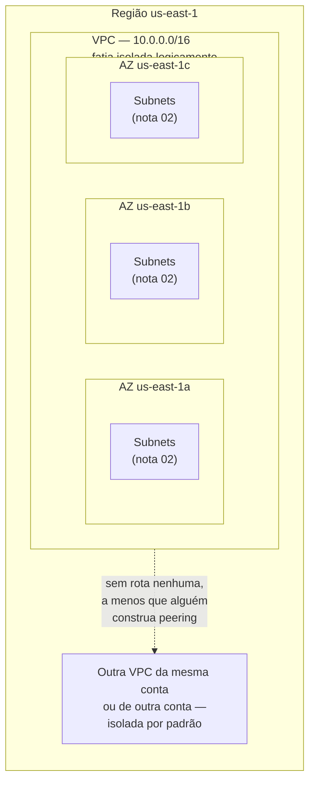
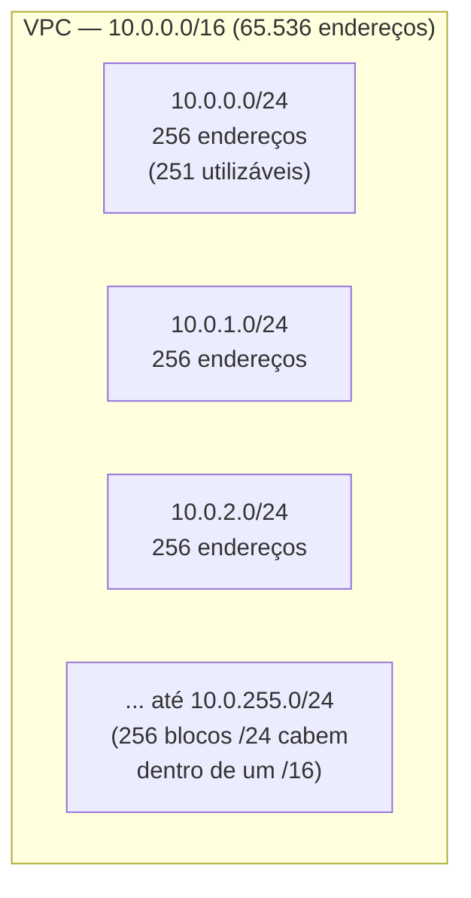

# A VPC e o endereçamento

> [!abstract] TL;DR
> Os dois galhos anteriores desta trilha subiram instâncias, colocaram um load balancer na frente delas e um grupo de auto scaling cuidando de quantas existem — tudo isso sem nunca perguntar em que **rede** essas máquinas de fato vivem. A resposta é a **VPC (Virtual Private Cloud)**: uma fatia logicamente isolada da nuvem do provedor, com seu próprio espaço de endereços privados, dentro da qual você decide quem enxerga o quê. Toda VPC precisa de um **CIDR block** — a notação que descreve, de uma vez, o endereço-base e o tamanho do espaço de endereços (`10.0.0.0/16` são 65.536 endereços; `/24` são 256). Esse espaço normalmente vem das faixas privadas do **RFC 1918** (`10.0.0.0/8`, `172.16.0.0/12`, `192.168.0.0/16`) — endereços que não são roteáveis na internet pública e por isso servem de matéria-prima para redes internas. Toda conta AWS nova ganha uma **VPC default** pronta para uso — conveniente para testar, perigosa para produção, porque ela nasce com subnets públicas em todas as zonas. Uma VPC vive **numa única região**, atravessando as zonas de disponibilidade dela — o mesmo escopo regional que a nota 02 do galho 2 já descreveu para o resto da infraestrutura. A DigitalOcean espelha o conceito com um modelo mais simples: toda Droplet nasce dentro de uma VPC, a default da região se nenhuma outra for escolhida.

## O problema: instâncias e um load balancer, mas ninguém perguntou em que rede

Volte ao cenário do galho 6: uma frota de instâncias atrás de um load balancer, um grupo de auto scaling mantendo a capacidade certa, tudo isso funcionando de ponta a ponta. Em algum momento dessa jornada, alguém finalmente precisa resolver um problema que ficou emprestado da sorte até aqui: a aplicação precisa de um banco de dados, e esse banco de dados **não pode** estar acessível pela internet pública. Um scanner automatizado, rodando o dia inteiro pela internet, encontra portas de banco de dados abertas em questão de minutos — não é hipótese, é rotina de qualquer ambiente exposto sem cuidado.

A pergunta que ninguém fez até agora é exatamente essa: onde, fisicamente e logicamente, essas instâncias e esse banco vivem? Será que a instância web e o banco de dados estão na mesma rede que qualquer outra conta da nuvem, compartilhando o mesmo espaço de endereços de todo mundo? A resposta, felizmente, é não — mas o motivo de ser não é automático nem mágico: é uma decisão de design que todo provedor sério de nuvem tomou desde o início, e que todo engenheiro de infraestrutura precisa entender antes de confiar cegamente nela.

É tentador tratar "a rede" como um detalhe que o provedor resolve sozinho, do mesmo jeito que um usuário de um app não pensa em como o Wi-Fi do prédio funciona. Mas a rede é, ao mesmo tempo, a coisa que **protege** o banco de dados do resto da internet e a coisa que, mal configurada, **expõe** exatamente esse banco a quem quer que passe por ali. Esta nota abre a caixa preta: o que é essa rede, como ela é endereçada, e por que ela é regional, não global.

Vale ser honesto sobre por que essa pergunta ficou pra trás até agora: nas notas de compute (galho 5) e de elasticidade (galho 6), toda instância nasceu, sem ninguém escolher explicitamente, dentro de **alguma** rede — porque todo provedor sério de nuvem torna impossível lançar um recurso de computação sem ele pertencer a uma rede, mesmo que essa rede seja apenas a default gerada automaticamente. É essa conveniência silenciosa que permitiu ignorar o assunto por dois galhos inteiros — e é exatamente essa mesma conveniência, sem ninguém questionar o que ela de fato garante, que abre a porta para o cenário do scanner encontrando um banco de dados exposto.

## A VPC: uma fatia privada e isolada da nuvem

Uma **VPC (Virtual Private Cloud)** é, na definição da própria AWS, uma rede virtual logicamente isolada dedicada à sua conta — "logicamente isolada de outras redes virtuais" dentro da nuvem do provedor. A palavra que carrega o peso todo dessa definição é **logicamente**: fisicamente, os servidores por trás de uma VPC compartilham o mesmo hardware, os mesmos data centers, a mesma infraestrutura de rede física de milhares de outras contas. O que separa uma VPC da VPC do vizinho não é um cabo diferente — é uma camada de software que garante que o tráfego de uma VPC nunca alcança outra, a menos que alguém explicitamente construa uma ponte entre elas (o que a nota 05 deste galho vai tratar, com VPC peering).

Pense numa VPC como um apartamento dentro de um prédio inteiro de apartamentos. O prédio é a nuvem pública — a infraestrutura física compartilhada, os elevadores, a fiação elétrica principal. Seu apartamento tem porta própria, endereço próprio dentro do prédio, e você decide quem entra: ninguém do apartamento vizinho anda pela sua sala só porque mora no mesmo edifício. Mas o apartamento não flutua no ar sozinho — ele existe dentro de uma estrutura física maior que todo mundo compartilha. É exatamente essa a relação entre uma VPC e a região onde ela vive.

Dentro dessa fatia isolada, você tem controle total sobre a topologia de rede: decide o espaço de endereços, cria subnets (nota 02 deste galho), define quem pode falar com quem através de tabelas de rota (também nota 02) e de regras de firewall (notas 03 e 04), e decide explicitamente o que, se é que algo, tem uma porta para a internet pública. Nada disso existe por padrão dentro de uma VPC vazia — cada peça é uma decisão de design que alguém precisa tomar, mesmo que o provedor ofereça padrões razoáveis para começar rápido.



Repare no que essa figura diz de mais importante: as subnets diferentes, espalhadas por zonas de disponibilidade diferentes, ainda pertencem à **mesma** VPC — porque a VPC é a unidade de isolamento, e a AZ (assunto já coberto pela nota 02 do galho 2) é só uma forma de espalhar essa fatia por infraestrutura física redundante. A nota 02 deste galho volta a esse ponto com profundidade, ao explicar por que uma subnet vive numa única AZ, mas uma VPC atravessa várias.

## O endereçamento: CIDR block e por que a notação trava tanta gente

Toda VPC precisa nascer com um **CIDR block** — um bloco de endereços IP escrito na notação CIDR (Classless Inter-Domain Routing), que descreve, numa única expressão compacta, tanto o endereço-base da rede quanto o tamanho dela. É essa notação que trava um número desproporcional de gente que começa em nuvem, porque ela empacota duas informações num formato que não é imediatamente intuitivo: `10.0.0.0/16`.

A parte antes da barra — `10.0.0.0` — é o endereço-base, o primeiro endereço do bloco. A parte depois da barra — `/16` — é o **prefixo**: quantos dos 32 bits que compõem um endereço IPv4 são fixos (identificam a rede) e, por consequência, quantos bits sobram livres para numerar hosts dentro dela. Um endereço IPv4 tem 32 bits no total; se `16` deles são fixos, sobram `32 - 16 = 16` bits livres — e 16 bits livres significam `2^16 = 65.536` endereços possíveis dentro daquele bloco. Quanto **menor** o número depois da barra, **maior** o bloco de endereços — uma inversão que também confunde: `/16` é uma rede grande (65.536 endereços), `/24` é uma rede pequena (256 endereços), `/28` é minúscula (16 endereços).

A tabela seguinte fixa essa aritmética para os prefixos que aparecem com mais frequência em VPCs reais:

| Prefixo CIDR | Bits livres para host | Total de endereços (2^n) | Exemplo de bloco |
|---|---|---|---|
| `/16` | 16 | 65.536 | `10.0.0.0/16` |
| `/20` | 12 | 4.096 | `172.31.0.0/20` |
| `/24` | 8 | 256 | `10.0.1.0/24` |
| `/26` | 6 | 64 | `10.0.1.0/26` |
| `/28` | 4 | 16 | `10.0.1.0/28` |

Vale fazer o exercício de cabeça uma vez, porque ele nunca mais deixa de fazer sentido depois disso: um bloco `/24` tem 8 bits livres (`32 - 24 = 8`), e `2^8 = 256`. Desses 256 endereços, a AWS documenta explicitamente que reserva **cinco** em cada subnet (não na VPC inteira — em cada subnet dentro dela) para uso próprio: o endereço de rede, o endereço do roteador da VPC, dois endereços reservados para DNS e uso futuro, e o endereço de broadcast no topo do bloco. Isso significa que uma subnet `/24` — 256 endereços no papel — entrega, na prática, `256 - 5 = 251` endereços utilizáveis. É um detalhe pequeno que derruba o planejamento de capacidade de quem esquece de contar com ele, e a nota 02 deste galho retoma esse ponto ao dimensionar subnets de verdade.

Vale fazer o mesmo exercício para o `/20` que a VPC default da AWS usa em cada subnet, porque é o número que qualquer engenheiro que já leu uma configuração default da AWS já viu passar pela tela sem necessariamente calcular: `32 - 20 = 12` bits livres, e `2^12 = 4.096` endereços — menos cinco reservados, 4.091 utilizáveis por subnet. É uma subnet generosa para a maioria dos casos de uso simples, e é exatamente por isso que a AWS a escolheu como padrão: grande o suficiente para não travar cedo, pequena o suficiente para caber dezesseis delas dentro de um único `/16`.



> [!tip] Assista: VPC | Entendendo tudo sobre redes na AWS
> **Canal:** Kenerry Serain | DevOps na Nuvem | **Duração:** ~14min | **Idioma:** PT-BR
>
> Um passeio prático pela criação de uma VPC na AWS que amarra a definição de CIDR block à decisão de dimensionamento real — ajuda a fixar por que o número depois da barra parece "ao contrário" do que a intuição sugere. Trecho de destaque [04:11]: *"algo chamado cider [CIDR], né? Sider significa classless interdomain routing, ou seja, roteamento entre domínios sem classe (...) nós podemos utilizar aqui o cider block, que nada mais é do que um range específico de IPs que eu quero ter dentro da minha VPC."*
>
> 🎬 [Assistir no YouTube](https://www.youtube.com/watch?v=r6dEHy-CnaE)

> [!tip] Assista: What Is a CIDR in AWS? | VPC Part 2
> **Canal:** Pythoholic | **Duração:** ~32min | **Idioma:** EN
>
> Complementa a nota indo devagar na aritmética binária por trás do CIDR block — de onde vêm os bits fixos e os bits livres que definem o tamanho da rede, o mesmo cálculo `2^(32-prefixo)` que a nota usa na tabela de prefixos. Trecho de destaque [12:52]: *"16 to be an ipv4 address range that will make up for a vpc"* (explicando como o prefixo `/16` de um cidr block define o range de endereços da VPC).
>
> 🎬 [Assistir no YouTube](https://www.youtube.com/watch?v=N-BppnZ8AoQ)

## RFC 1918: por que o endereçamento é privado

O bloco de endereços de uma VPC quase sempre vem de uma das três faixas reservadas pelo **RFC 1918** para uso privado — endereços que roteadores da internet pública descartam de propósito, porque não têm significado global, só dentro da rede onde foram atribuídos:

| Faixa RFC 1918 | Prefixo | Total de endereços | Exemplo de CIDR de VPC |
|---|---|---|---|
| `10.0.0.0` – `10.255.255.255` | `10.0.0.0/8` | ~16,7 milhões | `10.0.0.0/16` |
| `172.16.0.0` – `172.31.255.255` | `172.16.0.0/12` | ~1 milhão | `172.31.0.0/16` |
| `192.168.0.0` – `192.168.255.255` | `192.168.0.0/16` | 65.536 | `192.168.0.0/20` |

A documentação oficial da AWS recomenda explicitamente escolher o CIDR block de uma VPC dentro de uma dessas três faixas — mas não é uma exigência técnica absoluta: a AWS aceita, tecnicamente, um bloco publicamente roteável (fora do RFC 1918) atribuído a uma VPC, desde que ele não conflite com nada. O que a AWS **não permite**, sob nenhuma circunstância, é usar `0.0.0.0/8`, o loopback `127.0.0.0/8`, a faixa link-local `169.254.0.0/16`, ou a faixa multicast `224.0.0.0/4` — nem misturar faixas RFC 1918 diferentes no mesmo grupo de blocos associados a uma VPC (não dá para ter simultaneamente um bloco `10.0.0.0/16` e um `192.168.0.0/16` associados à mesma VPC).

Essa restrição de mistura de faixas parece burocrática à primeira vista, mas resolve um problema real: alguns serviços internos da própria AWS, e algumas integrações entre contas, dependem de saber com certeza que o espaço de endereços de uma VPC não conflita com o de outra estrutura conectada a ela. Permitir misturar `10.0.0.0/8` com `192.168.0.0/16` livremente dentro da mesma VPC abriria margem para ambiguidades de roteamento que a AWS prefere simplesmente proibir de origem, em vez de deixar cada cliente descobrir o problema sozinho, meses depois, ao tentar conectar duas redes que nunca deveriam ter coexistido daquele jeito.

Os limites de tamanho de uma VPC na AWS são explícitos e documentados: o bloco IPv4 primário de uma VPC precisa ter entre `/16` (o maior permitido, 65.536 endereços) e `/28` (o menor permitido, 16 endereços) — as mesmas fronteiras valem para blocos secundários adicionados depois. Não existe uma VPC menor que `/28` nem maior que `/16` na AWS.

## VPC default vs. VPC custom

Toda conta AWS nova, em cada região, já vem com uma **VPC default** pronta para uso, criada automaticamente pela AWS: um bloco `/16` fixo (`172.31.0.0/16`), com uma subnet pública `/20` em cada zona de disponibilidade da região, um internet gateway já conectado, e uma rota que manda todo tráfego (`0.0.0.0/0`) para fora, para a internet. É deliberadamente conveniente — dá para lançar uma instância EC2 e ela já sai falando com a internet, sem configurar nada de rede antes.

Essa mesma conveniência é o motivo pelo qual times sérios de infraestrutura, quase sem exceção, criam sua própria **VPC custom** em vez de usar a default em produção. A VPC default nasce com **tudo** público — cada subnet dela é pública por padrão, o que significa que qualquer instância lançada sem cuidado adicional já nasce alcançável, ao menos potencialmente, pela internet. É exatamente o oposto do que a abertura desta nota descreveu como necessidade: um banco de dados que **não pode** ficar exposto. Uma VPC custom, por outro lado, começa vazia — sem subnet nenhuma, sem rota nenhuma, sem internet gateway — e cada peça de conectividade é uma decisão explícita de quem projeta a rede, não um padrão herdado. A nota 02 deste galho constrói exatamente essa distinção entre subnet pública e privada dentro de uma VPC custom.

| | VPC default | VPC custom |
|---|---|---|
| Quando existe | Criada automaticamente pela AWS, uma por região, ao abrir a conta | Criada explicitamente por quem projeta a rede |
| CIDR | Fixo, `172.31.0.0/16` | Escolhido por quem cria — qualquer `/16` a `/28` disponível |
| Subnets | Uma pública por AZ, `/20`, já criadas | Nenhuma — cada subnet é uma decisão (nota 02) |
| Internet gateway | Já conectado | Só se alguém explicitamente anexar um |
| Adequado para | Testar rápido, laboratório, prova de conceito | Produção — isolamento real de banco de dados e recursos internos |

> [!warning] Usar a VPC default em produção "porque já estava lá"
> É comum, sob pressão de prazo, lançar os primeiros recursos de produção direto na VPC default — ela já existe, já tem internet gateway, o deploy sai mais rápido no dia um. O problema aparece depois: toda subnet ali é pública por padrão, então qualquer recurso lançado sem uma camada adicional de proteção (security group bem escrito, ou uma subnet privada que ainda não existe) já nasce potencialmente alcançável da internet. Times sérios tratam a VPC default como território de laboratório, nunca de produção — e criam a VPC custom antes do primeiro deploy que importa de verdade.

## O escopo regional de uma VPC

Uma VPC não é um recurso global — ela **vive numa única região**, exatamente como a nota 02 do galho 2 (Anatomia de um provedor) já estabeleceu para o resto da infraestrutura de nuvem. Uma VPC criada em `us-east-1` simplesmente não existe em `eu-west-1` — não é uma questão de configuração, é uma fronteira estrutural: cada região é isolada das demais, e uma VPC, como qualquer outro recurso regional, não atravessa essa fronteira sozinha. Se uma arquitetura precisa de presença em duas regiões, ela precisa de **duas VPCs**, uma em cada — e, se essas duas VPCs precisarem se falar, isso exige uma conexão explícita entre elas (peering entre regiões, ou um serviço de trânsito), assunto que foge do escopo desta nota introdutória.

Dentro da região, porém, a VPC **atravessa** as zonas de disponibilidade (AZs) dela — é assim que uma arquitetura elástica como a do galho 6 consegue distribuir instâncias por múltiplas AZs e ainda estar, todas elas, dentro da mesma rede lógica isolada. A unidade que vive dentro de uma única AZ não é a VPC — é a **subnet**, que a nota 02 deste galho define com precisão. Vale reter a hierarquia: região contém zonas de disponibilidade; uma VPC vive numa região e se espalha pelas zonas dela; uma subnet vive numa única zona, dentro de uma VPC.

Essa hierarquia tem uma consequência prática que costuma surpreender quem vem de uma mentalidade de rede física tradicional: não existe "uma VPC da empresa inteira", cobrindo todas as regiões onde a empresa opera, do mesmo jeito que não existe um único prédio físico que ocupe duas cidades ao mesmo tempo. Uma empresa que atende clientes na América do Norte e na Europa, com requisitos de latência ou de residência de dados em cada continente, terá **pelo menos duas VPCs** — cada uma seguindo exatamente as regras de CIDR e isolamento descritas nesta nota, cada uma administrada como uma unidade independente, ainda que a mesma conta ou o mesmo time gerencie as duas.

## Casos práticos: criando a rede pela AWS e pela DigitalOcean

**Criar a VPC pela AWS.** O comando `aws ec2 create-vpc` recebe o CIDR block desejado e devolve o identificador da VPC recém-criada:

```bash
$ aws ec2 create-vpc --cidr-block 10.0.0.0/16
{
    "Vpc": {
        "CidrBlock": "10.0.0.0/16",
        "State": "pending",
        "VpcId": "vpc-0abcd1234efgh5678",
        "InstanceTenancy": "default",
        "CidrBlockAssociationSet": [
            {
                "CidrBlock": "10.0.0.0/16",
                "CidrBlockState": {
                    "State": "associated"
                }
            }
        ],
        "IsDefault": false
    }
}
```

Repare no campo `IsDefault: false` — a resposta já confirma que essa é uma VPC custom, não a default da conta. Consultar as VPCs existentes na conta, com seus blocos CIDR, usa `describe-vpcs`:

```bash
$ aws ec2 describe-vpcs \
    --query 'Vpcs[].{Id:VpcId,CIDR:CidrBlock,Default:IsDefault,Estado:State}' \
    --output table
```

```text
-------------------------------------------------------------------
|  Id                    |     CIDR       | Default | Estado      |
-------------------------------------------------------------------
|  vpc-0abcd1234efgh5678 | 10.0.0.0/16    | False   | available   |
|  vpc-0default999888777 | 172.31.0.0/16  | True    | available   |
-------------------------------------------------------------------
```

**Criar a rede pela DigitalOcean.** O equivalente conceitual mais próximo é `doctl vpcs create`, que exige nome e região, e aceita opcionalmente o range de IP — se omitido, a DigitalOcean gera um automaticamente, evitando conflito com outras redes da conta:

```bash
$ doctl vpcs create \
    --name loja-web-vpc \
    --region nyc1 \
    --ip-range 10.116.0.0/20
```

```text
ID                                      URN                        Name            IP Range          Region
90a3d75f-8ba4-4b3a-8020-XXXXXXXXXXXX    do:vpc:90a3d75f-8ba4...    loja-web-vpc    10.116.0.0/20    nyc1
```

Listar as VPCs existentes na conta, com seus ranges, usa `doctl vpcs list`:

```bash
$ doctl vpcs list --format ID,Name,IPRange,Region,Default
```

```text
ID                                      Name              IPRange          Region    Default
90a3d75f-8ba4-4b3a-8020-XXXXXXXXXXXX    loja-web-vpc      10.116.0.0/20    nyc1      false
b4e6c9a1-2222-4444-8888-YYYYYYYYYYYY    default-nyc1       10.10.0.0/16     nyc1      true
```

Filtrar por tag, em vez de percorrer visualmente a lista inteira de VPCs da conta, é o jeito prático de encontrar essa VPC de novo depois — especialmente numa conta com dezenas delas espalhadas por vários projetos:

```bash
$ aws ec2 describe-vpcs \
    --filters 'Name=tag:Name,Values=loja-web-producao' \
    --query 'Vpcs[0].{Id:VpcId,CIDR:CidrBlock,Estado:State}' \
    --output table
```

```text
--------------------------------------------------------
|  Id                       |     CIDR      |  Estado   |
--------------------------------------------------------
|  vpc-0f00d1234beef5678    | 10.0.0.0/16   | available |
--------------------------------------------------------
```

## A VPC na DigitalOcean: mais simples, mas presente desde o primeiro Droplet

A lente dupla honesta aqui não é "AWS tem, DigitalOcean não tem" — é "os dois têm, com granularidade diferente". A documentação oficial da DigitalOcean é explícita: cada região onde a conta tem recursos já tem uma **VPC default**, e todo recurso aplicável — Droplet, banco de dados gerenciado, load balancer — nasce dentro dessa VPC default, a menos que outra seja escolhida explicitamente na criação. Não existe, na DigitalOcean, um Droplet fora de qualquer VPC: mesmo quem nunca criou uma VPC própria já está, sem saber, usando a default da região.

O espaço de endereços segue a mesma lógica de faixas privadas do RFC 1918 — a documentação de limites da DigitalOcean confirma que os ranges disponíveis para VPCs são os mesmos definidos pelo RFC 1918 (`10.0.0.0/8`, `172.16.0.0/12`, `192.168.0.0/16`), com a ressalva de que alguns blocos `/16` específicos são reservados globalmente pela própria DigitalOcean (por exemplo, `10.244.0.0/16` e `10.245.0.0/16`) e cada região reserva, além disso, um `/16` próprio — então nem todo bloco RFC 1918 teoricamente disponível está de fato livre para uso.

A diferença estrutural que mais importa para quem vem da AWS: uma VPC da DigitalOcean **não atravessa datacenters** — a própria documentação de limites afirma que a DigitalOcean "não suporta redes VPC individuais que se estendam entre regiões de datacenter". Isso é mais restritivo que o modelo da AWS, onde uma única VPC já cobre todas as AZs de uma região inteira: na DigitalOcean, cada datacenter (`nyc1`, `nyc3`, `sfo3`, e assim por diante) tem sua própria VPC isolada, e conectar redes de datacenters diferentes exige uma composição manual por fora — o mesmo padrão que a nota 06 do galho 6 já apontou para autoscale pools multi-datacenter.

| Conceito | AWS | Azure | GCP | DigitalOcean |
|---|---|---|---|---|
| Nome do recurso | VPC (Virtual Private Cloud) | VNet (Virtual Network) | VPC network | VPC network |
| Escopo geográfico | Uma região, atravessa todas as AZs dela | Uma região (por padrão) | **Global** — uma única VPC pode abranger múltiplas regiões | Um único datacenter — não atravessa regiões |
| Existe uma rede default pronta? | Sim, uma por região, `172.31.0.0/16` | Não por padrão — a VNet é criada explicitamente | Sim, uma rede `default` por projeto | Sim, uma por região/datacenter |
| Espaço de endereços | RFC 1918 recomendado, `/16` a `/28` | RFC 1918 recomendado | RFC 1918 recomendado, sub-redes por região | RFC 1918 obrigatório, com blocos reservados pela plataforma |

## Caso prático: voltando ao banco de dados que não podia ficar exposto

Vale fechar o ciclo aberto na abertura desta nota, mesmo que a resposta completa só venha na próxima. A frota de instâncias do galho 6 e o banco de dados que precisa ficar fora do alcance da internet agora têm um primeiro passo concreto, antes de qualquer subnet ou tabela de rota existir: criar uma VPC custom dedicada a essa arquitetura, com um CIDR block grande o suficiente para crescer — um `/16` inteiro, não um `/24` apertado — e batizada de forma que qualquer pessoa do time reconheça de imediato a que ambiente ela pertence:

```bash
$ aws ec2 create-vpc \
    --cidr-block 10.0.0.0/16 \
    --tag-specifications 'ResourceType=vpc,Tags=[{Key=Name,Value=loja-web-producao}]'
```

```json
{
    "Vpc": {
        "CidrBlock": "10.0.0.0/16",
        "State": "pending",
        "VpcId": "vpc-0f00d1234beef5678",
        "IsDefault": false,
        "Tags": [
            { "Key": "Name", "Value": "loja-web-producao" }
        ]
    }
}
```

Esse `vpc-0f00d1234beef5678`, com seus 65.536 endereços disponíveis, ainda não isola nada sozinho — uma VPC vazia não tem dentro dela nem uma subnet pública nem uma privada, só o espaço de endereços reservado. É exatamente por isso que esta nota termina aqui: o próximo passo, indispensável para que o banco de dados de fato fique fora do alcance da internet, é dividir esse `/16` em pedaços menores e decidir, pedaço por pedaço, qual tem rota para fora e qual não tem — o assunto que abre a nota seguinte.

> [!info] Fronteira
> Esta nota cobre o conceito de VPC e o endereçamento CIDR — a fatia isolada e o espaço de IPs dentro dela. A divisão dessa fatia em pedaços menores associados a zonas de disponibilidade específicas (subnet pública vs. privada) e como o tráfego de fato encontra caminho entre elas (route tables, internet gateway, NAT gateway) é o assunto da **próxima nota** deste galho.

> [!info] Caducidade
> Limites de CIDR de VPC da AWS (`/16` a `/28`), os cinco endereços reservados por subnet, o CIDR fixo `172.31.0.0/16` da VPC default da AWS, as faixas RFC 1918, e o comportamento de VPC default por região/datacenter da DigitalOcean (incluindo blocos globalmente reservados e a restrição de escopo a um único datacenter) verificados na documentação oficial de cada provedor em 2026-07-23. São mecanismos centrais e estáveis dos respectivos provedores, mas blocos reservados específicos (como os `/16` internos da DigitalOcean) podem mudar — confira a documentação vigente antes de planejar um esquema de endereçamento real.

## Armadilhas comuns

> [!warning] Confundir "CIDR pequeno" com "número pequeno depois da barra"
> A intuição natural é achar que um número maior depois da barra (`/28`) significa uma rede maior — é o oposto. Quanto maior o prefixo, menos bits sobram para hosts, e menor a rede. `/16` é grande (65.536 endereços); `/28` é minúsculo (16 endereços). Vale fixar a fórmula — `2^(32 - prefixo)` endereços totais — em vez de tentar adivinhar pela sensação do número.

> [!warning] Esquecer os cinco endereços reservados por subnet no planejamento de capacidade
> Uma subnet `/24` parece ter 256 endereços disponíveis para instâncias — mas a AWS reserva cinco deles (endereço de rede, roteador da VPC, dois para DNS/uso futuro, e broadcast), sobrando 251 utilizáveis de fato. Times que dimensionam uma subnet no limite exato da capacidade esperada, sem descontar essa reserva, descobrem o problema só quando a subnet "cheia" ainda recusa lançar a última instância planejada.

> [!warning] Escolher um CIDR pequeno demais no início e descobrir tarde que ele não cresce
> O bloco CIDR primário de uma VPC, uma vez criado, não pode ser redimensionado — só é possível associar blocos secundários adicionais, sem sobreposição, ou trocar de VPC inteira. Uma VPC nascida com `10.0.0.0/24` (256 endereços) para "um projeto pequeno" que depois vira a base de uma arquitetura inteira de múltiplas subnets, múltiplas AZs e centenas de instâncias descobre esse limite da pior forma possível: no meio da expansão, não no início do planejamento. Começar com um `/16` custa zero a mais no dia da criação e evita esse problema inteiro depois.

> [!warning] Escolher CIDRs que se sobrepõem entre VPCs diferentes da mesma empresa
> É comum cada time criar sua VPC com o mesmo `10.0.0.0/16` "porque foi o primeiro exemplo que apareceu na documentação" — funciona perfeitamente até o dia em que duas dessas VPCs precisam se falar, seja por VPC peering, seja por uma VPN entre escritório e nuvem. Duas redes com o mesmo espaço de endereços não conseguem ser conectadas sem redesenhar uma delas por inteiro, porque não existe forma de rotear tráfego para "10.0.5.20" se os dois lados da conexão têm um host com esse mesmo endereço. Um plano de endereçamento simples — cada VPC da organização recebendo uma fatia não sobreposta de um espaço maior, combinado entre os times antes da primeira VPC nascer — evita esse problema de raiz, e a nota 05 deste galho (VPC peering) retoma esse ponto com mais profundidade.

## O que vem a seguir

Esta nota deu à VPC uma fatia isolada e um espaço de endereços — mas uma VPC vazia, sozinha, não tem lugar nenhum para uma instância realmente morar. Falta dividir esse espaço de endereços em pedaços menores, cada um amarrado a uma zona de disponibilidade específica, e decidir, pedaço por pedaço, qual tem caminho até a internet e qual fica deliberadamente isolado — exatamente a diferença que resolve o problema de abertura desta nota, o banco de dados que não pode ficar exposto. É o assunto da próxima nota deste galho: **"Subnets e roteamento"**.

Vale fechar esta nota com o mesmo tom de honestidade que o resto da trilha pratica: nada do que foi descrito aqui — VPC, CIDR, RFC 1918, escopo regional — é, sozinho, uma defesa de segurança. Uma VPC isola redes umas das outras, mas não decide, por dentro dela, quem fala com quem. Essa segunda camada de decisão — subnet pública versus privada, tabela de rota, security group, NACL — é o que realmente resolve o problema do banco de dados exposto, e é o material das próximas notas deste galho.

## Fontes

- [AWS VPC — What is Amazon VPC?](https://docs.aws.amazon.com/vpc/latest/userguide/what-is-amazon-vpc.html) — definição de VPC como rede virtual logicamente isolada; acessado em 2026-07-23.
- [AWS VPC — VPC CIDR blocks](https://docs.aws.amazon.com/vpc/latest/userguide/vpc-cidr-blocks.html) — limites de tamanho (`/16` a `/28`), faixas RFC 1918 recomendadas, blocos proibidos (`0.0.0.0/8`, `127.0.0.0/8`, `169.254.0.0/16`, `224.0.0.0/4`), restrições de associação entre faixas RFC 1918 diferentes; acessado em 2026-07-23.
- [AWS VPC — Subnet CIDR blocks / subnet sizing](https://docs.aws.amazon.com/vpc/latest/userguide/subnet-sizing.html) — os cinco endereços reservados por subnet (rede, roteador, DNS, futuro, broadcast), limites de tamanho `/16` a `/28`; acessado em 2026-07-23.
- [AWS VPC — Default VPCs](https://docs.aws.amazon.com/vpc/latest/userguide/default-vpc.html) — existência de uma VPC default por região, subnet pública em cada AZ, internet gateway já conectado; acessado em 2026-07-23.
- [AWS VPC — Default VPC components](https://docs.aws.amazon.com/vpc/latest/userguide/default-vpc-components.html) — CIDR fixo `172.31.0.0/16`, subnets default `/20` por AZ, rota `0.0.0.0/0` para o internet gateway; acessado em 2026-07-23.
- [AWS CLI — ec2 create-vpc (Command Reference)](https://docs.aws.amazon.com/cli/latest/reference/ec2/create-vpc.html) — sintaxe de `--cidr-block`, formato de resposta com `VpcId`/`IsDefault`; acessado em 2026-07-23.
- [AWS CLI — ec2 describe-vpcs (Command Reference)](https://docs.aws.amazon.com/cli/latest/reference/ec2/describe-vpcs.html) — consulta de VPCs existentes e seus CIDR blocks; acessado em 2026-07-23.
- [DigitalOcean — VPC how-to: create a VPC network](https://docs.digitalocean.com/products/networking/vpc/how-to/create/) — criação via CLI/API/painel, opção de gerar o IP range automaticamente; acessado em 2026-07-23.
- [DigitalOcean — VPC details: limits](https://docs.digitalocean.com/products/networking/vpc/details/limits/) — faixas RFC 1918 como ranges permitidos, blocos globalmente reservados (`10.244.0.0/16`, `10.245.0.0/16`, `10.246.0.0/24`, `10.229.0.0/16`), reserva de um `/16` por região, restrição de uma VPC não atravessar datacenters/regiões; acessado em 2026-07-23.
- [DigitalOcean — How to set a default VPC](https://docs.digitalocean.com/products/networking/vpc/how-to/set-default-vpc/) — existência de uma VPC default por região/datacenter, recursos alocados nela por padrão quando nenhuma é especificada; acessado em 2026-07-23.
- [doctl — vpcs create (CLI Reference)](https://docs.digitalocean.com/reference/doctl/reference/vpcs/create/) — sintaxe de `--name`, `--region`, `--ip-range`; acessado em 2026-07-23.
