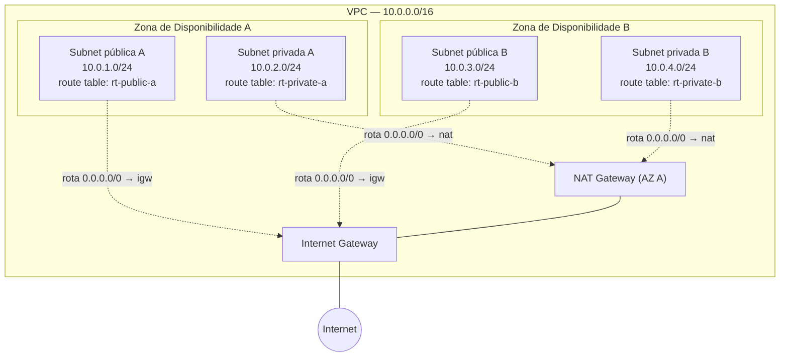
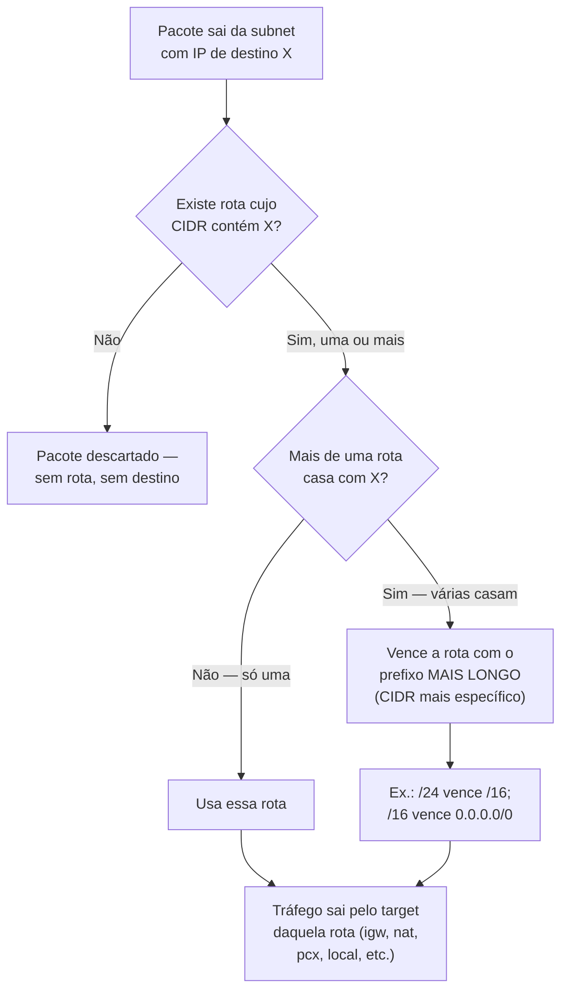

# Subnets e roteamento

> [!abstract] TL;DR
> Uma VPC inteira é uma única faixa de IPs — mas colocar banco de dados e servidor web na mesma faixa, sem separação nenhuma, significa que os dois enxergam a mesma rota para a internet. Uma **subnet** divide essa faixa em pedaços menores, cada um preso a uma única Zona de Disponibilidade. O que decide se uma subnet é "pública" ou "privada" não é um botão, uma flag, ou o nome que você deu a ela — é uma única linha na **route table** associada a ela: existe, ou não existe, uma rota para um internet gateway. Toda subnet nasce com uma rota implícita, a **local route**, que garante que tudo dentro da VPC se enxerga; o resto — inclusive a rota padrão `0.0.0.0/0` que abre caminho pro mundo — é adicionado por quem desenha a rede. A DigitalOcean, nesse ponto específico, é radicalmente mais simples: a VPC dela não tem subnets nem route tables editáveis — é uma única rede plana por datacenter, e a separação pública/privada vira responsabilidade do Droplet (tem IP público ou não), não da topologia de rede.

## O problema: dois vizinhos que não podem ter a mesma exposição

Uma aplicação típica de três camadas tem um servidor web que precisa aceitar conexões da internet, e um banco de dados que não deveria ser alcançável por ninguém fora da própria rede da aplicação. Os dois vivem na mesma VPC — mesma conta, mesma região, muitas vezes o mesmo bloco CIDR reservado no desenho original, algo como `10.0.0.0/16`. Mas eles precisam de posturas de exposição completamente diferentes: um fala com o mundo, o outro não fala com ninguém que não seja o próprio servidor web.

A VPC sozinha não resolve isso. Ela é só o perímetro — o bloco de IPs reservado pra você, isolado de outras VPCs. Dentro dela, tudo é, por padrão, uma rede só, sem fronteiras internas. Se você lançar o servidor web e o banco de dados na mesma sub-rede, sem nenhuma outra estrutura, os dois compartilham exatamente as mesmas regras de saída para a internet — porque essas regras vivem numa tabela associada à rede, não ao recurso individual. Abrir a rede inteira pra internet só porque o servidor web precisa é o equivalente a destrancar a porta principal de um prédio porque um único apartamento recebe visitas.

A pergunta que este problema força é: **como subdividir uma VPC de forma que um pedaço dela enxergue a internet e outro pedaço, na mesma rede, seja estruturalmente incapaz de fazer o mesmo?** A resposta tem duas peças que precisam ser entendidas juntas — a subnet, que faz a divisão física do espaço de IPs, e a route table, que decide, pedaço por pedaço, pra onde o tráfego pode ir. Nenhuma das duas resolve o problema sozinha: uma subnet sem route table dedicada herda o comportamento da tabela principal da VPC, e uma route table sem subnet nenhuma associada a ela é só um documento sem efeito prático — é a combinação das duas, subdivisão de espaço mais decisão de rota, que produz a separação real entre "fala com o mundo" e "não fala".

Vale reter, antes de entrar no mecanismo propriamente dito, o resumo de uma frase que amarra a nota inteira: **subnet decide onde as coisas moram (e em qual zona); route table decide para onde o tráfego delas pode ir.** São dois eixos independentes — um de localização física, outro de permissão de destino — e a confusão mais comum de quem está aprendendo isso pela primeira vez é tratar os dois como se fossem a mesma decisão.

## Subnet: a subdivisão presa a uma única zona

Uma **subnet** é uma faixa de endereços IP dentro de uma VPC — um subconjunto do bloco CIDR da VPC, reservado para lançar recursos ali dentro. Até aqui, é só aritmética de rede: se a VPC é `10.0.0.0/16`, uma subnet pode ser `10.0.1.0/24`, outra `10.0.2.0/24`, e assim por diante, cada uma um pedaço menor e não sobreposto do espaço total.

A peça que costuma pegar quem vem de redes tradicionais desprevenido é esta: segundo a documentação oficial da AWS, **cada subnet precisa residir inteiramente dentro de uma única Zona de Disponibilidade e não pode atravessar zonas**. Não existe subnet "espalhada" por duas AZs — a subnet nasce amarrada a uma, no momento da criação, e fica lá para sempre (não é um atributo que se muda depois; para "mover" uma subnet de zona, você cria uma nova subnet na zona de destino e migra os recursos).

Essa amarração não é um detalhe burocrático — é o que faz a nota anterior desta trilha (Compute II, sobre elasticidade e balanceamento) funcionar de verdade. Um Auto Scaling Group ou um load balancer que distribui tráfego "entre zonas de disponibilidade" está, na prática, distribuindo entre subnets diferentes — uma por zona. Se todas as suas subnets estivessem numa AZ só, a promessa de alta disponibilidade da nota 06 seria só decorativa: a queda de uma única zona derrubaria a aplicação inteira, porque não haveria segunda subnet, em segunda zona, para onde redirecionar tráfego. É por isso que o desenho de VPC padrão sempre distribui subnets — públicas e privadas — em pelo menos duas AZs.



Repare que o diagrama já antecipa uma peça que a próxima nota desta trilha (03, sobre internet e NAT gateway) vai desenvolver com profundidade: subnets privadas não ficam totalmente isoladas — elas alcançam a internet *para fora* através de um NAT gateway, mas continuam inacessíveis *de fora para dentro*. Esta nota foca em como a subnet e a route table decidem essa direção; o mecanismo interno do gateway em si é assunto da próxima.

### Quantos IPs uma subnet realmente entrega

Vale fechar essa seção com uma pegadinha aritmética que morde iniciantes: uma subnet `/24` tem 256 endereços na conta de CIDR pura, mas a AWS reserva cinco deles em toda subnet, para uso próprio — o endereço de rede, o endereço de broadcast (que a AWS nem usa, mas reserva por convenção de IPv4), o endereço reservado para o roteador da VPC, e dois reservados para DNS e uso futuro. Uma `/24`, portanto, entrega 251 endereços utilizáveis de verdade — não 256. Planejar o tamanho das subnets de um desenho novo sem contar essa reserva é o tipo de erro que só aparece meses depois, quando a subnet "cheia" na teoria já não tem endereço livre para a próxima instância na prática:

| Subnet (papel) | AZ | CIDR | Endereços totais | Endereços utilizáveis (menos 5 reservados) |
|---|---|---|---|---|
| Pública A (web) | us-east-1a | `10.0.1.0/24` | 256 | 251 |
| Privada A (app/db) | us-east-1a | `10.0.2.0/24` | 256 | 251 |
| Pública B (web) | us-east-1b | `10.0.3.0/24` | 256 | 251 |
| Privada B (app/db) | us-east-1b | `10.0.4.0/24` | 256 | 251 |

A faixa de tamanhos permitida para uma subnet IPv4 na AWS vai de `/28` (16 endereços, dos quais só 11 utilizáveis — o menor bloco aceito) até `/16` (65.536 endereços, o mesmo tamanho máximo de uma VPC inteira, o que só faz sentido numa VPC de subnet única). Escolher `/24` como padrão, como no plano acima, não é acaso: é grande o bastante para não faltar endereço num serviço em crescimento, e pequeno o bastante para caber várias subnets confortavelmente dentro de uma VPC `/16` sem desperdício.

## O que faz uma subnet ser "pública": a rota, não um nome

Aqui está o ponto que quase todo mundo que aprende VPC de forma apressada erra, e que vale gravar com precisão porque é vocabulário de entrevista sênior real: **não existe uma flag chamada "public" numa subnet**. Uma subnet não "é" pública por definição própria — ela se torna pública (ou continua privada) inteiramente em função de uma linha na route table associada a ela.

A documentação oficial da AWS define os tipos de subnet exatamente por esse critério de roteamento, não por nenhum atributo intrínseco:

- **Subnet pública** — a subnet tem uma rota direta para um internet gateway. Recursos numa subnet pública conseguem acessar a internet pública.
- **Subnet privada** — a subnet não tem uma rota direta para um internet gateway. Recursos numa subnet privada precisam de um dispositivo NAT para acessar a internet pública.
- **Subnet só-VPN** — tem rota para uma conexão Site-to-Site VPN via virtual private gateway, mas não para um internet gateway.
- **Subnet isolada** — não tem rota nenhuma para fora da própria VPC.

Ou seja: pegue duas subnets idênticas em CIDR, tamanho, zona e todo o resto — e a única coisa que separa uma "pública" da outra "privada" é uma entrada na tabela de rotas de cada uma apontando (ou não) para um internet gateway. Não é o nome que você deu à subnet no console (`subnet-publica-1` não torna nada público). Não é ter instâncias com IP público rodando nela. É, estrita e somente, a presença de uma rota `0.0.0.0/0 → igw-xxxxx` na route table associada. Retire essa única linha, e a mesma subnet, com os mesmos recursos, com os mesmos IPs, vira privada instantaneamente — porque o tráfego simplesmente não tem mais pra onde ir.

> [!warning] Confundir IP público com subnet pública
> É comum achar que uma instância "tem IP público, logo está numa subnet pública". Não necessariamente. Uma instância pode ter um IP elástico atribuído manualmente e estar numa subnet cuja route table não tem rota nenhuma para um internet gateway — nesse caso, o IP público existe, mas não serve para nada, porque não há caminho de rota para usá-lo. E o inverso também é verdadeiro: uma subnet pode ser tecnicamente pública (rota para IGW existe) e ainda assim nenhuma instância nela ter IP público atribuído — nesse caso, ela poderia ter, mas simplesmente não tem. IP público e subnet pública são dois interruptores independentes, e só os dois ligados juntos produzem alcance real da internet.

## Route table: a tabela que decide para onde o tráfego vai

Uma **route table** é, na definição da AWS, o controlador de tráfego da VPC — um conjunto de regras (routes) que dizem, para cada faixa de destino, qual é o alvo (target) por onde o tráfego deve sair. Cada rota tem exatamente duas colunas que importam: **destino** (um bloco CIDR, ou uma prefix list) e **alvo** (um internet gateway, um NAT gateway, uma interface de rede, uma conexão de peering, entre outros).

Toda VPC nasce com uma **route table principal (main route table)**, criada automaticamente junto com ela. Toda subnet nova é automaticamente associada a essa main route table, a menos que você associe explicitamente uma route table diferente. Uma subnet só pode estar associada a **uma** route table por vez — mas a mesma route table pode ser associada a várias subnets simultaneamente (é assim que, no diagrama acima, cada AZ tem sua própria route table pública e privada, mas nada impede que várias subnets públicas compartilhassem a mesma tabela, se o desenho não exigisse diferenciação por zona).

Duas rotas merecem atenção especial porque aparecem em toda route table, mesmo que ninguém as tenha escrito manualmente:

- **A local route** — uma rota implícita, adicionada automaticamente a toda route table de toda VPC, cobrindo o bloco CIDR inteiro da própria VPC (e, se a VPC tiver IPv6, uma segunda local route para o bloco IPv6). É essa rota que garante que qualquer recurso dentro da VPC — não importa em qual subnet — consiga falar com qualquer outro recurso da mesma VPC, sem que ninguém precise configurar nada. Ela não pode ser removida.
- **A rota default `0.0.0.0/0`** — a rota "tudo mais", que casa com qualquer destino que nenhuma outra rota mais específica tenha coberto. É essa a rota que, apontando para um internet gateway, transforma uma subnet em pública; apontando para um NAT gateway, dá acesso de saída (só de saída) para uma subnet privada; e, na ausência de qualquer rota `0.0.0.0/0`, deixa a subnet isolada da internet por completo.

Uma route table de subnet pública típica, então, tem exatamente esta forma:

| Destino | Alvo | Origem da rota |
|---|---|---|
| `10.0.0.0/16` | `local` | Implícita, adicionada pela AWS, cobre a VPC inteira |
| `0.0.0.0/0` | `igw-0a1b2c3d4e5f67890` | Manual — é esta linha que torna a subnet pública |

E a de uma subnet privada com saída via NAT, ao lado:

| Destino | Alvo | Origem da rota |
|---|---|---|
| `10.0.0.0/16` | `local` | Implícita, adicionada pela AWS, cobre a VPC inteira |
| `0.0.0.0/0` | `nat-0f1e2d3c4b5a67890` | Manual — saída permitida, entrada não |

Repare que a única diferença estrutural entre as duas tabelas é o alvo da segunda linha — `igw-` numa, `nat-` na outra. É literalmente essa troca de uma palavra que separa "pública" de "privada" no vocabulário da AWS.

### Quando duas rotas competem: a rota mais específica vence

Uma pergunta que aparece assim que a route table cresce além de duas linhas: e se duas rotas, ao mesmo tempo, cobrirem o endereço de destino do pacote? A AWS resolve isso por um princípio único, documentado explicitamente como regra de prioridade: **direcionamos o tráfego usando a rota mais específica que casa com o tráfego — isso é conhecido como longest prefix match** (a rota com o prefixo mais longo, ou seja, o bloco CIDR menor e mais preciso, sempre vence sobre uma rota mais genérica que também caberia).

O exemplo oficial da documentação da AWS ilustra bem: uma route table com uma rota para `172.31.0.0/16` apontando para uma conexão de peering, e uma rota `0.0.0.0/0` apontando para um internet gateway. Tráfego destinado a qualquer IP dentro de `172.31.0.0/16` usa a conexão de peering — porque essa rota é mais específica — mesmo que a rota `0.0.0.0/0` também "cobrisse" tecnicamente aquele destino. Todo o resto do tráfego, que nenhuma rota mais específica cobre, cai na rota default e sai pelo internet gateway.



Esse mecanismo — longest prefix match — é o mesmo princípio de roteamento usado em redes IP fora da nuvem também; a AWS não inventou a regra, só a aplica de forma consistente dentro da route table de cada subnet.

Vale notar ainda a segunda camada de prioridade, para quando duas rotas de mesma especificidade competem: entre uma rota estática (a que você mesmo criou, apontando para um internet gateway, NAT gateway, peering ou instância) e uma rota propagada automaticamente (por exemplo, vinda de uma conexão VPN via virtual private gateway), a rota estática sempre vence quando os destinos coincidem exatamente. É uma regra de desempate que só entra em jogo depois que o longest prefix match já decidiu que as duas rotas em disputa são igualmente específicas — na imensa maioria dos desenhos de VPC, com uma local route e uma rota `0.0.0.0/0` só, essa segunda camada nunca chega a ser acionada.

## O atributo que decide o IP público de cada instância nova

Existe ainda uma terceira peça, independente das duas rotas acima, que frequentemente é confundida com "tornar a subnet pública": o atributo `map-public-ip-on-launch` (ou, na CLI, a flag `--map-public-ip-on-launch`). Ele não mexe em rota nenhuma — controla apenas se uma nova interface de rede, criada quando uma instância é lançada naquela subnet, recebe automaticamente um endereço IPv4 público. Com o atributo ligado, toda instância nova ali já nasce com IP público; com ele desligado (o padrão em subnets que não são a subnet padrão da VPC), a instância nasce só com IP privado, e alguém precisaria atribuir um IP público manualmente depois, se quisesse.

Isso é ortogonal ao roteamento: uma subnet pode ter a rota para o internet gateway (ser tecnicamente pública) e ainda assim ter `map-public-ip-on-launch` desligado — nesse caso, novas instâncias não recebem IP público automaticamente, mesmo a subnet sendo pública. É uma combinação comum quando o time prefere atribuir IPs públicos de forma deliberada, um a um, em vez de por padrão.

> [!info] Fronteira
> Rota é uma coisa; permissão de tráfego é outra, e esta nota deliberadamente não mistura as duas. Uma subnet ter rota para um internet gateway diz só que *existe caminho* para a internet — não diz que qualquer porta, de qualquer origem, está liberada para entrar. Quem decide isso são os **security groups** (com estado, por instância) e as **network ACLs** (sem estado, por subnet), cobertos nas próximas notas deste mesmo galho. Uma subnet pública sem nenhum security group liberando a porta 443, por exemplo, continua tecnicamente pública em termos de rota — e ainda assim inacessível na prática, porque a rota abre o caminho, mas não abre a porta.

## Casos práticos: criando o par público/privado pela CLI

O fluxo completo — criar as subnets, criar a route table, adicionar a rota, associar, e ligar o atributo de IP público — segue sempre a mesma sequência de comandos. Primeiro, as duas subnets, cada uma numa AZ, dentro da VPC `vpc-0a1b2c3d4e5f67890` (bloco `10.0.0.0/16`):

```bash
# Subnet pública — vai receber o servidor web
aws ec2 create-subnet \
  --vpc-id vpc-0a1b2c3d4e5f67890 \
  --cidr-block 10.0.1.0/24 \
  --availability-zone us-east-1a \
  --tag-specifications 'ResourceType=subnet,Tags=[{Key=Name,Value=subnet-publica-a}]'

# Subnet privada — vai receber o banco de dados
aws ec2 create-subnet \
  --vpc-id vpc-0a1b2c3d4e5f67890 \
  --cidr-block 10.0.2.0/24 \
  --availability-zone us-east-1a \
  --tag-specifications 'ResourceType=subnet,Tags=[{Key=Name,Value=subnet-privada-a}]'
```

Cada `create-subnet` exige a zona de disponibilidade explicitamente — é o momento em que a amarração subnet↔AZ, permanente, é decidida. Em seguida, uma route table dedicada para a subnet pública (deixar tudo na main route table funciona, mas mistura o desenho público e privado numa tabela só, o que fica difícil de auditar conforme a VPC cresce):

```bash
aws ec2 create-route-table \
  --vpc-id vpc-0a1b2c3d4e5f67890 \
  --tag-specifications 'ResourceType=route-table,Tags=[{Key=Name,Value=rt-publica-a}]'
```

A resposta traz o `RouteTableId` (aqui, `rtb-0123456789abcdef0`) — e já vem com a local route incluída automaticamente, sem que nada tenha sido pedido:

```json
{
    "RouteTable": {
        "RouteTableId": "rtb-0123456789abcdef0",
        "VpcId": "vpc-0a1b2c3d4e5f67890",
        "Routes": [
            {
                "DestinationCidrBlock": "10.0.0.0/16",
                "GatewayId": "local",
                "State": "active",
                "Origin": "CreateRouteTable"
            }
        ]
    }
}
```

Agora a rota que efetivamente torna essa subnet pública — a linha que, sozinha, muda a classificação inteira:

```bash
aws ec2 create-route \
  --route-table-id rtb-0123456789abcdef0 \
  --destination-cidr-block 0.0.0.0/0 \
  --gateway-id igw-0f1e2d3c4b5a67890
```

Com a rota criada, associar a route table à subnet pública — este é o passo que muitos esquecem, deixando a subnet presa à main route table por engano:

```bash
aws ec2 associate-route-table \
  --route-table-id rtb-0123456789abcdef0 \
  --subnet-id subnet-0aabbccddeeff0011
```

E, por fim, ligar o atributo de IP público automático para que instâncias lançadas ali já nasçam alcançáveis:

```bash
aws ec2 modify-subnet-attribute \
  --subnet-id subnet-0aabbccddeeff0011 \
  --map-public-ip-on-launch
```

Para a subnet privada, o processo espelha o mesmo esqueleto, mas com o alvo trocado para um NAT gateway (a criação do NAT gateway em si é assunto da próxima nota) e sem nunca ligar `map-public-ip-on-launch`:

```bash
aws ec2 create-route-table \
  --vpc-id vpc-0a1b2c3d4e5f67890 \
  --tag-specifications 'ResourceType=route-table,Tags=[{Key=Name,Value=rt-privada-a}]'

aws ec2 create-route \
  --route-table-id rtb-1122334455667788a \
  --destination-cidr-block 0.0.0.0/0 \
  --nat-gateway-id nat-0a1b2c3d4e5f67890

aws ec2 associate-route-table \
  --route-table-id rtb-1122334455667788a \
  --subnet-id subnet-1122334455667788b
```

Conferir a classificação de uma subnet, ao final, é uma questão de olhar a route table associada — não existe outro lugar onde essa informação "de verdade" mora:

```bash
$ aws ec2 describe-route-tables --route-table-ids rtb-0123456789abcdef0 \
    --query 'RouteTables[0].Routes[*].[DestinationCidrBlock,GatewayId]' \
    --output table
--------------------------------
|      DescribeRouteTables      |
+----------------+---------------+
|  10.0.0.0/16   |     local     |
|  0.0.0.0/0     | igw-0f1e2d... |
+----------------+---------------+
```

### Conferindo os dois atributos juntos, na prática

Depois de criar as quatro subnets do desenho de duas AZs, o jeito mais direto de auditar a classificação real de cada uma — sem depender de memória ou do nome que alguém deu no console — é pedir à API os dois campos que realmente importam: se a subnet mapeia IP público na criação, e (separadamente, cruzando com a route table) se ela tem rota para um internet gateway:

```bash
$ aws ec2 describe-subnets \
    --filters "Name=vpc-id,Values=vpc-0a1b2c3d4e5f67890" \
    --query 'Subnets[*].[SubnetId,CidrBlock,AvailabilityZone,MapPublicIpOnLaunch]' \
    --output table
-------------------------------------------------------------------------
|                            DescribeSubnets                             |
+------------------------+----------------+---------------+-------------+
|  subnet-0aabbccddeeff01|  10.0.1.0/24   |  us-east-1a   |  True       |
|  subnet-0aabbccddeeff02|  10.0.2.0/24   |  us-east-1a   |  False      |
|  subnet-0aabbccddeeff03|  10.0.3.0/24   |  us-east-1b   |  True       |
|  subnet-0aabbccddeeff04|  10.0.4.0/24   |  us-east-1b   |  False      |
-------------------------------------------------------------------------
```

O `MapPublicIpOnLaunch` sozinho já sinaliza a intenção do desenho — `True` nas duas subnets de zona ímpar, `False` nas de zona par, batendo com "públicas" e "privadas" respectivamente. Mas, como esta nota insiste, esse campo é só um indício de intenção, não a prova. A prova definitiva ainda exige olhar a rota:

```bash
$ aws ec2 describe-route-tables \
    --filters "Name=association.subnet-id,Values=subnet-0aabbccddeeff02" \
    --query 'RouteTables[0].Routes[*].[DestinationCidrBlock,GatewayId]' \
    --output table
--------------------------------
|      DescribeRouteTables      |
+----------------+---------------+
|  10.0.0.0/16   |     local     |
|  0.0.0.0/0     | nat-0a1b2c... |
+----------------+---------------+
```

Nenhuma linha aponta para um `igw-`, então essa subnet — mesmo que alguém tivesse ligado `map-public-ip-on-launch` nela por engano — continua privada de fato: qualquer IP público que uma instância ali recebesse ficaria sem rota de saída direta para usá-lo.

## Lente dupla honesta: o modelo explícito da AWS contra a rede plana da DigitalOcean

Vale ser direto aqui, porque essa é uma das diferenças mais reais entre os dois provedores, não um detalhe de nomenclatura. A DigitalOcean **não expõe** subnets nem route tables editáveis dentro de uma VPC — o modelo dela é deliberadamente mais raso.

Uma VPC da DigitalOcean é, segundo a documentação de criação, definida por três coisas: um nome, uma região (na prática, um datacenter específico — `nyc1`, `nyc3`, `ams3`, e assim por diante) e uma faixa de IP (`ip_range`), gerada automaticamente ou escolhida pelo usuário. Não existe, na criação de uma VPC da DO, nenhum passo de "agora divida essa faixa em subnets" — a VPC inteira funciona como uma rede plana única. Todo recurso lançado dentro dela — Droplet, banco de dados gerenciado, load balancer, cluster Kubernetes — compartilha o mesmo espaço de endereçamento, sem subdivisão interna visível ou editável pelo usuário.

Como consequência direta, dois conceitos centrais desta nota simplesmente não têm equivalente na DO:

- **Não existe route table** que o usuário edite. Não há comando `doctl` equivalente a `create-route-table` ou `create-route --destination-cidr-block`. O roteamento dentro de uma VPC da DO é gerenciado pela própria plataforma, sem um objeto de rota exposto na API ou no painel.
- **Não existe distinção formal entre subnet pública e privada.** A VPC inteira é privada por natureza — inacessível de fora, e o tráfego entre recursos dentro dela não passa pela internet pública. O que decide se um Droplet específico é alcançável de fora é um atributo do próprio Droplet: ele recebe (ou não) um IP público além do seu IP privado da VPC, na hora da criação ou depois. Não há uma subnet "pública" separada para onde mover o recurso — a exposição é uma propriedade do recurso, não da topologia de rede em que ele vive.

Além disso — e essa é uma diferença estrutural, não só de granularidade — uma VPC da DigitalOcean está sempre presa a um único datacenter: a documentação de limites é explícita ao dizer que a DO **não oferece suporte a uma única rede VPC que se estenda entre regiões de datacenter diferentes**. Para ligar recursos de datacenters distintos, o caminho é criar uma VPC em cada um e conectá-las por **peering** — o mesmo padrão conceitual de VPC peering que a AWS usa entre VPCs (assunto que esta trilha ainda vai cobrir numa nota futura sobre peering), só que aqui é o único mecanismo disponível para qualquer topologia multi-datacenter, já que não há sub-redes internas para desenhar isso de outra forma.

O contraste em comando é direto: criar uma VPC pela `doctl` já entrega a rede inteira, sem passo intermediário de subnet:

```bash
# AWS — VPC, depois subnets, depois route tables, depois associação: 4+ objetos distintos
$ aws ec2 create-subnet --vpc-id vpc-0a1b2c3d4e5f67890 --cidr-block 10.0.1.0/24 --availability-zone us-east-1a
$ aws ec2 create-route-table --vpc-id vpc-0a1b2c3d4e5f67890
$ aws ec2 associate-route-table --route-table-id rtb-... --subnet-id subnet-...

# DigitalOcean — a VPC inteira nasce pronta, sem subnet ou route table para configurar depois
$ doctl vpcs create \
    --name rede-producao \
    --region nyc3 \
    --ip-range 10.10.0.0/16
{
    "id": "...",
    "name": "rede-producao",
    "region": "nyc3",
    "ip_range": "10.10.0.0/16"
}
```

A mesma ausência de subnet aparece quando se olha o que o próprio Droplet controla. Em vez de decidir "em que subnet pública ou privada eu lanço o recurso", quem provisiona um Droplet decide diretamente se ele participa da VPC (rede privada) e se, além disso, recebe uma interface pública:

```bash
# Droplet só com IP privado da VPC — equivalente de intenção a uma
# instância numa subnet "privada", mas decidido no recurso, não na rede
$ doctl droplets create banco-de-dados-01 \
    --region nyc3 \
    --size s-2vcpu-4gb \
    --image ubuntu-24-04-x64 \
    --vpc-uuid 12345678-abcd-1234-abcd-1234567890ab \
    --no-resize-disk

# Droplet com IP público além do privado — equivalente de intenção
# a uma instância numa subnet "pública"
$ doctl droplets create servidor-web-01 \
    --region nyc3 \
    --size s-2vcpu-4gb \
    --image ubuntu-24-04-x64 \
    --vpc-uuid 12345678-abcd-1234-abcd-1234567890ab
```

Consultar a VPC em si devolve só a rede plana — nome, região, faixa de IP — sem lista de subnets nem de rotas porque nenhuma das duas existe como objeto separado:

```bash
$ doctl vpcs get 12345678-abcd-1234-abcd-1234567890ab
ID                                      Name              Description    IP Range         Region    Created At               Default
12345678-abcd-1234-abcd-1234567890ab   rede-producao                    10.10.0.0/16     nyc3      2026-07-23T10:00:00Z    false
```

Não é uma lacuna a esconder — é uma escolha coerente com o público que a DigitalOcean atende: quem quer uma rede privada simples entre um punhado de Droplets, sem o vocabulário inteiro de topologia da AWS, ganha isso de fábrica. Quem precisa desenhar camadas de exposição diferentes dentro da mesma rede — o cenário de abertura desta nota, com banco de dados e servidor web na mesma VPC — precisa, na DO, resolver isso no nível do recurso (IP público sim/não) e do Security Group/firewall, não no nível de subnet e rota. É uma peça de vocabulário que vale nomear com precisão numa entrevista sênior: saber que "subnet pública" é um conceito que a AWS formaliza estruturalmente e que a DO simplesmente não tem, em vez de assumir que "toda nuvem organiza rede do mesmo jeito".

| Conceito | AWS | Azure | GCP | DigitalOcean |
|---|---|---|---|---|
| Subnet como objeto | Subnet (presa a 1 AZ) | Subnet (dentro de uma Virtual Network) | Subnetwork (regional, cobre várias zonas) | — (VPC é rede plana única) |
| Route table editável | Route Table (por subnet) | Route Table (UDR — User Defined Routes) | Routes (por VPC, com tags/prioridade) | — |
| Distinção pública/privada | Por rota para Internet Gateway | Por associação de IP público/NSG | Por rota `0.0.0.0/0` + Cloud NAT | — (é atributo do recurso, não da rede) |
| Escopo geográfico da rede | Regional, subnets por AZ | Regional, subnets por região | Global (VPC) / regional (subnetwork) | Datacenter único — sem VPC cross-region |

> [!info] Caducidade
> Comportamento de subnets, route tables e longest prefix match verificado na documentação oficial da AWS em 2026-07-23. Modelo de VPC da DigitalOcean (rede plana, sem subnet/route table editável, VPC presa a datacenter) verificado na documentação oficial da DO na mesma data — é uma das áreas onde a DO evolui com menos frequência que a AWS, mas vale reconferir antes de decidir uma arquitetura real.

## Armadilhas comuns

> [!warning] Esquecer de associar a route table certa à subnet
> Criar a route table e a rota para o internet gateway não basta — se a subnet continuar associada à main route table (o padrão de toda subnet nova), a rota nova não tem efeito nenhum sobre ela. É um erro silencioso: nenhum comando falha, a rota existe, mas a subnet continua sem alcançar a internet porque está lendo a tabela errada. Sempre confirme com `describe-route-tables` (filtrando por `association.subnet-id`) qual tabela está de fato associada à subnet antes de assumir que a rota está ativa.

> [!warning] Tratar `map-public-ip-on-launch` como se fizesse a subnet ser pública
> É tentador achar que ligar esse atributo "torna a subnet pública". Não torna — ele só decide se instâncias novas recebem IP público automaticamente. Uma subnet sem rota para internet gateway continua privada mesmo com o atributo ligado; as instâncias recebem IP público, mas esse IP não serve para nada, porque não há rota de saída para usá-lo.

> [!warning] Achar que "privada" significa "sem internet nenhuma"
> Uma subnet privada, no desenho clássico de duas ou três camadas, não fica cortada da internet — ela só não tem rota *direta* para um internet gateway. Ela normalmente ainda alcança a internet *para fora*, através de um NAT gateway na rota `0.0.0.0/0`, mas continua inatingível *de fora para dentro*, porque ninguém de fora consegue iniciar uma conexão através de um NAT. Confundir "privada" com "isolada" leva a desenhos que dificultam, sem necessidade, tarefas legítimas como baixar atualizações de pacote num servidor de banco de dados.

## O que vem a seguir

Esta nota resolveu *como o tráfego escolhe seu caminho* dentro e para fora de uma VPC — subnet como subdivisão presa a uma AZ, route table como a tabela que decide, rota mais específica sempre vencendo. Mas ficou pendente a pergunta que apareceu duas vezes aqui sem resposta completa: o que exatamente é um internet gateway, o que exatamente é um NAT gateway, e por que um permite tráfego nos dois sentidos enquanto o outro só permite saída. Esta nota tratou os dois como caixas-pretas — um alvo (`igw-...` ou `nat-...`) numa linha de route table, sem entrar no mecanismo que cada um implementa por trás desse alvo.

É esse par de gateways — a peça final que faz uma rota `0.0.0.0/0` significar algo de verdade, e que explica por que uma subnet privada com NAT alcança a internet para fora mas continua inatingível de fora para dentro — que a próxima nota desta trilha desenvolve.

## Fontes

- [AWS VPC — Subnets for your VPC (documentação oficial)](https://docs.aws.amazon.com/vpc/latest/userguide/configure-subnets.html) — cada subnet reside inteiramente numa única AZ; definição de subnet pública/privada/VPN-only/isolada por critério de roteamento; associação automática à main route table; `map-public-ip-on-launch`; acessado em 2026-07-23.
- [AWS VPC — Configure route tables](https://docs.aws.amazon.com/vpc/latest/userguide/VPC_Route_Tables.html) — route table como controlador de tráfego, destino/alvo, main route table automática; acessado em 2026-07-23.
- [AWS VPC — Route table concepts](https://docs.aws.amazon.com/vpc/latest/userguide/RouteTables.html) — definição formal de main route table, local route (implícita, cobre o CIDR da VPC, uma para IPv4 e uma para IPv6), route table association; acessado em 2026-07-23.
- [AWS VPC — How route priority works](https://docs.aws.amazon.com/vpc/latest/userguide/route-tables-priority.html) — longest prefix match como regra de prioridade, exemplo com `172.31.0.0/16` vs `0.0.0.0/0`, prioridade entre rotas estáticas e propagadas; acessado em 2026-07-23.
- [AWS EC2 — Create a subnet (Command Reference / User Guide)](https://docs.aws.amazon.com/AWSEC2/latest/UserGuide/create-subnets.html) — `create-subnet` exige `--availability-zone`; `modify-subnet-attribute --map-public-ip-on-launch` e seu efeito em instâncias novas; acessado em 2026-07-23.
- [AWS VPC — Subnet CIDR blocks (subnet sizing)](https://docs.aws.amazon.com/vpc/latest/userguide/subnet-sizing.html) — as cinco IPv4 reservadas em toda subnet (endereço de rede, roteador da VPC, DNS, uso futuro, broadcast), faixa permitida `/28` a `/16`; acessado em 2026-07-23.
- [AWS CLI — ec2 create-route (Command Reference)](https://docs.aws.amazon.com/cli/latest/reference/ec2/create-route.html) — sintaxe de `--destination-cidr-block` e `--gateway-id`/`--nat-gateway-id`; acessado em 2026-07-23.
- [AWS CLI — ec2 associate-route-table (Command Reference)](https://docs.aws.amazon.com/cli/latest/reference/ec2/associate-route-table.html) — associação route table ↔ subnet, um subnet-route-table por vez; acessado em 2026-07-23.
- [DigitalOcean — VPC product documentation](https://docs.digitalocean.com/products/networking/vpc/) — definição de VPC como rede privada isolada, recursos suportados, peering; acessado em 2026-07-23.
- [DigitalOcean — How to create a VPC network](https://docs.digitalocean.com/products/networking/vpc/how-to/create/) — campos de criação (nome, região/datacenter, `ip_range`), ausência de subnet/route table configurável; acessado em 2026-07-23.
- [DigitalOcean — VPC limits](https://docs.digitalocean.com/products/networking/vpc/details/limits/) — VPC presa a um único datacenter, sem suporte a rede única entre regiões diferentes, uso de peering para conectar VPCs de datacenters distintos; acessado em 2026-07-23.
- [DigitalOcean API — VPCs create endpoint](https://docs.digitalocean.com/reference/api/api-reference/#tag/VPCs) — campos `name`, `region`, `ip_range` de uma VPC; acessado em 2026-07-23.
