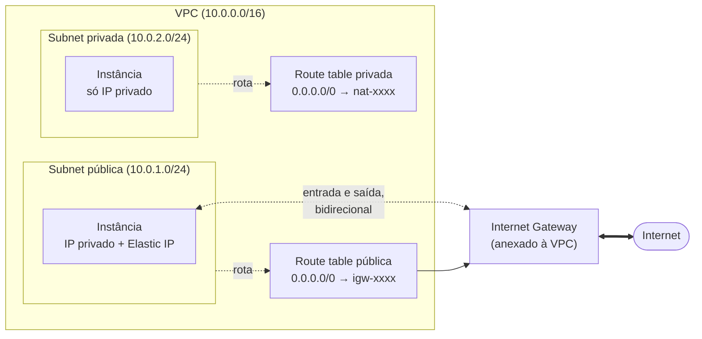
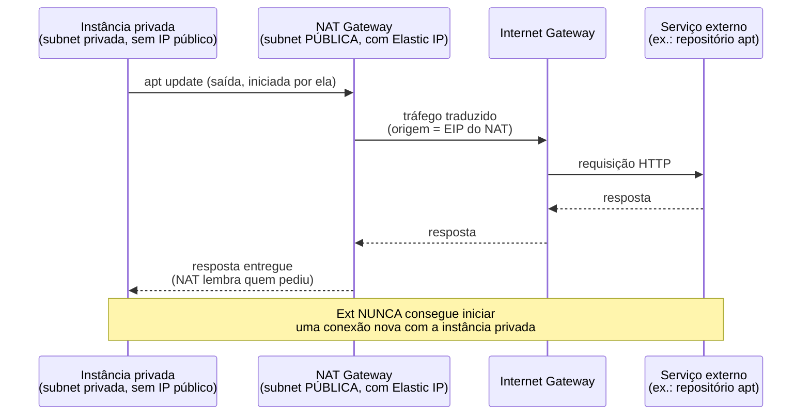
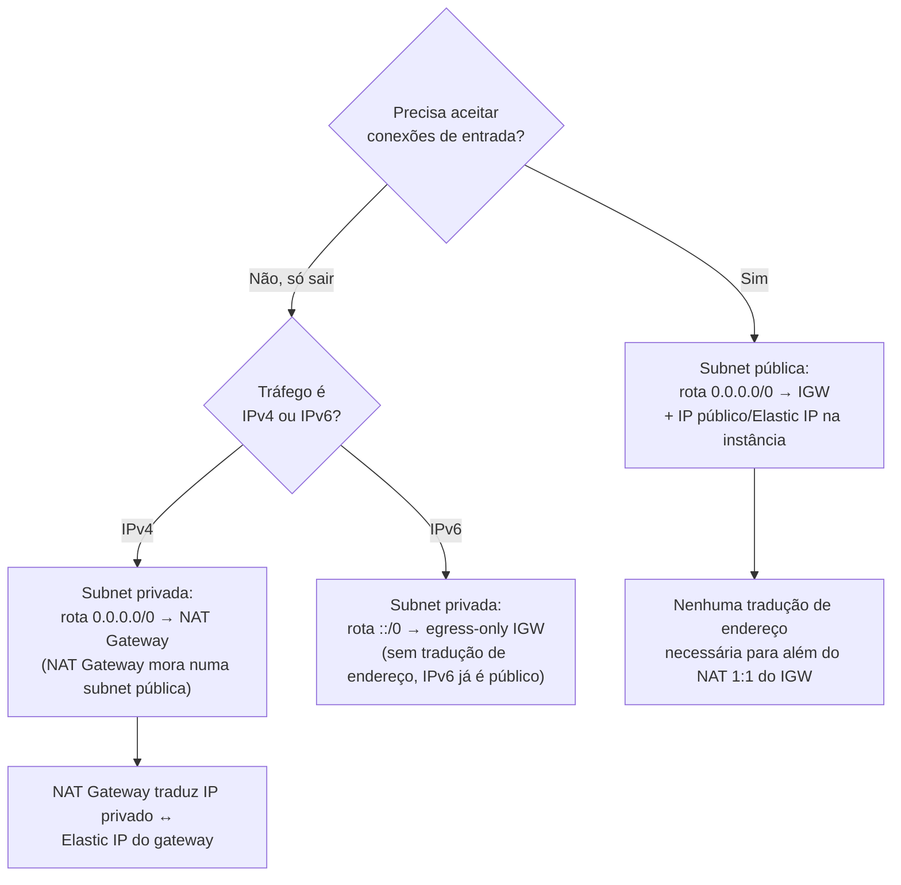

# Gateways: internet e NAT

> [!abstract] TL;DR
> Uma subnet privada dentro de uma VPC não tem, por definição, rota nenhuma para a internet — e é exatamente esse isolamento que a torna privada. Mas isolamento total não é o que a maioria das aplicações precisa: um servidor de banco de dados numa subnet privada ainda precisa baixar atualizações de segurança do repositório do sistema operacional, mesmo sem jamais aceitar uma conexão vinda de fora. A resposta da AWS é dois componentes com papéis opostos e frequentemente confundidos. O **Internet Gateway (IGW)** é o portal bidirecional anexado à VPC inteira: uma subnet vira "pública" quando sua tabela de rotas aponta `0.0.0.0/0` para ele, e uma instância ali só fica de fato alcançável se, além dessa rota, tiver um IP público ou Elastic IP. O **NAT Gateway** resolve o problema assimétrico: vive numa subnet pública, e deixa instâncias de subnets privadas **iniciarem** conexões de saída sem nunca **aceitarem** conexões de entrada — o oposto exato do IGW. A pegadinha que todo mundo aprende na primeira fatura de surpresa: NAT Gateway cobra por hora *e* por gigabyte processado, e essa segunda métrica é fácil de subestimar até a conta chegar.

## O problema: baixar sem ser encontrado

Imagine uma instância EC2 rodando um servidor de aplicação numa subnet privada — deliberadamente sem IP público, porque ninguém quer que um serviço interno seja alcançável diretamente da internet. Essa instância precisa, periodicamente, rodar `apt update && apt upgrade` para aplicar patches de segurança do sistema operacional, e o pacote de monitoramento que ela usa precisa enviar métricas para um endpoint SaaS fora da AWS. Duas necessidades legítimas de tráfego de **saída**.

O reflexo errado, sob pressão de prazo, é dar um IP público à instância "só para o `apt update` funcionar". Isso resolve o sintoma e recria o problema que a subnet privada existia para evitar: agora a instância é alcançável de fora — e alcançável não é o mesmo que autorizada. Um firewall (security group) pode até bloquear a entrada, mas a superfície de ataque cresceu, e a instância aparece varredura de porta atrás de varredura de porta, mesmo que nada consiga de fato entrar. Segurança em profundidade não deveria depender só da última camada.

A pergunta certa não é "como abro essa instância para poder baixar coisas", mas **"como deixo essa instância pedir dados de fora sem nunca ficar disponível para receber pedidos de fora?"** A resposta tem dois componentes que precisam ser entendidos separadamente antes de trabalharem juntos: o Internet Gateway, que é a porta de entrada e saída da VPC como um todo, e o NAT Gateway, que é o tradutor assimétrico que só deixa saída acontecer.

## O Internet Gateway: a porta bidirecional da VPC

Segundo a documentação oficial da AWS, um **Internet Gateway (IGW)** é "um componente de VPC escalado horizontalmente, redundante e altamente disponível que permite a comunicação entre sua VPC e a internet" — sem custo próprio, sem risco de disponibilidade, sem limite de banda imposto pelo próprio componente. Ele é criado uma vez e **anexado a uma VPC inteira** (não a uma subnet específica), e cumpre duas funções ao mesmo tempo: serve como alvo nas tabelas de rota, e realiza a tradução de endereço (NAT 1:1) entre o IP privado da instância e seu IP público ou Elastic IP, para tráfego IPv4.

O ponto que mais gera confiança errada: **uma subnet só é "pública" por causa da tabela de rotas, não por nenhum atributo próprio da subnet.** A documentação da AWS define isso com precisão cirúrgica: se a tabela de rotas associada a uma subnet tem uma rota para um Internet Gateway, a subnet é pública; se não tem, é privada. É só isso. Não existe um checkbox "esta subnet é pública" em algum outro lugar — é inteiramente uma questão de rota.



Mas rota sozinha não basta — e essa é a segunda peça que costuma ser esquecida. A própria documentação da AWS é explícita: "as instâncias na subnet pública precisam ter endereços IP públicos ou Elastic IP para permitir comunicação com a internet pela internet gateway." Uma instância numa subnet com rota perfeita para o IGW, mas **sem** IP público ou Elastic IP associado, continua inalcançável de fora e incapaz de iniciar conexão de saída direta pelo IGW — porque o IGW faz NAT 1:1 traduzindo o IP privado da instância para um IP público *que ela precisa ter*. Faltando qualquer uma das duas peças — rota ou IP — o acesso simplesmente não acontece:

| Rota para IGW | IP público / Elastic IP | Resultado |
|---|---|---|
| Sim | Sim | Instância alcançável de fora **e** consegue iniciar saída — subnet pública "de verdade" |
| Sim | Não | Instância não é alcançável nem inicia conexão via IGW — rota existe, mas não há IP pra traduzir |
| Não | Sim | Instância não é alcançável — sem rota, o IP público não tem como ser usado |
| Não | Não | Subnet privada "pura" — isolamento total do IGW |

Repare que uma VPC *default* da AWS já vem com um IGW criado e anexado, e com a rota `0.0.0.0/0` já configurada na tabela de rotas principal — mas uma VPC criada do zero (nondefault) não tem nenhum dos dois automaticamente. Isso é fonte comum de confusão entre quem só usou a VPC default até então.

Antes de sair configurando qualquer coisa nova, vale o hábito de verificar o que já existe — a causa mais comum de "por que essa instância não alcança a internet" não é um componente faltando, é uma rota que alguém esqueceu de criar ou associou à tabela errada:

```bash
$ aws ec2 describe-route-tables \
    --filters "Name=association.subnet-id,Values=subnet-0250c25a1fEXAMPLE" \
    --query 'RouteTables[].Routes'
[
    [
        {
            "DestinationCidrBlock": "10.0.0.0/16",
            "GatewayId": "local",
            "State": "active"
        },
        {
            "DestinationCidrBlock": "0.0.0.0/0",
            "GatewayId": "igw-0a1b2c3d4e5f6g7h8",
            "State": "active"
        }
    ]
]
```

Se a rota `0.0.0.0/0` não aparecer nessa lista, não importa quantos Elastic IP a instância tenha — ela não vai alcançar nada fora da VPC. É o primeiro comando a rodar antes de suspeitar de security group, NACL, ou qualquer camada mais alta.

Criar e anexar um IGW pela CLI é um processo de dois passos — o gateway nasce desassociado de qualquer VPC, e só depois é conectado:

```bash
$ aws ec2 create-internet-gateway \
    --tag-specifications 'ResourceType=internet-gateway,Tags=[{Key=Name,Value=igw-producao}]'
{
    "InternetGateway": {
        "InternetGatewayId": "igw-0a1b2c3d4e5f6g7h8",
        "Attachments": [],
        "Tags": [{"Key": "Name", "Value": "igw-producao"}]
    }
}

$ aws ec2 attach-internet-gateway \
    --internet-gateway-id igw-0a1b2c3d4e5f6g7h8 \
    --vpc-id vpc-0123456789abcdef0
```

E a rota que efetivamente torna a subnet pública:

```bash
$ aws ec2 create-route \
    --route-table-id rtb-0987654321fedcba0 \
    --destination-cidr-block 0.0.0.0/0 \
    --gateway-id igw-0a1b2c3d4e5f6g7h8
```

## O NAT Gateway: saída sem entrada

O IGW resolve acesso bidirecional. Mas a instância privada do cenário de abertura não quer bidirecional — quer só metade: **iniciar** conexões de saída, sem **aceitar** conexões de entrada. É exatamente essa assimetria que o NAT Gateway entrega. Na definição da AWS: "um NAT gateway é um serviço de Network Address Translation. Você pode usar um NAT gateway para que instâncias numa subnet privada consigam se conectar a serviços fora da VPC, mas serviços externos não conseguem iniciar uma conexão com essas instâncias."

Pense na diferença entre uma porta giratória de mão única num prédio e uma porta comum. Uma porta comum deixa qualquer um entrar ou sair — é o IGW, bidirecional por natureza. Uma porta giratória de mão única deixa quem está *dentro* sair a qualquer momento, mas ninguém de fora consegue empurrá-la para entrar: o mecanismo só gira num sentido. O NAT Gateway é essa porta giratória: instâncias privadas empurram a porta para sair sempre que quiserem, e a resposta a cada pedido específico volta por ela — mas ninguém de fora consegue simplesmente aparecer do outro lado sem ter sido convidado por um pedido de saída anterior.

A regra de ouro que resolve boa parte da confusão de iniciante: **o NAT Gateway vive numa subnet pública** — ele mesmo precisa de uma rota para o IGW e de um Elastic IP associado na criação — e as **subnets privadas** apontam suas próprias rotas de saída para ele. A cadeia completa de uma requisição de saída de uma instância privada é: instância privada → NAT Gateway (na subnet pública) → Internet Gateway → internet. A resposta volta pelo caminho inverso, porque o NAT Gateway mantém o estado da conexão (é *stateful*): sabe qual instância privada iniciou aquele fluxo específico e devolve a resposta só para ela.



> [!tip] Assista: AWS Networking — How NAT Gateways Work + Why They Replace NAT Instances
> **Canal:** TrainerTests | **Duração:** ~7min | **Idioma:** EN
>
> Curto e direto ao ponto: mostra o pacote de saída de uma instância privada sendo de fato traduzido pelo NAT Gateway — a origem `10.1.1.23` (endereço interno) é trocada pelo Elastic IP do gateway antes de sair para a internet, o mecanismo concreto por trás do "endereço traduzido" que a nota descreve em prosa. Trecho de destaque [02:15]: *"the router analyzes the route table and forwards the traffic to the NAT gateway and the NAT gateway performs a source NAT translation, it removes that IP address of 10.1.1.23 and it replaces it with an elastic IP."*
>
> 🎬 [Assistir no YouTube](https://www.youtube.com/watch?v=5lTBkmRyjos)

A criação, pela CLI, expõe essa exigência de subnet pública com clareza: o NAT Gateway precisa de um Elastic IP alocado antes, e do ID da subnet pública onde ele vai residir:

```bash
$ aws ec2 allocate-address --domain vpc
{
    "PublicIp": "203.0.113.25",
    "AllocationId": "eipalloc-09ad461b0dEXAMPLE",
    "Domain": "vpc"
}

$ aws ec2 create-nat-gateway \
    --subnet-id subnet-0250c25a1fEXAMPLE \
    --allocation-id eipalloc-09ad461b0dEXAMPLE
{
    "NatGateway": {
        "NatGatewayId": "nat-0c61bf8a12EXAMPLE",
        "State": "pending",
        "SubnetId": "subnet-0250c25a1fEXAMPLE",
        "ConnectivityType": "public"
    }
}
```

E a rota que faz as subnets **privadas** usarem esse NAT Gateway — repare que é o espelho exato da rota do IGW visto acima, só trocando o alvo:

```bash
$ aws ec2 create-route \
    --route-table-id rtb-privada-0123456789abcdef0 \
    --destination-cidr-block 0.0.0.0/0 \
    --gateway-id nat-0c61bf8a12EXAMPLE
```

Vale registrar uma variante menos comum: a AWS também oferece o **NAT Gateway privado** (`--connectivity-type private`), sem Elastic IP, usado para rotear tráfego entre VPCs ou para uma rede on-premises via Transit Gateway — não para acessar a internet pública. Se esse NAT privado por engano tiver uma rota para um IGW na mesma VPC, a documentação da AWS é explícita: o IGW simplesmente descarta o tráfego. O caso de uso desta nota — acesso à internet — é sempre o NAT Gateway **público** (o padrão).

## A rede inteira, do zero, num fluxo só

As duas seções acima mostraram IGW e NAT Gateway isolados, cada um com sua própria cadeia de comandos. Vale ver a montagem completa, em sequência, para o leitor enxergar a rede inteira nascer — é exatamente essa sequência que qualquer script de provisionamento (Terraform, CloudFormation, ou um shell script de bootstrap) executa por trás das cenas:

```bash
# 1. A VPC — o espaço de endereçamento que envolve tudo
$ aws ec2 create-vpc --cidr-block 10.0.0.0/16 --query 'Vpc.VpcId' --output text
vpc-0123456789abcdef0

# 2. Duas subnets na mesma VPC — uma vai virar pública, outra fica privada
$ aws ec2 create-subnet --vpc-id vpc-0123456789abcdef0 \
    --cidr-block 10.0.1.0/24 --availability-zone us-east-1a \
    --query 'Subnet.SubnetId' --output text
subnet-0aaa1111bbb222ccc   # subnet pública

$ aws ec2 create-subnet --vpc-id vpc-0123456789abcdef0 \
    --cidr-block 10.0.2.0/24 --availability-zone us-east-1a \
    --query 'Subnet.SubnetId' --output text
subnet-0ddd3333eee444fff   # subnet privada

# 3. O IGW — nasce solto, depois é anexado à VPC
$ aws ec2 create-internet-gateway --query 'InternetGateway.InternetGatewayId' --output text
igw-0a1b2c3d4e5f6g7h8
$ aws ec2 attach-internet-gateway --internet-gateway-id igw-0a1b2c3d4e5f6g7h8 --vpc-id vpc-0123456789abcdef0

# 4. Tabela de rotas PÚBLICA: associa a subnet 0aaa..., aponta 0.0.0.0/0 pro IGW
$ aws ec2 create-route-table --vpc-id vpc-0123456789abcdef0 --query 'RouteTable.RouteTableId' --output text
rtb-publica0000000000001
$ aws ec2 create-route --route-table-id rtb-publica0000000000001 \
    --destination-cidr-block 0.0.0.0/0 --gateway-id igw-0a1b2c3d4e5f6g7h8
$ aws ec2 associate-route-table --route-table-id rtb-publica0000000000001 --subnet-id subnet-0aaa1111bbb222ccc

# 5. Elastic IP + NAT Gateway, criado DENTRO da subnet pública (essa é a regra que importa)
$ aws ec2 allocate-address --domain vpc --query 'AllocationId' --output text
eipalloc-09ad461b0dEXAMPLE
$ aws ec2 create-nat-gateway --subnet-id subnet-0aaa1111bbb222ccc \
    --allocation-id eipalloc-09ad461b0dEXAMPLE \
    --query 'NatGateway.NatGatewayId' --output text
nat-0c61bf8a12EXAMPLE

# 6. Tabela de rotas PRIVADA: associa a subnet 0ddd..., aponta 0.0.0.0/0 pro NAT (não pro IGW!)
$ aws ec2 create-route-table --vpc-id vpc-0123456789abcdef0 --query 'RouteTable.RouteTableId' --output text
rtb-privada0000000000002
$ aws ec2 create-route --route-table-id rtb-privada0000000000002 \
    --destination-cidr-block 0.0.0.0/0 --gateway-id nat-0c61bf8a12EXAMPLE
$ aws ec2 associate-route-table --route-table-id rtb-privada0000000000002 --subnet-id subnet-0ddd3333eee444fff
```

Seis passos, duas tabelas de rotas, um único VPC. O que separa a subnet pública da privada não é nada além do passo 4 vs. o passo 6: uma aponta `0.0.0.0/0` para `igw-...`, a outra aponta o mesmo destino para `nat-...`. Todo o resto — CIDR, AZ, o fato de as duas viverem na mesma VPC — é idêntico. É essa simetria de rota que vale gravar: **decorar "subnet pública" e "subnet privada" como dois tipos diferentes de recurso é o erro de modelo mental mais comum de quem está aprendendo VPC** — na prática, subnet é só subnet; o que muda é para onde a rota `0.0.0.0/0` aponta.

## NAT Gateway vs. NAT instance: gerenciado vs. faça-você-mesmo

Antes do NAT Gateway existir como serviço gerenciado, a única forma de obter esse comportamento na AWS era configurar uma **instância EC2 comum** para atuar como NAT — uma **NAT instance**: uma AMI especializada, com IP forwarding habilitado no kernel e regras de `iptables` fazendo a tradução manualmente. Ainda é possível montar isso hoje, mas é trabalho que o NAT Gateway elimina.

| | NAT Gateway | NAT instance |
|---|---|---|
| Natureza | Serviço gerenciado pela AWS | Instância EC2 comum configurada manualmente |
| Alta disponibilidade | Nativa por zona de disponibilidade (redundante dentro da AZ) | Manual — exige scripts de failover próprios |
| Limite de banda | Escala automaticamente (até ~100 Gbps) | Limitado ao tipo de instância escolhido |
| Manutenção de SO/patches | Nenhuma — a AWS opera o serviço | Por sua conta — é uma instância como outra qualquer |
| Modelo de cobrança | Por hora de existência + por GB processado | Custo da instância EC2 (on-demand/reserved) + EBS, sem cobrança por GB |
| Grupo de segurança | Não é possível associar security group diretamente ao NAT Gateway | Aceita security group normalmente, como qualquer instância |
| Uso recomendado hoje | Praticamente todo caso novo | Legado, ou cenários muito específicos de customização de tráfego |

A troca é direta: o NAT Gateway custa mais por GB do que rodar sua própria instância NAT pequena, mas elimina inteiramente o trabalho operacional de manter, corrigir e escalar essa instância. Para a maioria dos times, esse é um trade-off fácil — até a fatura de dados processados aparecer maior do que o esperado, o que nos leva à armadilha central desta nota.

Vale entender por que alguém ainda escolheria a rota mais trabalhosa. A documentação oficial da AWS para configurar uma NAT instance manualmente exige um passo que não tem equivalente algum no NAT Gateway, e que é a causa nº 1 de "minha NAT instance não traduz nada": **desabilitar a verificação de origem/destino (source/destination check)**. Por padrão, toda instância EC2 assume que só deve enviar ou receber tráfego onde ela mesma é a origem ou o destino — exatamente o oposto do que uma NAT instance precisa fazer, que é encaminhar pacotes cuja origem e destino são *outras* máquinas (as instâncias da subnet privada). Sem desabilitar essa checagem, a instância descarta silenciosamente todo o tráfego que deveria estar roteando:

```bash
$ aws ec2 modify-instance-attribute \
    --instance-id i-0abcd1234efgh5678 \
    --no-source-dest-check
```

Feito isso — e com IP forwarding habilitado no kernel (`net.ipv4.ip_forward=1`) e uma regra de `iptables -t nat -A POSTROUTING -j MASQUERADE` — a instância passa a se comportar como um NAT de verdade. O motivo prático que ainda leva algum time a montar isso hoje, mesmo com o NAT Gateway disponível, é quase sempre custo em cenários de **tráfego muito alto e previsível**: uma instância `c6i` reservada, processando dezenas de terabytes por mês, pode sair mais barata no total do que a tarifa por GB do NAT Gateway gerenciado — desde que o time aceite o trabalho de configurar alta disponibilidade, patches e escala manualmente, coisas que o NAT Gateway resolve de graça.

## A pegadinha de custo: cobrança dupla, por hora e por GB

Segundo a página oficial de preços da AWS, o NAT Gateway cobra **duas métricas independentes, ao mesmo tempo**: uma tarifa horária de existência do gateway (US$ 0,045/hora, na região de referência) — cobrada mesmo que ele fique ocioso, com cada hora parcial arredondada para uma hora cheia — **e** uma tarifa por gigabyte processado, também US$ 0,045/GB, para todo o tráfego que passa por ele em qualquer direção. Isso é, deliberadamente, uma cobrança dupla: existir já custa, processar dados custa de novo, por cima.

> [!warning] Um NAT Gateway por AZ (resiliente) vs. um único NAT Gateway (barato) — a conta exata
> Considere uma VPC com 3 AZs processando, ao todo, 10 TB de tráfego de saída por mês.
> - **Um único NAT Gateway** para as 3 AZs: US$ 0,045 × 730h ≈ **US$ 32,85/mês** de tarifa horária, mais 10.000 GB × US$ 0,045 = **US$ 450/mês** de processamento. Total ≈ **US$ 483/mês** — e um ponto único de falha: se a AZ dele cair, as três zonas perdem saída de internet ao mesmo tempo.
> - **Um NAT Gateway por AZ** (3 no total), mesmo volume de tráfego dividido entre eles: 3 × US$ 0,045 × 730h ≈ **US$ 98,55/mês** de tarifa horária (o triplo, porque agora existem três gateways cobrando por hora), mais os mesmos **US$ 450/mês** de processamento (o volume total de dados não muda). Total ≈ **US$ 548,55/mês** — cerca de **13% a mais**, só pela tarifa horária triplicada, em troca de isolar a falha de uma AZ às instâncias daquela zona. A tarifa por GB processado é a mesma nos dois cenários — o que a resiliência multi-AZ custa a mais é, especificamente, a tarifa horária multiplicada pelo número de gateways. Em volumes de tráfego muito altos, essa diferença percentual encolhe ainda mais (a parcela por GB domina a conta); em VPCs com pouco tráfego, a tarifa horária triplicada pesa proporcionalmente mais. Vale fazer essa conta com o volume real do seu workload antes de decidir — não assumir que resiliência é "cara" ou "barata" sem os números.

> [!warning] Por que a fatura do NAT Gateway surpreende tanto time
> A tarifa por hora é previsível e pequena — poucos dólares por mês, fácil de orçar. A tarifa por GB processado é a que pega desprevenido: um pipeline de dados, um job de backup, ou uma instância privada baixando imagens de container com frequência pode processar centenas de gigabytes por dia *sem que ninguém tenha decidido conscientemente pagar por isso* — o tráfego simplesmente atravessa o NAT Gateway a caminho da internet, e cada byte tem preço. Times que migram uma arquitetura pesada em transferência de dados para dentro de subnets privadas, sem revisar o volume esperado, costumam descobrir essa linha de fatura já alta demais para reverter rapidamente. **Múltiplos NAT Gateways por AZ** (um padrão de resiliência recomendado) multiplicam a tarifa horária por zona, o que agrava ainda mais a surpresa quando ninguém somou as zonas na estimativa original.

Essa não é uma peculiaridade isolada — é o tipo de custo estrutural que só aparece claramente quando alguém olha a fatura com lente de FinOps, não de arquitetura. Decidir *se* vale a pena centralizar tráfego de saída por um NAT Gateway único, versus aceitar mais complexidade operacional por um custo por GB menor, é exatamente o tipo de decisão que methods de otimização de custo de nuvem (ver `[[03-Dominios/Engenharia/Operação/index]]` para a lente de operação que acompanha esse tipo de trade-off) tratam como rotina — esta nota só nomeia o fato de que a cobrança existe e tem essas duas dimensões; não repete aqui a disciplina inteira de otimização de custo.

> [!tip] Assista: AWS NAT Gateway — Conectividade Segura e Escalável para Instâncias Privadas
> **Canal:** Cloud Treinamentos, by UpperStack | **Duração:** ~13min | **Idioma:** PT-BR
>
> Reforça exatamente a pegadinha de custo desta nota — o vídeo chega na página de preços oficial da AWS e lê, em voz alta, a mesma dupla cobrança (por hora e por GB) antes de discutir quando vale a pena usar NAT Gateway. Trecho de destaque [03:57]: *"até as definições de preço aqui da vpc, ela tem um custo por hora e por giga, tá, então para cada giga de dados que ela processa (...) sempre colocar na balança o custo-benefício."*
>
> 🎬 [Assistir no YouTube](https://www.youtube.com/watch?v=U6JB-DJRtOA)

> [!info] Caducidade
> Preço de referência: US$ 0,045/hora + US$ 0,045/GB processado (tarifa padrão, sujeita a variação por região), consultado na página oficial de preços de VPC da AWS em 2026-07-23. Preços da AWS mudam sem aviso — confirme na calculadora oficial antes de orçar.

## IPv6 de passagem: o egress-only internet gateway

Tudo até aqui tratou de IPv4, onde o espaço de endereços privado (RFC 1918) obriga a tradução de endereço para sair à internet. IPv6 muda a premissa: cada endereço IPv6 já é público e globalmente único por padrão — não existe "IP privado" no mesmo sentido, então não há nada para o NAT traduzir. Mas o problema de *assimetria* — deixar sair sem deixar entrar — continua existindo, só que sem envolver tradução de endereço nenhuma.

A resposta da AWS para esse caso específico é o **egress-only internet gateway**: "um componente de VPC escalado horizontalmente, redundante e altamente disponível que permite comunicação de saída via IPv6 de instâncias na sua VPC para a internet, e impede que a internet inicie uma conexão IPv6 com suas instâncias." A própria documentação é explícita que ele é **stateful** — segue a conexão e entrega a resposta de volta — e que não aceita security group associado diretamente (o controle de tráfego, nesse caso, é feito por NACL na subnet). A rota associada aponta `::/0` para o egress-only IGW, o espelho em IPv6 da rota `0.0.0.0/0` que uma subnet privada usa para o NAT Gateway em IPv4.

```bash
$ aws ec2 create-egress-only-internet-gateway --vpc-id vpc-0123456789abcdef0
{
    "EgressOnlyInternetGateway": {
        "EgressOnlyInternetGatewayId": "eigw-0d1e2f3a4b5c6d7e8"
    }
}

$ aws ec2 create-route \
    --route-table-id rtb-privada-0123456789abcdef0 \
    --destination-ipv6-cidr-block ::/0 \
    --egress-only-internet-gateway-id eigw-0d1e2f3a4b5c6d7e8
```

## Lente dupla honesta: a VPC NAT Gateway da DigitalOcean

Por muito tempo, a resposta honesta aqui era que a DigitalOcean simplesmente não tinha um equivalente ao par IGW/NAT Gateway da AWS — cada Droplet recebe, por padrão, um IP público direto na criação (não existe um recurso "Internet Gateway" separado e anexável; o próprio Droplet já nasce com a interface pública, se você não desmarcar essa opção), e a saída de tráfego de um Droplet **sem** IP público sempre exigiu outra abordagem, sem um recurso gerenciado dedicado.

Isso mudou: a DigitalOcean lançou o **VPC NAT Gateway** como serviço geral (GA a partir de novembro de 2025), descrito na própria documentação como "um serviço de rede definido por software que centraliza o acesso de saída à internet para recursos de VPC dentro de um datacenter" — resolvendo exatamente o mesmo problema do NAT Gateway da AWS: Droplets numa VPC privada, sem IP público próprio, conseguem sair à internet sem se tornarem alcançáveis de fora. A diferença de modelo de cobrança, porém, permanece marcante: em vez de tarifa por hora + por GB como a AWS, a DigitalOcean cobra **US$ 40/mês por incremento de tamanho** (1 a 5 incrementos), cada incremento entregando 2 Gbps de banda simétrica e **100 GiB de transferência de saída incluída por mês** — passado isso, a cobrança extra é US$ 0,01/GiB, bem mais barata por byte do que o excedente da AWS, mas com um piso mensal fixo que a AWS não tem (a AWS não cobra "assinatura mínima" — só o que de fato existiu e processou).

```bash
# DigitalOcean — criar o NAT gateway numa VPC, apontando-a como default (saída)
$ doctl compute vpc-nat-gateway create \
    --name nat-producao \
    --type PUBLIC \
    --region nyc3 \
    --size 1 \
    --vpcs 6df2c5f4-d2da-4bce-b8dc-e9d2b7bd5db6:default

# Listar os NAT gateways existentes e o IP de saída de cada um
$ doctl compute vpc-nat-gateway list --format Name,Region,VPC,GatewayIP
Name             Region    VPC                                     GatewayIP
nat-producao     nyc3      6df2c5f4-d2da-4bce-b8dc-e9d2b7bd5db6     203.0.113.40
```

Não existe, na DigitalOcean, um equivalente separado ao Internet Gateway da AWS como recurso anexável — o Droplet público já carrega essa capacidade embutida. O NAT Gateway da DO é o componente que se aproxima, mas resolve só a metade "saída sem entrada" do problema, exatamente como o par IGW+NAT da AWS resolve — só que com um recurso a menos para gerenciar explicitamente.

| Conceito | AWS | Azure | GCP | DigitalOcean |
|---|---|---|---|---|
| Internet Gateway (portal bidirecional da rede) | Internet Gateway, anexado à VPC | — (implícito na configuração de IP público da VNet) | — (implícito; Cloud Router/roteamento default) | — (implícito; Droplet nasce com IP público direto) |
| NAT gerenciado para saída sem entrada | NAT Gateway (cobrança por hora + GB) | NAT Gateway (Azure) | Cloud NAT | VPC NAT Gateway (cobrança por incremento mensal + GiB excedente) |
| Saída IPv6 sem tradução | Egress-only internet gateway | Suporte nativo via NSG/rota IPv6 | Suporte nativo via regra de firewall | Não documentado separadamente |

> [!info] Caducidade
> VPC NAT Gateway da DigitalOcean verificado como serviço GA (general availability) em 2026-07-23, incluindo preço de US$ 40/mês por incremento e 100 GiB inclusos; a doc.tl syntax (`doctl compute vpc-nat-gateway create`) confirmada na referência oficial na mesma data. Este é um lançamento recente da plataforma — confira a documentação atual antes de orçar, pois tamanhos/preços/limites de conexão tendem a evoluir rápido logo após o GA.

## Regional NAT Gateway: resolvendo o dilema multi-AZ na origem

A armadilha da AZ única — descrita acima como algo a evitar manualmente com um NAT Gateway por zona — ganhou, mais recentemente, uma resposta nativa da própria AWS: o **Regional NAT Gateway**. Em vez do NAT Gateway tradicional (agora chamado, em contraste, de *zonal*), que vive fisicamente numa única AZ e exige uma subnet pública dedicada por zona, o modo regional é criado uma vez por VPC — sem exigir subnet pública própria — e **se expande e contrai automaticamente** para acompanhar em quais AZs existem recursos ativos.

A diferença estrutural entre os dois modelos aparece direto na criação: o zonal exige `--subnet-id` e `--allocation-id`, como visto acima; o regional dispensa ambos, e usa `--availability-mode`:

```bash
$ aws ec2 create-nat-gateway \
    --vpc-id vpc-0123456789abcdef0 \
    --availability-mode regional
{
    "NatGateway": {
        "NatGatewayId": "nat-0f9e8d7c6b5a4321f",
        "State": "pending",
        "VpcId": "vpc-0123456789abcdef0"
    }
}
```

Ao criar um Regional NAT Gateway, a AWS já cria automaticamente uma tabela de rotas própria para ele, com a rota para o Internet Gateway pré-configurada — uma subnet privada em qualquer AZ pode apontar para esse único `NatGatewayId`, sem precisar de uma rota por zona. Vale registrar duas restrições da documentação oficial: o modo regional não é compatível com **NAT privado** (esse caso continua exigindo o modelo zonal), e a expansão para uma AZ nova onde um recurso acabou de subir pode levar até 60 minutos para se completar — até lá, o tráfego daquela zona é processado cruzando para uma AZ já ativa.

> [!info] Caducidade
> Regional NAT Gateway é um recurso relativamente novo da AWS, verificado na documentação oficial em 2026-07-23. A janela de expansão (~60 minutos) e os limites de IP por AZ (32 no modo regional vs. 8 no zonal) podem mudar — confirme antes de basear uma decisão de arquitetura crítica nesses números.

## Decidindo qual gateway usar

As três peças desta nota resolvem problemas diferentes, e a pergunta que decide entre elas é sempre a mesma: **a instância precisa ser alcançável de fora, ou só precisa alcançar fora?**



## Armadilhas comuns

> [!warning] Esquecer o Elastic IP na criação do NAT Gateway
> `create-nat-gateway` público exige `--allocation-id` de um Elastic IP já alocado — sem ele, o comando falha na hora. Times que fazem isso pela primeira vez costumam esquecer o passo de `allocate-address` antes, e perdem tempo depurando um erro que é, na prática, só "faltou alocar o IP primeiro".

> [!warning] Um único NAT Gateway para todas as zonas de disponibilidade
> É comum, para economizar a tarifa horária, criar um único NAT Gateway numa AZ e apontar subnets privadas de *todas* as AZs para ele. Funciona — até aquela AZ específica cair, derrubando a saída de internet de toda a VPC, não só da AZ afetada. Tráfego cruzando zonas de disponibilidade também gera cobrança extra de transferência de dados entre AZs, por cima do custo por GB do próprio NAT Gateway. Um NAT Gateway por AZ custa mais em tarifa horária, mas isola a falha e evita esse tráfego cross-AZ.

> [!warning] Confundir "o NAT Gateway está ativo" com "a instância está protegida"
> O NAT Gateway resolve *direção* de conexão — quem inicia, quem não consegue iniciar. Ele não é um firewall, não filtra por porta, protocolo ou origem, e não substitui security group nem NACL. Uma instância atrás de um NAT Gateway ainda pode ter, dentro da própria VPC, um security group aberto demais que expõe portas para outras instâncias na mesma rede privada. Roteamento correto e controle de acesso são camadas independentes — a próxima nota desta trilha cobre a segunda.

## Casos práticos

**A instância privada que só precisa de patch de segurança.** Retomando o cenário de abertura: a instância na subnet privada nunca recebe IP público. Em vez disso, a VPC ganha um NAT Gateway na subnet pública, e a tabela de rotas da subnet privada aponta `0.0.0.0/0` para ele. `apt update` funciona normalmente — a instância inicia a conexão de saída, o NAT Gateway traduz e devolve a resposta — e a instância continua completamente inalcançável para qualquer scanner de porta rodando na internet pública.

**Alta disponibilidade multi-AZ.** Um NAT Gateway vive numa única zona de disponibilidade; se aquela AZ cair, toda subnet privada que dependia dele perde conexão de saída até alguém provisionar um substituto. A prática recomendada — e mais cara, por isso a armadilha de custo desta nota importa tanto — é um NAT Gateway por AZ, cada um atendendo só as subnets privadas da própria zona, para que a perda de uma AZ não afete o tráfego de saída das demais.

**Ambiente de desenvolvimento que economiza um NAT Gateway inteiro.** Times que só precisam de acesso ocasional à internet a partir de subnets privadas em ambiente de desenvolvimento — não produção — às vezes optam deliberadamente por uma NAT instance pequena e barata em vez do NAT Gateway gerenciado, aceitando o trabalho operacional extra em troca de uma fatura sensivelmente menor num ambiente onde alta disponibilidade não é crítica.

**O caso em que nem NAT Gateway é necessário: VPC endpoints.** Boa parte do tráfego que atravessa um NAT Gateway numa VPC real não vai para a internet pública genérica — vai para *outros serviços da própria AWS*: uma instância privada lendo um bucket S3, gravando num item DynamoDB, ou chamando o Systems Manager (SSM) para receber um comando. Para esse caso específico, a AWS oferece um atalho que evita o NAT Gateway inteiramente: um **VPC endpoint**. Existem dois tipos relevantes aqui, e a diferença de custo entre eles é grande o suficiente para importar numa decisão de arquitetura. Um **Gateway endpoint** — disponível só para S3 e DynamoDB — funciona como uma entrada extra na tabela de rotas (parecida com a rota do IGW ou do NAT, mas apontando para o serviço AWS diretamente) e, segundo a documentação oficial, **não tem cobrança adicional nenhuma**. Já um **Interface endpoint** — usado pela maioria dos outros serviços, incluindo SSM, e construído sobre o AWS PrivateLink — cria uma interface de rede dentro da própria subnet privada, mas cobra por hora por AZ (US$ 0,01/hora por ENI) e por GB processado (US$ 0,01/GB na primeira faixa), semelhante em espírito ao NAT Gateway, só que mais barato por byte e sem exigir subnet pública nenhuma. Para o cenário de abertura desta nota — uma instância privada baixando pacotes de um repositório genérico da internet — VPC endpoint não ajuda, porque o repositório não é um serviço AWS. Mas se a maior parte do tráfego "de saída" de uma subnet privada é, na real, tráfego para S3/DynamoDB/SSM, um Gateway endpoint elimina exatamente essa fatia da fatura de processamento do NAT Gateway. Este é só o aperitivo do assunto — a nota 05 desta trilha, sobre conectividade privada, aprofunda VPC endpoints e PrivateLink com a atenção que merecem.

**A migração de uma arquitetura AWS-first para um piloto na DigitalOcean.** Um time que já opera confortavelmente com IGW + NAT Gateway na AWS, ao montar um ambiente de teste na DigitalOcean, tende a procurar um "Internet Gateway" para anexar à VPC e não encontra — porque não existe esse recurso separado lá; o Droplet já nasce com IP público embutido, sem um componente intermediário para configurar. A tradução mental correta não é "falta um recurso", é "a funcionalidade do IGW já vem embutida no Droplet, e só o NAT Gateway precisa ser criado explicitamente quando alguma máquina não deve ter IP público".

## O que vem a seguir

Esta nota resolveu *quem pode entrar e sair* da VPC no nível de roteamento — mas roteamento é só a primeira camada de controle. Uma instância numa subnet pública, com rota para o IGW e Elastic IP associado, ainda precisa de uma segunda decisão: **quais portas, protocolos e origens especificamente** têm permissão de alcançá-la. É isso que security groups e Network ACLs resolvem, cada um operando numa camada diferente da pilha de rede — assunto da próxima nota desta trilha, **"Security groups e NACLs"**.

## Fontes

- [AWS VPC — Enable internet access for a VPC using an internet gateway](https://docs.aws.amazon.com/vpc/latest/userguide/VPC_Internet_Gateway.html) — definição de IGW, regra de subnet pública via route table, exigência de IP público/Elastic IP, NAT 1:1 do IGW; acessado em 2026-07-23.
- [AWS VPC — NAT gateways](https://docs.aws.amazon.com/vpc/latest/userguide/vpc-nat-gateway.html) — definição de NAT Gateway público vs. privado, exigência de subnet pública e Elastic IP, comportamento stateful, interação com IGW; acessado em 2026-07-23.
- [AWS VPC — Egress-only internet gateway](https://docs.aws.amazon.com/vpc/latest/userguide/egress-only-internet-gateway.html) — definição, uso exclusivo para IPv6, natureza stateful, rota `::/0`; acessado em 2026-07-23.
- [AWS VPC Pricing](https://aws.amazon.com/vpc/pricing/) — tarifa de NAT Gateway por hora e por GB processado; acessado em 2026-07-23.
- [AWS CLI — ec2 create-nat-gateway (Command Reference)](https://docs.aws.amazon.com/cli/latest/reference/ec2/create-nat-gateway.html) — sintaxe de `--subnet-id`, `--allocation-id`, `--connectivity-type`; acessado em 2026-07-23.
- [AWS VPC — Regional NAT gateways for automatic multi-AZ expansion](https://docs.aws.amazon.com/vpc/latest/userguide/nat-gateways-regional.html) — diferença entre NAT gateway zonal e regional, expansão automática por AZ, limites de IP, restrição a NAT público; acessado em 2026-07-23.
- [DigitalOcean — How to Configure Droplets for NAT Gateway](https://docs.digitalocean.com/products/networking/vpc/how-to/configure-droplet-nat-gateway/) — configuração de rota de Droplets privados via NAT gateway como default gateway da VPC; acessado em 2026-07-23.
- [DigitalOcean — VPC Pricing](https://docs.digitalocean.com/products/networking/vpc/details/pricing/) — preço de US$ 40/mês por incremento de tamanho do NAT gateway, 2 Gbps e 100 GiB inclusos, overage de US$ 0,01/GiB; acessado em 2026-07-23.
- [DigitalOcean — doctl compute vpc-nat-gateway create](https://docs.digitalocean.com/reference/doctl/reference/compute/vpc-nat-gateway/create/) — flags `--name`, `--type`, `--region`, `--size`, `--vpcs`; acessado em 2026-07-23.
- [DigitalOcean Blog — Announcing per-sec billing, new Droplet plans, BYOIP, and NAT gateway](https://www.digitalocean.com/blog/dropletplans-persecbilling-byoip-natgateway) — anúncio do NAT gateway como serviço geral, contexto de lançamento; acessado em 2026-07-23.
- [AWS VPC — Work with NAT instances](https://docs.aws.amazon.com/vpc/latest/userguide/work-with-nat-instances.html) — passo a passo de configuração manual de NAT instance, exigência de desabilitar source/destination check, IP forwarding e regra `iptables MASQUERADE`; acessado em 2026-07-23.
- [AWS VPC PrivateLink — VPC endpoints concepts](https://docs.aws.amazon.com/vpc/latest/privatelink/vpc-endpoints.html) — distinção entre Gateway endpoint (S3/DynamoDB, sem PrivateLink) e Interface endpoint (PrivateLink, para a maioria dos demais serviços como SSM); acessado em 2026-07-23.
- [AWS VPC PrivateLink — Gateway endpoints](https://docs.aws.amazon.com/vpc/latest/privatelink/gateway-endpoints.html) — confirmação de que gateway endpoints não têm cobrança adicional; acessado em 2026-07-23.
- [AWS PrivateLink Pricing](https://aws.amazon.com/privatelink/pricing/) — tarifa de Interface endpoint (US$ 0,01/hora por ENI/AZ + US$ 0,01/GB na primeira faixa de processamento); acessado em 2026-07-23.

