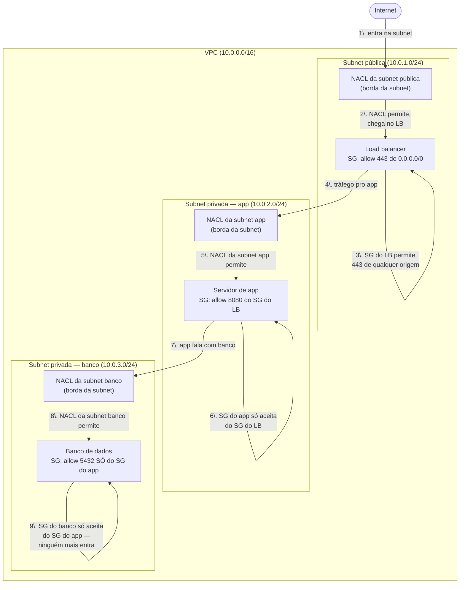
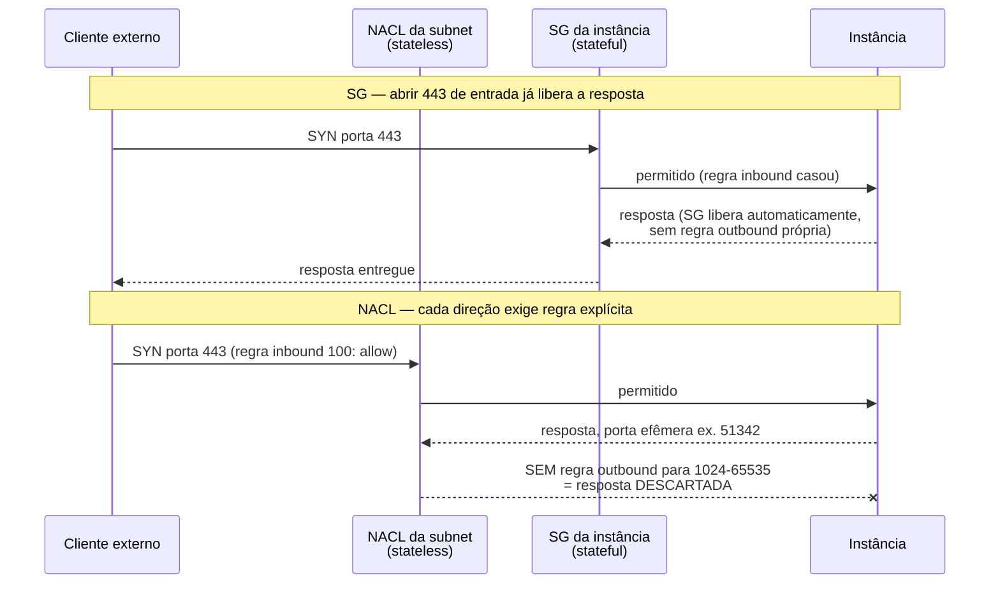
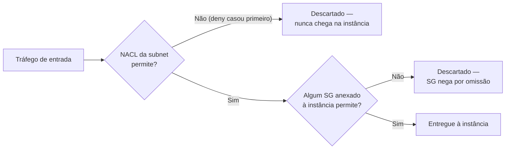

# Security groups e NACLs

> [!abstract] TL;DR
> Rota certa não é a mesma coisa que acesso controlado. A nota anterior desta trilha resolveu *quem consegue alcançar a internet* — mas uma instância de banco de dados numa subnet privada, com roteamento perfeito, ainda aceitaria conexão de qualquer máquina dentro da própria VPC se nada além da rota estivesse protegendo-a. A AWS resolve isso com duas camadas de firewall distintas, e a confusão entre elas é a pergunta mais repetida de qualquer entrevista de cloud. O **security group (SG)** opera no nível da instância (ENI), é **stateful** — permite tráfego de resposta automaticamente, sem regra explícita — e só sabe **permitir** (allow); nunca nega. A **Network ACL (NACL)** opera no nível da subnet inteira, é **stateless** — cada direção do tráfego precisa de regra própria, inclusive a resposta — e sabe tanto permitir quanto **negar** (deny), avaliando regras numeradas em ordem crescente até achar a primeira que casa. Uma requisição de entrada passa pela NACL da subnet primeiro, depois pelo SG da instância. DigitalOcean tem **Cloud Firewalls** — stateful, por tag ou por Droplet, o equivalente direto ao SG — mas não tem um recurso de NACL de subnet.

## O problema: a rota certa não basta

Retomando o cenário da nota anterior: uma instância de aplicação, numa subnet privada, agora consegue sair para a internet através do NAT Gateway sem nunca ser alcançável de fora. Adicione a essa VPC um banco de dados, também numa subnet privada, que a aplicação precisa consultar. O roteamento entre as duas subnets já funciona — dentro de uma mesma VPC, a rota `local` conecta todas as subnets automaticamente, sem precisar de gateway nenhum. E é exatamente aí que mora o problema: se a única coisa protegendo o banco fosse "estar numa subnet privada", **qualquer outra instância dentro da mesma VPC** — um servidor de teste esquecido, uma instância comprometida por outro vetor, um script de outro time rodando na subnet errada — conseguiria abrir uma conexão TCP na porta 5432 e tentar autenticar.

Isolamento de rota (subnet privada, sem rota para o IGW) responde à pergunta "quem pode alcançar a internet a partir daqui". Mas não responde a uma pergunta diferente e igualmente crítica: **"de todo o tráfego que já consegue chegar tecnicamente até aqui, o que especificamente deveria ser aceito?"** Essa segunda pergunta — porta, protocolo, origem exata — é resolvida por controle de acesso, não por roteamento. É útil já separar aqui o vocabulário: o conceito geral de "múltiplas camadas de defesa independentes, cada uma cobrindo a falha da anterior" é chamado de defesa em profundidade, e cruza toda arquitetura de sistemas — não é exclusivo de rede (ver `[[03-Dominios/Engenharia/Arquitetura/index]]` para a lente mais ampla). Esta nota foca na encarnação concreta que a VPC oferece: duas camadas de firewall, cada uma com um modelo de avaliação diferente, e é fácil aplicar mal exatamente porque elas *parecem* redundantes à primeira vista.

A meta concreta do cenário: o banco de dados deve aceitar conexão na porta 5432 **só** do servidor de aplicação — nem da instância de teste, nem de qualquer outra máquina da VPC, nem, é claro, da internet. Duas peças resolvem isso, em duas camadas diferentes da pilha, e vale adiantar por que duas peças, e não uma só: a AWS não escolheu ter dois mecanismos por acidente histórico — cada um cobre um raio de falha que o outro não cobre sozinho. Um firewall só de instância (o SG) protege bem contra origem errada, mas depende de alguém configurar cada instância corretamente, uma a uma. Um firewall só de subnet (a NACL) protege toda uma zona da rede de uma vez, mas é grosseiro demais para expressar "só essa aplicação específica, entre dezenas na mesma subnet". Juntos, cobrem o espaço inteiro: granularidade fina onde importa, rede de segurança grossa onde a granularidade fina falhar por engano humano.

## As duas camadas: onde cada firewall vive



Repare na ordem numerada do diagrama: **toda requisição atravessa a NACL da subnet de destino antes de chegar ao security group da instância**. São camadas sequenciais, não alternativas — e é precisamente por operarem em níveis diferentes (subnet vs. instância) que uma não substitui a outra. Uma instância mal configurada com um SG aberto demais ainda está protegida se a NACL da subnet for restritiva; uma NACL mal configurada ainda deixa o SG da instância como última linha de defesa.

## Security group: stateful, allow-only, avaliado como conjunto

Um **security group** age como um firewall virtual anexado a uma ou mais interfaces de rede (ENIs) — na prática, a uma ou mais instâncias. Três propriedades definem seu comportamento, e vale gravá-las juntas porque a entrevista sempre cobra as três:

**1. Só permite (allow-only).** Segundo a documentação oficial da AWS: "You can specify allow rules, but not deny rules." Não existe a opção de escrever uma regra de SG que bloqueia algo explicitamente — só existem regras que abrem uma porta específica para uma origem específica. Se nenhuma regra cobre um tráfego, o resultado é negação por omissão, nunca por uma regra de deny que alguém escreveu.

**2. Stateful.** A própria AWS é direta: "Security groups are stateful, which means that information about previously sent or received traffic is saved. If, for example, a security group allows inbound traffic to an EC2 instance, responses are automatically allowed regardless of outbound security group rules." Na prática, isso significa: se você abre a porta 443 de entrada, a resposta daquela conexão específica sai automaticamente — não é preciso (nem faz sentido) escrever uma regra de saída espelhada. O SG rastreia a conexão como uma unidade; a direção de retorno herda a permissão da direção de ida.

**3. Avaliado como conjunto, sem ordem.** Diferente de firewalls tradicionais baseados em lista sequencial, um SG não tem "primeira regra que casa vence" — todas as regras de todos os SGs associados a uma instância são agregadas, e o tráfego é permitido se **qualquer** regra, de **qualquer** SG anexado, o cobrir. Não existe prioridade entre regras dentro de um SG nem entre múltiplos SGs na mesma instância.

Quando você cria um SG novo pela CLI, o padrão é assimétrico — e essa assimetria surpreende quem espera "tudo bloqueado por padrão" nas duas direções:

```bash
$ aws ec2 create-security-group \
    --group-name db-sg \
    --description "SG do banco de dados" \
    --vpc-id vpc-0123456789abcdef0
{
    "GroupId": "sg-0db1234567890abcd"
}
```

Segundo a documentação oficial: "When you first create a security group, it has no inbound rules. Therefore, no inbound traffic is allowed until you add inbound rules to the security group. When you first create a security group, it has an outbound rule that allows all outbound traffic from the resource." Ou seja: **nenhuma entrada é aceita até você abrir uma regra**, mas **toda saída já é aceita desde a criação** — a menos que você remova essa regra padrão manualmente.

> [!tip] Assista: Master AWS Security — Security Groups & NACLs Deep Dive
> **Canal:** DheerajTechInsight | **Duração:** ~23min | **Idioma:** EN
>
> Cobre exatamente a dupla stateful/allow-only do SG contra a dupla stateless/allow-e-deny da NACL, com o mesmo exemplo mental desta nota — três instâncias na mesma subnet reagindo diferente a um SG (por instância) versus igual a uma NACL (por subnet inteira). Trecho de destaque [02:11]: *"security groups are stateful which means if you allow inbound traffic say an HTTP request on port 80 the response traffic is automatically allowed back out even if you haven't written an explicit outbound rule (...) security group only allows traffic, they don't have any deny rules."*
>
> 🎬 [Assistir no YouTube](https://www.youtube.com/watch?v=eAFu5RxruhY)

## O padrão sério: SG referenciando outro SG

A forma ingênua de resolver o cenário de abertura seria escrever uma regra no SG do banco liberando o **IP privado** do servidor de aplicação. Funciona até o dia em que a instância de aplicação é substituída — auto scaling, deploy, falha de hardware — e recebe um IP privado novo, quebrando silenciosamente o acesso ou (pior) exigindo que alguém edite a regra manualmente toda vez.

O padrão correto é diferente: em vez de referenciar um IP, a regra do SG do banco referencia **o SG do servidor de aplicação inteiro** como origem. Qualquer instância que tiver aquele SG anexado — não importa o IP, não importa quantas réplicas o auto scaling group crie ou destrua — está automaticamente autorizada:

```bash
$ aws ec2 authorize-security-group-ingress \
    --group-id sg-0db1234567890abcd \
    --protocol tcp \
    --port 5432 \
    --source-group sg-0app9876543210fed
{
    "Return": true,
    "SecurityGroupRules": [
        {
            "SecurityGroupRuleId": "sgr-01f4be99110f638a7",
            "GroupId": "sg-0db1234567890abcd",
            "IsEgress": false,
            "IpProtocol": "tcp",
            "FromPort": 5432,
            "ToPort": 5432,
            "ReferencedGroupInfo": {
                "GroupId": "sg-0app9876543210fed"
            }
        }
    ]
}
```

A documentação oficial nomeia esse mecanismo como **security group referencing** e é explícita sobre o que acontece por trás: "the EC2 instances associated with a security group can receive inbound traffic from the private IP addresses from the network interfaces for the EC2 instances associated with the referenced security group" — a AWS resolve, em tempo real, quais IPs privados estão atrás do `sg-0app...` a cada avaliação, sem que ninguém precise manter essa lista manualmente. Duas condições precisam valer para essa referência funcionar: os dois SGs estarem na mesma VPC, ou existir peering (ou Transit Gateway, para regras inbound) entre as VPCs dos dois. Vale registrar também uma nuance documentada: nenhuma regra do SG referenciado é "copiada" para o SG que o referencia — é só uma checagem de pertencimento, avaliada a cada pacote.

O mesmo padrão, generalizado para as três camadas do cenário de abertura:

```bash
# SG do load balancer: aceita HTTPS de qualquer lugar da internet
$ aws ec2 authorize-security-group-ingress \
    --group-id sg-0lb0000000000001 \
    --protocol tcp --port 443 --cidr 0.0.0.0/0

# SG do app: aceita 8080 SÓ do SG do load balancer
$ aws ec2 authorize-security-group-ingress \
    --group-id sg-0app9876543210fed \
    --protocol tcp --port 8080 --source-group sg-0lb0000000000001

# SG do banco: aceita 5432 SÓ do SG do app — nunca do LB, nunca da internet
$ aws ec2 authorize-security-group-ingress \
    --group-id sg-0db1234567890abcd \
    --protocol tcp --port 5432 --source-group sg-0app9876543210fed
```

Nenhuma dessas três regras menciona um IP. Cada camada só conhece a identidade (o SG) da camada imediatamente anterior — exatamente o "cavalo de batalha" de controle de acesso que qualquer arquitetura séria de VPC usa por padrão, não como refinamento posterior.

### Auditar e revogar: o SG como documento vivo

Um SG não é configurado uma vez e esquecido — ele acumula regras ao longo do tempo, e parte do trabalho sério é revisar periodicamente o que ainda faz sentido. `describe-security-groups` lista as regras vigentes de um grupo, e é o primeiro comando a rodar antes de decidir revogar algo:

```bash
$ aws ec2 describe-security-groups --group-ids sg-0db1234567890abcd \
    --query 'SecurityGroups[].IpPermissions'
[
    [
        {
            "IpProtocol": "tcp",
            "FromPort": 5432,
            "ToPort": 5432,
            "UserIdGroupPairs": [
                {"GroupId": "sg-0app9876543210fed"}
            ]
        }
    ]
]
```

E revogar uma regra que não faz mais sentido — por exemplo, depois de decompor um monólito em dois serviços separados e o SG antigo ter ficado com acesso amplo demais — usa o comando espelho de `authorize`:

```bash
$ aws ec2 revoke-security-group-ingress \
    --group-id sg-0db1234567890abcd \
    --protocol tcp --port 5432 --source-group sg-0app-antigo0000000
```

A própria documentação da AWS nomeia esse acúmulo de regras esquecidas como **stale security group rules** — regras que referenciam um SG de uma VPC peered que já foi removida, por exemplo — e recomenda revisão periódica exatamente por isso: um SG é, na prática, um documento vivo, não uma configuração que se escreve uma vez.

## Network ACL: stateless, allow e deny, avaliada por número

Uma **Network ACL** controla tráfego na fronteira da subnet, não da instância. Toda subnet de uma VPC está associada a exatamente uma NACL — se você não escolher uma explicitamente, a subnet herda a NACL default da VPC. As diferenças estruturais em relação ao SG são as três que mais importam:

**1. Permite e nega.** Uma regra de NACL tem um `rule-action` que pode ser `allow` ou `deny` — a peça que o SG simplesmente não tem.

**2. Stateless.** A documentação é direta, no mesmo parágrafo que descreve o SG, para deixar o contraste explícito: "NACLs are stateless, which means that information about previously sent or received traffic is not saved. If, for example, you create a NACL rule to allow specific inbound traffic to a subnet, responses to that traffic are not automatically allowed." Permitir a entrada não permite a saída da resposta — as duas direções precisam de regra própria, sempre.

**3. Avaliada por número, em ordem, primeira que casa vence.** Cada regra tem um número de 1 a 32766, e a AWS documenta o algoritmo com precisão: "We evaluate the rules in order, starting with the lowest numbered rule, when deciding whether allow or deny traffic. If the traffic matches a rule, the rule is applied and we do not evaluate any additional rules." Isso é o oposto do SG: aqui, ordem importa, e a primeira regra que casar — allow ou deny — decide, sem olhar as regras seguintes.



## A pegadinha nº 1: portas efêmeras (ephemeral ports)

O segundo sequenceDiagram acima mostra a armadilha central desta nota. Quando um cliente abre uma conexão TCP para a porta 443 de um servidor, o cliente **não** usa a porta 443 como sua própria porta de origem — ele usa uma porta temporária de alto número, escolhida pelo próprio sistema operacional a cada conexão nova, chamada porta efêmera. A resposta do servidor volta endereçada a essa porta efêmera específica, não à 443.

Como a NACL é stateless, ela não sabe que aquela porta efêmera de destino é "a resposta legítima de uma conexão que ela mesma deixou entrar" — ela só vê um pacote de saída com porta de destino alta e o avalia contra as regras outbound como qualquer outro tráfego novo. Sem uma regra outbound liberando a faixa de portas efêmeras, a resposta é silenciosamente descartada — e o sintoma, do lado do cliente, é indistinguível de "o servidor não responde", mesmo que o servidor tenha processado a requisição perfeitamente.

A própria documentação oficial da AWS, no exemplo canônico de NACL, mostra a regra outbound exigida para isso funcionar — repare que ela não menciona a porta 443 em nenhum lugar, só a faixa efêmera:

```bash
$ aws ec2 create-network-acl-entry \
    --network-acl-id acl-0aaa1111bbb222ccc \
    --ingress \
    --rule-number 100 \
    --protocol tcp \
    --port-range From=443,To=443 \
    --cidr-block 0.0.0.0/0 \
    --rule-action allow

$ aws ec2 create-network-acl-entry \
    --network-acl-id acl-0aaa1111bbb222ccc \
    --egress \
    --rule-number 100 \
    --protocol tcp \
    --port-range From=1024,To=65535 \
    --cidr-block 0.0.0.0/0 \
    --rule-action allow
```

O exemplo oficial da documentação usa exatamente essa faixa — `1024-65535` — como a regra outbound "Allows outbound responses to the remote computer", ao lado do comentário explícito "Network ACLs are stateless. Therefore, you must include a rule that allows responses to the inbound traffic." Times que migram de um mundo só-SG para NACL customizada esquecem essa regra com frequência suficiente para ser, de longe, a causa nº 1 de "abri a porta certa e mesmo assim não conecta".

## Default (allow-all) vs. custom (deny-all): a NACL nasce diferente do SG

A NACL **default** de uma VPC — a que vem pronta, associada a toda subnet que você não move explicitamente — tem um comportamento inicial oposto ao de uma NACL **custom** criada do zero, e é fácil confundir os dois:

```bash
# Criar uma NACL custom — nasce SEM regras numeradas, só a regra
# implícita de número "*" que nega tudo por padrão
$ aws ec2 create-network-acl --vpc-id vpc-0123456789abcdef0
{
    "NetworkAcl": {
        "NetworkAclId": "acl-0custom111222333",
        "VpcId": "vpc-0123456789abcdef0",
        "IsDefault": false,
        "Entries": [
            {"RuleNumber": 32767, "Protocol": "-1", "RuleAction": "deny", "Egress": true,  "CidrBlock": "0.0.0.0/0"},
            {"RuleNumber": 32767, "Protocol": "-1", "RuleAction": "deny", "Egress": false, "CidrBlock": "0.0.0.0/0"}
        ]
    }
}
```

Uma NACL custom recém-criada já vem com uma regra de número "\*" (32767, invisível na maioria das visualizações) que nega tudo — porque a documentação garante que "if a packet doesn't match any of the other numbered rules, it's denied." Até você adicionar uma regra explícita de `allow`, **nenhum tráfego atravessa** — o padrão é fail-closed. Já a NACL default, criada automaticamente com a VPC, vem pré-populada com uma regra numerada (100) que permite tudo, em ambas as direções, além da mesma regra "\*" de deny por trás dela:

| Regra | Tipo | Protocolo | Portas | Origem/Destino | Ação |
|---|---|---|---|---|---|
| 100 (inbound, default) | Todo tráfego IPv4 | Todos | Todas | 0.0.0.0/0 | ALLOW |
| \* (inbound, default) | Todo tráfego IPv4 | Todos | Todas | 0.0.0.0/0 | DENY |
| 100 (outbound, default) | Todo tráfego IPv4 | Todos | Todas | 0.0.0.0/0 | ALLOW |
| \* (outbound, default) | Todo tráfego IPv4 | Todos | Todas | 0.0.0.0/0 | DENY |

Ou seja: **a NACL default é fail-open** (tudo passa até você negar algo explicitamente), e **a NACL custom é fail-closed** (nada passa até você permitir algo explicitamente) — o inverso exato um do outro, e o oposto do que a intuição "custom deveria ser mais permissiva, é a que eu configurei" sugere.

Para que essa NACL custom passe a proteger a subnet do banco, falta o passo final: associá-la à subnet, substituindo a associação com a NACL default que a subnet carregava até então. A própria API nomeia essa troca como "replace", porque uma subnet nunca fica sem NACL — ela só troca de uma para outra:

```bash
$ aws ec2 describe-network-acls \
    --filters "Name=association.subnet-id,Values=subnet-0ddd3333eee444fff" \
    --query 'NetworkAcls[].Associations'
[
    [{"NetworkAclAssociationId": "aclassoc-0a1b2c3d4e5f6g7h8", "NetworkAclId": "acl-0default00000001"}]
]

$ aws ec2 replace-network-acl-association \
    --association-id aclassoc-0a1b2c3d4e5f6g7h8 \
    --network-acl-id acl-0custom111222333
```

## Security group vs. Network ACL: a tabela que fecha a diferença

| Característica | Security Group | Network ACL |
|---|---|---|
| Nível de operação | Instância / ENI | Subnet inteira |
| Escopo de aplicação | Só as instâncias associadas ao SG | Todas as instâncias da subnet, sem exceção |
| Tipo de regra | Só allow | Allow e deny |
| Avaliação | Todas as regras de todos os SGs agregadas, sem ordem | Numeradas, avaliadas em ordem crescente, primeira que casa vence |
| Stateful/stateless | Stateful — resposta liberada automaticamente | Stateless — cada direção exige regra própria (inclui portas efêmeras) |
| Origem/destino aceito | CIDR, prefix list, **outro SG** (SG-to-SG) | Só CIDR (IPv4/IPv6) |
| Default ao criar | Sem inbound (deny implícito) + outbound allow-all | Custom: deny-all até abrir regra. Default (da VPC): allow-all |
| Papel típico | Cavalo de batalha — regra fina, granular, por serviço | Guarda-corpo grosso de subnet, camada de backup |
| Onde é criada a proteção | Por serviço/camada (LB, app, banco) | Por rede/ambiente (subnet pública, privada) |

## Ordem de avaliação: primeiro a NACL, depois o SG

Vale nomear com precisão, porque a ordem importa para diagnosticar problema de conectividade: **uma requisição de entrada atravessa a NACL da subnet de destino antes de chegar ao security group da instância**; a resposta de saída atravessa o SG primeiro (que já libera automaticamente, por ser stateful) e depois a NACL — que, sendo stateless, precisa de uma regra outbound própria para deixar passar. Por isso o primeiro comando a rodar, ao investigar "não conecto nessa instância", é sempre checar a NACL da subnet antes de sequer olhar o SG — é a camada mais externa, e uma regra de deny lá invalida qualquer coisa que o SG permita depois.



Listar todas as NACLs de uma VPC de uma vez, com suas associações de subnet, é o comando que costuma resolver esse diagnóstico em segundos — antes de sequer olhar as regras de SG:

```bash
$ aws ec2 describe-network-acls \
    --filters "Name=vpc-id,Values=vpc-0123456789abcdef0" \
    --query 'NetworkAcls[].{Id:NetworkAclId,Default:IsDefault,Subnets:Associations[].SubnetId}'
[
    {"Id": "acl-0default00000001", "Default": true,  "Subnets": ["subnet-0aaa1111bbb222ccc"]},
    {"Id": "acl-0custom111222333", "Default": false, "Subnets": ["subnet-0ddd3333eee444fff"]}
]
```

## Quando usar cada um

O SG é o cavalo de batalha do dia a dia: granular, por serviço, sem precisar pensar em ordem de regras, e o único dos dois capaz de referenciar outro grupo em vez de um IP. A grande maioria das decisões de "quem pode falar com quem" numa VPC bem desenhada vive só no SG — é ali que a distinção entre camada de LB, camada de app e camada de banco se expressa, regra a regra, sem nunca precisar tocar na NACL. A NACL entra como uma segunda camada, deliberadamente mais grosseira, para dois casos que o SG não cobre bem sozinho:

- **Bloquear explicitamente um IP ou faixa conhecida como maliciosa.** O SG não tem `deny` — se você quer negar algo especificamente (em vez de simplesmente não permitir), isso *tem* que ser uma regra de NACL.
- **Servir de rede de segurança para uma subnet inteira**, independentemente de qual SG cada instância ali carrega — útil justamente quando alguém, um dia, vai configurar um SG errado, e você quer uma segunda barreira que não dependa da mesma pessoa acertar duas vezes.

Na prática, a maioria das VPCs de produção mantém a NACL default (allow-all) inalterada em subnets internas de baixo risco, e só investe em NACL customizada nas subnets de borda — a pública, voltada para a internet — ou em ambientes com exigência regulatória explícita de defesa em camadas auditável. Customizar toda NACL de toda subnet "porque é mais seguro", sem uma dessas duas justificativas, tende a só multiplicar a superfície de erro (esquecer a porta efêmera, esquecer uma direção) sem reduzir de fato o risco que o SG já cobre.

## Lente dupla honesta: DigitalOcean Cloud Firewalls

A DigitalOcean tem um equivalente direto ao security group: o **Cloud Firewall**. Segundo a documentação oficial, "DigitalOcean Cloud Firewalls are a network-based, stateful firewall service" — stateful, como o SG da AWS, e aplicável a Droplets tanto "by name or by tag", o que cobre o mesmo caso de uso de "todas as instâncias de um papel específico" que um SG cobre ao ser anexado a várias instâncias.

```bash
$ doctl compute firewall create \
    --name "db-firewall" \
    --inbound-rules "protocol:tcp,ports:5432,tag:app-servers" \
    --outbound-rules "protocol:tcp,ports:0,address:0.0.0.0/0,address:::/0" \
    --tag-names "db-servers"
```

Repare na regra inbound: em vez de referenciar um SG (como `--source-group` na AWS), o Cloud Firewall referencia uma **tag** de Droplet — `tag:app-servers` — para autorizar qualquer Droplet com aquela tag, sem hardcodar IP, exatamente o mesmo espírito do SG-to-SG referencing da AWS, só que via tag em vez de ID de grupo.

Auditar as regras vigentes de um Cloud Firewall é igualmente direto — o comando devolve a mesma estrutura de regras de entrada e saída usada na criação, útil antes de decidir revogar ou apertar algo:

```bash
$ doctl compute firewall get f8ef1e5f-0000-4a4b-9c1d-example --format Name,InboundRules,OutboundRules
Name           InboundRules                                   OutboundRules
db-firewall    protocol:tcp ports:5432 tag:app-servers         protocol:tcp ports:0 address:0.0.0.0/0,::/0
```

E adicionar uma regra a um Cloud Firewall já existente — o espelho do `authorize-security-group-ingress` da AWS — usa `firewall add-rules`, aceitando a mesma sintaxe de chave-valor da criação:

```bash
$ doctl compute firewall add-rules f8ef1e5f-0000-4a4b-9c1d-example \
    --inbound-rules "protocol:tcp,ports:5432,tag:app-servers-v2"
```

O que a DigitalOcean **não tem** é um equivalente de NACL de subnet. Não existe, na documentação verificada, um recurso de firewall stateless, numerado, avaliado em ordem, anexável a uma subnet inteira de uma VPC da DO — o Cloud Firewall é a única camada de controle de acesso de rede que a plataforma oferece, e ela opera no nível de Droplet/tag, não de subnet. Isso não é uma lacuna a esconder: é uma escolha consciente de simplicidade, coerente com o padrão já visto nas notas anteriores desta trilha (a DO tende a colapsar em um recurso só o que a AWS separa em duas camadas). Para quem vem de AWS, a tradução mental correta não é "falta a NACL, preciso simular"; é "a única camada de firewall de rede na DO é o equivalente ao SG — não existe uma segunda camada de subnet para configurar, nem para esquecer".

| Conceito | AWS | Azure | GCP | DigitalOcean |
|---|---|---|---|---|
| Firewall stateful de instância | Security Group | Network Security Group (NSG) | Regras de firewall VPC (stateful) | Cloud Firewall |
| Firewall stateless de subnet | Network ACL | NSG aplicado à subnet (mesmo recurso, outro nível) | — (sem NACL de subnet dedicada) | — (sem equivalente) |
| Referência por identidade em vez de IP | SG-to-SG (`--source-group`) | Application Security Group | Tags de rede / service account | Tag de Droplet |

> [!info] Caducidade
> Comportamento de SG (stateful, allow-only, avaliação agregada), NACL (stateless, allow/deny, avaliação numerada em ordem, default allow-all vs. custom deny-all) e faixa de portas efêmeras (exemplo oficial `1024-65535`) verificados na documentação oficial da AWS em 2026-07-23. Cloud Firewall da DigitalOcean como serviço stateful por tag/Droplet, sem equivalente de NACL de subnet, verificado na documentação oficial da DO na mesma data. Nomes de produto Azure/GCP são só tradução de vocabulário — não verificados com a mesma profundidade que AWS/DO nesta nota.

## Armadilhas comuns

> [!warning] Esquecer a regra outbound de portas efêmeras numa NACL customizada
> É o erro nº 1 de quem configura NACL pela primeira vez: abrir a porta 443 de entrada, esquecer a regra outbound para `1024-65535`, e gastar uma hora depurando "o servidor não responde" quando na verdade ele respondeu — a resposta só foi descartada silenciosamente na saída da subnet. Sempre que uma NACL customizada substituir a default, a checklist é dupla: abrir a porta de serviço de entrada **e** abrir a faixa efêmera de saída (e vice-versa, para conexões que a própria subnet inicia).

> [!warning] Achar que SG e NACL são redundantes e configurar só um
> É tentador, depois de entender que ambos controlam acesso, pensar "por que ter os dois". A resposta é: eles cobrem falhas diferentes. Um SG mal configurado (aberto demais por engano) ainda é contido por uma NACL restritiva na subnet; uma NACL default (allow-all) sozinha não protege nada sem um SG granular por trás. Tratar um como substituto do outro remove exatamente a redundância que a arquitetura de duas camadas foi desenhada para oferecer.

> [!warning] Referenciar IP em vez de SG num cenário que vai escalar
> Regras de SG que hardcodam o IP privado de uma instância específica quebram silenciosamente assim que essa instância é substituída — por auto scaling, deploy, ou simples falha de hardware. Sempre que a origem for "outra camada da própria arquitetura" (app falando com banco, LB falando com app), referenciar o SG da camada de origem, nunca o IP de uma instância individual.

## Casos práticos

**O banco de dados que só aceita conexão do servidor de aplicação.** Retomando o cenário de abertura: o SG do banco tem uma única regra inbound, na porta 5432, com `--source-group` apontando para o SG do servidor de aplicação. Nenhuma outra instância da VPC — mesmo estando na mesma subnet, mesmo tendo rota `local` perfeita até o banco — consegue abrir a conexão, porque nenhum SG anexado a ela casa com essa regra. A NACL da subnet do banco, como camada adicional, nega qualquer origem fora da faixa CIDR da subnet de aplicação, cobrindo o caso hipotético de um SG configurado errado no futuro.

**A NACL como rede de segurança contra erro humano no SG.** Um time de segurança, preocupado com o risco de alguém abrir acidentalmente `0.0.0.0/0` na porta 22 (SSH) de um SG, configura a NACL da subnet de produção para negar explicitamente a porta 22 de qualquer origem que não seja a faixa CIDR do escritório da empresa. Mesmo que um desenvolvedor sob pressão de prazo abra SSH para o mundo todo no SG de uma instância específica, a NACL barra o tráfego antes dele sequer chegar à instância — a documentação oficial descreve exatamente esse padrão como o caso de uso central de ter as duas camadas.

**A migração de uma arquitetura AWS para um piloto na DigitalOcean.** Um time acostumado a configurar SG e NACL separadamente, ao montar um ambiente de teste na DO, procura um recurso de "Network ACL" e não encontra — porque não existe. A tradução correta não é "falta uma camada de segurança", é "o Cloud Firewall da DO já cobre o papel do SG (stateful, por tag), e a plataforma optou por não oferecer uma segunda camada de subnet separada — a defesa em profundidade, aqui, precisa vir inteiramente de um Cloud Firewall bem desenhado, já que não há uma NACL para servir de rede de segurança adicional".

**A auditoria trimestral que revela um SG esquecido.** Um time de compliance, revisando trimestralmente todos os security groups de uma conta de produção, roda `describe-security-groups` em lote e encontra um SG anexado a nenhuma instância viva, com uma regra `0.0.0.0/0` na porta 3306 (MySQL) — sobra de um experimento de dois trimestres atrás que ninguém removeu. Nenhuma instância está exposta *hoje*, porque nada usa aquele SG, mas o risco existe: a próxima instância criada sem security group explícito, por engano de automação, herda o SG default da VPC — não esse órfão —, mas qualquer instância anexada a ele por engano futuro herdaria a exposição imediatamente. A auditoria periódica de SGs, sem uso associado a nenhuma ENI, é exatamente o tipo de higiene que a documentação de *stale rules* recomenda como rotina, não como reação a incidente.

## O que vem a seguir

Esta nota resolveu *quem pode falar com quem*, dentro da própria VPC, nas duas camadas de firewall que ela oferece. Mas ficou uma pergunta em aberto desde a nota anterior, quando VPC endpoints apareceram como um atalho para tráfego destinado a serviços da própria nuvem (S3, DynamoDB, SSM) sem passar pelo NAT Gateway: como uma instância privada acessa esses serviços gerenciados — ou até outra VPC inteira, ou uma rede on-premises — sem tráfego saindo pela internet pública e sem abrir mão do controle fino que security groups e NACLs acabaram de estabelecer? Essa é a pergunta de conectividade privada, o assunto da próxima nota desta trilha.

## Fontes

- [AWS VPC — Control traffic to your AWS resources using security groups](https://docs.aws.amazon.com/vpc/latest/userguide/vpc-security-groups.html) — definição de SG, stateful, escopo de instância; acessado em 2026-07-23.
- [AWS VPC — Security group rules](https://docs.aws.amazon.com/vpc/latest/userguide/security-group-rules.html) — allow-only, regras default (sem inbound, outbound allow-all), security group referencing (SG-to-SG); acessado em 2026-07-23.
- [AWS VPC — Default security groups for your VPCs](https://docs.aws.amazon.com/vpc/latest/userguide/default-security-group.html) — regra default do SG "default" (self-reference inbound, allow-all outbound); acessado em 2026-07-23.
- [AWS VPC — Control subnet traffic with network access control lists](https://docs.aws.amazon.com/vpc/latest/userguide/vpc-network-acls.html) — definição de NACL, stateless, avaliação numerada em ordem, contraste explícito com SG stateful; acessado em 2026-07-23.
- [AWS VPC — Default network ACL for a VPC](https://docs.aws.amazon.com/vpc/latest/userguide/default-network-acl.html) — tabela de regras default (100 allow + regra "\*" deny), comportamento allow-all da NACL default; acessado em 2026-07-23.
- [AWS VPC — Example: Control access to instances in a subnet](https://docs.aws.amazon.com/vpc/latest/userguide/nacl-examples.html) — exemplo oficial de regra outbound de portas efêmeras (1024-65535), tabela comparativa NACL vs. SG (nível, tipo de regra, avaliação, stateful/stateless); acessado em 2026-07-23.
- [AWS CLI — ec2 authorize-security-group-ingress (Command Reference)](https://docs.aws.amazon.com/cli/latest/reference/ec2/authorize-security-group-ingress.html) — sintaxe de `--source-group` para SG-to-SG referencing; acessado em 2026-07-23.
- [AWS CLI — ec2 create-network-acl (Command Reference)](https://docs.aws.amazon.com/cli/latest/reference/ec2/create-network-acl.html) — sintaxe de criação, regra implícita "\*" de deny numa NACL custom; acessado em 2026-07-23.
- [AWS CLI — ec2 create-network-acl-entry (Command Reference)](https://docs.aws.amazon.com/cli/latest/reference/ec2/create-network-acl-entry.html) — sintaxe de `--ingress`/`--egress`, `--rule-number`, `--rule-action`, `--port-range`; acessado em 2026-07-23.
- [DigitalOcean — Firewalls Overview](https://docs.digitalocean.com/products/networking/firewalls/) — Cloud Firewall como serviço stateful, aplicação por nome ou por tag de Droplet; acessado em 2026-07-23.
- [DigitalOcean — doctl compute firewall create (CLI Reference)](https://docs.digitalocean.com/reference/doctl/reference/compute/firewall/create/) — sintaxe de `--inbound-rules`/`--outbound-rules`/`--tag-names`/`--droplet-ids`; acessado em 2026-07-23.
