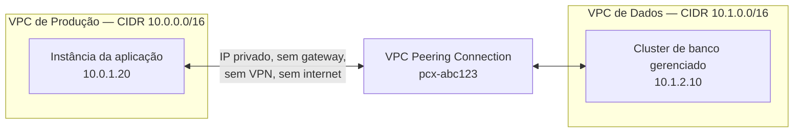
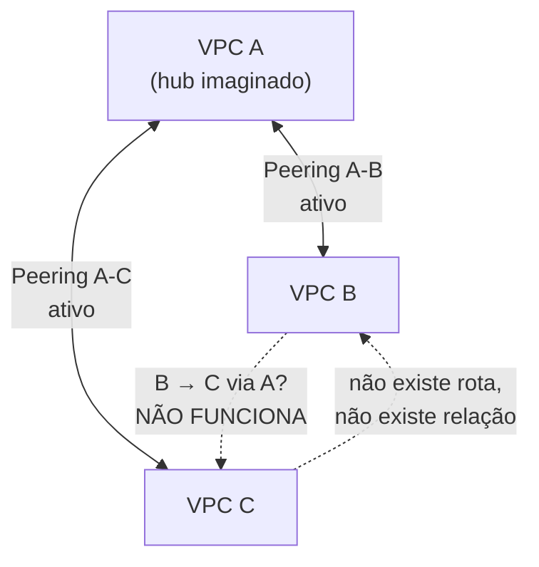
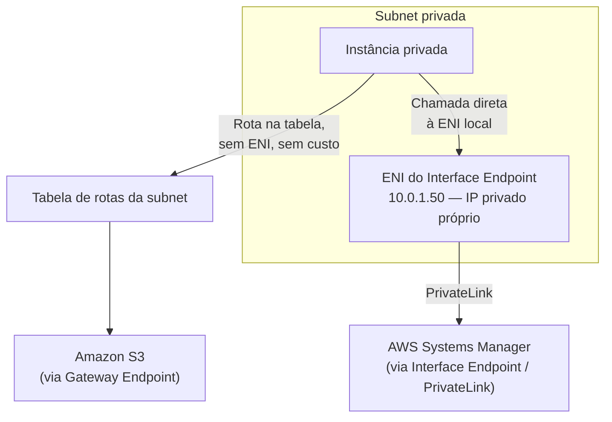
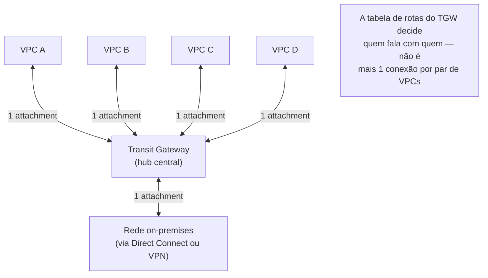

# Conectividade privada

> [!abstract] TL;DR
> Uma VPC isolada é segura, mas isolada demais — cedo ou tarde, duas redes precisam se falar sem passar pela internet pública. O **VPC peering** conecta duas VPCs par a par, na mesma conta ou entre contas, na mesma região ou entre regiões, mas exige CIDRs sem sobreposição e **não é transitivo**: se A fala com B e B fala com C, isso não dá a A o direito de falar com C — é a armadilha clássica que qualquer arquitetura com mais de duas VPCs tromba cedo. Para tráfego contra os próprios serviços gerenciados da AWS (S3, DynamoDB e dezenas de outros), existe um atalho mais barato que peering ou NAT: o **VPC endpoint**, em duas variantes — **Gateway endpoint**, uma entrada na tabela de rotas, grátis, só para S3 e DynamoDB; e **Interface endpoint**, uma ENI privada dentro da própria subnet, construída sobre o AWS PrivateLink, cobrando por hora e por GB, cobrindo a maioria dos demais serviços. Quando o número de VPCs cresce além de um punhado, a malha de peerings par a par vira um emaranhado combinatório — e o **Transit Gateway** resolve isso virando um hub central: cada VPC se conecta uma vez ao hub, e o hub roteia entre todas, resolvendo de fato a não-transitividade em escala. A DigitalOcean tem VPC peering **generally available**, inclusive cross-region, mas não tem um equivalente ao PrivateLink/VPC endpoint — nem ao Transit Gateway.

## O problema: duas VPCs que precisam se falar sem sair pra internet

Uma empresa organizou sua infraestrutura em duas VPCs separadas de propósito: uma VPC de **produção**, com as instâncias que servem tráfego real de usuários, e uma VPC de **dados**, com um cluster de banco gerenciado e um data warehouse, isolada num espaço de rede próprio porque o time de segurança exigiu que dados sensíveis não compartilhassem a mesma superfície de rede que a camada de aplicação pública. A separação faz sentido — é defesa em profundidade, o mesmo princípio que levou à separação entre subnet pública e privada nas notas 01 e 02 desta trilha, só que um nível acima, entre VPCs inteiras.

O problema apareceu na primeira sprint: a aplicação em produção precisa consultar o banco na VPC de dados, e o caminho mais rápido que alguém no time propôs foi expor o banco com um IP público e uma regra de firewall liberando só o IP da aplicação. Funciona, tecnicamente. Mas o tráfego entre duas VPCs da mesma empresa, na mesma nuvem, às vezes até na mesma região, sairia da rede privada da AWS, atravessaria a internet pública — mesmo que criptografado — e voltaria, só para dois recursos que estão logicamente a poucos metros um do outro segundo a topologia física da nuvem. É desperdício de latência, superfície de ataque desnecessária, e uma dependência de IP público que qualquer auditoria de segurança vai marcar em vermelho.

E o IP público do banco, uma vez atribuído, vira um alvo permanente: mesmo que a regra de firewall hoje só libere o IP da aplicação, esse IP muda quando a instância é recriada, e alguém, sob pressão de deploy, tende a ampliar a regra "temporariamente" para um range maior — o mesmo tipo de decisão apressada que a nota 02 desta trilha já apontou como risco de segurança, deferindo a discussão completa de security group para a próxima nota do galho. Nenhum desses riscos existe se o banco nunca tiver, para começo de conversa, um endereço alcançável da internet pública.

Um segundo problema, de natureza diferente, apareceu num contexto separado: uma instância na subnet privada de produção precisa gravar logs de auditoria num bucket S3, e o caminho padrão — a rota via NAT Gateway coberta na nota 03 — funciona, mas cobra por GB processado mesmo sendo tráfego que nunca sai, de fato, da rede da AWS. O NAT Gateway existe para tráfego que precisa mesmo alcançar a internet pública genérica; usá-lo para falar com outro serviço AWS é pagar um pedágio numa estrada feita para outro destino.

Os dois problemas têm uma raiz comum: **como conectar redes privadas — VPC a VPC, ou VPC a serviço gerenciado — sem que o tráfego precise, em algum momento, tocar a internet pública?** Esta nota cobre os três mecanismos que resolvem essa pergunta em escalas diferentes: peering para duas VPCs, VPC endpoints para acesso a serviço gerenciado, e Transit Gateway quando o número de VPCs cresce demais para peering par a par continuar sendo administrável.

## VPC peering: uma conexão de rede, não um gateway

Segundo a documentação oficial da AWS, uma **conexão de VPC peering** é uma conexão de rede entre duas VPCs que permite rotear tráfego entre elas usando endereços IPv4 ou IPv6 privados — instâncias em qualquer um dos dois lados passam a se enxergar como se estivessem na mesma rede. É essencial reter uma frase exata da documentação: peering **usa a infraestrutura já existente da VPC**; **não é um gateway nem uma conexão VPN**, não depende de nenhum hardware físico separado, e não tem ponto único de falha ou gargalo de banda.

Três características tornam peering flexível o bastante para cobrir a maioria dos cenários reais:

- **Mesma conta ou entre contas.** Duas VPCs da mesma conta AWS podem ser pareadas, mas também duas VPCs de contas diferentes — o cenário do exemplo de abertura, produção e dados como contas separadas por isolamento organizacional, seria coberto por peering entre contas sem problema.
- **Mesma região ou entre regiões (inter-Region).** Peering entre regiões diferentes existe e tem um detalhe que vale reter: todo o tráfego inter-Region é **criptografado antes de sair das instalações da AWS**, nunca atravessa a internet pública, e permanece sempre no backbone global da AWS.
- **Gratuito para criar.** Não há cobrança para estabelecer a conexão de peering em si. O que se paga é a transferência de dados: tráfego que fica dentro da mesma Availability Zone é gratuito mesmo entre contas diferentes; tráfego que cruza AZ ou Região tem cobrança de transferência de dados.



### O que uma conexão de peering exige, passo a passo

O fluxo de estabelecer um peering tem uma sequência fixa, e pular qualquer um dos passos deixa o peering "conectado" mas sem tráfego passando de fato — um erro comum de quem assume que aceitar o pedido já é suficiente:

1. O dono da **VPC requisitante** envia um pedido de peering ao dono da **VPC aceitante**.
2. O dono da VPC aceitante aceita o pedido, o que ativa a conexão — mas só ativa, não roteia nada ainda.
3. Cada lado precisa **adicionar manualmente uma rota** na própria tabela de rotas, apontando para o bloco CIDR do lado oposto, através do ID da conexão de peering (`pcx-...`) como destino.
4. Os security groups de cada lado precisam permitir o tráfego vindo do CIDR (ou do próprio security group, se ambos estiverem na mesma região) do lado oposto — sem isso, a rota existe mas o firewall barra.

```bash
# Passo 1 — dono da VPC de produção solicita o peering com a VPC de dados
aws ec2 create-vpc-peering-connection \
    --vpc-id vpc-0prod1234567890ab \
    --peer-vpc-id vpc-0dados9876543210cd \
    --peer-owner-id 111122223333

# Resposta traz o ID da conexão, em estado pending-acceptance
{
    "VpcPeeringConnection": {
        "VpcPeeringConnectionId": "pcx-0abc123def456789a",
        "Status": { "Code": "initiating-request" }
    }
}

# Passo 2 — dono da conta 111122223333 (VPC de dados) aceita o pedido
aws ec2 accept-vpc-peering-connection \
    --vpc-peering-connection-id pcx-0abc123def456789a

# Passo 3 — cada lado adiciona a rota que falta na própria tabela
aws ec2 create-route \
    --route-table-id rtb-0prodroutetable123 \
    --destination-cidr-block 10.1.0.0/16 \
    --vpc-peering-connection-id pcx-0abc123def456789a

aws ec2 create-route \
    --route-table-id rtb-0dadosroutetable456 \
    --destination-cidr-block 10.0.0.0/16 \
    --vpc-peering-connection-id pcx-0abc123def456789a
```

### A restrição de CIDR sobreposto

A documentação oficial é direta: **não é possível criar uma conexão de peering entre VPCs com blocos CIDR IPv4 ou IPv6 idênticos ou sobrepostos** — e isso vale mesmo que a VPC tenha múltiplos blocos CIDR associados e você pretenda usar só os que não se sobrepõem; a mera existência de um bloco conflitante em qualquer um dos lados bloqueia o peering inteiro. É por isso que planejar o espaço de endereçamento IP de toda a organização *antes* de criar a primeira VPC — o assunto da nota 01 desta trilha — paga dividendos anos depois: duas VPCs criadas com `10.0.0.0/16` cada uma, sem coordenação, simplesmente não podem ser pareadas sem primeiro re-endereçar uma delas, uma operação disruptiva que ninguém quer fazer depois que a VPC já está em produção com centenas de recursos dependendo daquele espaço de endereço.

### A pegadinha: peering não é transitivo

Aqui está a armadilha que praticamente toda arquitetura com três ou mais VPCs encontra pelo menos uma vez, e a documentação oficial da AWS é explícita sobre ela: **peering não suporta relações transitivas**. Se existe uma conexão de peering entre VPC A e VPC B, e outra entre VPC A e VPC C, **isso não permite rotear tráfego de VPC B para VPC C através de A**. Não existe relação de peering com nenhuma VPC que a sua não esteja diretamente pareada — para que B fale com C, é preciso criar uma **terceira** conexão de peering, dedicada, diretamente entre B e C.



O erro de raciocínio de quem tromba nisso pela primeira vez é tratar A como se fosse um roteador comum: "se A conhece B e A conhece C, A deveria conseguir passar tráfego entre os dois". Mas peering não cria um roteador — cria uma rota **ponto a ponto** entre exatamente duas VPCs, do jeito mais literal possível. A tabela de rotas de A tem uma entrada para B e uma entrada para C, mas nenhuma delas ensina a A como encaminhar pacotes *entre* B e C; A só sabe entregar pacotes que já chegam endereçados para si mesma ou repassar para o peering correto quando o destino bate exatamente com o CIDR daquele peering específico.

A própria documentação de "edge to edge routing" reforça o mesmo princípio em outro ângulo: se VPC A tem um internet gateway, um NAT device, uma conexão VPN, um Direct Connect, ou um gateway endpoint para S3, **VPC B não pode usar nenhum desses recursos de A como ponte** — cada um desses caminhos de saída é local à VPC que o possui, nunca repassável através de um peering. A regra é sempre a mesma: peering conecta duas redes diretamente; não transforma nenhuma das duas num hub para a terceira.

> [!tip] Assista: AWS VPC Peering — Avoid Network Design Pitfalls (Transitive Routing Explained)
> **Canal:** Network Ninja | **Duração:** ~11min | **Idioma:** EN
>
> Um diálogo curto que dramatiza exatamente essa armadilha — VPC A pareada com B e com C, sem que B e C consigam se falar através de A — e mostra a leitura da tabela de rotas confirmando que não existe entrada nenhuma apontando de B para C. Trecho de destaque [01:21]: *"here's the critical part that AWS documents explicitly: VPC peering connections are non-transitive. That means if you have VPC A peered with VPC B and VPC B peered with VPC C, there is no automatic routing path from VPC A to VPC C through VPC B."*
>
> 🎬 [Assistir no YouTube](https://www.youtube.com/watch?v=5CHAEnJVOsw)

## VPC endpoints, aprofundados: Gateway endpoint versus Interface endpoint

A nota 03 desta trilha já apresentou o VPC endpoint como o atalho que evita o NAT Gateway para tráfego contra serviços da própria AWS. Vale aprofundar a diferença entre as duas variantes, porque a escolha errada tem impacto direto de custo e de arquitetura.

Um **Gateway endpoint** funciona como uma entrada extra na tabela de rotas da subnet — o mesmo mecanismo, em espírito, da rota que aponta para um Internet Gateway ou NAT Gateway, só que o destino é o próprio serviço AWS. Está disponível **só para S3 e DynamoDB**, e a documentação oficial confirma: **não há cobrança adicional** para usá-lo. Um **Interface endpoint**, em contraste, cria uma **interface de rede elástica (ENI) dentro da própria subnet privada**, com um IP privado próprio — é construído sobre o **AWS PrivateLink**, cobre a maioria dos demais serviços (SSM, Kinesis, Secrets Manager, e dezenas de outros, incluindo serviços de terceiros publicados via PrivateLink), e cobra por hora por ENI por AZ (US$ 0,01/hora) mais por GB processado (US$ 0,01/GB na primeira faixa) — semelhante em espírito ao NAT Gateway, mas mais barato por byte e sem exigir subnet pública.



| Característica | Gateway endpoint | Interface endpoint (PrivateLink) |
|---|---|---|
| Serviços cobertos | Só S3 e DynamoDB | A maioria dos demais serviços AWS + serviços de terceiros publicados via PrivateLink |
| Mecanismo | Entrada na tabela de rotas | ENI privada dentro da subnet |
| Custo | Nenhum | ~US$ 0,01/hora por ENI/AZ + ~US$ 0,01/GB processado |
| Exige subnet pública? | Não | Não |
| DNS | Resolve para o endpoint público do serviço, redirecionado pela rota | Endpoint privado dedicado, resolução de DNS própria |
| Acessível de fora da VPC? | Não | Sim, inclusive on-premises via VPN/Direct Connect |

Comandos de criação seguem a mesma família (`create-vpc-endpoint`), variando o `--vpc-endpoint-type`:

```bash
# Gateway endpoint para S3 — associa a tabela de rotas da subnet privada
aws ec2 create-vpc-endpoint \
    --vpc-id vpc-0prod1234567890ab \
    --service-name com.amazonaws.us-east-1.s3 \
    --vpc-endpoint-type Gateway \
    --route-table-ids rtb-0prodroutetable123

# Interface endpoint para SSM — associa subnet(s) e security group(s)
aws ec2 create-vpc-endpoint \
    --vpc-id vpc-0prod1234567890ab \
    --service-name com.amazonaws.us-east-1.ssm \
    --vpc-endpoint-type Interface \
    --subnet-ids subnet-0privada11 \
    --security-group-ids sg-0endpointsg
```

> [!info] Fronteira
> A nota 03 desta trilha introduziu o VPC endpoint no contexto de evitar o NAT Gateway; esta seção aprofunda a mecânica e o custo. Segurança de porta/protocolo do tráfego que chega ao endpoint continua sendo assunto de security group — nota 04 desta trilha.

## Transit Gateway: resolvendo a não-transitividade em escala

Peering par a par funciona bem para duas, três, talvez cinco VPCs. Mas o número de conexões necessárias para conectar **todas com todas** cresce de forma combinatória — com *n* VPCs, uma malha completa exige *n*(*n*-1)/2 conexões de peering. Dez VPCs que precisam falar livremente entre si exigiriam 45 conexões de peering distintas, cada uma com sua própria rota manual dos dois lados e seu próprio security group ajustado. Isso não é só trabalhoso — é um modelo de dados que ninguém consegue auditar de cabeça depois de um certo tamanho.

O **AWS Transit Gateway** resolve isso invertendo a topologia: em vez de uma malha completa, cada VPC se conecta **uma única vez** a um hub central, e é o hub — não a VPC — quem sabe rotear entre todos os "raios" conectados a ele. Na definição oficial, é "um hub de trânsito de rede usado para interconectar VPCs e redes on-premises". O Transit Gateway tem seu próprio conceito de **tabela de rotas** — cada anexo (attachment: uma VPC, uma conexão VPN, um Direct Connect gateway) é associado a exatamente uma tabela de rotas do Transit Gateway, e essa tabela decide, dinamicamente, qual anexo é o próximo salto para cada destino.



Diferente de peering, onde o próprio dono da VPC precisa criar a rota estática apontando para o `pcx-...`, um attachment de VPC ao Transit Gateway ainda exige uma rota estática na tabela de rotas *da VPC* apontando para o TGW — mas a tabela de rotas *do TGW* é quem decide, centralizadamente, quais VPCs podem alcançar quais outras, sem precisar de uma conexão dedicada por par. Isso é o que resolve, em escala, exatamente o problema que a não-transitividade de peering deixa em aberto: com um Transit Gateway, VPC B e VPC C — que nunca poderiam se falar através de um hub de peering comum — passam a se falar naturalmente, porque a rota entre elas vive na tabela de rotas do TGW, não numa conexão de peering ponto a ponto.

> [!tip] Assista: Transit Gateway Explained
> **Canal:** AWS Bites | **Duração:** ~19min | **Idioma:** EN
>
> Nomeia explicitamente o conceito de "rede transitiva" que esta nota descreve — tráfego de uma VPC atravessando uma segunda até chegar numa terceira — e explica por que peering nunca resolveu isso e o Transit Gateway resolve de origem. Trecho de destaque [04:08]: *"what we mean by a transitive network is that where traffic in 1 VPC is going beyond a second VPC to a third VPC, so going through to autonomous networks (...) before Transit Gateway it was possible to implement transitive connections by creating a gateway with a [hub VPC]."*
>
> 🎬 [Assistir no YouTube](https://www.youtube.com/watch?v=ltlVFnYDq64)

A cobrança segue um modelo diferente de peering: há uma tarifa **por hora por anexo** e uma tarifa **por GB processado** no Transit Gateway — ao contrário do Gateway endpoint (grátis) e do peering (grátis para criar, só cobra transferência cross-AZ/Region), o Transit Gateway sempre tem custo de attachment mesmo sem tráfego algum passando.

O que torna o Transit Gateway mais do que "peering com um nome chique" é a variedade de coisas que ele aceita como anexo — não só VPCs:

| Tipo de attachment | O que conecta ao hub | Roteamento |
|---|---|---|
| VPC attachment | Uma VPC inteira, via subnet(s) escolhida(s) | Estático na VPC, dinâmico na tabela do TGW |
| VPN attachment | Uma conexão Site-to-Site VPN a uma rede on-premises | BGP entre o TGW e o roteador on-premises |
| Direct Connect gateway | Um circuito físico dedicado a uma rede on-premises | BGP, prefixos anunciados pelo roteador on-premises |
| Peering attachment | Outro Transit Gateway, inclusive de outra Região | Rota estática apontando para o attachment de peering |
| Connect attachment | Um appliance de rede SD-WAN de terceiros | Propagação automática de rotas |

Um VPC attachment sozinho já resolve o cenário desta nota; os demais tipos existem para quando a malha cresce além de "só VPCs da mesma nuvem" — por exemplo, uma rede on-premises que precisa alcançar dezenas de VPCs ao mesmo tempo, sem uma VPN dedicada para cada uma.

```bash
# Criar o Transit Gateway
aws ec2 create-transit-gateway \
    --description "hub central de producao"

# Anexar cada VPC ao hub — um attachment por VPC, não uma conexão por par
aws ec2 create-transit-gateway-vpc-attachment \
    --transit-gateway-id tgw-0abc123 \
    --vpc-id vpc-0prod1234567890ab \
    --subnet-ids subnet-0privada11

aws ec2 create-transit-gateway-vpc-attachment \
    --transit-gateway-id tgw-0abc123 \
    --vpc-id vpc-0dados9876543210cd \
    --subnet-ids subnet-0privada22

# Cada VPC ainda precisa de uma rota estática apontando pro TGW
aws ec2 create-route \
    --route-table-id rtb-0prodroutetable123 \
    --destination-cidr-block 10.1.0.0/16 \
    --transit-gateway-id tgw-0abc123
```

| Critério | VPC Peering | VPC Endpoint (Gateway/Interface) | Transit Gateway |
|---|---|---|---|
| Conecta o quê | Duas VPCs, ponto a ponto | Uma VPC a um serviço gerenciado AWS | Múltiplas VPCs/redes a um hub central |
| Transitivo? | Não — cada par precisa de conexão própria | N/A (não é peering) | Sim, na prática — o hub roteia entre todos os anexos |
| Escala bem para N VPCs? | Não — cresce combinatorialmente (n(n-1)/2) | N/A | Sim — cresce linearmente (1 anexo por VPC) |
| Custo | Grátis para criar; cobra cross-AZ/Region | Gateway: grátis. Interface: por hora + por GB | Por hora por anexo + por GB processado |
| Cross-account | Sim | N/A (endpoint vive dentro de uma VPC) | Sim, via Resource Access Manager |
| Cross-region | Sim (inter-Region peering) | Não | Sim (inter-Region peering entre TGWs) |

## Casos práticos

**Confirmar que o peering entre produção e dados está mesmo roteando.** Depois de criar e aceitar o peering do exemplo de abertura, o passo que mais gente pula é verificar se as duas rotas manuais foram de fato criadas — não basta o status da conexão estar `active`. `describe-vpc-peering-connections` mostra o estado da conexão em si; `describe-route-tables` confirma se a rota que aponta para o `pcx-...` realmente existe do lado que está sendo testado:

```bash
$ aws ec2 describe-vpc-peering-connections \
    --vpc-peering-connection-ids pcx-0abc123def456789a \
    --query 'VpcPeeringConnections[0].Status'
{
    "Code": "active",
    "Message": "Active"
}

$ aws ec2 describe-route-tables \
    --route-table-ids rtb-0prodroutetable123 \
    --query 'RouteTables[0].Routes[?VpcPeeringConnectionId==`pcx-0abc123def456789a`]'
[
    {
        "DestinationCidrBlock": "10.1.0.0/16",
        "VpcPeeringConnectionId": "pcx-0abc123def456789a",
        "State": "active"
    }
]
```

Se essa segunda consulta devolver uma lista vazia num dos dois lados, é exatamente o sintoma da primeira armadilha desta nota: conexão ativa, mas tráfego não passa naquela direção, porque falta a rota.

**Peerar duas VPCs de dois projetos DigitalOcean na mesma conta.** O fluxo equivalente na DO é mais curto porque não existe separação entre "pedir" e "aceitar" — dentro da mesma conta, o comando já cria a peering ativa:

```bash
$ doctl vpcs list --format ID,Name,IPRange,Region
ID                                      Name              IPRange           Region
f81d4fae-7dec-11d0-a765-00a0c91e6bf6    vpc-producao      10.20.0.0/20      nyc1
3f900b61-30d7-40d8-9711-8c5d6264b268    vpc-dados         10.30.0.0/20      nyc1

$ doctl vpcs peerings create prod-dados-peering \
    --vpc-ids f81d4fae-7dec-11d0-a765-00a0c91e6bf6,3f900b61-30d7-40d8-9711-8c5d6264b268 \
    --wait
Notice: Waiting for VPC Peering to be created
ID          Name                    Status    VPC IDs
pr-8f3a2c   prod-dados-peering      ACTIVE    f81d4fae...,3f900b61...
```

Repare que os dois CIDRs (`10.20.0.0/20` e `10.30.0.0/20`) não se sobrepõem — exatamente a mesma pré-condição que a AWS exige, só que verificada contra os ranges reservados de cada datacenter em vez de contra o CIDR de outra VPC específica.

**Verificar que o Transit Gateway realmente aprendeu as duas rotas.** Depois de anexar VPC de produção e VPC de dados ao mesmo TGW, `search-transit-gateway-routes` confirma se a tabela de rotas do hub já propagou o CIDR de cada VPC anexada — sem isso, os dois attachments existem, mas o hub ainda não sabe encaminhar tráfego entre eles:

```bash
$ aws ec2 search-transit-gateway-routes \
    --transit-gateway-route-table-id tgw-rtb-0default123 \
    --filters "Name=state,Values=active" \
    --query 'Routes[].{CIDR:DestinationCidrBlock,Attachment:TransitGatewayAttachments[0].ResourceId}'
[
    { "CIDR": "10.0.0.0/16", "Attachment": "vpc-0prod1234567890ab" },
    { "CIDR": "10.1.0.0/16", "Attachment": "vpc-0dados9876543210cd" }
]
```

Com as duas entradas presentes e no estado `active`, tráfego de produção alcança dados e vice-versa através do hub — sem nunca precisar de uma conexão de peering dedicada entre as duas.

## VPN e Direct Connect: a ponte pra rede híbrida, em uma frase

Vale nomear, sem aprofundar, os dois mecanismos que conectam uma VPC a uma rede **fora** da AWS — um data center corporativo, um escritório: a **AWS Site-to-Site VPN** cria um túnel criptografado sobre a internet pública entre a VPC e o gateway da rede on-premises, enquanto o **AWS Direct Connect** é uma conexão física dedicada, contratada com um provedor de telecom, que nunca toca a internet pública em nenhum trecho. Ambos aparecem como tipos de attachment válidos num Transit Gateway, exatamente como visto no diagrama acima — mas a decisão de qual dos dois usar, e a mecânica de configurá-los, pertence ao domínio de rede híbrida, fora do escopo desta nota.

| Mecanismo | Meio físico | Criptografado por padrão? | Quando escolher |
|---|---|---|---|
| Site-to-Site VPN | Túnel sobre a internet pública | Sim, IPsec | Setup rápido, tráfego moderado, orçamento menor |
| Direct Connect | Circuito físico dedicado via provedor de telecom | Não por padrão (a rede em si é privada) | Tráfego alto e constante, latência previsível, exigência de compliance |

## Lente dupla: VPC peering existe na DigitalOcean; PrivateLink e Transit Gateway, não

A DigitalOcean lançou **VPC Peering** primeiro em early access e, desde então, tornou o recurso **generally available (GA)** para todos os clientes — não é mais um recurso experimental. O anúncio oficial de GA descreve o recurso como uma forma de "conectar duas VPCs dentro da mesma região, permitindo comunicação privada sobre IPs privados", com suporte a peering **entre regiões** (multi-region) também disponível. Peering funciona com Droplets, bancos de dados gerenciados e clusters Kubernetes gerenciados (DOKS); Droplets criados depois de 2 de outubro de 2024 recebem a rota de peering automaticamente, os anteriores exigem atualização manual de rota — o mesmo tipo de passo manual que a AWS exige para toda conexão de peering, independente da data.

Há duas restrições importantes, e vale nomeá-las com precisão em vez de assumir paridade total com a AWS:

- **CIDR sobreposto continua proibido.** A documentação de limites é explícita: não é possível parear duas VPCs se o range de IP de uma conflita com o range reservado da outra — o mesmo princípio da AWS, adaptado ao vocabulário da DO.
- **Sem peering entre contas/times diferentes.** A DigitalOcean não suporta VPC peering entre contas de times (organizações) diferentes — só dentro da mesma conta. Isso é uma diferença real frente à AWS, que suporta peering cross-account nativamente desde sempre. Uma empresa que separa produção e dados em contas DO diferentes por isolamento organizacional **não pode** usar VPC peering para conectá-las hoje — precisaria manter tudo na mesma conta, ou recorrer a outro mecanismo (VPN, por exemplo).
- **BLR1 (Bangalore) é exceção regional.** Peering entre datacenters não está disponível nesse datacenter especificamente.

```bash
# AWS — peering exige dois passos (create + accept) e rotas manuais nos dois lados
$ aws ec2 create-vpc-peering-connection --vpc-id vpc-prod --peer-vpc-id vpc-dados
$ aws ec2 accept-vpc-peering-connection --vpc-peering-connection-id pcx-0abc123

# DigitalOcean — um único comando cria e a peering já ativa (mesma conta)
$ doctl vpcs peerings create prod-dados-peering \
    --vpc-ids f81d4fae-7dec-11d0-a765-00a0c91e6bf6,3f900b61-30d7-40d8-9711-8c5d6264b268

# Listar peerings existentes
$ doctl vpcs peerings list
ID          Name                    VPC IDs                                Status
pr-8f3a...  prod-dados-peering      f81d4fae...,3f900b61...                ACTIVE
```

Onde a paridade **não** existe é nos outros dois mecanismos desta nota. A DigitalOcean **não tem um equivalente ao AWS PrivateLink ou ao VPC endpoint**: bancos de dados gerenciados na DO são acessíveis via uma string de conexão privada dentro da própria VPC onde o cluster foi colocado, mas não existe um recurso separado, com o modelo de "Gateway endpoint grátis via rota" ou "Interface endpoint via ENI PrivateLink", que outros serviços da DO possam publicar como endpoint privado dedicado. Na prática, o "acesso privado a serviço gerenciado" da DO se resume a isto:

```bash
$ doctl databases connection meu-cluster-postgres --format Host,Port,Private
Host                                                Port    Private
private-meu-cluster-postgres-do-user-123.db.ondigitalocean.com    25060    true
```

Não existe um segundo recurso — como um Gateway endpoint separado da rota, ou uma ENI de Interface endpoint — para modelar esse acesso; é a própria string de conexão do banco, resolvendo para um endereço privado só porque o cliente está na mesma VPC. Funciona bem para o caso comum, mas não generaliza: não há como publicar um serviço próprio como endpoint privado consumível por outra VPC, do jeito que o PrivateLink permite na AWS.

E a DigitalOcean também **não tem um equivalente ao Transit Gateway** — não existe um hub-and-spoke gerenciado; ao crescer além de um punhado de VPCs, a única ferramenta disponível continua sendo peering par a par, com a mesma limitação combinatória que o Transit Gateway resolve na AWS.

Isso não é uma crítica gratuita — é a mesma filosofia de simplicidade sobre granularidade que a nota 04 da trilha de IAM já observou no modelo de credenciais da DigitalOcean: menos primitivos, cada um cobrindo mais terreno, ao custo de menos controle fino nos casos de escala maior.

| Conceito | AWS | Azure | GCP | DigitalOcean |
|---|---|---|---|---|
| Conectar duas redes privadas ponto a ponto | VPC Peering | VNet Peering | VPC Network Peering | VPC Peering (GA) |
| Endpoint privado para serviço gerenciado | VPC Endpoint / PrivateLink | Private Link | Private Service Connect | — (sem equivalente) |
| Hub-and-spoke gerenciado para múltiplas VPCs | Transit Gateway | Virtual WAN | Network Connectivity Center | — (sem equivalente) |
| Peering cross-account/cross-tenant | Sim | Sim (entre tenants) | Sim (entre projetos) | Não (só dentro da mesma conta/time) |
| Rede privada dedicada a on-premises | Direct Connect | ExpressRoute | Cloud Interconnect | Partner Network Connect (via Megaport) |

Vale a correção honesta aqui: a DigitalOcean **tem**, sim, uma via de circuito dedicado — o **Partner Network Connect**, que liga uma VPC da DO a uma rede on-premises ou a outro provedor de nuvem através de um parceiro de interconexão (Megaport), não como serviço nativo direto da DO. É uma diferença de forma, não de ausência total: a AWS opera o Direct Connect com seus próprios parceiros de conectividade sob o guarda-chuva do serviço, enquanto a DO expõe o parceiro (Megaport) como peça explícita do fluxo de configuração — criar o partner attachment na DO, depois configurar o Cloud Router e a interconexão do lado do Megaport.

> [!info] Caducidade
> Estado do VPC Peering da DigitalOcean (GA, cross-region, exceção BLR1, ausência de suporte cross-team) e preços de PrivateLink/Transit Gateway verificados em 2026-07-23. VPC peering foi lançado em early access pela DigitalOcean e evoluiu rápido — confira a documentação oficial antes de decidir, especialmente a lista de regiões e a política de cross-account, que são as áreas mais prováveis de mudar.

## Armadilhas comuns

> [!warning] Assumir que aceitar o peering já é suficiente
> Aceitar uma conexão de peering deixa o status como `active`, mas nenhum tráfego passa até que **ambos os lados** adicionem a rota estática na própria tabela de rotas apontando para o `pcx-...`. É comum um lado configurar a rota e o outro esquecer — o sintoma é tráfego funcionando numa direção e falhando silenciosamente na outra, porque a ausência de rota não gera erro explícito, só timeout.

> [!warning] Tentar resolver "peering triangular" com mais peering do mesmo tipo, em vez de Transit Gateway
> Times que descobrem a não-transitividade na prática, com três ou quatro VPCs, tendem a resolver criando mais uma conexão de peering para cada par que precisa se falar. Funciona até a quinta ou sexta VPC — depois disso, o número de conexões cresce mais rápido que a capacidade de qualquer time de auditar manualmente quem fala com quem. O sinal de que é hora de migrar para Transit Gateway não é um número mágico de VPCs; é o momento em que ninguém mais consegue desenhar o diagrama de peerings de cabeça.

> [!warning] Usar Interface endpoint (PrivateLink) para S3 ou DynamoDB por hábito
> Como a maioria dos serviços só tem Interface endpoint disponível, é comum configurar um Interface endpoint também para S3 ou DynamoDB por reflexo — mas os dois têm Gateway endpoint disponível, que é **gratuito**. Pagar por hora e por GB processado por um Interface endpoint quando o Gateway endpoint gratuito cobre exatamente o mesmo serviço é dinheiro deixado na mesa sem necessidade nenhuma.

> [!warning] Assumir que VPC peering na DigitalOcean cobre o mesmo terreno que na AWS
> É tentador ler "VPC Peering GA" e assumir paridade completa com a AWS, inclusive cross-account. Não existe: a DO não suporta peering entre contas de times diferentes, só dentro da mesma conta. Uma arquitetura que isola produção e dados em contas DO separadas por política organizacional não pode fechar essa conectividade com peering hoje — precisa reavaliar a separação de contas ou usar VPN entre elas.

## O que vem a seguir

Esta nota fechou o inventário dos mecanismos de conectividade privada: peering para duas VPCs, endpoints para serviço gerenciado, Transit Gateway para escala. Mas cada peça foi vista isoladamente — subnets e roteamento, gateways de entrada e saída, security groups e NACLs, e agora conectividade entre redes. A pergunta que fica é como todas essas peças se encaixam numa única arquitetura de rede, de ponta a ponta, para um sistema real com múltiplas camadas e múltiplos ambientes. É o assunto da última nota deste galho, o capstone de rede na nuvem.

## Fontes

- [AWS VPC Peering — What is VPC peering?](https://docs.aws.amazon.com/vpc/latest/peering/what-is-vpc-peering.html) — definição, peering cross-account e inter-Region, criptografia de tráfego inter-Region, pricing (grátis para criar, cobrança de transferência cross-AZ/Region); acessado em 2026-07-23.
- [AWS VPC Peering — Invalid peering configurations (non-transitive & overlapping CIDR)](https://docs.aws.amazon.com/vpc/latest/peering/invalid-peering-configurations.html) — proibição de CIDR sobreposto, não-transitividade explícita ("you can't route traffic from VPC B to VPC C through VPC A"), restrição de edge-to-edge routing; acessado em 2026-07-23.
- [AWS EC2 CLI — create-vpc-peering-connection](https://docs.aws.amazon.com/cli/latest/reference/ec2/create-vpc-peering-connection.html) — sintaxe `--vpc-id`/`--peer-vpc-id`/`--peer-owner-id`; acessado em 2026-07-23.
- [AWS EC2 CLI — accept-vpc-peering-connection](https://docs.aws.amazon.com/cli/latest/reference/ec2/accept-vpc-peering-connection.html) — sintaxe de aceitação; acessado em 2026-07-23.
- [AWS VPC PrivateLink — VPC endpoints concepts](https://docs.aws.amazon.com/vpc/latest/privatelink/vpc-endpoints.html) — distinção Gateway endpoint (S3/DynamoDB) vs Interface endpoint (PrivateLink, demais serviços); acessado em 2026-07-23.
- [AWS VPC PrivateLink — Gateway endpoints](https://docs.aws.amazon.com/vpc/latest/privatelink/gateway-endpoints.html) — confirmação de que Gateway endpoints não têm cobrança adicional; acessado em 2026-07-23.
- [AWS PrivateLink Pricing](https://aws.amazon.com/privatelink/pricing/) — tarifa de Interface endpoint (US$ 0,01/hora por ENI/AZ + US$ 0,01/GB); acessado em 2026-07-23.
- [AWS Transit Gateway — What is AWS Transit Gateway?](https://docs.aws.amazon.com/vpc/latest/tgw/what-is-transit-gateway.html) — definição de hub de trânsito, conceito de attachments/route tables/associations, pricing (por hora por anexo + por GB processado); acessado em 2026-07-23.
- [DigitalOcean — VPC Peering is Now Generally Available (GA)](https://www.digitalocean.com/blog/vpc-peering-ga) — anúncio de GA, suporte multi-region, restrições (sem suporte cross-team, exceção BLR1, custo cross-datacenter de US$ 0,01/GiB); acessado em 2026-07-23.
- [DigitalOcean — How to Create a VPC Peering](https://docs.digitalocean.com/products/networking/vpc/how-to/create-peering/) — funcionamento, compatibilidade com Droplets/bancos gerenciados/DOKS, exceção BLR1; acessado em 2026-07-23.
- [DigitalOcean — VPC Limits](https://docs.digitalocean.com/products/networking/vpc/details/limits/) — restrição de CIDR sobreposto contra ranges reservados, exceção BLR1 para peering entre datacenters; acessado em 2026-07-23.
- [DigitalOcean — doctl vpcs peerings create](https://docs.digitalocean.com/reference/doctl/reference/vpcs/peerings/create/) — sintaxe `--vpc-ids`, flag `--wait`; acessado em 2026-07-23.
- [DigitalOcean — How to Create a Partner Attachment](https://docs.digitalocean.com/products/networking/vpc/how-to/create-partner-attachment/) — Partner Network Connect via Megaport como via de circuito dedicado a on-premises/outra nuvem, ausência de serviço nativo direto equivalente ao Direct Connect; acessado em 2026-07-23.
