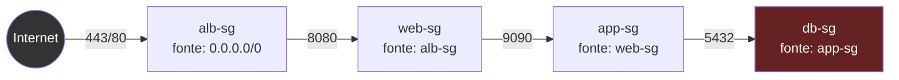
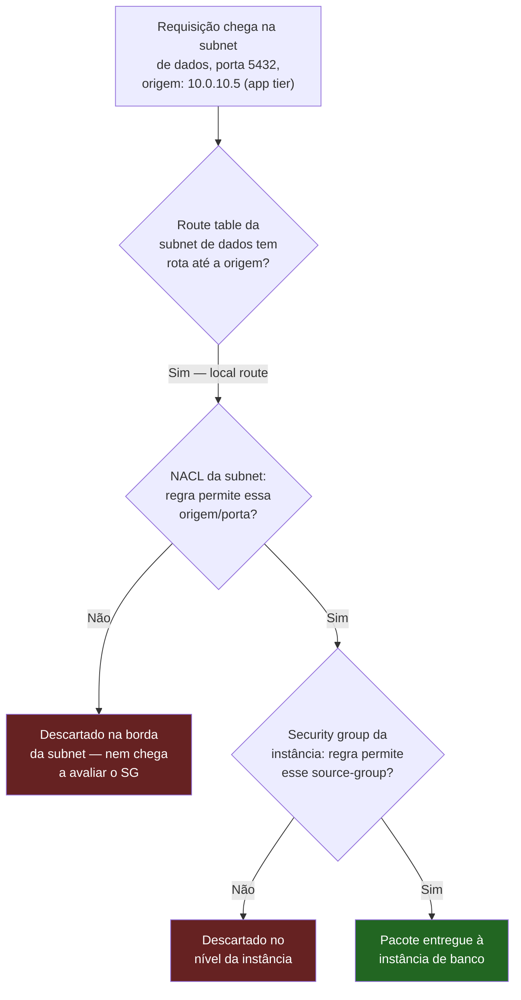
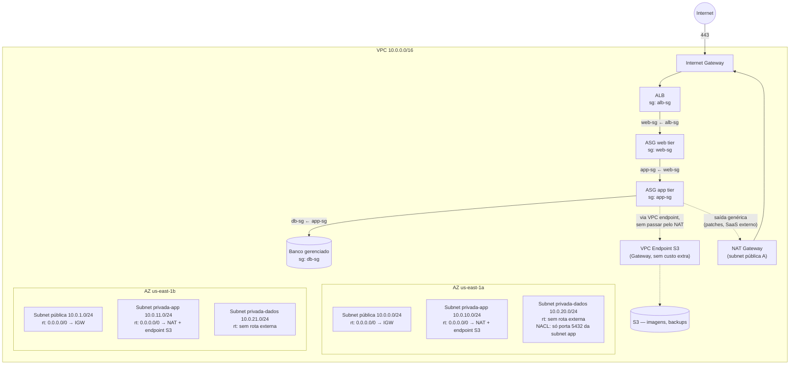

# Desenhando uma rede segura de ponta a ponta

> [!abstract] TL;DR
> As cinco notas anteriores deste galho deram, uma de cada vez, uma peça de rede isolada: a VPC e seu CIDR, a divisão em subnets públicas e privadas, os gateways que decidem quem entra e quem só sai, e — nas duas notas escritas em paralelo a esta — o firewall com e sem estado (security groups e NACLs) e a conectividade privada entre redes. Esta nota monta as seis peças numa única arquitetura de referência: a **rede three-tier**. Uma VPC com CIDR planejado se divide em subnets públicas (o load balancer) e privadas (aplicação e dados), espalhadas em pelo menos duas zonas de disponibilidade. Cada camada tem sua própria route table — pública aponta pro internet gateway, privada aponta pro NAT gateway, a de dados não aponta pra lugar nenhum fora da VPC. Por cima do roteamento, uma **cadeia de security groups** — cada camada só aceita tráfego do security group da camada imediatamente anterior, nunca de um CIDR aberto — e, por baixo de tudo, **NACLs** como um segundo veto independente, sem estado, na fronteira de cada subnet. O resultado não é "seguro porque tem firewall" — é seguro porque a mesma decisão (só a aplicação fala com o banco) está escrita três vezes, em três mecanismos que não compartilham a mesma falha: rota, regra com estado, regra sem estado. É **defesa em profundidade** de verdade, não o nome bonito que se dá a uma única camada.

## O problema: uma aplicação de três camadas que ninguém desenhou com intenção

Uma equipe recebe a tarefa de colocar em produção uma aplicação de e-commerce de porte médio: um front-end que serve páginas e recebe requisições HTTP, uma camada de aplicação que processa pedidos e lógica de negócio, e um banco de dados relacional que guarda pedidos, clientes e catálogo. Cada peça, isolada, já apareceu nas notas anteriores desta trilha — uma VPC (nota 01), subnets e route tables (nota 02), gateways de saída (nota 03), regras de firewall com e sem estado (nota 04) e formas de conectar redes sem passar pela internet pública (nota 05). O que nunca apareceu, porque nenhuma nota isolada tinha esse propósito, é a pergunta que um arquiteto sênior faz antes de escrever a primeira linha de infraestrutura: **onde, exatamente, cada uma dessas três camadas deveria morar, e por que essa escolha de moradia já é, sozinha, metade da postura de segurança do sistema?**

A resposta errada, e comum, é lançar as três camadas na mesma subnet, todas com IP público, e resolver segurança inteiramente no nível da aplicação — autenticação, autorização, validação de entrada. Essa resposta não está tecnicamente errada sobre a aplicação; está incompleta sobre a rede. Se o banco de dados tem um IP público e uma porta 5432 alcançável da internet, a segurança da aplicação virou a **única** camada de defesa — e uma única camada, não importa quão bem escrita, eventualmente falha: uma credencial vazada, uma dependência desatualizada com CVE crítico, um erro de configuração num deploy de sexta-feira à tarde. A pergunta certa não é "a aplicação é segura o suficiente" — é **"quantas camadas independentes um atacante precisa vencer, uma atrás da outra, antes de alcançar o dado que importa?"** Esta nota responde essa pergunta montando, camada por camada, a arquitetura de rede que faz a resposta ser "várias, e nenhuma delas é a aplicação em si".

## Camada 1 — o CIDR da VPC, planejado para o tamanho real da arquitetura

Tudo começa pela nota 01 desta trilha: uma VPC custom, nunca a default, com um bloco `/16` — não porque a aplicação vai usar 65 mil endereços um dia, mas porque redimensionar um CIDR primário depois de criado não é possível, só é possível somar blocos secundários. Um `/16` reservado desde o início custa zero a mais no dia da criação e evita o problema da armadilha que a nota 01 já registrou: nascer pequeno demais e descobrir o limite no meio de uma expansão real.

```bash
aws ec2 create-vpc \
  --cidr-block 10.0.0.0/16 \
  --tag-specifications 'ResourceType=vpc,Tags=[{Key=Name,Value=loja-producao-vpc}]'
```

O plano de endereçamento, decidido antes de qualquer subnet existir, reserva faixas separadas por camada e por zona — o tipo de planejamento que a nota 01 recomendou fazer entre times antes da primeira VPC nascer, para nunca colidir CIDRs entre redes que um dia precisem se falar:

| Camada | AZ `us-east-1a` | AZ `us-east-1b` | Propósito |
|---|---|---|---|
| Pública (ALB) | `10.0.0.0/24` | `10.0.1.0/24` | Só o load balancer vive aqui |
| Privada — aplicação (web + app) | `10.0.10.0/24` | `10.0.11.0/24` | ASGs do galho 6: web tier e app tier |
| Privada — dados | `10.0.20.0/24` | `10.0.21.0/24` | Banco de dados gerenciado, sem rota de saída direta |

Repare que a camada de aplicação recebe **um único tipo de subnet** para dois tiers diferentes — web e app. Isso é intencional, e é a primeira lição estrutural desta nota: **subnet é uma decisão de exposição (tem rota pra internet ou não), não uma decisão de segmentação fina entre serviços**. Web e app tier podem, e devem, ser segmentados entre si — mas isso é trabalho de security group (camada 4 adiante), não de subnet. Multiplicar subnets para cada microsserviço sem necessidade de roteamento diferente só multiplica route tables para manter, sem ganho real de isolamento.

## Camada 2 — subnets espalhadas em ≥2 AZs, público e privado

Cada linha da tabela acima já nasce em duas zonas de disponibilidade — não por redundância decorativa, mas porque a nota 06 do galho 6 (arquitetura elástica) já estabeleceu o requisito duro: um Application Load Balancer **exige** subnets de pelo menos duas AZs diferentes na criação, e um Auto Scaling Group só entrega alta disponibilidade real se a capacidade dele estiver, de fato, distribuída pelas mesmas zonas que o load balancer alcança. Se as subnets desta nota vivessem numa AZ só, a arquitetura elástica inteira herdaria o ponto único de falha que o galho 6 already descreveu — só que agora com um nome de rede bonito escondendo o problema.

> [!tip] Assista: How to Build a 3 Tier AWS Network VPC from Scratch
> **Canal:** AOS Note | **Duração:** ~23min | **Idioma:** EN
>
> A mesma arquitetura de referência desta nota, construída do zero no console: subnet pública para NAT gateway/load balancer, subnet privada para os servidores de aplicação, subnet privada de dados para o banco — duplicadas em duas zonas de disponibilidade, exatamente a aritmética "três camadas × duas AZs" que a nota formaliza acima. Trecho de destaque [00:13]: *"in a 3-tier VPC reference architecture your infrastructure is divided into three tiers: on the first tier we have the public subnets (...) on the second tier we have our private subnets (...) that is going to hold our web servers (...) on the third tier we have another private subnet and this subnet will hold our database."*
>
> 🎬 [Assistir no YouTube](https://www.youtube.com/watch?v=RyCsssF5gOo)

```bash
# Subnet pública A — só o ALB vive aqui
aws ec2 create-subnet \
  --vpc-id vpc-0a1b2c3d4e5f67890 \
  --cidr-block 10.0.0.0/24 \
  --availability-zone us-east-1a \
  --tag-specifications 'ResourceType=subnet,Tags=[{Key=Name,Value=pub-alb-a}]'

# Subnet privada de aplicação A — web tier + app tier
aws ec2 create-subnet \
  --vpc-id vpc-0a1b2c3d4e5f67890 \
  --cidr-block 10.0.10.0/24 \
  --availability-zone us-east-1a \
  --tag-specifications 'ResourceType=subnet,Tags=[{Key=Name,Value=priv-app-a}]'

# Subnet privada de dados A — só o banco
aws ec2 create-subnet \
  --vpc-id vpc-0a1b2c3d4e5f67890 \
  --cidr-block 10.0.20.0/24 \
  --availability-zone us-east-1a \
  --tag-specifications 'ResourceType=subnet,Tags=[{Key=Name,Value=priv-dados-a}]'
```

O mesmo trio se repete em `us-east-1b`, com os CIDRs da segunda coluna da tabela. Seis subnets ao todo — não porque seis é um número mágico, mas porque três camadas × duas zonas é a aritmética mínima de uma arquitetura que sobrevive à perda de uma AZ inteira, exatamente como a nota 06 do galho 6 formalizou.

## Camada 3 — gateways e route tables: uma linha por camada, nada mais

A nota 03 deste galho já estabeleceu a regra central: **o que torna uma subnet pública ou privada não é o nome, é a rota**. Aqui essa regra vira prática, com três route tables — uma por camada, associada às subnets daquela camada nas duas AZs:

```bash
# Internet gateway — anexado à VPC inteira, alvo da rota pública
aws ec2 create-internet-gateway \
  --tag-specifications 'ResourceType=internet-gateway,Tags=[{Key=Name,Value=igw-loja}]'
aws ec2 attach-internet-gateway \
  --internet-gateway-id igw-0f1e2d3c4b5a67890 \
  --vpc-id vpc-0a1b2c3d4e5f67890

# NAT gateway — vive na subnet pública, dá saída (só saída) pra camada de aplicação
aws ec2 allocate-address --domain vpc --query 'AllocationId' --output text
aws ec2 create-nat-gateway \
  --subnet-id subnet-pub-alb-a \
  --allocation-id eipalloc-09ad461b0dEXAMPLE
```

```bash
# Route table pública — rota 0.0.0.0/0 pro IGW, associada às duas subnets públicas
aws ec2 create-route-table --vpc-id vpc-0a1b2c3d4e5f67890 \
  --tag-specifications 'ResourceType=route-table,Tags=[{Key=Name,Value=rt-publica}]'
aws ec2 create-route --route-table-id rtb-publica000001 \
  --destination-cidr-block 0.0.0.0/0 --gateway-id igw-0f1e2d3c4b5a67890
aws ec2 associate-route-table --route-table-id rtb-publica000001 --subnet-id subnet-pub-alb-a
aws ec2 associate-route-table --route-table-id rtb-publica000001 --subnet-id subnet-pub-alb-b

# Route table de aplicação — rota 0.0.0.0/0 pro NAT (saída sem entrada)
aws ec2 create-route-table --vpc-id vpc-0a1b2c3d4e5f67890 \
  --tag-specifications 'ResourceType=route-table,Tags=[{Key=Name,Value=rt-app}]'
aws ec2 create-route --route-table-id rtb-app000002 \
  --destination-cidr-block 0.0.0.0/0 --gateway-id nat-0c61bf8a12EXAMPLE
aws ec2 associate-route-table --route-table-id rtb-app000002 --subnet-id subnet-priv-app-a
aws ec2 associate-route-table --route-table-id rtb-app000002 --subnet-id subnet-priv-app-b

# Route table de dados — SEM rota 0.0.0.0/0 nenhuma. Só a local route, implícita.
aws ec2 create-route-table --vpc-id vpc-0a1b2c3d4e5f67890 \
  --tag-specifications 'ResourceType=route-table,Tags=[{Key=Name,Value=rt-dados}]'
aws ec2 associate-route-table --route-table-id rtb-dados000003 --subnet-id subnet-priv-dados-a
aws ec2 associate-route-table --route-table-id rtb-dados000003 --subnet-id subnet-priv-dados-b
```

Repare no que falta de propósito na última route table: nenhuma linha `0.0.0.0/0`. A subnet de dados é o que a nota 03 chamou de subnet **isolada** — só a local route implícita, que garante que ela ainda enxerga o resto da VPC, mas nenhum caminho, direto ou via NAT, para fora dela. O banco de dados não consegue iniciar uma conexão de saída para a internet nem que quisesse — não porque uma regra proíba, mas porque **não existe rota nenhuma para percorrer**. É a primeira camada de defesa desta arquitetura, e ela nem precisou de um firewall: é geografia de rede pura.

## Camada 4 — a cadeia de security groups: cada camada só confia na anterior

Aqui entra o material que a nota 04 deste galho desenvolve em profundidade — security groups como firewall com estado, avaliado por instância. Esta nota usa esse mecanismo para resolver o problema central da abertura: cada camada só deve aceitar tráfego de exatamente a camada anterior, nunca de um bloco CIDR genérico. A própria documentação oficial da AWS descreve esse padrão como o exemplo canônico de referência de segurança em três camadas — um load balancer, servidores web, servidores de banco de dados, cada grupo com seu próprio security group, e cada regra de entrada referenciando **o security group anterior**, não um CIDR:

```bash
# alb-sg — única camada que aceita tráfego de fora, e só nas portas 80/443
aws ec2 create-security-group --group-name alb-sg \
  --description "ALB - unico ponto de entrada da internet" --vpc-id vpc-0a1b2c3d4e5f67890
aws ec2 authorize-security-group-ingress --group-id sg-alb \
  --protocol tcp --port 443 --cidr 0.0.0.0/0
aws ec2 authorize-security-group-ingress --group-id sg-alb \
  --protocol tcp --port 80 --cidr 0.0.0.0/0
```

```bash
# web-sg — só aceita tráfego do alb-sg, nunca de 0.0.0.0/0
aws ec2 create-security-group --group-name web-sg \
  --description "Web tier - so aceita trafego do ALB" --vpc-id vpc-0a1b2c3d4e5f67890
aws ec2 authorize-security-group-ingress --group-id sg-web \
  --protocol tcp --port 8080 --source-group sg-alb
```

```bash
# app-sg — só aceita tráfego do web-sg
aws ec2 create-security-group --group-name app-sg \
  --description "App tier - so aceita trafego do web tier" --vpc-id vpc-0a1b2c3d4e5f67890
aws ec2 authorize-security-group-ingress --group-id sg-app \
  --protocol tcp --port 9090 --source-group sg-web
```

```bash
# db-sg — só aceita tráfego do app-sg, na porta do banco, nunca de outro lugar
aws ec2 create-security-group --group-name db-sg \
  --description "Banco de dados - so aceita trafego do app tier" --vpc-id vpc-0a1b2c3d4e5f67890
aws ec2 authorize-security-group-ingress --group-id sg-db \
  --protocol tcp --port 5432 --source-group sg-app
```

A peça que faz essa cadeia funcionar de verdade — e que a nota 04 nomeia com precisão — é o **referenciamento de security group**: `--source-group sg-alb`, em vez de um CIDR, significa "qualquer instância que hoje ou no futuro esteja associada a `sg-alb`", sem precisar saber IPs individuais. Quando o Auto Scaling Group do galho 6 lança uma instância web nova, ela nasce automaticamente coberta pela regra do `app-sg` — porque a regra nunca apontou para um IP, apontou para um grupo. Nenhuma instância nova precisa de uma regra de firewall escrita manualmente; ela herda a permissão só por pertencer ao grupo certo.

| Security group | Aceita entrada de | Porta | O que vive aqui |
|---|---|---|---|
| `alb-sg` | `0.0.0.0/0` (única exceção da cadeia) | 80, 443 | Load balancer, subnet pública |
| `web-sg` | `alb-sg` | 8080 | ASG do web tier, subnet de aplicação |
| `app-sg` | `web-sg` | 9090 | ASG do app tier, subnet de aplicação |
| `db-sg` | `app-sg` | 5432 | Banco de dados gerenciado, subnet de dados |



Vale nomear a consequência prática dessa cadeia: se um atacante compromete o web tier e tenta, a partir dali, falar diretamente com o `db-sg` pulando o `app-sg`, a regra de entrada do banco simplesmente não confere permissão a `web-sg` — só a `app-sg`. O caminho mais curto entre "web comprometido" e "banco de dados" não é uma conexão direta; é atravessar, também, o app tier — o que, na prática, exige comprometer uma segunda camada de aplicação, não só a primeira.

> [!info] Fronteira
> Esta nota usa security groups e NACLs como material dado — a anatomia completa de cada um (regras, avaliação com e sem estado, quando um bloqueia o que o outro não bloqueia) é o assunto dedicado da **nota 04** deste galho, escrita em paralelo a esta. Esta nota assume esse conhecimento e foca em como a cadeia de referências entre grupos monta a arquitetura de três camadas.

## Camada 5 — NACLs como guarda-corpo: o segundo veto, sem estado

Uma cadeia de security groups bem desenhada já impede, na prática, que o web tier fale direto com o banco. Mas "bem desenhada" depende de alguém não errar uma regra — e security groups, por padrão, aceitam qualquer instância nova associada ao grupo certo sem perguntar duas vezes. A **network ACL (NACL)** entra aqui não para substituir o security group, mas para ser um segundo mecanismo, independente, na fronteira da subnet inteira — não da instância.

A diferença central, e ela importa porque ataca exatamente o ponto cego que uma cadeia de SGs sozinha tem: NACLs são **sem estado** (stateless). A documentação oficial da AWS é explícita sobre isso — "informações sobre tráfego enviado ou recebido anteriormente não são salvas"; se uma regra de entrada permite um tráfego, a resposta a esse tráfego **não** é automaticamente permitida, precisa de uma regra de saída própria. Security groups, ao contrário, são *stateful*: uma resposta a uma conexão permitida sempre volta, não importa a regra de saída. É por isso que uma NACL mal configurada é um erro sutil e silencioso — esquecer a regra de saída para a porta efêmera de retorno quebra conexões que "deveriam" funcionar, sem nenhum log óbvio explicando por quê.

> [!tip] Assista: AWS re:Invent 2024 — Design Well-Architected Networks on AWS (NET202)
> **Canal:** AWS Events | **Duração:** ~60min | **Idioma:** EN
>
> Um Principal Solutions Architect da AWS nomeia explicitamente a mesma dupla desta seção — security groups como firewall stateful de instância e NACLs como firewall stateless de subnet — como uma "abordagem em camadas" de segurança de rede, o mesmo raciocínio de defesa em profundidade que amarra esta nota inteira. Trecho de destaque [31:21]: *"let's take a look at network security on AWS and I want you to think about it as a layered approach (...) security groups are distributed stateful firewall which is present on most of the network interfaces, network ACLs in contrast are a stateless firewall between your subnets."*
>
> 🎬 [Assistir no YouTube](https://www.youtube.com/watch?v=Pd5p-fzwsLA)

Colocar uma NACL restritiva na subnet de dados, além do `db-sg` já existente, aplica exatamente o princípio de defesa em profundidade: mesmo que alguém, por engano, adicione uma regra solta demais no `db-sg` — um `0.0.0.0/0` na porta 5432 esquecido num deploy apressado — a NACL da subnet de dados, avaliada de forma totalmente independente, ainda barra qualquer origem que não seja a subnet de aplicação:

```bash
aws ec2 create-network-acl \
  --vpc-id vpc-0a1b2c3d4e5f67890 \
  --tag-specifications 'ResourceType=network-acl,Tags=[{Key=Name,Value=nacl-dados}]'

# Entrada: só a subnet de aplicação, só na porta do banco
aws ec2 create-network-acl-entry \
  --network-acl-id acl-dados001 --rule-number 100 --protocol tcp \
  --port-range From=5432,To=5432 --cidr-block 10.0.10.0/23 \
  --rule-action allow --ingress

# Saída: portas efêmeras de volta para a subnet de aplicação (NACL não tem estado)
aws ec2 create-network-acl-entry \
  --network-acl-id acl-dados001 --rule-number 100 --protocol tcp \
  --port-range From=1024,To=65535 --cidr-block 10.0.10.0/23 \
  --rule-action allow --egress

# Regra de negação explícita — a diferença central frente a security group,
# que só permite (nunca nega) e nem por isso deixa de proteger sozinho
aws ec2 create-network-acl-entry \
  --network-acl-id acl-dados001 --rule-number 32000 --protocol -1 \
  --cidr-block 0.0.0.0/0 --rule-action deny --ingress

aws ec2 associate-network-acl \
  --network-acl-id acl-dados001 --subnet-id subnet-priv-dados-a
```

Repare na regra de negação explícita no final — algo que security group **não permite fazer** (a nota 04 explica por quê: "você pode especificar regras de permissão, mas não de negação"). É essa capacidade de negar explicitamente, avaliada em ordem numérica crescente e sem depender de estado de conexão nenhum, que faz a NACL ser um mecanismo estruturalmente diferente do security group — não uma cópia redundante dele.



O diagrama acima é a essência da defesa em profundidade desta arquitetura: **três checagens independentes — rota, NACL, security group — cada uma capaz de barrar sozinha, e nenhuma delas sabe da existência das outras duas.** Um erro de configuração numa camada não derruba a proteção completa, porque as outras duas continuam de pé, avaliadas de forma totalmente alheia ao que aconteceu na primeira.

## Camada 6 — VPC endpoint: tirar do NAT o que não precisa passar por ele

A camada de aplicação, mesmo isolada, ainda precisa falar com serviços legítimos fora da própria VPC — o caso mais comum sendo leitura e escrita num bucket S3 para armazenar imagens de produto ou backups. Sem nada além do desenho até aqui, esse tráfego atravessaria o NAT gateway da camada 3 — e a nota 03 já registrou a armadilha de custo: o NAT Gateway cobra por hora **e** por gigabyte processado, e tráfego para S3 costuma ser, sozinho, uma fatia grande do volume de dados de qualquer aplicação que lida com mídia.

Para esse caso específico, existe um atalho que a nota 03 já citou de passagem e a nota 05 deste galho aprofunda: um **Gateway VPC endpoint** para S3, que entra como uma linha extra na route table da subnet de aplicação, apontando diretamente para o serviço S3 — sem passar pelo NAT gateway, e sem cobrança adicional de processamento, segundo a documentação oficial da AWS.

```bash
aws ec2 create-vpc-endpoint \
  --vpc-id vpc-0a1b2c3d4e5f67890 \
  --service-name com.amazonaws.us-east-1.s3 \
  --route-table-ids rtb-app000002 \
  --vpc-endpoint-type Gateway
```

O efeito prático: o app tier continua isolado da internet geral — nenhuma rota `0.0.0.0/0` nova foi criada, o NAT gateway continua sendo a única saída genérica — mas o tráfego especificamente destinado ao S3 sai da conta do NAT Gateway inteiramente, tomando um caminho mais barato e, por natureza, restrito a um único serviço AWS.

## A arquitetura completa, de ponta a ponta

Juntando as seis camadas — CIDR, subnets multi-AZ, gateways e rotas, cadeia de security groups, NACLs de guarda-corpo, e o VPC endpoint — a figura completa é esta:



Repare no que essa figura entrega, de propósito, sem nenhuma seta a mais: nenhuma seta liga `Internet` diretamente a `WebASG`, `AppASG` ou `DB`. O único ponto de entrada da internet inteira é o `ALB`, na subnet pública — e é exatamente por isso que a coluna "aceita `0.0.0.0/0`" da tabela de security groups tem uma única exceção. Tudo o que vem depois do ALB é, estruturalmente, inalcançável de fora, não porque alguém prometeu que seria, mas porque não existe rota, regra de SG, nem regra de NACL que permita esse caminho.

## O princípio por trás do desenho: menor exposição, não conveniência

Vale nomear o princípio que decidiu cada escolha desta nota, porque ele é reutilizável em qualquer arquitetura futura, não só nesta: **nada fica público que não precise, estritamente, ser público.** O ALB é público porque é a única peça que, por definição, precisa aceitar conexão de qualquer lugar da internet. Web tier, app tier e banco de dados não têm esse requisito — então nenhum deles tem IP público, nenhum deles tem rota direta para um internet gateway, e cada um só aceita tráfego do exato security group que legitimamente precisa falar com ele.

Esse princípio — às vezes chamado de *least exposure*, primo de perto do *least privilege* que a trilha de IAM já cobriu para identidade — é explicitamente o que o pilar de segurança do AWS Well-Architected Framework recomenda para proteção de infraestrutura: reduzir a superfície de ataque, negar por padrão e permitir só por exceção, e usar a segmentação de rede (subnets, security groups, NACLs) como camadas independentes de controle, não como uma única barreira. A arquitetura desta nota é esse princípio aplicado, componente por componente, a um caso concreto — não uma lista de boas práticas genéricas, mas cada regra de rota, cada regra de SG e cada regra de NACL sendo, ela mesma, uma decisão explícita de "isso precisa mesmo estar acessível daqui?".

> [!info] Fronteira
> O princípio de menor exposição e a prática de desenhar segmentação de rede como estratégia deliberada de segurança — não como consequência acidental de onde as coisas "ficaram fáceis de lançar" — é abordado com profundidade arquitetural em **[[03-Dominios/Engenharia/Arquitetura/index|Arquitetura]]**. Esta nota mostra a encarnação concreta desse princípio na camada de rede de um provedor de nuvem específico.

## Onde o galho 6 mora dentro desta rede

Vale fechar um ciclo que a nota 06 do galho 6 (arquitetura elástica) deixou deliberadamente em aberto: toda a arquitetura elástica descrita ali — ALB distribuído em múltiplas AZs, Auto Scaling Group mantendo capacidade e se auto-curando, launch template imutável — **vive inteira dentro da VPC desta nota**. O `--vpc-zone-identifier` que aparecia como uma lista de subnets naquela nota é, exatamente, a lista de subnets privadas de aplicação criadas aqui. O `--subnets` do ALB daquela nota são as subnets públicas desta. Nada na arquitetura elástica muda de comportamento — o health check continua reprovando instância doente, a política de escala continua ajustando capacidade — mas agora cada peça tem um endereço, uma zona e uma postura de exposição explícitos, em vez de existir sobre uma rede tratada como caixa preta.

```bash
# O ASG do galho 6, agora explicitamente dentro das subnets desta nota
aws autoscaling create-auto-scaling-group \
  --auto-scaling-group-name loja-app-asg \
  --launch-template LaunchTemplateName=app-tier-template,Version='$Default' \
  --min-size 4 --max-size 40 --desired-capacity 4 \
  --vpc-zone-identifier "subnet-priv-app-a,subnet-priv-app-b" \
  --target-group-arns arn:aws:elasticloadbalancing:us-east-1:123456789012:targetgroup/app-tg/abc123 \
  --health-check-type ELB --health-check-grace-period 90
```

## Cenário de ataque: por onde alguém tentaria entrar, e o que barra em cada camada

Vale seguir a tentativa de intrusão do início ao fim, porque é isso que separa "eu sei o que é defesa em profundidade" de "eu já pensei no que acontece quando alguém testa de verdade" — o mesmo padrão de honestidade que a nota 06 do galho 6 já praticou com o teste de queda de uma AZ inteira.

1. **Reconhecimento externo.** Um atacante varre os IPs públicos associados à aplicação. Encontra só um: o do ALB. Nenhuma instância de web tier, app tier ou banco tem IP público — não há nada mais para escanear a partir de fora, porque não existe outro ponto de entrada visível de rede.
2. **Tentativa direta na porta do banco.** O atacante, mesmo sabendo (por vazamento de configuração, por exemplo) o IP privado de uma instância de banco, tenta se conectar diretamente de fora da VPC. A tentativa nem chega à instância: não existe rota da internet até a subnet de dados — nem via IGW (ela nunca teve essa rota), nem via NAT (NAT só permite saída de dentro pra fora, nunca entrada de fora pra dentro). O pacote não tem caminho de rede para chegar lá.
3. **Compromisso do ALB ou do web tier.** Suponha o cenário mais realista: uma vulnerabilidade na aplicação web permite ao atacante executar comandos na instância do web tier. Agora ele está *dentro* da VPC, na subnet de aplicação — mas ainda tenta alcançar o banco diretamente. O `db-sg` só aceita origem `app-sg`; a instância comprometida está associada a `web-sg`, não a `app-sg`. A conexão é recusada no nível do security group, mesmo com rota de rede perfeitamente válida entre as duas subnets.
4. **Escalando para o app tier.** O atacante compromete, também, uma instância do app tier — agora ele está, de fato, associado a `app-sg`. A conexão para o banco na porta 5432 é aceita pelo security group. É aqui que a segunda camada independente entra: a NACL da subnet de dados avalia a origem de novo, sem saber nada sobre o que o security group decidiu. Se a origem é a subnet de aplicação e a porta é 5432, a NACL também permite — a defesa em profundidade não impede *esse* ataque específico sozinha (o app tier comprometido *deveria*, legitimamente, falar com o banco); o que ela garante é que **nenhum atalho** saltando o app tier funcionou em nenhum passo anterior.
5. **O que realmente limitou o dano.** O ponto central do cenário: o atacante precisou comprometer **duas camadas de aplicação em sequência** — web tier e depois app tier — antes de alcançar o banco, não uma só. Cada camada extra que uma cadeia de security groups impõe é, na prática, um obstáculo a mais que precisa ser vencido antes do dado sensível ficar em risco — mesmo quando a aplicação em si tem uma vulnerabilidade real.

```bash
# Auditoria pós-incidente: confirmar que nenhuma regra "atalho" foi
# adicionada por engano durante um deploy apressado — comparar toda
# regra de entrada do db-sg contra o único source-group esperado
aws ec2 describe-security-group-rules \
  --filters "Name=group-id,Values=sg-db" \
  --query 'SecurityGroupRules[?IsEgress==`false`].{Porta:FromPort,Origem:ReferencedGroupInfo.GroupId,CIDR:CidrIpv4}' \
  --output table
```

```text
--------------------------------------------
| Porta | Origem      | CIDR                |
--------------------------------------------
| 5432  | sg-app      | None                 |
--------------------------------------------
```

Uma única linha, uma única origem — `sg-app`, sem nenhum CIDR aberto. É esse resultado, verificado por comando, não assumido de memória, que confirma que a cadeia desenhada nesta nota continua intacta depois de meses de deploys.

## Lente dupla: a mesma disciplina, com ferramentas mais simples na DigitalOcean

A DigitalOcean não tem subnets nem route tables editáveis dentro de uma VPC — a nota 02 já estabeleceu isso: a rede da DO é plana, e a exposição pública é um atributo do Droplet (tem IP público ou não), não da topologia. Isso não impede replicar a mesma cadeia de defesa em profundidade — só muda onde cada decisão é tomada:

```bash
# Droplets do web e app tier sem IP público — só participam da VPC privada
$ doctl droplets create web-01 --region nyc3 --size s-2vcpu-4gb \
    --image ubuntu-24-04-x64 --vpc-uuid 12345678-abcd-...
$ doctl droplets create app-01 --region nyc3 --size s-2vcpu-4gb \
    --image ubuntu-24-04-x64 --vpc-uuid 12345678-abcd-...

# Cloud Firewall — o equivalente conceitual mais próximo do security group,
# aplicado por tag em vez de por subnet
$ doctl compute firewall create \
    --name fw-app-tier \
    --inbound-rules "protocol:tcp,ports:9090,tag:web-tier" \
    --tag-names app-tier
```

O Cloud Firewall da DigitalOcean aceita origem por **tag** de Droplet, em vez de por security group — o mesmo espírito de "confie no grupo, não no IP individual" que a cadeia de SGs desta nota pratica, só implementado sobre tags em vez de subnets segmentadas. A ausência de NACL equivalente na DO significa que a segunda camada independente desta arquitetura — o veto sem estado na borda da subnet — simplesmente não existe como recurso separado lá: o Cloud Firewall é a única camada de filtragem de pacote disponível, o que torna escrever bem essa única camada ainda mais crítico do que na AWS.

| Conceito desta nota | AWS | DigitalOcean |
|---|---|---|
| Isolamento de exposição | Subnet pública vs. privada (rota) | Atributo do Droplet (IP público sim/não) |
| Firewall com estado, por grupo | Security Group, referenciado por outro SG | Cloud Firewall, referenciado por tag |
| Segunda camada sem estado, por sub-rede | Network ACL | — (não existe recurso equivalente) |
| Saída sem exposição de entrada | NAT Gateway | VPC NAT Gateway (GA desde nov/2025) |
| Atalho sem sair pra internet pública | VPC Gateway Endpoint (S3/DynamoDB) | — (tráfego para serviços gerenciados da DO segue via rede privada por padrão, sem endpoint dedicado) |

> [!info] Caducidade
> Comportamento de security group referencing, statelessness de NACL, e o exemplo canônico de arquitetura de três camadas (ALB → web → app → dados) verificados na documentação oficial da AWS em 2026-07-23. Recomendações de defesa em profundidade e menor exposição conferidas no AWS Well-Architected Framework, pilar de segurança, na mesma data — são princípios estáveis do framework, mas a implementação concreta de cada controle evolui; confira a versão vigente antes de replicar um desenho de produção.

## Síntese do galho: as seis notas, amarradas numa rede só

| Nota | O que ela deu a esta arquitetura |
|---|---|
| 01 — A VPC e o endereçamento | O CIDR `/16`, o RFC 1918, a decisão de nunca usar a VPC default em produção |
| 02 — Subnets e roteamento | A regra central: subnet pública/privada é a route table, não um nome — base de toda a camada 3 desta nota |
| 03 — Gateways: internet e NAT | IGW bidirecional na subnet pública, NAT assimétrico na de aplicação, VPC endpoint evitando a fatura do NAT para tráfego S3 |
| 04 — Security groups e NACLs | O firewall com estado (cadeia de SGs) e sem estado (NACL) que formam as camadas 4 e 5 desta nota |
| 05 — Conectividade privada | Peering e VPC endpoints — a base técnica por trás do atalho de S3 desta nota, e de como esta VPC um dia se conectaria a outras |
| 06 — Esta nota | A montagem: seis peças isoladas viram uma única arquitetura de referência, com defesa em profundidade real, não decorativa |

O fio que amarra as seis: a nota 01 deu o espaço de endereços; a 02 deu a régua que separa exposição de isolamento; a 03 deu os dois sentidos de tráfego (bidirecional e só-saída); as notas 04 e 05, escritas em paralelo a esta, deram o firewall com e sem estado e as pontes privadas entre redes. Esta nota prova que nenhuma dessas peças, isolada, é "a" segurança da rede — é a sobreposição das seis, cada uma cobrindo uma falha que as outras não cobrem, que faz a frase "o banco de dados não está exposto" ser um fato verificável por comando, não uma afirmação de boa-fé.

> [!info] Fronteira
> Esta nota fecha o galho de rede com uma arquitetura de referência estática — a topologia certa, desenhada com intenção. Manter essa topologia correta ao longo de meses de deploys, detectar drift de configuração (uma regra de security group aberta demais adicionada por engano), e responder a um incidente que a atravesse de fato são disciplinas de **[[03-Dominios/Engenharia/Operação/index|Operação]]**, não desta trilha. Rede entrega o desenho; operar esse desenho com disciplina ao longo do tempo é uma fronteira deliberada.

## Armadilhas comuns

> [!warning] Confundir "a rede está segmentada" com "está segura"
> Ter subnets públicas e privadas corretamente desenhadas não substitui a cadeia de security groups — é comum ver uma VPC com separação de subnet impecável e, dentro dela, um security group com `0.0.0.0/0` na porta do banco "só durante o desenvolvimento", que nunca foi revertido. Rota e regra de firewall são duas defesas independentes; uma bem feita não compensa a outra mal feita.

> [!warning] Tratar NACL como "security group redundante" e configurá-la mal
> Porque NACLs são menos usadas no dia a dia do que security groups, é comum alguém copiar regras de SG para a NACL sem lembrar que ela não tem estado — esquecendo a regra de saída para portas efêmeras de retorno. O resultado é uma NACL que bloqueia silenciosamente tráfego legítimo, e o diagnóstico ("por que essa conexão não completa, se o security group libera?") costuma consumir horas de depuração até alguém lembrar que existem duas camadas, não uma.

> [!warning] Abrir uma exceção "temporária" na cadeia de security groups
> Sob pressão de um bug em produção, é tentador adicionar uma regra que deixa o web tier falar direto com o banco "só até resolvermos o app tier". Essa exceção, como toda exceção temporária mal rastreada, tende a sobreviver ao incidente que a motivou — e cada exceção dessas é, literalmente, um elo a menos na cadeia de defesa em profundidade que esta nota inteira constrói. Se uma exceção é mesmo necessária, documentá-la com data de expiração e revisar antes que vire arquitetura permanente por omissão.

> [!warning] Achar que VPC endpoint substitui NACL/security group
> Um Gateway endpoint tira tráfego do NAT gateway, mas não é uma camada de autorização por si só — ele só muda o **caminho** de rede até o S3, não decide **quem** pode usá-lo (isso é papel de IAM, via endpoint policy, e da permissions policy do próprio bucket). Confundir "esse tráfego não passa mais pelo NAT" com "esse tráfego está mais controlado" é misturar uma otimização de custo e caminho com uma decisão de autorização — são eixos independentes.

## O que vem a seguir

Esta nota fechou o galho de rede com uma arquitetura de referência inteira: uma VPC segmentada, roteada e protegida em camadas independentes, pronta para hospedar a arquitetura elástica que o galho 6 já tinha desenhado. Mas repare no que ainda não foi resolvido, mesmo com a rede impecável: o banco de dados da camada de dados **ainda não existe** como serviço de fato — só como subnet reservada, esperando um recurso real morar nela. E as instâncias do web e do app tier, por mais elásticas e bem isoladas que estejam, ainda não têm onde gravar um arquivo de forma durável — a imagem de produto que um cliente envia, o backup que precisa sobreviver ao término de qualquer instância individual.

É exatamente essa lacuna que o próximo galho desta trilha abre: **armazenamento**. Três formas fundamentalmente diferentes de guardar dado na nuvem — armazenamento de objeto (o S3 que já apareceu de relance nesta nota, atrás do VPC endpoint), armazenamento de bloco (o disco que uma instância individual monta, como um HD virtual) e armazenamento de arquivo (um sistema de arquivos compartilhado entre várias instâncias ao mesmo tempo). A rede que esta nota construiu sabe, agora, exatamente por onde esse tráfego de dados vai passar — falta só o dado ter, de fato, um lugar para morar.

## Fontes

- [AWS VPC — Security groups for your VPC](https://docs.aws.amazon.com/vpc/latest/userguide/VPC_SecurityGroups.html) — regras stateful, quotas de security group por VPC/instância, boas práticas de menor exposição; acessado em 2026-07-23.
- [AWS VPC — Security group rules](https://docs.aws.amazon.com/vpc/latest/userguide/security-group-rules.html) — mecânica de security group referencing (ID de security group como fonte/destino), exemplo canônico de arquitetura de três camadas ALB→web→dados com cadeia de security groups, regras "allow only, never deny"; acessado em 2026-07-23.
- [AWS VPC — Control subnet traffic with network ACLs](https://docs.aws.amazon.com/vpc/latest/userguide/vpc-network-acls.html) — NACL como stateless, avaliação por número de regra crescente, associação por subnet, permite regras de negação explícita; acessado em 2026-07-23.
- [AWS Well-Architected Framework — Infrastructure protection (Security pillar)](https://docs.aws.amazon.com/wellarchitected/latest/framework/sec-infra-protection.html) — defesa em profundidade, segmentação de rede em camadas independentes, princípio de negar por padrão e permitir por exceção; acessado em 2026-07-23.
- [AWS VPC PrivateLink — Gateway endpoints](https://docs.aws.amazon.com/vpc/latest/privatelink/gateway-endpoints.html) — Gateway endpoint para S3/DynamoDB sem cobrança adicional, entrada direta na route table; acessado em 2026-07-23.
- [AWS CLI — ec2 create-vpc-endpoint (Command Reference)](https://docs.aws.amazon.com/cli/latest/reference/ec2/create-vpc-endpoint.html) — sintaxe de `--service-name`, `--route-table-ids`, `--vpc-endpoint-type Gateway`; acessado em 2026-07-23.
- [AWS CLI — ec2 describe-security-group-rules (Command Reference)](https://docs.aws.amazon.com/cli/latest/reference/ec2/describe-security-group-rules.html) — consulta de regras existentes por security group, campo `ReferencedGroupInfo`; acessado em 2026-07-23.
- [DigitalOcean — Firewalls product documentation](https://docs.digitalocean.com/products/networking/firewalls/) — Cloud Firewall aplicado por tag de Droplet, ausência de NACL equivalente; acessado em 2026-07-23.
- [DigitalOcean — How to Configure Droplets for NAT Gateway](https://docs.digitalocean.com/products/networking/vpc/how-to/configure-droplet-nat-gateway/) — modelo de rede plana da DO e VPC NAT Gateway como GA; acessado em 2026-07-23.
