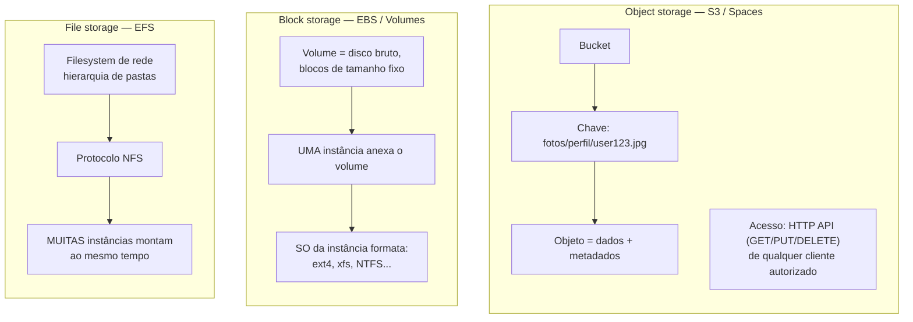
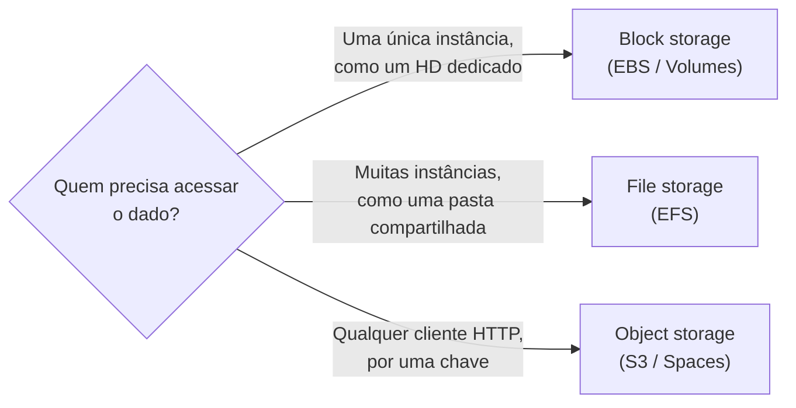
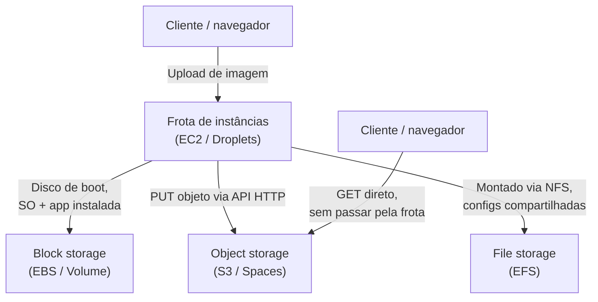

# Os três tipos de armazenamento

> [!abstract] TL;DR
> Toda instância do galho 5 já nasceu com um disco de boot — algo que foi tratado, na hora, como um detalhe da VM e nada mais. Esse disco de boot é, na verdade, a primeira aparição de um dos três formatos fundamentais em que a nuvem guarda dados: **block storage**, um disco bruto dividido em blocos de tamanho fixo, apresentado a exatamente **uma** instância, sobre o qual você instala um filesystem — é o EBS na AWS, é um Volume na DigitalOcean. Ao lado dele existe o **object storage**: dados guardados como objetos imutáveis (dados + metadados) sob uma chave, num namespace plano, acessados por uma API HTTP em vez de por um sistema operacional — é o S3 na AWS, é o Spaces na DigitalOcean. E existe o **file storage**: um filesystem de rede, com hierarquia de pastas e semântica POSIX, montado simultaneamente por muitas instâncias ao mesmo tempo — é o EFS na AWS, e é aqui que a lente dupla honesta precisa admitir que a DigitalOcean não tem um equivalente gerenciado direto. Escolher entre os três não é uma questão de gosto: é perguntar quem acessa o dado (uma máquina, muitas máquinas, ou qualquer cliente HTTP na internet), que semântica ele espera (bloco bruto, arquivo POSIX, ou objeto com chave), e que perfil de latência e custo a aplicação tolera. Esta nota é o mapa do galho inteiro — as próximas cinco notas mergulham fundo em cada escolha.

## O problema: "guardar dados na nuvem" não é uma frase com um único significado

Toda vez que alguém diz "vou guardar isso na nuvem", essa frase esconde uma decisão que raramente é discutida explicitamente: guardar **como**? A pergunta parece boba até o momento em que ela aparece na prática, disfarçada de um erro de arquitetura que ninguém viu vindo.

Imagine três times, cada um resolvendo um problema diferente, todos dizendo a mesma frase "vamos guardar isso na nuvem":

- O time A precisa guardar milhões de fotos de perfil de usuários, cada uma acessada raramente, por qualquer servidor web da frota, através de uma URL.
- O time B precisa de um disco para o banco de dados PostgreSQL que roda dentro de uma única instância EC2 — rápido, dedicado, e que sobreviva a um reboot da máquina.
- O time C tem uma frota de dez instâncias de processamento de vídeo que precisam, todas ao mesmo tempo, ler e escrever nos mesmos arquivos de um diretório compartilhado, como se fosse uma pasta de rede do escritório.

Essas três necessidades são fundamentalmente diferentes — e não é uma diferença de grau, é uma diferença de **espécie**. O time A não quer nem precisa de um filesystem: ele quer subir um arquivo e recuperar aquele arquivo exato mais tarde, por uma chave, de qualquer lugar da internet. O time B quer exatamente o oposto de "acessível de qualquer lugar": ele quer um disco que se comporte como um HD físico, dedicado a uma única máquina, rápido o bastante para aguentar o I/O de um banco de dados. O time C quer algo que nem A nem B oferecem: uma pasta que várias máquinas montam ao mesmo tempo, com a garantia de que quando uma escreve um arquivo, as outras enxergam essa escrita.

Tratar essas três necessidades como "a mesma coisa, é só guardar dado na nuvem" é o erro de arquitetura mais comum e mais caro de se corrigir depois — geralmente descoberto tarde, quando alguém tenta montar um volume de block storage em duas instâncias ao mesmo tempo, ou quando alguém tenta usar object storage como se fosse uma pasta comum do sistema operacional, e as duas tentativas falham de formas que não fazem sentido até que o modelo mental correto apareça.

## O mecanismo: três formatos, três contratos diferentes com quem acessa

A raiz da confusão é que os três tipos de armazenamento resolvem a mesma pergunta de fundo — "onde ficam meus bytes?" — com contratos de acesso completamente diferentes. Vale nomear cada um com precisão antes de comparar.

**Object storage** guarda dados como **objetos**: um objeto é a combinação de dados brutos (o conteúdo do arquivo) mais metadados (um conjunto de pares nome-valor que descrevem esse conteúdo) mais uma **chave** única que identifica o objeto dentro de um **bucket**. A AWS documenta essa estrutura com precisão: um objeto é endereçado pela combinação de bucket, chave e, opcionalmente, versão — não existe uma hierarquia real de pastas por baixo, o namespace é **plano**. Uma chave como `fotos/perfil/usuario123.jpg` parece uma pasta, mas é só uma string com barras dentro dela; o S3 não sabe o que é uma "pasta", só sabe interpretar prefixos de chave para listar objetos de forma que pareça uma. O acesso não passa por um sistema operacional montando um disco — é uma chamada HTTP: `PUT`, `GET`, `DELETE`, através de uma API REST.

**Block storage** guarda dados como **blocos** de tamanho fixo — um disco bruto, sem estrutura de arquivo nenhuma por padrão, apresentado ao sistema operacional de **uma única instância** como se fosse um dispositivo de armazenamento físico. A própria AWS descreve o volume EBS como algo que, "depois de anexado a uma instância, você pode usar da mesma forma que usaria um disco rígido local conectado a um computador". É o sistema operacional da instância — não o serviço de armazenamento — que formata esse disco bruto com um filesystem (`ext4`, `xfs`, `NTFS`), organiza diretórios, e decide onde cada arquivo vive dentro dele.

**File storage** guarda dados como um **filesystem de rede** — uma hierarquia de pastas e arquivos, acessível via protocolo NFS, montada simultaneamente por **muitas** instâncias ao mesmo tempo. A documentação da AWS é explícita: o EFS "é acessível através da maioria dos tipos de instância de computação da AWS", incluindo EC2, ECS, EKS, Lambda e Fargate simultaneamente, com semântica de sistema de arquivos completa — inclusive controle de acesso POSIX e travamento de arquivo (file locking).



Três analogias concretas ajudam a fixar essas diferenças antes de qualquer tabela:

**Object storage é um guarda-volumes de aeroporto.** Você entrega uma mala na esteira, recebe um tíquete numerado (a chave), e mais tarde troca esse tíquete pela mala de volta. O funcionário do guarda-volumes não sabe nem precisa saber o que tem dentro da mala — só sabe associar tíquete a mala. Não existe "pasta" dentro do guarda-volumes, existe uma prateleira enorme e um sistema de busca por número de tíquete. É exatamente assim que o S3 trata um objeto: uma chave aponta para um blob de bytes, sem que o serviço precise entender a estrutura interna desse blob.

**Block storage é um HD externo plugado por cabo USB direto num computador.** Só aquele computador enxerga o HD; se você plugar o mesmo HD em dois computadores ao mesmo tempo (via algum hub improvisado), o resultado normalmente é corrupção de dados, porque os dois sistemas operacionais tentam gerenciar o mesmo filesystem sem se falar. O HD, sozinho, fora de qualquer computador, é só um monte de setores magnéticos — é o sistema operacional que formata, monta e dá sentido de "arquivo" àquele espaço bruto.

**File storage é o compartilhamento de arquivos do escritório.** Todo mundo no time mapeia a mesma pasta de rede no computador — `\\servidor\compartilhado` ou `/mnt/compartilhado` — e todos enxergam os mesmos arquivos, nas mesmas subpastas, ao mesmo tempo. Se uma pessoa salva um documento, a pessoa da mesa ao lado, com a mesma pasta mapeada, vê o arquivo aparecer sem precisar copiar nada manualmente. É essa experiência — comum a qualquer escritório com servidor de arquivos — que o EFS reproduz entre instâncias, via NFS, em vez de entre computadores de mesa.

O eixo que separa os três, resumido em uma pergunta cada:

1. **Quem acessa?** Object: qualquer cliente HTTP autorizado, potencialmente milhares simultâneos, cada um lendo/escrevendo objetos independentes. Block: exatamente uma instância por vez — anexar o mesmo volume a uma segunda instância simultaneamente não é suportado pela maioria dos tipos de volume. File: muitas instâncias, ao mesmo tempo, compartilhando o mesmo espaço de nomes.
2. **Qual a semântica?** Object: objeto imutável identificado por chave (reescrever um objeto substitui ele inteiro, não edita um byte no meio). Block: bloco bruto — a semântica de arquivo vem inteiramente do filesystem que o sistema operacional instala por cima. File: semântica POSIX completa — abrir, ler um trecho, escrever um trecho, travar um arquivo para edição exclusiva.
3. **Latência e throughput?** Block tende a ser o mais rápido e mais previsível para I/O pequeno e aleatório (é isso que um banco de dados quer). Object tolera latência mais alta por operação, mas escala em paralelismo de forma quase ilimitada. File fica no meio: latência de rede (não é um disco local), mas com semântica de arquivo completa que nem block nem object oferecem sozinhos.
4. **Custo?** Como regra geral de mercado, object storage costuma ser o mais barato por gigabyte armazenado (a nota 03 deste galho detalha classes de acesso e como o preço muda por padrão de uso); block storage cobra por capacidade provisionada e por performance (IOPS/throughput); file storage tende a custar mais por gigabyte que object, precisamente por oferecer acesso concorrente com semântica de arquivo.



> [!tip] Assista: Difference between File Storage, Object Storage & Block Storage
> **Canal:** MGDecodes | **Duração:** ~7min | **Idioma:** EN
>
> Vídeo curto que percorre os três tipos na mesma ordem desta nota — bloco, arquivo, objeto — reforçando com outra analogia por que cada um exige um "contrato de acesso" diferente. Bom para revisar rápido antes de seguir pra nota 02.
> Trecho de destaque [3:48]: *"object storage stores data as objects with metadata and global unique [id]"*
>
> 🎬 [Assistir no YouTube](https://www.youtube.com/watch?v=hKWWGvC5_uo)

## Escala: infinita, provisionada e elástica — três respostas diferentes

A pergunta "quanto eu posso guardar?" também tem três respostas diferentes, e a diferença revela algo sobre a filosofia de cada tipo.

**Object storage não tem um teto de capacidade que o usuário precise planejar.** A documentação da AWS descreve o S3 como um serviço com "escalabilidade líder da indústria", e a forma como ele cobra reforça essa filosofia: "você paga só pelo que usa de fato, sem taxas escondidas e sem cobrança por excedente" — não existe um "tamanho de bucket" a ser reservado com antecedência, o bucket cresce conforme objetos são adicionados. Isso é possível justamente porque cada objeto é independente dos outros; não há necessidade de um bloco contíguo de espaço reservado como existiria num disco.

**Block storage é provisionado explicitamente, com um tamanho fixo escolhido no momento da criação.** Um volume EBS de 50 GB tem 50 GB — nem mais, nem menos — até que alguém explicitamente peça para redimensioná-lo (a AWS chama essa operação de "Elastic Volumes", permitindo aumentar capacidade sem downtime, mas o crescimento não é automático: é uma ação deliberada). Essa característica é o espelho da vantagem de performance do block storage: por ser um espaço fisicamente dedicado e delimitado, o provedor consegue garantir uma taxa de IOPS e throughput previsível para aquele volume específico — algo que não faz sentido pedir de um bucket S3, cujo modelo é otimizado para paralelismo massivo entre muitos objetos, não para uma única stream contínua de I/O.

**File storage cresce e encolhe conforme os arquivos mudam, sem provisionamento antecipado de capacidade.** A documentação do EFS descreve o serviço como "serverless" e "totalmente elástico" — "construído para escalar sob demanda até petabytes sem interromper aplicações, crescendo e encolhendo automaticamente conforme arquivos são adicionados e removidos". Nesse aspecto específico, o EFS se parece mais com object storage do que com block storage: ninguém escolhe "um EFS de 500 GB" do jeito que se escolhe "um EBS de 500 GB" — o filesystem simplesmente ocupa o espaço que os arquivos dentro dele realmente usam.

## A tabela comparativa: os três lado a lado

| Dimensão | Object storage | Block storage | File storage |
|---|---|---|---|
| Unidade de dado | Objeto (dados + metadados + chave) | Bloco de tamanho fixo | Arquivo dentro de hierarquia de pastas |
| Namespace | Plano (bucket + chave) | Nenhum — o SO impõe o filesystem | Hierárquico (POSIX) |
| Quem monta/acessa | Qualquer cliente HTTP autorizado | Uma única instância por vez | Muitas instâncias simultaneamente |
| Protocolo de acesso | API REST/HTTP (`GET`/`PUT`/`DELETE`) | Dispositivo de bloco anexado ao SO | NFS (v4.0/v4.1) |
| Mutabilidade | Objeto é substituído inteiro, não editado em parte | Editável em qualquer offset, como disco comum | Editável por trecho, com file locking |
| Exemplo AWS | Amazon S3 | Amazon EBS | Amazon EFS |
| Exemplo DigitalOcean | Spaces | Volumes | Sem equivalente gerenciado direto |
| Caso de uso típico | Fotos, backups, data lake, sites estáticos | Disco de boot, disco de banco de dados | Diretório compartilhado por frota, home directories |

## Casos práticos: a mesma ação, três formatos diferentes

**Subir um arquivo para object storage (AWS).** Não existe "montar" nada — é uma chamada HTTP disfarçada de comando de CLI:

```bash
$ aws s3 cp relatorio.pdf s3://loja-web-documentos/relatorios/2026/relatorio.pdf
upload: ./relatorio.pdf to s3://loja-web-documentos/relatorios/2026/relatorio.pdf
```

```bash
$ aws s3 ls s3://loja-web-documentos/relatorios/2026/
2026-07-23 14:02:11     284213 relatorio.pdf
```

**O mesmo, na DigitalOcean, via Spaces (compatível com a API do S3):**

```bash
$ s3cmd put relatorio.pdf s3://loja-web-spaces/relatorios/2026/relatorio.pdf \
    --host=nyc3.digitaloceanspaces.com \
    --host-bucket='%(bucket)s.nyc3.digitaloceanspaces.com'
upload: 'relatorio.pdf' -> 's3://loja-web-spaces/relatorios/2026/relatorio.pdf'
```

**Anexar um disco de block storage a uma instância (AWS EBS) e formatá-lo** — repare que aqui existem **dois** passos que não existem em object storage: anexar o volume ao SO, e formatar um filesystem por cima dele:

```bash
$ aws ec2 attach-volume \
    --volume-id vol-0abc123def456789 \
    --instance-id i-0abcdef1234567890 \
    --device /dev/sdf
```

```bash
# Dentro da instância, o disco bruto aparece como /dev/xvdf.
# Sem filesystem, ele não é útil pra nada além de gravar bytes crus.
$ sudo mkfs -t ext4 /dev/xvdf
$ sudo mkdir /data
$ sudo mount /dev/xvdf /data
$ df -h /data
Filesystem      Size  Used Avail Use% Mounted on
/dev/xvdf        20G   24K   19G   1% /data
```

**Montar um filesystem de rede em várias instâncias (AWS EFS)** — o ponto central deste exemplo é que o mesmo comando de `mount`, apontando para o mesmo alvo, roda em quantas instâncias forem necessárias, e todas enxergam os mesmos arquivos:

```bash
# Na instância 1:
$ sudo mount -t nfs4 -o nfsvers=4.1 \
    fs-0123456789abcdef0.efs.us-east-1.amazonaws.com:/ /mnt/compartilhado

# Na instância 2, simultaneamente, o MESMO filesystem:
$ sudo mount -t nfs4 -o nfsvers=4.1 \
    fs-0123456789abcdef0.efs.us-east-1.amazonaws.com:/ /mnt/compartilhado

# Um arquivo escrito na instância 1 aparece imediatamente na instância 2:
(instancia-1)$ echo "processado" > /mnt/compartilhado/status.txt
(instancia-2)$ cat /mnt/compartilhado/status.txt
processado
```

**Criar um volume de block storage na DigitalOcean e anexá-lo a um Droplet:**

```bash
$ doctl compute volume create dados-postgres \
    --region nyc1 \
    --size 50GiB
```

```bash
$ doctl compute volume-action attach \
    <volume-id> <droplet-id>
```

```bash
# Dentro do Droplet, o mesmo padrão de formatar antes de usar:
$ sudo mkfs.ext4 -F /dev/disk/by-id/scsi-0DO_Volume_dados-postgres
$ sudo mkdir -p /mnt/dados-postgres
$ sudo mount -o discard,defaults /dev/disk/by-id/scsi-0DO_Volume_dados-postgres /mnt/dados-postgres
```

A documentação da DigitalOcean é explícita sobre a mesma restrição que a AWS impõe: **um volume de block storage só pode estar anexado a um Droplet por vez** — a mesma regra de "uma instância por vez" que separa block storage de file storage.

> [!info] Fronteira com o galho 5
> O disco de boot de toda instância EC2/Droplet, desde a nota 01 do galho 5 (Compute), já era block storage — só que ninguém precisou nomear isso na hora, porque o provisionamento da instância cuida de criar e anexar o volume automaticamente. A nota 05 deste galho volta a esse disco de boot com profundidade: tipos de volume EBS, IOPS provisionado, snapshots.

## Caso prático: os três tipos convivendo na mesma arquitetura

Vale fechar com o cenário mais comum de todos: uma única aplicação que precisa, ao mesmo tempo, dos três tipos de armazenamento — não como alternativas concorrentes, mas como peças complementares, cada uma resolvendo a parte do problema para a qual foi desenhada. Retome a loja web dos galhos anteriores desta trilha, agora com uma funcionalidade de upload de imagens de produto e um pipeline de geração de miniaturas:

- O **disco de boot** de cada instância da frota (galho 5/6) é **block storage** — EBS ou Volume, dedicado àquela instância, guardando o sistema operacional e a aplicação instalada.
- As **imagens de produto enviadas pelos usuários** vão para **object storage** — um bucket S3 (ou Spaces), acessado via API HTTP a partir da aplicação, e servido depois diretamente aos navegadores dos clientes, sem passar pela frota de instâncias de novo.
- Um **diretório de configuração compartilhada** — templates de e-mail, arquivos de licença de fontes usados na geração de miniaturas — que todas as instâncias do pipeline de processamento de imagem precisam enxergar de forma idêntica e atualizada ao mesmo tempo, vive em **file storage**: um EFS montado por todas as instâncias do pipeline.



Nenhuma dessas três peças substitui a outra. Tentar guardar as imagens de produto em block storage exigiria replicar o mesmo arquivo em todas as instâncias que precisam servi-lo (porque block storage não é compartilhável); tentar guardar o disco de boot em object storage não faz sentido nenhum, porque um sistema operacional não roda a partir de uma API HTTP; tentar guardar as configurações compartilhadas em object storage funcionaria, mas exigiria que cada instância do pipeline fizesse download da configuração a cada execução, em vez de simplesmente ler um arquivo já montado localmente. A escolha certa, em cada caso, decorre diretamente do eixo desta nota: quem acessa, com que semântica, e a que custo.

## A DigitalOcean e a honestidade sobre o file storage

A lente dupla deste galho segue o mesmo padrão dos anteriores — conceito neutro primeiro, depois "em AWS é X, em DO é Y" — mas aqui vale uma pausa de honestidade explícita. Object storage tem par direto (S3 ↔ Spaces, inclusive com compatibilidade de API). Block storage tem par direto (EBS ↔ Volumes, com a mesma regra de anexação única). **File storage não tem.** A DigitalOcean não oferece, no catálogo de produtos gerenciados hoje, um serviço equivalente ao Amazon EFS — um filesystem de rede totalmente gerenciado, montável por múltiplos Droplets via NFS, sem que o próprio usuário monte e opere o servidor NFS.

Isso não significa que seja impossível montar um cenário parecido na DigitalOcean — é possível subir uma instância dedicada rodando um servidor NFS por conta própria, com um Volume de block storage por trás dela, e montar esse NFS em outros Droplets. Mas isso é o usuário construindo e operando a peça de file storage manualmente, não um serviço gerenciado equivalente ao EFS. É uma lacuna real de paridade, não um detalhe menor — e é exatamente por isso que a nota 06 deste galho, o capstone, dedica uma seção a discutir esse ponto quando chega a hora de decidir qual dos três tipos usar em cada camada de uma arquitetura real.

| Conceito | AWS | Azure | GCP | DigitalOcean |
|---|---|---|---|---|
| Object storage | Amazon S3 | Blob Storage | Cloud Storage | Spaces |
| Block storage | Amazon EBS | Managed Disks | Persistent Disk | Volumes |
| File storage (gerenciado) | Amazon EFS | Azure Files | Filestore | Sem equivalente gerenciado — exige NFS auto-operado |

> [!info] Caducidade
> A ausência de um serviço de file storage gerenciado na DigitalOcean reflete o catálogo de produtos em 2026-07-23. Catálogos de nuvem mudam; vale checar a documentação de produtos da DigitalOcean antes de assumir essa lacuna como permanente ao planejar uma arquitetura real.

## Armadilhas comuns

> [!warning] Tratar object storage como se fosse um filesystem comum
> É tentador montar um bucket S3 com uma ferramenta como `s3fs` e tratar aquilo como uma pasta local — abrir arquivo, editar um trecho no meio, salvar. Object storage não foi desenhado para esse padrão de acesso: escrever num objeto significa **substituir o objeto inteiro**, não editar bytes específicos dentro dele. Ferramentas de montagem tipo `s3fs` existem e funcionam para casos simples, mas cada gravação parcial vira, por baixo, um upload completo do arquivo — lento e caro para arquivos grandes editados com frequência. Se a aplicação precisa de edição parcial de arquivo com múltiplos acessos concorrentes, a resposta é block storage (para uma instância) ou file storage (para várias), nunca object storage forçado a se comportar como filesystem.

> [!warning] Tentar anexar o mesmo volume de block storage a duas instâncias
> A maioria dos volumes de block storage — EBS e Volumes da DigitalOcean inclusos — só pode estar anexada a **uma** instância por vez. Duas instâncias competindo para escrever no mesmo disco bruto, sem coordenação nenhuma no nível de filesystem, corrompe dados: nenhum dos dois sistemas operacionais sabe que o outro está escrevendo simultaneamente. Quando o requisito real é "várias instâncias acessando o mesmo dado ao mesmo tempo", a resposta certa é file storage (ou, dependendo do caso, redesenhar para que cada instância acesse sua própria cópia de object storage).

> [!warning] Escolher block storage "porque é o mais rápido" sem considerar o que ele não resolve
> Block storage costuma ganhar em latência e IOPS previsível — mas essa vantagem some assim que o requisito real é "múltiplas instâncias compartilhando o mesmo dado" ou "acessível de qualquer lugar via HTTP". Otimizar prematuramente por performance bruta, escolhendo block storage para um caso de uso que na verdade precisa de compartilhamento (file) ou de acesso amplo por chave (object), resolve o problema errado rápido, em vez do problema certo devagar.

> [!info] Fronteira
> Esta nota trata durabilidade e replicação apenas no nível de "qual serviço promete o quê" — a discussão conceitual mais profunda de durabilidade, replicação e trade-offs entre consistência e disponibilidade pertence a System Design/Arquitetura. E o uso desses três tipos de armazenamento como camada de persistência de um banco de dados gerenciado (RDS, bancos administrados da DigitalOcean) é assunto do domínio Dados, não deste galho — aqui o foco é armazenamento como recurso de infraestrutura bruto, não como motor de banco de dados.

## Por baixo de quase todo serviço gerenciado, é um destes três

Vale um passo atrás antes de seguir para as próximas notas: os três tipos desta nota não são só o que você escolhe diretamente quando cria um recurso de armazenamento — eles são os **primitivos** sobre os quais quase todo serviço gerenciado "de nível mais alto" da nuvem é construído por baixo. Um serviço gerenciado raramente inventa um jeito novo de guardar bytes no disco; ele pega um dos três formatos já vistos aqui, embrulha em automação, e vende a experiência de não precisar pensar nisso. Enxergar essa camada por baixo desmistifica boa parte do resto da trilha Cloud — e explica coisas que, de outra forma, pareceriam arbitrárias, como por que um serviço cobra do jeito que cobra ou por que ele tem exatamente aquela limitação e não outra.

Um exemplo direto: um **banco de dados gerenciado** — RDS na AWS, o Managed Database da DigitalOcean, assunto do galho 9 sobre bancos gerenciados — roda o engine (PostgreSQL, MySQL) sobre um volume de **block storage**, do mesmo jeito que o time B da seção inicial desta nota queria um disco dedicado para o próprio Postgres. É por isso que RDS oferece escolha de tipo de armazenamento e de IOPS provisionado: por baixo da abstração de "banco de dados gerenciado" tem um volume EBS guardando os data files, com as mesmas características de I/O rápido, dedicado a uma única instância, que esta nota descreveu para block storage. O serviço gerenciado cuida de backup, failover e patching — mas o disco continua sendo o mesmo primitivo.

Do lado oposto, um **data lake** — o tipo de arquitetura central ao domínio Dados, na trilha de Engenharia — tipicamente assenta sobre **object storage**. Arquivos em formato Parquet ou ORC, empilhados dentro de um bucket S3, são a fundação do que hoje se chama "lakehouse": é justamente porque object storage é barato por gigabyte e escala em paralelismo sem teto de capacidade planejado (a mesma característica descrita na seção de escala desta nota) que virou viável guardar petabytes de dados brutos, esperando análise, sem que ninguém precise provisionar disco algum antecipadamente.

Um terceiro exemplo mistura os dois primitivos anteriores dentro do próprio galho 5/6: **snapshots de block storage**. A AWS documenta com clareza que um snapshot de EBS é uma cópia incremental — só os blocos alterados desde o último snapshot são salvos — e que esses snapshots **são armazenados no Amazon S3**, em buckets que o usuário não acessa diretamente. É por isso que tirar um snapshot de um volume de 100 GB quase cheio, mas que mudou pouco desde o último snapshot, cobra só pelo delta de dados novos, não pelos 100 GB inteiros de novo: por baixo do produto "snapshot de EBS" tem object storage guardando blocos, não um segundo disco bruto duplicado. Um registro de containers como o ECR, e os artefatos gerados por um pipeline de build, seguem o mesmo padrão: o produto de mais alto nível esconde um bucket de object storage por baixo.

| Serviço gerenciado | Primitivo por baixo | Por quê |
|---|---|---|
| RDS / Managed Database (galho 9) | Block storage | O engine precisa de I/O rápido, dedicado a uma instância — a mesma exigência do time B |
| Data lake / lakehouse (domínio Dados) | Object storage | Custo baixo por GB + escala sem teto viabilizam guardar petabytes brutos sem provisionar disco |
| Snapshot de EBS | Object storage | Backup incremental por blocos, cobrado só pelo delta — a AWS confirma que snapshots ficam em S3 |
| Registro de containers (ECR) | Object storage | Artefatos e camadas de imagem são blobs imutáveis endereçados por chave |

A lição que vale carregar para o resto da trilha: quando um serviço gerenciado novo aparecer — um cache gerenciado, uma fila, um data warehouse — vale perguntar "qual dos três primitivos está por baixo disto?". Quase sempre a resposta explica, de uma vez, tanto o modelo de custo do serviço quanto as limitações que ele tem (ou não tem).

## O que vem a seguir

Este mapa deu nome e contrato aos três tipos — mas cada um deles esconde profundidade suficiente para uma nota inteira, ou mais. A trilha deste galho aprofunda **object storage** primeiro, porque é o tipo mais usado no dia a dia de qualquer arquitetura web moderna: a próxima nota mergulha no S3 e no Spaces a fundo — como buckets e chaves realmente funcionam, o que sustenta a promessa de "11 noves" de durabilidade, e os detalhes de acesso e permissão que fazem a diferença entre um bucket seguro e um bucket público por acidente.

## Fontes

- [AWS S3 — What is Amazon S3?](https://docs.aws.amazon.com/AmazonS3/latest/userguide/Welcome.html) — definição de objeto (dados + metadados), bucket, chave, namespace plano, acesso via REST API; acessado em 2026-07-23.
- [AWS S3 — Storage classes](https://aws.amazon.com/s3/storage-classes/) — durabilidade de 99.999999999% (11 noves) aplicável a todas as classes de armazenamento S3; acessado em 2026-07-23.
- [AWS S3 FAQs](https://aws.amazon.com/s3/faqs/) — disponibilidade de 99,99% para S3 Standard, modelo de armazenamento por chave; acessado em 2026-07-23.
- [AWS EBS — What is Amazon Elastic Block Store?](https://docs.aws.amazon.com/AWSEC2/latest/UserGuide/AmazonEBS.html) — volumes como disco anexado a uma instância, usado "da mesma forma que um disco rígido local", durabilidade de 99,8%-99,999% conforme o tipo de volume; acessado em 2026-07-23.
- [AWS EFS — What is Amazon Elastic File System?](https://docs.aws.amazon.com/efs/latest/ug/whatisefs.html) — filesystem de rede via NFSv4, acessível simultaneamente por EC2/ECS/EKS/Lambda/Fargate, semântica POSIX e file locking; acessado em 2026-07-23.
- [DigitalOcean — Spaces Object Storage](https://docs.digitalocean.com/products/spaces/) — Spaces como serviço de object storage compatível com a API do S3, organizado em buckets; acessado em 2026-07-23.
- [DigitalOcean — Volumes Block Storage](https://docs.digitalocean.com/products/volumes/) — restrição de um volume anexado a um único Droplet por vez; acessado em 2026-07-23.
- [AWS EBS — Amazon EBS snapshots](https://docs.aws.amazon.com/AWSEC2/latest/UserGuide/EBSSnapshots.html) — snapshots são backup incremental por blocos alterados, armazenados no Amazon S3 (buckets não acessíveis diretamente pelo usuário); acessado em 2026-07-23.
