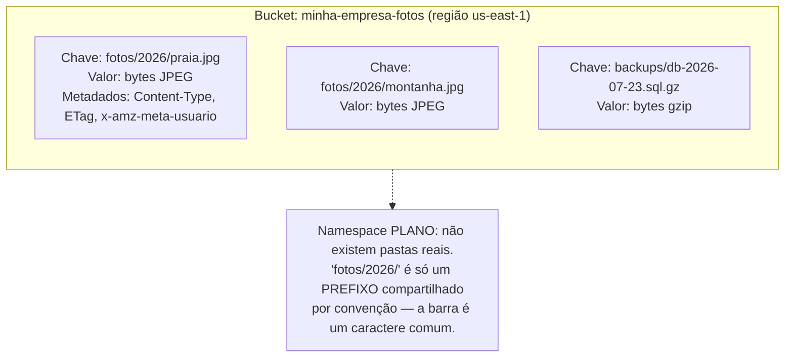
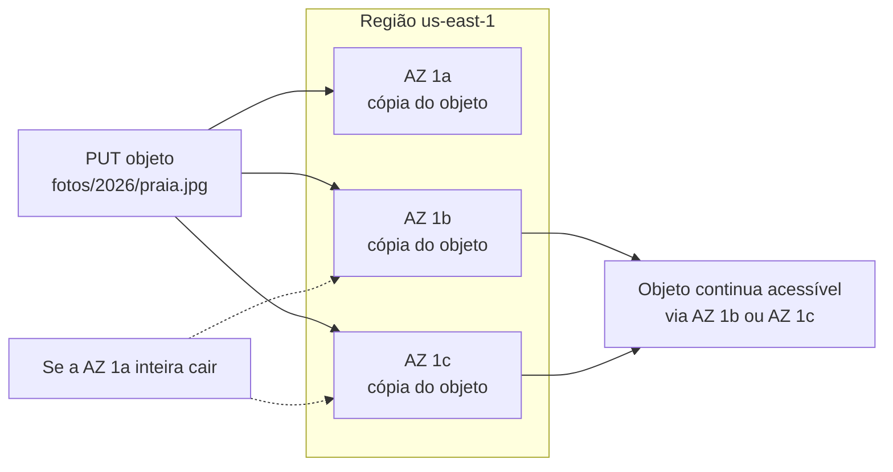
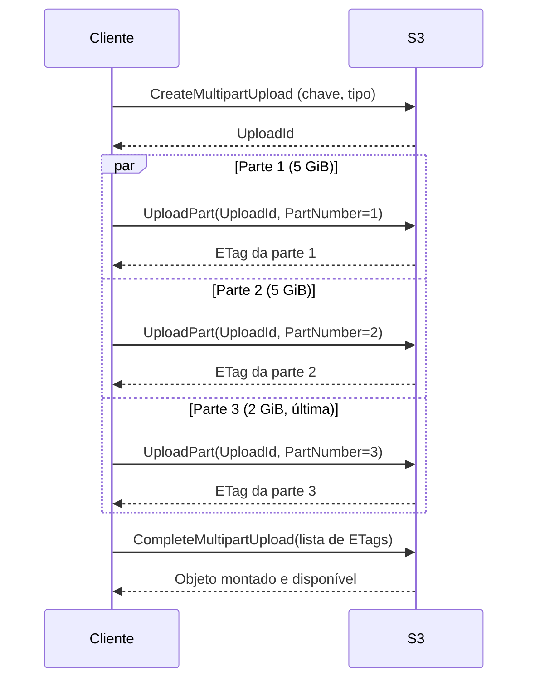

# Object storage a fundo

> [!abstract] TL;DR
> A nota anterior mapeou object storage como um dos três tipos fundamentais de armazenamento em nuvem — agora é hora de abrir o capô. Um objeto no S3 é só três coisas amarradas: uma **chave** (string única dentro do bucket), um **valor** (os bytes crus do arquivo) e **metadados**. Não existe hierarquia de pastas de verdade — o que parece uma árvore de diretórios (`fotos/2026/praia.jpg`) é, por baixo, uma chave única com barras dentro do nome; o console só finge a pasta pra sua conveniência visual. Um bucket é o contêiner: nome globalmente único (ninguém mais no mundo pode ter o mesmo nome dentro da mesma partição AWS), preso a uma região no momento da criação, acessível por HTTP/REST, SDK ou CLI. A promessa que sustenta tudo isso é a durabilidade de **99,999999999%** — os "11 noves" — obtida replicando cada objeto em pelo menos três zonas de disponibilidade diferentes dentro da região; e desde 1º de dezembro de 2020 o S3 também garante consistência forte read-after-write, eliminando uma categoria inteira de bugs sutis que existia antes disso. Só falta uma peça mental: S3 não é um sistema de arquivos — não existe `append`, um objeto é imutável, e mudar um byte significa reescrever o objeto inteiro (ou usar multipart upload para objetos grandes, o mecanismo que quebra um upload de dezenas de gigabytes em pedaços paralelizáveis).

## O problema: onde salvar um bilhão de arquivos sem gerenciar um único servidor

Imagine um serviço que recebe upload de fotos de usuários: hoje são mil fotos por dia, mas o produto pode crescer para um milhão por dia sem aviso. Guardar isso num disco de servidor tradicional significa, cedo ou tarde, enfrentar perguntas incômodas: o disco enche, e agora? Se o servidor cair, os arquivos morrem junto? Como sincronizar esse mesmo conjunto de arquivos entre três servidores de aplicação atrás de um load balancer, sem que cada um veja uma cópia diferente?

Object storage existe exatamente para tirar essas perguntas da mesa. Em vez de "onde no disco eu guardo isso", a pergunta vira "qual chave eu uso para recuperar isso depois" — e o serviço de armazenamento (S3, Spaces, ou qualquer provedor compatível) cuida de replicação, durabilidade e escala horizontal por trás de uma API HTTP simples. Mas essa simplicidade tem uma pegada: o modelo mental de "pasta com arquivo dentro" que todo mundo carrega de sistemas operacionais não se aplica aqui do jeito que parece se aplicar — e é isso que a próxima seção desfaz.

## Anatomia de um objeto: chave, valor, metadados

Um objeto S3 tem exatamente três componentes, segundo a documentação oficial da AWS:

- **Key (chave)**: o identificador único do objeto dentro do bucket. É uma string — pode ter até 1024 bytes UTF-8 — e é o único jeito de endereçar um objeto. Não existe índice secundário, não existe busca por conteúdo nativa; se você não sabe a chave (ou o prefixo dela), você não acha o objeto sem listar o bucket inteiro.
- **Value (valor)**: os bytes crus do conteúdo — de 0 bytes até o limite de tamanho do S3. O S3 não interpreta o conteúdo; para ele, uma imagem JPEG e um dump de banco de dados são igualmente "uma sequência de bytes com uma chave".
- **Metadata**: pares chave-valor associados ao objeto, tanto os que o S3 gerencia automaticamente (`Content-Type`, `Content-Length`, data de última modificação) quanto os que você define (prefixados com `x-amz-meta-`, limitados a 2 KB no total). Além disso, cada objeto carrega um **version ID** quando o bucket tem versionamento habilitado — mecanismo que a nota 04 desta trilha aprofunda.

O ponto que mais confunde quem vem de sistema de arquivos: **o namespace do S3 é plano.** Não existe uma estrutura de diretórios real por trás — o que existe é uma tabela (conceitualmente) de `chave → valor`, e a barra (`/`) dentro de uma chave é só um caractere como outro qualquer para o S3. Quando você "cria uma pasta" no console da AWS, ele está criando um objeto zero-byte cuja chave termina em `/`, e passa a agrupar visualmente qualquer chave que compartilhe aquele prefixo. `fotos/2026/praia.jpg` não é um arquivo dentro de duas pastas aninhadas — é uma única chave de 20 e poucos caracteres, e o "diretório" `fotos/2026/` é uma ilusão de interface que o console (e o `aws s3 ls` com `--recursive` desligado) constrói filtrando por prefixo.



Essa distinção não é acadêmica — ela explica por que operações que parecem triviais num sistema de arquivos (renomear uma "pasta", mover mil arquivos de um lugar para outro) no S3 viram, na prática, copiar cada objeto individualmente para uma nova chave e depois apagar a chave antiga. Não existe um `mv` atômico de prefixo — porque não existe prefixo de verdade, só convenção de nomenclatura.

## O bucket: contêiner nomeado, preso a uma região

Um bucket é o contêiner de nível mais alto — todo objeto vive dentro de exatamente um bucket. Três propriedades definem um bucket, segundo a documentação de nomenclatura da AWS:

1. **Nome globalmente único.** O namespace de buckets é compartilhado entre *todas* as contas AWS dentro da mesma partição (a partição `aws` cobre as regiões-padrão; `aws-cn` e `aws-us-gov` são partições separadas). Uma vez que alguém cria `minha-empresa-fotos`, nenhuma outra conta no mundo — na mesma partição — pode usar esse nome, mesmo que o bucket original esteja vazio ou seja de outro cliente completamente sem relação. Isso é, na prática, por que nomes de bucket simples e óbvios (`backup`, `logs`, `assets`) quase sempre já estão ocupados.
2. **Regras de nomenclatura**: entre 3 e 63 caracteres, só letras minúsculas, números, pontos e hifens, começando e terminando em letra ou número, sem formato de endereço IP, sem dois pontos adjacentes.
3. **Preso a uma região no momento da criação** — e essa escolha é definitiva: a documentação da AWS é explícita que, depois de criado, você não pode mudar o nome nem a região de um bucket. Se a região errada foi escolhida, a única saída é criar outro bucket na região certa e migrar os objetos.

```bash
$ aws s3api create-bucket \
    --bucket minha-empresa-fotos-a1b2c3d4 \
    --region us-east-1
{
    "Location": "/minha-empresa-fotos-a1b2c3d4"
}

# Fora de us-east-1, o parâmetro de região precisa ser repetido
# dentro de --create-bucket-configuration (peculiaridade histórica da API)
$ aws s3api create-bucket \
    --bucket minha-empresa-fotos-a1b2c3d4-sp \
    --region sa-east-1 \
    --create-bucket-configuration LocationConstraint=sa-east-1
```

Cada bucket tem um endpoint HTTP próprio, derivado do nome e da região — é para esse endpoint que toda operação REST (GET, PUT, DELETE) é enviada:

```
https://minha-empresa-fotos-a1b2c3d4.s3.us-east-1.amazonaws.com/fotos/2026/praia.jpg
```

> [!tip] Assista: Understand Key Concepts in Amazon S3 in 5 minutes (Buckets, Objects, Keys and Regions)
> **Canal:** Code Java | **Duração:** ~6min | **Idioma:** EN
>
> Vídeo curto que amarra visualmente bucket, chave e região no console — útil pra fixar que "cada objeto tem exatamente uma chave" antes de seguir pra durabilidade. Trecho de destaque [0:40]: *"a key is the unique identifier for objects within a bucket"*
>
> 🎬 [Assistir no YouTube](https://www.youtube.com/watch?v=9AIXjHF5irs)

## Durabilidade: o que os 11 noves realmente significam

"99,999999999% de durabilidade" é o número mais citado do S3 e o mais mal-entendido. Não é uma promessa de disponibilidade (uptime) — é uma promessa sobre **não perder o objeto**, ainda que ele fique temporariamente inacessível. Segundo a documentação oficial da AWS: o S3 Standard é "projetado para fornecer 99,999999999% de durabilidade e 99,99% de disponibilidade de objetos ao longo de um determinado ano" — dois números diferentes, respondendo perguntas diferentes.

Na prática, 11 noves de durabilidade significa que, para um conjunto de 10 milhões de objetos armazenados, a expectativa estatística é perder, em média, **um único objeto a cada 10.000 anos**. É uma ordem de grandeza tão alta que discos individuais, ou mesmo datacenters inteiros, deixam de ser a unidade relevante de risco.

Como isso é obtido? Não é mágica de replicação em disco único — é geografia. A documentação da AWS especifica que S3 Standard "armazena objetos de forma redundante em múltiplos dispositivos, em um mínimo de três zonas de disponibilidade" dentro da região, e que essas classes de armazenamento são "projetadas para sustentar dados mesmo em caso de perda de uma zona de disponibilidade inteira". Cada zona de disponibilidade é um ou mais datacenters fisicamente separados por uma distância significativa (até ~100 km) das demais zonas da mesma região, com energia, rede e conectividade redundantes e independentes.



> [!info] Caducidade
> S3 One Zone-IA é a exceção deliberada a essa regra — replica só dentro de uma única AZ, trocando durabilidade multi-AZ por custo menor. A nota 03 desta trilha, sobre classes de acesso, cobre esse trade-off. Números confirmados na documentação de proteção de dados da AWS em 2026-07-23; a AWS não republica esses valores com frequência, mas confira a página oficial antes de citar em qualquer decisão de arquitetura crítica.

## Consistência: strong read-after-write desde dezembro de 2020

Antes de 1º de dezembro de 2020, o S3 operava sob **consistência eventual**: depois de um `PUT`, existia uma pequena janela de tempo em que o objeto já estava durável e aceito, mas uma leitura (`GET`) ou listagem (`LIST`) subsequente podia, ocasionalmente, ainda não refletir a mudança mais recente. Isso gerava uma classe inteira de bugs sutis — um pipeline que grava um objeto e imediatamente tenta lê-lo de volta podia, raramente, receber uma versão antiga ou um 404.

A AWS eliminou essa categoria de bug com o anúncio de **strong read-after-write consistency**, efetivo em 1º de dezembro de 2020, aplicado retroativamente a todos os buckets existentes, sem qualquer configuração necessária. Segundo o anúncio oficial: "efetivo imediatamente, todas as operações S3 GET, PUT e LIST, assim como operações que alteram tags de objeto, ACLs ou metadados, agora são fortemente consistentes." Isso cobre tanto a criação de um objeto novo quanto a sobrescrita ou exclusão de um existente — a próxima leitura, de qualquer lugar, sempre reflete a última escrita bem-sucedida.

> [!info] Caducidade
> Mudança de modelo confirmada como permanente e retroativa desde 1º/12/2020, verificada na página oficial de consistência da AWS e no anúncio original em 2026-07-23. Vale mencionar como curiosidade histórica ao explicar por que documentação ou código mais antigo (anterior a 2020) às vezes recomenda padrões defensivos ("espere alguns segundos antes de ler") que hoje são desnecessários no S3 — mas que ainda fazem sentido em outros serviços de object storage com consistência eventual.

## Acesso: HTTP/REST, SDK, CLI e presigned URLs

Todo acesso ao S3 passa, por baixo, por uma API REST sobre HTTP — os quatro verbos que importam são `PUT` (criar/sobrescrever objeto), `GET` (ler), `DELETE` (apagar) e `HEAD` (ler só os metadados, sem o corpo). SDKs (boto3, AWS SDK for Java, etc.) e a AWS CLI são camadas de conveniência sobre essa mesma API — nenhuma delas expõe uma operação que a REST API não tenha.

```bash
# Upload simples de um único arquivo
$ aws s3 cp foto-praia.jpg s3://minha-empresa-fotos-a1b2c3d4/fotos/2026/praia.jpg

# Download
$ aws s3 cp s3://minha-empresa-fotos-a1b2c3d4/fotos/2026/praia.jpg ./praia-baixada.jpg

# "Listar uma pasta" — na prática, filtrar por prefixo
$ aws s3 ls s3://minha-empresa-fotos-a1b2c3d4/fotos/2026/
2026-07-20 14:32:11     284192 praia.jpg
2026-07-21 09:15:44     512004 montanha.jpg

# Apagar um objeto
$ aws s3 rm s3://minha-empresa-fotos-a1b2c3d4/fotos/2026/praia.jpg
```

Uma necessidade comum é dar acesso temporário a alguém — um front-end que precisa deixar o próprio usuário fazer upload direto para um bucket privado, sem expor credenciais AWS no navegador. A resposta é a **presigned URL**: uma URL assinada criptograficamente com as credenciais de quem a gerou, válida por um tempo limitado, que carrega dentro de si a autorização para uma operação específica (GET ou PUT) num objeto específico. Segundo a documentação oficial, "uma presigned URL é limitada pelas permissões do usuário que a criou" — ou seja, quem recebe a URL não ganha credencial nenhuma, só a autorização emprestada por aquele link, e só até ele expirar. Via CLI/SDK, o prazo de expiração pode chegar a 7 dias.

```python
import boto3

s3_client = boto3.client("s3", region_name="us-east-1")

url = s3_client.generate_presigned_url(
    ClientMethod="put_object",
    Params={
        "Bucket": "minha-empresa-fotos-a1b2c3d4",
        "Key": "uploads/usuario-42/avatar.png",
        "ContentType": "image/png",
    },
    ExpiresIn=900,  # 15 minutos
)
print(url)
# https://minha-empresa-fotos-a1b2c3d4.s3.amazonaws.com/uploads/usuario-42/avatar.png
#   ?AWSAccessKeyId=...&Signature=...&Expires=1753277400
```

```bash
# Quem recebe a URL não precisa de credencial AWS nenhuma — só faz um PUT comum
$ curl -X PUT -T ./avatar.png -H "Content-Type: image/png" "https://minha-empresa-fotos-a1b2c3d4.s3.amazonaws.com/uploads/usuario-42/avatar.png?AWSAccessKeyId=...&Signature=...&Expires=1753277400"
```

## Não é um sistema de arquivos: objetos são imutáveis

O erro de modelo mental mais caro em quem chega ao S3 vindo de um filesystem tradicional é tentar tratá-lo como um disco de rede. Não existe `append` — não há operação nativa de "adicionar estes bytes ao final do objeto existente". Um objeto S3 é imutável no sentido específico de que **qualquer alteração de conteúdo é uma sobrescrita completa**: para adicionar uma linha a um log já armazenado, o cliente precisa baixar o objeto inteiro, concatenar a nova linha localmente, e reenviar o objeto inteiro de volta com o mesmo nome de chave.

Isso não é uma limitação arbitrária — é uma consequência direta de como a durabilidade e a consistência forte funcionam: o S3 trata cada `PUT` bem-sucedido como a criação de uma versão inteiramente nova e imutável do conteúdo daquela chave (mesmo sem versionamento habilitado, internamente), o que é exatamente o que garante que um `GET` subsequente sempre veja um estado coerente e completo, nunca um objeto parcialmente escrito.

## Multipart upload: por que e quando

Para arquivos pequenos, um único `PUT` basta — e é limitado a **5 GB por operação**, segundo a documentação de upload da AWS. Para qualquer coisa maior, ou mesmo para arquivos menores onde performance e resiliência de rede importam, o mecanismo é o **multipart upload**: o objeto é dividido em partes (cada uma entre 5 MiB e 5 GiB, exceto a última, que pode ser menor), cada parte é enviada de forma independente — em paralelo, em qualquer ordem, com retry individual por parte — e o S3 monta o objeto final só quando todas as partes chegam e uma chamada explícita de conclusão (`CompleteMultipartUpload`) é feita.

A própria documentação recomenda considerar multipart a partir de **100 MB**, mesmo estando bem abaixo do limite rígido de 5 GB de um `PUT` simples — o ganho de paralelismo e a resiliência a falha de rede parcial (perder uma parte não obriga reenviar o arquivo inteiro) compensam a complexidade adicional bem antes do teto físico.



```bash
# A CLI faz a orquestração inteira nos bastidores —
# acima de um limiar (padrão 8 MB), aws s3 cp já usa multipart automaticamente
$ aws s3 cp video-treinamento-40gb.mp4 \
    s3://minha-empresa-fotos-a1b2c3d4/videos/treinamento.mp4

# Para controlar manualmente o processo via s3api (visão de baixo nível):
$ aws s3api create-multipart-upload \
    --bucket minha-empresa-fotos-a1b2c3d4 \
    --key videos/treinamento.mp4
{
    "UploadId": "exampleuploadid...",
    "Key": "videos/treinamento.mp4"
}

$ aws s3api upload-part \
    --bucket minha-empresa-fotos-a1b2c3d4 \
    --key videos/treinamento.mp4 \
    --part-number 1 \
    --body parte-01.bin \
    --upload-id exampleuploadid...
{
    "ETag": "\"d41d8cd98f00b204e9800998ecf8427e\""
}

$ aws s3api complete-multipart-upload \
    --bucket minha-empresa-fotos-a1b2c3d4 \
    --key videos/treinamento.mp4 \
    --upload-id exampleuploadid... \
    --multipart-upload file://partes.json
```

Um detalhe que costuma surpreender quem inspeciona o `ETag` de um objeto esperando um hash MD5 simples: para objetos enviados via `PUT` único, o `ETag` **é** o MD5 do conteúdo. Mas para objetos montados via multipart, o `ETag` deixa de ser um MD5 puro — vira o MD5 da concatenação dos MD5s de cada parte, seguido de um sufixo `-N` indicando quantas partes formaram o objeto (por exemplo, `"a1b2c3d4e5f6...-3"` para um objeto de três partes). Isso quebra qualquer código que assuma ingenuamente "`ETag` = MD5 do arquivo" para verificação de integridade — a forma correta e portável de verificar integridade de upload, hoje, é usar os checksums adicionais que o S3 suporta nativamente (SHA-256, CRC32C, entre outros), calculados e validados pelo próprio serviço no momento do upload, em vez de depender da forma exata do `ETag`.

> [!tip] Assista: How Multi-Part Upload Works in S3 (AWS Tutorial)
> **Canal:** CloudWolf AWS | **Duração:** ~2min | **Idioma:** EN
>
> Vídeo direto ao ponto sobre o mecanismo de dividir um upload em até 10.000 partes paralelas, com retry por parte — complementa a mecânica que o diagrama de sequência acima já mostrou. Trecho de destaque [1:24]: *"different parts up to 10,000 little parts and upload them separately"*
>
> 🎬 [Assistir no YouTube](https://www.youtube.com/watch?v=_xMG-cODLXY)

## Limites que importam na prática

| Item | Valor | Fonte |
|---|---|---|
| Tamanho máximo por `PUT` único | 5 GB | AWS docs — upload de objetos |
| Tamanho de parte no multipart | 5 MiB a 5 GiB (última parte sem mínimo) | AWS docs — qfacts |
| Nº máximo de partes por multipart upload | 10.000 | AWS docs — qfacts |
| Nº de objetos por bucket | Ilimitado | AWS docs — upload de objetos |
| Tamanho de chave (key) | Até 1.024 bytes UTF-8 | AWS docs |
| Metadados de usuário por objeto | Até 2 KB no total | AWS docs |
| Nome de bucket | 3 a 63 caracteres, minúsculo, único globalmente na partição | AWS docs — regras de nomenclatura |
| Expiração máxima de presigned URL (CLI/SDK) | 7 dias | AWS docs — presigned URLs |
| Durabilidade S3 Standard | 99,999999999% (11 noves) por ano | AWS docs — proteção de dados |
| Disponibilidade S3 Standard | 99,99% por ano | AWS docs — proteção de dados |
| Consistência | Strong read-after-write, desde 01/12/2020 | AWS blog — anúncio de consistência |

> [!info] Caducidade
> O tamanho máximo teórico de um objeto único costuma ser citado como 5 TB em anos de documentação AWS; páginas mais recentes de referência de multipart chegam a mencionar ceilings diferentes (até ~48,8 TiB, decorrente só da matemática de 10.000 partes × 5 GiB, ou "até 50 TB" em texto de orientação sobre uploads muito grandes). A AWS não é perfeitamente consistente entre suas próprias páginas nesse número específico — trate 5 TB como o valor de referência seguro para planejamento, e confira a página de limites vigente antes de desenhar um pipeline que dependa do teto exato.

## Padrões de nomenclatura de chave e o mito do "hot prefix"

Por anos, uma prática recomendada e amplamente repetida foi evitar chaves com prefixo sequencial e previsível — por exemplo, `2026-07-23-log-0001`, `2026-07-23-log-0002`, `2026-07-23-log-0003` em sequência — porque o S3 antigo particionava o índice interno de chaves por prefixo alfabético, e um fluxo intenso de escrita concentrado num único prefixo sequencial podia esbarrar em limites de taxa por partição, gerando *throttling*. A recomendação clássica era embaralhar o início da chave (um hash, ou os dígitos invertidos) para distribuir a carga entre partições diferentes.

Essa recomendação está **desatualizada para o S3 hoje**: a AWS reescreveu a forma como o índice de chaves particiona internamente, e o serviço agora escala automaticamente a taxa de requisição por prefixo sem precisar de embaralhamento manual — o S3 detecta padrões de acesso concentrados e distribui a carga sozinho, mesmo com nomes de chave sequenciais. Nomear chaves de forma previsível e legível (por data, por tipo, por usuário) continua sendo uma boa prática — só não é mais por medo de throttling; é por organização e capacidade de listar/filtrar de forma sensata.

> [!info] Caducidade
> Esse é um dos exemplos mais citados de conselho técnico que "gruda" muito depois de deixar de ser verdade — confirme sempre se a fonte que recomenda hash de prefixo é anterior à mudança de particionamento automático da AWS antes de aplicar essa prática hoje.

## Casos de uso

**Assets estáticos de aplicação.** Imagens, vídeos, arquivos de CSS/JS servidos por um front-end — o padrão dominante é servir isso via CDN (CloudFront na AWS) na frente de um bucket S3 privado, nunca expondo o bucket diretamente.

**Backup e arquivamento.** Dumps de banco de dados, snapshots de configuração, logs de auditoria — o padrão de durabilidade de 11 noves é exatamente o que justifica confiar backups críticos ao S3, combinado com as classes de acesso mais baratas que a nota 03 desta trilha cobre.

**Data lake.** Object storage é a base física de praticamente todo data lake moderno — arquivos Parquet/ORC em um bucket, consultados por um motor de query (Athena, Presto, Spark) sem precisar mover os dados para um banco relacional primeiro. Esse padrão foge do escopo desta nota e é aprofundado na trilha de Dados do vault.

**Hospedar site estático.** O S3 tem um modo nativo de "static website hosting" — servir HTML/CSS/JS direto do bucket, sem servidor de aplicação nenhum por trás. Funciona só sobre HTTP puro (não HTTPS diretamente do bucket), o que normalmente empurra times a colocar um CDN na frente mesmo assim.

```bash
$ aws s3 website s3://minha-empresa-fotos-a1b2c3d4/ \
    --index-document index.html \
    --error-document erro.html

# O endpoint resultante segue um padrão diferente do endpoint REST comum —
# é um domínio próprio de website, sem HTTPS nativo:
# http://minha-empresa-fotos-a1b2c3d4.s3-website-us-east-1.amazonaws.com
```

**Uploads de usuário.** O padrão de presigned URL descrito acima é a resposta canônica para "deixar o usuário enviar um arquivo direto para o bucket, sem o back-end intermediar o upload inteiro" — poupa banda e latência do servidor de aplicação.

## Segurança básica: privado por padrão, Block Public Access

Um bucket S3 recém-criado é **privado por padrão** — nenhuma permissão pública existe até alguém conceder explicitamente. Historicamente, duas camadas controlam acesso: **ACLs** (Access Control Lists, o mecanismo mais antigo, concedendo permissão por objeto ou bucket a contas específicas ou grupos pré-definidos) e **bucket policies** (documentos JSON no estilo IAM, aplicados ao bucket inteiro, muito mais expressivos e o padrão recomendado hoje).

```json
{
  "Version": "2012-10-17",
  "Statement": [
    {
      "Sid": "PermitirLeituraPublicaSoDeAssets",
      "Effect": "Allow",
      "Principal": "*",
      "Action": "s3:GetObject",
      "Resource": "arn:aws:s3:::minha-empresa-fotos-a1b2c3d4/assets-publicos/*"
    }
  ]
}
```

```bash
$ aws s3api put-bucket-policy \
    --bucket minha-empresa-fotos-a1b2c3d4 \
    --policy file://politica-assets-publicos.json
```

A camada que existe especificamente para evitar exposição acidental é o **Block Public Access**: quatro configurações independentes, habilitadas por padrão em qualquer bucket novo, que impedem qualquer ACL ou policy pública de ter efeito — mesmo que alguém, por engano, escreva uma policy como a de cima liberando acesso público, o Block Public Access barra a aplicação dela até ser desativado explicitamente.

```bash
$ aws s3api put-public-access-block \
    --bucket minha-empresa-fotos-a1b2c3d4 \
    --public-access-block-configuration \
      BlockPublicAcls=true,IgnorePublicAcls=true,BlockPublicPolicy=true,RestrictPublicBuckets=true
```

> [!info] Fronteira com IAM
> Bucket policy e ACL resolvem "quem pode acessar este bucket/objeto especificamente". A pergunta mais ampla de identidade — quem é esse principal, como ele se autentica, quais roles e políticas de conta se aplicam a ele — já foi aprofundada na trilha de identidade. Ver [[03-Dominios/Tecnologia/Cloud/04 - Identidade e acesso (IAM)/index|Identidade e acesso (IAM)]] para o tratamento completo de usuários, roles e policies.

## Lente dupla: AWS S3 e DigitalOcean Spaces

O **DigitalOcean Spaces** é, por design, um object storage com API compatível com S3 — segundo a documentação oficial, "Spaces Object Storage é um serviço compatível com S3 para armazenar e servir grandes quantidades de dados". Isso significa, na prática, que a mesma ferramenta (`aws s3 cp`, boto3, qualquer SDK S3) funciona contra Spaces só trocando o endpoint padrão da AWS por um endpoint da DigitalOcean.

```bash
# aws s3 apontando para Spaces em vez de S3 — só muda o --endpoint-url
$ aws s3 cp foto-praia.jpg \
    s3://meu-space/fotos/2026/praia.jpg \
    --endpoint-url https://nyc3.digitaloceanspaces.com

$ aws s3 ls s3://meu-space/ --endpoint-url https://nyc3.digitaloceanspaces.com
```

```bash
# s3cmd é a ferramenta historicamente mais associada a Spaces
$ s3cmd mb s3://meu-space --host=nyc3.digitaloceanspaces.com --host-bucket="%(bucket)s.nyc3.digitaloceanspaces.com"
$ s3cmd put foto-praia.jpg s3://meu-space/fotos/2026/praia.jpg --host=nyc3.digitaloceanspaces.com
$ s3cmd setacl s3://meu-space/fotos/2026/praia.jpg --acl-public --host=nyc3.digitaloceanspaces.com
```

```bash
# doctl, a CLI nativa da DigitalOcean, para operações de gestão do Space em si
$ doctl spaces list
$ doctl spaces create meu-space --region nyc3
```

A honestidade de paridade importa aqui: Spaces cobre bem o essencial — bucket ("Space"), chave/valor, ACL, CDN embutido, API compatível — mas tem menos classes de armazenamento e menos features avançadas do que o S3. A DigitalOcean só introduziu uma segunda camada (Cold Storage, para dados raramente acessados) recentemente; o S3 tem hoje meia dúzia de classes com políticas de lifecycle sofisticadas, que a nota 03 desta trilha cobre a fundo. O grande diferencial estrutural de Spaces é o **CDN embutido nativamente** — não é um serviço separado a configurar (como o CloudFront na AWS), é uma opção de liga/desliga no próprio Space, recomendada oficialmente quando a taxa de leitura passa de 400 requisições por segundo.

| Aspecto | AWS S3 | DigitalOcean Spaces |
|---|---|---|
| Nome do contêiner | Bucket | Space |
| API | REST S3 nativa | Compatível com S3 (mesma API) |
| CDN | Serviço separado (CloudFront), configurado à parte | Embutido no próprio Space, liga/desliga |
| Classes de armazenamento | Standard, IA, Glacier (várias camadas) — nota 03 | Standard e Cold Storage (duas camadas) |
| Tamanho máx. por PUT único | 5 GB | 5 GB |
| Tamanho máx. via multipart | ~5 TB (referência de planejamento) | 5 TB (documentado explicitamente) |
| Endpoint | `<bucket>.s3.<região>.amazonaws.com` | `<space>.<região>.digitaloceanspaces.com` |
| Consistência | Strong read-after-write desde 2020 | Não documentada com o mesmo detalhe |

> [!info] Caducidade
> Cold Storage do Spaces é feature recente (lançada em dezembro de 2025, segundo a documentação da DigitalOcean) — confirme o estado atual antes de basear uma decisão de arquitetura em paridade de features com o S3, porque esse é exatamente o tipo de gap que tende a fechar com o tempo.

Azure e GCP entram aqui só como tradução de vocabulário — a AWS e a DigitalOcean são o par hands-on desta trilha:

| Conceito | AWS | Azure | GCP |
|---|---|---|---|
| Contêiner de objetos | Bucket S3 | Container (dentro de uma Storage Account) | Bucket do Cloud Storage |
| Unidade de conteúdo | Object (key + value + metadata) | Blob | Object |
| Namespace do nome | Global, único na partição | Único por Storage Account (não globalmente) | Global, único |
| Durabilidade de referência | 11 noves (S3 Standard) | 11 noves (LRS já entrega isso; GRS soma mais) | 11 noves (multi-region) |

## Armadilhas comuns

> [!warning] Bucket público por acidente
> A causa mais comum de vazamento de dados em nuvem não é um ataque sofisticado — é um bucket que alguém tornou público "só para testar" e esqueceu de fechar de volta, ou uma bucket policy escrita errada que concede `s3:GetObject` para `Principal: "*"` sem querer. O Block Public Access, habilitado por padrão, é a rede de segurança contra exatamente esse erro — desativá-lo deliberadamente deveria ser uma decisão rara e revisada, nunca um passo de "deixa eu desligar isso pra ver se funciona".

> [!warning] Tratar S3 como um filesystem de rede
> Tentar fazer `append` num objeto, esperar que "renomear uma pasta" seja uma operação atômica e barata, ou montar o bucket como um disco de rede (via `s3fs` ou similar) e rodar uma aplicação que assume semântica POSIX — todos esses são sintomas do mesmo erro de modelo mental. S3 é ótimo para o que ele é: um mapa chave→valor distribuído, altamente durável, acessível por HTTP. Ele é péssimo como substituto de um filesystem de verdade — para isso, block storage (nota 05 desta trilha) ou file storage (nota 06) são as ferramentas certas.

> [!warning] Reintroduzir o mito do hot prefix por conselho desatualizado
> Times que ainda embaralham chaves com hash só para "evitar throttling de prefixo" estão pagando um custo real (chaves ilegíveis, impossibilidade de listar por data de forma sensata) para resolver um problema que o S3 já não tem há anos. Vale checar a data da fonte antes de aplicar esse padrão hoje.

> [!warning] Esquecer de limpar multipart uploads incompletos
> Um multipart upload que falha no meio — cliente cai, rede cai, processo é interrompido — deixa partes já enviadas ocupando espaço e gerando cobrança, mesmo que o objeto nunca seja concluído. O S3 não limpa isso sozinho por padrão (é preciso configurar uma regra de lifecycle para abortar uploads incompletos após N dias); o Spaces da DigitalOcean, em contraste, já apaga automaticamente uploads incompletos com mais de 30 dias.

## O que vem a seguir

Esta nota tratou o objeto como uma unidade única e estática — chave, valor, metadados, sem se perguntar quanto custa manter esse objeto guardado, nem o que acontece com ele ao longo do tempo. Mas a maior parte dos dados armazenados em produção não tem o mesmo padrão de acesso para sempre: um log de aplicação é lido dezenas de vezes na primeira semana e quase nunca depois disso; um backup existe só como seguro contra desastre. A próxima nota desta trilha entra nesse território — as classes de acesso do S3 (Standard, Infrequent Access, Glacier e suas variantes) e as regras de lifecycle que movem um objeto automaticamente entre elas conforme ele envelhece, sem intervenção manual.

## Fontes

- [AWS S3 — Data protection in Amazon S3](https://docs.aws.amazon.com/AmazonS3/latest/userguide/DataDurability.html) — durabilidade de 99,999999999%, disponibilidade de 99,99%, replicação em mínimo de 3 AZs, capacidade de sustentar perda de uma AZ inteira; acessado em 2026-07-23.
- [AWS — Amazon S3 Update: strong read-after-write consistency](https://aws.amazon.com/blogs/aws/amazon-s3-update-strong-read-after-write-consistency/) — anúncio original, efetivo em 1º de dezembro de 2020, cobertura de GET/PUT/LIST e operações de tags/ACL/metadados; acessado em 2026-07-23.
- [AWS S3 — Consistency Model](https://aws.amazon.com/s3/consistency/) — descrição do modelo de consistência forte atual; acessado em 2026-07-23.
- [AWS S3 — Uploading objects](https://docs.aws.amazon.com/AmazonS3/latest/userguide/upload-objects.html) — limite de 5 GB por PUT único, número ilimitado de objetos por bucket, orientação de multipart; acessado em 2026-07-23.
- [AWS S3 — Multipart upload limits (qfacts)](https://docs.aws.amazon.com/AmazonS3/latest/userguide/qfacts.html) — tamanho de parte (5 MiB–5 GiB), máximo de 10.000 partes, recomendação de considerar multipart a partir de 100 MB; acessado em 2026-07-23.
- [AWS S3 — General purpose bucket naming rules](https://docs.aws.amazon.com/AmazonS3/latest/userguide/bucketnamingrules.html) — regras de nome, namespace global por partição, bucket preso à região desde a criação; acessado em 2026-07-23.
- [AWS S3 — Uploading objects with presigned URLs](https://docs.aws.amazon.com/AmazonS3/latest/userguide/PresignedUrlUploadObject.html) — mecanismo de presigned URL, limite de permissão herdado do criador, expiração máxima de 7 dias via CLI/SDK; acessado em 2026-07-23.
- [DigitalOcean — Spaces Object Storage Overview](https://docs.digitalocean.com/products/spaces/) — API compatível com S3, CDN embutido, camadas Standard e Cold Storage; acessado em 2026-07-23.
- [DigitalOcean — Spaces Limits](https://docs.digitalocean.com/products/spaces/details/limits/) — PUT até 5 GB, multipart até 5 TB/10.000 partes, 100 Spaces e 200 chaves de acesso por conta, recomendação de CDN acima de 400 req/s, limpeza automática de multipart incompleto após 30 dias; acessado em 2026-07-23.
- [DigitalOcean — s3cmd usage with Spaces](https://docs.digitalocean.com/products/spaces/reference/s3cmd-usage/) — comandos `s3cmd mb`, `put`, `setacl` contra Spaces; acessado em 2026-07-23.

