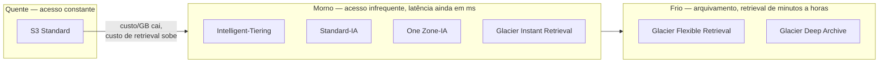
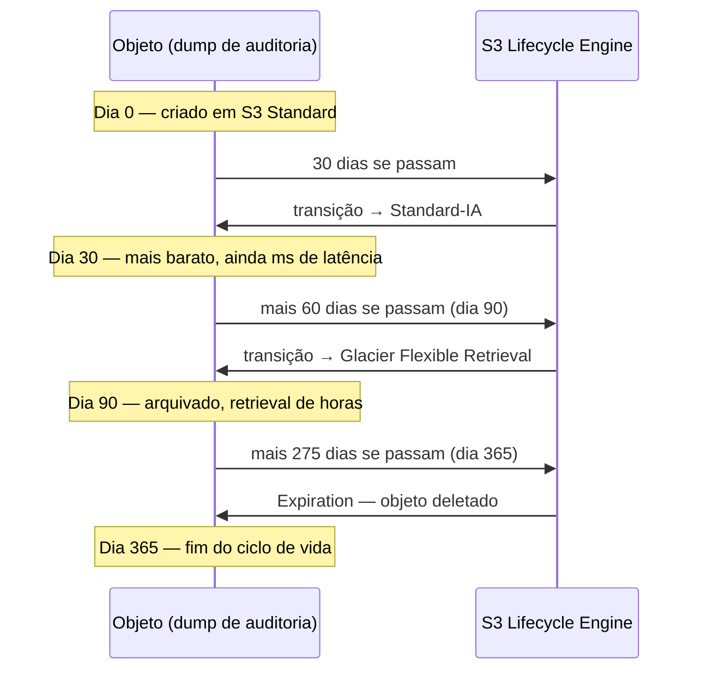
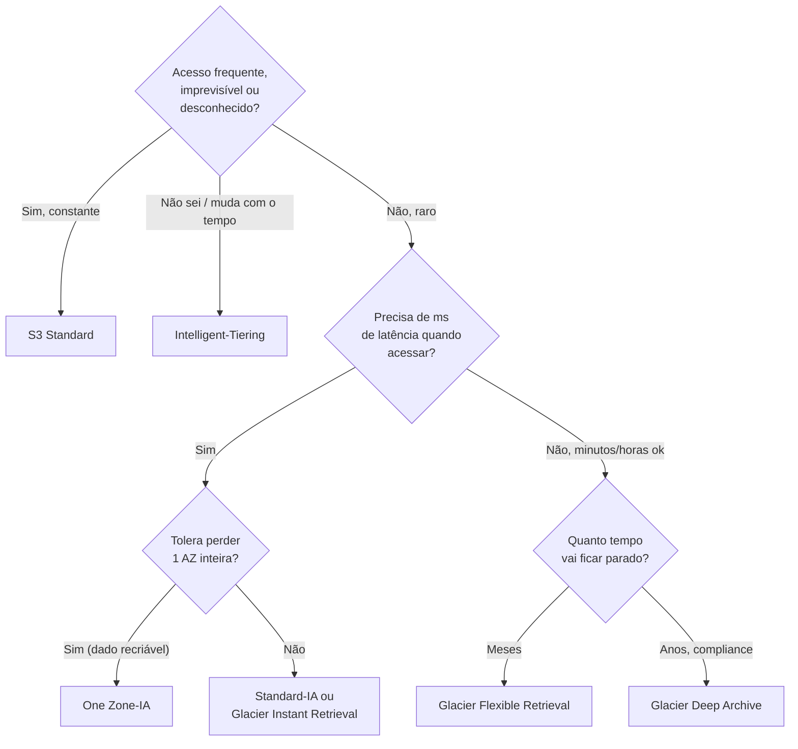

# Classes de acesso e lifecycle

> [!abstract] TL;DR
> Um bucket S3 trata todo objeto como igualmente "quente" por padrão — mesmo custo por GB, mesma latência de milissegundos, não importa se o objeto foi lido há cinco minutos ou não é tocado há dois anos. Mas o padrão real de acesso a dados quase nunca é uniforme: logs de aplicação viram frios em semanas, backups de compliance existem só para o caso raro de uma auditoria, snapshots antigos são consultados uma vez a cada trimestre, se tanto. A ideia central desta nota é que o S3 (e seus equivalentes) oferece **classes de armazenamento** que trocam custo por GB por custo e latência de acesso — quanto mais fria a classe, mais barato guardar e mais caro/lento buscar — e que **lifecycle policies** automatizam essa transição por idade, sem exigir que ninguém fique reclassificando objeto por objeto manualmente. O detalhe que costuma passar despercebido até a fatura chegar: cada classe fria tem um **mínimo de duração de armazenamento** e, em alguns casos, um **tamanho mínimo cobrado** — otimizar cedo demais, movendo objetos pequenos ou de acesso frequente para uma classe "mais barata", pode terminar custando *mais* do que simplesmente deixar tudo em Standard.

## O problema: a fatura que dobrou sem ninguém mudar nada

Imagine um time que roda um pipeline de processamento de dados há três anos. Todo mês, o job de ETL grava relatórios em um bucket S3: um arquivo Parquet por dia, mais um dump completo de auditoria a cada fechamento mensal. Os relatórios diários são consultados o mês inteiro pelos dashboards internos — acesso constante, latência importa. Os dumps de auditoria, por outro lado, são gerados, assinados digitalmente para fins de compliance, e depois... praticamente nunca mais abertos. Só em caso de uma auditoria fiscal, o que aconteceu exatamente uma vez nos últimos três anos.

O bucket cresce, mês após mês, sem que ninguém jamais delete nada — é dado de compliance, não se apaga. E, como ninguém configurou nada além do padrão, cada byte desse histórico de três anos de dumps de auditoria continua custando o mesmo preço por GB que o relatório de hoje que está sendo lido a cada cinco minutos. A fatura de armazenamento cresce de forma linear e silenciosa, sem que o volume de acesso real tenha qualquer relação com o custo pago.

O erro de modelo mental aqui não é técnico — é assumir que "armazenamento é armazenamento", como se o S3 só tivesse um preço por GB. Na prática, a mesma durabilidade de 11 noves está disponível em pelo menos sete classes diferentes, cada uma otimizada para um padrão de acesso distinto, e a pergunta que decide qual usar não é "quanto dado eu tenho", mas **"com que frequência esse dado específico é lido, e eu me importo se o próximo acesso demorar alguns minutos, ou até horas?"**

## As classes de armazenamento do S3: um espectro, não uma lista

Segundo a documentação oficial da AWS, o S3 organiza suas classes de armazenamento ao longo de um espectro que vai de acesso instantâneo e frequente até arquivamento profundo com retrieval de horas. Cada classe abaixo, no eixo desse espectro, do "quente" pro "frio":



A tabela abaixo é o coração desta nota — cada linha é uma decisão de arquitetura, não um detalhe de preço. Os valores de custo relativo (não dólares exatos, que mudam por região e no tempo) seguem a ordem documentada pela AWS; os mínimos de duração, tamanho e a latência de retrieval são especificados na documentação oficial de classes de armazenamento:

| Classe | Custo/GB (relativo) | Cobra retrieval? | Latência de acesso | AZs | Duração mínima cobrada | Tamanho mínimo faturado |
|---|---|---|---|---|---|---|
| **S3 Standard** | Mais alto (referência) | Não | Milissegundos | ≥ 3 | Nenhuma | Nenhum |
| **S3 Intelligent-Tiering** | Igual ao tier atual + taxa de monitoramento | Não (nos tiers frequente/infrequente/archive instant) | Milissegundos | ≥ 3 | Nenhuma | 128 KB p/ auto-tiering |
| **S3 Standard-IA** | Menor que Standard | Sim | Milissegundos | ≥ 3 | 30 dias | Nenhum (mas objeto <128 KB não migra por padrão) |
| **S3 One Zone-IA** | Menor que Standard-IA | Sim | Milissegundos | 1 (uma só) | 30 dias | Nenhum |
| **S3 Glacier Instant Retrieval** | Menor que One Zone-IA | Sim | Milissegundos | ≥ 3 | 90 dias | 128 KB |
| **S3 Glacier Flexible Retrieval** | Menor ainda | Sim | Minutos a horas (restore assíncrono) | ≥ 3 | 90 dias | Nenhum |
| **S3 Glacier Deep Archive** | O mais barato de todos | Sim | Até 12h (restore assíncrono) | ≥ 3 | 180 dias | Nenhum |

> [!info] Caducidade
> Custos relativos, mínimos de duração e tamanho verificados na página oficial de classes de armazenamento da AWS (`aws.amazon.com/s3/storage-classes/`) em 2026-07-23. Os valores exatos em dólar por GB variam por região e mudam ao longo do tempo — a tabela de preços da AWS é renderizada via JavaScript e não pôde ser extraída em texto puro nesta verificação; confirme os números atuais na [calculadora oficial da AWS](https://calculator.aws/) ou na página de preços do S3 antes de orçar qualquer decisão real. O que É estável e documentado — a ordem relativa de custo, os mínimos de duração (30/90/180 dias) e os tamanhos mínimos faturados (128 KB) — foi confirmado diretamente na doc.

Vale registrar uma classe que a documentação da AWS lista ao lado das sete acima, mas que fica deliberadamente fora do escopo desta nota: **S3 Express One Zone**, otimizada para latência de acesso de dígito único de milissegundo (mais rápida até que Standard), voltada a cargas de trabalho de altíssima performance como treinamento de modelos e analytics interativo. Ela não participa do espectro "esfria por idade" que esta nota descreve — é uma classe de *performance*, não de *custo por infrequência*, e por isso não aparece como destino nem origem típica de uma lifecycle policy de arquivamento.

Note que **One Zone-IA vive numa única zona de disponibilidade** — é a única classe "padrão" (fora do Reduced Redundancy legado) que abre mão de multi-AZ para ficar mais barata. Isso significa durabilidade um degrau abaixo das outras classes na prática operacional: se aquela AZ específica tiver uma falha física que destrua o storage local, o objeto pode ser perdido, mesmo com os "11 noves" nominais de durabilidade dentro da própria zona. A AWS recomenda essa classe só para dados que podem ser recriados de outra fonte (uma cópia derivada, um cache reconstruível) — nunca para o único exemplar de um dado importante. Essa é exatamente a fronteira de durabilidade/replicação que a nota seguinte desta trilha aprofunda.

### Intelligent-Tiering: deixar o próprio S3 decidir

A classe **Intelligent-Tiering** resolve um problema diferente: e se o padrão de acesso do objeto não for previsível, ou mudar com o tempo? Em vez de o time decidir manualmente quando um objeto "esfriou" o suficiente para migrar, o Intelligent-Tiering monitora o padrão de acesso de cada objeto e o move automaticamente entre tiers internos — do tier frequente para o infrequente após 30 dias sem acesso, e opcionalmente para tiers de arquivamento (Archive Instant Access, Archive Access, Deep Archive Access) configuráveis pelo usuário. A cobrança é o custo do tier em que o objeto está no momento, mais uma taxa de monitoramento e automação pequena por objeto — é esse preço de monitoramento, não uma tarifa de retrieval, que substitui a necessidade de uma lifecycle policy manual.

```bash
# Fazer upload já direto na classe Intelligent-Tiering
$ aws s3 cp relatorio-mensal.parquet s3://meu-bucket/relatorios/ \
    --storage-class INTELLIGENT_TIERING

# Habilitar os tiers de arquivamento automático (opcional, mais economia
# para objetos que ficam realmente parados por meses)
$ aws s3api put-bucket-intelligent-tiering-configuration \
    --bucket meu-bucket \
    --id "arquivamento-automatico" \
    --intelligent-tiering-configuration '{
        "Id": "arquivamento-automatico",
        "Status": "Enabled",
        "Tierings": [
            {"Days": 90, "AccessTier": "ARCHIVE_ACCESS"},
            {"Days": 180, "AccessTier": "DEEP_ARCHIVE_ACCESS"}
        ]
    }'
```

> [!tip] Assista: AWS re:Invent 2021 — Amazon S3 Lifecycle best practices to optimize your storage spend
> **Canal:** AWS Events | **Duração:** ~51min | **Idioma:** EN
>
> Talk oficial da AWS inteiramente dedicada a lifecycle e classes de armazenamento — cobre o mesmo mapa de classes desta nota (Standard até Glacier Deep Archive) com exemplos de padrões de acesso reais que motivam cada transição. Vale assistir a primeira parte para ver o raciocínio por trás do Intelligent-Tiering antes de seguir pras lifecycle policies manuais.
> Trecho de destaque [2:00]: *"so esri intelligent tiering is the only storage class in the cloud [that delivers automatic storage cost savings]"*
>
> 🎬 [Assistir no YouTube](https://www.youtube.com/watch?v=yGNXn7jOytA)

## Lifecycle policies: transição automática por idade

Se o padrão de acesso de um conjunto de objetos *é* previsível — como no cenário de abertura, onde dumps de auditoria envelhecem de forma determinística — a resposta certa não é o monitoramento contínuo do Intelligent-Tiering, é uma **lifecycle policy**: uma regra declarada uma vez, que o S3 aplica automaticamente todo dia, movendo (ou expirando) objetos com base na idade deles.



A configuração de lifecycle é um documento JSON (ou XML, via console) anexado ao bucket, com até 1.000 regras por bucket. Cada regra tem um filtro (prefixo, tag, tamanho, ou combinação) e uma ou mais ações — `Transition`, `Expiration`, `NoncurrentVersionTransition`, `NoncurrentVersionExpiration`, e `AbortIncompleteMultipartUpload`. O exemplo abaixo implementa exatamente o fluxo do diagrama acima, para o prefixo `auditoria/`:

```json
{
    "Rules": [
        {
            "ID": "ciclo-de-vida-auditoria",
            "Status": "Enabled",
            "Filter": {
                "Prefix": "auditoria/"
            },
            "Transitions": [
                {
                    "Days": 30,
                    "StorageClass": "STANDARD_IA"
                },
                {
                    "Days": 90,
                    "StorageClass": "GLACIER"
                }
            ],
            "Expiration": {
                "Days": 365
            },
            "AbortIncompleteMultipartUpload": {
                "DaysAfterInitiation": 7
            }
        }
    ]
}
```

Aplicar essa configuração ao bucket é um único comando de CLI, apontando para um arquivo local com o JSON acima:

```bash
$ aws s3api put-bucket-lifecycle-configuration \
    --bucket meu-bucket \
    --lifecycle-configuration file://lifecycle-auditoria.json

# Verificar o que está configurado hoje
$ aws s3api get-bucket-lifecycle-configuration --bucket meu-bucket
```

Três detalhes da documentação oficial da AWS que mudam como essa regra realmente se comporta na prática:

1. **A transição segue um "modelo de cascata".** A AWS só permite transições em uma ordem específica: Standard → Standard-IA/Intelligent-Tiering/One Zone-IA/qualquer Glacier; Standard-IA → Intelligent-Tiering/One Zone-IA/qualquer Glacier; e assim por diante, sempre "esfriando", nunca "esquentando" numa única regra. Não existe uma regra de lifecycle que volte um objeto do Glacier Deep Archive para o Standard — isso exige uma operação de *restore* manual seguida de um *copy* explícito com a nova classe.
2. **Cada classe fria tem seu mínimo de duração cobrado, e a AWS não deixa violar isso numa única regra.** Se Glacier Instant Retrieval exige 90 dias mínimos, você não pode configurar uma transição para ele no dia 4 e depois para Deep Archive no dia 20 — a AWS obriga que a segunda transição só aconteça a partir do dia 94 (90 + 4). É possível configurar duas regras separadas que violem essa janela, mas aí você paga a diferença como cobrança de duração mínima mesmo assim.
3. **Objetos menores que 128 KB não migram por padrão**, desde uma mudança de comportamento da AWS em setembro de 2024 — antes disso, objetos pequenos migravam livremente para Glacier Flexible Retrieval e Deep Archive. Hoje, é preciso um filtro explícito de tamanho (`ObjectSizeGreaterThan`) para permitir a transição de objetos pequenos, justamente porque o custo da *requisição* de transição pode superar a economia de armazenamento gerada por ela.
4. **A transição para Glacier tem um custo de armazenamento "extra" embutido, que não existe para Standard-IA/One Zone-IA.** Segundo a documentação oficial, cada objeto transicionado para Glacier Flexible Retrieval ou Deep Archive ganha 8 KB de metadados cobrados à taxa Standard (para permitir listagem em tempo real via API) mais 32 KB de índice cobrados à taxa da própria classe Glacier — 40 KB de overhead fixo por objeto, que pesa proporcionalmente mais quanto menor for o objeto original. É outro motivo prático para agregar muitos objetos pequenos num arquivo maior antes de arquivar, em vez de arquivar cada um individualmente.
5. **Regras baseadas em tag são avaliadas de forma assíncrona, não instantânea.** A AWS reavalia filtros baseados em tag diariamente e enfileira a ação correspondente para execução assíncrona; no momento da execução, ela reconfirma se a tag que disparou a regra ainda está presente. Remover uma tag não cancela a transição de forma garantida e imediata — existe uma janela não determinística entre avaliação e execução em que a ação pode disparar mesmo depois da tag ter sido removida.
6. **A transição pode "valer" antes de fisicamente acontecer — exceto para Intelligent-Tiering.** A AWS cobra pela classe de destino a partir da data em que a regra de lifecycle é satisfeita, mesmo que a transição física do objeto ainda não tenha ocorrido — os mínimos de duração e o overhead de metadados do Glacier já começam a contar a partir desse ponto. A única exceção documentada é a transição para Intelligent-Tiering, cuja mudança de cobrança só ocorre depois que a transição física de fato se completa — uma assimetria pequena, mas que pode confundir uma reconciliação de fatura feita no detalhe.

```json
{
    "Rules": [
        {
            "ID": "permitir-objetos-pequenos",
            "Status": "Enabled",
            "Filter": {
                "And": {
                    "Prefix": "logs/",
                    "ObjectSizeGreaterThan": 0
                }
            },
            "Transitions": [
                {"Days": 90, "StorageClass": "GLACIER"}
            ]
        }
    ]
}
```

### Limpando o que sobra: versões antigas e uploads incompletos

Lifecycle não serve só para esfriar objetos — duas ações resolvem dois tipos comuns de "lixo" que se acumula silenciosamente num bucket:

- **`NoncurrentVersionExpiration`**: se o bucket tem versionamento habilitado (assunto da próxima nota desta trilha), cada sobrescrita ou "delete" gera uma versão não corrente que continua ocupando espaço e sendo cobrada, indefinidamente, a menos que uma regra a expire depois de N dias.
- **`AbortIncompleteMultipartUpload`**: um upload multipart que falha no meio (conexão caiu, cliente travou) deixa partes órfãs no bucket — elas não aparecem numa listagem normal de objetos, mas são cobradas como armazenamento até alguém as remover. É, de longe, a fonte de custo "invisível" mais comum em buckets com upload direto do navegador ou de pipelines instáveis.

```json
{
    "Rules": [
        {
            "ID": "limpeza-geral",
            "Status": "Enabled",
            "Filter": {},
            "NoncurrentVersionExpiration": {
                "NoncurrentDays": 30
            },
            "AbortIncompleteMultipartUpload": {
                "DaysAfterInitiation": 7
            }
        }
    ]
}
```

## Escolhendo a classe certa: uma árvore de decisão

As sete classes da tabela acima parecem muitas opções para memorizar de uma vez, mas a escolha real se reduz a três perguntas em sequência — frequência de acesso, tolerância à latência de retrieval, e se o padrão de acesso é sequer previsível:



## Trazendo um objeto de volta: restaurar do Glacier

Diferente de Standard, Standard-IA, One Zone-IA e Glacier Instant Retrieval — todas legíveis via `GET` normal, com latência de milissegundos —, objetos em Glacier Flexible Retrieval e Glacier Deep Archive **não são acessíveis diretamente**. É preciso primeiro emitir um pedido de *restore*, que cria uma cópia temporária em S3 Standard, disponível pelo número de dias que você especificar, antes de ser removida de novo (o objeto continua arquivado no Glacier durante todo esse processo).

```bash
# Pedido de restore padrão — cópia temporária disponível por 3 dias
$ aws s3api restore-object \
    --bucket meu-bucket \
    --key auditoria/dump-2023-06.parquet \
    --restore-request '{
        "Days": 3,
        "GlacierJobParameters": {"Tier": "Standard"}
    }'

# Checar se a cópia temporária já está pronta
$ aws s3api head-object --bucket meu-bucket --key auditoria/dump-2023-06.parquet
```

A AWS oferece três velocidades de retrieval — Expedited, Standard e Bulk — cada uma com um trade-off de tempo contra custo, segundo a documentação oficial de opções de restore:

| Tier de retrieval | Glacier Flexible Retrieval | Glacier Deep Archive | Custo |
|---|---|---|---|
| **Expedited** | 1–5 minutos | Não disponível | Mais caro, cobrado por objeto |
| **Standard** | 3–5 horas | Até 12 horas | Custo médio |
| **Bulk** | 5–12 horas | Até 48 horas | Mais barato, ideal para restaurar muitos objetos de uma vez |

> [!warning] Restore de Glacier custa duas vezes ao mesmo tempo
> Enquanto a cópia temporária existe, você paga o armazenamento da cópia (a taxa de S3 Standard) **e** o armazenamento do original arquivado (a taxa Glacier), simultaneamente — além da tarifa de retrieval em si. Restaurar um dataset inteiro "só para conferir" e esquecer de reduzir o número de dias da cópia temporária é uma forma silenciosa de pagar em dobro por semanas.

### Auditando em que classe cada objeto está hoje

Antes de desenhar qualquer lifecycle policy nova, vale a pergunta mais simples de todas: o que já está no bucket, e em que classe? A API de listagem de objetos do S3 devolve a classe de armazenamento de cada item, o que permite um inventário rápido sem esperar por uma ferramenta de análise:

```bash
$ aws s3api list-objects-v2 \
    --bucket meu-bucket \
    --prefix auditoria/ \
    --query 'Contents[].{Key: Key, Classe: StorageClass, TamanhoBytes: Size}' \
    --output table
------------------------------------------------------------
|                      ListObjectsV2                        |
+---------------------------+---------------+---------------+
|          Classe           |     Key       | TamanhoBytes  |
+---------------------------+---------------+---------------+
|  STANDARD                 |  dump-jan.txt |  52428800     |
|  STANDARD_IA              |  dump-fev.txt |  48234112     |
|  GLACIER                  |  dump-nov.txt |  51200000     |
+---------------------------+---------------+---------------+
```

Esse comando simples já responde metade da pergunta que o Storage Class Analysis automatiza: se um prefixo inteiro que deveria ter migrado para Glacier há meses ainda aparece como `STANDARD_IA`, é sinal de que a lifecycle policy não está configurada como esperado — ou nunca foi aplicada a esse prefixo específico.

## Storage Class Analysis: medir antes de mover

A tentação natural, depois de entender essa tabela de classes, é sair reconfigurando lifecycle policies agressivas em todo bucket existente. A AWS oferece uma ferramenta especificamente para evitar esse exagero: **S3 Storage Class Analysis**, que observa os padrões reais de acesso de um bucket ao longo do tempo e recomenda — com base em dados observados, não em suposição — quando uma transição para IA realmente compensa.

```bash
$ aws s3api put-bucket-analytics-configuration \
    --bucket meu-bucket \
    --id "analise-padroes-acesso" \
    --analytics-configuration '{
        "Id": "analise-padroes-acesso",
        "StorageClassAnalysis": {
            "DataExport": {
                "OutputSchemaVersion": "V_1",
                "Destination": {
                    "S3BucketDestination": {
                        "Format": "CSV",
                        "Bucket": "arn:aws:s3:::meu-bucket-relatorios",
                        "Prefix": "analise-storage-class/"
                    }
                }
            }
        }
    }'
```

O motivo de existir uma ferramenta inteira só para isso é o próprio ponto central desta nota: **Standard-IA e One Zone-IA têm mínimo de 30 dias de duração cobrada e cobram retrieval por GB** — se um objeto é acessado com frequência maior do que essa janela permite amortizar, ou se ele é pequeno o suficiente para a taxa de request pesar proporcionalmente mais que a economia de armazenamento, mover para IA pode custar *mais* do que deixar em Standard. Otimização de custo de storage não é uma tabela de decisão fixa — é medição de padrão real de acesso, comparada contra o breakeven de cada classe.

Vale entender o mecanismo do breakeven com números ilustrativos (não são preços reais da AWS — servem só para expor a mecânica do cálculo, que qualquer engenheiro deveria conseguir reproduzir com os preços vigentes na hora da decisão). Suponha uma classe fria hipotética que custe metade do preço de armazenamento da Standard, mas cobre uma tarifa de retrieval por GB lido:

| Cenário | Armazenamento (12 meses) | Retrievals no período | Custo de retrieval | Total | Vale a pena mover? |
|---|---|---|---|---|---|
| Objeto lido 1x/ano | Metade do custo de Standard | 1 leitura completa | Baixo (poucos GB) | Menor que ficar em Standard | Sim |
| Objeto lido 1x/mês | Metade do custo de Standard | 12 leituras completas | Acumula 12x a tarifa de retrieval | Pode ultrapassar o custo de Standard | Depende do preço de retrieval vs. a diferença de armazenamento |
| Objeto lido 1x/semana | Metade do custo de Standard | 52 leituras completas | Acumula 52x a tarifa de retrieval | Quase sempre maior que Standard | Não |

O padrão que emerge é sempre o mesmo, independente dos preços exatos vigentes: existe um número de acessos por período acima do qual a economia de armazenamento da classe fria é anulada (ou revertida) pela soma das tarifas de retrieval. Esse ponto de equilíbrio é diferente para cada par de classes e para cada região — é exatamente o que o Storage Class Analysis calcula automaticamente, a partir do histórico real de acesso do bucket, em vez de depender de uma estimativa feita de cabeça.

> [!warning] O mínimo de IA morde objeto pequeno e objeto "quase quente"
> Um objeto de 50 KB movido para Standard-IA paga o mesmo custo de request de transição que um objeto de 50 GB — mas a economia de armazenamento de um objeto de 50 KB é irrisória. Pior: se esse objeto pequeno acaba sendo lido de novo antes dos 30 dias mínimos se completarem, você paga tanto a tarifa de retrieval quanto, efetivamente, o custo do mínimo de duração não cumprido. A régua prática: só mover para IA prefixos/tags cujo padrão de acesso real (medido, não estimado) mostra intervalo entre leituras consistentemente maior que 30 dias, e cujo tamanho médio de objeto justifica a taxa de transição.

## Lente dupla: DigitalOcean, Azure e GCP

**DigitalOcean Spaces** resolve o mesmo problema de custo com uma filosofia deliberadamente mais simples do que a AWS: em vez de sete classes com mínimos e cobranças de retrieval diferentes, a Spaces oferece hoje dois níveis — o tier **Standard**, com um preço único simples de armazenamento por GB (mais uma cota generosa de transferência de saída incluída), e um tier separado, mais recente, chamado **Cold Storage**, para dados acessados raramente, com preço por GB de armazenamento mais baixo, cobrança de retrieval por GB lido, e uma penalidade de deleção antecipada se o objeto sair antes de um mínimo de 30 dias.

```bash
# DigitalOcean — Spaces não tem "storage class" por objeto no estilo S3;
# a escolha é entre criar o bucket no tier Standard ou no tier Cold
$ s3cmd put arquivo.parquet s3://meu-space/dados/ --storage-class=STANDARD

# doctl não expõe transição de storage class objeto a objeto hoje —
# a gestão de tier acontece no nível do bucket/space, não por lifecycle rule granular
$ doctl compute spaces ls
```

Essa simplicidade é, ao mesmo tempo, força e limitação, e vale nomear as duas com igual honestidade:

- **Força**: previsibilidade. Não existe a armadilha desta nota inteira — mínimo de 30/90/180 dias por classe, tamanho mínimo faturado, cascata obrigatória de transições — porque só existem dois níveis, e a diferença de preço entre eles já é grande o bastante para ser óbvia sem uma ferramenta de análise dedicada.
- **Limitação**: não há um equivalente a Glacier Deep Archive. Para arquivamento de dados que realmente não precisam nunca de acesso rápido — o caso de uso mais barato possível na AWS — a Spaces não tem uma classe "ultra-fria" com preço proporcionalmente mais baixo; o Cold Storage é o piso, e ele ainda é sensivelmente mais caro por GB do que Glacier Deep Archive.

Azure e GCP, por outro lado, seguem uma filosofia de tiers muito mais parecida com a da AWS — vale a tabela de tradução, mas sem hands-on aqui (fora de escopo desta trilha, focada em AWS/DigitalOcean):

| Conceito | AWS S3 | Azure Blob Storage | Google Cloud Storage |
|---|---|---|---|
| Quente, sem mínimo de duração | Standard | Hot | Standard |
| Morno, infrequente, ms de latência | Standard-IA / One Zone-IA | Cool (mín. 30 dias) / Cold (mín. 90 dias) | Nearline (mín. 30 dias) |
| Frio, retrieval rápido (ms) mas com taxa | Glacier Instant Retrieval | — (Cold já cobre esse caso) | — |
| Arquivamento, retrieval de horas | Glacier Flexible Retrieval | Archive (mín. 180 dias, até 15h de rehydration) | Coldline (mín. 90 dias) |
| Arquivamento profundo, mais barato | Glacier Deep Archive | — (Archive é o piso) | Archive (mín. 365 dias) |
| Tiering automático por padrão de acesso | Intelligent-Tiering | Smart tier (Hot/Cool/Cold automático) | Autoclass |

> [!info] Caducidade
> Tiers de Azure Blob Storage (Hot/Cool/Cold/Archive, mínimos de 30/90/180 dias, rehydration de até 15h) verificados na documentação oficial da Microsoft (`learn.microsoft.com/azure/storage/blobs/access-tiers-overview`) em 2026-07-23. Classes do Google Cloud Storage (Standard/Nearline/Coldline/Archive, mínimos de 30/90/365 dias) e o recurso Autoclass verificados na documentação oficial do Google Cloud em 2026-07-23. Preço da DigitalOcean Spaces Cold Storage (armazenamento, retrieval por GB, penalidade de deleção antecipada de 30 dias) verificado na página oficial de preços da DigitalOcean em 2026-07-23 — todos os três provedores ajustam preços e mínimos com alguma frequência; confirme antes de orçar.

## Armadilhas comuns

> [!warning] Cascata obrigatória — não dá para "pular direto" para o arquivamento mais barato numa única regra sem respeitar o mínimo anterior
> Uma regra de lifecycle que tenta mover um objeto para Glacier Deep Archive antes de ele ter passado pelo mínimo de duração das classes intermediárias que ele atravessou é rejeitada ou cobrada retroativamente pelo mínimo não cumprido — a AWS não deixa "furar fila" para economizar tempo na transição.

> [!warning] Esquecer de limpar multipart uploads incompletos
> Sem uma regra `AbortIncompleteMultipartUpload`, partes de upload que falharam continuam sendo cobradas indefinidamente, sem aparecer numa listagem normal de objetos do bucket — um dos custos "fantasma" mais comuns em pipelines com upload direto de cliente.

> [!warning] Retrieval de Glacier custa e demora — não é um substituto direto de Standard "mais barato"
> Tratar Glacier Flexible Retrieval ou Deep Archive como só "mais uma classe barata" para dados que na real precisam de acesso ocasional-mas-rápido é um erro caro: cada acesso exige um pedido de restore, uma espera de horas (ou até 48h no Bulk de Deep Archive), e uma cobrança dupla enquanto a cópia temporária existe.

> [!warning] Mover objeto pequeno ou de acesso frequente para IA sem medir primeiro
> Como visto na seção de Storage Class Analysis: sem dados reais de padrão de acesso, uma lifecycle policy "por instinto" pode aumentar o custo total em vez de reduzi-lo — o mínimo de 30 dias e a cobrança de retrieval por GB mordem justamente os casos em que a intuição costuma errar.

## Casos práticos

**O dump de auditoria do cenário de abertura.** Com a lifecycle policy do exemplo desta nota, o objeto passa 30 dias em Standard (ainda sendo consultado pelo fechamento do mês), migra para Standard-IA (acesso raro, mas ainda instantâneo se uma auditoria pontual precisar dele), arquiva em Glacier Flexible Retrieval aos 90 dias (a maior parte da vida do objeto, com custo mínimo), e expira definitivamente ao completar um ano — sem que ninguém precise tocar em nada depois da configuração inicial.

**A migração AWS-first tentando replicar a mesma granularidade na DigitalOcean.** Um time acostumado a modelar sete classes de storage na AWS, ao migrar um bucket de backup para a DigitalOcean Spaces, tende a procurar um "Glacier equivalente" e não encontra um arquivamento tão barato quanto o Deep Archive — a tradução correta não é "falta uma classe", é aceitar que a Spaces otimiza para simplicidade operacional, não para o menor custo absoluto por GB em arquivamento profundo, e ajustar a expectativa de fatura de acordo.

**O bucket de dataset de machine learning com padrão de acesso bimodal.** Um time de dados mantém um bucket com milhões de imagens de treino: a maioria nunca mais é lida depois do treinamento inicial, mas um subconjunto pequeno e imprevisível é reaproveitado repetidamente em experimentos subsequentes — sem um padrão de idade claro que uma lifecycle policy por data conseguisse capturar. Esse é exatamente o caso de uso que o Intelligent-Tiering foi desenhado para resolver: em vez de adivinhar uma regra de idade, o próprio S3 observa, objeto por objeto, quais imagens continuam sendo puxadas e mantém essas no tier frequente, movendo o resto para tiers mais baratos automaticamente — sem exigir uma nova rodada de análise cada vez que o padrão de uso do time muda.

## O que vem a seguir

Esta nota tratou do eixo **custo** do object storage — como pagar menos por dados que ninguém olha com frequência. Mas custo não é a única dimensão que importa num bucket de produção: o mesmo objeto que hoje migra tranquilamente entre classes de armazenamento também pode ser sobrescrito por engano, deletado por um script com bug, ou corrompido por uma falha de aplicação — e nada do que vimos aqui protege contra isso. A próxima nota desta trilha trata do eixo **proteção**: versionamento, replicação entre regiões, e o Object Lock que impede até um administrador de apagar um objeto antes da hora.

## Fontes

- [AWS S3 — Storage Classes](https://aws.amazon.com/s3/storage-classes/) — comparação completa das sete classes (Standard, Standard-IA, One Zone-IA, Intelligent-Tiering, Glacier Instant Retrieval, Glacier Flexible Retrieval, Glacier Deep Archive), mínimos de duração e tamanho, latência, número de AZs, durabilidade; acessado em 2026-07-23.
- [AWS S3 — Transitioning objects using Amazon S3 Lifecycle](https://docs.aws.amazon.com/AmazonS3/latest/userguide/lifecycle-transition-general-considerations.html) — modelo de cascata de transições suportadas, restrição de objetos <128 KB (mudança de setembro de 2024), cobrança por transição antes do mínimo de duração, overhead de metadados no arquivamento em Glacier; acessado em 2026-07-23.
- [AWS S3 — Elements to describe lifecycle actions](https://docs.aws.amazon.com/AmazonS3/latest/userguide/intro-lifecycle-rules.html) — elementos de uma lifecycle configuration (Transition, Expiration, NoncurrentVersionTransition, NoncurrentVersionExpiration, AbortIncompleteMultipartUpload, ExpiredObjectDeleteMarker), filtros por prefixo/tag/tamanho; acessado em 2026-07-23.
- [AWS S3 — Restoring archived objects: retrieval options](https://docs.aws.amazon.com/AmazonS3/latest/userguide/restoring-objects-retrieval-options.html) — tempos de retrieval Expedited/Standard/Bulk para Glacier Flexible Retrieval e Glacier Deep Archive; acessado em 2026-07-23.
- [AWS S3 Pricing](https://aws.amazon.com/s3/pricing/) — página oficial de preços (tabela renderizada via JavaScript; consulte a calculadora oficial para valores exatos por região); acessado em 2026-07-23.
- [DigitalOcean — Spaces Pricing](https://docs.digitalocean.com/products/spaces/details/pricing/) — modelo de dois tiers (Standard e Cold Storage), preço por GB, retrieval do Cold Storage, penalidade de deleção antecipada de 30 dias; acessado em 2026-07-23.
- [Azure — Access tiers for blob data](https://learn.microsoft.com/en-us/azure/storage/blobs/access-tiers-overview) — tiers Hot/Cool/Cold/Archive, mínimos de retenção de 30/90/180 dias, latência de rehydration do Archive (até 15h), Smart tier; acessado em 2026-07-23.
- [Google Cloud — Storage classes](https://docs.cloud.google.com/storage/docs/storage-classes) — classes Standard/Nearline/Coldline/Archive, mínimos de duração de 30/90/365 dias, disponibilidade por classe, feature Autoclass; acessado em 2026-07-23.
