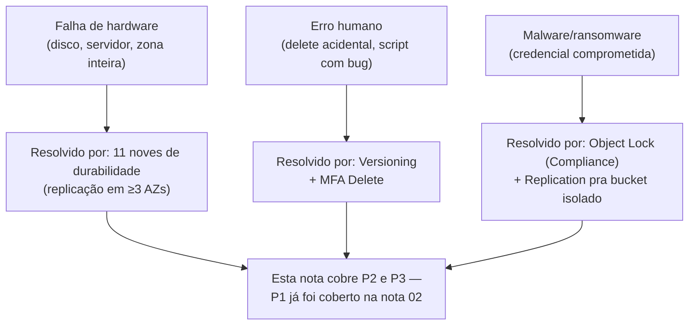
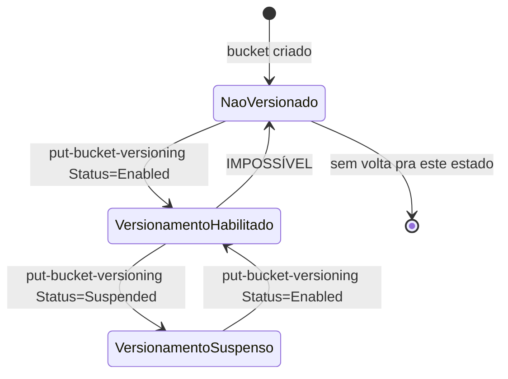
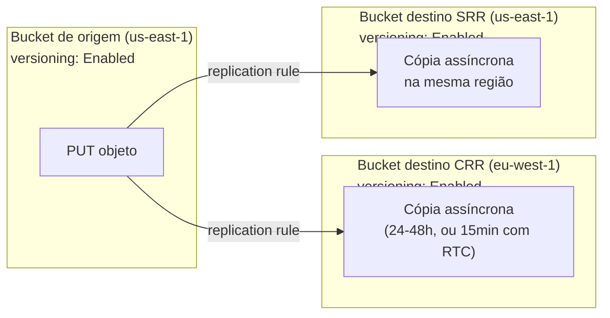
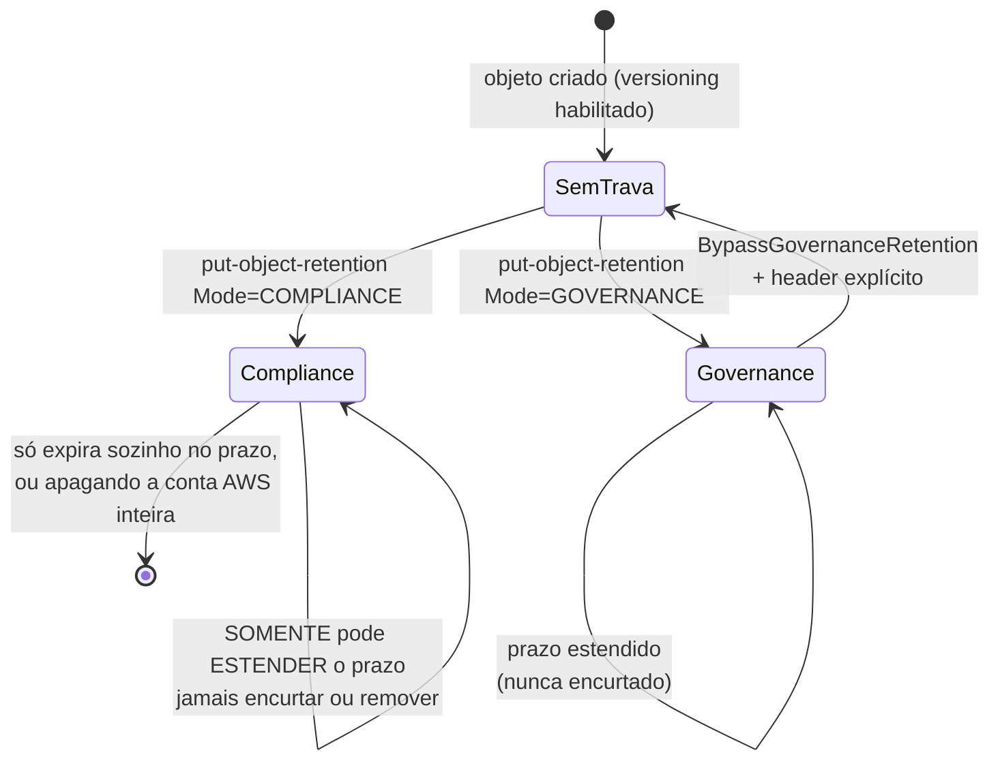

# Versioning, durabilidade e proteção

> [!abstract] TL;DR
> A nota 02 desta trilha fechou com um número tranquilizador: 99,999999999% de durabilidade, os "11 noves". Essa nota abre exatamente onde aquela terminou, para desmontar uma confusão perigosa — os 11 noves protegem contra **falha de hardware** (disco morto, zona de disponibilidade inteira caindo), não contra um `DELETE` disparado por um script com bug, um `rm -rf` mental via console, ou um ransomware que criptografa e sobrescreve tudo que encontra com as credenciais que conseguiu roubar. Contra esse segundo tipo de risco, o S3 oferece camadas adicionais, cada uma resolvendo uma fatia diferente do problema: **versioning** guarda toda versão anterior de um objeto e transforma um delete simples num "marcador" reversível em vez de uma perda real; **replication** (CRR entre regiões, SRR na mesma região) copia objetos para um bucket separado, útil tanto para disaster recovery quanto para isolar um blast radius de conta comprometida; **Object Lock** impõe verdadeiro WORM — write-once-read-many — com um modo (Compliance) que nem o usuário root consegue burlar antes do prazo vencer; e **MFA Delete** exige um segundo fator físico para apagar uma versão ou desligar o versionamento. Nenhuma dessas camadas substitui as outras — elas se empilham, e a pergunta certa não é "qual devo usar" mas "contra qual adversário específico cada uma protege".

## O problema: durável não é o mesmo que protegido

Imagine um bucket de produção guardando dumps diários de banco de dados — exatamente o cenário de backup descrito na nota 02. Durabilidade de 11 noves garante, com uma confiança estatística que beira a certeza, que nenhum desses arquivos vai desaparecer por causa de um disco defeituoso ou uma zona de disponibilidade inteira saindo do ar. Isso é real e importante. Mas um dia, um engenheiro roda um script de limpeza automatizada com uma condição de filtro invertida por engano, e ele apaga três meses de backups em bucket que jamais teve versionamento habilitado. Os 11 noves não fazem nada aqui — cada `DELETE` foi executado com sucesso, replicado nas três zonas de disponibilidade como deveria, e cada cópia durável foi apagada de forma igualmente durável. Durabilidade nunca prometeu proteção contra uma operação de escrita autorizada e bem-sucedida que o próprio dono dos dados decidiu (ainda que por engano) executar.

O mesmo raciocínio vale, de forma ainda mais hostil, para ransomware: um invasor que obtém credenciais válidas de acesso ao bucket não precisa "quebrar" a durabilidade do S3 — ele só precisa fazer `PUT` (sobrescrevendo o conteúdo com uma versão criptografada) ou `DELETE` usando a própria API legítima do serviço. Do ponto de vista do S3, é uma operação de escrita como qualquer outra, executada com sucesso, e replicada com toda a confiabilidade de sempre. A pergunta que este cenário força é: **o que acontece depois que uma escrita ou exclusão indesejada já foi aceita pelo serviço?** É exatamente aqui que versioning, replication, Object Lock e MFA Delete entram — não para impedir a operação de acontecer (isso é trabalho de IAM e bucket policy), mas para garantir que ela seja **reversível**, ou em alguns casos, **impossível de executar de verdade** mesmo com credenciais válidas em mãos.



## Durabilidade vs. disponibilidade: dois números que respondem perguntas diferentes

Antes de entrar nos mecanismos, vale reforçar uma distinção que a nota 02 já introduziu, porque ela é a base de todo o resto desta nota. Segundo a documentação oficial da AWS, o S3 Standard "é projetado para fornecer 99,999999999% de durabilidade e 99,99% de disponibilidade de objetos ao longo de um determinado ano" — são duas métricas independentes:

| Métrica | O que mede | Pergunta que responde | Como é obtida |
|---|---|---|---|
| Durabilidade (11 noves) | Probabilidade de o objeto **nunca ser perdido de forma permanente** | "Esse arquivo ainda existe em algum lugar recuperável?" | Replicação redundante em um mínimo de 3 zonas de disponibilidade dentro da região |
| Disponibilidade (99,99%) | Probabilidade de o objeto **estar acessível agora**, num dado momento | "Consigo ler esse arquivo neste instante?" | Redundância operacional (múltiplos dispositivos, capacidade de servir requisições mesmo sob falha parcial) |

Um objeto pode ser perfeitamente durável (nunca perdido) e ainda assim indisponível por alguns minutos durante um evento raro — os 0,01% de indisponibilidade anual do SLA não significam perda de dado, só uma janela em que uma leitura específica falhou. E, inversamente, um objeto pode estar 100% disponível neste segundo e ainda assim ter sido apagado por um `DELETE` legítimo cinco minutos atrás — a durabilidade não tem opinião sobre isso, porque do ponto de vista do serviço, apagar um objeto com sucesso *é* o comportamento correto e esperado, não uma falha de durabilidade. Essa é a confusão central que motiva toda esta nota: **11 noves é uma garantia sobre a infraestrutura física, não sobre a intenção de quem está operando o bucket.**

## Versioning: transformar delete em marcador reversível

O mecanismo central desta nota é o **S3 Versioning**. Segundo a documentação oficial, "com o versionamento, você pode preservar, recuperar e restaurar toda versão de todo objeto armazenado nos seus buckets" — e o comportamento que muda tudo: "se você apagar um objeto, o Amazon S3 insere um marcador de exclusão em vez de removê-lo permanentemente. O marcador de exclusão se torna a versão atual do objeto." Nada é fisicamente apagado por um `DELETE` simples num bucket versionado — o objeto some da visão "atual" porque o marcador de exclusão assume esse posto, mas todas as versões anteriores continuam lá, recuperáveis.

Um bucket versionado existe em um de três estados, e a transição entre eles é importante entender: **não-versionado** (padrão de todo bucket novo), **versionamento habilitado**, e **versionamento suspenso**. A documentação é explícita sobre uma restrição que surpreende muita gente: depois que um bucket é versionado, ele **nunca mais volta a ser não-versionado** — só é possível suspender, o que interrompe a criação de novas versões daqui para frente, sem apagar nada do que já existia.



```bash
$ aws s3api put-bucket-versioning \
    --bucket minha-empresa-backups-a1b2c3d4 \
    --versioning-configuration Status=Enabled

$ aws s3api get-bucket-versioning \
    --bucket minha-empresa-backups-a1b2c3d4
{
    "Status": "Enabled"
}
```

A linha do tempo de um objeto versionado, do primeiro upload até a exclusão e restauração, mostra por que o delete marker é o pulo do gato:

```mermaid
sequenceDiagram
    participant Cliente
    participant S3 as Bucket versionado

    Cliente->>S3: PUT relatorio.pdf
    S3-->>Cliente: version-id: v1 (versão atual)
    Cliente->>S3: PUT relatorio.pdf (sobrescreve conteúdo)
    S3-->>Cliente: version-id: v2 (nova versão atual; v1 vira não-corrente)
    Cliente->>S3: DELETE relatorio.pdf (sem version-id — delete simples)
    S3-->>Cliente: delete-marker-id: dm1 (versão atual agora É o marcador)
    Note over S3: v1 e v2 continuam existindo,<br/>só não-correntes — nada foi apagado de fato
    Cliente->>S3: DELETE relatorio.pdf?versionId=dm1 (apaga o MARCADOR especificamente)
    S3-->>Cliente: v2 volta a ser a versão atual — "restaurado"
```

Repare que "restaurar" um objeto depois de um delete acidental não é uma operação mágica de undo — é simplesmente apagar o delete marker (ou copiar a versão desejada de volta para a chave, criando uma nova versão atual com o conteúdo antigo). Ambas as abordagens funcionam; a segunda é mais segura em produção porque preserva o histórico completo em vez de reescrever a linha do tempo.

```bash
# Listar TODAS as versões de uma chave, incluindo delete markers
$ aws s3api list-object-versions \
    --bucket minha-empresa-backups-a1b2c3d4 \
    --prefix relatorio.pdf
{
    "Versions": [
        {
            "Key": "relatorio.pdf",
            "VersionId": "v2exampleFEDCBA",
            "IsLatest": false,
            "LastModified": "2026-07-20T14:00:00.000Z",
            "Size": 512000
        },
        {
            "Key": "relatorio.pdf",
            "VersionId": "v1exampleABCDEF",
            "IsLatest": false,
            "LastModified": "2026-07-10T09:00:00.000Z",
            "Size": 480000
        }
    ],
    "DeleteMarkers": [
        {
            "Key": "relatorio.pdf",
            "VersionId": "dm1examplexxxxx",
            "IsLatest": true,
            "LastModified": "2026-07-23T18:30:00.000Z"
        }
    ]
}

# Abordagem 1: apagar o delete marker específico — o objeto "reaparece"
# com a versão anterior à exclusão como atual
$ aws s3api delete-object \
    --bucket minha-empresa-backups-a1b2c3d4 \
    --key relatorio.pdf \
    --version-id dm1examplexxxxx

# Abordagem 2 (mais segura em produção): copiar a versão antiga
# de volta como uma NOVA versão atual, preservando o histórico completo
$ aws s3api copy-object \
    --bucket minha-empresa-backups-a1b2c3d4 \
    --copy-source "minha-empresa-backups-a1b2c3d4/relatorio.pdf?versionId=v2exampleFEDCBA" \
    --key relatorio.pdf
```

O custo é a contrapartida direta desse poder de recuperação: segundo a documentação, "tarifas normais do Amazon S3 se aplicam a cada versão de um objeto armazenada e transferida (...) cada versão de um objeto é o objeto inteiro; não é apenas um diff da versão anterior." Guardar três versões de um arquivo de 500 MB custa o mesmo que guardar três arquivos de 500 MB — não existe deduplicação nem armazenamento incremental por trás. Isso é o que torna **lifecycle** (nota 03 desta trilha) inseparável de versioning na prática: sem uma regra de expiração para versões não-correntes, cada sobrescrita acumula custo para sempre.

```json
{
  "Rules": [
    {
      "ID": "expirar-versoes-antigas-de-backup",
      "Status": "Enabled",
      "Filter": {},
      "NoncurrentVersionExpiration": {
        "NoncurrentDays": 90
      },
      "AbortIncompleteMultipartUpload": {
        "DaysAfterInitiation": 7
      }
    }
  ]
}
```

```bash
$ aws s3api put-bucket-lifecycle-configuration \
    --bucket minha-empresa-backups-a1b2c3d4 \
    --lifecycle-configuration file://lifecycle-versoes.json
```

> [!warning] Versioning sem lifecycle é uma fatura que só cresce
> Habilitar versionamento sem, no mesmo momento, configurar uma regra `NoncurrentVersionExpiration` é o erro de configuração mais comum e mais caro desta nota inteira. Um bucket que recebe reescritas frequentes (logs, dumps diários, arquivos de configuração) acumula uma versão inteira do objeto a cada escrita, para sempre — não existe limpeza automática por padrão. Times descobrem isso meses depois, olhando a fatura de armazenamento crescer sem nenhum aumento visível no volume de dados "ativo".

## Replication: cópia assíncrona para outro bucket

Versioning resolve "recuperar uma versão anterior dentro do mesmo bucket". Mas e se o próprio bucket inteiro — ou a conta que o hospeda — for comprometido? É aqui que entra a **replicação**, que copia objetos de um bucket de origem para um (ou mais) buckets de destino, de forma assíncrona. Segundo a documentação oficial, existem duas variantes de replicação "ao vivo": **Cross-Region Replication (CRR)**, entre buckets em regiões diferentes, e **Same-Region Replication (SRR)**, entre buckets na mesma região.

Os casos de uso documentados pela AWS são específicos por variante:

| Variante | Casos de uso documentados | Requisito |
|---|---|---|
| CRR (Cross-Region) | Compliance que exige distância geográfica maior que a das AZs padrão; reduzir latência replicando perto dos usuários; eficiência operacional entre clusters de análise em regiões diferentes | Versioning habilitado nos dois buckets |
| SRR (Same-Region) | Agregar logs de múltiplos buckets/contas num só; ambientes de produção e teste sincronizados; leis de soberania de dados que exigem múltiplas cópias sem sair do país | Versioning habilitado nos dois buckets |

Ambas exigem, segundo a documentação, que o bucket de origem tenha versionamento habilitado — a replicação usa o mecanismo de versões para saber exatamente o que já foi copiado e o que é novo. A AWS também documenta uma variante com SLA para quem precisa de previsibilidade: **S3 Replication Time Control (S3 RTC)**, que replica 99,99% dos objetos novos em até 15 minutos, contra a janela padrão de 24-48 horas (sem SLA) da replicação comum.



```json
{
  "Role": "arn:aws:iam::111122223333:role/s3-replication-role",
  "Rules": [
    {
      "ID": "replicar-backups-para-dr",
      "Status": "Enabled",
      "Priority": 1,
      "Filter": {},
      "DeleteMarkerReplication": { "Status": "Disabled" },
      "Destination": {
        "Bucket": "arn:aws:s3:::minha-empresa-backups-dr-eu-west-1",
        "StorageClass": "STANDARD_IA"
      }
    }
  ]
}
```

```bash
$ aws s3api put-bucket-replication \
    --bucket minha-empresa-backups-a1b2c3d4 \
    --replication-configuration file://replicacao-crr.json
```

Vale registrar um detalhe de segurança que a própria configuração acima ilustra: `DeleteMarkerReplication` controla se um delete marker criado na origem é replicado para o destino. Deixar isso desabilitado (o padrão em configurações antigas) é uma decisão deliberada de resiliência contra ransomware — se um invasor apaga tudo na origem, os delete markers não se propagam para o bucket de destino, que continua com as cópias intactas. É um padrão comum de "bucket de replicação como cofre" — o destino recebe cópias, mas nunca aprende sobre exclusões da origem.

> [!info] Fronteira com System Design
> A teoria por trás de replicação assíncrona multi-região — consistência eventual, quóruns, trade-offs de latência vs. durabilidade geográfica — é tratada em profundidade conceitual na trilha de System Design do vault. Esta nota cobre só a mecânica concreta do S3: como configurar, não o cálculo teórico de CAP por trás dela.

## Object Lock: WORM de verdade, com um modo irreversível

Versioning e replication protegem contra exclusão *reversível* — sempre existe alguém com permissão suficiente (ou acesso ao bucket de destino) capaz de desfazer o dano. **Object Lock** existe para o cenário em que isso não deveria ser possível: retenção regulatória, ou proteção deliberada contra um invasor que conseguiu credenciais de administrador.

Segundo a documentação oficial, o Object Lock "usa um modelo write-once-read-many (WORM) para armazenar objetos", e funciona **apenas** em buckets com versionamento habilitado — cada trava é aplicada a uma versão específica do objeto, não ao objeto como conceito abstrato. Existem duas formas de proteção, que podem coexistir: **retention period** (prazo fixo, com uma "Retain Until Date") e **legal hold** (sem prazo, dura até ser explicitamente removido por quem tem permissão).

O ponto que mais importa para esta nota é a diferença entre os dois **modos de retenção**:

| Modo | Quem pode apagar/sobrescrever antes do prazo | Reversibilidade |
|---|---|---|
| **Governance** | Ninguém, exceto quem tem a permissão `s3:BypassGovernanceRetention` e envia o header `x-amz-bypass-governance-retention:true` | Reversível por usuários autorizados — útil para testar políticas antes de ir pra Compliance |
| **Compliance** | Ninguém — nem o usuário root da conta AWS | **Irreversível.** Segundo a documentação: "a única forma de apagar um objeto sob modo compliance antes do prazo de retenção expirar é apagar a conta AWS associada" |



```bash
# Habilitar Object Lock precisa ser feito NA CRIAÇÃO do bucket
# (não é possível ativar depois num bucket já existente sem versionamento prévio)
$ aws s3api create-bucket \
    --bucket minha-empresa-compliance-a1b2c3d4 \
    --region us-east-1 \
    --object-lock-enabled-for-bucket

# Configuração default de retenção pro bucket inteiro
$ aws s3api put-object-lock-configuration \
    --bucket minha-empresa-compliance-a1b2c3d4 \
    --object-lock-configuration '{
        "ObjectLockEnabled": "Enabled",
        "Rule": {
            "DefaultRetention": {
                "Mode": "COMPLIANCE",
                "Years": 7
            }
        }
    }'

# Aplicar retenção explícita a um objeto específico (sobrescreve o default do bucket)
$ aws s3api put-object-retention \
    --bucket minha-empresa-compliance-a1b2c3d4 \
    --key contratos/contrato-2026-001.pdf \
    --version-id v1exampleABCDEF \
    --retention '{"Mode": "COMPLIANCE", "RetainUntilDate": "2033-07-23T00:00:00Z"}'

# Legal hold: sem prazo, dura até alguém remover explicitamente
$ aws s3api put-object-legal-hold \
    --bucket minha-empresa-compliance-a1b2c3d4 \
    --key contratos/contrato-2026-001.pdf \
    --version-id v1exampleABCDEF \
    --legal-hold '{"Status": "ON"}'
```

> [!warning] Object Lock em modo Compliance é uma decisão sem botão de desfazer
> Uma vez que um objeto está trancado em modo Compliance, **não existe comando, permissão ou papel de IAM que o desbloqueie antes do prazo**. Isso vale mesmo para o usuário root da conta AWS. Testar essa configuração em produção sem antes validar em modo Governance — que permite reverter com a permissão certa — é a receita para descobrir, dias depois, que um objeto de teste ficará preso por anos porque alguém errou o `RetainUntilDate` em uma década. A prática recomendada da própria AWS é literalmente: valide em Governance primeiro, só migre para Compliance depois de ter certeza.

O comportamento de delete sob Object Lock também merece registro: uma tentativa de `DELETE` que especifica a versão exata de um objeto trancado retorna erro de acesso negado (`403`). Mas um `DELETE` simples — sem especificar versão — ainda funciona, porque só insere um novo delete marker por cima; a versão trancada continua lá, intocada, só oculta atrás do marcador. Isso é consistente com o resto do modelo de versioning: o "delete" visível na API nunca é a mesma coisa que "apagar de verdade" um objeto versionado.

## MFA Delete: segundo fator pra apagar versão ou desligar versionamento

A última camada desta nota é a mais barata de configurar e a menos usada na prática, provavelmente por fricção operacional. Segundo a documentação oficial, o **MFA Delete** "exige autenticação adicional para: mudar o estado de versionamento do bucket, ou apagar permanentemente uma versão de objeto" — ou seja, protege exatamente as duas operações mais destrutivas possíveis num bucket versionado: desligar a proteção em si, ou apagar uma versão específica para sempre.

A exigência prática é rígida: **só pode ser habilitado ou desabilitado pelo usuário root da conta** (nem um usuário IAM com permissões administrativas amplas consegue) e **só via CLI ou API** — não existe opção no console da AWS para configurar isso.

```bash
$ aws s3api put-bucket-versioning \
    --bucket minha-empresa-backups-a1b2c3d4 \
    --versioning-configuration Status=Enabled,MFADelete=Enabled \
    --mfa "arn:aws:iam::111122223333:mfa/root-account-mfa-device 123456"

# Depois de habilitado, apagar uma VERSÃO específica exige o código MFA em toda chamada
$ aws s3api delete-object \
    --bucket minha-empresa-backups-a1b2c3d4 \
    --key relatorio.pdf \
    --version-id v1exampleABCDEF \
    --mfa "arn:aws:iam::111122223333:mfa/root-account-mfa-device 654321"
```

> [!info] Caducidade
> A documentação da AWS é explícita: MFA Delete não pode ser combinado com configurações de lifecycle no mesmo bucket de forma direta para certas operações — confira a página oficial "Configuring MFA delete" antes de assumir compatibilidade total entre as duas features. Verificado em 2026-07-23.

## Lente dupla honesta: o que a DigitalOcean Spaces (não) tem

Aqui a honestidade de paridade da trilha importa mais do que em qualquer outra nota do galho até agora: **a documentação pública da DigitalOcean Spaces, verificada nesta pesquisa, não menciona suporte a object versioning.** A página oficial de visão geral do Spaces cobre preço, gerenciamento de acesso, CDN embutido, operações de arquivo, regras de lifecycle e CORS — mas nenhuma seção trata de versionamento de objetos, delete markers, replicação entre Spaces, ou qualquer mecanismo equivalente a Object Lock/MFA Delete. Isso não é um "talvez"; é uma ausência de feature na documentação consultada.

Na prática, isso significa que um time operando em DigitalOcean Spaces **não tem, hoje, uma rede de segurança nativa equivalente a versioning contra delete acidental ou ransomware**. As alternativas honestas, dentro do que a DO oferece, são:

- **Backup manual/externo**: replicar objetos críticos periodicamente para outro Space (ou outro provedor) via job agendado, já que não existe replicação nativa configurável tipo CRR/SRR.
- **Controle de acesso mais estrito** (chaves de API com escopo mínimo, rotação frequente) como mitigação primária, já que a rede de segurança pós-fato (versioning) não existe.
- **Migrar o workload crítico**, quando a exigência de compliance for genuína (retenção legal, WORM regulatório), para um provedor que ofereça Object Lock nativo — este é exatamente o tipo de gap que "S3-compatível" não fecha: compatibilidade de API não implica paridade de feature set.

| Mecanismo | AWS S3 | DigitalOcean Spaces |
|---|---|---|
| Versioning (delete marker, restaurar versão) | Sim, nativo | Não documentado — ausente |
| Replication (CRR/SRR) | Sim, nativo, com SLA opcional (RTC) | Não documentado — ausente |
| Object Lock / WORM (Governance/Compliance) | Sim, nativo | Não documentado — ausente |
| MFA Delete | Sim, nativo (CLI/API, root only) | Não documentado — ausente |
| Lifecycle (expirar objetos antigos) | Sim (nota 03 desta trilha) | Sim — Spaces também suporta regras de lifecycle |

> [!info] Caducidade
> Ausência de versioning/Object Lock/MFA Delete verificada contra a documentação pública oficial da DigitalOcean (docs.digitalocean.com/products/spaces/) em 2026-07-23. Como o galho já registrou (nota 02, sobre Cold Storage), a DO tem lançado features novas de Spaces com alguma frequência — vale reconferir a documentação vigente antes de descartar de vez a possibilidade, especialmente se este vault for revisitado meses depois desta data.

## Tradução Azure e GCP

| Conceito | AWS | Azure | GCP |
|---|---|---|---|
| Versionamento de objeto | S3 Versioning (delete marker, version ID) | Blob versioning (version ID = timestamp da escrita) | Object Versioning (generation number) |
| Proteção contra exclusão de bucket/conta inteira | Não é o foco do versioning — exige backup externo | Soft delete de blob + lock de recurso na conta pra evitar deleção da própria storage account | Soft delete (recomendado pela própria doc do Google **acima** de versioning pra esse cenário específico) |
| WORM / retenção imutável | Object Lock (Governance/Compliance) | Immutable storage — políticas de retenção baseadas em tempo + legal hold | Bucket Lock + Object Retention Lock |
| Exige versionamento habilitado pro WORM funcionar | Sim | Não obrigatoriamente (immutable storage é independente) | Sim, para retention por objeto |
| Segundo fator pra apagar | MFA Delete (root only, CLI/API) | RBAC com ação dedicada `deleteBlobVersion` (não é MFA por si) | Não documentado como feature equivalente direta |

> [!info] Caducidade
> A documentação da Microsoft é explícita que Azure recomenda blob versioning **e** soft delete juntos como "configuração de proteção de dados recomendada" — não um substituindo o outro — e que soft delete cobre um caso que versioning sozinho não cobre (recuperação após exclusão do próprio blob/container). A documentação do Google faz uma observação equivalente: "Object Versioning não protege contra exclusão do próprio bucket" — recomendando soft delete como camada superior a isso. Isso é um padrão recorrente entre os três provedores que vale reter: **versionamento de objeto e proteção contra exclusão do contêiner são duas garantias diferentes**, e nenhuma trilha aqui documentada afirma que uma resolve a outra. Verificado em 2026-07-23 nas respectivas docs oficiais.

## Armadilhas comuns

> [!warning] Achar que 11 noves protege contra delete humano ou ransomware
> Esta é a armadilha que nomeia a abertura desta nota, e vale repetir de forma direta: durabilidade é uma garantia sobre a infraestrutura física de replicação, não sobre a intenção de quem manda o comando. Um `DELETE` bem-sucedido, seja por engano humano seja por invasor com credencial roubada, é executado com a mesma confiabilidade de qualquer outra operação do S3 — e é replicado, apagado, com a mesma eficiência de sempre. Só versioning, Object Lock e controle de acesso (fora do escopo desta nota) resolvem esse risco especificamente.

> [!warning] Habilitar versioning sem lifecycle
> Já coberto em detalhe na seção de versioning: sem `NoncurrentVersionExpiration`, cada sobrescrita acumula custo indefinidamente. É a causa mais comum de "por que minha fatura de S3 triplicou sem eu ter adicionado dado novo".

> [!warning] Migrar para modo Compliance sem testar em Governance primeiro
> Compliance é irreversível por design — inclusive para o root da conta. Um erro de configuração (prazo de retenção calculado errado, aplicado ao bucket inteiro por engano em vez de a um prefixo específico) vira um problema permanente, não um bug corrigível. A prática recomendada pela própria AWS é validar a política em Governance, onde erros são corrigíveis via `BypassGovernanceRetention`, antes de qualquer migração para Compliance.

> [!warning] Assumir que replicação substitui versioning, ou vice-versa
> Replication exige versioning habilitado como pré-requisito técnico — mas os dois resolvem problemas diferentes. Versioning recupera uma versão anterior *dentro do mesmo bucket*; replication garante que existe uma *cópia inteira e separada* em outro lugar (outra região, outra conta), útil quando o próprio bucket de origem — ou a conta que o hospeda — está comprometido. Um ransomware que obtém acesso de administrador à conta inteira pode, em teoria, apagar tanto o bucket de origem quanto desabilitar a replicação antes que ela termine; isolar a conta de destino com credenciais e políticas próprias (owner override, mencionado na documentação de replicação) é o que fecha essa lacuna.

## Casos práticos

**O backup que sobrevive ao próprio erro do time.** Retomando o cenário de abertura: o bucket de dumps de banco passa a ter versionamento habilitado, com uma regra de lifecycle expirando versões não-correntes após 90 dias. O script de limpeza com bug roda, apaga os objetos — mas cada exclusão só insere um delete marker. Um segundo script, disparado por alerta de monitoramento, roda `list-object-versions`, identifica os delete markers criados na última hora, e os remove, restaurando os backups. O incidente vira "restauramos em 20 minutos" em vez de "perdemos três meses de backup".

**A conta comprometida por credenciais vazadas.** Um time descobre, via alerta de anomalia de acesso, que uma chave de API com permissão de escrita no bucket de produção foi comprometida. Como o bucket tinha replicação (SRR) configurada para uma conta AWS separada, com `DeleteMarkerReplication` desabilitado e permissões de owner override, os objetos apagados ou sobrescritos na conta comprometida nunca afetaram as cópias na conta de destino — que serve como fonte de restauração completa, isolada do blast radius do incidente.

**O arquivo regulatório de sete anos.** Um banco digital precisa reter registros de transação por sete anos, por exigência regulatória (o tipo de cenário que a própria AWS cita como motivador do Object Lock, avaliado inclusive por firma de compliance externa para enquadramento em normas como SEC 17a-4). O bucket é criado já com Object Lock habilitado, retenção default de 7 anos em modo Compliance. Nenhum engenheiro — nem o root da conta — consegue apagar um registro antes do prazo, o que é exatamente a garantia que o regulador exige: nem um insider malicioso, nem uma credencial de root comprometida, conseguem forjar exclusão de evidência.

**O time que só precisa de MFA Delete numa conta pequena.** Uma startup com um bucket crítico de configuração de produção, sem o aparato de Object Lock (que exige planejamento de retenção mais formal), habilita MFA Delete como camada barata e rápida: qualquer tentativa de apagar uma versão específica, ou de desabilitar o versionamento do bucket, passa a exigir o código do dispositivo MFA do usuário root — suficiente para bloquear um script comprometido que só tem a chave de API, sem acesso físico ao dispositivo MFA.

## O que vem a seguir

Até aqui, o galho tratou inteiramente de object storage — chave/valor sem hierarquia real, classes de acesso, e agora as camadas de proteção contra erro humano e malware. Mas nem toda carga de trabalho se encaixa nesse modelo. Um banco de dados relacional, por exemplo, não fala HTTP/REST para gravar cada linha — ele espera um disco de baixa latência, com semântica de bloco, montável como um volume comum do sistema operacional. A próxima nota desta trilha muda de categoria inteiramente: block storage, os volumes que servidores montam como se fossem discos físicos, os tipos disponíveis por padrão de IOPS e throughput, e como snapshots de volume se relacionam com o ciclo de vida de uma instância de computação que o galho de Compute já cobriu.

## Fontes

- [AWS S3 — Retaining multiple versions of objects with S3 Versioning](https://docs.aws.amazon.com/AmazonS3/latest/userguide/Versioning.html) — definição de versioning, delete marker, três estados do bucket (unversioned/enabled/suspended), cobrança por versão completa, interação com lifecycle; acessado em 2026-07-23.
- [AWS S3 — Replicating objects within and across Regions](https://docs.aws.amazon.com/AmazonS3/latest/userguide/replication.html) — CRR vs SRR, casos de uso de cada variante, S3 Replication Time Control (RTC, SLA de 15 minutos), replicação em batch para objetos existentes; acessado em 2026-07-23.
- [AWS S3 — Locking objects with Object Lock](https://docs.aws.amazon.com/AmazonS3/latest/userguide/object-lock.html) — modelo WORM, retention period vs. legal hold, modos Governance/Compliance, irreversibilidade do modo Compliance, exigência de versionamento habilitado, comportamento de delete sob trava; acessado em 2026-07-23.
- [AWS S3 — Configuring MFA delete](https://docs.aws.amazon.com/AmazonS3/latest/userguide/MultiFactorAuthenticationDelete.html) — exigência de segundo fator para apagar versão ou mudar estado de versionamento, restrição a usuário root, configuração só via CLI/API; acessado em 2026-07-23.
- [AWS S3 — Data protection in Amazon S3](https://docs.aws.amazon.com/AmazonS3/latest/userguide/DataDurability.html) — distinção entre 99,999999999% de durabilidade e 99,99% de disponibilidade anual; acessado em 2026-07-23 (mesma fonte já citada na nota 02).
- [DigitalOcean — Spaces Object Storage Overview](https://docs.digitalocean.com/products/spaces/) — consultado especificamente em busca de suporte a versionamento; nenhuma menção encontrada na documentação oficial; acessado em 2026-07-23.
- [Microsoft Learn — Blob versioning - Azure Storage](https://learn.microsoft.com/en-us/azure/storage/blobs/versioning-overview) — mecanismo de version ID por timestamp, interação com soft delete, cobrança por bloco único, recomendação de soft delete complementar a versioning; acessado em 2026-07-23.
- [Google Cloud Storage — Object Versioning](https://docs.cloud.google.com/storage/docs/object-versioning) — generation number, noncurrent versions, observação de que versioning não protege contra exclusão do próprio bucket (soft delete recomendado para esse caso); acessado em 2026-07-23.
