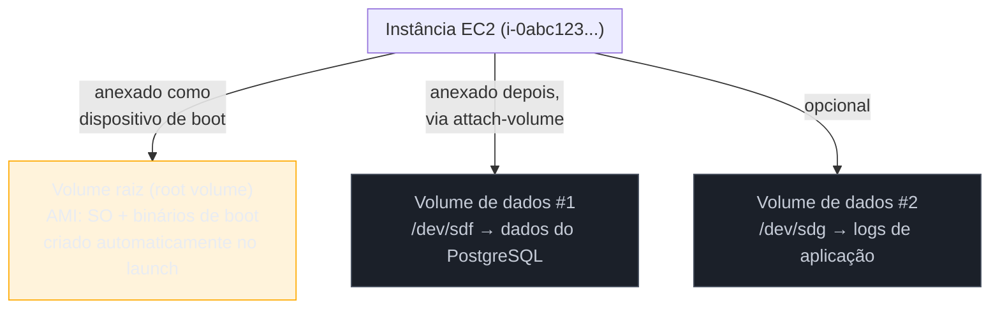
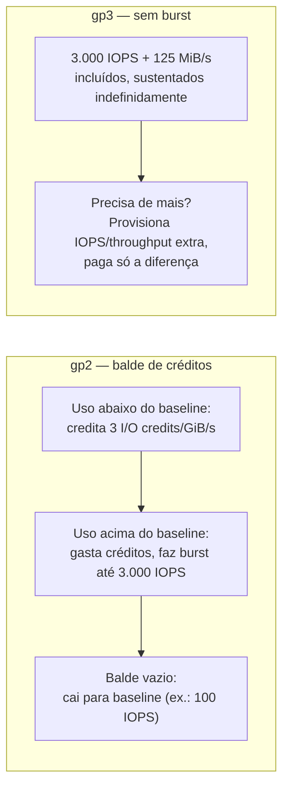
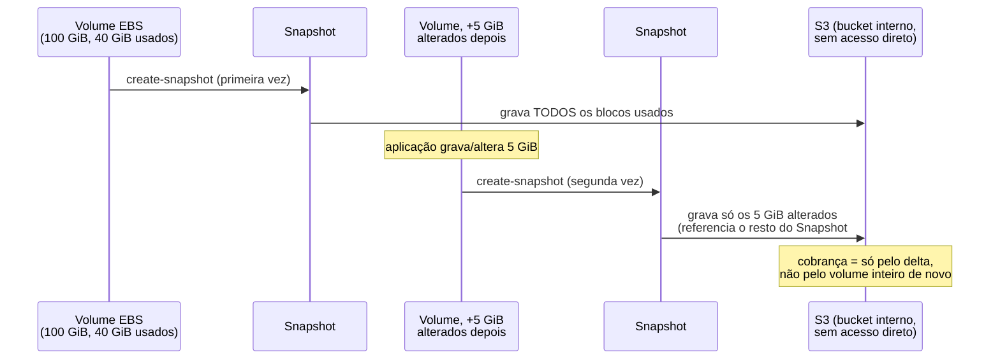
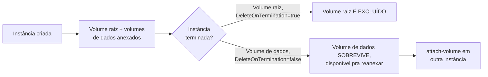

# Block storage — EBS e Volumes

> [!abstract] TL;DR
> A nota 01 deste galho já revelou o segredo: toda instância — desde a primeira EC2 do galho 5 — nasce com um **volume raiz (root volume)**, e esse volume raiz já era block storage o tempo todo, só que ninguém precisou nomear isso na hora. Esta nota volta a esse disco com profundidade. A AWS oferece cinco famílias de volume EBS que valem o disco certo pra cada carga: **gp3** (SSD de propósito geral, hoje o default, com IOPS e throughput provisionáveis independente do tamanho), **gp2** (a geração anterior, com performance atrelada ao tamanho e um sistema de créditos de burst), **io1/io2** (IOPS provisionado, para bancos de dados exigentes, com **io2 Block Express** entregando o teto de performance da AWS), **st1** (HDD otimizado para throughput sequencial) e **sc1** (HDD frio, o mais barato por GB). Um volume pode ser redimensionado, ter tipo e performance mudados **sem downtime** (Elastic Volumes), e sobrevive a paradas de instância — mas some por padrão se o volume raiz não tiver `DeleteOnTermination` desabilitado. **Snapshots** são backups incrementais — só o delta de blocos alterados é cobrado — armazenados no S3 por trás de cena, e servem tanto para restaurar um volume quanto para copiá-lo entre regiões como estratégia de disaster recovery. A DigitalOcean cobre o mesmo terreno com **Volumes**: um único tipo de SSD, sem a escolha de io2/st1/sc1 da AWS, mas com a mesma regra de ouro — um volume, uma máquina — e snapshots equivalentes.

## O problema: o disco que precisa sobreviver ao servidor

Retome o time B da nota 01 deste galho: uma instância EC2 rodando PostgreSQL, com um requisito simples de enunciar e traiçoeiro de ignorar — o disco onde os dados do banco vivem precisa ser **rápido** o bastante para aguentar milhares de transações pequenas e aleatórias por segundo, e precisa **sobreviver** a um reboot, uma parada planejada, ou até a substituição da própria instância por uma nova.

A primeira parte do requisito — velocidade — já descarta object storage e file storage de cara: nenhum dos dois entrega a latência de microssegundos e o padrão de I/O pequeno e aleatório que um banco relacional espera do disco onde grava suas páginas. A segunda parte — sobrevivência — é onde a maioria de quem está aprendendo cloud tropeça pela primeira vez: instâncias EC2 são, por natureza, efêmeras. Uma instância pode ser parada, iniciada em outro hardware físico, ou terminada de propósito num evento de auto scaling. Se os dados do banco vivessem dentro do sistema de arquivos "local" da instância como se fosse um HD soldado na placa-mãe, cada substituição de instância seria uma perda de dados.

A resposta da AWS é desacoplar o disco da instância: o volume EBS existe como um recurso **independente**, anexado à instância via rede (não fisicamente soldado), que pode ser desanexado de uma instância e reanexado a outra, e cujo ciclo de vida você controla explicitamente. É essa independência — o disco sobrevive à máquina, a não ser que você diga o contrário — que faz o EBS ser a peça certa para o banco de dados do time B, e é exatamente essa independência que esta nota examina peça por peça: que tipos de volume existem, como sua performance é modelada e cobrada, como fazer backup dele sem duplicar o disco inteiro a cada vez, e como esse ciclo de vida se conecta ao ciclo de vida da instância que o galho 5 já cobriu.

> [!info] Fronteira com o galho 5
> O ciclo de vida da própria instância — start/stop/terminate, user data, auto scaling — é assunto do [[03-Dominios/Tecnologia/Cloud/05 - Compute I — máquinas virtuais/index|Compute I — máquinas virtuais]]. Esta nota assume esse ciclo como dado e foca no disco que fica anexado a ele.

## O mecanismo: um volume raiz, e volumes de dados opcionais por cima

Toda instância EC2 tem exatamente um **volume raiz** — o disco que contém a AMI (Amazon Machine Image) da qual a instância foi lançada: o sistema operacional, os binários de boot, e qualquer coisa que estivesse "pré-instalada" na imagem. Esse volume é criado automaticamente no momento do `run-instances` e anexado antes mesmo de a instância terminar de inicializar — é por isso que a nota 01 deste galho pôde dizer que ninguém "precisou nomear" o disco de boot: ele simplesmente aparece, pronto, junto com a instância.

Além do volume raiz, uma instância pode ter zero ou mais **volumes de dados** — volumes EBS adicionais, criados separadamente e anexados depois (ou no momento do launch, via bloco de mapeamento de dispositivo), tipicamente usados para separar os dados de uma aplicação do sistema operacional que a hospeda. É uma prática comum, e não incidental: mantendo os dados do PostgreSQL do time B num volume de dados distinto do volume raiz, é possível trocar o SO da instância, redimensionar o disco de dados sem tocar no disco de boot, ou até mover o volume de dados inteiro para uma instância nova, sem depender do volume raiz para nada além de hospedar o sistema operacional.



Essa distinção entre volume raiz e volume de dados não é só organizacional — ela tem consequência prática direta no ciclo de vida, que a seção de armadilhas desta nota examina com cuidado: o comportamento padrão do volume raiz **ao terminar a instância** é diferente do comportamento padrão de um volume de dados.

## Os tipos de volume EBS: SSD, IOPS provisionado, e HDD

Segundo a documentação oficial da AWS, os volumes EBS se dividem em duas famílias físicas — SSD (para I/O pequeno e transacional, onde IOPS é a métrica que importa) e HDD (para leitura/escrita sequencial em blocos grandes, onde throughput é a métrica que importa) — e dentro de cada família existem variantes otimizadas para perfis de custo e performance diferentes.

| Tipo | Família | Caso de uso | Tamanho | IOPS máx. | Throughput máx. | Boot volume? |
|---|---|---|---|---|---|---|
| **gp3** | SSD propósito geral | Maioria das cargas transacionais; default atual | 1 GiB – 64 TiB | 80.000 (Nitro) | 2.000 MiB/s | Sim |
| **gp2** | SSD propósito geral (geração anterior) | Cargas onde performance escala com tamanho é aceitável | 1 GiB – 16 TiB | 16.000 | 250 MiB/s | Sim |
| **io2 Block Express** | SSD IOPS provisionado | Bancos de dados críticos, cargas com exigência extrema de latência | 4 GiB – 64 TiB | 256.000 (Nitro) | 4.000 MiB/s | Sim |
| **io1** | SSD IOPS provisionado (geração anterior) | Legado — AWS recomenda io2 no lugar | 4 GiB – 16 TiB | 64.000 | 1.000 MiB/s | Sim |
| **st1** | HDD otimizado para throughput | Big data, data warehouses, logs processados sequencialmente | 125 GiB – 16 TiB | 500 | 500 MiB/s | Não |
| **sc1** | HDD frio | Dados acessados raramente, arquivamento de baixo custo | 125 GiB – 16 TiB | 250 | 250 MiB/s | Não |

> [!info] Caducidade
> Limites de IOPS/throughput verificados na documentação oficial da AWS ("Amazon EBS volume types") em 2026-07-23. Os tetos de IOPS "Nitro" (80.000 para gp3, 256.000 para io2 Block Express) exigem instância baseada no Nitro System; instâncias não-Nitro alcançam no máximo 32.000-64.000 IOPS mesmo num volume provisionado acima disso. Confirme na doc atual antes de dimensionar uma carga crítica.

O eixo mais importante da tabela — e a fonte de confusão nº 1 de quem ainda está no modelo mental do gp2 — é que **gp3 desacopla tamanho de performance**. Um volume gp2 de 100 GiB tem, por fórmula, exatamente 300 IOPS de baseline (3 IOPS por GiB); para ter mais IOPS, a única alavanca é aumentar o tamanho do volume, mesmo que você não precise do espaço extra. Um volume gp3 de 100 GiB já vem com 3.000 IOPS e 125 MiB/s de throughput **incluídos no preço do armazenamento**, e se precisar de mais, você provisiona IOPS e throughput como dimensões independentes — sem precisar comprar um GiB a mais de espaço que não vai usar.

## gp3 vs. gp2: por que gp3 virou o default

Segundo a documentação oficial, **gp3 é a seleção padrão de tipo de volume no console da AWS** ao criar um volume ou ao criar uma AMI a partir de um snapshot — em outros contextos (como certas chamadas de API sem o parâmetro explícito), gp2 ainda pode aparecer como default, mas a orientação da própria AWS é clara: gp3 é 20% mais barato por GiB do que gp2, com performance mais previsível.

A diferença de modelo de performance entre os dois é a peça central para entender por que essa migração vale a pena:

**gp3 não usa burst — a performance provisionada é sustentada indefinidamente.** Baseline de 3.000 IOPS e 125 MiB/s incluído no preço; IOPS adicional até 80.000 (a um custo de 500 IOPS por GiB de volume, atingindo o teto em volumes de 160 GiB ou maiores) e throughput adicional até 2.000 MiB/s (a 0,25 MiB/s por IOPS provisionado, exigindo 8.000 IOPS ou mais e 16 GiB ou mais para o teto).

**gp2 usa um sistema de créditos de I/O que pode se esgotar.** A performance baseline escala linearmente com o tamanho — 3 IOPS por GiB, mínimo de 100 IOPS, máximo de 16.000 IOPS (atingido em 5.334 GiB) — e volumes menores que 1 TiB podem fazer **burst** até 3.000 IOPS gastando créditos acumulados num "balde" (I/O credit balance). Cada volume nasce com 5,4 milhões de créditos iniciais (suficiente para sustentar 3.000 IOPS por pelo menos 30 minutos), ganha créditos novos à taxa de 3 por GiB por segundo quando o uso está abaixo do baseline, e — esse é o detalhe que pega quem não monitora — **gasta** créditos sempre que o uso está acima do baseline. Um volume gp2 pequeno, sob carga sustentada e sem parar, esgota o balde e cai de volta para o baseline (que pode ser tão baixo quanto 100 IOPS) bem no meio do pico de tráfego que mais precisava de performance.



Migrar um volume existente de gp2 para gp3 é uma operação de **Elastic Volumes** — a mesma mecânica coberta na próxima seção — sem downtime:

```bash
$ aws ec2 modify-volume \
    --volume-id vol-0abc123def456789 \
    --volume-type gp3 \
    --iops 4000 \
    --throughput 200
{
    "VolumeModification": {
        "VolumeId": "vol-0abc123def456789",
        "ModificationState": "modifying",
        "TargetVolumeType": "gp3",
        "TargetIops": 4000,
        "TargetThroughput": 200
    }
}
```

> [!info] Migração implícita gp2 → gp3
> Se você mudar o tipo sem especificar `--iops` ou `--throughput`, a AWS provisiona automaticamente **o maior valor entre** a performance equivalente do gp2 de origem e o baseline do gp3 — nunca menos do que o volume já tinha.

> [!tip] Assista: AWS re:Invent 2022 — Optimize price and performance with Amazon EBS (STG204)
> **Canal:** AWS Events | **Duração:** ~54min | **Idioma:** EN
>
> Talk oficial da AWS que narra a própria evolução dos tipos de volume EBS até o gp3 virar default, incluindo a motivação por trás do io2 Block Express e das camadas de arquivamento de snapshot — bom complemento histórico ao "porquê" que esta seção só explica do ponto de vista técnico. Trecho de destaque [20:03]: *"gp3 which is actually it feeds fits most [workloads]"*
>
> 🎬 [Assistir no YouTube](https://www.youtube.com/watch?v=sewKEuZZ1BA)

## IOPS e throughput: por que block storage cobra por performance, não só por espaço

Vale nomear explicitamente o que object storage nunca cobra e block storage sempre cobra: **performance dedicada**. Um bucket S3 não promete uma taxa de IOPS por objeto, porque o modelo do S3 é paralelismo entre milhões de objetos independentes — a "performance" dele é agregada e elástica. Um volume EBS é o oposto: é um disco dedicado, fisicamente reservado, e a única forma da AWS garantir uma taxa de IOPS previsível para aquele volume específico é reservar capacidade de I/O de verdade por trás dele — capacidade essa que tem custo de infraestrutura real e, por isso, aparece na fatura como uma dimensão própria, separada do preço por GiB armazenado.

Essa é a razão estrutural pela qual io1/io2 (IOPS *provisionado*) custam mais por GiB do que st1/sc1 (HDD, otimizados para throughput sequencial, não para IOPS aleatório): você está pagando, literalmente, por uma promessa de latência e taxa de operações que a AWS precisa reservar capacidade física para cumprir.

## Provisionando IOPS extremo: io1/io2 e io2 Block Express

Para o time B — banco de dados PostgreSQL sob carga transacional pesada — gp3 costuma bastar. Mas para bancos de dados críticos com exigência de latência sub-milissegundo consistente, a família **Provisioned IOPS SSD** existe: **io2 Block Express**, o topo de linha, projetado para entregar latência média abaixo de 500 microssegundos em operações de 16 KiB, com throughput de outlier (I/Os acima de 800 microssegundos) dez vezes menos frequente que em volumes gp3. A própria AWS recomenda io2 no lugar de io1 para qualquer caso novo — melhor performance, melhor durabilidade (99,999% vs. 99,8%-99,9%), custo comparável.

```bash
$ aws ec2 create-volume \
    --availability-zone us-east-1a \
    --volume-type io2 \
    --size 500 \
    --iops 16000 \
    --tag-specifications 'ResourceType=volume,Tags=[{Key=Name,Value=vol-postgres-prod}]'
{
    "VolumeId": "vol-0f1e2d3c4b5a69788",
    "VolumeType": "io2",
    "Size": 500,
    "Iops": 16000,
    "State": "creating"
}
```

## Criando e anexando um volume: o fluxo completo

Toda a mecânica de anexação já apareceu de relance na nota 01 deste galho; aqui vale ver o fluxo completo, do zero, para um volume de dados novo — criar, anexar, formatar e montar:

```bash
# 1. Criar o volume gp3 na MESMA AZ da instância — essa restrição é obrigatória
$ aws ec2 create-volume \
    --availability-zone us-east-1a \
    --volume-type gp3 \
    --size 100 \
    --iops 4000 \
    --throughput 250 \
    --tag-specifications 'ResourceType=volume,Tags=[{Key=Name,Value=vol-dados-postgres}]'
{
    "VolumeId": "vol-0abc123def456789",
    "VolumeType": "gp3",
    "Size": 100,
    "State": "creating"
}

# 2. Anexar à instância como um novo dispositivo de bloco
$ aws ec2 attach-volume \
    --volume-id vol-0abc123def456789 \
    --instance-id i-0abcdef1234567890 \
    --device /dev/sdf

# 3. Dentro da instância: formatar (só na PRIMEIRA vez — nunca formate um volume com dados)
$ sudo mkfs -t xfs /dev/xvdf

# 4. Montar e persistir a montagem no /etc/fstab
$ sudo mkdir -p /data/postgres
$ sudo mount /dev/xvdf /data/postgres
$ df -h /data/postgres
Filesystem      Size  Used Avail Use% Mounted on
/dev/xvdf        99G   34M   99G   1% /data/postgres
```

> [!warning] Volume e instância precisam estar na mesma zona de disponibilidade
> Um volume EBS existe dentro de **uma única AZ** — não é possível anexar um volume de `us-east-1a` a uma instância rodando em `us-east-1b`. Esse é um dos erros mais comuns de quem já entendeu a mecânica de VPC (galho 7) mas ainda não conectou que armazenamento também tem escopo de zona: mover uma instância entre AZs (por exemplo, numa recuperação de desastre manual) não move o volume junto — é preciso tirar um snapshot do volume de origem e criar um volume novo, a partir dele, na AZ de destino.

## Snapshots: backup incremental que mora em object storage

Um **snapshot EBS** é uma cópia point-in-time de um volume — mas não uma cópia completa a cada vez. Segundo a documentação oficial, um snapshot é um backup **incremental**: só os blocos que mudaram desde o snapshot anterior daquele volume são de fato salvos, o que minimiza tempo de criação e custo de armazenamento. Snapshots ficam guardados no Amazon S3, em buckets que o próprio usuário não acessa diretamente (nem pelo console S3, nem pela API S3) — é a mesma conexão que a nota 01 deste galho já havia adiantado: o produto de mais alto nível "snapshot de EBS" esconde object storage por baixo, replicado automaticamente entre todas as AZs da região para dar durabilidade e permitir restaurar o volume em qualquer AZ dessa região.



Criar um snapshot, a partir da CLI, é um único comando — mas vale registrar que a AWS **não faz backup automático** dos seus volumes: criar snapshots regularmente (ou automatizar via AWS Backup / Data Lifecycle Manager) é responsabilidade do usuário:

```bash
$ aws ec2 create-snapshot \
    --volume-id vol-0abc123def456789 \
    --description "Snapshot diário pre-migração — 2026-07-23" \
    --tag-specifications 'ResourceType=snapshot,Tags=[{Key=Name,Value=snap-postgres-daily}]'
{
    "SnapshotId": "snap-0a1b2c3d4e5f6g7h8",
    "VolumeId": "vol-0abc123def456789",
    "State": "pending",
    "Progress": "0%"
}

$ aws ec2 describe-snapshots --snapshot-ids snap-0a1b2c3d4e5f6g7h8 \
    --query 'Snapshots[0].{State:State,Progress:Progress}'
{
    "State": "completed",
    "Progress": "100%"
}
```

Restaurar significa criar um volume **novo** a partir do snapshot — ele nasce como réplica exata do volume original no instante em que o snapshot foi tirado:

```bash
$ aws ec2 create-volume \
    --availability-zone us-east-1a \
    --snapshot-id snap-0a1b2c3d4e5f6g7h8 \
    --volume-type gp3 \
    --tag-specifications 'ResourceType=volume,Tags=[{Key=Name,Value=vol-postgres-restaurado}]'
{
    "VolumeId": "vol-0z9y8x7w6v5u4321",
    "SnapshotId": "snap-0a1b2c3d4e5f6g7h8",
    "State": "creating"
}
```

### Copiando snapshots entre regiões: a base do disaster recovery

Snapshots são regionais por padrão — vivem no S3 da mesma região do volume de origem. Para disaster recovery entre regiões (o cenário clássico: "se `us-east-1` inteira ficar indisponível, consigo recriar o banco em `us-west-2`?"), a resposta é copiar o snapshot para a região de destino antes que ele seja necessário:

```bash
$ aws ec2 copy-snapshot \
    --region us-west-2 \
    --source-region us-east-1 \
    --source-snapshot-id snap-0a1b2c3d4e5f6g7h8 \
    --description "Cópia DR — origem us-east-1" \
    --tag-specifications 'ResourceType=snapshot,Tags=[{Key=Name,Value=snap-dr-copy}]'
{
    "SnapshotId": "snap-0f9e8d7c6b5a4321f"
}
```

A partir daí, criar um volume na região de destino a partir dessa cópia é o mesmo comando `create-volume --snapshot-id` visto acima, só que apontando pra AZ de `us-west-2`. Times que levam DR a sério automatizam essa cópia — via AWS Backup, Data Lifecycle Manager, ou um script agendado — em vez de descobrir, no meio do incidente, que o snapshot mais recente só existe na região que acabou de cair.

> [!info] Caducidade
> Modelo de snapshot incremental, armazenamento em S3, e sintaxe de `copy-snapshot`/`create-volume --snapshot-id` verificados na documentação oficial da AWS (EBS Snapshots, EC2 CLI Reference) em 2026-07-23.

## Elastic Volumes: mudar tamanho, tipo e performance sem downtime

Um dos recursos que mais separa block storage gerenciado de "montar um disco físico" é a capacidade de mudar as características de um volume **enquanto ele está em uso** — sem desanexar, sem parar a instância. A AWS chama isso de **Elastic Volumes**: você pode aumentar o tamanho, trocar o tipo (gp2 → gp3, por exemplo) e ajustar IOPS/throughput de um volume existente, e a modificação acontece em segundo plano.

```bash
$ aws ec2 modify-volume \
    --volume-id vol-0abc123def456789 \
    --size 200 \
    --volume-type gp3 \
    --iops 6000 \
    --throughput 400
{
    "VolumeModification": {
        "VolumeId": "vol-0abc123def456789",
        "ModificationState": "modifying",
        "TargetSize": 200,
        "TargetVolumeType": "gp3",
        "TargetIops": 6000,
        "TargetThroughput": 400
    }
}

$ aws ec2 describe-volumes-modifications --volume-ids vol-0abc123def456789 \
    --query 'VolumesModifications[0].ModificationState'
"optimizing"
```

Aumentos de tamanho já valem assim que a modificação entra no estado `optimizing` — mas o filesystem por cima do volume **não** enxerga o espaço extra sozinho. É preciso um passo adicional, dentro da instância, para estender o filesystem até o novo limite:

```bash
# Linux, ext4: crescer a partição e depois o filesystem
$ sudo growpart /dev/xvdf 1
$ sudo resize2fs /dev/xvdf1

# Ou, para xfs:
$ sudo xfs_growfs /data/postgres
```

> [!warning] Você não pode diminuir um volume, e a janela de modificação é limitada
> Elastic Volumes só permite **aumentar** tamanho — nunca diminuir. Para "encolher" um volume, a única rota é criar um volume menor e migrar dados manualmente (`rsync`, por exemplo). Além disso, cada volume só aceita uma modificação de cada vez — é preciso esperar o estado anterior chegar a `completed` antes de iniciar outra, com um limite de até 4 modificações por período de 24 horas.

## Multi-Attach: a exceção controlada à regra de um volume por instância

Toda a nota 01 deste galho — e boa parte desta — parte da premissa de que um volume de block storage pertence a **uma única instância**. Existe uma exceção deliberada e estreita a essa regra: o **Multi-Attach**, disponível apenas em volumes io1 e io2, que permite anexar um único volume a até 16 instâncias simultâneas, desde que todas estejam na **mesma zona de disponibilidade**.

A ressalva que separa "recurso avançado bem usado" de "corrupção de dados garantida": a documentação da AWS é explícita — sistemas de arquivo padrão como XFS e ext4 **não foram desenhados** para acesso simultâneo por múltiplos servidores. Multi-Attach exige um filesystem *cluster-aware* (como GFS2 ou OCFS2), que sabe coordenar escritas concorrentes entre as instâncias anexadas. Sem essa coordenação de aplicação, ter várias instâncias escrevendo no mesmo volume produz exatamente a corrupção que a nota 01 já havia avisado sobre volumes comuns — Multi-Attach não resolve esse problema automaticamente, só remove a barreira técnica que o impedia de acontecer.

```bash
$ aws ec2 create-volume \
    --availability-zone us-east-1a \
    --volume-type io2 \
    --size 500 \
    --iops 10000 \
    --multi-attach-enabled

$ aws ec2 attach-volume --volume-id vol-0multi1234567890 --instance-id i-0aaa1111 --device /dev/xvdf
$ aws ec2 attach-volume --volume-id vol-0multi1234567890 --instance-id i-0bbb2222 --device /dev/xvdf
```

> [!warning] Multi-Attach não é "file storage para pobre"
> É tentador ler Multi-Attach como um substituto mais barato para file storage (nota 06 deste galho). Não é: Multi-Attach ainda exige uma única zona de disponibilidade, não aceita ser volume de boot, e joga a responsabilidade de coordenação de escrita inteiramente para o filesystem cluster-aware e a aplicação — é um recurso avançado para clusters de banco de dados desenhados especificamente para isso (Oracle RAC é o caso de uso canônico), não uma alternativa geral para "várias instâncias, um disco".

## Encryption at rest: KMS por baixo, sem trabalho extra

Todo volume EBS pode ser criptografado em repouso usando uma chave gerenciada pelo **AWS KMS** — a criptografia acontece nos próprios servidores que hospedam a instância, cobrindo tanto o dado parado no disco quanto o tráfego entre a instância e o volume anexado. Um detalhe estrutural relevante para o ciclo de vida desta nota: volumes criados a partir de um snapshot criptografado, e cópias de um snapshot criptografado, **são sempre criptografados** — não existe como "remover" a criptografia de um volume ou snapshot já cifrado. Para criptografar um volume que nasceu sem criptografia, o caminho é tirar um snapshot dele e criar um volume novo, criptografado, a partir desse snapshot.

```bash
$ aws ec2 create-volume \
    --availability-zone us-east-1a \
    --volume-type gp3 \
    --size 100 \
    --encrypted \
    --kms-key-id alias/minha-chave-ebs
```

> [!info] Fronteira com KMS
> Esta nota só nomeia que EBS encryption existe e usa KMS por baixo — gestão de chaves, rotação, políticas de acesso e o funcionamento interno do KMS são assunto do galho 18 (Segurança), não deste galho.

## Ciclo de vida: DeleteOnTermination e a persistência de dados

Todo volume anexado a uma instância carrega um atributo de mapeamento de dispositivo de bloco chamado `DeleteOnTermination`, que decide o que acontece com aquele volume especificamente quando a instância é **terminada** (não parada — parada não afeta volume nenhum). O comportamento **padrão** é diferente entre volume raiz e volume de dados, e é exatamente essa diferença que costuma surpreender quem está aprendendo:

| Tipo de volume | `DeleteOnTermination` padrão | Consequência |
|---|---|---|
| Volume raiz | `true` | Some junto com a instância ao terminar — comportamento esperado, já que o SO daquela instância específica não faz sentido preservar sozinho |
| Volume de dados adicional | `false` | Sobrevive à terminação da instância — fica "órfão", disponível para anexar a outra instância depois |

```bash
# Verificar o valor atual do atributo antes de terminar a instância
$ aws ec2 describe-instance-attribute \
    --instance-id i-0abcdef1234567890 \
    --attribute blockDeviceMapping \
    --query 'BlockDeviceMappings'
[
    {
        "DeviceName": "/dev/xvda",
        "Ebs": {"VolumeId": "vol-0raiz111", "DeleteOnTermination": true}
    },
    {
        "DeviceName": "/dev/sdf",
        "Ebs": {"VolumeId": "vol-0dados222", "DeleteOnTermination": false}
    }
]

# Mudar explicitamente o comportamento do volume raiz, para PRESERVAR o disco de boot
$ aws ec2 modify-instance-attribute \
    --instance-id i-0abcdef1234567890 \
    --block-device-mappings '[{"DeviceName":"/dev/xvda","Ebs":{"DeleteOnTermination":false}}]'
```

Desanexar um volume de dados de uma instância para reanexar em outra é uma operação de dois passos — nunca simultânea:

```bash
$ aws ec2 detach-volume --volume-id vol-0dados222
$ aws ec2 attach-volume \
    --volume-id vol-0dados222 \
    --instance-id i-0novainstancia999 \
    --device /dev/sdf
```



## Lente dupla: EBS na AWS, Volumes na DigitalOcean

A DigitalOcean cobre o mesmo terreno com **Volumes**: discos de bloco baseados em SSD, anexáveis a exatamente um Droplet por vez — a mesma regra de ouro do EBS. A honestidade de paridade aqui é direta: a DigitalOcean **não replica** o leque de tipos da AWS. Não existe escolha entre "SSD propósito geral" vs. "IOPS provisionado" vs. "HDD otimizado para throughput" vs. "HDD frio" — a DigitalOcean oferece **um único tipo de volume**, com performance de SSD e suporte a burst, sem a granularidade de escolher io2 para um banco de dados crítico ou sc1 para arquivamento barato. Em compensação, o modelo é mais simples de operar: menos decisões, um caminho só.

```bash
# Criar um volume na DigitalOcean — o parâmetro --size aceita GiB ou TiB
$ doctl compute volume create dados-postgres \
    --region nyc1 \
    --size 100GiB \
    --fs-type ext4

# Anexar a um Droplet
$ doctl compute volume-action attach <volume-id> <droplet-id>

# Redimensionar sem downtime — o equivalente ao Elastic Volumes da AWS
$ doctl compute volume-action resize <volume-id> --size 200GiB --region nyc1

# Criar um snapshot do volume
$ doctl compute volume snapshot <volume-id> \
    --snapshot-name snap-postgres-daily \
    --snapshot-desc "Backup diário pre-migração"

# Criar um novo volume a partir de um snapshot existente (restaurar)
$ doctl compute volume create dados-postgres-restaurado \
    --region nyc1 \
    --snapshot <snapshot-id>
```

A DigitalOcean também sofreu, historicamente, com um limite de volumes por Droplet mais apertado que a AWS: hoje um Droplet aceita até 15 volumes anexados (um aumento em relação ao limite anterior de 7), mas nós de Kubernetes ainda operam com o teto antigo de 7 — vale checar o número atual antes de desenhar uma arquitetura que dependa de muitos discos por máquina.

| Dimensão | AWS EBS | Azure Managed Disks | GCP Persistent Disk / Hyperdisk | DigitalOcean Volumes |
|---|---|---|---|---|
| SSD propósito geral | gp3 (default), gp2 | Premium SSD, Standard SSD | pd-balanced, pd-ssd | Um único tipo (SSD) |
| IOPS provisionado independente | io1/io2 (io2 Block Express) | Premium SSD v2, Ultra Disk | Hyperdisk Balanced/Extreme | Não disponível |
| HDD (throughput/frio) | st1, sc1 | Standard HDD | pd-standard | Não disponível |
| Redimensionar sem downtime | Elastic Volumes | Sim (Premium SSD v2/Ultra) | Sim (Hyperdisk) | `volume-action resize` |
| Multi-attach | io1/io2 (até 16 instâncias, 1 AZ) | Ultra Disk como shared disk | Hyperdisk Balanced HA | Não documentado |
| Encryption at rest | KMS, sempre disponível | Azure-managed ou chave própria | Google-managed ou CMEK | Ceph-backed, criptografado |

> [!info] Caducidade
> Limite de 15 volumes por Droplet (aumentado de 7) verificado na documentação da DigitalOcean em 2026-07-23; tipos Azure (Ultra Disk, Premium SSD v2, Premium SSD, Standard SSD, Standard HDD) e GCP (Persistent Disk clássico + família Hyperdisk: Balanced, Extreme, Throughput, ML) verificados na documentação oficial de cada provedor na mesma data. Catálogos de tipo de disco mudam com frequência — confirme antes de basear uma decisão de arquitetura.

## Armadilhas comuns

> [!warning] Esquecer que o volume raiz some por padrão ao terminar a instância
> `DeleteOnTermination=true` é o padrão do volume raiz — não uma configuração que alguém escolheu deliberadamente na maioria dos casos. Terminar uma instância de produção sem checar esse atributo primeiro é a forma mais comum de perder, por acidente, um disco de boot customizado que ninguém tinha snapshot recente dele.

> [!warning] gp2 estourando o balde de créditos de burst no pico de tráfego
> Um volume gp2 pequeno, sob carga sustentada acima do baseline por tempo demais, esgota os créditos de I/O acumulados e cai de volta para uma performance baseline que pode ser tão baixa quanto 100 IOPS — justamente no momento em que a aplicação mais precisava de performance. Monitorar a métrica `BurstBalance` no CloudWatch é a única forma de ver isso chegando antes que a aplicação sinta a queda; migrar para gp3 elimina esse risco por completo, porque gp3 não usa burst.

> [!warning] Confundir snapshot com volume montado
> Um snapshot não é um disco que você pode montar diretamente numa instância — é um backup incremental guardado no S3, inacessível fora da API de EBS. Para "usar" os dados de um snapshot, é preciso primeiro criar um volume novo a partir dele (`create-volume --snapshot-id`) e então anexar esse volume novo a uma instância. Times que tentam economizar um passo, procurando algum jeito de montar o snapshot direto, estão procurando um recurso que não existe.

> [!warning] Esquecer que um volume está preso a uma única zona de disponibilidade
> Um volume EBS não atravessa AZs — ele nasce numa zona e morre nela, a não ser que você tire um snapshot e recrie o volume em outra AZ a partir dele. Um erro comum: tentar anexar um volume existente a uma instância nova, lançada numa AZ diferente da instância original, e descobrir que o comando `attach-volume` simplesmente falha.

## Casos práticos

**O time B da nota 01, agora com profundidade.** O PostgreSQL do time B roda sobre um volume gp3 dedicado — não o volume raiz da instância — com IOPS provisionado acima do baseline para acomodar o pico de transações da manhã. Snapshots diários automatizados vão para o S3 por trás de cena, e uma cópia semanal desses snapshots é replicada para uma segunda região, cobrindo o cenário de disaster recovery sem que ninguém precise duplicar o volume inteiro manualmente todo dia.

**Migração de instância sem perder o disco de dados.** Uma instância precisa ser substituída por um tipo de hardware mais novo — mas o volume de dados com anos de histórico de banco de dados não pode ser recriado do zero. Como `DeleteOnTermination=false` é o padrão desse volume de dados, ele sobrevive à terminação da instância antiga; basta um `attach-volume` na instância nova, apontando para o mesmo `VolumeId`, para retomar exatamente de onde parou.

**Elastic Volumes evitando uma migração planejada de fim de semana.** Um volume gp3 de 500 GiB começa a ficar sem espaço, e o time descobre isso numa sexta-feira à tarde. Em vez de agendar uma janela de manutenção para trocar de disco, um único `modify-volume --size 1000` aumenta o volume em produção, sem desanexar nada — o único passo restante é rodar `resize2fs` (ou `xfs_growfs`) dentro da instância para o filesystem enxergar o espaço novo.

## O que vem a seguir

Esta nota aprofundou o disco dedicado a uma única instância — mas o cenário do time C, na nota 01 deste galho, continua em aberto: uma frota inteira de instâncias que precisa compartilhar o mesmo espaço de arquivos, ao mesmo tempo, com semântica POSIX completa. É esse o assunto da próxima nota — o capstone deste galho — que cobre file storage a fundo e fecha a decisão entre os três tipos de armazenamento com uma arquitetura real, de ponta a ponta, servindo de ponte para o próximo galho da trilha Cloud, sobre bancos de dados gerenciados.

## Fontes

- [AWS EBS — Amazon EBS volume types](https://docs.aws.amazon.com/AWSEC2/latest/UserGuide/ebs-volume-types.html) — tabela completa de tipos SSD (gp3, gp2, io2 Block Express, io1) e HDD (st1, sc1): tamanho, IOPS máximo, throughput máximo, durabilidade, suporte a boot volume; acessado em 2026-07-23.
- [AWS EBS — General Purpose SSD volumes](https://docs.aws.amazon.com/AWSEC2/latest/UserGuide/general-purpose.html) — gp3 como default no console, baseline de 3.000 IOPS/125 MiB/s incluído, provisionamento independente de tamanho; fórmula de IOPS do gp2 (3 IOPS/GiB), sistema de créditos de burst, balde inicial de 5,4 milhões de créditos; acessado em 2026-07-23.
- [AWS EBS — Amazon EBS snapshots](https://docs.aws.amazon.com/AWSEC2/latest/UserGuide/EBSSnapshots.html) — snapshot como backup incremental armazenado no S3, replicação entre AZs da região, cobrança por dado alterado; acessado em 2026-07-23.
- [AWS EBS — Modify an Amazon EBS volume using Elastic Volumes](https://docs.aws.amazon.com/AWSEC2/latest/UserGuide/ebs-modify-volume.html) — mecânica de Elastic Volumes, limite de 4 modificações por 24h, impossibilidade de diminuir tamanho, necessidade de estender o filesystem manualmente; acessado em 2026-07-23.
- [AWS EBS — Attach an EBS volume to multiple EC2 instances using Multi-Attach](https://docs.aws.amazon.com/AWSEC2/latest/UserGuide/ebs-volumes-multi.html) — restrição a io1/io2, mesma AZ, até 16 instâncias Nitro, exigência de filesystem cluster-aware; acessado em 2026-07-23.
- [AWS EBS — Amazon EBS encryption](https://docs.aws.amazon.com/AWSEC2/latest/UserGuide/EBSEncryption.html) — uso de KMS, impossibilidade de remover criptografia de volume/snapshot já cifrado, necessidade de recriar via snapshot para criptografar volume existente; acessado em 2026-07-23.
- [AWS CLI — ec2 copy-snapshot](https://docs.aws.amazon.com/cli/latest/reference/ec2/copy-snapshot.html) — sintaxe de cópia de snapshot entre regiões para disaster recovery; acessado em 2026-07-23.
- [DigitalOcean — Volumes Block Storage](https://docs.digitalocean.com/products/volumes/) — Volumes como SSD único tipo, restrição de um Droplet por vez, limite de 15 volumes por Droplet (7 em nós Kubernetes); acessado em 2026-07-23.
- [DigitalOcean — doctl compute volume create](https://docs.digitalocean.com/reference/doctl/reference/compute/volume/create/) — flags `--region`, `--size`, `--fs-type`; acessado em 2026-07-23.
- [DigitalOcean — doctl compute volume-action](https://docs.digitalocean.com/reference/doctl/reference/compute/volume-action/) — subcomandos `attach`, `detach`, `resize`; acessado em 2026-07-23.
- [DigitalOcean — doctl compute volume snapshot](https://docs.digitalocean.com/reference/doctl/reference/compute/volume/snapshot/) — sintaxe de criação de snapshot de volume via `--snapshot-name`; acessado em 2026-07-23.
- [Microsoft Learn — Select a disk type for Azure IaaS VMs](https://learn.microsoft.com/en-us/azure/virtual-machines/disks-types) — comparação Ultra Disk, Premium SSD v2, Premium SSD, Standard SSD, Standard HDD (tamanho máximo, IOPS máximo, throughput máximo); acessado em 2026-07-23.
- [Google Cloud — About persistent disks](https://docs.cloud.google.com/compute/docs/disks) — Persistent Disk (performance escala com capacidade) e família Hyperdisk (Balanced, Extreme, Throughput, ML — performance configurável independente do tamanho); acessado em 2026-07-23.
