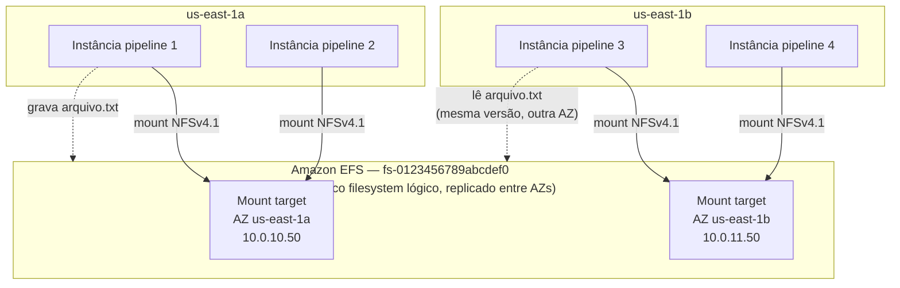
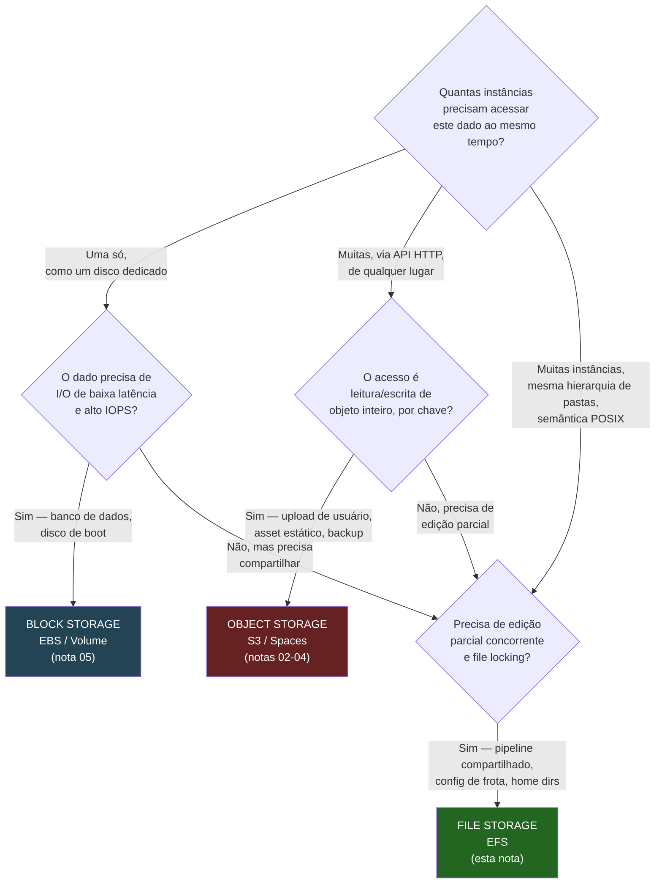
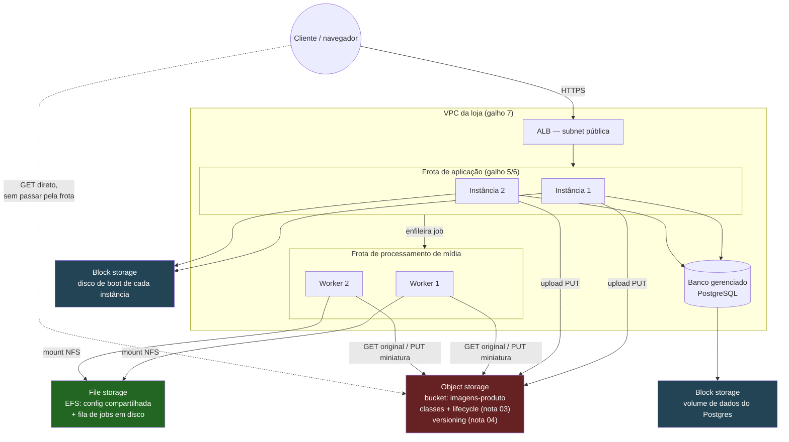

# File storage e a escolha do armazenamento

> [!abstract] TL;DR
> As cinco notas anteriores deste galho deram, uma de cada vez, uma peça do armazenamento em nuvem: o mapa dos três tipos (nota 01), object storage a fundo com buckets e chaves (nota 02), classes de acesso e lifecycle que controlam custo (nota 03), versioning e proteção contra perda e corrupção (nota 04), e block storage com EBS/Volumes e o ciclo de vida herdado do galho 5 (nota 05). Faltava aprofundar o terceiro tipo citado desde a nota 01 só de passagem: **file storage** — um filesystem de rede, elástico, montado simultaneamente por uma frota inteira de instâncias via NFS, com seu próprio lifecycle de classes de acesso (Standard/Infrequent Access/Archive) e seus próprios modos de performance e throughput. É o Amazon EFS na AWS — e é aqui que a lente dupla admite, com peso de decisão real e não só de nota de rodapé, que a DigitalOcean não tem um serviço gerenciado equivalente. Esta nota fecha o galho com as duas metades que faltavam: o EFS a fundo, e a **síntese completa** — a árvore de decisão que, dado um requisito de dado, aponta o tipo certo entre os três, aplicada de ponta a ponta a uma arquitetura real, com os anti-padrões que uma entrevista de arquitetura cobra na certa.

## O terceiro tipo, agora a fundo — e a pergunta que fecha o galho

A nota 01 apresentou o time C: dez instâncias de processamento de vídeo que precisam ler e escrever, todas ao mesmo tempo, nos mesmos arquivos de um diretório compartilhado — como uma pasta de rede de escritório. Block storage não resolve isso (um volume EBS só anexa a uma instância por vez); object storage resolve de um jeito estranho e caro (cada instância teria que baixar e subir o arquivo inteiro a cada leitura/escrita parcial, e nenhuma delas enxergaria a escrita das outras em tempo real). O que o time C precisa é de um filesystem de verdade, compartilhado — e é exatamente isso que o EFS entrega.

Mas nomear o EFS não fecha o galho. A pergunta que fecha um galho inteiro sobre armazenamento não é "o que é cada tipo" — as cinco notas anteriores já responderam isso peça por peça — é a pergunta que um arquiteto sênior faz na frente de um requisito novo: **dado que eu preciso guardar isto, qual dos três tipos eu uso, e por quê?** Essa pergunta é a Parte B desta nota, e ela só pode ser respondida com honestidade depois que as cinco notas anteriores — e a Parte A, a seguir — já colocaram profundidade real atrás de cada um dos três nomes.

Vale marcar por que esta nota, especificamente, é o capstone do galho e não só "mais uma nota sobre o terceiro tipo". As cinco notas anteriores, cada uma isolada, respondem "o que é X e como X funciona" — S3 funciona assim, EBS funciona assado, lifecycle funciona de tal jeito. Nenhuma delas, sozinha, respondia a pergunta que efetivamente chega numa reunião de arquitetura: um requisito de dado concreto na mão, qual dos serviços já estudados eu escolho? Essa pergunta exige as cinco notas anteriores como pré-requisito — e é só depois de fechar a lacuna do terceiro tipo, na Parte A, que a Parte B consegue finalmente respondê-la sem deixar nenhuma opção de fora por ignorância, só por preferência informada.

## Parte A — EFS e o resto da família de file storage

### EFS: elástico, multi-AZ, montado por uma frota inteira

A nota 01 já registrou o essencial do contrato do EFS: filesystem de rede via NFSv4.0/4.1, acessível simultaneamente por EC2, ECS, EKS, Lambda e Fargate, com semântica POSIX completa e file locking. O que essa definição não mostrou ainda é *como* o EFS entrega isso sem que o usuário precise operar um servidor NFS — e a resposta é uma arquitetura de **mount targets**, um por zona de disponibilidade.

Um EFS não é uma única instância de NFS server escondida em algum lugar; é um serviço distribuído por trás de um endpoint por AZ. Cada mount target vive numa subnet específica, tem seu próprio IP dentro da VPC, e é esse IP — resolvido pelo nome DNS do sistema de arquivos — que cada instância usa para montar o filesystem. Instâncias em zonas diferentes montam mount targets diferentes, mas todas enxergam exatamente o mesmo conteúdo, porque por baixo dos mount targets há um único filesystem lógico, replicado pela AWS entre AZs da região automaticamente.



O ponto central deste diagrama: **quatro instâncias, duas AZs, um filesystem só.** Uma escrita feita pela instância 1 na zona `1a` aparece para a instância 3 na zona `1b` sem nenhuma sincronização manual — é o mesmo comportamento que a nota 01 já demonstrou com dois `mount` idênticos, só que agora explicitando que o mecanismo por trás depende de haver um mount target por AZ que a frota efetivamente usa.

```bash
# 1. Criar o filesystem — modo General Purpose, throughput Elastic (os defaults recomendados)
$ aws efs create-file-system \
    --performance-mode generalPurpose \
    --throughput-mode elastic \
    --encrypted \
    --tags Key=Name,Value=efs-pipeline-imagens

# 2. Criar um mount target por AZ que a frota do pipeline usa
$ aws efs create-mount-target \
    --file-system-id fs-0123456789abcdef0 \
    --subnet-id subnet-priv-app-a \
    --security-groups sg-efs-pipeline

$ aws efs create-mount-target \
    --file-system-id fs-0123456789abcdef0 \
    --subnet-id subnet-priv-app-b \
    --security-groups sg-efs-pipeline
```

```bash
# 3. Montar, em cada instância do pipeline, o mesmo filesystem
$ sudo mount -t nfs4 -o nfsvers=4.1 \
    fs-0123456789abcdef0.efs.us-east-1.amazonaws.com:/ /mnt/pipeline
```

O security group do mount target, referenciado no passo 2, é a mesma disciplina de "cadeia de security groups" que o galho 7 (Rede) já formalizou: só as instâncias do pipeline — identificadas pelo security group delas, não por CIDR aberto — conseguem alcançar a porta NFS (2049) do mount target.

> [!tip] Assista: AWS EFS Tutorial for Beginners — NFS, Multi-AZ, Mount Targets, Storage Classes
> **Canal:** Cloud Journey | **Duração:** ~7min | **Idioma:** EN
>
> Visão geral rápida que passeia pelos mesmos quatro pilares desta seção — protocolo NFS, replicação multi-AZ, um mount target por subnet, e as storage classes do EFS — reforçando a regra "um mount target por AZ" que o diagrama acima já ilustrou. Trecho de destaque [1:54]: *"So best practice one mount target per [subnet]"*
>
> 🎬 [Assistir no YouTube](https://www.youtube.com/watch?v=whtpgiWG7Wc)

### Performance modes e throughput modes: duas escalas independentes

O EFS separa dois eixos de configuração que, à primeira vista, parecem a mesma coisa mas não são: **modo de performance** decide o perfil de latência do filesystem inteiro; **modo de throughput** decide como a banda escala com o uso.

> [!info] Caducidade
> A documentação oficial da AWS, verificada em 2026-07-23, é explícita: **Max I/O é descrito como "um tipo de performance de geração anterior"**, com latências por operação mais altas que o General Purpose, e não é suportado em filesystems One Zone nem em filesystems que usam throughput Elastic. A recomendação atual da própria AWS é usar sempre General Purpose. Trate Max I/O como modo legado ao ler material mais antigo sobre EFS — não como uma opção neutra entre duas igualmente válidas.

| Modo de performance | Latência por operação | Suporte | Recomendação atual |
|---|---|---|---|
| General Purpose | Mais baixa (~1 ms leitura) | Default; único suportado em One Zone e com throughput Elastic | Usar sempre, segundo a AWS |
| Max I/O | Mais alta que General Purpose | Legado; incompatível com One Zone e com Elastic throughput | Evitar em filesystems novos |

| Modo de throughput | Como escala | Quando usar |
|---|---|---|
| Elastic (default recomendado) | Escala automaticamente com a carga; cobra pelo que foi lido/escrito | Cargas espinhosas/imprevisíveis, ou razão média/pico ≤ 5% |
| Provisioned | Throughput fixo, independente do tamanho armazenado | Carga previsível, ou razão média/pico > 5% |
| Bursting | Throughput proporcional ao tamanho em Standard (50 KiBps/GiB), com crédito de burst acumulado | Cargas cujo throughput deve escalar junto com o volume de dados guardado |

Vale entender a mecânica de Bursting com um número concreto, porque "crédito de burst" sem exemplo soa abstrato demais para orientar uma escolha real. Segundo a documentação oficial da AWS, um filesystem com 100 GiB de dados metrificados na classe Standard tem throughput-base de 5 MiBps (a 50 KiBps por GiB). Se esse filesystem ficar 24 horas sem uso — o caso comum de um pipeline de processamento noturno que só roda em lote de madrugada — ele acumula crédito suficiente para sustentar 100 MiBps por 72 minutos contínuos assim que o lote começa a rodar. É esse comportamento — throughput baixo em repouso, alto em rajada — que torna Bursting adequado a cargas de processamento em lote, e inadequado a uma carga constante que já usa mais de 80% do throughput permitido: nesse caso a própria AWS recomenda migrar para Elastic ou Provisioned, porque o filesystem já não tem repouso suficiente para acumular crédito de volta.

### Access points: uma porta de entrada por aplicação, no mesmo filesystem

Um EFS único pode ser acessado por várias aplicações diferentes, cada uma devendo enxergar só o seu próprio subdiretório e operar com uma identidade POSIX própria — sem que isso exija criar um filesystem inteiro por aplicação. É esse o papel do **EFS Access Point**: uma porta de entrada nomeada, com um caminho raiz (`--root-directory`) e uma identidade de usuário/grupo POSIX fixos, aplicada automaticamente a toda operação feita através daquele access point.

```bash
# Access point dedicado ao worker de miniaturas — só enxerga /pipeline/miniaturas,
# e todo arquivo criado por ele nasce com o UID/GID do próprio serviço
aws efs create-access-point \
  --file-system-id fs-0123456789abcdef0 \
  --posix-user Uid=1000,Gid=1000 \
  --root-directory 'Path=/pipeline/miniaturas,CreationInfo={OwnerUid=1000,OwnerGid=1000,Permissions=755}'
```

O efeito prático: dois times diferentes usando o mesmo EFS — o pipeline de miniaturas e um serviço de exportação de relatórios, por exemplo — montam access points distintos do mesmo filesystem físico, cada um enxergando só o próprio subdiretório, sem que um time precise confiar no outro para não escrever fora do lugar certo. É a mesma lógica de menor exposição que o galho 7 já formalizou para rede, aplicada agora dentro de um único filesystem compartilhado. A documentação oficial da AWS é clara sobre a divisão de responsabilidades entre as duas peças: o **mount target** (visto na camada anterior desta nota) dá conectividade de rede e é onde o security group se aplica; o **access point** dá controle de acesso e identidade POSIX, e herda a AZ do mount target por trás dele — são duas camadas independentes, não uma redundante da outra.

Montar através de um access point específico usa o mesmo mount helper do EFS, só que referenciando o ID do access point além do filesystem:

```bash
$ sudo mount -t efs -o tls,iam,accesspoint=fsap-0a1b2c3d4e5f67890 \
    fs-0123456789abcdef0: /mnt/pipeline/miniaturas
```

A verificação de que um EFS está de fato acessível pelas AZs esperadas — e só por elas — segue a mesma disciplina de "confira por comando, não de memória" que o galho 7 já praticou para segurança de rede:

```bash
$ aws efs describe-mount-targets --file-system-id fs-0123456789abcdef0 \
  --query 'MountTargets[].{AZ:AvailabilityZoneName,IP:IpAddress,Estado:LifeCycleState}' \
  --output table
```

```text
-------------------------------------------------
|  AZ            |  IP          |  Estado        |
-------------------------------------------------
|  us-east-1a    |  10.0.10.50  |  available     |
|  us-east-1b    |  10.0.11.50  |  available     |
-------------------------------------------------
```

Duas linhas, duas AZs, ambas `available` — é essa saída, e não a suposição de que "a criação deu certo", que confirma que a frota do pipeline realmente tem, hoje, um mount target saudável em cada zona que ela usa.

### Storage classes do EFS: o mesmo lifecycle da nota 03, agora dentro de um filesystem

A nota 03 deste galho detalhou lifecycle e classes de acesso do S3 — Standard, IA, Glacier. O EFS aplica exatamente o mesmo princípio de fundo (dado frio custa menos, dado quente responde mais rápido), só que a unidade movida não é o objeto inteiro, é o **arquivo individual dentro do filesystem**, de forma completamente transparente para quem está montando:

| Storage class do EFS | Perfil | Latência de primeiro byte |
|---|---|---|
| Standard | Arquivos ativos, acesso frequente | ~1 ms leitura / ~2,7 ms escrita |
| Standard-IA | Arquivos do mesmo filesystem regional, acessados raramente | Dezenas de ms |
| One Zone | Como Standard, mas confinado a uma única AZ (custo mais baixo) | ~1 ms leitura |
| One Zone-IA | One Zone + Infrequent Access combinados | Dezenas de ms |

O **EFS Lifecycle Management** move arquivos entre Standard e IA automaticamente, sem que a aplicação precise saber em qual classe um arquivo está no momento — o mesmo arquivo, no mesmo caminho, no mesmo mount point, mudando de classe por baixo:

```bash
aws efs put-lifecycle-configuration \
  --file-system-id fs-0123456789abcdef0 \
  --lifecycle-policies \
    TransitionToIA=AFTER_30_DAYS \
    TransitionToPrimaryStorageClass=AFTER_1_ACCESS
```

A política acima faz duas coisas: arquivos sem acesso há 30 dias migram para IA (mais barato por GB, mais lento na primeira leitura); e um único acesso a um arquivo já em IA já dispara a volta automática para Standard, sem que ninguém precise mover nada manualmente. É a mesma ideia de "tiering automático por padrão de acesso" da nota 03, aplicada a um filesystem inteiro em vez de a um bucket.

Confirmar que a política realmente foi aplicada segue o mesmo hábito de verificação desta nota — nunca assumir que um `put` funcionou só porque o comando não retornou erro:

```bash
$ aws efs describe-lifecycle-configuration --file-system-id fs-0123456789abcdef0
```

```json
{
  "LifecyclePolicies": [
    { "TransitionToIA": "AFTER_30_DAYS" },
    { "TransitionToPrimaryStorageClass": "AFTER_1_ACCESS" }
  ]
}
```

### FSx, de raspão: quando nem NFS genérico resolve

O EFS cobre bem o caso "filesystem POSIX compartilhado entre instâncias Linux". Dois casos ficam fora desse contrato, e a AWS resolve os dois com uma família de serviços irmã, a **Amazon FSx**, sem tentar espremer tudo dentro do EFS:

- **FSx for Windows File Server** entrega compartilhamento de arquivo via **SMB**, não NFS — o protocolo que aplicações e usuários Windows esperam nativamente, com suporte a Active Directory para controle de acesso. É a peça certa quando a carga de trabalho é, de fato, Windows — o EFS simplesmente não fala SMB.
- **FSx for Lustre** entrega um filesystem de altíssima performance voltado a **HPC** (computação de alta performance), machine learning e analytics — cargas que precisam de throughput e IOPS muito acima do que um filesystem de propósito geral como o EFS foi desenhado para entregar.

Nenhum dos dois substitui o EFS no caso comum; eles existem porque "filesystem de rede" não é uma necessidade única — é SMB versus NFS, e propósito geral versus HPC especializado. Para a arquitetura desta trilha (aplicações web, pipelines de processamento comuns, Linux de ponta a ponta), o EFS continua sendo a resposta default; FSx entra quando um desses dois requisitos específicos aparece.

| Serviço | Protocolo | Perfil de carga | Quando escolher em vez do outro |
|---|---|---|---|
| EFS | NFSv4.0/4.1 | Propósito geral, elástico, Linux | Default para file storage compartilhado entre instâncias Linux |
| FSx for Windows File Server | SMB | Compartilhamento estilo Windows, integração com Active Directory | Carga de trabalho é, de fato, Windows — clientes ou aplicações que só falam SMB |
| FSx for Lustre | Lustre (POSIX de alta performance) | HPC, treinamento de ML, analytics de altíssimo throughput | Throughput/IOPS exigido está muito acima do que EFS General Purpose entrega |
| FSx for NetApp ONTAP / OpenZFS | NFS, SMB e iSCSI (conforme o backend) | Migração de storage on-premises já rodando ONTAP/ZFS, features avançadas de snapshot/clone | Já existe investimento em um desses filesystems fora da nuvem e a migração precisa preservar a mesma feature set |

### Casos de uso reais de file storage

- **Content management compartilhado.** Um CMS tradicional — WordPress é o exemplo mais comum na prática — guarda uploads de mídia, plugins e temas como arquivos soltos numa pasta que a aplicação espera enxergar via filesystem comum. Rodar esse CMS atrás de um load balancer, com várias instâncias idênticas escalando horizontalmente, só funciona se todas as instâncias enxergarem exatamente os mesmos arquivos de mídia — o que exige montar o mesmo EFS em todas elas; sem isso, um upload feito através de uma instância simplesmente não aparece para o visitante servido por outra instância da mesma frota.
- **Home directories e perfis de usuário compartilhados.** O mesmo padrão que a documentação da Azure descreve para FSLogix — perfis de usuário centralizados, acessíveis de qualquer máquina virtual que o usuário efetivamente use numa sessão de desktop remoto — se aplica igualmente a um pool de instâncias de desenvolvimento ou de renderização: o usuário loga em qualquer máquina do pool e encontra o mesmo home directory, os mesmos dotfiles, o mesmo histórico.
- **Dados compartilhados por frota de processamento.** O cenário do time C da nota 01, retomado nesta nota com profundidade real: uma frota de workers de processamento de imagem ou vídeo que precisa ler e escrever, todos ao mesmo tempo, no mesmo diretório de trabalho — arquivos intermediários que um worker produz e o próximo consome, sem que nenhum precise saber em qual outra instância o arquivo foi gerado.
- **Lift-and-shift de aplicação legada.** Uma aplicação escrita anos atrás, para rodar num único servidor físico, frequentemente tem chamadas de arquivo comuns (`open`, `read`, `write` diretos no filesystem) espalhadas pelo código, sem nenhuma abstração de storage. Reescrever essa aplicação para falar com uma API HTTP de object storage antes de migrá-la para a nuvem pode ser um projeto de meses; montar um EFS no lugar do disco local que ela já espera é, muitas vezes, a diferença entre migrar em semanas ou não migrar de jeito nenhum no prazo disponível.

> [!tip] Assista: AWS EFS Explained — Setup, Mount Targets & Backup with AWS Backup
> **Canal:** DheerajTechInsight | **Duração:** ~23min | **Idioma:** EN
>
> Passo a passo hands-on de criar um EFS, montá-lo via cliente NFS numa instância, e sobretudo configurar o security group correto (regra NFS na porta certa, vinda só do SG das instâncias autorizadas) — o mesmo ponto de disciplina de segurança que a nota reforça no comando de verificação acima. Vale assistir antes de comparar com o NFS auto-operado da DigitalOcean logo abaixo. Trecho de destaque [2:00]: *"It uses the NFS protocol for mounting"*
>
> 🎬 [Assistir no YouTube](https://www.youtube.com/watch?v=aAOC6oS445s)

### A DigitalOcean e a lacuna real: NFS auto-operado

A nota 01 já registrou a lacuna; aqui ela ganha peso de critério de escolha de provedor, não só de nota de rodapé. A documentação da DigitalOcean confirma, sobre Volumes: "block storage volumes can only be attached to one Droplet at a time" — mas também aponta a saída: "you can share data using a network filesystem instead". Ou seja, a própria DO reconhece que a peça de file storage gerenciado não existe no catálogo e empurra o usuário para operar o NFS por conta própria:

```bash
# Droplet dedicado rodando o servidor NFS, com um Volume por trás
$ doctl compute volume create nfs-shared-data --region nyc3 --size 100GiB
$ doctl compute droplet create nfs-server --region nyc3 --size s-2vcpu-4gb \
    --image ubuntu-24-04-x64

# Dentro do Droplet nfs-server: formatar o volume, instalar e configurar NFS
$ sudo mkfs.ext4 /dev/disk/by-id/scsi-0DO_Volume_nfs-shared-data
$ sudo mkdir -p /mnt/shared && sudo mount /dev/disk/by-id/scsi-0DO_Volume_nfs-shared-data /mnt/shared
$ sudo apt install -y nfs-kernel-server
$ echo "/mnt/shared 10.0.0.0/16(rw,sync,no_subtree_check)" | sudo tee -a /etc/exports
$ sudo exportfs -ra && sudo systemctl restart nfs-kernel-server

# Em cada Droplet cliente do pipeline:
$ sudo mount -t nfs nfs-server-privado-ip:/mnt/shared /mnt/pipeline
```

Isso funciona — mas quem opera esse NFS agora é o próprio usuário: patch de segurança do kernel NFS, alta disponibilidade do Droplet único que serve o filesystem (sem failover automático, a menos que construído à parte), monitoramento de espaço em disco, backup do volume por trás. Nada disso é automático como é no EFS. É por isso que a lacuna de file storage gerenciado na DO **é**, de fato, um critério de escolha de provedor: uma arquitetura que depende pesadamente de file storage compartilhado — o pipeline de processamento do time C, por exemplo — nasce mais simples de operar na AWS do que na DigitalOcean, não porque a DO seja pior em geral, mas porque essa peça específica simplesmente não é um produto gerenciado lá.

| O que o EFS entrega de graça | O que o NFS auto-operado na DO exige do usuário |
|---|---|
| Multi-AZ nativo, via mount target por zona | Alta disponibilidade do servidor NFS é responsabilidade do usuário (ativo-passivo manual, ou nenhuma) |
| Escala de capacidade automática, sem provisionamento | Capacidade limitada ao tamanho do Volume por trás; redimensionar é operação manual |
| Patch e operação do serviço gerido pela AWS | Patch de kernel, do daemon `nfs-kernel-server`, e monitoramento são tarefa do usuário |
| Lifecycle de classes de acesso (Standard/IA) embutido | Sem tiering automático — todo o Volume fica na mesma classe de custo |
| Criptografia em trânsito e em repouso configurável nativamente | Precisa ser configurada manualmente (ex: NFS sobre Kerberos, ou túnel adicional) |

Essa tabela não é uma crítica gratuita à DigitalOcean — é o preço explícito de uma lacuna real de catálogo, e é exatamente esse tipo de comparação, feito com números e responsabilidades nomeadas em vez de opinião, que sustenta uma decisão de provedor defensável numa entrevista de arquitetura.

> [!info] Caducidade
> A ausência de file storage gerenciado equivalente ao EFS no catálogo da DigitalOcean reflete o estado do produto em 2026-07-23. Catálogos de nuvem mudam — vale checar a documentação de produtos da DigitalOcean antes de descartar essa opção como definitivamente fora do roadmap.

## Parte B — a grande decisão: dado o requisito, qual dos três?

### A árvore de decisão completa

As cinco notas anteriores deram profundidade a cada resposta; esta árvore aplica o eixo da nota 01 — quem acessa, que semântica, que latência, que custo — agora com o conhecimento de classes de acesso (nota 03), proteção (nota 04) e tipos de volume (nota 05) já disponível:



Vale nomear a leitura desta árvore em uma frase por ramo: block storage vence quando a resposta é "uma máquina, rápido, dedicado"; object storage vence quando a resposta é "muitos clientes, por chave, objeto inteiro"; file storage vence quando a resposta é "muitas máquinas, mesma pasta, editando de verdade" — o único dos três cenários que nem block (uma instância só) nem object (sem edição parcial nativa) resolvem sozinhos.

### Dois casos-limite que costumam aparecer numa entrevista

A árvore acima resolve o caso comum rápido, mas vale testá-la contra dois casos que parecem ambíguos à primeira vista — porque é exatamente aí que uma resposta de entrevista se diferencia de outra.

**"Onde guardar artefatos de build de um pipeline de CI/CD?"** Parece, à primeira vista, um caso de file storage — afinal, times inteiros de desenvolvimento "compartilham" esses artefatos. Mas aplicar a árvore com cuidado muda a resposta: quem acessa um artefato de build não é uma frota de instâncias editando o mesmo arquivo ao mesmo tempo — é um pipeline que **escreve um artefato imutável uma vez** (o `.jar`, a imagem de container, o bundle de front-end) e vários consumidores que só **leem** esse artefato depois, por um identificador (a tag da versão, o hash do commit). Isso é, pela própria definição desta nota, o contrato do object storage — e é exatamente por isso que registries de container como o ECR guardam camadas de imagem em buckets por baixo, como a nota 01 já registrou.

**"Onde guardar a sessão de usuário compartilhada entre instâncias do web tier?"** Este caso é o mais traiçoeiro dos três, porque a resposta correta não é nenhum dos três tipos desta nota. Sessão de usuário pede leitura e escrita de baixíssima latência, chave-valor, com expiração automática — um padrão de acesso que nem block (uma instância só), nem object (latência de API HTTP alta demais para cada requisição HTTP da aplicação), nem file (semântica de arquivo é overkill para um par chave-valor pequeno) atende bem. A resposta certa aqui é um **cache gerenciado** (Redis/ElastiCache, ou equivalente) — um primitivo de dados, não de armazenamento bruto, e por isso fora do escopo deste galho. Nomear esse limite é, em si, parte da resposta certa numa entrevista: saber que a pergunta "block, object ou file?" às vezes tem como resposta honesta "nenhum dos três — isso é uma camada de dados, não de armazenamento".

**"Onde centralizar logs de aplicação de toda a frota?"** A tentação imediata é file storage — afinal, "log compartilhado" soa como "arquivo compartilhado". Mas cada instância já escreve seu próprio log de forma isolada, e o padrão de acesso real não é "editar o mesmo arquivo simultaneamente" — é "cada instância produz seu próprio stream de eventos, imutável depois de escrito, que uma ferramenta de agregação depois consolida". Isso é, de novo, mais próximo do contrato de object storage (cada arquivo de log rotacionado é um objeto imutável, endereçado por timestamp/instância) do que de file storage — e, na prática, a resposta mais comum em produção nem é armazenamento bruto: é um serviço de logs gerenciado (CloudWatch Logs, ou equivalente), que por baixo dos panos também costuma arquivar para object storage depois de um período. A disciplina de observabilidade em si — o que logar, como correlacionar, quanto reter — é assunto de Operação, não deste galho; aqui vale só reconhecer que "logs" não é sinônimo automático de "file storage".

### Cenário de ponta a ponta: a loja web com upload de imagens e pipeline de miniaturas

A nota 01 fechou com uma versão resumida deste cenário; esta nota aplica a mesma aplicação com profundidade total, justificando cada escolha com o material das cinco notas anteriores e mostrando explicitamente por que trocar cada uma quebraria algo:



Cada seta desse diagrama é uma decisão justificada, não uma escolha arbitrária:

- **Disco de boot e disco do banco → block storage.** Cada instância da frota de aplicação — e o banco de dados gerenciado por baixo — precisa de um disco dedicado, de baixíssima latência, que só aquela instância (ou aquele engine de banco) usa. Trocar isso por object storage não funciona: um sistema operacional não dá boot a partir de uma API HTTP, e um banco de dados relacional precisa de I/O de bloco aleatório e consistente que só um volume dedicado entrega — exatamente o que a nota 05 já detalhou sobre tipos de EBS voltados a banco de dados (io2, gp3).
- **Upload de imagem de produto e asset servido ao cliente → object storage, com classe e proteção.** A imagem enviada por um usuário vai direto para um bucket S3, com uma classe de acesso definida pelo padrão de uso (Standard enquanto o produto está ativo no catálogo, migrando para IA depois de um período sem acesso — a política de lifecycle da nota 03) e com versioning habilitado (nota 04), para que uma imagem substituída por engano tenha uma versão anterior recuperável. Trocar isso por block storage exigiria replicar o mesmo arquivo em todas as instâncias que precisam servi-lo — porque um volume não é compartilhável entre instâncias — e perderia de graça a possibilidade de o navegador do cliente buscar a imagem direto do bucket, sem passar pela frota de aplicação de novo.
- **Config compartilhada e fila de jobs em disco do pipeline de mídia → file storage.** Os workers do pipeline de miniaturas precisam enxergar, todos ao mesmo tempo e de forma idêntica, os mesmos arquivos de configuração (perfis de cor, licenças de fonte usadas na geração de thumbnail) e um diretório de trabalho compartilhado onde um worker grava um arquivo intermediário que outro worker lê em seguida. Trocar isso por object storage funcionaria tecnicamente, mas obrigaria cada worker a fazer download e upload do zero a cada etapa do pipeline, em vez de simplesmente abrir e fechar um arquivo já montado localmente — a mesma armadilha que a nota 01 já registrou sobre forçar object storage a se comportar como filesystem.
- **Quem tem permissão para escrever em cada peça → fronteira do galho de IAM.** Nenhuma dessas três escolhas é auto-suficiente sem identidade: a role IAM anexada à frota de aplicação (galho 4) é o que autoriza de fato o `PutObject` no bucket de imagens, do mesmo jeito que o security group do mount target (galho 7) é o que autoriza a conexão NFS ao EFS. Escolher o tipo certo de armazenamento resolve a pergunta "que contrato de acesso este dado precisa" — mas quem, especificamente, tem permissão de usar esse contrato continua sendo uma decisão de identidade, não de armazenamento.

O ponto central deste cenário: **os três tipos convivem, e nenhum substitui o outro** sem quebrar alguma propriedade específica que a aplicação depende — velocidade dedicada, endereçamento por chave em escala, ou compartilhamento POSIX concorrente.

Vale fechar o cenário com a mesma disciplina de verificação que o galho 7 já praticou: não assumir de memória que cada peça está isolada do jeito certo, mas confirmar por comando. O bucket de imagens de produto deve aceitar escrita só da role da frota de aplicação — nunca de qualquer principal autenticado — e o mount target do EFS deve aceitar tráfego NFS só do security group dos workers do pipeline:

```bash
# Confirma que só a role da aplicação pode escrever no bucket de imagens
$ aws s3api get-bucket-policy --bucket loja-imagens-produto --query 'Policy' --output text | jq '.Statement[] | select(.Effect=="Allow" and (.Action | contains(["s3:PutObject"])))'
```

```bash
# Confirma que o mount target do EFS só aceita a porta NFS (2049)
# vinda do security group correto — não de 0.0.0.0/0
$ aws ec2 describe-security-group-rules \
  --filters "Name=group-id,Values=sg-efs-pipeline" \
  --query 'SecurityGroupRules[?IsEgress==`false`].{Porta:FromPort,Origem:ReferencedGroupInfo.GroupId}' \
  --output table
```

Essas duas checagens são o equivalente, em armazenamento, da auditoria pós-incidente que o galho 7 já registrou para rede: a garantia de que "só a aplicação escreve no bucket" e "só o pipeline monta o EFS" são fatos verificáveis por comando, não afirmações de boa-fé sobre como a arquitetura foi desenhada um dia.

### Anti-padrões de escolha

> [!warning] Forçar object storage a virar filesystem
> A nota 01 já registrou este anti-padrão com `s3fs`: montar um bucket como se fosse uma pasta local e editar arquivos byte a byte no meio deles. Cada gravação parcial vira, por baixo, um upload completo do objeto — lento e caro para arquivos grandes editados com frequência. Se o requisito real é edição parcial concorrente, a resposta é file storage, não uma gambiarra de montagem sobre object storage.

> [!warning] Usar block storage onde o requisito era compartilhamento
> Escolher EBS/Volume "porque é o mais rápido" sem perguntar se mais de uma instância precisa acessar o mesmo dado é o erro mais caro de corrigir depois: descobrir, em produção, que o volume não pode ser anexado a uma segunda instância — a nota 01 e a nota 05 já documentaram essa restrição — geralmente acontece sob pressão, no meio de uma tentativa de escalar horizontalmente algo que nasceu pensado para rodar numa máquina só.

> [!warning] Pagar por file storage onde object storage já bastava
> File storage custa mais por gigabyte do que object storage, precisamente porque entrega semântica POSIX e acesso concorrente com file locking — capacidades que a maioria das cargas de trabalho não usa de fato. Guardar imagens de produto, backups ou logs de aplicação em EFS "porque parece mais simples de usar como pasta" é pagar por uma garantia (edição parcial concorrente com locking) que o caso de uso nunca precisou.

> [!warning] Ignorar classe de acesso e lifecycle em qualquer um dos três tipos
> A nota 03 já mostrou isso para object storage; esta nota mostrou o espelho no EFS. Um bucket S3 inteiro em Standard, ou um filesystem EFS inteiro sem política de lifecycle, guardando anos de dados cada vez mais frios ao lado de dados quentes, é a forma mais comum e mais silenciosa de uma fatura de armazenamento crescer sem que ninguém perceba — porque o sistema continua funcionando perfeitamente bem, só custando mais do que precisaria.

> [!warning] Escolher EFS quando o requisito real é SMB, ou tentar espremer HPC nele
> É comum alguém decidir "preciso de file storage compartilhado" e ir direto ao EFS, sem checar que protocolo a carga de trabalho de fato espera. Uma aplicação Windows legada que só fala SMB não vai funcionar bem contra um EFS — que fala NFS — só porque "os dois são file storage"; a peça certa nesse caso é FSx for Windows File Server. Da mesma forma, uma carga de HPC/ML que precisa de throughput muito acima do que um filesystem de propósito geral entrega vai frustrar quem tentou usar EFS "porque já tínhamos um" em vez de avaliar FSx for Lustre. Nomear o tipo certo (block/object/file) é só a primeira decisão; dentro de file storage, o protocolo e o perfil de carga ainda decidem entre EFS e a família FSx.

### Tabela-síntese final: requisito → tipo → serviço → armadilha

| Requisito | Tipo | Serviço AWS | Serviço DigitalOcean | Armadilha principal |
|---|---|---|---|---|
| Disco de boot da instância | Block | EBS (gp3) | Volume | Achar que sobrevive independente da instância sem snapshot |
| Disco dedicado de banco de dados | Block | EBS (io2/gp3 conforme IOPS) | Volume | Tentar anexar a uma segunda instância para "escalar" |
| Upload de usuário / asset servido publicamente | Object | S3 | Spaces | Esquecer classe/lifecycle e deixar tudo em Standard para sempre |
| Backup e proteção contra deleção acidental | Object + versioning/lock | S3 (Versioning + Object Lock) | Spaces (paridade parcial) | Achar que "backup" e "versioning" são a mesma garantia |
| Diretório compartilhado por frota de processamento | File | EFS | Sem equivalente — NFS auto-operado sobre Volume | Tratar NFS auto-operado como "tão gerenciado quanto EFS" |
| Config/estado idêntico visto por todas as instâncias | File | EFS | Sem equivalente — NFS auto-operado sobre Volume | Duplicar a config em cada instância "pra simplificar", perdendo a garantia de consistência imediata |
| Data lake / arquivos analíticos em massa | Object | S3 | Spaces | Guardar tudo em Standard sem tiering, ignorando o volume que só cresce |
| Artefato de build/imagem de container | Object | S3 / ECR | Spaces / Container Registry | Tratar artefato imutável como se precisasse de edição parcial |
| Sessão de usuário / cache de baixa latência | Nenhum dos três (cache gerenciado) | ElastiCache | Managed Redis/Valkey | Forçar sessão dentro de EFS ou S3 "porque já existe" |
| Filesystem Windows (SMB) ou HPC de altíssimo throughput | File (fora do EFS) | FSx for Windows / FSx for Lustre | Sem equivalente — NFS auto-operado não fala SMB | Tentar montar EFS onde o cliente só fala SMB |

| Conceito desta nota | AWS | Azure | GCP | DigitalOcean |
|---|---|---|---|---|
| File storage gerenciado | Amazon EFS | Azure Files (SMB + NFS) | Filestore | Sem equivalente — NFS auto-operado |
| Protocolo de acesso | NFSv4.0/4.1 | SMB (Win/Linux/macOS) e NFS (Linux) | NFSv3 e NFSv4.1 | NFS (auto-operado) |
| Filesystem para HPC/Windows dedicado | FSx for Lustre / FSx for Windows | — (Azure Files cobre SMB nativamente) | Filestore tier Zonal (HPC) | — |

## Síntese do galho: as seis notas, amarradas numa escolha só

| Nota | O que ela deu a esta decisão |
|---|---|
| 01 — Os três tipos de armazenamento | O mapa: quem acessa, que semântica, que escala — o eixo que a árvore desta nota reaplica com profundidade total |
| 02 — Object storage a fundo | Buckets, chaves, namespace plano, os "11 noves" de durabilidade que sustentam a escolha de guardar upload de usuário em S3/Spaces |
| 03 — Classes de acesso e lifecycle | O tiering automático por padrão de uso — reaplicado nesta nota ao lifecycle do próprio EFS |
| 04 — Versioning, durabilidade e proteção | Versioning e object lock — a proteção que o cenário de ponta a ponta desta nota aplica às imagens de produto |
| 05 — Block storage | EBS/Volumes, tipos e IOPS — a base técnica do "disco de boot e disco de banco" desta nota |
| 06 — Esta nota | O terceiro tipo (EFS) a fundo, e a síntese: dado um requisito, qual dos três — aplicada de ponta a ponta a uma arquitetura real |

O fio que amarra as seis: a nota 01 deu o nome e o contrato de cada tipo; as notas 02-04 aprofundaram object storage até o nível de decisão de produção; a nota 05 fez o mesmo para block storage; esta nota fechou o terceiro tipo que faltava e devolveu, para as cinco anteriores, o que elas sozinhas não podiam entregar: a certeza de que escolher entre os três não é questão de preferência, é uma resposta derivável do próprio requisito — quem acessa, com que semântica, a que custo — sempre que alguém souber fazer as perguntas certas, na ordem certa.

## O que vem a seguir

Este galho fechou os três tipos de armazenamento como recursos de infraestrutura bruta — object, block e file, cada um com seu contrato de acesso, sua semântica e seu lifecycle de custo. Mas repare no que ainda ficou como recurso bruto ao final desta nota: o "banco de dados gerenciado" que apareceu várias vezes ao longo do galho — no cenário de ponta a ponta desta nota, na nota 01 como o time B, na explicação de que RDS roda sobre um volume de block storage por baixo — nunca foi, ele mesmo, o assunto de nenhuma nota. Ele sempre apareceu como consumidor dos primitivos que este galho descreveu, nunca como o objeto de estudo.

É exatamente essa lacuna que o próximo galho da trilha Cloud abre: **bancos gerenciados**. Um banco de dados gerenciado é a próxima camada de abstração acima do que este galho construiu — ele esconde o volume de block storage por baixo (com seus próprios snapshots, seu próprio IOPS provisionado) e entrega, por cima, um **engine** de banco de dados completo: backup automatizado, replicação, failover, patching, sem que o usuário precise operar o sistema operacional nem formatar um disco. É o assunto do próximo galho desta trilha.

## Fontes

- [AWS EFS — Amazon EFS performance](https://docs.aws.amazon.com/efs/latest/ug/performance.html) — modos de performance (General Purpose recomendado, Max I/O como "tipo de geração anterior" com latências mais altas, incompatível com One Zone e Elastic throughput), modos de throughput (Elastic/Provisioned/Bursting) e mecânica de burst credits; acessado em 2026-07-23.
- [AWS EFS — Amazon EFS storage classes](https://docs.aws.amazon.com/efs/latest/ug/storage-classes.html) — classes Standard, Standard-IA, One Zone e One Zone-IA, e políticas de Lifecycle Management (transição para IA após período sem acesso, volta automática ao acessar); acessado em 2026-07-23.
- [AWS EFS — Creating and managing EFS resources](https://docs.aws.amazon.com/efs/latest/ug/creating-using.html) — fluxo de criação (file system → mount targets por subnet → security groups) e mecânica de mount NFSv4; acessado em 2026-07-23.
- [AWS EFS — Working with access points](https://docs.aws.amazon.com/efs/latest/ug/efs-access-points.html) — access points como entrada específica por aplicação, enforcement de identidade POSIX e root directory, divisão de responsabilidade com mount targets (rede vs. controle de acesso), sintaxe de mount com `accesspoint=`; acessado em 2026-07-23.
- [Amazon FSx — product page](https://aws.amazon.com/fsx/) — FSx for Windows File Server (compartilhamento de arquivo estilo Windows) e FSx for Lustre (HPC/ML/analytics de alta performance); acessado em 2026-07-23.
- [DigitalOcean — Volumes Block Storage](https://docs.digitalocean.com/products/volumes/) — confirmação de que um volume só anexa a um Droplet por vez, e recomendação explícita da própria DO de usar "network filesystem" (NFS auto-operado) para compartilhamento; acessado em 2026-07-23.
- [Microsoft Learn — Introduction to Azure Files](https://learn.microsoft.com/en-us/azure/storage/files/storage-files-introduction) — Azure Files com suporte a SMB (Windows/Linux/macOS) e NFS (Linux), casos de uso de lift-and-shift e config compartilhada; acessado em 2026-07-23.
- [Google Cloud — Filestore overview](https://docs.cloud.google.com/filestore/docs/overview) — Filestore com NFSv3/NFSv4.1, tiers Zonal/Regional/Multishares/Basic, comparação com block e object storage; acessado em 2026-07-23.

> [!info] Fronteira
> Durabilidade e replicação como conceito de fundo (o que garante, matematicamente, que um dado sobrevive à perda de um disco ou de uma zona) pertence a System Design/Arquitetura — esta nota e as anteriores tratam só do que cada serviço promete entregar. Backup como disciplina operacional (rotina de teste de restore, política de retenção, runbook de recuperação) é assunto de Operação, não deste galho.
