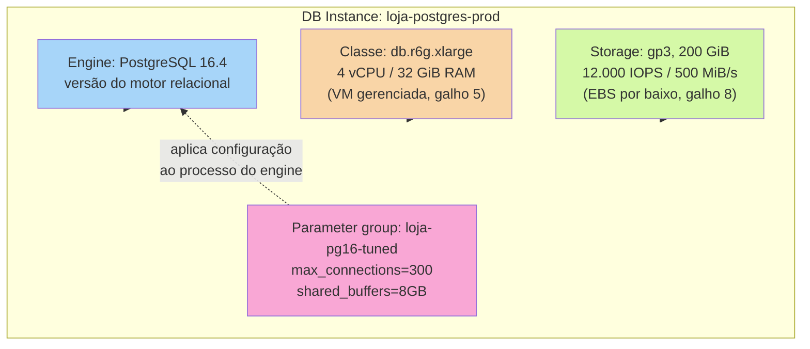
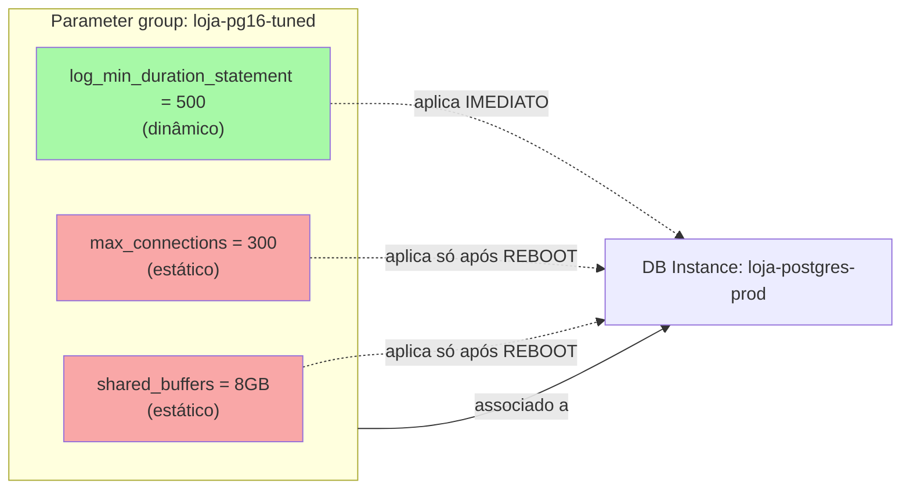
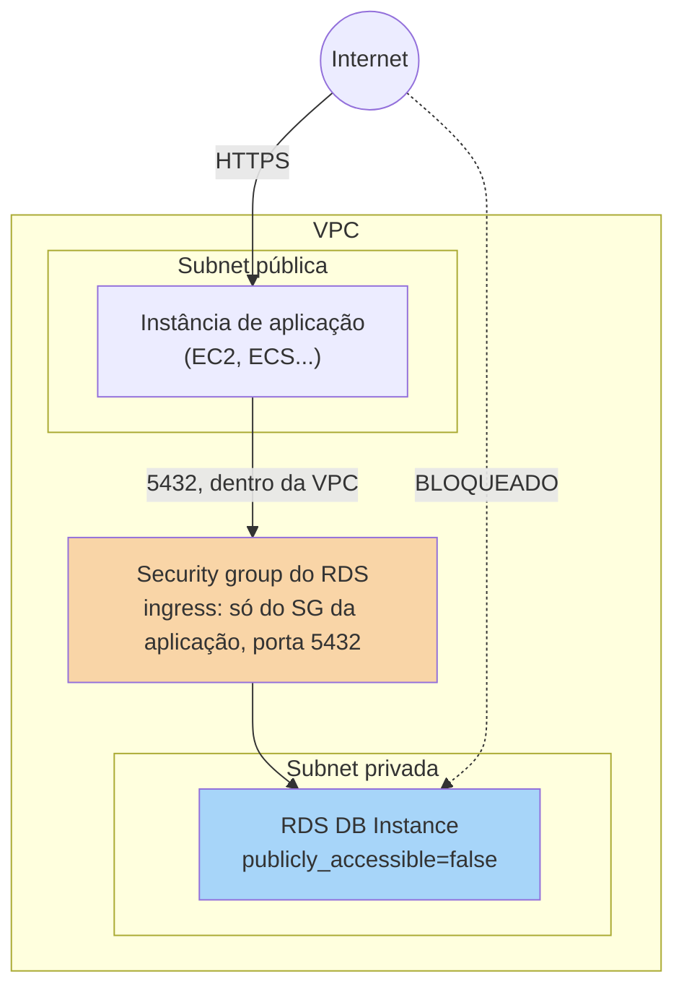

# RDS e Managed Databases a fundo

> [!abstract] TL;DR
> A nota 01 deste galho apresentou o mapa: por que trocar "eu administro o Postgres numa EC2" por "o provedor administra o Postgres para mim". Esta nota abre o capô desse serviço gerenciado. Um **RDS DB instance** é a composição de quatro peças que já apareceram soltas em galhos anteriores, agora costuradas num produto só: um **engine** (PostgreSQL, MySQL, MariaDB, Oracle, SQL Server, Db2, ou a família Aurora — compatível com MySQL/PostgreSQL, mas com storage distribuído próprio), uma **classe de instância** (a mesma lógica de família burstable/general-purpose/memory-optimized do galho 5, só que com o prefixo `db.` em vez de nada), um **volume de storage** (gp3/gp2/io1/io2 — o mesmo EBS do galho 8, só que gerenciado pela RDS por trás de cena) e um **parameter group** — o mecanismo que permite tunar o engine (`max_connections`, `shared_buffers`, `innodb_buffer_pool_size`) sem ter acesso root ao sistema operacional. A instância vive dentro de uma VPC, anexada a um **DB subnet group** e protegida por **security groups** (galho 7): a regra de ouro de produção é que o banco nunca é publicamente acessível — ele fica numa subnet privada, alcançável só pelas instâncias de aplicação que precisam dele. Multi-AZ e réplicas de leitura — o próximo degrau de disponibilidade — ficam para a nota 03; aqui o alvo é entender a mecânica de uma única instância, de ponta a ponta, incluindo a lente dupla com o DigitalOcean Managed Databases, que cobre o mesmo terreno com bem menos botões para girar.

## O problema: preciso de um Postgres para a loja web, e agora?

Retome a pergunta que fechou a nota 01 deste galho: o time precisa de um PostgreSQL para o backend da loja, e já decidiu que não quer ser a pessoa que aplica patch de segurança do engine às três da manhã. "Usar RDS" resolve essa decisão de alto nível — mas assim que alguém abre o console (ou o CLI) para efetivamente criar o banco, uma lista de perguntas concretas aparece, na ordem em que qualquer pessoa realmente as enfrenta:

Qual engine, e qual versão dele? Que tamanho de máquina roda por trás — quantos vCPUs, quanta RAM, e isso é fixo ou pode crescer depois sem recriar tudo? Que tipo de disco guarda os dados, e o que acontece quando ele enche? Como eu mudo um parâmetro do Postgres (por exemplo, `max_connections`, porque a aplicação está abrindo mais conexões simultâneas do que o padrão aguenta) se eu não tenho acesso SSH à máquina que roda o banco? E, a pergunta que mais gente erra na primeira tentativa: esse banco vai ficar acessível pela internet, ou só de dentro da rede da aplicação?

Essas perguntas têm resposta técnica precisa, e é isso que esta nota examina — a instância de banco, o storage, o parameter group, e o endpoint dentro da VPC — deixando de lado, por ora, a pergunta de "e se essa instância cair", que é o assunto exclusivo da próxima nota.

> [!info] Fronteira com o galho 5 e o galho 8
> A classe de instância do RDS é, por baixo, uma VM gerenciada — a mesma ideia de família de instância (burstable/general-purpose/memory-optimized) do [[03-Dominios/Tecnologia/Cloud/05 - Compute I — máquinas virtuais/index|Compute I — máquinas virtuais]]. O storage do RDS é, por baixo, Amazon EBS — os mesmos tipos gp3/io2 do [[03-Dominios/Tecnologia/Cloud/08 - Armazenamento (object, block e file)/index|Armazenamento (object, block e file)]]. Esta nota assume os dois como dados e foca no que a camada RDS acrescenta por cima.

## O mecanismo: engine, instância, storage e parameter group, montados juntos

Um DB instance da RDS não é um conceito único — é a composição visível de quatro peças que a AWS gerencia como um produto integrado. A montagem básica, para uma instância PostgreSQL de produção, fica assim:



Cada peça dessa composição é gerenciada de forma independente — você troca a classe de instância sem recriar o storage, aumenta o storage sem trocar o engine, e edita o parameter group sem tocar em nenhuma das outras três. É essa independência, multiplicada por "a AWS cuida do patch do SO e do engine", que faz a RDS valer a troca em relação a rodar o mesmo PostgreSQL numa EC2 crua.

### Engines suportados: seis motores clássicos, mais a família Aurora

Segundo a documentação oficial da AWS, o RDS hoje suporta os seguintes engines relacionais:

| Engine | Compatibilidade | Storage | Observação |
|---|---|---|---|
| **PostgreSQL** | Community PostgreSQL | EBS (gp3/gp2/io1/io2) | Engine open-source mais usado no roster deste galho |
| **MySQL** | Community MySQL | EBS (gp3/gp2/io1/io2) | Idem |
| **MariaDB** | Fork de MySQL | EBS (gp3/gp2/io1/io2) | Compatível com boa parte do ecossistema MySQL |
| **Oracle Database** | Oracle (SE2/EE) | EBS (gp3/io1/io2), até 3 volumes adicionais | Licenciamento próprio (BYOL ou incluído) |
| **Microsoft SQL Server** | SQL Server (edições variadas) | EBS (gp3/io1/io2), até 3 volumes adicionais | Portas reservadas específicas (1433 default, várias bloqueadas) |
| **Db2** | IBM Db2 | EBS (gp3/io1/io2) | Exige BYOL ou assinatura via AWS Marketplace |
| **Aurora (MySQL-compatible)** | API-compatível com MySQL | Storage distribuído **próprio**, não EBS tradicional | Arquitetura à parte — ver caixa abaixo |
| **Aurora (PostgreSQL-compatible)** | API-compatível com PostgreSQL | Storage distribuído **próprio**, não EBS tradicional | Idem |

> [!info] Aurora é uma arquitetura diferente, não só "mais um engine"
> Os seis primeiros engines desta tabela rodam sobre uma instância com um volume EBS convencional — exatamente o modelo que o resto desta nota descreve em detalhe. O Aurora troca esse modelo por um **storage distribuído e replicado automaticamente em 6 cópias, em 3 zonas de disponibilidade**, dissociado da instância de computação de um jeito que nenhum dos outros engines replica. Esta nota não aprofunda a arquitetura interna do Aurora — o alvo aqui é a mecânica "clássica" (instância + EBS) que Aurora justamente substitui por baixo. Vale reter só isto: quando você lê "Aurora" numa conversa de RDS, o vocabulário de storage muda de figura.

> [!info] Caducidade
> Lista de engines (incluindo Db2, adicionado mais recentemente ao catálogo) verificada na documentação oficial da AWS RDS em 2026-07-23. Versões específicas suportadas de cada engine mudam com frequência — confirme a versão disponível na região de destino antes de criar a instância.

### Classes de instância: a mesma lógica do galho 5, com o prefixo `db.`

A **classe de instância** determina CPU e memória disponíveis — e segue exatamente o raciocínio de família que o galho 5 já cobriu para EC2, só que numerada com o prefixo `db.` em vez de `i.`/nenhum. Segundo a documentação oficial, a RDS organiza as classes em cinco grandes categorias:

| Família | Prefixo | Perfil | Caso de uso típico |
|---|---|---|---|
| **General-purpose** | `db.m` (ex.: db.m7g, db.m6i) | CPU/RAM balanceados | Maioria das cargas de produção |
| **Burstable-performance** | `db.t` (ex.: db.t4g, db.t3) | Baseline de CPU + créditos de burst | Dev/test, cargas com pico curto e ocioso no resto do tempo |
| **Memory-optimized** | `db.r`, `db.x`, `db.z` (ex.: db.r7g, db.x2iedn) | Mais RAM por vCPU | Bancos com working set grande em memória, cache pesado |
| **Compute-optimized** | `db.c` (ex.: db.c6gd) | Mais CPU por instância | Cargas de CPU intensiva; hoje restrito a deployments Multi-AZ DB cluster |
| **Optimized Reads** | `db.m8gd`, `db.r8gd`, `db.r6gd`, `db.r6id` | Storage NVMe local de alta velocidade anexado | Workloads que precisam de I/O local extremamente rápido além do EBS |

> [!info] Caducidade
> Famílias e gerações de classe de instância (ex.: Graviton4/db.r8g, Intel Xeon 6/db.m8i) verificadas na documentação oficial da AWS em 2026-07-23. A AWS lança gerações novas com frequência e descontinua as antigas (ex.: fim de suporte para db.m4/db.r4 em vários engines) — confirme a geração vigente antes de dimensionar uma instância nova.

Trocar a classe de instância é uma operação de `modify-db-instance` — não recria a instância, mas geralmente exige uma janela de indisponibilidade breve (a não ser que a instância seja Multi-AZ, assunto da próxima nota):

```bash
$ aws rds modify-db-instance \
    --db-instance-identifier loja-postgres-prod \
    --db-instance-class db.r6g.2xlarge \
    --apply-immediately
{
    "DBInstance": {
        "DBInstanceIdentifier": "loja-postgres-prod",
        "DBInstanceClass": "db.r6g.2xlarge",
        "DBInstanceStatus": "modifying"
    }
}
```

> [!warning] Instância burstable sob carga sustentada é a armadilha clássica de dimensionamento
> Uma classe `db.t` (burstable) parece barata na planilha de custo — e é, enquanto a carga fica abaixo do baseline de CPU a maior parte do tempo. Mas o mesmo modelo de crédito de burst do EC2 (galho 5) e do gp2 (galho 8) se aplica aqui: sob carga **sustentada** — não um pico curto, mas uso constante acima do baseline — os créditos se esgotam e a performance cai de volta ao baseline, exatamente no pior momento. `db.t` é a escolha certa para dev/test ou uma API de tráfego baixo e espaçado; para o banco de produção da loja, sob carga constante, uma classe `db.m` ou `db.r` evita a surpresa.

> [!tip] Assista: Introduction to Amazon Relational Database Service (RDS) for beginners
> **Canal:** Data Tech | **Duração:** ~17min | **Idioma:** EN
>
> Um passo a passo criando uma instância RDS no console — vale menos pela teoria (que esta nota já cobre mais fundo) e mais por ver, na prática, engine, template, classe de instância e storage sendo escolhidos na mesma tela, um depois do outro. Trecho de destaque [13:45]: *"then the instance class as I mentioned initially (...) it's the size (...) depending on your use case (...) if it is production then you can choose the size accordingly"*
>
> 🎬 [Assistir no YouTube](https://www.youtube.com/watch?v=-p0P12HboA0)

### Storage do RDS: o mesmo EBS do galho 8, com autoscaling embutido

O storage de uma instância RDS (exceto Aurora) é, literalmente, um volume Amazon EBS — os mesmos tipos que a nota 05 do galho 8 já detalhou, aqui expostos com a granularidade que cada engine RDS permite:

| Tipo | Uso recomendado | Faixa de tamanho (a maioria dos engines) | IOPS máx. |
|---|---|---|---|
| **gp3** (recomendado) | Maioria das cargas; performance independente de tamanho | 20 GiB – 64 TiB | até 80.000 (SQL Server) / 64.000 (demais) |
| **gp2** (geração anterior) | Cargas menos sensíveis a latência | 20 GiB – 64 TiB | escala com o tamanho (3 IOPS/GiB) |
| **io2 Block Express** (recomendado p/ IOPS) | OLTP crítico, baixa latência sustentada | 100 GiB – 64 TiB | até 256.000 |
| **io1** (geração anterior) | Legado de IOPS provisionado | 100 GiB – 64 TiB | até 256.000 (varia por engine) |
| **Magnetic** (descontinuado) | Nenhum — não aceita novas instâncias | máx. 3 TiB | máx. 1.000 |

> [!info] Caducidade
> A AWS descontinuou o storage magnético para novas instâncias RDS e, a partir de 1º de julho de 2026, não será mais possível restaurar um snapshot direto para storage magnético — a restauração precisa migrar para gp3 ou io2 Block Express nesse processo. Faixas de tamanho e IOPS por engine (PostgreSQL/MySQL/MariaDB/Db2 vs. Oracle vs. SQL Server) verificadas na documentação oficial da AWS RDS em 2026-07-23; confirme a faixa exata do seu engine antes de dimensionar.

O detalhe que a camada RDS acrescenta por cima do EBS puro é o **storage autoscaling**: em vez de você monitorar manualmente o espaço livre e rodar um `modify-db-instance --allocated-storage` na hora certa, a RDS pode crescer o volume sozinha quando o espaço livre cai abaixo de um limiar, até um teto máximo que você define:

```bash
$ aws rds modify-db-instance \
    --db-instance-identifier loja-postgres-prod \
    --max-allocated-storage 500 \
    --apply-immediately
```

Esse `--max-allocated-storage` é o único parâmetro necessário para ligar o autoscaling — ele diz "cresça sozinho até 500 GiB, quando precisar"; sem esse parâmetro definido, o volume fica fixo no tamanho original e um enchimento de disco vira um incidente manual.

## Parameter groups e option groups: tunando o engine sem acesso root

O segundo desafio que a nota 01 deste galho já havia adiantado: como mudar `max_connections` do Postgres, ou `innodb_buffer_pool_size` do MySQL, se você não tem shell na máquina que hospeda o banco? A resposta da RDS é o **DB parameter group** — um conjunto nomeado de valores de configuração do engine, associado a uma ou mais instâncias, editável via console, CLI ou API, sem nunca precisar de acesso ao sistema operacional por trás.



A distinção que mais surpreende quem está aprendendo é a de **parâmetros estáticos vs. dinâmicos**: segundo a documentação oficial, mudanças em parâmetros **dinâmicos** são aplicadas à instância imediatamente, sem reboot; mudanças em parâmetros **estáticos** só entram em vigor depois que a instância é reiniciada — e até lá, o console mostra o parameter group com status `pending-reboot`. `max_connections` e `shared_buffers`, no Postgres, são exemplos clássicos de parâmetro estático — mudar o valor e não reiniciar a instância é a forma nº 1 de achar, na prática, que "a mudança não fez nada".

Você não pode editar o **parameter group default** — ele é somente leitura. O fluxo correto é criar um parameter group próprio, associá-lo à instância, e editá-lo à vontade:

```bash
# 1. Criar um parameter group próprio, baseado na família do engine (aqui, PostgreSQL 16)
$ aws rds create-db-parameter-group \
    --db-parameter-group-name loja-pg16-tuned \
    --db-parameter-group-family postgres16 \
    --description "Parameter group ajustado para a loja web"
{
    "DBParameterGroup": {
        "DBParameterGroupName": "loja-pg16-tuned",
        "DBParameterGroupFamily": "postgres16"
    }
}

# 2. Mudar max_connections e verificar o ApplyMethod
$ aws rds modify-db-parameter-group \
    --db-parameter-group-name loja-pg16-tuned \
    --parameters "ParameterName=max_connections,ParameterValue=300,ApplyMethod=pending-reboot"

# 3. Associar o parameter group à instância (via modify-db-instance)
$ aws rds modify-db-instance \
    --db-instance-identifier loja-postgres-prod \
    --db-parameter-group-name loja-pg16-tuned \
    --apply-immediately

# 4. Checar se o parâmetro é estático ou dinâmico ANTES de assumir que a mudança já valeu
$ aws rds describe-db-parameters \
    --db-parameter-group-name loja-pg16-tuned \
    --query "Parameters[?ParameterName=='max_connections'].{Name:ParameterName,Value:ParameterValue,ApplyType:ApplyType}"
[
    {
        "Name": "max_connections",
        "Value": "300",
        "ApplyType": "static"
    }
]

# 5. Como ApplyType=static, é preciso reiniciar a instância para o valor valer de verdade
$ aws rds reboot-db-instance --db-instance-identifier loja-postgres-prod
```

Um detalhe adjacente que muitos engines RDS também expõem — mas nem todos — é o **option group**: para engines como Oracle e SQL Server, algumas funcionalidades extras do motor (por exemplo, Oracle Enterprise Manager ou SQL Server Transparent Data Encryption) são ativadas via um option group associado à instância, seguindo o mesmo modelo de "nomear um conjunto de configurações e associar à instância" do parameter group — só que voltado a *features*, não a valores de configuração linha a linha.

> [!warning] Mudar um parâmetro estático e não reiniciar não aplica nada
> É o erro mais comum de quem está tunando um engine RDS pela primeira vez: rodar `modify-db-parameter-group`, ver o comando retornar sucesso, e assumir que o banco já está usando o novo valor. Se o parâmetro é **estático**, a mudança fica em `pending-reboot` até você reiniciar a instância manualmente (ou até a próxima janela de manutenção que force um restart). `describe-db-parameters` com o campo `ApplyType` é a forma de saber, antes de prometer ao time que "já ajustei o `max_connections`", se falta ainda um reboot.

## Endpoint, porta e conexão: o banco vive dentro da VPC

Toda instância RDS nasce com um **endpoint DNS** — um hostname resolvível (nunca um IP fixo, porque o IP por trás pode mudar num failover) — e uma porta, que varia por engine (5432 para PostgreSQL, 3306 para MySQL/MariaDB, 1433 para SQL Server, 1521 para Oracle por convenção). É esse par endpoint+porta que a aplicação usa para conectar — nunca um endereço de instância EC2 "por trás", porque a RDS gerencia o mapeamento de rede sozinha.

```bash
$ aws rds describe-db-instances \
    --db-instance-identifier loja-postgres-prod \
    --query "DBInstances[0].{Endpoint:Endpoint.Address,Port:Endpoint.Port,Status:DBInstanceStatus}"
{
    "Endpoint": "loja-postgres-prod.c9akciq32.us-east-1.rds.amazonaws.com",
    "Port": 5432,
    "Status": "available"
}

$ psql -h loja-postgres-prod.c9akciq32.us-east-1.rds.amazonaws.com -p 5432 -U appuser -d loja
Password for user appuser:
psql (16.4)
Type "help" for help.
loja=>
```

```bash
# O mesmo endpoint, para um engine MySQL/MariaDB
$ mysql -h loja-mysql-prod.c9akciq32.us-east-1.rds.amazonaws.com -P 3306 -u appuser -p loja
```

O que decide se esse endpoint é alcançável só de dentro da rede ou também pela internet é a combinação de dois ajustes, ambos ligados diretamente ao galho 7:



O primeiro ajuste é o **DB subnet group** — a lista de subnets (cobrindo ao menos duas zonas de disponibilidade) onde a instância pode ser colocada, escolhida entre subnets privadas para produção. O segundo é o atributo **`publicly-accessible`**: quando `false`, a instância só recebe um IP privado dentro da VPC, e nenhum endereço IP público é atribuído ao endpoint, não importa o que o security group permita.

> [!info] Fronteira com o galho 7
> Subnet privada, DB subnet group, security group com ingress restrito à aplicação — toda a mecânica de rede que protege o banco vem do galho [[03-Dominios/Tecnologia/Cloud/07 - Rede na nuvem (VPC)/index|Rede na nuvem (VPC)]]. Aqui ela é aplicada; lá é explicada. A regra de ouro ("banco nunca em subnet pública") é a encarnação, na camada de dados, da defesa em profundidade que fecha aquele galho.

```bash
# Criar um subnet group cobrindo duas subnets PRIVADAS, em duas AZs
$ aws rds create-db-subnet-group \
    --db-subnet-group-name loja-db-subnets \
    --db-subnet-group-description "Subnets privadas para RDS da loja" \
    --subnet-ids subnet-0aaa1111 subnet-0bbb2222

# Criar a instância já apontando publicly-accessible=false e o security group correto
$ aws rds create-db-instance \
    --db-instance-identifier loja-postgres-prod \
    --engine postgres \
    --engine-version 16.4 \
    --db-instance-class db.r6g.xlarge \
    --allocated-storage 200 \
    --storage-type gp3 \
    --iops 6000 \
    --storage-throughput 250 \
    --master-username appadmin \
    --manage-master-user-password \
    --db-subnet-group-name loja-db-subnets \
    --vpc-security-group-ids sg-0rdsprivado123 \
    --no-publicly-accessible \
    --backup-retention-period 7 \
    --db-parameter-group-name loja-pg16-tuned
{
    "DBInstance": {
        "DBInstanceIdentifier": "loja-postgres-prod",
        "DBInstanceClass": "db.r6g.xlarge",
        "Engine": "postgres",
        "DBInstanceStatus": "creating",
        "AllocatedStorage": 200,
        "PubliclyAccessible": false
    }
}
```

O security group, por sua vez, é o firewall — a regra prática do galho 7 aplicada aqui sem exceção: o ingress do security group associado ao RDS deveria permitir tráfego **só** vindo do security group da aplicação (não de um CIDR aberto, e nunca de `0.0.0.0/0`), na porta do engine.

Se uma instância nasceu por engano como pública — o cenário clássico de quem clicou rápido demais no console — corrigir é um único `modify-db-instance`, mas não some do estado até a próxima janela de aplicação (a não ser que você force com `--apply-immediately`):

```bash
$ aws rds modify-db-instance \
    --db-instance-identifier loja-postgres-prod \
    --no-publicly-accessible \
    --apply-immediately
```

> [!warning] Banco público por engano em produção é o erro nº 1 de RDS
> `publicly-accessible=true` mais um security group com ingress de `0.0.0.0/0` é a combinação que expõe um banco de dados de produção à internet inteira, e é surpreendentemente fácil de acontecer sem querer: o console às vezes preenche esse campo com um valor diferente do esperado dependendo do fluxo escolhido (por exemplo, "Easy create" tem defaults diferentes de "Standard create"). O hábito que evita o incidente: depois de criar qualquer instância de produção, rodar `describe-db-instances` e conferir `PubliclyAccessible` explicitamente, em vez de confiar na memória do que foi clicado no assistente.

> [!warning] Subestimar o limite de conexões e descobrir isso em produção
> `max_connections` tem um teto que escala com a memória da classe de instância (não é um número livre para qualquer valor) — e cada conexão aberta pela aplicação consome memória do próprio processo do engine. Um erro comum: dimensionar o pool de conexões da aplicação (por exemplo, no ORM) sem checar o `max_connections` real da instância, e descobrir o limite só quando a aplicação começa a receber `too many connections` num pico de tráfego. A prática saudável é somar o total de conexões que TODAS as instâncias de aplicação vão abrir contra o banco e comparar com o `max_connections` configurado — e considerar um connection pooler (RDS Proxy do lado AWS, PgBouncer do lado DigitalOcean) antes de simplesmente aumentar o parâmetro sem limite.

## Lente dupla: RDS na AWS, Managed Databases na DigitalOcean

A DigitalOcean cobre o mesmo terreno com o produto **Managed Databases**: PostgreSQL, MySQL, e outros engines não-relacionais (Kafka, MongoDB, Valkey, OpenSearch) — cada cluster com um nó primário, nós standby de failover e nós read-only opcionais. A criação, tanto pelo painel quanto pelo `doctl`, é deliberadamente mais simples que o `create-db-instance` da AWS:

```bash
# Criar um cluster PostgreSQL gerenciado — engine, tamanho, região e nº de nós num único comando
$ doctl databases create loja-postgres-prod \
    --engine pg \
    --version 16 \
    --region nyc1 \
    --size db-s-2vcpu-4gb \
    --num-nodes 2

# Ver os detalhes de conexão — equivalente ao describe-db-instances da AWS
$ doctl databases connection <database-cluster-id> --format Host,Port,User,Password,Database
Host                                                Port    User        Password         Database
loja-postgres-prod-do-user-123456.db.ondigitalocean.com    25060   doadmin     ****             defaultdb
```

A honestidade de paridade aqui é direta: a DigitalOcean **não expõe** um equivalente granular a parameter group — não existe uma API de "criar um conjunto de parâmetros nomeado, editar linha a linha, e associar a múltiplos clusters" como a RDS oferece. O que a DigitalOcean expõe, no lugar disso, é um subconjunto menor de opções de configuração por cluster (via painel ou API), suficiente para os ajustes mais comuns, mas sem a granularidade fina de qualquer parâmetro do engine.

Em compensação, a DigitalOcean já embute **connection pooling via PgBouncer** como parte do produto — algo que na AWS é um serviço à parte (RDS Proxy) ou uma peça que você mesmo opera:

```bash
# Criar um pool de conexões (PgBouncer por baixo) para o cluster
$ doctl databases pool create <database-cluster-id> loja-pool \
    --db defaultdb \
    --mode transaction \
    --size 20
```

O `--mode transaction` aqui é a escolha default e mais comum: cada conexão do cliente usa o pool só pela duração de uma transação, liberando a conexão de volta ao pool assim que ela termina — o que permite muito mais clientes simultâneos do que o `max_connections` real do banco suportaria em conexão direta. O modo `session` mantém a conexão do cliente presa durante toda a sessão (necessário para prepared statements ou `LISTEN`/`NOTIFY`), e o modo `statement` é o mais restritivo, liberando a conexão a cada statement individual.

Conferir os pools existentes de um cluster é um único comando — útil tanto para auditar configuração quanto para confirmar, depois de criar um pool novo, que ele já está ativo:

```bash
$ doctl databases pool list <database-cluster-id>
Name          User       Database      Size    Mode
loja-pool     doadmin    defaultdb     20      transaction
```

A regra prática de dimensionamento do pool, segundo a própria documentação da DigitalOcean, é que cada cluster reserva um número de conexões proporcional à RAM do nó (25 conexões por GiB, com 3 reservadas para manutenção interna) — o que dá um teto natural e documentado para escolher o `--size` do pool, em vez de adivinhar um número e descobrir o limite real só sob carga.

| Dimensão | AWS RDS | DigitalOcean Managed Databases |
|---|---|---|
| Engines relacionais | PostgreSQL, MySQL, MariaDB, Oracle, SQL Server, Db2, Aurora | PostgreSQL, MySQL |
| Tuning de parâmetros | Parameter group granular, por parâmetro, estático/dinâmico | Subconjunto menor de opções, sem granularidade por parâmetro |
| Connection pooling | Serviço à parte (RDS Proxy) ou operado por você | PgBouncer embutido no produto (`doctl databases pool`) |
| Criação via CLI | `aws rds create-db-instance` (dezenas de flags possíveis) | `doctl databases create` (poucas flags obrigatórias) |
| Rede privada por padrão | Depende de VPC/subnet group configurados explicitamente | Cluster nasce numa VPC própria da DO, isolado por padrão |

| Dimensão | Azure Database for PostgreSQL/MySQL | GCP Cloud SQL |
|---|---|---|
| Compute tiers | Burstable, General Purpose, Memory Optimized | Cargas equivalentes via tipos de máquina configuráveis |
| Storage | Separado do compute, redundância zonal automática | Discos persistentes por instância |
| Tuning de parâmetros | Flags de servidor configuráveis (equivalente a parameter group) | Database flags (equivalente a parameter group) |
| Connection pooling | PgBouncer **embutido** (porta 6432, ou 8432 em elastic clusters) | Cloud SQL Auth Proxy / PgBouncer operado à parte |
| Rede privada | VPC integration, acesso público desabilitável | VPC privada nativa via Private Service Connect |

> [!info] Caducidade
> Engines DigitalOcean (PostgreSQL, MySQL, Kafka, MongoDB, Valkey, OpenSearch), sintaxe `doctl databases create`/`pool create`, e modos de pool (transaction/session/statement) verificados na documentação oficial da DigitalOcean em 2026-07-23. PgBouncer embutido do Azure Database for PostgreSQL Flexible Server (porta 6432/8432) e compute tiers (Burstable/General Purpose/Memory Optimized) verificados na documentação da Microsoft na mesma data. Confirme antes de basear uma decisão de arquitetura — nomes de plano e limites por tier mudam com frequência.

## Multi-AZ e réplicas: mencionado, não aprofundado aqui

Tudo que esta nota cobriu — instância, storage, parameter group, endpoint — descreve uma **única** instância de banco, rodando numa única zona de disponibilidade. A RDS oferece dois recursos de disponibilidade que multiplicam essa instância: **Multi-AZ** (uma réplica síncrona em standby, promovida automaticamente em caso de falha) e **réplicas de leitura** (cópias assíncronas, usadas para escalar leitura, não para failover automático). Os dois aparecem de passagem nesta nota — no comando `create-db-instance`, no template "Production" do console, na tabela de engines — mas o mecanismo de failover, a diferença entre síncrono e assíncrono, e quando cada um faz sentido são o assunto da próxima nota deste galho.

## Casos práticos

**A loja web, agora com a mecânica completa.** O time cria a instância `loja-postgres-prod` como PostgreSQL 16, classe `db.r6g.xlarge` (memory-optimized, porque o catálogo de produtos cabe quase inteiro em cache), storage gp3 com IOPS provisionado acima do baseline, `publicly-accessible=false`, numa subnet privada, com um security group que só aceita tráfego do security group das instâncias de aplicação. O parameter group `loja-pg16-tuned` ajusta `max_connections` para acomodar o pool de conexões de todas as réplicas da aplicação, e um reboot agendado numa janela de manutenção aplica o valor (porque é estático).

**Migração de um time que já rodava Postgres numa EC2 crua.** O ponto de partida era exatamente o cenário da nota 01 deste galho — root SSH, backup manual, patch manual. A migração para RDS troca esse modelo pela composição desta nota: mesmo engine, mesma versão, mas agora classe de instância, storage e parameter group como recursos gerenciados e versionados, e o acesso root que sumiu vira parameter group + option group.

**Um MVP na DigitalOcean, sem qualquer time de operação dedicado.** Um cluster PostgreSQL de dois nós, criado com um único `doctl databases create`, já nasce com PgBouncer disponível — sem exigir que ninguém opere um proxy de conexão separado. A troca explícita: menos botões para girar (sem parameter group granular), mas também menos decisões a tomar antes de ir para produção.

## O que vem a seguir

Esta nota fechou a mecânica de uma única instância — engine, classe, storage, parameter group, endpoint dentro da VPC. Mas uma instância única, mesmo bem configurada, ainda é um ponto único de falha: se a zona de disponibilidade que hospeda o banco cair, a loja inteira para. A próxima nota deste galho aprofunda exatamente esse próximo degrau — Multi-AZ, réplicas de leitura, failover automático — e o vocabulário de disponibilidade que separa "banco que funciona" de "banco que sobrevive a um incidente real".

## Fontes

- [AWS RDS — Amazon RDS DB instance storage](https://docs.aws.amazon.com/AmazonRDS/latest/UserGuide/CHAP_Storage.html) — tipos de storage (gp3, gp2, io1, io2 Block Express, magnético deprecado), faixas de tamanho e IOPS por engine, descontinuação do storage magnético a partir de 1º de julho de 2026; acessado em 2026-07-23.
- [AWS RDS — DB instance classes](https://docs.aws.amazon.com/AmazonRDS/latest/UserGuide/Concepts.DBInstanceClass.html) — conceito de classe de instância, ligação com pricing e mudança de classe; acessado em 2026-07-23.
- [AWS RDS — DB instance class types](https://docs.aws.amazon.com/AmazonRDS/latest/UserGuide/Concepts.DBInstanceClass.Types.html) — famílias general-purpose (db.m), burstable (db.t), memory-optimized (db.r/x/z), compute-optimized (db.c) e Optimized Reads, com gerações atuais; acessado em 2026-07-23.
- [AWS RDS — Parameter groups for Amazon RDS](https://docs.aws.amazon.com/AmazonRDS/latest/UserGuide/USER_WorkingWithParamGroups.html) — visão geral de parameter groups e referência a option groups; acessado em 2026-07-23.
- [AWS RDS — Modifying parameters in a DB parameter group](https://docs.aws.amazon.com/AmazonRDS/latest/UserGuide/USER_WorkingWithParamGroups.Modifying.html) — distinção entre parâmetros estáticos e dinâmicos, necessidade de reboot para estáticos, sintaxe de `modify-db-parameter-group`; acessado em 2026-07-23.
- [AWS RDS — Amazon VPC and Amazon RDS](https://docs.aws.amazon.com/AmazonRDS/latest/UserGuide/USER_VPC.html) — instância RDS dentro de uma VPC, DB subnet group, ausência de custo adicional por rodar em VPC; acessado em 2026-07-23.
- [AWS RDS — Creating an Amazon RDS DB instance](https://docs.aws.amazon.com/AmazonRDS/latest/UserGuide/USER_CreateDBInstance.html) — pré-requisitos de rede (subnet group cobrindo ao menos duas AZs), default de `publicly-accessible=No` ao conectar a uma EC2, sintaxe completa de `create-db-instance` via CLI; acessado em 2026-07-23.
- [DigitalOcean — Managed Databases Overview](https://docs.digitalocean.com/products/databases/) — engines suportados (PostgreSQL, MySQL, Kafka, MongoDB, Valkey, OpenSearch), papéis de nó primário/standby/read-only; acessado em 2026-07-23.
- [DigitalOcean — Manage Connection Pools (PostgreSQL)](https://docs.digitalocean.com/products/databases/postgresql/how-to/manage-connection-pools/) — PgBouncer como base do pooling, modos transaction/session/statement, cálculo de conexões por RAM do cluster; acessado em 2026-07-23.
- [DigitalOcean — doctl databases create](https://docs.digitalocean.com/reference/doctl/reference/databases/create/) — flags `--engine`, `--size`, `--region`, `--num-nodes`, `--version`; acessado em 2026-07-23.
- [Microsoft Learn — What is Azure Database for PostgreSQL flexible server?](https://learn.microsoft.com/en-us/azure/postgresql/flexible-server/overview) — compute tiers (Burstable/General Purpose/Memory Optimized), PgBouncer embutido nas portas 6432/8432, isolamento via VNet integration; acessado em 2026-07-23.
