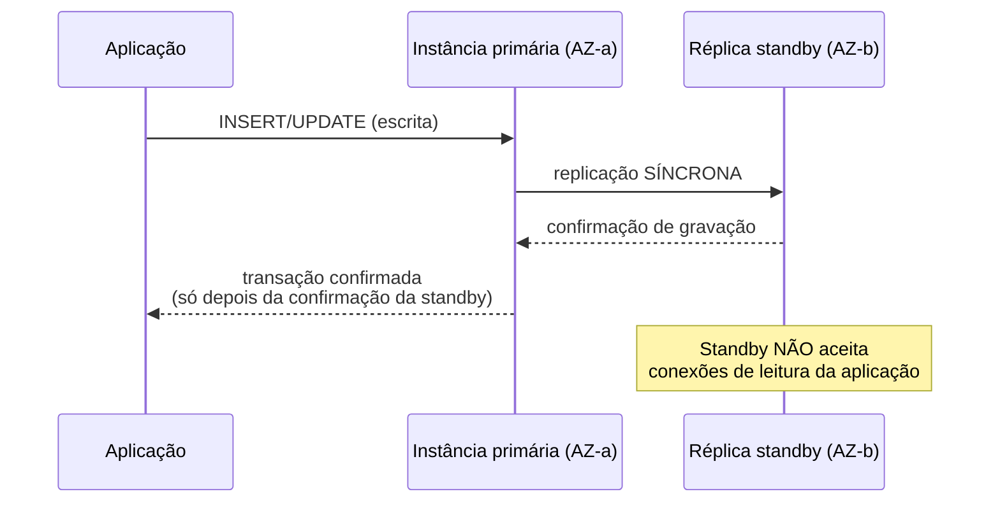
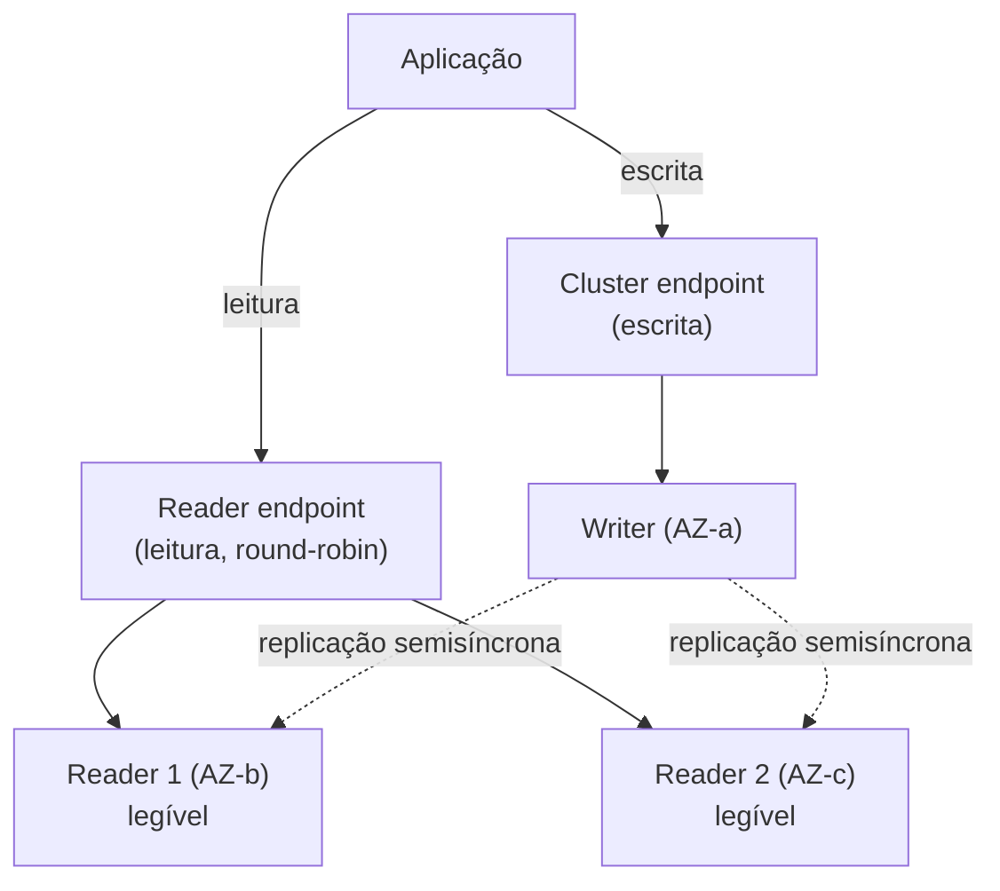
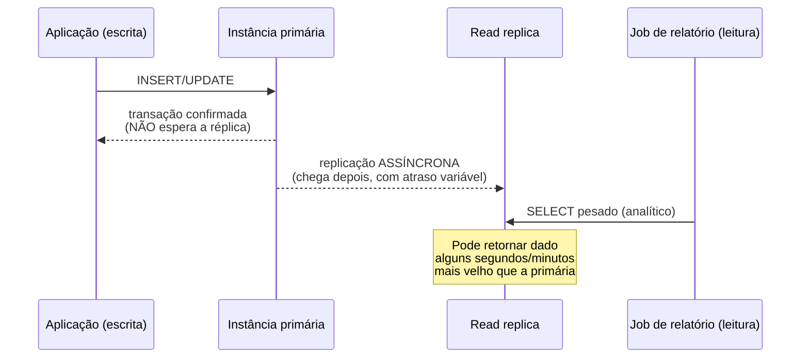
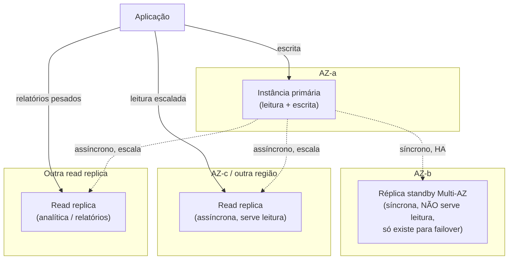

# Alta disponibilidade e réplicas

> [!abstract] TL;DR
> A nota anterior mostrou o banco gerenciado como um serviço que ainda assim pede decisões de operação — e a primeira decisão que toda entrevista de arquitetura cobra é a mais confundida de todas: **Multi-AZ** e **read replica** resolvem problemas diferentes, e tratá-los como sinônimos é o erro nº 1 de quem está aprendendo bancos gerenciados. Multi-AZ existe para **sobreviver** à queda da primária — mantém uma réplica *standby* síncrona numa outra zona de disponibilidade, que não aceita nenhuma leitura de aplicação e só assume o posto de escritor se a primária falhar, tipicamente em um a dois minutos, sem o endpoint mudar. Read replica existe para **escalar leitura** — cópias assíncronas, com atraso variável, que aceitam tráfego de leitura o tempo todo, podem viver em outra região, e não fazem failover automático por padrão. Um banco de produção sério normalmente tem os dois ao mesmo tempo, cada um cobrindo a metade do problema que o outro deixa passar.

## O problema: dois incêndios diferentes, uma mesma manhã

São três da manhã e a zona de disponibilidade que hospeda a instância primária do banco de produção fica inacessível — uma falha de hardware, uma partição de rede, algo que a AWS ou a DigitalOcean resolvem em nível de infraestrutura, mas que, do ponto de vista da aplicação, significa **o banco sumiu**. Ninguém no time está de plantão olhando um dashboard; a pergunta é se o sistema se recupera sozinho, e em quanto tempo. Sem nenhuma réplica configurada para esse cenário, a resposta é "só depois que alguém acordar, entrar, restaurar um backup e torcer para o RPO ser aceitável" — horas, não minutos.

Duas semanas depois, um problema completamente diferente aparece: o time de dados começa a rodar consultas analíticas pesadas — relatórios de fim de mês, exports para um data warehouse — direto contra o mesmo banco que atende a aplicação em produção. As consultas de relatório varrem tabelas inteiras, prendem I/O, e o tempo de resposta da aplicação principal degrada visivelmente toda vez que o relatório roda. Ninguém caiu; o banco está tecnicamente "no ar" o tempo todo. O problema não é disponibilidade, é **contenção de carga** — leitura pesada brigando com leitura e escrita de produção pelos mesmos recursos.

O primeiro cenário pede uma cópia que **assuma o controle** quando a original morre. O segundo pede uma cópia que **absorva tráfego de leitura** sem nunca precisar assumir nada. São dois mecanismos com propósitos opostos, e a confusão entre eles é tão comum — e tão citada em entrevista de arquitetura — que vale entender cada um isoladamente antes de ver como eles se combinam.

Não é acaso que essa distinção apareça em quase toda entrevista de sistema que toca em banco de dados. A pergunta "como você garante alta disponibilidade do banco?" tem uma resposta errada extremamente comum — "eu adiciono read replicas" — que soa correta o suficiente para passar despercebida se o entrevistador não sondar mais fundo, mas revela, na primeira pergunta de seguimento ("e se a réplica também estiver com lag no momento da queda da primária, o que acontece?"), que quem respondeu nunca articulou a diferença entre disponibilidade síncrona e escala assíncrona. Esta nota existe para que essa articulação já esteja pronta antes da pergunta chegar.

## Multi-AZ: a réplica que existe só para assumir o controle

Segundo a documentação oficial da AWS, num **Multi-AZ DB instance deployment**, o RDS "provisiona e mantém automaticamente uma réplica standby síncrona numa Availability Zone diferente" — e a mesma página é explícita sobre a limitação central: "a opção de alta disponibilidade não é uma solução de escala para cenários somente leitura. Você não pode usar uma réplica standby para servir tráfego de leitura." A réplica standby recebe cada escrita da primária de forma **síncrona** — a transação só é confirmada ao cliente depois que a primária *e* a standby confirmaram — precisamente para garantir zero perda de dado se a primária cair no instante seguinte. O preço dessa garantia é latência de escrita ligeiramente maior do que um deployment single-AZ, porque toda confirmação espera a rodada de ida e volta entre zonas.



A réplica standby, sozinha, não faz nada de visível para a aplicação — até o momento em que a primária falha. Aí o RDS detecta a falha e conduz o **failover**: promove a standby a primária e, segundo a FAQ oficial da AWS, "simplesmente vira o CNAME (registro DNS) da sua instância de banco para apontar para a standby, que por sua vez é promovida a nova primária." O endpoint da aplicação **não muda** — é a mesma string de conexão de sempre — mas qualquer conexão TCP que já estava aberta com a instância antiga cai, porque o IP por trás daquele nome mudou. A mesma FAQ recomenda explicitamente "implementar retry de conexão de banco de dados na camada de aplicação" — ou seja: o failover automático resolve a metade da infraestrutura, mas a aplicação ainda precisa reconectar e tentar de novo a transação que estava em voo. Essa é a ponte natural para o padrão de retry tratado em Comunicação entre Sistemas — Multi-AZ garante que *existe* uma primária nova para reconectar; não garante que a conexão antiga sobrevive à troca.

Duas peças amenizam esse trabalho de reconexão sem eliminá-lo. Primeiro, a própria mudança de CNAME tem um TTL curto, então drivers de banco que respeitam cache de DNS de forma razoável já resolvem o novo IP em poucos segundos — o problema real não é "o DNS demora para atualizar", é "o pool de conexões da aplicação insiste em reusar um socket morto até alguém detectar o erro". Segundo, o **RDS Proxy** — um serviço gerenciado de connection pooling que fica entre a aplicação e a instância RDS — reduz o tempo de indisponibilidade percebido durante um failover, porque ele mesmo já monitora a topologia do banco e redireciona conexões para a nova primária, tirando parte dessa responsabilidade do código de retry da aplicação. Ainda assim, nenhuma dessas duas peças substitui uma política explícita de retry na aplicação: elas encurtam a janela de erro, não a eliminam.

> [!info] RTO típico do failover Multi-AZ
> A FAQ da AWS descreve o failover como concluído "tipicamente dentro de um a dois minutos" — contando do momento em que a falha é detectada até a retomada de transações na standby. Transações grandes não confirmadas na hora da queda podem alongar esse tempo, porque precisam ser recuperadas antes da standby aceitar novo tráfego de escrita. Não é zero segundos: existe uma janela real de indisponibilidade, mesmo com Multi-AZ ativo.

O "um a dois minutos" não nasce de uma decisão manual de alguém olhando um alarme — o mecanismo de detecção roda continuamente, dentro do próprio serviço gerenciado, sem depender de um humano de plantão. O Cloud SQL da GCP, por exemplo, documenta esse mecanismo com números concretos: heartbeat checando a saúde da instância a cada segundo, e uma indisponibilidade total esperada de "cerca de sessenta segundos" quando o failover dispara — o mesmo padrão estrutural do RDS, só que com granularidade documentada de forma mais explícita. É esse relógio interno, não uma pessoa respondendo a um PagerDuty, que decide quando a standby assume — o papel humano começa depois, tratando o efeito colateral nas conexões da aplicação, não o gatilho do failover em si.

Criar uma instância já nascendo Multi-AZ é uma única flag na CLI:

```bash
$ aws rds create-db-instance \
    --db-instance-identifier producao-pedidos \
    --db-instance-class db.r6g.large \
    --engine postgres \
    --master-username admin \
    --master-user-password "SENHA_FORTE_AQUI" \
    --allocated-storage 100 \
    --multi-az
```

E confirmar que o deployment está de fato replicando, e em qual zona a standby vive:

```bash
$ aws rds describe-db-instances \
    --db-instance-identifier producao-pedidos \
    --query 'DBInstances[0].[MultiAZ,AvailabilityZone,SecondaryAvailabilityZone,DBInstanceStatus]'
[
    true,
    "us-east-1a",
    "us-east-1b",
    "available"
]
```

Forçar um failover manualmente — útil para testar o comportamento da aplicação antes de depender dele em produção, ou para tirar a primária de uma zona que vai passar por manutenção — é um reboot com uma flag específica:

```bash
$ aws rds reboot-db-instance \
    --db-instance-identifier producao-pedidos \
    --force-failover
```

A documentação da AWS CLI é explícita sobre a restrição: "você não pode habilitar force failover se a instância não estiver configurada para Multi-AZ" — o comando simplesmente recusa em qualquer instância single-AZ, porque não existe standby nenhuma para promover.

> [!tip] Assista: Multi-AZ vs Read Replicas | Amazon RDS Tutorial for Beginners
> **Canal:** BeSA Cloud Academy | **Duração:** ~7min | **Idioma:** EN
>
> Um desenho ao vivo, VPC por VPC, da mesma distinção que esta seção acabou de formalizar: Multi-AZ como réplica síncrona que só existe para assumir a escrita, versus read replica assíncrona que existe para tirar carga de leitura da primária.
> Trecho de destaque [01:29]: *"they would have a syn replication means whatever data I am writing in [primary] it would also be available on [standby] (...) that's what we mean by a synchronous replication"*
>
> 🎬 [Assistir no YouTube](https://www.youtube.com/watch?v=fW_prKJR79Y)

### Testando o failover antes que ele aconteça de verdade

A armadilha mais silenciosa de Multi-AZ não é técnica, é organizacional: configurar a standby, nunca forçar um failover de teste, e descobrir só durante um incidente real — com clientes reais esperando — que a aplicação não reconecta, que o pool de conexões trava, ou que um job em segundo plano assume silenciosamente que o IP do banco nunca muda. O comando `reboot-db-instance --force-failover`, visto acima, existe exatamente para fechar esse gap: rodá-lo num ambiente de staging (ou mesmo em produção, numa janela controlada, com o time observando) transforma "vamos torcer para o retry funcionar" em "já vimos o retry funcionar, sob condições reais". Esse tipo de exercício deliberado — provocar a falha de propósito para validar a recuperação, em vez de esperar ela acontecer sozinha — é o mesmo espírito por trás de chaos engineering como prática mais ampla, tratado com profundidade na disciplina de Operação, não nesta nota.

```bash
# Antes do teste: confirmar em qual AZ a standby vive, para saber o que esperar
$ aws rds describe-db-instances \
    --db-instance-identifier producao-pedidos \
    --query 'DBInstances[0].[AvailabilityZone,SecondaryAvailabilityZone]'
[
    "us-east-1a",
    "us-east-1b"
]

# Disparar o failover controlado
$ aws rds reboot-db-instance \
    --db-instance-identifier producao-pedidos \
    --force-failover

# Depois do teste: confirmar que a AZ primária realmente trocou de lugar
$ aws rds describe-db-instances \
    --db-instance-identifier producao-pedidos \
    --query 'DBInstances[0].[AvailabilityZone,SecondaryAvailabilityZone]'
[
    "us-east-1b",
    "us-east-1a"
]
```

Se as duas zonas trocaram de lugar entre a primeira e a segunda chamada, o failover de fato aconteceu — e é exatamente nesse intervalo, entre os dois comandos, que vale medir quantos segundos a aplicação levou para voltar a responder sem erro.

### Multi-AZ DB cluster: quando a standby também lê

A AWS oferece uma segunda variante, mais recente, chamada **Multi-AZ DB cluster**, que muda a proposta de valor da standby. Em vez de uma única réplica standby que só espera o failover, o cluster mantém **duas** réplicas leitoras em duas AZs adicionais, com replicação **semisíncrona** (a escrita só precisa de confirmação de pelo menos uma das duas leitoras, não das duas). A diferença central, segundo a documentação oficial: "Multi-AZ DB clusters fornecem alta disponibilidade, capacidade aumentada para cargas de leitura, e menor latência de escrita quando comparado a Multi-AZ DB instance deployments" — e, ao contrário do Multi-AZ DB instance clássico, essas réplicas **aceitam tráfego de leitura** da aplicação, através de um *reader endpoint* dedicado.



Isso não faz do Multi-AZ DB cluster um substituto de read replica no sentido pleno — a documentação da AWS registra que o failover, mesmo semisíncrono, depende de resolver o atraso de replicação da leitora escolhida antes de promovê-la: "para RDS for PostgreSQL Multi-AZ DB clusters, o tempo de failover depende do menor atraso de replicação entre as duas readers restantes." Ou seja: o cluster é mais rápido e mais barato em latência de escrita do que o Multi-AZ DB instance clássico, e ainda ganha capacidade de leitura de graça — mas continua sendo, na essência, uma ferramenta de alta disponibilidade com um bônus de leitura, não uma ferramenta de escala de leitura desenhada para N réplicas sob demanda.

A escolha entre as duas variantes de Multi-AZ, na prática, é uma pergunta de custo contra capacidade: o Multi-AZ DB instance clássico paga por uma única standby que fica ociosa até o failover — capacidade comprada e não usada, salvo pelo bônus de baixa latência de backup. O Multi-AZ DB cluster paga por **duas** instâncias extras em vez de uma, mas as duas trabalham o tempo todo servindo leitura pelo reader endpoint — nenhuma capacidade fica parada esperando um desastre. Para um workload que já precisaria de read replicas de qualquer forma, o cluster tende a ser a escolha mais eficiente; para um workload que só precisa de HA e não tem tráfego de leitura relevante para escalar, a standby única do DB instance clássico é o suficiente, e mais simples de operar.

## Read replicas: a cópia que só existe para ler

Read replica resolve o segundo incêndio — o relatório analítico que está competindo com produção pelos mesmos recursos. Segundo a documentação da AWS, "depois de criar uma read replica a partir de uma instância de origem, o RDS copia as atualizações de forma **assíncrona** para a read replica" — e essa palavra, assíncrona, é a diferença estrutural em relação à standby do Multi-AZ. A escrita na primária é confirmada ao cliente **sem esperar** a replica aplicar nada; a réplica processa a mudança depois, na sua própria velocidade, o que introduz **replication lag** — o intervalo entre "o dado já existe na primária" e "o dado já apareceu na réplica".



A própria documentação da AWS lista os casos de uso de forma direta: escalar além da capacidade de uma única instância para cargas read-heavy, servir leitura enquanto a primária está indisponível por manutenção, relatórios de negócio e data warehousing "em vez de rodar contra sua instância de produção", e disaster recovery via **promoção** de uma replica a instância standalone. Esse último ponto merece destaque porque é onde a confusão com Multi-AZ é mais perigosa: promover uma read replica é um ato **manual** — a documentação é clara que a promoção existe como ferramenta de recuperação de desastre, não como failover automático. Nada monitora a primária e promove uma replica sozinho; alguém (ou uma automação própria do time) precisa decidir e executar.

| Eixo | Multi-AZ (standby) | Read replica |
|---|---|---|
| Sincronismo | Síncrono (confirma escrita só após standby confirmar) | Assíncrono (confirma escrita sem esperar a réplica) |
| Serve tráfego de leitura da aplicação? | Não (Multi-AZ DB instance clássico) — Sim, via reader endpoint (Multi-AZ DB cluster) | Sim, é o propósito central |
| Propósito | Sobreviver à queda da primária | Escalar leitura / isolar carga analítica / DR manual |
| Failover automático? | Sim — RDS promove e vira o CNAME sozinho | Não por padrão — promoção é ação manual |
| Mesma região? | Sempre (é a mesma VPC/região da primária) | Pode estar em outra região (cross-Region read replica) |
| Custo | Instância extra, cobrada como instância padrão, sem cobrança de tráfego de replicação na mesma região | Instância extra, cobrada como instância padrão; tráfego cross-Region tem custo próprio |

Criar uma read replica pela CLI referencia a instância de origem já em produção:

```bash
$ aws rds create-db-instance-read-replica \
    --db-instance-identifier producao-pedidos-replica-relatorios \
    --source-db-instance-identifier producao-pedidos \
    --db-instance-class db.r6g.large
```

Ou, cruzando região — útil tanto para latência de leitura geograficamente distribuída quanto para disaster recovery regional:

```bash
$ aws rds create-db-instance-read-replica \
    --db-instance-identifier producao-pedidos-replica-sa \
    --source-db-instance-identifier arn:aws:rds:us-east-1:123456789012:db:producao-pedidos \
    --region sa-east-1 \
    --db-instance-class db.r6g.large
```

Monitorar o atraso de replicação — a métrica que decide se um dado lido na réplica é confiável o suficiente para o caso de uso:

```bash
$ aws cloudwatch get-metric-statistics \
    --namespace AWS/RDS \
    --metric-name ReplicaLag \
    --dimensions Name=DBInstanceIdentifier,Value=producao-pedidos-replica-relatorios \
    --start-time 2026-07-23T00:00:00Z \
    --end-time 2026-07-23T01:00:00Z \
    --period 300 \
    --statistics Average,Maximum
```

O mesmo número, visto de dentro do próprio Postgres — útil quando a aplicação precisa decidir, em tempo real, se uma leitura recente pode ir para a réplica ou se é seguro demais e deve ir para a primária:

```sql
-- Rodado direto na réplica: quantos segundos de atraso ela carrega agora
SELECT
    now() - pg_last_xact_replay_timestamp() AS replication_lag;
```

E a promoção — o comando que transforma, de forma irreversível, uma read replica numa instância standalone com capacidade de escrita própria:

```bash
$ aws rds promote-read-replica \
    --db-instance-identifier producao-pedidos-replica-sa
```

A partir do momento em que esse comando roda, a replicação para com a antiga primária é cortada permanentemente — não existe "despromover" de volta a réplica. É uma ação de disaster recovery, não um botão reversível de manutenção.

> [!info] Quantas read replicas uma instância aguenta
> A AWS anunciou, em 2022, suporte a até 15 read replicas por instância de origem para MySQL, MariaDB e PostgreSQL — até 5 delas podendo ser cross-Region. Esse é um teto generoso para a maioria dos workloads, mas cada replica adicional aumenta a carga de I/O de replicação na primária; na prática, poucos times chegam perto do limite antes de reconsiderar a arquitetura (particionamento, cache, ou um data warehouse separado). Confirme o teto vigente para o motor específico antes de planejar uma frota grande de réplicas — limites de serviço mudam por engine e por anúncio de capacidade.

## Combinando os dois: HA e escala de leitura ao mesmo tempo

Nenhum dos dois mecanismos, isolado, cobre o problema inteiro de um banco de produção sério. Multi-AZ sem read replica sobrevive à queda da primária, mas ainda concentra toda leitura — inclusive a analítica pesada — numa única instância. Read replica sem Multi-AZ escala leitura, mas deixa a primária como ponto único de falha para escrita: se ela cair, não existe failover automático, só a opção manual de promover uma replica (perdendo, no caminho, qualquer transação que ainda não tinha chegado até ela, por causa do atraso assíncrono). A configuração madura usa os dois ao mesmo tempo, cada peça cobrindo exatamente a lacuna que a outra deixa:



A documentação da AWS confirma que essa combinação é suportada diretamente: "você pode configurar uma read replica para uma instância de banco que também tem uma réplica standby configurada para alta disponibilidade num deployment Multi-AZ." Nesse arranjo, a primária replica de forma síncrona para a standby (HA) e, ao mesmo tempo, de forma assíncrona para uma ou mais read replicas (escala) — os dois mecanismos correm em paralelo, sem interferir um no outro, porque atendem propósitos e caminhos de dados diferentes.

Um detalhe que vale a pena internalizar sobre esse arranjo combinado: a própria read replica pode, ela mesma, ser criada com Multi-AZ habilitado. Ou seja, não é só a primária que ganha uma standby — cada read replica individual também pode ter sua própria standby síncrona, protegendo a capacidade de leitura escalada contra a queda da zona específica onde aquela réplica vive. Isso multiplica o número de instâncias pagas (cada réplica de leitura vira duas instâncias, não uma), então normalmente só faz sentido quando aquela réplica de leitura específica carrega tráfego crítico o bastante para justificar HA própria — um dashboard interno de baixa prioridade raramente precisa dessa camada extra.

## Aurora: quando o storage compartilhado muda o modelo

O Aurora — o motor de banco relacional proprietário da AWS, compatível com MySQL e PostgreSQL na superfície — reformula a base de tudo isso ao separar computação de armazenamento. Em vez de cada réplica manter sua própria cópia física dos dados, todas as instâncias de um cluster Aurora — a primária (*writer*) e até 15 *Aurora Replicas* (*readers*) — se conectam ao **mesmo volume de armazenamento distribuído**, que já é replicado através de múltiplas AZs por baixo dos panos. Segundo a documentação oficial: "cada Aurora DB cluster pode ter até 15 Aurora Replicas além da instância primária... o Aurora automaticamente faz failover para uma Aurora Replica caso a instância primária fique indisponível."

Como as réplicas leem do mesmo storage físico da primária — não recebem uma cópia separada via replicação lógica —, o failover do Aurora tende a ser mais rápido do que o failover de um Multi-AZ DB instance tradicional, porque não existe a etapa de "promover uma cópia separada a fonte de verdade": qualquer Aurora Replica já enxerga o mesmo dado que a primária enxergava no instante da falha. Na prática, isso também muda a relação entre Aurora Replica e read replica clássica: como toda Aurora Replica já é, ao mesmo tempo, alvo de failover automático **e** capaz de servir leitura, a distinção rígida entre "réplica de HA que não lê" e "réplica de leitura que não faz failover" — o coração desta nota para RDS clássico — fica bem mais suave dentro de um cluster Aurora. Isso não elimina a necessidade de pensar em disponibilidade multi-região: um cluster Aurora inteiro ainda vive numa única região por padrão, e sobreviver à perda de uma região inteira exige o recurso separado de Aurora Global Database, fora do escopo desta nota.

Vale registrar a diferença de custo que acompanha essa conveniência: cada Aurora Replica ainda é uma instância de computação cobrada por hora, como qualquer instância RDS — a economia do Aurora está em não pagar por armazenamento duplicado por réplica (o volume é compartilhado), não em réplicas de graça. Esta nota não aprofunda a arquitetura interna do Aurora — mencionar como evolução do modelo clássico já cumpre o propósito aqui; o galho de Bancos gerenciados não tem, por ora, uma nota dedicada só a Aurora.

> [!info] Onde esta nota para e onde a arquitetura de sistemas continua
> Tudo aqui tratou de **mecanismo de provedor**: como Multi-AZ e read replica funcionam dentro de um serviço gerenciado específico. A pergunta mais ampla — *por que* replicação síncrona troca latência por durabilidade, *por que* replicação assíncrona troca consistência por disponibilidade, e como um sistema decide o trade-off certo para cada caso de uso — é a teoria de consistência e replicação tratada como conceito em System Design/Arquitetura. Esta nota assume esse pano de fundo teórico e foca só em como cada provedor implementa a ideia.

## Lente dupla: DigitalOcean, Azure, GCP

Na DigitalOcean, o vocabulário e a granularidade são mais simples, mas o conceito central sobrevive. Um Managed Database pode ganhar até **dois standby nodes** por cluster (PostgreSQL e MySQL), com a documentação oficial descrevendo o papel deles quase palavra por palavra igual ao Multi-AZ da AWS: "standby nodes mantêm uma cópia da instância primária e, se a primária falhar, um standby é automaticamente promovido para substituí-la." A DO também deixa claro, na mesma documentação, que standby nodes **podem** servir leitura se configurado assim — mas avisa explicitamente do risco: sobrecarregar o standby com leitura pode comprometer sua capacidade de assumir o posto de primária num failover real. E a própria documentação nomeia a distinção que esta nota inteira defende: "standby nodes diferem de read-only nodes, que fornecem escala horizontal de leitura geograficamente distinta" — read-only node na DO é o equivalente direto de read replica na AWS.

| | AWS RDS | DigitalOcean Managed Databases |
|---|---|---|
| Componente de HA | Standby (Multi-AZ DB instance) ou 2 readers (Multi-AZ DB cluster) | Standby node (até 2 por cluster) |
| Serve leitura por padrão? | Não (instance) / Sim (cluster, via reader endpoint) | Não por padrão, mas pode ser habilitado (com aviso de risco) |
| Componente de escala de leitura | Read replica (mesma região ou cross-Region) | Read-only node |
| Requisito de plano | Qualquer classe de instância | Só planos com 2 GB de RAM ou mais |
| Promoção manual de réplica de leitura | `promote-read-replica` | Promoção equivalente via painel/API |
| Cross-Region nativo | Sim, read replica pode nascer em outra região | Read-only node também pode ser criado em outra região/datacenter da DO |

Vale a honestidade de granularidade aqui: a documentação da AWS descreve, em detalhe, dois modos distintos de Multi-AZ (DB instance vs. DB cluster), failover semisíncrono com métrica de replica lag exposta, e uma matriz fina de classes de instância elegíveis para cada modo. A documentação da DigitalOcean trata o equivalente com um controle central — um seletor de "quantos standby nodes" — sem expor o mesmo nível de detalhe operacional sobre o algoritmo de eleição do novo primário ou métricas de replica lag tão granulares quanto o CloudWatch `ReplicaLag` da AWS. Isso não é uma falha da DO — é reflexo de uma plataforma que assume, deliberadamente, menos configuração em troca de menos decisão para o time tomar; mas quem migra de AWS para DO carregando a expectativa da mesma observabilidade fina tende a se frustrar até se acostumar com o que está de fato disponível.

> [!info] Caducidade
> Limite de "até 2 standby nodes" e requisito de "2 GB de RAM ou mais" para PostgreSQL/MySQL na DigitalOcean, verificados na documentação oficial em 2026-07-23. Limites de node count e requisitos de plano mudam; confirme antes de dimensionar um cluster de produção.

Criar um read-only node (o equivalente DO de read replica) pela `doctl`:

```bash
$ doctl databases replica create producao-pedidos-do \
    --replica-name replica-relatorios \
    --region nyc3 \
    --size db-s-2vcpu-4gb
```

E listar as réplicas de leitura já existentes de um cluster, para conferir região e tamanho de cada uma antes de apontar tráfego de relatório para a réplica errada:

```bash
$ doctl databases replica list producao-pedidos-do \
    --format Name,Region,Status
Name                  Region    Status
replica-relatorios    nyc3      online
```

Azure e GCP usam nomes próprios, mas mapeiam para o mesmo par conceitual — HA síncrona de um lado, réplica assíncrona de escala do outro:

| Conceito | AWS | Azure (PostgreSQL Flexible Server) | GCP (Cloud SQL) |
|---|---|---|---|
| HA com standby síncrona | Multi-AZ (DB instance / DB cluster) | Zone-redundant high availability (standby "warm" em outra zona, replicação síncrona) | Regional HA (instância regional, standby síncrono via disco replicado) |
| Serve leitura o standby de HA? | Não (instance) / Sim (cluster) | Não | Não por padrão |
| Réplica assíncrona de escala | Read replica | Read replica (mesma região ou cross-region) | Read replica (pode ter HA própria habilitada) |
| Failover automático da réplica de escala? | Não (promoção manual) | Não (promoção manual) | Não (promoção manual) |

> [!info] Caducidade
> GCP documenta o failover de HA regional como indisponibilidade de "cerca de sessenta segundos", detectado por heartbeat a cada segundo; Azure descreve a réplica de HA zone-redundant como replicação síncrona com "zero perda de dado". Ambos verificados na documentação oficial em 2026-07-23 — tempos de failover e SLAs específicos variam por versão de serviço e devem ser confirmados antes de comprometer um RTO contratual.

Habilitar HA num Azure Database for PostgreSQL Flexible Server já existente é uma flag na atualização do recurso, no mesmo espírito da flag `--multi-az` da AWS:

```bash
$ az postgres flexible-server update \
    --resource-group producao-rg \
    --name producao-pedidos-azure \
    --high-availability ZoneRedundant \
    --standby-zone 3
```

E criar uma read replica cross-region no Cloud SQL, apontando para a instância primária pelo nome completo:

```bash
$ gcloud sql instances create producao-pedidos-replica-gcp \
    --master-instance-name=producao-pedidos-gcp \
    --region=us-east1 \
    --tier=db-custom-4-16384
```

## Casos práticos

**O e-commerce que sobrevive à Black Friday sem perder uma venda.** Uma loja online configura Multi-AZ na instância principal — se a AZ da primária cair no meio do pico de tráfego, o RDS promove a standby e vira o CNAME em um a dois minutos, sem intervenção humana. Em paralelo, duas read replicas absorvem o tráfego de leitura do catálogo de produtos (que não muda a cada segundo e tolera alguns segundos de atraso), liberando a primária para focar só em checkout e baixa de estoque — as duas operações que realmente exigem dado fresco e consistência forte. A aplicação já trata reconexão com retry exponencial na camada de acesso a dado, então o minuto de failover vira uma janela de erros 503 tratados, não um outage visível ao cliente final.

**O relatório de fim de mês que parou de derrubar produção.** Um time descobre que o job de fechamento financeiro, rodando direto contra a primária às 23h todo dia 30, estava causando picos de latência visíveis no app de produção. A correção não envolve Multi-AZ nenhum — é uma read replica dedicada, isolada por security group para só aceitar conexão do job de relatório, com uma checagem de `pg_last_xact_replay_timestamp()` antes de rodar: se o atraso passar de um limite aceitável (por exemplo, 5 minutos), o job espera e tenta de novo, em vez de gerar um relatório com dado velho demais sem avisar ninguém.

**O drill de disaster recovery que expõe a diferença na prática.** Um time simula, deliberadamente, a perda total de uma região inteira — não só uma AZ. Multi-AZ não ajuda nesse cenário, porque a standby vive na mesma região da primária. A recuperação depende de uma cross-Region read replica, promovida manualmente com `promote-read-replica` (ou o equivalente `az postgres flexible-server replica promote` / operação de promoção do Cloud SQL) para virar a nova primária na região sobrevivente — com a ressalva importante de que qualquer transação commitada na primária original, mas ainda não replicada por causa do atraso assíncrono no momento da queda da região, é perdida. É exatamente esse RPO diferente de zero, inerente à replicação assíncrona, que separa promoção manual de read replica de um failover Multi-AZ síncrono — e é também o motivo de disaster recovery multi-região a fundo (RTO/RPO como disciplina formal, orçamento de indisponibilidade, runbooks de promoção) ficar fora do escopo desta nota; é assunto de um galho próprio de resiliência, ainda não escrito nesta trilha, e da disciplina de Operação.

**A migração de uma startup que só tinha backup diário.** Antes de qualquer réplica, o único plano de recuperação de uma startup era restaurar o backup noturno mais recente — um RPO de até 24 horas, inaceitável assim que o produto ganhou tração. O primeiro investimento não foi read replica (o produto ainda não tinha problema de escala de leitura); foi Multi-AZ, porque o risco real era queda de infraestrutura, não volume de consulta. Read replicas só entraram no desenho meses depois, quando o dashboard analítico interno começou a competir por I/O com o tráfego de produção — a ordem em que os dois mecanismos foram adotados seguiu a ordem em que os problemas reais apareceram, não uma checklist genérica de "boas práticas".

## Armadilhas comuns

> [!warning] Confundir Multi-AZ com read replica
> É a armadilha nomeada no título desta nota, e ainda assim a mais comum em entrevista e em produção: alguém configura Multi-AZ e acredita que "resolveu a leitura escalada" — não resolveu, porque a standby (no Multi-AZ DB instance clássico) nem aceita conexão de leitura. Ou, o inverso, alguém configura só read replicas e acredita que tem alta disponibilidade — não tem, porque não existe failover automático de read replica por padrão.

> [!warning] Achar que read replica dá failover automático
> Promover uma read replica é um comando manual (`promote-read-replica` na AWS, ação equivalente na DO/Azure/GCP), não um gatilho que o provedor aciona sozinho quando a primária cai. Sem uma automação própria monitorando e disparando essa promoção, uma arquitetura que depende só de read replicas para "resiliência" na verdade não tem failover nenhum — tem, na melhor das hipóteses, um plano de recuperação manual.

> [!warning] Aplicação não trata reconexão no failover Multi-AZ
> O endpoint DNS muda de alvo, mas conexões TCP já abertas com a instância antiga simplesmente caem — a aplicação recebe um erro de conexão perdida, não um redirecionamento transparente. Sem lógica de retry e reconexão na camada de aplicação (o padrão pertence ao domínio de Comunicação entre Sistemas), o failover "funciona" do lado do banco e ainda assim produz um incidente do lado do usuário, porque ninguém tentou de novo.

> [!warning] Ler de uma replica com lag e mostrar dado velho como se fosse atual
> Replicação assíncrona significa que "consistência eventual" não é um detalhe acadêmico — é um SELECT que pode retornar um pedido como "pendente" na réplica, minutos depois de ele já ter sido confirmado como "pago" na primária. Rotas de leitura que exigem consistência forte (o próprio usuário conferindo a ação que acabou de fazer) precisam ler da primária, não de uma réplica, independente de quão tentador seja economizar carga.

> [!warning] Custo dobra (ou mais) com standby, e ninguém somou a conta
> Uma instância Multi-AZ custa, no mínimo, o dobro de uma instância single-AZ equivalente — a standby é uma instância full-price, ociosa até o failover, cobrada o tempo inteiro. Somar duas read replicas por cima, cada uma outra instância full-price, triplica ou quadruplica o gasto de compute do banco em relação a uma única instância sem nenhuma redundância. Vale essa conta antes de assumir que "alta disponibilidade" é sempre a escolha óbvia — depende do SLA que o negócio realmente precisa, não do que soa mais seguro.

> [!warning] Nunca ter testado o failover em condição real
> Configurar Multi-AZ e nunca ter rodado um `--force-failover` deliberado (ou o equivalente de outro provedor) é confiar num mecanismo que ninguém do time viu funcionar de fato. A primeira vez que o failover acontece não deveria ser durante um incidente real, com o cliente já impactado — deveria ter acontecido antes, num teste controlado, exatamente como descrito na seção sobre testar failover acima.

## O que vem a seguir

Multi-AZ e read replicas resolvem sobrevivência à queda da primária e escala de leitura — mas nenhum dos dois é uma estratégia de backup. Uma réplica standby síncrona replica também um `DELETE` acidental, com a mesma velocidade que replicaria uma escrita legítima: se alguém apagar a tabela errada, a standby apaga junto, quase no mesmo instante. Backups e point-in-time recovery (PITR) resolvem exatamente esse caso — voltar no tempo para antes do erro, não sobreviver a uma falha de hardware. Esse é o assunto da próxima nota desta trilha.

> [!warning] Esquecer que a read replica cross-Region tem seu próprio custo de transferência
> Uma read replica na mesma região da primária, na AWS, não gera cobrança de transferência de dados entre a primária e a réplica. Uma read replica cross-Region gera, sim, cobrança de transferência de dados entre regiões — e esse custo cresce com o volume de escrita da primária, não com o volume de leitura da réplica, porque é a replicação constante de mudanças que atravessa a fronteira de região, não as consultas em si. Times que adotam cross-Region read replica só pela latência de leitura, sem calcular esse custo de transferência contínua, costumam se surpreender na fatura de rede, não na fatura de compute.

## Fontes

- [AWS RDS — Multi-AZ deployments](https://docs.aws.amazon.com/AmazonRDS/latest/UserGuide/Concepts.MultiAZ.html) — distinção entre Multi-AZ DB instance (1 standby, não legível) e Multi-AZ DB cluster (2 readers legíveis); acessado em 2026-07-23.
- [AWS RDS — Multi-AZ DB instance deployments](https://docs.aws.amazon.com/AmazonRDS/latest/UserGuide/Concepts.MultiAZSingleStandby.html) — replicação síncrona, standby não serve leitura, latência de escrita aumentada; acessado em 2026-07-23.
- [AWS RDS — Multi-AZ DB cluster deployments](https://docs.aws.amazon.com/AmazonRDS/latest/UserGuide/multi-az-db-clusters-concepts.html) — replicação semisíncrona, 2 readers legíveis, failover depende do menor replica lag; acessado em 2026-07-23.
- [AWS RDS — Working with DB instance read replicas](https://docs.aws.amazon.com/AmazonRDS/latest/UserGuide/USER_ReadRepl.html) — replicação assíncrona, casos de uso, read replica dentro de deployment Multi-AZ, restrições de replicação circular; acessado em 2026-07-23.
- [AWS RDS FAQs](https://aws.amazon.com/rds/faqs/) — tempo de failover Multi-AZ ("um a dois minutos"), comportamento do CNAME, recomendação de retry na aplicação; acessado em 2026-07-23.
- [AWS CLI — rds reboot-db-instance](https://docs.aws.amazon.com/cli/latest/reference/rds/reboot-db-instance.html) — flag `--force-failover` e restrição a instâncias Multi-AZ; acessado em 2026-07-23.
- [Amazon Aurora User Guide — Aurora DB clusters overview](https://docs.aws.amazon.com/AmazonRDS/latest/AuroraUserGuide/Aurora.Overview.html) — storage compartilhado, até 15 Aurora Replicas, failover automático baseado no mesmo volume; acessado em 2026-07-23.
- [DigitalOcean — How to Add Standby Nodes to PostgreSQL Database Clusters](https://docs.digitalocean.com/products/databases/postgresql/how-to/add-standby-nodes/) — até 2 standby nodes, requisito de 2 GB RAM, distinção standby vs. read-only node; acessado em 2026-07-23.
- [DigitalOcean — doctl databases replica](https://docs.digitalocean.com/reference/doctl/reference/databases/replica/) — sintaxe de criação de read-only replica via doctl; acessado em 2026-07-23.
- [Microsoft Learn — High availability in Azure Database for PostgreSQL flexible server](https://learn.microsoft.com/en-us/azure/postgresql/high-availability/concepts-high-availability) — zone-redundant HA, standby síncrono, read replicas em região ou cross-region; acessado em 2026-07-23.
- [Google Cloud — Cloud SQL for PostgreSQL high availability](https://docs.cloud.google.com/sql/docs/postgres/high-availability) — HA regional com standby síncrono, indisponibilidade de failover de ~60 segundos, distinção de read replicas; acessado em 2026-07-23.
