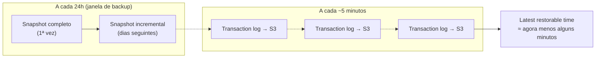
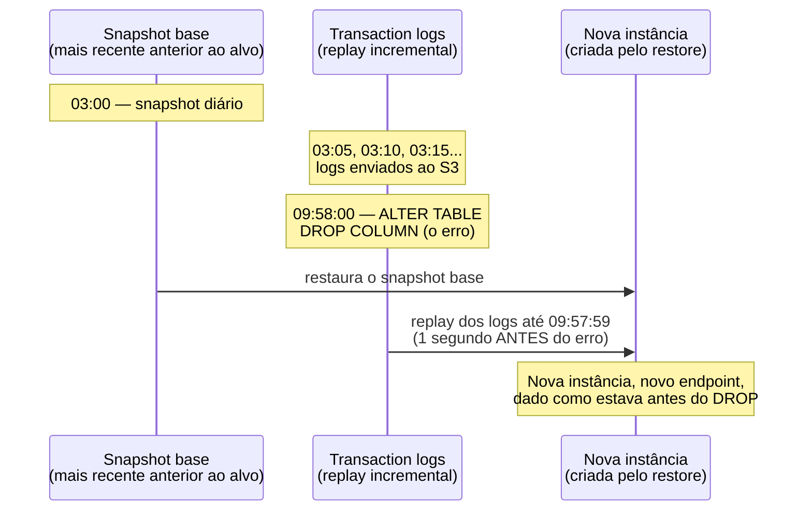
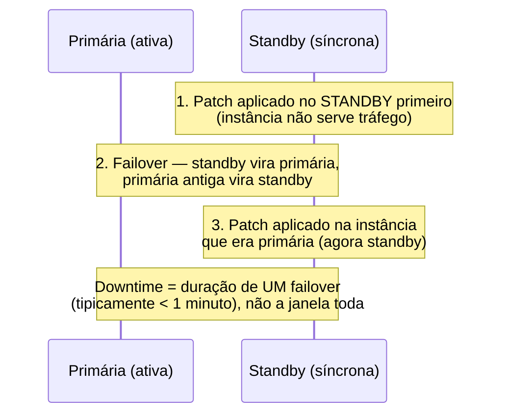

# Backups, PITR e manutenção

> [!abstract] TL;DR
> A nota anterior resolveu sobrevivência à queda de infraestrutura — Multi-AZ promove uma standby síncrona em um a dois minutos. Mas essa mesma standby replica um `DROP TABLE` acidental com a mesma velocidade e fidelidade que replicaria uma escrita legítima: se alguém apaga o dado errado, a cópia síncrona apaga junto, quase no mesmo instante. **HA protege contra falha de infraestrutura; backup protege contra erro humano e corrupção lógica** — são duas metades diferentes do mesmo problema de "meu banco continua no ar", e nenhuma substitui a outra. O RDS resolve essa segunda metade com **backups automáticos** (snapshot diário + upload contínuo de transaction logs para o S3 a cada cinco minutos) somados a **point-in-time recovery (PITR)** — restaurar para qualquer segundo dentro do período de retenção (0 a 35 dias), sempre criando uma **instância nova**, nunca sobrescrevendo a original — e a **snapshots manuais**, que não expiram com a retenção e viajam entre regiões e contas para disaster recovery. Por cima disso, a **manutenção** (patch de SO e de engine) segue uma janela semanal configurável, e o Multi-AZ da nota anterior volta a aparecer aqui com outro papel: reduzir o tempo de indisponibilidade do patch, aplicando primeiro no standby e só depois fazendo failover.

## O problema: a migration que apagou a coluna errada

São dez da manhã de uma terça-feira comum. Um desenvolvedor sênior, revisando uma migration de banco antes do deploy de sexta-feira, decide "só testar rapidinho" direto contra o banco de produção — sem querer, roda `ALTER TABLE pedidos DROP COLUMN status_pagamento;` na conexão errada, a de produção, não a de staging que ele *achava* estar usando. O comando executa em milissegundos. Não há erro, não há alarme, não há dashboard vermelho — o banco RDS continua respondendo normalmente, Multi-AZ e tudo, porque do ponto de vista da infraestrutura nada quebrou. A réplica standby síncrona da nota anterior recebeu esse `ALTER TABLE` e o aplicou também, com a mesma fidelidade com que aplicaria qualquer escrita legítima — é exatamente isso que a torna uma boa réplica de HA e, ao mesmo tempo, completamente inútil neste cenário.

Dez minutos depois, o time de pagamentos começa a receber erros em cascata: toda consulta que referencia `status_pagamento` falha, porque a coluna simplesmente não existe mais. A aplicação está no ar, o banco está no ar, Multi-AZ está funcionando perfeitamente — e mesmo assim a produção está quebrada, porque o problema nunca foi disponibilidade. Foi um comando executado no lugar errado, e nenhuma réplica síncrona ou assíncrona de banco "correto" ajuda quando o próprio dado correto é que sumiu.

A pergunta que decide o resto desta nota é simples de enunciar e cara de responder sem preparo: **dado que o erro já aconteceu e já foi replicado, como eu volto no tempo para o segundo antes dele?** É essa pergunta — não "como eu evito que o banco caia", que já foi respondida — que backup, point-in-time recovery e snapshot manual existem para resolver.

> [!info] Onde essa distinção já apareceu antes
> A ideia de que durabilidade (o dado sobrevive a uma falha física) não é o mesmo que proteção contra erro humano (o dado sobrevive a uma decisão errada de quem tinha acesso) já apareceu na trilha de Armazenamento — ver [[03-Dominios/Tecnologia/Cloud/08 - Armazenamento (object, block e file)/index|Armazenamento (object, block e file)]] para o tratamento de versioning e object lock como a resposta do S3 ao mesmo problema estrutural, só que para objetos em vez de linhas de banco.

## Backups automáticos: snapshot diário + log contínuo

Segundo a documentação oficial da AWS, o RDS "cria e salva backups automáticos da sua instância de banco... durante a janela de backup", fazendo "um snapshot do volume de armazenamento da sua instância, salvando a instância inteira, não bancos individuais isolados". O primeiro snapshot automático contém o banco completo; os seguintes são **incrementais** — só a diferença desde o último snapshot é de fato salva, o que mantém o custo de armazenamento proporcional à taxa de mudança, não ao tamanho total do banco a cada dia. Por cima desse snapshot diário, a documentação de PITR é explícita: "o RDS envia transaction logs para o Amazon S3 a cada cinco minutos" — é essa combinação de snapshot-base + log incremental fino que permite restaurar para qualquer segundo, não só para a meia-noite de ontem.



O **backup window** é o intervalo diário — configurável, tipicamente 30 minutos — durante o qual o snapshot automático é tirado; a mesma documentação registra a regra que costuma gerar confusão de configuração: "a janela de manutenção e a janela de backup da instância não podem se sobrepor". O **backup retention period** é quantos dias esse histórico (snapshots + logs) fica disponível para restaurar — de **0 a 35 dias**, segundo a referência da AWS CLI para `--backup-retention-period`, e é aqui que mora a primeira armadilha séria desta nota: **retention igual a zero desliga completamente os backups automáticos**, não é "backup mínimo", é ausência de backup.

Habilitar backups automáticos numa instância nova, ou já existente, é uma questão de definir a retenção:

```bash
$ aws rds create-db-instance \
    --db-instance-identifier producao-pedidos \
    --db-instance-class db.r6g.large \
    --engine postgres \
    --master-username admin \
    --master-user-password "SENHA_FORTE_AQUI" \
    --allocated-storage 100 \
    --backup-retention-period 7 \
    --preferred-backup-window "03:00-03:30"
```

E ajustar a retenção numa instância que já está em produção — o comando que, se você esquecer o valor certo, vira a armadilha de desligar backup sem querer:

```bash
$ aws rds modify-db-instance \
    --db-instance-identifier producao-pedidos \
    --backup-retention-period 14 \
    --apply-immediately
```

A própria referência da CLI documenta duas restrições que vale internalizar antes de rodar esse comando: retenção não pode ser 0 se a instância já é fonte de read replicas (não dá para desligar backup de quem outras réplicas dependem), e alternar entre "ligado" e "desligado" — não entre dois valores diferentes de dias — pode causar uma suspensão breve de I/O, de segundos a poucos minutos, dependendo do tamanho da instância.

| Retention period | Efeito |
|---|---|
| `0` | Backups automáticos desligados — nenhum snapshot novo, nenhum log incremental, PITR indisponível |
| `1` a `35` | Backups automáticos ativos; PITR cobre exatamente essa janela de dias |
| Mudar de N não-zero para M não-zero | Aplicado de forma assíncrona, sem suspensão de I/O |
| Mudar de/para `0` | Pode causar suspensão breve de I/O (segundos a minutos) |

Confirmar o que já existe, antes de assumir que está tudo protegido, é rápido:

```bash
$ aws rds describe-db-instances \
    --db-instance-identifier producao-pedidos \
    --query 'DBInstances[0].[BackupRetentionPeriod,PreferredBackupWindow,LatestRestorableTime]'
[
    7,
    "03:00-03:30",
    "2026-07-23T14:32:10.000Z"
]
```

## Point-in-time recovery: qualquer segundo, sempre numa instância nova

Point-in-time recovery é o mecanismo que transforma o par snapshot+logs em uma restauração cirúrgica. A documentação da AWS descreve o processo de forma direta: "você pode restaurar uma instância de banco para um momento específico, criando uma nova instância de banco sem modificar a instância de origem." Duas peças dessa frase carregam o peso todo da nota: **restaurar para qualquer momento** dentro da retenção — não só para a meia-noite do snapshot mais recente — e **sempre numa instância nova**, nunca sobrescrevendo a que já existe.

O mecanismo por trás disso é a combinação vista na seção anterior: o RDS pega o snapshot completo (ou incremental) mais próximo, anterior ao instante pedido, e reaplica os transaction logs a partir dali até o segundo exato solicitado — o mesmo princípio de um banco relacional reaplicando WAL depois de um crash, só que operado pelo serviço gerenciado, contra uma cópia isolada.



A janela real de restauração tem dois limites que vale checar antes de prometer um RTO/RPO a alguém: o **earliest restorable time** (o início da retenção) e o **latest restorable time** — segundo a documentação, este último avança continuamente porque os logs sobem ao S3 a cada cinco minutos, o que dá um **RPO efetivo em torno de cinco minutos** na pior hipótese (o pior caso é perder o que ainda não subiu desde o último upload de log).

> [!tip] Assista: How to Restore SQL Server RDS Database to Point-in-time
> **Canal:** Redincs Technology | **Duração:** ~3min | **Idioma:** EN
>
> Curto e direto ao ponto: confirma, com o console na tela, exatamente o mecanismo que esta seção acabou de descrever — os transaction logs sobem para o S3 a cada cinco minutos, e o restore sempre cria uma instância nova, nunca sobrescreve a original. O exemplo usa SQL Server, mas a mecânica de PITR é a mesma para qualquer engine do RDS. Trecho de destaque [00:43]: *"what RDS does is that it uploads these logs to S3 every 5 minutes"*
>
> 🎬 [Assistir no YouTube](https://www.youtube.com/watch?v=cwzvvCCCZ_Q)

```bash
$ aws rds describe-db-instances \
    --db-instance-identifier producao-pedidos \
    --query 'DBInstances[0].[EarliestRestorableTime,LatestRestorableTime]'
[
    "2026-07-09T03:12:00.000Z",
    "2026-07-23T14:41:55.000Z"
]
```

Restaurar para o instante exato — um segundo antes do `ALTER TABLE` do cenário de abertura:

```bash
$ aws rds restore-db-instance-to-point-in-time \
    --source-db-instance-identifier producao-pedidos \
    --target-db-instance-identifier producao-pedidos-recuperada \
    --restore-time "2026-07-23T09:57:59.000Z" \
    --db-instance-class db.r6g.large
```

Ou, quando o objetivo é só "o mais recente possível" — útil num teste de restore rotineiro, sem precisar calcular o segundo exato:

```bash
$ aws rds restore-db-instance-to-point-in-time \
    --source-db-instance-identifier producao-pedidos \
    --target-db-instance-identifier producao-pedidos-teste-restore \
    --use-latest-restorable-time
```

> [!warning] PITR cria uma instância NOVA — nunca substitui a original in-place
> É a confusão mais comum de quem nunca fez esse restore antes: `restore-db-instance-to-point-in-time` não "desfaz" o erro na instância de produção — ela continua existindo, intacta, com o `ALTER TABLE` errado nela. O restore entrega um endpoint **diferente**, apontando para uma instância **diferente**, com o dado de antes do erro. Recuperar de fato exige um passo manual a mais: comparar/copiar o dado da instância restaurada de volta para produção, ou reapontar a aplicação inteira para o novo endpoint — nenhuma das duas coisas acontece sozinha.

## Snapshots manuais: sob demanda, e não expiram com a retenção

Backup automático resolve "eu quero poder voltar a qualquer segundo dos últimos N dias", mas não resolve "eu quero guardar este estado específico indefinidamente" — por exemplo, o banco exatamente como estava antes de uma migration arriscada de schema, para além de qualquer janela de retenção. É esse o papel do **snapshot manual**: criado sob demanda, e a documentação da AWS confirma a diferença estrutural — snapshots manuais **persistem até você deletá-los explicitamente**, não expiram junto com o `backup-retention-period`, e continuam existindo mesmo se a instância original for deletada depois.

```bash
$ aws rds create-db-snapshot \
    --db-instance-identifier producao-pedidos \
    --db-snapshot-identifier snap-pre-migration-2026-07-23
```

Conferir o estado do snapshot (leva alguns minutos para ficar `available`, dependendo do volume de dados desde o último snapshot):

```bash
$ aws rds describe-db-snapshots \
    --db-snapshot-identifier snap-pre-migration-2026-07-23 \
    --query 'DBSnapshots[0].[Status,PercentProgress,SnapshotType]'
[
    "available",
    100,
    "manual"
]
```

Snapshots manuais também **viajam** — entre regiões, para disaster recovery regional, e entre contas, para compartilhamento controlado. Copiar cross-region é a peça que fecha o ciclo de DR desta nota:

```bash
$ aws rds copy-db-snapshot \
    --source-db-snapshot-identifier arn:aws:rds:us-east-1:123456789012:snapshot:snap-pre-migration-2026-07-23 \
    --target-db-snapshot-identifier snap-pre-migration-2026-07-23-sa \
    --destination-region sa-east-1
```

E compartilhar com outra conta AWS — útil quando um time de auditoria ou um ambiente de staging separado, em outra conta, precisa de acesso a um snapshot específico sem replicar a conta inteira:

```bash
$ aws rds modify-db-snapshot-attribute \
    --db-snapshot-identifier snap-pre-migration-2026-07-23 \
    --attribute-name restore \
    --values-to-add "123456789099"
```

> [!info] Onde o snapshot realmente vive
> A documentação da AWS confirma que "os backups são armazenados no Amazon S3" — o mesmo object storage tratado a fundo em [[03-Dominios/Tecnologia/Cloud/08 - Armazenamento (object, block e file)/index|Armazenamento (object, block e file)]]. É por isso que copiar um snapshot para outra região tem custo de armazenamento próprio ali (a cópia soma ao total de armazenamento de backup daquela região) — não é um ponteiro, é uma cópia física de dados. O RDS só te dá um verbo (`create-db-snapshot`, `copy-db-snapshot`) por cima de uma mecânica de armazenamento que já foi explicada naquele galho.

| Eixo | Backup automático | Snapshot manual |
|---|---|---|
| Criação | Automática, diária, na backup window | Sob demanda, `create-db-snapshot` |
| Expira? | Sim — some ao passar do `backup-retention-period` | Não — persiste até deleção explícita |
| PITR (restaurar a qualquer segundo)? | Sim, dentro da retenção | Não isolado — é um ponto fixo no tempo, sem replay de log próprio |
| Sobrevive à deleção da instância? | Só se "retain automated backups" marcado na deleção | Sim, sempre |
| Cross-region / cross-account | Copiável (automated), mas não nasce assim | Copiável e compartilhável nativamente |
| Uso típico | Recuperação de erro recente, RPO curto | Ponto de restauração de longo prazo, DR, marco antes de migration arriscada |
| Limite (referência) | 1 a 35 dias de janela | Até 100 snapshots manuais por região (verificar teto vigente) |

## Manutenção: patch de SO e de engine sem acordar ninguém

Backup protege contra o erro do time; manutenção é o outro lado da moeda operacional — o RDS aplicando, ele mesmo, patches de sistema operacional e atualizações de engine, dentro de uma **janela de manutenção** semanal de 30 minutos que você escolhe (ou que a AWS atribui aleatoriamente, dentro de um bloco de 8 horas por região, se você não escolher). A documentação é explícita que patches de SO relacionados a segurança e confiabilidade são aplicados automaticamente, "acontecem com pouca frequência, tipicamente a cada poucos meses" e raramente consomem mais que uma fração da janela.

Existe uma distinção que muita gente carrega errada: **patch de versão minor da engine** (ex.: PostgreSQL 16.3 → 16.4) é rotineiro, geralmente automático se `auto-minor-version-upgrade` estiver habilitado, e reversível no sentido de que a AWS testa compatibilidade antes de aplicar. **Upgrade de versão major** (ex.: PostgreSQL 15 → 16) é uma ação distinta — nunca acontece sozinha por manutenção automática, exige ação explícita, e não é trivialmente reversível: depois de migrado, voltar para a versão anterior significa restaurar de um snapshot pré-upgrade, não um "downgrade" no sentido comum da palavra.

```bash
$ aws rds describe-pending-maintenance-actions \
    --resource-identifier arn:aws:rds:us-east-1:123456789012:db:producao-pedidos
{
    "PendingMaintenanceActions": [
        {
            "ResourceIdentifier": "arn:aws:rds:us-east-1:123456789012:db:producao-pedidos",
            "PendingMaintenanceActionDetails": [
                {
                    "Action": "system-update",
                    "AutoAppliedAfterDate": "2026-08-31T00:00:00+00:00",
                    "CurrentApplyDate": "2026-08-31T00:00:00+00:00",
                    "Description": "New Operating System update is available"
                }
            ]
        }
    ]
}
```

Quando um patch obrigatório aparece com `AutoAppliedAfterDate`, ele **vai** ser aplicado depois dessa data, dentro de uma janela de manutenção, quer o time tenha reagido ou não — a documentação avisa que ficar adiando a janela de manutenção "não impede upgrades obrigatórios": a AWS aplica fora da janela preferida depois da data limite. Aplicar de forma controlada, antes disso, é mais previsível:

```bash
$ aws rds apply-pending-maintenance-action \
    --resource-identifier arn:aws:rds:us-east-1:123456789012:db:producao-pedidos \
    --apply-action system-update \
    --opt-in-type immediate
```

É aqui que Multi-AZ, tratado na nota anterior como mecanismo de HA, ganha um segundo papel: reduzir o tempo de indisponibilidade da própria manutenção. A documentação da AWS descreve a sequência exata para patch de sistema operacional num deployment Multi-AZ:



A própria documentação resume a exceção que importa: "se houver patches de sistema operacional pendentes, um failover Multi-AZ breve é necessário para aplicá-los na instância primária — esse failover tipicamente dura menos de um minuto." **Upgrade de versão major da engine é diferente**: nesse caso a AWS atualiza primária e standby ao mesmo tempo, e as duas ficam indisponíveis durante o upgrade inteiro, não só durante um failover — a duração varia com o tamanho do banco, e pode ser bem mais que um minuto. Instâncias single-AZ não têm standby nenhuma para absorver esse custo: qualquer patch que exija reinício é indisponibilidade direta, sem atalho.

## Restore na prática: um backup nunca testado não é um backup

Toda a mecânica acima — snapshot diário, log de cinco em cinco minutos, PITR, snapshot manual — só vale alguma coisa se o restore de fato funcionar quando alguém precisar dele às três da manhã. A armadilha organizacional mais comum não é técnica: é configurar tudo corretamente e nunca ter rodado um restore de teste, descobrindo só durante o incidente real que o processo trava em algum passo que ninguém validou — um parameter group customizado que não foi reaplicado, um security group que a instância nova não herdou, uma aplicação que não sabe reapontar para um endpoint diferente do de sempre.

Restaurar de um snapshot manual segue o mesmo padrão de "sempre cria instância nova" do PITR:

```bash
$ aws rds restore-db-instance-from-db-snapshot \
    --db-instance-identifier producao-pedidos-restaurada \
    --db-snapshot-identifier snap-pre-migration-2026-07-23 \
    --db-instance-class db.r6g.large
```

Depois que a instância nova (seja de PITR ou de snapshot manual) chega ao estado `available`, dois ajustes manuais fecham o processo — nenhum dos dois acontece sozinho:

```bash
# 1. Descobrir o endpoint da instância recém-restaurada
$ aws rds describe-db-instances \
    --db-instance-identifier producao-pedidos-restaurada \
    --query 'DBInstances[0].Endpoint.Address'
"producao-pedidos-restaurada.c9akciq32.us-east-1.rds.amazonaws.com"

# 2. Reassociar o security group correto — instâncias restauradas
#    nascem só com o security group DEFAULT da VPC, não o da produção
$ aws rds modify-db-instance \
    --db-instance-identifier producao-pedidos-restaurada \
    --vpc-security-group-ids sg-0a1b2c3d4e5f6g7h8 \
    --apply-immediately
```

Depois disso, alguém — um humano, ou uma automação de deploy — precisa apontar a aplicação para o novo endpoint (variável de ambiente, secret, service discovery), porque o DNS antigo continua resolvendo para a instância original, intocada e ainda com o erro dentro dela.

### Lente dupla: a DigitalOcean, na prática

A DigitalOcean simplifica bastante o vocabulário sem abandonar o conceito. Um Managed Database roda **backup diário automático**, com PITR habilitado por padrão — mas com uma janela fixa, sem o dial fino de 1-35 dias da AWS: **7 dias de retenção**, tanto para o snapshot completo diário quanto para os WAL logs que alimentam o PITR (a documentação descreve o mesmo padrão estrutural do RDS — snapshot completo a cada 24h, write-ahead log enviado a cada cerca de cinco minutos). Não existe hoje, na DO, um dial de retenção maior via painel ou API — quem precisa de mais que sete dias de histórico nativo da plataforma precisa somar uma solução própria por cima.

```bash
# Listar os backups disponíveis de um cluster
$ doctl databases backups f81d4fae-7dec-11d0-a765-00a0c91e6bf6
Size in GBs    Created At
1.2            2026-07-22T03:14:00Z
1.1            2026-07-21T03:11:00Z
1.1            2026-07-20T03:09:00Z
```

A restauração da DO usa um conceito próprio — o **fork**: em vez de "restore-to-point-in-time", o comando cria um cluster novo e independente a partir de um backup específico do cluster de origem, com o mesmo espírito de "nunca sobrescreve o original" do PITR da AWS:

```bash
$ doctl databases fork producao-pedidos-recuperado \
    --restore-from-cluster-id f81d4fae-7dec-11d0-a765-00a0c91e6bf6 \
    --restore-from-timestamp "2026-07-23 09:57:59 +0000 UTC"
```

Sem `--restore-from-timestamp`, o fork usa o backup mais recente disponível — equivalente à flag `--use-latest-restorable-time` da AWS. Assim como no RDS, o fork gera um cluster novo, com endpoint novo, e a aplicação precisa ser reapontada manualmente depois — a DO não tem um mecanismo de "restaurar no lugar" para bancos gerenciados, pela mesma razão estrutural que a AWS documenta: restaurar sobre o original criaria múltiplas linhas do tempo de recuperação, dificultando auditoria de qual dado veio de onde.

| Conceito | AWS RDS | DigitalOcean Managed Databases |
|---|---|---|
| Backup automático | Snapshot diário + log a cada 5 min | Snapshot diário + WAL a cada ~5 min |
| Retenção configurável | 0-35 dias, ajustável por `modify-db-instance` | Fixa em 7 dias (PostgreSQL/MySQL), sem dial nativo |
| PITR | `restore-db-instance-to-point-in-time`, RPO ~5 min | Escolher timestamp no fork, mesma granularidade de WAL |
| Restauração cria instância nova? | Sempre | Sempre (chamado de "fork") |
| Snapshot sob demanda / manual | `create-db-snapshot`, persiste até deletar | Não documentado como recurso separado — backup automático é o mecanismo único |
| Cross-region | `copy-db-snapshot --destination-region` | Fork pode ser criado em outra região/datacenter, mas não é cópia de snapshot isolada |

> [!info] Caducidade
> Retenção de 7 dias e cadência de backup/WAL da DigitalOcean verificadas via documentação oficial e páginas de suporte em 2026-07-23; não há indicação de retenção configurável além desse teto no momento da consulta. Confirme a documentação vigente antes de planejar RPO/RTO contratual — políticas de retenção de provedores gerenciados tendem a evoluir.

### Tabela de tradução: Azure e GCP

| Conceito | AWS RDS | Azure (PostgreSQL Flexible Server) | GCP (Cloud SQL) |
|---|---|---|---|
| Backup automático | Snapshot diário + log contínuo | Backup diário + WAL a cada ~5 min | Backup diário + binlog/WAL |
| Retenção configurável | 0-35 dias | 7-35 dias (padrão 7); Long-Term Retention separado até 10 anos | Backups: 1-365 dias · logs de transação: 1-7 dias |
| PITR | Sim, dentro da retenção | Sim, dentro da janela de 7-35 dias | Sim, dentro da janela de log configurada |
| Restauração cria recurso novo? | Sempre (nova instância) | Sempre (novo servidor) | Sempre (nova instância) |
| Retenção estendida além do padrão | Snapshot manual (ilimitado, até deletar) | Long-Term Retention (Azure Backup, até 10 anos) | Backup retention até 365 dias (mesmo mecanismo, dial maior) |

> [!info] Caducidade
> Faixas de retenção de Azure (7-35 dias padrão + Long-Term Retention até 10 anos) e GCP (1-365 dias de backup, 1-7 dias de log de transação) verificadas via pesquisa em fontes públicas em 2026-07-23. Ambos os provedores ajustam esses limites com alguma frequência — confirme na documentação vigente do provedor específico antes de comprometer um RPO/RTO contratual.

## Casos práticos

**A migration que apagou a coluna errada, resolvida.** Retomando o cenário de abertura: assim que o erro aparece, o time confirma o `LatestRestorableTime` da instância e roda `restore-db-instance-to-point-in-time` com `--restore-time` fixado num segundo antes do `ALTER TABLE`. Enquanto a instância nova sobe (minutos, não horas), o time já prepara o script que vai copiar só a coluna perdida de volta para produção — não a base inteira, porque produção continuou recebendo pedidos legítimos durante a janela do incidente, e sobrescrever tudo perderia esses pedidos novos. PITR devolve o dado perdido; a lógica de qual dado migrar de volta continua sendo trabalho humano.

**O snapshot manual antes de um upgrade major arriscado.** Um time planeja subir PostgreSQL 15 para 16 num banco de produção. Antes de disparar `apply-pending-maintenance-action` com `db-upgrade`, o primeiro passo é `create-db-snapshot` — não porque o backup automático não cobriria o mesmo período, mas porque um snapshot manual nomeado (`snap-pre-upgrade-pg16`) é fácil de encontrar meses depois, não expira com a retenção de sete ou trinta e cinco dias, e serve como ponto de restauração único e identificável se o upgrade major se revelar incompatível com alguma extensão em uso.

**A janela de manutenção que ninguém tinha calculado.** Um time descobre, num sábado de manhã, um pico inesperado de latência que coincide exatamente com a janela de manutenção padrão atribuída aleatoriamente pela AWS — um horário que, sem querer, caiu bem no meio do processamento em lote noturno de outro sistema. A correção não é técnica, é de configuração: mover a `--preferred-maintenance-window` para um horário de fato ocioso, e verificar que ela não colide com a `--preferred-backup-window` (as duas não podem se sobrepor, por regra da própria AWS) — um ajuste de calendário, não de arquitetura.

## Armadilhas comuns

> [!warning] Retention period igual a zero desliga o backup inteiro
> Não é "backup mínimo de um dia" — é ausência total de backup automático e de PITR. É fácil zerar sem perceber ao tentar "economizar armazenamento de backup" numa instância de teste que, meses depois, silenciosamente virou produção sem ninguém revisar a configuração original.

> [!warning] PITR e restore de snapshot sempre criam instância NOVA
> Nenhum dos dois "desfaz" o erro na instância original. Quem espera um botão de "voltar no tempo in-place" perde tempo precioso durante um incidente real procurando uma opção que não existe — o processo correto sempre envolve reapontar a aplicação para um endpoint novo.

> [!warning] Nunca ter testado um restore de verdade
> Um backup configurado e nunca restaurado é uma suposição, não uma garantia. Parameter groups customizados, security groups específicos, extensões de banco habilitadas manualmente — tudo isso pode não vir junto automaticamente na instância restaurada, e a primeira vez que alguém descobre isso não deveria ser durante um incidente real.

> [!warning] Snapshot manual esquecido, acumulando custo indefinidamente
> Snapshots manuais não expiram sozinhos — ao contrário do backup automático, que soma ao ciclo de retenção e desaparece. Um snapshot criado "só para garantir" antes de uma migration de dois anos atrás, e nunca deletado, continua sendo cobrado por armazenamento todo mês, silenciosamente, até alguém auditar a lista de snapshots da conta.

> [!warning] Upgrade de versão major não é automático nem reversível
> Ao contrário de patch minor, upgrade de versão major da engine exige ação explícita e deixa primária e standby indisponíveis ao mesmo tempo, não só durante um failover breve. E não existe "downgrade": voltar para a versão anterior significa restaurar de um snapshot tirado antes do upgrade — planeje esse snapshot manual antes de qualquer upgrade major, não depois.

## O que vem a seguir

Backup e PITR resolvem "eu perdi ou corrompi dado relacional, como eu volto". Mas nem todo dado gerenciado é relacional, e a mecânica de recuperação muda de forma real quando o modelo de dado muda — um documento sem schema fixo, um par chave-valor de altíssimo throughput, ou um grafo de relacionamentos não seguem exatamente a mesma lógica de snapshot+log do RDS. A próxima nota desta trilha entra em bancos NoSQL gerenciados — o que muda (e o que continua igual) quando o serviço gerenciado não é mais um Postgres ou MySQL por trás das cenas.

## Fontes

- [AWS RDS — Backing up and restoring an Amazon RDS DB instance](https://docs.aws.amazon.com/AmazonRDS/latest/UserGuide/USER_WorkingWithAutomatedBackups.html) — mecânica de backup automático, snapshot incremental, armazenamento em S3, retenção e retenção na deleção da instância; acessado em 2026-07-23.
- [AWS RDS — Restoring a DB instance to a specified time](https://docs.aws.amazon.com/AmazonRDS/latest/UserGuide/USER_PIT.html) — PITR cria instância nova, upload de log a cada cinco minutos, `LatestRestorableTime`, `restore-db-instance-to-point-in-time`; acessado em 2026-07-23.
- [AWS CLI — rds modify-db-instance (--backup-retention-period)](https://docs.aws.amazon.com/cli/latest/reference/rds/modify-db-instance.html) — faixa 0-35 dias, retenção 0 desliga backup, restrição para instância fonte de read replica, suspensão de I/O ao alternar liga/desliga; acessado em 2026-07-23.
- [AWS RDS — Creating a DB snapshot](https://docs.aws.amazon.com/AmazonRDS/latest/UserGuide/USER_CreateSnapshot.html) — `create-db-snapshot`, persistência além da retenção; acessado em 2026-07-23.
- [AWS RDS — Copying a DB snapshot](https://docs.aws.amazon.com/AmazonRDS/latest/UserGuide/USER_CopySnapshot.html) — `copy-db-snapshot` cross-region; acessado em 2026-07-23.
- [AWS RDS — Sharing a DB snapshot](https://docs.aws.amazon.com/AmazonRDS/latest/UserGuide/USER_ShareSnapshot.html) — `modify-db-snapshot-attribute` para compartilhamento cross-account; acessado em 2026-07-23.
- [AWS RDS — Maintaining a DB instance](https://docs.aws.amazon.com/AmazonRDS/latest/UserGuide/USER_UpgradeDBInstance.Maintenance.html) — janela de manutenção, patch minor vs. major, sequência de patch Multi-AZ (standby primeiro, depois failover), upgrades obrigatórios após `AutoAppliedAfterDate`; acessado em 2026-07-23.
- [AWS CLI — rds restore-db-instance-from-db-snapshot](https://docs.aws.amazon.com/cli/latest/reference/rds/restore-db-instance-from-db-snapshot.html) — sintaxe de restore a partir de snapshot manual; acessado em 2026-07-23.
- [DigitalOcean — How to Manually Restore PostgreSQL Database Clusters from Backups](https://docs.digitalocean.com/products/databases/postgresql/how-to/restore-from-backups/) — restore sempre cria cluster novo, retenção de 7 dias, escolha entre backup mais recente ou ponto específico no tempo; acessado em 2026-07-23.
- [DigitalOcean — doctl databases backups](https://docs.digitalocean.com/reference/doctl/reference/databases/backups/) — sintaxe de listagem de backups por cluster; acessado em 2026-07-23.
- [DigitalOcean — doctl databases fork](https://docs.digitalocean.com/reference/doctl/reference/databases/fork/) — sintaxe de `--restore-from-cluster-id` e `--restore-from-timestamp`; acessado em 2026-07-23.
- Retenção e PITR do Azure Database for PostgreSQL Flexible Server (7-35 dias padrão, Long-Term Retention até 10 anos) e do GCP Cloud SQL (backup 1-365 dias, log de transação 1-7 dias) — verificados via pesquisa em documentação pública (Microsoft Learn e Google Cloud docs) em 2026-07-23; consulte a documentação vigente do provedor antes de comprometer RPO/RTO contratual.
