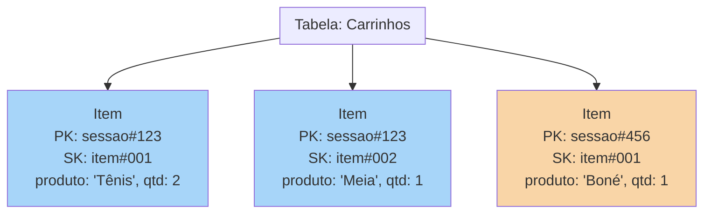
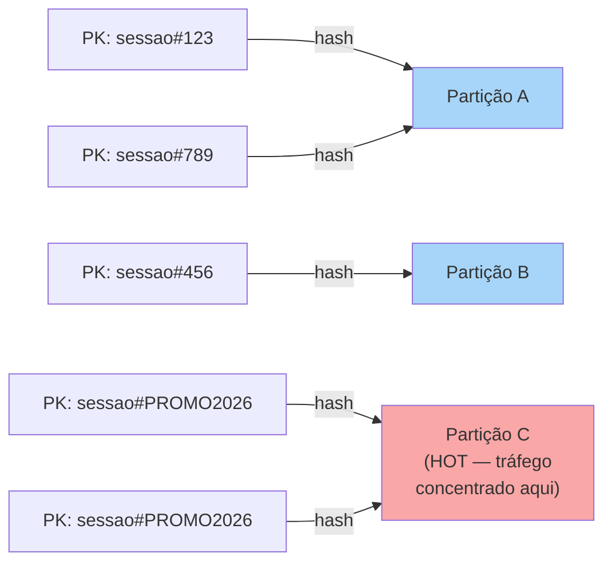
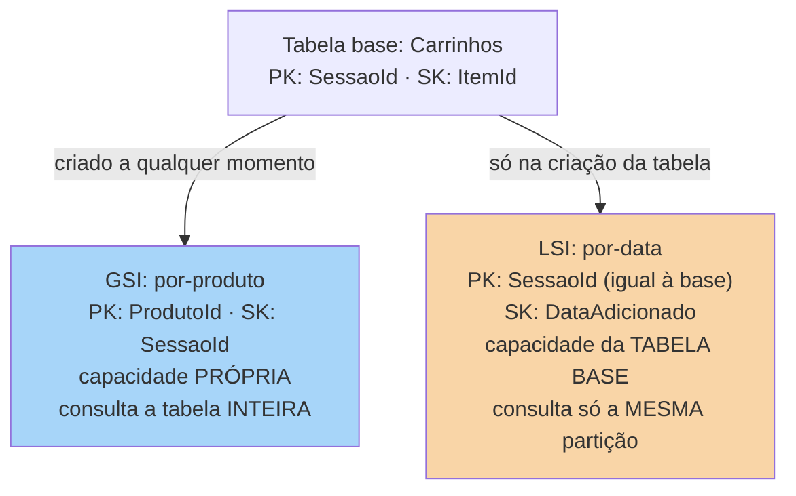

# NoSQL gerenciado (DynamoDB)

> [!abstract] TL;DR
> As três notas anteriores deste galho passaram inteiras dentro do modelo relacional — tabelas com schema fixo, `JOIN` entre entidades normalizadas, réplicas de leitura para escalar. Esta nota atravessa para o outro lado: o **NoSQL gerenciado**, onde o DynamoDB da AWS é o exemplo emblemático de key-value/document serverless. No DynamoDB, uma **tabela** guarda **itens** (o equivalente a linhas) com **atributos** livres além da chave primária — que é uma **partition key** (hash, sempre obrigatória) sozinha ou combinada com uma **sort key** (range, opcional). A AWS usa a partition key para distribuir itens entre partições físicas via função de hash; escolher mal essa chave concentra tráfego numa única partição — a **hot partition** — e é o erro de design nº 1 de quem chega do mundo relacional. Duas formas de pagar capacidade: **On-Demand** (por requisição, escala sozinho) e **Provisioned** (RCU/WCU fixos, mais barato em carga previsível, com risco de *throttling* se subdimensionado). Leituras podem ser **eventually consistent** (padrão, metade do custo em RCU) ou **strongly consistent** (sempre a versão mais recente, só em tabelas e LSIs — GSIs nunca são fortemente consistentes). Índices secundários vêm em dois sabores: **GSI** (outra partition key, capacidade própria, índice `Global`) e **LSI** (mesma partition key da tabela, outra sort key, capacidade compartilhada com a tabela base, só pode ser criado junto com a tabela). A virada mental mais difícil: no DynamoDB você modela pelo **access pattern** — a query que vai rodar — não pela entidade, e não existe `JOIN`. A DigitalOcean, honestamente, não tem um DynamoDB-like: oferece MongoDB gerenciado (document) e Valkey (key-value em memória), mas nenhum key-value serverless com escala automática e partição transparente — Azure Cosmos DB e GCP Bigtable/Firestore são os análogos de verdade fora da AWS.

## O problema: o carrinho de compras que não cabe numa tabela normalizada

Imagine o carrinho de compras de um site de e-commerce de grande escala — Black Friday, milhões de sessões simultâneas, cada uma lendo e escrevendo o próprio carrinho dezenas de vezes por minuto. O requisito não é "consultas flexíveis sobre o catálogo inteiro" — é o oposto: uma operação extremamente simples e repetitiva (buscar o carrinho da sessão X, gravar um item nele) que precisa responder em milissegundos de forma **previsível**, não importa se são mil sessões ativas ou dez milhões.

Um banco relacional, do jeito que as notas 02-04 deste galho descreveram, resolveria isso com uma tabela `carrinhos`, talvez normalizada em `carrinhos` + `itens_carrinho` com uma FK, protegida por transações ACID e consultável com `JOIN` arbitrário. Funciona — até a escala virar o problema. Escalar leitura relacional significa réplicas (nota 03), e escalar escrita relacional é o limite estrutural que a nota 03 já tinha nomeado: o nó primário de um banco relacional gerenciado é, cedo ou tarde, um teto de throughput de escrita que só sharding manual resolve — e sharding manual de um banco relacional é trabalho de infraestrutura, não um botão a apertar.

O DynamoDB parte de uma aposta diferente: abrir mão de `JOIN` e de schema fixo em troca de escala horizontal automática e latência de milissegundo garantida em qualquer volume — sem que o time precise pensar em réplica, em failover, ou em qual nó aguenta qual fração do tráfego. A troca é real, não é almoço grátis: o preço de "sempre rápido, em qualquer escala" é modelar os dados em função da **query que você vai rodar**, não da entidade que parece natural no papel. É essa modelagem — e o que ela exige em troca — que esta nota examina peça por peça.

> [!info] Fronteira com Dados e System Design
> Modelagem de dados como teoria (normalização, o teorema CAP, quando escolher SQL vs. NoSQL como decisão de arquitetura) é assunto do domínio [[03-Dominios/Engenharia/Dados/index|Dados]] e da trilha de System Design. Esta nota fica na mecânica operacional do DynamoDB especificamente.

## O modelo de dados: tabelas, itens, e uma chave primária que faz tudo

Segundo a documentação oficial da AWS, uma tabela DynamoDB guarda **itens** — o equivalente a uma linha — e cada item é uma coleção de **atributos** — o equivalente a colunas, mas sem schema fixo: dois itens da mesma tabela podem ter conjuntos de atributos completamente diferentes, com a única exigência estrutural sendo a **chave primária**, que todo item precisa ter.

A chave primária vem em duas formas:

- **Simples**: só a **partition key** (um atributo, hash). Cada valor de partition key identifica um item único.
- **Composta**: **partition key** + **sort key**. A combinação das duas identifica um item único; itens que compartilham a mesma partition key formam uma **item collection**, armazenados juntos e ordenados pelo valor da sort key.



Repare que `sessao#123` aparece em dois itens (Item1 e Item2) — isso é a **item collection** da sessão 123: dois produtos diferentes no mesmo carrinho, cada um com sua própria sort key (`item#001`, `item#002`). Uma única operação `Query` por `sessao#123` devolve o carrinho inteiro, ordenado pela sort key — é essa mecânica que substitui o `JOIN` entre `carrinhos` e `itens_carrinho` do modelo relacional.

```bash
# Criar a tabela Carrinhos com chave composta (partition + sort key)
$ aws dynamodb create-table \
    --table-name Carrinhos \
    --attribute-definitions \
        AttributeName=SessaoId,AttributeType=S \
        AttributeName=ItemId,AttributeType=S \
    --key-schema \
        AttributeName=SessaoId,KeyType=HASH \
        AttributeName=ItemId,KeyType=RANGE \
    --billing-mode PAY_PER_REQUEST
{
    "TableDescription": {
        "TableName": "Carrinhos",
        "TableStatus": "CREATING",
        "TableId": "a1b2c3d4-...",
        "BillingModeSummary": {"BillingMode": "PAY_PER_REQUEST"}
    }
}
```

## Partitioning: como a partition key vira posição física

A AWS distribui os itens de uma tabela entre **partições físicas** — armazenamento em SSD, replicado entre AZs, gerenciado inteiramente pela própria AWS. Segundo a documentação oficial, para gravar um item, o DynamoDB aplica uma função de hash interna ao valor da partition key; o resultado do hash determina em qual partição o item é armazenado. Para ler, o mesmo hash da partition key informada localiza a partição correta.



A documentação é explícita sobre a recomendação de design: escolher uma partition key com **muitos valores distintos em relação ao número de itens** da tabela, para que o DynamoDB consiga distribuir uniformemente. O erro clássico — a **hot partition** — acontece quando uma fração desproporcional das leituras/escritas mira o mesmo valor de partition key (por exemplo, usar `data_do_dia` como partition key para eventos de todos os usuários naquele dia): todo esse tráfego cai na mesma partição física, que tem um teto de throughput próprio, enquanto as outras partições ficam ociosas. O sintoma é *throttling* mesmo com capacidade sobrando na tabela como um todo — porque a capacidade agregada não ajuda uma partição individual sobrecarregada.

> [!tip] Assista: DynamoDB Partitions - How they work - AWS Service Deep Dive
> **Canal:** Complete Coding - Master AWS Serverless | **Duração:** ~9min | **Idioma:** EN
>
> Reforça exatamente esse ponto com um exemplo trabalhado — uma tabela de animais de estimação com partition key `animal` (baixa cardinalidade, gera hot partition em "dog"/"cat") redesenhada para `breed` (mais valores distintos, tráfego espalhado) — e nomeia o número concreto por trás do teto de throughput por partição. Trecho de destaque [03:33]: *"we need to make sure that our partition key has a high cardinality, which means that the number of items grouped together doesn't get extremely large"*
>
> 🎬 [Assistir no YouTube](https://www.youtube.com/watch?v=WoxNmq5-E9o)

Quando a tabela tem chave composta, itens com a mesma partition key ficam agrupados na mesma partição e ordenados pela sort key — formando a item collection já descrita. Não há limite superior de quantos valores distintos de sort key uma mesma partition key pode ter; o DynamoDB aloca armazenamento automaticamente conforme a coleção cresce.

## Capacity modes: On-Demand vs. Provisioned, e o que é RCU/WCU

O DynamoDB oferece dois modos de cobrança de capacidade — a escolha entre eles é, na prática, a escolha entre "não pensar em capacidade" e "pagar menos por previsibilidade":

| Dimensão | On-Demand | Provisioned |
|---|---|---|
| Cobrança | Por requisição de leitura/escrita | RCU/WCU fixos, provisionados antecipadamente |
| Escala | Automática e instantânea | Manual, ou via Application Auto Scaling |
| Melhor para | Tráfego imprevisível, picos, aplicações novas | Carga sustentada e previsível |
| Custo em pico | Mais alto por requisição, sem ociosidade | Mais barato por unidade, mas paga capacidade ociosa se subdimensionar a margem |
| Risco principal | Custo surpresa em pico não antecipado | *Throttling* se a demanda ultrapassar o provisionado |

Uma **RCU** (Read Capacity Unit) equivale a uma leitura **fortemente consistente** de um item de até 4 KB por segundo — ou duas leituras **eventualmente consistentes** do mesmo tamanho, porque a leitura eventual custa metade do RCU da leitura forte. Uma **WCU** (Write Capacity Unit) equivale a uma escrita de até 1 KB por segundo. Um item maior consome proporcionalmente mais unidades — um item de 10 KB lido com consistência forte consome 3 RCUs (arredondando 10÷4 para cima), lido eventualmente consistente consome a metade disso.

```bash
# Mudar uma tabela de PAY_PER_REQUEST para provisionado, com auto scaling configurado à parte
$ aws dynamodb update-table \
    --table-name Carrinhos \
    --billing-mode PROVISIONED \
    --provisioned-throughput ReadCapacityUnits=20,WriteCapacityUnits=10
{
    "TableDescription": {
        "TableName": "Carrinhos",
        "TableStatus": "UPDATING",
        "BillingModeSummary": {"BillingMode": "PROVISIONED"}
    }
}
```

> [!info] Caducidade
> Fórmulas de RCU (4 KB por leitura forte, metade por leitura eventual) e WCU (1 KB por escrita) verificadas na documentação oficial da AWS ("Read/write capacity mode") em 2026-07-23. Preços por unidade e limites de quota mudam com frequência — confirme na calculadora de preços oficial antes de dimensionar uma carga real.

## Índices secundários: GSI e LSI resolvem o "e se eu precisar consultar por outro campo?"

A chave primária resolve exatamente um padrão de acesso: buscar por partition key (mais, opcionalmente, sort key). Qualquer outra pergunta — "todos os carrinhos abandonados há mais de 24h", "todos os pedidos de um CEP" — exige um **índice secundário**, que é uma estrutura de dados própria, mantida automaticamente pelo DynamoDB, com uma chave alternativa.



| Característica | GSI (Global) | LSI (Local) |
|---|---|---|
| Partition key do índice | Qualquer atributo da tabela | Obrigatoriamente igual à da tabela base |
| Sort key do índice | Opcional, qualquer atributo | Obrigatória, diferente da base |
| Escopo da query | Toda a tabela, todas as partições | Só a partição da partition key informada |
| Capacidade | Própria (RCU/WCU independentes) | Compartilhada com a tabela base |
| Consistência de leitura | Só eventual | Eventual ou forte, à escolha |
| Criação | A qualquer momento (`UpdateTable`) | Só junto com `CreateTable` — nunca depois |
| Limite por tabela | Até 20 (padrão) | Até 5 |
| Limite de tamanho por PK | Sem limite | 10 GB por valor de partition key |

```bash
# Adicionar um GSI a uma tabela já existente — impossível com LSI
$ aws dynamodb update-table \
    --table-name Carrinhos \
    --attribute-definitions AttributeName=ProdutoId,AttributeType=S \
    --global-secondary-index-updates \
        '[{"Create": {
            "IndexName": "por-produto",
            "KeySchema": [{"AttributeName":"ProdutoId","KeyType":"HASH"}],
            "Projection": {"ProjectionType":"ALL"},
            "ProvisionedThroughput": {"ReadCapacityUnits":5,"WriteCapacityUnits":5}
        }}]'
```

## Consistência: eventual por padrão, forte por opção — em tabelas e LSIs, não em GSIs

Toda leitura no DynamoDB nasce **eventualmente consistente** a não ser que você peça o contrário. Segundo a documentação oficial, uma escrita bem-sucedida (HTTP 200) já está durável — mas uma leitura eventualmente consistente logo em seguida pode, ocasionalmente, ainda não refletir aquela escrita; repetir a leitura pouco depois deve devolver o valor atualizado. **Leitura fortemente consistente** (`ConsistentRead: true` em `GetItem`, `Query` ou `Scan`) sempre devolve o dado mais recente confirmado — mas só está disponível em tabelas e LSIs. GSIs e DynamoDB Streams são **sempre** eventualmente consistentes, sem opção de forçar consistência forte — uma limitação estrutural, não uma configuração esquecida.

```bash
# GetItem com leitura fortemente consistente
$ aws dynamodb get-item \
    --table-name Carrinhos \
    --key '{"SessaoId": {"S": "sessao#123"}, "ItemId": {"S": "item#001"}}' \
    --consistent-read
{
    "Item": {
        "SessaoId": {"S": "sessao#123"},
        "ItemId": {"S": "item#001"},
        "produto": {"S": "Tênis"},
        "qtd": {"N": "2"}
    }
}
```

## Escrevendo, lendo, e a diferença entre Query e Scan

```bash
# PutItem: grava (ou sobrescreve) um item inteiro
$ aws dynamodb put-item \
    --table-name Carrinhos \
    --item '{
        "SessaoId": {"S": "sessao#123"},
        "ItemId": {"S": "item#002"},
        "produto": {"S": "Meia"},
        "qtd": {"N": "1"}
    }'

# Query: busca eficiente por partition key (e, opcionalmente, condição na sort key)
$ aws dynamodb query \
    --table-name Carrinhos \
    --key-condition-expression "SessaoId = :s" \
    --expression-attribute-values '{":s": {"S": "sessao#123"}}'
{
    "Items": [
        {"SessaoId": {"S": "sessao#123"}, "ItemId": {"S": "item#001"}, "produto": {"S": "Tênis"}},
        {"SessaoId": {"S": "sessao#123"}, "ItemId": {"S": "item#002"}, "produto": {"S": "Meia"}}
    ],
    "Count": 2,
    "ScannedCount": 2
}
```

`Query` só funciona quando você já sabe a partition key. Quando não sabe — quando a pergunta é "todos os itens da tabela que satisfazem X", sem chave conhecida — a única ferramenta é `Scan`, e `Scan` **lê a tabela inteira**, item por item, filtrando depois:

```bash
# Scan: varre TODOS os itens da tabela antes de aplicar o filtro — caro em tabelas grandes
$ aws dynamodb scan \
    --table-name Carrinhos \
    --filter-expression "qtd > :minimo" \
    --expression-attribute-values '{":minimo": {"N": "5"}}'
```

> [!warning] `Scan` cobra pelo que lê, não pelo que retorna
> Um `FilterExpression` aplicado num `Scan` (ou `Query`) roda **depois** que o DynamoDB já leu todos os itens candidatos — o custo em RCU é proporcional ao total de itens **varridos**, não ao total **devolvido**. Um `Scan` numa tabela de 50 milhões de itens para achar 12 registros consome capacidade equivalente a ler os 50 milhões inteiros. `Scan` é ferramenta de exportação em lote e depuração ocasional, nunca o caminho principal de uma aplicação — se um caso de uso depende de `Scan` no caminho quente, o design da chave primária ou dos índices secundários está incompleto.

## Recursos além do CRUD básico: Streams, TTL, transações e Global Tables

Quatro recursos completam o quadro do DynamoDB como plataforma, além da mecânica de leitura/escrita:

- **DynamoDB Streams** — um log ordenado, por até 24 horas, de toda modificação item a item na tabela (CDC — change data capture), organizado em *shards* que espelham as partições da tabela. É a base para reagir a mudanças em tempo quase real (um Lambda disparado a cada novo item no carrinho, por exemplo) sem precisar fazer polling na tabela.
- **TTL (Time to Live)** — um atributo numérico (epoch Unix, em segundos) que marca quando um item deixa de ser relevante; a AWS apaga o item automaticamente, sem consumir WCU, tipicamente dentro de alguns dias após a expiração — não instantaneamente. Ideal para sessões, carrinhos abandonados, ou qualquer dado com prazo de validade natural.
- **Transações** (`TransactWriteItems`/`TransactGetItems`) — operações atômicas ACID sobre até 100 itens, possivelmente em tabelas diferentes, quando uma única escrita não basta (por exemplo, debitar estoque e criar o pedido no mesmo "tudo ou nada").
- **Global Tables** — replicação multi-região ativa-ativa: qualquer réplica aceita escrita, e a mudança se propaga às demais, com o modo padrão sendo eventualmente consistente entre regiões (existe também um modo de consistência forte entre réplicas, mais recente).

```bash
# Habilitar Streams com imagem completa antes/depois de cada mudança
$ aws dynamodb update-table \
    --table-name Carrinhos \
    --stream-specification StreamEnabled=true,StreamViewType=NEW_AND_OLD_IMAGES

# Habilitar TTL na coluna "expiraEm"
$ aws dynamodb update-time-to-live \
    --table-name Carrinhos \
    --time-to-live-specification "Enabled=true, AttributeName=expiraEm"

# Transação atômica: debitar estoque e criar item do pedido juntos
$ aws dynamodb transact-write-items \
    --transact-items '[
        {"Update": {
            "TableName": "Estoque",
            "Key": {"ProdutoId": {"S": "tenis-42"}},
            "UpdateExpression": "SET qtd = qtd - :um",
            "ConditionExpression": "qtd > :zero",
            "ExpressionAttributeValues": {":um": {"N": "1"}, ":zero": {"N": "0"}}
        }},
        {"Put": {
            "TableName": "Pedidos",
            "Item": {"PedidoId": {"S": "ped#789"}, "ProdutoId": {"S": "tenis-42"}}
        }}
    ]'
```

Global Tables merece um comando à parte, porque é o recurso que transforma uma tabela regional numa tabela replicada ativa-ativa entre regiões, sem precisar de pipeline de replicação próprio:

```bash
# Transformar uma tabela regional em Global Table, replicando para us-west-2
$ aws dynamodb update-table \
    --table-name Carrinhos \
    --replica-updates '[{"Create": {"RegionName": "us-west-2"}}]'
```

E, no dia a dia, a maioria das aplicações não chama a CLI diretamente — usa um SDK. O mesmo `Query` visto acima, em Python com boto3, ilustra por que a modelagem em torno da partition key compensa: a chamada de aplicação fica simples, porque toda a complexidade de distribuição física já foi resolvida pelo desenho da chave:

```python
import boto3

dynamodb = boto3.resource("dynamodb")
tabela = dynamodb.Table("Carrinhos")

# Busca o carrinho inteiro da sessão — uma única chamada, sem JOIN
resposta = tabela.query(
    KeyConditionExpression="SessaoId = :s",
    ExpressionAttributeValues={":s": "sessao#123"},
)

for item in resposta["Items"]:
    print(item["ItemId"], item["produto"], item["qtd"])
```

> [!info] Caducidade
> Retenção de 24h em Streams, granularidade de segundos e prazo de "alguns dias" para exclusão via TTL, limite de 100 itens em transações, e os dois modos de consistência de Global Tables (eventual e forte) verificados na documentação oficial da AWS em 2026-07-23.

## Relacional vs. NoSQL: a virada de "modelar a entidade" para "modelar a query"

| Dimensão | Relacional (notas 02-04) | DynamoDB |
|---|---|---|
| Ponto de partida do design | Entidades normalizadas, schema fixo | O access pattern — a query que vai rodar |
| Relacionamentos | `JOIN` entre tabelas | Item collections (mesma partition key) ou desnormalização |
| Consultas ad-hoc | Flexíveis, SQL arbitrário | Limitadas ao que a chave/índice cobre; `Scan` existe mas custa caro |
| Consistência forte ampla | Transações multi-tabela nativas, garantidas | `TransactWriteItems`, mas até 100 itens, propositalmente restrito |
| Escala de escrita | Vertical até certo ponto; sharding é trabalho manual | Horizontal automática, transparente |
| Schema | Fixo, migração explícita | Livre além da chave — mas o access pattern impõe uma disciplina equivalente |
| Quando brilha | Relações complexas, consultas variadas, forte consistência ampla | Alto throughput previsível, key-value/document, latência de milissegundo garantida |

A frase que resume a virada: no relacional, você desenha o modelo e depois escreve a query que precisar; no DynamoDB, você lista as queries que a aplicação vai rodar **primeiro**, e desenha a chave primária e os índices em função delas. Um carrinho de compras, uma tabela de sessões, um feed de eventos de IoT — cargas de alto volume com padrões de acesso previsíveis — é onde o DynamoDB compensa a rigidez de não ter `JOIN`. Um sistema de relatórios financeiros com dezenas de consultas ad-hoc diferentes, sobre dados fortemente relacionados, é onde o relacional continua sendo a escolha certa — forçar esse caso dentro do DynamoDB significa desnormalizar tanto que a "simplicidade" do NoSQL vira uma pilha de índices e cópias de dados sincronizadas manualmente.

## Lente dupla: DynamoDB na AWS, e a ausência honesta na DigitalOcean

Aqui a lente dupla exige uma pausa, porque a resposta não é "como fazer a mesma coisa noutro provedor" — é **não existe o mesmo produto**. A DigitalOcean, segundo o catálogo oficial de bancos gerenciados, oferece seis motores: PostgreSQL, MySQL, Kafka, MongoDB, Valkey (compatível com Redis) e OpenSearch. Nenhum deles é um key-value serverless com partição automática, capacity mode "por requisição" e escala horizontal transparente equivalente ao DynamoDB.

O mais próximo, dependendo do ângulo, é um destes dois — e nenhum é de fato equivalente:

- **MongoDB gerenciado** — um banco *document*, com índices secundários ricos e um modelo de consulta muito mais expressivo que o DynamoDB, mas que ainda exige dimensionar um cluster (nós, vCPUs, disco) — não é "pague por requisição, esqueça a capacidade".
- **Valkey** — key-value **em memória**, pensado para cache e filas (a nota 06 deste galho aprofunda esse papel), não para ser o banco de sistema de registro (*system of record*) durável de um carrinho de compras.

```bash
# O mais próximo que a DigitalOcean tem de "NoSQL gerenciado": um cluster MongoDB
$ doctl databases create carrinhos-mongo \
    --engine mongodb \
    --region nyc1 \
    --size db-s-2vcpu-4gb \
    --num-nodes 1
```

Times que hoje operam na DigitalOcean e precisam de um key-value serverless nos moldes do DynamoDB têm, honestamente, duas rotas: usar o DynamoDB da AWS mesmo estando o resto da stack na DigitalOcean (multi-cloud parcial), ou aceitar o MongoDB gerenciado da DO com um modelo de capacidade mais tradicional (cluster dimensionado, não pague-por-requisição). Não há um terceiro caminho "DO nativo" que replique a proposta do DynamoDB.

Fora da AWS e da DigitalOcean, os análogos de verdade existem: Azure Cosmos DB (multi-modelo, incluindo uma API própria semelhante ao DynamoDB, com throughput em RU/s e opção serverless) e, no GCP, Cloud Bigtable (wide-column, alta escala, análogo mais próximo em filosofia operacional) ou Firestore (document, mais parecido em experiência de desenvolvedor com um banco "sem servidor para gerenciar").

| Dimensão | AWS DynamoDB | Azure Cosmos DB | GCP Bigtable / Firestore | DigitalOcean |
|---|---|---|---|---|
| Modelo de dados | Key-value / document | Multi-modelo (NoSQL, document, key-value, gráfico) | Bigtable: wide-column · Firestore: document | MongoDB: document · Valkey: key-value (memória) |
| Unidade de capacidade | RCU/WCU (ou On-Demand) | RU/s (Request Units), com opção serverless | Bigtable: nós de cluster · Firestore: serverless | vCPU/RAM/disco do cluster |
| Escala automática | Sim (On-Demand) | Sim (autoscale/serverless) | Firestore: sim · Bigtable: manual (resize sem downtime) | Não (redimensionamento manual) |
| Análogo direto do DynamoDB? | — | Sim (API para NoSQL) | Aproximado (Bigtable) | Não existe |

> [!info] Caducidade
> Catálogo de motores gerenciados da DigitalOcean (PostgreSQL, MySQL, Kafka, MongoDB, Valkey, OpenSearch) e ausência de oferta DynamoDB-like verificados na documentação oficial em 2026-07-23. Modelo de RU/s e API para NoSQL do Azure Cosmos DB, e caracterização de Bigtable como wide-column de alta escala, verificados nas respectivas docs oficiais na mesma data. Catálogos de provedor mudam; confirme antes de fechar uma decisão multi-cloud.

## Casos práticos

**O carrinho de compras, de volta ao início.** Tabela `Carrinhos`, partition key `SessaoId`, sort key `ItemId` — exatamente o design desta nota. Capacidade em On-Demand durante a Black Friday (tráfego imprevisível por natureza), TTL de 30 dias no atributo `expiraEm` para limpar carrinhos abandonados sem job de limpeza manual, e um GSI por `ProdutoId` para o time de marketing consultar "quem tem este produto no carrinho agora" sem tocar na capacidade da tabela principal.

**Tabela de sessões de autenticação.** Partition key `SessionId` (um valor por sessão, alta cardinalidade — exatamente o que a AWS recomenda para evitar hot partition), leitura eventualmente consistente (uma sessão vista com alguns milissegundos de atraso não quebra nada), TTL para expirar sessões automaticamente. Um caso onde o DynamoDB substitui tanto um banco relacional quanto um Redis dedicado só para sessões.

**Quando o relacional venceria.** Um sistema de folha de pagamento, com regras fiscais que cruzam funcionário, cargo, departamento, histórico de promoções e tabelas de impostos — múltiplas consultas ad-hoc, relações complexas, necessidade de transação forte cobrindo várias tabelas ao mesmo tempo. Forçar isso no DynamoDB significaria desnormalizar todas essas relações em item collections e GSIs, perdendo a flexibilidade de consulta que o problema genuinamente precisa.

## Armadilhas comuns

> [!warning] Escolher a partition key errada e criar uma hot partition
> Usar um valor de baixa cardinalidade (um status, uma data, um tenant único que concentra todo o tráfego) como partition key faz o DynamoDB empilhar todos os itens correspondentes na mesma partição física — que tem teto próprio de throughput, independente da capacidade total provisionada na tabela. O sintoma é *throttling* mesmo com RCU/WCU sobrando "no agregado". A correção é redesenhar a chave (às vezes com um sufixo aleatório de *write sharding*), não aumentar capacidade.

> [!warning] `Scan` no caminho quente da aplicação
> `Scan` lê a tabela inteira antes de filtrar — cobra pelo total varrido, não pelo total devolvido. Usá-lo como substituto de uma `Query` bem desenhada (ou de um GSI que ainda não existe) é a forma mais comum de uma fatura de DynamoDB explodir sem aviso.

> [!warning] Modelar como se fosse relacional, e sofrer depois
> Chegar do mundo SQL e desenhar uma tabela por entidade, com chaves estrangeiras "lógicas" e a expectativa de fazer `JOIN` depois, é o caminho mais direto para descobrir — tarde — que o DynamoDB não tem `JOIN` nenhum. O acesso teria que virar múltiplas chamadas sequenciais (N+1 em cada tela), ou o design precisa ser refeito do zero em torno do access pattern real.

> [!warning] Capacidade Provisioned subdimensionada gera throttling silencioso
> Provisioned economiza dinheiro em carga previsível, mas errar a estimativa para baixo produz `ProvisionedThroughputExceededException` bem no pico de tráfego — o pior momento possível. Auto Scaling do DynamoDB ajuda, mas reage com atraso; picos muito repentinos (um link viral, uma promoção sem aviso) ainda favorecem On-Demand.

> [!warning] Achar que "sem schema" significa "sem design"
> DynamoDB não exigir um schema fixo nos atributos não significa ausência de contrato — o **access pattern é o schema**. Uma aplicação que muda de requisito de consulta sem revisar a chave primária e os índices geralmente descobre, meses depois, que precisa de um GSI que devia ter sido desenhado desde o primeiro dia — e migrar dados existentes para uma chave nova, numa tabela já em produção, é trabalho real, não um `ALTER TABLE`.

## O que vem a seguir

O DynamoDB resolveu o lado durável e persistente do NoSQL — mas nem toda leitura de milissegundo precisa (ou deve) bater num banco de sistema de registro. A próxima nota deste galho examina o **cache gerenciado** — o Valkey/Redis que a lente dupla desta nota só mencionou de passagem — e prepara o terreno para a grande escolha que fecha o galho: dado um problema real, qual dos tipos de banco vistos até aqui (relacional, NoSQL, cache) é o certo, e por quê.

## Fontes

- [AWS DynamoDB — Core components of Amazon DynamoDB](https://docs.aws.amazon.com/amazondynamodb/latest/developerguide/HowItWorks.CoreComponents.html) — tabelas, itens, atributos, partition key e sort key, chave primária simples vs. composta; acessado em 2026-07-23.
- [AWS DynamoDB — Partitions and data distribution](https://docs.aws.amazon.com/amazondynamodb/latest/developerguide/HowItWorks.Partitions.html) — função de hash sobre a partition key, item collections, recomendação de alta cardinalidade, gerenciamento automático de partições; acessado em 2026-07-23.
- [AWS DynamoDB — Read/write capacity mode](https://docs.aws.amazon.com/amazondynamodb/latest/developerguide/ReadWriteCapacityMode.html) — On-Demand vs. Provisioned, definição de RCU e WCU, quando cada modo se aplica; acessado em 2026-07-23.
- [AWS DynamoDB — Improving data access with secondary indexes](https://docs.aws.amazon.com/amazondynamodb/latest/developerguide/SecondaryIndexes.html) — tabela oficial de diferenças GSI vs. LSI (chave, capacidade, consistência, limites, criação); acessado em 2026-07-23.
- [AWS DynamoDB — DynamoDB read consistency](https://docs.aws.amazon.com/amazondynamodb/latest/developerguide/HowItWorks.ReadConsistency.html) — eventual vs. forte, restrição de GSIs/Streams a eventual, consistência de Global Tables; acessado em 2026-07-23.
- [AWS DynamoDB — Change data capture for DynamoDB Streams](https://docs.aws.amazon.com/amazondynamodb/latest/developerguide/Streams.html) — shards, retenção de 24h, StreamViewType, ordenação por item; acessado em 2026-07-23.
- [AWS DynamoDB — Using time to live (TTL)](https://docs.aws.amazon.com/amazondynamodb/latest/developerguide/TTL.html) — atributo epoch em segundos, exclusão em "alguns dias", integração com Streams e Global Tables; acessado em 2026-07-23.
- [DigitalOcean — Managed Databases](https://docs.digitalocean.com/products/databases/) — catálogo de motores gerenciados (PostgreSQL, MySQL, Kafka, MongoDB, Valkey, OpenSearch); acessado em 2026-07-23.
- [Microsoft Learn — Azure Cosmos DB overview](https://learn.microsoft.com/en-us/azure/cosmos-db/introduction) — modelo multi-API, RU/s, serverless, comparação com Azure DocumentDB; acessado em 2026-07-23.
- [Google Cloud — Cloud Bigtable overview](https://docs.cloud.google.com/bigtable/docs/overview) — wide-column, sparsely populated table, alta escala, baixa latência; acessado em 2026-07-23.
