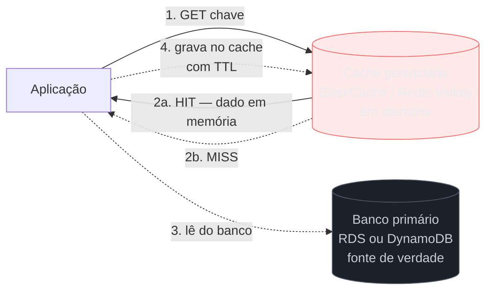
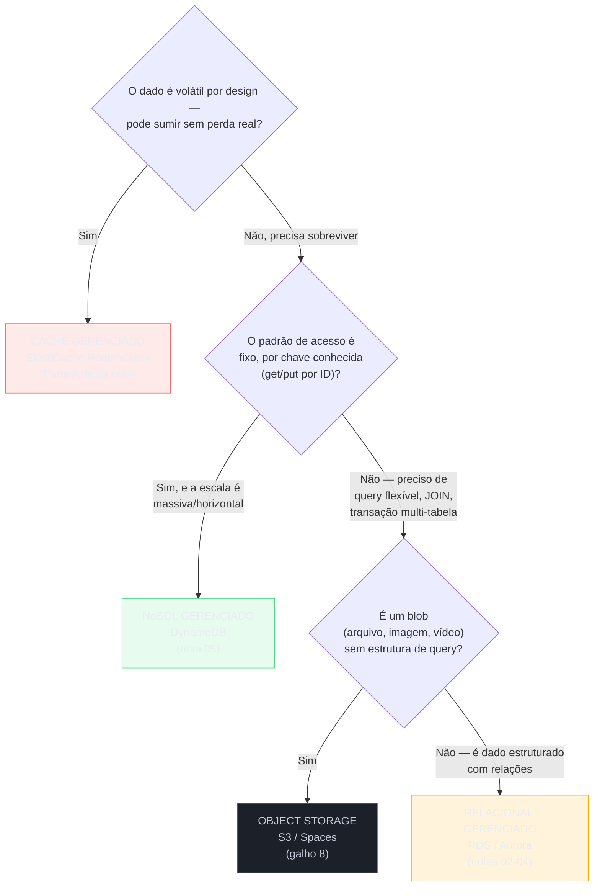
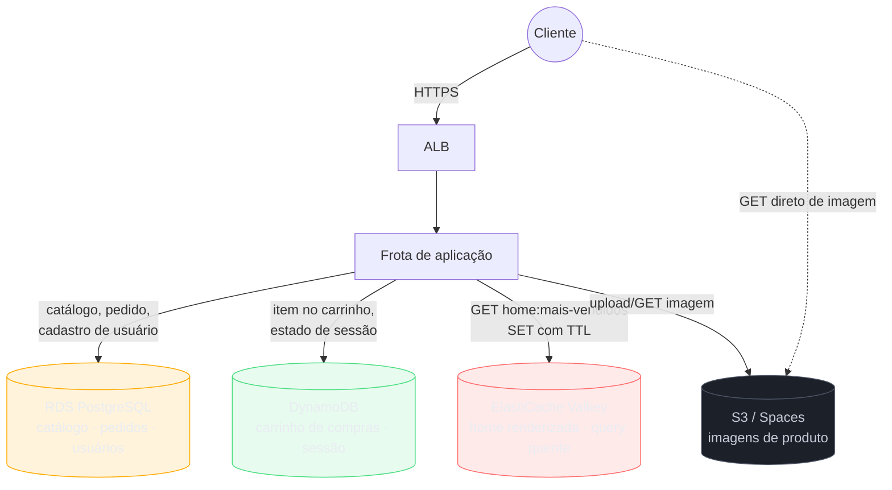

# Cache gerenciado e a grande escolha

> [!abstract] TL;DR
> As cinco notas anteriores deste galho cobriram dois dos três tipos de "banco gerenciado": relacional (RDS/PostgreSQL — notas 02-04, com Multi-AZ, réplicas de leitura e Aurora) e NoSQL de acesso por chave (DynamoDB — nota 05, com particionamento, GSI/LSI e capacity modes). Faltava o terceiro tipo, o que fica *na frente* dos outros dois em vez de competir com eles: **cache gerenciado**. Esta nota fecha essa lacuna com o ElastiCache (Redis/Valkey e Memcached) e o MemoryDB, e então dá o passo que só é possível depois que as seis peças do galho — três tipos de armazenamento do galho 8, mais relacional, NoSQL e cache deste galho — estão todas na mesa: a **árvore de decisão completa**, aplicada de ponta a ponta à loja web recorrente da trilha, mostrando por que a resposta certa é quase sempre "todos os tipos, cada um no seu papel" — o padrão chamado **polyglot persistence** — e nunca "um banco para tudo".

## O problema: o banco primário está respondendo à mesma pergunta, de novo

Imagine a página de catálogo da loja web: todo visitante que abre a home vê a mesma lista de "mais vendidos", montada por uma query de agregação no RDS que junta pedidos, produtos e avaliações. Essa query não é barata — ela varre milhares de linhas, faz `JOIN` entre três tabelas, ordena por popularidade. Rodá-la uma vez por segundo seria tolerável; rodá-la a cada uma das mil requisições por segundo que a home recebe no horário de pico derruba o banco, porque o RDS tem um teto de conexões e de I/O que nenhuma réplica de leitura (nota 03) resolve sozinha quando o gargalo é a mesma query cara, repetida, sobre o mesmo dado que não mudou nos últimos cinco minutos.

O padrão que resolve isso não é "banco maior" — é lembrar a resposta em memória, perto da aplicação, e servir a próxima requisição idêntica sem tocar o banco de novo. A diferença de latência entre as duas abordagens não é sutil: uma query relacional bem otimizada ainda leva alguns milissegundos de rede mais processamento; uma leitura de cache em memória, bem perto da aplicação, responde em frações de milissegundo — a diferença entre "o banco aguenta mil requisições por segundo com folga" e "o banco derrete na primeira campanha de marketing bem-sucedida". É esse o papel do cache gerenciado.

E chegar até aqui, na última nota do galho, também levanta a pergunta que todo arquiteto júnior encara cedo ou tarde, na frente de um requisito novo: **relacional, NoSQL ou cache — qual eu uso, e por quê?** É a Parte B desta nota que responde isso com o peso das cinco notas anteriores atrás.

## Parte A — Cache gerenciado: aliviar o banco primário, servir do jeito mais rápido possível

### Por que cache, e por que ele não é banco de dados

Um cache gerenciado é uma camada de armazenamento **em memória**, colocada entre a aplicação e o banco primário, cujo único propósito é responder mais rápido do que o banco conseguiria — normalmente em microssegundos a baixo milissegundo, contra dezenas de milissegundos de uma query relacional. Ele não substitui o RDS ou o DynamoDB; ele fica **na frente** deles.



O ponto central: o cache **não é durável por design de uso**, mesmo quando o engine por trás dele suporta persistência em disco (o Redis suporta; o Memcached não). A pergunta que decide se algo pertence ao cache não é "esse engine pode gravar em disco?" — é "se este dado sumir agora, a aplicação perde alguma coisa que não consegue reconstruir a partir do banco primário?". Se a resposta for "sim, perde", o dado não pertence só ao cache — ele pertence ao banco primário, e o cache é, na melhor das hipóteses, uma cópia descartável dele.

> [!warning] A armadilha central: tratar cache como fonte de verdade
> É comum, sob pressão de performance, empurrar dado cada vez mais importante para o cache "porque é rápido" — até o dia em que o cache reinicia (patch, failover, estouro de memória com eviction agressiva) e um dado que só existia ali desaparece. Regra prática: tudo que está no cache também deve poder ser recriado a partir do banco primário, do zero, sem intervenção manual. Se isso não for verdade, o dado não é cache — é estado, e estado pede um banco de verdade (relacional, DynamoDB, ou o MemoryDB descrito adiante, que é durável por construção).

### ElastiCache: Redis/Valkey vs Memcached — dois motores, dois contratos diferentes

O ElastiCache não é um produto só — é um serviço que hospeda **dois engines de cache com contratos bem diferentes**, e a documentação oficial da AWS é direta sobre quando escolher cada um.

**Memcached** é o mais simples dos dois: armazena só strings e objetos simples, é multi-thread nativamente (aproveita todos os núcleos de um nó grande sozinho), particiona dados automaticamente entre nós, e permite adicionar/remover nós à vontade para escalar horizontalmente. Não tem replicação, não tem persistência, não tem estruturas de dados ricas — é cache no sentido mais estrito da palavra.

**Redis OSS / Valkey** entregam uma superfície muito mais rica: estruturas de dados complexas (sets, sorted sets, listas, hashes, bitmaps, HyperLogLog, índices geoespaciais), replicação com failover automático, Pub/Sub, persistência opcional (snapshots RDB e/ou log AOF), e — a partir da versão mais recente do Valkey — até durabilidade transacional Multi-AZ dentro do próprio engine de cache. Rodam num único thread principal por padrão (ao contrário do Memcached), o que significa que escalar throughput geralmente passa por cluster mode (sharding) em vez de núcleos adicionais num nó só.

| Critério | Memcached | Redis OSS / Valkey |
|---|---|---|
| Modelo de dados | Simples (string, objeto) | Complexo (sets, sorted sets, hashes, listas, bitmaps, geoespacial) |
| Multi-thread | Sim, nativo | Não (thread único de comando; escala via sharding) |
| Particionamento de dados | Sim, nativo | Só em cluster mode (habilitado) |
| Replicação / failover automático | Não | Sim (opcional em cluster mode disabled; obrigatório em cluster mode enabled) |
| Persistência em disco | Não | Sim (RDB/AOF), opcional |
| Pub/Sub | Não | Sim |
| Data tiering (memória + SSD) | Não | Sim, a partir de 6.2 (node r6gd) |
| Quando escolher | Cache de objeto puro, simplicidade máxima, escalar núcleos | Estruturas de dados ricas, HA, persistência, pub/sub, filas |

> [!info] Caducidade — a transição Redis → Valkey
> Em 2024 a Redis Ltd. mudou a licença do Redis OSS para um modelo não totalmente open-source (BSD deixou de cobrir versões futuras do projeto original). Em resposta, um grupo de mantenedores e provedores de nuvem (incluindo AWS, Google, Oracle, Ericsson e outros, sob a Linux Foundation) criou o **Valkey**, um fork do Redis sob licença BSD permissiva, mantendo compatibilidade de API. Verificado em 2026-07-23: a AWS já oferece **ElastiCache para Valkey** com versões próprias (8.0 até 9.0, com features exclusivas como full-text search, hash field expiration e durabilidade transacional que o Redis OSS legado no ElastiCache não recebe mais) e recomenda Valkey para clusters novos; a documentação da AWS já trata "Valkey ou Redis OSS" como opções irmãs, com Valkey recebendo o desenvolvimento mais ativo. A DigitalOcean já migrou de vez: o antigo "Managed Redis" foi descontinuado e substituído por **Managed Caching for Valkey**, com conversão automática das instâncias antigas. Ou seja, Valkey não é mais "uma alternativa emergente" — é, hoje, o destino padrão de quem cria cache novo tanto na AWS quanto na DO. Ainda assim, confira a documentação de cada provedor antes de assumir versão ou disponibilidade regional, porque essa transição continua avançando.

> [!tip] Assista: AWS ElastiCache Tutorial: Redis vs Memcached In-Memory Caching Explained
> **Canal:** CodeLucky | **Duração:** ~5min | **Idioma:** EN
>
> Passa rápido pelo mesmo contraste desta seção — estruturas de dados ricas e persistência opcional de um lado, simplicidade pura sem replicação do outro — útil como resumo em vídeo antes de ir para a tabela de critérios. Trecho de destaque [02:20]: *"[Redis] includes master replica replication for high availability (...) [Memcached] offers no persistence, meaning data is lost (...) it also has no built-in replication or high availability"*
>
> 🎬 [Assistir no YouTube](https://www.youtube.com/watch?v=tYk-ksdhkZ4)

### Cluster mode: uma decisão de escala que muda o que o cliente precisa saber

Dentro do Redis/Valkey no ElastiCache existe ainda uma segunda decisão, independente da escolha de engine: **cluster mode disabled** versus **cluster mode enabled**. Com cluster mode desabilitado, o replication group tem um único shard — um nó primário e até cinco réplicas de leitura, tudo com o mesmo conjunto completo de chaves. É o modo mais simples de operar e o suficiente para a maior parte dos casos de cache (a home renderizada, a sessão, o resultado de query quente): o volume de dados cabe folgado num nó só, e o que falta é só failover automático, não mais throughput de escrita.

Com cluster mode habilitado, o conjunto de chaves é particionado (sharded) entre até 500 shards, cada um com seu próprio primário e réplicas — o mesmo princípio de particionamento por hash que a nota 05 já detalhou para o DynamoDB, aplicado agora a um cache. É a opção certa quando o volume de dados ou o throughput de escrita excede o que um nó único aguenta, e o cliente Redis precisa entender o protocolo de redirecionamento de slot (`MOVED`/`ASK`) para saber a qual shard uma chave pertence — a maioria das bibliotecas cliente modernas já faz isso de forma transparente.

| Cluster mode | Shards | Quando usar | O que o cliente precisa suportar |
|---|---|---|---|
| Disabled | 1 (com réplicas de leitura) | Cache simples, volume de dados cabe num nó, failover é a única exigência | Nada especial — endpoint único |
| Enabled | Até 500, cada um com réplicas | Volume de dados ou throughput de escrita excede um nó só | Cliente com suporte a cluster (redirecionamento de slot) |

### Eviction policies: o que acontece quando a memória enche

Toda instância de cache tem um teto de memória, e o que acontece ao atingi-lo é configurável via política de eviction — a mesma teoria que [[03-Dominios/Engenharia/Arquitetura/index|System Design]] cobre a fundo, mas que vale nomear aqui porque é parâmetro real de configuração do engine, não só conceito abstrato:

```bash
# Configurar a política de eviction de um parameter group do ElastiCache
$ aws elasticache modify-cache-parameter-group \
    --cache-parameter-group-name loja-cache-params \
    --parameter-name-values "ParameterName=maxmemory-policy,ParameterValue=allkeys-lru"
```

`allkeys-lru` descarta a chave menos recentemente usada entre **todas** as chaves quando a memória enche — a política default mais segura para um cache puro, como o da home renderizada desta nota, porque garante que o dado mais "quente" nunca é descartado por engano. `volatile-lru` faz o mesmo, mas só entre chaves que têm TTL configurado, preservando chaves sem expiração como se fossem permanentes — útil quando o mesmo cache mistura dado descartável com algo que, por engano de design, não deveria estar ali (o próprio sintoma do anti-padrão "cache como fonte de verdade" mencionado acima).

### Casos de uso reais de cache gerenciado

- **Cache de resultado de query cara (a abertura desta nota).** Página de catálogo, dashboard de métricas agregadas, ranking de produtos — qualquer resultado computado a partir de uma query pesada, que muitos usuários pedem ao mesmo tempo e que tolera alguns minutos de atraso.
- **Sessão de usuário e carrinho de compras leve.** Estado de login, preferências de UI, itens de um carrinho quando a aplicação aceita perder um carrinho ocasional em troca de latência mínima — o caso-limite que a Parte B retoma, comparando com DynamoDB.
- **Rate limiting e contadores.** Estruturas como `INCR` com TTL são a base de limitadores de taxa (quantas requisições um IP fez no último minuto) — um padrão que depende diretamente das estruturas de dados ricas do Redis/Valkey, não disponíveis no Memcached.
- **Fila leve e Pub/Sub.** Notificação em tempo real entre serviços (um worker avisando a frota de aplicação que um pedido mudou de status) usando Pub/Sub nativo do Redis/Valkey — mais leve que montar um serviço de mensageria completo para um volume pequeno de eventos.
- **Leaderboard e métrica em tempo real que precisa sobreviver a um restart.** É aqui que o MemoryDB entra, não o ElastiCache — o caso em que "cache" deixa de ser o nome certo para o problema.
- **Cache de conteúdo semi-estático.** Cabeçalho, rodapé e banners de uma página web renderizada no servidor mudam raramente; guardar o HTML já montado dessas partes no cache evita recompor o mesmo template a cada requisição — o mesmo raciocínio do padrão "content cache" que a documentação da Azure descreve para o Cache for Redis, aplicável a qualquer engine compatível.

### Padrões de uso de cache — em prosa, sem reexplicar a teoria

Os padrões clássicos de cache — **cache-aside** (a aplicação lê o cache primeiro, e só na falta busca e grava do banco, como o diagrama acima ilustrou), **write-through** (toda escrita vai para o cache e o banco ao mesmo tempo, de forma síncrona), TTL/expiração e políticas de **eviction** (LRU e variantes, que decidem o que descartar quando a memória enche) são teoria de design de sistemas, não deste galho.

> [!info] Fronteira
> Os padrões de cache-aside, write-through/write-behind e as políticas de eviction (LRU, LFU, TTL) como teoria de design pertencem a [[03-Dominios/Engenharia/Arquitetura/index|System Design]]. Esta nota mostra como configurá-los num serviço gerenciado real — não reexplica o raciocínio de fundo por trás de cada padrão.

O que vale fixar aqui é como isso aparece na prática, com comandos reais:

```bash
# Conectar a um endpoint do ElastiCache (Redis/Valkey) via redis-cli
$ redis-cli -h loja-cache.abc123.ng.0001.use1.cache.amazonaws.com -p 6379 --tls

# Cache-aside na mão: gravar o resultado de uma query cara, com TTL de 5 minutos
127.0.0.1:6379> SET home:mais-vendidos "[{...json da lista...}]" EX 300
OK

# Ler de volta — HIT enquanto o TTL não expirar
127.0.0.1:6379> GET home:mais-vendidos
"[{...json da lista...}]"

# Checar quanto tempo falta pro dado expirar
127.0.0.1:6379> TTL home:mais-vendidos
(integer) 287
```

E o cache-aside completo, em pseudocódigo, é o esqueleto que qualquer aplicação real implementa em cima desses comandos:

```python
def get_mais_vendidos():
    cache_key = "home:mais-vendidos"
    cached = redis.get(cache_key)
    if cached is not None:
        return cached  # HIT — nem chega perto do RDS

    # MISS — busca do banco primário, a fonte de verdade
    resultado = rds.query("""
        SELECT p.id, p.nome, COUNT(o.id) AS vendas
        FROM produtos p JOIN pedidos o ON o.produto_id = p.id
        GROUP BY p.id ORDER BY vendas DESC LIMIT 10
    """)
    redis.set(cache_key, serialize(resultado), ex=300)  # TTL de 5 min
    return resultado
```

O TTL de 300 segundos é a decisão de negócio embutida no código: a lista de mais vendidos pode ficar até cinco minutos desatualizada, e ninguém percebe — é exatamente esse tipo de dado "quente, tolerante a atraso pequeno" que justifica cache; um saldo bancário, ao contrário, não toleraria essa mesma folga.

Vale contrastar com o esqueleto de write-through, para deixar a diferença de fluxo bem concreta — aqui a escrita vai para o cache e o banco no mesmo instante, não só na leitura seguinte:

```python
def atualizar_estoque(produto_id, nova_quantidade):
    # Write-through: grava no banco primário e no cache na mesma operação,
    # nunca deixando o cache ficar desatualizado esperando a próxima leitura
    rds.execute(
        "UPDATE produtos SET estoque = %s WHERE id = %s",
        (nova_quantidade, produto_id),
    )
    redis.set(f"produto:{produto_id}:estoque", nova_quantidade, ex=3600)
```

A escolha entre os dois padrões depende de quem pode tolerar dado velho: cache-aside aceita servir uma resposta ligeiramente desatualizada até o TTL expirar (a home de mais vendidos, tolerante); write-through garante que o cache nunca fica atrasado em relação ao banco, ao custo de toda escrita ficar um pouco mais lenta (o estoque de um produto, onde vender um item a mais do que existe é um problema real).

### Criando o cluster: ElastiCache e o equivalente na DigitalOcean

```bash
# ElastiCache para Valkey — replication group com um nó primário e uma réplica,
# Multi-AZ e failover automático habilitados
$ aws elasticache create-replication-group \
    --replication-group-id loja-cache \
    --replication-group-description "Cache da home e sessao" \
    --engine valkey \
    --engine-version 8.1 \
    --cache-node-type cache.r7g.large \
    --num-cache-clusters 2 \
    --automatic-failover-enabled \
    --multi-az-enabled \
    --at-rest-encryption-enabled \
    --transit-encryption-enabled
```

```bash
# Confirmar que o failover automático de fato está ativo, não assumir de memória
$ aws elasticache describe-replication-groups \
    --replication-group-id loja-cache \
    --query 'ReplicationGroups[0].{Engine:Engine,Automatic:AutomaticFailover,MultiAZ:MultiAZ}'
```

```json
{ "Engine": "valkey", "Automatic": "enabled", "MultiAZ": "enabled" }
```

Na DigitalOcean, o caminho equivalente já nasce em Valkey — a antiga oferta "Managed Redis" foi descontinuada e substituída:

```bash
# Managed Caching for Valkey — cluster com um nó primário e uma réplica
$ doctl databases create loja-cache \
    --engine valkey \
    --region nyc3 \
    --size db-s-2vcpu-4gb \
    --num-nodes 2
```

### MemoryDB: quando o "cache" precisa ser durável de verdade

Existe um caso-limite que o ElastiCache, por design, não cobre bem: um dado que precisa da velocidade de um cache **e** da durabilidade de um banco — leaderboard de jogo em tempo real com milhões de atualizações por segundo, ou um serviço que usa estruturas de dados de Redis (sorted sets, streams) como a própria fonte de verdade, não como cópia descartável de outro banco. Para esse caso, a AWS tem um serviço irmão do ElastiCache, não o próprio ElastiCache: o **Amazon MemoryDB**, compatível com Valkey e Redis OSS, mas com um transaction log Multi-AZ que garante durabilidade e recuperação sem perda de dados — na prática, um banco de dados que fala o protocolo Redis, não um cache que por acaso persiste.

| | ElastiCache (Redis/Valkey) | MemoryDB |
|---|---|---|
| Papel pretendido | Cache em frente a um banco primário | Banco de dados durável, protocolo Redis |
| Durabilidade | Opcional, best-effort (snapshot/AOF) | Garantida — transaction log Multi-AZ |
| Caso de uso típico | Aliviar leitura de RDS/DynamoDB | Fonte de verdade para dados que já nascem no formato Redis |
| Se ele reiniciar do zero | Aplicação reconstrói do banco primário | Não há "banco primário" por trás — os dados são o serviço |

A distinção importa porque a pergunta "isso é cache ou banco?" tem, nesse caso raro, uma resposta arquitetural explícita da própria AWS: se o dado precisa sobreviver por si mesmo, o produto certo tem outro nome, não é "ElastiCache com persistência ligada".

```bash
# MemoryDB — cluster compatível com Valkey, já nascendo com o
# transaction log Multi-AZ que dá durabilidade ao protocolo Redis
$ aws memorydb create-cluster \
    --cluster-name loja-leaderboard \
    --engine valkey \
    --engine-version 7.3 \
    --node-type db.r7g.large \
    --num-shards 2 \
    --num-replicas-per-shard 1 \
    --subnet-group-name loja-memorydb-subnets \
    --security-group-ids sg-memorydb-leaderboard
```

Note que a criação de um cluster MemoryDB pede explicitamente `--num-shards` e `--num-replicas-per-shard` — a mesma lógica de particionamento do cluster mode do ElastiCache, aplicada aqui porque o MemoryDB, sendo um banco de dados e não um cache descartável, precisa dessa granularidade desde o primeiro dia, não como uma opção avançada.

### A lente dupla, e a tradução de outros provedores

| Conceito | AWS | DigitalOcean |
|---|---|---|
| Cache gerenciado (Redis/Valkey compatível) | ElastiCache para Valkey/Redis OSS | Managed Caching for Valkey (ex-Managed Redis) |
| Cache gerenciado (protocolo simples, multi-thread) | ElastiCache para Memcached | Sem equivalente direto |
| Banco durável compatível com protocolo Redis | MemoryDB (Valkey/Redis OSS) | Sem equivalente — usar Managed Valkey ciente de que não é garantidamente durável |

| Conceito | Azure | GCP |
|---|---|---|
| Cache gerenciado compatível com Redis | Azure Managed Redis (sucessor; Azure Cache for Redis está em processo de retirement) | Memorystore for Redis / Memorystore for Redis Cluster |
| Cache gerenciado Valkey | — (não confirmado na doc consultada) | Memorystore for Valkey |
| Cache gerenciado protocolo Memcached | — | Memorystore for Memcached (descontinuado, segundo doc consultada) |

> [!info] Caducidade
> Verificado em 2026-07-23: a Microsoft anuncia explicitamente o retirement de todos os SKUs do Azure Cache for Redis, recomendando migração para o **Azure Managed Redis**. Quem consultar material mais antigo sobre Azure vai encontrar "Azure Cache for Redis" como produto ativo — hoje ele já está em transição de saída. O GCP, por sua vez, já tem Memorystore for Valkey como produto próprio ao lado do Memorystore for Redis, e marca Memorystore for Memcached como descontinuado na documentação consultada.

## Parte B — a grande escolha: dado o requisito, qual banco?

### A árvore de decisão do galho inteiro

As cinco notas anteriores e a Parte A desta deram profundidade a cada resposta isolada — relacional a fundo, DynamoDB a fundo, cache a fundo. Esta árvore aplica esse conhecimento junto, na ordem em que um arquiteto sênior realmente pergunta:



Uma frase por ramo: cache vence quando o dado é descartável e a exigência é velocidade pura; NoSQL vence quando o acesso é sempre por chave e a escala é horizontal massiva; object storage vence quando o dado é um blob sem necessidade de query estruturada; relacional vence quando o dado tem relações reais entre entidades e precisa de consulta flexível com garantias transacionais fortes. Nenhum dos quatro é "o melhor banco" em geral — cada um é o melhor banco **para um formato e um padrão de acesso específicos**.

### Os eixos por trás da árvore

| Eixo | Relacional (RDS) | NoSQL (DynamoDB) | Cache (ElastiCache) | Object (S3/Spaces) |
|---|---|---|---|---|
| Modelo de dados | Tabelas, relações, schema fixo | Documento/item, schema flexível | Chave-valor volátil | Blob opaco, sem estrutura |
| Padrão de acesso | Query flexível, JOIN, agregação | Access pattern fixo por chave | Get/set por chave, TTL | Leitura/escrita de objeto inteiro |
| Escala | Vertical + réplicas de leitura | Horizontal massiva (partições) | Horizontal via sharding | Praticamente ilimitada |
| Consistência | Forte, transacional (ACID) | Eventual por padrão, forte sob demanda | Nenhuma garantia de durabilidade | Forte por chave, após escrita |
| Durabilidade | Fonte de verdade | Fonte de verdade | Volátil por design | Fonte de verdade (com versioning) |
| Custo relativo | Médio-alto (I/O provisionado) | Pago por request/capacidade | Baixo por GB, alto por hora de nó | Muito baixo por GB |

> [!tip] Assista: Polyglot Persistence: Choosing the Right Database for the Job!
> **Canal:** CodeLucky | **Duração:** ~10min | **Idioma:** EN
>
> Nomeia o padrão que esta árvore de decisão está aplicando na prática — "polyglot persistence" — e traz um estudo de caso real de e-commerce (Postgres para pedidos, MongoDB para catálogo, Redis para sessão, Elasticsearch para busca) que é quase um espelho da loja web recorrente desta trilha, com números concretos de ganho de performance. Trecho de destaque [07:23]: *"case studies. The first one is an e-commerce platform. A large online retailer implemented polyglot persistence (...) relational database for orders and inventory, document store for product catalogs, key value for sessions, and search engine for product discovery"*
>
> 🎬 [Assistir no YouTube](https://www.youtube.com/watch?v=JAnQlGp2Z-s)

### Dois casos-limite que costumam aparecer numa entrevista

A árvore resolve o caso comum rápido; vale testá-la contra dois casos que parecem ambíguos à primeira vista.

**"Carrinho de compras: DynamoDB ou cache?"** É o caso-limite mais citado nesta nota, e vale nomear o critério que decide: se perder o carrinho no meio de uma sessão de compra é um problema real de negócio (cliente furioso, pedido perdido, métrica de conversão manchada), a resposta é DynamoDB com TTL — o carrinho sobrevive a qualquer reinício de cache. Se o carrinho é efêmero por natureza do produto (uma lista de "itens vistos recentemente" que ninguém reclama de perder), cache puro já resolve, e mais barato. A pergunta certa nunca é "qual é mais rápido" — os dois são rápidos o bastante — é "o que acontece se este dado sumir agora".

**"Contador de visualizações de um produto: onde fica?"** Parece pedir banco relacional, porque "contador" soa como uma coluna de tabela. Mas incrementar um contador de alta frequência (milhares de views por segundo num produto em alta) direto numa coluna do RDS gera contenção de linha e trava outras escritas na mesma tabela. O padrão mais comum em produção é incrementar o contador no cache (`INCR`, atômico e rapidíssimo) e persistir o valor agregado no RDS periodicamente, em lote — o cache absorve a alta frequência, o banco guarda o valor eventualmente consistente que interessa para relatório. É outro caso onde a resposta não é "um dos dois", é "os dois, em papéis diferentes".

### Cenário de ponta a ponta: a loja web inteira, dado por dado

A nota 01 do galho 8 e as notas deste galho já tocaram partes desse cenário isoladamente; aqui ele aparece completo, com cada tipo de dado da loja mapeado à escolha certa e justificado:



Cada seta é uma decisão justificada, não um gosto pessoal:

- **Catálogo, pedidos e cadastro de usuário → RDS.** Um pedido tem relação real com produto, cliente e pagamento; consultar "todos os pedidos de um cliente com valor acima de X, agrupados por mês" é exatamente o tipo de query flexível, com `JOIN` e agregação, que só o relacional entrega bem — e a durabilidade transacional (ACID) importa porque um pedido perdido é dinheiro perdido. Trocar isso por DynamoDB obrigaria desenhar de antemão cada access pattern de relatório futuro — que a nota 05 já descreveu como o preço de modelar por acesso, não por estrutura.
- **Carrinho de compras e sessão → DynamoDB (ou cache, dependendo da criticidade).** O acesso ao carrinho é sempre por uma chave conhecida (o ID de sessão ou de usuário), a escala é horizontal por natureza (milhões de carrinhos simultâneos, cada um pequeno), e a consistência eventual é aceitável na maior parte das operações. Se o requisito de negócio tolerar perder um carrinho ocasional em troca de latência ainda mais baixa, cache também serve — mas DynamoDB com TTL nativo (a nota 05 já cobriu isso) é a escolha mais segura por default, porque sobrevive a um restart de cache sem perder o carrinho de ninguém no meio de uma compra.
- **Página da home renderizada / resultado de query cara → ElastiCache.** É exatamente o cenário de abertura desta nota: um resultado que pode ser recomputado do RDS a qualquer momento, e que se perder não custa nada além de uma query a mais. Guardar isso no RDS mesmo (numa tabela de "cache manual") readicionaria carga de I/O ao banco primário — o problema que o cache existe para resolver; guardar isso no DynamoDB funcionaria, mas pagaria por durabilidade e por unidades de capacidade que um dado descartável não precisa.
- **Imagens de produto → object storage.** Já resolvido pelo galho 8: blob opaco, endereçado por chave, servido direto ao navegador sem passar pela frota de aplicação. Nenhum dos três bancos deste galho concorre com essa escolha — nenhum deles foi desenhado para servir bytes de imagem em escala com o mesmo custo por GB que object storage entrega.
- **Quem tem permissão para tocar em cada peça → fronteira do galho de IAM.** Nenhuma das quatro escolhas acima é auto-suficiente sem identidade: a role IAM anexada à frota de aplicação (galho 4) é o que autoriza de fato o acesso ao cluster ElastiCache — via IAM authentication no Redis/Valkey, ou via Auth Token — do mesmo jeito que autoriza `PutObject` no bucket de imagens ou `GetItem` no DynamoDB. Escolher o tipo certo de dado resolve "que contrato de acesso este dado precisa"; quem, especificamente, tem permissão de usar esse contrato continua sendo decisão de identidade, não de armazenamento.

O termo que nomeia essa convivência — vários tipos de banco na mesma arquitetura, cada um resolvendo a parte que sabe resolver melhor — é **polyglot persistence**: a ideia de que a "persistência certa" não é uma tecnologia só, é a combinação certa de tecnologias para os formatos e padrões de acesso que a aplicação de fato tem.

Vale fechar o cenário com a mesma disciplina de verificação que o galho 8 já praticou: não assumir de memória que o cache está de fato configurado do jeito certo, mas confirmar por comando — TTL default aplicado, política de eviction correta, e que o cache não guarda nenhuma chave sem expiração além das que foram deliberadamente marcadas como permanentes:

```bash
# Confirma a política de eviction em uso pelo cluster de cache
$ aws elasticache describe-cache-parameters \
    --cache-parameter-group-name loja-cache-params \
    --query "Parameters[?ParameterName=='maxmemory-policy'].ParameterValue" \
    --output text
```

```text
allkeys-lru
```

```bash
# Amostra quantas chaves no cache NÃO têm TTL — se esse número crescer sem
# explicação, é sinal de que algo está sendo tratado como fonte de verdade
$ redis-cli -h loja-cache.abc123.ng.0001.use1.cache.amazonaws.com --tls \
    --scan --pattern '*' | while read key; do
      ttl=$(redis-cli -h loja-cache.abc123.ng.0001.use1.cache.amazonaws.com --tls TTL "$key")
      [ "$ttl" = "-1" ] && echo "$key"
    done
```

Uma lista vazia (ou só as poucas chaves deliberadamente permanentes) é o sinal de que o cache desta loja está sendo usado como cache de verdade — não como um banco de dados disfarçado.

### Tabela-síntese final: requisito → tipo → serviço → armadilha

| Requisito | Tipo | Serviço AWS | Serviço DigitalOcean | Armadilha principal |
|---|---|---|---|---|
| Catálogo, pedidos, relatórios com JOIN | Relacional | RDS / Aurora PostgreSQL | Managed PostgreSQL | Usar relacional pra tudo e não escalar leitura horizontalmente |
| Carrinho de compras, sessão de usuário | NoSQL (access pattern fixo) | DynamoDB | DynamoDB não existe na DO — usar Managed MongoDB/Valkey conforme o caso | Esperar `JOIN`/query ad hoc como se fosse SQL |
| Página renderizada, resultado de query quente | Cache | ElastiCache (Valkey/Redis) | Managed Caching for Valkey | Tratar cache como fonte de verdade |
| Leaderboard/estado que precisa ser cache-rápido e durável | Cache durável | MemoryDB | Sem equivalente direto | Confundir MemoryDB com "ElastiCache com persistência ligada" |
| Imagem de produto, asset estático | Object storage | S3 | Spaces | Forçar banco de dados a guardar blob grande |
| Nada cacheado, banco derretendo sob leitura repetida | — (falta de cache) | ElastiCache | Managed Caching for Valkey | Escalar o banco primário em vez de aliviar a carga com cache |

### Anti-padrões de escolha

> [!warning] Relacional pra tudo, sem escalar leitura
> Empilhar carrinho, sessão e catálogo inteiro no mesmo RDS, sem réplica de leitura (nota 03) nem cache na frente, até a query mais simples competir por conexão com a mais pesada. É o sintoma mais comum de uma arquitetura que nunca precisou de polyglot persistence porque nunca cresceu o suficiente para sentir a dor — e o primeiro pico de tráfego real expõe o problema de uma vez.

> [!warning] Usar DynamoDB como se fosse SQL
> Modelar tabelas DynamoDB copiando o schema relacional item por item, e depois se surpreender que não dá pra fazer `JOIN` nem `GROUP BY` livre sobre uma tabela inteira. A nota 05 já mostrou que o desenho correto de DynamoDB começa pelo access pattern (que pergunta a aplicação vai fazer, por qual chave), não pela entidade — é o oposto do hábito relacional de modelar primeiro a estrutura e só depois pensar em como consultar.

> [!warning] Tratar cache como fonte de verdade
> Guardar um dado que não existe em nenhum outro lugar só no ElastiCache, e descobrir o custo disso no primeiro failover, no primeiro patch de engine, ou na primeira política de eviction agressiva sob pressão de memória. A pergunta de teste continua sendo a mesma da Parte A: se este dado sumir agora, dá pra reconstruir a partir de algo durável? Se não, ele nunca deveria ter sido só cache.

> [!warning] Não cachear nada
> O oposto do anterior: nunca colocar uma camada de cache na frente do banco primário, e tratar cada pico de tráfego como um problema de "banco maior" (mais réplicas de leitura, instância mais cara) em vez de "banco menos solicitado". É comum em arquiteturas que nasceram pequenas e nunca revisitaram a decisão à medida que o tráfego cresceu — o mesmo padrão de negligência que a nota 03 já descreveu para lifecycle de armazenamento ignorado.

> [!warning] Escolher MemoryDB (ou ElastiCache com persistência) sem precisar
> O inverso do anti-padrão de tratar cache como banco: pagar o custo mais alto do MemoryDB, ou ligar persistência pesada no ElastiCache, para um dado que na real é perfeitamente reconstruível do banco primário e nunca precisou de garantia de durabilidade nenhuma. Nomear com precisão se o dado é "cache descartável" ou "estado que precisa sobreviver" evita pagar por uma garantia que o caso de uso não usa — o mesmo raciocínio de custo que a nota 06 do galho 8 já aplicou a EFS versus object storage.

### Síntese do galho: as seis notas, amarradas numa decisão só

| Nota | O que ela deu a esta decisão |
|---|---|
| 01 — Por que um banco gerenciado | O contrato geral de "gerenciado": o que a nuvem tira das costas do operador — a pergunta que todo o galho responde peça por peça |
| 02 — RDS e Managed Databases a fundo | O motor relacional em si: engines, instâncias, o RDS/Managed Databases como base do primeiro tipo desta árvore |
| 03 — Alta disponibilidade e réplicas | Multi-AZ, failover, réplicas de leitura — a base técnica de "por que RDS aguenta produção" e escala de leitura |
| 04 — Backups, PITR e manutenção | Snapshots automáticos, point-in-time recovery — a garantia de que o relacional é, de fato, fonte de verdade |
| 05 — NoSQL gerenciado (DynamoDB) | Particionamento por chave, capacity modes, GSI/LSI — o segundo tipo de banco, para acesso massivo e fixo |
| 06 — Esta nota | O terceiro tipo (cache) a fundo, e a árvore de decisão que amarra os três — relacional, NoSQL e cache — a um requisito real |

O fio que amarra as seis: as notas 01-04 deram profundidade ao relacional até o nível de decisão de produção; a nota 05 fez o mesmo para o acesso massivo por chave; esta nota fechou o terceiro tipo que faltava — cache — e devolveu, para as cinco anteriores, a resposta que nenhuma sozinha entregava: escolher entre relacional, NoSQL, cache e object storage não é preferência de time, é uma decisão derivável do próprio requisito de dado, sempre que alguém souber perguntar "quem acessa, com que padrão, e o que acontece se isso sumir".

## O que vem a seguir

Este galho fechou os três tipos de "banco gerenciado": relacional para dado estruturado com relações reais, NoSQL para acesso massivo por chave conhecida, e cache para aliviar os dois primeiros com velocidade em memória — e, com eles, a árvore de decisão completa que amarra também os três tipos de armazenamento bruto do galho 8. Os dados da loja agora têm casa certa, cada um na sua: catálogo no relacional, carrinho no NoSQL ou no cache, imagem no object storage, página quente no cache.

Falta a peça que nenhuma das nove notas destes dois galhos tocou ainda: como o cliente, do outro lado do mundo, chega até esses dados com baixa latência, e como o nome de domínio da loja aponta para o endereço certo. Isso é DNS e CDN — a borda da rede, entre o usuário e tudo que os galhos 5 a 9 construíram — e é o próximo galho da trilha Cloud, que fecha o Bloco 2.

Vale fechar com a mesma disciplina do galho anterior: nomear o tipo certo de banco resolve "onde este dado mora"; levar esse dado até o navegador do cliente, rápido, de qualquer lugar do planeta, é uma pergunta diferente — e é dela que o próximo galho cuida.

## Fontes

- [AWS ElastiCache — Comparing node-based Valkey, Memcached, and Redis OSS clusters](https://docs.aws.amazon.com/AmazonElastiCache/latest/red-ug/SelectEngine.html) — comparação de engines (Memcached vs Valkey/Redis OSS), tabela completa de features por versão, quando escolher cada um; acessado em 2026-07-23.
- [Amazon MemoryDB — product page](https://aws.amazon.com/memorydb/) — MemoryDB como banco durável compatível com Valkey/Redis OSS, transaction log Multi-AZ, diferença de propósito frente ao ElastiCache; acessado em 2026-07-23.
- [DigitalOcean — Managed Databases for Caching](https://www.digitalocean.com/products/managed-databases-caching) — transição de Managed Redis para Managed Caching for Valkey, conversão automática, features (failover, autoscaling, per-slot metrics); acessado em 2026-07-23.
- [DigitalOcean — Valkey overview docs](https://docs.digitalocean.com/products/databases/valkey/) — eviction policies, alta disponibilidade, persistência, criação via doctl; acessado em 2026-07-23.
- [Microsoft Learn — What is Azure Cache for Redis?](https://learn.microsoft.com/en-us/azure/azure-cache-for-redis/cache-overview) — anúncio de retirement de todos os SKUs do Azure Cache for Redis em favor do Azure Managed Redis, tiers (Basic/Standard/Premium/Enterprise/Enterprise Flash), padrões de uso (cache-aside, content cache, session store); acessado em 2026-07-23.
- [Google Cloud — Memorystore documentation index](https://docs.cloud.google.com/memorystore/docs) — produtos Memorystore for Valkey, Memorystore for Redis, Memorystore for Redis Cluster, Memorystore for Memcached (descontinuado); acessado em 2026-07-23.

> [!info] Fronteira
> Padrões de cache (cache-aside, write-through/write-behind, eviction policies) como teoria de design pertencem a [[03-Dominios/Engenharia/Arquitetura/index|System Design]]. Object storage para blobs foi coberto a fundo no [[03-Dominios/Tecnologia/Cloud/08 - Armazenamento (object, block e file)/index|Armazenamento (object, block e file)]]. A escolha de modelo de dados como disciplina mais ampla — modelagem, governança, pipelines — pertence ao domínio [[03-Dominios/Engenharia/Dados/index|Dados]]; esta nota tratou só da escolha do banco/cache gerenciado como recurso de infraestrutura.
>
> Monitoramento de hit rate, latência e memória usada de um cluster de cache em produção — o que alertar, com que threshold, como reagir a uma queda súbita de hit rate — é disciplina de Operação, não deste galho.
