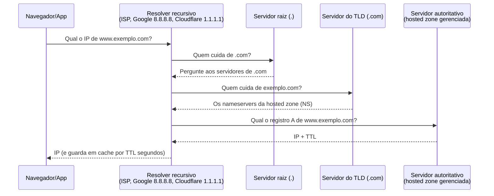
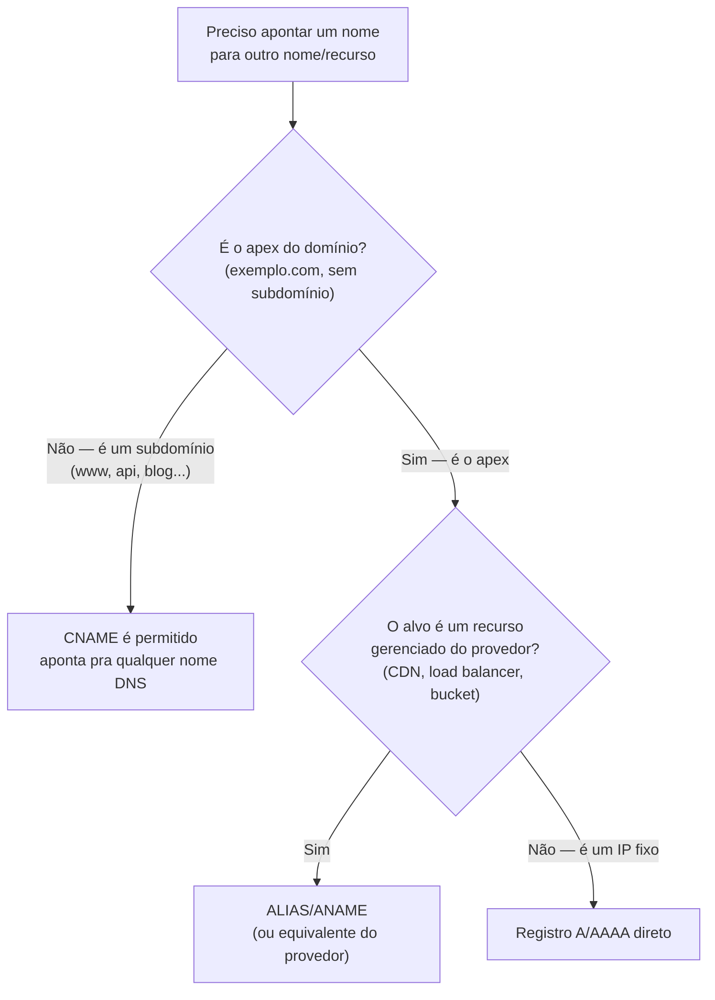

# DNS na nuvem

> [!abstract] TL;DR
> DNS traduz nomes que humanos lembram (`medespecialista.com.br`) em endereços IP que máquinas roteiam. Essa tradução acontece por uma cadeia de perguntas — resolver recursivo, servidor raiz, servidor do TLD, servidor autoritativo da zona — e cada resposta fica em cache por um tempo controlado pelo **TTL**. Na nuvem, o servidor autoritativo vira um serviço gerenciado: uma **hosted zone** guarda os registros do seu domínio, e um punhado de tipos de registro (A, AAAA, CNAME, MX, TXT, NS) descreve pra onde cada nome aponta. O ponto que quebra intuição de quem vem de DNS tradicional é o registro **ALIAS** (Route 53) ou equivalente: ele existe porque CNAME é proibido no apex do domínio, e resolve isso apontando o próprio ápice para um recurso da nuvem sem pagar o preço de duas consultas. A DigitalOcean cobre o mesmo terreno com um modelo mais simples — sem ALIAS dedicado, DNS gratuito quando o domínio usa os nameservers da DO.

## O problema: uma agenda telefônica que ninguém pode deixar cair

Imagine que sua empresa muda de escritório. Se o número de telefone continuasse o mesmo, ninguém precisaria saber do novo endereço — bastava ligar. É basicamente esse o trato que o DNS oferece à internet: seus servidores podem migrar de datacenter, trocar de IP, ser substituídos inteiramente por uma CDN — e enquanto o **nome** continuar resolvendo para o lugar certo, ninguém que digita `www.suaempresa.com` percebe nada.

Só que essa "agenda telefônica" não é um arquivo estático em algum lugar. É um sistema distribuído hierárquico, e cada camada dessa hierarquia pode falhar de um jeito sutil o suficiente para não aparecer em nenhum log de aplicação — só em reclamações de usuário dizendo "o site não abre". Um TTL longo demais numa migração de servidor deixa metade da internet batendo no endereço antigo por horas. Um registro NS mal configurado na delegação isola o domínio inteiro do resto da internet, mesmo que os servidores atrás dele estejam saudáveis. Um CNAME criado por engano no apex do domínio simplesmente não funciona — porque a especificação do DNS proíbe isso, ponto.

É por isso que engenheiros sêniores tratam DNS como *infraestrutura crítica de primeira classe*, não como um detalhe de provisionamento que se configura uma vez e esquece. Um erro de aplicação derruba uma feature. Um erro de DNS pode derrubar a empresa inteira — porque literalmente ninguém consegue *encontrar* nenhum dos seus serviços, mesmo que todos estejam de pé.

## Resolução de nomes ponta a ponta

Quando um navegador pergunta "qual é o IP de `www.exemplo.com`?", a resposta não vem de um único lugar — vem de uma cadeia de perguntas em cascata, cada uma respondida por um nível diferente de autoridade.

> [!question] Por que não existe um único servidor central com todos os nomes do mundo?
> Porque isso não escala nem sobrevive a falhas. A internet tem centenas de milhões de domínios, mudando o tempo todo. Um sistema centralizado seria um ponto único de falha gigantesco e um gargalo de escrita insustentável. A solução de 1983 (RFC 882/883, revisada em 1987 pela RFC 1034/1035) foi distribuir a autoridade em árvore: ninguém sabe tudo, mas todo mundo sabe *quem perguntar em seguida*.

O fluxo típico, quando o cache está frio:



Duas peças merecem nome próprio, porque a diferença entre elas é a pergunta clássica de entrevista sobre DNS:

- **Resolver recursivo** — o intermediário que faz o trabalho pesado em nome do cliente: percorre a cadeia inteira (raiz → TLD → autoritativo), monta a resposta final e a devolve. É o papel que o resolver do seu provedor de internet, ou serviços públicos como `8.8.8.8` (Google) e `1.1.1.1` (Cloudflare), cumprem.
- **Servidor autoritativo** — quem *sabe de fato* a resposta para uma zona específica, porque é onde os registros daquela zona vivem. Não faz perguntas para ninguém; responde com o que tem. Uma hosted zone do Route 53 ou uma zona da DigitalOcean são servidores autoritativos — a fonte da verdade para aquele domínio.

Um resolver recursivo nunca é autoritativo para um domínio de terceiros (ele só repassa e faz cache); um servidor autoritativo nunca "pergunta por aí" — ele é a última palavra sobre os registros que hospeda.

### Cache e TTL: por que a maioria das perguntas nem chega ao servidor autoritativo

Se toda consulta DNS do planeta tivesse que percorrer a cadeia completa (raiz → TLD → autoritativo), a internet seria perceptivelmente mais lenta. O que evita isso é o cache: cada resposta chega com um **TTL** (Time To Live, em segundos) dizendo por quanto tempo aquele dado pode ser reutilizado sem perguntar de novo. Um resolver recursivo que já resolveu `www.exemplo.com` há 200 segundos, com TTL de 300, simplesmente devolve a resposta guardada — sem tocar em nenhum servidor autoritativo.

> [!question] Então por que às vezes uma mudança de DNS "demora pra propagar"?
> Porque "propagação" não é um evento único — é o TTL antigo expirando, em milhares de resolvers espalhados pelo mundo, em momentos diferentes. Se o TTL do registro era 3600 (uma hora), qualquer resolver que tenha resolvido esse nome nos últimos 59 minutos vai continuar respondendo com o valor antigo até o próprio cache expirar. Não existe um botão de "forçar propagação global" — existe, no máximo, esperar o TTL vencer em todo lugar.

Isso dá uma tática prática e concreta para qualquer migração planejada: **baixar o TTL bem antes do corte**. Se o registro normalmente tem TTL de 3600, trocar para algo como 60 segundos um ou dois dias antes da migração — e deixar esse TTL baixo circular por todos os caches existentes — faz com que, no momento do corte de fato, a mudança real do IP propague em minutos, não em horas. Depois que a poeira baixa, o TTL volta ao valor normal (TTLs muito baixos permanentes aumentam o volume de consultas e, em provedores que cobram por consulta, o custo).

## Zonas hospedadas e delegação

Uma **hosted zone** (Route 53) ou simplesmente "domínio" na interface da DigitalOcean é o contêiner que guarda todos os registros DNS de um nome — `exemplo.com` e tudo abaixo dele (`www.exemplo.com`, `api.exemplo.com`). Segundo a documentação oficial da AWS, ao criar uma hosted zone pública o Route 53 gera automaticamente um **registro NS** (com os quatro nameservers autoritativos daquela zona) e um **registro SOA** (metadados administrativos: serial, tempos de retry/refresh/expire da zona).

A pergunta que costuma confundir quem está começando: se o registrador do domínio (onde você comprou `exemplo.com` — pode ser a própria AWS, a DO, ou um registrador terceiro) e o provedor de DNS são coisas diferentes, como um aponta pro outro?

A resposta é **delegação via registro NS**: o registrador do domínio, no nível acima (o servidor do TLD `.com`), guarda um registro NS dizendo "para tudo relacionado a `exemplo.com`, pergunte a estes quatro nameservers" — e esses nameservers são exatamente os que a sua hosted zone (Route 53) ou domínio (DigitalOcean) devolveu quando você o criou. Sem essa delegação apontando corretamente, o servidor do TLD nunca vai indicar sua zona autoritativa — e o domínio inteiro fica invisível para a internet, mesmo que a zona em si esteja perfeitamente configurada.

> [!info] Glue records, de raspão
> Quando o nameserver autoritativo de um domínio é, ele mesmo, um subdomínio daquele domínio (ex.: `ns1.exemplo.com` sendo o nameserver de `exemplo.com`), existe uma dependência circular: para resolver `ns1.exemplo.com` você precisaria perguntar a `ns1.exemplo.com`. Um **glue record** resolve isso: é um registro A/AAAA extra que o servidor do TLD guarda diretamente, dando o IP do nameserver junto com a delegação NS, quebrando o círculo. Na prática, ao usar nameservers de um provedor gerenciado (`ns-123.awsdns-45.com`, `ns1.digitalocean.com`) você quase nunca lida com glue records diretamente — eles só ficam visíveis quando o próprio domínio hospeda seus próprios nameservers.

## Os tipos de registro essenciais

Cada registro numa zona é uma linha de tradução: um nome, um tipo, um valor, um TTL. Os tipos abaixo cobrem a esmagadora maioria dos casos de uma aplicação web comum.

```
; formato genérico de uma zona DNS (BIND-style)
; nome            TTL   classe  tipo    valor
www.exemplo.com.  300   IN      A       203.0.113.10
```

**A** — mapeia um nome para um endereço IPv4. É o tipo mais fundamental: "esse nome = esse número".

```
api.exemplo.com.   300  IN  A     203.0.113.25
```

**AAAA** — o mesmo que A, mas para IPv6. Convivem no mesmo nome sem conflito; um cliente com suporte a IPv6 prefere a resposta AAAA, o resto cai para A.

```
api.exemplo.com.   300  IN  AAAA  2001:db8::25
```

**CNAME** — aponta um nome para *outro nome*, não para um IP direto. Útil quando o alvo pode mudar de IP livremente (ex.: apontar `blog.exemplo.com` para a plataforma de hospedagem de blog, sem você precisar saber o IP dela).

```
blog.exemplo.com.  300  IN  CNAME plataforma-blog.provedor.net.
```

**A regra que gera mais confusão de iniciante: CNAME não pode existir no apex (a raiz nua do domínio, `exemplo.com`, sem subdomínio).** Isso não é limitação de um provedor específico — é regra do protocolo DNS (RFC 1034): um nome com registro CNAME não pode ter *nenhum outro* tipo de registro no mesmo nome (nem SOA, nem NS, nem MX). Como todo apex de domínio *precisa* ter os registros SOA e NS que o tornam uma zona válida, um CNAME ali seria estruturalmente inválido — o protocolo simplesmente não permite.

**MX** — indica quais servidores recebem e-mail para o domínio, com uma prioridade numérica (menor número = maior prioridade).

```
exemplo.com.  3600  IN  MX  10 mail.exemplo.com.
exemplo.com.  3600  IN  MX  20 mail-backup.exemplo.com.
```

**TXT** — carrega texto arbitrário associado a um nome. Hoje serve sobretudo para verificação de propriedade de domínio (Google Search Console, certificados SSL via DNS-01) e políticas de e-mail (SPF, DKIM, DMARC).

```
exemplo.com.  3600  IN  TXT  "v=spf1 include:_spf.google.com ~all"
```

**NS** — declara quais nameservers são autoritativos para uma zona (ou subzona delegada). É o registro que faz a delegação hierárquica funcionar, descrita na seção anterior.

```
exemplo.com.  172800  IN  NS  ns-123.awsdns-45.com.
```

### O registro que resolve o problema do CNAME no apex

Se CNAME é proibido no apex, como fazer `exemplo.com` (sem `www.`) apontar para um recurso que muda de IP com frequência — como um load balancer, uma distribuição de CDN, ou um bucket configurado como site estático?

A resposta da AWS é o **registro ALIAS**, uma extensão proprietária do Route 53 que não existe na especificação padrão do DNS. Segundo a documentação oficial da AWS, um registro ALIAS "permite criar um registro no nó superior de um namespace DNS, também conhecido como zone apex" — algo que um CNAME nunca pode fazer. Do lado de fora, quando você consulta com `dig`, um ALIAS responde como se fosse um registro A ou AAAA comum; a natureza "alias" só é visível no console ou via API do Route 53.

Três diferenças práticas separam ALIAS de CNAME, segundo a própria documentação:

| Aspecto | ALIAS (Route 53) | CNAME |
|---|---|---|
| Pode ser criado no apex do domínio? | Sim | Não — proibido pelo protocolo |
| Alvo permitido | Só recursos AWS específicos (S3, CloudFront, ELB, API Gateway, outro registro na mesma hosted zone, etc.) | Qualquer nome DNS, de qualquer provedor |
| Cobrança por consulta no Route 53 | Sem cobrança quando aponta para recurso AWS | Cobrado como consulta normal |
| TTL | Herdado do recurso de destino (não configurável) | Definido manualmente por você |

```
; ALIAS no apex apontando para um Application Load Balancer — só possível com ALIAS, nunca com CNAME
exemplo.com.  —  IN  ALIAS  A  meu-alb-123456.us-east-1.elb.amazonaws.com.
```

> [!info] Nome do recurso varia por provedor
> "ALIAS" é o termo da AWS. Outros provedores oferecem o mesmo conceito — apex apontando para um recurso gerenciado sem violar a regra do CNAME — sob nomes ligeiramente diferentes: **ANAME** (histórico em provedores como DNSimple) ou, no caso de Azure e GCP, um comportamento equivalente descrito na tabela de tradução ao fim desta nota. A ideia é a mesma; o nome do botão muda.

O fluxograma abaixo resume a decisão que qualquer pessoa configurando um domínio precisa tomar, sempre que o alvo puder mudar de IP:



> [!tip] Assista: Aprenda Domínios, DNS e HTTP: Tutorial Completo na AWS com Route 53, ACM, CloudFront
> **Canal:** (tutorial em português) | **Duração:** ~36min | **Idioma:** PT-BR
>
> Um passo a passo dentro do próprio console do Route 53 mostrando, na prática, o momento em que se escolhe "Alias" em vez de CNAME para apontar um domínio — o mesmo dilema do apex explicado aqui, só que com o mouse na tela.
> Trecho de destaque [19:35]: *"então viria aqui em Alias escolho aqui como um site do S3 escolho a região"*
>
> 🎬 [Assistir no YouTube](https://www.youtube.com/watch?v=Os1AJhS2qvk)

## Lente dupla: Route 53 e DigitalOcean DNS

O conceito de "zona autoritativa gerenciada" é o mesmo nos dois provedores; a forma de operar diverge no nível de sofisticação oferecido.

**Route 53** organiza tudo em torno de **hosted zones**, que podem ser **públicas** (resolvíveis pela internet) ou **privadas** (resolvíveis só de dentro de uma ou mais VPCs — útil para nomes internos que nunca deveriam vazar para fora, como `db-primary.interno.exemplo.com`). Criar uma hosted zone pela CLI:

```bash
aws route53 create-hosted-zone \
  --name exemplo.com \
  --caller-reference "$(date +%s)"
```

Adicionar um registro A é feito via `change-resource-record-sets`, passando um documento JSON com a mudança:

```bash
aws route53 change-resource-record-sets \
  --hosted-zone-id Z1234567890ABC \
  --change-batch '{
    "Changes": [{
      "Action": "UPSERT",
      "ResourceRecordSet": {
        "Name": "api.exemplo.com",
        "Type": "A",
        "TTL": 300,
        "ResourceRecords": [{"Value": "203.0.113.25"}]
      }
    }]
  }'
```

Um alias record no apex, apontando para um distribution do CloudFront, dispensa TTL (herdado do recurso) e usa uma sintaxe própria (`AliasTarget`) em vez de `ResourceRecords`.

**DigitalOcean DNS** é deliberadamente mais simples: você adiciona um domínio à sua conta, aponta os nameservers do registrador para os nameservers da DigitalOcean, e gerencia os registros pelo painel, API ou pela CLI `doctl`. Não existe conceito de zona privada separada — DNS interno entre Droplets normalmente usa o mecanismo de rede privada (VPC) da própria DigitalOcean, não uma zona DNS dedicada.

```bash
# Criar o domínio na DigitalOcean (equivalente a criar a hosted zone)
doctl compute domain create exemplo.com --ip-address 203.0.113.10

# Adicionar um registro A
doctl compute domain records create exemplo.com \
  --record-type A \
  --record-name api \
  --record-data 203.0.113.25 \
  --record-ttl 300

# Listar registros existentes
doctl compute domain records list exemplo.com
```

> [!info] Gratuidade do DNS na DigitalOcean
> A gestão de DNS na DigitalOcean é oferecida sem custo adicional quando o domínio usa os nameservers da própria DigitalOcean para resolução. Como preços e condições comerciais são a categoria de fato mais viva em qualquer provedor de nuvem, confirme o estado atual em `docs.digitalocean.com` / `digitalocean.com/pricing` antes de basear uma decisão de arquitetura nisso.

A DigitalOcean não tem um registro "ALIAS" com nome próprio — mas o apex de um domínio pode, sim, ter um registro A apontando direto para um IP (o que resolve o mesmo problema de forma mais simples, ao custo de você precisar saber e manter esse IP manualmente, sem o recurso "acompanhar automaticamente o IP de destino" que o ALIAS da AWS oferece).

## Casos práticos

### Migração de servidor com corte sem downtime perceptível

Uma equipe vai migrar `api.exemplo.com` de um servidor antigo (IP `203.0.113.10`) para um novo (IP `203.0.113.99`). O registro A tinha TTL de 3600 segundos (1 hora) — normal para um registro estável. Dois dias antes da migração, a equipe baixa o TTL para 60 segundos e espera a mudança de TTL propagar pelos caches (o que, ironicamente, ainda respeita o TTL *antigo* de 3600s na primeira propagação). No dia da migração, com o TTL já baixo circulando, a troca do valor do registro A de `203.0.113.10` para `203.0.113.99` se espalha pela internet em cerca de um minuto, não em uma hora. Depois de confirmar que o tráfego migrou e o servidor antigo pode ser desligado, o TTL volta a 3600.

### Apex apontando para uma CDN, sem violar a regra do CNAME

Uma aplicação quer que tanto `exemplo.com` (apex) quanto `www.exemplo.com` sirvam o mesmo site, hospedado atrás de uma distribuição CloudFront. `www.exemplo.com` pode ser um CNAME simples apontando para o domínio da distribuição (`d111111abcdef8.cloudfront.net`). Mas `exemplo.com` sozinho não pode — é o apex. A solução é um registro **ALIAS** do tipo A no apex, apontando para a mesma distribuição CloudFront; o Route 53 resolve isso nativamente, sem cobrar pela consulta e sem exigir TTL manual. Na DigitalOcean, o equivalente prático seria um registro A no apex apontando para o IP público de um load balancer ou droplet — perdendo o acompanhamento automático de IP, mas resolvendo o mesmo problema de forma direta.

## Armadilhas comuns

> [!warning] Esquecer de atualizar a delegação NS depois de trocar de provedor de DNS
> É comum migrar os registros de uma zona inteira para um novo provedor (ex.: de um registrador genérico para o Route 53) e esquecer o passo final: atualizar, no *registrador* do domínio, a lista de nameservers para os quatro que o novo provedor gerou. Sem isso, o domínio continua delegado para o provedor antigo — e todas as mudanças feitas no novo provedor são, do ponto de vista do resto da internet, invisíveis.

> [!warning] Criar um CNAME "provisório" no apex e descobrir que não salva
> Times que vêm de DNS tradicional tentam, por hábito, criar um CNAME em `exemplo.com` para simplificar uma migração — e o provedor recusa a operação (ou, em provedores menos rigorosos, aceita e quebra a zona de formas sutis, como impedir que o SOA/NS funcionem corretamente). A saída correta é sempre um registro A/AAAA direto ou o mecanismo tipo-ALIAS do provedor, nunca um CNAME de fato no apex.

> [!warning] TTL alto demais numa zona que muda com frequência
> Uma feature flag de infraestrutura que depende de trocar o IP de um registro DNS com frequência (ex.: alternar entre dois ambientes via DNS) fica lenta e imprevisível se o TTL estiver em horas — cada troca demora até o TTL antigo expirar em todo resolver que já tinha cacheado o valor anterior. Para esse padrão de uso, um TTL de dezenas de segundos é mais apropriado que o de um registro estático, ao custo de mais consultas (e, potencialmente, mais custo de query).

## Tabela de tradução entre provedores

| Conceito | AWS (Route 53) | Azure (Azure DNS) | GCP (Cloud DNS) | DigitalOcean |
|---|---|---|---|---|
| Contêiner da zona | Hosted zone (pública/privada) | Zona DNS (pública/privada) | Zona gerenciada (pública/privada) | Domínio (só público) |
| Apex sem violar regra do CNAME | Registro ALIAS | Registro tipo "alias" nativo em A/AAAA/CNAME | Registro de recurso apontando para serviço gerenciado (varia por integração) | Registro A direto (sem alias dedicado) |
| Zona interna/privada | Private hosted zone associada a VPCs | Private DNS zone vinculada a VNets | Zona privada vinculada a VPCs | Não tem equivalente dedicado — usa rede privada |
| CLI | `aws route53` | `az network dns` | `gcloud dns` | `doctl compute domain` |

## O que vem a seguir

Ter um registro que resolve para o IP certo é o alicerce — mas a pergunta seguinte que qualquer arquitetura de produção real precisa responder é *qual* IP entregar, dado que o mesmo nome pode ter vários destinos válidos: o servidor mais próximo geograficamente, o que está saudável agora, o que recebe menos tráfego. Esse é o território do roteamento DNS avançado — políticas de latência, geolocalização, peso e failover — e é exatamente aonde esta trilha vai a seguir, antes de puxar a borda (CDN e edge) para o quadro completo.

## Fontes

- [AWS Route 53 — Choosing between alias and non-alias records](https://docs.aws.amazon.com/Route53/latest/DeveloperGuide/resource-record-sets-choosing-alias-non-alias.html) — definição de alias record, restrição de CNAME no apex, comparação de cobrança e comportamento entre ALIAS e CNAME; acessado em 2026-07-24.
- [AWS Route 53 — Working with public hosted zones](https://docs.aws.amazon.com/Route53/latest/DeveloperGuide/AboutHZWorkingWith.html) — o que é uma hosted zone pública, criação automática ao registrar/migrar domínio, diferença para zona privada; acessado em 2026-07-24.
- [AWS Route 53 — NS and SOA records that Route 53 creates for a public hosted zone](https://docs.aws.amazon.com/Route53/latest/DeveloperGuide/SOA-NSrecords.html) — criação automática de NS/SOA, estrutura do SOA, TTL default de 900s do registro SOA e minimum TTL de negative caching; acessado em 2026-07-24.
- [DigitalOcean — How to Manage DNS Records](https://docs.digitalocean.com/products/networking/dns/how-to/manage-records/) — tipos de registro suportados (A, AAAA, CNAME, MX, TXT, SPF, DKIM, NS, SRV, CAA, PTR); acessado em 2026-07-24.
- [DigitalOcean — DNS Quickstart](https://docs.digitalocean.com/products/networking/dns/getting-started/) — fluxo de delegar nameservers da DigitalOcean para gerenciar um domínio; acessado em 2026-07-24.
- [DigitalOcean — doctl compute domain (CLI Reference)](https://docs.digitalocean.com/reference/doctl/reference/compute/domain/) — sintaxe de `doctl compute domain create` e `domain records create`; consultado para sintaxe de comandos.
- RFC 1034/1035 (Mockapoo, 1987) — especificação original do DNS, incluindo a regra de exclusividade de nome com CNAME (base da restrição de apex).
