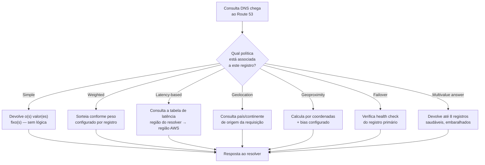
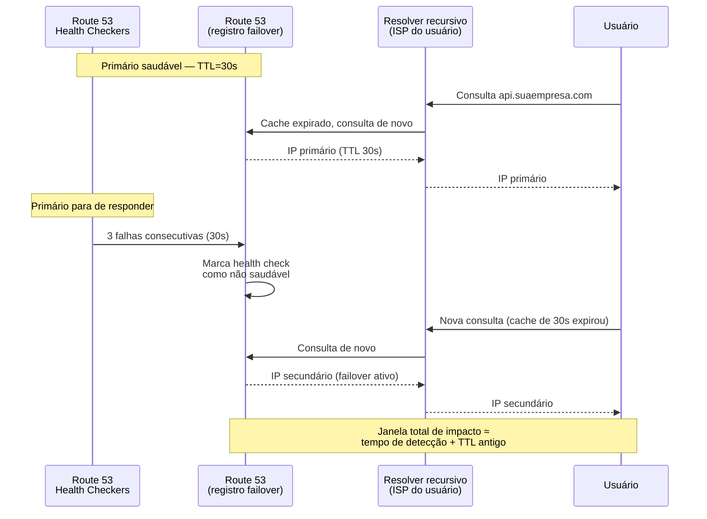

# Roteamento DNS avançado

> [!abstract] TL;DR
> Um mesmo nome pode resolver para IPs diferentes dependendo de quem pergunta e do estado do sistema — isso é o DNS agindo como o **primeiro balanceador de carga global**, muito antes de qualquer load balancer regional entrar em cena. O Route 53 expõe isso como **políticas de roteamento**: simples, ponderada (canary), por latência, geolocalização, geoproximidade, failover e resposta multivalor — cada uma resolvendo um problema de tráfego diferente. **Health checks** dão ao DNS os olhos para saber quando um destino parou de responder, e o **TTL** controla a velocidade com que essa mudança se propaga. A DigitalOcean, por escolha deliberada de simplicidade, não tem esse arsenal dentro do próprio serviço de DNS — round-robin com múltiplos registros A é o teto nativo; roteamento geográfico e por latência acontecem, quando existem, na camada de Load Balancers, não no DNS.

## O problema: um nome, vários lugares certos

Imagine `api.suaempresa.com` apontando para um servidor único, num único datacenter. Funciona — até o dia em que a empresa cresce, ganha usuários em três continentes, e alguém percebe que um usuário em Tóquio está fazendo uma requisição que atravessa o Pacífico, cruza os Estados Unidos e chega à Virgínia antes de voltar. A latência dessa viagem de ida e volta não é um bug de código — é geografia. Nenhuma otimização de query, nenhum cache de aplicação resolve o fato físico de que luz leva tempo para percorrer 11 mil quilômetros de cabo submarino.

A resposta óbvia é replicar a aplicação: um servidor em Tóquio, outro na Virgínia, outro em Frankfurt. Mas replicar servidores não resolve nada sozinho — ainda existe *um* nome, `api.suaempresa.com`, e alguém precisa decidir, a cada consulta, **qual dos três IPs devolver**. Essa decisão pode acontecer em vários lugares da pilha, mas ela pode — e frequentemente deve — acontecer no lugar mais cedo possível: na própria resolução do nome, antes de qualquer pacote de dados sair da máquina do cliente.

É essa virada de chave que esta nota explora: o DNS deixando de ser uma agenda telefônica estática (um nome, um número, sempre a mesma resposta) e passando a ser uma camada de decisão de tráfego — o roteador que atua *antes* do roteador. A nota anterior desta trilha cobriu o que é um registro DNS e como a resolução funciona; esta assume esse alicerce e foca no que acontece quando um mesmo nome tem múltiplas respostas possíveis e alguém — o serviço de DNS — precisa escolher qual delas devolver, e para quem.

> [!question] Isso não é a mesma coisa que um load balancer?
> Não exatamente, e a diferença importa. Um load balancer distribui tráfego **depois** que uma conexão já sabe para qual IP ir — ele existe atrás de um IP fixo, geralmente numa única região ou num pequeno conjunto delas. O DNS, quando faz roteamento avançado, decide **qual IP o cliente nem vai tentar em primeiro lugar** — ele atua antes de qualquer pacote de aplicação existir, e pode escolher entre resources espalhados pelo planeta inteiro, não só entre servidores atrás de um mesmo balanceador. São camadas complementares: o DNS decide a *região*; o load balancer, dentro daquela região, decide a *instância*.

> [!info] Fronteira
> Balanceamento de carga como conceito — algoritmos, camada 4 vs camada 7, afinidade de sessão — é assunto de [[03-Dominios/Engenharia/Arquitetura/index|System Design]], não desta nota. O balanceamento **regional** gerenciado pela AWS (ELB/ALB/NLB) já foi coberto no Galho 6 desta trilha, em [[03-Dominios/Tecnologia/Cloud/06 - Compute II — elasticidade e balanceamento/index|Compute II]]. Esta nota trata do balanceamento **global**, uma camada acima: a decisão de para qual região mandar o tráfego, tomada no próprio DNS, antes de qualquer load balancer regional entrar em ação.

## As políticas de roteamento do Route 53, uma a uma

O Route 53 associa uma **política de roteamento** a cada conjunto de registros que você cria — não ao domínio inteiro, mas a um grupo específico de registros com o mesmo nome e tipo. É essa granularidade que permite, por exemplo, que `api.suaempresa.com` use failover enquanto `www.suaempresa.com` usa latência, dentro da mesma zona hospedada.



**Simple routing** é o caso degenerado — um único registro, ou vários registros sem lógica de seleção nenhuma associada (o resolver do cliente escolhe entre eles, não o Route 53). É o que qualquer provedor de DNS oferece por padrão, e é o suficiente quando existe apenas um destino real por trás do nome. Não há o que otimizar aqui — é a política que você usa até ter um motivo concreto para usar outra.

**Weighted routing** associa um **peso relativo** a cada registro do grupo, e o Route 53 distribui tráfego proporcionalmente: a fração de tráfego que um registro recebe é `peso do registro / soma de todos os pesos do grupo`. Pesos vão de 0 a 255. Se um registro tem peso 1 e outro peso 255, o primeiro recebe 1/256 do tráfego e o segundo 255/256 — e é justamente essa granularidade fina que torna essa política a ferramenta canônica para **canary release** e **blue-green deployment**: você sobe a nova versão com peso 1, observa métricas de erro por algumas horas, sobe para 10, depois 50, depois 255, e desliga a versão antiga zerando o peso dela. Um peso 0 significa "não envie tráfego para cá, mas mantenha o registro pronto" — útil para manter um destino de standby configurado sem recebê-lo ativamente.

```json
{
  "Comment": "Canary de 5% para a nova versão da API",
  "Changes": [
    {
      "Action": "UPSERT",
      "ResourceRecordSet": {
        "Name": "api.suaempresa.com",
        "Type": "A",
        "SetIdentifier": "v2-canary",
        "Weight": 13,
        "TTL": 60,
        "ResourceRecords": [{ "Value": "203.0.113.20" }]
      }
    },
    {
      "Action": "UPSERT",
      "ResourceRecordSet": {
        "Name": "api.suaempresa.com",
        "Type": "A",
        "SetIdentifier": "v1-estavel",
        "Weight": 243,
        "TTL": 60,
        "ResourceRecords": [{ "Value": "203.0.113.10" }]
      }
    }
  ]
}
```

**Latency-based routing** manda o tráfego para a região da AWS que oferece a **menor latência de rede** medida a partir de onde a consulta se origina — não a região geograficamente mais próxima, que nem sempre é a mesma coisa (rotas de internet não seguem linhas retas no mapa). A AWS mantém uma tabela de latências medidas entre localizações de rede e suas próprias regiões, e usa essa tabela para decidir. É a política certa quando o objetivo é puramente performance: minimizar o tempo de resposta percebido pelo usuário, sem nenhuma restrição sobre *onde* ele está.

**Geolocation routing**, em contraste, roteia por **quem** o usuário é, não por quão rápido ele chega. A decisão é baseada no país, continente ou (nos EUA) estado de onde a consulta parte, e serve a necessidades que não são de performance: exibir conteúdo em português para consultas vindas do Brasil, cumprir uma exigência regulatória de que dados de cidadãos europeus sejam servidos por infraestrutura na Europa, ou simplesmente bloquear uma região inteira do catálogo por licenciamento. Uma consulta latency-based nunca vai saber "responder diferente por país" — geolocation existe exatamente para isso.

```json
{
  "Name": "app.suaempresa.com",
  "Type": "A",
  "SetIdentifier": "regiao-brasil",
  "GeoLocation": { "CountryCode": "BR" },
  "TTL": 300,
  "ResourceRecords": [{ "Value": "198.51.100.30" }]
}
```

O registro acima só é devolvido para consultas cuja origem a AWS resolve como Brasil; para todo o resto do planeta, é preciso um registro adicional com `"GeoLocation": {"CountryCode": "*"}` — o **default** explícito. Sem esse default, uma consulta vinda de um país sem registro específico simplesmente não recebe resposta nenhuma, o que é uma armadilha comum de quem configura geolocation pela primeira vez.

**Geoproximity routing** é a política mais sofisticada do grupo: roteia por localização geográfica do **recurso** (não do usuário) e, opcionalmente, permite **deslocar tráfego** de uma região para outra usando um parâmetro chamado **bias**. Um bias positivo em uma região expande seu "raio" de captura de tráfego; um bias negativo o encolhe. É a ferramenta certa para migrações graduais de carga entre regiões — "quero que a Virgínia absorva mais tráfego que geograficamente pertenceria a Ohio, sem desligar Ohio de uma vez" — algo que weighted routing não consegue expressar, porque weighted não entende geografia, só proporção cega. Geoproximity exige usar **Route 53 Traffic Flow** (o editor visual de políticas de tráfego) quando envolve recursos fora da AWS.

```bash
# Exemplo conceitual: deslocando tráfego de us-west-2 para us-east-1
# aumentando o bias da região que deve "puxar" mais tráfego.
aws route53 create-traffic-policy \
  --name "geoproximity-leste-vs-oeste" \
  --document file://traffic-policy-geoproximity.json
# No documento, cada endpoint carrega algo equivalente a:
#   { "region": "us-east-1", "bias": "20" }   -> expande o raio
#   { "region": "us-west-2", "bias": "-10" }  -> encolhe o raio
```

**Failover routing** implementa o padrão **ativo-passivo**: um registro primário e um secundário, com um **health check obrigatoriamente associado ao primário**. Enquanto o primário responde saudável, todo o tráfego vai para ele; no instante em que o health check marca o primário como não saudável, o Route 53 passa a devolver o registro secundário. Sem health check associado, a política de failover simplesmente não tem como saber quando trocar — o registro primário é tratado como sempre saudável, o que anula o propósito inteiro da política.

**Multivalue answer routing** devolve **até oito registros saudáveis**, escolhidos aleatoriamente a cada consulta, quando existem mais de oito associados ao nome. Não é um substituto para um load balancer de verdade — não há lógica de peso, afinidade ou proporção — mas é uma forma barata de dar alguma distribuição de carga e alguma tolerância a falha (registros não saudáveis são excluídos da resposta) sem contratar um load balancer dedicado. Pense nela como "simple routing com verificação de saúde e uma pitada de embaralhamento", não como uma política de tráfego sofisticada.

> [!info] Política adicional recente
> A AWS também documenta uma **IP-based routing policy**, que roteia com base no endereço IP de origem do cliente mapeado para blocos CIDR definidos por você — útil quando você já sabe, por acordo de rede (peering, ISP específico), qual origem deve ir para qual destino, sem depender da tabela de latência da AWS. Verificado em 2026-07-23 via documentação oficial; é a política menos citada das sete "clássicas" e vale nomear para não passar despercebida numa entrevista.

| Política | Decide por | Caso de uso típico | Precisa de health check? |
|---|---|---|---|
| Simple | — (sem lógica) | Um único destino real | Não |
| Weighted | Peso relativo (0–255) configurado | Canary release, blue-green, teste A/B de infraestrutura | Opcional, mas recomendado |
| Latency-based | Menor latência de rede medida | Performance pura, usuário global sem restrição regulatória | Opcional, mas recomendado |
| Geolocation | País/continente/estado de origem | Compliance, idioma, licenciamento de conteúdo por região | Opcional |
| Geoproximity | Localização do recurso + bias | Deslocar tráfego gradualmente entre regiões | Opcional |
| Failover | Health check do registro primário | Disaster recovery ativo-passivo | **Obrigatório** no primário |
| Multivalue answer | Aleatório entre até 8 registros saudáveis | Distribuição leve + tolerância a falha sem LB dedicado | Recomendado |
| IP-based | Bloco CIDR de origem mapeado manualmente | Acordos de rede/peering conhecidos de antemão | Opcional |

## Health checks: os olhos do DNS

Nenhuma política reage a uma falha se não existir algo observando o destino continuamente. É essa a função do **health check** do Route 53: um agente distribuído, com verificadores em múltiplas localizações ao redor do mundo, que envia requisições periódicas a um endpoint e decide, de forma agregada, se ele está saudável.

Três protocolos são suportados para health checks que monitoram um endpoint diretamente:

- **HTTP/HTTPS** — o verificador precisa estabelecer conexão TCP em até 4 segundos, e o endpoint precisa responder com um status HTTP 2xx ou 3xx em até 2 segundos após a conexão. Importante: **HTTPS não valida o certificado TLS** — um certificado expirado não derruba o health check por si só.
- **HTTP/HTTPS com correspondência de string** — igual ao anterior, mas o corpo da resposta precisa conter uma string específica nos primeiros 5.120 bytes. Útil para diferenciar "o servidor respondeu 200" de "o servidor respondeu 200 mas com uma página de erro genérica".
- **TCP** — só verifica se é possível abrir a conexão TCP em até 10 segundos, sem interpretar nada da camada de aplicação. É o check mais barato e o mais cego.

Um endpoint não é declarado "saudável" ou "não saudável" com base em um único verificador — a AWS usa dezenas de localizações de checagem espalhadas pelo mundo, e a regra de agregação é: **se mais de 18% dos verificadores reportam o endpoint saudável, ele é considerado saudável; 18% ou menos, e é considerado não saudável.** Esse limiar deliberadamente baixo existe para evitar que uma partição de rede isolando o endpoint de *algumas* regiões do planeta — sem afetar o serviço de verdade — dispare um failover desnecessário.

```json
{
  "Type": "HTTPS",
  "ResourcePath": "/health",
  "FullyQualifiedDomainName": "api.suaempresa.com",
  "Port": 443,
  "RequestInterval": 10,
  "FailureThreshold": 3,
  "SearchString": "\"status\":\"ok\""
}
```

```bash
aws route53 create-health-check \
  --caller-reference "hc-api-primaria-$(date +%s)" \
  --health-check-config \
  Type=HTTPS,ResourcePath=/health,FullyQualifiedDomainName=api.suaempresa.com,Port=443,RequestInterval=10,FailureThreshold=3,SearchString='"status":"ok"'
```

O `RequestInterval` aceita dois valores: **30 segundos** (o padrão, mais barato) ou **10 segundos** (checagem "rápida", com custo adicional). O `FailureThreshold` — quantas checagens consecutivas com falha são necessárias antes de marcar o endpoint como não saudável — é configurável, e é justamente a combinação desses dois parâmetros com o TTL do registro que determina **quanto tempo, no pior caso, um usuário continua sendo mandado para um destino morto** depois que ele efetivamente caiu.

### Por que o TTL importa tanto no failover

Um health check detectando a falha rapidamente não adianta nada se o mundo inteiro ainda tem a resposta antiga guardada em cache por uma hora. O **TTL** (time to live) de um registro diz a resolvers recursivos — os servidores DNS intermediários que ficam entre o cliente final e a AWS — por quanto tempo eles podem reutilizar uma resposta sem consultar o Route 53 de novo. Um TTL de 3600 segundos (1 hora), perfeitamente razoável para um registro estável, vira um desastre em um registro de failover: mesmo que o Route 53 detecte a falha em 30 segundos e já esteja pronto para devolver o IP secundário, qualquer resolver que tenha cacheado a resposta antiga vai continuar entregando o IP morto aos usuários por até uma hora inteira.

Por isso, **registros de failover usam TTL baixo — tipicamente entre 30 e 60 segundos.** O trade-off é direto: TTL baixo significa mais consultas chegando ao Route 53 (mais custo, mais carga), mas significa também que a janela entre "o Route 53 sabe que o primário caiu" e "o mundo inteiro para de mandar tráfego para ele" fica próxima do tempo real de detecção do health check, em vez de ficar refém do TTL antigo de um registro que nunca foi pensado para mudar rápido.



> [!tip] Assista: Route 53 Routing Policies Explained: Simple, Weighted, Latency & Failover
> **Canal:** AWS Networking | **Duração:** ~6min | **Idioma:** EN
>
> Um resumo rápido e direto das quatro políticas — útil para fixar a diferença de propósito entre elas antes de decidir qual usar em cada cenário desta nota. Trecho de destaque [04:07]: *"Failover routing policy is designed for high availability and disaster recovery scenarios. It creates an active passive setup where you designate one resource as primary and another as secondary."*
>
> 🎬 [Assistir no YouTube](https://www.youtube.com/watch?v=jXgIRPjXv3Y)

## DR e alta disponibilidade via DNS

O padrão **ativo-passivo** que a política de failover implementa é, na prática, a forma mais simples e mais amplamente usada de disaster recovery multi-region no nível de DNS: uma região primária absorve 100% do tráfego em operação normal; uma região secundária — muitas vezes menor, mais barata, às vezes até um site estático simples anunciando manutenção — fica pronta, com dados replicados o suficiente para assumir, e só recebe tráfego quando o health check derruba o primário. É o mesmo mecanismo desta nota, só que aplicado à escala de "região inteira" em vez de "um servidor".

Vale notar que failover e weighted não são mutuamente exclusivos dentro de uma arquitetura maior: é comum combinar failover **entre regiões** (ativo-passivo, para DR) com weighted **dentro de** uma região (canary de versão de aplicação), usando o Route 53 Traffic Flow para compor políticas aninhadas — um registro de política aponta para outro registro de política, formando uma árvore de decisão. Essa composição foge do escopo desta nota introdutória, mas vale saber que ela existe: as sete políticas descritas acima não são mutuamente exclusivas nem esgotam o design possível — são os blocos básicos que se combinam para formar arquiteturas de tráfego mais elaboradas.

Configurar o par ativo-passivo pela CLI exige criar dois registros com o mesmo nome, o mesmo `SetIdentifier` diferenciando-os, e o campo `Failover` marcando qual é qual:

```json
{
  "Comment": "Failover ativo-passivo entre us-east-1 e sa-east-1",
  "Changes": [
    {
      "Action": "UPSERT",
      "ResourceRecordSet": {
        "Name": "app.suaempresa.com",
        "Type": "A",
        "SetIdentifier": "primario-us-east-1",
        "Failover": "PRIMARY",
        "TTL": 30,
        "HealthCheckId": "a1b2c3d4-5678-90ab-cdef-example00001",
        "ResourceRecords": [{ "Value": "203.0.113.10" }]
      }
    },
    {
      "Action": "UPSERT",
      "ResourceRecordSet": {
        "Name": "app.suaempresa.com",
        "Type": "A",
        "SetIdentifier": "secundario-sa-east-1",
        "Failover": "SECONDARY",
        "TTL": 30,
        "ResourceRecords": [{ "Value": "203.0.113.99" }]
      }
    }
  ]
}
```

## Casos práticos

### Cenário 1: canary de uma API financeira

Um time precisa validar uma reescrita do serviço de cálculo de juros antes de expor a versão nova a 100% dos clientes — um erro de arredondamento nesse serviço tem custo financeiro real, não é só um bug cosmético. A equipe cria dois registros `A` para `juros.suaempresa.com` sob **weighted routing**: peso 5 para a versão nova, peso 251 para a estável (aproximadamente 2% de tráfego real). Ambos os registros carregam um health check HTTP contra `/health`. Por três dias, a equipe observa a taxa de erro e a latência p99 da fatia de 2%; só então sobe o peso gradualmente — 25/231, depois 128/128, depois 251/5 — até desligar a versão antiga por completo, zerando seu peso. Em nenhum momento existiu uma janela de "tudo ou nada": o risco foi fatiado no próprio DNS, sem exigir nenhuma lógica de roteamento dentro da aplicação.

### Cenário 2: disaster recovery para um e-commerce sazonal

Uma loja online concentra 40% da receita anual na Black Friday, e a equipe de infraestrutura decide que um outage da região primária durante esse período é inaceitável. A arquitetura usa **failover routing**: a região primária (us-east-1) roda o cluster de produção completo; uma região secundária (sa-east-1, mais perto da base de clientes no Brasil) mantém uma réplica read-only do banco e uma versão estática de "loja em manutenção, catálogo consultável" servida por um bucket de armazenamento de objetos. Um health check HTTPS com correspondência de string (buscando `"status":"healthy"` na resposta de `/health`) monitora o load balancer da região primária a cada 10 segundos, com `FailureThreshold` de 2. O TTL do registro é 30 segundos. No pior caso documentado — uma falha de rede que isolou parte da região primária por 6 minutos durante um teste de carga — o tráfego começou a migrar para a secundária em menos de 40 segundos após o início da falha real, e a equipe considerou o resultado dentro da meta de RTO que haviam definido.

## Lente dupla: Route 53 e a simplicidade deliberada da DigitalOcean

Aqui vale ser direto, porque a distância entre as duas plataformas é real e não é um detalhe menor. O **DNS da DigitalOcean**, isoladamente, suporta os tipos de registro usuais (A, AAAA, CNAME, MX, TXT, SRV, NS, CAA, entre outros) e uma única forma de distribuição: **round-robin** — criar múltiplos registros A para o mesmo nome, e deixar o resolver do cliente escolher entre eles, sem que a DigitalOcean aplique nenhuma lógica de peso, latência ou geografia na resposta. Não existe, no serviço de DNS da DigitalOcean, um equivalente a weighted, latency-based, geolocation, geoproximity ou failover routing do Route 53. Um registro SRV até carrega um campo de "weight", mas ele resolve prioridade entre servidores de um mesmo serviço (o protocolo SRV, não uma política de tráfego geral) — não é comparável ao weighted routing do Route 53.

O que a DigitalOcean tem, e que preenche parte dessa lacuna **fora do DNS**, é o produto de **Load Balancers**. Os Load Balancers regionais distribuem tráfego dentro de uma região; e, mais recentemente, a DigitalOcean passou a oferecer **Global Load Balancers**, que roteiam para a região mais próxima disponível por padrão e fazem failover automático para a região saudável mais próxima quando health checks configurados detectam problema numa região — uma capacidade que se aproxima, em efeito prático, do failover routing do Route 53, mas implementada na camada de balanceamento, não como uma política do serviço de DNS.

O round-robin nativo do DNS da DigitalOcean é literalmente isso — múltiplos registros `A` com o mesmo nome, criados um a um, sem nenhum parâmetro de peso ou prioridade:

```bash
# DigitalOcean — três registros A idênticos em nome; o resolver do
# cliente escolhe entre eles sem nenhuma lógica adicional da DO
doctl compute domain records create suaempresa.com \
  --record-type A --record-name app --record-data 203.0.113.10 --record-ttl 300

doctl compute domain records create suaempresa.com \
  --record-type A --record-name app --record-data 203.0.113.11 --record-ttl 300

doctl compute domain records create suaempresa.com \
  --record-type A --record-name app --record-data 203.0.113.12 --record-ttl 300
```

Repare no que falta aí: nenhum campo de peso, nenhum health check anexado ao registro, nenhuma noção de "primário" ou "secundário". Se `203.0.113.10` cair, a DigitalOcean continua devolvendo os três IPs — inclusive o morto — até alguém, manualmente ou por automação externa, remover o registro. É exatamente a lacuna que o Global Load Balancer, quando adotado, resolve numa camada acima do DNS.

```bash
# AWS — política de roteamento é uma propriedade do próprio registro DNS
aws route53 change-resource-record-sets \
  --hosted-zone-id Z0123456789ABC \
  --change-batch file://weighted-canary.json

# DigitalOcean — o DNS só sabe round-robin; roteamento avançado
# vive no Load Balancer, um recurso separado do domínio
doctl compute load-balancer create \
  --name lb-global-api \
  --region nyc1 \
  --forwarding-rules entry_protocol:https,entry_port:443,target_protocol:http,target_port:80
```

> [!info] Caducidade
> Capacidades da DigitalOcean verificadas em 2026-07-23 via `docs.digitalocean.com`. Global Load Balancers são um lançamento relativamente recente na plataforma (GA reportada em 2024–2025 na documentação consultada) e a mecânica exata de roteamento entre regiões (se baseada em anycast, DNS interno gerenciado pela própria DO, ou outra técnica) não é detalhada publicamente na documentação consultada — só o comportamento observável (roteia para a região mais próxima saudável) é documentado. Confirme o estado atual antes de decidir uma arquitetura em cima disso.

Isso não é a DigitalOcean sendo "pior" de forma genérica — é a mesma filosofia de simplicidade que já apareceu em outras notas desta trilha: menos superfície, menos coisa para configurar errado, ao custo de menos controle fino. Para quem projeta uma arquitetura que depende de roteamento geográfico preciso ou de canary granular por peso numérico exato, é a AWS — ou um provedor com um conjunto de políticas de DNS equivalente — que oferece a ferramenta nativa. Saber nomear com precisão **onde** cada nuvem resolve esse problema (no DNS, na camada de load balancer, ou não resolve) é vocabulário de arquitetura sênior.

| Conceito | AWS (Route 53) | Azure (Traffic Manager) | GCP (Cloud DNS) | DigitalOcean |
|---|---|---|---|---|
| Roteamento por peso | Weighted routing (0–255) | Weighted routing method | Cloud DNS routing policy: WRR (weighted round robin) | Round-robin simples via múltiplos A (sem peso) |
| Roteamento por latência | Latency-based routing | Performance routing method | Cloud DNS routing policy: geo (por proximidade de rede) | — (sem equivalente no DNS) |
| Roteamento geográfico | Geolocation / Geoproximity | Geographic routing method | Cloud DNS routing policy: geo | — (só via Global Load Balancer, não DNS) |
| Failover ativo-passivo | Failover routing + health check | Priority routing method | Cloud DNS + health check externo | Global Load Balancer (camada separada do DNS) |
| Health checks nativos ao DNS | Sim, integrados às políticas | Sim, endpoint monitoring | Sim, health checks do Cloud DNS | Não no DNS; sim no Load Balancer |

## Armadilhas comuns

> [!warning] TTL alto num registro que pode precisar de failover
> É comum deixar o TTL padrão (às vezes horas) num registro que, mais tarde, alguém decide usar para failover — sem lembrar de baixá-lo antes. O resultado é um health check funcionando perfeitamente, detectando a queda em segundos, e um failover que na prática demora o TTL antigo inteiro para se propagar, porque resolvers ao redor do mundo ainda estão com a resposta velha em cache. Baixe o TTL para 30–60 segundos **antes** de colocar um registro em produção sob uma política de failover — não depois do primeiro incidente.

> [!warning] Failover sem health check associado ao primário
> A política de failover só funciona porque existe um sinal automático de "o primário parou de responder". Sem um health check associado ao registro primário, o Route 53 não tem como saber quando trocar — o secundário nunca entra em cena, mesmo com o primário completamente fora do ar, e a arquitetura de DR existe só no papel.

> [!warning] Confundir latência de rede com proximidade geográfica
> Latency-based routing manda tráfego para a região com **menor latência medida**, não para a região **fisicamente mais próxima**. As duas coincidem na maioria dos casos, mas rotas de internet nem sempre seguem geografia — um usuário em uma ilha do Pacífico pode ter menor latência até uma região que passa por um cabo submarino direto do que até uma região "mais perto no mapa" sem boa conectividade. Escolher geolocation quando o objetivo real é performance (ou vice-versa) produz um sistema que parece certo no design e decepciona na medição real.

> [!warning] Esperar do DNS da DigitalOcean o que só o Route 53 (ou um Load Balancer dedicado) oferece
> Times migrando de AWS para DigitalOcean às vezes tentam replicar uma arquitetura de weighted/latency routing diretamente no DNS da DigitalOcean e descobrem, tarde, que a peça simplesmente não existe ali. Se o requisito é roteamento avançado, o caminho correto na DigitalOcean é avaliar Load Balancers regionais ou Global desde o desenho inicial — não tentar forçar o DNS a fazer um trabalho para o qual ele não foi construído.

## O que vem a seguir

O DNS decide *para onde* uma requisição vai antes dela existir de fato — mas, uma vez que ela chega, ainda precisa percorrer a distância física até o servidor, buscar o conteúdo, e voltar. Roteamento inteligente reduz essa distância escolhendo o destino certo; o próximo passo é reduzir a distância em si, colocando cópias do conteúdo fisicamente mais perto de quem pede — o trabalho de uma **CDN** e do cache na borda da rede.

## Fontes

- [AWS Route 53 — Choosing a routing policy](https://docs.aws.amazon.com/Route53/latest/DeveloperGuide/routing-policy.html) — lista oficial das oito políticas (incluindo IP-based); acessado em 2026-07-23.
- [AWS Route 53 — Weighted routing](https://docs.aws.amazon.com/Route53/latest/DeveloperGuide/routing-policy-weighted.html) — fórmula de proporção de peso, faixa 0–255, comportamento com peso zero e health checks; acessado em 2026-07-23.
- [AWS Route 53 — Failover routing](https://docs.aws.amazon.com/Route53/latest/DeveloperGuide/routing-policy-failover.html) — registros primário/secundário, padrão ativo-passivo; acessado em 2026-07-23.
- [AWS Route 53 — Creating health checks (DNS failover)](https://docs.aws.amazon.com/Route53/latest/DeveloperGuide/dns-failover.html) — visão geral de health checks e configuração de failover; acessado em 2026-07-23.
- [AWS Route 53 — How Route 53 determines whether a health check is healthy](https://docs.aws.amazon.com/Route53/latest/DeveloperGuide/dns-failover-determining-health-of-endpoints.html) — protocolos HTTP/HTTPS/TCP, limiar de 18% de verificadores, tempos de resposta exigidos; acessado em 2026-07-23.
- [DigitalOcean — DNS Quickstart](https://docs.digitalocean.com/products/networking/dns/) — visão geral do produto de DNS da DigitalOcean; acessado em 2026-07-23.
- [DigitalOcean — How to Manage DNS Records](https://docs.digitalocean.com/products/networking/dns/how-to/manage-records/) — tipos de registro suportados, round-robin via múltiplos A, comportamento de peso em SRV; acessado em 2026-07-23.
- [DigitalOcean — Load Balancers product overview](https://docs.digitalocean.com/products/networking/load-balancers/) — Load Balancers regionais (Application/Network/Internal) e existência de Global Load Balancers; acessado em 2026-07-23.
- [DigitalOcean — How to Create and Manage Global Load Balancers](https://docs.digitalocean.com/products/networking/load-balancers/how-to/manage-global-load-balancers/) — roteamento para a região mais próxima saudável, failover automático entre regiões, configuração de health checks; acessado em 2026-07-23.
