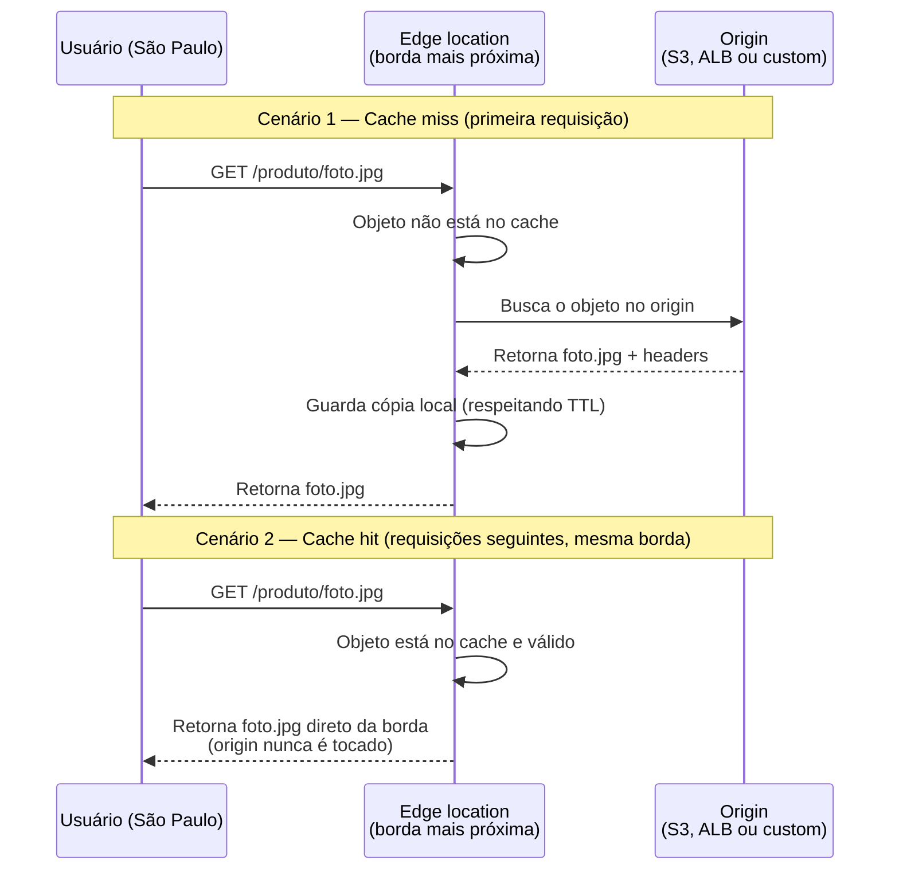
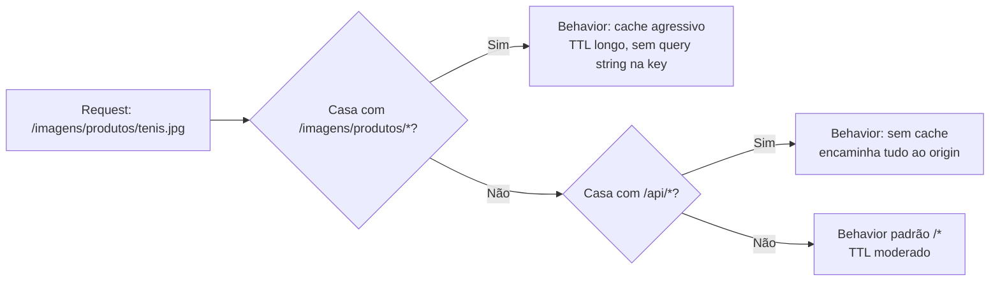
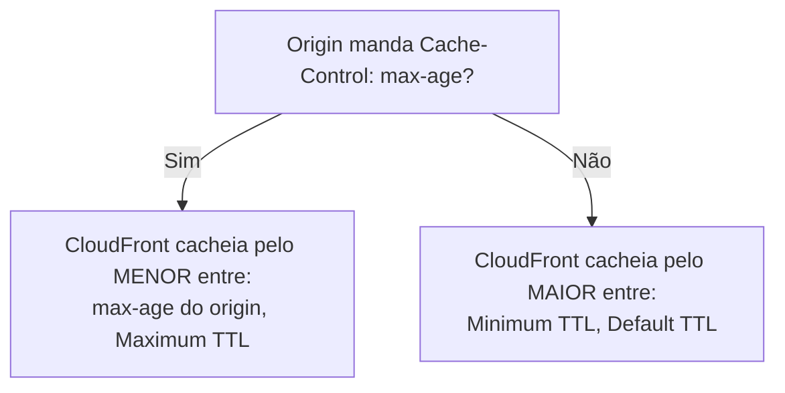
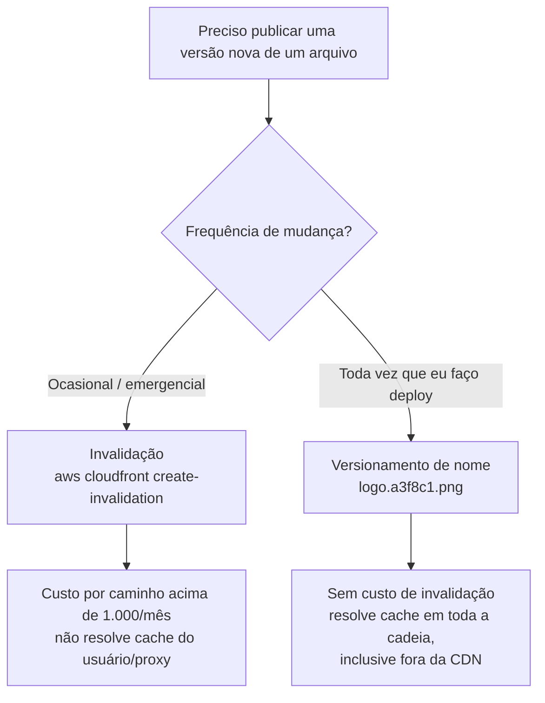

# CDN e cache de borda

> [!abstract] TL;DR
> Uma CDN aproxima o conteúdo do usuário, guardando cópias em pontos de presença espalhados pelo mundo — a Amazon chama isso de **edge locations**. Na AWS, essa encarnação gerenciada se chama **CloudFront**: você aponta uma **distribution** para um **origin** (S3, um load balancer, um servidor custom), define **cache behaviors** por padrão de caminho, e a borda passa a responder direto no **cache hit**, sem tocar o origin. TTL (mínimo/máximo/padrão) e **cache keys** (quais partes do request — query string, header, cookie — entram na identidade do objeto cacheado) controlam o que fica na borda e por quanto tempo. Invalidar um objeto manualmente é caro e lento; o padrão de produção é versionar o nome do arquivo. **OAC** (Origin Access Control) tranca o bucket S3 para que só a CloudFront o alcance — o origin nunca fica exposto direto ao público. A DigitalOcean tem uma CDN, mas ela não é um produto à parte: vem embutida no Spaces, o object storage da empresa — sem cache behaviors por caminho, sem múltiplos tipos de origin, sem OAC equivalente.

## O problema: a luz também tem limite de velocidade

Um usuário em São Paulo pede uma imagem hospedada num servidor em `us-east-1`, na Virgínia. Por mais rápida que seja a infraestrutura da AWS, aquele request precisa fazer uma viagem física: sair do computador do usuário, atravessar roteadores, cabos submarinos, mais roteadores, chegar ao servidor, e voltar pelo mesmo caminho com a resposta. Nenhuma otimização de código, nenhum servidor mais potente, encurta essa distância — porque o limite ali não é de processamento, é de física. A luz em fibra óptica viaja a cerca de dois terços da velocidade da luz no vácuo, e ida-e-volta São Paulo–Virgínia soma uma distância que nenhuma engenharia de software resolve sozinha.

> [!question] Se o servidor já é rápido, por que a latência importa tanto?
> Porque "rápido" processando a resposta não é o mesmo que "rápido" entregando ela. Um servidor pode montar uma página em 5 milissegundos e ainda assim o usuário esperar 300 milissegundos — porque é isso que o sinal gasta só para ir e voltar pela distância física entre os dois pontos. Em e-commerce, cada 100ms extras de latência já foi medido reduzindo conversão de forma mensurável; a distância física, sozinha, já é orçamento de UX que se perde antes de qualquer linha de código rodar.

A solução não é fazer a luz viajar mais rápido — é diminuir a distância que ela precisa viajar. Se uma cópia daquela imagem já estiver guardada num data center em São Paulo, o usuário nunca precisa esperar pela viagem até a Virgínia. É esse o problema que uma **rede de distribuição de conteúdo** resolve: multiplicar o conteúdo geograficamente, para que a resposta venha do ponto mais próximo do pedido.

> [!info] Fronteira — o conceito abstrato vive em System Design
> O que é uma CDN, por que ela existe, e a teoria de cache distribuído (invalidação como problema clássico de ciência da computação, estratégias de propagação, consistência eventual entre nós de borda) é conteúdo de arquitetura de sistemas — coberto em [[03-Dominios/Engenharia/Arquitetura/index|System Design]]. Esta nota não repete essa teoria: ela mostra a **encarnação gerenciada** — como a AWS e a DigitalOcean implementam esse conceito como serviço — e a mecânica concreta de configurar, cachear e invalidar na prática.

## Anatomia de uma CDN gerenciada: distribution, origin, edge

Na AWS, o serviço que resolve esse problema é o **CloudFront**. A documentação oficial é direta sobre o mecanismo: CloudFront entrega conteúdo através de uma rede mundial de data centers chamados **edge locations** — também chamados de **pontos de presença (PoPs)**. Quando um usuário pede um arquivo, o pedido é roteado para o edge location de menor latência para aquele usuário específico.

Três peças compõem essa anatomia:

- **Origin** — de onde vem a versão definitiva do conteúdo. Pode ser um bucket S3, um Application Load Balancer na frente de servidores EC2, ou qualquer servidor HTTP que você mesmo administra (a documentação chama esse último caso de **custom origin**).
- **Distribution** — o recurso que você cria na CloudFront para amarrar um origin a um conjunto de regras de entrega. Toda distribution recebe um domínio próprio (algo como `d111111abcdef8.cloudfront.net`), que você pode trocar por um domínio customizado.
- **Edge location** — onde a cópia efetivamente fica guardada, perto do usuário. A CloudFront propaga a *configuração* da distribution para todos os edge locations — não o conteúdo em si, que só chega lá quando alguém de fato pede.

O ponto que costuma confundir quem vem de cache local (Redis, cache em memória de uma aplicação) é este: uma CDN não empurra o conteúdo para a borda antes de alguém pedir. Ela reage. A primeira pessoa que pede um arquivo num edge location específico paga o custo da viagem até o origin — todas as pessoas seguintes, naquele mesmo edge location, recebem a cópia que ficou guardada lá.



Resumo em uma frase: uma CDN gerenciada é um conjunto de caches distribuídos geograficamente, que reagem à demanda real de cada região — e o trabalho de configurá-la é decidir *o quê* fica cacheado, *por quanto tempo*, e *o que identifica* uma cópia como válida para um pedido específico.

## Cache behaviors: regras por caminho

Uma distribution raramente serve um único tipo de conteúdo do mesmo jeito. Um site típico mistura imagens que não mudam por meses, um bundle de JavaScript versionado a cada deploy, e uma rota de API que devolve dados diferentes a cada segundo. Tratar tudo isso com a mesma regra de cache seria ou cachear demais (servindo dados velhos como se fossem atuais) ou cachear de menos (jogando fora o ganho de performance nos arquivos estáticos).

É para isso que existe o **cache behavior**: uma regra associada a um **path pattern** — um padrão de caminho como `/imagens/*`, `/api/*` ou `/*` (o comportamento padrão, que sempre existe). Cada behavior pode ter seu próprio origin, sua própria política de cache e seu próprio TTL. A CloudFront avalia os path patterns na ordem em que aparecem na distribution e usa o primeiro que casar com o caminho pedido — por isso os padrões mais específicos (`/imagens/produtos/*`) precisam vir antes dos mais genéricos (`/imagens/*`), senão o genérico captura tudo primeiro.



## TTL: quanto tempo um objeto vive na borda

O tempo que um objeto fica guardado num edge location antes de a CloudFront voltar a checar o origin é controlado por três valores, configuráveis na cache policy de cada behavior:

- **Minimum TTL** — o piso absoluto. Mesmo que o origin mande um `Cache-Control` pedindo cache zero, a CloudFront não vai abaixo desse valor se ele for maior que zero.
- **Maximum TTL** — o teto absoluto. Mesmo que o origin peça um `max-age` gigantesco, a CloudFront não guarda o objeto além desse valor.
- **Default TTL** — usado quando o origin não manda nenhuma instrução de cache. Se você não usa uma cache policy, esse valor padrão é 24 horas.

O detalhe que separa quem só copiou um tutorial de quem entende o mecanismo é como esses três valores interagem com os headers que o origin manda. A documentação oficial resume essa interação numa tabela: se o origin manda `Cache-Control: max-age`, a CloudFront cacheia pelo **menor** entre esse valor e o Maximum TTL; se o origin não manda nada, a CloudFront usa o Default TTL (ou o maior entre Minimum TTL e Default TTL, se o Minimum TTL for maior que zero). Ou seja: os três TTLs da distribution nunca são ignorados — eles agem como cerca em volta do que o origin pede.



Um caso prático comum: um bucket S3 servindo `logo.png` sem nenhum header de cache configurado. Sem cache policy customizada, a CloudFront usa o Default TTL de 24 horas — o arquivo fica na borda um dia inteiro antes de a CloudFront voltar a checar o S3, mesmo que ninguém tenha pedido para ele expirar.

> [!info] Caducidade
> Comportamento de TTL, cache behaviors e a tabela de interação `Cache-Control`/`Expires` verificados em `docs.aws.amazon.com` em 2026-07-23. A CloudFront também suporta `stale-while-revalidate` e `stale-if-error` (servir conteúdo velho enquanto revalida em segundo plano, ou durante uma falha do origin) — mencionado aqui por completude, sem aprofundar.

## Cache key: o que identifica um objeto cacheado

Cada objeto guardado na borda tem uma identidade — a **cache key** — e é essa identidade que decide se um request novo bate com um objeto já guardado (cache hit) ou precisa buscar de novo no origin (cache miss). Por padrão, uma CloudFront distribution usa só o **caminho da URL** como cache key. Isso significa que `/produto?cor=azul` e `/produto?cor=verde`, se você não configurar nada, são tratados como **o mesmo objeto** — a CloudFront ignora a query string por padrão.

Isso vira armadilha ou vantagem dependendo do caso, e é exatamente aí que a **cache policy** entra: ela permite incluir, explicitamente, quais **query strings**, quais **headers** e quais **cookies** entram na cache key. Cada elemento incluído multiplica o número de variações que a CloudFront precisa guardar separadamente para o mesmo caminho.

```json
{
  "CachePolicyConfig": {
    "Name": "cache-por-cor-do-produto",
    "DefaultTTL": 86400,
    "MaxTTL": 31536000,
    "MinTTL": 1,
    "ParametersInCacheKeyAndForwardedToOrigin": {
      "EnableAcceptEncodingGzip": true,
      "EnableAcceptEncodingBrotli": true,
      "QueryStringsConfig": {
        "QueryStringBehavior": "whitelist",
        "QueryStrings": { "Items": ["cor"], "Quantity": 1 }
      },
      "HeadersConfig": { "HeaderBehavior": "none" },
      "CookiesConfig": { "CookieBehavior": "none" }
    }
  }
}
```

A regra prática, direto da documentação oficial: **quanto menos valores entram na cache key, maior o cache hit ratio.** Incluir um header ou cookie que varia por usuário (um `Authorization`, um cookie de sessão) na cache key transforma, na prática, cada usuário num visitante único do ponto de vista do cache — cada request vira um cache miss, e a CDN perde a razão de existir para aquele conteúdo.

> [!question] Então por que alguém incluiria um cookie na cache key de propósito?
> Personalização real. Um site que serve conteúdo diferente por idioma via cookie `lang=pt-BR` precisa que esse cookie entre na cache key — senão a CloudFront serve a versão em inglês, cacheada primeiro, para todo mundo depois. A regra não é "nunca inclua nada além do caminho" — é "inclua só o que de fato muda a resposta", nem mais, nem menos.

## Invalidação: cara, lenta, e o motivo de existir versionamento

Depois de publicar um arquivo novo com o mesmo nome do antigo — trocar `logo.png` no S3 sem mudar o nome —, a borda pode continuar servindo a versão velha até o TTL expirar. A ferramenta óbvia para forçar a atualização imediata é a **invalidação**: pedir explicitamente à CloudFront para remover um objeto (ou um padrão de caminho) de todos os edge locations antes do prazo normal.

```bash
aws cloudfront create-invalidation \
  --distribution-id E1A2B3C4D5E6F7 \
  --paths "/logo.png" "/assets/css/*"
```

A documentação oficial é explícita sobre o custo dessa operação: os primeiros **1.000 caminhos de invalidação por mês são gratuitos**, e você paga por cada caminho além disso — o limite é somado entre todas as distributions da conta, não por distribution. Um caminho com wildcard, como `/imagens/*`, conta como **um único caminho**, mesmo que invalide milhares de arquivos de uma vez — mas isso não significa que invalidação seja barata em escala: um pipeline de deploy que roda várias vezes ao dia, invalidando dezenas de caminhos a cada vez, estoura os 1.000 gratuitos rápido.

O problema não é só custo — é também **consistência**. A própria documentação da AWS recomenda diretamente: para atualizar arquivos com frequência, prefira **versionamento de nome de arquivo** (cache busting) em vez de invalidação, por um motivo mais profundo que dinheiro. Se um usuário — ou um proxy corporativo no meio do caminho — já guardou uma cópia local do arquivo antigo, invalidar a CDN não afeta esse cache local: o usuário continua vendo a versão velha até o cache dele expirar por conta própria. Versionamento resolve isso de raiz, porque o **nome do arquivo muda** — `logo.png` vira `logo.a3f8c1.png` a cada build —, então não existe ambiguidade nenhuma entre versão velha e nova em nenhum nível de cache da cadeia.



> [!warning] Invalidar o site inteiro com `/*` a cada deploy
> É tentador, num pipeline de CI/CD apressado, rodar `aws cloudfront create-invalidation --paths "/*"` a cada deploy — "assim garanto que nada fica desatualizado". O problema: isso conta como um caminho de invalidação normal (então não estoura o limite sozinho), mas descarta **todo** o cache da distribution de uma vez, inclusive de arquivos que não mudaram. O próximo lote de usuários, depois desse `/*`, gera cache miss em massa e um pico de carga direto no origin — o efeito oposto do que uma CDN existe para evitar. Prefira invalidar só os caminhos que de fato mudaram, ou adote versionamento para os arquivos que mudam a cada deploy.

### Invalidação por tags e o tempo real de propagação

Existe uma terceira via, mais recente, além de invalidar por caminho exato ou por wildcard: **invalidação por cache tag**. Você anota objetos no origin com um header customizado (algo como `Cache-Tag: produto:1234`), e depois invalida todos os objetos que carregam aquela tag, num único pedido — útil quando um mesmo dado de origem (um produto que mudou de preço) aparece espalhado em dezenas de URLs diferentes (página do produto, página de categoria, resultado de busca), e você não quer — ou não consegue facilmente — enumerar cada caminho manualmente. A documentação da AWS é explícita: uma invalidação por tag conta como **um único caminho** para efeito de cobrança, exatamente como um wildcard, e soma para o mesmo limite de 1.000 gratuitos por mês — misturar invalidações por caminho e por tag no mesmo mês não dá dois orçamentos separados, dá um só.

Vale nomear também que nem invalidação nem TTL curto são instantâneos na prática: pedir uma invalidação, ou reduzir o Maximum TTL de uma cache policy, dispara uma propagação da nova configuração para *todos* os edge locations da distribution — centenas deles, espalhados pelo planeta —, e isso leva tempo (tipicamente minutos, não segundos). Um engenheiro que espera efeito imediato ao rodar `create-invalidation` e testa a página um segundo depois, batendo por acaso num edge location que ainda não recebeu a invalidação, tende a concluir erroneamente que "não funcionou" — quando na verdade só ainda não terminou de propagar.

> [!tip] Assista: Amazon CloudFront Caching Explained | TTL, Cache Control, Invalidation
> **Canal:** SAA-C03 Module 7.7 | **Duração:** ~37min | **Idioma:** EN
>
> Cobre cache behaviors, os três níveis de TTL (min/max/default) e invalidação com o mesmo nível de detalhe desta nota, mas em vídeo — bom para quem prefere ver o console e as regras sendo montadas passo a passo. Trecho de destaque [19:37]: *"cache invalidation is the process of manually telling CloudFront to remove specific cache[d] object[s] from all edge locations before their TTL expires"*
>
> 🎬 [Assistir no YouTube](https://www.youtube.com/watch?v=bokPShSe8sw)

## Origin protection: OAC — o origin nunca fica exposto

Um erro comum de quem configura CloudFront pela primeira vez com S3 como origin é deixar o bucket público — afinal, "é assim que o site funciona, certo?" Errado: o padrão correto é o oposto. O bucket fica **totalmente privado**, e só a CloudFront tem permissão de lê-lo. Ninguém consegue acessar `meu-bucket.s3.amazonaws.com/logo.png` direto — só `minhadistribution.cloudfront.net/logo.png` funciona.

O mecanismo que garante isso se chama **Origin Access Control (OAC)**. A documentação oficial recomenda OAC como substituto do mecanismo mais antigo, **Origin Access Identity (OAI)** — que a AWS já classifica como legado, sem suportar buckets em todas as regiões, sem suportar SSE-KMS, e sem suportar requisições `PUT`/`DELETE` dinâmicas. A troca funciona assim: você cria um OAC na CloudFront, associa ele ao origin S3 da distribution, e ajusta a bucket policy do S3 para só aceitar requisições vindas do *service principal* `cloudfront.amazonaws.com`, restrito ainda mais por uma condição que amarra o acesso a uma distribution específica.

```json
{
  "Version": "2012-10-17",
  "Statement": [
    {
      "Sid": "AllowCloudFrontServicePrincipalReadOnly",
      "Effect": "Allow",
      "Principal": { "Service": "cloudfront.amazonaws.com" },
      "Action": "s3:GetObject",
      "Resource": "arn:aws:s3:::meu-bucket-privado/*",
      "Condition": {
        "StringEquals": {
          "AWS:SourceArn": "arn:aws:cloudfront::123456789012:distribution/E1A2B3C4D5E6F7"
        }
      }
    }
  ]
}
```

Repare na peça central dessa política: o `Principal` não é uma pessoa nem uma conta — é o próprio serviço CloudFront, e a condição `AWS:SourceArn` garante que só *aquela distribution específica* pode usar essa permissão, não qualquer distribution da conta. Criar o OAC pela CLI é um passo separado, antes de anexá-lo ao origin:

```bash
aws cloudfront create-origin-access-control \
  --origin-access-control-config \
  Name=oac-meu-bucket,SigningBehavior=always,SigningProtocol=sigv4,OriginAccessControlOriginType=s3
```

O ganho estrutural: com o bucket travado atrás do OAC, não existe URL alternativa que contorne a CDN — nenhuma forma de baixar o arquivo direto do S3 sem passar pelo cache, pelas regras de behavior, ou por qualquer controle de acesso adicional (como URLs assinadas) que a distribution imponha. É o mesmo princípio de não expor o banco de dados direto à internet quando existe uma API na frente — o origin é implementação, não é a interface pública.

## De raspão: computação na borda

Vale nomear, sem aprofundar aqui, que a borda deixou de ser só um cache passivo. A CloudFront oferece dois mecanismos para rodar código na borda antes de servir a resposta: **Lambda@Edge** (funções Lambda completas, rodando em qualquer edge location, com mais poder de processamento e mais latência de inicialização) e **CloudFront Functions** (um runtime mais restrito, escrito em JavaScript, otimizado para manipulações simples e ultrarrápidas de request/response, como reescrever um header ou redirecionar por país). Casos de uso típicos: personalização leve, autenticação na borda, redirecionamento por geolocalização, A/B testing. Esse tema — quando usar qual, e como o modelo de execução de cada um funciona — fica para uma nota futura desta trilha.

## Lente dupla: CloudFront e a CDN embutida do Spaces (DigitalOcean)

Vale ser direto sobre a diferença de filosofia entre os dois provedores, porque não é uma lacuna acidental — é uma escolha de design. A CloudFront é um **produto CDN de propósito geral**: você pode apontá-la para qualquer origin (S3, ALB, um servidor arbitrário na internet), configurar múltiplos cache behaviors por caminho, e controlar cache key com granularidade fina. A DigitalOcean **não tem um produto CDN separado equivalente**. O que ela oferece é uma CDN **embutida no Spaces**, o object storage da empresa — habilitada como uma configuração do próprio bucket, não como um recurso independente que você aponta para qualquer origin.

Habilitar a CDN do Spaces é literalmente uma opção na aba de configurações do bucket (ou via `doctl`/API, criando um "CDN endpoint" que aponta para a URL de origem do próprio Spaces). Não existe a noção de múltiplos cache behaviors por path pattern dentro dessa CDN — o comportamento de cache é uma configuração por bucket, com um **TTL configurável** (padrão de 1 hora) que se aplica de forma mais uniforme do que as regras finas por caminho da CloudFront. É possível associar um **subdomínio customizado** (como `cdn.meusite.com`) ao endpoint da CDN do Spaces, exigindo um certificado TLS válido para esse subdomínio — via Let's Encrypt, se o domínio estiver na DNS da própria DigitalOcean, ou um certificado próprio enviado manualmente.

As limitações ficam claras quando comparadas lado a lado: a CDN do Spaces só funciona com um bucket Spaces como origin — não existe suporte a origin arbitrário como um Droplet ou um load balancer custom. URLs pré-assinadas (presigned URLs) no formato path-style não funcionam com o hostname da CDN, e buckets configurados como **Spaces Cold Storage** simplesmente não têm suporte a integração com CDN.

```bash
# CloudFront — origin pode ser S3, ALB ou qualquer servidor custom
aws cloudfront create-distribution \
  --origin-domain-name meu-alb-1234.us-east-1.elb.amazonaws.com

# DigitalOcean — CDN só existe acoplada a um bucket Spaces
doctl compute cdn create \
  --domain nyc3.digitaloceanspaces.com/meu-bucket \
  --ttl 3600
```

| Aspecto | CloudFront (AWS) | CDN do Spaces (DigitalOcean) |
|---|---|---|
| Produto independente | Sim — distribution aponta para qualquer origin | Não — é uma configuração do bucket Spaces |
| Tipos de origin suportados | S3, ALB, EC2, qualquer servidor HTTP custom | Só o próprio bucket Spaces |
| Cache behaviors por caminho | Sim — múltiplos path patterns, cada um com sua policy | Não — TTL configurável, mas sem regras por caminho |
| Controle fino de cache key (query string/header/cookie) | Sim — cache policy detalhada | Não documentado com essa granularidade |
| Proteção de origin equivalente a OAC | Sim — Origin Access Control | Não há mecanismo equivalente documentado |
| Domínio customizado + TLS | Sim, com AWS Certificate Manager | Sim, subdomínio customizado + Let's Encrypt ou certificado próprio |
| Edge compute na borda | Lambda@Edge / CloudFront Functions | Não oferecido |

> [!info] Caducidade
> Comportamento da CDN do Spaces (TTL padrão de 1 hora, limitações de presigned URL e Cold Storage, exigência de certificado por subdomínio) verificado em `docs.digitalocean.com` em 2026-07-23. É uma área que provedores menores tendem a expandir com o tempo — vale reconferir antes de tratar como definitivo.

## Tabela de tradução: Azure e GCP

Sem aprofundar — só o vocabulário equivalente para reconhecer o conceito em outro provedor:

| Conceito | AWS | Azure | GCP |
|---|---|---|---|
| Produto CDN principal | CloudFront | Azure Front Door (CDN + roteamento + WAF) / Azure CDN (legado) | Cloud CDN |
| Unidade de configuração | Distribution | Front Door profile / endpoint | Backend service com CDN habilitado |
| Regra de cache por caminho | Cache behavior (path pattern) | Rule set / regras de roteamento | Regras de cache por URL map |
| Proteção de origin privado | Origin Access Control (OAC) | Private Link / origem privada no Front Door | Cloud Armor + acesso restrito ao backend |
| Invalidação manual | `create-invalidation` (cobrado acima de 1.000 caminhos/mês) | Purge de conteúdo (Azure CDN/Front Door) | Cache invalidation via `gcloud compute url-maps invalidate-cdn-cache` |

## Casos práticos

**Site estático com imagens versionadas.** Um front-end React publicado num bucket S3 privado, atrás de uma distribution CloudFront com OAC. O build gera arquivos com hash no nome (`main.a3f8c1.js`), então o comportamento padrão (`/*`) usa TTL alto — um ano — porque cada deploy gera nomes novos, e nunca existe ambiguidade sobre qual versão está cacheada. O `index.html`, que referencia esses arquivos e muda a cada deploy, tem seu próprio cache behavior com TTL curto (ou zero), forçando a CloudFront a sempre checar o origin para ele.

**API com cache seletivo por rota.** Uma aplicação expõe `/api/produtos` (dados que mudam pouco, cacheáveis por alguns minutos) e `/api/carrinho` (dados por sessão, nunca cacheáveis). Dois cache behaviors resolvem isso: `/api/produtos*` com uma cache policy de TTL moderado e cache key incluindo só a query string de paginação; `/api/carrinho*` com uma cache policy que desabilita cache por completo e inclui o cookie de sessão na chave, forçando cache miss sempre.

**Bucket Spaces servindo assets de um app mobile, sem CDN de propósito geral.** Um time pequeno hospeda os assets de atualização de um app (imagens, arquivos de configuração remota) num bucket Spaces com CDN habilitada — sem precisar de conta AWS, sem configurar distribution, behaviors ou OAC. Como o único origin possível é o próprio bucket, e não existe path pattern por regra, o time aceita um TTL único (o padrão de 1 hora, ou um valor maior escolhido manualmente) para todos os arquivos do bucket — e resolve a necessidade ocasional de forçar atualização imediata trocando o nome do arquivo de configuração a cada release, o mesmo padrão de versionamento recomendado para a CloudFront, só que aqui não é opcional: é praticamente a única ferramenta disponível, já que a CDN do Spaces não expõe invalidação seletiva por caminho como a CloudFront.

## Armadilhas comuns

> [!warning] Confiar no cache do navegador para servir conteúdo dinâmico
> Uma resposta de API sem nenhum header de `Cache-Control` explícito pode acabar cacheada pelo Default TTL da CloudFront (24 horas, se você não configurou uma cache policy) — mesmo que a intenção nunca tenha sido cachear aquilo. O sintoma é sutil: o backend recebe uma fração dos requests que deveria, porque a CDN está absorvendo a maioria silenciosamente. Sempre configure `Cache-Control: no-store` explicitamente em respostas que nunca devem ser cacheadas, em vez de confiar no comportamento padrão.

> [!warning] Cache key errada matando o hit ratio sem ninguém perceber
> Incluir um header de rastreamento (como um `X-Request-Id` gerado pelo cliente) na cache key, por engano ou por copiar uma configuração de outro projeto, transforma cada request numa variação única do mesmo objeto. O sintoma em produção: a CDN parece "não estar funcionando" — o origin continua recebendo praticamente todo o tráfego — mas não há erro nenhum nos logs, porque tecnicamente cada cache miss é legítimo dado aquela cache key. Auditar a cache policy de cada behavior, listando exatamente o que entra na chave, é o primeiro passo de qualquer debug de hit ratio baixo.

> [!warning] Achar que o bucket S3 público é necessário para a CloudFront funcionar
> É um reflexo comum de quem aprendeu S3 antes de aprender CloudFront: "preciso deixar o bucket público, senão a CDN não consegue ler os arquivos". É o oposto — o padrão correto é o bucket **totalmente privado**, acessível só pela CloudFront via OAC. Um bucket público por trás de uma CDN é uma porta lateral aberta: qualquer um pode contornar a CDN inteira (o cache, os behaviors, eventuais URLs assinadas) e bater direto no S3.

## O que vem a seguir

Uma CDN bem configurada resolve latência e reduz carga no origin — mas até aqui, nada nesta nota tratou de **segurança do transporte**. Toda comunicação descrita foi implicitamente HTTPS, mas o *onde* e o *como* esse HTTPS é terminado na borda — certificados, SNI, e o motivo de a AWS recomendar terminar TLS o mais perto possível do usuário — é o assunto da próxima nota, **"TLS na borda"**.

## Fontes

- [AWS CloudFront — What is Amazon CloudFront?](https://docs.aws.amazon.com/AmazonCloudFront/latest/DeveloperGuide/Introduction.html) — definição de edge location/PoP, origin (S3, MediaPackage, HTTP server/custom origin), Default TTL de 24h, fluxo geral de configuração de uma distribution; acessado em 2026-07-23.
- [AWS CloudFront — Manage how long content stays in the cache (expiration)](https://docs.aws.amazon.com/AmazonCloudFront/latest/DeveloperGuide/Expiration.html) — Minimum/Maximum/Default TTL, interação com `Cache-Control`/`Expires`, `stale-while-revalidate` e `stale-if-error`; acessado em 2026-07-23.
- [AWS CloudFront — Control the cache key with a policy](https://docs.aws.amazon.com/AmazonCloudFront/latest/DeveloperGuide/controlling-the-cache-key.html) — cache policy, cache key, cache hit ratio, inclusão de query strings/headers/cookies; acessado em 2026-07-23.
- [AWS CloudFront — Invalidate files to remove content](https://docs.aws.amazon.com/AmazonCloudFront/latest/DeveloperGuide/Invalidation.html) — invalidação vs. versionamento de nome de arquivo, motivos para preferir versionamento; acessado em 2026-07-23.
- [AWS CloudFront — Pay for file invalidation](https://docs.aws.amazon.com/AmazonCloudFront/latest/DeveloperGuide/PayingForInvalidation.html) — 1.000 caminhos de invalidação gratuitos por mês por conta, cobrança por caminho excedente, wildcard conta como um caminho; acessado em 2026-07-23.
- [AWS CloudFront — Restrict access to an Amazon S3 origin](https://docs.aws.amazon.com/AmazonCloudFront/latest/DeveloperGuide/private-content-restricting-access-to-s3.html) — Origin Access Control (OAC) recomendado sobre Origin Access Identity (OAI) legado, exemplo de bucket policy com `AWS:SourceArn`; acessado em 2026-07-23.
- [DigitalOcean — Enable the Spaces CDN](https://docs.digitalocean.com/products/spaces/how-to/enable-cdn/) — CDN embutida no Spaces (não é produto separado), TTL padrão de 1 hora, subdomínio customizado + certificado TLS, limitações de presigned URL e Cold Storage; acessado em 2026-07-23.

