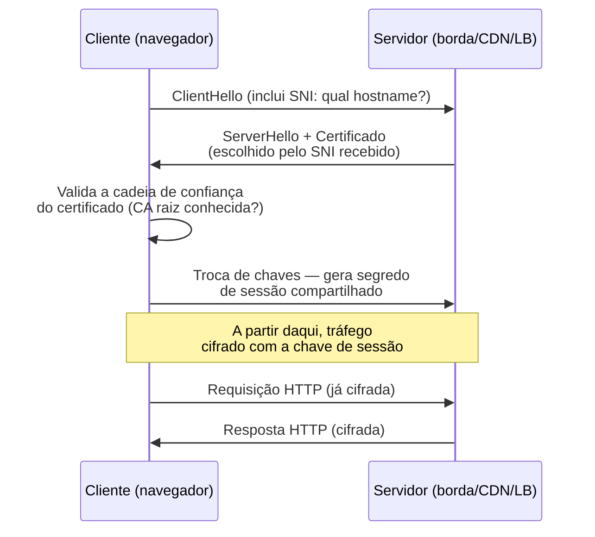
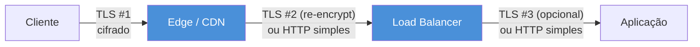

# TLS e certificados na borda

> [!abstract] TL;DR
> Todo domínio HTTPS na nuvem precisa de um certificado que prove sua identidade — e, historicamente, gerir esse certificado (comprar, instalar, lembrar de renovar) era um trabalho manual sujeito a um erro específico e recorrente: esquecer a data e deixar o site cair com a tela vermelha do navegador. A nuvem gerenciada resolve isso com um serviço dedicado — **ACM** na AWS, certificados **Let's Encrypt** integrados na DigitalOcean — que emite, associa e **renova sozinho**, sem intervenção humana, desde que a validação inicial (DNS ou HTTP) continue provada. A peça central do mecanismo é o **SNI** (Server Name Indication): é o que permite a borda escolher o certificado certo entre dezenas de domínios hospedados no mesmo IP, antes mesmo da conexão TLS terminar de se estabelecer. E existe uma restrição que pega todo mundo desprevenido pelo menos uma vez: um certificado ACM para usar com CloudFront **tem que** viver na região `us-east-1`, não importa em qual região o resto da infraestrutura mora.

## O certificado que expirou às três da manhã

Um time de infraestrutura configurou HTTPS manualmente num balanceador de carga alguns anos atrás. Comprou o certificado de uma autoridade certificadora, instalou o arquivo `.pem` no servidor, e seguiu em frente — o certificado era válido por um ano, prazo generoso o bastante para todo mundo esquecer que ele existia. Passaram-se onze meses. Ninguém no time tinha um lembrete de calendário, um alerta de monitoramento, ou sequer uma planilha rastreando a data de expiração. O certificado expirou silenciosamente numa madrugada de sábado, e o primeiro sinal do problema não foi um alerta interno — foi um cliente reportando que o navegador dele mostrava um aviso de segurança ao tentar acessar o site, com o texto que todo desenvolvedor teme: "sua conexão não é privada".

Esse cenário não é raro nem exagerado — é comum o suficiente para ter um apelido informal no setor: "cert rot", a certeza estatística de que, dado tempo suficiente e processo manual suficiente, todo certificado eventualmente expira sem que ninguém perceba a tempo. O problema não é técnico — renovar um certificado é uma operação simples. O problema é **organizacional**: depende de um humano lembrar, numa lista cada vez maior de coisas para lembrar, de algo que só importa quando dá errado.

A resposta da nuvem gerenciada inverte essa lógica: em vez de depender de memória humana, o provedor assume a responsabilidade de monitorar a expiração e renovar automaticamente — contanto que as condições que provam que você é dono do domínio continuem verdadeiras. Essa é a promessa central desta nota: **certificado como coisa que o provedor cuida, não como tarefa recorrente na agenda de alguém**.

## O handshake TLS, de raspão — o suficiente para entender terminação

Esta nota não vai reensinar criptografia. Entender **por que** RSA ou ECDSA funcionam, como a cadeia de confiança de uma PKI se propaga, ou os detalhes de cada cifra suportada é território de outro domínio deste vault — coberto no domínio de Segurança Conceitual. O que importa aqui é o suficiente da mecânica do handshake TLS para entender **onde** a terminação acontece e **por que** o local dela importa para latência e superfície de risco.

Em linhas gerais, quando um navegador se conecta a um servidor por HTTPS, acontece uma negociação em poucas idas e vindas antes de qualquer dado da aplicação trafegar:



Três coisas para reter desse fluxo, sem entrar em cifra nenhuma:

- O **certificado** é uma peça de identidade pública — ele prova, através de uma cadeia de confiança até uma autoridade certificadora (CA) reconhecida pelo navegador, que o servidor do outro lado realmente controla aquele domínio.
- A **troca de chaves** que acontece depois da validação do certificado é o que gera a chave simétrica usada para cifrar o resto da conversa — o handshake é caro (várias idas e vindas de rede); o tráfego cifrado depois dele é comparativamente barato.
- Tudo isso acontece **antes** de qualquer byte de HTTP trafegar. Isso significa que quem está fisicamente mais perto do cliente, geograficamente, consegue completar esse handshake mais rápido — é o argumento central por trás de terminar TLS na borda em vez de na origem.

> [!info] Fronteira
> Handshake TLS 1.3 completo, cifras suportadas, cadeia de confiança PKI, e os fundamentos matemáticos de RSA/ECDSA são cobertos em profundidade no domínio de Segurança Conceitual deste vault. Esta nota assume esse pano de fundo e foca exclusivamente na encarnação **gerenciada** de certificados na nuvem: provisionar, terminar e renovar — não o protocolo em si.

## SNI: como a borda sabe qual certificado mostrar

Aqui está o problema que o SNI resolve, e por que ele é decisivo para qualquer CDN ou balanceador de carga multi-tenant: um único endereço IP pode hospedar dezenas, centenas, milhares de domínios diferentes — é exatamente o modelo de uma CDN como o CloudFront, que serve inúmeros clientes através da mesma infraestrutura de borda compartilhada. Cada um desses domínios tem seu **próprio certificado**, com seu próprio nome no campo Common Name ou Subject Alternative Name. Quando uma conexão TLS chega, o servidor de borda precisa decidir, **antes** de enviar qualquer certificado, qual dos milhares apresentar — mas nesse ponto do protocolo TLS clássico, a conexão ainda não revelou nenhuma informação sobre qual URL o cliente está tentando acessar. Isso só apareceria depois, no cabeçalho HTTP `Host`, que só é lido depois que a cifra já está em vigor.

**SNI (Server Name Indication)** resolve exatamente essa lacuna temporal: é uma extensão do handshake TLS que faz o cliente informar o hostname desejado **em texto claro**, dentro da própria mensagem `ClientHello` — a primeira mensagem do handshake, antes de qualquer certificado ser trocado. Com essa informação em mãos, o servidor de borda pode escolher, na hora, qual dos certificados que ele guarda apresentar para aquela conexão específica.

Pense assim: sem SNI, é como se um prédio com centenas de escritórios só tivesse uma recepcionista, e ela precisasse adivinhar quem o visitante quer encontrar antes mesmo de ele dizer o nome — impossível, então o prédio precisaria de um endereço físico (IP) diferente para cada escritório. Com SNI, o visitante diz o nome da empresa já na porta ("vim ver a Empresa X"), e a recepcionista direciona corretamente, mesmo com um único endereço compartilhado por todo o prédio.

Essa é a peça que torna viável hospedar múltiplos domínios de clientes diferentes atrás do mesmo endpoint de borda, sem precisar de um IP dedicado por certificado — o modelo que toda CDN moderna, incluindo o CloudFront, usa por padrão.

> [!question] E se o cliente não suportar SNI?
> Clientes muito antigos (navegadores anteriores a ~2010, algumas bibliotecas legadas) não enviam SNI. Nesse caso o servidor de borda não tem como saber qual certificado servir e cai de volta num certificado padrão — o que normalmente resulta num erro de "nome não confere" para qualquer domínio que não seja o principal. Na prática, hoje isso é uma preocupação residual: a cobertura de clientes com suporte a SNI está acima de 99,9% do tráfego real, e a maioria dos serviços de CDN gerenciados nem oferece mais a opção de IP dedicado por esse motivo — seria pagar por um problema que praticamente não existe mais.

> [!tip] Assista: Server Name Indication (SNI) (Explained by Example)
> **Canal:** PracticalNetworking-style deep dive | **Duração:** ~36min | **Idioma:** EN
>
> Monta o cenário do "prédio com uma recepcionista só" na prática, com um servidor real hospedando múltiplos certificados no mesmo IP, mostrando o handshake antes e depois do SNI entrar em cena.
> Trecho de destaque [00:03]: *"server name indication or SNI for short is a TLS extension that allows the client to specify which host[s] it wants to connect [to] during the TLS handshake."*
>
> 🎬 [Assistir no YouTube](https://www.youtube.com/watch?v=t0zlO5-NWFU)

## Terminação TLS na borda: onde a cifra "para"

"Terminar TLS" significa: o ponto na rede onde a conexão cifrada do cliente é decifrada e vira tráfego HTTP comum (ou uma nova conexão TLS separada). Existem três lugares onde isso pode acontecer, e a escolha entre eles é uma decisão de arquitetura real, não um detalhe de configuração:

**Terminação no edge/CDN.** O servidor de borda mais próximo do cliente decifra a conexão. Esse é o padrão recomendado por praticamente todo provedor de CDN — inclusive a própria orientação da AWS para CloudFront — porque o handshake TLS, que é a parte cara em termos de latência de rede (múltiplas idas e vindas), acontece o mais perto fisicamente do cliente possível. Um usuário em São Paulo conectando a um edge location em São Paulo tem um handshake de poucos milissegundos de ida e volta; o mesmo usuário fazendo handshake direto com uma origem em `us-east-1` paga o custo de ida e volta transatlântica **antes mesmo** de qualquer requisição HTTP sair.

**Terminação no load balancer.** Muito comum quando não há CDN na frente — um Application Load Balancer da AWS ou um DigitalOcean Load Balancer decifra a conexão do cliente e, opcionalmente, abre uma nova conexão (cifrada ou não) até os servidores de aplicação atrás dele.

**Terminação na aplicação.** O TLS só é decifrado dentro do próprio servidor de aplicação. Mais raro em arquiteturas modernas na nuvem — normalmente reservado a cargas de trabalho com requisitos regulatórios estritos de criptografia ponta a ponta, ou a topologias muito simples sem camada de borda gerenciada.



Vale nomear com precisão os três padrões que aparecem nessa cadeia, porque a diferença entre eles é o que muda o risco de segurança:

- **TLS termination**: a conexão cifrada é decifrada num ponto e o tráfego segue, dali para frente, sem cifra (HTTP puro) até o próximo salto.
- **TLS pass-through**: o servidor de borda **não decifra** — apenas encaminha a conexão TLS intacta até a origem, que é quem de fato termina o handshake. Usado quando a borda precisa rotear por SNI sem nunca ver o conteúdo cifrado (por exemplo, quando a própria aplicação precisa da identidade do certificado do cliente, ou por exigência de que a borda nunca tenha acesso à chave privada da aplicação).
- **Re-encryption (edge→origin)**: a conexão do cliente é decifrada na borda e uma **nova** conexão TLS, com um certificado diferente (normalmente da própria origem, ou autoassinado), é aberta até a origem. É o modo mais comum em arquiteturas sérias: o tráfego nunca trafega em claro pela rede, mesmo internamente, mas a borda ainda pode inspecionar, cachear e rotear pelo conteúdo da requisição.

> [!warning] Terminar TLS cedo demais expõe tráfego interno
> Um erro real e recorrente: configurar a CDN ou o load balancer para terminar TLS e encaminhar o tráfego **em HTTP puro** até a origem, presumindo que "a rede interna da nuvem já é confiável o bastante". Isso funciona até o dia em que alguém — um vizinho de VPC mal configurado, um serviço comprometido na mesma rede, uma ferramenta de observabilidade capturando pacotes por engano — consegue ver esse tráfego em claro, incluindo cookies de sessão, tokens de autenticação e corpos de requisição sensíveis. A prática recomendada é sempre re-cifrar entre a borda e a origem (edge→origin em HTTPS), mesmo que o certificado da origem seja autoassinado — o objetivo não é validar a identidade da origem com o mesmo rigor que a do cliente, é simplesmente nunca deixar dados sensíveis trafegarem sem cifra nenhuma, em lugar nenhum da rede.

## ACM: o certificado que a AWS renova sozinha

**AWS Certificate Manager (ACM)** é o serviço da AWS dedicado a provisionar, gerenciar e renovar certificados TLS para uso com serviços integrados — CloudFront, Application Load Balancer, API Gateway, entre outros. Ele resolve o problema da abertura desta nota de forma direta: em vez de comprar um certificado, instalar manualmente e vigiar a data de expiração, você pede ao ACM, prova que controla o domínio uma vez, e o resto — incluindo a renovação — passa a ser responsabilidade do serviço.

### Gratuito para uso integrado

Certificados públicos do ACM têm **custo zero** quando usados com os serviços integrados da AWS. A documentação oficial de preços é direta: "por padrão, o ACM emite certificados sem custo para uso com serviços integrados com o ACM". A cobrança só aparece num caso específico e menos comum: **certificados exportáveis**, usados fora do ecossistema integrado da AWS (por exemplo, num servidor fora da AWS) — aí sim há tarifa por domínio.

### Validação: DNS vs. email vs. HTTP

Antes de emitir um certificado público, o ACM precisa provar que você controla o domínio que está pedindo. Existem três métodos, e a escolha entre eles não é só uma questão de conveniência — ela determina se a renovação vai continuar sendo automática para sempre ou vai voltar a depender de um humano:

- **Validação por DNS**: o ACM pede que você crie um registro **CNAME** específico na zona DNS do domínio. Uma vez que esse registro existe e o ACM consegue enxergá-lo, a validação passa — e, crucialmente, **continua passando indefinidamente**, contanto que o registro CNAME permaneça no lugar. É por isso que a AWS recomenda DNS sobre email como método padrão: a documentação oficial afirma que "o ACM renova automaticamente certificados validados por DNS, contanto que o certificado continue em uso e o registro DNS esteja no lugar".
- **Validação por email**: o ACM envia um email para até cinco endereços administrativos padrão do domínio (`admin@`, `administrator@`, `hostmaster@`, `postmaster@`, `webmaster@`), pedindo que alguém clique num link de confirmação. Isso funciona quando você não tem acesso para editar os registros DNS do domínio — mas tem um custo estrutural: **certificados validados por email exigem uma ação humana a cada ciclo de renovação**. O ACM começa a mandar avisos de renovação 45 dias antes da expiração, mas se ninguém clicar no link, o certificado expira do mesmo jeito que aconteceria sem ACM nenhum.
- **Validação por HTTP**: disponível especificamente para certificados usados com CloudFront, usa redirecionamentos HTTP para provar a posse do domínio, e — como a validação por DNS — oferece renovação automática.

Essa distinção é o motivo pelo qual a escolha do método de validação, feita uma única vez no momento da criação do certificado, tem consequência permanente: escolher email por pressa hoje significa recriar o mesmo problema de "cert rot" da abertura desta nota, só que com um passo a menos de fricção manual. A própria documentação da AWS é explícita sobre isso não ser reversível: **depois que um certificado é criado com validação por email, não é possível trocar para DNS** — é preciso apagar o certificado e criar um novo.

```bash
# Pedir um certificado público via CLI, já especificando validação por DNS
aws acm request-certificate \
  --domain-name exemplo.com \
  --subject-alternative-names "*.exemplo.com" \
  --validation-method DNS \
  --region us-east-1
```

A resposta traz o ARN do certificado, ainda em estado `PENDING_VALIDATION`, e o ACM disponibiliza os detalhes do registro CNAME que precisa ser criado:

```bash
aws acm describe-certificate \
  --certificate-arn arn:aws:acm:us-east-1:123456789012:certificate/abcd-1234 \
  --query 'Certificate.DomainValidationOptions'
```

```json
[
  {
    "DomainName": "exemplo.com",
    "ValidationStatus": "PENDING_VALIDATION",
    "ResourceRecord": {
      "Name": "_a79865eb4cd1a6ab990a45779b4e0b96.exemplo.com.",
      "Type": "CNAME",
      "Value": "_424c7224e9a5d1ae7bc0a5a4c7a1a541.xlfgrmvvlj.acm-validations.aws."
    }
  }
]
```

Criando o registro CNAME (aqui via Route 53, mas qualquer provedor DNS serve):

```bash
aws route53 change-resource-record-sets \
  --hosted-zone-id Z1234EXAMPLE \
  --change-batch '{
    "Changes": [{
      "Action": "UPSERT",
      "ResourceRecordSet": {
        "Name": "_a79865eb4cd1a6ab990a45779b4e0b96.exemplo.com.",
        "Type": "CNAME",
        "TTL": 300,
        "ResourceRecords": [{"Value": "_424c7224e9a5d1ae7bc0a5a4c7a1a541.xlfgrmvvlj.acm-validations.aws."}]
      }
    }]
  }'
```

A partir daí, o ACM detecta o registro sozinho — geralmente em minutos, mas a propagação DNS pode levar mais tempo dependendo do TTL de registros anteriores no mesmo nome — e o certificado passa a `ISSUED`.

> [!tip] Assista: Aprenda Domínios, DNS e HTTP: Tutorial Completo na AWS com Route 53, ACM, CloudFront
> **Canal:** (tutorial em português) | **Duração:** ~36min | **Idioma:** PT-BR
>
> Mostra, no console, o exato momento de pedir um certificado gratuito ao ACM para um domínio — o mesmo fluxo desta seção, só que clicando em vez de rodar CLI.
> Trecho de destaque [28:53]: *"precisar configurar aqui um certificado SSL para esse nosso domínio, então..."*
>
> 🎬 [Assistir no YouTube](https://www.youtube.com/watch?v=Os1AJhS2qvk)

### Vencimento e renovação automática

Certificados públicos do ACM são válidos por **198 dias**. O ACM tenta renová-los automaticamente **45 dias antes da expiração** — desde que o certificado esteja em uso ativo por um recurso da AWS e a validação de domínio (DNS ou HTTP) continue provável. A renovação não gera um ARN novo: o mesmo identificador do certificado permanece válido, o que significa que nenhuma associação existente (com CloudFront, ALB etc.) precisa ser atualizada manualmente quando a renovação acontece — ela é, do ponto de vista de quem opera a infraestrutura, invisível.

### A restrição crítica: CloudFront exige us-east-1

Esta é a armadilha mais comum e mais bem documentada de todo o fluxo ACM↔CloudFront, e vale reproduzir a redação exata da documentação oficial da AWS: "para usar um certificado ACM com uma distribuição CloudFront, garanta que você solicite (ou importe) o certificado na região US East (N. Virginia) (`us-east-1`)". A regra não tem exceção nem depende de onde o resto da sua infraestrutura está hospedada — mesmo que toda a sua conta AWS opere em `sa-east-1` (São Paulo), o certificado usado por uma distribuição CloudFront precisa existir fisicamente no ACM de `us-east-1`.

A razão estrutural: CloudFront é um serviço **global** — não pertence a nenhuma região específica — e a AWS escolheu `us-east-1` como o ponto de referência canônico para os poucos serviços que precisam de um "endereço" regional mesmo sendo globais (o IAM é outro exemplo clássico dessa mesma convenção).

Essa restrição **não** se aplica a certificados usados por um Application Load Balancer (recurso regional) — nesse caso, o certificado ACM deve estar na **mesma região** onde o ALB está.

```bash
# Certificado para CloudFront: SEMPRE us-east-1, mesmo que a conta opere em outra região
aws acm request-certificate \
  --domain-name cdn.exemplo.com \
  --validation-method DNS \
  --region us-east-1

# Certificado para um ALB em São Paulo: fica na região do próprio ALB
aws acm request-certificate \
  --domain-name app.exemplo.com \
  --validation-method DNS \
  --region sa-east-1
```

Associar o certificado a uma distribuição CloudFront, uma vez emitido:

```bash
aws cloudfront update-distribution \
  --id E1A2B3C4D5E6F7 \
  --distribution-config file://distribution-config.json
# dentro do JSON: "ViewerCertificate": {
#   "ACMCertificateArn": "arn:aws:acm:us-east-1:123456789012:certificate/abcd-1234",
#   "SSLSupportMethod": "sni-only"
# }
```

Repare no campo `SSLSupportMethod: sni-only` — é exatamente o mecanismo de SNI descrito acima que permite ao CloudFront usar esse certificado específico só para as requisições que chegam pedindo aquele hostname, sem precisar de um IP dedicado.

## Lente dupla: ACM e o Let's Encrypt gerenciado da DigitalOcean

A DigitalOcean resolve o mesmo problema — certificado gratuito, renovado sozinho — através de uma integração direta com **Let's Encrypt**, a autoridade certificadora sem fins lucrativos que emite certificados públicos gratuitos por padrão em toda a indústria. A mecânica, pelo `doctl` (CLI oficial da DigitalOcean), tem dois modos equivalentes aos vistos no ACM:

```bash
# Certificado gerenciado Let's Encrypt — gratuito, renovado automaticamente.
# Exige que o domínio já esteja gerenciado pelo DNS da DigitalOcean.
doctl compute certificate create \
  --type lets_encrypt \
  --name cert-exemplo \
  --dns-names exemplo.com,www.exemplo.com

# Certificado próprio (custom) — você fornece os arquivos PEM.
doctl compute certificate create \
  --type custom \
  --name cert-proprio \
  --leaf-certificate-path cert.pem \
  --certificate-chain-path fullchain.pem \
  --private-key-path privkey.pem
```

A diferença estrutural entre os dois tipos é a mesma distinção que separa DNS validation de certificado importado no ACM: um certificado `lets_encrypt` da DigitalOcean é **renovado automaticamente pela própria plataforma**, sem qualquer ação manual — o equivalente funcional da validação por DNS do ACM, só que a validação de domínio é implícita no fato de o domínio já estar hospedado no DNS da DigitalOcean. Um certificado `custom`, por outro lado, é responsabilidade inteiramente sua: quando ele expirar, é você (ou seu pipeline de automação) quem precisa gerar um novo e fazer o upload — a DigitalOcean não sabe renovar um certificado que ela não emitiu.

Esses certificados gerenciados aparecem em três superfícies distintas na plataforma:

- **Load Balancers** — associados diretamente ao balanceador, como no exemplo `doctl` acima.
- **App Platform** — certificados Let's Encrypt provisionados automaticamente para domínios customizados apontados a um app, sem passo manual de criação de certificado.
- **Spaces CDN** — ao configurar um domínio customizado (CDN endpoint) na frente de um bucket Spaces, a DigitalOcean também provisiona e renova o certificado TLS correspondente.

O padrão de fundo é o mesmo nos dois provedores: **prove que você controla o domínio uma vez (DNS), e o provedor assume a renovação para sempre** — a diferença é só onde essa prova mora. No ACM, é um registro CNAME explícito que você cria manualmente numa zona DNS qualquer. Na DigitalOcean, é o próprio fato de o domínio já estar hospedado no DNS gerenciado da plataforma.

| | ACM (AWS) | Let's Encrypt gerenciado (DigitalOcean) |
|---|---|---|
| Custo do certificado | Gratuito (uso integrado) | Gratuito |
| Validade | 198 dias | ~90 dias (padrão Let's Encrypt) |
| Renovação automática | Sim, se validado por DNS/HTTP e em uso | Sim, sempre, para certificados `lets_encrypt` |
| Pré-requisito para renovação automática | Registro DNS/HTTP de validação permanece no lugar | Domínio permanece gerenciado pelo DNS da DigitalOcean |
| Restrição regional | CloudFront exige `us-east-1`; ALB usa a região do próprio ALB | Nenhuma — certificado é por recurso, não por região |
| Certificado próprio (BYO) | Importar certificado externo no ACM | Tipo `custom` no `doctl`/painel |
| Onde aparece | CloudFront, ALB, API Gateway | Load Balancers, App Platform, Spaces CDN |

## Casos práticos

### Cenário 1: SaaS multi-tenant com domínio customizado por cliente

Um produto SaaS B2B permite que cada cliente aponte seu próprio domínio (`app.clienteA.com`, `portal.clienteB.io`, e assim por diante) para a mesma infraestrutura compartilhada, atrás de uma única distribuição CloudFront. Sem SNI, isso seria inviável em qualquer escala real — cada domínio precisaria de um IP dedicado, e o produto teria que gerenciar centenas de endereços IP só para servir HTTPS corretamente.

Com ACM e SNI, o fluxo de onboarding de um cliente novo fica reduzido a poucos passos automatizáveis: o sistema pede um certificado ACM para o domínio do cliente (`--domain-name app.clienteA.com --validation-method DNS --region us-east-1`), devolve ao cliente o registro CNAME de validação para ele criar na própria zona DNS, e — assim que o CNAME propaga e o ACM emite o certificado — associa o novo certificado como um **alternate domain name** (CNAME) adicional da mesma distribuição CloudFront:

```bash
aws cloudfront update-distribution \
  --id E1A2B3C4D5E6F7 \
  --distribution-config file://distribution-config-multitenant.json
# Dentro do JSON, "Aliases" acumula um hostname por cliente,
# e cada um resolve para o certificado ACM correspondente via SNI
```

Do ponto de vista operacional, isso significa que a equipe de plataforma nunca mais precisa tocar manualmente num certificado — o pipeline de onboarding de cliente novo já inclui o pedido, a validação e a associação como uma etapa automatizada, e a renovação de cada um dos potencialmente milhares de certificados envolvidos acontece sozinha, em segundo plano, sem gerar um único ticket de suporte.

### Cenário 2: migração de um certificado de terceiros para ACM sem downtime

Uma equipe herda uma infraestrutura onde o certificado TLS de um Application Load Balancer foi comprado de uma autoridade certificadora terceira e importado manualmente — sujeito exatamente ao "cert rot" da abertura desta nota, porque a renovação depende de alguém lembrar de comprar um certificado novo e reimportá-lo antes do vencimento. A migração para um certificado ACM gerenciado, validado por DNS, é feita em paralelo, sem derrubar o serviço:

```bash
# 1. Pede o certificado ACM novo, para o mesmo domínio, na mesma região do ALB
aws acm request-certificate \
  --domain-name app.exemplo.com \
  --validation-method DNS \
  --region sa-east-1

# 2. Cria o CNAME de validação (retornado pelo describe-certificate) e aguarda emissão

# 3. Troca o certificado do listener HTTPS do ALB para o novo ARN —
#    operação atômica, sem derrubar conexões em andamento
aws elbv2 modify-listener \
  --listener-arn arn:aws:elasticloadbalancing:sa-east-1:123456789012:listener/app/meu-alb/abc/def \
  --certificates CertificateArn=arn:aws:acm:sa-east-1:123456789012:certificate/novo-arn-aqui
```

A partir desse ponto, o certificado antigo pode ser descartado, e a equipe nunca mais precisa lembrar de uma data de renovação manualmente — o ACM assume a partir daqui, desde que o CNAME de validação continue no lugar.

## Inspecionando um certificado na borda

Uma ferramenta útil, independente do provedor, para confirmar qual certificado uma borda está de fato servindo — e testar se o SNI está funcionando como esperado — é o `openssl s_client`:

```bash
# Conecta e mostra o certificado servido para o SNI "exemplo.com"
openssl s_client -connect exemplo.com:443 -servername exemplo.com </dev/null 2>/dev/null | openssl x509 -noout -dates -subject -issuer
```

```
notBefore=Jan 10 00:00:00 2026 GMT
notAfter=Jul 27 23:59:59 2026 GMT
subject=CN=exemplo.com
issuer=C=US, O=Amazon, CN=Amazon RSA 2048 M02
```

O parâmetro `-servername` é o que envia o SNI na conexão — omiti-lo, contra um servidor multi-tenant, costuma devolver um certificado diferente (geralmente o padrão configurado para conexões sem SNI, quando existe um) e é uma forma rápida de confirmar, na prática, que a escolha de certificado por hostname está realmente acontecendo:

```bash
# Sem -servername: pode devolver um certificado diferente do esperado
openssl s_client -connect exemplo.com:443 </dev/null 2>/dev/null | openssl x509 -noout -subject
```

## Tabela de tradução entre provedores

| Conceito | AWS | Azure | GCP | DigitalOcean |
|---|---|---|---|---|
| Serviço de certificado gerenciado | ACM (AWS Certificate Manager) | Key Vault certificates / App Service Managed Certificate | Google-managed SSL certificates | Certificados `lets_encrypt` integrados |
| Custo | Gratuito (uso integrado) | Gratuito (App Service Managed Certificate) | Gratuito | Gratuito |
| Validação de domínio | DNS (CNAME), email, ou HTTP (CloudFront) | Validação de propriedade de domínio via DNS/App Service | Autorização via DNS ou HTTP | Domínio já hospedado no DNS da DigitalOcean |
| Renovação automática | Sim, se validado por DNS/HTTP | Sim, para certificados gerenciados pela plataforma | Sim | Sim |
| Restrição regional notável | CloudFront exige `us-east-1` | Nenhuma restrição regional equivalente documentada | Nenhuma restrição regional equivalente documentada | Nenhuma — sem conceito de "região" para o certificado |

> [!info] Caducidade
> Detalhes verificados via documentação oficial em 2026-07-24: validade de 198 dias e janela de renovação de 45 dias para certificados públicos do ACM, gratuidade para uso integrado, os três métodos de validação (DNS/email/HTTP) e a restrição de `us-east-1` para CloudFront (docs.aws.amazon.com); mecânica do `doctl compute certificate create` e os tipos `lets_encrypt`/`custom` da DigitalOcean (docs.digitalocean.com). Prazos de validade de certificado e políticas de renovação são um dos pontos que mais mudam no setor de PKI web — confirme antes de depender desses números em produção.

## Armadilhas comuns

> [!warning] Certificado do CloudFront criado fora de us-east-1
> O erro mais comum de quem configura CloudFront pela primeira vez: pedir o certificado ACM na região onde o resto da conta opera (por exemplo `sa-east-1`) e descobrir, só na hora de associar à distribuição, que o certificado simplesmente não aparece na lista de opções do console. CloudFront só reconhece certificados ACM que vivem em `us-east-1` — não importa onde a origem, o bucket S3 ou qualquer outro recurso da mesma aplicação estejam hospedados. A correção é pedir (ou reimportar) o certificado explicitamente com `--region us-east-1`, mesmo que isso pareça estranho olhando para o resto da infraestrutura.

> [!warning] Validação DNS que nunca propaga
> Depois de pedir um certificado com validação por DNS, é comum criar o registro CNAME no lugar errado — numa zona hospedada por um provedor diferente do que de fato resolve o domínio publicamente, ou com um TTL alto herdado de um registro anterior que atrasa a propagação por horas. O certificado fica preso em `PENDING_VALIDATION` indefinidamente, e não há timeout que force o ACM a desistir — ele só emite quando o registro é de fato visível pela resolução pública. Confirme com `dig CNAME _hash.exemplo.com` (ou `nslookup`) que o registro está realmente resolvendo, do lado de fora, antes de assumir que o problema está no ACM.

> [!warning] Terminar TLS cedo demais expondo tráfego interno
> Já coberto na seção de terminação acima, mas vale repetir como armadilha nomeada: configurar a borda para decifrar e encaminhar em HTTP puro até a origem, presumindo que a rede interna da nuvem é confiável por padrão. Prefira sempre re-cifrar (edge→origin em HTTPS), mesmo com certificado autoassinado na origem — o risco não é hipotético, é qualquer ferramenta de rede com acesso à mesma sub-rede.

## Como explicar em inglês

"We terminate TLS at the edge, right next to the user, instead of at the origin — that cuts the handshake round-trip down to a few milliseconds instead of crossing an ocean. Certificates are fully managed: ACM issues them for free, validates ownership through a DNS CNAME record, and renews them automatically as long as that record stays in place — no expiry pages, no manual rotation. The one gotcha every AWS engineer learns the hard way is that a certificate meant for CloudFront has to live in `us-east-1`, no matter which region the rest of the stack runs in."

| PT | EN |
|----|----|
| terminação TLS | TLS termination |
| validação por DNS | DNS validation |
| renovação automática | automatic / managed renewal |
| certificado autoassinado | self-signed certificate |
| passagem direta (sem decifrar) | pass-through |
| re-cifragem | re-encryption |

## O que vem a seguir

Esta nota resolveu como um certificado nasce, é validado e se renova sozinho — mas um certificado válido só protege a conexão; não decide **quem** deveria conseguir chegar até a aplicação em primeiro lugar, nem filtra tráfego malicioso antes que ele consuma recursos de origem. A requisição que acabamos de seguir — DNS resolvendo um hostname, [[03-Dominios/Tecnologia/Cloud/10 - DNS, CDN e borda/03 - CDN e cache de borda|CDN]] servindo o certificado certo via SNI, TLS terminando na borda — ainda precisa atravessar uma camada de proteção antes de tocar a aplicação de fato: firewall de aplicação web, proteção da origem contra acesso direto (contornando a CDN), e a pergunta maior de **por que a borda deixou de ser só cache e virou uma camada de segurança inteira**. É esse fio — "a borda como camada" — que a próxima nota puxa.

- [[03-Dominios/Tecnologia/Cloud/10 - DNS, CDN e borda/03 - CDN e cache de borda|CDN e cache de borda]] — a nota anterior desta trilha: como a borda cacheia e serve conteúdo antes de o certificado sequer entrar em cena.

## Fontes

- [AWS Certificate Manager — Request a public certificate](https://docs.aws.amazon.com/acm/latest/userguide/gs-acm-request-public.html) — restrições de nomes/algoritmo, validade de 198 dias, renovação automática 45 dias antes da expiração; acessado em 2026-07-24.
- [AWS Certificate Manager — Validate domain ownership](https://docs.aws.amazon.com/acm/latest/userguide/domain-ownership-validation.html) — comparação DNS vs. email vs. HTTP validation, recomendação oficial de DNS sobre email, comportamento de renovação de cada método; acessado em 2026-07-24.
- [AWS CloudFront — Requirements for using SSL/TLS certificates with CloudFront](https://docs.aws.amazon.com/AmazonCloudFront/latest/DeveloperGuide/cnames-and-https-requirements.html) — exigência textual de `us-east-1` para certificados usados por CloudFront, diferença para certificados de origem/ALB; acessado em 2026-07-24.
- [AWS Certificate Manager — Pricing](https://aws.amazon.com/certificate-manager/pricing/) — gratuidade de certificados públicos para uso integrado, custo de certificados exportáveis; acessado em 2026-07-24.
- [DigitalOcean — doctl compute certificate create (CLI Reference)](https://docs.digitalocean.com/reference/doctl/reference/compute/certificate/create/) — sintaxe dos tipos `lets_encrypt` e `custom`, parâmetros obrigatórios de cada um; acessado em 2026-07-24.

