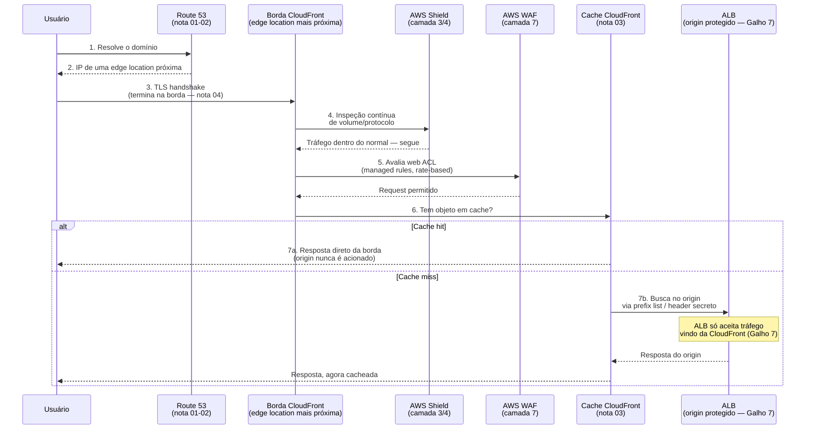
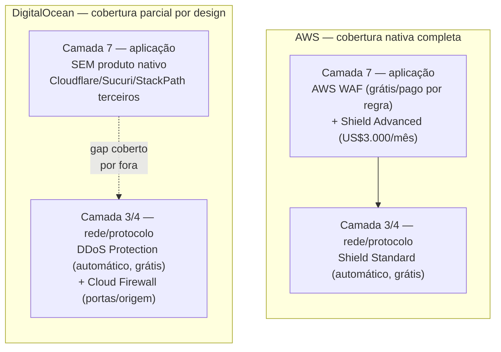

# A borda como camada

> [!abstract] TL;DR
> As quatro notas anteriores desta trilha trataram DNS, roteamento avançado, CDN e TLS como capítulos separados — e são, tecnicamente. Mas para um request real, do primeiro pacote que sai do navegador até a resposta que volta, eles não são etapas isoladas: são camadas empilhadas de um único perímetro chamado **borda**. É na borda que o DNS decide para onde apontar, é na borda que o TLS termina, é na borda que o cache responde sem acordar o origin — e é também na borda, e só na borda, que a defesa deveria acontecer. Um **WAF** (Web Application Firewall) filtra requests maliciosos na camada 7 antes que cheguem à aplicação; o **AWS Shield** absorve ataques volumétricos na camada 3/4 antes que saturem qualquer coisa; e o princípio que amarra tudo — **origin protection** — garante que, depois de toda essa fileira de defesas, o servidor de verdade nunca fala diretamente com a internet aberta. A DigitalOcean cobre a parte de rede (DDoS layer 3/4, sempre ligado, grátis) mas não tem um WAF gerenciado equivalente — para camada 7, a documentação da própria empresa aponta para fora, para Cloudflare ou parceiros do Marketplace.

## A borda como fronteira com o mundo hostil

Toda nota desta trilha até agora resolveu um problema específico da borda: a nota 01 resolveu "como alguém encontra seu servidor" (DNS), a nota 02 refinou isso com roteamento geográfico e de latência, a nota 03 resolveu "como não fazer o origin responder toda requisição" (CDN e cache), e a [[03-Dominios/Tecnologia/Cloud/10 - DNS, CDN e borda/04 - TLS e certificados na borda|nota 04]] resolveu "como criptografar o transporte sem sobrecarregar o origin" (TLS terminado perto do usuário). Cada uma dessas notas, isoladamente, resolve um problema de desempenho ou de roteamento. Mas há uma segunda leitura, que só aparece quando você olha as quatro juntas: **cada uma dessas peças também é, por acidente ou por design, o primeiro lugar onde um request hostil encontra sua infraestrutura.**

Pense na borda não como "onde o cache mora", mas como a fronteira de um território. Antes de a nuvem chegar, uma empresa que hospedava o próprio servidor físico tinha uma fronteira simples: o cabo de rede que entrava no prédio. Todo o tráfego — legítimo ou não — passava por ali, e a defesa (firewall de perímetro, IDS, o administrador de plantão) ficava concentrada num único ponto. Na nuvem, essa fronteira se dissolveu em camadas geograficamente distribuídas: dezenas ou centenas de *edge locations* ao redor do planeta, cada uma recebendo tráfego de usuários próximos. A pergunta que esta nota responde é: **se a fronteira virou uma malha distribuída de pontos de entrada, onde exatamente a defesa deveria acontecer?**

A resposta, coerente com tudo que já foi construído nas quatro notas anteriores, é: **na borda, e só na borda.** Não faz sentido deixar um ataque de negação de serviço atravessar toda a distância até o origin para só então ser bloqueado — isso desperdiça exatamente a vantagem geográfica que a CDN já oferece. O mesmo vale para um payload malicioso de SQL injection: se a borda já está inspecionando cada request para decidir se ele é cacheável, é o lugar natural para também decidir se ele é seguro. A borda deixou de ser só uma otimização de desempenho — é uma camada de segurança, com suas próprias ferramentas, seu próprio vocabulário, e sua própria lógica de "o que passa e o que não passa".

Isso também reorganiza uma pergunta que costuma ser mal colocada em entrevista técnica: "onde fica o firewall da sua aplicação?" Numa arquitetura de borda madura, não há *um* firewall — há uma **fileira** deles, cada um respondendo a uma pergunta diferente, na ordem certa. "Este tráfego é um flood de rede?" é a primeira pergunta, respondida na camada 3/4, antes de qualquer coisa mais cara acontecer. "Este request tem forma de ataque de aplicação?" é a segunda, respondida na camada 7, com o conteúdo já inspecionado. "Este objeto já está em cache?" é a terceira, puramente de desempenho. E só se as três perguntas passarem é que o origin — a peça mais cara e mais frágil de toda a cadeia — é finalmente acionado. Cada camada existe para proteger a próxima de um volume de trabalho que ela não precisava ver.

## O request atravessando a pilha inteira

Antes de entrar em cada peça de defesa isoladamente, vale ver o quadro completo — o mapa que amarra as notas 01 a 05 desta trilha num único fluxo. Um usuário digita a URL de um site. O que acontece, camada por camada, até a resposta voltar?



Repare no que esse diagrama revela: **das sete etapas numeradas, seis acontecem inteiramente na borda — e o origin só é acionado na sétima, e mesmo assim só em caso de cache miss.** Isso não é um detalhe de implementação; é a tese inteira desta nota, desenhada. O DNS decide a rota (notas 01-02). O TLS termina no ponto mais próximo do usuário (nota 04). O Shield inspeciona continuamente o volume e protocolo do tráfego, na camada de rede, antes de qualquer coisa mais cara acontecer. O WAF avalia o conteúdo do request na camada de aplicação — ele entende SQL, entende scripts, entende taxa de requisição. Só depois de passar por essa fileira inteira de filtros o request chega ao cache; e só se o cache não tiver resposta é que o origin, protegido atrás de um security group que só aceita tráfego vindo da própria CDN, é finalmente acionado. O origin nunca é o primeiro a ver um pacote hostil — na melhor das hipóteses, ele nunca vê nenhum.

## WAF de raspão: filtrando a camada 7

Um **Web Application Firewall (WAF)** é, na definição da própria documentação da AWS, um firewall que monitora requisições HTTP e HTTPS enviadas aos seus recursos web e controla o acesso ao conteúdo com base em critérios que você especifica. A diferença central em relação a um firewall de rede tradicional (como um security group, que filtra por IP e porta) é a **camada**: um WAF entende o *conteúdo* de uma requisição HTTP — os valores de uma query string, os headers, o corpo de um POST — e não só o envelope de rede em que ela chega.

O AWS WAF pode ser anexado a vários tipos de recurso, segundo a documentação oficial: distribution CloudFront, Application Load Balancer, API Gateway REST API, AWS AppSync, Amazon Cognito, AWS App Runner e AWS Verified Access, entre outros. Na prática desta trilha, o caso mais comum é anexá-lo a uma distribution CloudFront — a mesma peça que a nota 03 já apresentou — de forma que toda a inspeção de conteúdo aconteça na borda, antes mesmo do cache decidir se serve a resposta ou repassa ao origin.

Um **web ACL** (Access Control List) é o objeto central do WAF: uma coleção de regras, avaliadas em ordem, que terminam numa ação — permitir, bloquear, contar, ou (para reduzir tráfego de bots) exigir um CAPTCHA ou challenge silencioso. As regras vêm de duas fontes: **managed rule groups**, mantidos pela própria AWS ou por vendedores do AWS Marketplace, cobrindo padrões conhecidos de ataque (o exemplo mais citado é o **Core Rule Set**, com proteções contra SQL injection e cross-site scripting já prontas), e **rate-based rules**, que bloqueiam ou contam requisições que excedem um número específico dentro de um intervalo de tempo — a ferramenta natural contra um cliente único martelando um endpoint.

```bash
# Criar um web ACL simples, associado a uma distribution CloudFront,
# usando o managed rule group da AWS contra os padrões mais comuns
aws wafv2 create-web-acl \
  --name protecao-borda \
  --scope CLOUDFRONT \
  --region us-east-1 \
  --default-action Allow={} \
  --visibility-config SampledRequestsEnabled=true,CloudWatchMetricsEnabled=true,MetricName=protecaoBorda \
  --rules '[
    {
      "Name": "AWS-CommonRuleSet",
      "Priority": 0,
      "OverrideAction": { "None": {} },
      "Statement": {
        "ManagedRuleGroupStatement": {
          "VendorName": "AWS",
          "Name": "AWSManagedRulesCommonRuleSet"
        }
      },
      "VisibilityConfig": {
        "SampledRequestsEnabled": true,
        "CloudWatchMetricsEnabled": true,
        "MetricName": "commonRuleSet"
      }
    },
    {
      "Name": "LimiteDeTaxa",
      "Priority": 1,
      "Action": { "Block": {} },
      "Statement": {
        "RateBasedStatement": {
          "Limit": 2000,
          "AggregateKeyType": "IP"
        }
      },
      "VisibilityConfig": {
        "SampledRequestsEnabled": true,
        "CloudWatchMetricsEnabled": true,
        "MetricName": "limiteTaxa"
      }
    }
  ]'
```

Note dois detalhes importantes desse comando: o `--scope CLOUDFRONT` (um web ACL para CloudFront é sempre criado na região `us-east-1`, independente de onde os usuários estejam — a mesma exigência regional que certificados ACM para CloudFront já têm, um eco direto do que a nota 04 cobriu) e a regra de rate-based com `Limit: 2000` — bloqueia qualquer IP que exceda 2.000 requisições no intervalo de avaliação do WAF. Esta nota não aprofunda a anatomia completa de uma regra WAF — condições compostas, regras customizadas com expressões regulares, a diferença entre `Count` e `Block` durante um período de teste — porque esse é território de segurança de aplicação, não de arquitetura de borda.

Um detalhe operacional que vale reter antes de colocar qualquer regra em produção: a AWS recomenda explicitamente **não estrear uma regra nova diretamente em modo `Block`**. O fluxo seguro é subir a regra em modo `Count` primeiro — ela avalia cada request contra o critério, registra a contagem e as amostras (*sampled requests*, visíveis no console e via CloudWatch), mas deixa o tráfego passar normalmente. Só depois de observar por um período — minutos ou dias, dependendo do volume — que a regra não está capturando tráfego legítimo por engano, ela vira `Block`. É o mesmo instinto de qualquer mudança de infraestrutura de alto impacto: observar antes de agir, porque uma regra WAF mal calibrada bloqueando usuários reais é um incidente autoinfligido, não menos grave que o ataque que a regra deveria impedir.

```bash
# Inspeciona as amostras de requisições que a regra em modo Count
# capturou nas últimas horas, antes de decidir promovê-la a Block
aws wafv2 get-sampled-requests \
  --web-acl-arn arn:aws:wafv2:us-east-1:123456789012:global/webacl/protecao-borda/abc-123 \
  --rule-metric-name limiteTaxa \
  --scope CLOUDFRONT \
  --time-window StartTime=1721260800,EndTime=1721264400 \
  --max-items 100
```

Vale nomear, de raspão, uma peça de escala que só aparece quando uma organização opera várias contas AWS: o **AWS Firewall Manager**, que centraliza a administração de WAF e Shield Advanced (entre outras proteções) através de múltiplas contas e recursos, aplicando a mesma política automaticamente conforme novos recursos são criados — útil para garantir que nenhuma conta nova "esqueça" de configurar o WAF, mas fora do escopo desta nota, que trata da borda de uma única aplicação.

> [!info] Fronteira
> A anatomia de vulnerabilidades como SQL injection e cross-site scripting — o que são, como se manifestam no código de uma aplicação, como preveni-las na camada de aplicação — é assunto de segurança de aplicação, fora do escopo desta trilha de Cloud. Esta nota trata o WAF como uma peça de infraestrutura de borda: onde ele vive, o que ele filtra em termos gerais, e como se encaixa na pilha — não como escrever regras de detecção.

## DDoS de raspão: absorvendo volume antes do origin

Um **ataque de negação de serviço distribuído (DDoS)** tenta esgotar a capacidade de um alvo — de rede, de protocolo, ou de aplicação — inundando-o de tráfego, para negar acesso a usuários legítimos. A documentação da AWS distingue três categorias: ataques **volumétricos** (camada 3, tentando saturar a capacidade bruta da rede), ataques de **protocolo** (camada 4, abusando de um protocolo — o exemplo clássico é o SYN flood, que esgota o estado de conexão de um servidor ou load balancer), e ataques de **camada de aplicação** (camada 7, inundando a aplicação com queries válidas em formato, mas ilegítimas em intenção — um flood de requisições HTTP bem-formadas).

O **AWS Shield** existe em duas camadas de serviço, e a diferença entre elas é a peça mais citável desta seção. **Shield Standard** é fornecido automaticamente, sem custo adicional além do que você já paga pelos serviços protegidos — nenhuma ativação manual, nenhuma assinatura. Ele já protege contra os vetores mais comuns e conhecidos de ataques volumétricos e de protocolo (camadas 3 e 4), simplesmente por você usar CloudFront, Route 53 ou outros serviços de borda da AWS. **Shield Advanced** é uma assinatura paga, com compromisso mínimo de um ano e renovação automática anual, custando **US$ 3.000 por mês** por conta pagadora — mais uma taxa de uso por transferência de dados, cobrada por serviço (CloudFront cobra US\$0,025/GB, ELB cobra US\$0,050/GB, segundo a página oficial de preços). Em troca, Shield Advanced adiciona mitigação automática de ataques de camada de aplicação (7), visibilidade avançada de eventos, e suporte dedicado da equipe de resposta da AWS (o Shield Response Team). Ele protege um conjunto específico de recursos: instâncias EC2, load balancers do Elastic Load Balancing, distributions CloudFront, hosted zones do Route 53 e AWS Global Accelerator standard accelerators.

```bash
# Assinar Shield Advanced é uma chamada única — o restante da proteção
# acontece automaticamente sobre os recursos elegíveis já em uso
aws shield subscribe-to-proactive-engagement 2>/dev/null || true

aws shield create-subscription

# Associar explicitamente um recurso (ex.: a distribution CloudFront
# já usada nesta trilha) à proteção avançada
aws shield create-protection \
  --name protecao-cloudfront-producao \
  --resource-arn arn:aws:cloudfront::123456789012:distribution/E1A2B3C4D5E6F7
```

Vale amarrar isso de volta ao diagrama-mapa desta nota, porque a documentação da AWS explica exatamente *por que* CloudFront e Route 53 são tão eficazes como primeira linha de defesa: os dois operam sobre a mesma rede globalmente distribuída de edge locations, com inspeção **contínua e sempre ligada** — não é preciso "detectar uma anomalia" primeiro para começar a filtrar. No CloudFront, isso significa que só tráfego válido para uma aplicação web chega a passar adiante; SYN floods são mitigados automaticamente pela integração com um proxy de TCP SYN do próprio Shield, e como o TLS termina na borda (o assunto inteiro da nota 04), o origin só recebe requisições HTTP já bem-formadas — nunca vê o ruído de conexões incompletas ou handshakes malformados. No Route 53, o mecanismo equivalente filtra consultas DNS: o serviço usa uma técnica chamada *shuffle sharding*, atribuindo a cada hosted zone um conjunto próprio de quatro endereços de resolver, de forma que um ataque contra um conjunto de servidores autoritativos não derruba a resolução de outras zonas hospedadas na mesma infraestrutura. Ou seja: a mitigação de DDoS não é uma camada isolada, plugada por cima — ela usa a mesma arquitetura distribuída que a nota 01 (DNS) e a nota 04 (TLS) já descreveram, olhada agora pela lente de resiliência a ataque, não só de latência.

A pergunta prática que qualquer arquiteto sênior precisa saber responder é: **quando vale a pena pagar US$3.000/mês por Shield Advanced, em vez de confiar só no Standard?** A resposta da própria documentação da AWS é honesta sobre o público-alvo: sites de alta visibilidade, ou organizações que já sofreram ataques DDoS frequentes o suficiente para que o custo fixo da assinatura seja menor que o custo esperado de um ataque bem-sucedido. Para a maioria dos times que estão só começando a operar em produção, o Shield Standard — grátis, sempre ligado, cobrindo os vetores mais comuns de camada 3/4 — já é uma base sólida; a decisão de subir para Advanced é uma conversa de risco de negócio, não uma configuração técnica trivial.

> [!info] Fronteira
> Os detalhes internos de como um ataque volumétrico é detectado e mitigado dentro da rede da AWS (algoritmos de detecção, thresholds de anomalia, engenharia de mitigação) não são território desta nota — o que importa aqui é onde essa defesa se encaixa na pilha (na borda, antes do origin) e o vocabulário para reconhecê-la numa conversa de arquitetura.

> [!tip] Assista: AWS Shield Explained | DDoS Protection with Standard vs Advanced
> **Canal:** conteúdo de preparação para certificação AWS | **Duração:** ~4min | **Idioma:** EN
>
> Um resumo curto e direto da divisão Standard/Advanced e das camadas 3/4 vs. 7 — bom para fixar rápido a distinção que esta seção explica em mais profundidade. Trecho de destaque [03:09]: *"Shield standard operates on layers three and four only. Whereas shield advanced on one hand it includes shield standard, so it still gives you protection on layers three and four. But shield advanced also operates on layer 7."*
>
> 🎬 [Assistir no YouTube](https://www.youtube.com/watch?v=jcE2gyVkhYo)

## Origin protection revisitado: o princípio por trás de tudo

A nota 03 desta trilha já mostrou uma peça concreta disso: o **Origin Access Control (OAC)**, que garante que um bucket S3 usado como origin de uma distribution CloudFront fique totalmente privado, acessível só pelo serviço CloudFront. Vale agora nomear o princípio geral por trás dessa peça específica, porque ele se repete em qualquer arquitetura de borda séria, independente de qual origin está por trás: **o origin nunca fala diretamente com a internet aberta. Toda a superfície pública de um sistema é a borda; o origin é sempre privado.**

Quando o origin não é um bucket S3, mas um Application Load Balancer — o mesmo balanceador de carga que o [[03-Dominios/Tecnologia/Cloud/06 - Compute II — elasticidade e balanceamento/index|Compute II]] já apresentou, agora vivendo numa subnet privada como o [[03-Dominios/Tecnologia/Cloud/07 - Rede na nuvem (VPC)/index|Rede na nuvem (VPC)]] descreveu — o mesmo princípio se aplica através de outro mecanismo: restringir o **security group** do ALB para só aceitar tráfego vindo da própria CloudFront. A AWS mantém, para esse fim, uma **managed prefix list** — uma lista de faixas de IP mantida e atualizada automaticamente pela própria AWS — chamada `com.amazonaws.global.cloudfront.origin-facing` (com uma variante IPv6, `com.amazonaws.global.ipv6.cloudfront.origin-facing`). Referenciar essa prefix list numa regra de security group significa que só os servidores *origin-facing* da CloudFront — não qualquer cliente na internet que descubra o endereço do ALB — conseguem completar uma conexão.

```bash
# Restringe o security group do ALB a aceitar tráfego HTTPS
# só das faixas de IP mantidas pela própria CloudFront
aws ec2 authorize-security-group-ingress \
  --group-id sg-0abc123456789ef01 \
  --ip-permissions '[
    {
      "IpProtocol": "tcp",
      "FromPort": 443,
      "ToPort": 443,
      "PrefixListIds": [
        { "PrefixListId": "pl-3b927c52", "Description": "CloudFront origin-facing (com.amazonaws.global.cloudfront.origin-facing)" }
      ]
    }
  ]'
```

Restringir por prefix list resolve a camada de rede — mas a documentação da AWS recomenda combinar isso com uma segunda camada, na camada de aplicação: um **header HTTP secreto**, configurado como header customizado na origem da distribution CloudFront, e validado por uma regra do listener do ALB antes de encaminhar qualquer requisição ao target group.

```bash
# 1. A distribution CloudFront envia um header secreto em toda
# requisição enviada ao origin — configurado no origin da distribution
aws cloudfront update-distribution \
  --id E1A2B3C4D5E6F7 \
  --distribution-config file://config-com-header-secreto.json
  # dentro do JSON: OriginCustomHeaders contém
  # { "HeaderName": "X-Origin-Verify", "HeaderValue": "um-segredo-longo-e-rotacionavel" }

# 2. Uma regra do listener do ALB só encaminha ao target group
# se o header e o valor baterem — qualquer outra origem recebe 403
aws elbv2 create-rule \
  --listener-arn arn:aws:elasticloadbalancing:us-east-1:123456789012:listener/app/meu-alb/abc/def \
  --priority 1 \
  --conditions '[{"Field":"http-header","HttpHeaderConfig":{"HttpHeaderName":"X-Origin-Verify","Values":["um-segredo-longo-e-rotacionavel"]}}]' \
  --actions '[{"Type":"forward","TargetGroupArn":"arn:aws:elasticloadbalancing:us-east-1:123456789012:targetgroup/meu-tg/1234567890abcdef"}]'
```

Por que as duas camadas, se a prefix list já bloqueia tráfego de fora da CloudFront? Porque a prefix list restringe *de onde* uma conexão pode vir — mas qualquer cliente da AWS, incluindo distributions CloudFront de outras contas, ainda está dentro dessa faixa de IP. O header secreto restringe *qual distribution específica* pode passar — a mesma lógica de defesa em profundidade que a nota 03 já mostrou na condição `AWS:SourceArn` do OAC, agora aplicada a um origin que não é um bucket S3, mas um load balancer. É o mesmo princípio, duas implementações, dependendo de qual tipo de origin está por trás da CDN.

Vale notar que a regra que referencia a prefix list vive exatamente no mesmo tipo de recurso que a nota de [[03-Dominios/Tecnologia/Cloud/07 - Rede na nuvem (VPC)/04 - Security groups e NACLs|Security groups e NACLs]] já detalhou: um security group, stateful, anexado ao ALB. Nada de novo precisa ser aprendido sobre a mecânica do security group em si — a novidade desta nota é só a fonte da regra (uma prefix list mantida pela AWS, em vez de um CIDR fixo digitado à mão) e o motivo de existir (não expor o origin a qualquer IP da internet, só aos servidores *origin-facing* da própria CDN). É o mesmo princípio de menor privilégio já visto no Galho 4 desta trilha (papéis com a permissão mínima necessária) — aqui aplicado à rede, não à identidade: o ALB recebe tráfego só de quem precisa falar com ele, nunca de "qualquer um que descubra o endereço".

## Lente dupla: AWS versus DigitalOcean

Esta é a seção mais honesta desta nota, porque a diferença entre os dois provedores aqui não é sutil. Do lado de rede (camada 3/4), a DigitalOcean está perto de paridade: **DDoS Protection** é um serviço grátis, sempre ligado, sem qualquer configuração manual, cobrindo Droplets, clusters Kubernetes, Managed Databases, Load Balancers e Reserved IPs contra ataques volumétricos e de protocolo — exatamente o mesmo escopo de camada que o Shield Standard da AWS cobre. A própria documentação da DigitalOcean é explícita: quando um ataque excede a capacidade de mitigação, o tráfego para o IP alvo é *blackholed* (descartado por completo, legítimo ou não) até o volume normalizar — o mesmo trade-off que qualquer proteção de camada 3/4 de qualquer provedor precisa fazer quando o volume ultrapassa o que pode ser filtrado seletivamente.

A diferença aparece, e é categórica, na camada 7. A documentação oficial da DigitalOcean é direta sobre isso: **DDoS Protection não oferece proteção de camada de aplicação** — a citação exata da doc é que o serviço "does not support application layer (layer 7) protection". Não existe um produto equivalente ao AWS WAF na DigitalOcean: nenhum web ACL, nenhum managed rule group contra SQL injection ou XSS, nenhuma rate-based rule nativa na borda. O que a DigitalOcean oferece do lado de rede é o **Cloud Firewall**: um firewall stateful, grátis, que protege Droplets filtrando tráfego por porta e origem — mas ele opera na camada de rede, não inspeciona conteúdo HTTP, e a própria comunidade da DigitalOcean recomenda, para quem precisa de WAF de verdade, contratar um provedor terceiro — Cloudflare é o mais citado, junto de Sucuri e StackPath, além de opções como Haltdos disponíveis como 1-Click Droplet no Marketplace.

```bash
# DigitalOcean — Cloud Firewall protege por porta/origem,
# mas não inspeciona conteúdo HTTP (sem WAF nativo)
doctl compute firewall create \
  --name protecao-droplet-web \
  --inbound-rules "protocol:tcp,ports:443,address:0.0.0.0/0 protocol:tcp,ports:80,address:0.0.0.0/0" \
  --outbound-rules "protocol:tcp,ports:all,address:0.0.0.0/0" \
  --droplet-ids 123456789
```

O contraste fica nítido lado a lado: a AWS resolve camada 3/4 e camada 7 dentro do próprio ecossistema, com Shield e WAF conversando nativamente com CloudFront; a DigitalOcean resolve camada 3/4 nativamente e de graça, mas empurra a camada 7 para fora — o que é coerente com a filosofia já vista nas notas anteriores desta trilha (CDN embutida no Spaces, sem produto CDN de propósito geral) de simplicidade sobre granularidade. Não é uma lacuna escondida: é uma escolha de escopo, e vale nomeá-la com precisão numa conversa de arquitetura, em vez de assumir que "toda nuvem grande tem os mesmos produtos".

O diagrama abaixo resume essa assimetria de cobertura por camada — onde cada provedor entrega proteção nativa, e onde a DigitalOcean deliberadamente devolve a decisão para o operador:



| Aspecto | AWS | DigitalOcean |
|---|---|---|
| Proteção DDoS camada 3/4 | Shield Standard — automático, grátis | DDoS Protection — automático, grátis |
| Proteção DDoS camada 7 | Shield Advanced (US$3.000/mês, mitigação automática) | Não suportado nativamente |
| WAF gerenciado | AWS WAF — managed rule groups, rate-based rules, anexável a CloudFront/ALB/API Gateway | Não existe produto nativo — recomenda-se Cloudflare/Sucuri/StackPath ou Haltdos (Marketplace) |
| Firewall de rede (porta/origem) | Security Groups + NACLs (Galho 7) | Cloud Firewall (grátis, por Droplet) |
| Restrição de origin à CDN | Managed prefix list `origin-facing` + header secreto | Não aplicável (CDN do Spaces só serve o próprio bucket) |
| Blackholing em ataque extremo | Sim (Shield, além do limiar de mitigação) | Sim (documentado explicitamente) |

> [!info] Caducidade
> Preço do Shield Advanced (US$3.000/mês, compromisso de 1 ano), o escopo do Shield Standard, a lista de recursos protegidos por cada nível de Shield, o texto exato da DigitalOcean sobre ausência de proteção de camada 7, e o nome da managed prefix list `com.amazonaws.global.cloudfront.origin-facing` foram verificados em `docs.aws.amazon.com` e `docs.digitalocean.com` em 2026-07-24. Preços e nomes de produto de segurança são uma das áreas que mais mudam — reconfira antes de orçar ou decidir arquitetura.

## Tabela de tradução: Azure e GCP

Sem aprofundar — só o vocabulário equivalente para reconhecer o conceito em outro provedor:

| Conceito | AWS | Azure | GCP |
|---|---|---|---|
| WAF gerenciado | AWS WAF (web ACL, managed rule groups) | Azure Front Door + WAF policy | Cloud Armor (security policies) |
| Proteção DDoS camada 3/4 | Shield Standard (grátis, automático) | Azure DDoS Network Protection (Basic é grátis; tier pago existe) | Proteção de rede do Google Cloud (automática) |
| Proteção DDoS camada 7 + suporte dedicado | Shield Advanced (pago) | Azure DDoS Protection (tier Standard/pago) | Cloud Armor Managed Protection Plus |
| Produto de borda unificado (CDN+roteamento+WAF) | CloudFront + WAF + Route 53 (integrados, não um único produto) | Azure Front Door (CDN + roteamento + WAF num só produto) | Cloud CDN + Cloud Armor (integrados via load balancer global) |
| Restrição de origin à CDN | Managed prefix list + header secreto | Private Link / origem privada no Front Door | Cloud Armor + acesso restrito ao backend |

## Casos práticos

**Site institucional pequeno, orçamento apertado.** Uma empresa hospeda o site institucional numa distribution CloudFront com origin S3 (OAC já configurado, como na nota 03). Adiciona um web ACL simples ao WAF — só o managed rule group `AWSManagedRulesCommonRuleSet` e uma rate-based rule genérica — sem assinar Shield Advanced. O Shield Standard, automático e grátis, já cobre o risco mais provável (um pico de tráfego malicioso de baixo volume); o custo de US$3.000/mês do Advanced não se justifica para um site sem histórico de ataques direcionados.

**API de produção com origin em ALB, alto tráfego.** Uma aplicação SaaS expõe uma API atrás de CloudFront, com origin num ALB em subnet privada. O security group do ALB restringe entrada à managed prefix list `origin-facing`, mais um header secreto validado por regra de listener — as duas camadas de defesa mostradas nesta nota. O WAF, anexado à distribution, tem uma rate-based rule mais agressiva que o exemplo institucional (limite de requisições por IP bem mais baixo), porque a API é o alvo mais provável de scraping e abuso de endpoint. Dado o histórico de tráfego alto e visibilidade da marca, o time avalia Shield Advanced principalmente pelo suporte dedicado do Shield Response Team durante um incidente, não só pela mitigação automática.

**Startup em DigitalOcean, WAF terceirizado.** Um time pequeno roda a aplicação inteira em Droplets atrás de um Load Balancer da DigitalOcean, com Cloud Firewall restringindo portas de entrada e DDoS Protection cobrindo a camada de rede automaticamente, sem nenhuma configuração extra. Como a aplicação processa formulários públicos e é alvo ocasional de bots de scraping, o time decide colocar o Cloudflare na frente de tudo — DNS apontando para o Cloudflare, que por sua vez aponta para o Load Balancer da DigitalOcean — justamente para preencher a lacuna de camada 7 que a documentação da DigitalOcean assume como fora do escopo do serviço nativo.

**Regra WAF nova, calibrada com segurança antes de bloquear.** Um time percebe, olhando métricas de erro, um padrão suspeito de requisições a `/admin` vindas de um pequeno grupo de IPs fora do país onde a empresa opera. Em vez de criar uma regra de bloqueio geográfico direto em produção, o time cria a regra em modo `Count`, deixa rodando por 48 horas observando os *sampled requests* no console do WAF, confirma que nenhum usuário legítimo (nenhum funcionário viajando, nenhum parceiro internacional) está sendo capturado pelo critério, e só então promove a regra para `Block`. O incidente evitado não é o ataque — é o de bloquear, por engano, o próprio time de suporte remoto acessando o painel administrativo de outro país.

## Armadilhas comuns

> [!warning] Achar que Shield Standard cobre camada de aplicação
> É um erro comum assumir que, por já estar "protegido pelo Shield", a aplicação está imune a floods de requisições HTTP bem-formadas (camada 7). Shield Standard cobre camadas 3 e 4 — volume e protocolo de rede. Mitigação automática de ataques de aplicação é uma capacidade específica do Shield Advanced, e mesmo assim funciona melhor combinada com regras de WAF bem configuradas, não como substituto delas.

> [!warning] Restringir o origin só pela prefix list, sem o header secreto
> A managed prefix list `origin-facing` bloqueia tráfego que não vem de nenhum servidor da CloudFront — mas não distingue *qual* distribution CloudFront, inclusive de outra conta AWS, está enviando aquele tráfego. Sem o header secreto (ou um mecanismo equivalente de validação por distribution), um atacante que descubra o hostname direto do ALB e crie sua própria distribution CloudFront apontando para ele consegue, tecnicamente, atravessar a restrição de rede. As duas camadas — rede e aplicação — não são redundantes; são complementares.

> [!warning] Presumir que a DigitalOcean "não tem segurança" em vez de reconhecer a lacuna específica
> A DigitalOcean cobre bem a camada 3/4 (DDoS Protection e Cloud Firewalls, ambos grátis e sólidos para o que se propõem). O que falta é especificamente WAF gerenciado de camada 7 — não segurança de rede em geral. Tratar isso como "a DigitalOcean é insegura" é impreciso; tratar isso como "não preciso de WAF" é perigoso. A resposta correta, documentada pela própria empresa, é reconhecer a lacuna e preenchê-la com um parceiro terceiro quando o caso de uso exigir.

## O que vem a seguir

Esta nota fechou o Bloco 2 do Galho 10 amarrando DNS, CDN, TLS e as camadas de defesa (WAF, Shield, origin protection) numa única visão de pilha — o request atravessando a borda inteira antes de, na melhor das hipóteses, nunca precisar tocar o origin. É o quadro geral que faltava depois de quatro notas tratando cada peça isoladamente. A partir daqui, a trilha de Cloud segue para o próximo galho — computação de borda propriamente dita (o "de raspão" que a nota 03 deixou como gancho, Lambda@Edge e CloudFront Functions) fica para uma nota futura, quando o momento certo da árvore de roadmaps chegar.

## Fontes

- [AWS — What are AWS WAF, AWS Shield, and AWS Firewall Manager?](https://docs.aws.amazon.com/waf/latest/developerguide/what-is-aws-waf.html) — definição de WAF, recursos suportados (CloudFront, ALB, API Gateway, AppSync, Cognito, App Runner, Verified Access, Amplify), ações (allow/block/count/CAPTCHA), managed rule groups, rate-based rules; acessado em 2026-07-24.
- [AWS — How AWS Shield and Shield Advanced work](https://docs.aws.amazon.com/waf/latest/developerguide/ddos-overview.html) — classes de ataque DDoS (camada 3, 4 e 7), Shield Standard automático e grátis, escopo do Shield Advanced; acessado em 2026-07-24.
- [AWS Shield — Pricing](https://aws.amazon.com/shield/pricing/) — US$3.000/mês, compromisso de 1 ano com renovação automática, taxa de transferência de dados por serviço, até 50 bilhões de requisições WAF incluídas por mês; acessado em 2026-07-24.
- [AWS — Restricting access to Application Load Balancer origins](https://docs.aws.amazon.com/AmazonCloudFront/latest/DeveloperGuide/private-content-restricting-access-to-alb.html) — managed prefix list e header HTTP secreto como camadas complementares de proteção de origin; acessado em 2026-07-24.
- [AWS — AWS-managed prefix lists](https://docs.aws.amazon.com/vpc/latest/userguide/working-with-aws-managed-prefix-lists.html) — nome exato `com.amazonaws.global.cloudfront.origin-facing` (e variante IPv6), peso 55 dentro do limite de regras de security group; acessado em 2026-07-24.
- [DigitalOcean — DDoS Protection](https://docs.digitalocean.com/platform/ddos-protection/) — serviço grátis e automático, recursos cobertos (Droplets, Kubernetes, Managed Databases, Load Balancers, Reserved IPs), cobertura só de camada 3/4 ("does not support application layer (layer 7) protection"), comportamento de blackholing; acessado em 2026-07-24.
- [DigitalOcean — Cloud Firewalls](https://docs.digitalocean.com/products/networking/firewalls/) — firewall stateful grátis para Droplets, filtragem por porta e origem, sem inspeção de conteúdo HTTP; acessado em 2026-07-24.
- [DigitalOcean Community — Adding WAF service to my website](https://www.digitalocean.com/community/questions/adding-waf-service-to-my-website) — recomendação da comunidade/documentação por WAF terceiro (Cloudflare, Sucuri, StackPath) e Haltdos via Marketplace, na ausência de WAF gerenciado nativo; acessado em 2026-07-24.
