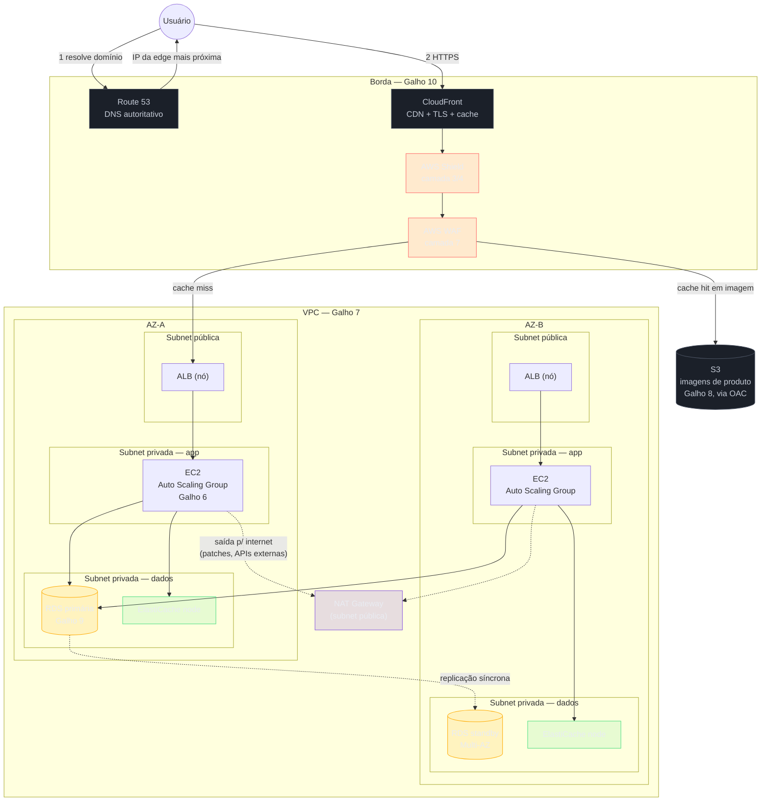
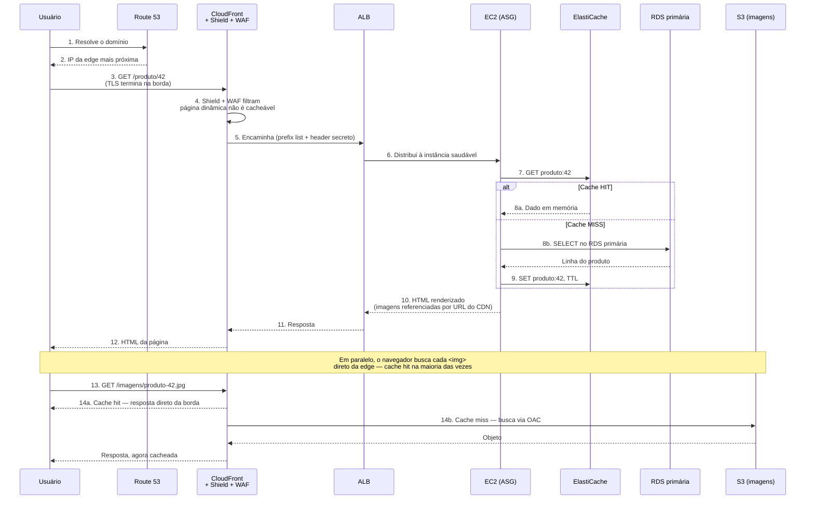
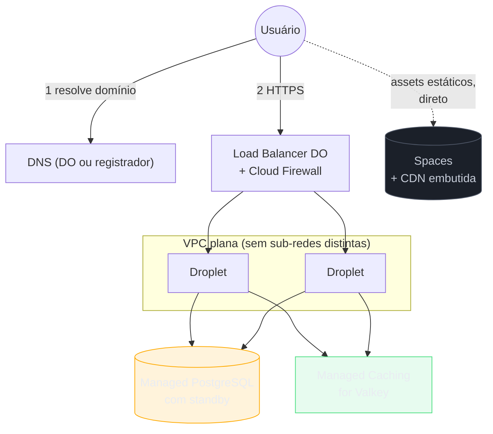

# Arquitetura ponta a ponta (capstone do Bloco 2)

> [!abstract] TL;DR
> Seis galhos, do 5 ao 10, construíram os primitivos de infraestrutura de nuvem um de cada vez: onde código roda (Compute I), como isso escala e é balanceado (Compute II), onde a rede vive isolada (VPC), onde os bytes ficam guardados (Armazenamento), onde o estado persiste (Bancos gerenciados) e como o mundo chega até tudo isso (DNS, CDN e borda). Esta nota não introduz um primitivo novo — ela monta os seis numa única arquitetura de referência, mostra um request atravessando a pilha inteira até o banco e de volta, amarra os custos que apareceram espalhados em seis galhos numa única fatura ilustrativa, e fecha com a pergunta que abre o próximo bloco: e se você não precisasse operar nenhum desses primitivos?

## A jornada até aqui, num parágrafo

O Bloco 2 respondeu, galho por galho, à mesma pergunta repetida sob ângulos diferentes: "onde, na nuvem, cada responsabilidade de uma aplicação real vive?" O [[03-Dominios/Tecnologia/Cloud/05 - Compute I — máquinas virtuais/index|Compute I]] respondeu para o código em execução — a instância, a AMI, o ciclo de vida. O [[03-Dominios/Tecnologia/Cloud/06 - Compute II — elasticidade e balanceamento/index|Compute II]] respondeu para a variação de carga — Auto Scaling Group, Load Balancer, health checks, políticas de escala. A [[03-Dominios/Tecnologia/Cloud/07 - Rede na nuvem (VPC)/index|Rede na nuvem (VPC)]] respondeu para o isolamento — subnets públicas e privadas, gateways, security groups. O [[03-Dominios/Tecnologia/Cloud/08 - Armazenamento (object, block e file)/index|Armazenamento]] respondeu para os bytes — object, block, file, cada um com seu contrato. Os [[03-Dominios/Tecnologia/Cloud/09 - Bancos gerenciados/index|Bancos gerenciados]] responderam para o estado que precisa sobreviver a qualquer reinício — relacional, NoSQL, cache, cada um para um padrão de acesso. E este galho, DNS/CDN/borda, respondeu para a última pergunta que faltava: como um cliente do outro lado do planeta *encontra* e *alcança* tudo isso, rápido e protegido.

Seis respostas isoladas não formam uma arquitetura — formam um catálogo de peças. O que esta nota faz é montar a loja: uma aplicação web three-tier real, com cada peça no seu lugar, e o fio que amarra por que ela está ali e não em outro lugar.

## O diagrama central: a arquitetura de referência do Bloco 2

Este é o diagrama que todo o resto desta nota explica, linha por linha. Uma aplicação web comum — catálogo de produtos, carrinho, pedidos — hospedada de ponta a ponta na AWS, com cada camada dos seis galhos representada:



Vale nomear, de cima para baixo, o que cada camada deste diagrama já foi justificada em detalhe em algum galho anterior — esta nota não reexplica nada, só aponta onde:

- **Route 53 + CloudFront + WAF + Shield** — a borda, coberta a fundo nas cinco notas anteriores deste galho. O usuário nunca fala diretamente com um servidor; fala com a rede distribuída de edge locations, que resolve o nome, termina o TLS, serve do cache quando pode, e filtra tráfego hostil antes de qualquer coisa mais cara acontecer.
- **ALB em subnet pública, dois AZs** — o [[03-Dominios/Tecnologia/Cloud/06 - Compute II — elasticidade e balanceamento/index|Compute II]] explicou por que o load balancer, não uma instância individual, é o ponto de entrada estável, e por que ele vive espalhado por múltiplas zonas de disponibilidade.
- **EC2 em Auto Scaling Group, subnet privada de aplicação** — o [[03-Dominios/Tecnologia/Cloud/05 - Compute I — máquinas virtuais/index|Compute I]] deu a anatomia da instância; o Compute II deu a elasticidade. A subnet ser privada (sem rota direta para a internet) é decisão da [[03-Dominios/Tecnologia/Cloud/07 - Rede na nuvem (VPC)/index|Rede na nuvem (VPC)]] — nenhuma instância de aplicação precisa de IP público para servir tráfego que sempre chega via ALB.
- **RDS Multi-AZ, subnet privada de dados, mais isolada que a de aplicação** — os [[03-Dominios/Tecnologia/Cloud/09 - Bancos gerenciados/index|Bancos gerenciados]] justificaram a réplica standby síncrona; a VPC justificou por que o banco vive numa subnet ainda mais restrita, alcançável só pela camada de aplicação, nunca pela internet.
- **ElastiCache ao lado do RDS** — a última nota do galho 9 fechou a árvore de decisão: cache para o que é volátil por design, aliviando o banco de queries repetidas.
- **S3 com Origin Access Control, servido via CloudFront** — o galho 8 deu o contrato de object storage; a nota 03 deste galho mostrou como a CDN serve esses bytes diretamente, sem acordar a camada de aplicação para uma imagem que não muda.
- **NAT Gateway numa subnet pública** — a única porta de saída (não de entrada) que as subnets privadas têm, para patches e chamadas a APIs externas; a nota 03 do galho 7 já cobriu por que ele existe e por que sai caro em volume.

## O request atravessando a arquitetura inteira

A nota 05 deste galho já mostrou um request atravessando a borda até um origin genérico. Aqui esse mapa ganha a segunda metade — o que acontece depois que o origin é, de fato, acionado, agora que o origin tem um banco, um cache e um bucket atrás dele, não uma caixa preta:



Duas coisas para reter deste diagrama. Primeiro, o HTML da página e a imagem do produto seguem **caminhos completamente diferentes** depois que saem da mesma edge location: o HTML é dinâmico, não cacheável, atravessa a pilha inteira até o banco; a imagem é estática, cacheável, e na maioria das requisições nem chega perto do S3, muito menos do ALB. É a mesma distinção que a nota 03 deste galho já fez entre conteúdo dinâmico e estático — aqui ela aparece dentro de uma única página renderizada, não como categorias abstratas. Segundo, dentro da camada de aplicação existe uma segunda decisão de cache — cache-aside contra o RDS, coberta a fundo na nota 06 do galho 9 — que é independente da CDN: a CDN cacheia respostas HTTP inteiras perto do usuário; o ElastiCache cacheia resultados de query perto da aplicação. As duas camadas de cache resolvem o mesmo problema geral (não repetir trabalho caro) em dois pontos diferentes da pilha, e uma aplicação de produção madura normalmente usa as duas.

## O que sobrevive quando uma AZ inteira cai

O diagrama central desenhou dois AZs de propósito, e vale percorrer, camada por camada, o que cada galho já garantiu para o dia em que a AZ-A simplesmente some — energia, rede, ou qualquer outra falha física que a AWS isola por zona de disponibilidade.

- **Borda:** nada muda. Route 53, CloudFront, WAF e Shield não vivem numa AZ de uma região — são serviços globais, distribuídos pela rede de edge locations. O usuário nem percebe que uma AZ caiu, porque a borda nunca dependeu dela.
- **Load balancer:** o ALB já tinha um nó em cada AZ (o diagrama mostra `ALBa` e `ALBb`); perder a AZ-A derruba um nó, não o serviço — o ALB continua aceitando conexões pelo nó da AZ-B, e o DNS interno do ALB para de anunciar o nó morto.
- **Compute:** o Auto Scaling Group, configurado (como o Compute II recomenda) para distribuir instâncias entre AZs, perde as instâncias da AZ-A — mas o health check do ALB já vinha monitorando cada uma; as que sumirem saem da rotação em segundos, e o ASG lança substitutas na AZ-B (ou numa terceira, se configurada) para repor a capacidade alvo.
- **Banco:** é aqui que a decisão da nota 03 do galho 9 paga o próprio custo. A standby Multi-AZ, que vivia exatamente na AZ-B para não compartilhar o mesmo ponto de falha da primária, assume como nova primária — o RDS conduz o failover, o CNAME do endpoint aponta pra ela, e a aplicação, com retry configurado, reconecta. Se o banco fosse single-AZ (a economia que a mesma nota alertou contra), a AZ-A cair junto com o banco seria uma indisponibilidade total, não um failover de um a dois minutos.
- **Cache:** o nó de cache da AZ-A some junto; se o replication group tinha réplica na AZ-B (a mesma lógica de Multi-AZ do ElastiCache que a nota 06 do galho 9 descreveu), o failover automático da réplica assume, e o pior cenário é uma rajada temporária de cache miss batendo no RDS — não perda de disponibilidade, só um pico de latência passageiro.
- **NAT Gateway:** este é o ponto onde a arquitetura de referência tem um trade-off explícito que a nota 03 do galho 7 já nomeou — um NAT Gateway por AZ custa o dobro da tarifa horária de um único NAT compartilhado, mas garante que a saída de internet das instâncias da AZ-B não depende de rotas cruzando pra uma AZ que acabou de cair. A arquitetura de referência desta nota assume um NAT por AZ; a versão "mais barata, mais frágil" com um NAT só é a economia que muitas equipes fazem cedo demais e revisitam depois do primeiro incidente real.

O padrão geral, que atravessa todas as seis linhas acima: **cada galho do Bloco 2, isoladamente, já resolveu "e se esta peça específica cair" — o que esta nota mostra é que essas soluções se encaixam sem sobreposição nem lacuna**, porque foram desenhadas com a mesma unidade de falha (a AZ) em mente desde o início.

> [!tip] Assista: AWS re:Invent 2022 - Multi-Region design patterns and best practices (ARC306)
> **Canal:** AWS re:Invent | **Duração:** ~58min | **Idioma:** EN
>
> Vai um degrau acima do que esta seção cobre — de "sobreviver a uma AZ" para "sobreviver a uma região inteira" — usando o Route 53 failover routing como a mesma peça de DNS desta trilha, só que orquestrando um failover ativo-passivo entre regiões completas. Trecho de destaque [15:34]: *"failover in one tool you know we have at AWS and I briefly called out is Route 53"*
>
> 🎬 [Assistir no YouTube](https://www.youtube.com/watch?v=ilgpzlE7Hds)

## A tabela de decisão do Bloco 2

Dado um requisito de arquitetura, qual primitivo resolve — e em qual galho ele foi coberto a fundo:

| Requisito | Primitivo | Galho |
|---|---|---|
| Preciso rodar código numa máquina que eu controlo | Instância EC2 / Droplet | [[03-Dominios/Tecnologia/Cloud/05 - Compute I — máquinas virtuais/index\|Compute I]] |
| Preciso pagar menos por carga tolerante a interrupção | Instância spot | Compute I |
| Preciso absorver picos de tráfego sem intervenção manual | Auto Scaling Group | [[03-Dominios/Tecnologia/Cloud/06 - Compute II — elasticidade e balanceamento/index\|Compute II]] |
| Preciso distribuir carga entre várias instâncias saudáveis | Load Balancer + health checks | Compute II |
| Preciso isolar minha rede da internet e de outras contas | VPC | [[03-Dominios/Tecnologia/Cloud/07 - Rede na nuvem (VPC)/index\|Rede na nuvem (VPC)]] |
| Preciso que uma instância privada acesse a internet, mas não o contrário | NAT Gateway | Rede na nuvem (VPC) |
| Preciso controlar exatamente que tráfego entra/sai de um recurso | Security group / NACL | Rede na nuvem (VPC) |
| Preciso guardar um arquivo grande (imagem, vídeo, backup) barato e durável | Object storage (S3/Spaces) | [[03-Dominios/Tecnologia/Cloud/08 - Armazenamento (object, block e file)/index\|Armazenamento]] |
| Preciso de um disco dedicado com IOPS previsível para um banco | Block storage (EBS/Volumes) | Armazenamento |
| Preciso reduzir custo de dado antigo automaticamente | Lifecycle policy | Armazenamento |
| Preciso guardar dado relacional com transação forte | RDS / Managed Database | [[03-Dominios/Tecnologia/Cloud/09 - Bancos gerenciados/index\|Bancos gerenciados]] |
| Preciso escalar leitura do banco sem escalar escrita | Read replica | Bancos gerenciados |
| Preciso que o banco sobreviva à queda de uma zona inteira | Multi-AZ | Bancos gerenciados |
| Preciso de acesso massivo por chave, escala horizontal | NoSQL (DynamoDB) | Bancos gerenciados |
| Preciso aliviar o banco de uma query cara e repetida | Cache gerenciado (ElastiCache) | Bancos gerenciados |
| Preciso que o mundo encontre meu domínio | DNS autoritativo (Route 53) | [[03-Dominios/Tecnologia/Cloud/10 - DNS, CDN e borda/01 - DNS na nuvem\|DNS na nuvem]] |
| Preciso rotear tráfego por região/latência/saúde | Roteamento DNS avançado | [[03-Dominios/Tecnologia/Cloud/10 - DNS, CDN e borda/02 - Roteamento DNS avançado\|Roteamento DNS avançado]] |
| Preciso servir estáticos rápido, globalmente | CDN (CloudFront) | [[03-Dominios/Tecnologia/Cloud/10 - DNS, CDN e borda/03 - CDN e cache de borda\|CDN e cache de borda]] |
| Preciso de HTTPS gerenciado, sem operar certificado | ACM + TLS na borda | [[03-Dominios/Tecnologia/Cloud/10 - DNS, CDN e borda/04 - TLS e certificados na borda\|TLS e certificados na borda]] |
| Preciso filtrar ataques de aplicação e absorver DDoS | WAF + Shield | [[03-Dominios/Tecnologia/Cloud/10 - DNS, CDN e borda/05 - A borda como camada\|A borda como camada]] |
| Preciso que meu origin nunca fale direto com a internet | Origin protection (OAC / prefix list) | A borda como camada |

## A fatura da arquitetura de referência

Cada camada do diagrama central carrega um custo que já apareceu, isolado, em algum galho — juntar os seis num só lugar é o que dá a intuição de "onde o dinheiro realmente vai" numa arquitetura assim:

| Camada | O que cobra | Fonte |
|---|---|---|
| Compute (EC2/ASG) | Por hora de instância rodando, variando por família/tamanho; on-demand vs. reserved vs. spot muda o preço em várias vezes | Compute I, nota 05 |
| Load Balancer (ALB) | Por hora de existência + LCU (unidade de capacidade, proporcional a conexões/dados processados) | Compute II |
| NAT Gateway | Tarifa horária de existência **e** por GB processado — cobrança dupla, o mesmo NAT sozinho pode superar o custo do compute que ele atende em volume alto | Rede (VPC), nota 03 |
| Block storage (EBS) | Por GiB provisionado + IOPS/throughput adicional acima do baseline (gp3 inclui 3.000 IOPS/125 MiB/s; além disso, paga-se por unidade extra) | Armazenamento, nota 05 |
| Object storage (S3) | Por GB armazenado (varia por classe de acesso) + requests + transferência de saída | Armazenamento, notas 02-03 |
| RDS Multi-AZ | Aproximadamente o dobro do custo de compute e storage de um deployment single-AZ, porque a standby síncrona é uma segunda instância completa, sempre ligada | Bancos gerenciados, nota 03 |
| ElastiCache | Por hora de nó, por família/tamanho — sem cobrança por operação, ao contrário do DynamoDB | Bancos gerenciados, nota 06 |
| CloudFront (CDN) | Por GB transferido pela borda (varia por região geográfica) + por 10.000 requests + invalidação de cache acima de um teto mensal grátis | Borda, nota 03 |
| Route 53 | Por hosted zone/mês + por milhão de queries, com desconto conforme volume | Borda, nota 01 |
| AWS WAF | Por web ACL/mês + por regra + por milhão de requests avaliadas | Borda, nota 05 |
| AWS Shield Advanced | US$ 3.000/mês fixo (opcional, só para quem precisa de mitigação de camada 7 e suporte dedicado) + taxa por GB nos serviços protegidos | Borda, nota 05 |

> [!info] Fatura ilustrativa, não uma cotação
> Esta tabela não soma um número final de propósito — cada linha depende de tamanho de instância, volume de tráfego, região e nível de reserva, e alguns valores (RDS Multi-AZ ≈ 2x, por exemplo) são uma regra de bolso conhecida do mercado, não um preço listado por página oficial. O objetivo é mostrar a *forma* da fatura — que cobra por hora de existência (compute, NAT, ALB, cache), o que cobra por volume (storage, transferência, requests) e o que é um custo fixo de decisão de risco (Shield Advanced) — não fornecer números para orçamento real. Para orçar de verdade, sempre a calculadora oficial do provedor com os números reais da carga em questão.

O padrão que emerge, olhando a tabela inteira: **redundância custa dobro** (Multi-AZ, dois ALB nodes, NAT por AZ em produção séria), **volume de dados que atravessa fronteiras custa mais que volume que fica parado** (transferência de saída, NAT por GB, CloudFront por GB são consistentemente mais caros que armazenar o mesmo dado parado), e **a borda, bem configurada, é a economia mais barata que existe** — cada byte servido do cache do CloudFront é um byte que nunca gerou uma consulta ao RDS, nunca passou pelo ALB, nunca acionou uma instância EC2. A arquitetura de referência inteira, na prática, é otimizada para que o request mais comum (imagem estática, página cacheável) nunca chegue perto das camadas mais caras.

## Cenário aplicado: a Black Friday na arquitetura de referência

Vale ver as seis camadas reagindo juntas a um evento real, não isolado — o teste de estresse mais comum para uma loja web: um pico de tráfego de dez vezes o normal, durante algumas horas, no dia de maior venda do ano.

Às 9h da manhã, o tráfego começa a subir. A primeira camada a sentir é a borda: mais requisições de imagem de produto chegam à CloudFront, e a maioria são cache hits — a mesma imagem do banner promocional, servida direto da edge location mais próxima de cada cliente, sem gerar uma única requisição adicional a nenhuma camada mais interna. É o efeito que a tabela de custo já nomeou: quanto mais tráfego é absorvido aqui, menos ele custa e menos risco ele traz para o resto da pilha.

O tráfego que não é cacheável — a página de checkout, a confirmação de pedido, a busca por um termo específico — segue até o ALB, e é aí que a política de escala do Auto Scaling Group (nota 05 do galho 6) começa a agir: o CPU médio das instâncias sobe acima do alvo, o ASG lança instâncias novas, o ALB começa a rotear tráfego para elas assim que os health checks passam. Cada instância nova, na subnet privada de aplicação, herda a mesma configuração de conexão ao RDS e ao ElastiCache que as instâncias originais já tinham — nada precisa ser reconfigurado manualmente, porque a nota 04 do galho 6 já garantiu que o launch template é a fonte de verdade para qualquer instância nova.

O RDS primária sente o aumento de leitura mais do que o de escrita — a maior parte das visitas é navegação e busca, não finalização de compra — e é exatamente aí que o ElastiCache, dimensionado para o cenário de "query de catálogo cara e repetida" que a nota 06 do galho 9 abriu, absorve a maior parte dessa carga: a página de "mais vendidos" e os detalhes de produto mais visitados vêm do cache, não de uma nova consulta ao banco a cada request. Sem essa camada, o mesmo pico de tráfego bateria direto no RDS, e a resposta ingênua — "aumentar o tamanho da instância de banco" — custaria mais e resolveria pior do que a camada de cache que já estava desenhada para esse exato cenário.

O que não escala horizontalmente com a mesma facilidade é a escrita no banco — cada pedido novo é uma transação real, com garantias ACID que não podem ser relaxadas só porque o tráfego está alto. É por isso que a arquitetura de referência nunca prometeu que *tudo* escala igual: compute e cache escalam quase livremente; o banco relacional escala leitura (réplicas) com folga e escrita com limite — e é justamente esse limite que orienta decisões de capacidade planejada com antecedência (dimensionar a instância RDS acima do necessário só para o dia do pico), não uma resposta reativa no meio do evento.

## Amarrando com código: a espinha da arquitetura em CLI

Não é um Terraform completo — é a sequência mínima de comandos, um por camada, que mostra a mesma ordem do diagrama central sendo montada de fato, com os comandos já vistos em detalhe em cada galho anterior:

```bash
# 1. Rede — VPC com subnets públicas e privadas (Galho 7)
aws ec2 create-vpc --cidr-block 10.0.0.0/16
aws ec2 create-subnet --vpc-id vpc-xxxx --cidr-block 10.0.1.0/24 --availability-zone us-east-1a  # pública
aws ec2 create-subnet --vpc-id vpc-xxxx --cidr-block 10.0.11.0/24 --availability-zone us-east-1a # privada app
aws ec2 create-subnet --vpc-id vpc-xxxx --cidr-block 10.0.21.0/24 --availability-zone us-east-1a # privada dados

# 2. Banco — RDS Multi-AZ na subnet privada de dados (Galho 9)
aws rds create-db-instance --db-instance-identifier loja-db \
  --engine postgres --multi-az --db-subnet-group-name loja-dados-subnets

# 3. Compute + escala — ASG atrás de um ALB (Galho 6)
aws elbv2 create-load-balancer --name loja-alb --subnets subnet-pub-a subnet-pub-b
aws autoscaling create-auto-scaling-group --auto-scaling-group-name loja-asg \
  --launch-template LaunchTemplateName=loja-lt --min-size 2 --max-size 10 \
  --target-group-arns arn:aws:elasticloadbalancing:...:targetgroup/loja-tg

# 4. Borda — distribution CloudFront com o ALB como origin, WAF anexado (Galho 10)
aws cloudfront create-distribution --distribution-config file://loja-cf-config.json
aws wafv2 associate-web-acl --web-acl-arn arn:aws:wafv2:...:webacl/protecao-borda/abc \
  --resource-arn arn:aws:cloudfront::...:distribution/E1A2B3C4D5E6F7

# 5. DNS — aponta o domínio para a distribution (Galho 10, nota 01)
aws route53 change-resource-record-sets --hosted-zone-id Z123456 \
  --change-batch file://loja-alias-cloudfront.json
```

Nenhum comando acima vale nada sem confirmar, depois, que a redundância entre AZs de fato existe — o mesmo hábito de verificar por comando, em vez de assumir de memória, que as notas 06 dos galhos 8 e 9 já praticaram:

```bash
# Confirma que o ALB tem de fato um nó em cada AZ, não só uma na config
aws elbv2 describe-load-balancers --names loja-alb \
  --query 'LoadBalancers[0].AvailabilityZones[].ZoneName'
```

```json
["us-east-1a", "us-east-1b"]
```

```bash
# Confirma que o RDS está realmente Multi-AZ, não só que a flag foi passada
aws rds describe-db-instances --db-instance-identifier loja-db \
  --query 'DBInstances[0].{MultiAZ:MultiAZ,AZ:AvailabilityZone}'
```

```json
{ "MultiAZ": true, "AZ": "us-east-1a" }
```

## A mesma arquitetura, mais simples: a versão DigitalOcean

Uma decisão que atravessa a trilha inteira desde a nota 01 do galho 5 vale relembrar aqui, porque este é o ponto em que ela fica mais visível: a DigitalOcean não é "a AWS com menos produtos" — é uma nuvem com uma filosofia diferente de rede, que colapsa várias das camadas do diagrama AWS numa estrutura mais simples.



Três simplificações concretas, cada uma já nomeada em algum galho anterior:

- **Sem NAT explícito.** A VPC da DigitalOcean é uma rede plana por Droplet — não existe a distinção rígida entre subnet pública e privada com um NAT Gateway cobrando por hora e por GB no meio. O Cloud Firewall, por porta e origem, faz o papel de controle de acesso que os security groups e NACLs fazem na AWS, sem uma peça de rede paga separada.
- **CDN embutida no Spaces, não um produto à parte.** A nota 03 deste galho já cobriu isso: onde a AWS separa S3 (armazenamento) de CloudFront (distribuição), a DigitalOcean já entrega o Spaces com CDN ligada — menos peças para configurar, menos granularidade de cache.
- **Sem WAF nativo.** A nota 05 fechou esse ponto com uma citação direta da documentação da DigitalOcean: DDoS Protection cobre camada 3/4, de graça, mas camada 7 (WAF) não existe como produto nativo — a resposta documentada é um parceiro terceiro (Cloudflare é o mais citado) na frente do Load Balancer da DO.

```bash
# A mesma espinha, agora em doctl — note que faltam os passos
# equivalentes a "criar subnet" e "criar NAT Gateway"
doctl databases create loja-db --engine pg --region nyc3 --num-nodes 2
doctl databases create loja-cache --engine valkey --region nyc3 --num-nodes 2
doctl compute load-balancer create --name loja-lb --region nyc3 \
  --forwarding-rules entry_protocol:https,entry_port:443,target_protocol:http,target_port:80
doctl compute firewall create --name loja-fw \
  --inbound-rules "protocol:tcp,ports:443,address:0.0.0.0/0"
```

A tabela abaixo resume a tradução direta entre as duas versões da mesma arquitetura:

| Camada | AWS | DigitalOcean |
|---|---|---|
| Compute | EC2 + Auto Scaling Group | Droplets (+ autoscale pools) |
| Balanceamento | ALB | Load Balancer DO |
| Isolamento de rede | VPC com subnets pública/privada + NAT Gateway | VPC plana por Droplet + Cloud Firewall |
| Banco relacional | RDS Multi-AZ | Managed PostgreSQL com standby |
| Cache | ElastiCache | Managed Caching for Valkey |
| Objeto estático | S3 + CloudFront + OAC | Spaces (CDN embutida) |
| DNS | Route 53 | DNS da DO (ou registrador externo) |
| Camada 3/4 | Shield Standard (grátis) | DDoS Protection (grátis) |
| Camada 7 (WAF) | AWS WAF | Sem produto nativo — Cloudflare/terceiro |

Nenhuma das duas é "melhor" em abstrato: a AWS entrega granularidade (cada camada é um produto configurável à parte, com o custo de complexidade que isso traz) e a DigitalOcean entrega simplicidade operacional (menos peças, menos decisões, ao custo de menos controle fino e de uma lacuna deliberada em WAF). A escolha certa, como em todo o resto desta trilha, depende do tamanho do time que vai operar a arquitetura depois de montada — não só do preço da lista.

## Anti-padrões que atravessam o Bloco 2 inteiro

Cada galho já nomeou seus próprios anti-padrões isoladamente. Alguns deles, olhados juntos, revelam um erro maior — o hábito de tratar cada camada como um problema independente, em vez de como parte de uma única arquitetura com um único orçamento de risco.

> [!warning] Resolver escala só em compute, ignorando o banco
> É comum um time investir todo o esforço de capacidade em Auto Scaling — mais instâncias, políticas de escala mais agressivas — e esquecer que o RDS por trás delas tem um teto de conexões e de I/O que nenhuma instância de aplicação nova resolve sozinha. O cenário da Black Friday acima existe justamente para nomear isso: compute escala quase livremente, o banco não; uma arquitetura que só escala a camada mais fácil de escalar continua quebrando no gargalo real.

> [!warning] Redundância pela metade
> Configurar Multi-AZ no RDS mas deixar um NAT Gateway único, ou um ASG com `min-size` igual ao `desired`, sem margem para absorver a perda de uma AZ inteira. Redundância não é uma propriedade de uma peça só — é uma propriedade da cadeia inteira, e a cadeia só é tão resiliente quanto o elo mais fraco que ninguém revisou.

> [!warning] Origin sem proteção, borda sem propósito
> Montar CloudFront, WAF e Shield na frente de um ALB cujo security group ainda aceita `0.0.0.0/0` na porta 443 — a defesa em profundidade que a nota 05 deste galho descreveu (prefix list + header secreto) deixa de valer qualquer coisa se o origin continuar aceitando tráfego direto de qualquer lugar da internet, ignorando toda a borda que foi construída na frente dele.

> [!warning] Escolher o tipo de banco errado e só perceber sob carga
> Modelar o carrinho de compras como tabela relacional, com `JOIN`s pesados a cada leitura, quando o acesso real é sempre por uma chave de sessão conhecida — o caso que a árvore de decisão da nota 06 do galho 9 já resolveu, mas que continua sendo o erro mais citado em entrevista de arquitetura, porque o padrão relacional é o hábito mais forte de quem aprendeu banco de dados antes de aprender padrão de acesso.

## O que vem a seguir

Todo o Bloco 2 partiu de uma premissa que nunca foi dita em voz alta até agora: **alguém precisa provisionar e operar cada peça deste diagrama**. Alguém escolhe o tamanho da instância EC2 e decide quando ela precisa de patch. Alguém dimensiona o Auto Scaling Group e ajusta a política de escala quando ela reage rápido ou devagar demais. Alguém desenha a VPC, cuida do Multi-AZ do RDS, monitora o hit rate do cache. A nuvem, no Bloco 2 inteiro, gerenciou a *infraestrutura* — o hardware, a rede física, a durabilidade do disco — mas nunca a *decisão de capacidade*: quantas instâncias, de que tamanho, rodando o quê, o tempo todo.

O Bloco 3 — **Serverless e arquiteturas modernas** — pergunta o que acontece quando essa última fatia também deixa de ser sua responsabilidade. E se a função que processa um pedido só existisse pelo tempo de processar aquele pedido, sem uma instância ligada 24 horas esperando o próximo request? E se o "servidor" que este capstone inteiro assumiu como dado — o EC2 do meio do diagrama — simplesmente não existisse mais como algo que você provisiona? Essa é a virada de mentalidade que abre o próximo galho: de "quanto compute eu preciso manter ligado" para "quanto compute eu preciso no instante exato em que algo acontece" — e ela começa por Lambda e FaaS, o primeiro tópico do Bloco 3.

## Fontes

- Notas 01-06 do [[03-Dominios/Tecnologia/Cloud/05 - Compute I — máquinas virtuais/index|Compute I]], [[03-Dominios/Tecnologia/Cloud/06 - Compute II — elasticidade e balanceamento/index|Compute II]], [[03-Dominios/Tecnologia/Cloud/07 - Rede na nuvem (VPC)/index|Rede na nuvem (VPC)]], [[03-Dominios/Tecnologia/Cloud/08 - Armazenamento (object, block e file)/index|Armazenamento]] e [[03-Dominios/Tecnologia/Cloud/09 - Bancos gerenciados/index|Bancos gerenciados]] — fonte de cada custo e cada primitivo citados nesta síntese; datas de verificação originais preservadas em cada nota.
- Notas 01-05 deste galho ([[03-Dominios/Tecnologia/Cloud/10 - DNS, CDN e borda/01 - DNS na nuvem|DNS na nuvem]], [[03-Dominios/Tecnologia/Cloud/10 - DNS, CDN e borda/02 - Roteamento DNS avançado|Roteamento DNS avançado]], [[03-Dominios/Tecnologia/Cloud/10 - DNS, CDN e borda/03 - CDN e cache de borda|CDN e cache de borda]], [[03-Dominios/Tecnologia/Cloud/10 - DNS, CDN e borda/04 - TLS e certificados na borda|TLS e certificados na borda]], [[03-Dominios/Tecnologia/Cloud/10 - DNS, CDN e borda/05 - A borda como camada|A borda como camada]]) — origem de todo o material de borda reaproveitado nesta síntese, com fontes primárias já verificadas em cada uma.

> [!info] Fronteira
> Esta nota é síntese, não pesquisa nova: nenhum preço, limite ou comportamento de serviço aqui é uma fonte primária própria — cada um foi verificado nas seis notas de origem, citadas acima, nas datas ali registradas. Onde um número aparece como regra de bolso (Multi-AZ ≈ 2x) em vez de preço de página oficial, isso está marcado explicitamente no corpo da nota.
