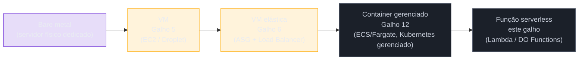
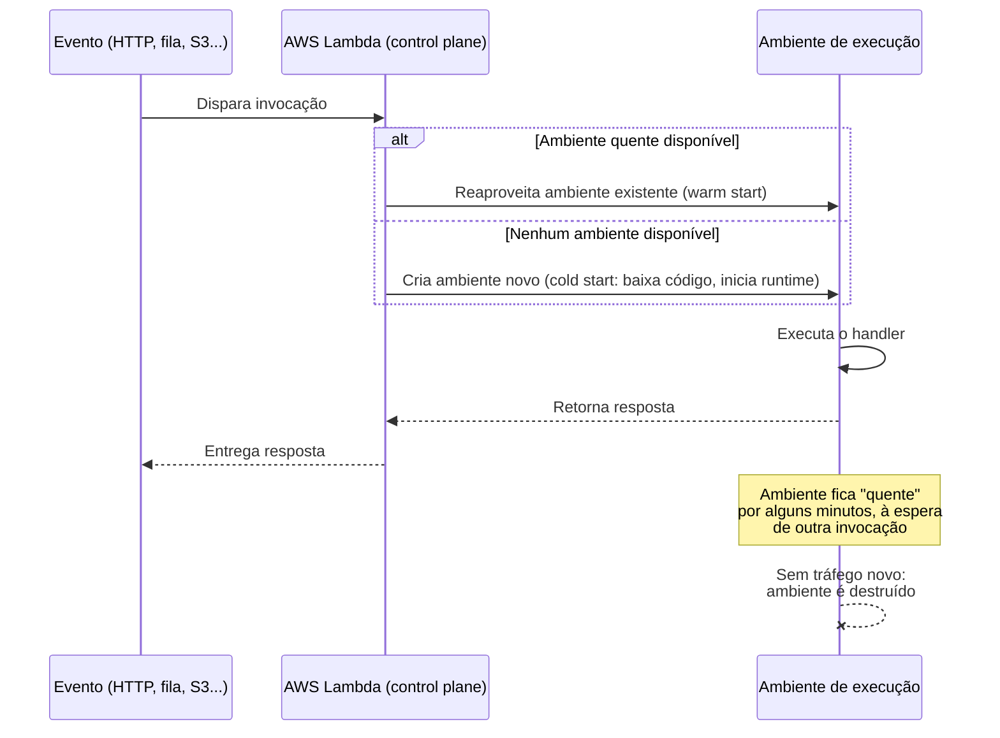

# O que é serverless, de verdade

> [!abstract] TL;DR
> O Bloco 2 desta trilha assumiu, do início ao fim, que **você** provisiona a instância, escolhe o tamanho, configura o Auto Scaling Group, aplica o patch, decide quando ela morre. Serverless quebra essa premissa: você entrega só o código, e o provedor decide onde, quando e em que máquina ele roda — nascendo e morrendo por invocação, sem que ninguém precise dimensionar nada com antecedência. O nome é enganoso: existem servidores por trás de toda função serverless, você só não os vê, não os escolhe e não paga por eles enquanto estão ociosos. **FaaS** (Function as a Service) — como o AWS Lambda — é a encarnação mais pura dessa ideia: a unidade de deploy vira uma função que reage a um evento, não mais uma máquina que fica de pé esperando tráfego. Mas serverless não é grátis, não elimina o cold start, e não serve para toda carga de trabalho — este galho existe justamente para separar o que serverless resolve bem do que ele finge resolver.

## O problema: e se você não gerenciasse nem o servidor?

Volte ao Galho 6, no fim do Bloco 2: um Auto Scaling Group decide sozinho quantas instâncias EC2 (ou Droplets) sobem, baseado numa política de escala que você configurou, atrás de um load balancer que você também configurou. É um salto real em relação a cuidar de uma VM à mão — mas repare no que continua sendo seu: você escolheu o tipo de instância, definiu o mínimo e o máximo de réplicas, decidiu a métrica de gatilho (CPU, requisições por alvo), e paga por cada instância que está de pé, mesmo nos minutos em que nenhum request chega.

Agora imagine uma função pequena — validar um CPF, redimensionar uma imagem, processar uma linha de um arquivo CSV — que roda algumas centenas de vezes por dia, em rajadas imprevisíveis, levando 200 milissegundos cada vez. Manter uma instância (ou um grupo delas) de pé o dia inteiro só para atender essas rajadas é como alugar um carro 24 horas por dia para usá-lo dez minutos. E se, em vez de alugar o carro, você pudesse simplesmente pedir uma carona toda vez que precisasse ir a algum lugar — pagando só pelo trajeto, sem se preocupar com estacionamento, manutenção ou seguro do carro entre uma corrida e outra?

Essa é a pergunta que o **serverless** responde. Em vez de "quantas máquinas eu preciso manter de pé", a pergunta vira "que código eu quero que rode quando este evento acontecer" — e o provedor cuida de tudo entre a pergunta e a resposta: onde rodar, em que máquina, quantas cópias simultâneas, e como cobrar só pelo tempo de execução real.

> [!question]- Mas "serverless" não quer dizer "sem servidor"? Como o código roda em lugar nenhum?
> O nome é, admitidamente, uma escolha de marketing infeliz — e vale desarmar essa confusão logo no início, porque ela trava muita gente. Existem servidores físicos por trás de toda função Lambda ou de todo DigitalOcean Function; alguém, em algum datacenter, está rodando um processo real num Linux real. O que muda é *quem enxerga* esse servidor: em uma VM (Galho 5) ou num grupo elástico (Galho 6), você escolhe o tamanho da máquina, decide o sistema operacional, aplica patches. No serverless, o servidor existe, mas fica inteiramente do lado do provedor — invisível, intercambiável, provisionado e desprovisionado sem que você jamais precise pensar nele como uma entidade individual. "Serverless" quer dizer *server-invisible-to-you*, não *server-does-not-exist*.

## O mecanismo: o que "serverless" de fato significa

Vale nomear com precisão os quatro elementos que, juntos, definem o modelo — porque "serverless" virou um termo de marketing usado de forma solta, e a definição técnica é mais estreita do que a palavra sugere:

- **Sem servidor para provisionar, aplicar patch ou escalar.** A documentação da AWS descreve o Lambda como um serviço que permite "run code without provisioning or managing servers" — o provedor assume manutenção de servidor, provisionamento de capacidade, escalonamento e patching, "so you can focus on your application logic". Você nunca escolhe um tipo de instância, nunca decide uma AMI, nunca faz SSH em nada.
- **Execução sob demanda, orientada a evento.** O código só roda quando algo o dispara — uma requisição HTTP, uma mensagem numa fila, um arquivo que chegou num bucket, um evento agendado. Fora disso, não existe processo rodando, não existe CPU alocada, não existe nada "ligado" esperando tráfego.
- **Pay-per-use real, não pay-per-uptime.** Você paga pelo que a função efetivamente consumiu — tempo de execução e memória alocada — e nada pelos períodos ociosos entre uma invocação e outra. Contraste com uma instância EC2 num Auto Scaling Group: mesmo no mínimo de réplicas, você paga por hora de instância de pé, contribua ela ou não com tráfego real naquele minuto.
- **Escala automática, do zero ao pico, sem configuração prévia de capacidade.** Não existe "grupo mínimo de 2, máximo de 10" para configurar. Se zero requisições chegam, zero execuções acontecem (e zero é cobrado, além do free tier). Se mil requisições chegam ao mesmo tempo, o provedor sobe mil execuções concorrentes (até um limite de conta) sem que ninguém precise ter previsto esse pico com antecedência.

**Serverless em uma frase:** você entrega código que reage a eventos, o provedor decide onde e como rodá-lo, e a fatura acompanha exatamente o uso — nada de servidor visível, nada de capacidade reservada, nada de custo parado.

> [!tip] Assista: AWS Lambda explicado: O que é e como funciona
> **Canal:** AWS Developers LATAM | **Duração:** ~10min | **Idioma:** PT-BR
>
> Um resumo direto ao ponto dos quatro elementos que definem serverless — sem servidor pra gerenciar, execução orientada a evento, pague só pelo uso — com exemplos de código lado a lado pra fixar a diferença de mentalidade. Trecho de destaque [00:40]: *"preocupar com servidores é a base do... infraestrutura e nós podemos focar no [código]"*
>
> 🎬 [Assistir no YouTube](https://www.youtube.com/watch?v=n31cF3iFCUs)

### FaaS é a forma mais pura de serverless — mas não é a única

É comum usar "serverless" e "FaaS" como sinônimos, mas o primeiro é o guarda-chuva e o segundo é uma categoria dentro dele. **Function as a Service (FaaS)** — AWS Lambda, DigitalOcean Functions — é a encarnação mais literal da ideia: a unidade de deploy é uma **função**, um bloco de código com um handler, que o provedor invoca em resposta a um evento e desliga logo depois. Mas o rótulo "serverless" também cobre categorias vizinhas que não são FaaS:

- **BaaS (Backend as a Service)** — bancos e serviços gerenciados que você consome via API sem operar servidor algum por trás: um Amazon S3, um Auth0, um Firebase Authentication.
- **Bancos de dados serverless** — Aurora Serverless v2, DynamoDB em modo on-demand: a capacidade escala sozinha com a carga, sem você pré-provisionar unidades de capacidade fixas, e a cobrança segue o uso (já visto de relance no Galho 9, sob outra lente).
- **Containers serverless** — AWS Fargate, Cloud Run: rodam um container inteiro (não uma função isolada) sem que você gerencie o cluster ou as instâncias por baixo — tema do próximo galho deste bloco.

Este galho foca especificamente em **FaaS**, com o AWS Lambda como estudo de caso principal — mas vale já ter o mapa maior: "serverless" é o modelo operacional, "FaaS" é uma das formas que ele assume.

## O espectro de compute: de bare metal a função

O jeito mais direto de situar serverless é olhar para trás, para tudo que este domínio já cobriu, como um espectro contínuo — cada degrau abrindo mão de mais controle em troca de menos trabalho operacional:



Em cada passo à direita, uma fatia do trabalho operacional que era sua vira trabalho do provedor:

| Degrau | O que você controla | O que você gerencia operacionalmente | Unidade de deploy |
|---|---|---|---|
| Bare metal | Tudo, até o hardware | SO, patch, rede, capacidade, hardware | Servidor físico |
| VM ([[03-Dominios/Tecnologia/Cloud/05 - Compute I — máquinas virtuais/index\|Compute I]]) | SO, runtime, processo | SO, patch, dimensionamento, ciclo de vida da instância | Instância |
| VM elástica (Galho 6) | SO, runtime, política de escala | Patch do SO, política de escala (não mais a decisão minuto a minuto) | Grupo de instâncias |
| Container gerenciado (Galho 12) | Imagem, runtime empacotado | Nada de SO; ainda decide CPU/memória do container | Container |
| Função serverless (este galho) | Só o código do handler | Nada de infraestrutura; só a lógica de negócio | Função + evento |

O eixo de fundo é sempre o mesmo trade-off do Well-Architected Framework (Galho 3): menos controle granular em troca de menos peso operacional. Uma função Lambda não deixa você escolher o kernel, não deixa você instalar um agente customizado no sistema operacional, não deixa você fazer SSH em nada — porque, do lado do provedor, não existe mais "a sua máquina" para acessar. Em troca, você nunca mais decide quantas réplicas manter de pé às 3 da manhã.

## O que muda na prática: mesma lógica, dois mundos de deploy

Para tornar isso concreto, veja a mesma lógica — somar dois números recebidos por uma requisição HTTP — em dois mundos: rodando numa VM (o que o Bloco 2 inteiro ensinou) e rodando como função serverless.

**Numa VM (o mundo do Bloco 2):** você precisa de um processo de servidor HTTP de pé o tempo todo, escutando uma porta, mesmo que ninguém bata na porta por horas:

```python
# app.py — precisa ficar rodando 24/7 numa instância EC2/Droplet
from http.server import HTTPServer, BaseHTTPRequestHandler
import json

class Handler(BaseHTTPRequestHandler):
    def do_POST(self):
        length = int(self.headers['Content-Length'])
        body = json.loads(self.rfile.read(length))
        resultado = body['a'] + body['b']
        self.send_response(200)
        self.end_headers()
        self.wfile.write(json.dumps({"soma": resultado}).encode())

HTTPServer(('0.0.0.0', 8080), Handler).serve_forever()
```

Isso exige: uma instância de pé, um processo supervisionado (systemd, ou algo que reinicie se cair), uma porta aberta no security group, e uma fatura que corre mesmo às 3 da manhã de uma terça-feira sem tráfego nenhum.

**Como função Lambda (o mundo deste galho):** não existe processo de pé, não existe porta escutando, não existe "servidor" para o seu código pensar em termos de ciclo de vida — só uma função que a AWS invoca quando um evento chega:

```python
# lambda_function.py — só existe "rodando" durante a invocação
def lambda_handler(event, context):
    resultado = event['a'] + event['b']
    return {
        "statusCode": 200,
        "body": {"soma": resultado}
    }
```

```bash
# Deploy: empacota e sobe a função — sem provisionar nada antes
$ zip function.zip lambda_function.py
$ aws lambda create-function \
    --function-name soma-simples \
    --runtime python3.13 \
    --handler lambda_function.lambda_handler \
    --role arn:aws:iam::123456789012:role/lambda-execucao-basica \
    --zip-file fileb://function.zip
```

```bash
# Invocação manual, só para testar — em produção, um evento dispara isso
$ aws lambda invoke \
    --function-name soma-simples \
    --payload '{"a": 3, "b": 4}' \
    --cli-binary-format raw-in-base64-out \
    resposta.json
$ cat resposta.json
{"statusCode": 200, "body": {"soma": 7}}
```

**Na DigitalOcean, o equivalente conceitual** usa o `doctl` para publicar um projeto de funções — o mesmo padrão de "descreva o código, receba um endpoint invocável", sem nunca provisionar uma máquina:

```bash
$ doctl serverless deploy ./meu-projeto-functions
$ doctl serverless functions invoke soma/simples --param a:3 --param b:4
```

A diferença central não está no código — a lógica de somar dois números é idêntica — está em **quem decide que o processo existe naquele instante**. Na VM, o processo existe porque alguém o colocou lá e ele nunca sai. Na função, o processo existe só durante a invocação, e nem esse "processo" é seu para gerenciar.

Vale visualizar esse ciclo de vida, porque é ele que explica tanto a economia do pay-per-use quanto o cold start citado mais adiante: um evento chega, a Lambda decide se precisa criar um ambiente de execução novo ou reaproveitar um que já está quente, roda o handler, devolve a resposta, e — depois de um período sem tráfego — destrói o ambiente por completo, sem deixar processo algum de pé:



Note o detalhe que faz toda a diferença de custo em relação à VM: entre a última linha do diagrama (ambiente destruído) e a próxima invocação, não existe absolutamente nada rodando — nenhuma CPU alocada, nenhuma cobrança correndo. Numa VM, mesmo ociosa, o relógio de cobrança nunca para.

## Responsabilidade: o que você entrega, o que o provedor assume

Este eixo já apareceu duas vezes nesta trilha — no modelo de responsabilidade compartilhada do Galho 2 e na tabela de bancos gerenciados do Galho 9. Serverless empurra a linha divisória ainda mais para o lado do provedor, comparado a qualquer coisa vista até aqui no Bloco 2:

| Responsabilidade | VM crua (Galho 5) | VM elástica (Galho 6) | Função serverless (Lambda) |
|---|---|---|---|
| Provisionar capacidade | Você | Você (política de escala) | Provedor (automático, por invocação) |
| Patch do sistema operacional | Você | Você | Provedor (não existe SO visível a você) |
| Dimensionar CPU/memória | Você (tipo de instância) | Você (tipo de instância) | Você (só um número: MB de memória) |
| Escalar sob carga | Manual/scripts | Auto Scaling Group | Automático, sem configuração de política |
| Pagar por ociosidade | Sim, 24/7 | Sim, no mínimo do grupo | Não — só tempo de execução real |
| Código da aplicação | Você | Você | Você |
| Runtime/dependências do processo | Você instala | Você instala | Você empacota; provedor executa |

A linha que não muda, em nenhum desses modelos, é a última: ninguém além de você escreve a lógica de negócio. Isso vale a pena grifar cedo, porque é fácil ler "serverless" como "o provedor cuida de tudo" — e não é isso que a tabela mostra.

## Armadilhas comuns

> [!warning] Achar que "serverless" significa "sem servidor" de verdade
> Já desarmado acima, mas vale repetir como armadilha porque é a confusão mais comum de quem chega ao termo pela primeira vez: existem servidores reais, gerenciados pelo provedor, rodando seu código dentro de máquinas virtuais leves (a AWS usa uma tecnologia de virtualização chamada Firecracker para isolar execuções de Lambda). "Serverless" descreve a experiência de quem escreve o código, não a ausência física de hardware.

> [!warning] Achar que serverless é sempre mais barato
> Pay-per-use é ótimo para carga baixa, imprevisível ou em rajadas — é péssimo para carga alta e constante. Uma função invocada continuamente, 24 horas por dia, a plena capacidade, tende a custar mais em Lambda do que a mesma carga rodando numa instância reservada dimensionada corretamente (Galho 5, nota 05). Serverless economiza dinheiro evitando ociosidade — se não há ociosidade para evitar, a vantagem de custo desaparece. Este galho (nota 06, capstone) volta a esse ponto com números.

> [!warning] Achar que serverless elimina o cold start
> A primeira invocação depois de um período sem tráfego precisa inicializar um ambiente de execução do zero — carregar o runtime, inicializar dependências — antes de rodar seu código pela primeira vez. Esse atraso, o **cold start**, é real e mensurável; ele não aparece nas invocações seguintes ("warm"), mas volta a aparecer depois de um período ocioso. Uma API que precisa responder em poucos milissegundos, sempre, para todo usuário, tem uma conversa séria pela frente com esse detalhe — que este galho ainda não resolveu; ele só está sendo nomeado aqui para não ser descoberto tarde demais.

> [!warning] Achar que serverless serve para qualquer carga de trabalho
> Processos de longa duração (Lambda tem um teto de 15 minutos por invocação), estado que precisa persistir na memória entre requisições, ou cargas que exigem controle fino de hardware (GPU dedicada, kernel customizado) não se encaixam bem no modelo FaaS clássico. O galho 06 deste bloco (capstone) mapeia com mais precisão onde serverless vence e onde perde para container gerenciado ou VM.

## Lente dupla: AWS Lambda ↔ DigitalOcean Functions

**AWS Lambda** é o serviço FaaS mais maduro e mais usado do mercado — lançado em 2014, hoje com mais de 200 integrações de evento nativas (S3, SQS, EventBridge, API Gateway, DynamoDB Streams e outras), runtimes gerenciados para várias linguagens (Python, Node.js, Java, Go, .NET, Ruby) e suporte a runtimes customizados via container image.

**DigitalOcean Functions** é a resposta da DO ao mesmo problema, com escopo deliberadamente mais enxuto: construído sobre tecnologia adquirida da Nimbella combinada ao projeto open source **Apache OpenWhisk**, lançado em maio de 2022. Suporta Node.js, Python, Go, PHP e algumas linguagens adicionais via runtime customizado; o modelo de invocação e o conceito de "namespace" (agrupamento de funções) vêm diretamente da herança OpenWhisk.

> [!info] Limites atuais do DigitalOcean Functions (verificado 2026-07-24)
> Timeout máximo de 15 minutos por invocação (idêntico ao teto do Lambda). Memória entre 128 MB e 1 GB, padrão 256 MB. Payload de entrada e saída limitado a 1 MB cada. Até 120 execuções concorrentes e 600 invocações por minuto por namespace. Cobrança em GiB-segundos: 90.000 GiB-segundos (25 GiB-horas) gratuitos por mês por team, e US$ 0,0000185 por GiB-segundo adicional. Estes números mudam com frequência — conferir a documentação oficial antes de dimensionar uma arquitetura real.

> [!info] Free tier e cobrança do AWS Lambda (verificado 2026-07-24)
> Free tier mensal de 1 milhão de requisições e 400.000 GB-segundos de computação. Depois disso, cobrança por requisição (a partir de US$ 0,20 por milhão) mais duração medida em GB-segundos (a partir de US$ 0,0000166667 por GB-segundo, arquitetura x86, us-east-1) — valores variam por região e por escolher arquitetura ARM (Graviton), que costuma sair mais barata.

A diferença de fundo entre os dois não é o conceito — ambos entregam "código sem servidor visível, cobrado pelo uso" — é o **ecossistema em volta**: Lambda se integra nativamente a centenas de serviços AWS e tem o catálogo mais rico de gatilhos e ferramentas (SAM, observability nativa via CloudWatch/X-Ray); DO Functions é mais simples de operar, mais barato para cargas pequenas, mas com um catálogo de integrações bem menor e uma comunidade de terceiros menos extensa.

## Tabela de tradução — os quatro grandes provedores

| Conceito | AWS | Azure | GCP | DigitalOcean |
|---|---|---|---|---|
| FaaS principal | Lambda | Azure Functions | Cloud Run functions (ex-Cloud Functions) | Functions |
| Base tecnológica | Firecracker (microVM própria) | Proprietária | Baseado em Cloud Run/Knative | Apache OpenWhisk + Nimbella |
| Unidade de deploy | Função (handler) | Função | Função | Função (dentro de um "package"/namespace) |
| Timeout máximo típico | 15 min | 10 min (Consumption) / ilimitado (Premium) | 60 min (2ª geração) | 15 min |
| Modelo de cobrança | Requisições + GB-segundos | Execuções + GB-segundos | Invocações + GB-segundos | GiB-segundos |

> [!info] Caducidade
> Os timeouts e modelos de cobrança da Azure e do GCP nesta linha foram citados de memória geral do mercado, não verificados via WebFetch nesta pesquisa — conferir a documentação oficial de cada provedor antes de tratá-los como definitivos. As linhas AWS e DigitalOcean foram verificadas na documentação oficial em 2026-07-24.

## O que vem a seguir

Este mapa deu o modelo mental: o que "sem servidor" realmente quer dizer, onde FaaS se encaixa no espectro de compute, e o que muda de mãos entre você e o provedor. A próxima nota abre o Lambda por dentro — a anatomia de uma função de verdade: handler, evento, contexto de execução, e como esse código roda dentro de um ambiente que a AWS cria e destrói sem que você o veja.

- [[03-Dominios/Tecnologia/Cloud/05 - Compute I — máquinas virtuais/index|Compute I — máquinas virtuais]] — o primitivo que este galho contrasta a cada passo: o que você provisiona à mão versus o que o provedor assume sozinho.

## Fontes

- [AWS Lambda — What is AWS Lambda?](https://docs.aws.amazon.com/lambda/latest/dg/welcome.html) — definição do serviço, modelo "run code without provisioning or managing servers", comparação Lambda Functions vs Lambda MicroVMs, pay-per-use billing; acessado em 2026-07-24.
- [AWS Lambda Pricing](https://aws.amazon.com/lambda/pricing/) — free tier de 1M requisições + 400.000 GB-segundos/mês, preço por requisição e por GB-segundo (x86, us-east-1); acessado em 2026-07-24.
- [DigitalOcean Functions — Product Overview](https://docs.digitalocean.com/products/functions/) — descrição do serviço, base em Nimbella + Apache OpenWhisk, linguagens suportadas; acessado em 2026-07-24.
- [DigitalOcean Functions — Limits and known issues](https://docs.digitalocean.com/products/functions/details/limits/) — timeout de 15 minutos, memória 128 MB–1 GB, payload de 1 MB, concorrência de 120 execuções e 600 invocações/minuto por namespace; acessado em 2026-07-24.
- [DigitalOcean Functions — Pricing](https://docs.digitalocean.com/products/functions/details/pricing/) — modelo de cobrança em GiB-segundos, free tier de 90.000 GiB-segundos/mês, US$ 0,0000185 por GiB-segundo adicional; acessado em 2026-07-24.
